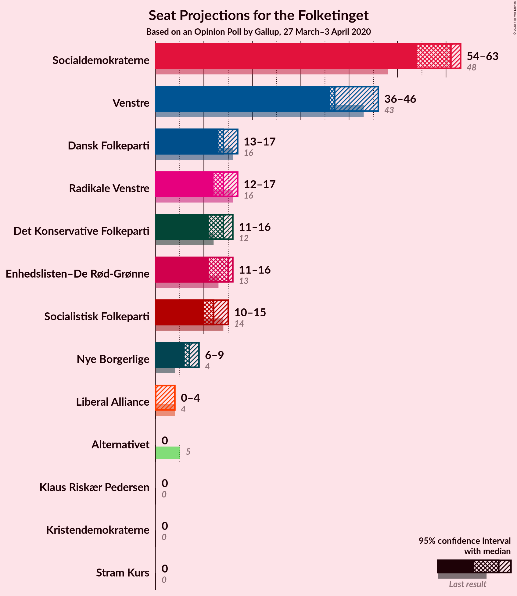
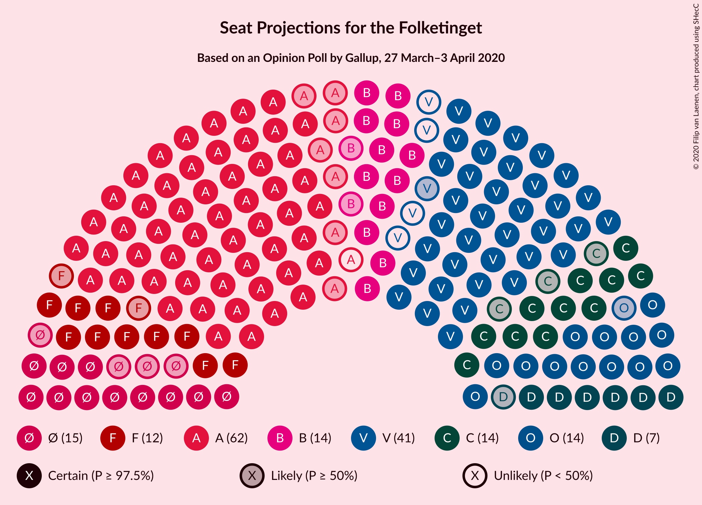
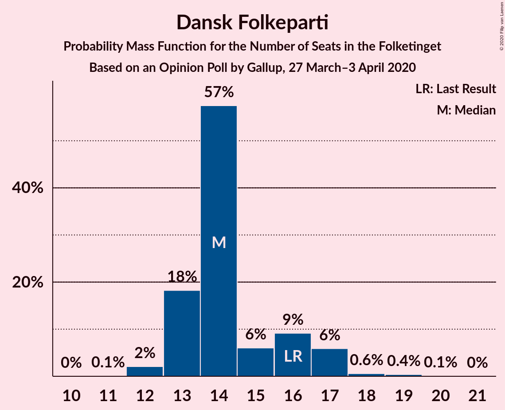
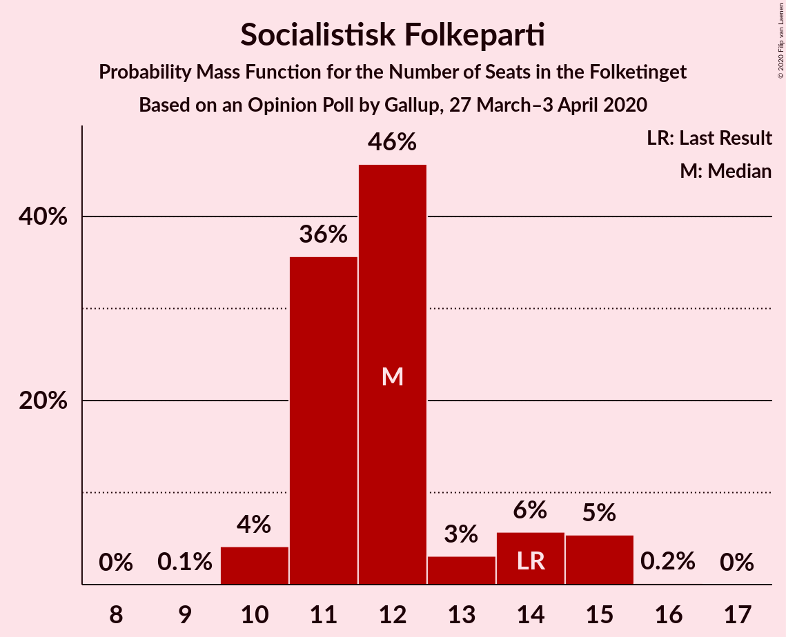
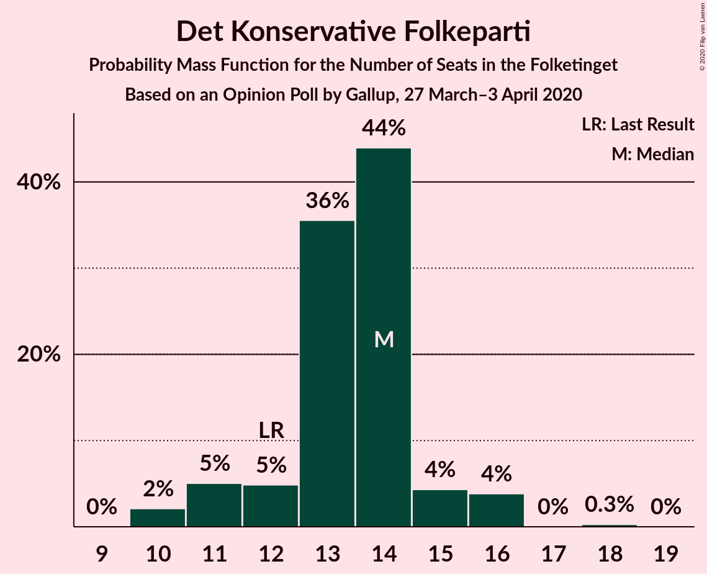
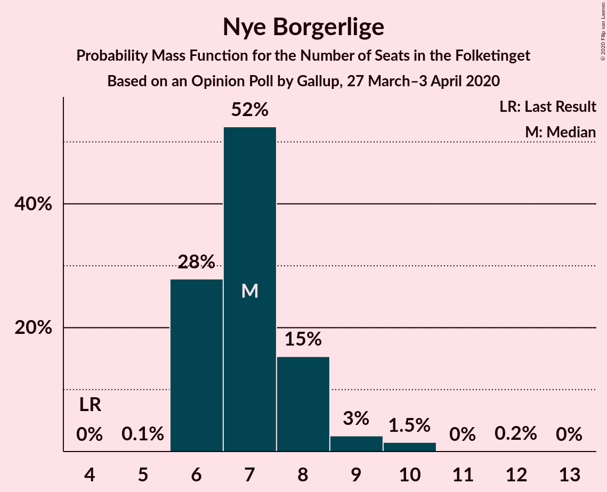
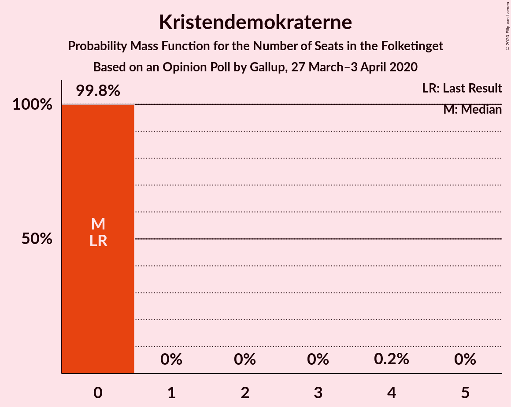
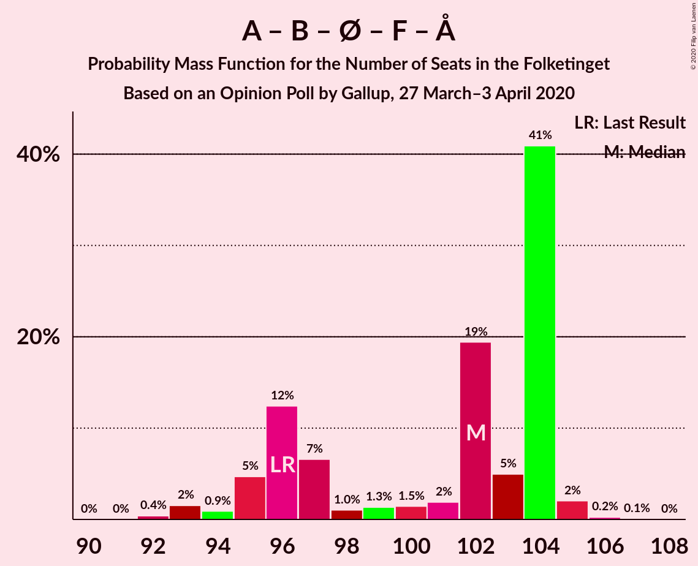
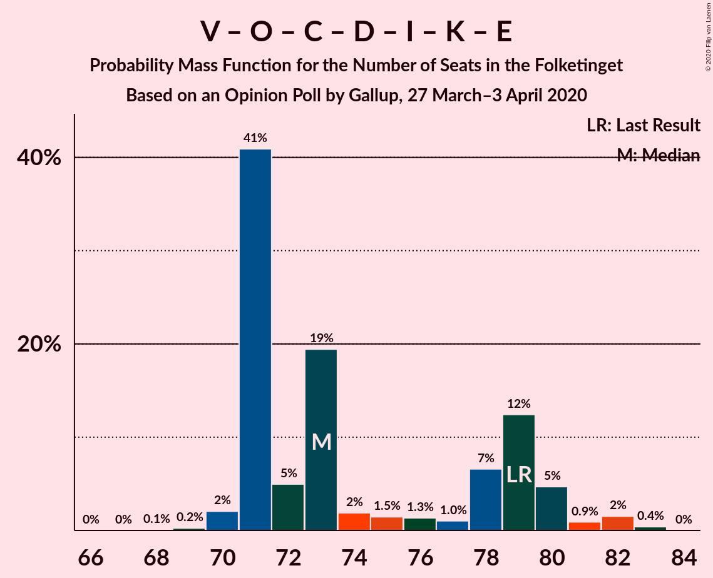

# Opinion Poll by Gallup, 27 March–3 April 2020

<a href="#voting-intentions">Voting Intentions</a> | <a href="#seats">Seats</a> | <a href="#coalitions">Coalitions</a> | <a href="#technical-information">Technical Information</a>

## Voting Intentions

### Confidence Intervals

| Party | Last Result | Poll Result | 80% Confidence Interval | 90% Confidence Interval | 95% Confidence Interval | 99% Confidence Interval |
|:-----:|:-----------:|:-----------:|:-----------------------:|:-----------------------:|:-----------------------:|:-----------------------:|
| Socialdemokraterne | 25.9% | 31.9% | 30.4–33.5% |30.0–33.9% |29.6–34.3% |28.9–35.1% |
| Venstre | 23.4% | 21.9% | 20.5–23.3% |20.2–23.7% |19.8–24.0% |19.2–24.7% |
| Dansk Folkeparti | 8.7% | 8.1% | 7.3–9.1% |7.0–9.3% |6.8–9.6% |6.4–10.1% |
| Radikale Venstre | 8.6% | 8.0% | 7.1–8.9% |6.9–9.2% |6.7–9.4% |6.3–9.9% |
| Enhedslisten–De Rød-Grønne | 6.9% | 7.5% | 6.7–8.4% |6.5–8.7% |6.3–8.9% |5.9–9.4% |
| Socialistisk Folkeparti | 7.7% | 6.9% | 6.1–7.8% |5.9–8.1% |5.7–8.3% |5.4–8.8% |
| Det Konservative Folkeparti | 6.6% | 6.9% | 6.1–7.8% |5.9–8.1% |5.7–8.3% |5.4–8.8% |
| Nye Borgerlige | 2.4% | 4.1% | 3.5–4.8% |3.3–5.0% |3.2–5.2% |2.9–5.6% |
| Liberal Alliance | 2.3% | 1.5% | 1.2–2.0% |1.1–2.1% |1.0–2.3% |0.9–2.5% |
| Kristendemokraterne | 1.7% | 1.2% | 0.9–1.6% |0.8–1.8% |0.7–1.9% |0.6–2.1% |
| Stram Kurs | 1.8% | 0.9% | 0.7–1.3% |0.6–1.4% |0.5–1.6% |0.4–1.8% |
| Alternativet | 3.0% | 0.8% | 0.6–1.2% |0.5–1.3% |0.4–1.4% |0.4–1.6% |
| Klaus Riskær Pedersen | 0.8% | 0.3% | 0.2–0.6% |0.2–0.7% |0.1–0.8% |0.1–0.9% |

*Note:* The poll result column reflects the actual value used in the calculations. Published results may vary slightly, and in addition be rounded to fewer digits.

## Seats

### Confidence Intervals

| Party | Last Result | Median | 80% Confidence Interval | 90% Confidence Interval | 95% Confidence Interval | 99% Confidence Interval |
|:-----:|:-----------:|:------:|:-----------------------:|:-----------------------:|:-----------------------:|:-----------------------:|
| <a href="#socialdemokraterne">Socialdemokraterne</a> | 48 | 59 | 56–59 |55–60 |54–62 |53–62 |
| <a href="#venstre">Venstre</a> | 43 | 38 | 38–41 |38–41 |35–42 |35–48 |
| <a href="#dansk-folkeparti">Dansk Folkeparti</a> | 16 | 17 | 15–17 |14–17 |12–19 |12–19 |
| <a href="#radikale-venstre">Radikale Venstre</a> | 16 | 14 | 14–15 |13–16 |13–17 |10–17 |
| <a href="#enhedslisten–de-rød-grønne">Enhedslisten–De Rød-Grønne</a> | 13 | 13 | 13–14 |12–15 |12–17 |12–17 |
| <a href="#socialistisk-folkeparti">Socialistisk Folkeparti</a> | 14 | 11 | 10–13 |10–15 |10–15 |10–16 |
| <a href="#det-konservative-folkeparti">Det Konservative Folkeparti</a> | 12 | 15 | 12–15 |12–15 |10–15 |10–15 |
| <a href="#nye-borgerlige">Nye Borgerlige</a> | 4 | 8 | 7–10 |7–10 |7–12 |6–12 |
| <a href="#liberal-alliance">Liberal Alliance</a> | 4 | 0 | 0 |0 |0–4 |0–4 |
| <a href="#kristendemokraterne">Kristendemokraterne</a> | 0 | 0 | 0 |0 |0 |0–4 |
| <a href="#stram-kurs">Stram Kurs</a> | 0 | 0 | 0 |0 |0 |0 |
| <a href="#alternativet">Alternativet</a> | 5 | 0 | 0 |0 |0 |0 |
| <a href="#klaus-riskær-pedersen">Klaus Riskær Pedersen</a> | 0 | 0 | 0 |0 |0 |0 |

### Socialdemokraterne

*For a full overview of the results for this party, see the [Socialdemokraterne](party-socialdemokraterne.html) page.*

| Number of Seats | Probability | Accumulated | Special Marks |
|:---------------:|:-----------:|:-----------:|:-------------:|
| 48 | 0% | 100% | Last Result |
| 49 | 0% | 100% |  |
| 50 | 0% | 100% |  |
| 51 | 0% | 100% |  |
| 52 | 0.3% | 100% |  |
| 53 | 0.3% | 99.7% |  |
| 54 | 4% | 99.4% |  |
| 55 | 3% | 96% |  |
| 56 | 4% | 93% |  |
| 57 | 2% | 89% |  |
| 58 | 9% | 87% |  |
| 59 | 72% | 78% | Median |
| 60 | 2% | 6% |  |
| 61 | 0.1% | 4% |  |
| 62 | 3% | 4% |  |
| 63 | 0.1% | 0.2% |  |
| 64 | 0% | 0% |  |

### Venstre

*For a full overview of the results for this party, see the [Venstre](party-venstre.html) page.*

| Number of Seats | Probability | Accumulated | Special Marks |
|:---------------:|:-----------:|:-----------:|:-------------:|
| 32 | 0.1% | 100% |  |
| 33 | 0% | 99.9% |  |
| 34 | 0.1% | 99.9% |  |
| 35 | 3% | 99.8% |  |
| 36 | 0% | 96% |  |
| 37 | 0.2% | 96% |  |
| 38 | 78% | 96% | Median |
| 39 | 3% | 18% |  |
| 40 | 2% | 15% |  |
| 41 | 10% | 13% |  |
| 42 | 1.3% | 3% |  |
| 43 | 0.4% | 2% | Last Result |
| 44 | 0.5% | 1.4% |  |
| 45 | 0.3% | 0.9% |  |
| 46 | 0.1% | 0.6% |  |
| 47 | 0% | 0.6% |  |
| 48 | 0.6% | 0.6% |  |
| 49 | 0% | 0% |  |

### Dansk Folkeparti

*For a full overview of the results for this party, see the [Dansk Folkeparti](party-danskfolkeparti.html) page.*

| Number of Seats | Probability | Accumulated | Special Marks |
|:---------------:|:-----------:|:-----------:|:-------------:|
| 11 | 0.1% | 100% |  |
| 12 | 3% | 99.9% |  |
| 13 | 0.3% | 97% |  |
| 14 | 3% | 97% |  |
| 15 | 13% | 94% |  |
| 16 | 8% | 81% | Last Result |
| 17 | 69% | 73% | Median |
| 18 | 0.5% | 4% |  |
| 19 | 4% | 4% |  |
| 20 | 0% | 0% |  |

### Radikale Venstre

*For a full overview of the results for this party, see the [Radikale Venstre](party-radikalevenstre.html) page.*

| Number of Seats | Probability | Accumulated | Special Marks |
|:---------------:|:-----------:|:-----------:|:-------------:|
| 10 | 1.0% | 100% |  |
| 11 | 0.1% | 99.0% |  |
| 12 | 0.9% | 98.9% |  |
| 13 | 4% | 98% |  |
| 14 | 71% | 94% | Median |
| 15 | 16% | 23% |  |
| 16 | 3% | 7% | Last Result |
| 17 | 4% | 4% |  |
| 18 | 0.1% | 0.2% |  |
| 19 | 0% | 0% |  |

### Enhedslisten–De Rød-Grønne

*For a full overview of the results for this party, see the [Enhedslisten–De Rød-Grønne](party-enhedslisten–derød-grønne.html) page.*

| Number of Seats | Probability | Accumulated | Special Marks |
|:---------------:|:-----------:|:-----------:|:-------------:|
| 11 | 0.4% | 100% |  |
| 12 | 5% | 99.6% |  |
| 13 | 73% | 95% | Last Result, Median |
| 14 | 15% | 22% |  |
| 15 | 3% | 7% |  |
| 16 | 0.7% | 4% |  |
| 17 | 4% | 4% |  |
| 18 | 0% | 0% |  |

### Socialistisk Folkeparti

*For a full overview of the results for this party, see the [Socialistisk Folkeparti](party-socialistiskfolkeparti.html) page.*

| Number of Seats | Probability | Accumulated | Special Marks |
|:---------------:|:-----------:|:-----------:|:-------------:|
| 9 | 0.2% | 100% |  |
| 10 | 12% | 99.8% |  |
| 11 | 71% | 88% | Median |
| 12 | 6% | 17% |  |
| 13 | 3% | 10% |  |
| 14 | 1.3% | 8% | Last Result |
| 15 | 4% | 6% |  |
| 16 | 2% | 2% |  |
| 17 | 0.1% | 0.1% |  |
| 18 | 0% | 0% |  |

### Det Konservative Folkeparti

*For a full overview of the results for this party, see the [Det Konservative Folkeparti](party-detkonservativefolkeparti.html) page.*

| Number of Seats | Probability | Accumulated | Special Marks |
|:---------------:|:-----------:|:-----------:|:-------------:|
| 8 | 0.2% | 100% |  |
| 9 | 0.1% | 99.8% |  |
| 10 | 2% | 99.7% |  |
| 11 | 0.9% | 97% |  |
| 12 | 12% | 96% | Last Result |
| 13 | 11% | 85% |  |
| 14 | 4% | 74% |  |
| 15 | 69% | 70% | Median |
| 16 | 0.1% | 0.3% |  |
| 17 | 0% | 0.2% |  |
| 18 | 0.2% | 0.2% |  |
| 19 | 0% | 0% |  |

### Nye Borgerlige

*For a full overview of the results for this party, see the [Nye Borgerlige](party-nyeborgerlige.html) page.*

| Number of Seats | Probability | Accumulated | Special Marks |
|:---------------:|:-----------:|:-----------:|:-------------:|
| 4 | 0.2% | 100% | Last Result |
| 5 | 0.3% | 99.8% |  |
| 6 | 1.1% | 99.5% |  |
| 7 | 9% | 98% |  |
| 8 | 74% | 89% | Median |
| 9 | 4% | 15% |  |
| 10 | 8% | 10% |  |
| 11 | 0% | 3% |  |
| 12 | 3% | 3% |  |
| 13 | 0% | 0% |  |

### Liberal Alliance

*For a full overview of the results for this party, see the [Liberal Alliance](party-liberalalliance.html) page.*

| Number of Seats | Probability | Accumulated | Special Marks |
|:---------------:|:-----------:|:-----------:|:-------------:|
| 0 | 96% | 100% | Median |
| 1 | 0% | 4% |  |
| 2 | 0% | 4% |  |
| 3 | 0% | 4% |  |
| 4 | 4% | 4% | Last Result |
| 5 | 0.1% | 0.2% |  |
| 6 | 0% | 0% |  |

### Kristendemokraterne

*For a full overview of the results for this party, see the [Kristendemokraterne](party-kristendemokraterne.html) page.*

| Number of Seats | Probability | Accumulated | Special Marks |
|:---------------:|:-----------:|:-----------:|:-------------:|
| 0 | 98% | 100% | Last Result, Median |
| 1 | 0% | 2% |  |
| 2 | 0% | 2% |  |
| 3 | 0% | 2% |  |
| 4 | 2% | 2% |  |
| 5 | 0% | 0% |  |

### Stram Kurs

*For a full overview of the results for this party, see the [Stram Kurs](party-stramkurs.html) page.*

| Number of Seats | Probability | Accumulated | Special Marks |
|:---------------:|:-----------:|:-----------:|:-------------:|
| 0 | 100% | 100% | Last Result, Median |

### Alternativet

*For a full overview of the results for this party, see the [Alternativet](party-alternativet.html) page.*

| Number of Seats | Probability | Accumulated | Special Marks |
|:---------------:|:-----------:|:-----------:|:-------------:|
| 0 | 100% | 100% | Median |
| 1 | 0% | 0% |  |
| 2 | 0% | 0% |  |
| 3 | 0% | 0% |  |
| 4 | 0% | 0% |  |
| 5 | 0% | 0% | Last Result |

### Klaus Riskær Pedersen

*For a full overview of the results for this party, see the [Klaus Riskær Pedersen](party-klausriskærpedersen.html) page.*

| Number of Seats | Probability | Accumulated | Special Marks |
|:---------------:|:-----------:|:-----------:|:-------------:|
| 0 | 100% | 100% | Last Result, Median |

## Coalitions

### Confidence Intervals

| Coalition | Last Result | Median | Majority? | 80% Confidence Interval | 90% Confidence Interval | 95% Confidence Interval | 99% Confidence Interval |
|:---------:|:-----------:|:------:|:---------:|:-----------------------:|:-----------------------:|:-----------------------:|:-----------------------:|
| Socialdemokraterne – Radikale Venstre – Enhedslisten–De Rød-Grønne – Socialistisk Folkeparti – Alternativet | 96 | 97 | 100% | 97–99 | 97–100 | 96–103 | 94–105 |
| Socialdemokraterne – Radikale Venstre – Enhedslisten–De Rød-Grønne – Socialistisk Folkeparti | 91 | 97 | 100% | 97–99 | 97–100 | 96–103 | 94–105 |
| Socialdemokraterne – Enhedslisten–De Rød-Grønne – Socialistisk Folkeparti – Alternativet | 80 | 83 | 3% | 82–85 | 81–86 | 81–90 | 79–90 |
| Socialdemokraterne – Enhedslisten–De Rød-Grønne – Socialistisk Folkeparti | 75 | 83 | 3% | 82–85 | 81–86 | 81–90 | 79–90 |
| Socialdemokraterne – Radikale Venstre – Socialistisk Folkeparti | 78 | 84 | 2% | 83–86 | 81–86 | 81–89 | 78–91 |
| Venstre – Dansk Folkeparti – Det Konservative Folkeparti – Nye Borgerlige – Liberal Alliance – Kristendemokraterne – Stram Kurs – Klaus Riskær Pedersen | 79 | 78 | 0% | 76–78 | 75–78 | 72–79 | 70–81 |
| Venstre – Dansk Folkeparti – Det Konservative Folkeparti – Nye Borgerlige – Liberal Alliance – Kristendemokraterne – Klaus Riskær Pedersen | 79 | 78 | 0% | 76–78 | 75–78 | 72–79 | 70–81 |
| Venstre – Dansk Folkeparti – Det Konservative Folkeparti – Nye Borgerlige – Liberal Alliance – Kristendemokraterne | 79 | 78 | 0% | 76–78 | 75–78 | 72–79 | 70–81 |
| Venstre – Dansk Folkeparti – Det Konservative Folkeparti – Nye Borgerlige – Liberal Alliance – Klaus Riskær Pedersen | 79 | 78 | 0% | 76–78 | 75–78 | 71–79 | 70–81 |
| Venstre – Dansk Folkeparti – Det Konservative Folkeparti – Nye Borgerlige – Liberal Alliance | 79 | 78 | 0% | 76–78 | 75–78 | 71–79 | 70–81 |
| Socialdemokraterne – Radikale Venstre | 64 | 73 | 0% | 71–73 | 71–75 | 70–75 | 68–75 |
| Venstre – Dansk Folkeparti – Det Konservative Folkeparti – Liberal Alliance – Kristendemokraterne | 75 | 70 | 0% | 68–70 | 66–70 | 65–72 | 63–73 |
| Venstre – Dansk Folkeparti – Det Konservative Folkeparti – Liberal Alliance | 75 | 70 | 0% | 67–70 | 66–70 | 64–72 | 63–73 |
| Venstre – Det Konservative Folkeparti – Liberal Alliance | 59 | 53 | 0% | 52–53 | 51–53 | 50–56 | 50–59 |
| Venstre – Det Konservative Folkeparti | 55 | 53 | 0% | 51–53 | 50–53 | 48–56 | 48–58 |
| Venstre | 43 | 38 | 0% | 38–41 | 38–41 | 35–42 | 35–48 |

### Socialdemokraterne – Radikale Venstre – Enhedslisten–De Rød-Grønne – Socialistisk Folkeparti – Alternativet

| Number of Seats | Probability | Accumulated | Special Marks |
|:---------------:|:-----------:|:-----------:|:-------------:|
| 92 | 0.1% | 100% |  |
| 93 | 0.4% | 99.9% |  |
| 94 | 1.2% | 99.5% |  |
| 95 | 0.7% | 98% |  |
| 96 | 2% | 98% | Last Result |
| 97 | 79% | 96% | Median |
| 98 | 4% | 17% |  |
| 99 | 6% | 13% |  |
| 100 | 4% | 7% |  |
| 101 | 0.3% | 3% |  |
| 102 | 0.2% | 3% |  |
| 103 | 0.4% | 3% |  |
| 104 | 0% | 2% |  |
| 105 | 2% | 2% |  |
| 106 | 0% | 0.1% |  |
| 107 | 0.1% | 0.1% |  |
| 108 | 0% | 0% |  |

### Socialdemokraterne – Radikale Venstre – Enhedslisten–De Rød-Grønne – Socialistisk Folkeparti

| Number of Seats | Probability | Accumulated | Special Marks |
|:---------------:|:-----------:|:-----------:|:-------------:|
| 91 | 0% | 100% | Last Result |
| 92 | 0.1% | 100% |  |
| 93 | 0.4% | 99.9% |  |
| 94 | 1.2% | 99.5% |  |
| 95 | 0.7% | 98% |  |
| 96 | 2% | 98% |  |
| 97 | 79% | 96% | Median |
| 98 | 4% | 17% |  |
| 99 | 6% | 13% |  |
| 100 | 4% | 7% |  |
| 101 | 0.3% | 3% |  |
| 102 | 0.2% | 3% |  |
| 103 | 0.4% | 3% |  |
| 104 | 0% | 2% |  |
| 105 | 2% | 2% |  |
| 106 | 0% | 0.1% |  |
| 107 | 0.1% | 0.1% |  |
| 108 | 0% | 0% |  |

### Socialdemokraterne – Enhedslisten–De Rød-Grønne – Socialistisk Folkeparti – Alternativet

| Number of Seats | Probability | Accumulated | Special Marks |
|:---------------:|:-----------:|:-----------:|:-------------:|
| 76 | 0.1% | 100% |  |
| 77 | 0% | 99.9% |  |
| 78 | 0.1% | 99.9% |  |
| 79 | 0.4% | 99.9% |  |
| 80 | 0.1% | 99.4% | Last Result |
| 81 | 6% | 99.4% |  |
| 82 | 9% | 94% |  |
| 83 | 73% | 85% | Median |
| 84 | 1.3% | 12% |  |
| 85 | 4% | 11% |  |
| 86 | 4% | 7% |  |
| 87 | 0.2% | 3% |  |
| 88 | 0.3% | 3% |  |
| 89 | 0.1% | 3% |  |
| 90 | 2% | 3% | Majority |
| 91 | 0% | 0.1% |  |
| 92 | 0% | 0% |  |

### Socialdemokraterne – Enhedslisten–De Rød-Grønne – Socialistisk Folkeparti

| Number of Seats | Probability | Accumulated | Special Marks |
|:---------------:|:-----------:|:-----------:|:-------------:|
| 75 | 0% | 100% | Last Result |
| 76 | 0.1% | 100% |  |
| 77 | 0% | 99.9% |  |
| 78 | 0.1% | 99.9% |  |
| 79 | 0.4% | 99.8% |  |
| 80 | 0.1% | 99.4% |  |
| 81 | 6% | 99.4% |  |
| 82 | 9% | 94% |  |
| 83 | 73% | 85% | Median |
| 84 | 1.3% | 12% |  |
| 85 | 4% | 11% |  |
| 86 | 4% | 7% |  |
| 87 | 0.2% | 3% |  |
| 88 | 0.3% | 3% |  |
| 89 | 0.1% | 3% |  |
| 90 | 2% | 3% | Majority |
| 91 | 0% | 0.1% |  |
| 92 | 0% | 0% |  |

### Socialdemokraterne – Radikale Venstre – Socialistisk Folkeparti

| Number of Seats | Probability | Accumulated | Special Marks |
|:---------------:|:-----------:|:-----------:|:-------------:|
| 77 | 0.4% | 100% |  |
| 78 | 0.3% | 99.6% | Last Result |
| 79 | 0.1% | 99.4% |  |
| 80 | 1.0% | 99.3% |  |
| 81 | 4% | 98% |  |
| 82 | 0.6% | 95% |  |
| 83 | 8% | 94% |  |
| 84 | 72% | 86% | Median |
| 85 | 3% | 14% |  |
| 86 | 7% | 11% |  |
| 87 | 0.6% | 4% |  |
| 88 | 0.3% | 3% |  |
| 89 | 0.2% | 3% |  |
| 90 | 0% | 2% | Majority |
| 91 | 2% | 2% |  |
| 92 | 0.1% | 0.2% |  |
| 93 | 0.1% | 0.1% |  |
| 94 | 0% | 0% |  |

### Venstre – Dansk Folkeparti – Det Konservative Folkeparti – Nye Borgerlige – Liberal Alliance – Kristendemokraterne – Stram Kurs – Klaus Riskær Pedersen

| Number of Seats | Probability | Accumulated | Special Marks |
|:---------------:|:-----------:|:-----------:|:-------------:|
| 68 | 0.1% | 100% |  |
| 69 | 0% | 99.9% |  |
| 70 | 2% | 99.9% |  |
| 71 | 0% | 98% |  |
| 72 | 0.4% | 98% |  |
| 73 | 0.2% | 97% |  |
| 74 | 0.3% | 97% |  |
| 75 | 4% | 97% |  |
| 76 | 6% | 93% |  |
| 77 | 4% | 87% |  |
| 78 | 79% | 83% | Median |
| 79 | 2% | 4% | Last Result |
| 80 | 0.7% | 2% |  |
| 81 | 1.2% | 2% |  |
| 82 | 0.4% | 0.5% |  |
| 83 | 0.1% | 0.1% |  |
| 84 | 0% | 0% |  |

### Venstre – Dansk Folkeparti – Det Konservative Folkeparti – Nye Borgerlige – Liberal Alliance – Kristendemokraterne – Klaus Riskær Pedersen

| Number of Seats | Probability | Accumulated | Special Marks |
|:---------------:|:-----------:|:-----------:|:-------------:|
| 68 | 0.1% | 100% |  |
| 69 | 0% | 99.9% |  |
| 70 | 2% | 99.9% |  |
| 71 | 0% | 98% |  |
| 72 | 0.4% | 98% |  |
| 73 | 0.2% | 97% |  |
| 74 | 0.3% | 97% |  |
| 75 | 4% | 97% |  |
| 76 | 6% | 93% |  |
| 77 | 4% | 87% |  |
| 78 | 79% | 83% | Median |
| 79 | 2% | 4% | Last Result |
| 80 | 0.7% | 2% |  |
| 81 | 1.2% | 2% |  |
| 82 | 0.4% | 0.5% |  |
| 83 | 0.1% | 0.1% |  |
| 84 | 0% | 0% |  |

### Venstre – Dansk Folkeparti – Det Konservative Folkeparti – Nye Borgerlige – Liberal Alliance – Kristendemokraterne

| Number of Seats | Probability | Accumulated | Special Marks |
|:---------------:|:-----------:|:-----------:|:-------------:|
| 68 | 0.1% | 100% |  |
| 69 | 0% | 99.9% |  |
| 70 | 2% | 99.9% |  |
| 71 | 0% | 98% |  |
| 72 | 0.4% | 98% |  |
| 73 | 0.2% | 97% |  |
| 74 | 0.3% | 97% |  |
| 75 | 4% | 97% |  |
| 76 | 6% | 93% |  |
| 77 | 4% | 87% |  |
| 78 | 79% | 83% | Median |
| 79 | 2% | 4% | Last Result |
| 80 | 0.7% | 2% |  |
| 81 | 1.2% | 2% |  |
| 82 | 0.4% | 0.5% |  |
| 83 | 0.1% | 0.1% |  |
| 84 | 0% | 0% |  |

### Venstre – Dansk Folkeparti – Det Konservative Folkeparti – Nye Borgerlige – Liberal Alliance – Klaus Riskær Pedersen

| Number of Seats | Probability | Accumulated | Special Marks |
|:---------------:|:-----------:|:-----------:|:-------------:|
| 68 | 0.1% | 100% |  |
| 69 | 0% | 99.9% |  |
| 70 | 2% | 99.9% |  |
| 71 | 0.2% | 98% |  |
| 72 | 0.4% | 97% |  |
| 73 | 0.2% | 97% |  |
| 74 | 0.3% | 97% |  |
| 75 | 6% | 96% |  |
| 76 | 6% | 91% |  |
| 77 | 4% | 85% |  |
| 78 | 79% | 82% | Median |
| 79 | 0.3% | 3% | Last Result |
| 80 | 0.7% | 2% |  |
| 81 | 1.2% | 2% |  |
| 82 | 0.4% | 0.4% |  |
| 83 | 0.1% | 0.1% |  |
| 84 | 0% | 0% |  |

### Venstre – Dansk Folkeparti – Det Konservative Folkeparti – Nye Borgerlige – Liberal Alliance

| Number of Seats | Probability | Accumulated | Special Marks |
|:---------------:|:-----------:|:-----------:|:-------------:|
| 68 | 0.1% | 100% |  |
| 69 | 0% | 99.9% |  |
| 70 | 2% | 99.9% |  |
| 71 | 0.2% | 98% |  |
| 72 | 0.4% | 97% |  |
| 73 | 0.2% | 97% |  |
| 74 | 0.3% | 97% |  |
| 75 | 6% | 96% |  |
| 76 | 6% | 91% |  |
| 77 | 4% | 85% |  |
| 78 | 79% | 82% | Median |
| 79 | 0.3% | 3% | Last Result |
| 80 | 0.7% | 2% |  |
| 81 | 1.2% | 2% |  |
| 82 | 0.4% | 0.4% |  |
| 83 | 0.1% | 0.1% |  |
| 84 | 0% | 0% |  |

### Socialdemokraterne – Radikale Venstre

| Number of Seats | Probability | Accumulated | Special Marks |
|:---------------:|:-----------:|:-----------:|:-------------:|
| 64 | 0.3% | 100% | Last Result |
| 65 | 0% | 99.7% |  |
| 66 | 0% | 99.7% |  |
| 67 | 0.1% | 99.7% |  |
| 68 | 2% | 99.6% |  |
| 69 | 0.1% | 98% |  |
| 70 | 0.3% | 98% |  |
| 71 | 9% | 97% |  |
| 72 | 3% | 88% |  |
| 73 | 78% | 86% | Median |
| 74 | 1.2% | 7% |  |
| 75 | 6% | 6% |  |
| 76 | 0.1% | 0.2% |  |
| 77 | 0% | 0.1% |  |
| 78 | 0% | 0.1% |  |
| 79 | 0% | 0.1% |  |
| 80 | 0% | 0.1% |  |
| 81 | 0.1% | 0.1% |  |
| 82 | 0% | 0% |  |

### Venstre – Dansk Folkeparti – Det Konservative Folkeparti – Liberal Alliance – Kristendemokraterne

| Number of Seats | Probability | Accumulated | Special Marks |
|:---------------:|:-----------:|:-----------:|:-------------:|
| 62 | 0.1% | 100% |  |
| 63 | 2% | 99.9% |  |
| 64 | 0.1% | 98% |  |
| 65 | 0.1% | 98% |  |
| 66 | 3% | 97% |  |
| 67 | 4% | 95% |  |
| 68 | 11% | 91% |  |
| 69 | 6% | 80% |  |
| 70 | 68% | 73% | Median |
| 71 | 2% | 5% |  |
| 72 | 1.5% | 3% |  |
| 73 | 0.7% | 1.2% |  |
| 74 | 0.1% | 0.5% |  |
| 75 | 0% | 0.3% | Last Result |
| 76 | 0.3% | 0.3% |  |
| 77 | 0% | 0% |  |

### Venstre – Dansk Folkeparti – Det Konservative Folkeparti – Liberal Alliance

| Number of Seats | Probability | Accumulated | Special Marks |
|:---------------:|:-----------:|:-----------:|:-------------:|
| 62 | 0.1% | 100% |  |
| 63 | 2% | 99.9% |  |
| 64 | 0.2% | 98% |  |
| 65 | 0.2% | 97% |  |
| 66 | 3% | 97% |  |
| 67 | 6% | 94% |  |
| 68 | 11% | 89% |  |
| 69 | 6% | 78% |  |
| 70 | 68% | 71% | Median |
| 71 | 0.5% | 3% |  |
| 72 | 1.4% | 3% |  |
| 73 | 0.7% | 1.2% |  |
| 74 | 0.1% | 0.4% |  |
| 75 | 0% | 0.3% | Last Result |
| 76 | 0.3% | 0.3% |  |
| 77 | 0% | 0% |  |

### Venstre – Det Konservative Folkeparti – Liberal Alliance

| Number of Seats | Probability | Accumulated | Special Marks |
|:---------------:|:-----------:|:-----------:|:-------------:|
| 46 | 0.1% | 100% |  |
| 47 | 0% | 99.9% |  |
| 48 | 0.1% | 99.9% |  |
| 49 | 0.1% | 99.8% |  |
| 50 | 4% | 99.7% |  |
| 51 | 4% | 96% |  |
| 52 | 10% | 92% |  |
| 53 | 79% | 82% | Median |
| 54 | 0.2% | 3% |  |
| 55 | 0.3% | 3% |  |
| 56 | 0.3% | 3% |  |
| 57 | 1.2% | 2% |  |
| 58 | 0.8% | 1.3% |  |
| 59 | 0.4% | 0.5% | Last Result |
| 60 | 0.1% | 0.1% |  |
| 61 | 0% | 0% |  |

### Venstre – Det Konservative Folkeparti

| Number of Seats | Probability | Accumulated | Special Marks |
|:---------------:|:-----------:|:-----------:|:-------------:|
| 46 | 0.2% | 100% |  |
| 47 | 0% | 99.8% |  |
| 48 | 3% | 99.8% |  |
| 49 | 0.4% | 96% |  |
| 50 | 4% | 96% |  |
| 51 | 4% | 92% |  |
| 52 | 6% | 88% |  |
| 53 | 79% | 82% | Median |
| 54 | 0.1% | 3% |  |
| 55 | 0.2% | 3% | Last Result |
| 56 | 0.1% | 3% |  |
| 57 | 1.1% | 2% |  |
| 58 | 0.8% | 1.2% |  |
| 59 | 0.4% | 0.4% |  |
| 60 | 0% | 0% |  |

### Venstre

| Number of Seats | Probability | Accumulated | Special Marks |
|:---------------:|:-----------:|:-----------:|:-------------:|
| 32 | 0.1% | 100% |  |
| 33 | 0% | 99.9% |  |
| 34 | 0.1% | 99.9% |  |
| 35 | 3% | 99.8% |  |
| 36 | 0% | 96% |  |
| 37 | 0.2% | 96% |  |
| 38 | 78% | 96% | Median |
| 39 | 3% | 18% |  |
| 40 | 2% | 15% |  |
| 41 | 10% | 13% |  |
| 42 | 1.3% | 3% |  |
| 43 | 0.4% | 2% | Last Result |
| 44 | 0.5% | 1.4% |  |
| 45 | 0.3% | 0.9% |  |
| 46 | 0.1% | 0.6% |  |
| 47 | 0% | 0.6% |  |
| 48 | 0.6% | 0.6% |  |
| 49 | 0% | 0% |  |

## Technical Information

### Opinion Poll

+ **Polling firm:** Gallup
+ **Commissioner(s):** —
+ **Fieldwork period:** 27 March–3 April 2020

### Calculations

+ **Sample size:** 1519
+ **Simulations done:** 262,144
+ **Error estimate:** 3.14%

