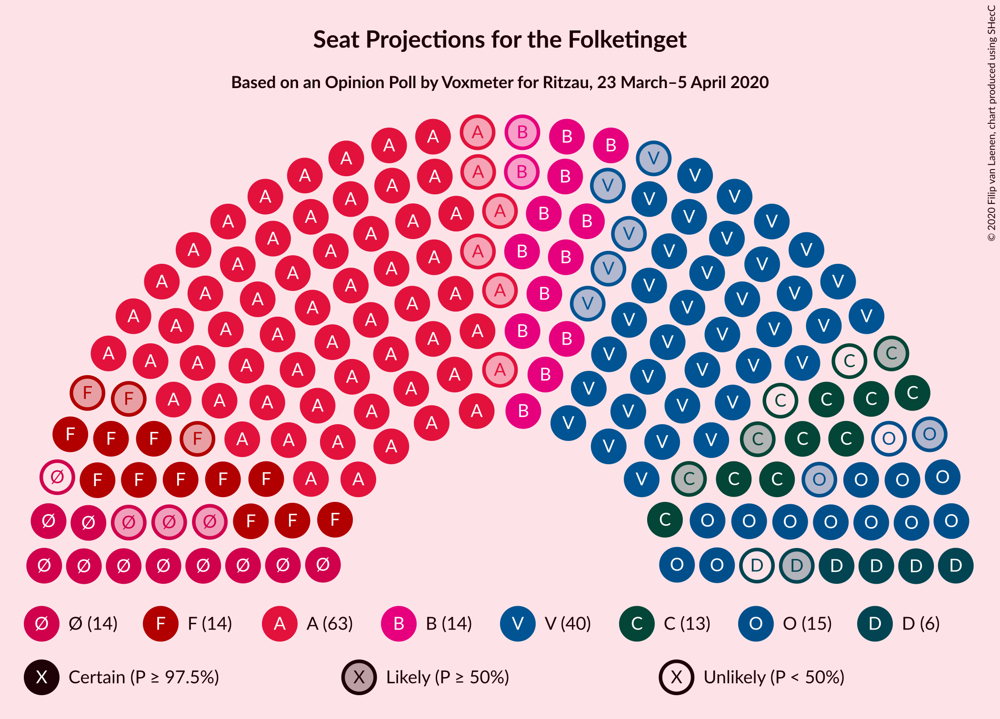
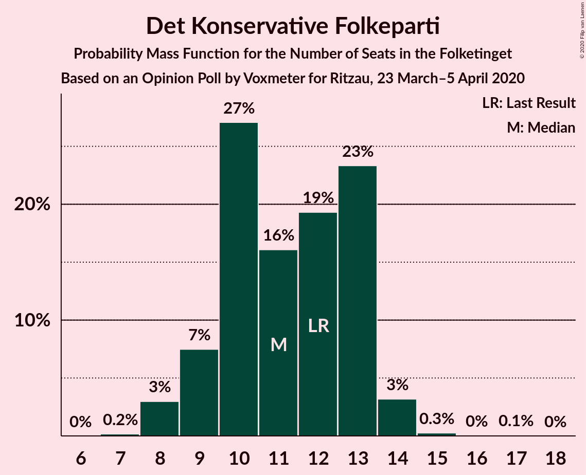
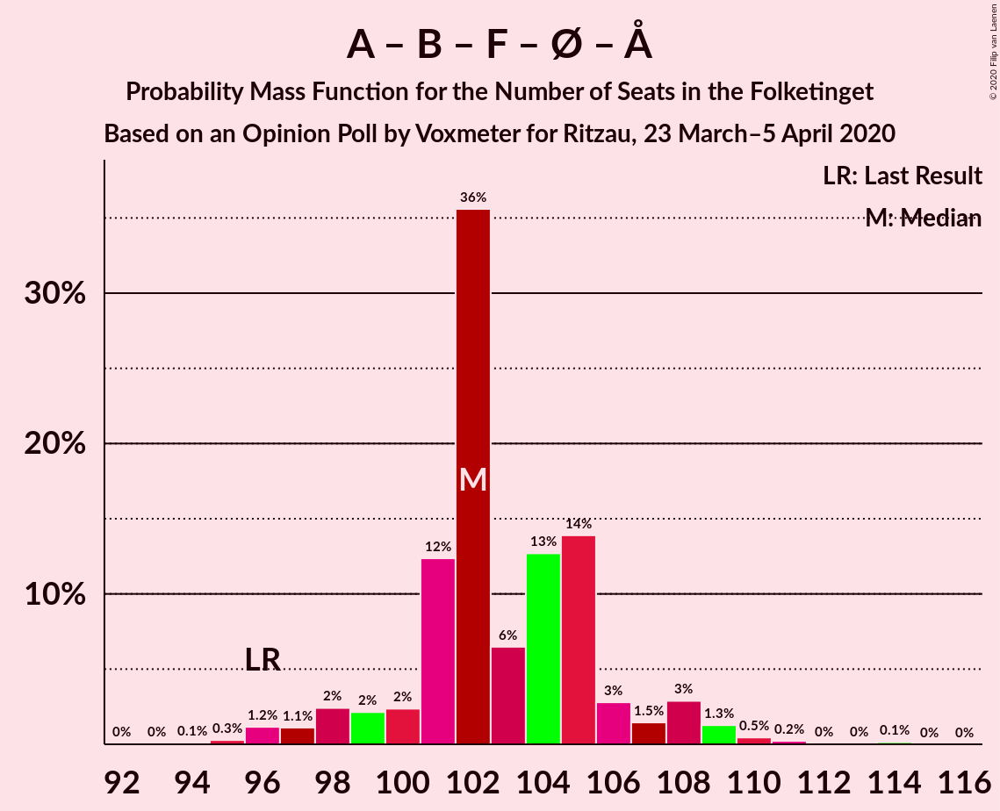

# Opinion Poll by Voxmeter for Ritzau, 23 March–5 April 2020

<a href="#voting-intentions">Voting Intentions</a> | <a href="#seats">Seats</a> | <a href="#coalitions">Coalitions</a> | <a href="#technical-information">Technical Information</a>

## Voting Intentions

### Confidence Intervals

| Party | Last Result | Poll Result | 80% Confidence Interval | 90% Confidence Interval | 95% Confidence Interval | 99% Confidence Interval |
|:-----:|:-----------:|:-----------:|:-----------------------:|:-----------------------:|:-----------------------:|:-----------------------:|
| Socialdemokraterne | 25.9% | 34.0% | 32.2–35.9% |31.7–36.5% |31.2–36.9% |30.4–37.8% |
| Venstre | 23.4% | 21.8% | 20.2–23.5% |19.8–24.0% |19.4–24.4% |18.7–25.2% |
| Radikale Venstre | 8.6% | 7.9% | 6.9–9.1% |6.6–9.4% |6.4–9.7% |6.0–10.3% |
| Dansk Folkeparti | 8.7% | 7.7% | 6.8–8.9% |6.5–9.2% |6.2–9.5% |5.8–10.1% |
| Socialistisk Folkeparti | 7.7% | 7.5% | 6.6–8.7% |6.3–9.0% |6.1–9.3% |5.7–9.8% |
| Enhedslisten–De Rød-Grønne | 6.9% | 6.9% | 6.0–8.0% |5.7–8.3% |5.5–8.6% |5.1–9.1% |
| Det Konservative Folkeparti | 6.6% | 6.0% | 5.2–7.1% |4.9–7.4% |4.7–7.6% |4.4–8.1% |
| Nye Borgerlige | 2.4% | 3.0% | 2.4–3.8% |2.3–4.0% |2.1–4.2% |1.9–4.6% |
| Stram Kurs | 1.8% | 1.4% | 1.0–2.0% |0.9–2.2% |0.9–2.3% |0.7–2.6% |
| Liberal Alliance | 2.3% | 1.2% | 0.9–1.8% |0.8–1.9% |0.7–2.1% |0.6–2.4% |
| Alternativet | 3.0% | 0.8% | 0.6–1.3% |0.5–1.5% |0.4–1.6% |0.3–1.9% |

*Note:* The poll result column reflects the actual value used in the calculations. Published results may vary slightly, and in addition be rounded to fewer digits.

## Seats

### Confidence Intervals

| Party | Last Result | Median | 80% Confidence Interval | 90% Confidence Interval | 95% Confidence Interval | 99% Confidence Interval |
|:-----:|:-----------:|:------:|:-----------------------:|:-----------------------:|:-----------------------:|:-----------------------:|
| <a href="#socialdemokraterne">Socialdemokraterne</a> | 48 | 63 | 59–65 |58–66 |57–66 |55–68 |
| <a href="#venstre">Venstre</a> | 43 | 40 | 37–42 |36–44 |35–44 |34–45 |
| <a href="#radikale-venstre">Radikale Venstre</a> | 16 | 14 | 13–16 |12–17 |12–17 |11–18 |
| <a href="#dansk-folkeparti">Dansk Folkeparti</a> | 16 | 14 | 12–16 |12–16 |12–17 |11–19 |
| <a href="#socialistisk-folkeparti">Socialistisk Folkeparti</a> | 14 | 14 | 12–15 |12–16 |11–17 |11–18 |
| <a href="#enhedslisten–de-rød-grønne">Enhedslisten–De Rød-Grønne</a> | 13 | 13 | 11–15 |11–15 |10–15 |9–16 |
| <a href="#det-konservative-folkeparti">Det Konservative Folkeparti</a> | 12 | 11 | 9–13 |9–13 |8–14 |8–14 |
| <a href="#nye-borgerlige">Nye Borgerlige</a> | 4 | 5 | 5–7 |5–7 |4–7 |0–8 |
| <a href="#stram-kurs">Stram Kurs</a> | 0 | 0 | 0 |0–4 |0–5 |0–5 |
| <a href="#liberal-alliance">Liberal Alliance</a> | 4 | 0 | 0 |0 |0–4 |0–4 |
| <a href="#alternativet">Alternativet</a> | 5 | 0 | 0 |0 |0 |0 |

### Socialdemokraterne

*For a full overview of the results for this party, see the [Socialdemokraterne](party-socialdemokraterne.html) page.*

| Number of Seats | Probability | Accumulated | Special Marks |
|:---------------:|:-----------:|:-----------:|:-------------:|
| 48 | 0% | 100% | Last Result |
| 49 | 0% | 100% |  |
| 50 | 0% | 100% |  |
| 51 | 0% | 100% |  |
| 52 | 0% | 100% |  |
| 53 | 0% | 100% |  |
| 54 | 0.1% | 99.9% |  |
| 55 | 1.2% | 99.8% |  |
| 56 | 0.6% | 98.6% |  |
| 57 | 2% | 98% |  |
| 58 | 5% | 96% |  |
| 59 | 7% | 91% |  |
| 60 | 2% | 84% |  |
| 61 | 16% | 82% |  |
| 62 | 10% | 66% |  |
| 63 | 30% | 56% | Median |
| 64 | 2% | 26% |  |
| 65 | 16% | 24% |  |
| 66 | 6% | 8% |  |
| 67 | 0.9% | 2% |  |
| 68 | 1.1% | 1.5% |  |
| 69 | 0.2% | 0.4% |  |
| 70 | 0% | 0.2% |  |
| 71 | 0.1% | 0.2% |  |
| 72 | 0% | 0.1% |  |
| 73 | 0.1% | 0.1% |  |
| 74 | 0% | 0% |  |

### Venstre

*For a full overview of the results for this party, see the [Venstre](party-venstre.html) page.*

| Number of Seats | Probability | Accumulated | Special Marks |
|:---------------:|:-----------:|:-----------:|:-------------:|
| 32 | 0% | 100% |  |
| 33 | 0.2% | 99.9% |  |
| 34 | 0.7% | 99.8% |  |
| 35 | 2% | 99.1% |  |
| 36 | 3% | 97% |  |
| 37 | 19% | 94% |  |
| 38 | 16% | 75% |  |
| 39 | 7% | 59% |  |
| 40 | 32% | 51% | Median |
| 41 | 3% | 19% |  |
| 42 | 6% | 16% |  |
| 43 | 2% | 10% | Last Result |
| 44 | 6% | 8% |  |
| 45 | 2% | 2% |  |
| 46 | 0.3% | 0.4% |  |
| 47 | 0% | 0.1% |  |
| 48 | 0% | 0% |  |

### Radikale Venstre

*For a full overview of the results for this party, see the [Radikale Venstre](party-radikalevenstre.html) page.*

| Number of Seats | Probability | Accumulated | Special Marks |
|:---------------:|:-----------:|:-----------:|:-------------:|
| 10 | 0.1% | 100% |  |
| 11 | 1.2% | 99.9% |  |
| 12 | 5% | 98.6% |  |
| 13 | 8% | 94% |  |
| 14 | 59% | 86% | Median |
| 15 | 13% | 27% |  |
| 16 | 5% | 14% | Last Result |
| 17 | 7% | 9% |  |
| 18 | 2% | 2% |  |
| 19 | 0.3% | 0.3% |  |
| 20 | 0% | 0.1% |  |
| 21 | 0% | 0% |  |

### Dansk Folkeparti

*For a full overview of the results for this party, see the [Dansk Folkeparti](party-danskfolkeparti.html) page.*

| Number of Seats | Probability | Accumulated | Special Marks |
|:---------------:|:-----------:|:-----------:|:-------------:|
| 10 | 0.3% | 100% |  |
| 11 | 2% | 99.7% |  |
| 12 | 17% | 98% |  |
| 13 | 7% | 80% |  |
| 14 | 28% | 74% | Median |
| 15 | 29% | 46% |  |
| 16 | 14% | 17% | Last Result |
| 17 | 2% | 4% |  |
| 18 | 0.7% | 1.3% |  |
| 19 | 0.6% | 0.7% |  |
| 20 | 0.1% | 0.1% |  |
| 21 | 0% | 0% |  |

### Socialistisk Folkeparti

*For a full overview of the results for this party, see the [Socialistisk Folkeparti](party-socialistiskfolkeparti.html) page.*

| Number of Seats | Probability | Accumulated | Special Marks |
|:---------------:|:-----------:|:-----------:|:-------------:|
| 10 | 0.4% | 100% |  |
| 11 | 2% | 99.6% |  |
| 12 | 28% | 97% |  |
| 13 | 15% | 69% |  |
| 14 | 35% | 54% | Last Result, Median |
| 15 | 11% | 19% |  |
| 16 | 5% | 8% |  |
| 17 | 1.4% | 3% |  |
| 18 | 0.9% | 1.1% |  |
| 19 | 0.2% | 0.2% |  |
| 20 | 0% | 0% |  |

### Enhedslisten–De Rød-Grønne

*For a full overview of the results for this party, see the [Enhedslisten–De Rød-Grønne](party-enhedslisten–derød-grønne.html) page.*

| Number of Seats | Probability | Accumulated | Special Marks |
|:---------------:|:-----------:|:-----------:|:-------------:|
| 8 | 0.1% | 100% |  |
| 9 | 0.8% | 99.9% |  |
| 10 | 2% | 99.1% |  |
| 11 | 33% | 97% |  |
| 12 | 11% | 65% |  |
| 13 | 20% | 53% | Last Result, Median |
| 14 | 22% | 34% |  |
| 15 | 10% | 11% |  |
| 16 | 1.3% | 1.5% |  |
| 17 | 0.1% | 0.2% |  |
| 18 | 0.1% | 0.1% |  |
| 19 | 0% | 0% |  |

### Det Konservative Folkeparti

*For a full overview of the results for this party, see the [Det Konservative Folkeparti](party-detkonservativefolkeparti.html) page.*

| Number of Seats | Probability | Accumulated | Special Marks |
|:---------------:|:-----------:|:-----------:|:-------------:|
| 7 | 0.2% | 100% |  |
| 8 | 3% | 99.8% |  |
| 9 | 7% | 97% |  |
| 10 | 27% | 89% |  |
| 11 | 16% | 62% | Median |
| 12 | 19% | 46% | Last Result |
| 13 | 23% | 27% |  |
| 14 | 3% | 4% |  |
| 15 | 0.3% | 0.4% |  |
| 16 | 0% | 0.1% |  |
| 17 | 0.1% | 0.1% |  |
| 18 | 0% | 0% |  |

### Nye Borgerlige

*For a full overview of the results for this party, see the [Nye Borgerlige](party-nyeborgerlige.html) page.*

| Number of Seats | Probability | Accumulated | Special Marks |
|:---------------:|:-----------:|:-----------:|:-------------:|
| 0 | 0.7% | 100% |  |
| 1 | 0% | 99.3% |  |
| 2 | 0% | 99.3% |  |
| 3 | 0% | 99.3% |  |
| 4 | 4% | 99.3% | Last Result |
| 5 | 49% | 95% | Median |
| 6 | 28% | 46% |  |
| 7 | 15% | 18% |  |
| 8 | 2% | 2% |  |
| 9 | 0.2% | 0.3% |  |
| 10 | 0.1% | 0.1% |  |
| 11 | 0% | 0% |  |

### Stram Kurs

*For a full overview of the results for this party, see the [Stram Kurs](party-stramkurs.html) page.*

| Number of Seats | Probability | Accumulated | Special Marks |
|:---------------:|:-----------:|:-----------:|:-------------:|
| 0 | 93% | 100% | Last Result, Median |
| 1 | 0% | 7% |  |
| 2 | 0% | 7% |  |
| 3 | 0% | 7% |  |
| 4 | 4% | 7% |  |
| 5 | 3% | 3% |  |
| 6 | 0% | 0% |  |

### Liberal Alliance

*For a full overview of the results for this party, see the [Liberal Alliance](party-liberalalliance.html) page.*

| Number of Seats | Probability | Accumulated | Special Marks |
|:---------------:|:-----------:|:-----------:|:-------------:|
| 0 | 96% | 100% | Median |
| 1 | 0% | 4% |  |
| 2 | 0% | 4% |  |
| 3 | 0% | 4% |  |
| 4 | 4% | 4% | Last Result |
| 5 | 0.3% | 0.3% |  |
| 6 | 0% | 0% |  |

### Alternativet

*For a full overview of the results for this party, see the [Alternativet](party-alternativet.html) page.*

| Number of Seats | Probability | Accumulated | Special Marks |
|:---------------:|:-----------:|:-----------:|:-------------:|
| 0 | 99.9% | 100% | Median |
| 1 | 0% | 0.1% |  |
| 2 | 0% | 0.1% |  |
| 3 | 0% | 0.1% |  |
| 4 | 0.1% | 0.1% |  |
| 5 | 0% | 0% | Last Result |

## Coalitions

### Confidence Intervals

| Coalition | Last Result | Median | Majority? | 80% Confidence Interval | 90% Confidence Interval | 95% Confidence Interval | 99% Confidence Interval |
|:---------:|:-----------:|:------:|:---------:|:-----------------------:|:-----------------------:|:-----------------------:|:-----------------------:|
| Socialdemokraterne – Radikale Venstre – Socialistisk Folkeparti – Enhedslisten–De Rød-Grønne – Alternativet | 96 | 102 | 100% | 101–105 | 98–108 | 97–108 | 96–110 |
| Socialdemokraterne – Radikale Venstre – Socialistisk Folkeparti – Enhedslisten–De Rød-Grønne | 91 | 102 | 100% | 101–105 | 98–108 | 97–108 | 95–110 |
| Socialdemokraterne – Radikale Venstre – Socialistisk Folkeparti | 78 | 91 | 62% | 87–93 | 85–94 | 84–95 | 83–98 |
| Socialdemokraterne – Socialistisk Folkeparti – Enhedslisten–De Rød-Grønne – Alternativet | 80 | 88 | 29% | 86–91 | 84–92 | 83–93 | 80–97 |
| Socialdemokraterne – Socialistisk Folkeparti – Enhedslisten–De Rød-Grønne | 75 | 88 | 29% | 86–91 | 84–92 | 83–93 | 80–97 |
| Socialdemokraterne – Radikale Venstre | 64 | 77 | 0% | 73–80 | 72–80 | 71–81 | 69–84 |
| Venstre – Dansk Folkeparti – Det Konservative Folkeparti – Nye Borgerlige – Liberal Alliance | 79 | 71 | 0% | 66–73 | 66–74 | 66–76 | 64–77 |
| Venstre – Dansk Folkeparti – Det Konservative Folkeparti – Liberal Alliance | 75 | 65 | 0% | 61–68 | 61–68 | 60–70 | 59–72 |
| Venstre – Det Konservative Folkeparti – Liberal Alliance | 59 | 51 | 0% | 47–54 | 47–55 | 46–56 | 45–57 |
| Venstre – Det Konservative Folkeparti | 55 | 50 | 0% | 47–54 | 47–54 | 46–55 | 45–56 |
| Venstre | 43 | 40 | 0% | 37–42 | 36–44 | 35–44 | 34–45 |

### Socialdemokraterne – Radikale Venstre – Socialistisk Folkeparti – Enhedslisten–De Rød-Grønne – Alternativet

| Number of Seats | Probability | Accumulated | Special Marks |
|:---------------:|:-----------:|:-----------:|:-------------:|
| 92 | 0% | 100% |  |
| 93 | 0% | 99.9% |  |
| 94 | 0.1% | 99.9% |  |
| 95 | 0.3% | 99.8% |  |
| 96 | 1.2% | 99.5% | Last Result |
| 97 | 1.1% | 98% |  |
| 98 | 2% | 97% |  |
| 99 | 2% | 95% |  |
| 100 | 2% | 93% |  |
| 101 | 12% | 90% |  |
| 102 | 36% | 78% |  |
| 103 | 6% | 42% |  |
| 104 | 13% | 36% | Median |
| 105 | 14% | 23% |  |
| 106 | 3% | 9% |  |
| 107 | 1.5% | 6% |  |
| 108 | 3% | 5% |  |
| 109 | 1.3% | 2% |  |
| 110 | 0.5% | 0.9% |  |
| 111 | 0.2% | 0.4% |  |
| 112 | 0% | 0.2% |  |
| 113 | 0% | 0.2% |  |
| 114 | 0.1% | 0.1% |  |
| 115 | 0% | 0% |  |

### Socialdemokraterne – Radikale Venstre – Socialistisk Folkeparti – Enhedslisten–De Rød-Grønne

| Number of Seats | Probability | Accumulated | Special Marks |
|:---------------:|:-----------:|:-----------:|:-------------:|
| 91 | 0% | 100% | Last Result |
| 92 | 0% | 100% |  |
| 93 | 0% | 99.9% |  |
| 94 | 0.1% | 99.9% |  |
| 95 | 0.3% | 99.8% |  |
| 96 | 1.2% | 99.5% |  |
| 97 | 1.1% | 98% |  |
| 98 | 2% | 97% |  |
| 99 | 2% | 95% |  |
| 100 | 2% | 93% |  |
| 101 | 12% | 90% |  |
| 102 | 36% | 78% |  |
| 103 | 6% | 42% |  |
| 104 | 13% | 36% | Median |
| 105 | 14% | 23% |  |
| 106 | 3% | 9% |  |
| 107 | 1.5% | 6% |  |
| 108 | 3% | 5% |  |
| 109 | 1.3% | 2% |  |
| 110 | 0.5% | 0.9% |  |
| 111 | 0.2% | 0.4% |  |
| 112 | 0% | 0.2% |  |
| 113 | 0% | 0.2% |  |
| 114 | 0.1% | 0.1% |  |
| 115 | 0% | 0% |  |

### Socialdemokraterne – Radikale Venstre – Socialistisk Folkeparti

| Number of Seats | Probability | Accumulated | Special Marks |
|:---------------:|:-----------:|:-----------:|:-------------:|
| 78 | 0% | 100% | Last Result |
| 79 | 0% | 100% |  |
| 80 | 0% | 100% |  |
| 81 | 0.1% | 99.9% |  |
| 82 | 0.2% | 99.8% |  |
| 83 | 1.3% | 99.6% |  |
| 84 | 0.9% | 98% |  |
| 85 | 3% | 97% |  |
| 86 | 1.3% | 94% |  |
| 87 | 8% | 93% |  |
| 88 | 9% | 85% |  |
| 89 | 14% | 76% |  |
| 90 | 3% | 62% | Majority |
| 91 | 41% | 59% | Median |
| 92 | 3% | 18% |  |
| 93 | 8% | 16% |  |
| 94 | 2% | 7% |  |
| 95 | 3% | 5% |  |
| 96 | 1.0% | 2% |  |
| 97 | 0.2% | 1.1% |  |
| 98 | 0.6% | 0.9% |  |
| 99 | 0.1% | 0.2% |  |
| 100 | 0.2% | 0.2% |  |
| 101 | 0% | 0% |  |

### Socialdemokraterne – Socialistisk Folkeparti – Enhedslisten–De Rød-Grønne – Alternativet

| Number of Seats | Probability | Accumulated | Special Marks |
|:---------------:|:-----------:|:-----------:|:-------------:|
| 78 | 0% | 100% |  |
| 79 | 0.1% | 99.9% |  |
| 80 | 0.4% | 99.8% | Last Result |
| 81 | 0.4% | 99.5% |  |
| 82 | 0.8% | 99.1% |  |
| 83 | 1.1% | 98% |  |
| 84 | 4% | 97% |  |
| 85 | 2% | 94% |  |
| 86 | 3% | 92% |  |
| 87 | 16% | 88% |  |
| 88 | 32% | 72% |  |
| 89 | 11% | 40% |  |
| 90 | 7% | 29% | Median, Majority |
| 91 | 17% | 22% |  |
| 92 | 1.2% | 5% |  |
| 93 | 2% | 4% |  |
| 94 | 0.5% | 2% |  |
| 95 | 0.6% | 2% |  |
| 96 | 0.8% | 1.4% |  |
| 97 | 0.5% | 0.6% |  |
| 98 | 0% | 0% |  |

### Socialdemokraterne – Socialistisk Folkeparti – Enhedslisten–De Rød-Grønne

| Number of Seats | Probability | Accumulated | Special Marks |
|:---------------:|:-----------:|:-----------:|:-------------:|
| 75 | 0% | 100% | Last Result |
| 76 | 0% | 100% |  |
| 77 | 0% | 100% |  |
| 78 | 0% | 100% |  |
| 79 | 0.1% | 99.9% |  |
| 80 | 0.4% | 99.8% |  |
| 81 | 0.4% | 99.5% |  |
| 82 | 0.9% | 99.1% |  |
| 83 | 1.1% | 98% |  |
| 84 | 4% | 97% |  |
| 85 | 2% | 94% |  |
| 86 | 3% | 92% |  |
| 87 | 16% | 88% |  |
| 88 | 32% | 72% |  |
| 89 | 11% | 40% |  |
| 90 | 7% | 29% | Median, Majority |
| 91 | 17% | 22% |  |
| 92 | 1.2% | 5% |  |
| 93 | 2% | 4% |  |
| 94 | 0.5% | 2% |  |
| 95 | 0.6% | 2% |  |
| 96 | 0.8% | 1.4% |  |
| 97 | 0.5% | 0.6% |  |
| 98 | 0% | 0% |  |

### Socialdemokraterne – Radikale Venstre

| Number of Seats | Probability | Accumulated | Special Marks |
|:---------------:|:-----------:|:-----------:|:-------------:|
| 64 | 0% | 100% | Last Result |
| 65 | 0% | 100% |  |
| 66 | 0% | 100% |  |
| 67 | 0% | 100% |  |
| 68 | 0.2% | 99.9% |  |
| 69 | 0.4% | 99.7% |  |
| 70 | 0.6% | 99.4% |  |
| 71 | 2% | 98.8% |  |
| 72 | 5% | 97% |  |
| 73 | 7% | 92% |  |
| 74 | 6% | 85% |  |
| 75 | 10% | 79% |  |
| 76 | 6% | 69% |  |
| 77 | 31% | 64% | Median |
| 78 | 4% | 33% |  |
| 79 | 18% | 29% |  |
| 80 | 7% | 11% |  |
| 81 | 2% | 4% |  |
| 82 | 0.7% | 2% |  |
| 83 | 0.6% | 1.1% |  |
| 84 | 0.2% | 0.5% |  |
| 85 | 0.2% | 0.3% |  |
| 86 | 0% | 0.1% |  |
| 87 | 0% | 0.1% |  |
| 88 | 0% | 0% |  |

### Venstre – Dansk Folkeparti – Det Konservative Folkeparti – Nye Borgerlige – Liberal Alliance

| Number of Seats | Probability | Accumulated | Special Marks |
|:---------------:|:-----------:|:-----------:|:-------------:|
| 61 | 0.2% | 100% |  |
| 62 | 0% | 99.8% |  |
| 63 | 0.3% | 99.8% |  |
| 64 | 0.6% | 99.5% |  |
| 65 | 1.0% | 99.0% |  |
| 66 | 15% | 98% |  |
| 67 | 8% | 83% |  |
| 68 | 3% | 76% |  |
| 69 | 9% | 73% |  |
| 70 | 8% | 64% | Median |
| 71 | 10% | 56% |  |
| 72 | 5% | 47% |  |
| 73 | 34% | 42% |  |
| 74 | 2% | 7% |  |
| 75 | 2% | 5% |  |
| 76 | 2% | 3% |  |
| 77 | 0.9% | 1.4% |  |
| 78 | 0.3% | 0.5% |  |
| 79 | 0.1% | 0.1% | Last Result |
| 80 | 0.1% | 0.1% |  |
| 81 | 0% | 0% |  |

### Venstre – Dansk Folkeparti – Det Konservative Folkeparti – Liberal Alliance

| Number of Seats | Probability | Accumulated | Special Marks |
|:---------------:|:-----------:|:-----------:|:-------------:|
| 56 | 0% | 100% |  |
| 57 | 0.1% | 99.9% |  |
| 58 | 0.4% | 99.9% |  |
| 59 | 0.7% | 99.5% |  |
| 60 | 3% | 98.8% |  |
| 61 | 19% | 96% |  |
| 62 | 3% | 77% |  |
| 63 | 8% | 74% |  |
| 64 | 12% | 66% |  |
| 65 | 5% | 53% | Median |
| 66 | 11% | 48% |  |
| 67 | 3% | 37% |  |
| 68 | 29% | 34% |  |
| 69 | 1.5% | 5% |  |
| 70 | 2% | 3% |  |
| 71 | 1.0% | 2% |  |
| 72 | 0.4% | 0.8% |  |
| 73 | 0.3% | 0.4% |  |
| 74 | 0.1% | 0.1% |  |
| 75 | 0% | 0% | Last Result |

### Venstre – Det Konservative Folkeparti – Liberal Alliance

| Number of Seats | Probability | Accumulated | Special Marks |
|:---------------:|:-----------:|:-----------:|:-------------:|
| 43 | 0.1% | 100% |  |
| 44 | 0.3% | 99.9% |  |
| 45 | 0.7% | 99.6% |  |
| 46 | 2% | 98.9% |  |
| 47 | 14% | 97% |  |
| 48 | 8% | 83% |  |
| 49 | 12% | 74% |  |
| 50 | 12% | 62% |  |
| 51 | 4% | 51% | Median |
| 52 | 8% | 47% |  |
| 53 | 28% | 39% |  |
| 54 | 6% | 11% |  |
| 55 | 2% | 5% |  |
| 56 | 2% | 3% |  |
| 57 | 0.4% | 0.8% |  |
| 58 | 0.2% | 0.4% |  |
| 59 | 0.1% | 0.2% | Last Result |
| 60 | 0% | 0.1% |  |
| 61 | 0% | 0% |  |

### Venstre – Det Konservative Folkeparti

| Number of Seats | Probability | Accumulated | Special Marks |
|:---------------:|:-----------:|:-----------:|:-------------:|
| 43 | 0.1% | 100% |  |
| 44 | 0.4% | 99.9% |  |
| 45 | 0.8% | 99.5% |  |
| 46 | 3% | 98.7% |  |
| 47 | 15% | 96% |  |
| 48 | 8% | 81% |  |
| 49 | 13% | 73% |  |
| 50 | 11% | 60% |  |
| 51 | 4% | 49% | Median |
| 52 | 8% | 45% |  |
| 53 | 27% | 37% |  |
| 54 | 6% | 10% |  |
| 55 | 2% | 4% | Last Result |
| 56 | 2% | 2% |  |
| 57 | 0.3% | 0.5% |  |
| 58 | 0.1% | 0.2% |  |
| 59 | 0.1% | 0.1% |  |
| 60 | 0% | 0% |  |

### Venstre

| Number of Seats | Probability | Accumulated | Special Marks |
|:---------------:|:-----------:|:-----------:|:-------------:|
| 32 | 0% | 100% |  |
| 33 | 0.2% | 99.9% |  |
| 34 | 0.7% | 99.8% |  |
| 35 | 2% | 99.1% |  |
| 36 | 3% | 97% |  |
| 37 | 19% | 94% |  |
| 38 | 16% | 75% |  |
| 39 | 7% | 59% |  |
| 40 | 32% | 51% | Median |
| 41 | 3% | 19% |  |
| 42 | 6% | 16% |  |
| 43 | 2% | 10% | Last Result |
| 44 | 6% | 8% |  |
| 45 | 2% | 2% |  |
| 46 | 0.3% | 0.4% |  |
| 47 | 0% | 0.1% |  |
| 48 | 0% | 0% |  |

## Technical Information

### Opinion Poll

+ **Polling firm:** Voxmeter
+ **Commissioner(s):** Ritzau
+ **Fieldwork period:** 23 March–5 April 2020

### Calculations

+ **Sample size:** 1064
+ **Simulations done:** 1,048,576
+ **Error estimate:** 1.17%

