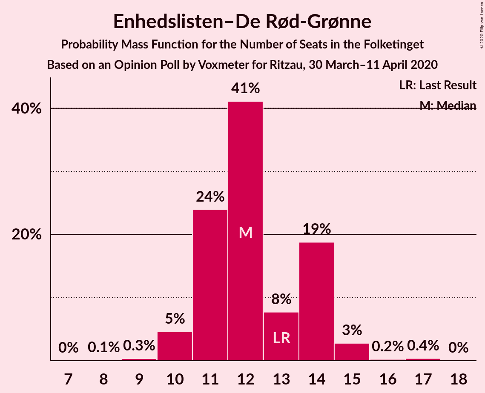

# Opinion Poll by Voxmeter for Ritzau, 30 March–11 April 2020

<a href="#voting-intentions">Voting Intentions</a> | <a href="#seats">Seats</a> | <a href="#coalitions">Coalitions</a> | <a href="#technical-information">Technical Information</a>

## Voting Intentions

### Confidence Intervals

| Party | Last Result | Poll Result | 80% Confidence Interval | 90% Confidence Interval | 95% Confidence Interval | 99% Confidence Interval |
|:-----:|:-----------:|:-----------:|:-----------------------:|:-----------------------:|:-----------------------:|:-----------------------:|
| Socialdemokraterne | 25.9% | 35.1% | 33.2–37.0% |32.7–37.5% |32.3–38.0% |31.4–38.9% |
| Venstre | 23.4% | 22.0% | 20.4–23.7% |19.9–24.1% |19.6–24.6% |18.8–25.4% |
| Radikale Venstre | 8.6% | 7.5% | 6.6–8.7% |6.3–9.0% |6.1–9.3% |5.6–9.8% |
| Dansk Folkeparti | 8.7% | 7.3% | 6.4–8.5% |6.1–8.8% |5.9–9.1% |5.5–9.6% |
| Socialistisk Folkeparti | 7.7% | 7.2% | 6.3–8.4% |6.0–8.7% |5.8–9.0% |5.4–9.5% |
| Enhedslisten–De Rød-Grønne | 6.9% | 6.7% | 5.8–7.7% |5.5–8.1% |5.3–8.3% |4.9–8.9% |
| Det Konservative Folkeparti | 6.6% | 6.5% | 5.6–7.5% |5.3–7.8% |5.1–8.1% |4.7–8.7% |
| Nye Borgerlige | 2.4% | 2.5% | 2.0–3.2% |1.8–3.4% |1.7–3.6% |1.5–4.0% |
| Liberal Alliance | 2.3% | 1.5% | 1.1–2.1% |1.0–2.3% |0.9–2.5% |0.8–2.8% |
| Alternativet | 3.0% | 1.1% | 0.8–1.7% |0.7–1.8% |0.7–2.0% |0.5–2.3% |
| Stram Kurs | 1.8% | 1.1% | 0.8–1.7% |0.7–1.8% |0.7–2.0% |0.5–2.3% |

*Note:* The poll result column reflects the actual value used in the calculations. Published results may vary slightly, and in addition be rounded to fewer digits.

## Seats

### Confidence Intervals

| Party | Last Result | Median | 80% Confidence Interval | 90% Confidence Interval | 95% Confidence Interval | 99% Confidence Interval |
|:-----:|:-----------:|:------:|:-----------------------:|:-----------------------:|:-----------------------:|:-----------------------:|
| <a href="#socialdemokraterne">Socialdemokraterne</a> | 48 | 64 | 61–67 |59–67 |58–70 |57–72 |
| <a href="#venstre">Venstre</a> | 43 | 40 | 38–42 |37–42 |36–43 |35–45 |
| <a href="#radikale-venstre">Radikale Venstre</a> | 16 | 14 | 12–16 |12–16 |11–16 |11–18 |
| <a href="#dansk-folkeparti">Dansk Folkeparti</a> | 16 | 14 | 12–16 |12–16 |11–17 |10–18 |
| <a href="#socialistisk-folkeparti">Socialistisk Folkeparti</a> | 14 | 13 | 12–15 |11–16 |11–16 |10–18 |
| <a href="#enhedslisten–de-rød-grønne">Enhedslisten–De Rød-Grønne</a> | 13 | 12 | 11–14 |10–14 |10–15 |10–16 |
| <a href="#det-konservative-folkeparti">Det Konservative Folkeparti</a> | 12 | 12 | 11–14 |10–14 |10–15 |9–16 |
| <a href="#nye-borgerlige">Nye Borgerlige</a> | 4 | 4 | 4–6 |0–7 |0–7 |0–7 |
| <a href="#liberal-alliance">Liberal Alliance</a> | 4 | 0 | 0 |0–4 |0–4 |0–5 |
| <a href="#alternativet">Alternativet</a> | 5 | 0 | 0 |0 |0 |0 |
| <a href="#stram-kurs">Stram Kurs</a> | 0 | 0 | 0 |0 |0 |0–4 |

### Socialdemokraterne

*For a full overview of the results for this party, see the [Socialdemokraterne](party-socialdemokraterne.html) page.*

| Number of Seats | Probability | Accumulated | Special Marks |
|:---------------:|:-----------:|:-----------:|:-------------:|
| 48 | 0% | 100% | Last Result |
| 49 | 0% | 100% |  |
| 50 | 0% | 100% |  |
| 51 | 0% | 100% |  |
| 52 | 0% | 100% |  |
| 53 | 0% | 100% |  |
| 54 | 0% | 100% |  |
| 55 | 0% | 100% |  |
| 56 | 0.1% | 99.9% |  |
| 57 | 0.5% | 99.8% |  |
| 58 | 2% | 99.3% |  |
| 59 | 2% | 97% |  |
| 60 | 2% | 95% |  |
| 61 | 4% | 93% |  |
| 62 | 4% | 89% |  |
| 63 | 10% | 85% |  |
| 64 | 29% | 75% | Median |
| 65 | 11% | 47% |  |
| 66 | 22% | 35% |  |
| 67 | 9% | 14% |  |
| 68 | 0.6% | 5% |  |
| 69 | 1.1% | 4% |  |
| 70 | 0.4% | 3% |  |
| 71 | 2% | 2% |  |
| 72 | 0.5% | 0.6% |  |
| 73 | 0% | 0.1% |  |
| 74 | 0.1% | 0.1% |  |
| 75 | 0% | 0% |  |

### Venstre

*For a full overview of the results for this party, see the [Venstre](party-venstre.html) page.*

| Number of Seats | Probability | Accumulated | Special Marks |
|:---------------:|:-----------:|:-----------:|:-------------:|
| 33 | 0.1% | 100% |  |
| 34 | 0.3% | 99.9% |  |
| 35 | 0.4% | 99.6% |  |
| 36 | 3% | 99.2% |  |
| 37 | 3% | 96% |  |
| 38 | 9% | 93% |  |
| 39 | 30% | 84% |  |
| 40 | 7% | 54% | Median |
| 41 | 23% | 47% |  |
| 42 | 19% | 24% |  |
| 43 | 2% | 4% | Last Result |
| 44 | 1.3% | 2% |  |
| 45 | 0.5% | 0.9% |  |
| 46 | 0.2% | 0.4% |  |
| 47 | 0.1% | 0.2% |  |
| 48 | 0% | 0.1% |  |
| 49 | 0% | 0% |  |

### Radikale Venstre

*For a full overview of the results for this party, see the [Radikale Venstre](party-radikalevenstre.html) page.*

| Number of Seats | Probability | Accumulated | Special Marks |
|:---------------:|:-----------:|:-----------:|:-------------:|
| 9 | 0.1% | 100% |  |
| 10 | 0.3% | 99.9% |  |
| 11 | 3% | 99.6% |  |
| 12 | 9% | 96% |  |
| 13 | 37% | 88% |  |
| 14 | 29% | 51% | Median |
| 15 | 3% | 22% |  |
| 16 | 17% | 19% | Last Result |
| 17 | 1.0% | 2% |  |
| 18 | 0.4% | 0.5% |  |
| 19 | 0.1% | 0.1% |  |
| 20 | 0% | 0% |  |

### Dansk Folkeparti

*For a full overview of the results for this party, see the [Dansk Folkeparti](party-danskfolkeparti.html) page.*

| Number of Seats | Probability | Accumulated | Special Marks |
|:---------------:|:-----------:|:-----------:|:-------------:|
| 9 | 0.1% | 100% |  |
| 10 | 0.6% | 99.9% |  |
| 11 | 2% | 99.3% |  |
| 12 | 16% | 97% |  |
| 13 | 14% | 81% |  |
| 14 | 21% | 68% | Median |
| 15 | 35% | 47% |  |
| 16 | 8% | 11% | Last Result |
| 17 | 2% | 3% |  |
| 18 | 0.8% | 0.9% |  |
| 19 | 0.1% | 0.1% |  |
| 20 | 0% | 0% |  |

### Socialistisk Folkeparti

*For a full overview of the results for this party, see the [Socialistisk Folkeparti](party-socialistiskfolkeparti.html) page.*

| Number of Seats | Probability | Accumulated | Special Marks |
|:---------------:|:-----------:|:-----------:|:-------------:|
| 9 | 0.1% | 100% |  |
| 10 | 0.7% | 99.9% |  |
| 11 | 4% | 99.2% |  |
| 12 | 25% | 95% |  |
| 13 | 34% | 70% | Median |
| 14 | 25% | 35% | Last Result |
| 15 | 4% | 11% |  |
| 16 | 4% | 7% |  |
| 17 | 1.4% | 2% |  |
| 18 | 0.9% | 1.0% |  |
| 19 | 0% | 0% |  |

### Enhedslisten–De Rød-Grønne

*For a full overview of the results for this party, see the [Enhedslisten–De Rød-Grønne](party-enhedslisten–derød-grønne.html) page.*

| Number of Seats | Probability | Accumulated | Special Marks |
|:---------------:|:-----------:|:-----------:|:-------------:|
| 8 | 0.1% | 100% |  |
| 9 | 0.3% | 99.9% |  |
| 10 | 5% | 99.6% |  |
| 11 | 24% | 95% |  |
| 12 | 41% | 71% | Median |
| 13 | 8% | 30% | Last Result |
| 14 | 19% | 22% |  |
| 15 | 3% | 3% |  |
| 16 | 0.2% | 0.6% |  |
| 17 | 0.4% | 0.4% |  |
| 18 | 0% | 0% |  |

### Det Konservative Folkeparti

*For a full overview of the results for this party, see the [Det Konservative Folkeparti](party-detkonservativefolkeparti.html) page.*

| Number of Seats | Probability | Accumulated | Special Marks |
|:---------------:|:-----------:|:-----------:|:-------------:|
| 8 | 0.2% | 100% |  |
| 9 | 1.0% | 99.8% |  |
| 10 | 4% | 98.8% |  |
| 11 | 20% | 94% |  |
| 12 | 44% | 74% | Last Result, Median |
| 13 | 10% | 29% |  |
| 14 | 15% | 19% |  |
| 15 | 3% | 5% |  |
| 16 | 0.9% | 1.1% |  |
| 17 | 0.1% | 0.1% |  |
| 18 | 0% | 0% |  |

### Nye Borgerlige

*For a full overview of the results for this party, see the [Nye Borgerlige](party-nyeborgerlige.html) page.*

| Number of Seats | Probability | Accumulated | Special Marks |
|:---------------:|:-----------:|:-----------:|:-------------:|
| 0 | 5% | 100% |  |
| 1 | 0% | 95% |  |
| 2 | 0% | 95% |  |
| 3 | 0% | 95% |  |
| 4 | 59% | 95% | Last Result, Median |
| 5 | 22% | 36% |  |
| 6 | 7% | 14% |  |
| 7 | 7% | 7% |  |
| 8 | 0.3% | 0.3% |  |
| 9 | 0% | 0% |  |

### Liberal Alliance

*For a full overview of the results for this party, see the [Liberal Alliance](party-liberalalliance.html) page.*

| Number of Seats | Probability | Accumulated | Special Marks |
|:---------------:|:-----------:|:-----------:|:-------------:|
| 0 | 95% | 100% | Median |
| 1 | 0% | 5% |  |
| 2 | 0% | 5% |  |
| 3 | 0% | 5% |  |
| 4 | 4% | 5% | Last Result |
| 5 | 0.9% | 0.9% |  |
| 6 | 0.1% | 0.1% |  |
| 7 | 0% | 0% |  |

### Alternativet

*For a full overview of the results for this party, see the [Alternativet](party-alternativet.html) page.*

| Number of Seats | Probability | Accumulated | Special Marks |
|:---------------:|:-----------:|:-----------:|:-------------:|
| 0 | 99.7% | 100% | Median |
| 1 | 0% | 0.3% |  |
| 2 | 0% | 0.3% |  |
| 3 | 0% | 0.3% |  |
| 4 | 0% | 0.3% |  |
| 5 | 0.2% | 0.2% | Last Result |
| 6 | 0% | 0% |  |

### Stram Kurs

*For a full overview of the results for this party, see the [Stram Kurs](party-stramkurs.html) page.*

| Number of Seats | Probability | Accumulated | Special Marks |
|:---------------:|:-----------:|:-----------:|:-------------:|
| 0 | 99.2% | 100% | Last Result, Median |
| 1 | 0% | 0.8% |  |
| 2 | 0% | 0.8% |  |
| 3 | 0% | 0.8% |  |
| 4 | 0.7% | 0.8% |  |
| 5 | 0.1% | 0.1% |  |
| 6 | 0% | 0% |  |

## Coalitions

### Confidence Intervals

| Coalition | Last Result | Median | Majority? | 80% Confidence Interval | 90% Confidence Interval | 95% Confidence Interval | 99% Confidence Interval |
|:---------:|:-----------:|:------:|:---------:|:-----------------------:|:-----------------------:|:-----------------------:|:-----------------------:|
| Socialdemokraterne – Radikale Venstre – Socialistisk Folkeparti – Enhedslisten–De Rød-Grønne – Alternativet | 96 | 104 | 100% | 100–106 | 99–108 | 98–109 | 95–110 |
| Socialdemokraterne – Radikale Venstre – Socialistisk Folkeparti – Enhedslisten–De Rød-Grønne | 91 | 104 | 100% | 100–106 | 99–108 | 98–109 | 95–110 |
| Socialdemokraterne – Radikale Venstre – Socialistisk Folkeparti | 78 | 92 | 85% | 88–94 | 87–95 | 85–96 | 84–99 |
| Socialdemokraterne – Socialistisk Folkeparti – Enhedslisten–De Rød-Grønne – Alternativet | 80 | 91 | 58% | 87–92 | 86–94 | 84–96 | 82–97 |
| Socialdemokraterne – Socialistisk Folkeparti – Enhedslisten–De Rød-Grønne | 75 | 91 | 58% | 87–92 | 86–94 | 84–96 | 82–97 |
| Socialdemokraterne – Radikale Venstre | 64 | 79 | 0% | 75–81 | 73–81 | 72–83 | 70–85 |
| Venstre – Dansk Folkeparti – Det Konservative Folkeparti – Nye Borgerlige – Liberal Alliance | 79 | 71 | 0% | 68–73 | 67–75 | 65–76 | 65–78 |
| Venstre – Dansk Folkeparti – Det Konservative Folkeparti – Liberal Alliance | 75 | 66 | 0% | 64–68 | 63–69 | 61–72 | 60–74 |
| Venstre – Det Konservative Folkeparti – Liberal Alliance | 59 | 53 | 0% | 51–54 | 49–56 | 48–58 | 47–60 |
| Venstre – Det Konservative Folkeparti | 55 | 53 | 0% | 50–54 | 48–56 | 48–56 | 46–58 |
| Venstre | 43 | 40 | 0% | 38–42 | 37–42 | 36–43 | 35–45 |

### Socialdemokraterne – Radikale Venstre – Socialistisk Folkeparti – Enhedslisten–De Rød-Grønne – Alternativet

| Number of Seats | Probability | Accumulated | Special Marks |
|:---------------:|:-----------:|:-----------:|:-------------:|
| 93 | 0% | 100% |  |
| 94 | 0.2% | 99.9% |  |
| 95 | 0.3% | 99.7% |  |
| 96 | 0.2% | 99.5% | Last Result |
| 97 | 1.3% | 99.3% |  |
| 98 | 1.3% | 98% |  |
| 99 | 3% | 97% |  |
| 100 | 5% | 94% |  |
| 101 | 3% | 89% |  |
| 102 | 11% | 86% |  |
| 103 | 21% | 75% | Median |
| 104 | 17% | 55% |  |
| 105 | 25% | 37% |  |
| 106 | 3% | 12% |  |
| 107 | 4% | 9% |  |
| 108 | 2% | 6% |  |
| 109 | 2% | 4% |  |
| 110 | 2% | 2% |  |
| 111 | 0.1% | 0.2% |  |
| 112 | 0.1% | 0.1% |  |
| 113 | 0% | 0.1% |  |
| 114 | 0% | 0.1% |  |
| 115 | 0% | 0% |  |

### Socialdemokraterne – Radikale Venstre – Socialistisk Folkeparti – Enhedslisten–De Rød-Grønne

| Number of Seats | Probability | Accumulated | Special Marks |
|:---------------:|:-----------:|:-----------:|:-------------:|
| 91 | 0% | 100% | Last Result |
| 92 | 0% | 100% |  |
| 93 | 0% | 100% |  |
| 94 | 0.2% | 99.9% |  |
| 95 | 0.3% | 99.7% |  |
| 96 | 0.2% | 99.5% |  |
| 97 | 1.3% | 99.3% |  |
| 98 | 1.3% | 98% |  |
| 99 | 3% | 97% |  |
| 100 | 5% | 94% |  |
| 101 | 3% | 89% |  |
| 102 | 11% | 86% |  |
| 103 | 21% | 75% | Median |
| 104 | 17% | 54% |  |
| 105 | 25% | 37% |  |
| 106 | 3% | 12% |  |
| 107 | 3% | 9% |  |
| 108 | 2% | 6% |  |
| 109 | 2% | 4% |  |
| 110 | 2% | 2% |  |
| 111 | 0.1% | 0.2% |  |
| 112 | 0.1% | 0.1% |  |
| 113 | 0% | 0.1% |  |
| 114 | 0% | 0.1% |  |
| 115 | 0% | 0% |  |

### Socialdemokraterne – Radikale Venstre – Socialistisk Folkeparti

| Number of Seats | Probability | Accumulated | Special Marks |
|:---------------:|:-----------:|:-----------:|:-------------:|
| 78 | 0% | 100% | Last Result |
| 79 | 0% | 100% |  |
| 80 | 0% | 100% |  |
| 81 | 0% | 100% |  |
| 82 | 0.3% | 100% |  |
| 83 | 0.2% | 99.7% |  |
| 84 | 1.0% | 99.5% |  |
| 85 | 2% | 98.6% |  |
| 86 | 0.9% | 97% |  |
| 87 | 2% | 96% |  |
| 88 | 7% | 94% |  |
| 89 | 2% | 87% |  |
| 90 | 22% | 85% | Majority |
| 91 | 9% | 62% | Median |
| 92 | 17% | 54% |  |
| 93 | 20% | 36% |  |
| 94 | 9% | 16% |  |
| 95 | 3% | 7% |  |
| 96 | 3% | 5% |  |
| 97 | 0.2% | 1.5% |  |
| 98 | 0.5% | 1.2% |  |
| 99 | 0.7% | 0.7% |  |
| 100 | 0% | 0.1% |  |
| 101 | 0% | 0% |  |

### Socialdemokraterne – Socialistisk Folkeparti – Enhedslisten–De Rød-Grønne – Alternativet

| Number of Seats | Probability | Accumulated | Special Marks |
|:---------------:|:-----------:|:-----------:|:-------------:|
| 80 | 0.1% | 100% | Last Result |
| 81 | 0.2% | 99.9% |  |
| 82 | 0.6% | 99.7% |  |
| 83 | 0.9% | 99.1% |  |
| 84 | 1.2% | 98% |  |
| 85 | 2% | 97% |  |
| 86 | 5% | 96% |  |
| 87 | 14% | 90% |  |
| 88 | 10% | 76% |  |
| 89 | 8% | 66% | Median |
| 90 | 6% | 58% | Majority |
| 91 | 24% | 52% |  |
| 92 | 21% | 29% |  |
| 93 | 2% | 8% |  |
| 94 | 2% | 7% |  |
| 95 | 0.6% | 5% |  |
| 96 | 2% | 4% |  |
| 97 | 2% | 2% |  |
| 98 | 0.1% | 0.2% |  |
| 99 | 0.1% | 0.1% |  |
| 100 | 0% | 0% |  |

### Socialdemokraterne – Socialistisk Folkeparti – Enhedslisten–De Rød-Grønne

| Number of Seats | Probability | Accumulated | Special Marks |
|:---------------:|:-----------:|:-----------:|:-------------:|
| 75 | 0% | 100% | Last Result |
| 76 | 0% | 100% |  |
| 77 | 0% | 100% |  |
| 78 | 0% | 100% |  |
| 79 | 0% | 100% |  |
| 80 | 0.1% | 100% |  |
| 81 | 0.2% | 99.9% |  |
| 82 | 0.6% | 99.7% |  |
| 83 | 0.9% | 99.1% |  |
| 84 | 1.2% | 98% |  |
| 85 | 2% | 97% |  |
| 86 | 5% | 95% |  |
| 87 | 14% | 90% |  |
| 88 | 10% | 76% |  |
| 89 | 8% | 66% | Median |
| 90 | 5% | 58% | Majority |
| 91 | 24% | 52% |  |
| 92 | 20% | 29% |  |
| 93 | 2% | 8% |  |
| 94 | 2% | 6% |  |
| 95 | 0.6% | 5% |  |
| 96 | 2% | 4% |  |
| 97 | 2% | 2% |  |
| 98 | 0.1% | 0.2% |  |
| 99 | 0.1% | 0.1% |  |
| 100 | 0% | 0% |  |

### Socialdemokraterne – Radikale Venstre

| Number of Seats | Probability | Accumulated | Special Marks |
|:---------------:|:-----------:|:-----------:|:-------------:|
| 64 | 0% | 100% | Last Result |
| 65 | 0% | 100% |  |
| 66 | 0% | 100% |  |
| 67 | 0% | 100% |  |
| 68 | 0.1% | 100% |  |
| 69 | 0.2% | 99.9% |  |
| 70 | 0.8% | 99.7% |  |
| 71 | 0.3% | 98.9% |  |
| 72 | 3% | 98.5% |  |
| 73 | 2% | 96% |  |
| 74 | 2% | 94% |  |
| 75 | 6% | 92% |  |
| 76 | 4% | 87% |  |
| 77 | 23% | 83% |  |
| 78 | 2% | 60% | Median |
| 79 | 29% | 58% |  |
| 80 | 16% | 30% |  |
| 81 | 10% | 13% |  |
| 82 | 0.3% | 4% |  |
| 83 | 2% | 4% |  |
| 84 | 0.2% | 1.5% |  |
| 85 | 1.1% | 1.2% |  |
| 86 | 0.1% | 0.1% |  |
| 87 | 0% | 0% |  |

### Venstre – Dansk Folkeparti – Det Konservative Folkeparti – Nye Borgerlige – Liberal Alliance

| Number of Seats | Probability | Accumulated | Special Marks |
|:---------------:|:-----------:|:-----------:|:-------------:|
| 61 | 0.1% | 100% |  |
| 62 | 0% | 99.9% |  |
| 63 | 0.1% | 99.9% |  |
| 64 | 0.1% | 99.8% |  |
| 65 | 2% | 99.7% |  |
| 66 | 2% | 97% |  |
| 67 | 2% | 95% |  |
| 68 | 4% | 93% |  |
| 69 | 5% | 89% |  |
| 70 | 26% | 85% | Median |
| 71 | 20% | 58% |  |
| 72 | 21% | 38% |  |
| 73 | 10% | 17% |  |
| 74 | 1.3% | 7% |  |
| 75 | 2% | 6% |  |
| 76 | 1.1% | 3% |  |
| 77 | 0.9% | 2% |  |
| 78 | 1.1% | 1.4% |  |
| 79 | 0.1% | 0.3% | Last Result |
| 80 | 0.2% | 0.2% |  |
| 81 | 0% | 0% |  |

### Venstre – Dansk Folkeparti – Det Konservative Folkeparti – Liberal Alliance

| Number of Seats | Probability | Accumulated | Special Marks |
|:---------------:|:-----------:|:-----------:|:-------------:|
| 57 | 0% | 100% |  |
| 58 | 0% | 99.9% |  |
| 59 | 0.1% | 99.9% |  |
| 60 | 2% | 99.8% |  |
| 61 | 0.8% | 98% |  |
| 62 | 1.0% | 97% |  |
| 63 | 1.5% | 96% |  |
| 64 | 6% | 95% |  |
| 65 | 10% | 89% |  |
| 66 | 31% | 79% | Median |
| 67 | 18% | 48% |  |
| 68 | 23% | 30% |  |
| 69 | 3% | 8% |  |
| 70 | 0.7% | 5% |  |
| 71 | 1.1% | 4% |  |
| 72 | 1.2% | 3% |  |
| 73 | 0.9% | 2% |  |
| 74 | 0.7% | 0.9% |  |
| 75 | 0.1% | 0.2% | Last Result |
| 76 | 0.1% | 0.1% |  |
| 77 | 0% | 0% |  |

### Venstre – Det Konservative Folkeparti – Liberal Alliance

| Number of Seats | Probability | Accumulated | Special Marks |
|:---------------:|:-----------:|:-----------:|:-------------:|
| 45 | 0.1% | 100% |  |
| 46 | 0.1% | 99.9% |  |
| 47 | 0.4% | 99.7% |  |
| 48 | 3% | 99.4% |  |
| 49 | 2% | 96% |  |
| 50 | 4% | 95% |  |
| 51 | 22% | 91% |  |
| 52 | 13% | 69% | Median |
| 53 | 43% | 56% |  |
| 54 | 4% | 14% |  |
| 55 | 2% | 10% |  |
| 56 | 3% | 8% |  |
| 57 | 2% | 4% |  |
| 58 | 0.8% | 3% |  |
| 59 | 2% | 2% | Last Result |
| 60 | 0.2% | 0.5% |  |
| 61 | 0.2% | 0.3% |  |
| 62 | 0% | 0% |  |

### Venstre – Det Konservative Folkeparti

| Number of Seats | Probability | Accumulated | Special Marks |
|:---------------:|:-----------:|:-----------:|:-------------:|
| 44 | 0.1% | 100% |  |
| 45 | 0.2% | 99.9% |  |
| 46 | 0.2% | 99.6% |  |
| 47 | 0.6% | 99.4% |  |
| 48 | 4% | 98.8% |  |
| 49 | 2% | 95% |  |
| 50 | 4% | 93% |  |
| 51 | 22% | 89% |  |
| 52 | 12% | 67% | Median |
| 53 | 43% | 55% |  |
| 54 | 4% | 13% |  |
| 55 | 3% | 9% | Last Result |
| 56 | 3% | 5% |  |
| 57 | 1.2% | 2% |  |
| 58 | 0.5% | 1.0% |  |
| 59 | 0.3% | 0.5% |  |
| 60 | 0.1% | 0.1% |  |
| 61 | 0.1% | 0.1% |  |
| 62 | 0% | 0% |  |

### Venstre

| Number of Seats | Probability | Accumulated | Special Marks |
|:---------------:|:-----------:|:-----------:|:-------------:|
| 33 | 0.1% | 100% |  |
| 34 | 0.3% | 99.9% |  |
| 35 | 0.4% | 99.6% |  |
| 36 | 3% | 99.2% |  |
| 37 | 3% | 96% |  |
| 38 | 9% | 93% |  |
| 39 | 30% | 84% |  |
| 40 | 7% | 54% | Median |
| 41 | 23% | 47% |  |
| 42 | 19% | 24% |  |
| 43 | 2% | 4% | Last Result |
| 44 | 1.3% | 2% |  |
| 45 | 0.5% | 0.9% |  |
| 46 | 0.2% | 0.4% |  |
| 47 | 0.1% | 0.2% |  |
| 48 | 0% | 0.1% |  |
| 49 | 0% | 0% |  |

## Technical Information

### Opinion Poll

+ **Polling firm:** Voxmeter
+ **Commissioner(s):** Ritzau
+ **Fieldwork period:** 30 March–11 April 2020

### Calculations

+ **Sample size:** 1052
+ **Simulations done:** 1,048,576
+ **Error estimate:** 2.41%

