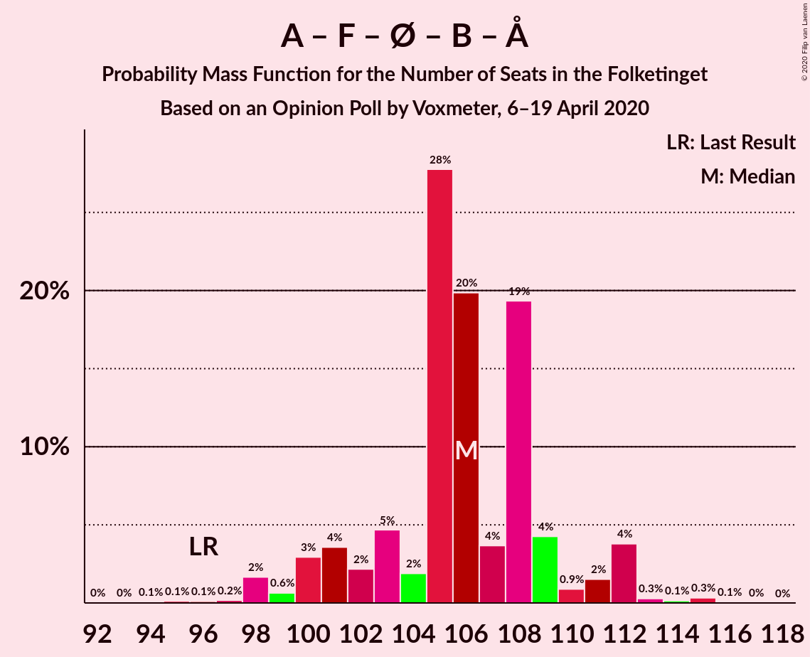

# Opinion Poll by Voxmeter, 6–19 April 2020

<a href="#voting-intentions">Voting Intentions</a> | <a href="#seats">Seats</a> | <a href="#coalitions">Coalitions</a> | <a href="#technical-information">Technical Information</a>

## Voting Intentions

### Confidence Intervals

| Party | Last Result | Poll Result | 80% Confidence Interval | 90% Confidence Interval | 95% Confidence Interval | 99% Confidence Interval |
|:-----:|:-----------:|:-----------:|:-----------------------:|:-----------------------:|:-----------------------:|:-----------------------:|
| Socialdemokraterne | 25.9% | 35.1% | 33.2–37.0% |32.7–37.6% |32.3–38.0% |31.4–39.0% |
| Venstre | 23.4% | 21.5% | 19.9–23.2% |19.5–23.7% |19.1–24.1% |18.4–24.9% |
| Socialistisk Folkeparti | 7.7% | 7.3% | 6.3–8.4% |6.1–8.7% |5.9–9.0% |5.4–9.6% |
| Enhedslisten–De Rød-Grønne | 6.9% | 7.2% | 6.2–8.3% |6.0–8.6% |5.8–8.9% |5.3–9.5% |
| Radikale Venstre | 8.6% | 7.2% | 6.2–8.3% |6.0–8.6% |5.8–8.9% |5.3–9.5% |
| Dansk Folkeparti | 8.7% | 6.8% | 5.9–7.9% |5.6–8.2% |5.4–8.5% |5.0–9.1% |
| Det Konservative Folkeparti | 6.6% | 6.1% | 5.3–7.2% |5.0–7.5% |4.8–7.8% |4.5–8.3% |
| Nye Borgerlige | 2.4% | 2.1% | 1.6–2.8% |1.5–3.0% |1.4–3.2% |1.2–3.6% |
| Stram Kurs | 1.8% | 1.5% | 1.1–2.1% |1.0–2.3% |0.9–2.5% |0.8–2.8% |
| Liberal Alliance | 2.3% | 1.4% | 1.1–2.0% |1.0–2.2% |0.9–2.4% |0.7–2.7% |
| Klaus Riskær Pedersen | 0.8% | 1.1% | 0.7–1.6% |0.7–1.8% |0.6–1.9% |0.5–2.2% |
| Alternativet | 3.0% | 0.8% | 0.5–1.2% |0.4–1.4% |0.4–1.5% |0.3–1.8% |

*Note:* The poll result column reflects the actual value used in the calculations. Published results may vary slightly, and in addition be rounded to fewer digits.

## Seats

### Confidence Intervals

| Party | Last Result | Median | 80% Confidence Interval | 90% Confidence Interval | 95% Confidence Interval | 99% Confidence Interval |
|:-----:|:-----------:|:------:|:-----------------------:|:-----------------------:|:-----------------------:|:-----------------------:|
| <a href="#socialdemokraterne">Socialdemokraterne</a> | 48 | 66 | 62–69 |60–70 |59–71 |58–71 |
| <a href="#venstre">Venstre</a> | 43 | 41 | 38–44 |37–44 |36–44 |35–46 |
| <a href="#socialistisk-folkeparti">Socialistisk Folkeparti</a> | 14 | 14 | 12–16 |11–16 |11–16 |10–17 |
| <a href="#enhedslisten–de-rød-grønne">Enhedslisten–De Rød-Grønne</a> | 13 | 13 | 12–17 |11–17 |11–17 |10–18 |
| <a href="#radikale-venstre">Radikale Venstre</a> | 16 | 13 | 12–15 |11–16 |11–17 |10–17 |
| <a href="#dansk-folkeparti">Dansk Folkeparti</a> | 16 | 12 | 11–14 |10–15 |10–15 |9–17 |
| <a href="#det-konservative-folkeparti">Det Konservative Folkeparti</a> | 12 | 11 | 10–13 |9–14 |9–14 |8–15 |
| <a href="#nye-borgerlige">Nye Borgerlige</a> | 4 | 4 | 0–5 |0–5 |0–6 |0–7 |
| <a href="#stram-kurs">Stram Kurs</a> | 0 | 0 | 0–4 |0–4 |0–4 |0–5 |
| <a href="#liberal-alliance">Liberal Alliance</a> | 4 | 0 | 0–4 |0–4 |0–4 |0–5 |
| <a href="#klaus-riskær-pedersen">Klaus Riskær Pedersen</a> | 0 | 0 | 0 |0 |0 |0–4 |
| <a href="#alternativet">Alternativet</a> | 5 | 0 | 0 |0 |0 |0 |

### Socialdemokraterne

*For a full overview of the results for this party, see the [Socialdemokraterne](party-socialdemokraterne.html) page.*

| Number of Seats | Probability | Accumulated | Special Marks |
|:---------------:|:-----------:|:-----------:|:-------------:|
| 48 | 0% | 100% | Last Result |
| 49 | 0% | 100% |  |
| 50 | 0% | 100% |  |
| 51 | 0% | 100% |  |
| 52 | 0% | 100% |  |
| 53 | 0% | 100% |  |
| 54 | 0% | 100% |  |
| 55 | 0% | 100% |  |
| 56 | 0.1% | 100% |  |
| 57 | 0.3% | 99.9% |  |
| 58 | 0.6% | 99.6% |  |
| 59 | 3% | 99.0% |  |
| 60 | 2% | 96% |  |
| 61 | 3% | 94% |  |
| 62 | 10% | 90% |  |
| 63 | 8% | 80% |  |
| 64 | 12% | 72% |  |
| 65 | 3% | 60% |  |
| 66 | 36% | 57% | Median |
| 67 | 3% | 21% |  |
| 68 | 4% | 19% |  |
| 69 | 6% | 14% |  |
| 70 | 4% | 8% |  |
| 71 | 4% | 4% |  |
| 72 | 0.1% | 0.4% |  |
| 73 | 0.2% | 0.3% |  |
| 74 | 0% | 0% |  |

### Venstre

*For a full overview of the results for this party, see the [Venstre](party-venstre.html) page.*

| Number of Seats | Probability | Accumulated | Special Marks |
|:---------------:|:-----------:|:-----------:|:-------------:|
| 32 | 0.1% | 100% |  |
| 33 | 0.1% | 99.9% |  |
| 34 | 0.2% | 99.8% |  |
| 35 | 2% | 99.6% |  |
| 36 | 2% | 98% |  |
| 37 | 5% | 96% |  |
| 38 | 22% | 91% |  |
| 39 | 5% | 69% |  |
| 40 | 12% | 64% |  |
| 41 | 26% | 52% | Median |
| 42 | 13% | 26% |  |
| 43 | 2% | 13% | Last Result |
| 44 | 8% | 11% |  |
| 45 | 1.4% | 2% |  |
| 46 | 0.7% | 0.9% |  |
| 47 | 0% | 0.2% |  |
| 48 | 0.1% | 0.1% |  |
| 49 | 0% | 0% |  |

### Socialistisk Folkeparti

*For a full overview of the results for this party, see the [Socialistisk Folkeparti](party-socialistiskfolkeparti.html) page.*

| Number of Seats | Probability | Accumulated | Special Marks |
|:---------------:|:-----------:|:-----------:|:-------------:|
| 9 | 0.1% | 100% |  |
| 10 | 0.5% | 99.9% |  |
| 11 | 6% | 99.5% |  |
| 12 | 17% | 93% |  |
| 13 | 24% | 76% |  |
| 14 | 10% | 52% | Last Result, Median |
| 15 | 22% | 42% |  |
| 16 | 18% | 20% |  |
| 17 | 2% | 2% |  |
| 18 | 0.1% | 0.2% |  |
| 19 | 0.1% | 0.1% |  |
| 20 | 0% | 0% |  |

### Enhedslisten–De Rød-Grønne

*For a full overview of the results for this party, see the [Enhedslisten–De Rød-Grønne](party-enhedslisten–derød-grønne.html) page.*

| Number of Seats | Probability | Accumulated | Special Marks |
|:---------------:|:-----------:|:-----------:|:-------------:|
| 9 | 0.2% | 100% |  |
| 10 | 0.6% | 99.8% |  |
| 11 | 5% | 99.3% |  |
| 12 | 11% | 94% |  |
| 13 | 44% | 83% | Last Result, Median |
| 14 | 14% | 39% |  |
| 15 | 11% | 26% |  |
| 16 | 4% | 15% |  |
| 17 | 10% | 11% |  |
| 18 | 0.5% | 0.6% |  |
| 19 | 0% | 0% |  |

### Radikale Venstre

*For a full overview of the results for this party, see the [Radikale Venstre](party-radikalevenstre.html) page.*

| Number of Seats | Probability | Accumulated | Special Marks |
|:---------------:|:-----------:|:-----------:|:-------------:|
| 9 | 0.2% | 100% |  |
| 10 | 2% | 99.7% |  |
| 11 | 6% | 98% |  |
| 12 | 21% | 92% |  |
| 13 | 41% | 72% | Median |
| 14 | 18% | 31% |  |
| 15 | 6% | 13% |  |
| 16 | 2% | 6% | Last Result |
| 17 | 4% | 4% |  |
| 18 | 0.3% | 0.3% |  |
| 19 | 0% | 0% |  |

### Dansk Folkeparti

*For a full overview of the results for this party, see the [Dansk Folkeparti](party-danskfolkeparti.html) page.*

| Number of Seats | Probability | Accumulated | Special Marks |
|:---------------:|:-----------:|:-----------:|:-------------:|
| 9 | 0.7% | 100% |  |
| 10 | 5% | 99.3% |  |
| 11 | 12% | 95% |  |
| 12 | 35% | 83% | Median |
| 13 | 28% | 47% |  |
| 14 | 12% | 19% |  |
| 15 | 5% | 8% |  |
| 16 | 2% | 2% | Last Result |
| 17 | 0.7% | 0.8% |  |
| 18 | 0.1% | 0.1% |  |
| 19 | 0% | 0% |  |

### Det Konservative Folkeparti

*For a full overview of the results for this party, see the [Det Konservative Folkeparti](party-detkonservativefolkeparti.html) page.*

| Number of Seats | Probability | Accumulated | Special Marks |
|:---------------:|:-----------:|:-----------:|:-------------:|
| 8 | 1.2% | 100% |  |
| 9 | 6% | 98.8% |  |
| 10 | 23% | 93% |  |
| 11 | 21% | 70% | Median |
| 12 | 27% | 50% | Last Result |
| 13 | 15% | 23% |  |
| 14 | 7% | 8% |  |
| 15 | 1.3% | 2% |  |
| 16 | 0.2% | 0.2% |  |
| 17 | 0% | 0% |  |

### Nye Borgerlige

*For a full overview of the results for this party, see the [Nye Borgerlige](party-nyeborgerlige.html) page.*

| Number of Seats | Probability | Accumulated | Special Marks |
|:---------------:|:-----------:|:-----------:|:-------------:|
| 0 | 49% | 100% |  |
| 1 | 0% | 51% |  |
| 2 | 0% | 51% |  |
| 3 | 0% | 51% |  |
| 4 | 37% | 51% | Last Result, Median |
| 5 | 9% | 13% |  |
| 6 | 4% | 5% |  |
| 7 | 0.8% | 0.9% |  |
| 8 | 0.1% | 0.1% |  |
| 9 | 0% | 0% |  |

### Stram Kurs

*For a full overview of the results for this party, see the [Stram Kurs](party-stramkurs.html) page.*

| Number of Seats | Probability | Accumulated | Special Marks |
|:---------------:|:-----------:|:-----------:|:-------------:|
| 0 | 84% | 100% | Last Result, Median |
| 1 | 0% | 16% |  |
| 2 | 0% | 16% |  |
| 3 | 0% | 16% |  |
| 4 | 14% | 16% |  |
| 5 | 2% | 2% |  |
| 6 | 0.1% | 0.2% |  |
| 7 | 0% | 0% |  |

### Liberal Alliance

*For a full overview of the results for this party, see the [Liberal Alliance](party-liberalalliance.html) page.*

| Number of Seats | Probability | Accumulated | Special Marks |
|:---------------:|:-----------:|:-----------:|:-------------:|
| 0 | 87% | 100% | Median |
| 1 | 0% | 13% |  |
| 2 | 0% | 13% |  |
| 3 | 0% | 13% |  |
| 4 | 12% | 13% | Last Result |
| 5 | 0.5% | 0.6% |  |
| 6 | 0.1% | 0.1% |  |
| 7 | 0% | 0% |  |

### Klaus Riskær Pedersen

*For a full overview of the results for this party, see the [Klaus Riskær Pedersen](party-klausriskærpedersen.html) page.*

| Number of Seats | Probability | Accumulated | Special Marks |
|:---------------:|:-----------:|:-----------:|:-------------:|
| 0 | 98% | 100% | Last Result, Median |
| 1 | 0% | 2% |  |
| 2 | 0% | 2% |  |
| 3 | 0% | 2% |  |
| 4 | 1.4% | 2% |  |
| 5 | 0.2% | 0.2% |  |
| 6 | 0% | 0% |  |

### Alternativet

*For a full overview of the results for this party, see the [Alternativet](party-alternativet.html) page.*

| Number of Seats | Probability | Accumulated | Special Marks |
|:---------------:|:-----------:|:-----------:|:-------------:|
| 0 | 99.9% | 100% | Median |
| 1 | 0% | 0.1% |  |
| 2 | 0% | 0.1% |  |
| 3 | 0% | 0.1% |  |
| 4 | 0.1% | 0.1% |  |
| 5 | 0% | 0% | Last Result |

## Coalitions

### Confidence Intervals

| Coalition | Last Result | Median | Majority? | 80% Confidence Interval | 90% Confidence Interval | 95% Confidence Interval | 99% Confidence Interval |
|:---------:|:-----------:|:------:|:---------:|:-----------------------:|:-----------------------:|:-----------------------:|:-----------------------:|
| Socialdemokraterne – Socialistisk Folkeparti – Enhedslisten–De Rød-Grønne – Radikale Venstre – Alternativet | 96 | 106 | 100% | 102–109 | 100–111 | 99–112 | 98–114 |
| Socialdemokraterne – Socialistisk Folkeparti – Enhedslisten–De Rød-Grønne – Radikale Venstre | 91 | 106 | 100% | 102–109 | 100–111 | 99–112 | 98–114 |
| Socialdemokraterne – Socialistisk Folkeparti – Enhedslisten–De Rød-Grønne – Alternativet | 80 | 92 | 88% | 88–97 | 87–98 | 85–99 | 84–99 |
| Socialdemokraterne – Socialistisk Folkeparti – Enhedslisten–De Rød-Grønne | 75 | 92 | 87% | 88–97 | 87–98 | 85–99 | 84–99 |
| Socialdemokraterne – Socialistisk Folkeparti – Radikale Venstre | 78 | 92 | 87% | 89–97 | 87–97 | 85–99 | 84–99 |
| Socialdemokraterne – Radikale Venstre | 64 | 79 | 0% | 76–81 | 73–83 | 72–84 | 70–85 |
| Venstre – Dansk Folkeparti – Det Konservative Folkeparti – Nye Borgerlige – Liberal Alliance – Klaus Riskær Pedersen | 79 | 68 | 0% | 62–70 | 60–71 | 60–73 | 60–75 |
| Venstre – Dansk Folkeparti – Det Konservative Folkeparti – Nye Borgerlige – Liberal Alliance | 79 | 68 | 0% | 62–70 | 60–71 | 60–73 | 60–74 |
| Venstre – Dansk Folkeparti – Det Konservative Folkeparti – Liberal Alliance | 75 | 65 | 0% | 60–68 | 60–70 | 58–70 | 58–74 |
| Venstre – Det Konservative Folkeparti – Liberal Alliance | 59 | 53 | 0% | 48–56 | 48–56 | 47–56 | 45–59 |
| Venstre – Det Konservative Folkeparti | 55 | 52 | 0% | 48–55 | 47–55 | 46–55 | 45–58 |
| Venstre | 43 | 41 | 0% | 38–44 | 37–44 | 36–44 | 35–46 |

### Socialdemokraterne – Socialistisk Folkeparti – Enhedslisten–De Rød-Grønne – Radikale Venstre – Alternativet

| Number of Seats | Probability | Accumulated | Special Marks |
|:---------------:|:-----------:|:-----------:|:-------------:|
| 94 | 0.1% | 100% |  |
| 95 | 0.1% | 99.9% |  |
| 96 | 0.1% | 99.8% | Last Result |
| 97 | 0.2% | 99.7% |  |
| 98 | 2% | 99.5% |  |
| 99 | 0.6% | 98% |  |
| 100 | 3% | 97% |  |
| 101 | 4% | 94% |  |
| 102 | 2% | 91% |  |
| 103 | 5% | 89% |  |
| 104 | 2% | 84% |  |
| 105 | 28% | 82% |  |
| 106 | 20% | 54% | Median |
| 107 | 4% | 34% |  |
| 108 | 19% | 31% |  |
| 109 | 4% | 11% |  |
| 110 | 0.9% | 7% |  |
| 111 | 2% | 6% |  |
| 112 | 4% | 5% |  |
| 113 | 0.3% | 0.9% |  |
| 114 | 0.1% | 0.6% |  |
| 115 | 0.3% | 0.4% |  |
| 116 | 0.1% | 0.1% |  |
| 117 | 0% | 0% |  |

### Socialdemokraterne – Socialistisk Folkeparti – Enhedslisten–De Rød-Grønne – Radikale Venstre

| Number of Seats | Probability | Accumulated | Special Marks |
|:---------------:|:-----------:|:-----------:|:-------------:|
| 91 | 0% | 100% | Last Result |
| 92 | 0% | 100% |  |
| 93 | 0% | 100% |  |
| 94 | 0.1% | 100% |  |
| 95 | 0.1% | 99.9% |  |
| 96 | 0.1% | 99.8% |  |
| 97 | 0.2% | 99.7% |  |
| 98 | 2% | 99.5% |  |
| 99 | 0.6% | 98% |  |
| 100 | 3% | 97% |  |
| 101 | 4% | 94% |  |
| 102 | 2% | 91% |  |
| 103 | 5% | 89% |  |
| 104 | 2% | 84% |  |
| 105 | 28% | 82% |  |
| 106 | 20% | 54% | Median |
| 107 | 4% | 34% |  |
| 108 | 19% | 31% |  |
| 109 | 4% | 11% |  |
| 110 | 0.8% | 7% |  |
| 111 | 2% | 6% |  |
| 112 | 4% | 5% |  |
| 113 | 0.3% | 0.9% |  |
| 114 | 0.1% | 0.6% |  |
| 115 | 0.3% | 0.4% |  |
| 116 | 0.1% | 0.1% |  |
| 117 | 0% | 0% |  |

### Socialdemokraterne – Socialistisk Folkeparti – Enhedslisten–De Rød-Grønne – Alternativet

| Number of Seats | Probability | Accumulated | Special Marks |
|:---------------:|:-----------:|:-----------:|:-------------:|
| 80 | 0% | 100% | Last Result |
| 81 | 0% | 100% |  |
| 82 | 0.2% | 99.9% |  |
| 83 | 0.3% | 99.8% |  |
| 84 | 0.3% | 99.5% |  |
| 85 | 2% | 99.3% |  |
| 86 | 1.5% | 97% |  |
| 87 | 3% | 96% |  |
| 88 | 4% | 93% |  |
| 89 | 2% | 90% |  |
| 90 | 3% | 88% | Majority |
| 91 | 11% | 84% |  |
| 92 | 32% | 74% |  |
| 93 | 3% | 42% | Median |
| 94 | 12% | 38% |  |
| 95 | 9% | 26% |  |
| 96 | 6% | 17% |  |
| 97 | 4% | 11% |  |
| 98 | 3% | 7% |  |
| 99 | 4% | 5% |  |
| 100 | 0.2% | 0.5% |  |
| 101 | 0.1% | 0.2% |  |
| 102 | 0.1% | 0.2% |  |
| 103 | 0.1% | 0.1% |  |
| 104 | 0% | 0% |  |

### Socialdemokraterne – Socialistisk Folkeparti – Enhedslisten–De Rød-Grønne

| Number of Seats | Probability | Accumulated | Special Marks |
|:---------------:|:-----------:|:-----------:|:-------------:|
| 75 | 0% | 100% | Last Result |
| 76 | 0% | 100% |  |
| 77 | 0% | 100% |  |
| 78 | 0% | 100% |  |
| 79 | 0% | 100% |  |
| 80 | 0% | 100% |  |
| 81 | 0% | 100% |  |
| 82 | 0.2% | 99.9% |  |
| 83 | 0.3% | 99.8% |  |
| 84 | 0.3% | 99.5% |  |
| 85 | 2% | 99.2% |  |
| 86 | 1.5% | 97% |  |
| 87 | 3% | 96% |  |
| 88 | 4% | 93% |  |
| 89 | 2% | 90% |  |
| 90 | 3% | 87% | Majority |
| 91 | 11% | 84% |  |
| 92 | 32% | 74% |  |
| 93 | 3% | 42% | Median |
| 94 | 12% | 38% |  |
| 95 | 9% | 26% |  |
| 96 | 6% | 17% |  |
| 97 | 4% | 11% |  |
| 98 | 3% | 7% |  |
| 99 | 4% | 5% |  |
| 100 | 0.2% | 0.5% |  |
| 101 | 0.1% | 0.2% |  |
| 102 | 0.1% | 0.2% |  |
| 103 | 0.1% | 0.1% |  |
| 104 | 0% | 0% |  |

### Socialdemokraterne – Socialistisk Folkeparti – Radikale Venstre

| Number of Seats | Probability | Accumulated | Special Marks |
|:---------------:|:-----------:|:-----------:|:-------------:|
| 78 | 0% | 100% | Last Result |
| 79 | 0% | 100% |  |
| 80 | 0% | 100% |  |
| 81 | 0.1% | 100% |  |
| 82 | 0.1% | 99.9% |  |
| 83 | 0.1% | 99.9% |  |
| 84 | 1.1% | 99.7% |  |
| 85 | 1.3% | 98.6% |  |
| 86 | 1.3% | 97% |  |
| 87 | 2% | 96% |  |
| 88 | 4% | 94% |  |
| 89 | 3% | 90% |  |
| 90 | 3% | 87% | Majority |
| 91 | 20% | 84% |  |
| 92 | 37% | 64% |  |
| 93 | 2% | 27% | Median |
| 94 | 4% | 24% |  |
| 95 | 9% | 21% |  |
| 96 | 0.6% | 12% |  |
| 97 | 6% | 11% |  |
| 98 | 0.5% | 5% |  |
| 99 | 4% | 4% |  |
| 100 | 0.1% | 0.5% |  |
| 101 | 0.3% | 0.4% |  |
| 102 | 0.1% | 0.1% |  |
| 103 | 0% | 0% |  |

### Socialdemokraterne – Radikale Venstre

| Number of Seats | Probability | Accumulated | Special Marks |
|:---------------:|:-----------:|:-----------:|:-------------:|
| 64 | 0% | 100% | Last Result |
| 65 | 0% | 100% |  |
| 66 | 0% | 100% |  |
| 67 | 0% | 100% |  |
| 68 | 0% | 100% |  |
| 69 | 0.2% | 99.9% |  |
| 70 | 0.4% | 99.8% |  |
| 71 | 0.9% | 99.4% |  |
| 72 | 3% | 98% |  |
| 73 | 2% | 96% |  |
| 74 | 2% | 94% |  |
| 75 | 2% | 92% |  |
| 76 | 19% | 90% |  |
| 77 | 9% | 71% |  |
| 78 | 3% | 62% |  |
| 79 | 32% | 59% | Median |
| 80 | 6% | 27% |  |
| 81 | 12% | 21% |  |
| 82 | 3% | 9% |  |
| 83 | 1.3% | 6% |  |
| 84 | 4% | 5% |  |
| 85 | 0.2% | 0.7% |  |
| 86 | 0.3% | 0.5% |  |
| 87 | 0.1% | 0.2% |  |
| 88 | 0% | 0% |  |

### Venstre – Dansk Folkeparti – Det Konservative Folkeparti – Nye Borgerlige – Liberal Alliance – Klaus Riskær Pedersen

| Number of Seats | Probability | Accumulated | Special Marks |
|:---------------:|:-----------:|:-----------:|:-------------:|
| 58 | 0.1% | 100% |  |
| 59 | 0.1% | 99.9% |  |
| 60 | 9% | 99.7% |  |
| 61 | 0.3% | 90% |  |
| 62 | 4% | 90% |  |
| 63 | 11% | 86% |  |
| 64 | 3% | 75% |  |
| 65 | 2% | 72% |  |
| 66 | 2% | 70% |  |
| 67 | 15% | 67% |  |
| 68 | 6% | 52% | Median |
| 69 | 11% | 46% |  |
| 70 | 28% | 34% |  |
| 71 | 2% | 7% |  |
| 72 | 1.3% | 5% |  |
| 73 | 2% | 3% |  |
| 74 | 0.9% | 2% |  |
| 75 | 0.4% | 0.6% |  |
| 76 | 0.1% | 0.2% |  |
| 77 | 0.1% | 0.1% |  |
| 78 | 0% | 0% |  |
| 79 | 0% | 0% | Last Result |

### Venstre – Dansk Folkeparti – Det Konservative Folkeparti – Nye Borgerlige – Liberal Alliance

| Number of Seats | Probability | Accumulated | Special Marks |
|:---------------:|:-----------:|:-----------:|:-------------:|
| 57 | 0% | 100% |  |
| 58 | 0.1% | 99.9% |  |
| 59 | 0.1% | 99.9% |  |
| 60 | 9% | 99.7% |  |
| 61 | 0.3% | 90% |  |
| 62 | 4% | 90% |  |
| 63 | 11% | 86% |  |
| 64 | 3% | 74% |  |
| 65 | 2% | 71% |  |
| 66 | 3% | 69% |  |
| 67 | 15% | 66% |  |
| 68 | 6% | 51% | Median |
| 69 | 11% | 45% |  |
| 70 | 27% | 34% |  |
| 71 | 2% | 6% |  |
| 72 | 1.1% | 4% |  |
| 73 | 2% | 3% |  |
| 74 | 0.9% | 1.4% |  |
| 75 | 0.3% | 0.5% |  |
| 76 | 0.1% | 0.2% |  |
| 77 | 0.1% | 0.1% |  |
| 78 | 0% | 0% |  |
| 79 | 0% | 0% | Last Result |

### Venstre – Dansk Folkeparti – Det Konservative Folkeparti – Liberal Alliance

| Number of Seats | Probability | Accumulated | Special Marks |
|:---------------:|:-----------:|:-----------:|:-------------:|
| 56 | 0.2% | 100% |  |
| 57 | 0.1% | 99.8% |  |
| 58 | 4% | 99.7% |  |
| 59 | 0.6% | 96% |  |
| 60 | 10% | 95% |  |
| 61 | 2% | 85% |  |
| 62 | 7% | 83% |  |
| 63 | 12% | 76% |  |
| 64 | 4% | 64% | Median |
| 65 | 11% | 60% |  |
| 66 | 23% | 49% |  |
| 67 | 12% | 26% |  |
| 68 | 4% | 14% |  |
| 69 | 2% | 10% |  |
| 70 | 6% | 8% |  |
| 71 | 0.3% | 2% |  |
| 72 | 0.6% | 2% |  |
| 73 | 0.6% | 1.1% |  |
| 74 | 0.5% | 0.6% |  |
| 75 | 0% | 0% | Last Result |

### Venstre – Det Konservative Folkeparti – Liberal Alliance

| Number of Seats | Probability | Accumulated | Special Marks |
|:---------------:|:-----------:|:-----------:|:-------------:|
| 43 | 0.1% | 100% |  |
| 44 | 0.1% | 99.9% |  |
| 45 | 0.9% | 99.9% |  |
| 46 | 1.3% | 99.0% |  |
| 47 | 1.2% | 98% |  |
| 48 | 16% | 97% |  |
| 49 | 3% | 81% |  |
| 50 | 3% | 77% |  |
| 51 | 7% | 75% |  |
| 52 | 9% | 68% | Median |
| 53 | 32% | 58% |  |
| 54 | 3% | 26% |  |
| 55 | 12% | 23% |  |
| 56 | 9% | 11% |  |
| 57 | 1.1% | 2% |  |
| 58 | 0.5% | 1.4% |  |
| 59 | 0.6% | 0.9% | Last Result |
| 60 | 0.2% | 0.3% |  |
| 61 | 0.1% | 0.1% |  |
| 62 | 0% | 0.1% |  |
| 63 | 0% | 0% |  |

### Venstre – Det Konservative Folkeparti

| Number of Seats | Probability | Accumulated | Special Marks |
|:---------------:|:-----------:|:-----------:|:-------------:|
| 43 | 0.1% | 100% |  |
| 44 | 0.2% | 99.9% |  |
| 45 | 0.9% | 99.7% |  |
| 46 | 2% | 98.8% |  |
| 47 | 1.5% | 96% |  |
| 48 | 16% | 95% |  |
| 49 | 4% | 79% |  |
| 50 | 2% | 74% |  |
| 51 | 7% | 73% |  |
| 52 | 17% | 65% | Median |
| 53 | 32% | 49% |  |
| 54 | 3% | 17% |  |
| 55 | 12% | 14% | Last Result |
| 56 | 1.1% | 2% |  |
| 57 | 0.7% | 1.2% |  |
| 58 | 0.3% | 0.5% |  |
| 59 | 0.2% | 0.3% |  |
| 60 | 0% | 0.1% |  |
| 61 | 0% | 0% |  |

### Venstre

| Number of Seats | Probability | Accumulated | Special Marks |
|:---------------:|:-----------:|:-----------:|:-------------:|
| 32 | 0.1% | 100% |  |
| 33 | 0.1% | 99.9% |  |
| 34 | 0.2% | 99.8% |  |
| 35 | 2% | 99.6% |  |
| 36 | 2% | 98% |  |
| 37 | 5% | 96% |  |
| 38 | 22% | 91% |  |
| 39 | 5% | 69% |  |
| 40 | 12% | 64% |  |
| 41 | 26% | 52% | Median |
| 42 | 13% | 26% |  |
| 43 | 2% | 13% | Last Result |
| 44 | 8% | 11% |  |
| 45 | 1.4% | 2% |  |
| 46 | 0.7% | 0.9% |  |
| 47 | 0% | 0.2% |  |
| 48 | 0.1% | 0.1% |  |
| 49 | 0% | 0% |  |

## Technical Information

### Opinion Poll

+ **Polling firm:** Voxmeter
+ **Commissioner(s):** —
+ **Fieldwork period:** 6–19 April 2020

### Calculations

+ **Sample size:** 1043
+ **Simulations done:** 1,048,576
+ **Error estimate:** 2.10%

