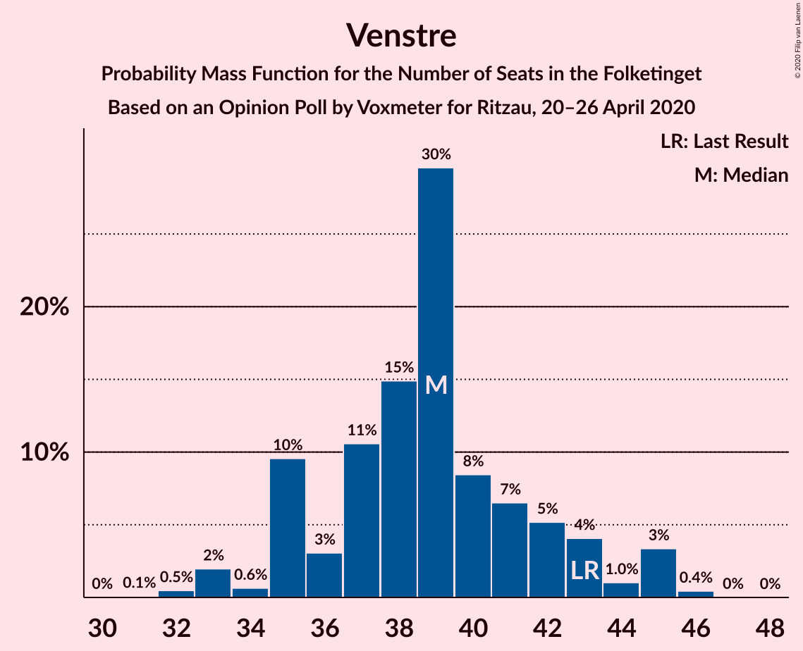
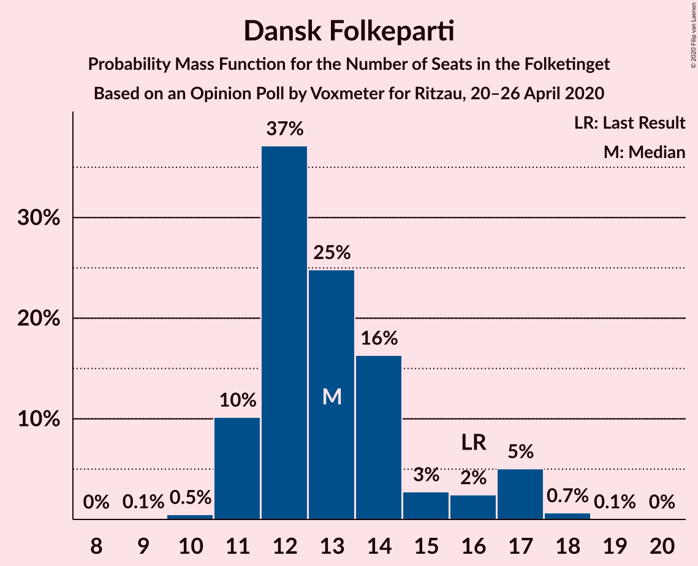
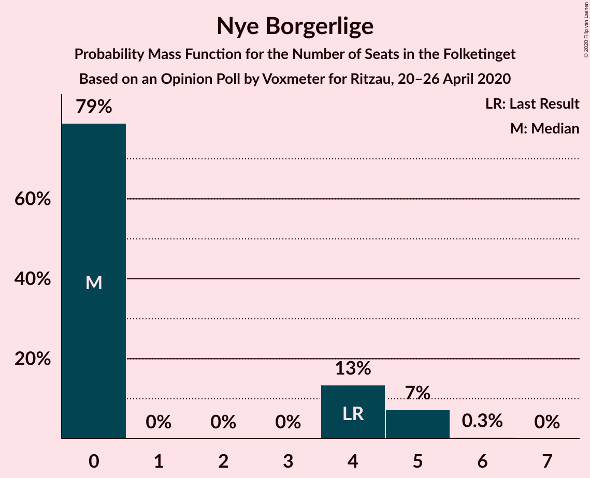
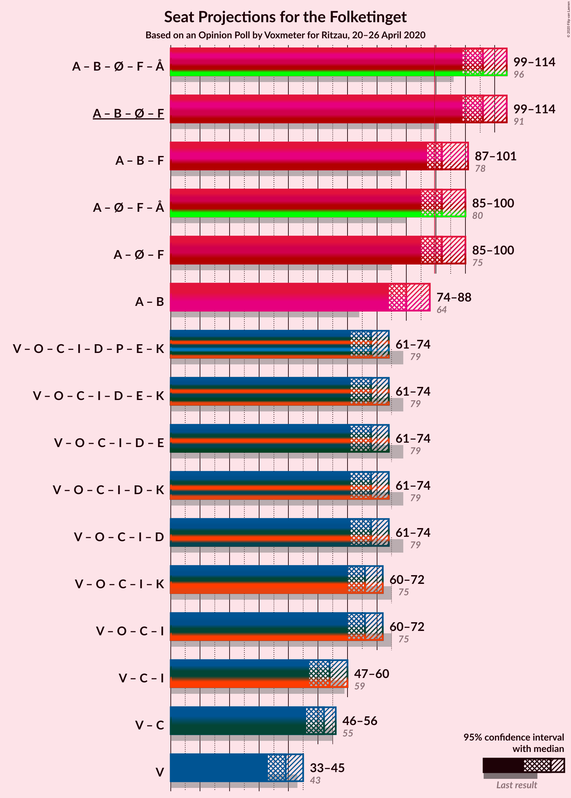
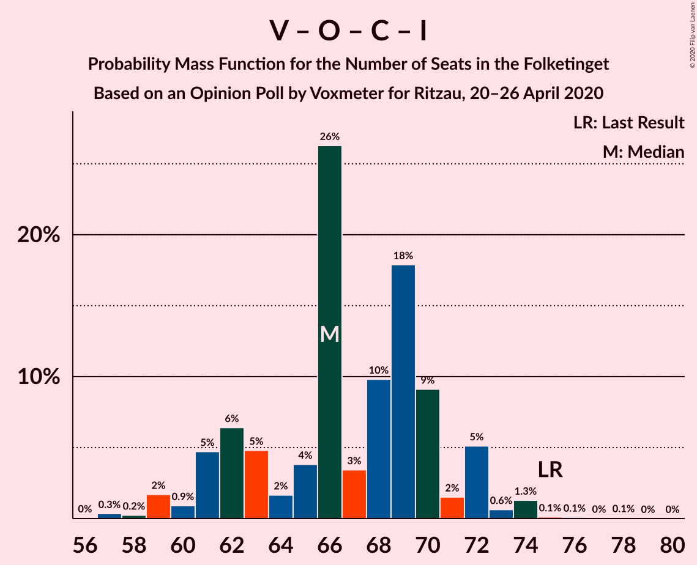

# Opinion Poll by Voxmeter for Ritzau, 20–26 April 2020

<a href="#voting-intentions">Voting Intentions</a> | <a href="#seats">Seats</a> | <a href="#coalitions">Coalitions</a> | <a href="#technical-information">Technical Information</a>

## Voting Intentions

### Confidence Intervals

| Party | Last Result | Poll Result | 80% Confidence Interval | 90% Confidence Interval | 95% Confidence Interval | 99% Confidence Interval |
|:-----:|:-----------:|:-----------:|:-----------------------:|:-----------------------:|:-----------------------:|:-----------------------:|
| Socialdemokraterne | 25.9% | 35.6% | 33.7–37.5% |33.2–38.1% |32.7–38.5% |31.8–39.5% |
| Venstre | 23.4% | 20.9% | 19.3–22.6% |18.9–23.1% |18.5–23.5% |17.8–24.3% |
| Radikale Venstre | 8.6% | 7.7% | 6.7–8.9% |6.4–9.2% |6.2–9.5% |5.8–10.1% |
| Dansk Folkeparti | 8.7% | 7.2% | 6.2–8.3% |6.0–8.7% |5.8–8.9% |5.3–9.5% |
| Enhedslisten–De Rød-Grønne | 6.9% | 7.1% | 6.2–8.2% |5.9–8.6% |5.7–8.8% |5.3–9.4% |
| Socialistisk Folkeparti | 7.7% | 6.9% | 6.0–8.0% |5.7–8.3% |5.5–8.6% |5.1–9.2% |
| Det Konservative Folkeparti | 6.6% | 6.6% | 5.7–7.7% |5.5–8.0% |5.2–8.3% |4.8–8.9% |
| Liberal Alliance | 2.3% | 1.9% | 1.5–2.6% |1.4–2.8% |1.3–3.0% |1.1–3.4% |
| Nye Borgerlige | 2.4% | 1.6% | 1.2–2.2% |1.1–2.4% |1.0–2.5% |0.8–2.9% |
| Stram Kurs | 1.8% | 1.4% | 1.0–2.0% |0.9–2.1% |0.8–2.3% |0.7–2.6% |
| Klaus Riskær Pedersen | 0.8% | 1.1% | 0.7–1.6% |0.7–1.8% |0.6–1.9% |0.5–2.2% |
| Alternativet | 3.0% | 0.5% | 0.3–0.9% |0.2–1.0% |0.2–1.1% |0.1–1.4% |

*Note:* The poll result column reflects the actual value used in the calculations. Published results may vary slightly, and in addition be rounded to fewer digits.

## Seats

### Confidence Intervals

| Party | Last Result | Median | 80% Confidence Interval | 90% Confidence Interval | 95% Confidence Interval | 99% Confidence Interval |
|:-----:|:-----------:|:------:|:-----------------------:|:-----------------------:|:-----------------------:|:-----------------------:|
| <a href="#socialdemokraterne">Socialdemokraterne</a> | 48 | 66 | 61–69 |61–71 |60–73 |58–75 |
| <a href="#venstre">Venstre</a> | 43 | 39 | 35–42 |35–43 |33–45 |32–45 |
| <a href="#radikale-venstre">Radikale Venstre</a> | 16 | 13 | 12–16 |11–17 |11–17 |11–18 |
| <a href="#dansk-folkeparti">Dansk Folkeparti</a> | 16 | 13 | 11–15 |11–17 |11–17 |10–18 |
| <a href="#enhedslisten–de-rød-grønne">Enhedslisten–De Rød-Grønne</a> | 13 | 13 | 11–15 |11–16 |10–16 |9–17 |
| <a href="#socialistisk-folkeparti">Socialistisk Folkeparti</a> | 14 | 13 | 11–15 |10–15 |10–15 |10–17 |
| <a href="#det-konservative-folkeparti">Det Konservative Folkeparti</a> | 12 | 13 | 11–15 |10–15 |10–15 |9–16 |
| <a href="#liberal-alliance">Liberal Alliance</a> | 4 | 0 | 0–6 |0–6 |0–6 |0–7 |
| <a href="#nye-borgerlige">Nye Borgerlige</a> | 4 | 0 | 0–4 |0–5 |0–5 |0–5 |
| <a href="#stram-kurs">Stram Kurs</a> | 0 | 0 | 0–4 |0–4 |0–4 |0–5 |
| <a href="#klaus-riskær-pedersen">Klaus Riskær Pedersen</a> | 0 | 0 | 0 |0 |0 |0–4 |
| <a href="#alternativet">Alternativet</a> | 5 | 0 | 0 |0 |0 |0 |

### Socialdemokraterne

*For a full overview of the results for this party, see the [Socialdemokraterne](party-socialdemokraterne.html) page.*

| Number of Seats | Probability | Accumulated | Special Marks |
|:---------------:|:-----------:|:-----------:|:-------------:|
| 48 | 0% | 100% | Last Result |
| 49 | 0% | 100% |  |
| 50 | 0% | 100% |  |
| 51 | 0% | 100% |  |
| 52 | 0% | 100% |  |
| 53 | 0% | 100% |  |
| 54 | 0% | 100% |  |
| 55 | 0% | 100% |  |
| 56 | 0.1% | 100% |  |
| 57 | 0% | 99.9% |  |
| 58 | 0.6% | 99.9% |  |
| 59 | 0.8% | 99.3% |  |
| 60 | 1.5% | 98.5% |  |
| 61 | 8% | 97% |  |
| 62 | 5% | 89% |  |
| 63 | 13% | 83% |  |
| 64 | 9% | 70% |  |
| 65 | 9% | 61% |  |
| 66 | 8% | 51% | Median |
| 67 | 3% | 44% |  |
| 68 | 26% | 41% |  |
| 69 | 4% | 14% |  |
| 70 | 3% | 10% |  |
| 71 | 2% | 7% |  |
| 72 | 2% | 5% |  |
| 73 | 1.0% | 3% |  |
| 74 | 0% | 2% |  |
| 75 | 2% | 2% |  |
| 76 | 0% | 0% |  |

### Venstre

*For a full overview of the results for this party, see the [Venstre](party-venstre.html) page.*

| Number of Seats | Probability | Accumulated | Special Marks |
|:---------------:|:-----------:|:-----------:|:-------------:|
| 31 | 0.1% | 100% |  |
| 32 | 0.5% | 99.9% |  |
| 33 | 2% | 99.4% |  |
| 34 | 0.6% | 97% |  |
| 35 | 10% | 97% |  |
| 36 | 3% | 87% |  |
| 37 | 11% | 84% |  |
| 38 | 15% | 74% |  |
| 39 | 30% | 59% | Median |
| 40 | 8% | 29% |  |
| 41 | 7% | 21% |  |
| 42 | 5% | 14% |  |
| 43 | 4% | 9% | Last Result |
| 44 | 1.0% | 5% |  |
| 45 | 3% | 4% |  |
| 46 | 0.4% | 0.5% |  |
| 47 | 0% | 0% |  |

### Radikale Venstre

*For a full overview of the results for this party, see the [Radikale Venstre](party-radikalevenstre.html) page.*

| Number of Seats | Probability | Accumulated | Special Marks |
|:---------------:|:-----------:|:-----------:|:-------------:|
| 9 | 0.1% | 100% |  |
| 10 | 0.2% | 99.9% |  |
| 11 | 6% | 99.8% |  |
| 12 | 13% | 94% |  |
| 13 | 36% | 81% | Median |
| 14 | 17% | 45% |  |
| 15 | 13% | 28% |  |
| 16 | 9% | 14% | Last Result |
| 17 | 4% | 6% |  |
| 18 | 2% | 2% |  |
| 19 | 0.4% | 0.4% |  |
| 20 | 0% | 0% |  |

### Dansk Folkeparti

*For a full overview of the results for this party, see the [Dansk Folkeparti](party-danskfolkeparti.html) page.*

| Number of Seats | Probability | Accumulated | Special Marks |
|:---------------:|:-----------:|:-----------:|:-------------:|
| 9 | 0.1% | 100% |  |
| 10 | 0.5% | 99.9% |  |
| 11 | 10% | 99.4% |  |
| 12 | 37% | 89% |  |
| 13 | 25% | 52% | Median |
| 14 | 16% | 27% |  |
| 15 | 3% | 11% |  |
| 16 | 2% | 8% | Last Result |
| 17 | 5% | 6% |  |
| 18 | 0.7% | 0.7% |  |
| 19 | 0.1% | 0.1% |  |
| 20 | 0% | 0% |  |

### Enhedslisten–De Rød-Grønne

*For a full overview of the results for this party, see the [Enhedslisten–De Rød-Grønne](party-enhedslisten–derød-grønne.html) page.*

| Number of Seats | Probability | Accumulated | Special Marks |
|:---------------:|:-----------:|:-----------:|:-------------:|
| 9 | 1.4% | 100% |  |
| 10 | 2% | 98.6% |  |
| 11 | 8% | 97% |  |
| 12 | 15% | 89% |  |
| 13 | 42% | 74% | Last Result, Median |
| 14 | 13% | 32% |  |
| 15 | 11% | 19% |  |
| 16 | 6% | 7% |  |
| 17 | 2% | 2% |  |
| 18 | 0.2% | 0.2% |  |
| 19 | 0% | 0% |  |

### Socialistisk Folkeparti

*For a full overview of the results for this party, see the [Socialistisk Folkeparti](party-socialistiskfolkeparti.html) page.*

| Number of Seats | Probability | Accumulated | Special Marks |
|:---------------:|:-----------:|:-----------:|:-------------:|
| 8 | 0.1% | 100% |  |
| 9 | 0.3% | 99.9% |  |
| 10 | 7% | 99.6% |  |
| 11 | 16% | 93% |  |
| 12 | 17% | 77% |  |
| 13 | 25% | 60% | Median |
| 14 | 9% | 35% | Last Result |
| 15 | 24% | 26% |  |
| 16 | 1.0% | 2% |  |
| 17 | 0.7% | 0.9% |  |
| 18 | 0.1% | 0.2% |  |
| 19 | 0.1% | 0.1% |  |
| 20 | 0% | 0% |  |

### Det Konservative Folkeparti

*For a full overview of the results for this party, see the [Det Konservative Folkeparti](party-detkonservativefolkeparti.html) page.*

| Number of Seats | Probability | Accumulated | Special Marks |
|:---------------:|:-----------:|:-----------:|:-------------:|
| 8 | 0.1% | 100% |  |
| 9 | 2% | 99.9% |  |
| 10 | 7% | 98% |  |
| 11 | 18% | 91% |  |
| 12 | 18% | 73% | Last Result |
| 13 | 18% | 54% | Median |
| 14 | 13% | 37% |  |
| 15 | 23% | 24% |  |
| 16 | 0.5% | 0.9% |  |
| 17 | 0.4% | 0.5% |  |
| 18 | 0.1% | 0.1% |  |
| 19 | 0% | 0% |  |

### Liberal Alliance

*For a full overview of the results for this party, see the [Liberal Alliance](party-liberalalliance.html) page.*

| Number of Seats | Probability | Accumulated | Special Marks |
|:---------------:|:-----------:|:-----------:|:-------------:|
| 0 | 54% | 100% | Median |
| 1 | 0% | 46% |  |
| 2 | 0% | 46% |  |
| 3 | 0% | 46% |  |
| 4 | 17% | 46% | Last Result |
| 5 | 19% | 29% |  |
| 6 | 9% | 10% |  |
| 7 | 1.1% | 1.2% |  |
| 8 | 0% | 0% |  |

### Nye Borgerlige

*For a full overview of the results for this party, see the [Nye Borgerlige](party-nyeborgerlige.html) page.*

| Number of Seats | Probability | Accumulated | Special Marks |
|:---------------:|:-----------:|:-----------:|:-------------:|
| 0 | 79% | 100% | Median |
| 1 | 0% | 21% |  |
| 2 | 0% | 21% |  |
| 3 | 0% | 21% |  |
| 4 | 13% | 21% | Last Result |
| 5 | 7% | 8% |  |
| 6 | 0.3% | 0.3% |  |
| 7 | 0% | 0% |  |

### Stram Kurs

*For a full overview of the results for this party, see the [Stram Kurs](party-stramkurs.html) page.*

| Number of Seats | Probability | Accumulated | Special Marks |
|:---------------:|:-----------:|:-----------:|:-------------:|
| 0 | 88% | 100% | Last Result, Median |
| 1 | 0% | 12% |  |
| 2 | 0% | 12% |  |
| 3 | 0% | 12% |  |
| 4 | 11% | 12% |  |
| 5 | 1.0% | 1.1% |  |
| 6 | 0.2% | 0.2% |  |
| 7 | 0% | 0% |  |

### Klaus Riskær Pedersen

*For a full overview of the results for this party, see the [Klaus Riskær Pedersen](party-klausriskærpedersen.html) page.*

| Number of Seats | Probability | Accumulated | Special Marks |
|:---------------:|:-----------:|:-----------:|:-------------:|
| 0 | 99.1% | 100% | Last Result, Median |
| 1 | 0% | 0.9% |  |
| 2 | 0% | 0.9% |  |
| 3 | 0% | 0.9% |  |
| 4 | 0.8% | 0.9% |  |
| 5 | 0.1% | 0.1% |  |
| 6 | 0% | 0% |  |

### Alternativet

*For a full overview of the results for this party, see the [Alternativet](party-alternativet.html) page.*

| Number of Seats | Probability | Accumulated | Special Marks |
|:---------------:|:-----------:|:-----------:|:-------------:|
| 0 | 100% | 100% | Median |
| 1 | 0% | 0% |  |
| 2 | 0% | 0% |  |
| 3 | 0% | 0% |  |
| 4 | 0% | 0% |  |
| 5 | 0% | 0% | Last Result |

## Coalitions

### Confidence Intervals

| Coalition | Last Result | Median | Majority? | 80% Confidence Interval | 90% Confidence Interval | 95% Confidence Interval | 99% Confidence Interval |
|:---------:|:-----------:|:------:|:---------:|:-----------------------:|:-----------------------:|:-----------------------:|:-----------------------:|
| Socialdemokraterne – Radikale Venstre – Enhedslisten–De Rød-Grønne – Socialistisk Folkeparti – Alternativet | 96 | 106 | 100% | 101–109 | 100–112 | 99–114 | 96–115 |
| Socialdemokraterne – Radikale Venstre – Enhedslisten–De Rød-Grønne – Socialistisk Folkeparti | 91 | 106 | 100% | 101–109 | 100–112 | 99–114 | 96–115 |
| Socialdemokraterne – Radikale Venstre – Socialistisk Folkeparti | 78 | 92 | 70% | 88–96 | 87–99 | 87–101 | 84–102 |
| Socialdemokraterne – Enhedslisten–De Rød-Grønne – Socialistisk Folkeparti – Alternativet | 80 | 92 | 64% | 86–96 | 86–97 | 85–100 | 83–101 |
| Socialdemokraterne – Enhedslisten–De Rød-Grønne – Socialistisk Folkeparti | 75 | 92 | 64% | 86–96 | 86–97 | 85–100 | 83–101 |
| Socialdemokraterne – Radikale Venstre | 64 | 80 | 0.2% | 76–84 | 75–85 | 74–88 | 72–89 |
| Venstre – Dansk Folkeparti – Det Konservative Folkeparti – Liberal Alliance – Nye Borgerlige – Klaus Riskær Pedersen | 79 | 68 | 0% | 63–72 | 61–74 | 61–74 | 59–77 |
| Venstre – Dansk Folkeparti – Det Konservative Folkeparti – Liberal Alliance – Nye Borgerlige | 79 | 68 | 0% | 63–72 | 61–73 | 61–74 | 59–76 |
| Venstre – Dansk Folkeparti – Det Konservative Folkeparti – Liberal Alliance | 75 | 66 | 0% | 62–70 | 61–72 | 60–72 | 58–74 |
| Venstre – Det Konservative Folkeparti – Liberal Alliance | 59 | 54 | 0% | 49–58 | 49–59 | 47–60 | 46–61 |
| Venstre – Det Konservative Folkeparti | 55 | 52 | 0% | 48–55 | 46–56 | 46–56 | 44–59 |
| Venstre | 43 | 39 | 0% | 35–42 | 35–43 | 33–45 | 32–45 |

### Socialdemokraterne – Radikale Venstre – Enhedslisten–De Rød-Grønne – Socialistisk Folkeparti – Alternativet

| Number of Seats | Probability | Accumulated | Special Marks |
|:---------------:|:-----------:|:-----------:|:-------------:|
| 95 | 0.1% | 100% |  |
| 96 | 0.8% | 99.9% | Last Result |
| 97 | 0.6% | 99.1% |  |
| 98 | 0.9% | 98.5% |  |
| 99 | 1.2% | 98% |  |
| 100 | 3% | 96% |  |
| 101 | 10% | 94% |  |
| 102 | 13% | 84% |  |
| 103 | 10% | 71% |  |
| 104 | 3% | 62% |  |
| 105 | 5% | 59% | Median |
| 106 | 9% | 54% |  |
| 107 | 7% | 45% |  |
| 108 | 5% | 38% |  |
| 109 | 25% | 33% |  |
| 110 | 2% | 9% |  |
| 111 | 0.7% | 6% |  |
| 112 | 3% | 6% |  |
| 113 | 0.5% | 3% |  |
| 114 | 2% | 3% |  |
| 115 | 0.5% | 0.7% |  |
| 116 | 0% | 0.1% |  |
| 117 | 0.1% | 0.1% |  |
| 118 | 0% | 0% |  |

### Socialdemokraterne – Radikale Venstre – Enhedslisten–De Rød-Grønne – Socialistisk Folkeparti

| Number of Seats | Probability | Accumulated | Special Marks |
|:---------------:|:-----------:|:-----------:|:-------------:|
| 91 | 0% | 100% | Last Result |
| 92 | 0% | 100% |  |
| 93 | 0% | 100% |  |
| 94 | 0% | 100% |  |
| 95 | 0.1% | 100% |  |
| 96 | 0.8% | 99.9% |  |
| 97 | 0.6% | 99.1% |  |
| 98 | 0.9% | 98.5% |  |
| 99 | 1.2% | 98% |  |
| 100 | 3% | 96% |  |
| 101 | 10% | 94% |  |
| 102 | 13% | 84% |  |
| 103 | 10% | 71% |  |
| 104 | 3% | 62% |  |
| 105 | 5% | 59% | Median |
| 106 | 9% | 54% |  |
| 107 | 7% | 45% |  |
| 108 | 5% | 38% |  |
| 109 | 25% | 33% |  |
| 110 | 2% | 9% |  |
| 111 | 0.7% | 6% |  |
| 112 | 3% | 6% |  |
| 113 | 0.5% | 3% |  |
| 114 | 2% | 3% |  |
| 115 | 0.5% | 0.7% |  |
| 116 | 0% | 0.1% |  |
| 117 | 0.1% | 0.1% |  |
| 118 | 0% | 0% |  |

### Socialdemokraterne – Radikale Venstre – Socialistisk Folkeparti

| Number of Seats | Probability | Accumulated | Special Marks |
|:---------------:|:-----------:|:-----------:|:-------------:|
| 78 | 0% | 100% | Last Result |
| 79 | 0% | 100% |  |
| 80 | 0% | 100% |  |
| 81 | 0% | 100% |  |
| 82 | 0% | 99.9% |  |
| 83 | 0.1% | 99.9% |  |
| 84 | 0.3% | 99.8% |  |
| 85 | 1.4% | 99.5% |  |
| 86 | 0.5% | 98% |  |
| 87 | 5% | 98% |  |
| 88 | 7% | 93% |  |
| 89 | 15% | 85% |  |
| 90 | 7% | 70% | Majority |
| 91 | 9% | 63% |  |
| 92 | 9% | 54% | Median |
| 93 | 5% | 45% |  |
| 94 | 7% | 40% |  |
| 95 | 2% | 34% |  |
| 96 | 23% | 32% |  |
| 97 | 3% | 9% |  |
| 98 | 0.6% | 6% |  |
| 99 | 2% | 5% |  |
| 100 | 1.0% | 4% |  |
| 101 | 2% | 3% |  |
| 102 | 0.6% | 0.7% |  |
| 103 | 0.1% | 0.1% |  |
| 104 | 0% | 0% |  |

### Socialdemokraterne – Enhedslisten–De Rød-Grønne – Socialistisk Folkeparti – Alternativet

| Number of Seats | Probability | Accumulated | Special Marks |
|:---------------:|:-----------:|:-----------:|:-------------:|
| 80 | 0% | 100% | Last Result |
| 81 | 0% | 100% |  |
| 82 | 0.1% | 99.9% |  |
| 83 | 0.4% | 99.8% |  |
| 84 | 1.4% | 99.4% |  |
| 85 | 2% | 98% |  |
| 86 | 6% | 96% |  |
| 87 | 4% | 90% |  |
| 88 | 7% | 86% |  |
| 89 | 15% | 80% |  |
| 90 | 8% | 64% | Majority |
| 91 | 6% | 56% |  |
| 92 | 5% | 50% | Median |
| 93 | 4% | 46% |  |
| 94 | 10% | 41% |  |
| 95 | 2% | 32% |  |
| 96 | 20% | 30% |  |
| 97 | 5% | 9% |  |
| 98 | 2% | 5% |  |
| 99 | 0.2% | 3% |  |
| 100 | 2% | 3% |  |
| 101 | 0.7% | 0.8% |  |
| 102 | 0% | 0.1% |  |
| 103 | 0% | 0% |  |

### Socialdemokraterne – Enhedslisten–De Rød-Grønne – Socialistisk Folkeparti

| Number of Seats | Probability | Accumulated | Special Marks |
|:---------------:|:-----------:|:-----------:|:-------------:|
| 75 | 0% | 100% | Last Result |
| 76 | 0% | 100% |  |
| 77 | 0% | 100% |  |
| 78 | 0% | 100% |  |
| 79 | 0% | 100% |  |
| 80 | 0% | 100% |  |
| 81 | 0% | 100% |  |
| 82 | 0.1% | 99.9% |  |
| 83 | 0.4% | 99.8% |  |
| 84 | 1.4% | 99.4% |  |
| 85 | 2% | 98% |  |
| 86 | 6% | 96% |  |
| 87 | 4% | 90% |  |
| 88 | 7% | 86% |  |
| 89 | 15% | 80% |  |
| 90 | 8% | 64% | Majority |
| 91 | 6% | 56% |  |
| 92 | 5% | 50% | Median |
| 93 | 4% | 46% |  |
| 94 | 10% | 41% |  |
| 95 | 2% | 32% |  |
| 96 | 20% | 30% |  |
| 97 | 5% | 9% |  |
| 98 | 2% | 5% |  |
| 99 | 0.2% | 3% |  |
| 100 | 2% | 3% |  |
| 101 | 0.7% | 0.8% |  |
| 102 | 0% | 0.1% |  |
| 103 | 0% | 0% |  |

### Socialdemokraterne – Radikale Venstre

| Number of Seats | Probability | Accumulated | Special Marks |
|:---------------:|:-----------:|:-----------:|:-------------:|
| 64 | 0% | 100% | Last Result |
| 65 | 0% | 100% |  |
| 66 | 0% | 100% |  |
| 67 | 0% | 100% |  |
| 68 | 0% | 100% |  |
| 69 | 0% | 100% |  |
| 70 | 0.1% | 99.9% |  |
| 71 | 0.2% | 99.8% |  |
| 72 | 0.2% | 99.6% |  |
| 73 | 1.3% | 99.4% |  |
| 74 | 2% | 98% |  |
| 75 | 4% | 96% |  |
| 76 | 13% | 93% |  |
| 77 | 13% | 80% |  |
| 78 | 11% | 67% |  |
| 79 | 3% | 56% | Median |
| 80 | 13% | 53% |  |
| 81 | 23% | 40% |  |
| 82 | 3% | 17% |  |
| 83 | 3% | 14% |  |
| 84 | 2% | 11% |  |
| 85 | 4% | 9% |  |
| 86 | 2% | 5% |  |
| 87 | 0.1% | 3% |  |
| 88 | 1.1% | 3% |  |
| 89 | 2% | 2% |  |
| 90 | 0.1% | 0.2% | Majority |
| 91 | 0.1% | 0.1% |  |
| 92 | 0% | 0% |  |

### Venstre – Dansk Folkeparti – Det Konservative Folkeparti – Liberal Alliance – Nye Borgerlige – Klaus Riskær Pedersen

| Number of Seats | Probability | Accumulated | Special Marks |
|:---------------:|:-----------:|:-----------:|:-------------:|
| 57 | 0.3% | 100% |  |
| 58 | 0.1% | 99.7% |  |
| 59 | 0.1% | 99.6% |  |
| 60 | 0.7% | 99.4% |  |
| 61 | 4% | 98.7% |  |
| 62 | 3% | 95% |  |
| 63 | 3% | 92% |  |
| 64 | 3% | 89% |  |
| 65 | 3% | 86% | Median |
| 66 | 26% | 83% |  |
| 67 | 6% | 57% |  |
| 68 | 7% | 52% |  |
| 69 | 19% | 45% |  |
| 70 | 9% | 26% |  |
| 71 | 2% | 17% |  |
| 72 | 10% | 16% |  |
| 73 | 0.8% | 6% |  |
| 74 | 4% | 5% |  |
| 75 | 0.6% | 2% |  |
| 76 | 0.5% | 1.0% |  |
| 77 | 0.1% | 0.5% |  |
| 78 | 0.3% | 0.4% |  |
| 79 | 0% | 0% | Last Result |

### Venstre – Dansk Folkeparti – Det Konservative Folkeparti – Liberal Alliance – Nye Borgerlige

| Number of Seats | Probability | Accumulated | Special Marks |
|:---------------:|:-----------:|:-----------:|:-------------:|
| 57 | 0.3% | 100% |  |
| 58 | 0.1% | 99.7% |  |
| 59 | 0.2% | 99.6% |  |
| 60 | 0.7% | 99.4% |  |
| 61 | 4% | 98.7% |  |
| 62 | 3% | 95% |  |
| 63 | 3% | 92% |  |
| 64 | 3% | 89% |  |
| 65 | 3% | 86% | Median |
| 66 | 26% | 83% |  |
| 67 | 6% | 57% |  |
| 68 | 7% | 52% |  |
| 69 | 19% | 45% |  |
| 70 | 9% | 26% |  |
| 71 | 2% | 17% |  |
| 72 | 9% | 15% |  |
| 73 | 0.7% | 6% |  |
| 74 | 4% | 5% |  |
| 75 | 0.1% | 1.1% |  |
| 76 | 0.5% | 1.0% |  |
| 77 | 0.1% | 0.5% |  |
| 78 | 0.3% | 0.4% |  |
| 79 | 0% | 0% | Last Result |

### Venstre – Dansk Folkeparti – Det Konservative Folkeparti – Liberal Alliance

| Number of Seats | Probability | Accumulated | Special Marks |
|:---------------:|:-----------:|:-----------:|:-------------:|
| 56 | 0% | 100% |  |
| 57 | 0.3% | 99.9% |  |
| 58 | 0.2% | 99.6% |  |
| 59 | 2% | 99.4% |  |
| 60 | 0.9% | 98% |  |
| 61 | 5% | 97% |  |
| 62 | 6% | 92% |  |
| 63 | 5% | 86% |  |
| 64 | 2% | 81% |  |
| 65 | 4% | 79% | Median |
| 66 | 26% | 75% |  |
| 67 | 3% | 49% |  |
| 68 | 10% | 46% |  |
| 69 | 18% | 36% |  |
| 70 | 9% | 18% |  |
| 71 | 2% | 9% |  |
| 72 | 5% | 7% |  |
| 73 | 0.6% | 2% |  |
| 74 | 1.3% | 2% |  |
| 75 | 0.1% | 0.3% | Last Result |
| 76 | 0.1% | 0.2% |  |
| 77 | 0% | 0.1% |  |
| 78 | 0.1% | 0.1% |  |
| 79 | 0% | 0% |  |

### Venstre – Det Konservative Folkeparti – Liberal Alliance

| Number of Seats | Probability | Accumulated | Special Marks |
|:---------------:|:-----------:|:-----------:|:-------------:|
| 43 | 0% | 100% |  |
| 44 | 0.3% | 99.9% |  |
| 45 | 0.1% | 99.7% |  |
| 46 | 2% | 99.6% |  |
| 47 | 0.6% | 98% |  |
| 48 | 2% | 97% |  |
| 49 | 8% | 95% |  |
| 50 | 7% | 87% |  |
| 51 | 4% | 80% |  |
| 52 | 6% | 76% | Median |
| 53 | 4% | 70% |  |
| 54 | 27% | 66% |  |
| 55 | 10% | 39% |  |
| 56 | 12% | 30% |  |
| 57 | 5% | 17% |  |
| 58 | 6% | 12% |  |
| 59 | 2% | 6% | Last Result |
| 60 | 4% | 5% |  |
| 61 | 0.4% | 0.8% |  |
| 62 | 0% | 0.4% |  |
| 63 | 0.3% | 0.4% |  |
| 64 | 0% | 0.1% |  |
| 65 | 0% | 0.1% |  |
| 66 | 0% | 0% |  |

### Venstre – Det Konservative Folkeparti

| Number of Seats | Probability | Accumulated | Special Marks |
|:---------------:|:-----------:|:-----------:|:-------------:|
| 42 | 0.1% | 100% |  |
| 43 | 0.1% | 99.9% |  |
| 44 | 0.5% | 99.8% |  |
| 45 | 0.2% | 99.3% |  |
| 46 | 5% | 99.1% |  |
| 47 | 2% | 94% |  |
| 48 | 3% | 92% |  |
| 49 | 12% | 89% |  |
| 50 | 19% | 77% |  |
| 51 | 8% | 58% |  |
| 52 | 9% | 50% | Median |
| 53 | 7% | 41% |  |
| 54 | 21% | 34% |  |
| 55 | 8% | 13% | Last Result |
| 56 | 3% | 5% |  |
| 57 | 0.2% | 2% |  |
| 58 | 1.2% | 2% |  |
| 59 | 0.5% | 0.6% |  |
| 60 | 0.1% | 0.1% |  |
| 61 | 0.1% | 0.1% |  |
| 62 | 0% | 0% |  |

### Venstre

| Number of Seats | Probability | Accumulated | Special Marks |
|:---------------:|:-----------:|:-----------:|:-------------:|
| 31 | 0.1% | 100% |  |
| 32 | 0.5% | 99.9% |  |
| 33 | 2% | 99.4% |  |
| 34 | 0.6% | 97% |  |
| 35 | 10% | 97% |  |
| 36 | 3% | 87% |  |
| 37 | 11% | 84% |  |
| 38 | 15% | 74% |  |
| 39 | 30% | 59% | Median |
| 40 | 8% | 29% |  |
| 41 | 7% | 21% |  |
| 42 | 5% | 14% |  |
| 43 | 4% | 9% | Last Result |
| 44 | 1.0% | 5% |  |
| 45 | 3% | 4% |  |
| 46 | 0.4% | 0.5% |  |
| 47 | 0% | 0% |  |

## Technical Information

### Opinion Poll

+ **Polling firm:** Voxmeter
+ **Commissioner(s):** Ritzau
+ **Fieldwork period:** 20–26 April 2020

### Calculations

+ **Sample size:** 1029
+ **Simulations done:** 1,048,576
+ **Error estimate:** 2.04%

