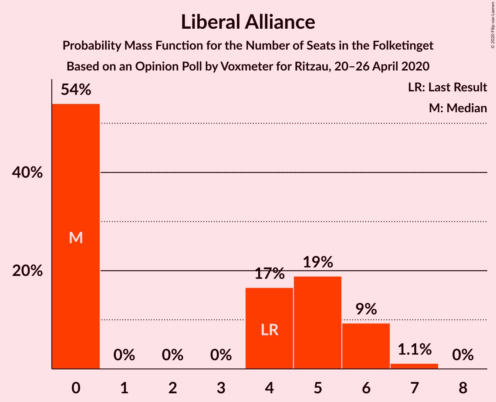
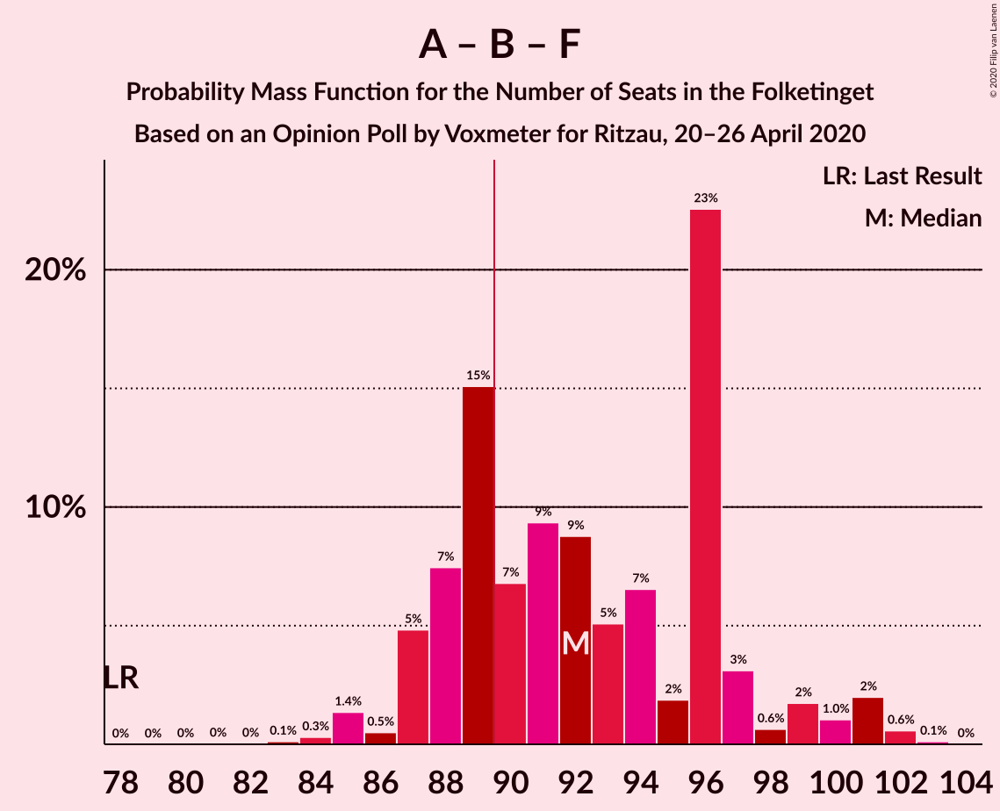

# Opinion Poll by Voxmeter, 20–26 April 2020

<a href="#voting-intentions">Voting Intentions</a> | <a href="#seats">Seats</a> | <a href="#coalitions">Coalitions</a> | <a href="#technical-information">Technical Information</a>

## Voting Intentions

### Confidence Intervals

| Party | Last Result | Poll Result | 80% Confidence Interval | 90% Confidence Interval | 95% Confidence Interval | 99% Confidence Interval |
|:-----:|:-----------:|:-----------:|:-----------------------:|:-----------------------:|:-----------------------:|:-----------------------:|
| Socialdemokraterne | 25.9% | 35.6% | 33.7–37.5% |33.2–38.1% |32.7–38.5% |31.8–39.5% |
| Venstre | 23.4% | 20.9% | 19.3–22.6% |18.9–23.1% |18.5–23.5% |17.8–24.3% |
| Radikale Venstre | 8.6% | 7.7% | 6.7–8.9% |6.4–9.2% |6.2–9.5% |5.8–10.1% |
| Dansk Folkeparti | 8.7% | 7.2% | 6.2–8.3% |6.0–8.7% |5.8–8.9% |5.3–9.5% |
| Enhedslisten–De Rød-Grønne | 6.9% | 7.1% | 6.2–8.2% |5.9–8.6% |5.7–8.8% |5.3–9.4% |
| Socialistisk Folkeparti | 7.7% | 6.9% | 6.0–8.0% |5.7–8.3% |5.5–8.6% |5.1–9.2% |
| Det Konservative Folkeparti | 6.6% | 6.6% | 5.7–7.7% |5.5–8.0% |5.2–8.3% |4.8–8.9% |
| Liberal Alliance | 2.3% | 1.9% | 1.5–2.6% |1.4–2.8% |1.3–3.0% |1.1–3.4% |
| Nye Borgerlige | 2.4% | 1.6% | 1.2–2.2% |1.1–2.4% |1.0–2.5% |0.8–2.9% |
| Stram Kurs | 1.8% | 1.4% | 1.0–2.0% |0.9–2.1% |0.8–2.3% |0.7–2.6% |
| Klaus Riskær Pedersen | 0.8% | 1.1% | 0.7–1.6% |0.7–1.8% |0.6–1.9% |0.5–2.2% |
| Alternativet | 3.0% | 0.5% | 0.3–0.9% |0.2–1.0% |0.2–1.1% |0.1–1.4% |

*Note:* The poll result column reflects the actual value used in the calculations. Published results may vary slightly, and in addition be rounded to fewer digits.

## Seats

### Confidence Intervals

| Party | Last Result | Median | 80% Confidence Interval | 90% Confidence Interval | 95% Confidence Interval | 99% Confidence Interval |
|:-----:|:-----------:|:------:|:-----------------------:|:-----------------------:|:-----------------------:|:-----------------------:|
| <a href="#socialdemokraterne">Socialdemokraterne</a> | 48 | 68 | 61–68 |61–68 |59–71 |58–73 |
| <a href="#venstre">Venstre</a> | 43 | 42 | 39–42 |36–42 |35–43 |33–46 |
| <a href="#radikale-venstre">Radikale Venstre</a> | 16 | 12 | 12–18 |12–18 |12–19 |11–19 |
| <a href="#dansk-folkeparti">Dansk Folkeparti</a> | 16 | 14 | 11–15 |11–15 |11–16 |10–16 |
| <a href="#enhedslisten–de-rød-grønne">Enhedslisten–De Rød-Grønne</a> | 13 | 15 | 14–15 |13–16 |11–17 |10–17 |
| <a href="#socialistisk-folkeparti">Socialistisk Folkeparti</a> | 14 | 11 | 11–13 |10–14 |10–15 |9–16 |
| <a href="#det-konservative-folkeparti">Det Konservative Folkeparti</a> | 12 | 13 | 11–14 |11–14 |10–15 |8–16 |
| <a href="#liberal-alliance">Liberal Alliance</a> | 4 | 0 | 0–5 |0–5 |0–5 |0–7 |
| <a href="#nye-borgerlige">Nye Borgerlige</a> | 4 | 0 | 0 |0 |0–4 |0–5 |
| <a href="#stram-kurs">Stram Kurs</a> | 0 | 0 | 0–4 |0–4 |0–5 |0–5 |
| <a href="#klaus-riskær-pedersen">Klaus Riskær Pedersen</a> | 0 | 0 | 0 |0 |0 |0–5 |
| <a href="#alternativet">Alternativet</a> | 5 | 0 | 0 |0 |0 |0 |

### Socialdemokraterne

*For a full overview of the results for this party, see the [Socialdemokraterne](party-socialdemokraterne.html) page.*

| Number of Seats | Probability | Accumulated | Special Marks |
|:---------------:|:-----------:|:-----------:|:-------------:|
| 48 | 0% | 100% | Last Result |
| 49 | 0% | 100% |  |
| 50 | 0% | 100% |  |
| 51 | 0% | 100% |  |
| 52 | 0% | 100% |  |
| 53 | 0% | 100% |  |
| 54 | 0% | 100% |  |
| 55 | 0% | 100% |  |
| 56 | 0% | 99.9% |  |
| 57 | 0% | 99.9% |  |
| 58 | 0.5% | 99.9% |  |
| 59 | 3% | 99.4% |  |
| 60 | 2% | 97% |  |
| 61 | 15% | 95% |  |
| 62 | 0.4% | 80% |  |
| 63 | 2% | 79% |  |
| 64 | 12% | 77% |  |
| 65 | 0.3% | 66% |  |
| 66 | 0.5% | 65% |  |
| 67 | 2% | 65% |  |
| 68 | 59% | 63% | Median |
| 69 | 0.7% | 4% |  |
| 70 | 0.8% | 3% |  |
| 71 | 1.1% | 3% |  |
| 72 | 0.9% | 2% |  |
| 73 | 0.3% | 0.7% |  |
| 74 | 0.1% | 0.4% |  |
| 75 | 0.3% | 0.3% |  |
| 76 | 0% | 0% |  |

### Venstre

*For a full overview of the results for this party, see the [Venstre](party-venstre.html) page.*

| Number of Seats | Probability | Accumulated | Special Marks |
|:---------------:|:-----------:|:-----------:|:-------------:|
| 31 | 0.1% | 100% |  |
| 32 | 0.1% | 99.9% |  |
| 33 | 2% | 99.8% |  |
| 34 | 0.7% | 98% |  |
| 35 | 0.7% | 98% |  |
| 36 | 2% | 97% |  |
| 37 | 2% | 95% |  |
| 38 | 2% | 93% |  |
| 39 | 4% | 91% |  |
| 40 | 25% | 87% |  |
| 41 | 0.7% | 62% |  |
| 42 | 58% | 61% | Median |
| 43 | 2% | 3% | Last Result |
| 44 | 0.2% | 1.3% |  |
| 45 | 0.4% | 1.1% |  |
| 46 | 0.7% | 0.7% |  |
| 47 | 0% | 0% |  |

### Radikale Venstre

*For a full overview of the results for this party, see the [Radikale Venstre](party-radikalevenstre.html) page.*

| Number of Seats | Probability | Accumulated | Special Marks |
|:---------------:|:-----------:|:-----------:|:-------------:|
| 10 | 0.1% | 100% |  |
| 11 | 1.0% | 99.9% |  |
| 12 | 61% | 98.9% | Median |
| 13 | 11% | 38% |  |
| 14 | 1.0% | 27% |  |
| 15 | 3% | 26% |  |
| 16 | 4% | 22% | Last Result |
| 17 | 1.0% | 19% |  |
| 18 | 14% | 18% |  |
| 19 | 3% | 4% |  |
| 20 | 0.4% | 0.4% |  |
| 21 | 0% | 0% |  |

### Dansk Folkeparti

*For a full overview of the results for this party, see the [Dansk Folkeparti](party-danskfolkeparti.html) page.*

| Number of Seats | Probability | Accumulated | Special Marks |
|:---------------:|:-----------:|:-----------:|:-------------:|
| 9 | 0.1% | 100% |  |
| 10 | 0.8% | 99.9% |  |
| 11 | 18% | 99.1% |  |
| 12 | 2% | 82% |  |
| 13 | 3% | 79% |  |
| 14 | 62% | 76% | Median |
| 15 | 11% | 14% |  |
| 16 | 3% | 3% | Last Result |
| 17 | 0.1% | 0.4% |  |
| 18 | 0.3% | 0.3% |  |
| 19 | 0% | 0.1% |  |
| 20 | 0% | 0% |  |

### Enhedslisten–De Rød-Grønne

*For a full overview of the results for this party, see the [Enhedslisten–De Rød-Grønne](party-enhedslisten–derød-grønne.html) page.*

| Number of Seats | Probability | Accumulated | Special Marks |
|:---------------:|:-----------:|:-----------:|:-------------:|
| 9 | 0.1% | 100% |  |
| 10 | 2% | 99.9% |  |
| 11 | 1.0% | 98% |  |
| 12 | 2% | 97% |  |
| 13 | 3% | 95% | Last Result |
| 14 | 10% | 92% |  |
| 15 | 76% | 81% | Median |
| 16 | 1.3% | 5% |  |
| 17 | 4% | 4% |  |
| 18 | 0.5% | 0.5% |  |
| 19 | 0% | 0% |  |

### Socialistisk Folkeparti

*For a full overview of the results for this party, see the [Socialistisk Folkeparti](party-socialistiskfolkeparti.html) page.*

| Number of Seats | Probability | Accumulated | Special Marks |
|:---------------:|:-----------:|:-----------:|:-------------:|
| 8 | 0.1% | 100% |  |
| 9 | 2% | 99.9% |  |
| 10 | 4% | 98% |  |
| 11 | 66% | 94% | Median |
| 12 | 1.4% | 28% |  |
| 13 | 19% | 27% |  |
| 14 | 4% | 8% | Last Result |
| 15 | 3% | 4% |  |
| 16 | 0.4% | 0.6% |  |
| 17 | 0% | 0.1% |  |
| 18 | 0.1% | 0.1% |  |
| 19 | 0% | 0% |  |

### Det Konservative Folkeparti

*For a full overview of the results for this party, see the [Det Konservative Folkeparti](party-detkonservativefolkeparti.html) page.*

| Number of Seats | Probability | Accumulated | Special Marks |
|:---------------:|:-----------:|:-----------:|:-------------:|
| 8 | 0.6% | 100% |  |
| 9 | 1.0% | 99.4% |  |
| 10 | 2% | 98% |  |
| 11 | 8% | 96% |  |
| 12 | 16% | 88% | Last Result |
| 13 | 60% | 72% | Median |
| 14 | 10% | 13% |  |
| 15 | 2% | 3% |  |
| 16 | 0.5% | 0.5% |  |
| 17 | 0% | 0% |  |

### Liberal Alliance

*For a full overview of the results for this party, see the [Liberal Alliance](party-liberalalliance.html) page.*

| Number of Seats | Probability | Accumulated | Special Marks |
|:---------------:|:-----------:|:-----------:|:-------------:|
| 0 | 77% | 100% | Median |
| 1 | 0% | 23% |  |
| 2 | 0% | 23% |  |
| 3 | 0% | 23% |  |
| 4 | 7% | 23% | Last Result |
| 5 | 16% | 16% |  |
| 6 | 0.1% | 0.7% |  |
| 7 | 0.5% | 0.5% |  |
| 8 | 0% | 0% |  |

### Nye Borgerlige

*For a full overview of the results for this party, see the [Nye Borgerlige](party-nyeborgerlige.html) page.*

| Number of Seats | Probability | Accumulated | Special Marks |
|:---------------:|:-----------:|:-----------:|:-------------:|
| 0 | 97% | 100% | Median |
| 1 | 0% | 3% |  |
| 2 | 0% | 3% |  |
| 3 | 0% | 3% |  |
| 4 | 2% | 3% | Last Result |
| 5 | 0.9% | 1.1% |  |
| 6 | 0.2% | 0.2% |  |
| 7 | 0.1% | 0.1% |  |
| 8 | 0% | 0% |  |

### Stram Kurs

*For a full overview of the results for this party, see the [Stram Kurs](party-stramkurs.html) page.*

| Number of Seats | Probability | Accumulated | Special Marks |
|:---------------:|:-----------:|:-----------:|:-------------:|
| 0 | 89% | 100% | Last Result, Median |
| 1 | 0% | 11% |  |
| 2 | 0% | 11% |  |
| 3 | 0% | 11% |  |
| 4 | 8% | 11% |  |
| 5 | 3% | 3% |  |
| 6 | 0% | 0% |  |

### Klaus Riskær Pedersen

*For a full overview of the results for this party, see the [Klaus Riskær Pedersen](party-klausriskærpedersen.html) page.*

| Number of Seats | Probability | Accumulated | Special Marks |
|:---------------:|:-----------:|:-----------:|:-------------:|
| 0 | 99.1% | 100% | Last Result, Median |
| 1 | 0% | 0.9% |  |
| 2 | 0% | 0.9% |  |
| 3 | 0% | 0.9% |  |
| 4 | 0.3% | 0.9% |  |
| 5 | 0.7% | 0.7% |  |
| 6 | 0% | 0% |  |

### Alternativet

*For a full overview of the results for this party, see the [Alternativet](party-alternativet.html) page.*

| Number of Seats | Probability | Accumulated | Special Marks |
|:---------------:|:-----------:|:-----------:|:-------------:|
| 0 | 100% | 100% | Median |
| 1 | 0% | 0% |  |
| 2 | 0% | 0% |  |
| 3 | 0% | 0% |  |
| 4 | 0% | 0% |  |
| 5 | 0% | 0% | Last Result |

## Coalitions

### Confidence Intervals

| Coalition | Last Result | Median | Majority? | 80% Confidence Interval | 90% Confidence Interval | 95% Confidence Interval | 99% Confidence Interval |
|:---------:|:-----------:|:------:|:---------:|:-----------------------:|:-----------------------:|:-----------------------:|:-----------------------:|
| Socialdemokraterne – Radikale Venstre – Enhedslisten–De Rød-Grønne – Socialistisk Folkeparti – Alternativet | 96 | 106 | 100% | 102–107 | 102–109 | 101–112 | 99–115 |
| Socialdemokraterne – Radikale Venstre – Enhedslisten–De Rød-Grønne – Socialistisk Folkeparti | 91 | 106 | 100% | 102–107 | 102–109 | 101–112 | 99–115 |
| Socialdemokraterne – Radikale Venstre – Socialistisk Folkeparti | 78 | 91 | 86% | 88–92 | 87–96 | 87–98 | 86–102 |
| Socialdemokraterne – Enhedslisten–De Rød-Grønne – Socialistisk Folkeparti – Alternativet | 80 | 94 | 70% | 89–94 | 88–94 | 87–96 | 86–101 |
| Socialdemokraterne – Enhedslisten–De Rød-Grønne – Socialistisk Folkeparti | 75 | 94 | 70% | 89–94 | 88–94 | 87–96 | 86–101 |
| Socialdemokraterne – Radikale Venstre | 64 | 80 | 0.1% | 77–80 | 75–83 | 74–86 | 73–88 |
| Venstre – Dansk Folkeparti – Det Konservative Folkeparti – Liberal Alliance – Nye Borgerlige – Klaus Riskær Pedersen | 79 | 69 | 0% | 66–69 | 63–71 | 62–72 | 60–73 |
| Venstre – Dansk Folkeparti – Det Konservative Folkeparti – Liberal Alliance – Nye Borgerlige | 79 | 69 | 0% | 66–69 | 63–71 | 62–72 | 59–73 |
| Venstre – Dansk Folkeparti – Det Konservative Folkeparti – Liberal Alliance | 75 | 69 | 0% | 65–69 | 63–71 | 60–72 | 57–73 |
| Venstre – Det Konservative Folkeparti – Liberal Alliance | 59 | 55 | 0% | 52–57 | 49–58 | 48–58 | 44–61 |
| Venstre – Det Konservative Folkeparti | 55 | 55 | 0% | 50–55 | 48–55 | 46–55 | 44–61 |
| Venstre | 43 | 42 | 0% | 39–42 | 36–42 | 35–43 | 33–46 |

### Socialdemokraterne – Radikale Venstre – Enhedslisten–De Rød-Grønne – Socialistisk Folkeparti – Alternativet

| Number of Seats | Probability | Accumulated | Special Marks |
|:---------------:|:-----------:|:-----------:|:-------------:|
| 95 | 0% | 100% |  |
| 96 | 0.1% | 99.9% | Last Result |
| 97 | 0.1% | 99.8% |  |
| 98 | 0% | 99.8% |  |
| 99 | 1.0% | 99.7% |  |
| 100 | 0.1% | 98.8% |  |
| 101 | 2% | 98.6% |  |
| 102 | 8% | 96% |  |
| 103 | 3% | 89% |  |
| 104 | 3% | 86% |  |
| 105 | 0.3% | 83% |  |
| 106 | 61% | 83% | Median |
| 107 | 14% | 22% |  |
| 108 | 1.1% | 7% |  |
| 109 | 2% | 6% |  |
| 110 | 0.5% | 5% |  |
| 111 | 0.9% | 4% |  |
| 112 | 0.9% | 3% |  |
| 113 | 2% | 2% |  |
| 114 | 0.2% | 0.8% |  |
| 115 | 0.3% | 0.5% |  |
| 116 | 0% | 0.3% |  |
| 117 | 0.1% | 0.3% |  |
| 118 | 0.2% | 0.2% |  |
| 119 | 0% | 0% |  |

### Socialdemokraterne – Radikale Venstre – Enhedslisten–De Rød-Grønne – Socialistisk Folkeparti

| Number of Seats | Probability | Accumulated | Special Marks |
|:---------------:|:-----------:|:-----------:|:-------------:|
| 91 | 0% | 100% | Last Result |
| 92 | 0% | 100% |  |
| 93 | 0% | 100% |  |
| 94 | 0% | 100% |  |
| 95 | 0% | 100% |  |
| 96 | 0.1% | 99.9% |  |
| 97 | 0.1% | 99.8% |  |
| 98 | 0% | 99.8% |  |
| 99 | 1.0% | 99.7% |  |
| 100 | 0.1% | 98.8% |  |
| 101 | 2% | 98.6% |  |
| 102 | 8% | 96% |  |
| 103 | 3% | 89% |  |
| 104 | 3% | 86% |  |
| 105 | 0.3% | 83% |  |
| 106 | 61% | 83% | Median |
| 107 | 14% | 22% |  |
| 108 | 1.1% | 7% |  |
| 109 | 2% | 6% |  |
| 110 | 0.5% | 5% |  |
| 111 | 0.9% | 4% |  |
| 112 | 0.9% | 3% |  |
| 113 | 2% | 2% |  |
| 114 | 0.2% | 0.8% |  |
| 115 | 0.3% | 0.5% |  |
| 116 | 0% | 0.3% |  |
| 117 | 0.1% | 0.3% |  |
| 118 | 0.2% | 0.2% |  |
| 119 | 0% | 0% |  |

### Socialdemokraterne – Radikale Venstre – Socialistisk Folkeparti

| Number of Seats | Probability | Accumulated | Special Marks |
|:---------------:|:-----------:|:-----------:|:-------------:|
| 78 | 0% | 100% | Last Result |
| 79 | 0% | 100% |  |
| 80 | 0% | 100% |  |
| 81 | 0% | 100% |  |
| 82 | 0% | 100% |  |
| 83 | 0% | 100% |  |
| 84 | 0% | 99.9% |  |
| 85 | 0.3% | 99.9% |  |
| 86 | 0.7% | 99.5% |  |
| 87 | 4% | 98.9% |  |
| 88 | 7% | 95% |  |
| 89 | 1.2% | 87% |  |
| 90 | 2% | 86% | Majority |
| 91 | 61% | 84% | Median |
| 92 | 16% | 23% |  |
| 93 | 0.6% | 7% |  |
| 94 | 0.7% | 6% |  |
| 95 | 0.4% | 6% |  |
| 96 | 0.8% | 5% |  |
| 97 | 0.3% | 4% |  |
| 98 | 2% | 4% |  |
| 99 | 0.3% | 2% |  |
| 100 | 0.2% | 2% |  |
| 101 | 0.2% | 2% |  |
| 102 | 1.2% | 1.5% |  |
| 103 | 0.1% | 0.3% |  |
| 104 | 0.1% | 0.2% |  |
| 105 | 0.1% | 0.1% |  |
| 106 | 0% | 0% |  |

### Socialdemokraterne – Enhedslisten–De Rød-Grønne – Socialistisk Folkeparti – Alternativet

| Number of Seats | Probability | Accumulated | Special Marks |
|:---------------:|:-----------:|:-----------:|:-------------:|
| 80 | 0.1% | 100% | Last Result |
| 81 | 0% | 99.9% |  |
| 82 | 0% | 99.9% |  |
| 83 | 0.1% | 99.9% |  |
| 84 | 0.1% | 99.8% |  |
| 85 | 0.2% | 99.7% |  |
| 86 | 0.8% | 99.5% |  |
| 87 | 4% | 98.7% |  |
| 88 | 2% | 95% |  |
| 89 | 22% | 93% |  |
| 90 | 0.3% | 70% | Majority |
| 91 | 3% | 70% |  |
| 92 | 1.4% | 67% |  |
| 93 | 3% | 65% |  |
| 94 | 59% | 62% | Median |
| 95 | 0.1% | 3% |  |
| 96 | 1.0% | 3% |  |
| 97 | 0.4% | 2% |  |
| 98 | 0.1% | 2% |  |
| 99 | 0.2% | 2% |  |
| 100 | 0.8% | 1.3% |  |
| 101 | 0.2% | 0.5% |  |
| 102 | 0% | 0.4% |  |
| 103 | 0.2% | 0.3% |  |
| 104 | 0% | 0.1% |  |
| 105 | 0% | 0.1% |  |
| 106 | 0.1% | 0.1% |  |
| 107 | 0% | 0% |  |

### Socialdemokraterne – Enhedslisten–De Rød-Grønne – Socialistisk Folkeparti

| Number of Seats | Probability | Accumulated | Special Marks |
|:---------------:|:-----------:|:-----------:|:-------------:|
| 75 | 0% | 100% | Last Result |
| 76 | 0% | 100% |  |
| 77 | 0% | 100% |  |
| 78 | 0% | 100% |  |
| 79 | 0% | 100% |  |
| 80 | 0.1% | 100% |  |
| 81 | 0% | 99.9% |  |
| 82 | 0% | 99.9% |  |
| 83 | 0.1% | 99.9% |  |
| 84 | 0.1% | 99.8% |  |
| 85 | 0.2% | 99.7% |  |
| 86 | 0.8% | 99.5% |  |
| 87 | 4% | 98.7% |  |
| 88 | 2% | 95% |  |
| 89 | 22% | 93% |  |
| 90 | 0.3% | 70% | Majority |
| 91 | 3% | 70% |  |
| 92 | 1.4% | 67% |  |
| 93 | 3% | 65% |  |
| 94 | 59% | 62% | Median |
| 95 | 0.1% | 3% |  |
| 96 | 1.0% | 3% |  |
| 97 | 0.4% | 2% |  |
| 98 | 0.1% | 2% |  |
| 99 | 0.2% | 2% |  |
| 100 | 0.8% | 1.3% |  |
| 101 | 0.2% | 0.5% |  |
| 102 | 0% | 0.4% |  |
| 103 | 0.2% | 0.3% |  |
| 104 | 0% | 0.1% |  |
| 105 | 0% | 0.1% |  |
| 106 | 0.1% | 0.1% |  |
| 107 | 0% | 0% |  |

### Socialdemokraterne – Radikale Venstre

| Number of Seats | Probability | Accumulated | Special Marks |
|:---------------:|:-----------:|:-----------:|:-------------:|
| 64 | 0% | 100% | Last Result |
| 65 | 0% | 100% |  |
| 66 | 0% | 100% |  |
| 67 | 0% | 100% |  |
| 68 | 0% | 100% |  |
| 69 | 0% | 100% |  |
| 70 | 0% | 100% |  |
| 71 | 0.2% | 100% |  |
| 72 | 0% | 99.8% |  |
| 73 | 2% | 99.7% |  |
| 74 | 0.2% | 98% |  |
| 75 | 3% | 97% |  |
| 76 | 1.1% | 95% |  |
| 77 | 10% | 94% |  |
| 78 | 3% | 84% |  |
| 79 | 15% | 81% |  |
| 80 | 58% | 66% | Median |
| 81 | 0.2% | 8% |  |
| 82 | 0.5% | 8% |  |
| 83 | 3% | 7% |  |
| 84 | 0.4% | 4% |  |
| 85 | 1.0% | 4% |  |
| 86 | 0.3% | 3% |  |
| 87 | 1.2% | 2% |  |
| 88 | 1.0% | 1.3% |  |
| 89 | 0.2% | 0.3% |  |
| 90 | 0% | 0.1% | Majority |
| 91 | 0% | 0.1% |  |
| 92 | 0% | 0.1% |  |
| 93 | 0.1% | 0.1% |  |
| 94 | 0% | 0% |  |

### Venstre – Dansk Folkeparti – Det Konservative Folkeparti – Liberal Alliance – Nye Borgerlige – Klaus Riskær Pedersen

| Number of Seats | Probability | Accumulated | Special Marks |
|:---------------:|:-----------:|:-----------:|:-------------:|
| 57 | 0.3% | 100% |  |
| 58 | 0.1% | 99.6% |  |
| 59 | 0% | 99.5% |  |
| 60 | 0.8% | 99.5% |  |
| 61 | 0.2% | 98.7% |  |
| 62 | 2% | 98.5% |  |
| 63 | 2% | 97% |  |
| 64 | 1.3% | 95% |  |
| 65 | 2% | 93% |  |
| 66 | 2% | 91% |  |
| 67 | 1.0% | 90% |  |
| 68 | 14% | 89% |  |
| 69 | 68% | 75% | Median |
| 70 | 0.1% | 7% |  |
| 71 | 3% | 7% |  |
| 72 | 3% | 4% |  |
| 73 | 0.7% | 1.2% |  |
| 74 | 0.2% | 0.5% |  |
| 75 | 0.2% | 0.3% |  |
| 76 | 0% | 0.1% |  |
| 77 | 0% | 0.1% |  |
| 78 | 0% | 0% |  |
| 79 | 0% | 0% | Last Result |

### Venstre – Dansk Folkeparti – Det Konservative Folkeparti – Liberal Alliance – Nye Borgerlige

| Number of Seats | Probability | Accumulated | Special Marks |
|:---------------:|:-----------:|:-----------:|:-------------:|
| 57 | 0.3% | 100% |  |
| 58 | 0.1% | 99.6% |  |
| 59 | 0% | 99.5% |  |
| 60 | 0.8% | 99.5% |  |
| 61 | 0.2% | 98.7% |  |
| 62 | 2% | 98% |  |
| 63 | 2% | 97% |  |
| 64 | 1.4% | 95% |  |
| 65 | 2% | 93% |  |
| 66 | 1.5% | 91% |  |
| 67 | 2% | 90% |  |
| 68 | 14% | 88% |  |
| 69 | 68% | 74% | Median |
| 70 | 0.1% | 6% |  |
| 71 | 2% | 6% |  |
| 72 | 3% | 4% |  |
| 73 | 0.7% | 1.1% |  |
| 74 | 0.2% | 0.4% |  |
| 75 | 0.1% | 0.2% |  |
| 76 | 0% | 0.1% |  |
| 77 | 0% | 0.1% |  |
| 78 | 0% | 0% |  |
| 79 | 0% | 0% | Last Result |

### Venstre – Dansk Folkeparti – Det Konservative Folkeparti – Liberal Alliance

| Number of Seats | Probability | Accumulated | Special Marks |
|:---------------:|:-----------:|:-----------:|:-------------:|
| 53 | 0.1% | 100% |  |
| 54 | 0% | 99.9% |  |
| 55 | 0% | 99.9% |  |
| 56 | 0% | 99.9% |  |
| 57 | 0.4% | 99.9% |  |
| 58 | 0.9% | 99.5% |  |
| 59 | 0.2% | 98.6% |  |
| 60 | 0.9% | 98% |  |
| 61 | 0.2% | 97% |  |
| 62 | 2% | 97% |  |
| 63 | 2% | 96% |  |
| 64 | 2% | 93% |  |
| 65 | 2% | 92% |  |
| 66 | 1.5% | 89% |  |
| 67 | 0.5% | 88% |  |
| 68 | 14% | 87% |  |
| 69 | 68% | 73% | Median |
| 70 | 0.1% | 6% |  |
| 71 | 3% | 6% |  |
| 72 | 2% | 3% |  |
| 73 | 0.7% | 0.9% |  |
| 74 | 0.1% | 0.1% |  |
| 75 | 0% | 0.1% | Last Result |
| 76 | 0% | 0% |  |

### Venstre – Det Konservative Folkeparti – Liberal Alliance

| Number of Seats | Probability | Accumulated | Special Marks |
|:---------------:|:-----------:|:-----------:|:-------------:|
| 43 | 0.1% | 100% |  |
| 44 | 1.2% | 99.9% |  |
| 45 | 0.2% | 98.7% |  |
| 46 | 0.6% | 98% |  |
| 47 | 0.4% | 98% |  |
| 48 | 2% | 98% |  |
| 49 | 2% | 96% |  |
| 50 | 3% | 94% |  |
| 51 | 0.3% | 91% |  |
| 52 | 2% | 91% |  |
| 53 | 0.6% | 89% |  |
| 54 | 7% | 89% |  |
| 55 | 62% | 81% | Median |
| 56 | 0.3% | 20% |  |
| 57 | 14% | 19% |  |
| 58 | 4% | 6% |  |
| 59 | 0.4% | 1.3% | Last Result |
| 60 | 0.1% | 0.8% |  |
| 61 | 0.7% | 0.8% |  |
| 62 | 0% | 0.1% |  |
| 63 | 0% | 0% |  |

### Venstre – Det Konservative Folkeparti

| Number of Seats | Probability | Accumulated | Special Marks |
|:---------------:|:-----------:|:-----------:|:-------------:|
| 41 | 0.1% | 100% |  |
| 42 | 0% | 99.9% |  |
| 43 | 0.1% | 99.9% |  |
| 44 | 2% | 99.8% |  |
| 45 | 0.5% | 98% |  |
| 46 | 0.7% | 98% |  |
| 47 | 0.6% | 97% |  |
| 48 | 2% | 97% |  |
| 49 | 2% | 94% |  |
| 50 | 4% | 92% |  |
| 51 | 2% | 88% |  |
| 52 | 15% | 85% |  |
| 53 | 1.1% | 71% |  |
| 54 | 9% | 70% |  |
| 55 | 58% | 60% | Last Result, Median |
| 56 | 0.2% | 2% |  |
| 57 | 0.1% | 2% |  |
| 58 | 1.4% | 2% |  |
| 59 | 0% | 0.7% |  |
| 60 | 0% | 0.7% |  |
| 61 | 0.7% | 0.7% |  |
| 62 | 0% | 0% |  |

### Venstre

| Number of Seats | Probability | Accumulated | Special Marks |
|:---------------:|:-----------:|:-----------:|:-------------:|
| 31 | 0.1% | 100% |  |
| 32 | 0.1% | 99.9% |  |
| 33 | 2% | 99.8% |  |
| 34 | 0.7% | 98% |  |
| 35 | 0.7% | 98% |  |
| 36 | 2% | 97% |  |
| 37 | 2% | 95% |  |
| 38 | 2% | 93% |  |
| 39 | 4% | 91% |  |
| 40 | 25% | 87% |  |
| 41 | 0.7% | 62% |  |
| 42 | 58% | 61% | Median |
| 43 | 2% | 3% | Last Result |
| 44 | 0.2% | 1.3% |  |
| 45 | 0.4% | 1.1% |  |
| 46 | 0.7% | 0.7% |  |
| 47 | 0% | 0% |  |

## Technical Information

### Opinion Poll

+ **Polling firm:** Voxmeter
+ **Commissioner(s):** —
+ **Fieldwork period:** 20–26 April 2020

### Calculations

+ **Sample size:** 1029
+ **Simulations done:** 131,072
+ **Error estimate:** 2.47%

