# Opinion Poll by Megafon for Politiken and TV 2, 27–30 April 2020

<a href="#voting-intentions">Voting Intentions</a> | <a href="#seats">Seats</a> | <a href="#coalitions">Coalitions</a> | <a href="#technical-information">Technical Information</a>

## Voting Intentions

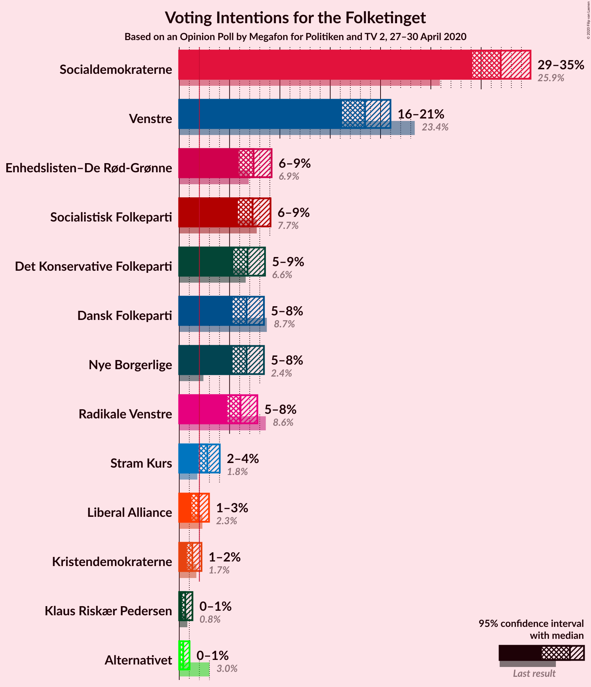

### Confidence Intervals

| Party | Last Result | Poll Result | 80% Confidence Interval | 90% Confidence Interval | 95% Confidence Interval | 99% Confidence Interval |
|:-----:|:-----------:|:-----------:|:-----------------------:|:-----------------------:|:-----------------------:|:-----------------------:|
| Socialdemokraterne | 25.9% | 34.2% | 32.3–36.2% |31.8–36.7% |31.4–37.2% |30.5–38.2% |
| Venstre | 23.4% | 19.9% | 18.3–21.6% |17.9–22.0% |17.5–22.5% |16.8–23.3% |
| Enhedslisten–De Rød-Grønne | 6.9% | 7.9% | 6.9–9.1% |6.6–9.4% |6.4–9.7% |5.9–10.3% |
| Socialistisk Folkeparti | 7.7% | 7.8% | 6.8–9.0% |6.5–9.3% |6.3–9.6% |5.8–10.2% |
| Det Konservative Folkeparti | 6.6% | 7.3% | 6.3–8.4% |6.1–8.8% |5.8–9.1% |5.4–9.7% |
| Nye Borgerlige | 2.4% | 7.2% | 6.2–8.4% |6.0–8.7% |5.7–9.0% |5.3–9.5% |
| Radikale Venstre | 8.6% | 6.5% | 5.6–7.6% |5.3–7.9% |5.1–8.2% |4.7–8.7% |
| Stram Kurs | 1.8% | 3.0% | 2.4–3.8% |2.2–4.0% |2.1–4.3% |1.8–4.7% |
| Liberal Alliance | 2.3% | 2.0% | 1.5–2.7% |1.4–2.9% |1.3–3.1% |1.1–3.4% |
| Dansk Folkeparti | 8.7% | 1.4% | 1.0–2.0% |0.9–2.2% |0.8–2.3% |0.7–2.7% |
| Klaus Riskær Pedersen | 0.8% | 0.6% | 0.4–1.1% |0.3–1.2% |0.3–1.3% |0.2–1.6% |
| Alternativet | 3.0% | 0.4% | 0.2–0.8% |0.2–0.9% |0.2–1.0% |0.1–1.3% |

*Note:* The poll result column reflects the actual value used in the calculations. Published results may vary slightly, and in addition be rounded to fewer digits.

## Seats

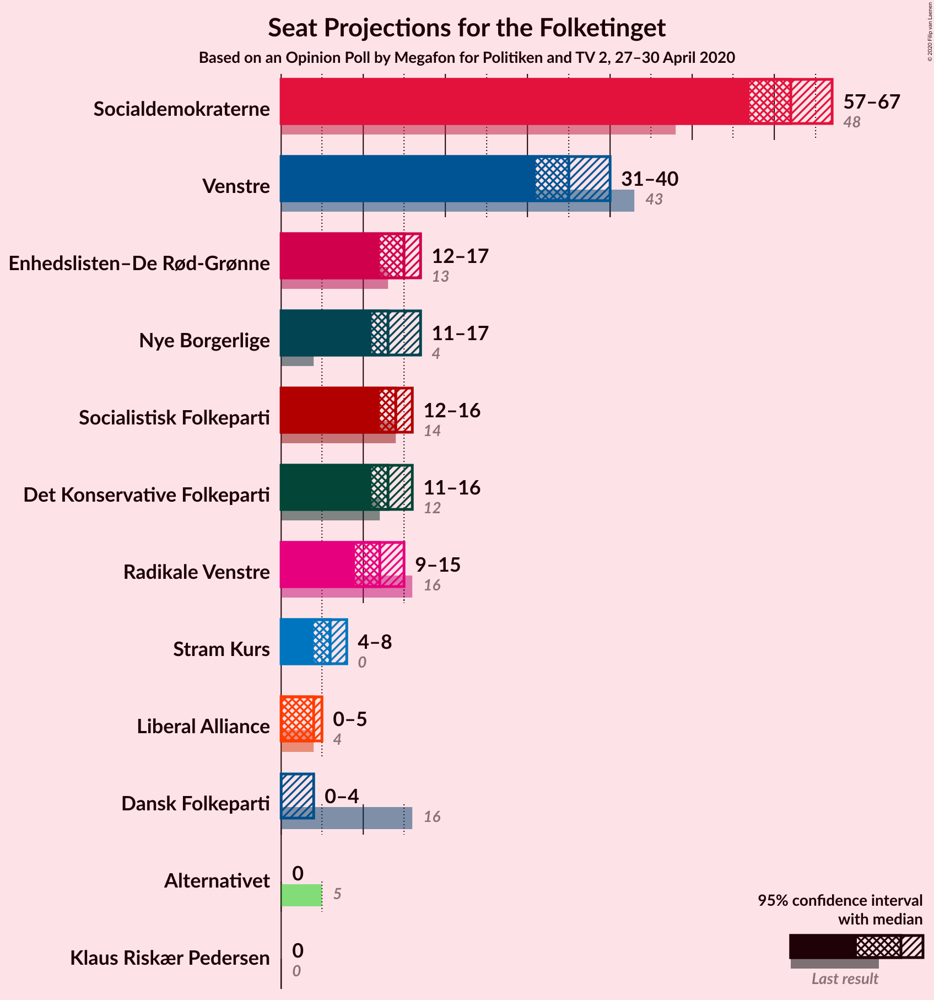

### Confidence Intervals

| Party | Last Result | Median | 80% Confidence Interval | 90% Confidence Interval | 95% Confidence Interval | 99% Confidence Interval |
|:-----:|:-----------:|:------:|:-----------------------:|:-----------------------:|:-----------------------:|:-----------------------:|
| <a href="#socialdemokraterne">Socialdemokraterne</a> | 48 | 62 | 60–63 |60–63 |60–65 |57–69 |
| <a href="#venstre">Venstre</a> | 43 | 35 | 34–36 |32–36 |32–36 |31–39 |
| <a href="#enhedslisten–de-rød-grønne">Enhedslisten–De Rød-Grønne</a> | 13 | 15 | 14–15 |14–15 |13–16 |11–18 |
| <a href="#socialistisk-folkeparti">Socialistisk Folkeparti</a> | 14 | 14 | 12–15 |12–15 |12–15 |11–15 |
| <a href="#det-konservative-folkeparti">Det Konservative Folkeparti</a> | 12 | 13 | 12–14 |12–14 |12–16 |10–17 |
| <a href="#nye-borgerlige">Nye Borgerlige</a> | 4 | 13 | 11–13 |11–15 |11–15 |11–16 |
| <a href="#radikale-venstre">Radikale Venstre</a> | 16 | 12 | 11–15 |11–15 |11–15 |10–15 |
| <a href="#stram-kurs">Stram Kurs</a> | 0 | 6 | 4–8 |4–8 |4–8 |4–8 |
| <a href="#liberal-alliance">Liberal Alliance</a> | 4 | 0 | 0–4 |0–5 |0–5 |0–6 |
| <a href="#dansk-folkeparti">Dansk Folkeparti</a> | 16 | 0 | 0–4 |0–4 |0–4 |0–4 |
| <a href="#klaus-riskær-pedersen">Klaus Riskær Pedersen</a> | 0 | 0 | 0 |0 |0 |0 |
| <a href="#alternativet">Alternativet</a> | 5 | 0 | 0 |0 |0 |0 |

### Socialdemokraterne

*For a full overview of the results for this party, see the [Socialdemokraterne](party-socialdemokraterne.html) page.*

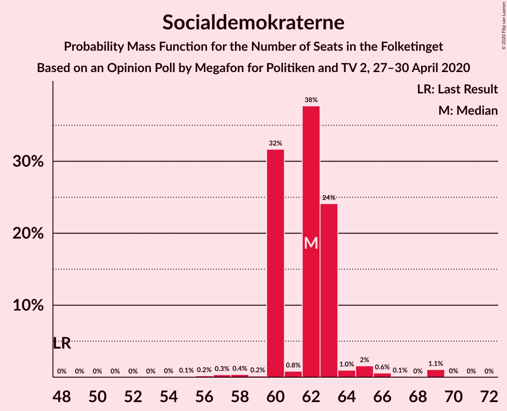

| Number of Seats | Probability | Accumulated | Special Marks |
|:---------------:|:-----------:|:-----------:|:-------------:|
| 48 | 0% | 100% | Last Result |
| 49 | 0% | 100% |  |
| 50 | 0% | 100% |  |
| 51 | 0% | 100% |  |
| 52 | 0% | 100% |  |
| 53 | 0% | 100% |  |
| 54 | 0% | 100% |  |
| 55 | 0.1% | 99.9% |  |
| 56 | 0.2% | 99.8% |  |
| 57 | 0.3% | 99.6% |  |
| 58 | 0.4% | 99.3% |  |
| 59 | 0.2% | 98.9% |  |
| 60 | 32% | 98.7% |  |
| 61 | 0.8% | 67% |  |
| 62 | 38% | 66% | Median |
| 63 | 24% | 29% |  |
| 64 | 1.0% | 4% |  |
| 65 | 2% | 3% |  |
| 66 | 0.6% | 2% |  |
| 67 | 0.1% | 1.3% |  |
| 68 | 0% | 1.1% |  |
| 69 | 1.1% | 1.1% |  |
| 70 | 0% | 0.1% |  |
| 71 | 0% | 0% |  |

### Venstre

*For a full overview of the results for this party, see the [Venstre](party-venstre.html) page.*

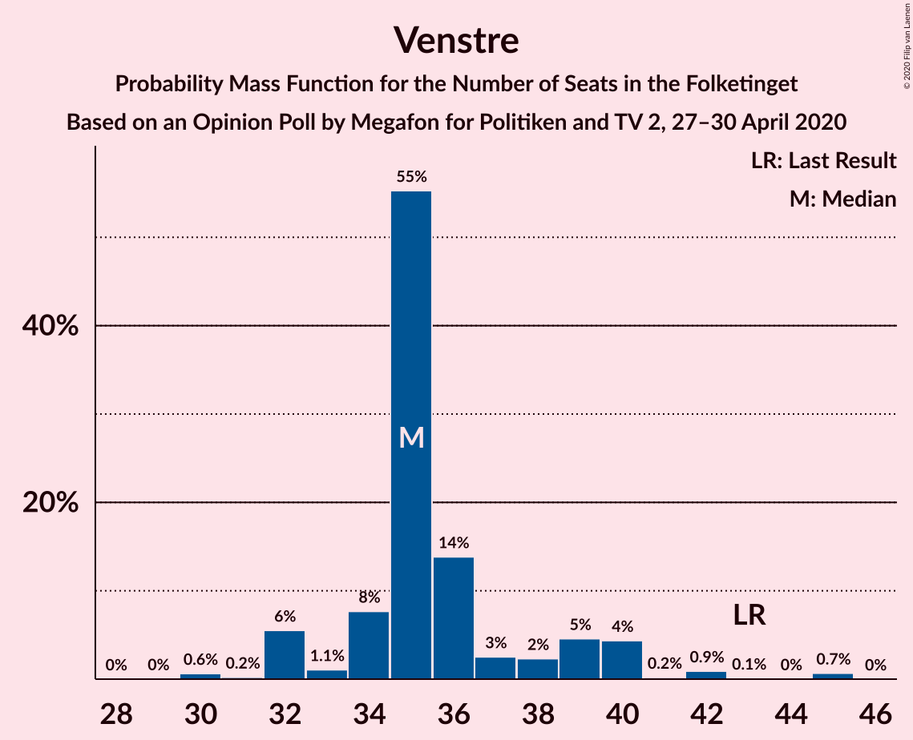

| Number of Seats | Probability | Accumulated | Special Marks |
|:---------------:|:-----------:|:-----------:|:-------------:|
| 30 | 0.1% | 100% |  |
| 31 | 2% | 99.9% |  |
| 32 | 5% | 98% |  |
| 33 | 0.9% | 93% |  |
| 34 | 25% | 92% |  |
| 35 | 43% | 66% | Median |
| 36 | 22% | 24% |  |
| 37 | 0.7% | 2% |  |
| 38 | 0.9% | 2% |  |
| 39 | 0.3% | 0.7% |  |
| 40 | 0.2% | 0.3% |  |
| 41 | 0.1% | 0.1% |  |
| 42 | 0% | 0% |  |
| 43 | 0% | 0% | Last Result |

### Enhedslisten–De Rød-Grønne

*For a full overview of the results for this party, see the [Enhedslisten–De Rød-Grønne](party-enhedslisten–derød-grønne.html) page.*

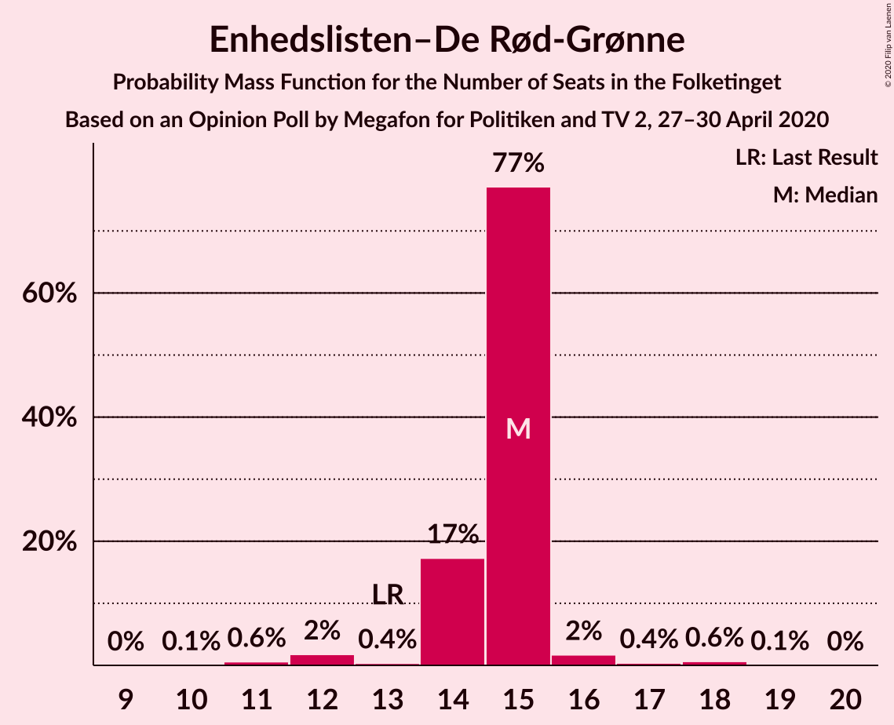

| Number of Seats | Probability | Accumulated | Special Marks |
|:---------------:|:-----------:|:-----------:|:-------------:|
| 10 | 0.1% | 100% |  |
| 11 | 0.6% | 99.9% |  |
| 12 | 2% | 99.3% |  |
| 13 | 0.4% | 98% | Last Result |
| 14 | 17% | 97% |  |
| 15 | 77% | 80% | Median |
| 16 | 2% | 3% |  |
| 17 | 0.4% | 1.1% |  |
| 18 | 0.6% | 0.7% |  |
| 19 | 0.1% | 0.1% |  |
| 20 | 0% | 0% |  |

### Socialistisk Folkeparti

*For a full overview of the results for this party, see the [Socialistisk Folkeparti](party-socialistiskfolkeparti.html) page.*

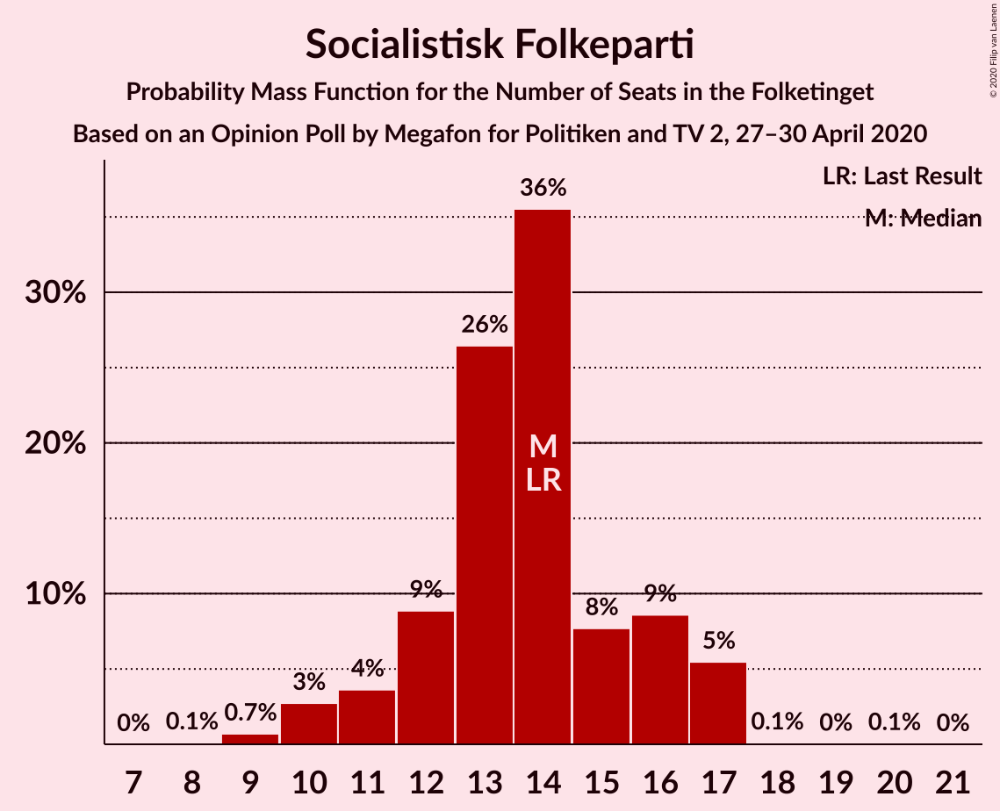

| Number of Seats | Probability | Accumulated | Special Marks |
|:---------------:|:-----------:|:-----------:|:-------------:|
| 10 | 0.3% | 100% |  |
| 11 | 0.5% | 99.7% |  |
| 12 | 21% | 99.2% |  |
| 13 | 3% | 78% |  |
| 14 | 29% | 76% | Last Result, Median |
| 15 | 46% | 47% |  |
| 16 | 0.2% | 0.4% |  |
| 17 | 0.1% | 0.3% |  |
| 18 | 0.1% | 0.2% |  |
| 19 | 0% | 0% |  |

### Det Konservative Folkeparti

*For a full overview of the results for this party, see the [Det Konservative Folkeparti](party-detkonservativefolkeparti.html) page.*

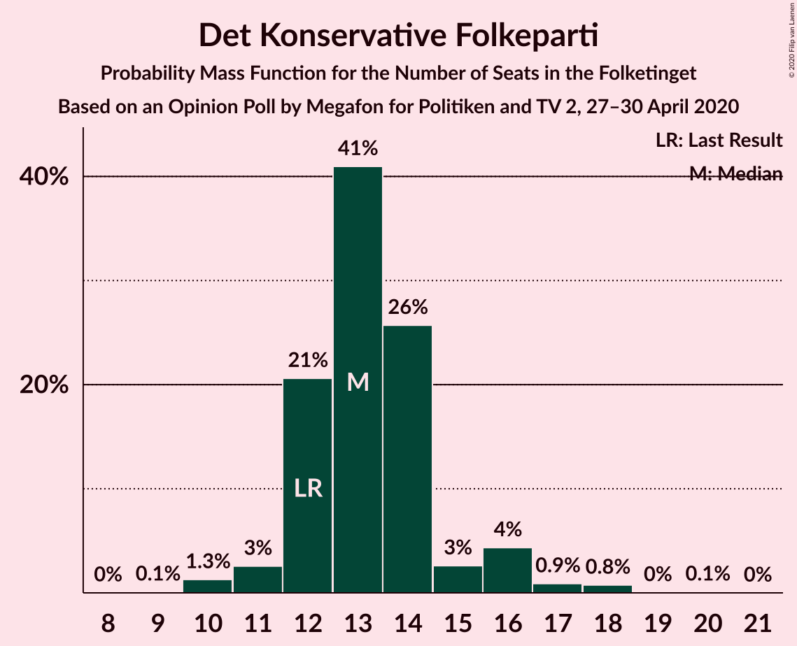

| Number of Seats | Probability | Accumulated | Special Marks |
|:---------------:|:-----------:|:-----------:|:-------------:|
| 9 | 0.1% | 100% |  |
| 10 | 0.7% | 99.9% |  |
| 11 | 0.9% | 99.1% |  |
| 12 | 27% | 98% | Last Result |
| 13 | 41% | 71% | Median |
| 14 | 27% | 30% |  |
| 15 | 0.8% | 3% |  |
| 16 | 2% | 3% |  |
| 17 | 0.8% | 0.9% |  |
| 18 | 0% | 0% |  |

### Nye Borgerlige

*For a full overview of the results for this party, see the [Nye Borgerlige](party-nyeborgerlige.html) page.*

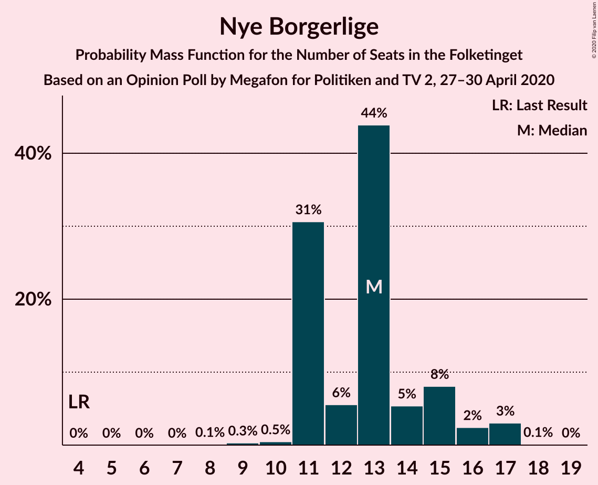

| Number of Seats | Probability | Accumulated | Special Marks |
|:---------------:|:-----------:|:-----------:|:-------------:|
| 4 | 0% | 100% | Last Result |
| 5 | 0% | 100% |  |
| 6 | 0% | 100% |  |
| 7 | 0% | 100% |  |
| 8 | 0% | 100% |  |
| 9 | 0.1% | 100% |  |
| 10 | 0.2% | 99.9% |  |
| 11 | 41% | 99.7% |  |
| 12 | 2% | 59% |  |
| 13 | 48% | 57% | Median |
| 14 | 1.0% | 9% |  |
| 15 | 7% | 8% |  |
| 16 | 0.4% | 0.6% |  |
| 17 | 0.1% | 0.2% |  |
| 18 | 0% | 0% |  |

### Radikale Venstre

*For a full overview of the results for this party, see the [Radikale Venstre](party-radikalevenstre.html) page.*

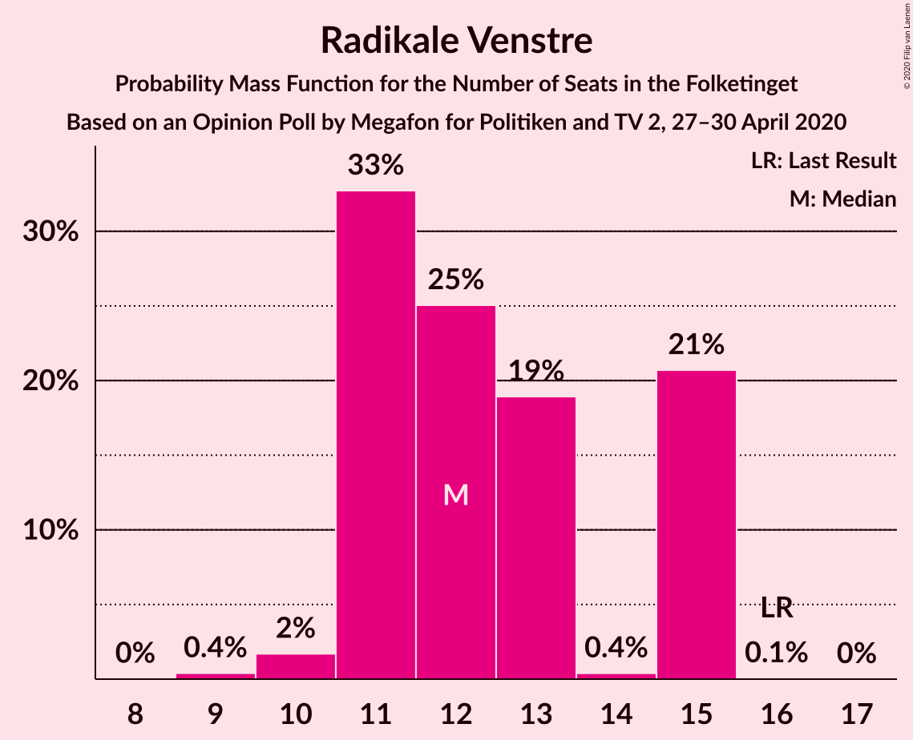

| Number of Seats | Probability | Accumulated | Special Marks |
|:---------------:|:-----------:|:-----------:|:-------------:|
| 9 | 0.4% | 100% |  |
| 10 | 2% | 99.6% |  |
| 11 | 33% | 98% |  |
| 12 | 25% | 65% | Median |
| 13 | 19% | 40% |  |
| 14 | 0.4% | 21% |  |
| 15 | 21% | 21% |  |
| 16 | 0.1% | 0.1% | Last Result |
| 17 | 0% | 0% |  |

### Stram Kurs

*For a full overview of the results for this party, see the [Stram Kurs](party-stramkurs.html) page.*

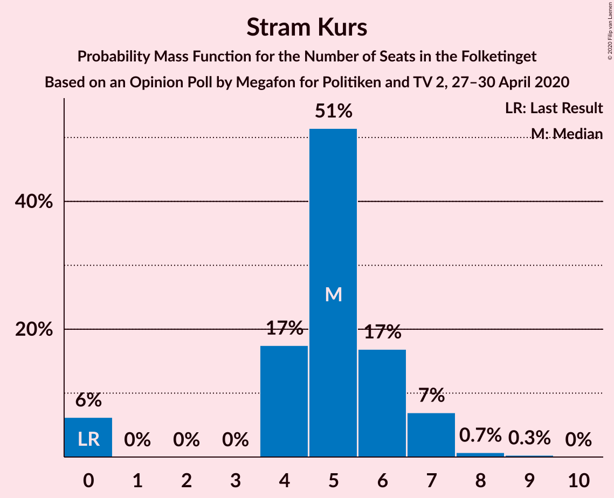

| Number of Seats | Probability | Accumulated | Special Marks |
|:---------------:|:-----------:|:-----------:|:-------------:|
| 0 | 0.1% | 100% | Last Result |
| 1 | 0% | 99.9% |  |
| 2 | 0% | 99.9% |  |
| 3 | 0% | 99.9% |  |
| 4 | 42% | 99.9% |  |
| 5 | 3% | 58% |  |
| 6 | 27% | 55% | Median |
| 7 | 3% | 28% |  |
| 8 | 25% | 25% |  |
| 9 | 0.1% | 0.1% |  |
| 10 | 0% | 0% |  |

### Liberal Alliance

*For a full overview of the results for this party, see the [Liberal Alliance](party-liberalalliance.html) page.*

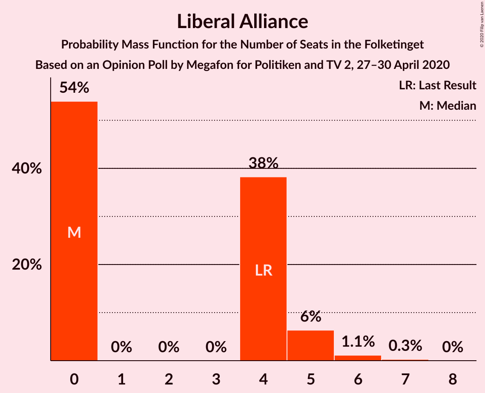

| Number of Seats | Probability | Accumulated | Special Marks |
|:---------------:|:-----------:|:-----------:|:-------------:|
| 0 | 54% | 100% | Median |
| 1 | 0% | 46% |  |
| 2 | 0% | 46% |  |
| 3 | 0% | 46% |  |
| 4 | 38% | 46% | Last Result |
| 5 | 6% | 8% |  |
| 6 | 1.1% | 1.4% |  |
| 7 | 0.3% | 0.3% |  |
| 8 | 0% | 0% |  |

### Dansk Folkeparti

*For a full overview of the results for this party, see the [Dansk Folkeparti](party-danskfolkeparti.html) page.*

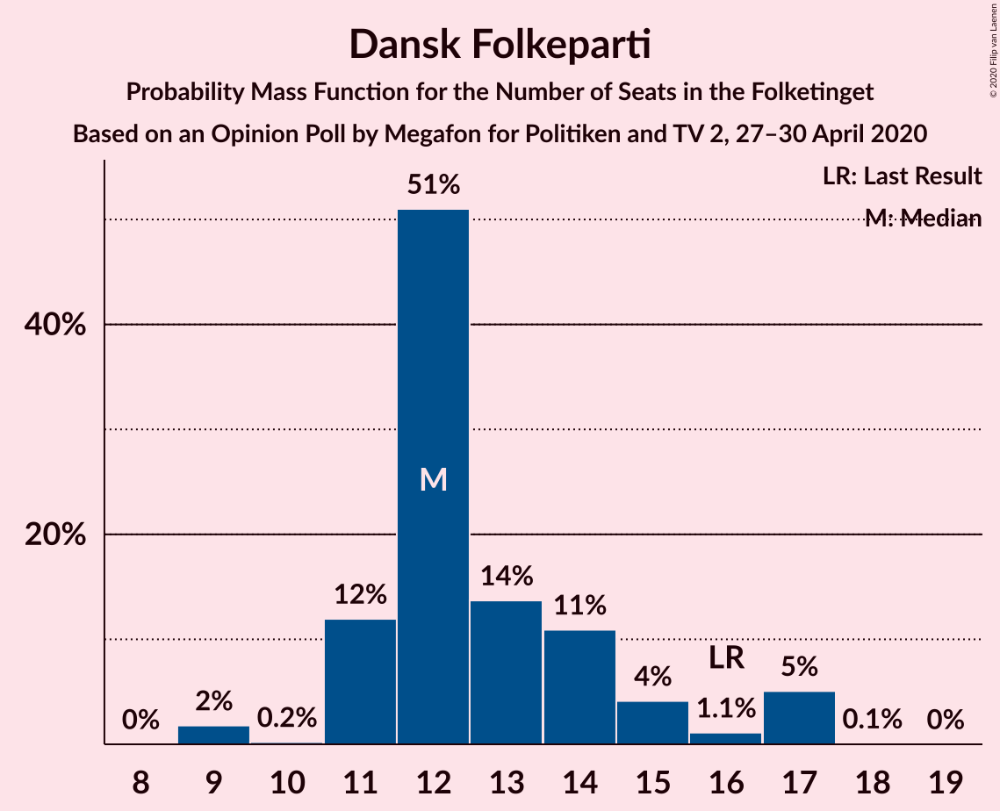

| Number of Seats | Probability | Accumulated | Special Marks |
|:---------------:|:-----------:|:-----------:|:-------------:|
| 0 | 73% | 100% | Median |
| 1 | 0% | 27% |  |
| 2 | 0% | 27% |  |
| 3 | 0% | 27% |  |
| 4 | 27% | 27% |  |
| 5 | 0.1% | 0.1% |  |
| 6 | 0% | 0% |  |
| 7 | 0% | 0% |  |
| 8 | 0% | 0% |  |
| 9 | 0% | 0% |  |
| 10 | 0% | 0% |  |
| 11 | 0% | 0% |  |
| 12 | 0% | 0% |  |
| 13 | 0% | 0% |  |
| 14 | 0% | 0% |  |
| 15 | 0% | 0% |  |
| 16 | 0% | 0% | Last Result |

### Klaus Riskær Pedersen

*For a full overview of the results for this party, see the [Klaus Riskær Pedersen](party-klausriskærpedersen.html) page.*

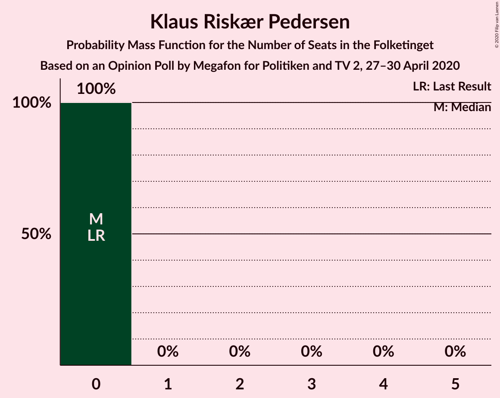

| Number of Seats | Probability | Accumulated | Special Marks |
|:---------------:|:-----------:|:-----------:|:-------------:|
| 0 | 100% | 100% | Last Result, Median |

### Alternativet

*For a full overview of the results for this party, see the [Alternativet](party-alternativet.html) page.*

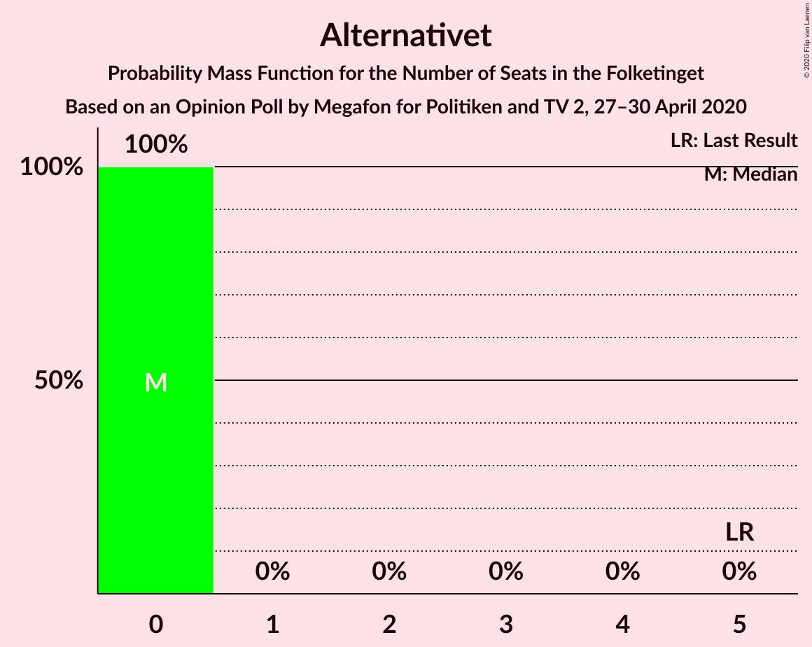

| Number of Seats | Probability | Accumulated | Special Marks |
|:---------------:|:-----------:|:-----------:|:-------------:|
| 0 | 100% | 100% | Median |
| 1 | 0% | 0% |  |
| 2 | 0% | 0% |  |
| 3 | 0% | 0% |  |
| 4 | 0% | 0% |  |
| 5 | 0% | 0% | Last Result |

## Coalitions

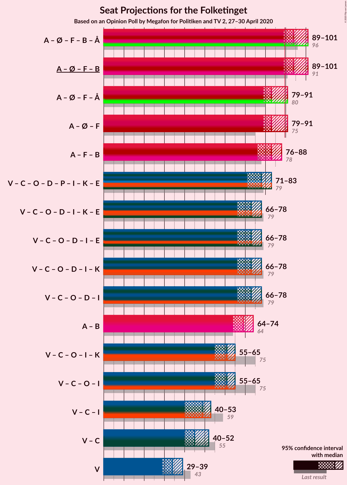

### Confidence Intervals

| Coalition | Last Result | Median | Majority? | 80% Confidence Interval | 90% Confidence Interval | 95% Confidence Interval | 99% Confidence Interval |
|:---------:|:-----------:|:------:|:---------:|:-----------------------:|:-----------------------:|:-----------------------:|:-----------------------:|
| Socialdemokraterne – Enhedslisten–De Rød-Grønne – Socialistisk Folkeparti – Radikale Venstre – Alternativet | 96 | 104 | 100% | 100–105 | 100–105 | 100–106 | 95–107 |
| Socialdemokraterne – Enhedslisten–De Rød-Grønne – Socialistisk Folkeparti – Radikale Venstre | 91 | 104 | 100% | 100–105 | 100–105 | 100–106 | 95–107 |
| Socialdemokraterne – Enhedslisten–De Rød-Grønne – Socialistisk Folkeparti – Alternativet | 80 | 90 | 51% | 89–93 | 89–93 | 89–94 | 83–96 |
| Socialdemokraterne – Enhedslisten–De Rød-Grønne – Socialistisk Folkeparti | 75 | 90 | 51% | 89–93 | 89–93 | 89–94 | 83–96 |
| Socialdemokraterne – Socialistisk Folkeparti – Radikale Venstre | 78 | 89 | 42% | 85–90 | 85–90 | 85–90 | 82–95 |
| Socialdemokraterne – Radikale Venstre | 64 | 75 | 0% | 71–77 | 71–77 | 71–77 | 69–82 |
| Venstre – Det Konservative Folkeparti – Nye Borgerlige – Liberal Alliance – Dansk Folkeparti – Klaus Riskær Pedersen | 79 | 64 | 0% | 58–67 | 58–67 | 58–67 | 58–71 |
| Venstre – Det Konservative Folkeparti – Nye Borgerlige – Liberal Alliance – Dansk Folkeparti | 79 | 64 | 0% | 58–67 | 58–67 | 58–67 | 58–71 |
| Venstre – Det Konservative Folkeparti – Liberal Alliance – Dansk Folkeparti | 75 | 51 | 0% | 47–54 | 47–54 | 47–54 | 47–59 |
| Venstre – Det Konservative Folkeparti – Liberal Alliance | 59 | 47 | 0% | 47–54 | 47–54 | 47–54 | 47–56 |
| Venstre – Det Konservative Folkeparti | 55 | 47 | 0% | 47–50 | 46–50 | 46–50 | 44–52 |
| Venstre | 43 | 35 | 0% | 34–36 | 32–36 | 32–36 | 31–39 |

### Socialdemokraterne – Enhedslisten–De Rød-Grønne – Socialistisk Folkeparti – Radikale Venstre – Alternativet

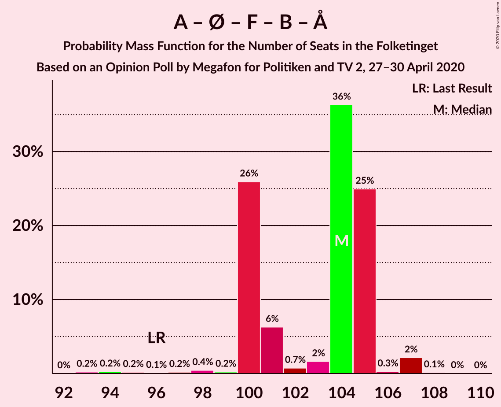

| Number of Seats | Probability | Accumulated | Special Marks |
|:---------------:|:-----------:|:-----------:|:-------------:|
| 93 | 0.2% | 100% |  |
| 94 | 0.2% | 99.8% |  |
| 95 | 0.2% | 99.5% |  |
| 96 | 0.1% | 99.3% | Last Result |
| 97 | 0.2% | 99.3% |  |
| 98 | 0.4% | 99.1% |  |
| 99 | 0.2% | 98.7% |  |
| 100 | 26% | 98% |  |
| 101 | 6% | 73% |  |
| 102 | 0.7% | 66% |  |
| 103 | 2% | 66% | Median |
| 104 | 36% | 64% |  |
| 105 | 25% | 28% |  |
| 106 | 0.3% | 3% |  |
| 107 | 2% | 2% |  |
| 108 | 0.1% | 0.2% |  |
| 109 | 0% | 0.1% |  |
| 110 | 0% | 0% |  |

### Socialdemokraterne – Enhedslisten–De Rød-Grønne – Socialistisk Folkeparti – Radikale Venstre

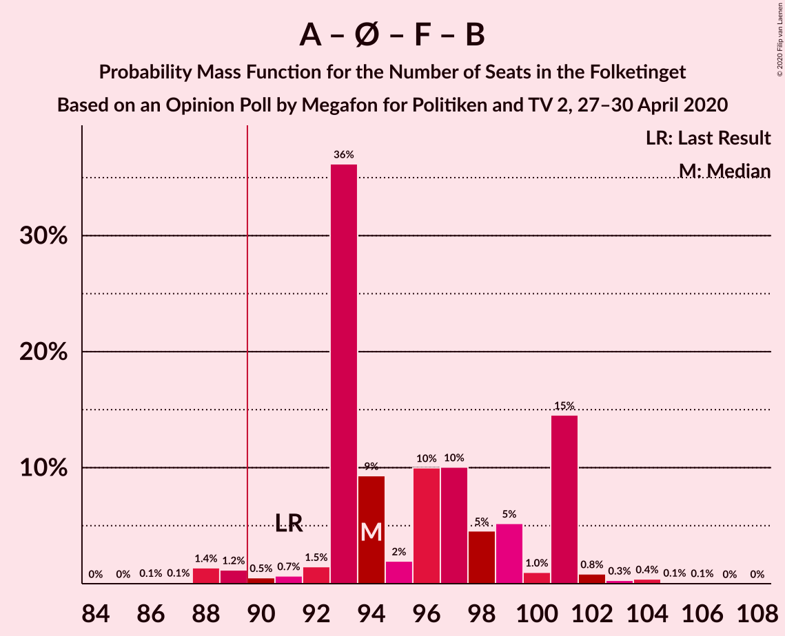

| Number of Seats | Probability | Accumulated | Special Marks |
|:---------------:|:-----------:|:-----------:|:-------------:|
| 91 | 0% | 100% | Last Result |
| 92 | 0% | 100% |  |
| 93 | 0.2% | 100% |  |
| 94 | 0.2% | 99.8% |  |
| 95 | 0.2% | 99.5% |  |
| 96 | 0.1% | 99.3% |  |
| 97 | 0.2% | 99.3% |  |
| 98 | 0.4% | 99.1% |  |
| 99 | 0.2% | 98.7% |  |
| 100 | 26% | 98% |  |
| 101 | 6% | 73% |  |
| 102 | 0.7% | 66% |  |
| 103 | 2% | 66% | Median |
| 104 | 36% | 64% |  |
| 105 | 25% | 28% |  |
| 106 | 0.3% | 3% |  |
| 107 | 2% | 2% |  |
| 108 | 0.1% | 0.2% |  |
| 109 | 0% | 0.1% |  |
| 110 | 0% | 0% |  |

### Socialdemokraterne – Enhedslisten–De Rød-Grønne – Socialistisk Folkeparti – Alternativet

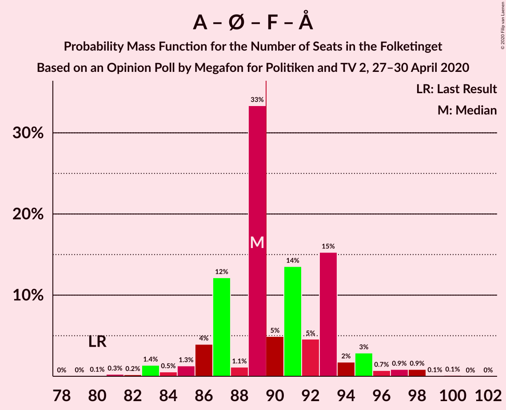

| Number of Seats | Probability | Accumulated | Special Marks |
|:---------------:|:-----------:|:-----------:|:-------------:|
| 80 | 0.1% | 100% | Last Result |
| 81 | 0% | 99.9% |  |
| 82 | 0.1% | 99.8% |  |
| 83 | 0.2% | 99.7% |  |
| 84 | 0.1% | 99.5% |  |
| 85 | 0.3% | 99.4% |  |
| 86 | 0.1% | 99.0% |  |
| 87 | 0.5% | 99.0% |  |
| 88 | 0.2% | 98% |  |
| 89 | 47% | 98% |  |
| 90 | 6% | 51% | Majority |
| 91 | 16% | 45% | Median |
| 92 | 0.9% | 29% |  |
| 93 | 24% | 28% |  |
| 94 | 2% | 3% |  |
| 95 | 0.8% | 2% |  |
| 96 | 0.6% | 0.7% |  |
| 97 | 0% | 0.1% |  |
| 98 | 0% | 0% |  |

### Socialdemokraterne – Enhedslisten–De Rød-Grønne – Socialistisk Folkeparti

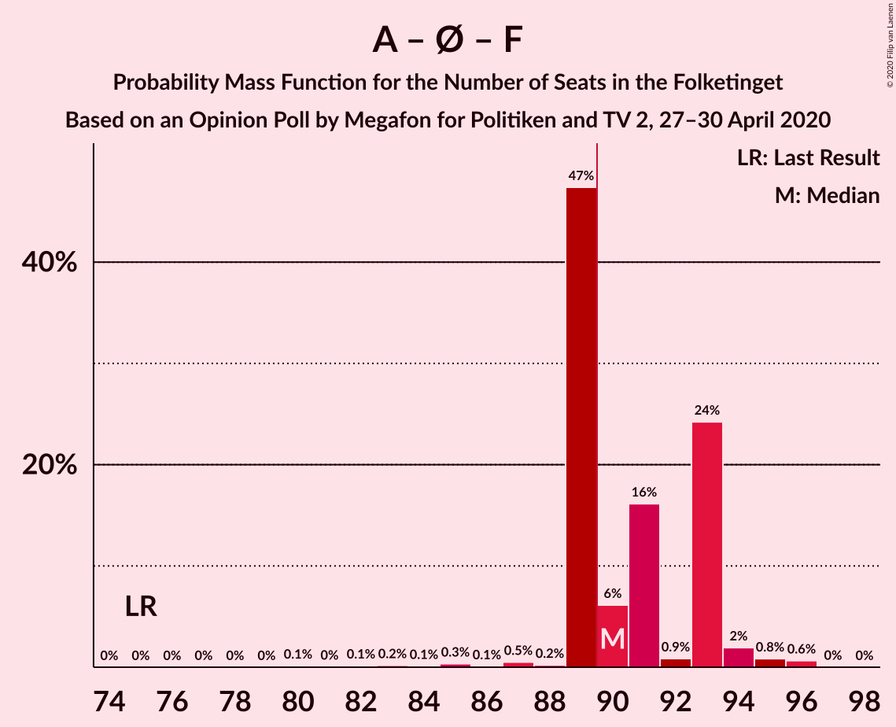

| Number of Seats | Probability | Accumulated | Special Marks |
|:---------------:|:-----------:|:-----------:|:-------------:|
| 75 | 0% | 100% | Last Result |
| 76 | 0% | 100% |  |
| 77 | 0% | 100% |  |
| 78 | 0% | 100% |  |
| 79 | 0% | 100% |  |
| 80 | 0.1% | 100% |  |
| 81 | 0% | 99.9% |  |
| 82 | 0.1% | 99.8% |  |
| 83 | 0.2% | 99.7% |  |
| 84 | 0.1% | 99.5% |  |
| 85 | 0.3% | 99.4% |  |
| 86 | 0.1% | 99.0% |  |
| 87 | 0.5% | 99.0% |  |
| 88 | 0.2% | 98% |  |
| 89 | 47% | 98% |  |
| 90 | 6% | 51% | Majority |
| 91 | 16% | 45% | Median |
| 92 | 0.9% | 29% |  |
| 93 | 24% | 28% |  |
| 94 | 2% | 3% |  |
| 95 | 0.8% | 2% |  |
| 96 | 0.6% | 0.7% |  |
| 97 | 0% | 0.1% |  |
| 98 | 0% | 0% |  |

### Socialdemokraterne – Socialistisk Folkeparti – Radikale Venstre

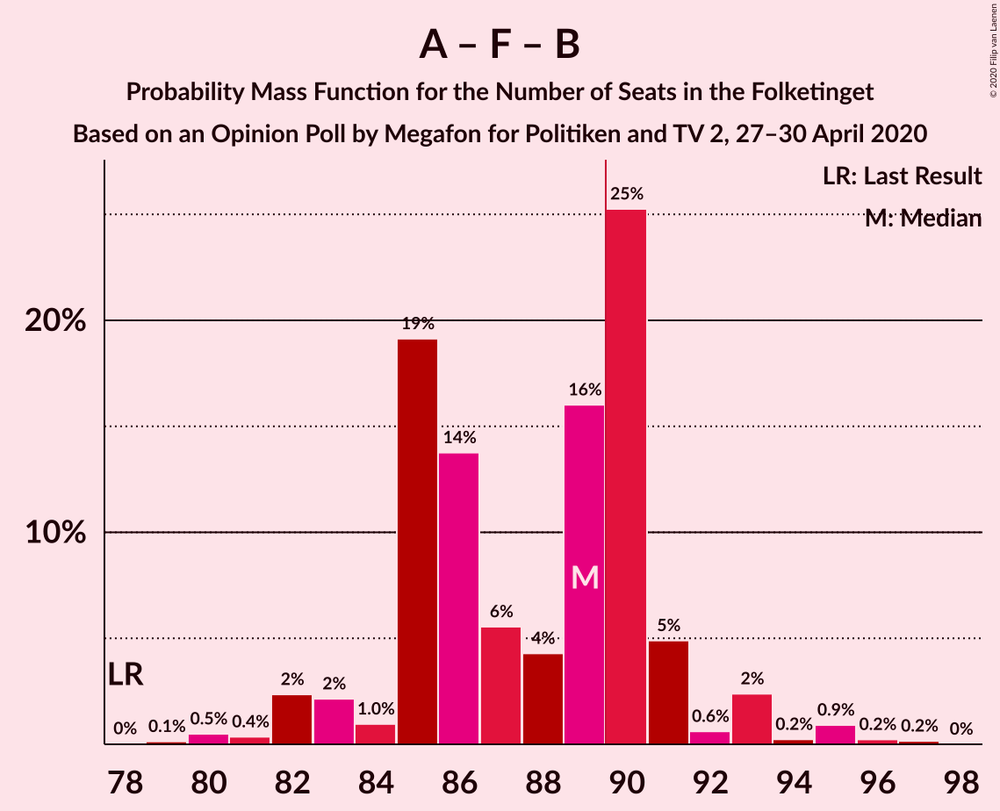

| Number of Seats | Probability | Accumulated | Special Marks |
|:---------------:|:-----------:|:-----------:|:-------------:|
| 78 | 0% | 100% | Last Result |
| 79 | 0.1% | 100% |  |
| 80 | 0.1% | 99.9% |  |
| 81 | 0.2% | 99.8% |  |
| 82 | 0.2% | 99.6% |  |
| 83 | 0.4% | 99.4% |  |
| 84 | 0.1% | 99.0% |  |
| 85 | 27% | 98.9% |  |
| 86 | 6% | 72% |  |
| 87 | 0.5% | 66% |  |
| 88 | 0.3% | 66% | Median |
| 89 | 23% | 66% |  |
| 90 | 40% | 42% | Majority |
| 91 | 0.2% | 2% |  |
| 92 | 0.5% | 2% |  |
| 93 | 0.1% | 1.3% |  |
| 94 | 0.2% | 1.2% |  |
| 95 | 1.1% | 1.1% |  |
| 96 | 0% | 0% |  |

### Socialdemokraterne – Radikale Venstre

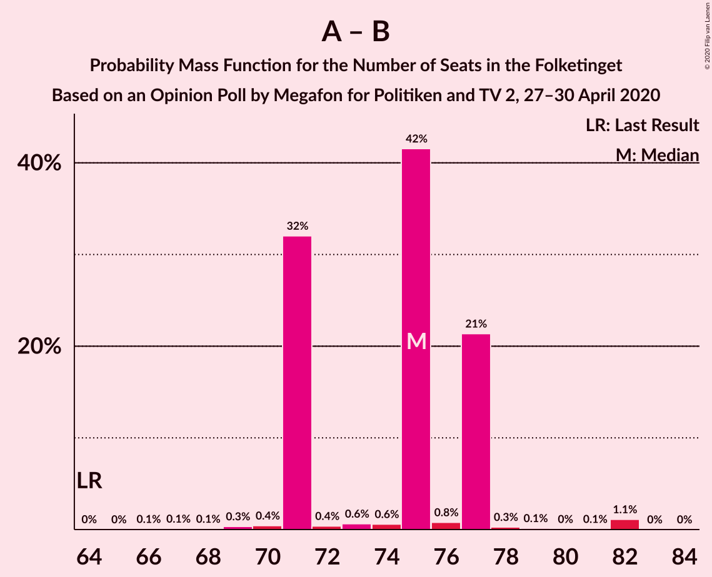

| Number of Seats | Probability | Accumulated | Special Marks |
|:---------------:|:-----------:|:-----------:|:-------------:|
| 64 | 0% | 100% | Last Result |
| 65 | 0% | 100% |  |
| 66 | 0.1% | 100% |  |
| 67 | 0.1% | 99.9% |  |
| 68 | 0.1% | 99.8% |  |
| 69 | 0.3% | 99.7% |  |
| 70 | 0.4% | 99.4% |  |
| 71 | 32% | 99.0% |  |
| 72 | 0.4% | 67% |  |
| 73 | 0.6% | 67% |  |
| 74 | 0.6% | 66% | Median |
| 75 | 42% | 65% |  |
| 76 | 0.8% | 24% |  |
| 77 | 21% | 23% |  |
| 78 | 0.3% | 2% |  |
| 79 | 0.1% | 1.4% |  |
| 80 | 0% | 1.2% |  |
| 81 | 0.1% | 1.2% |  |
| 82 | 1.1% | 1.1% |  |
| 83 | 0% | 0% |  |

### Venstre – Det Konservative Folkeparti – Nye Borgerlige – Liberal Alliance – Dansk Folkeparti – Klaus Riskær Pedersen

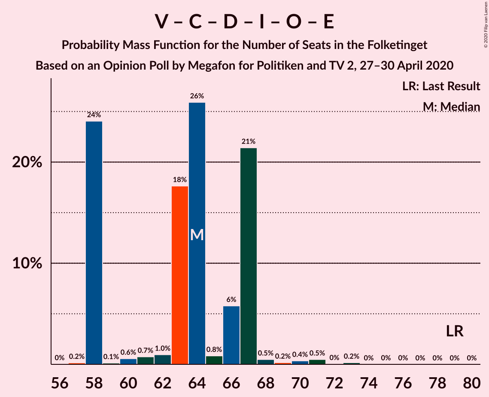

| Number of Seats | Probability | Accumulated | Special Marks |
|:---------------:|:-----------:|:-----------:|:-------------:|
| 57 | 0.2% | 100% |  |
| 58 | 24% | 99.8% |  |
| 59 | 0.1% | 76% |  |
| 60 | 0.6% | 76% |  |
| 61 | 0.7% | 75% | Median |
| 62 | 1.0% | 74% |  |
| 63 | 18% | 73% |  |
| 64 | 26% | 56% |  |
| 65 | 0.8% | 30% |  |
| 66 | 6% | 29% |  |
| 67 | 21% | 23% |  |
| 68 | 0.5% | 2% |  |
| 69 | 0.2% | 1.3% |  |
| 70 | 0.4% | 1.1% |  |
| 71 | 0.5% | 0.7% |  |
| 72 | 0% | 0.2% |  |
| 73 | 0.2% | 0.2% |  |
| 74 | 0% | 0% |  |
| 75 | 0% | 0% |  |
| 76 | 0% | 0% |  |
| 77 | 0% | 0% |  |
| 78 | 0% | 0% |  |
| 79 | 0% | 0% | Last Result |

### Venstre – Det Konservative Folkeparti – Nye Borgerlige – Liberal Alliance – Dansk Folkeparti

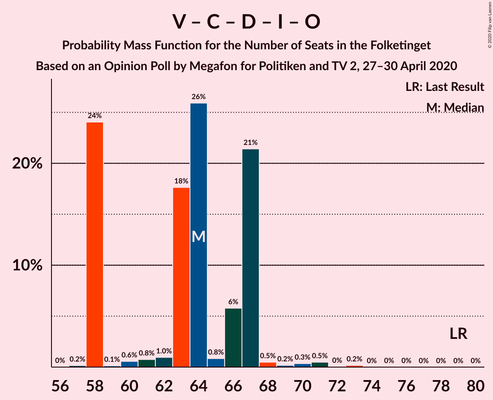

| Number of Seats | Probability | Accumulated | Special Marks |
|:---------------:|:-----------:|:-----------:|:-------------:|
| 57 | 0.2% | 100% |  |
| 58 | 24% | 99.8% |  |
| 59 | 0.1% | 76% |  |
| 60 | 0.6% | 76% |  |
| 61 | 0.8% | 75% | Median |
| 62 | 1.0% | 74% |  |
| 63 | 18% | 73% |  |
| 64 | 26% | 56% |  |
| 65 | 0.8% | 30% |  |
| 66 | 6% | 29% |  |
| 67 | 21% | 23% |  |
| 68 | 0.5% | 2% |  |
| 69 | 0.2% | 1.3% |  |
| 70 | 0.3% | 1.1% |  |
| 71 | 0.5% | 0.7% |  |
| 72 | 0% | 0.2% |  |
| 73 | 0.2% | 0.2% |  |
| 74 | 0% | 0% |  |
| 75 | 0% | 0% |  |
| 76 | 0% | 0% |  |
| 77 | 0% | 0% |  |
| 78 | 0% | 0% |  |
| 79 | 0% | 0% | Last Result |

### Venstre – Det Konservative Folkeparti – Liberal Alliance – Dansk Folkeparti

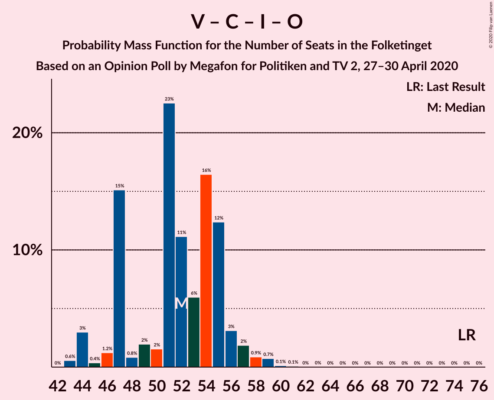

| Number of Seats | Probability | Accumulated | Special Marks |
|:---------------:|:-----------:|:-----------:|:-------------:|
| 43 | 0.1% | 100% |  |
| 44 | 0.1% | 99.9% |  |
| 45 | 0% | 99.8% |  |
| 46 | 0.2% | 99.8% |  |
| 47 | 25% | 99.6% |  |
| 48 | 0.8% | 75% | Median |
| 49 | 1.1% | 74% |  |
| 50 | 0.1% | 73% |  |
| 51 | 33% | 73% |  |
| 52 | 17% | 40% |  |
| 53 | 1.0% | 23% |  |
| 54 | 21% | 22% |  |
| 55 | 0.2% | 1.4% |  |
| 56 | 0.3% | 1.2% |  |
| 57 | 0.4% | 1.0% |  |
| 58 | 0.1% | 0.6% |  |
| 59 | 0.3% | 0.5% |  |
| 60 | 0.2% | 0.2% |  |
| 61 | 0% | 0% |  |
| 62 | 0% | 0% |  |
| 63 | 0% | 0% |  |
| 64 | 0% | 0% |  |
| 65 | 0% | 0% |  |
| 66 | 0% | 0% |  |
| 67 | 0% | 0% |  |
| 68 | 0% | 0% |  |
| 69 | 0% | 0% |  |
| 70 | 0% | 0% |  |
| 71 | 0% | 0% |  |
| 72 | 0% | 0% |  |
| 73 | 0% | 0% |  |
| 74 | 0% | 0% |  |
| 75 | 0% | 0% | Last Result |

### Venstre – Det Konservative Folkeparti – Liberal Alliance

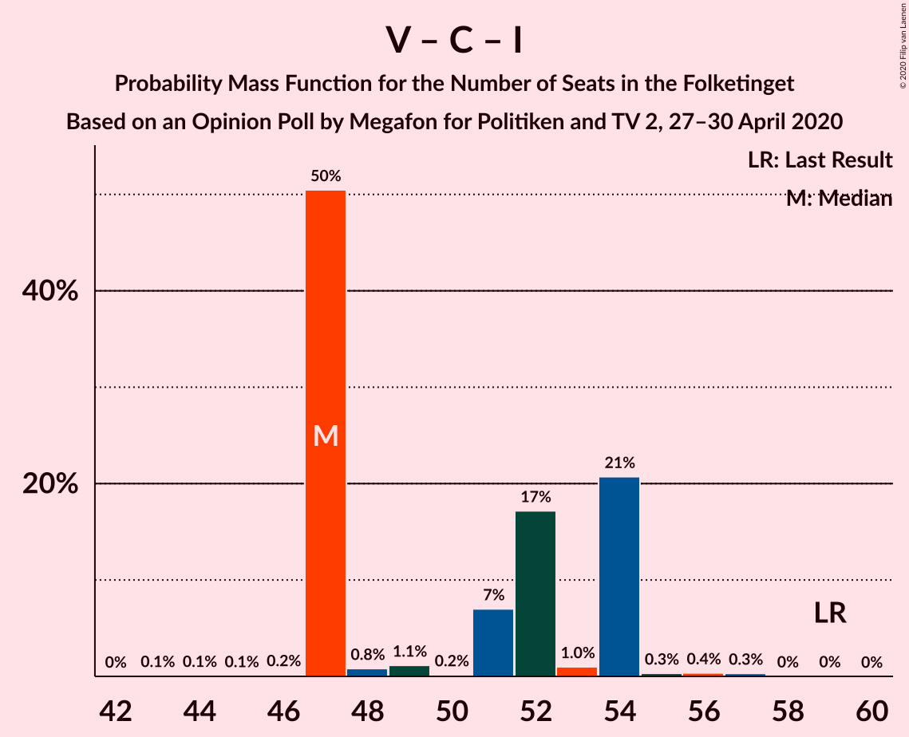

| Number of Seats | Probability | Accumulated | Special Marks |
|:---------------:|:-----------:|:-----------:|:-------------:|
| 43 | 0.1% | 100% |  |
| 44 | 0.1% | 99.9% |  |
| 45 | 0.1% | 99.8% |  |
| 46 | 0.2% | 99.7% |  |
| 47 | 50% | 99.6% |  |
| 48 | 0.8% | 49% | Median |
| 49 | 1.1% | 48% |  |
| 50 | 0.2% | 47% |  |
| 51 | 7% | 47% |  |
| 52 | 17% | 40% |  |
| 53 | 1.0% | 23% |  |
| 54 | 21% | 22% |  |
| 55 | 0.3% | 1.1% |  |
| 56 | 0.4% | 0.8% |  |
| 57 | 0.3% | 0.4% |  |
| 58 | 0% | 0.1% |  |
| 59 | 0% | 0.1% | Last Result |
| 60 | 0% | 0% |  |

### Venstre – Det Konservative Folkeparti

| Number of Seats | Probability | Accumulated | Special Marks |
|:---------------:|:-----------:|:-----------:|:-------------:|
| 41 | 0.1% | 100% |  |
| 42 | 0.1% | 99.9% |  |
| 43 | 0.1% | 99.8% |  |
| 44 | 0.2% | 99.7% |  |
| 45 | 0.8% | 99.5% |  |
| 46 | 5% | 98.7% |  |
| 47 | 52% | 93% |  |
| 48 | 17% | 41% | Median |
| 49 | 1.0% | 24% |  |
| 50 | 21% | 23% |  |
| 51 | 1.5% | 2% |  |
| 52 | 0.4% | 0.9% |  |
| 53 | 0.3% | 0.5% |  |
| 54 | 0.1% | 0.2% |  |
| 55 | 0% | 0.1% | Last Result |
| 56 | 0% | 0% |  |

### Venstre

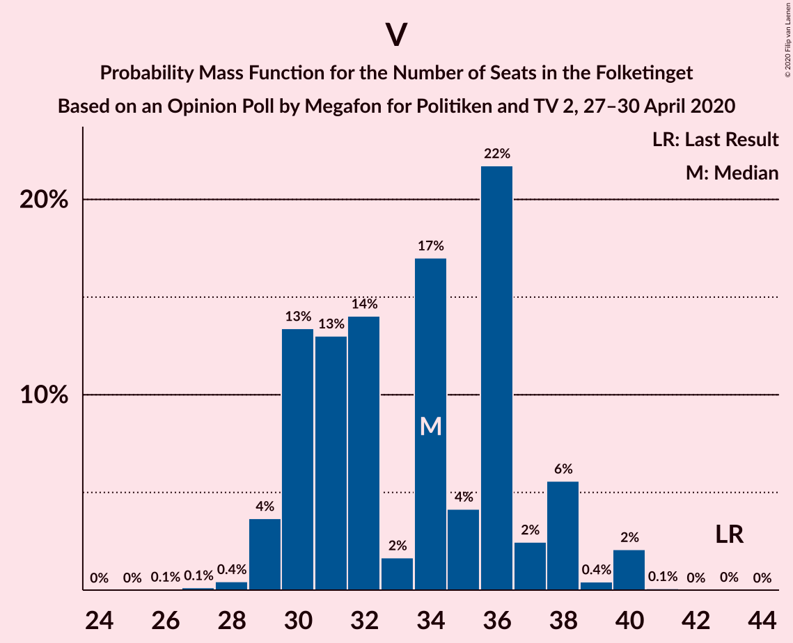

| Number of Seats | Probability | Accumulated | Special Marks |
|:---------------:|:-----------:|:-----------:|:-------------:|
| 30 | 0.1% | 100% |  |
| 31 | 2% | 99.9% |  |
| 32 | 5% | 98% |  |
| 33 | 0.9% | 93% |  |
| 34 | 25% | 92% |  |
| 35 | 43% | 66% | Median |
| 36 | 22% | 24% |  |
| 37 | 0.7% | 2% |  |
| 38 | 0.9% | 2% |  |
| 39 | 0.3% | 0.7% |  |
| 40 | 0.2% | 0.3% |  |
| 41 | 0.1% | 0.1% |  |
| 42 | 0% | 0% |  |
| 43 | 0% | 0% | Last Result |

## Technical Information

### Opinion Poll

+ **Polling firm:** Megafon
+ **Commissioner(s):** Politiken and TV 2
+ **Fieldwork period:** 27–30 April 2020

### Calculations

+ **Sample size:** 1002
+ **Simulations done:** 262,144
+ **Error estimate:** 2.13%

