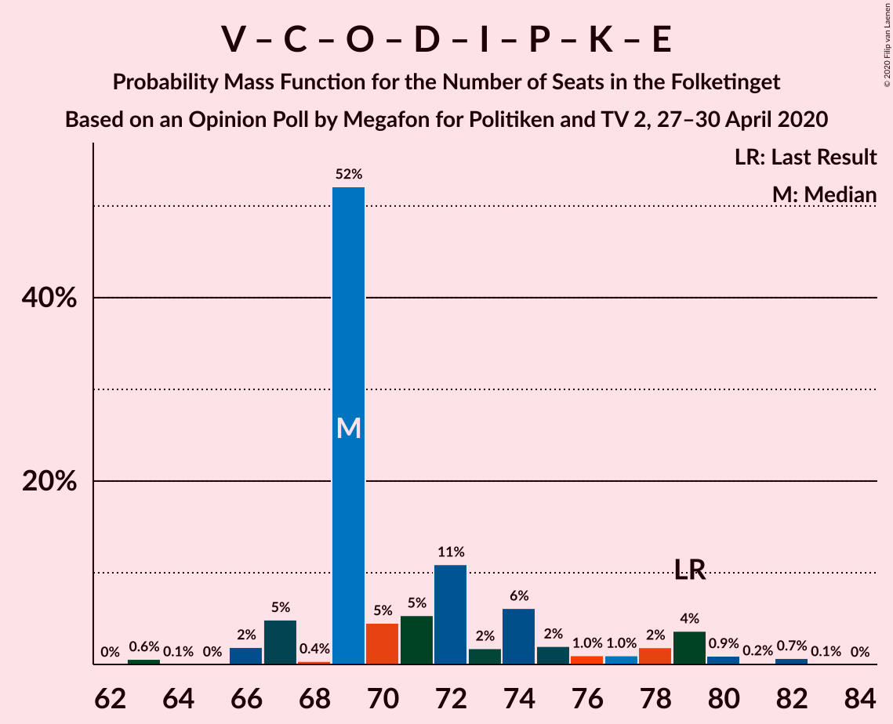

# Opinion Poll by Megafon for Politiken and TV 2, 27–30 April 2020

<a href="#voting-intentions">Voting Intentions</a> | <a href="#seats">Seats</a> | <a href="#coalitions">Coalitions</a> | <a href="#technical-information">Technical Information</a>

## Voting Intentions

### Confidence Intervals

| Party | Last Result | Poll Result | 80% Confidence Interval | 90% Confidence Interval | 95% Confidence Interval | 99% Confidence Interval |
|:-----:|:-----------:|:-----------:|:-----------------------:|:-----------------------:|:-----------------------:|:-----------------------:|
| Socialdemokraterne | 25.9% | 34.2% | 32.3–36.2% |31.8–36.7% |31.4–37.2% |30.5–38.2% |
| Venstre | 23.4% | 19.8% | 18.2–21.4% |17.8–21.9% |17.4–22.3% |16.7–23.2% |
| Enhedslisten–De Rød-Grønne | 6.9% | 7.9% | 6.9–9.1% |6.6–9.4% |6.4–9.7% |5.9–10.3% |
| Socialistisk Folkeparti | 7.7% | 7.8% | 6.8–9.0% |6.5–9.3% |6.3–9.6% |5.8–10.2% |
| Det Konservative Folkeparti | 6.6% | 7.3% | 6.3–8.4% |6.1–8.8% |5.8–9.1% |5.4–9.7% |
| Dansk Folkeparti | 8.7% | 7.2% | 6.2–8.4% |6.0–8.7% |5.7–9.0% |5.3–9.5% |
| Radikale Venstre | 8.6% | 6.5% | 5.6–7.6% |5.3–7.9% |5.1–8.2% |4.7–8.7% |
| Nye Borgerlige | 2.4% | 3.0% | 2.4–3.8% |2.2–4.0% |2.1–4.3% |1.8–4.7% |
| Liberal Alliance | 2.3% | 2.0% | 1.5–2.7% |1.4–2.9% |1.3–3.1% |1.1–3.4% |
| Stram Kurs | 1.8% | 1.7% | 1.3–2.3% |1.2–2.5% |1.1–2.7% |0.9–3.1% |
| Kristendemokraterne | 1.7% | 1.4% | 1.0–2.0% |0.9–2.2% |0.8–2.3% |0.7–2.7% |
| Klaus Riskær Pedersen | 0.8% | 0.6% | 0.4–1.1% |0.3–1.2% |0.3–1.3% |0.2–1.6% |
| Alternativet | 3.0% | 0.4% | 0.2–0.8% |0.2–0.9% |0.2–1.0% |0.1–1.3% |

*Note:* The poll result column reflects the actual value used in the calculations. Published results may vary slightly, and in addition be rounded to fewer digits.

## Seats

### Confidence Intervals

| Party | Last Result | Median | 80% Confidence Interval | 90% Confidence Interval | 95% Confidence Interval | 99% Confidence Interval |
|:-----:|:-----------:|:------:|:-----------------------:|:-----------------------:|:-----------------------:|:-----------------------:|
| <a href="#socialdemokraterne">Socialdemokraterne</a> | 48 | 65 | 59–65 |57–66 |57–67 |54–69 |
| <a href="#venstre">Venstre</a> | 43 | 35 | 34–39 |32–40 |32–40 |30–45 |
| <a href="#enhedslisten–de-rød-grønne">Enhedslisten–De Rød-Grønne</a> | 13 | 13 | 13–19 |12–20 |11–20 |11–20 |
| <a href="#socialistisk-folkeparti">Socialistisk Folkeparti</a> | 14 | 17 | 13–17 |13–17 |12–17 |11–19 |
| <a href="#det-konservative-folkeparti">Det Konservative Folkeparti</a> | 12 | 13 | 11–15 |11–15 |10–17 |9–19 |
| <a href="#dansk-folkeparti">Dansk Folkeparti</a> | 16 | 12 | 11–15 |11–17 |11–17 |9–17 |
| <a href="#radikale-venstre">Radikale Venstre</a> | 16 | 11 | 10–13 |10–13 |9–14 |9–16 |
| <a href="#nye-borgerlige">Nye Borgerlige</a> | 4 | 5 | 5–7 |4–8 |4–9 |4–9 |
| <a href="#liberal-alliance">Liberal Alliance</a> | 4 | 0 | 0–4 |0–5 |0–5 |0–6 |
| <a href="#stram-kurs">Stram Kurs</a> | 0 | 4 | 0–4 |0–4 |0–5 |0–5 |
| <a href="#kristendemokraterne">Kristendemokraterne</a> | 0 | 0 | 0 |0–4 |0–4 |0–4 |
| <a href="#klaus-riskær-pedersen">Klaus Riskær Pedersen</a> | 0 | 0 | 0 |0 |0 |0 |
| <a href="#alternativet">Alternativet</a> | 5 | 0 | 0 |0 |0 |0 |

### Socialdemokraterne

*For a full overview of the results for this party, see the [Socialdemokraterne](party-socialdemokraterne.html) page.*

| Number of Seats | Probability | Accumulated | Special Marks |
|:---------------:|:-----------:|:-----------:|:-------------:|
| 48 | 0% | 100% | Last Result |
| 49 | 0% | 100% |  |
| 50 | 0% | 100% |  |
| 51 | 0.1% | 100% |  |
| 52 | 0% | 99.9% |  |
| 53 | 0.1% | 99.9% |  |
| 54 | 0.9% | 99.8% |  |
| 55 | 0.5% | 98.9% |  |
| 56 | 0.9% | 98% |  |
| 57 | 3% | 98% |  |
| 58 | 4% | 94% |  |
| 59 | 5% | 90% |  |
| 60 | 10% | 86% |  |
| 61 | 7% | 75% |  |
| 62 | 2% | 69% |  |
| 63 | 1.4% | 67% |  |
| 64 | 7% | 66% |  |
| 65 | 52% | 59% | Median |
| 66 | 4% | 6% |  |
| 67 | 1.5% | 3% |  |
| 68 | 0.4% | 1.3% |  |
| 69 | 0.7% | 0.9% |  |
| 70 | 0.1% | 0.2% |  |
| 71 | 0% | 0.1% |  |
| 72 | 0% | 0% |  |

### Venstre

*For a full overview of the results for this party, see the [Venstre](party-venstre.html) page.*

| Number of Seats | Probability | Accumulated | Special Marks |
|:---------------:|:-----------:|:-----------:|:-------------:|
| 29 | 0% | 100% |  |
| 30 | 0.6% | 99.9% |  |
| 31 | 0.2% | 99.3% |  |
| 32 | 6% | 99.1% |  |
| 33 | 1.1% | 94% |  |
| 34 | 8% | 92% |  |
| 35 | 55% | 85% | Median |
| 36 | 14% | 30% |  |
| 37 | 3% | 16% |  |
| 38 | 2% | 13% |  |
| 39 | 5% | 11% |  |
| 40 | 4% | 6% |  |
| 41 | 0.2% | 2% |  |
| 42 | 0.9% | 2% |  |
| 43 | 0.1% | 0.8% | Last Result |
| 44 | 0% | 0.7% |  |
| 45 | 0.7% | 0.7% |  |
| 46 | 0% | 0% |  |

### Enhedslisten–De Rød-Grønne

*For a full overview of the results for this party, see the [Enhedslisten–De Rød-Grønne](party-enhedslisten–derød-grønne.html) page.*

| Number of Seats | Probability | Accumulated | Special Marks |
|:---------------:|:-----------:|:-----------:|:-------------:|
| 10 | 0.1% | 100% |  |
| 11 | 3% | 99.9% |  |
| 12 | 5% | 97% |  |
| 13 | 55% | 92% | Last Result, Median |
| 14 | 9% | 37% |  |
| 15 | 9% | 28% |  |
| 16 | 5% | 20% |  |
| 17 | 3% | 15% |  |
| 18 | 2% | 12% |  |
| 19 | 0.7% | 10% |  |
| 20 | 10% | 10% |  |
| 21 | 0% | 0% |  |

### Socialistisk Folkeparti

*For a full overview of the results for this party, see the [Socialistisk Folkeparti](party-socialistiskfolkeparti.html) page.*

| Number of Seats | Probability | Accumulated | Special Marks |
|:---------------:|:-----------:|:-----------:|:-------------:|
| 10 | 0.4% | 100% |  |
| 11 | 1.4% | 99.6% |  |
| 12 | 2% | 98% |  |
| 13 | 17% | 96% |  |
| 14 | 7% | 79% | Last Result |
| 15 | 5% | 72% |  |
| 16 | 10% | 67% |  |
| 17 | 56% | 57% | Median |
| 18 | 0.8% | 1.3% |  |
| 19 | 0.4% | 0.5% |  |
| 20 | 0.1% | 0.1% |  |
| 21 | 0% | 0% |  |

### Det Konservative Folkeparti

*For a full overview of the results for this party, see the [Det Konservative Folkeparti](party-detkonservativefolkeparti.html) page.*

| Number of Seats | Probability | Accumulated | Special Marks |
|:---------------:|:-----------:|:-----------:|:-------------:|
| 9 | 0.5% | 100% |  |
| 10 | 2% | 99.5% |  |
| 11 | 8% | 97% |  |
| 12 | 3% | 89% | Last Result |
| 13 | 66% | 86% | Median |
| 14 | 7% | 20% |  |
| 15 | 10% | 13% |  |
| 16 | 0.5% | 3% |  |
| 17 | 2% | 3% |  |
| 18 | 0.1% | 0.9% |  |
| 19 | 0.8% | 0.8% |  |
| 20 | 0% | 0% |  |

### Dansk Folkeparti

*For a full overview of the results for this party, see the [Dansk Folkeparti](party-danskfolkeparti.html) page.*

| Number of Seats | Probability | Accumulated | Special Marks |
|:---------------:|:-----------:|:-----------:|:-------------:|
| 9 | 2% | 100% |  |
| 10 | 0.2% | 98% |  |
| 11 | 12% | 98% |  |
| 12 | 51% | 86% | Median |
| 13 | 14% | 35% |  |
| 14 | 11% | 21% |  |
| 15 | 4% | 10% |  |
| 16 | 1.1% | 6% | Last Result |
| 17 | 5% | 5% |  |
| 18 | 0.1% | 0.1% |  |
| 19 | 0% | 0% |  |

### Radikale Venstre

*For a full overview of the results for this party, see the [Radikale Venstre](party-radikalevenstre.html) page.*

| Number of Seats | Probability | Accumulated | Special Marks |
|:---------------:|:-----------:|:-----------:|:-------------:|
| 8 | 0.2% | 100% |  |
| 9 | 3% | 99.8% |  |
| 10 | 13% | 97% |  |
| 11 | 59% | 84% | Median |
| 12 | 9% | 25% |  |
| 13 | 12% | 16% |  |
| 14 | 4% | 5% |  |
| 15 | 0.6% | 1.1% |  |
| 16 | 0.4% | 0.5% | Last Result |
| 17 | 0.1% | 0.1% |  |
| 18 | 0% | 0% |  |

### Nye Borgerlige

*For a full overview of the results for this party, see the [Nye Borgerlige](party-nyeborgerlige.html) page.*

| Number of Seats | Probability | Accumulated | Special Marks |
|:---------------:|:-----------:|:-----------:|:-------------:|
| 0 | 0.4% | 100% |  |
| 1 | 0% | 99.6% |  |
| 2 | 0% | 99.6% |  |
| 3 | 0% | 99.6% |  |
| 4 | 5% | 99.6% | Last Result |
| 5 | 59% | 94% | Median |
| 6 | 23% | 35% |  |
| 7 | 4% | 12% |  |
| 8 | 4% | 8% |  |
| 9 | 4% | 4% |  |
| 10 | 0% | 0% |  |

### Liberal Alliance

*For a full overview of the results for this party, see the [Liberal Alliance](party-liberalalliance.html) page.*

| Number of Seats | Probability | Accumulated | Special Marks |
|:---------------:|:-----------:|:-----------:|:-------------:|
| 0 | 73% | 100% | Median |
| 1 | 0% | 27% |  |
| 2 | 0% | 27% |  |
| 3 | 0% | 27% |  |
| 4 | 18% | 27% | Last Result |
| 5 | 7% | 10% |  |
| 6 | 2% | 2% |  |
| 7 | 0.3% | 0.3% |  |
| 8 | 0% | 0% |  |

### Stram Kurs

*For a full overview of the results for this party, see the [Stram Kurs](party-stramkurs.html) page.*

| Number of Seats | Probability | Accumulated | Special Marks |
|:---------------:|:-----------:|:-----------:|:-------------:|
| 0 | 42% | 100% | Last Result |
| 1 | 0% | 58% |  |
| 2 | 0% | 58% |  |
| 3 | 0% | 58% |  |
| 4 | 56% | 58% | Median |
| 5 | 2% | 3% |  |
| 6 | 0.2% | 0.2% |  |
| 7 | 0% | 0% |  |

### Kristendemokraterne

*For a full overview of the results for this party, see the [Kristendemokraterne](party-kristendemokraterne.html) page.*

| Number of Seats | Probability | Accumulated | Special Marks |
|:---------------:|:-----------:|:-----------:|:-------------:|
| 0 | 91% | 100% | Last Result, Median |
| 1 | 0% | 9% |  |
| 2 | 0% | 9% |  |
| 3 | 0% | 9% |  |
| 4 | 8% | 9% |  |
| 5 | 0.2% | 0.2% |  |
| 6 | 0% | 0% |  |

### Klaus Riskær Pedersen

*For a full overview of the results for this party, see the [Klaus Riskær Pedersen](party-klausriskærpedersen.html) page.*

| Number of Seats | Probability | Accumulated | Special Marks |
|:---------------:|:-----------:|:-----------:|:-------------:|
| 0 | 100% | 100% | Last Result, Median |

### Alternativet

*For a full overview of the results for this party, see the [Alternativet](party-alternativet.html) page.*

| Number of Seats | Probability | Accumulated | Special Marks |
|:---------------:|:-----------:|:-----------:|:-------------:|
| 0 | 100% | 100% | Median |
| 1 | 0% | 0% |  |
| 2 | 0% | 0% |  |
| 3 | 0% | 0% |  |
| 4 | 0% | 0% |  |
| 5 | 0% | 0% | Last Result |

## Coalitions

### Confidence Intervals

| Coalition | Last Result | Median | Majority? | 80% Confidence Interval | 90% Confidence Interval | 95% Confidence Interval | 99% Confidence Interval |
|:---------:|:-----------:|:------:|:---------:|:-----------------------:|:-----------------------:|:-----------------------:|:-----------------------:|
| Socialdemokraterne – Enhedslisten–De Rød-Grønne – Socialistisk Folkeparti – Radikale Venstre – Alternativet | 96 | 106 | 100% | 100–106 | 96–108 | 96–109 | 93–112 |
| Socialdemokraterne – Enhedslisten–De Rød-Grønne – Socialistisk Folkeparti – Radikale Venstre | 91 | 106 | 100% | 100–106 | 96–108 | 96–109 | 93–112 |
| Socialdemokraterne – Enhedslisten–De Rød-Grønne – Socialistisk Folkeparti – Alternativet | 80 | 95 | 83% | 87–95 | 85–96 | 83–97 | 81–99 |
| Socialdemokraterne – Enhedslisten–De Rød-Grønne – Socialistisk Folkeparti | 75 | 95 | 83% | 87–95 | 85–96 | 83–97 | 81–99 |
| Socialdemokraterne – Socialistisk Folkeparti – Radikale Venstre | 78 | 93 | 64% | 83–93 | 83–93 | 83–93 | 78–95 |
| Socialdemokraterne – Radikale Venstre | 64 | 76 | 0% | 70–77 | 70–78 | 68–79 | 66–82 |
| Venstre – Det Konservative Folkeparti – Dansk Folkeparti – Nye Borgerlige – Liberal Alliance – Stram Kurs – Kristendemokraterne – Klaus Riskær Pedersen | 79 | 69 | 0% | 69–75 | 67–79 | 66–79 | 63–82 |
| Venstre – Det Konservative Folkeparti – Dansk Folkeparti – Nye Borgerlige – Liberal Alliance – Kristendemokraterne – Klaus Riskær Pedersen | 79 | 65 | 0% | 65–74 | 65–78 | 65–79 | 63–80 |
| Venstre – Det Konservative Folkeparti – Dansk Folkeparti – Nye Borgerlige – Liberal Alliance – Klaus Riskær Pedersen | 79 | 65 | 0% | 65–74 | 65–77 | 65–79 | 63–80 |
| Venstre – Det Konservative Folkeparti – Dansk Folkeparti – Nye Borgerlige – Liberal Alliance – Kristendemokraterne | 79 | 65 | 0% | 65–74 | 65–78 | 65–79 | 63–80 |
| Venstre – Det Konservative Folkeparti – Dansk Folkeparti – Nye Borgerlige – Liberal Alliance | 79 | 65 | 0% | 65–74 | 65–77 | 65–79 | 63–80 |
| Venstre – Det Konservative Folkeparti – Dansk Folkeparti – Liberal Alliance – Kristendemokraterne | 75 | 60 | 0% | 60–68 | 60–71 | 58–71 | 58–75 |
| Venstre – Det Konservative Folkeparti – Dansk Folkeparti – Liberal Alliance | 75 | 60 | 0% | 60–68 | 60–71 | 58–71 | 58–75 |
| Venstre – Det Konservative Folkeparti – Liberal Alliance | 59 | 48 | 0% | 48–54 | 47–55 | 46–57 | 45–60 |
| Venstre – Det Konservative Folkeparti | 55 | 48 | 0% | 47–52 | 46–54 | 44–55 | 42–57 |
| Venstre | 43 | 35 | 0% | 34–39 | 32–40 | 32–40 | 30–45 |

### Socialdemokraterne – Enhedslisten–De Rød-Grønne – Socialistisk Folkeparti – Radikale Venstre – Alternativet

| Number of Seats | Probability | Accumulated | Special Marks |
|:---------------:|:-----------:|:-----------:|:-------------:|
| 92 | 0.1% | 100% |  |
| 93 | 0.7% | 99.9% |  |
| 94 | 0.2% | 99.2% |  |
| 95 | 0.9% | 99.1% |  |
| 96 | 4% | 98% | Last Result |
| 97 | 2% | 94% |  |
| 98 | 1.0% | 93% |  |
| 99 | 1.0% | 92% |  |
| 100 | 2% | 91% |  |
| 101 | 6% | 89% |  |
| 102 | 2% | 83% |  |
| 103 | 11% | 81% |  |
| 104 | 5% | 70% |  |
| 105 | 5% | 64% |  |
| 106 | 52% | 60% | Median |
| 107 | 0.4% | 8% |  |
| 108 | 5% | 7% |  |
| 109 | 2% | 3% |  |
| 110 | 0% | 0.7% |  |
| 111 | 0.1% | 0.7% |  |
| 112 | 0.6% | 0.6% |  |
| 113 | 0% | 0% |  |

### Socialdemokraterne – Enhedslisten–De Rød-Grønne – Socialistisk Folkeparti – Radikale Venstre

| Number of Seats | Probability | Accumulated | Special Marks |
|:---------------:|:-----------:|:-----------:|:-------------:|
| 91 | 0% | 100% | Last Result |
| 92 | 0.1% | 100% |  |
| 93 | 0.7% | 99.9% |  |
| 94 | 0.2% | 99.2% |  |
| 95 | 0.9% | 99.1% |  |
| 96 | 4% | 98% |  |
| 97 | 2% | 94% |  |
| 98 | 1.0% | 93% |  |
| 99 | 1.0% | 92% |  |
| 100 | 2% | 91% |  |
| 101 | 6% | 89% |  |
| 102 | 2% | 83% |  |
| 103 | 11% | 81% |  |
| 104 | 5% | 70% |  |
| 105 | 5% | 64% |  |
| 106 | 52% | 60% | Median |
| 107 | 0.4% | 8% |  |
| 108 | 5% | 7% |  |
| 109 | 2% | 3% |  |
| 110 | 0% | 0.7% |  |
| 111 | 0.1% | 0.7% |  |
| 112 | 0.6% | 0.6% |  |
| 113 | 0% | 0% |  |

### Socialdemokraterne – Enhedslisten–De Rød-Grønne – Socialistisk Folkeparti – Alternativet

| Number of Seats | Probability | Accumulated | Special Marks |
|:---------------:|:-----------:|:-----------:|:-------------:|
| 80 | 0% | 100% | Last Result |
| 81 | 1.0% | 100% |  |
| 82 | 0.1% | 98.9% |  |
| 83 | 2% | 98.9% |  |
| 84 | 0.2% | 97% |  |
| 85 | 3% | 96% |  |
| 86 | 0.8% | 93% |  |
| 87 | 3% | 92% |  |
| 88 | 0.9% | 89% |  |
| 89 | 5% | 88% |  |
| 90 | 2% | 83% | Majority |
| 91 | 4% | 82% |  |
| 92 | 2% | 78% |  |
| 93 | 13% | 75% |  |
| 94 | 3% | 62% |  |
| 95 | 54% | 59% | Median |
| 96 | 2% | 5% |  |
| 97 | 2% | 3% |  |
| 98 | 0.3% | 1.0% |  |
| 99 | 0.6% | 0.7% |  |
| 100 | 0% | 0.1% |  |
| 101 | 0% | 0% |  |

### Socialdemokraterne – Enhedslisten–De Rød-Grønne – Socialistisk Folkeparti

| Number of Seats | Probability | Accumulated | Special Marks |
|:---------------:|:-----------:|:-----------:|:-------------:|
| 75 | 0% | 100% | Last Result |
| 76 | 0% | 100% |  |
| 77 | 0% | 100% |  |
| 78 | 0% | 100% |  |
| 79 | 0% | 100% |  |
| 80 | 0% | 100% |  |
| 81 | 1.0% | 100% |  |
| 82 | 0.1% | 98.9% |  |
| 83 | 2% | 98.9% |  |
| 84 | 0.2% | 97% |  |
| 85 | 3% | 96% |  |
| 86 | 0.8% | 93% |  |
| 87 | 3% | 92% |  |
| 88 | 0.9% | 89% |  |
| 89 | 5% | 88% |  |
| 90 | 2% | 83% | Majority |
| 91 | 4% | 82% |  |
| 92 | 2% | 78% |  |
| 93 | 13% | 75% |  |
| 94 | 3% | 62% |  |
| 95 | 54% | 59% | Median |
| 96 | 2% | 5% |  |
| 97 | 2% | 3% |  |
| 98 | 0.3% | 1.0% |  |
| 99 | 0.6% | 0.7% |  |
| 100 | 0% | 0.1% |  |
| 101 | 0% | 0% |  |

### Socialdemokraterne – Socialistisk Folkeparti – Radikale Venstre

| Number of Seats | Probability | Accumulated | Special Marks |
|:---------------:|:-----------:|:-----------:|:-------------:|
| 78 | 0.6% | 100% | Last Result |
| 79 | 0.1% | 99.4% |  |
| 80 | 0.2% | 99.2% |  |
| 81 | 1.0% | 99.1% |  |
| 82 | 0.3% | 98% |  |
| 83 | 10% | 98% |  |
| 84 | 6% | 88% |  |
| 85 | 2% | 82% |  |
| 86 | 4% | 80% |  |
| 87 | 4% | 76% |  |
| 88 | 2% | 72% |  |
| 89 | 6% | 70% |  |
| 90 | 2% | 64% | Majority |
| 91 | 2% | 62% |  |
| 92 | 1.3% | 60% |  |
| 93 | 56% | 58% | Median |
| 94 | 0.2% | 2% |  |
| 95 | 2% | 2% |  |
| 96 | 0% | 0.1% |  |
| 97 | 0% | 0.1% |  |
| 98 | 0% | 0.1% |  |
| 99 | 0% | 0% |  |

### Socialdemokraterne – Radikale Venstre

| Number of Seats | Probability | Accumulated | Special Marks |
|:---------------:|:-----------:|:-----------:|:-------------:|
| 64 | 0.1% | 100% | Last Result |
| 65 | 0.4% | 99.9% |  |
| 66 | 0.6% | 99.6% |  |
| 67 | 0.1% | 99.0% |  |
| 68 | 1.4% | 98.8% |  |
| 69 | 0.8% | 97% |  |
| 70 | 18% | 97% |  |
| 71 | 2% | 79% |  |
| 72 | 5% | 76% |  |
| 73 | 2% | 71% |  |
| 74 | 4% | 69% |  |
| 75 | 2% | 65% |  |
| 76 | 50% | 63% | Median |
| 77 | 7% | 13% |  |
| 78 | 3% | 6% |  |
| 79 | 2% | 3% |  |
| 80 | 0.2% | 1.0% |  |
| 81 | 0.1% | 0.8% |  |
| 82 | 0.7% | 0.8% |  |
| 83 | 0% | 0.1% |  |
| 84 | 0% | 0% |  |

### Venstre – Det Konservative Folkeparti – Dansk Folkeparti – Nye Borgerlige – Liberal Alliance – Stram Kurs – Kristendemokraterne – Klaus Riskær Pedersen

| Number of Seats | Probability | Accumulated | Special Marks |
|:---------------:|:-----------:|:-----------:|:-------------:|
| 63 | 0.6% | 100% |  |
| 64 | 0.1% | 99.4% |  |
| 65 | 0% | 99.3% |  |
| 66 | 2% | 99.3% |  |
| 67 | 5% | 97% |  |
| 68 | 0.4% | 93% |  |
| 69 | 52% | 92% | Median |
| 70 | 5% | 40% |  |
| 71 | 5% | 36% |  |
| 72 | 11% | 30% |  |
| 73 | 2% | 19% |  |
| 74 | 6% | 17% |  |
| 75 | 2% | 11% |  |
| 76 | 1.0% | 9% |  |
| 77 | 1.0% | 8% |  |
| 78 | 2% | 7% |  |
| 79 | 4% | 6% | Last Result |
| 80 | 0.9% | 2% |  |
| 81 | 0.2% | 0.9% |  |
| 82 | 0.7% | 0.8% |  |
| 83 | 0.1% | 0.1% |  |
| 84 | 0% | 0% |  |

### Venstre – Det Konservative Folkeparti – Dansk Folkeparti – Nye Borgerlige – Liberal Alliance – Kristendemokraterne – Klaus Riskær Pedersen

| Number of Seats | Probability | Accumulated | Special Marks |
|:---------------:|:-----------:|:-----------:|:-------------:|
| 62 | 0% | 100% |  |
| 63 | 0.6% | 99.9% |  |
| 64 | 0.1% | 99.3% |  |
| 65 | 50% | 99.3% | Median |
| 66 | 3% | 49% |  |
| 67 | 6% | 47% |  |
| 68 | 0.6% | 41% |  |
| 69 | 3% | 40% |  |
| 70 | 6% | 37% |  |
| 71 | 5% | 32% |  |
| 72 | 11% | 26% |  |
| 73 | 0.7% | 15% |  |
| 74 | 7% | 15% |  |
| 75 | 2% | 8% |  |
| 76 | 0.2% | 6% |  |
| 77 | 0.8% | 6% |  |
| 78 | 0.9% | 5% |  |
| 79 | 3% | 4% | Last Result |
| 80 | 0.9% | 1.0% |  |
| 81 | 0.1% | 0.2% |  |
| 82 | 0% | 0% |  |

### Venstre – Det Konservative Folkeparti – Dansk Folkeparti – Nye Borgerlige – Liberal Alliance – Klaus Riskær Pedersen

| Number of Seats | Probability | Accumulated | Special Marks |
|:---------------:|:-----------:|:-----------:|:-------------:|
| 61 | 0% | 100% |  |
| 62 | 0% | 99.9% |  |
| 63 | 0.8% | 99.9% |  |
| 64 | 0.1% | 99.2% |  |
| 65 | 50% | 99.0% | Median |
| 66 | 3% | 49% |  |
| 67 | 8% | 46% |  |
| 68 | 0.7% | 38% |  |
| 69 | 3% | 37% |  |
| 70 | 9% | 34% |  |
| 71 | 4% | 25% |  |
| 72 | 11% | 21% |  |
| 73 | 0.4% | 11% |  |
| 74 | 4% | 10% |  |
| 75 | 0.4% | 6% |  |
| 76 | 0.2% | 6% |  |
| 77 | 0.9% | 6% |  |
| 78 | 0.5% | 5% |  |
| 79 | 3% | 4% | Last Result |
| 80 | 0.9% | 0.9% |  |
| 81 | 0% | 0.1% |  |
| 82 | 0% | 0% |  |

### Venstre – Det Konservative Folkeparti – Dansk Folkeparti – Nye Borgerlige – Liberal Alliance – Kristendemokraterne

| Number of Seats | Probability | Accumulated | Special Marks |
|:---------------:|:-----------:|:-----------:|:-------------:|
| 62 | 0% | 100% |  |
| 63 | 0.6% | 99.9% |  |
| 64 | 0.1% | 99.3% |  |
| 65 | 50% | 99.3% | Median |
| 66 | 3% | 49% |  |
| 67 | 6% | 47% |  |
| 68 | 0.6% | 41% |  |
| 69 | 3% | 40% |  |
| 70 | 6% | 37% |  |
| 71 | 5% | 32% |  |
| 72 | 11% | 26% |  |
| 73 | 0.7% | 15% |  |
| 74 | 7% | 15% |  |
| 75 | 2% | 8% |  |
| 76 | 0.2% | 6% |  |
| 77 | 0.8% | 6% |  |
| 78 | 0.9% | 5% |  |
| 79 | 3% | 4% | Last Result |
| 80 | 0.9% | 1.0% |  |
| 81 | 0.1% | 0.2% |  |
| 82 | 0% | 0% |  |

### Venstre – Det Konservative Folkeparti – Dansk Folkeparti – Nye Borgerlige – Liberal Alliance

| Number of Seats | Probability | Accumulated | Special Marks |
|:---------------:|:-----------:|:-----------:|:-------------:|
| 61 | 0% | 100% |  |
| 62 | 0% | 99.9% |  |
| 63 | 0.8% | 99.9% |  |
| 64 | 0.1% | 99.2% |  |
| 65 | 50% | 99.0% | Median |
| 66 | 3% | 49% |  |
| 67 | 8% | 46% |  |
| 68 | 0.7% | 38% |  |
| 69 | 3% | 37% |  |
| 70 | 9% | 34% |  |
| 71 | 4% | 25% |  |
| 72 | 11% | 21% |  |
| 73 | 0.4% | 11% |  |
| 74 | 4% | 10% |  |
| 75 | 0.4% | 6% |  |
| 76 | 0.2% | 6% |  |
| 77 | 0.9% | 6% |  |
| 78 | 0.5% | 5% |  |
| 79 | 3% | 4% | Last Result |
| 80 | 0.9% | 0.9% |  |
| 81 | 0% | 0.1% |  |
| 82 | 0% | 0% |  |

### Venstre – Det Konservative Folkeparti – Dansk Folkeparti – Liberal Alliance – Kristendemokraterne

| Number of Seats | Probability | Accumulated | Special Marks |
|:---------------:|:-----------:|:-----------:|:-------------:|
| 57 | 0% | 100% |  |
| 58 | 4% | 99.9% |  |
| 59 | 0% | 96% |  |
| 60 | 51% | 96% | Median |
| 61 | 2% | 45% |  |
| 62 | 3% | 42% |  |
| 63 | 1.5% | 39% |  |
| 64 | 3% | 38% |  |
| 65 | 4% | 34% |  |
| 66 | 14% | 30% |  |
| 67 | 0.8% | 16% |  |
| 68 | 6% | 15% |  |
| 69 | 2% | 9% |  |
| 70 | 2% | 7% |  |
| 71 | 3% | 6% |  |
| 72 | 0.6% | 2% |  |
| 73 | 0.7% | 2% |  |
| 74 | 0.1% | 1.1% |  |
| 75 | 0.9% | 1.0% | Last Result |
| 76 | 0.1% | 0.1% |  |
| 77 | 0% | 0% |  |

### Venstre – Det Konservative Folkeparti – Dansk Folkeparti – Liberal Alliance

| Number of Seats | Probability | Accumulated | Special Marks |
|:---------------:|:-----------:|:-----------:|:-------------:|
| 56 | 0% | 100% |  |
| 57 | 0.2% | 99.9% |  |
| 58 | 4% | 99.8% |  |
| 59 | 0.2% | 95% |  |
| 60 | 51% | 95% | Median |
| 61 | 3% | 44% |  |
| 62 | 5% | 42% |  |
| 63 | 1.5% | 36% |  |
| 64 | 7% | 35% |  |
| 65 | 5% | 28% |  |
| 66 | 12% | 23% |  |
| 67 | 0.7% | 11% |  |
| 68 | 3% | 11% |  |
| 69 | 0.9% | 8% |  |
| 70 | 2% | 7% |  |
| 71 | 3% | 5% |  |
| 72 | 0.6% | 2% |  |
| 73 | 0.3% | 1.3% |  |
| 74 | 0.1% | 1.0% |  |
| 75 | 0.8% | 0.9% | Last Result |
| 76 | 0% | 0% |  |

### Venstre – Det Konservative Folkeparti – Liberal Alliance

| Number of Seats | Probability | Accumulated | Special Marks |
|:---------------:|:-----------:|:-----------:|:-------------:|
| 43 | 0.1% | 100% |  |
| 44 | 0% | 99.9% |  |
| 45 | 1.0% | 99.9% |  |
| 46 | 2% | 98.8% |  |
| 47 | 4% | 97% |  |
| 48 | 54% | 93% | Median |
| 49 | 1.1% | 39% |  |
| 50 | 5% | 38% |  |
| 51 | 4% | 33% |  |
| 52 | 4% | 29% |  |
| 53 | 13% | 26% |  |
| 54 | 6% | 13% |  |
| 55 | 3% | 7% |  |
| 56 | 0.7% | 4% |  |
| 57 | 0.9% | 3% |  |
| 58 | 0.9% | 2% |  |
| 59 | 0.1% | 1.1% | Last Result |
| 60 | 1.0% | 1.0% |  |
| 61 | 0% | 0% |  |

### Venstre – Det Konservative Folkeparti

| Number of Seats | Probability | Accumulated | Special Marks |
|:---------------:|:-----------:|:-----------:|:-------------:|
| 41 | 0.5% | 100% |  |
| 42 | 0.1% | 99.5% |  |
| 43 | 0.6% | 99.5% |  |
| 44 | 2% | 98.8% |  |
| 45 | 1.0% | 97% |  |
| 46 | 3% | 96% |  |
| 47 | 6% | 92% |  |
| 48 | 56% | 86% | Median |
| 49 | 11% | 31% |  |
| 50 | 6% | 20% |  |
| 51 | 4% | 14% |  |
| 52 | 1.3% | 10% |  |
| 53 | 1.4% | 9% |  |
| 54 | 3% | 7% |  |
| 55 | 3% | 4% | Last Result |
| 56 | 0.2% | 0.8% |  |
| 57 | 0.7% | 0.7% |  |
| 58 | 0% | 0% |  |

### Venstre

| Number of Seats | Probability | Accumulated | Special Marks |
|:---------------:|:-----------:|:-----------:|:-------------:|
| 29 | 0% | 100% |  |
| 30 | 0.6% | 99.9% |  |
| 31 | 0.2% | 99.3% |  |
| 32 | 6% | 99.1% |  |
| 33 | 1.1% | 94% |  |
| 34 | 8% | 92% |  |
| 35 | 55% | 85% | Median |
| 36 | 14% | 30% |  |
| 37 | 3% | 16% |  |
| 38 | 2% | 13% |  |
| 39 | 5% | 11% |  |
| 40 | 4% | 6% |  |
| 41 | 0.2% | 2% |  |
| 42 | 0.9% | 2% |  |
| 43 | 0.1% | 0.8% | Last Result |
| 44 | 0% | 0.7% |  |
| 45 | 0.7% | 0.7% |  |
| 46 | 0% | 0% |  |

## Technical Information

### Opinion Poll

+ **Polling firm:** Megafon
+ **Commissioner(s):** Politiken and TV 2
+ **Fieldwork period:** 27–30 April 2020

### Calculations

+ **Sample size:** 1002
+ **Simulations done:** 1,048,576
+ **Error estimate:** 3.38%

