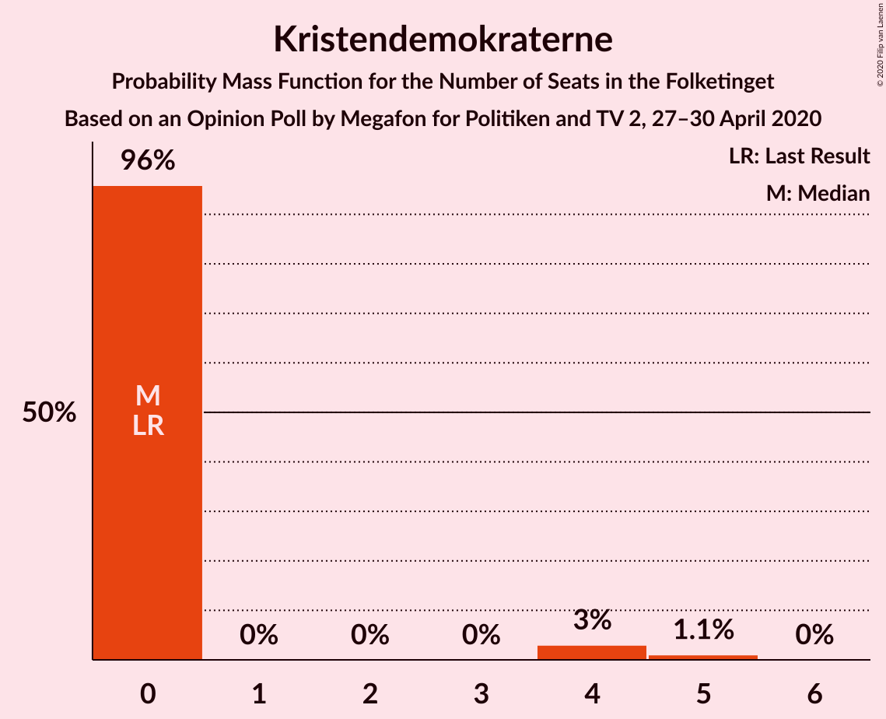
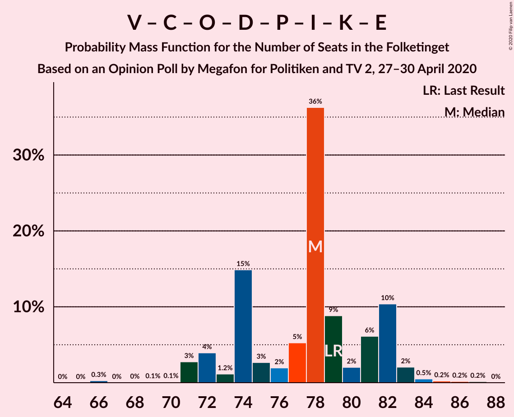
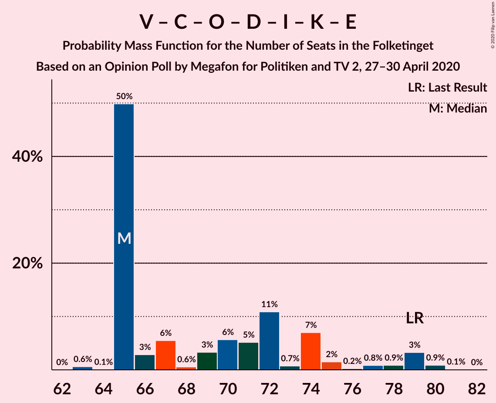
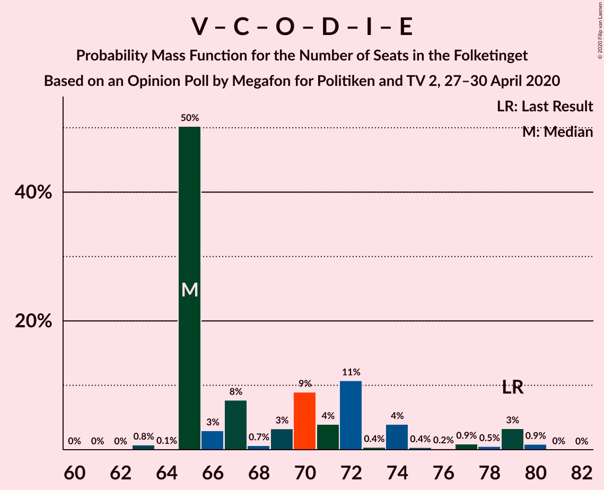
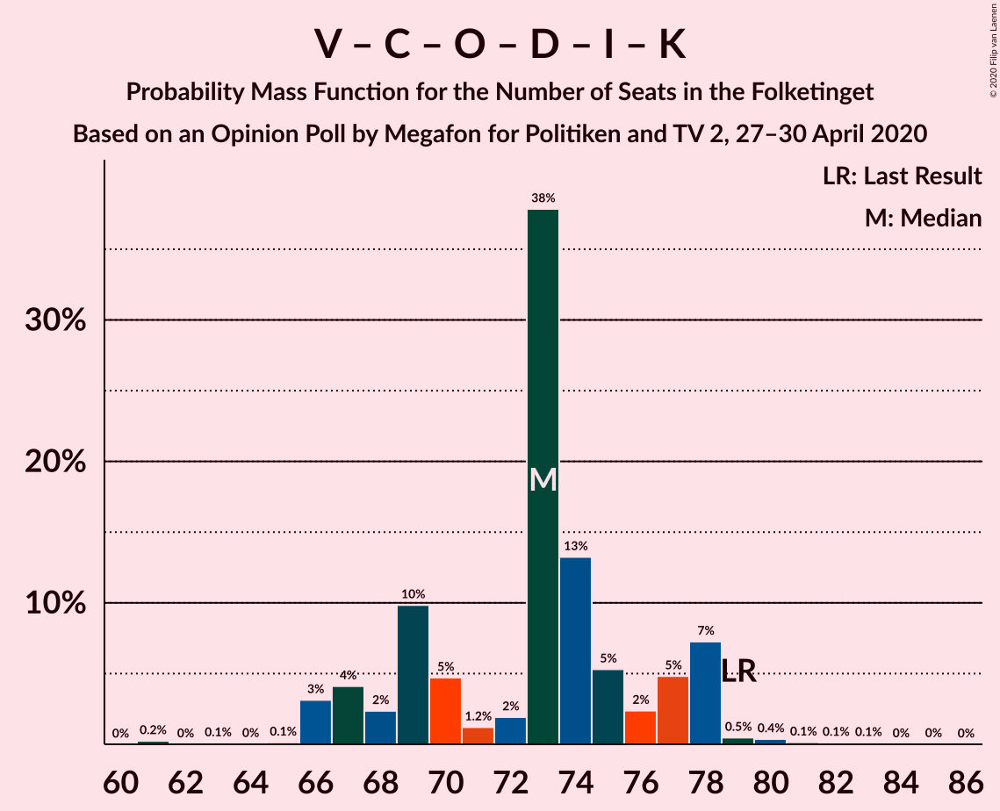
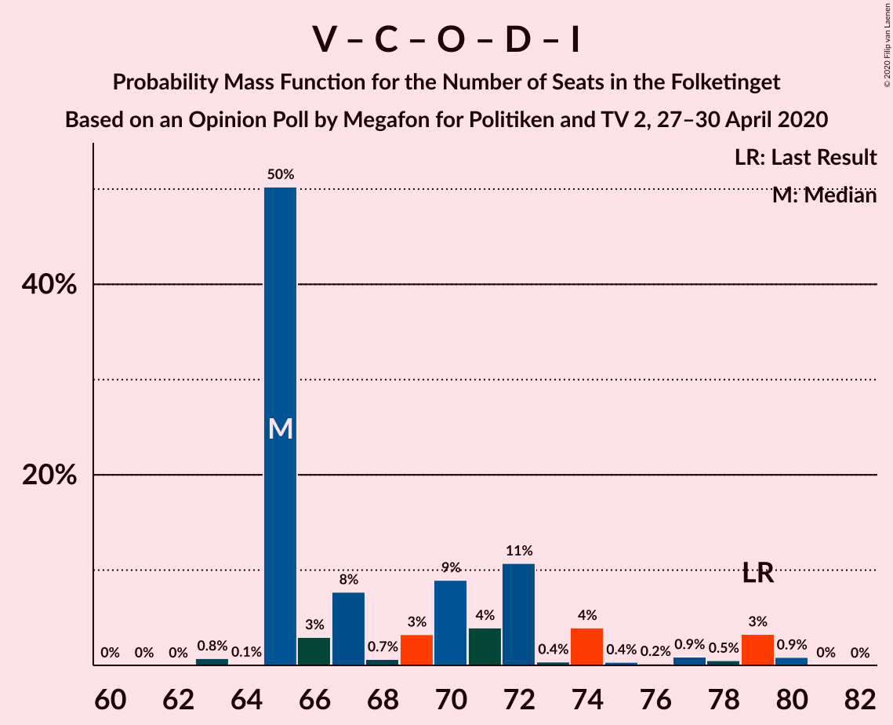
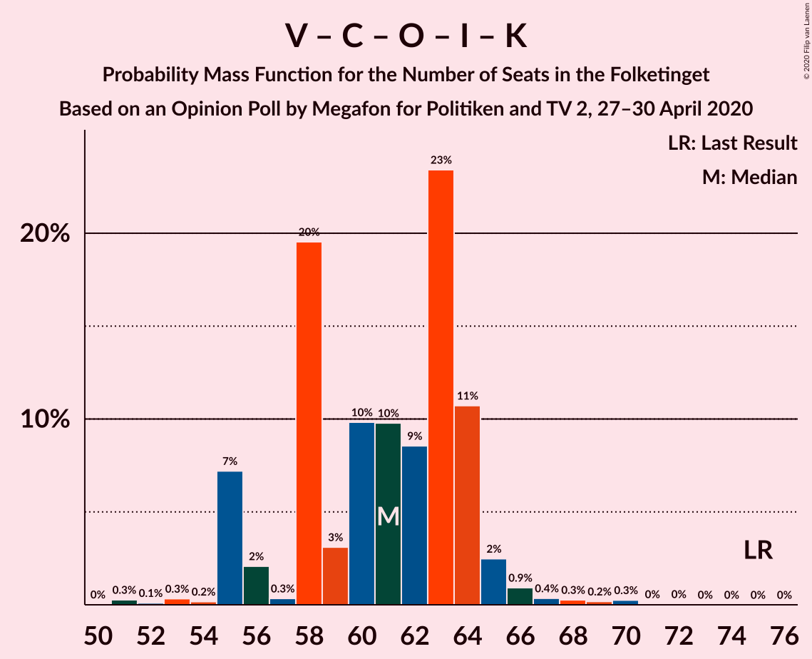
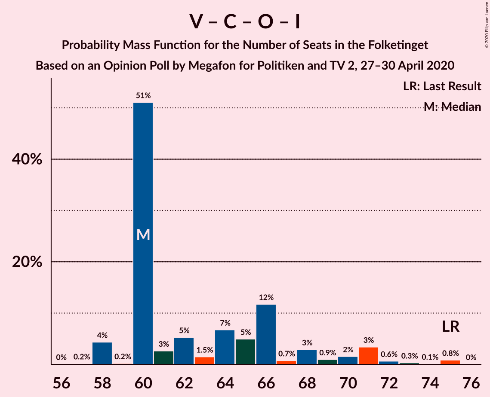

# Opinion Poll by Megafon for Politiken and TV 2, 27–30 April 2020

<a href="#voting-intentions">Voting Intentions</a> | <a href="#seats">Seats</a> | <a href="#coalitions">Coalitions</a> | <a href="#technical-information">Technical Information</a>

## Voting Intentions

### Confidence Intervals

| Party | Last Result | Poll Result | 80% Confidence Interval | 90% Confidence Interval | 95% Confidence Interval | 99% Confidence Interval |
|:-----:|:-----------:|:-----------:|:-----------------------:|:-----------------------:|:-----------------------:|:-----------------------:|
| Socialdemokraterne | 25.9% | 31.9% | 30.1–33.9% |29.6–34.4% |29.1–34.9% |28.2–35.8% |
| Venstre | 23.4% | 18.5% | 17.0–20.1% |16.5–20.6% |16.2–21.0% |15.5–21.8% |
| Enhedslisten–De Rød-Grønne | 6.9% | 7.4% | 6.4–8.6% |6.1–8.9% |5.9–9.2% |5.5–9.8% |
| Socialistisk Folkeparti | 7.7% | 7.3% | 6.3–8.4% |6.1–8.8% |5.8–9.1% |5.4–9.7% |
| Det Konservative Folkeparti | 6.6% | 6.8% | 5.9–7.9% |5.6–8.2% |5.4–8.5% |5.0–9.1% |
| Dansk Folkeparti | 8.7% | 6.7% | 5.8–7.8% |5.5–8.1% |5.3–8.4% |4.9–9.0% |
| Nye Borgerlige | 2.4% | 6.7% | 5.8–7.8% |5.5–8.1% |5.3–8.4% |4.9–9.0% |
| Radikale Venstre | 8.6% | 6.1% | 5.2–7.2% |5.0–7.5% |4.8–7.8% |4.4–8.3% |
| Stram Kurs | 1.8% | 2.8% | 2.2–3.6% |2.1–3.8% |1.9–4.0% |1.7–4.4% |
| Liberal Alliance | 2.3% | 1.9% | 1.4–2.6% |1.3–2.8% |1.2–3.0% |1.0–3.3% |
| Kristendemokraterne | 1.7% | 1.3% | 0.9–1.9% |0.8–2.1% |0.8–2.2% |0.6–2.5% |
| Klaus Riskær Pedersen | 0.8% | 0.6% | 0.4–1.1% |0.3–1.2% |0.3–1.3% |0.2–1.6% |
| Alternativet | 3.0% | 0.4% | 0.2–0.8% |0.2–0.9% |0.2–1.0% |0.1–1.3% |

*Note:* The poll result column reflects the actual value used in the calculations. Published results may vary slightly, and in addition be rounded to fewer digits.

## Seats

### Confidence Intervals

| Party | Last Result | Median | 80% Confidence Interval | 90% Confidence Interval | 95% Confidence Interval | 99% Confidence Interval |
|:-----:|:-----------:|:------:|:-----------------------:|:-----------------------:|:-----------------------:|:-----------------------:|
| <a href="#socialdemokraterne">Socialdemokraterne</a> | 48 | 58 | 54–62 |53–63 |51–63 |50–65 |
| <a href="#venstre">Venstre</a> | 43 | 34 | 30–37 |30–38 |29–39 |28–40 |
| <a href="#enhedslisten–de-rød-grønne">Enhedslisten–De Rød-Grønne</a> | 13 | 14 | 10–15 |9–16 |9–18 |9–18 |
| <a href="#socialistisk-folkeparti">Socialistisk Folkeparti</a> | 14 | 14 | 12–16 |11–17 |10–17 |9–17 |
| <a href="#det-konservative-folkeparti">Det Konservative Folkeparti</a> | 12 | 13 | 9–15 |9–15 |9–15 |9–16 |
| <a href="#dansk-folkeparti">Dansk Folkeparti</a> | 16 | 12 | 11–14 |9–15 |9–15 |8–16 |
| <a href="#nye-borgerlige">Nye Borgerlige</a> | 4 | 12 | 10–15 |10–15 |10–15 |9–16 |
| <a href="#radikale-venstre">Radikale Venstre</a> | 16 | 11 | 10–13 |9–14 |8–15 |8–15 |
| <a href="#stram-kurs">Stram Kurs</a> | 0 | 5 | 4–6 |0–7 |0–7 |0–8 |
| <a href="#liberal-alliance">Liberal Alliance</a> | 4 | 4 | 0–5 |0–5 |0–5 |0–6 |
| <a href="#kristendemokraterne">Kristendemokraterne</a> | 0 | 0 | 0 |0 |0–4 |0–5 |
| <a href="#klaus-riskær-pedersen">Klaus Riskær Pedersen</a> | 0 | 0 | 0 |0 |0 |0 |
| <a href="#alternativet">Alternativet</a> | 5 | 0 | 0 |0 |0 |0 |

### Socialdemokraterne

*For a full overview of the results for this party, see the [Socialdemokraterne](party-socialdemokraterne.html) page.*

| Number of Seats | Probability | Accumulated | Special Marks |
|:---------------:|:-----------:|:-----------:|:-------------:|
| 48 | 0% | 100% | Last Result |
| 49 | 0.1% | 100% |  |
| 50 | 0.5% | 99.8% |  |
| 51 | 2% | 99.3% |  |
| 52 | 0.7% | 97% |  |
| 53 | 2% | 97% |  |
| 54 | 10% | 94% |  |
| 55 | 23% | 84% |  |
| 56 | 5% | 61% |  |
| 57 | 3% | 56% |  |
| 58 | 9% | 53% | Median |
| 59 | 5% | 43% |  |
| 60 | 24% | 38% |  |
| 61 | 2% | 14% |  |
| 62 | 7% | 12% |  |
| 63 | 3% | 5% |  |
| 64 | 0.4% | 2% |  |
| 65 | 1.0% | 1.4% |  |
| 66 | 0.1% | 0.3% |  |
| 67 | 0.1% | 0.3% |  |
| 68 | 0.2% | 0.2% |  |
| 69 | 0% | 0% |  |

### Venstre

*For a full overview of the results for this party, see the [Venstre](party-venstre.html) page.*

| Number of Seats | Probability | Accumulated | Special Marks |
|:---------------:|:-----------:|:-----------:|:-------------:|
| 26 | 0.1% | 100% |  |
| 27 | 0.1% | 99.9% |  |
| 28 | 0.4% | 99.8% |  |
| 29 | 4% | 99.4% |  |
| 30 | 13% | 96% |  |
| 31 | 13% | 82% |  |
| 32 | 14% | 69% |  |
| 33 | 2% | 55% |  |
| 34 | 17% | 54% | Median |
| 35 | 4% | 37% |  |
| 36 | 22% | 32% |  |
| 37 | 2% | 11% |  |
| 38 | 6% | 8% |  |
| 39 | 0.4% | 3% |  |
| 40 | 2% | 2% |  |
| 41 | 0.1% | 0.1% |  |
| 42 | 0% | 0.1% |  |
| 43 | 0% | 0% | Last Result |

### Enhedslisten–De Rød-Grønne

*For a full overview of the results for this party, see the [Enhedslisten–De Rød-Grønne](party-enhedslisten–derød-grønne.html) page.*

| Number of Seats | Probability | Accumulated | Special Marks |
|:---------------:|:-----------:|:-----------:|:-------------:|
| 9 | 7% | 100% |  |
| 10 | 3% | 93% |  |
| 11 | 5% | 90% |  |
| 12 | 11% | 85% |  |
| 13 | 19% | 73% | Last Result |
| 14 | 31% | 54% | Median |
| 15 | 17% | 23% |  |
| 16 | 2% | 6% |  |
| 17 | 1.0% | 4% |  |
| 18 | 3% | 3% |  |
| 19 | 0.1% | 0.1% |  |
| 20 | 0% | 0% |  |

### Socialistisk Folkeparti

*For a full overview of the results for this party, see the [Socialistisk Folkeparti](party-socialistiskfolkeparti.html) page.*

| Number of Seats | Probability | Accumulated | Special Marks |
|:---------------:|:-----------:|:-----------:|:-------------:|
| 8 | 0.1% | 100% |  |
| 9 | 0.7% | 99.9% |  |
| 10 | 3% | 99.2% |  |
| 11 | 4% | 96% |  |
| 12 | 9% | 93% |  |
| 13 | 26% | 84% |  |
| 14 | 36% | 57% | Last Result, Median |
| 15 | 8% | 22% |  |
| 16 | 9% | 14% |  |
| 17 | 5% | 6% |  |
| 18 | 0.1% | 0.2% |  |
| 19 | 0% | 0.1% |  |
| 20 | 0.1% | 0.1% |  |
| 21 | 0% | 0% |  |

### Det Konservative Folkeparti

*For a full overview of the results for this party, see the [Det Konservative Folkeparti](party-detkonservativefolkeparti.html) page.*

| Number of Seats | Probability | Accumulated | Special Marks |
|:---------------:|:-----------:|:-----------:|:-------------:|
| 8 | 0.1% | 100% |  |
| 9 | 10% | 99.9% |  |
| 10 | 3% | 89% |  |
| 11 | 6% | 86% |  |
| 12 | 13% | 79% | Last Result |
| 13 | 45% | 66% | Median |
| 14 | 10% | 21% |  |
| 15 | 8% | 11% |  |
| 16 | 2% | 2% |  |
| 17 | 0.2% | 0.5% |  |
| 18 | 0.3% | 0.3% |  |
| 19 | 0% | 0% |  |

### Dansk Folkeparti

*For a full overview of the results for this party, see the [Dansk Folkeparti](party-danskfolkeparti.html) page.*

| Number of Seats | Probability | Accumulated | Special Marks |
|:---------------:|:-----------:|:-----------:|:-------------:|
| 8 | 2% | 100% |  |
| 9 | 3% | 98% |  |
| 10 | 4% | 95% |  |
| 11 | 30% | 91% |  |
| 12 | 20% | 62% | Median |
| 13 | 11% | 42% |  |
| 14 | 24% | 31% |  |
| 15 | 5% | 7% |  |
| 16 | 2% | 2% | Last Result |
| 17 | 0.3% | 0.4% |  |
| 18 | 0% | 0.1% |  |
| 19 | 0% | 0% |  |

### Nye Borgerlige

*For a full overview of the results for this party, see the [Nye Borgerlige](party-nyeborgerlige.html) page.*

| Number of Seats | Probability | Accumulated | Special Marks |
|:---------------:|:-----------:|:-----------:|:-------------:|
| 4 | 0% | 100% | Last Result |
| 5 | 0% | 100% |  |
| 6 | 0% | 100% |  |
| 7 | 0% | 100% |  |
| 8 | 0.2% | 100% |  |
| 9 | 1.1% | 99.8% |  |
| 10 | 25% | 98.7% |  |
| 11 | 17% | 73% |  |
| 12 | 17% | 57% | Median |
| 13 | 19% | 39% |  |
| 14 | 10% | 21% |  |
| 15 | 10% | 11% |  |
| 16 | 0.4% | 0.8% |  |
| 17 | 0.2% | 0.5% |  |
| 18 | 0.3% | 0.3% |  |
| 19 | 0% | 0% |  |

### Radikale Venstre

*For a full overview of the results for this party, see the [Radikale Venstre](party-radikalevenstre.html) page.*

| Number of Seats | Probability | Accumulated | Special Marks |
|:---------------:|:-----------:|:-----------:|:-------------:|
| 6 | 0.1% | 100% |  |
| 7 | 0.1% | 99.9% |  |
| 8 | 3% | 99.9% |  |
| 9 | 3% | 97% |  |
| 10 | 35% | 94% |  |
| 11 | 33% | 59% | Median |
| 12 | 12% | 25% |  |
| 13 | 7% | 13% |  |
| 14 | 3% | 6% |  |
| 15 | 3% | 4% |  |
| 16 | 0.1% | 0.2% | Last Result |
| 17 | 0.1% | 0.1% |  |
| 18 | 0% | 0% |  |

### Stram Kurs

*For a full overview of the results for this party, see the [Stram Kurs](party-stramkurs.html) page.*

| Number of Seats | Probability | Accumulated | Special Marks |
|:---------------:|:-----------:|:-----------:|:-------------:|
| 0 | 6% | 100% | Last Result |
| 1 | 0% | 94% |  |
| 2 | 0% | 94% |  |
| 3 | 0% | 94% |  |
| 4 | 17% | 94% |  |
| 5 | 51% | 76% | Median |
| 6 | 17% | 25% |  |
| 7 | 7% | 8% |  |
| 8 | 0.7% | 1.0% |  |
| 9 | 0.3% | 0.3% |  |
| 10 | 0% | 0% |  |

### Liberal Alliance

*For a full overview of the results for this party, see the [Liberal Alliance](party-liberalalliance.html) page.*

| Number of Seats | Probability | Accumulated | Special Marks |
|:---------------:|:-----------:|:-----------:|:-------------:|
| 0 | 48% | 100% |  |
| 1 | 0% | 52% |  |
| 2 | 0% | 52% |  |
| 3 | 0% | 52% |  |
| 4 | 39% | 52% | Last Result, Median |
| 5 | 12% | 13% |  |
| 6 | 0.8% | 1.0% |  |
| 7 | 0.2% | 0.2% |  |
| 8 | 0% | 0% |  |

### Kristendemokraterne

*For a full overview of the results for this party, see the [Kristendemokraterne](party-kristendemokraterne.html) page.*

| Number of Seats | Probability | Accumulated | Special Marks |
|:---------------:|:-----------:|:-----------:|:-------------:|
| 0 | 96% | 100% | Last Result, Median |
| 1 | 0% | 4% |  |
| 2 | 0% | 4% |  |
| 3 | 0% | 4% |  |
| 4 | 3% | 4% |  |
| 5 | 1.1% | 1.1% |  |
| 6 | 0% | 0% |  |

### Klaus Riskær Pedersen

*For a full overview of the results for this party, see the [Klaus Riskær Pedersen](party-klausriskærpedersen.html) page.*

| Number of Seats | Probability | Accumulated | Special Marks |
|:---------------:|:-----------:|:-----------:|:-------------:|
| 0 | 100% | 100% | Last Result, Median |

### Alternativet

*For a full overview of the results for this party, see the [Alternativet](party-alternativet.html) page.*

| Number of Seats | Probability | Accumulated | Special Marks |
|:---------------:|:-----------:|:-----------:|:-------------:|
| 0 | 100% | 100% | Median |
| 1 | 0% | 0% |  |
| 2 | 0% | 0% |  |
| 3 | 0% | 0% |  |
| 4 | 0% | 0% |  |
| 5 | 0% | 0% | Last Result |

## Coalitions

### Confidence Intervals

| Coalition | Last Result | Median | Majority? | 80% Confidence Interval | 90% Confidence Interval | 95% Confidence Interval | 99% Confidence Interval |
|:---------:|:-----------:|:------:|:---------:|:-----------------------:|:-----------------------:|:-----------------------:|:-----------------------:|
| Socialdemokraterne – Enhedslisten–De Rød-Grønne – Socialistisk Folkeparti – Radikale Venstre – Alternativet | 96 | 94 | 97% | 93–101 | 92–101 | 89–101 | 88–104 |
| Socialdemokraterne – Enhedslisten–De Rød-Grønne – Socialistisk Folkeparti – Radikale Venstre | 91 | 94 | 97% | 93–101 | 92–101 | 89–101 | 88–104 |
| Socialdemokraterne – Enhedslisten–De Rød-Grønne – Socialistisk Folkeparti – Alternativet | 80 | 83 | 12% | 82–90 | 80–91 | 79–91 | 77–93 |
| Socialdemokraterne – Enhedslisten–De Rød-Grønne – Socialistisk Folkeparti | 75 | 83 | 12% | 82–90 | 80–91 | 79–91 | 77–93 |
| Socialdemokraterne – Socialistisk Folkeparti – Radikale Venstre | 78 | 83 | 0.6% | 78–87 | 78–88 | 76–88 | 75–90 |
| Venstre – Det Konservative Folkeparti – Dansk Folkeparti – Nye Borgerlige – Stram Kurs – Liberal Alliance – Kristendemokraterne – Klaus Riskær Pedersen | 79 | 78 | 0% | 74–82 | 72–82 | 71–83 | 70–85 |
| Venstre – Det Konservative Folkeparti – Dansk Folkeparti – Nye Borgerlige – Liberal Alliance – Kristendemokraterne – Klaus Riskær Pedersen | 79 | 73 | 0% | 68–77 | 67–78 | 66–78 | 65–80 |
| Venstre – Det Konservative Folkeparti – Dansk Folkeparti – Nye Borgerlige – Liberal Alliance – Klaus Riskær Pedersen | 79 | 73 | 0% | 68–77 | 67–78 | 66–78 | 64–80 |
| Venstre – Det Konservative Folkeparti – Dansk Folkeparti – Nye Borgerlige – Liberal Alliance – Kristendemokraterne | 79 | 73 | 0% | 68–77 | 67–78 | 66–78 | 65–80 |
| Venstre – Det Konservative Folkeparti – Dansk Folkeparti – Nye Borgerlige – Liberal Alliance | 79 | 73 | 0% | 68–77 | 67–78 | 66–78 | 64–80 |
| Socialdemokraterne – Radikale Venstre | 64 | 69 | 0% | 64–73 | 64–74 | 64–74 | 60–76 |
| Venstre – Det Konservative Folkeparti – Dansk Folkeparti – Liberal Alliance – Kristendemokraterne | 75 | 61 | 0% | 56–64 | 55–64 | 55–65 | 53–69 |
| Venstre – Det Konservative Folkeparti – Dansk Folkeparti – Liberal Alliance | 75 | 61 | 0% | 56–64 | 55–64 | 55–65 | 52–67 |
| Venstre – Det Konservative Folkeparti – Liberal Alliance | 59 | 49 | 0% | 44–52 | 41–53 | 40–53 | 40–55 |
| Venstre – Det Konservative Folkeparti | 55 | 45 | 0% | 43–50 | 41–51 | 40–52 | 40–52 |
| Venstre | 43 | 34 | 0% | 30–37 | 30–38 | 29–39 | 28–40 |

### Socialdemokraterne – Enhedslisten–De Rød-Grønne – Socialistisk Folkeparti – Radikale Venstre – Alternativet

| Number of Seats | Probability | Accumulated | Special Marks |
|:---------------:|:-----------:|:-----------:|:-------------:|
| 86 | 0.1% | 100% |  |
| 87 | 0.1% | 99.9% |  |
| 88 | 1.4% | 99.8% |  |
| 89 | 1.2% | 98% |  |
| 90 | 0.5% | 97% | Majority |
| 91 | 0.7% | 97% |  |
| 92 | 1.5% | 96% |  |
| 93 | 36% | 95% |  |
| 94 | 9% | 58% |  |
| 95 | 2% | 49% |  |
| 96 | 10% | 47% | Last Result |
| 97 | 10% | 37% | Median |
| 98 | 5% | 27% |  |
| 99 | 5% | 22% |  |
| 100 | 1.0% | 17% |  |
| 101 | 15% | 16% |  |
| 102 | 0.8% | 2% |  |
| 103 | 0.3% | 0.9% |  |
| 104 | 0.4% | 0.6% |  |
| 105 | 0.1% | 0.2% |  |
| 106 | 0.1% | 0.1% |  |
| 107 | 0% | 0% |  |

### Socialdemokraterne – Enhedslisten–De Rød-Grønne – Socialistisk Folkeparti – Radikale Venstre

| Number of Seats | Probability | Accumulated | Special Marks |
|:---------------:|:-----------:|:-----------:|:-------------:|
| 86 | 0.1% | 100% |  |
| 87 | 0.1% | 99.9% |  |
| 88 | 1.4% | 99.8% |  |
| 89 | 1.2% | 98% |  |
| 90 | 0.5% | 97% | Majority |
| 91 | 0.7% | 97% | Last Result |
| 92 | 1.5% | 96% |  |
| 93 | 36% | 95% |  |
| 94 | 9% | 58% |  |
| 95 | 2% | 49% |  |
| 96 | 10% | 47% |  |
| 97 | 10% | 37% | Median |
| 98 | 5% | 27% |  |
| 99 | 5% | 22% |  |
| 100 | 1.0% | 17% |  |
| 101 | 15% | 16% |  |
| 102 | 0.8% | 2% |  |
| 103 | 0.3% | 0.9% |  |
| 104 | 0.4% | 0.6% |  |
| 105 | 0.1% | 0.2% |  |
| 106 | 0.1% | 0.1% |  |
| 107 | 0% | 0% |  |

### Socialdemokraterne – Enhedslisten–De Rød-Grønne – Socialistisk Folkeparti – Alternativet

| Number of Seats | Probability | Accumulated | Special Marks |
|:---------------:|:-----------:|:-----------:|:-------------:|
| 74 | 0.1% | 100% |  |
| 75 | 0% | 99.9% |  |
| 76 | 0.1% | 99.9% |  |
| 77 | 1.4% | 99.8% |  |
| 78 | 0.8% | 98% |  |
| 79 | 1.1% | 98% |  |
| 80 | 3% | 97% | Last Result |
| 81 | 3% | 94% |  |
| 82 | 24% | 90% |  |
| 83 | 18% | 66% |  |
| 84 | 5% | 48% |  |
| 85 | 0.9% | 43% |  |
| 86 | 19% | 42% | Median |
| 87 | 1.0% | 23% |  |
| 88 | 5% | 22% |  |
| 89 | 6% | 17% |  |
| 90 | 2% | 12% | Majority |
| 91 | 8% | 10% |  |
| 92 | 0.2% | 1.1% |  |
| 93 | 0.8% | 0.9% |  |
| 94 | 0.1% | 0.1% |  |
| 95 | 0% | 0.1% |  |
| 96 | 0% | 0% |  |

### Socialdemokraterne – Enhedslisten–De Rød-Grønne – Socialistisk Folkeparti

| Number of Seats | Probability | Accumulated | Special Marks |
|:---------------:|:-----------:|:-----------:|:-------------:|
| 74 | 0.1% | 100% |  |
| 75 | 0% | 99.9% | Last Result |
| 76 | 0.1% | 99.9% |  |
| 77 | 1.4% | 99.8% |  |
| 78 | 0.8% | 98% |  |
| 79 | 1.1% | 98% |  |
| 80 | 3% | 97% |  |
| 81 | 3% | 94% |  |
| 82 | 24% | 90% |  |
| 83 | 18% | 66% |  |
| 84 | 5% | 48% |  |
| 85 | 0.9% | 43% |  |
| 86 | 19% | 42% | Median |
| 87 | 1.0% | 23% |  |
| 88 | 5% | 22% |  |
| 89 | 6% | 17% |  |
| 90 | 2% | 12% | Majority |
| 91 | 8% | 10% |  |
| 92 | 0.2% | 1.1% |  |
| 93 | 0.8% | 0.9% |  |
| 94 | 0.1% | 0.1% |  |
| 95 | 0% | 0.1% |  |
| 96 | 0% | 0% |  |

### Socialdemokraterne – Socialistisk Folkeparti – Radikale Venstre

| Number of Seats | Probability | Accumulated | Special Marks |
|:---------------:|:-----------:|:-----------:|:-------------:|
| 72 | 0.1% | 100% |  |
| 73 | 0.1% | 99.9% |  |
| 74 | 0.2% | 99.8% |  |
| 75 | 1.4% | 99.7% |  |
| 76 | 1.2% | 98% |  |
| 77 | 0.7% | 97% |  |
| 78 | 8% | 96% | Last Result |
| 79 | 23% | 89% |  |
| 80 | 4% | 66% |  |
| 81 | 6% | 62% |  |
| 82 | 3% | 56% |  |
| 83 | 10% | 53% | Median |
| 84 | 18% | 43% |  |
| 85 | 2% | 24% |  |
| 86 | 10% | 22% |  |
| 87 | 4% | 12% |  |
| 88 | 7% | 8% |  |
| 89 | 0.5% | 1.0% |  |
| 90 | 0.1% | 0.6% | Majority |
| 91 | 0.2% | 0.5% |  |
| 92 | 0.2% | 0.3% |  |
| 93 | 0.1% | 0.1% |  |
| 94 | 0% | 0% |  |

### Venstre – Det Konservative Folkeparti – Dansk Folkeparti – Nye Borgerlige – Stram Kurs – Liberal Alliance – Kristendemokraterne – Klaus Riskær Pedersen

| Number of Seats | Probability | Accumulated | Special Marks |
|:---------------:|:-----------:|:-----------:|:-------------:|
| 66 | 0.3% | 100% |  |
| 67 | 0% | 99.7% |  |
| 68 | 0% | 99.7% |  |
| 69 | 0.1% | 99.7% |  |
| 70 | 0.1% | 99.6% |  |
| 71 | 3% | 99.4% |  |
| 72 | 4% | 97% |  |
| 73 | 1.2% | 93% |  |
| 74 | 15% | 92% |  |
| 75 | 3% | 77% |  |
| 76 | 2% | 74% |  |
| 77 | 5% | 72% |  |
| 78 | 36% | 67% |  |
| 79 | 9% | 31% | Last Result |
| 80 | 2% | 22% | Median |
| 81 | 6% | 20% |  |
| 82 | 10% | 14% |  |
| 83 | 2% | 3% |  |
| 84 | 0.5% | 1.1% |  |
| 85 | 0.2% | 0.6% |  |
| 86 | 0.2% | 0.4% |  |
| 87 | 0.2% | 0.2% |  |
| 88 | 0% | 0% |  |

### Venstre – Det Konservative Folkeparti – Dansk Folkeparti – Nye Borgerlige – Liberal Alliance – Kristendemokraterne – Klaus Riskær Pedersen

| Number of Seats | Probability | Accumulated | Special Marks |
|:---------------:|:-----------:|:-----------:|:-------------:|
| 61 | 0.2% | 100% |  |
| 62 | 0% | 99.8% |  |
| 63 | 0.1% | 99.7% |  |
| 64 | 0% | 99.7% |  |
| 65 | 0.1% | 99.6% |  |
| 66 | 3% | 99.5% |  |
| 67 | 4% | 96% |  |
| 68 | 2% | 92% |  |
| 69 | 10% | 90% |  |
| 70 | 5% | 80% |  |
| 71 | 1.2% | 75% |  |
| 72 | 2% | 74% |  |
| 73 | 38% | 72% |  |
| 74 | 13% | 34% |  |
| 75 | 5% | 21% | Median |
| 76 | 2% | 16% |  |
| 77 | 5% | 13% |  |
| 78 | 7% | 9% |  |
| 79 | 0.5% | 1.3% | Last Result |
| 80 | 0.4% | 0.8% |  |
| 81 | 0.1% | 0.4% |  |
| 82 | 0.1% | 0.3% |  |
| 83 | 0.1% | 0.2% |  |
| 84 | 0% | 0.1% |  |
| 85 | 0% | 0% |  |

### Venstre – Det Konservative Folkeparti – Dansk Folkeparti – Nye Borgerlige – Liberal Alliance – Klaus Riskær Pedersen

| Number of Seats | Probability | Accumulated | Special Marks |
|:---------------:|:-----------:|:-----------:|:-------------:|
| 61 | 0.2% | 100% |  |
| 62 | 0% | 99.8% |  |
| 63 | 0.1% | 99.7% |  |
| 64 | 0.3% | 99.6% |  |
| 65 | 0.1% | 99.3% |  |
| 66 | 3% | 99.2% |  |
| 67 | 4% | 96% |  |
| 68 | 2% | 92% |  |
| 69 | 10% | 89% |  |
| 70 | 6% | 80% |  |
| 71 | 1.4% | 73% |  |
| 72 | 3% | 72% |  |
| 73 | 38% | 69% |  |
| 74 | 12% | 31% |  |
| 75 | 5% | 19% | Median |
| 76 | 2% | 15% |  |
| 77 | 4% | 12% |  |
| 78 | 7% | 8% |  |
| 79 | 0.5% | 1.0% | Last Result |
| 80 | 0.2% | 0.5% |  |
| 81 | 0.1% | 0.3% |  |
| 82 | 0.1% | 0.2% |  |
| 83 | 0% | 0% |  |

### Venstre – Det Konservative Folkeparti – Dansk Folkeparti – Nye Borgerlige – Liberal Alliance – Kristendemokraterne

| Number of Seats | Probability | Accumulated | Special Marks |
|:---------------:|:-----------:|:-----------:|:-------------:|
| 61 | 0.2% | 100% |  |
| 62 | 0% | 99.8% |  |
| 63 | 0.1% | 99.7% |  |
| 64 | 0% | 99.7% |  |
| 65 | 0.1% | 99.6% |  |
| 66 | 3% | 99.5% |  |
| 67 | 4% | 96% |  |
| 68 | 2% | 92% |  |
| 69 | 10% | 90% |  |
| 70 | 5% | 80% |  |
| 71 | 1.2% | 75% |  |
| 72 | 2% | 74% |  |
| 73 | 38% | 72% |  |
| 74 | 13% | 34% |  |
| 75 | 5% | 21% | Median |
| 76 | 2% | 16% |  |
| 77 | 5% | 13% |  |
| 78 | 7% | 9% |  |
| 79 | 0.5% | 1.3% | Last Result |
| 80 | 0.4% | 0.8% |  |
| 81 | 0.1% | 0.4% |  |
| 82 | 0.1% | 0.3% |  |
| 83 | 0.1% | 0.2% |  |
| 84 | 0% | 0.1% |  |
| 85 | 0% | 0% |  |

### Venstre – Det Konservative Folkeparti – Dansk Folkeparti – Nye Borgerlige – Liberal Alliance

| Number of Seats | Probability | Accumulated | Special Marks |
|:---------------:|:-----------:|:-----------:|:-------------:|
| 61 | 0.2% | 100% |  |
| 62 | 0% | 99.8% |  |
| 63 | 0.1% | 99.7% |  |
| 64 | 0.3% | 99.6% |  |
| 65 | 0.1% | 99.3% |  |
| 66 | 3% | 99.2% |  |
| 67 | 4% | 96% |  |
| 68 | 2% | 92% |  |
| 69 | 10% | 89% |  |
| 70 | 6% | 80% |  |
| 71 | 1.5% | 73% |  |
| 72 | 3% | 72% |  |
| 73 | 38% | 69% |  |
| 74 | 12% | 31% |  |
| 75 | 5% | 19% | Median |
| 76 | 2% | 15% |  |
| 77 | 4% | 12% |  |
| 78 | 7% | 8% |  |
| 79 | 0.5% | 1.0% | Last Result |
| 80 | 0.2% | 0.5% |  |
| 81 | 0.1% | 0.3% |  |
| 82 | 0.1% | 0.2% |  |
| 83 | 0% | 0% |  |

### Socialdemokraterne – Radikale Venstre

| Number of Seats | Probability | Accumulated | Special Marks |
|:---------------:|:-----------:|:-----------:|:-------------:|
| 60 | 0.6% | 100% |  |
| 61 | 0.3% | 99.4% |  |
| 62 | 0.3% | 99.1% |  |
| 63 | 0.5% | 98.8% |  |
| 64 | 11% | 98% | Last Result |
| 65 | 7% | 87% |  |
| 66 | 20% | 81% |  |
| 67 | 3% | 61% |  |
| 68 | 1.4% | 58% |  |
| 69 | 12% | 57% | Median |
| 70 | 18% | 45% |  |
| 71 | 2% | 27% |  |
| 72 | 14% | 25% |  |
| 73 | 4% | 10% |  |
| 74 | 5% | 7% |  |
| 75 | 0.9% | 2% |  |
| 76 | 0.2% | 0.7% |  |
| 77 | 0.1% | 0.5% |  |
| 78 | 0.3% | 0.4% |  |
| 79 | 0% | 0% |  |

### Venstre – Det Konservative Folkeparti – Dansk Folkeparti – Liberal Alliance – Kristendemokraterne

| Number of Seats | Probability | Accumulated | Special Marks |
|:---------------:|:-----------:|:-----------:|:-------------:|
| 51 | 0.3% | 100% |  |
| 52 | 0.1% | 99.7% |  |
| 53 | 0.3% | 99.6% |  |
| 54 | 0.2% | 99.3% |  |
| 55 | 7% | 99.1% |  |
| 56 | 2% | 92% |  |
| 57 | 0.3% | 90% |  |
| 58 | 20% | 89% |  |
| 59 | 3% | 70% |  |
| 60 | 10% | 67% |  |
| 61 | 10% | 57% |  |
| 62 | 9% | 47% |  |
| 63 | 23% | 39% | Median |
| 64 | 11% | 15% |  |
| 65 | 2% | 5% |  |
| 66 | 0.9% | 2% |  |
| 67 | 0.4% | 1.1% |  |
| 68 | 0.3% | 0.8% |  |
| 69 | 0.2% | 0.5% |  |
| 70 | 0.3% | 0.3% |  |
| 71 | 0% | 0.1% |  |
| 72 | 0% | 0% |  |
| 73 | 0% | 0% |  |
| 74 | 0% | 0% |  |
| 75 | 0% | 0% | Last Result |

### Venstre – Det Konservative Folkeparti – Dansk Folkeparti – Liberal Alliance

| Number of Seats | Probability | Accumulated | Special Marks |
|:---------------:|:-----------:|:-----------:|:-------------:|
| 51 | 0.3% | 100% |  |
| 52 | 0.2% | 99.7% |  |
| 53 | 0.3% | 99.4% |  |
| 54 | 0.5% | 99.1% |  |
| 55 | 7% | 98.6% |  |
| 56 | 2% | 91% |  |
| 57 | 0.4% | 89% |  |
| 58 | 20% | 89% |  |
| 59 | 3% | 69% |  |
| 60 | 12% | 66% |  |
| 61 | 10% | 55% |  |
| 62 | 9% | 45% |  |
| 63 | 23% | 36% | Median |
| 64 | 9% | 13% |  |
| 65 | 2% | 3% |  |
| 66 | 0.6% | 1.4% |  |
| 67 | 0.3% | 0.8% |  |
| 68 | 0.1% | 0.4% |  |
| 69 | 0.2% | 0.3% |  |
| 70 | 0.1% | 0.2% |  |
| 71 | 0% | 0.1% |  |
| 72 | 0% | 0% |  |
| 73 | 0% | 0% |  |
| 74 | 0% | 0% |  |
| 75 | 0% | 0% | Last Result |

### Venstre – Det Konservative Folkeparti – Liberal Alliance

| Number of Seats | Probability | Accumulated | Special Marks |
|:---------------:|:-----------:|:-----------:|:-------------:|
| 39 | 0.1% | 100% |  |
| 40 | 4% | 99.9% |  |
| 41 | 1.3% | 96% |  |
| 42 | 0.2% | 95% |  |
| 43 | 4% | 94% |  |
| 44 | 0.9% | 90% |  |
| 45 | 1.1% | 90% |  |
| 46 | 4% | 88% |  |
| 47 | 18% | 84% |  |
| 48 | 15% | 67% |  |
| 49 | 27% | 52% |  |
| 50 | 3% | 25% |  |
| 51 | 9% | 22% | Median |
| 52 | 5% | 13% |  |
| 53 | 7% | 9% |  |
| 54 | 0.7% | 1.4% |  |
| 55 | 0.4% | 0.8% |  |
| 56 | 0.2% | 0.4% |  |
| 57 | 0.1% | 0.2% |  |
| 58 | 0.1% | 0.1% |  |
| 59 | 0% | 0% | Last Result |

### Venstre – Det Konservative Folkeparti

| Number of Seats | Probability | Accumulated | Special Marks |
|:---------------:|:-----------:|:-----------:|:-------------:|
| 38 | 0% | 100% |  |
| 39 | 0.1% | 99.9% |  |
| 40 | 4% | 99.8% |  |
| 41 | 2% | 96% |  |
| 42 | 4% | 94% |  |
| 43 | 21% | 90% |  |
| 44 | 12% | 69% |  |
| 45 | 7% | 57% |  |
| 46 | 3% | 50% |  |
| 47 | 4% | 47% | Median |
| 48 | 10% | 43% |  |
| 49 | 21% | 33% |  |
| 50 | 3% | 13% |  |
| 51 | 5% | 9% |  |
| 52 | 3% | 4% |  |
| 53 | 0.2% | 0.3% |  |
| 54 | 0.1% | 0.1% |  |
| 55 | 0% | 0.1% | Last Result |
| 56 | 0.1% | 0.1% |  |
| 57 | 0% | 0% |  |

### Venstre

| Number of Seats | Probability | Accumulated | Special Marks |
|:---------------:|:-----------:|:-----------:|:-------------:|
| 26 | 0.1% | 100% |  |
| 27 | 0.1% | 99.9% |  |
| 28 | 0.4% | 99.8% |  |
| 29 | 4% | 99.4% |  |
| 30 | 13% | 96% |  |
| 31 | 13% | 82% |  |
| 32 | 14% | 69% |  |
| 33 | 2% | 55% |  |
| 34 | 17% | 54% | Median |
| 35 | 4% | 37% |  |
| 36 | 22% | 32% |  |
| 37 | 2% | 11% |  |
| 38 | 6% | 8% |  |
| 39 | 0.4% | 3% |  |
| 40 | 2% | 2% |  |
| 41 | 0.1% | 0.1% |  |
| 42 | 0% | 0.1% |  |
| 43 | 0% | 0% | Last Result |

## Technical Information

### Opinion Poll

+ **Polling firm:** Megafon
+ **Commissioner(s):** Politiken and TV 2
+ **Fieldwork period:** 27–30 April 2020

### Calculations

+ **Sample size:** 1002
+ **Simulations done:** 1,048,576
+ **Error estimate:** 2.24%

