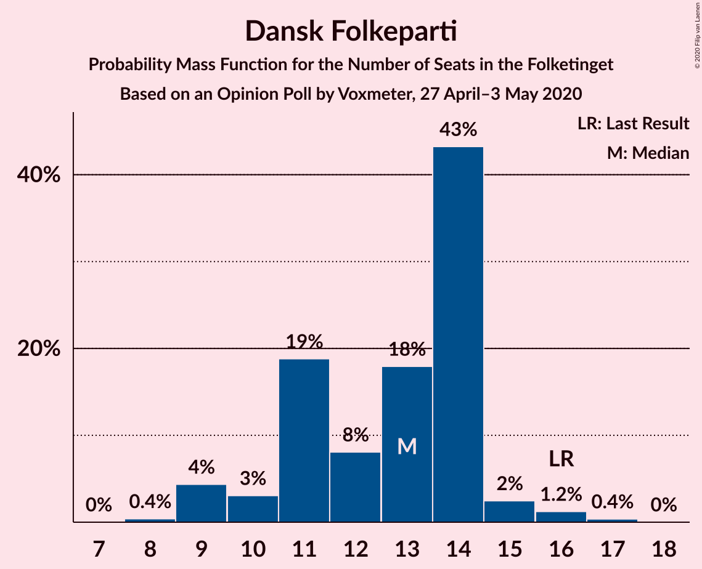
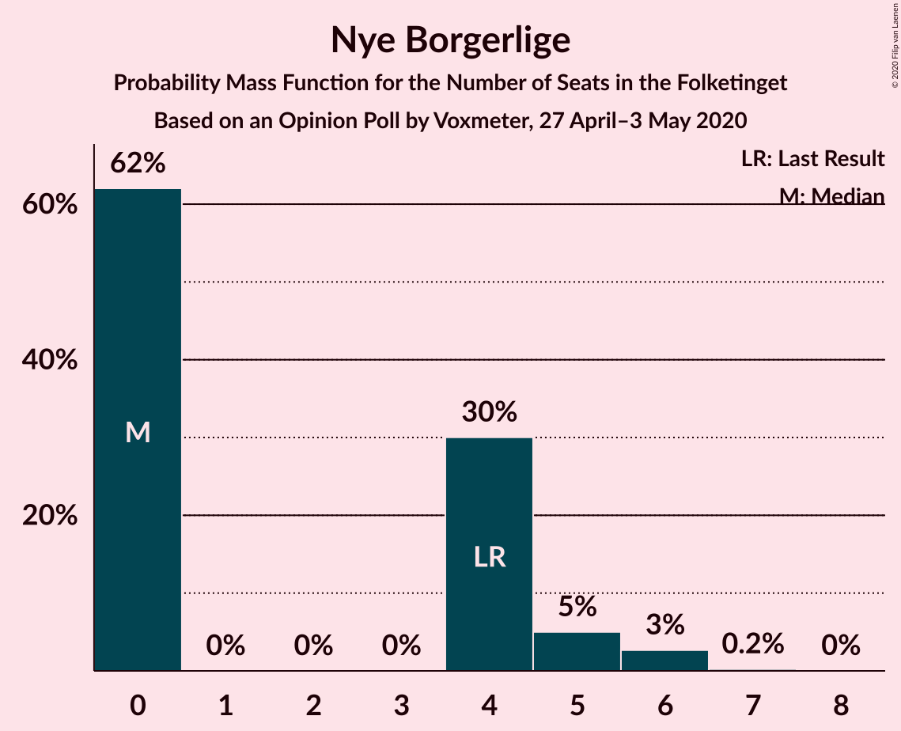
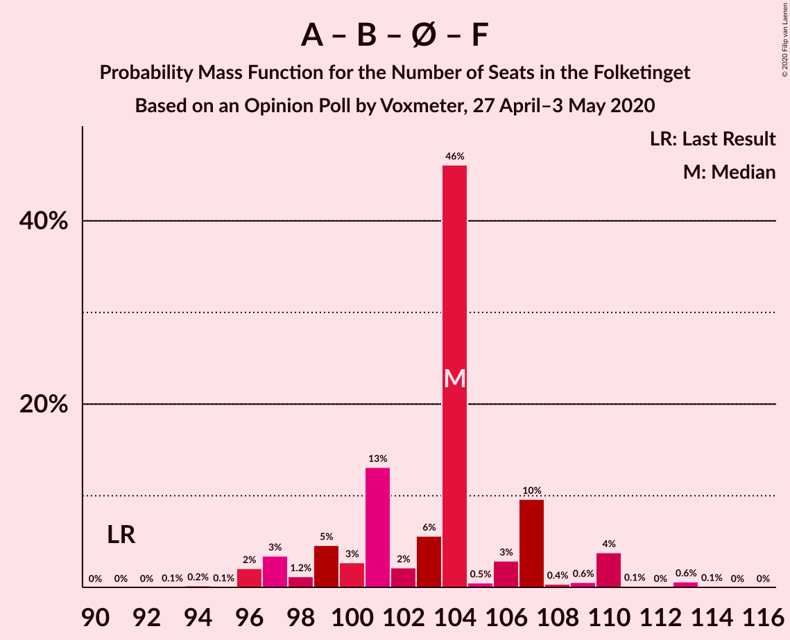
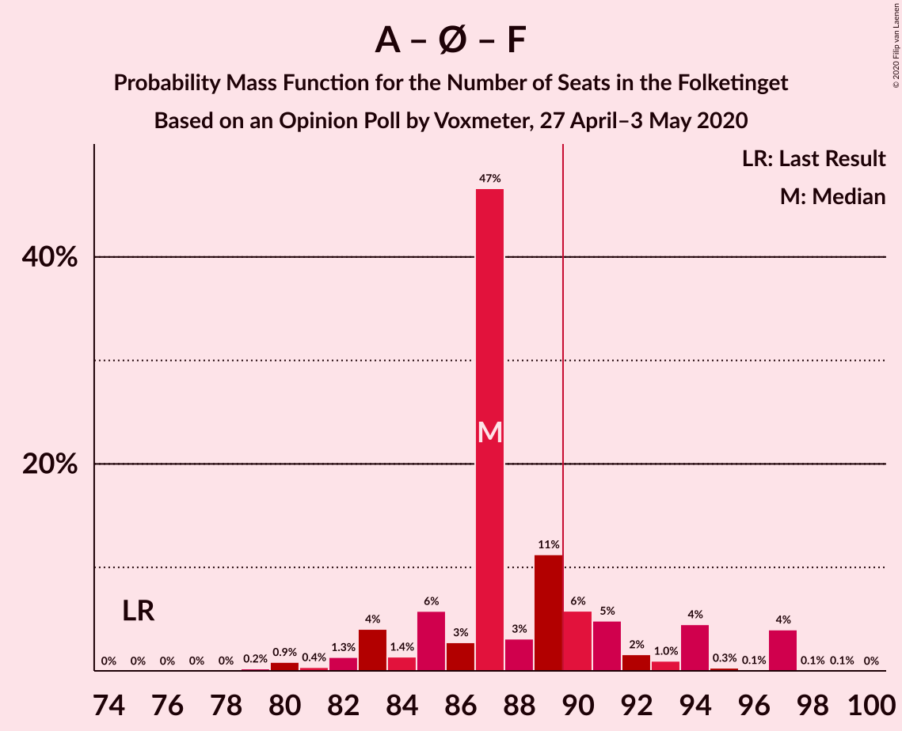
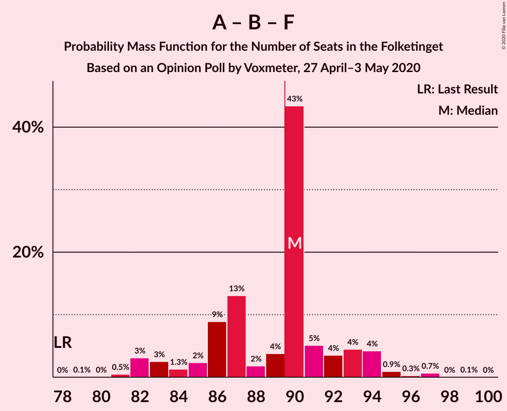

# Opinion Poll by Voxmeter, 27 April–3 May 2020

<a href="#voting-intentions">Voting Intentions</a> | <a href="#seats">Seats</a> | <a href="#coalitions">Coalitions</a> | <a href="#technical-information">Technical Information</a>

## Voting Intentions

### Confidence Intervals

| Party | Last Result | Poll Result | 80% Confidence Interval | 90% Confidence Interval | 95% Confidence Interval | 99% Confidence Interval |
|:-----:|:-----------:|:-----------:|:-----------------------:|:-----------------------:|:-----------------------:|:-----------------------:|
| Socialdemokraterne | 25.9% | 33.3% | 31.4–35.2% |30.9–35.7% |30.4–36.2% |29.6–37.2% |
| Venstre | 23.4% | 21.1% | 19.5–22.8% |19.1–23.3% |18.7–23.7% |18.0–24.5% |
| Radikale Venstre | 8.6% | 8.1% | 7.1–9.3% |6.8–9.6% |6.6–9.9% |6.1–10.5% |
| Enhedslisten–De Rød-Grønne | 6.9% | 7.9% | 6.9–9.1% |6.6–9.4% |6.4–9.7% |6.0–10.3% |
| Socialistisk Folkeparti | 7.7% | 7.4% | 6.5–8.6% |6.2–8.9% |6.0–9.2% |5.5–9.8% |
| Det Konservative Folkeparti | 6.6% | 6.9% | 6.0–8.1% |5.7–8.4% |5.5–8.7% |5.1–9.2% |
| Dansk Folkeparti | 8.7% | 6.7% | 5.8–7.8% |5.6–8.2% |5.3–8.4% |4.9–9.0% |
| Liberal Alliance | 2.3% | 2.4% | 1.9–3.2% |1.8–3.4% |1.7–3.6% |1.4–4.0% |
| Nye Borgerlige | 2.4% | 2.1% | 1.7–2.9% |1.5–3.0% |1.4–3.2% |1.2–3.6% |
| Stram Kurs | 1.8% | 1.9% | 1.4–2.5% |1.3–2.7% |1.2–2.9% |1.0–3.2% |
| Klaus Riskær Pedersen | 0.8% | 1.0% | 0.7–1.5% |0.6–1.7% |0.5–1.8% |0.4–2.1% |
| Alternativet | 3.0% | 0.7% | 0.4–1.2% |0.4–1.3% |0.3–1.4% |0.2–1.7% |

*Note:* The poll result column reflects the actual value used in the calculations. Published results may vary slightly, and in addition be rounded to fewer digits.

## Seats

### Confidence Intervals

| Party | Last Result | Median | 80% Confidence Interval | 90% Confidence Interval | 95% Confidence Interval | 99% Confidence Interval |
|:-----:|:-----------:|:------:|:-----------------------:|:-----------------------:|:-----------------------:|:-----------------------:|
| <a href="#socialdemokraterne">Socialdemokraterne</a> | 48 | 60 | 57–63 |57–65 |56–65 |53–67 |
| <a href="#venstre">Venstre</a> | 43 | 38 | 37–41 |35–42 |34–43 |31–44 |
| <a href="#radikale-venstre">Radikale Venstre</a> | 16 | 16 | 12–17 |12–17 |12–17 |10–18 |
| <a href="#enhedslisten–de-rød-grønne">Enhedslisten–De Rød-Grønne</a> | 13 | 14 | 13–16 |12–17 |12–17 |11–18 |
| <a href="#socialistisk-folkeparti">Socialistisk Folkeparti</a> | 14 | 13 | 12–15 |11–16 |11–16 |10–17 |
| <a href="#det-konservative-folkeparti">Det Konservative Folkeparti</a> | 12 | 12 | 11–15 |10–15 |10–16 |8–16 |
| <a href="#dansk-folkeparti">Dansk Folkeparti</a> | 16 | 13 | 11–14 |10–14 |9–15 |9–16 |
| <a href="#liberal-alliance">Liberal Alliance</a> | 4 | 5 | 0–7 |0–7 |0–7 |0–7 |
| <a href="#nye-borgerlige">Nye Borgerlige</a> | 4 | 0 | 0–4 |0–5 |0–6 |0–6 |
| <a href="#stram-kurs">Stram Kurs</a> | 0 | 0 | 0–4 |0–4 |0–5 |0–6 |
| <a href="#klaus-riskær-pedersen">Klaus Riskær Pedersen</a> | 0 | 0 | 0 |0 |0 |0–4 |
| <a href="#alternativet">Alternativet</a> | 5 | 0 | 0 |0 |0 |0 |

### Socialdemokraterne

*For a full overview of the results for this party, see the [Socialdemokraterne](party-socialdemokraterne.html) page.*

| Number of Seats | Probability | Accumulated | Special Marks |
|:---------------:|:-----------:|:-----------:|:-------------:|
| 48 | 0% | 100% | Last Result |
| 49 | 0% | 100% |  |
| 50 | 0% | 100% |  |
| 51 | 0% | 100% |  |
| 52 | 0.1% | 100% |  |
| 53 | 1.0% | 99.9% |  |
| 54 | 0.4% | 98.9% |  |
| 55 | 0.9% | 98.5% |  |
| 56 | 2% | 98% |  |
| 57 | 13% | 95% |  |
| 58 | 4% | 83% |  |
| 59 | 1.3% | 79% |  |
| 60 | 41% | 77% | Median |
| 61 | 14% | 36% |  |
| 62 | 2% | 22% |  |
| 63 | 10% | 20% |  |
| 64 | 4% | 10% |  |
| 65 | 4% | 6% |  |
| 66 | 0.4% | 1.2% |  |
| 67 | 0.4% | 0.8% |  |
| 68 | 0.3% | 0.4% |  |
| 69 | 0.1% | 0.1% |  |
| 70 | 0% | 0.1% |  |
| 71 | 0% | 0% |  |

### Venstre

*For a full overview of the results for this party, see the [Venstre](party-venstre.html) page.*

| Number of Seats | Probability | Accumulated | Special Marks |
|:---------------:|:-----------:|:-----------:|:-------------:|
| 31 | 1.2% | 100% |  |
| 32 | 0.3% | 98.8% |  |
| 33 | 0.6% | 98.5% |  |
| 34 | 2% | 98% |  |
| 35 | 2% | 96% |  |
| 36 | 4% | 94% |  |
| 37 | 8% | 90% |  |
| 38 | 45% | 82% | Median |
| 39 | 3% | 37% |  |
| 40 | 8% | 34% |  |
| 41 | 20% | 26% |  |
| 42 | 3% | 6% |  |
| 43 | 2% | 4% | Last Result |
| 44 | 2% | 2% |  |
| 45 | 0.4% | 0.5% |  |
| 46 | 0.1% | 0.1% |  |
| 47 | 0% | 0% |  |

### Radikale Venstre

*For a full overview of the results for this party, see the [Radikale Venstre](party-radikalevenstre.html) page.*

| Number of Seats | Probability | Accumulated | Special Marks |
|:---------------:|:-----------:|:-----------:|:-------------:|
| 10 | 0.8% | 100% |  |
| 11 | 0.3% | 99.2% |  |
| 12 | 12% | 98.9% |  |
| 13 | 13% | 87% |  |
| 14 | 7% | 73% |  |
| 15 | 6% | 67% |  |
| 16 | 14% | 61% | Last Result, Median |
| 17 | 46% | 47% |  |
| 18 | 0.9% | 1.3% |  |
| 19 | 0.3% | 0.3% |  |
| 20 | 0.1% | 0.1% |  |
| 21 | 0% | 0% |  |

### Enhedslisten–De Rød-Grønne

*For a full overview of the results for this party, see the [Enhedslisten–De Rød-Grønne](party-enhedslisten–derød-grønne.html) page.*

| Number of Seats | Probability | Accumulated | Special Marks |
|:---------------:|:-----------:|:-----------:|:-------------:|
| 10 | 0.3% | 100% |  |
| 11 | 0.9% | 99.7% |  |
| 12 | 6% | 98.8% |  |
| 13 | 11% | 93% | Last Result |
| 14 | 50% | 82% | Median |
| 15 | 16% | 32% |  |
| 16 | 10% | 17% |  |
| 17 | 5% | 6% |  |
| 18 | 0.7% | 1.0% |  |
| 19 | 0.3% | 0.3% |  |
| 20 | 0.1% | 0.1% |  |
| 21 | 0% | 0% |  |

### Socialistisk Folkeparti

*For a full overview of the results for this party, see the [Socialistisk Folkeparti](party-socialistiskfolkeparti.html) page.*

| Number of Seats | Probability | Accumulated | Special Marks |
|:---------------:|:-----------:|:-----------:|:-------------:|
| 9 | 0.1% | 100% |  |
| 10 | 0.9% | 99.9% |  |
| 11 | 4% | 99.0% |  |
| 12 | 6% | 95% |  |
| 13 | 57% | 89% | Median |
| 14 | 13% | 32% | Last Result |
| 15 | 11% | 19% |  |
| 16 | 6% | 8% |  |
| 17 | 2% | 2% |  |
| 18 | 0.2% | 0.3% |  |
| 19 | 0% | 0.1% |  |
| 20 | 0% | 0% |  |

### Det Konservative Folkeparti

*For a full overview of the results for this party, see the [Det Konservative Folkeparti](party-detkonservativefolkeparti.html) page.*

| Number of Seats | Probability | Accumulated | Special Marks |
|:---------------:|:-----------:|:-----------:|:-------------:|
| 8 | 0.6% | 100% |  |
| 9 | 0.2% | 99.4% |  |
| 10 | 8% | 99.1% |  |
| 11 | 14% | 92% |  |
| 12 | 48% | 78% | Last Result, Median |
| 13 | 10% | 30% |  |
| 14 | 9% | 20% |  |
| 15 | 6% | 10% |  |
| 16 | 4% | 4% |  |
| 17 | 0.3% | 0.3% |  |
| 18 | 0% | 0% |  |

### Dansk Folkeparti

*For a full overview of the results for this party, see the [Dansk Folkeparti](party-danskfolkeparti.html) page.*

| Number of Seats | Probability | Accumulated | Special Marks |
|:---------------:|:-----------:|:-----------:|:-------------:|
| 8 | 0.4% | 100% |  |
| 9 | 4% | 99.6% |  |
| 10 | 3% | 95% |  |
| 11 | 19% | 92% |  |
| 12 | 8% | 73% |  |
| 13 | 18% | 65% | Median |
| 14 | 43% | 47% |  |
| 15 | 2% | 4% |  |
| 16 | 1.2% | 2% | Last Result |
| 17 | 0.4% | 0.4% |  |
| 18 | 0% | 0% |  |

### Liberal Alliance

*For a full overview of the results for this party, see the [Liberal Alliance](party-liberalalliance.html) page.*

| Number of Seats | Probability | Accumulated | Special Marks |
|:---------------:|:-----------:|:-----------:|:-------------:|
| 0 | 15% | 100% |  |
| 1 | 0% | 85% |  |
| 2 | 0% | 85% |  |
| 3 | 0.1% | 85% |  |
| 4 | 13% | 85% | Last Result |
| 5 | 23% | 72% | Median |
| 6 | 6% | 49% |  |
| 7 | 42% | 42% |  |
| 8 | 0.3% | 0.3% |  |
| 9 | 0% | 0% |  |

### Nye Borgerlige

*For a full overview of the results for this party, see the [Nye Borgerlige](party-nyeborgerlige.html) page.*

| Number of Seats | Probability | Accumulated | Special Marks |
|:---------------:|:-----------:|:-----------:|:-------------:|
| 0 | 62% | 100% | Median |
| 1 | 0% | 38% |  |
| 2 | 0% | 38% |  |
| 3 | 0% | 38% |  |
| 4 | 30% | 38% | Last Result |
| 5 | 5% | 8% |  |
| 6 | 3% | 3% |  |
| 7 | 0.2% | 0.3% |  |
| 8 | 0% | 0% |  |

### Stram Kurs

*For a full overview of the results for this party, see the [Stram Kurs](party-stramkurs.html) page.*

| Number of Seats | Probability | Accumulated | Special Marks |
|:---------------:|:-----------:|:-----------:|:-------------:|
| 0 | 72% | 100% | Last Result, Median |
| 1 | 0% | 28% |  |
| 2 | 0% | 28% |  |
| 3 | 0% | 28% |  |
| 4 | 23% | 28% |  |
| 5 | 4% | 5% |  |
| 6 | 0.6% | 0.7% |  |
| 7 | 0.1% | 0.1% |  |
| 8 | 0% | 0% |  |

### Klaus Riskær Pedersen

*For a full overview of the results for this party, see the [Klaus Riskær Pedersen](party-klausriskærpedersen.html) page.*

| Number of Seats | Probability | Accumulated | Special Marks |
|:---------------:|:-----------:|:-----------:|:-------------:|
| 0 | 99.5% | 100% | Last Result, Median |
| 1 | 0% | 0.5% |  |
| 2 | 0% | 0.5% |  |
| 3 | 0% | 0.5% |  |
| 4 | 0.4% | 0.5% |  |
| 5 | 0.1% | 0.1% |  |
| 6 | 0% | 0% |  |

### Alternativet

*For a full overview of the results for this party, see the [Alternativet](party-alternativet.html) page.*

| Number of Seats | Probability | Accumulated | Special Marks |
|:---------------:|:-----------:|:-----------:|:-------------:|
| 0 | 100% | 100% | Median |
| 1 | 0% | 0% |  |
| 2 | 0% | 0% |  |
| 3 | 0% | 0% |  |
| 4 | 0% | 0% |  |
| 5 | 0% | 0% | Last Result |

## Coalitions

### Confidence Intervals

| Coalition | Last Result | Median | Majority? | 80% Confidence Interval | 90% Confidence Interval | 95% Confidence Interval | 99% Confidence Interval |
|:---------:|:-----------:|:------:|:---------:|:-----------------------:|:-----------------------:|:-----------------------:|:-----------------------:|
| Socialdemokraterne – Radikale Venstre – Enhedslisten–De Rød-Grønne – Socialistisk Folkeparti – Alternativet | 96 | 104 | 100% | 99–107 | 97–109 | 97–110 | 96–113 |
| Socialdemokraterne – Radikale Venstre – Enhedslisten–De Rød-Grønne – Socialistisk Folkeparti | 91 | 104 | 100% | 99–107 | 97–109 | 97–110 | 96–113 |
| Socialdemokraterne – Enhedslisten–De Rød-Grønne – Socialistisk Folkeparti – Alternativet | 80 | 87 | 22% | 85–92 | 83–94 | 82–97 | 80–97 |
| Socialdemokraterne – Enhedslisten–De Rød-Grønne – Socialistisk Folkeparti | 75 | 87 | 22% | 85–92 | 83–94 | 82–97 | 80–97 |
| Socialdemokraterne – Radikale Venstre – Socialistisk Folkeparti | 78 | 90 | 63% | 86–93 | 83–94 | 82–94 | 81–97 |
| Socialdemokraterne – Radikale Venstre | 64 | 77 | 0% | 72–78 | 70–79 | 69–81 | 68–84 |
| Venstre – Det Konservative Folkeparti – Dansk Folkeparti – Liberal Alliance – Nye Borgerlige – Klaus Riskær Pedersen | 79 | 71 | 0% | 64–74 | 64–76 | 61–78 | 61–79 |
| Venstre – Det Konservative Folkeparti – Dansk Folkeparti – Liberal Alliance – Nye Borgerlige | 79 | 71 | 0% | 64–74 | 64–76 | 61–78 | 61–79 |
| Venstre – Det Konservative Folkeparti – Dansk Folkeparti – Liberal Alliance | 75 | 71 | 0% | 64–71 | 61–72 | 61–74 | 60–74 |
| Venstre – Det Konservative Folkeparti – Liberal Alliance | 59 | 57 | 0% | 52–59 | 49–59 | 48–62 | 47–63 |
| Venstre – Det Konservative Folkeparti | 55 | 50 | 0% | 48–54 | 47–55 | 45–58 | 44–59 |
| Venstre | 43 | 38 | 0% | 37–41 | 35–42 | 34–43 | 31–44 |

### Socialdemokraterne – Radikale Venstre – Enhedslisten–De Rød-Grønne – Socialistisk Folkeparti – Alternativet

| Number of Seats | Probability | Accumulated | Special Marks |
|:---------------:|:-----------:|:-----------:|:-------------:|
| 93 | 0.1% | 100% |  |
| 94 | 0.2% | 99.9% |  |
| 95 | 0.1% | 99.7% |  |
| 96 | 2% | 99.7% | Last Result |
| 97 | 3% | 98% |  |
| 98 | 1.2% | 94% |  |
| 99 | 5% | 93% |  |
| 100 | 3% | 88% |  |
| 101 | 13% | 86% |  |
| 102 | 2% | 73% |  |
| 103 | 6% | 70% | Median |
| 104 | 46% | 65% |  |
| 105 | 0.5% | 19% |  |
| 106 | 3% | 18% |  |
| 107 | 10% | 15% |  |
| 108 | 0.4% | 6% |  |
| 109 | 0.6% | 5% |  |
| 110 | 4% | 5% |  |
| 111 | 0.1% | 0.9% |  |
| 112 | 0% | 0.8% |  |
| 113 | 0.6% | 0.8% |  |
| 114 | 0.1% | 0.1% |  |
| 115 | 0% | 0% |  |

### Socialdemokraterne – Radikale Venstre – Enhedslisten–De Rød-Grønne – Socialistisk Folkeparti

| Number of Seats | Probability | Accumulated | Special Marks |
|:---------------:|:-----------:|:-----------:|:-------------:|
| 91 | 0% | 100% | Last Result |
| 92 | 0% | 100% |  |
| 93 | 0.1% | 100% |  |
| 94 | 0.2% | 99.9% |  |
| 95 | 0.1% | 99.7% |  |
| 96 | 2% | 99.6% |  |
| 97 | 3% | 98% |  |
| 98 | 1.2% | 94% |  |
| 99 | 5% | 93% |  |
| 100 | 3% | 88% |  |
| 101 | 13% | 86% |  |
| 102 | 2% | 73% |  |
| 103 | 6% | 70% | Median |
| 104 | 46% | 65% |  |
| 105 | 0.5% | 19% |  |
| 106 | 3% | 18% |  |
| 107 | 10% | 15% |  |
| 108 | 0.4% | 6% |  |
| 109 | 0.6% | 5% |  |
| 110 | 4% | 5% |  |
| 111 | 0.1% | 0.9% |  |
| 112 | 0% | 0.8% |  |
| 113 | 0.6% | 0.8% |  |
| 114 | 0.1% | 0.1% |  |
| 115 | 0% | 0% |  |

### Socialdemokraterne – Enhedslisten–De Rød-Grønne – Socialistisk Folkeparti – Alternativet

| Number of Seats | Probability | Accumulated | Special Marks |
|:---------------:|:-----------:|:-----------:|:-------------:|
| 79 | 0.2% | 100% |  |
| 80 | 0.9% | 99.7% | Last Result |
| 81 | 0.4% | 98.9% |  |
| 82 | 1.3% | 98.5% |  |
| 83 | 4% | 97% |  |
| 84 | 1.4% | 93% |  |
| 85 | 6% | 92% |  |
| 86 | 3% | 86% |  |
| 87 | 47% | 83% | Median |
| 88 | 3% | 37% |  |
| 89 | 11% | 34% |  |
| 90 | 6% | 22% | Majority |
| 91 | 5% | 16% |  |
| 92 | 2% | 12% |  |
| 93 | 1.0% | 10% |  |
| 94 | 4% | 9% |  |
| 95 | 0.3% | 5% |  |
| 96 | 0.1% | 4% |  |
| 97 | 4% | 4% |  |
| 98 | 0.1% | 0.2% |  |
| 99 | 0.1% | 0.1% |  |
| 100 | 0% | 0% |  |

### Socialdemokraterne – Enhedslisten–De Rød-Grønne – Socialistisk Folkeparti

| Number of Seats | Probability | Accumulated | Special Marks |
|:---------------:|:-----------:|:-----------:|:-------------:|
| 75 | 0% | 100% | Last Result |
| 76 | 0% | 100% |  |
| 77 | 0% | 100% |  |
| 78 | 0% | 100% |  |
| 79 | 0.2% | 100% |  |
| 80 | 0.9% | 99.7% |  |
| 81 | 0.4% | 98.9% |  |
| 82 | 1.3% | 98.5% |  |
| 83 | 4% | 97% |  |
| 84 | 1.4% | 93% |  |
| 85 | 6% | 92% |  |
| 86 | 3% | 86% |  |
| 87 | 47% | 83% | Median |
| 88 | 3% | 37% |  |
| 89 | 11% | 33% |  |
| 90 | 6% | 22% | Majority |
| 91 | 5% | 16% |  |
| 92 | 2% | 12% |  |
| 93 | 1.0% | 10% |  |
| 94 | 4% | 9% |  |
| 95 | 0.3% | 5% |  |
| 96 | 0.1% | 4% |  |
| 97 | 4% | 4% |  |
| 98 | 0.1% | 0.2% |  |
| 99 | 0.1% | 0.1% |  |
| 100 | 0% | 0% |  |

### Socialdemokraterne – Radikale Venstre – Socialistisk Folkeparti

| Number of Seats | Probability | Accumulated | Special Marks |
|:---------------:|:-----------:|:-----------:|:-------------:|
| 78 | 0% | 100% | Last Result |
| 79 | 0.1% | 100% |  |
| 80 | 0% | 99.9% |  |
| 81 | 0.5% | 99.9% |  |
| 82 | 3% | 99.4% |  |
| 83 | 3% | 96% |  |
| 84 | 1.3% | 94% |  |
| 85 | 2% | 93% |  |
| 86 | 9% | 90% |  |
| 87 | 13% | 81% |  |
| 88 | 2% | 68% |  |
| 89 | 4% | 66% | Median |
| 90 | 43% | 63% | Majority |
| 91 | 5% | 19% |  |
| 92 | 4% | 14% |  |
| 93 | 4% | 11% |  |
| 94 | 4% | 6% |  |
| 95 | 0.9% | 2% |  |
| 96 | 0.3% | 1.0% |  |
| 97 | 0.7% | 0.8% |  |
| 98 | 0% | 0.1% |  |
| 99 | 0.1% | 0.1% |  |
| 100 | 0% | 0% |  |

### Socialdemokraterne – Radikale Venstre

| Number of Seats | Probability | Accumulated | Special Marks |
|:---------------:|:-----------:|:-----------:|:-------------:|
| 64 | 0% | 100% | Last Result |
| 65 | 0% | 100% |  |
| 66 | 0% | 100% |  |
| 67 | 0.4% | 99.9% |  |
| 68 | 1.1% | 99.5% |  |
| 69 | 1.1% | 98% |  |
| 70 | 4% | 97% |  |
| 71 | 3% | 94% |  |
| 72 | 1.3% | 90% |  |
| 73 | 17% | 89% |  |
| 74 | 4% | 72% |  |
| 75 | 3% | 68% |  |
| 76 | 10% | 66% | Median |
| 77 | 42% | 56% |  |
| 78 | 7% | 14% |  |
| 79 | 2% | 7% |  |
| 80 | 2% | 4% |  |
| 81 | 2% | 3% |  |
| 82 | 0.1% | 0.9% |  |
| 83 | 0.1% | 0.7% |  |
| 84 | 0.4% | 0.6% |  |
| 85 | 0.2% | 0.2% |  |
| 86 | 0% | 0% |  |

### Venstre – Det Konservative Folkeparti – Dansk Folkeparti – Liberal Alliance – Nye Borgerlige – Klaus Riskær Pedersen

| Number of Seats | Probability | Accumulated | Special Marks |
|:---------------:|:-----------:|:-----------:|:-------------:|
| 59 | 0% | 100% |  |
| 60 | 0% | 99.9% |  |
| 61 | 3% | 99.9% |  |
| 62 | 0.8% | 97% |  |
| 63 | 0.1% | 96% |  |
| 64 | 8% | 96% |  |
| 65 | 1.3% | 88% |  |
| 66 | 2% | 87% |  |
| 67 | 2% | 85% |  |
| 68 | 6% | 83% | Median |
| 69 | 4% | 77% |  |
| 70 | 0.8% | 73% |  |
| 71 | 45% | 72% |  |
| 72 | 3% | 27% |  |
| 73 | 2% | 24% |  |
| 74 | 13% | 21% |  |
| 75 | 3% | 9% |  |
| 76 | 2% | 5% |  |
| 77 | 0.3% | 3% |  |
| 78 | 2% | 3% |  |
| 79 | 0.8% | 0.9% | Last Result |
| 80 | 0% | 0.1% |  |
| 81 | 0% | 0.1% |  |
| 82 | 0% | 0% |  |

### Venstre – Det Konservative Folkeparti – Dansk Folkeparti – Liberal Alliance – Nye Borgerlige

| Number of Seats | Probability | Accumulated | Special Marks |
|:---------------:|:-----------:|:-----------:|:-------------:|
| 59 | 0% | 100% |  |
| 60 | 0% | 99.9% |  |
| 61 | 3% | 99.9% |  |
| 62 | 0.8% | 97% |  |
| 63 | 0.1% | 96% |  |
| 64 | 8% | 96% |  |
| 65 | 1.3% | 88% |  |
| 66 | 2% | 87% |  |
| 67 | 2% | 85% |  |
| 68 | 7% | 83% | Median |
| 69 | 4% | 77% |  |
| 70 | 0.7% | 73% |  |
| 71 | 45% | 72% |  |
| 72 | 3% | 27% |  |
| 73 | 2% | 23% |  |
| 74 | 13% | 21% |  |
| 75 | 3% | 9% |  |
| 76 | 2% | 5% |  |
| 77 | 0.3% | 3% |  |
| 78 | 2% | 3% |  |
| 79 | 0.8% | 0.9% | Last Result |
| 80 | 0% | 0.1% |  |
| 81 | 0% | 0.1% |  |
| 82 | 0% | 0% |  |

### Venstre – Det Konservative Folkeparti – Dansk Folkeparti – Liberal Alliance

| Number of Seats | Probability | Accumulated | Special Marks |
|:---------------:|:-----------:|:-----------:|:-------------:|
| 57 | 0.1% | 100% |  |
| 58 | 0.2% | 99.9% |  |
| 59 | 0.1% | 99.7% |  |
| 60 | 0.6% | 99.6% |  |
| 61 | 4% | 99.0% |  |
| 62 | 2% | 95% |  |
| 63 | 1.1% | 93% |  |
| 64 | 9% | 92% |  |
| 65 | 3% | 82% |  |
| 66 | 2% | 80% |  |
| 67 | 4% | 77% |  |
| 68 | 8% | 73% | Median |
| 69 | 2% | 65% |  |
| 70 | 13% | 63% |  |
| 71 | 44% | 50% |  |
| 72 | 2% | 6% |  |
| 73 | 0.8% | 4% |  |
| 74 | 3% | 3% |  |
| 75 | 0.3% | 0.4% | Last Result |
| 76 | 0% | 0.1% |  |
| 77 | 0% | 0% |  |

### Venstre – Det Konservative Folkeparti – Liberal Alliance

| Number of Seats | Probability | Accumulated | Special Marks |
|:---------------:|:-----------:|:-----------:|:-------------:|
| 46 | 0% | 100% |  |
| 47 | 0.5% | 99.9% |  |
| 48 | 3% | 99.4% |  |
| 49 | 2% | 96% |  |
| 50 | 1.4% | 94% |  |
| 51 | 2% | 93% |  |
| 52 | 1.3% | 90% |  |
| 53 | 10% | 89% |  |
| 54 | 2% | 79% |  |
| 55 | 2% | 77% | Median |
| 56 | 6% | 75% |  |
| 57 | 51% | 69% |  |
| 58 | 6% | 17% |  |
| 59 | 7% | 11% | Last Result |
| 60 | 1.2% | 4% |  |
| 61 | 0.3% | 3% |  |
| 62 | 2% | 3% |  |
| 63 | 1.1% | 1.4% |  |
| 64 | 0.3% | 0.3% |  |
| 65 | 0% | 0% |  |

### Venstre – Det Konservative Folkeparti

| Number of Seats | Probability | Accumulated | Special Marks |
|:---------------:|:-----------:|:-----------:|:-------------:|
| 43 | 0.1% | 100% |  |
| 44 | 1.3% | 99.8% |  |
| 45 | 1.5% | 98.6% |  |
| 46 | 2% | 97% |  |
| 47 | 1.2% | 95% |  |
| 48 | 5% | 94% |  |
| 49 | 1.5% | 89% |  |
| 50 | 44% | 87% | Median |
| 51 | 7% | 43% |  |
| 52 | 9% | 36% |  |
| 53 | 16% | 27% |  |
| 54 | 2% | 12% |  |
| 55 | 6% | 10% | Last Result |
| 56 | 0.7% | 4% |  |
| 57 | 0.3% | 3% |  |
| 58 | 2% | 3% |  |
| 59 | 0.6% | 0.7% |  |
| 60 | 0.1% | 0.1% |  |
| 61 | 0% | 0% |  |

### Venstre

| Number of Seats | Probability | Accumulated | Special Marks |
|:---------------:|:-----------:|:-----------:|:-------------:|
| 31 | 1.2% | 100% |  |
| 32 | 0.3% | 98.8% |  |
| 33 | 0.6% | 98.5% |  |
| 34 | 2% | 98% |  |
| 35 | 2% | 96% |  |
| 36 | 4% | 94% |  |
| 37 | 8% | 90% |  |
| 38 | 45% | 82% | Median |
| 39 | 3% | 37% |  |
| 40 | 8% | 34% |  |
| 41 | 20% | 26% |  |
| 42 | 3% | 6% |  |
| 43 | 2% | 4% | Last Result |
| 44 | 2% | 2% |  |
| 45 | 0.4% | 0.5% |  |
| 46 | 0.1% | 0.1% |  |
| 47 | 0% | 0% |  |

## Technical Information

### Opinion Poll

+ **Polling firm:** Voxmeter
+ **Commissioner(s):** —
+ **Fieldwork period:** 27 April–3 May 2020

### Calculations

+ **Sample size:** 1025
+ **Simulations done:** 1,048,576
+ **Error estimate:** 2.62%

