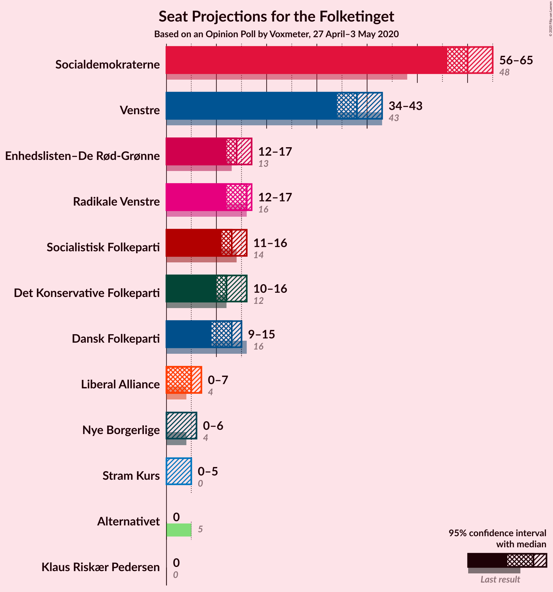
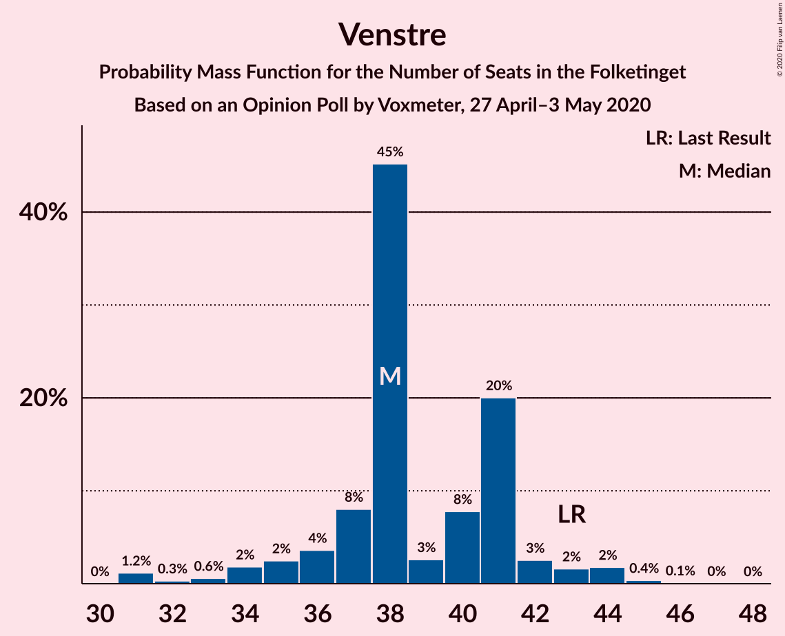
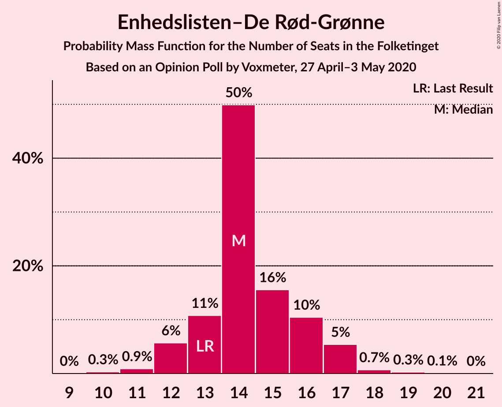
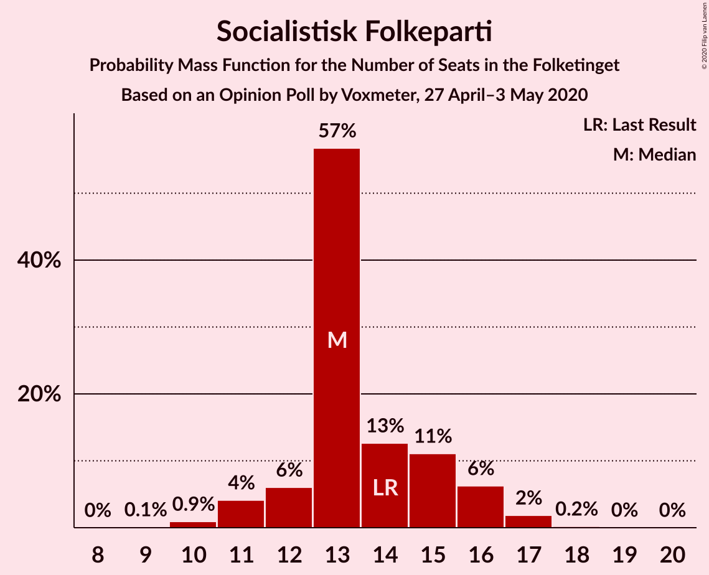
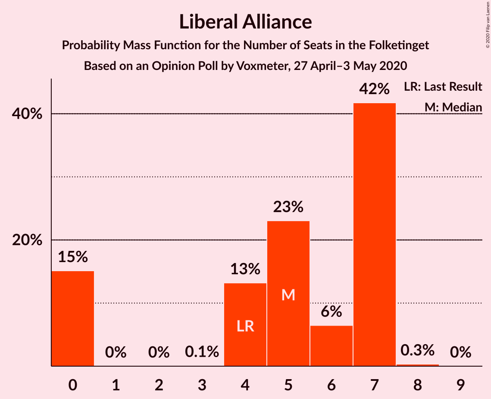
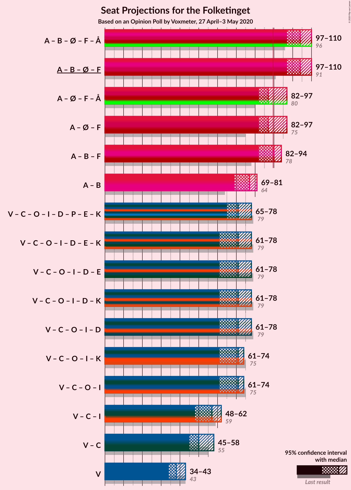
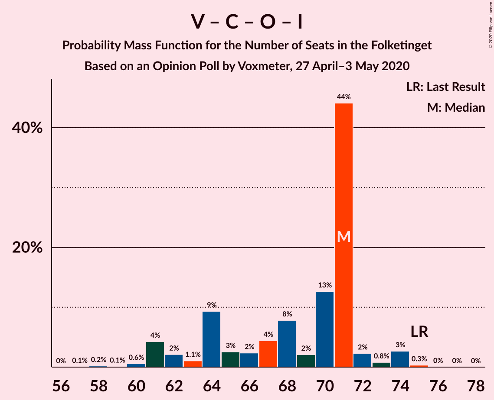

# Opinion Poll by Voxmeter, 27 April–3 May 2020

<a href="#voting-intentions">Voting Intentions</a> | <a href="#seats">Seats</a> | <a href="#coalitions">Coalitions</a> | <a href="#technical-information">Technical Information</a>

## Voting Intentions

### Confidence Intervals

| Party | Last Result | Poll Result | 80% Confidence Interval | 90% Confidence Interval | 95% Confidence Interval | 99% Confidence Interval |
|:-----:|:-----------:|:-----------:|:-----------------------:|:-----------------------:|:-----------------------:|:-----------------------:|
| Socialdemokraterne | 25.9% | 31.3% | 29.5–33.2% |29.0–33.8% |28.5–34.2% |27.7–35.1% |
| Venstre | 23.4% | 19.9% | 18.4–21.6% |17.9–22.1% |17.6–22.5% |16.9–23.3% |
| Radikale Venstre | 8.6% | 7.6% | 6.6–8.8% |6.4–9.1% |6.1–9.4% |5.7–10.0% |
| Enhedslisten–De Rød-Grønne | 6.9% | 7.4% | 6.5–8.6% |6.2–8.9% |6.0–9.2% |5.5–9.8% |
| Socialistisk Folkeparti | 7.7% | 6.9% | 6.0–8.1% |5.7–8.4% |5.5–8.7% |5.1–9.2% |
| Det Konservative Folkeparti | 6.6% | 6.5% | 5.6–7.6% |5.4–8.0% |5.2–8.2% |4.8–8.8% |
| Dansk Folkeparti | 8.7% | 6.3% | 5.5–7.4% |5.2–7.7% |5.0–8.0% |4.6–8.6% |
| Nye Borgerlige | 2.4% | 6.3% | 5.5–7.4% |5.2–7.7% |5.0–8.0% |4.6–8.6% |
| Liberal Alliance | 2.3% | 2.2% | 1.8–3.0% |1.6–3.2% |1.5–3.4% |1.3–3.7% |
| Stram Kurs | 1.8% | 2.0% | 1.5–2.6% |1.4–2.8% |1.3–3.0% |1.1–3.4% |
| Klaus Riskær Pedersen | 0.8% | 1.0% | 0.7–1.5% |0.6–1.7% |0.5–1.8% |0.4–2.1% |
| Alternativet | 3.0% | 0.7% | 0.4–1.2% |0.4–1.3% |0.3–1.4% |0.2–1.7% |

*Note:* The poll result column reflects the actual value used in the calculations. Published results may vary slightly, and in addition be rounded to fewer digits.

## Seats

### Confidence Intervals

| Party | Last Result | Median | 80% Confidence Interval | 90% Confidence Interval | 95% Confidence Interval | 99% Confidence Interval |
|:-----:|:-----------:|:------:|:-----------------------:|:-----------------------:|:-----------------------:|:-----------------------:|
| <a href="#socialdemokraterne">Socialdemokraterne</a> | 48 | 57 | 54–60 |52–60 |51–60 |49–63 |
| <a href="#venstre">Venstre</a> | 43 | 36 | 34–40 |33–40 |32–40 |31–42 |
| <a href="#radikale-venstre">Radikale Venstre</a> | 16 | 14 | 12–15 |12–16 |12–16 |11–17 |
| <a href="#enhedslisten–de-rød-grønne">Enhedslisten–De Rød-Grønne</a> | 13 | 13 | 13–16 |11–17 |11–17 |10–17 |
| <a href="#socialistisk-folkeparti">Socialistisk Folkeparti</a> | 14 | 12 | 11–14 |11–15 |10–15 |9–16 |
| <a href="#det-konservative-folkeparti">Det Konservative Folkeparti</a> | 12 | 11 | 10–14 |10–15 |9–15 |9–15 |
| <a href="#dansk-folkeparti">Dansk Folkeparti</a> | 16 | 11 | 10–13 |10–14 |10–14 |8–15 |
| <a href="#nye-borgerlige">Nye Borgerlige</a> | 4 | 11 | 10–12 |9–13 |9–14 |9–15 |
| <a href="#liberal-alliance">Liberal Alliance</a> | 4 | 4 | 0–6 |0–6 |0–6 |0–6 |
| <a href="#stram-kurs">Stram Kurs</a> | 0 | 4 | 0–4 |0–5 |0–6 |0–6 |
| <a href="#klaus-riskær-pedersen">Klaus Riskær Pedersen</a> | 0 | 0 | 0 |0 |0 |0 |
| <a href="#alternativet">Alternativet</a> | 5 | 0 | 0 |0 |0 |0 |

### Socialdemokraterne

*For a full overview of the results for this party, see the [Socialdemokraterne](party-socialdemokraterne.html) page.*

| Number of Seats | Probability | Accumulated | Special Marks |
|:---------------:|:-----------:|:-----------:|:-------------:|
| 48 | 0.1% | 100% | Last Result |
| 49 | 0.9% | 99.9% |  |
| 50 | 0.3% | 99.0% |  |
| 51 | 3% | 98.7% |  |
| 52 | 1.3% | 96% |  |
| 53 | 1.0% | 95% |  |
| 54 | 31% | 94% |  |
| 55 | 3% | 63% |  |
| 56 | 9% | 60% |  |
| 57 | 5% | 51% | Median |
| 58 | 13% | 46% |  |
| 59 | 10% | 33% |  |
| 60 | 21% | 23% |  |
| 61 | 0.4% | 2% |  |
| 62 | 0.8% | 2% |  |
| 63 | 1.0% | 1.1% |  |
| 64 | 0% | 0.1% |  |
| 65 | 0% | 0.1% |  |
| 66 | 0% | 0% |  |

### Venstre

*For a full overview of the results for this party, see the [Venstre](party-venstre.html) page.*

| Number of Seats | Probability | Accumulated | Special Marks |
|:---------------:|:-----------:|:-----------:|:-------------:|
| 29 | 0% | 100% |  |
| 30 | 0.2% | 99.9% |  |
| 31 | 2% | 99.7% |  |
| 32 | 0.7% | 98% |  |
| 33 | 4% | 97% |  |
| 34 | 29% | 93% |  |
| 35 | 5% | 64% |  |
| 36 | 31% | 59% | Median |
| 37 | 4% | 28% |  |
| 38 | 9% | 24% |  |
| 39 | 5% | 16% |  |
| 40 | 10% | 11% |  |
| 41 | 0.3% | 1.1% |  |
| 42 | 0.5% | 0.8% |  |
| 43 | 0.1% | 0.2% | Last Result |
| 44 | 0.1% | 0.1% |  |
| 45 | 0% | 0% |  |

### Radikale Venstre

*For a full overview of the results for this party, see the [Radikale Venstre](party-radikalevenstre.html) page.*

| Number of Seats | Probability | Accumulated | Special Marks |
|:---------------:|:-----------:|:-----------:|:-------------:|
| 9 | 0.3% | 100% |  |
| 10 | 0.2% | 99.7% |  |
| 11 | 2% | 99.5% |  |
| 12 | 10% | 98% |  |
| 13 | 9% | 88% |  |
| 14 | 37% | 79% | Median |
| 15 | 32% | 42% |  |
| 16 | 8% | 10% | Last Result |
| 17 | 1.1% | 2% |  |
| 18 | 0.2% | 0.5% |  |
| 19 | 0.2% | 0.2% |  |
| 20 | 0% | 0% |  |

### Enhedslisten–De Rød-Grønne

*For a full overview of the results for this party, see the [Enhedslisten–De Rød-Grønne](party-enhedslisten–derød-grønne.html) page.*

| Number of Seats | Probability | Accumulated | Special Marks |
|:---------------:|:-----------:|:-----------:|:-------------:|
| 9 | 0% | 100% |  |
| 10 | 1.1% | 99.9% |  |
| 11 | 4% | 98.9% |  |
| 12 | 4% | 95% |  |
| 13 | 64% | 90% | Last Result, Median |
| 14 | 8% | 26% |  |
| 15 | 8% | 18% |  |
| 16 | 5% | 11% |  |
| 17 | 5% | 5% |  |
| 18 | 0.1% | 0.2% |  |
| 19 | 0.1% | 0.1% |  |
| 20 | 0% | 0% |  |

### Socialistisk Folkeparti

*For a full overview of the results for this party, see the [Socialistisk Folkeparti](party-socialistiskfolkeparti.html) page.*

| Number of Seats | Probability | Accumulated | Special Marks |
|:---------------:|:-----------:|:-----------:|:-------------:|
| 9 | 1.0% | 100% |  |
| 10 | 3% | 99.0% |  |
| 11 | 30% | 96% |  |
| 12 | 18% | 66% | Median |
| 13 | 13% | 48% |  |
| 14 | 25% | 34% | Last Result |
| 15 | 8% | 9% |  |
| 16 | 0.9% | 1.4% |  |
| 17 | 0.4% | 0.5% |  |
| 18 | 0% | 0.1% |  |
| 19 | 0.1% | 0.1% |  |
| 20 | 0% | 0% |  |

### Det Konservative Folkeparti

*For a full overview of the results for this party, see the [Det Konservative Folkeparti](party-detkonservativefolkeparti.html) page.*

| Number of Seats | Probability | Accumulated | Special Marks |
|:---------------:|:-----------:|:-----------:|:-------------:|
| 8 | 0.1% | 100% |  |
| 9 | 3% | 99.9% |  |
| 10 | 16% | 97% |  |
| 11 | 36% | 82% | Median |
| 12 | 8% | 45% | Last Result |
| 13 | 8% | 37% |  |
| 14 | 22% | 30% |  |
| 15 | 7% | 8% |  |
| 16 | 0.3% | 0.3% |  |
| 17 | 0% | 0.1% |  |
| 18 | 0.1% | 0.1% |  |
| 19 | 0% | 0% |  |

### Dansk Folkeparti

*For a full overview of the results for this party, see the [Dansk Folkeparti](party-danskfolkeparti.html) page.*

| Number of Seats | Probability | Accumulated | Special Marks |
|:---------------:|:-----------:|:-----------:|:-------------:|
| 8 | 0.6% | 100% |  |
| 9 | 0.8% | 99.4% |  |
| 10 | 25% | 98.6% |  |
| 11 | 49% | 73% | Median |
| 12 | 11% | 24% |  |
| 13 | 6% | 13% |  |
| 14 | 6% | 8% |  |
| 15 | 2% | 2% |  |
| 16 | 0% | 0.1% | Last Result |
| 17 | 0% | 0.1% |  |
| 18 | 0% | 0% |  |

### Nye Borgerlige

*For a full overview of the results for this party, see the [Nye Borgerlige](party-nyeborgerlige.html) page.*

| Number of Seats | Probability | Accumulated | Special Marks |
|:---------------:|:-----------:|:-----------:|:-------------:|
| 4 | 0% | 100% | Last Result |
| 5 | 0% | 100% |  |
| 6 | 0% | 100% |  |
| 7 | 0% | 100% |  |
| 8 | 0.1% | 100% |  |
| 9 | 7% | 99.9% |  |
| 10 | 25% | 92% |  |
| 11 | 21% | 67% | Median |
| 12 | 37% | 46% |  |
| 13 | 5% | 9% |  |
| 14 | 3% | 4% |  |
| 15 | 0.6% | 0.8% |  |
| 16 | 0.2% | 0.2% |  |
| 17 | 0% | 0% |  |

### Liberal Alliance

*For a full overview of the results for this party, see the [Liberal Alliance](party-liberalalliance.html) page.*

| Number of Seats | Probability | Accumulated | Special Marks |
|:---------------:|:-----------:|:-----------:|:-------------:|
| 0 | 20% | 100% |  |
| 1 | 0% | 80% |  |
| 2 | 0% | 80% |  |
| 3 | 0% | 80% |  |
| 4 | 37% | 80% | Last Result, Median |
| 5 | 20% | 43% |  |
| 6 | 23% | 24% |  |
| 7 | 0.3% | 0.3% |  |
| 8 | 0% | 0% |  |

### Stram Kurs

*For a full overview of the results for this party, see the [Stram Kurs](party-stramkurs.html) page.*

| Number of Seats | Probability | Accumulated | Special Marks |
|:---------------:|:-----------:|:-----------:|:-------------:|
| 0 | 45% | 100% | Last Result |
| 1 | 0% | 55% |  |
| 2 | 0% | 55% |  |
| 3 | 0% | 55% |  |
| 4 | 46% | 55% | Median |
| 5 | 5% | 9% |  |
| 6 | 4% | 4% |  |
| 7 | 0.1% | 0.1% |  |
| 8 | 0% | 0% |  |

### Klaus Riskær Pedersen

*For a full overview of the results for this party, see the [Klaus Riskær Pedersen](party-klausriskærpedersen.html) page.*

| Number of Seats | Probability | Accumulated | Special Marks |
|:---------------:|:-----------:|:-----------:|:-------------:|
| 0 | 99.5% | 100% | Last Result, Median |
| 1 | 0% | 0.5% |  |
| 2 | 0% | 0.5% |  |
| 3 | 0% | 0.5% |  |
| 4 | 0.4% | 0.5% |  |
| 5 | 0.1% | 0.1% |  |
| 6 | 0% | 0% |  |

### Alternativet

*For a full overview of the results for this party, see the [Alternativet](party-alternativet.html) page.*

| Number of Seats | Probability | Accumulated | Special Marks |
|:---------------:|:-----------:|:-----------:|:-------------:|
| 0 | 100% | 100% | Median |
| 1 | 0% | 0% |  |
| 2 | 0% | 0% |  |
| 3 | 0% | 0% |  |
| 4 | 0% | 0% |  |
| 5 | 0% | 0% | Last Result |

## Coalitions

### Confidence Intervals

| Coalition | Last Result | Median | Majority? | 80% Confidence Interval | 90% Confidence Interval | 95% Confidence Interval | 99% Confidence Interval |
|:---------:|:-----------:|:------:|:---------:|:-----------------------:|:-----------------------:|:-----------------------:|:-----------------------:|
| Socialdemokraterne – Radikale Venstre – Enhedslisten–De Rød-Grønne – Socialistisk Folkeparti – Alternativet | 96 | 97 | 99.4% | 93–100 | 93–102 | 91–103 | 89–106 |
| Socialdemokraterne – Radikale Venstre – Enhedslisten–De Rød-Grønne – Socialistisk Folkeparti | 91 | 97 | 99.4% | 93–100 | 93–102 | 91–103 | 89–106 |
| Socialdemokraterne – Radikale Venstre – Socialistisk Folkeparti | 78 | 83 | 3% | 80–86 | 79–87 | 76–90 | 75–91 |
| Socialdemokraterne – Enhedslisten–De Rød-Grønne – Socialistisk Folkeparti – Alternativet | 80 | 83 | 1.2% | 79–86 | 79–87 | 78–88 | 76–93 |
| Socialdemokraterne – Enhedslisten–De Rød-Grønne – Socialistisk Folkeparti | 75 | 83 | 1.2% | 79–86 | 79–87 | 78–88 | 76–93 |
| Venstre – Det Konservative Folkeparti – Dansk Folkeparti – Nye Borgerlige – Liberal Alliance – Klaus Riskær Pedersen | 79 | 74 | 0% | 69–78 | 68–80 | 68–80 | 68–82 |
| Venstre – Det Konservative Folkeparti – Dansk Folkeparti – Nye Borgerlige – Liberal Alliance | 79 | 74 | 0% | 69–78 | 68–80 | 68–80 | 68–81 |
| Socialdemokraterne – Radikale Venstre | 64 | 70 | 0% | 68–75 | 65–75 | 64–75 | 63–76 |
| Venstre – Det Konservative Folkeparti – Dansk Folkeparti – Liberal Alliance | 75 | 62 | 0% | 59–69 | 58–69 | 56–69 | 56–70 |
| Venstre – Det Konservative Folkeparti – Liberal Alliance | 59 | 52 | 0% | 48–57 | 46–58 | 45–58 | 45–58 |
| Venstre – Det Konservative Folkeparti | 55 | 48 | 0% | 45–52 | 44–53 | 43–53 | 43–55 |
| Venstre | 43 | 36 | 0% | 34–40 | 33–40 | 32–40 | 31–42 |

### Socialdemokraterne – Radikale Venstre – Enhedslisten–De Rød-Grønne – Socialistisk Folkeparti – Alternativet

| Number of Seats | Probability | Accumulated | Special Marks |
|:---------------:|:-----------:|:-----------:|:-------------:|
| 87 | 0.1% | 100% |  |
| 88 | 0.1% | 99.9% |  |
| 89 | 0.4% | 99.8% |  |
| 90 | 1.0% | 99.4% | Majority |
| 91 | 1.4% | 98% |  |
| 92 | 2% | 97% |  |
| 93 | 9% | 95% |  |
| 94 | 4% | 87% |  |
| 95 | 30% | 83% |  |
| 96 | 2% | 53% | Last Result, Median |
| 97 | 3% | 50% |  |
| 98 | 10% | 48% |  |
| 99 | 28% | 38% |  |
| 100 | 3% | 10% |  |
| 101 | 1.1% | 7% |  |
| 102 | 3% | 6% |  |
| 103 | 2% | 3% |  |
| 104 | 0.1% | 1.2% |  |
| 105 | 0.1% | 1.1% |  |
| 106 | 1.0% | 1.0% |  |
| 107 | 0% | 0% |  |

### Socialdemokraterne – Radikale Venstre – Enhedslisten–De Rød-Grønne – Socialistisk Folkeparti

| Number of Seats | Probability | Accumulated | Special Marks |
|:---------------:|:-----------:|:-----------:|:-------------:|
| 87 | 0.1% | 100% |  |
| 88 | 0.1% | 99.9% |  |
| 89 | 0.4% | 99.8% |  |
| 90 | 1.0% | 99.4% | Majority |
| 91 | 1.4% | 98% | Last Result |
| 92 | 2% | 97% |  |
| 93 | 9% | 95% |  |
| 94 | 4% | 87% |  |
| 95 | 30% | 83% |  |
| 96 | 2% | 53% | Median |
| 97 | 3% | 50% |  |
| 98 | 10% | 48% |  |
| 99 | 28% | 38% |  |
| 100 | 3% | 10% |  |
| 101 | 1.1% | 7% |  |
| 102 | 3% | 6% |  |
| 103 | 2% | 3% |  |
| 104 | 0.1% | 1.2% |  |
| 105 | 0.1% | 1.1% |  |
| 106 | 1.0% | 1.0% |  |
| 107 | 0% | 0% |  |

### Socialdemokraterne – Radikale Venstre – Socialistisk Folkeparti

| Number of Seats | Probability | Accumulated | Special Marks |
|:---------------:|:-----------:|:-----------:|:-------------:|
| 74 | 0.1% | 100% |  |
| 75 | 0.5% | 99.9% |  |
| 76 | 3% | 99.4% |  |
| 77 | 0.4% | 96% |  |
| 78 | 0.4% | 96% | Last Result |
| 79 | 3% | 95% |  |
| 80 | 6% | 93% |  |
| 81 | 2% | 87% |  |
| 82 | 32% | 85% |  |
| 83 | 7% | 53% | Median |
| 84 | 8% | 45% |  |
| 85 | 10% | 37% |  |
| 86 | 21% | 27% |  |
| 87 | 3% | 7% |  |
| 88 | 0.6% | 4% |  |
| 89 | 0.4% | 3% |  |
| 90 | 2% | 3% | Majority |
| 91 | 1.0% | 1.2% |  |
| 92 | 0% | 0.2% |  |
| 93 | 0.1% | 0.1% |  |
| 94 | 0% | 0.1% |  |
| 95 | 0% | 0% |  |

### Socialdemokraterne – Enhedslisten–De Rød-Grønne – Socialistisk Folkeparti – Alternativet

| Number of Seats | Probability | Accumulated | Special Marks |
|:---------------:|:-----------:|:-----------:|:-------------:|
| 71 | 0.1% | 100% |  |
| 72 | 0% | 99.9% |  |
| 73 | 0% | 99.9% |  |
| 74 | 0% | 99.9% |  |
| 75 | 0.1% | 99.9% |  |
| 76 | 0.3% | 99.7% |  |
| 77 | 2% | 99.4% |  |
| 78 | 1.0% | 98% |  |
| 79 | 8% | 97% |  |
| 80 | 6% | 89% | Last Result |
| 81 | 23% | 83% |  |
| 82 | 5% | 60% | Median |
| 83 | 20% | 56% |  |
| 84 | 22% | 36% |  |
| 85 | 2% | 14% |  |
| 86 | 4% | 12% |  |
| 87 | 4% | 8% |  |
| 88 | 3% | 4% |  |
| 89 | 0.2% | 1.4% |  |
| 90 | 0.1% | 1.2% | Majority |
| 91 | 0.1% | 1.1% |  |
| 92 | 0% | 1.0% |  |
| 93 | 1.0% | 1.0% |  |
| 94 | 0% | 0% |  |

### Socialdemokraterne – Enhedslisten–De Rød-Grønne – Socialistisk Folkeparti

| Number of Seats | Probability | Accumulated | Special Marks |
|:---------------:|:-----------:|:-----------:|:-------------:|
| 71 | 0.1% | 100% |  |
| 72 | 0% | 99.9% |  |
| 73 | 0% | 99.9% |  |
| 74 | 0% | 99.9% |  |
| 75 | 0.1% | 99.9% | Last Result |
| 76 | 0.3% | 99.7% |  |
| 77 | 2% | 99.4% |  |
| 78 | 1.0% | 98% |  |
| 79 | 8% | 97% |  |
| 80 | 6% | 89% |  |
| 81 | 23% | 83% |  |
| 82 | 5% | 60% | Median |
| 83 | 20% | 56% |  |
| 84 | 22% | 36% |  |
| 85 | 2% | 14% |  |
| 86 | 4% | 12% |  |
| 87 | 4% | 8% |  |
| 88 | 3% | 4% |  |
| 89 | 0.2% | 1.4% |  |
| 90 | 0.1% | 1.2% | Majority |
| 91 | 0.1% | 1.1% |  |
| 92 | 0% | 1.0% |  |
| 93 | 1.0% | 1.0% |  |
| 94 | 0% | 0% |  |

### Venstre – Det Konservative Folkeparti – Dansk Folkeparti – Nye Borgerlige – Liberal Alliance – Klaus Riskær Pedersen

| Number of Seats | Probability | Accumulated | Special Marks |
|:---------------:|:-----------:|:-----------:|:-------------:|
| 63 | 0.1% | 100% |  |
| 64 | 0% | 99.9% |  |
| 65 | 0% | 99.9% |  |
| 66 | 0% | 99.9% |  |
| 67 | 0.1% | 99.9% |  |
| 68 | 7% | 99.8% |  |
| 69 | 3% | 93% |  |
| 70 | 6% | 90% |  |
| 71 | 2% | 84% |  |
| 72 | 22% | 82% |  |
| 73 | 8% | 60% | Median |
| 74 | 2% | 52% |  |
| 75 | 3% | 50% |  |
| 76 | 24% | 47% |  |
| 77 | 4% | 23% |  |
| 78 | 8% | 18% |  |
| 79 | 0.7% | 10% | Last Result |
| 80 | 8% | 9% |  |
| 81 | 0.7% | 1.2% |  |
| 82 | 0.2% | 0.5% |  |
| 83 | 0.2% | 0.4% |  |
| 84 | 0.1% | 0.2% |  |
| 85 | 0% | 0% |  |

### Venstre – Det Konservative Folkeparti – Dansk Folkeparti – Nye Borgerlige – Liberal Alliance

| Number of Seats | Probability | Accumulated | Special Marks |
|:---------------:|:-----------:|:-----------:|:-------------:|
| 63 | 0.1% | 100% |  |
| 64 | 0% | 99.9% |  |
| 65 | 0% | 99.9% |  |
| 66 | 0% | 99.9% |  |
| 67 | 0.1% | 99.9% |  |
| 68 | 7% | 99.8% |  |
| 69 | 3% | 93% |  |
| 70 | 6% | 90% |  |
| 71 | 2% | 84% |  |
| 72 | 22% | 82% |  |
| 73 | 8% | 60% | Median |
| 74 | 2% | 52% |  |
| 75 | 2% | 49% |  |
| 76 | 24% | 47% |  |
| 77 | 5% | 23% |  |
| 78 | 8% | 18% |  |
| 79 | 0.7% | 10% | Last Result |
| 80 | 8% | 9% |  |
| 81 | 0.7% | 1.1% |  |
| 82 | 0.1% | 0.4% |  |
| 83 | 0.2% | 0.4% |  |
| 84 | 0.1% | 0.2% |  |
| 85 | 0% | 0% |  |

### Socialdemokraterne – Radikale Venstre

| Number of Seats | Probability | Accumulated | Special Marks |
|:---------------:|:-----------:|:-----------:|:-------------:|
| 62 | 0% | 100% |  |
| 63 | 1.3% | 99.9% |  |
| 64 | 1.3% | 98.7% | Last Result |
| 65 | 3% | 97% |  |
| 66 | 0.9% | 94% |  |
| 67 | 0.6% | 93% |  |
| 68 | 28% | 93% |  |
| 69 | 5% | 65% |  |
| 70 | 12% | 60% |  |
| 71 | 9% | 48% | Median |
| 72 | 5% | 39% |  |
| 73 | 2% | 34% |  |
| 74 | 7% | 31% |  |
| 75 | 22% | 24% |  |
| 76 | 2% | 2% |  |
| 77 | 0.1% | 0.4% |  |
| 78 | 0% | 0.2% |  |
| 79 | 0.1% | 0.2% |  |
| 80 | 0% | 0.1% |  |
| 81 | 0% | 0% |  |

### Venstre – Det Konservative Folkeparti – Dansk Folkeparti – Liberal Alliance

| Number of Seats | Probability | Accumulated | Special Marks |
|:---------------:|:-----------:|:-----------:|:-------------:|
| 54 | 0.1% | 100% |  |
| 55 | 0.1% | 99.9% |  |
| 56 | 4% | 99.8% |  |
| 57 | 0.3% | 96% |  |
| 58 | 3% | 96% |  |
| 59 | 9% | 93% |  |
| 60 | 5% | 84% |  |
| 61 | 7% | 80% |  |
| 62 | 23% | 72% | Median |
| 63 | 3% | 49% |  |
| 64 | 24% | 46% |  |
| 65 | 2% | 22% |  |
| 66 | 6% | 20% |  |
| 67 | 1.0% | 14% |  |
| 68 | 1.3% | 13% |  |
| 69 | 11% | 12% |  |
| 70 | 0.8% | 0.8% |  |
| 71 | 0% | 0.1% |  |
| 72 | 0% | 0.1% |  |
| 73 | 0% | 0% |  |
| 74 | 0% | 0% |  |
| 75 | 0% | 0% | Last Result |

### Venstre – Det Konservative Folkeparti – Liberal Alliance

| Number of Seats | Probability | Accumulated | Special Marks |
|:---------------:|:-----------:|:-----------:|:-------------:|
| 43 | 0.1% | 100% |  |
| 44 | 0.3% | 99.9% |  |
| 45 | 4% | 99.6% |  |
| 46 | 1.0% | 96% |  |
| 47 | 3% | 95% |  |
| 48 | 11% | 91% |  |
| 49 | 4% | 80% |  |
| 50 | 8% | 76% |  |
| 51 | 3% | 69% | Median |
| 52 | 22% | 66% |  |
| 53 | 27% | 44% |  |
| 54 | 1.0% | 17% |  |
| 55 | 3% | 16% |  |
| 56 | 1.2% | 13% |  |
| 57 | 4% | 11% |  |
| 58 | 7% | 7% |  |
| 59 | 0.2% | 0.3% | Last Result |
| 60 | 0% | 0.1% |  |
| 61 | 0% | 0% |  |

### Venstre – Det Konservative Folkeparti

| Number of Seats | Probability | Accumulated | Special Marks |
|:---------------:|:-----------:|:-----------:|:-------------:|
| 40 | 0.1% | 100% |  |
| 41 | 0% | 99.9% |  |
| 42 | 0.3% | 99.8% |  |
| 43 | 4% | 99.6% |  |
| 44 | 5% | 96% |  |
| 45 | 8% | 91% |  |
| 46 | 2% | 83% |  |
| 47 | 28% | 81% | Median |
| 48 | 26% | 53% |  |
| 49 | 4% | 27% |  |
| 50 | 9% | 23% |  |
| 51 | 0.8% | 14% |  |
| 52 | 5% | 13% |  |
| 53 | 7% | 8% |  |
| 54 | 0.3% | 1.0% |  |
| 55 | 0.3% | 0.7% | Last Result |
| 56 | 0.5% | 0.5% |  |
| 57 | 0% | 0% |  |

### Venstre

| Number of Seats | Probability | Accumulated | Special Marks |
|:---------------:|:-----------:|:-----------:|:-------------:|
| 29 | 0% | 100% |  |
| 30 | 0.2% | 99.9% |  |
| 31 | 2% | 99.7% |  |
| 32 | 0.7% | 98% |  |
| 33 | 4% | 97% |  |
| 34 | 29% | 93% |  |
| 35 | 5% | 64% |  |
| 36 | 31% | 59% | Median |
| 37 | 4% | 28% |  |
| 38 | 9% | 24% |  |
| 39 | 5% | 16% |  |
| 40 | 10% | 11% |  |
| 41 | 0.3% | 1.1% |  |
| 42 | 0.5% | 0.8% |  |
| 43 | 0.1% | 0.2% | Last Result |
| 44 | 0.1% | 0.1% |  |
| 45 | 0% | 0% |  |

## Technical Information

### Opinion Poll

+ **Polling firm:** Voxmeter
+ **Commissioner(s):** —
+ **Fieldwork period:** 27 April–3 May 2020

### Calculations

+ **Sample size:** 1025
+ **Simulations done:** 1,048,576
+ **Error estimate:** 3.25%

