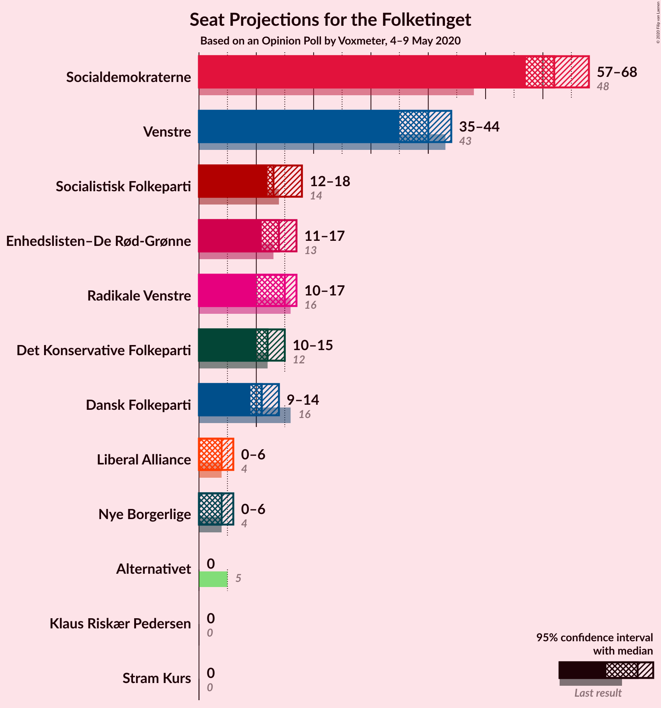
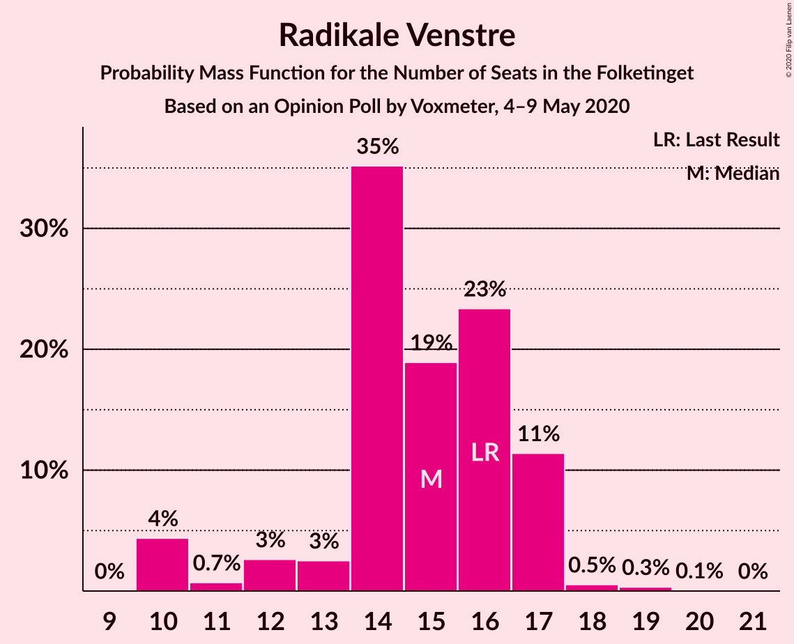
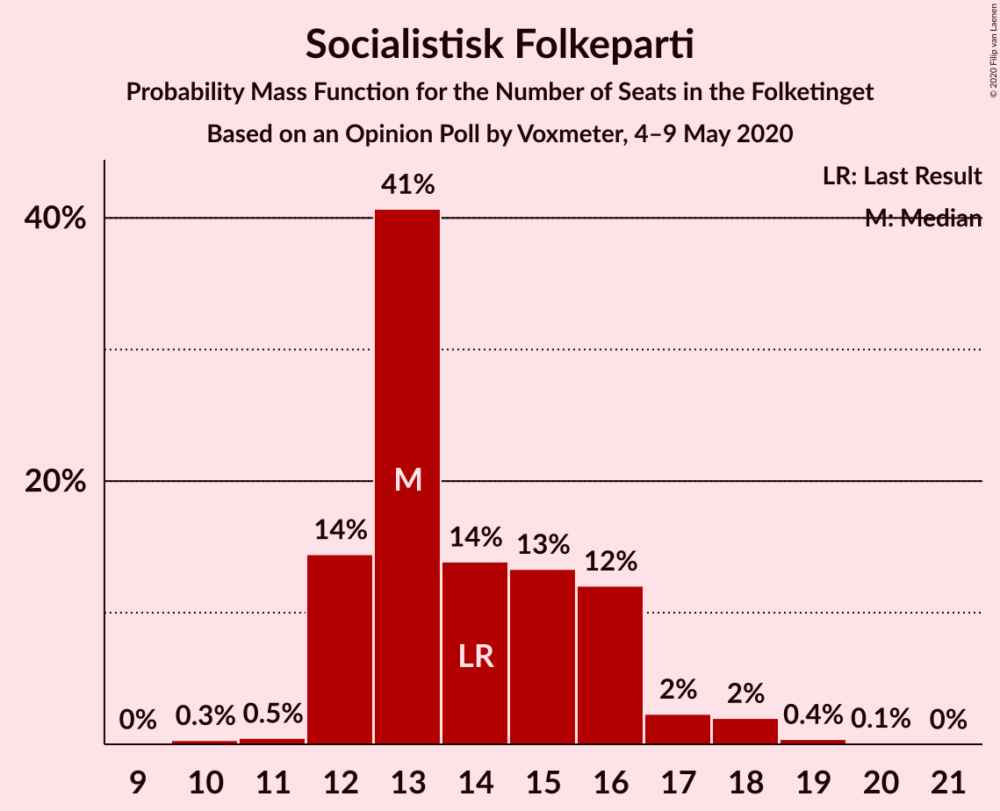
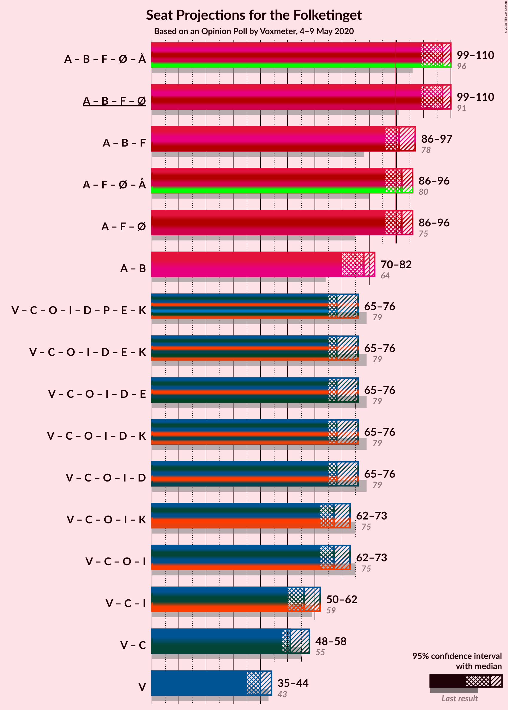
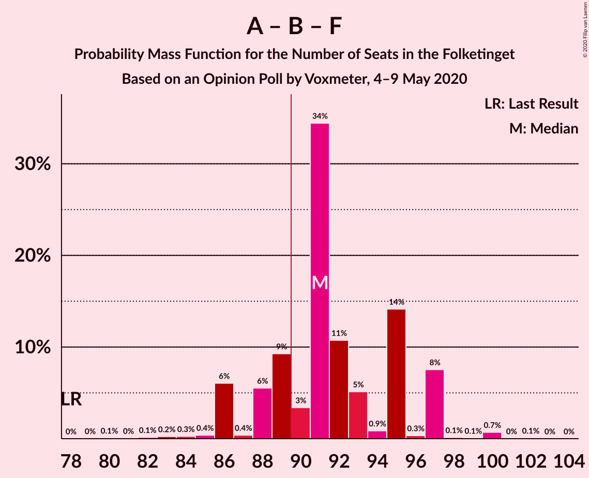
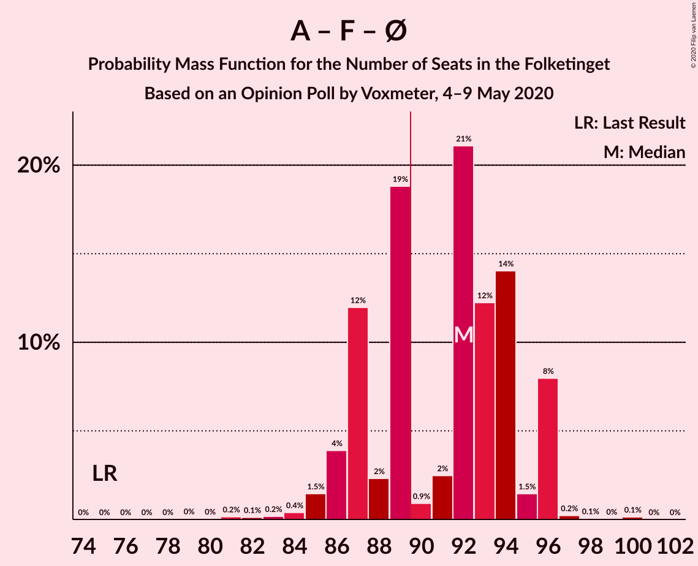
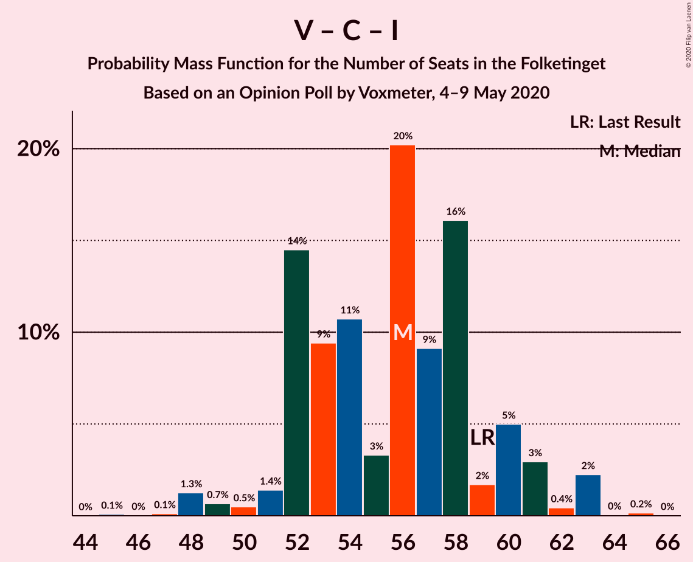

# Opinion Poll by Voxmeter, 4–9 May 2020

<a href="#voting-intentions">Voting Intentions</a> | <a href="#seats">Seats</a> | <a href="#coalitions">Coalitions</a> | <a href="#technical-information">Technical Information</a>

## Voting Intentions

### Confidence Intervals

| Party | Last Result | Poll Result | 80% Confidence Interval | 90% Confidence Interval | 95% Confidence Interval | 99% Confidence Interval |
|:-----:|:-----------:|:-----------:|:-----------------------:|:-----------------------:|:-----------------------:|:-----------------------:|
| Socialdemokraterne | 25.9% | 34.1% | 32.3–36.1% |31.8–36.6% |31.3–37.1% |30.4–38.0% |
| Venstre | 23.4% | 21.9% | 20.3–23.6% |19.8–24.1% |19.4–24.5% |18.7–25.3% |
| Radikale Venstre | 8.6% | 7.9% | 6.9–9.0% |6.6–9.4% |6.4–9.7% |5.9–10.3% |
| Socialistisk Folkeparti | 7.7% | 7.9% | 6.9–9.0% |6.6–9.4% |6.4–9.7% |5.9–10.3% |
| Enhedslisten–De Rød-Grønne | 6.9% | 7.4% | 6.4–8.5% |6.2–8.9% |5.9–9.1% |5.5–9.7% |
| Det Konservative Folkeparti | 6.6% | 6.8% | 5.9–7.9% |5.6–8.2% |5.4–8.5% |5.0–9.1% |
| Dansk Folkeparti | 8.7% | 6.2% | 5.4–7.3% |5.1–7.6% |4.9–7.9% |4.5–8.4% |
| Liberal Alliance | 2.3% | 2.2% | 1.7–2.9% |1.6–3.1% |1.5–3.3% |1.3–3.7% |
| Nye Borgerlige | 2.4% | 2.1% | 1.6–2.8% |1.5–3.0% |1.4–3.2% |1.2–3.6% |
| Stram Kurs | 1.8% | 1.2% | 0.9–1.8% |0.8–2.0% |0.7–2.1% |0.6–2.4% |
| Alternativet | 3.0% | 0.6% | 0.4–1.0% |0.3–1.1% |0.3–1.2% |0.2–1.5% |
| Klaus Riskær Pedersen | 0.8% | 0.5% | 0.3–0.9% |0.2–1.0% |0.2–1.1% |0.1–1.4% |

*Note:* The poll result column reflects the actual value used in the calculations. Published results may vary slightly, and in addition be rounded to fewer digits.

## Seats

### Confidence Intervals

| Party | Last Result | Median | 80% Confidence Interval | 90% Confidence Interval | 95% Confidence Interval | 99% Confidence Interval |
|:-----:|:-----------:|:------:|:-----------------------:|:-----------------------:|:-----------------------:|:-----------------------:|
| <a href="#socialdemokraterne">Socialdemokraterne</a> | 48 | 64 | 59–68 |57–68 |57–68 |56–69 |
| <a href="#venstre">Venstre</a> | 43 | 39 | 35–43 |35–43 |35–43 |34–45 |
| <a href="#radikale-venstre">Radikale Venstre</a> | 16 | 14 | 14–16 |13–17 |12–17 |12–19 |
| <a href="#socialistisk-folkeparti">Socialistisk Folkeparti</a> | 14 | 13 | 12–16 |12–17 |12–18 |11–18 |
| <a href="#enhedslisten–de-rød-grønne">Enhedslisten–De Rød-Grønne</a> | 13 | 13 | 13–15 |11–16 |11–17 |11–18 |
| <a href="#det-konservative-folkeparti">Det Konservative Folkeparti</a> | 12 | 12 | 11–14 |11–15 |10–16 |9–17 |
| <a href="#dansk-folkeparti">Dansk Folkeparti</a> | 16 | 10 | 10–13 |9–14 |9–14 |9–15 |
| <a href="#liberal-alliance">Liberal Alliance</a> | 4 | 4 | 0–5 |0–5 |0–5 |0–6 |
| <a href="#nye-borgerlige">Nye Borgerlige</a> | 4 | 4 | 0–5 |0–5 |0–6 |0–6 |
| <a href="#stram-kurs">Stram Kurs</a> | 0 | 0 | 0 |0 |0 |0–4 |
| <a href="#alternativet">Alternativet</a> | 5 | 0 | 0 |0 |0 |0 |
| <a href="#klaus-riskær-pedersen">Klaus Riskær Pedersen</a> | 0 | 0 | 0 |0 |0 |0 |

### Socialdemokraterne

*For a full overview of the results for this party, see the [Socialdemokraterne](party-socialdemokraterne.html) page.*

| Number of Seats | Probability | Accumulated | Special Marks |
|:---------------:|:-----------:|:-----------:|:-------------:|
| 48 | 0% | 100% | Last Result |
| 49 | 0% | 100% |  |
| 50 | 0% | 100% |  |
| 51 | 0% | 100% |  |
| 52 | 0% | 100% |  |
| 53 | 0.1% | 100% |  |
| 54 | 0% | 99.9% |  |
| 55 | 0.2% | 99.9% |  |
| 56 | 0.9% | 99.7% |  |
| 57 | 6% | 98.8% |  |
| 58 | 2% | 93% |  |
| 59 | 5% | 91% |  |
| 60 | 2% | 86% |  |
| 61 | 4% | 84% |  |
| 62 | 6% | 80% |  |
| 63 | 6% | 74% |  |
| 64 | 40% | 67% | Median |
| 65 | 1.5% | 27% |  |
| 66 | 1.4% | 26% |  |
| 67 | 0.3% | 24% |  |
| 68 | 22% | 24% |  |
| 69 | 1.5% | 2% |  |
| 70 | 0.1% | 0.1% |  |
| 71 | 0% | 0.1% |  |
| 72 | 0% | 0% |  |

### Venstre

*For a full overview of the results for this party, see the [Venstre](party-venstre.html) page.*

| Number of Seats | Probability | Accumulated | Special Marks |
|:---------------:|:-----------:|:-----------:|:-------------:|
| 34 | 0.9% | 100% |  |
| 35 | 18% | 99.0% |  |
| 36 | 22% | 81% |  |
| 37 | 1.2% | 58% |  |
| 38 | 4% | 57% |  |
| 39 | 4% | 53% | Median |
| 40 | 5% | 49% |  |
| 41 | 11% | 45% |  |
| 42 | 23% | 33% |  |
| 43 | 8% | 10% | Last Result |
| 44 | 1.3% | 2% |  |
| 45 | 0.8% | 1.0% |  |
| 46 | 0.1% | 0.2% |  |
| 47 | 0.1% | 0.1% |  |
| 48 | 0% | 0% |  |

### Radikale Venstre

*For a full overview of the results for this party, see the [Radikale Venstre](party-radikalevenstre.html) page.*

| Number of Seats | Probability | Accumulated | Special Marks |
|:---------------:|:-----------:|:-----------:|:-------------:|
| 10 | 0.2% | 100% |  |
| 11 | 0.2% | 99.8% |  |
| 12 | 4% | 99.6% |  |
| 13 | 3% | 95% |  |
| 14 | 46% | 92% | Median |
| 15 | 32% | 47% |  |
| 16 | 8% | 15% | Last Result |
| 17 | 6% | 7% |  |
| 18 | 0.3% | 0.9% |  |
| 19 | 0.6% | 0.6% |  |
| 20 | 0% | 0% |  |

### Socialistisk Folkeparti

*For a full overview of the results for this party, see the [Socialistisk Folkeparti](party-socialistiskfolkeparti.html) page.*

| Number of Seats | Probability | Accumulated | Special Marks |
|:---------------:|:-----------:|:-----------:|:-------------:|
| 10 | 0.4% | 100% |  |
| 11 | 0.6% | 99.5% |  |
| 12 | 26% | 99.0% |  |
| 13 | 27% | 73% | Median |
| 14 | 21% | 46% | Last Result |
| 15 | 7% | 25% |  |
| 16 | 11% | 18% |  |
| 17 | 4% | 7% |  |
| 18 | 3% | 3% |  |
| 19 | 0.2% | 0.4% |  |
| 20 | 0.2% | 0.2% |  |
| 21 | 0% | 0% |  |

### Enhedslisten–De Rød-Grønne

*For a full overview of the results for this party, see the [Enhedslisten–De Rød-Grønne](party-enhedslisten–derød-grønne.html) page.*

| Number of Seats | Probability | Accumulated | Special Marks |
|:---------------:|:-----------:|:-----------:|:-------------:|
| 10 | 0.4% | 100% |  |
| 11 | 5% | 99.5% |  |
| 12 | 3% | 94% |  |
| 13 | 49% | 91% | Last Result, Median |
| 14 | 13% | 42% |  |
| 15 | 19% | 29% |  |
| 16 | 7% | 10% |  |
| 17 | 1.4% | 3% |  |
| 18 | 2% | 2% |  |
| 19 | 0% | 0% |  |

### Det Konservative Folkeparti

*For a full overview of the results for this party, see the [Det Konservative Folkeparti](party-detkonservativefolkeparti.html) page.*

| Number of Seats | Probability | Accumulated | Special Marks |
|:---------------:|:-----------:|:-----------:|:-------------:|
| 8 | 0.3% | 100% |  |
| 9 | 2% | 99.7% |  |
| 10 | 3% | 98% |  |
| 11 | 12% | 95% |  |
| 12 | 50% | 83% | Last Result, Median |
| 13 | 21% | 33% |  |
| 14 | 3% | 12% |  |
| 15 | 6% | 9% |  |
| 16 | 3% | 4% |  |
| 17 | 0.7% | 0.8% |  |
| 18 | 0.1% | 0.1% |  |
| 19 | 0% | 0% |  |

### Dansk Folkeparti

*For a full overview of the results for this party, see the [Dansk Folkeparti](party-danskfolkeparti.html) page.*

| Number of Seats | Probability | Accumulated | Special Marks |
|:---------------:|:-----------:|:-----------:|:-------------:|
| 8 | 0.4% | 100% |  |
| 9 | 6% | 99.6% |  |
| 10 | 46% | 93% | Median |
| 11 | 3% | 47% |  |
| 12 | 11% | 44% |  |
| 13 | 24% | 32% |  |
| 14 | 8% | 8% |  |
| 15 | 0.6% | 0.8% |  |
| 16 | 0.1% | 0.2% | Last Result |
| 17 | 0.1% | 0.1% |  |
| 18 | 0% | 0% |  |

### Liberal Alliance

*For a full overview of the results for this party, see the [Liberal Alliance](party-liberalalliance.html) page.*

| Number of Seats | Probability | Accumulated | Special Marks |
|:---------------:|:-----------:|:-----------:|:-------------:|
| 0 | 15% | 100% |  |
| 1 | 0% | 85% |  |
| 2 | 0% | 85% |  |
| 3 | 0% | 85% |  |
| 4 | 54% | 85% | Last Result, Median |
| 5 | 29% | 30% |  |
| 6 | 1.2% | 2% |  |
| 7 | 0.5% | 0.5% |  |
| 8 | 0% | 0% |  |

### Nye Borgerlige

*For a full overview of the results for this party, see the [Nye Borgerlige](party-nyeborgerlige.html) page.*

| Number of Seats | Probability | Accumulated | Special Marks |
|:---------------:|:-----------:|:-----------:|:-------------:|
| 0 | 40% | 100% |  |
| 1 | 0% | 60% |  |
| 2 | 0% | 60% |  |
| 3 | 0% | 60% |  |
| 4 | 16% | 60% | Last Result, Median |
| 5 | 41% | 45% |  |
| 6 | 3% | 3% |  |
| 7 | 0.3% | 0.3% |  |
| 8 | 0% | 0% |  |

### Stram Kurs

*For a full overview of the results for this party, see the [Stram Kurs](party-stramkurs.html) page.*

| Number of Seats | Probability | Accumulated | Special Marks |
|:---------------:|:-----------:|:-----------:|:-------------:|
| 0 | 98.5% | 100% | Last Result, Median |
| 1 | 0% | 1.5% |  |
| 2 | 0% | 1.5% |  |
| 3 | 0% | 1.5% |  |
| 4 | 1.4% | 1.5% |  |
| 5 | 0.1% | 0.1% |  |
| 6 | 0% | 0% |  |

### Alternativet

*For a full overview of the results for this party, see the [Alternativet](party-alternativet.html) page.*

| Number of Seats | Probability | Accumulated | Special Marks |
|:---------------:|:-----------:|:-----------:|:-------------:|
| 0 | 100% | 100% | Median |
| 1 | 0% | 0% |  |
| 2 | 0% | 0% |  |
| 3 | 0% | 0% |  |
| 4 | 0% | 0% |  |
| 5 | 0% | 0% | Last Result |

### Klaus Riskær Pedersen

*For a full overview of the results for this party, see the [Klaus Riskær Pedersen](party-klausriskærpedersen.html) page.*

| Number of Seats | Probability | Accumulated | Special Marks |
|:---------------:|:-----------:|:-----------:|:-------------:|
| 0 | 100% | 100% | Last Result, Median |

## Coalitions

### Confidence Intervals

| Coalition | Last Result | Median | Majority? | 80% Confidence Interval | 90% Confidence Interval | 95% Confidence Interval | 99% Confidence Interval |
|:---------:|:-----------:|:------:|:---------:|:-----------------------:|:-----------------------:|:-----------------------:|:-----------------------:|
| Socialdemokraterne – Radikale Venstre – Socialistisk Folkeparti – Enhedslisten–De Rød-Grønne – Alternativet | 96 | 107 | 100% | 102–109 | 101–109 | 100–110 | 98–111 |
| Socialdemokraterne – Radikale Venstre – Socialistisk Folkeparti – Enhedslisten–De Rød-Grønne | 91 | 107 | 100% | 102–109 | 101–109 | 100–110 | 98–111 |
| Socialdemokraterne – Radikale Venstre – Socialistisk Folkeparti | 78 | 92 | 85% | 88–95 | 88–95 | 86–95 | 83–100 |
| Socialdemokraterne – Socialistisk Folkeparti – Enhedslisten–De Rød-Grønne – Alternativet | 80 | 92 | 58% | 87–94 | 86–94 | 85–95 | 83–96 |
| Socialdemokraterne – Socialistisk Folkeparti – Enhedslisten–De Rød-Grønne | 75 | 92 | 58% | 87–94 | 86–94 | 85–95 | 83–96 |
| Socialdemokraterne – Radikale Venstre | 64 | 79 | 0% | 72–82 | 72–82 | 71–82 | 70–85 |
| Venstre – Det Konservative Folkeparti – Dansk Folkeparti – Liberal Alliance – Nye Borgerlige – Klaus Riskær Pedersen | 79 | 68 | 0% | 66–73 | 66–74 | 65–75 | 61–76 |
| Venstre – Det Konservative Folkeparti – Dansk Folkeparti – Liberal Alliance – Nye Borgerlige | 79 | 68 | 0% | 66–73 | 66–74 | 65–75 | 61–76 |
| Venstre – Det Konservative Folkeparti – Dansk Folkeparti – Liberal Alliance | 75 | 64 | 0% | 62–71 | 62–73 | 62–73 | 60–74 |
| Venstre – Det Konservative Folkeparti – Liberal Alliance | 59 | 54 | 0% | 52–60 | 51–62 | 48–63 | 48–63 |
| Venstre – Det Konservative Folkeparti | 55 | 51 | 0% | 48–56 | 48–57 | 48–58 | 45–59 |
| Venstre | 43 | 39 | 0% | 35–43 | 35–43 | 35–43 | 34–45 |

### Socialdemokraterne – Radikale Venstre – Socialistisk Folkeparti – Enhedslisten–De Rød-Grønne – Alternativet

| Number of Seats | Probability | Accumulated | Special Marks |
|:---------------:|:-----------:|:-----------:|:-------------:|
| 95 | 0.3% | 100% |  |
| 96 | 0% | 99.7% | Last Result |
| 97 | 0.1% | 99.6% |  |
| 98 | 0.6% | 99.6% |  |
| 99 | 0.8% | 99.0% |  |
| 100 | 2% | 98% |  |
| 101 | 4% | 97% |  |
| 102 | 9% | 92% |  |
| 103 | 2% | 83% |  |
| 104 | 23% | 82% | Median |
| 105 | 2% | 59% |  |
| 106 | 2% | 57% |  |
| 107 | 21% | 56% |  |
| 108 | 24% | 35% |  |
| 109 | 8% | 11% |  |
| 110 | 2% | 3% |  |
| 111 | 1.5% | 2% |  |
| 112 | 0% | 0.3% |  |
| 113 | 0% | 0.2% |  |
| 114 | 0.1% | 0.2% |  |
| 115 | 0% | 0.2% |  |
| 116 | 0.2% | 0.2% |  |
| 117 | 0% | 0% |  |

### Socialdemokraterne – Radikale Venstre – Socialistisk Folkeparti – Enhedslisten–De Rød-Grønne

| Number of Seats | Probability | Accumulated | Special Marks |
|:---------------:|:-----------:|:-----------:|:-------------:|
| 91 | 0% | 100% | Last Result |
| 92 | 0% | 100% |  |
| 93 | 0% | 100% |  |
| 94 | 0% | 100% |  |
| 95 | 0.3% | 100% |  |
| 96 | 0% | 99.7% |  |
| 97 | 0.1% | 99.6% |  |
| 98 | 0.6% | 99.6% |  |
| 99 | 0.8% | 99.0% |  |
| 100 | 2% | 98% |  |
| 101 | 4% | 97% |  |
| 102 | 9% | 92% |  |
| 103 | 2% | 83% |  |
| 104 | 23% | 82% | Median |
| 105 | 2% | 59% |  |
| 106 | 2% | 57% |  |
| 107 | 21% | 56% |  |
| 108 | 24% | 35% |  |
| 109 | 8% | 11% |  |
| 110 | 2% | 3% |  |
| 111 | 1.4% | 2% |  |
| 112 | 0% | 0.3% |  |
| 113 | 0% | 0.2% |  |
| 114 | 0.1% | 0.2% |  |
| 115 | 0% | 0.2% |  |
| 116 | 0.2% | 0.2% |  |
| 117 | 0% | 0% |  |

### Socialdemokraterne – Radikale Venstre – Socialistisk Folkeparti

| Number of Seats | Probability | Accumulated | Special Marks |
|:---------------:|:-----------:|:-----------:|:-------------:|
| 78 | 0% | 100% | Last Result |
| 79 | 0% | 100% |  |
| 80 | 0.2% | 100% |  |
| 81 | 0% | 99.8% |  |
| 82 | 0.1% | 99.8% |  |
| 83 | 0.3% | 99.7% |  |
| 84 | 0% | 99.4% |  |
| 85 | 0.2% | 99.4% |  |
| 86 | 3% | 99.2% |  |
| 87 | 0.5% | 97% |  |
| 88 | 9% | 96% |  |
| 89 | 2% | 87% |  |
| 90 | 2% | 85% | Majority |
| 91 | 30% | 83% | Median |
| 92 | 16% | 53% |  |
| 93 | 7% | 37% |  |
| 94 | 0.8% | 30% |  |
| 95 | 27% | 29% |  |
| 96 | 0.5% | 2% |  |
| 97 | 0.4% | 2% |  |
| 98 | 0.1% | 2% |  |
| 99 | 0% | 1.4% |  |
| 100 | 1.2% | 1.4% |  |
| 101 | 0% | 0.2% |  |
| 102 | 0.2% | 0.2% |  |
| 103 | 0% | 0% |  |

### Socialdemokraterne – Socialistisk Folkeparti – Enhedslisten–De Rød-Grønne – Alternativet

| Number of Seats | Probability | Accumulated | Special Marks |
|:---------------:|:-----------:|:-----------:|:-------------:|
| 79 | 0.1% | 100% |  |
| 80 | 0% | 99.9% | Last Result |
| 81 | 0% | 99.9% |  |
| 82 | 0.2% | 99.9% |  |
| 83 | 0.3% | 99.7% |  |
| 84 | 0.4% | 99.5% |  |
| 85 | 2% | 99.1% |  |
| 86 | 4% | 97% |  |
| 87 | 6% | 93% |  |
| 88 | 2% | 87% |  |
| 89 | 27% | 85% |  |
| 90 | 0.8% | 58% | Median, Majority |
| 91 | 3% | 58% |  |
| 92 | 5% | 55% |  |
| 93 | 20% | 50% |  |
| 94 | 26% | 30% |  |
| 95 | 2% | 4% |  |
| 96 | 2% | 2% |  |
| 97 | 0.1% | 0.4% |  |
| 98 | 0.1% | 0.3% |  |
| 99 | 0% | 0.2% |  |
| 100 | 0.2% | 0.2% |  |
| 101 | 0% | 0% |  |

### Socialdemokraterne – Socialistisk Folkeparti – Enhedslisten–De Rød-Grønne

| Number of Seats | Probability | Accumulated | Special Marks |
|:---------------:|:-----------:|:-----------:|:-------------:|
| 75 | 0% | 100% | Last Result |
| 76 | 0% | 100% |  |
| 77 | 0% | 100% |  |
| 78 | 0% | 100% |  |
| 79 | 0.1% | 100% |  |
| 80 | 0% | 99.9% |  |
| 81 | 0% | 99.9% |  |
| 82 | 0.2% | 99.9% |  |
| 83 | 0.3% | 99.7% |  |
| 84 | 0.4% | 99.5% |  |
| 85 | 2% | 99.1% |  |
| 86 | 4% | 97% |  |
| 87 | 6% | 93% |  |
| 88 | 2% | 87% |  |
| 89 | 27% | 85% |  |
| 90 | 0.8% | 58% | Median, Majority |
| 91 | 3% | 58% |  |
| 92 | 5% | 55% |  |
| 93 | 20% | 50% |  |
| 94 | 26% | 30% |  |
| 95 | 2% | 4% |  |
| 96 | 2% | 2% |  |
| 97 | 0.1% | 0.4% |  |
| 98 | 0.1% | 0.3% |  |
| 99 | 0% | 0.2% |  |
| 100 | 0.2% | 0.2% |  |
| 101 | 0% | 0% |  |

### Socialdemokraterne – Radikale Venstre

| Number of Seats | Probability | Accumulated | Special Marks |
|:---------------:|:-----------:|:-----------:|:-------------:|
| 64 | 0% | 100% | Last Result |
| 65 | 0% | 100% |  |
| 66 | 0% | 100% |  |
| 67 | 0.1% | 100% |  |
| 68 | 0.2% | 99.9% |  |
| 69 | 0.1% | 99.7% |  |
| 70 | 0.2% | 99.6% |  |
| 71 | 4% | 99.3% |  |
| 72 | 6% | 96% |  |
| 73 | 0.6% | 89% |  |
| 74 | 2% | 89% |  |
| 75 | 5% | 87% |  |
| 76 | 2% | 82% |  |
| 77 | 2% | 80% |  |
| 78 | 21% | 78% | Median |
| 79 | 30% | 56% |  |
| 80 | 0.9% | 26% |  |
| 81 | 0.7% | 25% |  |
| 82 | 22% | 24% |  |
| 83 | 0.5% | 2% |  |
| 84 | 0% | 1.3% |  |
| 85 | 1.2% | 1.3% |  |
| 86 | 0% | 0% |  |

### Venstre – Det Konservative Folkeparti – Dansk Folkeparti – Liberal Alliance – Nye Borgerlige – Klaus Riskær Pedersen

| Number of Seats | Probability | Accumulated | Special Marks |
|:---------------:|:-----------:|:-----------:|:-------------:|
| 59 | 0.2% | 100% |  |
| 60 | 0% | 99.8% |  |
| 61 | 0.5% | 99.8% |  |
| 62 | 0% | 99.4% |  |
| 63 | 0% | 99.3% |  |
| 64 | 1.5% | 99.3% |  |
| 65 | 2% | 98% |  |
| 66 | 8% | 96% |  |
| 67 | 24% | 88% |  |
| 68 | 21% | 63% |  |
| 69 | 2% | 43% | Median |
| 70 | 1.3% | 41% |  |
| 71 | 23% | 40% |  |
| 72 | 2% | 17% |  |
| 73 | 9% | 15% |  |
| 74 | 4% | 7% |  |
| 75 | 1.5% | 3% |  |
| 76 | 0.8% | 1.2% |  |
| 77 | 0.2% | 0.3% |  |
| 78 | 0% | 0.2% |  |
| 79 | 0% | 0.1% | Last Result |
| 80 | 0.1% | 0.1% |  |
| 81 | 0% | 0% |  |

### Venstre – Det Konservative Folkeparti – Dansk Folkeparti – Liberal Alliance – Nye Borgerlige

| Number of Seats | Probability | Accumulated | Special Marks |
|:---------------:|:-----------:|:-----------:|:-------------:|
| 59 | 0.2% | 100% |  |
| 60 | 0% | 99.8% |  |
| 61 | 0.5% | 99.8% |  |
| 62 | 0% | 99.4% |  |
| 63 | 0% | 99.3% |  |
| 64 | 1.5% | 99.3% |  |
| 65 | 2% | 98% |  |
| 66 | 8% | 96% |  |
| 67 | 24% | 88% |  |
| 68 | 21% | 63% |  |
| 69 | 2% | 43% | Median |
| 70 | 1.3% | 41% |  |
| 71 | 23% | 40% |  |
| 72 | 2% | 17% |  |
| 73 | 9% | 15% |  |
| 74 | 4% | 7% |  |
| 75 | 1.5% | 3% |  |
| 76 | 0.8% | 1.2% |  |
| 77 | 0.2% | 0.3% |  |
| 78 | 0% | 0.2% |  |
| 79 | 0% | 0.1% | Last Result |
| 80 | 0.1% | 0.1% |  |
| 81 | 0% | 0% |  |

### Venstre – Det Konservative Folkeparti – Dansk Folkeparti – Liberal Alliance

| Number of Seats | Probability | Accumulated | Special Marks |
|:---------------:|:-----------:|:-----------:|:-------------:|
| 59 | 0.2% | 100% |  |
| 60 | 0.6% | 99.8% |  |
| 61 | 1.4% | 99.2% |  |
| 62 | 24% | 98% |  |
| 63 | 18% | 73% |  |
| 64 | 7% | 56% |  |
| 65 | 2% | 49% | Median |
| 66 | 8% | 47% |  |
| 67 | 1.0% | 39% |  |
| 68 | 1.4% | 38% |  |
| 69 | 0.4% | 36% |  |
| 70 | 5% | 36% |  |
| 71 | 22% | 31% |  |
| 72 | 0.8% | 9% |  |
| 73 | 8% | 8% |  |
| 74 | 0% | 0.5% |  |
| 75 | 0.4% | 0.5% | Last Result |
| 76 | 0.1% | 0.1% |  |
| 77 | 0% | 0% |  |

### Venstre – Det Konservative Folkeparti – Liberal Alliance

| Number of Seats | Probability | Accumulated | Special Marks |
|:---------------:|:-----------:|:-----------:|:-------------:|
| 45 | 0.2% | 100% |  |
| 46 | 0% | 99.8% |  |
| 47 | 0.2% | 99.8% |  |
| 48 | 2% | 99.6% |  |
| 49 | 1.0% | 97% |  |
| 50 | 0.3% | 96% |  |
| 51 | 2% | 96% |  |
| 52 | 27% | 94% |  |
| 53 | 17% | 67% |  |
| 54 | 6% | 50% |  |
| 55 | 5% | 44% | Median |
| 56 | 2% | 39% |  |
| 57 | 0.8% | 37% |  |
| 58 | 25% | 36% |  |
| 59 | 0.4% | 11% | Last Result |
| 60 | 1.0% | 10% |  |
| 61 | 4% | 9% |  |
| 62 | 0.5% | 5% |  |
| 63 | 4% | 5% |  |
| 64 | 0% | 0.3% |  |
| 65 | 0.3% | 0.3% |  |
| 66 | 0% | 0% |  |

### Venstre – Det Konservative Folkeparti

| Number of Seats | Probability | Accumulated | Special Marks |
|:---------------:|:-----------:|:-----------:|:-------------:|
| 45 | 0.6% | 100% |  |
| 46 | 0.4% | 99.4% |  |
| 47 | 1.0% | 99.0% |  |
| 48 | 40% | 98% |  |
| 49 | 3% | 58% |  |
| 50 | 1.0% | 54% |  |
| 51 | 6% | 53% | Median |
| 52 | 6% | 47% |  |
| 53 | 5% | 42% |  |
| 54 | 25% | 37% |  |
| 55 | 1.0% | 12% | Last Result |
| 56 | 1.4% | 11% |  |
| 57 | 4% | 9% |  |
| 58 | 4% | 5% |  |
| 59 | 0.3% | 0.6% |  |
| 60 | 0.3% | 0.3% |  |
| 61 | 0% | 0% |  |

### Venstre

| Number of Seats | Probability | Accumulated | Special Marks |
|:---------------:|:-----------:|:-----------:|:-------------:|
| 34 | 0.9% | 100% |  |
| 35 | 18% | 99.0% |  |
| 36 | 22% | 81% |  |
| 37 | 1.2% | 58% |  |
| 38 | 4% | 57% |  |
| 39 | 4% | 53% | Median |
| 40 | 5% | 49% |  |
| 41 | 11% | 45% |  |
| 42 | 23% | 33% |  |
| 43 | 8% | 10% | Last Result |
| 44 | 1.3% | 2% |  |
| 45 | 0.8% | 1.0% |  |
| 46 | 0.1% | 0.2% |  |
| 47 | 0.1% | 0.1% |  |
| 48 | 0% | 0% |  |

## Technical Information

### Opinion Poll

+ **Polling firm:** Voxmeter
+ **Commissioner(s):** —
+ **Fieldwork period:** 4–9 May 2020

### Calculations

+ **Sample size:** 1043
+ **Simulations done:** 524,288
+ **Error estimate:** 1.46%

