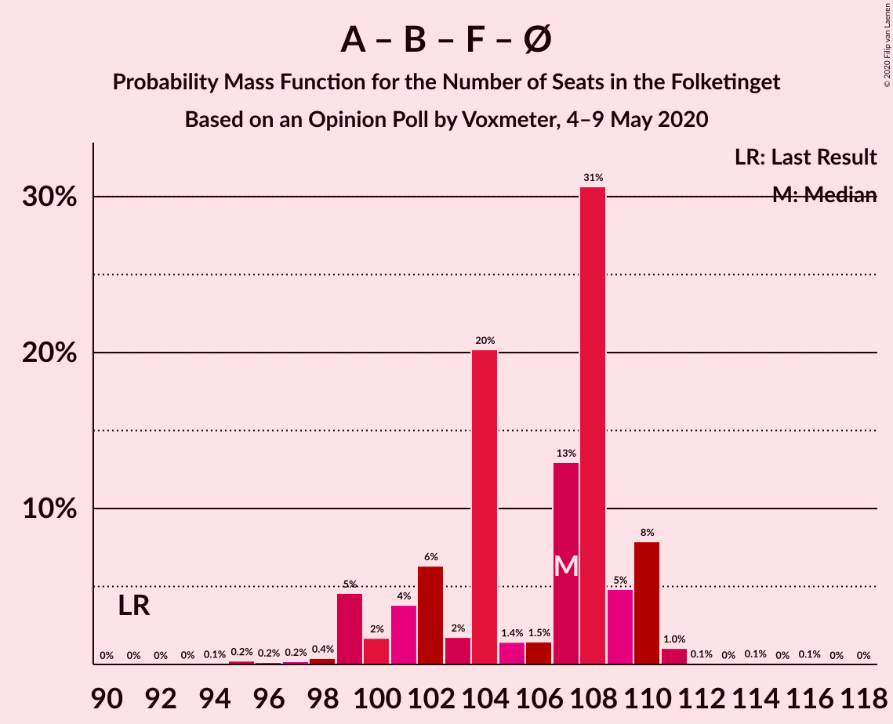
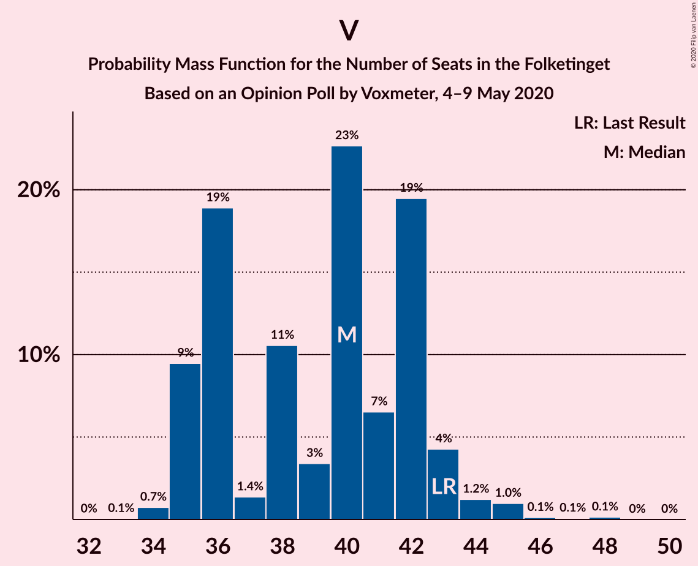

# Opinion Poll by Voxmeter, 4–9 May 2020

<a href="#voting-intentions">Voting Intentions</a> | <a href="#seats">Seats</a> | <a href="#coalitions">Coalitions</a> | <a href="#technical-information">Technical Information</a>

## Voting Intentions

### Confidence Intervals

| Party | Last Result | Poll Result | 80% Confidence Interval | 90% Confidence Interval | 95% Confidence Interval | 99% Confidence Interval |
|:-----:|:-----------:|:-----------:|:-----------------------:|:-----------------------:|:-----------------------:|:-----------------------:|
| Socialdemokraterne | 25.9% | 32.5% | 30.7–34.4% |30.2–34.9% |29.7–35.4% |28.9–36.3% |
| Venstre | 23.4% | 20.8% | 19.3–22.5% |18.8–23.0% |18.4–23.4% |17.7–24.2% |
| Radikale Venstre | 8.6% | 7.5% | 6.5–8.6% |6.2–9.0% |6.0–9.3% |5.6–9.8% |
| Socialistisk Folkeparti | 7.7% | 7.5% | 6.5–8.6% |6.2–9.0% |6.0–9.3% |5.6–9.8% |
| Enhedslisten–De Rød-Grønne | 6.9% | 7.0% | 6.1–8.1% |5.8–8.4% |5.6–8.7% |5.2–9.3% |
| Det Konservative Folkeparti | 6.6% | 6.4% | 5.5–7.5% |5.3–7.8% |5.1–8.1% |4.7–8.6% |
| Dansk Folkeparti | 8.7% | 5.9% | 5.1–7.0% |4.9–7.3% |4.7–7.6% |4.3–8.1% |
| Nye Borgerlige | 2.4% | 5.9% | 5.1–7.0% |4.9–7.3% |4.7–7.6% |4.3–8.1% |
| Liberal Alliance | 2.3% | 2.1% | 1.6–2.8% |1.5–3.0% |1.4–3.2% |1.2–3.6% |
| Stram Kurs | 1.8% | 2.0% | 1.6–2.7% |1.4–2.9% |1.3–3.1% |1.1–3.4% |
| Alternativet | 3.0% | 0.6% | 0.4–1.0% |0.3–1.1% |0.3–1.2% |0.2–1.5% |
| Klaus Riskær Pedersen | 0.8% | 0.5% | 0.3–0.9% |0.2–1.0% |0.2–1.1% |0.1–1.4% |

*Note:* The poll result column reflects the actual value used in the calculations. Published results may vary slightly, and in addition be rounded to fewer digits.

## Seats

### Confidence Intervals

| Party | Last Result | Median | 80% Confidence Interval | 90% Confidence Interval | 95% Confidence Interval | 99% Confidence Interval |
|:-----:|:-----------:|:------:|:-----------------------:|:-----------------------:|:-----------------------:|:-----------------------:|
| <a href="#socialdemokraterne">Socialdemokraterne</a> | 48 | 57 | 54–60 |54–63 |54–65 |51–67 |
| <a href="#venstre">Venstre</a> | 43 | 37 | 34–41 |34–41 |33–42 |32–45 |
| <a href="#radikale-venstre">Radikale Venstre</a> | 16 | 14 | 11–16 |11–16 |11–17 |10–19 |
| <a href="#socialistisk-folkeparti">Socialistisk Folkeparti</a> | 14 | 14 | 11–15 |11–16 |11–18 |10–18 |
| <a href="#enhedslisten–de-rød-grønne">Enhedslisten–De Rød-Grønne</a> | 13 | 13 | 11–15 |10–15 |9–16 |9–17 |
| <a href="#det-konservative-folkeparti">Det Konservative Folkeparti</a> | 12 | 13 | 10–13 |10–14 |9–14 |8–16 |
| <a href="#dansk-folkeparti">Dansk Folkeparti</a> | 16 | 10 | 9–14 |9–14 |8–14 |8–16 |
| <a href="#nye-borgerlige">Nye Borgerlige</a> | 4 | 11 | 9–13 |9–13 |9–13 |7–15 |
| <a href="#liberal-alliance">Liberal Alliance</a> | 4 | 4 | 0–6 |0–6 |0–7 |0–7 |
| <a href="#stram-kurs">Stram Kurs</a> | 0 | 0 | 0–5 |0–6 |0–7 |0–7 |
| <a href="#alternativet">Alternativet</a> | 5 | 0 | 0 |0 |0 |0 |
| <a href="#klaus-riskær-pedersen">Klaus Riskær Pedersen</a> | 0 | 0 | 0 |0 |0 |0 |

### Socialdemokraterne

*For a full overview of the results for this party, see the [Socialdemokraterne](party-socialdemokraterne.html) page.*

| Number of Seats | Probability | Accumulated | Special Marks |
|:---------------:|:-----------:|:-----------:|:-------------:|
| 48 | 0% | 100% | Last Result |
| 49 | 0% | 100% |  |
| 50 | 0.2% | 100% |  |
| 51 | 0.4% | 99.8% |  |
| 52 | 1.2% | 99.5% |  |
| 53 | 0.4% | 98% |  |
| 54 | 12% | 98% |  |
| 55 | 12% | 86% |  |
| 56 | 2% | 74% |  |
| 57 | 27% | 71% | Median |
| 58 | 25% | 45% |  |
| 59 | 4% | 20% |  |
| 60 | 7% | 16% |  |
| 61 | 2% | 10% |  |
| 62 | 0.9% | 8% |  |
| 63 | 3% | 7% |  |
| 64 | 0.5% | 4% |  |
| 65 | 2% | 3% |  |
| 66 | 0.2% | 1.1% |  |
| 67 | 0.7% | 0.9% |  |
| 68 | 0.2% | 0.2% |  |
| 69 | 0% | 0% |  |

### Venstre

*For a full overview of the results for this party, see the [Venstre](party-venstre.html) page.*

| Number of Seats | Probability | Accumulated | Special Marks |
|:---------------:|:-----------:|:-----------:|:-------------:|
| 31 | 0.3% | 100% |  |
| 32 | 0.3% | 99.6% |  |
| 33 | 2% | 99.3% |  |
| 34 | 11% | 97% |  |
| 35 | 14% | 86% |  |
| 36 | 10% | 73% |  |
| 37 | 16% | 63% | Median |
| 38 | 4% | 47% |  |
| 39 | 20% | 42% |  |
| 40 | 3% | 23% |  |
| 41 | 16% | 20% |  |
| 42 | 2% | 4% |  |
| 43 | 0.8% | 2% | Last Result |
| 44 | 1.1% | 2% |  |
| 45 | 0.4% | 0.5% |  |
| 46 | 0.1% | 0.1% |  |
| 47 | 0% | 0% |  |

### Radikale Venstre

*For a full overview of the results for this party, see the [Radikale Venstre](party-radikalevenstre.html) page.*

| Number of Seats | Probability | Accumulated | Special Marks |
|:---------------:|:-----------:|:-----------:|:-------------:|
| 9 | 0% | 100% |  |
| 10 | 2% | 99.9% |  |
| 11 | 10% | 98% |  |
| 12 | 9% | 88% |  |
| 13 | 27% | 79% |  |
| 14 | 14% | 52% | Median |
| 15 | 20% | 39% |  |
| 16 | 16% | 19% | Last Result |
| 17 | 2% | 3% |  |
| 18 | 1.0% | 2% |  |
| 19 | 0.5% | 0.6% |  |
| 20 | 0.1% | 0.1% |  |
| 21 | 0% | 0% |  |

### Socialistisk Folkeparti

*For a full overview of the results for this party, see the [Socialistisk Folkeparti](party-socialistiskfolkeparti.html) page.*

| Number of Seats | Probability | Accumulated | Special Marks |
|:---------------:|:-----------:|:-----------:|:-------------:|
| 9 | 0.1% | 100% |  |
| 10 | 2% | 99.9% |  |
| 11 | 11% | 98% |  |
| 12 | 10% | 87% |  |
| 13 | 21% | 77% |  |
| 14 | 39% | 57% | Last Result, Median |
| 15 | 8% | 18% |  |
| 16 | 6% | 10% |  |
| 17 | 0.9% | 4% |  |
| 18 | 3% | 3% |  |
| 19 | 0.1% | 0.2% |  |
| 20 | 0% | 0% |  |

### Enhedslisten–De Rød-Grønne

*For a full overview of the results for this party, see the [Enhedslisten–De Rød-Grønne](party-enhedslisten–derød-grønne.html) page.*

| Number of Seats | Probability | Accumulated | Special Marks |
|:---------------:|:-----------:|:-----------:|:-------------:|
| 8 | 0.1% | 100% |  |
| 9 | 3% | 99.9% |  |
| 10 | 3% | 97% |  |
| 11 | 7% | 94% |  |
| 12 | 24% | 87% |  |
| 13 | 29% | 62% | Last Result, Median |
| 14 | 18% | 34% |  |
| 15 | 12% | 16% |  |
| 16 | 3% | 4% |  |
| 17 | 0.6% | 0.7% |  |
| 18 | 0.1% | 0.1% |  |
| 19 | 0% | 0% |  |

### Det Konservative Folkeparti

*For a full overview of the results for this party, see the [Det Konservative Folkeparti](party-detkonservativefolkeparti.html) page.*

| Number of Seats | Probability | Accumulated | Special Marks |
|:---------------:|:-----------:|:-----------:|:-------------:|
| 7 | 0.1% | 100% |  |
| 8 | 1.1% | 99.9% |  |
| 9 | 3% | 98.8% |  |
| 10 | 13% | 96% |  |
| 11 | 25% | 83% |  |
| 12 | 7% | 58% | Last Result |
| 13 | 44% | 51% | Median |
| 14 | 6% | 7% |  |
| 15 | 0.5% | 2% |  |
| 16 | 1.1% | 1.1% |  |
| 17 | 0% | 0% |  |

### Dansk Folkeparti

*For a full overview of the results for this party, see the [Dansk Folkeparti](party-danskfolkeparti.html) page.*

| Number of Seats | Probability | Accumulated | Special Marks |
|:---------------:|:-----------:|:-----------:|:-------------:|
| 7 | 0.2% | 100% |  |
| 8 | 3% | 99.8% |  |
| 9 | 14% | 97% |  |
| 10 | 39% | 83% | Median |
| 11 | 14% | 44% |  |
| 12 | 6% | 31% |  |
| 13 | 11% | 24% |  |
| 14 | 12% | 13% |  |
| 15 | 0.3% | 2% |  |
| 16 | 1.3% | 1.4% | Last Result |
| 17 | 0% | 0% |  |

### Nye Borgerlige

*For a full overview of the results for this party, see the [Nye Borgerlige](party-nyeborgerlige.html) page.*

| Number of Seats | Probability | Accumulated | Special Marks |
|:---------------:|:-----------:|:-----------:|:-------------:|
| 4 | 0% | 100% | Last Result |
| 5 | 0% | 100% |  |
| 6 | 0% | 100% |  |
| 7 | 0.8% | 100% |  |
| 8 | 1.0% | 99.2% |  |
| 9 | 9% | 98% |  |
| 10 | 26% | 89% |  |
| 11 | 22% | 62% | Median |
| 12 | 10% | 41% |  |
| 13 | 29% | 31% |  |
| 14 | 0.9% | 2% |  |
| 15 | 1.1% | 1.2% |  |
| 16 | 0.1% | 0.1% |  |
| 17 | 0% | 0% |  |

### Liberal Alliance

*For a full overview of the results for this party, see the [Liberal Alliance](party-liberalalliance.html) page.*

| Number of Seats | Probability | Accumulated | Special Marks |
|:---------------:|:-----------:|:-----------:|:-------------:|
| 0 | 39% | 100% |  |
| 1 | 0% | 61% |  |
| 2 | 0% | 61% |  |
| 3 | 0% | 61% |  |
| 4 | 29% | 61% | Last Result, Median |
| 5 | 15% | 32% |  |
| 6 | 15% | 18% |  |
| 7 | 3% | 3% |  |
| 8 | 0% | 0% |  |

### Stram Kurs

*For a full overview of the results for this party, see the [Stram Kurs](party-stramkurs.html) page.*

| Number of Seats | Probability | Accumulated | Special Marks |
|:---------------:|:-----------:|:-----------:|:-------------:|
| 0 | 57% | 100% | Last Result, Median |
| 1 | 0% | 43% |  |
| 2 | 0% | 43% |  |
| 3 | 0% | 43% |  |
| 4 | 26% | 43% |  |
| 5 | 10% | 17% |  |
| 6 | 3% | 7% |  |
| 7 | 4% | 4% |  |
| 8 | 0% | 0% |  |

### Alternativet

*For a full overview of the results for this party, see the [Alternativet](party-alternativet.html) page.*

| Number of Seats | Probability | Accumulated | Special Marks |
|:---------------:|:-----------:|:-----------:|:-------------:|
| 0 | 100% | 100% | Median |
| 1 | 0% | 0% |  |
| 2 | 0% | 0% |  |
| 3 | 0% | 0% |  |
| 4 | 0% | 0% |  |
| 5 | 0% | 0% | Last Result |

### Klaus Riskær Pedersen

*For a full overview of the results for this party, see the [Klaus Riskær Pedersen](party-klausriskærpedersen.html) page.*

| Number of Seats | Probability | Accumulated | Special Marks |
|:---------------:|:-----------:|:-----------:|:-------------:|
| 0 | 100% | 100% | Last Result, Median |

## Coalitions

### Confidence Intervals

| Coalition | Last Result | Median | Majority? | 80% Confidence Interval | 90% Confidence Interval | 95% Confidence Interval | 99% Confidence Interval |
|:---------:|:-----------:|:------:|:---------:|:-----------------------:|:-----------------------:|:-----------------------:|:-----------------------:|
| Socialdemokraterne – Radikale Venstre – Socialistisk Folkeparti – Enhedslisten–De Rød-Grønne – Alternativet | 96 | 97 | 99.6% | 93–101 | 93–102 | 93–104 | 90–107 |
| Socialdemokraterne – Radikale Venstre – Socialistisk Folkeparti – Enhedslisten–De Rød-Grønne | 91 | 97 | 99.6% | 93–101 | 93–102 | 93–104 | 90–107 |
| Socialdemokraterne – Radikale Venstre – Socialistisk Folkeparti | 78 | 84 | 8% | 80–89 | 80–91 | 78–92 | 78–93 |
| Socialdemokraterne – Socialistisk Folkeparti – Enhedslisten–De Rød-Grønne – Alternativet | 80 | 83 | 3% | 81–87 | 81–88 | 79–90 | 77–93 |
| Socialdemokraterne – Socialistisk Folkeparti – Enhedslisten–De Rød-Grønne | 75 | 83 | 3% | 81–87 | 81–88 | 79–90 | 77–93 |
| Venstre – Det Konservative Folkeparti – Dansk Folkeparti – Nye Borgerlige – Liberal Alliance – Klaus Riskær Pedersen | 79 | 75 | 0% | 70–79 | 69–82 | 69–82 | 67–82 |
| Venstre – Det Konservative Folkeparti – Dansk Folkeparti – Nye Borgerlige – Liberal Alliance | 79 | 75 | 0% | 70–79 | 69–82 | 69–82 | 67–82 |
| Socialdemokraterne – Radikale Venstre | 64 | 71 | 0% | 68–76 | 68–77 | 66–79 | 64–80 |
| Venstre – Det Konservative Folkeparti – Dansk Folkeparti – Liberal Alliance | 75 | 64 | 0% | 60–69 | 58–69 | 58–69 | 55–71 |
| Venstre – Det Konservative Folkeparti – Liberal Alliance | 59 | 52 | 0% | 48–57 | 47–59 | 47–59 | 44–59 |
| Venstre – Det Konservative Folkeparti | 55 | 50 | 0% | 47–54 | 44–54 | 44–55 | 43–56 |
| Venstre | 43 | 37 | 0% | 34–41 | 34–41 | 33–42 | 32–45 |

### Socialdemokraterne – Radikale Venstre – Socialistisk Folkeparti – Enhedslisten–De Rød-Grønne – Alternativet

| Number of Seats | Probability | Accumulated | Special Marks |
|:---------------:|:-----------:|:-----------:|:-------------:|
| 89 | 0.3% | 100% |  |
| 90 | 0.3% | 99.6% | Majority |
| 91 | 1.2% | 99.4% |  |
| 92 | 0.6% | 98% |  |
| 93 | 9% | 98% |  |
| 94 | 6% | 88% |  |
| 95 | 2% | 82% |  |
| 96 | 17% | 81% | Last Result |
| 97 | 16% | 64% |  |
| 98 | 11% | 48% | Median |
| 99 | 4% | 36% |  |
| 100 | 10% | 33% |  |
| 101 | 13% | 22% |  |
| 102 | 5% | 9% |  |
| 103 | 1.3% | 4% |  |
| 104 | 1.4% | 3% |  |
| 105 | 0.8% | 2% |  |
| 106 | 0.3% | 1.0% |  |
| 107 | 0.6% | 0.6% |  |
| 108 | 0% | 0.1% |  |
| 109 | 0% | 0.1% |  |
| 110 | 0.1% | 0.1% |  |
| 111 | 0% | 0% |  |

### Socialdemokraterne – Radikale Venstre – Socialistisk Folkeparti – Enhedslisten–De Rød-Grønne

| Number of Seats | Probability | Accumulated | Special Marks |
|:---------------:|:-----------:|:-----------:|:-------------:|
| 89 | 0.3% | 100% |  |
| 90 | 0.3% | 99.6% | Majority |
| 91 | 1.2% | 99.4% | Last Result |
| 92 | 0.6% | 98% |  |
| 93 | 9% | 98% |  |
| 94 | 6% | 88% |  |
| 95 | 2% | 82% |  |
| 96 | 17% | 81% |  |
| 97 | 16% | 64% |  |
| 98 | 11% | 48% | Median |
| 99 | 4% | 36% |  |
| 100 | 10% | 33% |  |
| 101 | 13% | 22% |  |
| 102 | 5% | 9% |  |
| 103 | 1.3% | 4% |  |
| 104 | 1.4% | 3% |  |
| 105 | 0.8% | 2% |  |
| 106 | 0.3% | 1.0% |  |
| 107 | 0.6% | 0.6% |  |
| 108 | 0% | 0.1% |  |
| 109 | 0% | 0.1% |  |
| 110 | 0.1% | 0.1% |  |
| 111 | 0% | 0% |  |

### Socialdemokraterne – Radikale Venstre – Socialistisk Folkeparti

| Number of Seats | Probability | Accumulated | Special Marks |
|:---------------:|:-----------:|:-----------:|:-------------:|
| 75 | 0.1% | 100% |  |
| 76 | 0% | 99.9% |  |
| 77 | 0.3% | 99.9% |  |
| 78 | 3% | 99.6% | Last Result |
| 79 | 1.3% | 97% |  |
| 80 | 9% | 96% |  |
| 81 | 2% | 87% |  |
| 82 | 6% | 85% |  |
| 83 | 11% | 80% |  |
| 84 | 23% | 69% |  |
| 85 | 8% | 45% | Median |
| 86 | 10% | 37% |  |
| 87 | 4% | 27% |  |
| 88 | 13% | 24% |  |
| 89 | 3% | 11% |  |
| 90 | 2% | 8% | Majority |
| 91 | 3% | 6% |  |
| 92 | 1.5% | 3% |  |
| 93 | 0.8% | 1.2% |  |
| 94 | 0.3% | 0.4% |  |
| 95 | 0% | 0.1% |  |
| 96 | 0.1% | 0.1% |  |
| 97 | 0% | 0% |  |

### Socialdemokraterne – Socialistisk Folkeparti – Enhedslisten–De Rød-Grønne – Alternativet

| Number of Seats | Probability | Accumulated | Special Marks |
|:---------------:|:-----------:|:-----------:|:-------------:|
| 74 | 0.2% | 100% |  |
| 75 | 0% | 99.8% |  |
| 76 | 0.1% | 99.8% |  |
| 77 | 1.0% | 99.6% |  |
| 78 | 0.4% | 98.7% |  |
| 79 | 1.2% | 98% |  |
| 80 | 0.5% | 97% | Last Result |
| 81 | 8% | 97% |  |
| 82 | 24% | 88% |  |
| 83 | 16% | 64% |  |
| 84 | 8% | 48% | Median |
| 85 | 11% | 40% |  |
| 86 | 17% | 28% |  |
| 87 | 4% | 12% |  |
| 88 | 3% | 8% |  |
| 89 | 1.2% | 4% |  |
| 90 | 0.7% | 3% | Majority |
| 91 | 1.2% | 2% |  |
| 92 | 0.2% | 1.1% |  |
| 93 | 0.8% | 0.9% |  |
| 94 | 0.1% | 0.1% |  |
| 95 | 0% | 0.1% |  |
| 96 | 0% | 0.1% |  |
| 97 | 0.1% | 0.1% |  |
| 98 | 0% | 0% |  |

### Socialdemokraterne – Socialistisk Folkeparti – Enhedslisten–De Rød-Grønne

| Number of Seats | Probability | Accumulated | Special Marks |
|:---------------:|:-----------:|:-----------:|:-------------:|
| 74 | 0.2% | 100% |  |
| 75 | 0% | 99.8% | Last Result |
| 76 | 0.1% | 99.8% |  |
| 77 | 1.0% | 99.6% |  |
| 78 | 0.4% | 98.7% |  |
| 79 | 1.2% | 98% |  |
| 80 | 0.5% | 97% |  |
| 81 | 8% | 97% |  |
| 82 | 24% | 88% |  |
| 83 | 16% | 64% |  |
| 84 | 8% | 48% | Median |
| 85 | 11% | 40% |  |
| 86 | 17% | 28% |  |
| 87 | 4% | 12% |  |
| 88 | 3% | 8% |  |
| 89 | 1.2% | 4% |  |
| 90 | 0.7% | 3% | Majority |
| 91 | 1.2% | 2% |  |
| 92 | 0.2% | 1.1% |  |
| 93 | 0.8% | 0.9% |  |
| 94 | 0.1% | 0.1% |  |
| 95 | 0% | 0.1% |  |
| 96 | 0% | 0.1% |  |
| 97 | 0.1% | 0.1% |  |
| 98 | 0% | 0% |  |

### Venstre – Det Konservative Folkeparti – Dansk Folkeparti – Nye Borgerlige – Liberal Alliance – Klaus Riskær Pedersen

| Number of Seats | Probability | Accumulated | Special Marks |
|:---------------:|:-----------:|:-----------:|:-------------:|
| 64 | 0.1% | 100% |  |
| 65 | 0.1% | 99.9% |  |
| 66 | 0.3% | 99.8% |  |
| 67 | 0.5% | 99.5% |  |
| 68 | 0.9% | 99.0% |  |
| 69 | 6% | 98% |  |
| 70 | 4% | 93% |  |
| 71 | 4% | 88% |  |
| 72 | 9% | 84% |  |
| 73 | 13% | 75% |  |
| 74 | 12% | 63% |  |
| 75 | 20% | 51% | Median |
| 76 | 3% | 31% |  |
| 77 | 5% | 28% |  |
| 78 | 11% | 23% |  |
| 79 | 2% | 12% | Last Result |
| 80 | 0.1% | 9% |  |
| 81 | 0.3% | 9% |  |
| 82 | 8% | 9% |  |
| 83 | 0% | 0.3% |  |
| 84 | 0.1% | 0.3% |  |
| 85 | 0.1% | 0.2% |  |
| 86 | 0.1% | 0.1% |  |
| 87 | 0% | 0% |  |

### Venstre – Det Konservative Folkeparti – Dansk Folkeparti – Nye Borgerlige – Liberal Alliance

| Number of Seats | Probability | Accumulated | Special Marks |
|:---------------:|:-----------:|:-----------:|:-------------:|
| 64 | 0.1% | 100% |  |
| 65 | 0.1% | 99.9% |  |
| 66 | 0.3% | 99.8% |  |
| 67 | 0.5% | 99.5% |  |
| 68 | 0.9% | 99.0% |  |
| 69 | 6% | 98% |  |
| 70 | 4% | 93% |  |
| 71 | 4% | 88% |  |
| 72 | 9% | 84% |  |
| 73 | 13% | 75% |  |
| 74 | 12% | 63% |  |
| 75 | 20% | 51% | Median |
| 76 | 3% | 31% |  |
| 77 | 5% | 28% |  |
| 78 | 11% | 23% |  |
| 79 | 2% | 12% | Last Result |
| 80 | 0.1% | 9% |  |
| 81 | 0.3% | 9% |  |
| 82 | 8% | 9% |  |
| 83 | 0% | 0.3% |  |
| 84 | 0.1% | 0.3% |  |
| 85 | 0.1% | 0.2% |  |
| 86 | 0.1% | 0.1% |  |
| 87 | 0% | 0% |  |

### Socialdemokraterne – Radikale Venstre

| Number of Seats | Probability | Accumulated | Special Marks |
|:---------------:|:-----------:|:-----------:|:-------------:|
| 64 | 1.4% | 100% | Last Result |
| 65 | 0.3% | 98.6% |  |
| 66 | 3% | 98% |  |
| 67 | 0.3% | 95% |  |
| 68 | 10% | 95% |  |
| 69 | 10% | 85% |  |
| 70 | 23% | 75% |  |
| 71 | 16% | 51% | Median |
| 72 | 9% | 36% |  |
| 73 | 4% | 26% |  |
| 74 | 8% | 22% |  |
| 75 | 2% | 14% |  |
| 76 | 6% | 12% |  |
| 77 | 1.0% | 5% |  |
| 78 | 0.6% | 4% |  |
| 79 | 1.2% | 4% |  |
| 80 | 2% | 2% |  |
| 81 | 0.1% | 0.2% |  |
| 82 | 0% | 0.1% |  |
| 83 | 0% | 0% |  |

### Venstre – Det Konservative Folkeparti – Dansk Folkeparti – Liberal Alliance

| Number of Seats | Probability | Accumulated | Special Marks |
|:---------------:|:-----------:|:-----------:|:-------------:|
| 53 | 0.2% | 100% |  |
| 54 | 0.1% | 99.8% |  |
| 55 | 0.5% | 99.7% |  |
| 56 | 0.5% | 99.1% |  |
| 57 | 0.3% | 98.7% |  |
| 58 | 6% | 98% |  |
| 59 | 2% | 92% |  |
| 60 | 11% | 90% |  |
| 61 | 6% | 79% |  |
| 62 | 8% | 73% |  |
| 63 | 3% | 65% |  |
| 64 | 25% | 62% | Median |
| 65 | 22% | 37% |  |
| 66 | 2% | 15% |  |
| 67 | 2% | 14% |  |
| 68 | 0.7% | 12% |  |
| 69 | 9% | 11% |  |
| 70 | 1.0% | 2% |  |
| 71 | 0.2% | 0.7% |  |
| 72 | 0.2% | 0.4% |  |
| 73 | 0% | 0.2% |  |
| 74 | 0.2% | 0.2% |  |
| 75 | 0% | 0% | Last Result |

### Venstre – Det Konservative Folkeparti – Liberal Alliance

| Number of Seats | Probability | Accumulated | Special Marks |
|:---------------:|:-----------:|:-----------:|:-------------:|
| 42 | 0.1% | 100% |  |
| 43 | 0.2% | 99.9% |  |
| 44 | 0.7% | 99.7% |  |
| 45 | 0.2% | 99.0% |  |
| 46 | 0.4% | 98.8% |  |
| 47 | 5% | 98% |  |
| 48 | 4% | 93% |  |
| 49 | 7% | 90% |  |
| 50 | 17% | 83% |  |
| 51 | 8% | 66% |  |
| 52 | 10% | 58% |  |
| 53 | 6% | 48% |  |
| 54 | 17% | 42% | Median |
| 55 | 4% | 25% |  |
| 56 | 9% | 21% |  |
| 57 | 1.4% | 11% |  |
| 58 | 0.2% | 10% |  |
| 59 | 9% | 10% | Last Result |
| 60 | 0.1% | 0.5% |  |
| 61 | 0.1% | 0.3% |  |
| 62 | 0% | 0.2% |  |
| 63 | 0.2% | 0.2% |  |
| 64 | 0% | 0% |  |

### Venstre – Det Konservative Folkeparti

| Number of Seats | Probability | Accumulated | Special Marks |
|:---------------:|:-----------:|:-----------:|:-------------:|
| 42 | 0.1% | 100% |  |
| 43 | 0.5% | 99.8% |  |
| 44 | 5% | 99.4% |  |
| 45 | 3% | 94% |  |
| 46 | 1.4% | 92% |  |
| 47 | 12% | 90% |  |
| 48 | 17% | 78% |  |
| 49 | 11% | 61% |  |
| 50 | 18% | 50% | Median |
| 51 | 4% | 32% |  |
| 52 | 16% | 29% |  |
| 53 | 0.7% | 13% |  |
| 54 | 9% | 12% |  |
| 55 | 2% | 3% | Last Result |
| 56 | 0.4% | 0.8% |  |
| 57 | 0.2% | 0.4% |  |
| 58 | 0% | 0.2% |  |
| 59 | 0.2% | 0.2% |  |
| 60 | 0% | 0% |  |

### Venstre

| Number of Seats | Probability | Accumulated | Special Marks |
|:---------------:|:-----------:|:-----------:|:-------------:|
| 31 | 0.3% | 100% |  |
| 32 | 0.3% | 99.6% |  |
| 33 | 2% | 99.3% |  |
| 34 | 11% | 97% |  |
| 35 | 14% | 86% |  |
| 36 | 10% | 73% |  |
| 37 | 16% | 63% | Median |
| 38 | 4% | 47% |  |
| 39 | 20% | 42% |  |
| 40 | 3% | 23% |  |
| 41 | 16% | 20% |  |
| 42 | 2% | 4% |  |
| 43 | 0.8% | 2% | Last Result |
| 44 | 1.1% | 2% |  |
| 45 | 0.4% | 0.5% |  |
| 46 | 0.1% | 0.1% |  |
| 47 | 0% | 0% |  |

## Technical Information

### Opinion Poll

+ **Polling firm:** Voxmeter
+ **Commissioner(s):** —
+ **Fieldwork period:** 4–9 May 2020

### Calculations

+ **Sample size:** 1043
+ **Simulations done:** 524,288
+ **Error estimate:** 2.58%

