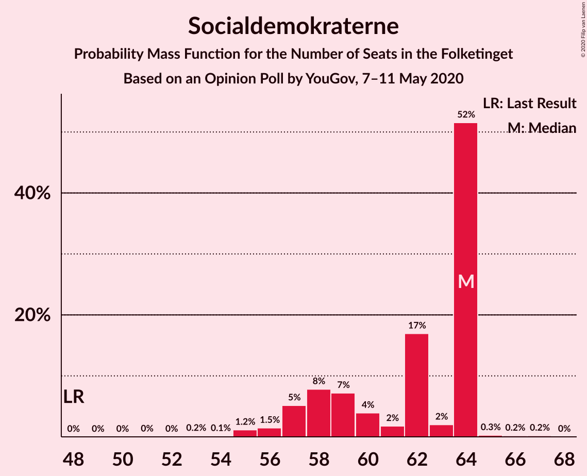
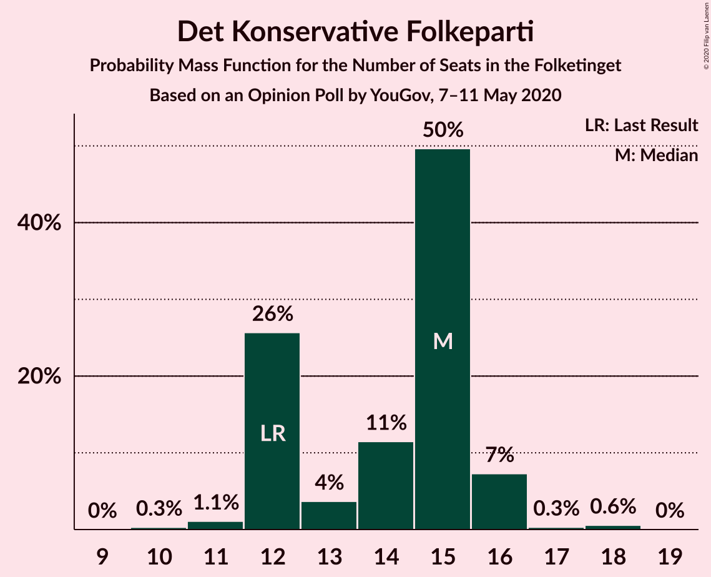
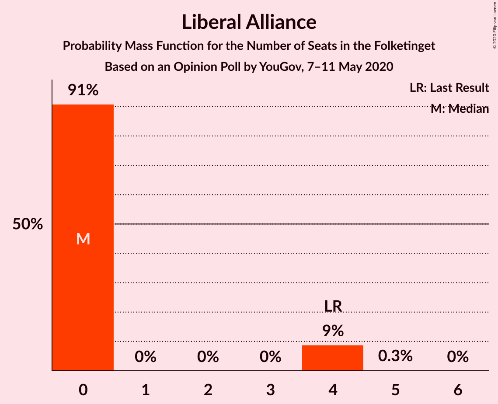
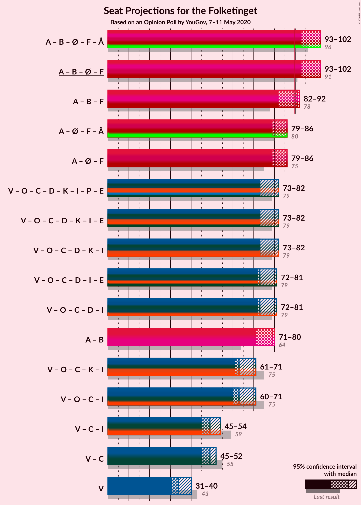

# Opinion Poll by YouGov, 7–11 May 2020

<a href="#voting-intentions">Voting Intentions</a> | <a href="#seats">Seats</a> | <a href="#coalitions">Coalitions</a> | <a href="#technical-information">Technical Information</a>

## Voting Intentions

### Confidence Intervals

| Party | Last Result | Poll Result | 80% Confidence Interval | 90% Confidence Interval | 95% Confidence Interval | 99% Confidence Interval |
|:-----:|:-----------:|:-----------:|:-----------------------:|:-----------------------:|:-----------------------:|:-----------------------:|
| Socialdemokraterne | 25.9% | 32.8% | 31.1–34.5% |30.6–35.0% |30.2–35.4% |29.4–36.3% |
| Venstre | 23.4% | 19.3% | 18.0–20.8% |17.6–21.3% |17.2–21.6% |16.6–22.4% |
| Dansk Folkeparti | 8.7% | 8.6% | 7.6–9.7% |7.3–10.0% |7.1–10.2% |6.7–10.8% |
| Radikale Venstre | 8.6% | 7.8% | 6.9–8.9% |6.7–9.2% |6.5–9.5% |6.1–10.0% |
| Det Konservative Folkeparti | 6.6% | 7.7% | 6.8–8.7% |6.5–9.0% |6.3–9.3% |5.9–9.8% |
| Enhedslisten–De Rød-Grønne | 6.9% | 6.6% | 5.7–7.5% |5.5–7.8% |5.3–8.1% |4.9–8.6% |
| Socialistisk Folkeparti | 7.7% | 6.2% | 5.4–7.2% |5.2–7.5% |5.0–7.7% |4.7–8.2% |
| Nye Borgerlige | 2.4% | 5.8% | 5.0–6.7% |4.8–7.0% |4.6–7.2% |4.3–7.7% |
| Liberal Alliance | 2.3% | 1.4% | 1.0–1.9% |0.9–2.0% |0.9–2.2% |0.7–2.5% |
| Kristendemokraterne | 1.7% | 1.4% | 1.0–1.9% |0.9–2.0% |0.9–2.2% |0.7–2.5% |
| Alternativet | 3.0% | 1.2% | 0.9–1.7% |0.8–1.8% |0.7–2.0% |0.6–2.2% |
| Stram Kurs | 1.8% | 1.2% | 0.9–1.7% |0.8–1.8% |0.7–2.0% |0.6–2.2% |

*Note:* The poll result column reflects the actual value used in the calculations. Published results may vary slightly, and in addition be rounded to fewer digits.

## Seats

### Confidence Intervals

| Party | Last Result | Median | 80% Confidence Interval | 90% Confidence Interval | 95% Confidence Interval | 99% Confidence Interval |
|:-----:|:-----------:|:------:|:-----------------------:|:-----------------------:|:-----------------------:|:-----------------------:|
| <a href="#socialdemokraterne">Socialdemokraterne</a> | 48 | 64 | 58–64 |57–64 |56–64 |55–65 |
| <a href="#venstre">Venstre</a> | 43 | 34 | 33–36 |31–37 |31–40 |30–40 |
| <a href="#dansk-folkeparti">Dansk Folkeparti</a> | 16 | 14 | 14–17 |14–17 |14–18 |12–19 |
| <a href="#radikale-venstre">Radikale Venstre</a> | 16 | 16 | 14–16 |13–17 |12–17 |11–18 |
| <a href="#det-konservative-folkeparti">Det Konservative Folkeparti</a> | 12 | 15 | 12–15 |12–16 |12–16 |11–18 |
| <a href="#enhedslisten–de-rød-grønne">Enhedslisten–De Rød-Grønne</a> | 13 | 10 | 10–13 |10–14 |10–14 |9–15 |
| <a href="#socialistisk-folkeparti">Socialistisk Folkeparti</a> | 14 | 12 | 11–13 |11–14 |10–15 |9–15 |
| <a href="#nye-borgerlige">Nye Borgerlige</a> | 4 | 10 | 10–12 |10–12 |9–13 |8–14 |
| <a href="#liberal-alliance">Liberal Alliance</a> | 4 | 0 | 0 |0–4 |0–4 |0–4 |
| <a href="#kristendemokraterne">Kristendemokraterne</a> | 0 | 0 | 0 |0 |0 |0–4 |
| <a href="#alternativet">Alternativet</a> | 5 | 0 | 0 |0 |0 |0–4 |
| <a href="#stram-kurs">Stram Kurs</a> | 0 | 0 | 0 |0 |0 |0–4 |

### Socialdemokraterne

*For a full overview of the results for this party, see the [Socialdemokraterne](party-socialdemokraterne.html) page.*

| Number of Seats | Probability | Accumulated | Special Marks |
|:---------------:|:-----------:|:-----------:|:-------------:|
| 48 | 0% | 100% | Last Result |
| 49 | 0% | 100% |  |
| 50 | 0% | 100% |  |
| 51 | 0% | 100% |  |
| 52 | 0% | 99.9% |  |
| 53 | 0.2% | 99.9% |  |
| 54 | 0.1% | 99.8% |  |
| 55 | 1.2% | 99.6% |  |
| 56 | 1.5% | 98% |  |
| 57 | 5% | 97% |  |
| 58 | 8% | 92% |  |
| 59 | 7% | 84% |  |
| 60 | 4% | 77% |  |
| 61 | 2% | 73% |  |
| 62 | 17% | 71% |  |
| 63 | 2% | 54% |  |
| 64 | 52% | 52% | Median |
| 65 | 0.3% | 0.7% |  |
| 66 | 0.2% | 0.4% |  |
| 67 | 0.2% | 0.2% |  |
| 68 | 0% | 0% |  |

### Venstre

*For a full overview of the results for this party, see the [Venstre](party-venstre.html) page.*

| Number of Seats | Probability | Accumulated | Special Marks |
|:---------------:|:-----------:|:-----------:|:-------------:|
| 28 | 0.1% | 100% |  |
| 29 | 0% | 99.9% |  |
| 30 | 0.6% | 99.8% |  |
| 31 | 8% | 99.3% |  |
| 32 | 0.5% | 92% |  |
| 33 | 19% | 91% |  |
| 34 | 50% | 72% | Median |
| 35 | 10% | 22% |  |
| 36 | 5% | 12% |  |
| 37 | 2% | 7% |  |
| 38 | 0.7% | 5% |  |
| 39 | 1.4% | 4% |  |
| 40 | 3% | 3% |  |
| 41 | 0.1% | 0.1% |  |
| 42 | 0.1% | 0.1% |  |
| 43 | 0% | 0% | Last Result |

### Dansk Folkeparti

*For a full overview of the results for this party, see the [Dansk Folkeparti](party-danskfolkeparti.html) page.*

| Number of Seats | Probability | Accumulated | Special Marks |
|:---------------:|:-----------:|:-----------:|:-------------:|
| 12 | 0.6% | 100% |  |
| 13 | 0.4% | 99.3% |  |
| 14 | 56% | 98.9% | Median |
| 15 | 4% | 43% |  |
| 16 | 11% | 39% | Last Result |
| 17 | 25% | 28% |  |
| 18 | 0.9% | 3% |  |
| 19 | 2% | 2% |  |
| 20 | 0.1% | 0.2% |  |
| 21 | 0.1% | 0.1% |  |
| 22 | 0% | 0% |  |

### Radikale Venstre

*For a full overview of the results for this party, see the [Radikale Venstre](party-radikalevenstre.html) page.*

| Number of Seats | Probability | Accumulated | Special Marks |
|:---------------:|:-----------:|:-----------:|:-------------:|
| 10 | 0.2% | 100% |  |
| 11 | 0.7% | 99.8% |  |
| 12 | 2% | 99.1% |  |
| 13 | 6% | 97% |  |
| 14 | 6% | 91% |  |
| 15 | 7% | 85% |  |
| 16 | 71% | 78% | Last Result, Median |
| 17 | 6% | 7% |  |
| 18 | 0.7% | 0.9% |  |
| 19 | 0.2% | 0.2% |  |
| 20 | 0% | 0% |  |

### Det Konservative Folkeparti

*For a full overview of the results for this party, see the [Det Konservative Folkeparti](party-detkonservativefolkeparti.html) page.*

| Number of Seats | Probability | Accumulated | Special Marks |
|:---------------:|:-----------:|:-----------:|:-------------:|
| 10 | 0.3% | 100% |  |
| 11 | 1.1% | 99.7% |  |
| 12 | 26% | 98.6% | Last Result |
| 13 | 4% | 73% |  |
| 14 | 11% | 69% |  |
| 15 | 50% | 58% | Median |
| 16 | 7% | 8% |  |
| 17 | 0.3% | 0.9% |  |
| 18 | 0.6% | 0.6% |  |
| 19 | 0% | 0% |  |

### Enhedslisten–De Rød-Grønne

*For a full overview of the results for this party, see the [Enhedslisten–De Rød-Grønne](party-enhedslisten–derød-grønne.html) page.*

| Number of Seats | Probability | Accumulated | Special Marks |
|:---------------:|:-----------:|:-----------:|:-------------:|
| 9 | 1.3% | 100% |  |
| 10 | 52% | 98.7% | Median |
| 11 | 20% | 47% |  |
| 12 | 14% | 27% |  |
| 13 | 7% | 13% | Last Result |
| 14 | 5% | 6% |  |
| 15 | 0.4% | 0.8% |  |
| 16 | 0.4% | 0.4% |  |
| 17 | 0% | 0% |  |

### Socialistisk Folkeparti

*For a full overview of the results for this party, see the [Socialistisk Folkeparti](party-socialistiskfolkeparti.html) page.*

| Number of Seats | Probability | Accumulated | Special Marks |
|:---------------:|:-----------:|:-----------:|:-------------:|
| 8 | 0.1% | 100% |  |
| 9 | 1.1% | 99.9% |  |
| 10 | 3% | 98.8% |  |
| 11 | 11% | 95% |  |
| 12 | 59% | 84% | Median |
| 13 | 20% | 26% |  |
| 14 | 2% | 6% | Last Result |
| 15 | 3% | 4% |  |
| 16 | 0.1% | 0.1% |  |
| 17 | 0% | 0% |  |

### Nye Borgerlige

*For a full overview of the results for this party, see the [Nye Borgerlige](party-nyeborgerlige.html) page.*

| Number of Seats | Probability | Accumulated | Special Marks |
|:---------------:|:-----------:|:-----------:|:-------------:|
| 4 | 0% | 100% | Last Result |
| 5 | 0% | 100% |  |
| 6 | 0% | 100% |  |
| 7 | 0.1% | 100% |  |
| 8 | 0.6% | 99.9% |  |
| 9 | 3% | 99.4% |  |
| 10 | 60% | 96% | Median |
| 11 | 23% | 36% |  |
| 12 | 9% | 13% |  |
| 13 | 2% | 4% |  |
| 14 | 2% | 2% |  |
| 15 | 0% | 0% |  |

### Liberal Alliance

*For a full overview of the results for this party, see the [Liberal Alliance](party-liberalalliance.html) page.*

| Number of Seats | Probability | Accumulated | Special Marks |
|:---------------:|:-----------:|:-----------:|:-------------:|
| 0 | 91% | 100% | Median |
| 1 | 0% | 9% |  |
| 2 | 0% | 9% |  |
| 3 | 0% | 9% |  |
| 4 | 9% | 9% | Last Result |
| 5 | 0.3% | 0.3% |  |
| 6 | 0% | 0% |  |

### Kristendemokraterne

*For a full overview of the results for this party, see the [Kristendemokraterne](party-kristendemokraterne.html) page.*

| Number of Seats | Probability | Accumulated | Special Marks |
|:---------------:|:-----------:|:-----------:|:-------------:|
| 0 | 98% | 100% | Last Result, Median |
| 1 | 0% | 2% |  |
| 2 | 0% | 2% |  |
| 3 | 0% | 2% |  |
| 4 | 2% | 2% |  |
| 5 | 0.3% | 0.3% |  |
| 6 | 0% | 0% |  |

### Alternativet

*For a full overview of the results for this party, see the [Alternativet](party-alternativet.html) page.*

| Number of Seats | Probability | Accumulated | Special Marks |
|:---------------:|:-----------:|:-----------:|:-------------:|
| 0 | 98.8% | 100% | Median |
| 1 | 0% | 1.2% |  |
| 2 | 0% | 1.2% |  |
| 3 | 0% | 1.2% |  |
| 4 | 1.0% | 1.2% |  |
| 5 | 0.1% | 0.1% | Last Result |
| 6 | 0% | 0% |  |

### Stram Kurs

*For a full overview of the results for this party, see the [Stram Kurs](party-stramkurs.html) page.*

| Number of Seats | Probability | Accumulated | Special Marks |
|:---------------:|:-----------:|:-----------:|:-------------:|
| 0 | 98% | 100% | Last Result, Median |
| 1 | 0% | 2% |  |
| 2 | 0% | 2% |  |
| 3 | 0% | 2% |  |
| 4 | 1.4% | 2% |  |
| 5 | 0.4% | 0.4% |  |
| 6 | 0% | 0% |  |

## Coalitions

### Confidence Intervals

| Coalition | Last Result | Median | Majority? | 80% Confidence Interval | 90% Confidence Interval | 95% Confidence Interval | 99% Confidence Interval |
|:---------:|:-----------:|:------:|:---------:|:-----------------------:|:-----------------------:|:-----------------------:|:-----------------------:|
| Socialdemokraterne – Radikale Venstre – Enhedslisten–De Rød-Grønne – Socialistisk Folkeparti – Alternativet | 96 | 102 | 100% | 97–102 | 96–102 | 93–102 | 92–104 |
| Socialdemokraterne – Radikale Venstre – Enhedslisten–De Rød-Grønne – Socialistisk Folkeparti | 91 | 102 | 100% | 97–102 | 95–102 | 93–102 | 92–103 |
| Socialdemokraterne – Radikale Venstre – Socialistisk Folkeparti | 78 | 91 | 67% | 85–92 | 84–92 | 82–92 | 80–92 |
| Socialdemokraterne – Enhedslisten–De Rød-Grønne – Socialistisk Folkeparti – Alternativet | 80 | 86 | 0.3% | 82–86 | 81–86 | 79–86 | 77–89 |
| Socialdemokraterne – Enhedslisten–De Rød-Grønne – Socialistisk Folkeparti | 75 | 86 | 0.1% | 82–86 | 81–86 | 79–86 | 77–88 |
| Venstre – Dansk Folkeparti – Det Konservative Folkeparti – Nye Borgerlige – Kristendemokraterne – Liberal Alliance | 79 | 73 | 0% | 73–77 | 73–79 | 73–82 | 71–83 |
| Venstre – Dansk Folkeparti – Det Konservative Folkeparti – Nye Borgerlige – Liberal Alliance | 79 | 73 | 0% | 73–77 | 73–78 | 72–81 | 71–82 |
| Socialdemokraterne – Radikale Venstre | 64 | 79 | 0% | 73–80 | 72–80 | 71–80 | 69–80 |
| Venstre – Dansk Folkeparti – Det Konservative Folkeparti – Kristendemokraterne – Liberal Alliance | 75 | 63 | 0% | 62–67 | 62–68 | 61–71 | 60–72 |
| Venstre – Dansk Folkeparti – Det Konservative Folkeparti – Liberal Alliance | 75 | 63 | 0% | 62–67 | 62–68 | 60–71 | 60–72 |
| Venstre – Det Konservative Folkeparti – Liberal Alliance | 59 | 49 | 0% | 45–51 | 45–52 | 45–54 | 44–55 |
| Venstre – Det Konservative Folkeparti | 55 | 49 | 0% | 45–50 | 45–52 | 45–52 | 44–55 |
| Venstre | 43 | 34 | 0% | 33–36 | 31–37 | 31–40 | 30–40 |

### Socialdemokraterne – Radikale Venstre – Enhedslisten–De Rød-Grønne – Socialistisk Folkeparti – Alternativet

| Number of Seats | Probability | Accumulated | Special Marks |
|:---------------:|:-----------:|:-----------:|:-------------:|
| 90 | 0.2% | 100% | Majority |
| 91 | 0% | 99.8% |  |
| 92 | 0.3% | 99.8% |  |
| 93 | 2% | 99.4% |  |
| 94 | 1.1% | 97% |  |
| 95 | 1.0% | 96% |  |
| 96 | 1.3% | 95% | Last Result |
| 97 | 4% | 94% |  |
| 98 | 8% | 90% |  |
| 99 | 9% | 82% |  |
| 100 | 0.8% | 73% |  |
| 101 | 6% | 73% |  |
| 102 | 65% | 67% | Median |
| 103 | 1.2% | 2% |  |
| 104 | 0.4% | 0.8% |  |
| 105 | 0.3% | 0.4% |  |
| 106 | 0% | 0% |  |

### Socialdemokraterne – Radikale Venstre – Enhedslisten–De Rød-Grønne – Socialistisk Folkeparti

| Number of Seats | Probability | Accumulated | Special Marks |
|:---------------:|:-----------:|:-----------:|:-------------:|
| 90 | 0.2% | 100% | Majority |
| 91 | 0.1% | 99.8% | Last Result |
| 92 | 0.3% | 99.7% |  |
| 93 | 2% | 99.3% |  |
| 94 | 1.1% | 97% |  |
| 95 | 1.0% | 96% |  |
| 96 | 1.4% | 95% |  |
| 97 | 4% | 94% |  |
| 98 | 8% | 89% |  |
| 99 | 9% | 82% |  |
| 100 | 0.8% | 73% |  |
| 101 | 6% | 72% |  |
| 102 | 65% | 66% | Median |
| 103 | 0.7% | 1.2% |  |
| 104 | 0.4% | 0.5% |  |
| 105 | 0.1% | 0.1% |  |
| 106 | 0% | 0% |  |

### Socialdemokraterne – Radikale Venstre – Socialistisk Folkeparti

| Number of Seats | Probability | Accumulated | Special Marks |
|:---------------:|:-----------:|:-----------:|:-------------:|
| 77 | 0% | 100% |  |
| 78 | 0.2% | 99.9% | Last Result |
| 79 | 0.1% | 99.8% |  |
| 80 | 0.3% | 99.7% |  |
| 81 | 1.0% | 99.4% |  |
| 82 | 2% | 98% |  |
| 83 | 1.1% | 96% |  |
| 84 | 4% | 95% |  |
| 85 | 6% | 91% |  |
| 86 | 7% | 85% |  |
| 87 | 2% | 78% |  |
| 88 | 3% | 76% |  |
| 89 | 6% | 73% |  |
| 90 | 1.5% | 67% | Majority |
| 91 | 17% | 65% |  |
| 92 | 48% | 48% | Median |
| 93 | 0% | 0.4% |  |
| 94 | 0.3% | 0.3% |  |
| 95 | 0% | 0% |  |

### Socialdemokraterne – Enhedslisten–De Rød-Grønne – Socialistisk Folkeparti – Alternativet

| Number of Seats | Probability | Accumulated | Special Marks |
|:---------------:|:-----------:|:-----------:|:-------------:|
| 75 | 0.1% | 100% |  |
| 76 | 0.3% | 99.9% |  |
| 77 | 0.2% | 99.6% |  |
| 78 | 0.4% | 99.4% |  |
| 79 | 2% | 99.0% |  |
| 80 | 2% | 97% | Last Result |
| 81 | 0.7% | 96% |  |
| 82 | 10% | 95% |  |
| 83 | 2% | 85% |  |
| 84 | 4% | 83% |  |
| 85 | 5% | 79% |  |
| 86 | 71% | 74% | Median |
| 87 | 1.3% | 2% |  |
| 88 | 0.3% | 1.0% |  |
| 89 | 0.3% | 0.6% |  |
| 90 | 0% | 0.3% | Majority |
| 91 | 0% | 0.3% |  |
| 92 | 0.3% | 0.3% |  |
| 93 | 0% | 0% |  |

### Socialdemokraterne – Enhedslisten–De Rød-Grønne – Socialistisk Folkeparti

| Number of Seats | Probability | Accumulated | Special Marks |
|:---------------:|:-----------:|:-----------:|:-------------:|
| 75 | 0.1% | 100% | Last Result |
| 76 | 0.3% | 99.9% |  |
| 77 | 0.2% | 99.6% |  |
| 78 | 0.5% | 99.4% |  |
| 79 | 2% | 98.9% |  |
| 80 | 2% | 97% |  |
| 81 | 0.7% | 95% |  |
| 82 | 11% | 95% |  |
| 83 | 2% | 84% |  |
| 84 | 4% | 82% |  |
| 85 | 5% | 78% |  |
| 86 | 71% | 73% | Median |
| 87 | 1.2% | 2% |  |
| 88 | 0.5% | 0.8% |  |
| 89 | 0.2% | 0.3% |  |
| 90 | 0% | 0.1% | Majority |
| 91 | 0% | 0.1% |  |
| 92 | 0% | 0% |  |

### Venstre – Dansk Folkeparti – Det Konservative Folkeparti – Nye Borgerlige – Kristendemokraterne – Liberal Alliance

| Number of Seats | Probability | Accumulated | Special Marks |
|:---------------:|:-----------:|:-----------:|:-------------:|
| 70 | 0.3% | 100% |  |
| 71 | 0.6% | 99.6% |  |
| 72 | 2% | 99.0% |  |
| 73 | 65% | 98% | Median |
| 74 | 7% | 33% |  |
| 75 | 0.7% | 26% |  |
| 76 | 9% | 25% |  |
| 77 | 7% | 16% |  |
| 78 | 4% | 9% |  |
| 79 | 1.1% | 6% | Last Result |
| 80 | 0.6% | 4% |  |
| 81 | 1.0% | 4% |  |
| 82 | 2% | 3% |  |
| 83 | 0.3% | 0.5% |  |
| 84 | 0% | 0.2% |  |
| 85 | 0.1% | 0.2% |  |
| 86 | 0% | 0% |  |

### Venstre – Dansk Folkeparti – Det Konservative Folkeparti – Nye Borgerlige – Liberal Alliance

| Number of Seats | Probability | Accumulated | Special Marks |
|:---------------:|:-----------:|:-----------:|:-------------:|
| 68 | 0% | 100% |  |
| 69 | 0% | 99.9% |  |
| 70 | 0.3% | 99.9% |  |
| 71 | 0.6% | 99.6% |  |
| 72 | 2% | 98.9% |  |
| 73 | 65% | 97% | Median |
| 74 | 7% | 33% |  |
| 75 | 1.1% | 25% |  |
| 76 | 9% | 24% |  |
| 77 | 7% | 15% |  |
| 78 | 3% | 8% |  |
| 79 | 0.9% | 5% | Last Result |
| 80 | 0.5% | 4% |  |
| 81 | 1.0% | 3% |  |
| 82 | 2% | 2% |  |
| 83 | 0.1% | 0.2% |  |
| 84 | 0% | 0.1% |  |
| 85 | 0% | 0.1% |  |
| 86 | 0% | 0% |  |

### Socialdemokraterne – Radikale Venstre

| Number of Seats | Probability | Accumulated | Special Marks |
|:---------------:|:-----------:|:-----------:|:-------------:|
| 64 | 0% | 100% | Last Result |
| 65 | 0.1% | 100% |  |
| 66 | 0% | 99.9% |  |
| 67 | 0% | 99.9% |  |
| 68 | 0.4% | 99.9% |  |
| 69 | 0.8% | 99.5% |  |
| 70 | 0.9% | 98.7% |  |
| 71 | 2% | 98% |  |
| 72 | 5% | 95% |  |
| 73 | 2% | 91% |  |
| 74 | 13% | 88% |  |
| 75 | 2% | 75% |  |
| 76 | 2% | 73% |  |
| 77 | 2% | 71% |  |
| 78 | 19% | 69% |  |
| 79 | 0.7% | 50% |  |
| 80 | 49% | 49% | Median |
| 81 | 0.3% | 0.5% |  |
| 82 | 0.2% | 0.2% |  |
| 83 | 0% | 0% |  |

### Venstre – Dansk Folkeparti – Det Konservative Folkeparti – Kristendemokraterne – Liberal Alliance

| Number of Seats | Probability | Accumulated | Special Marks |
|:---------------:|:-----------:|:-----------:|:-------------:|
| 58 | 0.1% | 100% |  |
| 59 | 0.1% | 99.9% |  |
| 60 | 2% | 99.8% |  |
| 61 | 2% | 98% |  |
| 62 | 16% | 96% |  |
| 63 | 53% | 80% | Median |
| 64 | 6% | 27% |  |
| 65 | 2% | 21% |  |
| 66 | 6% | 19% |  |
| 67 | 7% | 13% |  |
| 68 | 1.4% | 6% |  |
| 69 | 1.0% | 5% |  |
| 70 | 0.6% | 4% |  |
| 71 | 2% | 3% |  |
| 72 | 1.2% | 1.3% |  |
| 73 | 0.1% | 0.2% |  |
| 74 | 0% | 0% |  |
| 75 | 0% | 0% | Last Result |

### Venstre – Dansk Folkeparti – Det Konservative Folkeparti – Liberal Alliance

| Number of Seats | Probability | Accumulated | Special Marks |
|:---------------:|:-----------:|:-----------:|:-------------:|
| 58 | 0.1% | 100% |  |
| 59 | 0.2% | 99.8% |  |
| 60 | 2% | 99.7% |  |
| 61 | 2% | 97% |  |
| 62 | 16% | 96% |  |
| 63 | 53% | 80% | Median |
| 64 | 6% | 27% |  |
| 65 | 3% | 20% |  |
| 66 | 6% | 18% |  |
| 67 | 7% | 12% |  |
| 68 | 1.5% | 5% |  |
| 69 | 0.3% | 4% |  |
| 70 | 0.4% | 3% |  |
| 71 | 2% | 3% |  |
| 72 | 1.1% | 1.1% |  |
| 73 | 0% | 0.1% |  |
| 74 | 0% | 0% |  |
| 75 | 0% | 0% | Last Result |

### Venstre – Det Konservative Folkeparti – Liberal Alliance

| Number of Seats | Probability | Accumulated | Special Marks |
|:---------------:|:-----------:|:-----------:|:-------------:|
| 42 | 0.2% | 100% |  |
| 43 | 0% | 99.8% |  |
| 44 | 1.1% | 99.8% |  |
| 45 | 19% | 98.7% |  |
| 46 | 1.4% | 80% |  |
| 47 | 4% | 79% |  |
| 48 | 2% | 74% |  |
| 49 | 54% | 72% | Median |
| 50 | 5% | 18% |  |
| 51 | 6% | 14% |  |
| 52 | 3% | 8% |  |
| 53 | 2% | 4% |  |
| 54 | 1.2% | 3% |  |
| 55 | 1.1% | 1.3% |  |
| 56 | 0.1% | 0.2% |  |
| 57 | 0% | 0.1% |  |
| 58 | 0% | 0% |  |
| 59 | 0% | 0% | Last Result |

### Venstre – Det Konservative Folkeparti

| Number of Seats | Probability | Accumulated | Special Marks |
|:---------------:|:-----------:|:-----------:|:-------------:|
| 42 | 0.2% | 100% |  |
| 43 | 0.1% | 99.8% |  |
| 44 | 1.1% | 99.7% |  |
| 45 | 19% | 98.5% |  |
| 46 | 2% | 80% |  |
| 47 | 10% | 78% |  |
| 48 | 2% | 68% |  |
| 49 | 54% | 66% | Median |
| 50 | 5% | 11% |  |
| 51 | 1.0% | 6% |  |
| 52 | 3% | 5% |  |
| 53 | 1.2% | 2% |  |
| 54 | 0.2% | 0.8% |  |
| 55 | 0.5% | 0.5% | Last Result |
| 56 | 0% | 0% |  |

### Venstre

| Number of Seats | Probability | Accumulated | Special Marks |
|:---------------:|:-----------:|:-----------:|:-------------:|
| 28 | 0.1% | 100% |  |
| 29 | 0% | 99.9% |  |
| 30 | 0.6% | 99.8% |  |
| 31 | 8% | 99.3% |  |
| 32 | 0.5% | 92% |  |
| 33 | 19% | 91% |  |
| 34 | 50% | 72% | Median |
| 35 | 10% | 22% |  |
| 36 | 5% | 12% |  |
| 37 | 2% | 7% |  |
| 38 | 0.7% | 5% |  |
| 39 | 1.4% | 4% |  |
| 40 | 3% | 3% |  |
| 41 | 0.1% | 0.1% |  |
| 42 | 0.1% | 0.1% |  |
| 43 | 0% | 0% | Last Result |

## Technical Information

### Opinion Poll

+ **Polling firm:** YouGov
+ **Commissioner(s):** —
+ **Fieldwork period:** 7–11 May 2020

### Calculations

+ **Sample size:** 1251
+ **Simulations done:** 1,048,576
+ **Error estimate:** 1.66%

