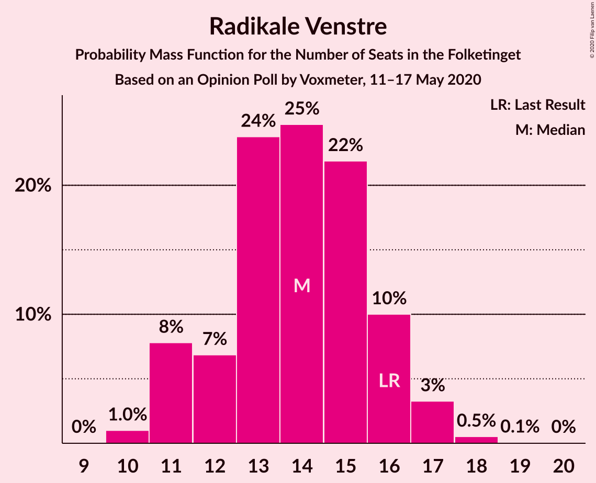

# Opinion Poll by Voxmeter, 11–17 May 2020

<a href="#voting-intentions">Voting Intentions</a> | <a href="#seats">Seats</a> | <a href="#coalitions">Coalitions</a> | <a href="#technical-information">Technical Information</a>

## Voting Intentions

### Confidence Intervals

| Party | Last Result | Poll Result | 80% Confidence Interval | 90% Confidence Interval | 95% Confidence Interval | 99% Confidence Interval |
|:-----:|:-----------:|:-----------:|:-----------------------:|:-----------------------:|:-----------------------:|:-----------------------:|
| Socialdemokraterne | 25.9% | 34.7% | 32.8–36.6% |32.3–37.2% |31.8–37.6% |30.9–38.6% |
| Venstre | 23.4% | 20.4% | 18.9–22.1% |18.5–22.6% |18.1–23.0% |17.4–23.9% |
| Enhedslisten–De Rød-Grønne | 6.9% | 8.0% | 7.0–9.2% |6.7–9.5% |6.5–9.8% |6.0–10.4% |
| Radikale Venstre | 8.6% | 7.5% | 6.5–8.7% |6.3–9.0% |6.0–9.3% |5.6–9.9% |
| Dansk Folkeparti | 8.7% | 7.2% | 6.3–8.4% |6.0–8.7% |5.8–9.0% |5.3–9.5% |
| Socialistisk Folkeparti | 7.7% | 7.2% | 6.3–8.4% |6.0–8.7% |5.8–9.0% |5.3–9.5% |
| Det Konservative Folkeparti | 6.6% | 6.8% | 5.9–7.9% |5.6–8.2% |5.4–8.5% |5.0–9.1% |
| Nye Borgerlige | 2.4% | 2.1% | 1.7–2.9% |1.5–3.0% |1.4–3.2% |1.2–3.6% |
| Liberal Alliance | 2.3% | 1.7% | 1.2–2.3% |1.1–2.5% |1.0–2.6% |0.9–3.0% |
| Stram Kurs | 1.8% | 1.6% | 1.2–2.2% |1.1–2.4% |1.0–2.5% |0.8–2.9% |
| Alternativet | 3.0% | 0.9% | 0.6–1.4% |0.5–1.5% |0.5–1.7% |0.4–1.9% |
| Klaus Riskær Pedersen | 0.8% | 0.5% | 0.3–0.9% |0.2–1.0% |0.2–1.1% |0.1–1.4% |

*Note:* The poll result column reflects the actual value used in the calculations. Published results may vary slightly, and in addition be rounded to fewer digits.

## Seats

### Confidence Intervals

| Party | Last Result | Median | 80% Confidence Interval | 90% Confidence Interval | 95% Confidence Interval | 99% Confidence Interval |
|:-----:|:-----------:|:------:|:-----------------------:|:-----------------------:|:-----------------------:|:-----------------------:|
| <a href="#socialdemokraterne">Socialdemokraterne</a> | 48 | 64 | 60–69 |58–71 |58–71 |55–71 |
| <a href="#venstre">Venstre</a> | 43 | 37 | 34–40 |34–42 |33–42 |31–43 |
| <a href="#enhedslisten–de-rød-grønne">Enhedslisten–De Rød-Grønne</a> | 13 | 14 | 13–17 |12–18 |12–18 |11–19 |
| <a href="#radikale-venstre">Radikale Venstre</a> | 16 | 14 | 12–16 |11–16 |11–17 |10–18 |
| <a href="#dansk-folkeparti">Dansk Folkeparti</a> | 16 | 13 | 11–15 |11–15 |10–17 |10–18 |
| <a href="#socialistisk-folkeparti">Socialistisk Folkeparti</a> | 14 | 14 | 12–15 |11–16 |11–17 |10–17 |
| <a href="#det-konservative-folkeparti">Det Konservative Folkeparti</a> | 12 | 13 | 10–15 |9–15 |9–15 |9–17 |
| <a href="#nye-borgerlige">Nye Borgerlige</a> | 4 | 4 | 0–5 |0–5 |0–6 |0–7 |
| <a href="#liberal-alliance">Liberal Alliance</a> | 4 | 0 | 0–4 |0–5 |0–5 |0–6 |
| <a href="#stram-kurs">Stram Kurs</a> | 0 | 0 | 0–4 |0–4 |0–4 |0–5 |
| <a href="#alternativet">Alternativet</a> | 5 | 0 | 0 |0 |0 |0 |
| <a href="#klaus-riskær-pedersen">Klaus Riskær Pedersen</a> | 0 | 0 | 0 |0 |0 |0 |

### Socialdemokraterne

*For a full overview of the results for this party, see the [Socialdemokraterne](party-socialdemokraterne.html) page.*

| Number of Seats | Probability | Accumulated | Special Marks |
|:---------------:|:-----------:|:-----------:|:-------------:|
| 48 | 0% | 100% | Last Result |
| 49 | 0% | 100% |  |
| 50 | 0% | 100% |  |
| 51 | 0% | 100% |  |
| 52 | 0% | 100% |  |
| 53 | 0% | 100% |  |
| 54 | 0.1% | 100% |  |
| 55 | 0.5% | 99.9% |  |
| 56 | 0.3% | 99.4% |  |
| 57 | 0.4% | 99.1% |  |
| 58 | 5% | 98.8% |  |
| 59 | 3% | 94% |  |
| 60 | 5% | 91% |  |
| 61 | 15% | 85% |  |
| 62 | 10% | 71% |  |
| 63 | 9% | 61% |  |
| 64 | 6% | 51% | Median |
| 65 | 3% | 46% |  |
| 66 | 9% | 42% |  |
| 67 | 2% | 34% |  |
| 68 | 7% | 32% |  |
| 69 | 17% | 25% |  |
| 70 | 0.7% | 7% |  |
| 71 | 7% | 7% |  |
| 72 | 0% | 0.1% |  |
| 73 | 0% | 0% |  |

### Venstre

*For a full overview of the results for this party, see the [Venstre](party-venstre.html) page.*

| Number of Seats | Probability | Accumulated | Special Marks |
|:---------------:|:-----------:|:-----------:|:-------------:|
| 30 | 0.1% | 100% |  |
| 31 | 0.5% | 99.9% |  |
| 32 | 1.0% | 99.4% |  |
| 33 | 2% | 98% |  |
| 34 | 14% | 97% |  |
| 35 | 5% | 83% |  |
| 36 | 7% | 78% |  |
| 37 | 39% | 71% | Median |
| 38 | 9% | 32% |  |
| 39 | 9% | 24% |  |
| 40 | 7% | 15% |  |
| 41 | 1.4% | 8% |  |
| 42 | 5% | 6% |  |
| 43 | 1.0% | 1.4% | Last Result |
| 44 | 0.1% | 0.5% |  |
| 45 | 0.3% | 0.4% |  |
| 46 | 0% | 0% |  |

### Enhedslisten–De Rød-Grønne

*For a full overview of the results for this party, see the [Enhedslisten–De Rød-Grønne](party-enhedslisten–derød-grønne.html) page.*

| Number of Seats | Probability | Accumulated | Special Marks |
|:---------------:|:-----------:|:-----------:|:-------------:|
| 10 | 0.1% | 100% |  |
| 11 | 0.8% | 99.9% |  |
| 12 | 5% | 99.1% |  |
| 13 | 11% | 95% | Last Result |
| 14 | 40% | 84% | Median |
| 15 | 19% | 44% |  |
| 16 | 9% | 25% |  |
| 17 | 7% | 15% |  |
| 18 | 7% | 9% |  |
| 19 | 2% | 2% |  |
| 20 | 0.1% | 0.1% |  |
| 21 | 0.1% | 0.1% |  |
| 22 | 0% | 0% |  |

### Radikale Venstre

*For a full overview of the results for this party, see the [Radikale Venstre](party-radikalevenstre.html) page.*

| Number of Seats | Probability | Accumulated | Special Marks |
|:---------------:|:-----------:|:-----------:|:-------------:|
| 9 | 0% | 100% |  |
| 10 | 1.0% | 99.9% |  |
| 11 | 8% | 98.9% |  |
| 12 | 7% | 91% |  |
| 13 | 24% | 84% |  |
| 14 | 25% | 61% | Median |
| 15 | 22% | 36% |  |
| 16 | 10% | 14% | Last Result |
| 17 | 3% | 4% |  |
| 18 | 0.5% | 0.6% |  |
| 19 | 0.1% | 0.1% |  |
| 20 | 0% | 0% |  |

### Dansk Folkeparti

*For a full overview of the results for this party, see the [Dansk Folkeparti](party-danskfolkeparti.html) page.*

| Number of Seats | Probability | Accumulated | Special Marks |
|:---------------:|:-----------:|:-----------:|:-------------:|
| 9 | 0.1% | 100% |  |
| 10 | 3% | 99.9% |  |
| 11 | 9% | 97% |  |
| 12 | 7% | 88% |  |
| 13 | 51% | 80% | Median |
| 14 | 12% | 29% |  |
| 15 | 13% | 18% |  |
| 16 | 2% | 5% | Last Result |
| 17 | 2% | 3% |  |
| 18 | 1.2% | 1.3% |  |
| 19 | 0.1% | 0.1% |  |
| 20 | 0% | 0% |  |

### Socialistisk Folkeparti

*For a full overview of the results for this party, see the [Socialistisk Folkeparti](party-socialistiskfolkeparti.html) page.*

| Number of Seats | Probability | Accumulated | Special Marks |
|:---------------:|:-----------:|:-----------:|:-------------:|
| 9 | 0.2% | 100% |  |
| 10 | 1.1% | 99.8% |  |
| 11 | 5% | 98.8% |  |
| 12 | 15% | 94% |  |
| 13 | 11% | 79% |  |
| 14 | 46% | 68% | Last Result, Median |
| 15 | 15% | 22% |  |
| 16 | 3% | 6% |  |
| 17 | 3% | 3% |  |
| 18 | 0.3% | 0.3% |  |
| 19 | 0% | 0% |  |

### Det Konservative Folkeparti

*For a full overview of the results for this party, see the [Det Konservative Folkeparti](party-detkonservativefolkeparti.html) page.*

| Number of Seats | Probability | Accumulated | Special Marks |
|:---------------:|:-----------:|:-----------:|:-------------:|
| 8 | 0.1% | 100% |  |
| 9 | 8% | 99.9% |  |
| 10 | 3% | 92% |  |
| 11 | 19% | 89% |  |
| 12 | 15% | 70% | Last Result |
| 13 | 9% | 56% | Median |
| 14 | 12% | 47% |  |
| 15 | 34% | 35% |  |
| 16 | 0.5% | 1.4% |  |
| 17 | 0.7% | 1.0% |  |
| 18 | 0.1% | 0.2% |  |
| 19 | 0.1% | 0.1% |  |
| 20 | 0% | 0% |  |

### Nye Borgerlige

*For a full overview of the results for this party, see the [Nye Borgerlige](party-nyeborgerlige.html) page.*

| Number of Seats | Probability | Accumulated | Special Marks |
|:---------------:|:-----------:|:-----------:|:-------------:|
| 0 | 40% | 100% |  |
| 1 | 0% | 60% |  |
| 2 | 0% | 60% |  |
| 3 | 0% | 60% |  |
| 4 | 44% | 60% | Last Result, Median |
| 5 | 12% | 16% |  |
| 6 | 2% | 3% |  |
| 7 | 1.1% | 1.2% |  |
| 8 | 0.1% | 0.1% |  |
| 9 | 0% | 0% |  |

### Liberal Alliance

*For a full overview of the results for this party, see the [Liberal Alliance](party-liberalalliance.html) page.*

| Number of Seats | Probability | Accumulated | Special Marks |
|:---------------:|:-----------:|:-----------:|:-------------:|
| 0 | 85% | 100% | Median |
| 1 | 0% | 15% |  |
| 2 | 0% | 15% |  |
| 3 | 0% | 15% |  |
| 4 | 9% | 15% | Last Result |
| 5 | 5% | 6% |  |
| 6 | 0.9% | 0.9% |  |
| 7 | 0% | 0% |  |

### Stram Kurs

*For a full overview of the results for this party, see the [Stram Kurs](party-stramkurs.html) page.*

| Number of Seats | Probability | Accumulated | Special Marks |
|:---------------:|:-----------:|:-----------:|:-------------:|
| 0 | 70% | 100% | Last Result, Median |
| 1 | 0% | 30% |  |
| 2 | 0% | 30% |  |
| 3 | 0% | 30% |  |
| 4 | 28% | 30% |  |
| 5 | 1.4% | 2% |  |
| 6 | 0.1% | 0.1% |  |
| 7 | 0% | 0% |  |

### Alternativet

*For a full overview of the results for this party, see the [Alternativet](party-alternativet.html) page.*

| Number of Seats | Probability | Accumulated | Special Marks |
|:---------------:|:-----------:|:-----------:|:-------------:|
| 0 | 99.9% | 100% | Median |
| 1 | 0% | 0.1% |  |
| 2 | 0% | 0.1% |  |
| 3 | 0% | 0.1% |  |
| 4 | 0.1% | 0.1% |  |
| 5 | 0% | 0% | Last Result |

### Klaus Riskær Pedersen

*For a full overview of the results for this party, see the [Klaus Riskær Pedersen](party-klausriskærpedersen.html) page.*

| Number of Seats | Probability | Accumulated | Special Marks |
|:---------------:|:-----------:|:-----------:|:-------------:|
| 0 | 100% | 100% | Last Result, Median |

## Coalitions

### Confidence Intervals

| Coalition | Last Result | Median | Majority? | 80% Confidence Interval | 90% Confidence Interval | 95% Confidence Interval | 99% Confidence Interval |
|:---------:|:-----------:|:------:|:---------:|:-----------------------:|:-----------------------:|:-----------------------:|:-----------------------:|
| Socialdemokraterne – Enhedslisten–De Rød-Grønne – Radikale Venstre – Socialistisk Folkeparti – Alternativet | 96 | 106 | 100% | 102–110 | 101–113 | 100–113 | 97–115 |
| Socialdemokraterne – Enhedslisten–De Rød-Grønne – Radikale Venstre – Socialistisk Folkeparti | 91 | 106 | 100% | 102–110 | 101–113 | 100–113 | 97–115 |
| Socialdemokraterne – Enhedslisten–De Rød-Grønne – Socialistisk Folkeparti – Alternativet | 80 | 93 | 79% | 88–97 | 87–99 | 86–99 | 84–100 |
| Socialdemokraterne – Enhedslisten–De Rød-Grønne – Socialistisk Folkeparti | 75 | 93 | 79% | 88–97 | 87–99 | 86–99 | 84–100 |
| Socialdemokraterne – Radikale Venstre – Socialistisk Folkeparti | 78 | 92 | 76% | 86–96 | 86–99 | 85–99 | 82–99 |
| Socialdemokraterne – Radikale Venstre | 64 | 77 | 0% | 74–82 | 73–85 | 72–85 | 69–85 |
| Venstre – Dansk Folkeparti – Det Konservative Folkeparti – Nye Borgerlige – Liberal Alliance – Klaus Riskær Pedersen | 79 | 66 | 0% | 62–71 | 62–72 | 62–74 | 58–75 |
| Venstre – Dansk Folkeparti – Det Konservative Folkeparti – Nye Borgerlige – Liberal Alliance | 79 | 66 | 0% | 62–71 | 62–72 | 62–74 | 58–75 |
| Venstre – Dansk Folkeparti – Det Konservative Folkeparti – Liberal Alliance | 75 | 64 | 0% | 61–68 | 60–68 | 59–70 | 55–71 |
| Venstre – Det Konservative Folkeparti – Liberal Alliance | 59 | 50 | 0% | 47–54 | 46–56 | 46–57 | 44–58 |
| Venstre – Det Konservative Folkeparti | 55 | 49 | 0% | 46–54 | 46–55 | 44–56 | 44–57 |
| Venstre | 43 | 37 | 0% | 34–40 | 34–42 | 33–42 | 31–43 |

### Socialdemokraterne – Enhedslisten–De Rød-Grønne – Radikale Venstre – Socialistisk Folkeparti – Alternativet

| Number of Seats | Probability | Accumulated | Special Marks |
|:---------------:|:-----------:|:-----------:|:-------------:|
| 96 | 0.1% | 100% | Last Result |
| 97 | 0.4% | 99.8% |  |
| 98 | 0.8% | 99.5% |  |
| 99 | 1.1% | 98.6% |  |
| 100 | 2% | 98% |  |
| 101 | 2% | 95% |  |
| 102 | 5% | 93% |  |
| 103 | 2% | 88% |  |
| 104 | 7% | 86% |  |
| 105 | 17% | 78% |  |
| 106 | 11% | 61% | Median |
| 107 | 8% | 50% |  |
| 108 | 8% | 41% |  |
| 109 | 4% | 33% |  |
| 110 | 21% | 30% |  |
| 111 | 0.7% | 9% |  |
| 112 | 0.5% | 8% |  |
| 113 | 7% | 7% |  |
| 114 | 0.1% | 0.9% |  |
| 115 | 0.7% | 0.7% |  |
| 116 | 0% | 0.1% |  |
| 117 | 0% | 0% |  |

### Socialdemokraterne – Enhedslisten–De Rød-Grønne – Radikale Venstre – Socialistisk Folkeparti

| Number of Seats | Probability | Accumulated | Special Marks |
|:---------------:|:-----------:|:-----------:|:-------------:|
| 91 | 0% | 100% | Last Result |
| 92 | 0% | 100% |  |
| 93 | 0% | 100% |  |
| 94 | 0% | 100% |  |
| 95 | 0% | 100% |  |
| 96 | 0.1% | 100% |  |
| 97 | 0.4% | 99.8% |  |
| 98 | 0.8% | 99.5% |  |
| 99 | 1.1% | 98.6% |  |
| 100 | 2% | 98% |  |
| 101 | 2% | 95% |  |
| 102 | 5% | 93% |  |
| 103 | 2% | 88% |  |
| 104 | 7% | 86% |  |
| 105 | 17% | 78% |  |
| 106 | 11% | 61% | Median |
| 107 | 8% | 50% |  |
| 108 | 8% | 41% |  |
| 109 | 4% | 33% |  |
| 110 | 21% | 30% |  |
| 111 | 0.7% | 9% |  |
| 112 | 0.5% | 8% |  |
| 113 | 7% | 7% |  |
| 114 | 0.1% | 0.9% |  |
| 115 | 0.7% | 0.7% |  |
| 116 | 0% | 0.1% |  |
| 117 | 0% | 0% |  |

### Socialdemokraterne – Enhedslisten–De Rød-Grønne – Socialistisk Folkeparti – Alternativet

| Number of Seats | Probability | Accumulated | Special Marks |
|:---------------:|:-----------:|:-----------:|:-------------:|
| 80 | 0% | 100% | Last Result |
| 81 | 0% | 100% |  |
| 82 | 0.2% | 100% |  |
| 83 | 0.3% | 99.8% |  |
| 84 | 1.0% | 99.5% |  |
| 85 | 0.6% | 98% |  |
| 86 | 1.2% | 98% |  |
| 87 | 2% | 97% |  |
| 88 | 10% | 95% |  |
| 89 | 6% | 85% |  |
| 90 | 15% | 79% | Majority |
| 91 | 3% | 64% |  |
| 92 | 5% | 60% | Median |
| 93 | 7% | 56% |  |
| 94 | 7% | 48% |  |
| 95 | 12% | 41% |  |
| 96 | 7% | 29% |  |
| 97 | 15% | 22% |  |
| 98 | 0.2% | 8% |  |
| 99 | 7% | 7% |  |
| 100 | 0.7% | 0.8% |  |
| 101 | 0% | 0.1% |  |
| 102 | 0% | 0% |  |

### Socialdemokraterne – Enhedslisten–De Rød-Grønne – Socialistisk Folkeparti

| Number of Seats | Probability | Accumulated | Special Marks |
|:---------------:|:-----------:|:-----------:|:-------------:|
| 75 | 0% | 100% | Last Result |
| 76 | 0% | 100% |  |
| 77 | 0% | 100% |  |
| 78 | 0% | 100% |  |
| 79 | 0% | 100% |  |
| 80 | 0% | 100% |  |
| 81 | 0% | 100% |  |
| 82 | 0.2% | 99.9% |  |
| 83 | 0.3% | 99.8% |  |
| 84 | 1.0% | 99.5% |  |
| 85 | 0.6% | 98% |  |
| 86 | 1.2% | 98% |  |
| 87 | 2% | 97% |  |
| 88 | 10% | 95% |  |
| 89 | 6% | 85% |  |
| 90 | 15% | 79% | Majority |
| 91 | 3% | 64% |  |
| 92 | 5% | 60% | Median |
| 93 | 7% | 56% |  |
| 94 | 7% | 48% |  |
| 95 | 12% | 41% |  |
| 96 | 7% | 29% |  |
| 97 | 15% | 22% |  |
| 98 | 0.2% | 8% |  |
| 99 | 7% | 7% |  |
| 100 | 0.7% | 0.8% |  |
| 101 | 0% | 0.1% |  |
| 102 | 0% | 0% |  |

### Socialdemokraterne – Radikale Venstre – Socialistisk Folkeparti

| Number of Seats | Probability | Accumulated | Special Marks |
|:---------------:|:-----------:|:-----------:|:-------------:|
| 78 | 0% | 100% | Last Result |
| 79 | 0% | 100% |  |
| 80 | 0% | 100% |  |
| 81 | 0.2% | 100% |  |
| 82 | 0.4% | 99.8% |  |
| 83 | 0.4% | 99.4% |  |
| 84 | 1.3% | 99.0% |  |
| 85 | 2% | 98% |  |
| 86 | 6% | 96% |  |
| 87 | 2% | 90% |  |
| 88 | 5% | 88% |  |
| 89 | 7% | 83% |  |
| 90 | 15% | 76% | Majority |
| 91 | 9% | 61% |  |
| 92 | 9% | 51% | Median |
| 93 | 6% | 42% |  |
| 94 | 5% | 36% |  |
| 95 | 0.9% | 31% |  |
| 96 | 22% | 30% |  |
| 97 | 0.3% | 8% |  |
| 98 | 0.7% | 8% |  |
| 99 | 7% | 7% |  |
| 100 | 0.2% | 0.3% |  |
| 101 | 0% | 0.1% |  |
| 102 | 0.1% | 0.1% |  |
| 103 | 0% | 0% |  |

### Socialdemokraterne – Radikale Venstre

| Number of Seats | Probability | Accumulated | Special Marks |
|:---------------:|:-----------:|:-----------:|:-------------:|
| 64 | 0% | 100% | Last Result |
| 65 | 0% | 100% |  |
| 66 | 0% | 100% |  |
| 67 | 0.1% | 100% |  |
| 68 | 0.1% | 99.9% |  |
| 69 | 0.4% | 99.8% |  |
| 70 | 0.7% | 99.4% |  |
| 71 | 1.0% | 98.7% |  |
| 72 | 1.2% | 98% |  |
| 73 | 2% | 97% |  |
| 74 | 8% | 94% |  |
| 75 | 6% | 86% |  |
| 76 | 22% | 80% |  |
| 77 | 8% | 58% |  |
| 78 | 7% | 50% | Median |
| 79 | 5% | 43% |  |
| 80 | 3% | 38% |  |
| 81 | 3% | 35% |  |
| 82 | 23% | 32% |  |
| 83 | 0.9% | 9% |  |
| 84 | 0.6% | 8% |  |
| 85 | 7% | 7% |  |
| 86 | 0.1% | 0.2% |  |
| 87 | 0.1% | 0.2% |  |
| 88 | 0% | 0.1% |  |
| 89 | 0% | 0% |  |

### Venstre – Dansk Folkeparti – Det Konservative Folkeparti – Nye Borgerlige – Liberal Alliance – Klaus Riskær Pedersen

| Number of Seats | Probability | Accumulated | Special Marks |
|:---------------:|:-----------:|:-----------:|:-------------:|
| 56 | 0.1% | 100% |  |
| 57 | 0% | 99.9% |  |
| 58 | 0.6% | 99.8% |  |
| 59 | 0.1% | 99.3% |  |
| 60 | 1.3% | 99.1% |  |
| 61 | 0.1% | 98% |  |
| 62 | 9% | 98% |  |
| 63 | 3% | 89% |  |
| 64 | 2% | 86% |  |
| 65 | 28% | 84% |  |
| 66 | 16% | 55% |  |
| 67 | 8% | 39% | Median |
| 68 | 5% | 31% |  |
| 69 | 7% | 26% |  |
| 70 | 5% | 19% |  |
| 71 | 7% | 14% |  |
| 72 | 3% | 7% |  |
| 73 | 2% | 4% |  |
| 74 | 1.0% | 3% |  |
| 75 | 1.1% | 2% |  |
| 76 | 0.1% | 0.4% |  |
| 77 | 0.1% | 0.3% |  |
| 78 | 0.2% | 0.3% |  |
| 79 | 0% | 0% | Last Result |

### Venstre – Dansk Folkeparti – Det Konservative Folkeparti – Nye Borgerlige – Liberal Alliance

| Number of Seats | Probability | Accumulated | Special Marks |
|:---------------:|:-----------:|:-----------:|:-------------:|
| 56 | 0.1% | 100% |  |
| 57 | 0% | 99.9% |  |
| 58 | 0.6% | 99.8% |  |
| 59 | 0.1% | 99.3% |  |
| 60 | 1.3% | 99.1% |  |
| 61 | 0.1% | 98% |  |
| 62 | 9% | 98% |  |
| 63 | 3% | 89% |  |
| 64 | 2% | 86% |  |
| 65 | 28% | 84% |  |
| 66 | 16% | 55% |  |
| 67 | 8% | 39% | Median |
| 68 | 5% | 31% |  |
| 69 | 7% | 26% |  |
| 70 | 5% | 19% |  |
| 71 | 7% | 14% |  |
| 72 | 3% | 7% |  |
| 73 | 2% | 4% |  |
| 74 | 1.0% | 3% |  |
| 75 | 1.1% | 2% |  |
| 76 | 0.1% | 0.4% |  |
| 77 | 0.1% | 0.3% |  |
| 78 | 0.2% | 0.3% |  |
| 79 | 0% | 0% | Last Result |

### Venstre – Dansk Folkeparti – Det Konservative Folkeparti – Liberal Alliance

| Number of Seats | Probability | Accumulated | Special Marks |
|:---------------:|:-----------:|:-----------:|:-------------:|
| 55 | 0.6% | 100% |  |
| 56 | 0.1% | 99.3% |  |
| 57 | 0.2% | 99.2% |  |
| 58 | 0.8% | 99.0% |  |
| 59 | 2% | 98% |  |
| 60 | 3% | 97% |  |
| 61 | 13% | 93% |  |
| 62 | 23% | 80% |  |
| 63 | 5% | 57% | Median |
| 64 | 7% | 52% |  |
| 65 | 18% | 45% |  |
| 66 | 4% | 27% |  |
| 67 | 11% | 23% |  |
| 68 | 7% | 12% |  |
| 69 | 0.9% | 5% |  |
| 70 | 2% | 4% |  |
| 71 | 2% | 2% |  |
| 72 | 0.1% | 0.5% |  |
| 73 | 0.3% | 0.3% |  |
| 74 | 0% | 0.1% |  |
| 75 | 0% | 0% | Last Result |

### Venstre – Det Konservative Folkeparti – Liberal Alliance

| Number of Seats | Probability | Accumulated | Special Marks |
|:---------------:|:-----------:|:-----------:|:-------------:|
| 42 | 0.1% | 100% |  |
| 43 | 0% | 99.9% |  |
| 44 | 0.8% | 99.8% |  |
| 45 | 0.9% | 99.1% |  |
| 46 | 7% | 98% |  |
| 47 | 1.0% | 91% |  |
| 48 | 10% | 90% |  |
| 49 | 23% | 79% |  |
| 50 | 9% | 57% | Median |
| 51 | 4% | 48% |  |
| 52 | 18% | 44% |  |
| 53 | 7% | 26% |  |
| 54 | 9% | 19% |  |
| 55 | 2% | 10% |  |
| 56 | 5% | 8% |  |
| 57 | 1.5% | 3% |  |
| 58 | 0.6% | 1.1% |  |
| 59 | 0.4% | 0.5% | Last Result |
| 60 | 0.1% | 0.1% |  |
| 61 | 0% | 0% |  |

### Venstre – Det Konservative Folkeparti

| Number of Seats | Probability | Accumulated | Special Marks |
|:---------------:|:-----------:|:-----------:|:-------------:|
| 41 | 0.1% | 100% |  |
| 42 | 0.1% | 99.9% |  |
| 43 | 0.1% | 99.8% |  |
| 44 | 2% | 99.7% |  |
| 45 | 2% | 97% |  |
| 46 | 8% | 96% |  |
| 47 | 2% | 88% |  |
| 48 | 13% | 86% |  |
| 49 | 25% | 74% |  |
| 50 | 10% | 49% | Median |
| 51 | 4% | 39% |  |
| 52 | 18% | 35% |  |
| 53 | 4% | 18% |  |
| 54 | 7% | 13% |  |
| 55 | 1.5% | 6% | Last Result |
| 56 | 4% | 5% |  |
| 57 | 0.5% | 0.6% |  |
| 58 | 0.1% | 0.1% |  |
| 59 | 0% | 0% |  |

### Venstre

| Number of Seats | Probability | Accumulated | Special Marks |
|:---------------:|:-----------:|:-----------:|:-------------:|
| 30 | 0.1% | 100% |  |
| 31 | 0.5% | 99.9% |  |
| 32 | 1.0% | 99.4% |  |
| 33 | 2% | 98% |  |
| 34 | 14% | 97% |  |
| 35 | 5% | 83% |  |
| 36 | 7% | 78% |  |
| 37 | 39% | 71% | Median |
| 38 | 9% | 32% |  |
| 39 | 9% | 24% |  |
| 40 | 7% | 15% |  |
| 41 | 1.4% | 8% |  |
| 42 | 5% | 6% |  |
| 43 | 1.0% | 1.4% | Last Result |
| 44 | 0.1% | 0.5% |  |
| 45 | 0.3% | 0.4% |  |
| 46 | 0% | 0% |  |

## Technical Information

### Opinion Poll

+ **Polling firm:** Voxmeter
+ **Commissioner(s):** —
+ **Fieldwork period:** 11–17 May 2020

### Calculations

+ **Sample size:** 1027
+ **Simulations done:** 1,048,576
+ **Error estimate:** 3.03%

