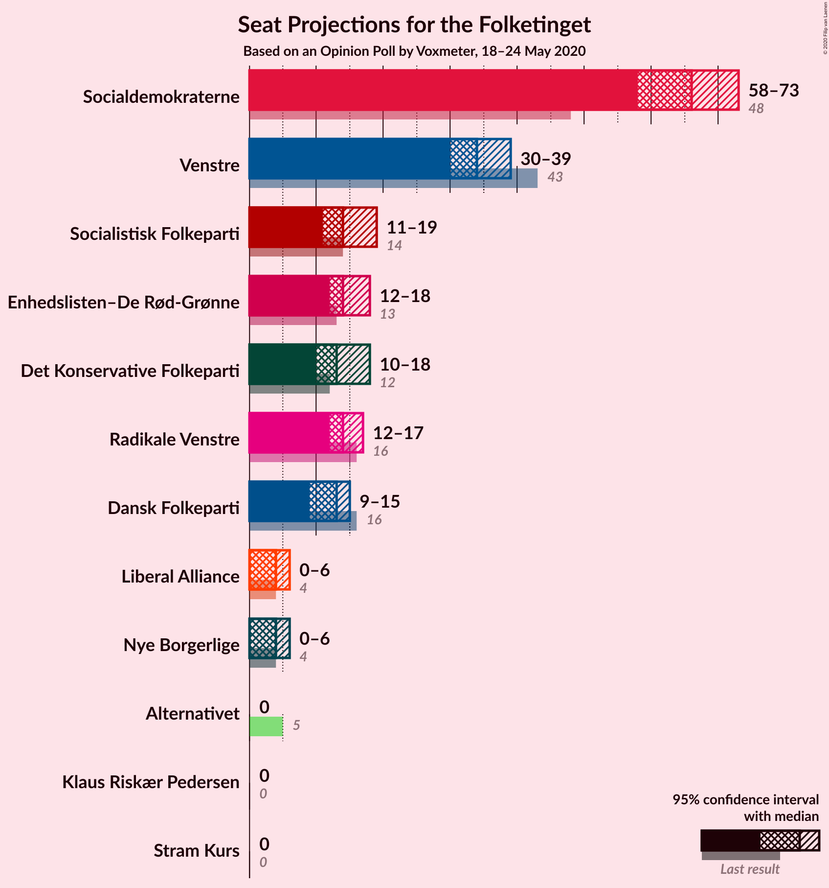
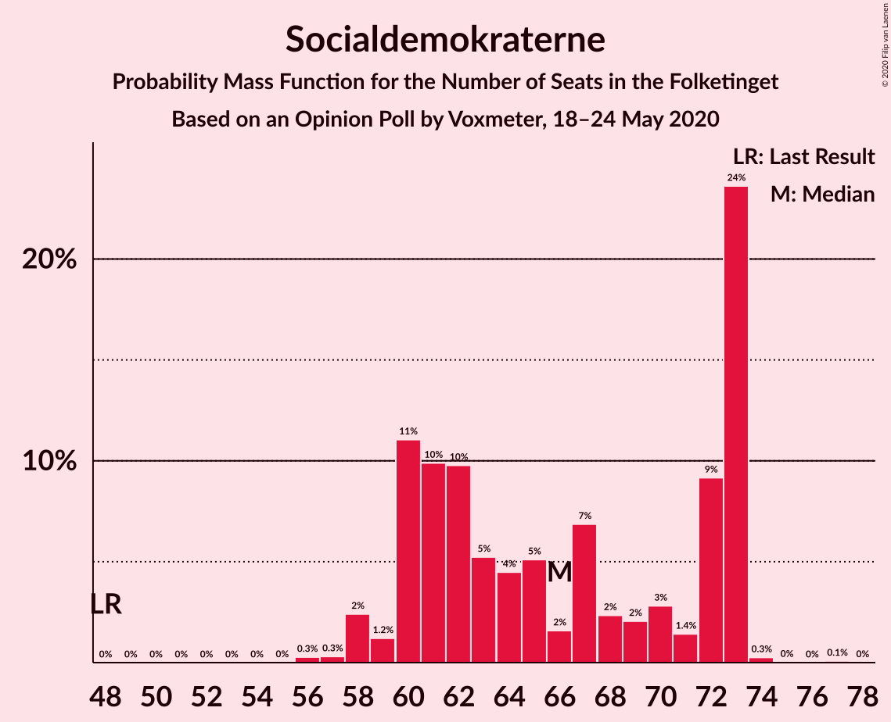
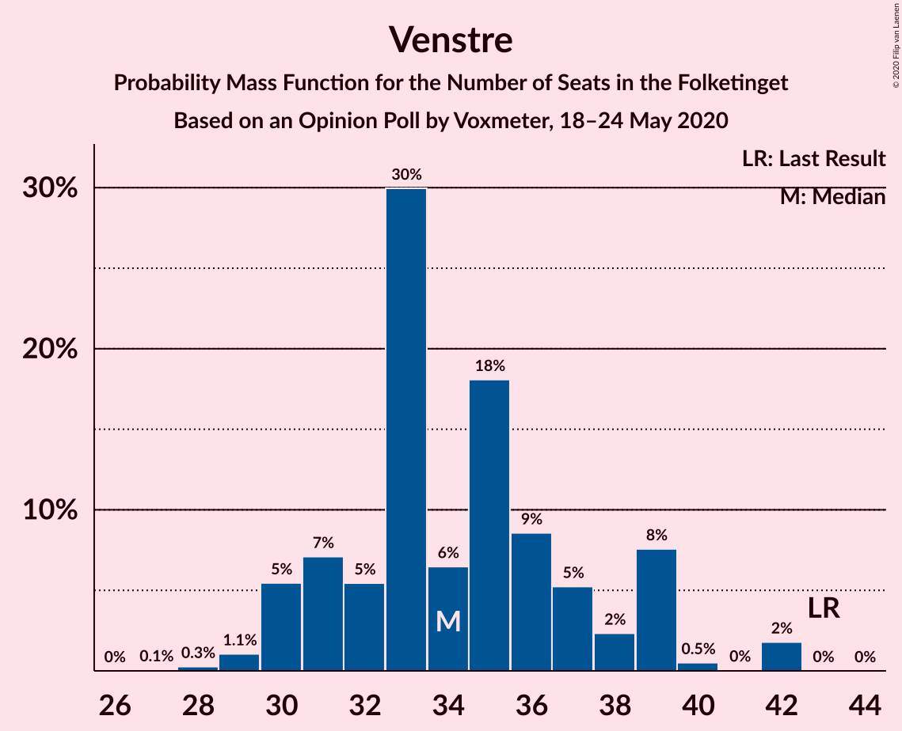
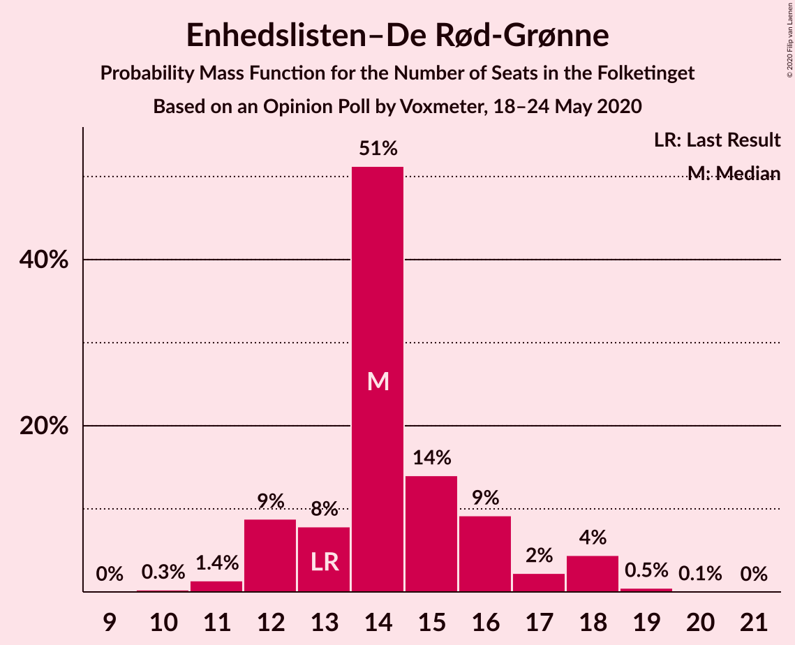
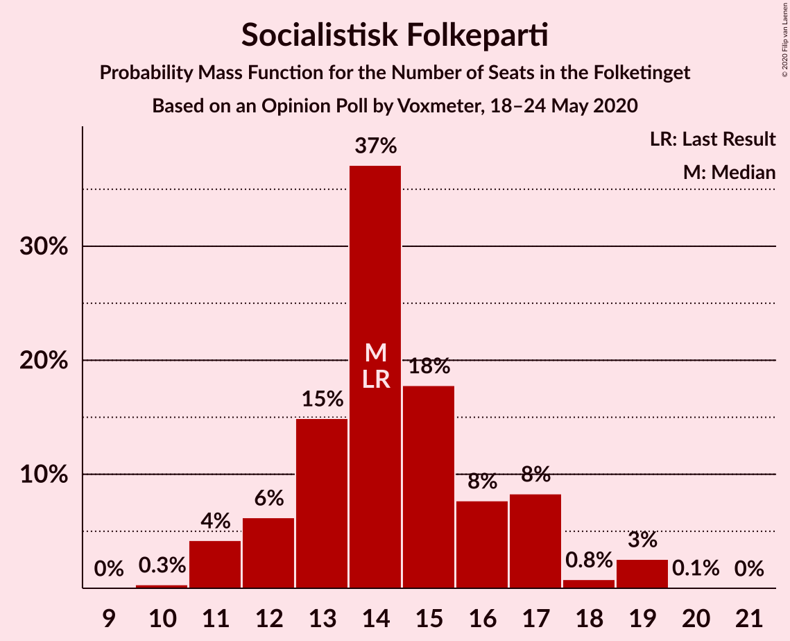
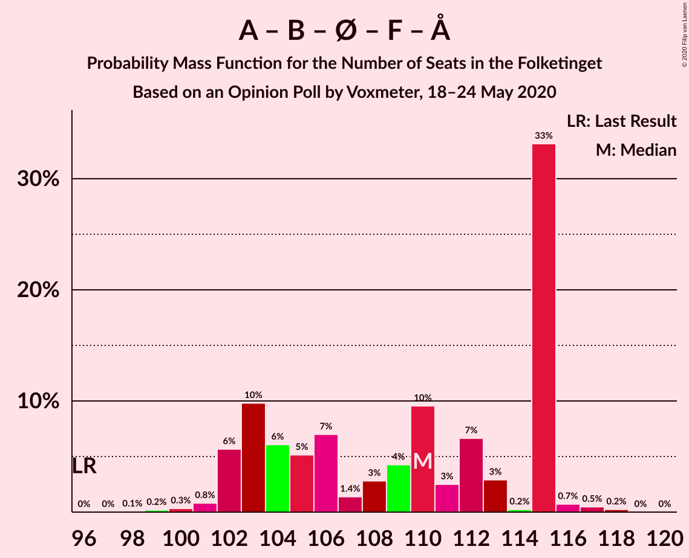

# Opinion Poll by Voxmeter, 18–24 May 2020

<a href="#voting-intentions">Voting Intentions</a> | <a href="#seats">Seats</a> | <a href="#coalitions">Coalitions</a> | <a href="#technical-information">Technical Information</a>

## Voting Intentions

### Confidence Intervals

| Party | Last Result | Poll Result | 80% Confidence Interval | 90% Confidence Interval | 95% Confidence Interval | 99% Confidence Interval |
|:-----:|:-----------:|:-----------:|:-----------------------:|:-----------------------:|:-----------------------:|:-----------------------:|
| Socialdemokraterne | 25.9% | 35.8% | 33.9–37.8% |33.4–38.3% |33.0–38.8% |32.1–39.8% |
| Venstre | 23.4% | 19.1% | 17.6–20.7% |17.2–21.2% |16.8–21.6% |16.1–22.4% |
| Radikale Venstre | 8.6% | 7.9% | 6.9–9.1% |6.6–9.4% |6.4–9.7% |5.9–10.3% |
| Enhedslisten–De Rød-Grønne | 6.9% | 7.8% | 6.8–9.0% |6.5–9.3% |6.3–9.6% |5.9–10.2% |
| Socialistisk Folkeparti | 7.7% | 7.8% | 6.8–9.0% |6.5–9.3% |6.3–9.6% |5.9–10.2% |
| Det Konservative Folkeparti | 6.6% | 7.1% | 6.2–8.2% |5.9–8.6% |5.7–8.9% |5.3–9.4% |
| Dansk Folkeparti | 8.7% | 6.4% | 5.5–7.5% |5.3–7.8% |5.1–8.1% |4.7–8.7% |
| Liberal Alliance | 2.3% | 2.3% | 1.8–3.1% |1.7–3.3% |1.6–3.5% |1.4–3.8% |
| Nye Borgerlige | 2.4% | 2.3% | 1.8–3.1% |1.7–3.3% |1.6–3.5% |1.4–3.8% |
| Stram Kurs | 1.8% | 1.0% | 0.7–1.5% |0.6–1.6% |0.5–1.8% |0.4–2.1% |
| Alternativet | 3.0% | 0.9% | 0.6–1.4% |0.5–1.5% |0.5–1.7% |0.4–1.9% |
| Klaus Riskær Pedersen | 0.8% | 0.3% | 0.2–0.7% |0.1–0.8% |0.1–0.9% |0.1–1.1% |

*Note:* The poll result column reflects the actual value used in the calculations. Published results may vary slightly, and in addition be rounded to fewer digits.

## Seats

### Confidence Intervals

| Party | Last Result | Median | 80% Confidence Interval | 90% Confidence Interval | 95% Confidence Interval | 99% Confidence Interval |
|:-----:|:-----------:|:------:|:-----------------------:|:-----------------------:|:-----------------------:|:-----------------------:|
| <a href="#socialdemokraterne">Socialdemokraterne</a> | 48 | 61 | 60–70 |59–70 |56–70 |56–74 |
| <a href="#venstre">Venstre</a> | 43 | 34 | 31–36 |29–38 |29–38 |29–40 |
| <a href="#radikale-venstre">Radikale Venstre</a> | 16 | 14 | 13–16 |13–18 |12–18 |10–18 |
| <a href="#enhedslisten–de-rød-grønne">Enhedslisten–De Rød-Grønne</a> | 13 | 14 | 13–16 |13–17 |12–18 |12–19 |
| <a href="#socialistisk-folkeparti">Socialistisk Folkeparti</a> | 14 | 16 | 14–19 |13–19 |12–19 |11–19 |
| <a href="#det-konservative-folkeparti">Det Konservative Folkeparti</a> | 12 | 13 | 12–15 |11–16 |10–16 |9–17 |
| <a href="#dansk-folkeparti">Dansk Folkeparti</a> | 16 | 12 | 10–14 |8–15 |8–15 |8–16 |
| <a href="#liberal-alliance">Liberal Alliance</a> | 4 | 5 | 4–5 |0–5 |0–5 |0–6 |
| <a href="#nye-borgerlige">Nye Borgerlige</a> | 4 | 5 | 0–6 |0–6 |0–6 |0–7 |
| <a href="#stram-kurs">Stram Kurs</a> | 0 | 0 | 0 |0 |0 |0–4 |
| <a href="#alternativet">Alternativet</a> | 5 | 0 | 0 |0 |0 |0 |
| <a href="#klaus-riskær-pedersen">Klaus Riskær Pedersen</a> | 0 | 0 | 0 |0 |0 |0 |

### Socialdemokraterne

*For a full overview of the results for this party, see the [Socialdemokraterne](party-socialdemokraterne.html) page.*

| Number of Seats | Probability | Accumulated | Special Marks |
|:---------------:|:-----------:|:-----------:|:-------------:|
| 48 | 0% | 100% | Last Result |
| 49 | 0% | 100% |  |
| 50 | 0% | 100% |  |
| 51 | 0% | 100% |  |
| 52 | 0% | 100% |  |
| 53 | 0% | 100% |  |
| 54 | 0% | 100% |  |
| 55 | 0% | 100% |  |
| 56 | 4% | 100% |  |
| 57 | 0% | 96% |  |
| 58 | 0.1% | 96% |  |
| 59 | 5% | 96% |  |
| 60 | 32% | 91% |  |
| 61 | 10% | 59% | Median |
| 62 | 23% | 49% |  |
| 63 | 3% | 26% |  |
| 64 | 4% | 23% |  |
| 65 | 0.8% | 19% |  |
| 66 | 3% | 18% |  |
| 67 | 0.4% | 15% |  |
| 68 | 4% | 15% |  |
| 69 | 0.3% | 11% |  |
| 70 | 9% | 10% |  |
| 71 | 0.2% | 1.2% |  |
| 72 | 0.3% | 1.0% |  |
| 73 | 0% | 0.7% |  |
| 74 | 0.4% | 0.7% |  |
| 75 | 0.2% | 0.2% |  |
| 76 | 0% | 0% |  |

### Venstre

*For a full overview of the results for this party, see the [Venstre](party-venstre.html) page.*

| Number of Seats | Probability | Accumulated | Special Marks |
|:---------------:|:-----------:|:-----------:|:-------------:|
| 28 | 0.5% | 100% |  |
| 29 | 6% | 99.5% |  |
| 30 | 1.3% | 93% |  |
| 31 | 8% | 92% |  |
| 32 | 3% | 84% |  |
| 33 | 12% | 80% |  |
| 34 | 55% | 69% | Median |
| 35 | 1.5% | 14% |  |
| 36 | 4% | 12% |  |
| 37 | 2% | 8% |  |
| 38 | 4% | 6% |  |
| 39 | 0.4% | 1.5% |  |
| 40 | 0.9% | 1.1% |  |
| 41 | 0.1% | 0.2% |  |
| 42 | 0.1% | 0.1% |  |
| 43 | 0% | 0% | Last Result |

### Radikale Venstre

*For a full overview of the results for this party, see the [Radikale Venstre](party-radikalevenstre.html) page.*

| Number of Seats | Probability | Accumulated | Special Marks |
|:---------------:|:-----------:|:-----------:|:-------------:|
| 10 | 0.9% | 100% |  |
| 11 | 1.1% | 99.1% |  |
| 12 | 1.1% | 98% |  |
| 13 | 40% | 97% |  |
| 14 | 11% | 57% | Median |
| 15 | 33% | 46% |  |
| 16 | 6% | 13% | Last Result |
| 17 | 3% | 8% |  |
| 18 | 5% | 5% |  |
| 19 | 0.2% | 0.2% |  |
| 20 | 0% | 0% |  |

### Enhedslisten–De Rød-Grønne

*For a full overview of the results for this party, see the [Enhedslisten–De Rød-Grønne](party-enhedslisten–derød-grønne.html) page.*

| Number of Seats | Probability | Accumulated | Special Marks |
|:---------------:|:-----------:|:-----------:|:-------------:|
| 10 | 0.1% | 100% |  |
| 11 | 0.4% | 99.9% |  |
| 12 | 4% | 99.5% |  |
| 13 | 9% | 95% | Last Result |
| 14 | 47% | 86% | Median |
| 15 | 24% | 39% |  |
| 16 | 7% | 15% |  |
| 17 | 5% | 7% |  |
| 18 | 0.8% | 3% |  |
| 19 | 2% | 2% |  |
| 20 | 0.2% | 0.2% |  |
| 21 | 0% | 0% |  |

### Socialistisk Folkeparti

*For a full overview of the results for this party, see the [Socialistisk Folkeparti](party-socialistiskfolkeparti.html) page.*

| Number of Seats | Probability | Accumulated | Special Marks |
|:---------------:|:-----------:|:-----------:|:-------------:|
| 10 | 0.2% | 100% |  |
| 11 | 0.5% | 99.8% |  |
| 12 | 3% | 99.3% |  |
| 13 | 6% | 96% |  |
| 14 | 12% | 90% | Last Result |
| 15 | 4% | 78% |  |
| 16 | 39% | 74% | Median |
| 17 | 2% | 35% |  |
| 18 | 2% | 32% |  |
| 19 | 30% | 30% |  |
| 20 | 0% | 0.1% |  |
| 21 | 0% | 0% |  |

### Det Konservative Folkeparti

*For a full overview of the results for this party, see the [Det Konservative Folkeparti](party-detkonservativefolkeparti.html) page.*

| Number of Seats | Probability | Accumulated | Special Marks |
|:---------------:|:-----------:|:-----------:|:-------------:|
| 9 | 0.6% | 100% |  |
| 10 | 2% | 99.4% |  |
| 11 | 7% | 97% |  |
| 12 | 15% | 90% | Last Result |
| 13 | 38% | 76% | Median |
| 14 | 4% | 38% |  |
| 15 | 24% | 34% |  |
| 16 | 9% | 10% |  |
| 17 | 0.1% | 0.6% |  |
| 18 | 0.4% | 0.5% |  |
| 19 | 0.1% | 0.1% |  |
| 20 | 0% | 0% |  |

### Dansk Folkeparti

*For a full overview of the results for this party, see the [Dansk Folkeparti](party-danskfolkeparti.html) page.*

| Number of Seats | Probability | Accumulated | Special Marks |
|:---------------:|:-----------:|:-----------:|:-------------:|
| 8 | 8% | 100% |  |
| 9 | 0.9% | 92% |  |
| 10 | 23% | 91% |  |
| 11 | 13% | 68% |  |
| 12 | 35% | 55% | Median |
| 13 | 6% | 20% |  |
| 14 | 6% | 14% |  |
| 15 | 6% | 8% |  |
| 16 | 2% | 2% | Last Result |
| 17 | 0% | 0% |  |

### Liberal Alliance

*For a full overview of the results for this party, see the [Liberal Alliance](party-liberalalliance.html) page.*

| Number of Seats | Probability | Accumulated | Special Marks |
|:---------------:|:-----------:|:-----------:|:-------------:|
| 0 | 8% | 100% |  |
| 1 | 0% | 92% |  |
| 2 | 0% | 92% |  |
| 3 | 0% | 92% |  |
| 4 | 37% | 92% | Last Result |
| 5 | 53% | 55% | Median |
| 6 | 1.3% | 2% |  |
| 7 | 0.2% | 0.3% |  |
| 8 | 0.1% | 0.1% |  |
| 9 | 0% | 0% |  |

### Nye Borgerlige

*For a full overview of the results for this party, see the [Nye Borgerlige](party-nyeborgerlige.html) page.*

| Number of Seats | Probability | Accumulated | Special Marks |
|:---------------:|:-----------:|:-----------:|:-------------:|
| 0 | 27% | 100% |  |
| 1 | 0% | 73% |  |
| 2 | 0% | 73% |  |
| 3 | 0% | 73% |  |
| 4 | 12% | 73% | Last Result |
| 5 | 48% | 60% | Median |
| 6 | 11% | 13% |  |
| 7 | 1.1% | 1.2% |  |
| 8 | 0% | 0.1% |  |
| 9 | 0% | 0% |  |

### Stram Kurs

*For a full overview of the results for this party, see the [Stram Kurs](party-stramkurs.html) page.*

| Number of Seats | Probability | Accumulated | Special Marks |
|:---------------:|:-----------:|:-----------:|:-------------:|
| 0 | 99.0% | 100% | Last Result, Median |
| 1 | 0% | 1.0% |  |
| 2 | 0% | 1.0% |  |
| 3 | 0% | 1.0% |  |
| 4 | 0.9% | 1.0% |  |
| 5 | 0.1% | 0.1% |  |
| 6 | 0% | 0% |  |

### Alternativet

*For a full overview of the results for this party, see the [Alternativet](party-alternativet.html) page.*

| Number of Seats | Probability | Accumulated | Special Marks |
|:---------------:|:-----------:|:-----------:|:-------------:|
| 0 | 99.9% | 100% | Median |
| 1 | 0% | 0.1% |  |
| 2 | 0% | 0.1% |  |
| 3 | 0% | 0.1% |  |
| 4 | 0.1% | 0.1% |  |
| 5 | 0% | 0% | Last Result |

### Klaus Riskær Pedersen

*For a full overview of the results for this party, see the [Klaus Riskær Pedersen](party-klausriskærpedersen.html) page.*

| Number of Seats | Probability | Accumulated | Special Marks |
|:---------------:|:-----------:|:-----------:|:-------------:|
| 0 | 100% | 100% | Last Result, Median |

## Coalitions

### Confidence Intervals

| Coalition | Last Result | Median | Majority? | 80% Confidence Interval | 90% Confidence Interval | 95% Confidence Interval | 99% Confidence Interval |
|:---------:|:-----------:|:------:|:---------:|:-----------------------:|:-----------------------:|:-----------------------:|:-----------------------:|
| Socialdemokraterne – Radikale Venstre – Enhedslisten–De Rød-Grønne – Socialistisk Folkeparti – Alternativet | 96 | 106 | 100% | 104–112 | 103–112 | 103–114 | 101–116 |
| Socialdemokraterne – Radikale Venstre – Enhedslisten–De Rød-Grønne – Socialistisk Folkeparti | 91 | 106 | 100% | 104–112 | 103–112 | 103–114 | 101–116 |
| Socialdemokraterne – Radikale Venstre – Socialistisk Folkeparti | 78 | 92 | 89% | 89–99 | 89–99 | 87–100 | 87–101 |
| Socialdemokraterne – Enhedslisten–De Rød-Grønne – Socialistisk Folkeparti – Alternativet | 80 | 93 | 90% | 89–97 | 89–97 | 89–98 | 87–101 |
| Socialdemokraterne – Enhedslisten–De Rød-Grønne – Socialistisk Folkeparti | 75 | 93 | 90% | 89–97 | 89–97 | 89–98 | 86–101 |
| Socialdemokraterne – Radikale Venstre | 64 | 77 | 0% | 73–83 | 73–85 | 71–85 | 71–88 |
| Venstre – Det Konservative Folkeparti – Dansk Folkeparti – Liberal Alliance – Nye Borgerlige – Klaus Riskær Pedersen | 79 | 67 | 0% | 63–71 | 63–72 | 60–72 | 59–72 |
| Venstre – Det Konservative Folkeparti – Dansk Folkeparti – Liberal Alliance – Nye Borgerlige | 79 | 67 | 0% | 63–71 | 63–72 | 60–72 | 59–72 |
| Venstre – Det Konservative Folkeparti – Dansk Folkeparti – Liberal Alliance | 75 | 63 | 0% | 58–66 | 58–66 | 56–66 | 55–67 |
| Venstre – Det Konservative Folkeparti – Liberal Alliance | 59 | 52 | 0% | 48–53 | 47–53 | 45–53 | 43–56 |
| Venstre – Det Konservative Folkeparti | 55 | 47 | 0% | 44–49 | 43–49 | 42–50 | 41–53 |
| Venstre | 43 | 34 | 0% | 31–36 | 29–38 | 29–38 | 29–40 |

### Socialdemokraterne – Radikale Venstre – Enhedslisten–De Rød-Grønne – Socialistisk Folkeparti – Alternativet

| Number of Seats | Probability | Accumulated | Special Marks |
|:---------------:|:-----------:|:-----------:|:-------------:|
| 96 | 0% | 100% | Last Result |
| 97 | 0% | 100% |  |
| 98 | 0% | 100% |  |
| 99 | 0% | 100% |  |
| 100 | 0.2% | 100% |  |
| 101 | 0.6% | 99.8% |  |
| 102 | 0.2% | 99.1% |  |
| 103 | 6% | 99.0% |  |
| 104 | 10% | 93% |  |
| 105 | 2% | 83% | Median |
| 106 | 32% | 81% |  |
| 107 | 3% | 50% |  |
| 108 | 23% | 46% |  |
| 109 | 4% | 23% |  |
| 110 | 4% | 19% |  |
| 111 | 0.4% | 15% |  |
| 112 | 11% | 14% |  |
| 113 | 0.9% | 3% |  |
| 114 | 0.2% | 3% |  |
| 115 | 0.5% | 2% |  |
| 116 | 2% | 2% |  |
| 117 | 0% | 0% |  |

### Socialdemokraterne – Radikale Venstre – Enhedslisten–De Rød-Grønne – Socialistisk Folkeparti

| Number of Seats | Probability | Accumulated | Special Marks |
|:---------------:|:-----------:|:-----------:|:-------------:|
| 91 | 0% | 100% | Last Result |
| 92 | 0% | 100% |  |
| 93 | 0% | 100% |  |
| 94 | 0% | 100% |  |
| 95 | 0% | 100% |  |
| 96 | 0% | 100% |  |
| 97 | 0% | 100% |  |
| 98 | 0% | 100% |  |
| 99 | 0% | 100% |  |
| 100 | 0.2% | 100% |  |
| 101 | 0.6% | 99.7% |  |
| 102 | 0.1% | 99.1% |  |
| 103 | 6% | 99.0% |  |
| 104 | 10% | 93% |  |
| 105 | 2% | 83% | Median |
| 106 | 32% | 81% |  |
| 107 | 3% | 50% |  |
| 108 | 23% | 46% |  |
| 109 | 4% | 23% |  |
| 110 | 4% | 19% |  |
| 111 | 0.4% | 15% |  |
| 112 | 11% | 14% |  |
| 113 | 0.8% | 3% |  |
| 114 | 0.2% | 3% |  |
| 115 | 0.5% | 2% |  |
| 116 | 2% | 2% |  |
| 117 | 0% | 0% |  |

### Socialdemokraterne – Radikale Venstre – Socialistisk Folkeparti

| Number of Seats | Probability | Accumulated | Special Marks |
|:---------------:|:-----------:|:-----------:|:-------------:|
| 78 | 0% | 100% | Last Result |
| 79 | 0% | 100% |  |
| 80 | 0% | 100% |  |
| 81 | 0% | 100% |  |
| 82 | 0% | 100% |  |
| 83 | 0% | 100% |  |
| 84 | 0% | 100% |  |
| 85 | 0% | 100% |  |
| 86 | 0% | 99.9% |  |
| 87 | 4% | 99.9% |  |
| 88 | 0.4% | 96% |  |
| 89 | 6% | 95% |  |
| 90 | 9% | 89% | Majority |
| 91 | 1.2% | 80% | Median |
| 92 | 30% | 79% |  |
| 93 | 26% | 49% |  |
| 94 | 5% | 23% |  |
| 95 | 4% | 18% |  |
| 96 | 1.0% | 14% |  |
| 97 | 2% | 13% |  |
| 98 | 0.1% | 12% |  |
| 99 | 8% | 11% |  |
| 100 | 2% | 3% |  |
| 101 | 0.5% | 0.8% |  |
| 102 | 0.2% | 0.3% |  |
| 103 | 0.1% | 0.1% |  |
| 104 | 0% | 0% |  |

### Socialdemokraterne – Enhedslisten–De Rød-Grønne – Socialistisk Folkeparti – Alternativet

| Number of Seats | Probability | Accumulated | Special Marks |
|:---------------:|:-----------:|:-----------:|:-------------:|
| 80 | 0% | 100% | Last Result |
| 81 | 0% | 100% |  |
| 82 | 0% | 100% |  |
| 83 | 0% | 100% |  |
| 84 | 0% | 100% |  |
| 85 | 0% | 100% |  |
| 86 | 0.4% | 99.9% |  |
| 87 | 0.1% | 99.5% |  |
| 88 | 0.6% | 99.4% |  |
| 89 | 9% | 98.9% |  |
| 90 | 3% | 90% | Majority |
| 91 | 10% | 86% | Median |
| 92 | 3% | 76% |  |
| 93 | 52% | 74% |  |
| 94 | 1.4% | 21% |  |
| 95 | 2% | 20% |  |
| 96 | 1.1% | 18% |  |
| 97 | 13% | 17% |  |
| 98 | 2% | 4% |  |
| 99 | 0.4% | 2% |  |
| 100 | 0.1% | 1.4% |  |
| 101 | 0.9% | 1.3% |  |
| 102 | 0.5% | 0.5% |  |
| 103 | 0% | 0% |  |

### Socialdemokraterne – Enhedslisten–De Rød-Grønne – Socialistisk Folkeparti

| Number of Seats | Probability | Accumulated | Special Marks |
|:---------------:|:-----------:|:-----------:|:-------------:|
| 75 | 0% | 100% | Last Result |
| 76 | 0% | 100% |  |
| 77 | 0% | 100% |  |
| 78 | 0% | 100% |  |
| 79 | 0% | 100% |  |
| 80 | 0% | 100% |  |
| 81 | 0% | 100% |  |
| 82 | 0% | 100% |  |
| 83 | 0% | 100% |  |
| 84 | 0% | 100% |  |
| 85 | 0% | 100% |  |
| 86 | 0.4% | 99.9% |  |
| 87 | 0.1% | 99.5% |  |
| 88 | 0.5% | 99.4% |  |
| 89 | 9% | 98.9% |  |
| 90 | 3% | 90% | Majority |
| 91 | 10% | 86% | Median |
| 92 | 3% | 76% |  |
| 93 | 52% | 74% |  |
| 94 | 1.4% | 21% |  |
| 95 | 2% | 20% |  |
| 96 | 1.1% | 18% |  |
| 97 | 13% | 16% |  |
| 98 | 2% | 4% |  |
| 99 | 0.4% | 2% |  |
| 100 | 0.1% | 1.4% |  |
| 101 | 0.9% | 1.3% |  |
| 102 | 0.5% | 0.5% |  |
| 103 | 0% | 0% |  |

### Socialdemokraterne – Radikale Venstre

| Number of Seats | Probability | Accumulated | Special Marks |
|:---------------:|:-----------:|:-----------:|:-------------:|
| 64 | 0% | 100% | Last Result |
| 65 | 0% | 100% |  |
| 66 | 0% | 100% |  |
| 67 | 0% | 100% |  |
| 68 | 0% | 100% |  |
| 69 | 0% | 100% |  |
| 70 | 0.1% | 100% |  |
| 71 | 4% | 99.9% |  |
| 72 | 0.4% | 96% |  |
| 73 | 34% | 96% |  |
| 74 | 10% | 61% |  |
| 75 | 0.2% | 52% | Median |
| 76 | 0.8% | 52% |  |
| 77 | 21% | 51% |  |
| 78 | 3% | 29% |  |
| 79 | 6% | 26% |  |
| 80 | 1.3% | 20% |  |
| 81 | 5% | 19% |  |
| 82 | 2% | 14% |  |
| 83 | 3% | 12% |  |
| 84 | 0.4% | 10% |  |
| 85 | 8% | 9% |  |
| 86 | 0.3% | 1.2% |  |
| 87 | 0.1% | 0.9% |  |
| 88 | 0.5% | 0.7% |  |
| 89 | 0.2% | 0.2% |  |
| 90 | 0% | 0% | Majority |

### Venstre – Det Konservative Folkeparti – Dansk Folkeparti – Liberal Alliance – Nye Borgerlige – Klaus Riskær Pedersen

| Number of Seats | Probability | Accumulated | Special Marks |
|:---------------:|:-----------:|:-----------:|:-------------:|
| 59 | 2% | 100% |  |
| 60 | 0.8% | 98% |  |
| 61 | 0.3% | 97% |  |
| 62 | 0.9% | 97% |  |
| 63 | 31% | 96% |  |
| 64 | 0.2% | 65% |  |
| 65 | 5% | 65% |  |
| 66 | 7% | 60% |  |
| 67 | 9% | 53% |  |
| 68 | 3% | 44% |  |
| 69 | 30% | 41% | Median |
| 70 | 0.4% | 11% |  |
| 71 | 4% | 11% |  |
| 72 | 6% | 7% |  |
| 73 | 0.1% | 0.4% |  |
| 74 | 0.1% | 0.3% |  |
| 75 | 0.2% | 0.2% |  |
| 76 | 0% | 0% |  |
| 77 | 0% | 0% |  |
| 78 | 0% | 0% |  |
| 79 | 0% | 0% | Last Result |

### Venstre – Det Konservative Folkeparti – Dansk Folkeparti – Liberal Alliance – Nye Borgerlige

| Number of Seats | Probability | Accumulated | Special Marks |
|:---------------:|:-----------:|:-----------:|:-------------:|
| 59 | 2% | 100% |  |
| 60 | 0.8% | 98% |  |
| 61 | 0.3% | 97% |  |
| 62 | 0.9% | 97% |  |
| 63 | 31% | 96% |  |
| 64 | 0.2% | 65% |  |
| 65 | 5% | 65% |  |
| 66 | 7% | 60% |  |
| 67 | 9% | 53% |  |
| 68 | 3% | 44% |  |
| 69 | 30% | 41% | Median |
| 70 | 0.4% | 11% |  |
| 71 | 4% | 11% |  |
| 72 | 6% | 7% |  |
| 73 | 0.1% | 0.4% |  |
| 74 | 0.1% | 0.3% |  |
| 75 | 0.2% | 0.2% |  |
| 76 | 0% | 0% |  |
| 77 | 0% | 0% |  |
| 78 | 0% | 0% |  |
| 79 | 0% | 0% | Last Result |

### Venstre – Det Konservative Folkeparti – Dansk Folkeparti – Liberal Alliance

| Number of Seats | Probability | Accumulated | Special Marks |
|:---------------:|:-----------:|:-----------:|:-------------:|
| 55 | 2% | 100% |  |
| 56 | 1.4% | 98% |  |
| 57 | 0.1% | 97% |  |
| 58 | 9% | 97% |  |
| 59 | 0.7% | 88% |  |
| 60 | 5% | 87% |  |
| 61 | 4% | 83% |  |
| 62 | 2% | 79% |  |
| 63 | 29% | 76% |  |
| 64 | 32% | 47% | Median |
| 65 | 4% | 15% |  |
| 66 | 10% | 11% |  |
| 67 | 0.9% | 1.4% |  |
| 68 | 0.2% | 0.5% |  |
| 69 | 0.2% | 0.3% |  |
| 70 | 0% | 0.1% |  |
| 71 | 0.1% | 0.1% |  |
| 72 | 0% | 0.1% |  |
| 73 | 0% | 0% |  |
| 74 | 0% | 0% |  |
| 75 | 0% | 0% | Last Result |

### Venstre – Det Konservative Folkeparti – Liberal Alliance

| Number of Seats | Probability | Accumulated | Special Marks |
|:---------------:|:-----------:|:-----------:|:-------------:|
| 41 | 0.2% | 100% |  |
| 42 | 0.2% | 99.8% |  |
| 43 | 0.4% | 99.6% |  |
| 44 | 0.3% | 99.2% |  |
| 45 | 2% | 98.9% |  |
| 46 | 1.1% | 97% |  |
| 47 | 6% | 96% |  |
| 48 | 2% | 90% |  |
| 49 | 5% | 88% |  |
| 50 | 9% | 83% |  |
| 51 | 7% | 74% |  |
| 52 | 35% | 67% | Median |
| 53 | 30% | 32% |  |
| 54 | 0.8% | 1.5% |  |
| 55 | 0.1% | 0.7% |  |
| 56 | 0.2% | 0.6% |  |
| 57 | 0.2% | 0.3% |  |
| 58 | 0% | 0.1% |  |
| 59 | 0% | 0.1% | Last Result |
| 60 | 0% | 0.1% |  |
| 61 | 0% | 0% |  |

### Venstre – Det Konservative Folkeparti

| Number of Seats | Probability | Accumulated | Special Marks |
|:---------------:|:-----------:|:-----------:|:-------------:|
| 40 | 0.1% | 100% |  |
| 41 | 0.7% | 99.9% |  |
| 42 | 3% | 99.3% |  |
| 43 | 3% | 96% |  |
| 44 | 5% | 93% |  |
| 45 | 11% | 88% |  |
| 46 | 2% | 78% |  |
| 47 | 40% | 76% | Median |
| 48 | 6% | 36% |  |
| 49 | 26% | 30% |  |
| 50 | 1.0% | 3% |  |
| 51 | 0.1% | 2% |  |
| 52 | 0.9% | 2% |  |
| 53 | 1.0% | 1.2% |  |
| 54 | 0% | 0.2% |  |
| 55 | 0.1% | 0.2% | Last Result |
| 56 | 0% | 0.1% |  |
| 57 | 0% | 0% |  |

### Venstre

| Number of Seats | Probability | Accumulated | Special Marks |
|:---------------:|:-----------:|:-----------:|:-------------:|
| 28 | 0.5% | 100% |  |
| 29 | 6% | 99.5% |  |
| 30 | 1.3% | 93% |  |
| 31 | 8% | 92% |  |
| 32 | 3% | 84% |  |
| 33 | 12% | 80% |  |
| 34 | 55% | 69% | Median |
| 35 | 1.5% | 14% |  |
| 36 | 4% | 12% |  |
| 37 | 2% | 8% |  |
| 38 | 4% | 6% |  |
| 39 | 0.4% | 1.5% |  |
| 40 | 0.9% | 1.1% |  |
| 41 | 0.1% | 0.2% |  |
| 42 | 0.1% | 0.1% |  |
| 43 | 0% | 0% | Last Result |

## Technical Information

### Opinion Poll

+ **Polling firm:** Voxmeter
+ **Commissioner(s):** —
+ **Fieldwork period:** 18–24 May 2020

### Calculations

+ **Sample size:** 1027
+ **Simulations done:** 131,072
+ **Error estimate:** 1.81%

