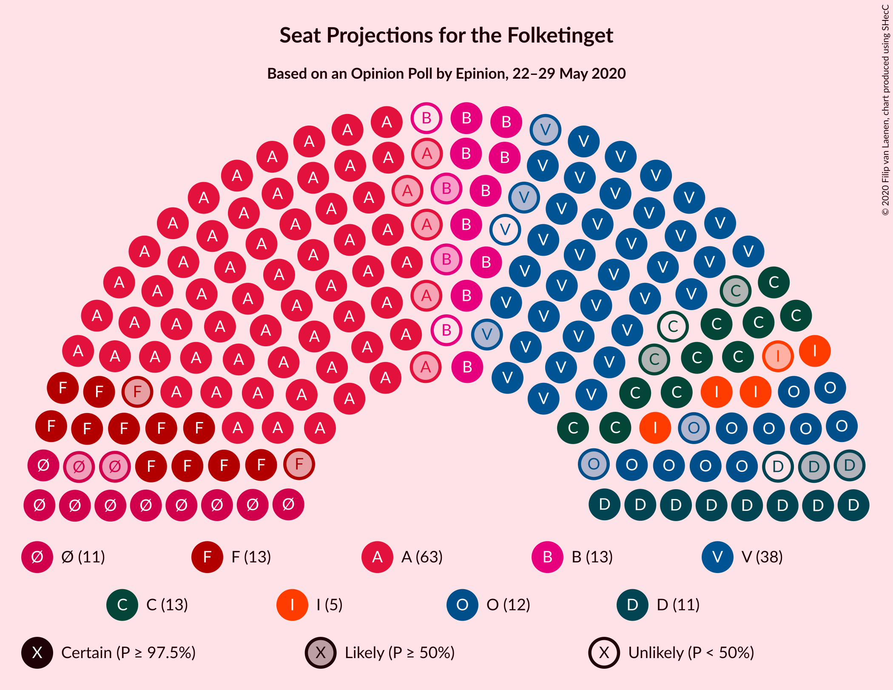
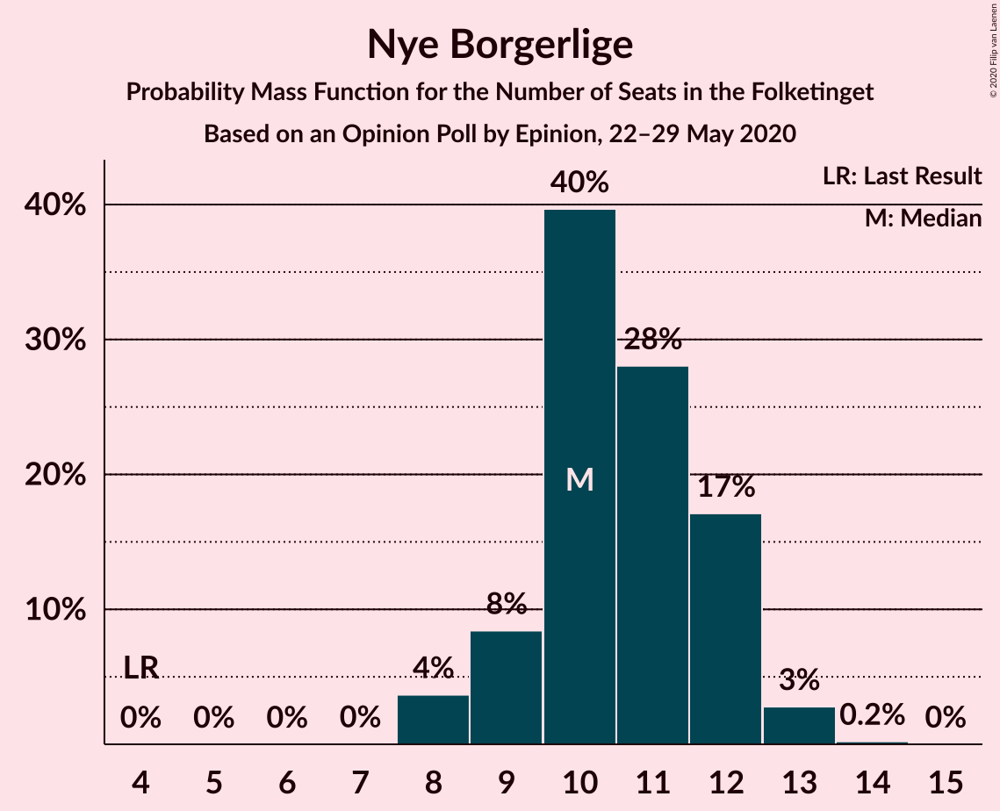

# Opinion Poll by Epinion, 22–29 May 2020

<a href="#voting-intentions">Voting Intentions</a> | <a href="#seats">Seats</a> | <a href="#coalitions">Coalitions</a> | <a href="#technical-information">Technical Information</a>

## Voting Intentions

### Confidence Intervals

| Party | Last Result | Poll Result | 80% Confidence Interval | 90% Confidence Interval | 95% Confidence Interval | 99% Confidence Interval |
|:-----:|:-----------:|:-----------:|:-----------------------:|:-----------------------:|:-----------------------:|:-----------------------:|
| Socialdemokraterne | 25.9% | 34.5% | 33.0–36.0% |32.6–36.4% |32.2–36.8% |31.5–37.6% |
| Venstre | 23.4% | 20.4% | 19.2–21.7% |18.8–22.1% |18.5–22.4% |17.9–23.1% |
| Socialistisk Folkeparti | 7.7% | 7.3% | 6.5–8.2% |6.3–8.5% |6.1–8.7% |5.8–9.1% |
| Det Konservative Folkeparti | 6.6% | 6.9% | 6.1–7.8% |5.9–8.0% |5.7–8.2% |5.4–8.7% |
| Dansk Folkeparti | 8.7% | 6.8% | 6.1–7.7% |5.9–7.9% |5.7–8.2% |5.4–8.6% |
| Radikale Venstre | 8.6% | 6.2% | 5.5–7.0% |5.3–7.3% |5.1–7.5% |4.8–7.9% |
| Enhedslisten–De Rød-Grønne | 6.9% | 6.1% | 5.4–6.9% |5.2–7.1% |5.0–7.4% |4.7–7.8% |
| Nye Borgerlige | 2.4% | 5.8% | 5.1–6.6% |4.9–6.8% |4.8–7.0% |4.5–7.4% |
| Liberal Alliance | 2.3% | 2.8% | 2.3–3.4% |2.2–3.6% |2.1–3.7% |1.9–4.0% |
| Alternativet | 3.0% | 1.1% | 0.8–1.5% |0.7–1.6% |0.7–1.7% |0.6–2.0% |
| Stram Kurs | 1.8% | 0.8% | 0.6–1.2% |0.5–1.3% |0.5–1.4% |0.4–1.6% |

*Note:* The poll result column reflects the actual value used in the calculations. Published results may vary slightly, and in addition be rounded to fewer digits.

## Seats

### Confidence Intervals

| Party | Last Result | Median | 80% Confidence Interval | 90% Confidence Interval | 95% Confidence Interval | 99% Confidence Interval |
|:-----:|:-----------:|:------:|:-----------------------:|:-----------------------:|:-----------------------:|:-----------------------:|
| <a href="#socialdemokraterne">Socialdemokraterne</a> | 48 | 63 | 60–65 |59–65 |58–67 |57–69 |
| <a href="#venstre">Venstre</a> | 43 | 37 | 34–38 |34–39 |34–40 |32–41 |
| <a href="#socialistisk-folkeparti">Socialistisk Folkeparti</a> | 14 | 13 | 12–14 |12–15 |11–16 |10–17 |
| <a href="#det-konservative-folkeparti">Det Konservative Folkeparti</a> | 12 | 12 | 11–14 |11–14 |10–15 |10–15 |
| <a href="#dansk-folkeparti">Dansk Folkeparti</a> | 16 | 12 | 11–14 |10–14 |10–14 |10–15 |
| <a href="#radikale-venstre">Radikale Venstre</a> | 16 | 11 | 10–13 |10–13 |9–13 |9–14 |
| <a href="#enhedslisten–de-rød-grønne">Enhedslisten–De Rød-Grønne</a> | 13 | 11 | 10–13 |10–13 |9–13 |9–13 |
| <a href="#nye-borgerlige">Nye Borgerlige</a> | 4 | 10 | 9–12 |9–12 |8–13 |8–13 |
| <a href="#liberal-alliance">Liberal Alliance</a> | 4 | 5 | 4–6 |4–6 |4–6 |4–7 |
| <a href="#alternativet">Alternativet</a> | 5 | 0 | 0 |0 |0 |0 |
| <a href="#stram-kurs">Stram Kurs</a> | 0 | 0 | 0 |0 |0 |0 |

### Socialdemokraterne

*For a full overview of the results for this party, see the [Socialdemokraterne](party-socialdemokraterne.html) page.*

| Number of Seats | Probability | Accumulated | Special Marks |
|:---------------:|:-----------:|:-----------:|:-------------:|
| 48 | 0% | 100% | Last Result |
| 49 | 0% | 100% |  |
| 50 | 0% | 100% |  |
| 51 | 0% | 100% |  |
| 52 | 0% | 100% |  |
| 53 | 0% | 100% |  |
| 54 | 0% | 100% |  |
| 55 | 0.1% | 100% |  |
| 56 | 0.1% | 99.9% |  |
| 57 | 2% | 99.8% |  |
| 58 | 2% | 98% |  |
| 59 | 5% | 96% |  |
| 60 | 5% | 91% |  |
| 61 | 9% | 87% |  |
| 62 | 22% | 78% |  |
| 63 | 38% | 55% | Median |
| 64 | 4% | 17% |  |
| 65 | 9% | 13% |  |
| 66 | 0.6% | 3% |  |
| 67 | 2% | 3% |  |
| 68 | 0.4% | 0.9% |  |
| 69 | 0.5% | 0.5% |  |
| 70 | 0% | 0% |  |

### Venstre

*For a full overview of the results for this party, see the [Venstre](party-venstre.html) page.*

| Number of Seats | Probability | Accumulated | Special Marks |
|:---------------:|:-----------:|:-----------:|:-------------:|
| 32 | 0.6% | 100% |  |
| 33 | 0.8% | 99.3% |  |
| 34 | 10% | 98.6% |  |
| 35 | 13% | 89% |  |
| 36 | 8% | 75% |  |
| 37 | 25% | 68% | Median |
| 38 | 35% | 43% |  |
| 39 | 3% | 8% |  |
| 40 | 3% | 5% |  |
| 41 | 1.4% | 2% |  |
| 42 | 0.2% | 0.2% |  |
| 43 | 0% | 0% | Last Result |

### Socialistisk Folkeparti

*For a full overview of the results for this party, see the [Socialistisk Folkeparti](party-socialistiskfolkeparti.html) page.*

| Number of Seats | Probability | Accumulated | Special Marks |
|:---------------:|:-----------:|:-----------:|:-------------:|
| 10 | 0.8% | 100% |  |
| 11 | 4% | 99.2% |  |
| 12 | 33% | 95% |  |
| 13 | 34% | 63% | Median |
| 14 | 22% | 29% | Last Result |
| 15 | 4% | 8% |  |
| 16 | 2% | 3% |  |
| 17 | 0.6% | 0.6% |  |
| 18 | 0% | 0% |  |

### Det Konservative Folkeparti

*For a full overview of the results for this party, see the [Det Konservative Folkeparti](party-detkonservativefolkeparti.html) page.*

| Number of Seats | Probability | Accumulated | Special Marks |
|:---------------:|:-----------:|:-----------:|:-------------:|
| 9 | 0.1% | 100% |  |
| 10 | 3% | 99.9% |  |
| 11 | 18% | 97% |  |
| 12 | 33% | 79% | Last Result, Median |
| 13 | 26% | 45% |  |
| 14 | 16% | 19% |  |
| 15 | 3% | 3% |  |
| 16 | 0.2% | 0.2% |  |
| 17 | 0% | 0% |  |

### Dansk Folkeparti

*For a full overview of the results for this party, see the [Dansk Folkeparti](party-danskfolkeparti.html) page.*

| Number of Seats | Probability | Accumulated | Special Marks |
|:---------------:|:-----------:|:-----------:|:-------------:|
| 9 | 0.1% | 100% |  |
| 10 | 8% | 99.9% |  |
| 11 | 12% | 92% |  |
| 12 | 36% | 80% | Median |
| 13 | 24% | 44% |  |
| 14 | 17% | 20% |  |
| 15 | 2% | 2% |  |
| 16 | 0.1% | 0.1% | Last Result |
| 17 | 0% | 0% |  |

### Radikale Venstre

*For a full overview of the results for this party, see the [Radikale Venstre](party-radikalevenstre.html) page.*

| Number of Seats | Probability | Accumulated | Special Marks |
|:---------------:|:-----------:|:-----------:|:-------------:|
| 8 | 0.2% | 100% |  |
| 9 | 3% | 99.8% |  |
| 10 | 27% | 97% |  |
| 11 | 27% | 70% | Median |
| 12 | 22% | 43% |  |
| 13 | 20% | 21% |  |
| 14 | 0.9% | 1.0% |  |
| 15 | 0.1% | 0.1% |  |
| 16 | 0% | 0% | Last Result |

### Enhedslisten–De Rød-Grønne

*For a full overview of the results for this party, see the [Enhedslisten–De Rød-Grønne](party-enhedslisten–derød-grønne.html) page.*

| Number of Seats | Probability | Accumulated | Special Marks |
|:---------------:|:-----------:|:-----------:|:-------------:|
| 8 | 0.2% | 100% |  |
| 9 | 4% | 99.8% |  |
| 10 | 29% | 95% |  |
| 11 | 36% | 66% | Median |
| 12 | 13% | 30% |  |
| 13 | 16% | 17% | Last Result |
| 14 | 0.2% | 0.3% |  |
| 15 | 0% | 0.1% |  |
| 16 | 0% | 0% |  |

### Nye Borgerlige

*For a full overview of the results for this party, see the [Nye Borgerlige](party-nyeborgerlige.html) page.*

| Number of Seats | Probability | Accumulated | Special Marks |
|:---------------:|:-----------:|:-----------:|:-------------:|
| 4 | 0% | 100% | Last Result |
| 5 | 0% | 100% |  |
| 6 | 0% | 100% |  |
| 7 | 0% | 100% |  |
| 8 | 4% | 100% |  |
| 9 | 8% | 96% |  |
| 10 | 40% | 88% | Median |
| 11 | 28% | 48% |  |
| 12 | 17% | 20% |  |
| 13 | 3% | 3% |  |
| 14 | 0.2% | 0.2% |  |
| 15 | 0% | 0% |  |

### Liberal Alliance

*For a full overview of the results for this party, see the [Liberal Alliance](party-liberalalliance.html) page.*

| Number of Seats | Probability | Accumulated | Special Marks |
|:---------------:|:-----------:|:-----------:|:-------------:|
| 0 | 0.5% | 100% |  |
| 1 | 0% | 99.5% |  |
| 2 | 0% | 99.5% |  |
| 3 | 0% | 99.5% |  |
| 4 | 26% | 99.5% | Last Result |
| 5 | 57% | 74% | Median |
| 6 | 15% | 17% |  |
| 7 | 2% | 2% |  |
| 8 | 0.1% | 0.1% |  |
| 9 | 0% | 0% |  |

### Alternativet

*For a full overview of the results for this party, see the [Alternativet](party-alternativet.html) page.*

| Number of Seats | Probability | Accumulated | Special Marks |
|:---------------:|:-----------:|:-----------:|:-------------:|
| 0 | 99.8% | 100% | Median |
| 1 | 0% | 0.2% |  |
| 2 | 0% | 0.2% |  |
| 3 | 0% | 0.2% |  |
| 4 | 0.2% | 0.2% |  |
| 5 | 0% | 0% | Last Result |

### Stram Kurs

*For a full overview of the results for this party, see the [Stram Kurs](party-stramkurs.html) page.*

| Number of Seats | Probability | Accumulated | Special Marks |
|:---------------:|:-----------:|:-----------:|:-------------:|
| 0 | 100% | 100% | Last Result, Median |

## Coalitions

### Confidence Intervals

| Coalition | Last Result | Median | Majority? | 80% Confidence Interval | 90% Confidence Interval | 95% Confidence Interval | 99% Confidence Interval |
|:---------:|:-----------:|:------:|:---------:|:-----------------------:|:-----------------------:|:-----------------------:|:-----------------------:|
| Socialdemokraterne – Socialistisk Folkeparti – Radikale Venstre – Enhedslisten–De Rød-Grønne – Alternativet | 96 | 99 | 100% | 95–100 | 94–100 | 93–101 | 91–103 |
| Socialdemokraterne – Socialistisk Folkeparti – Radikale Venstre – Enhedslisten–De Rød-Grønne | 91 | 99 | 100% | 95–100 | 94–100 | 93–101 | 91–103 |
| Socialdemokraterne – Socialistisk Folkeparti – Radikale Venstre | 78 | 87 | 7% | 85–89 | 83–91 | 82–91 | 80–92 |
| Socialdemokraterne – Socialistisk Folkeparti – Enhedslisten–De Rød-Grønne – Alternativet | 80 | 86 | 10% | 84–90 | 83–90 | 82–90 | 81–92 |
| Socialdemokraterne – Socialistisk Folkeparti – Enhedslisten–De Rød-Grønne | 75 | 86 | 10% | 84–90 | 83–90 | 82–90 | 81–92 |
| Venstre – Det Konservative Folkeparti – Dansk Folkeparti – Nye Borgerlige – Liberal Alliance | 79 | 76 | 0% | 75–80 | 74–81 | 74–82 | 72–84 |
| Socialdemokraterne – Radikale Venstre | 64 | 74 | 0% | 71–76 | 70–77 | 69–78 | 68–79 |
| Venstre – Det Konservative Folkeparti – Dansk Folkeparti – Liberal Alliance | 75 | 66 | 0% | 65–70 | 65–71 | 64–71 | 61–72 |
| Venstre – Det Konservative Folkeparti – Liberal Alliance | 59 | 54 | 0% | 52–57 | 52–58 | 52–58 | 49–59 |
| Venstre – Det Konservative Folkeparti | 55 | 50 | 0% | 47–51 | 47–52 | 46–54 | 44–54 |
| Venstre | 43 | 37 | 0% | 34–38 | 34–39 | 34–40 | 32–41 |

### Socialdemokraterne – Socialistisk Folkeparti – Radikale Venstre – Enhedslisten–De Rød-Grønne – Alternativet

| Number of Seats | Probability | Accumulated | Special Marks |
|:---------------:|:-----------:|:-----------:|:-------------:|
| 90 | 0% | 100% | Majority |
| 91 | 0.7% | 99.9% |  |
| 92 | 0.1% | 99.3% |  |
| 93 | 4% | 99.2% |  |
| 94 | 2% | 96% |  |
| 95 | 10% | 94% |  |
| 96 | 6% | 84% | Last Result |
| 97 | 24% | 78% |  |
| 98 | 2% | 55% | Median |
| 99 | 36% | 52% |  |
| 100 | 11% | 16% |  |
| 101 | 3% | 4% |  |
| 102 | 1.0% | 2% |  |
| 103 | 0.3% | 0.6% |  |
| 104 | 0.2% | 0.4% |  |
| 105 | 0.1% | 0.1% |  |
| 106 | 0% | 0% |  |

### Socialdemokraterne – Socialistisk Folkeparti – Radikale Venstre – Enhedslisten–De Rød-Grønne

| Number of Seats | Probability | Accumulated | Special Marks |
|:---------------:|:-----------:|:-----------:|:-------------:|
| 90 | 0% | 100% | Majority |
| 91 | 0.7% | 99.9% | Last Result |
| 92 | 0.1% | 99.2% |  |
| 93 | 4% | 99.1% |  |
| 94 | 2% | 96% |  |
| 95 | 10% | 94% |  |
| 96 | 6% | 84% |  |
| 97 | 24% | 78% |  |
| 98 | 2% | 55% | Median |
| 99 | 36% | 52% |  |
| 100 | 11% | 16% |  |
| 101 | 3% | 4% |  |
| 102 | 1.0% | 2% |  |
| 103 | 0.3% | 0.6% |  |
| 104 | 0.2% | 0.4% |  |
| 105 | 0.1% | 0.1% |  |
| 106 | 0% | 0% |  |

### Socialdemokraterne – Socialistisk Folkeparti – Radikale Venstre

| Number of Seats | Probability | Accumulated | Special Marks |
|:---------------:|:-----------:|:-----------:|:-------------:|
| 78 | 0% | 100% | Last Result |
| 79 | 0% | 100% |  |
| 80 | 0.5% | 99.9% |  |
| 81 | 1.1% | 99.5% |  |
| 82 | 1.5% | 98% |  |
| 83 | 3% | 97% |  |
| 84 | 2% | 94% |  |
| 85 | 17% | 92% |  |
| 86 | 23% | 75% |  |
| 87 | 14% | 52% | Median |
| 88 | 27% | 38% |  |
| 89 | 4% | 12% |  |
| 90 | 1.5% | 7% | Majority |
| 91 | 5% | 6% |  |
| 92 | 0.3% | 0.6% |  |
| 93 | 0.2% | 0.3% |  |
| 94 | 0.1% | 0.1% |  |
| 95 | 0% | 0% |  |

### Socialdemokraterne – Socialistisk Folkeparti – Enhedslisten–De Rød-Grønne – Alternativet

| Number of Seats | Probability | Accumulated | Special Marks |
|:---------------:|:-----------:|:-----------:|:-------------:|
| 79 | 0.1% | 100% |  |
| 80 | 0.3% | 99.9% | Last Result |
| 81 | 1.4% | 99.6% |  |
| 82 | 3% | 98% |  |
| 83 | 2% | 95% |  |
| 84 | 5% | 93% |  |
| 85 | 20% | 88% |  |
| 86 | 26% | 68% |  |
| 87 | 11% | 43% | Median |
| 88 | 14% | 31% |  |
| 89 | 7% | 18% |  |
| 90 | 8% | 10% | Majority |
| 91 | 0.9% | 2% |  |
| 92 | 0.9% | 1.1% |  |
| 93 | 0.1% | 0.2% |  |
| 94 | 0.1% | 0.2% |  |
| 95 | 0% | 0% |  |

### Socialdemokraterne – Socialistisk Folkeparti – Enhedslisten–De Rød-Grønne

| Number of Seats | Probability | Accumulated | Special Marks |
|:---------------:|:-----------:|:-----------:|:-------------:|
| 75 | 0% | 100% | Last Result |
| 76 | 0% | 100% |  |
| 77 | 0% | 100% |  |
| 78 | 0% | 100% |  |
| 79 | 0.1% | 100% |  |
| 80 | 0.3% | 99.9% |  |
| 81 | 1.4% | 99.6% |  |
| 82 | 3% | 98% |  |
| 83 | 2% | 95% |  |
| 84 | 5% | 93% |  |
| 85 | 20% | 88% |  |
| 86 | 26% | 68% |  |
| 87 | 11% | 43% | Median |
| 88 | 14% | 31% |  |
| 89 | 7% | 18% |  |
| 90 | 8% | 10% | Majority |
| 91 | 0.8% | 2% |  |
| 92 | 0.8% | 1.1% |  |
| 93 | 0.1% | 0.2% |  |
| 94 | 0.1% | 0.2% |  |
| 95 | 0% | 0% |  |

### Venstre – Det Konservative Folkeparti – Dansk Folkeparti – Nye Borgerlige – Liberal Alliance

| Number of Seats | Probability | Accumulated | Special Marks |
|:---------------:|:-----------:|:-----------:|:-------------:|
| 70 | 0.1% | 100% |  |
| 71 | 0.3% | 99.8% |  |
| 72 | 0.4% | 99.6% |  |
| 73 | 1.0% | 99.1% |  |
| 74 | 3% | 98% |  |
| 75 | 11% | 95% |  |
| 76 | 36% | 83% | Median |
| 77 | 3% | 47% |  |
| 78 | 23% | 44% |  |
| 79 | 6% | 21% | Last Result |
| 80 | 10% | 16% |  |
| 81 | 2% | 6% |  |
| 82 | 3% | 4% |  |
| 83 | 0.1% | 0.8% |  |
| 84 | 0.7% | 0.7% |  |
| 85 | 0% | 0% |  |

### Socialdemokraterne – Radikale Venstre

| Number of Seats | Probability | Accumulated | Special Marks |
|:---------------:|:-----------:|:-----------:|:-------------:|
| 64 | 0% | 100% | Last Result |
| 65 | 0.1% | 100% |  |
| 66 | 0.1% | 99.9% |  |
| 67 | 0.1% | 99.9% |  |
| 68 | 0.9% | 99.8% |  |
| 69 | 2% | 98.8% |  |
| 70 | 3% | 97% |  |
| 71 | 8% | 94% |  |
| 72 | 17% | 86% |  |
| 73 | 19% | 69% |  |
| 74 | 5% | 50% | Median |
| 75 | 21% | 45% |  |
| 76 | 17% | 24% |  |
| 77 | 4% | 7% |  |
| 78 | 2% | 3% |  |
| 79 | 0.5% | 0.7% |  |
| 80 | 0.1% | 0.2% |  |
| 81 | 0% | 0.1% |  |
| 82 | 0% | 0% |  |

### Venstre – Det Konservative Folkeparti – Dansk Folkeparti – Liberal Alliance

| Number of Seats | Probability | Accumulated | Special Marks |
|:---------------:|:-----------:|:-----------:|:-------------:|
| 59 | 0% | 100% |  |
| 60 | 0.2% | 99.9% |  |
| 61 | 0.3% | 99.7% |  |
| 62 | 0.4% | 99.4% |  |
| 63 | 1.0% | 99.0% |  |
| 64 | 2% | 98% |  |
| 65 | 31% | 96% |  |
| 66 | 35% | 65% | Median |
| 67 | 6% | 30% |  |
| 68 | 3% | 24% |  |
| 69 | 2% | 21% |  |
| 70 | 12% | 19% |  |
| 71 | 5% | 6% |  |
| 72 | 1.3% | 2% |  |
| 73 | 0.3% | 0.3% |  |
| 74 | 0% | 0% |  |
| 75 | 0% | 0% | Last Result |

### Venstre – Det Konservative Folkeparti – Liberal Alliance

| Number of Seats | Probability | Accumulated | Special Marks |
|:---------------:|:-----------:|:-----------:|:-------------:|
| 47 | 0% | 100% |  |
| 48 | 0.2% | 99.9% |  |
| 49 | 0.2% | 99.7% |  |
| 50 | 0.5% | 99.5% |  |
| 51 | 1.3% | 99.0% |  |
| 52 | 14% | 98% |  |
| 53 | 22% | 83% |  |
| 54 | 23% | 61% | Median |
| 55 | 15% | 38% |  |
| 56 | 13% | 24% |  |
| 57 | 4% | 11% |  |
| 58 | 5% | 6% |  |
| 59 | 2% | 2% | Last Result |
| 60 | 0.1% | 0.2% |  |
| 61 | 0.1% | 0.1% |  |
| 62 | 0% | 0% |  |

### Venstre – Det Konservative Folkeparti

| Number of Seats | Probability | Accumulated | Special Marks |
|:---------------:|:-----------:|:-----------:|:-------------:|
| 43 | 0.1% | 100% |  |
| 44 | 0.4% | 99.9% |  |
| 45 | 0.6% | 99.5% |  |
| 46 | 3% | 98.9% |  |
| 47 | 13% | 96% |  |
| 48 | 21% | 83% |  |
| 49 | 11% | 62% | Median |
| 50 | 26% | 51% |  |
| 51 | 14% | 24% |  |
| 52 | 6% | 10% |  |
| 53 | 1.3% | 4% |  |
| 54 | 2% | 3% |  |
| 55 | 0.1% | 0.2% | Last Result |
| 56 | 0% | 0% |  |

### Venstre

| Number of Seats | Probability | Accumulated | Special Marks |
|:---------------:|:-----------:|:-----------:|:-------------:|
| 32 | 0.6% | 100% |  |
| 33 | 0.8% | 99.3% |  |
| 34 | 10% | 98.6% |  |
| 35 | 13% | 89% |  |
| 36 | 8% | 75% |  |
| 37 | 25% | 68% | Median |
| 38 | 35% | 43% |  |
| 39 | 3% | 8% |  |
| 40 | 3% | 5% |  |
| 41 | 1.4% | 2% |  |
| 42 | 0.2% | 0.2% |  |
| 43 | 0% | 0% | Last Result |

## Technical Information

### Opinion Poll

+ **Polling firm:** Epinion
+ **Commissioner(s):** —
+ **Fieldwork period:** 22–29 May 2020

### Calculations

+ **Sample size:** 1642
+ **Simulations done:** 1,048,576
+ **Error estimate:** 0.87%

