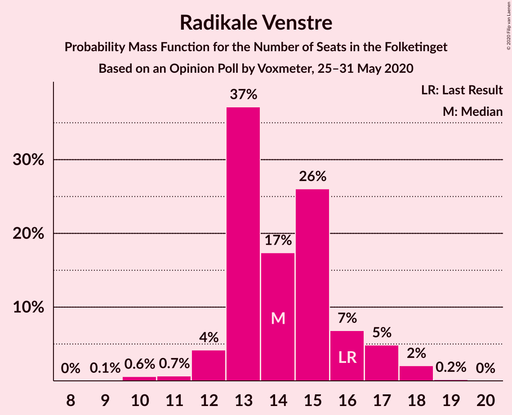
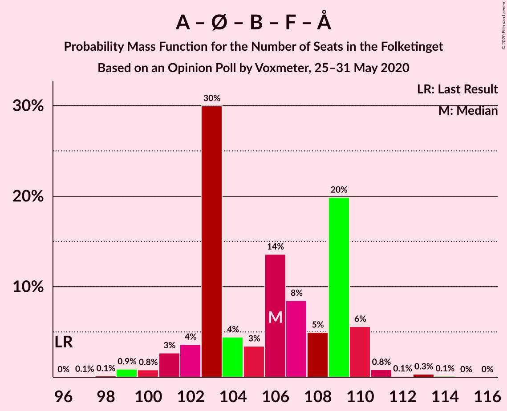

# Opinion Poll by Voxmeter, 25–31 May 2020

<a href="#voting-intentions">Voting Intentions</a> | <a href="#seats">Seats</a> | <a href="#coalitions">Coalitions</a> | <a href="#technical-information">Technical Information</a>

## Voting Intentions

### Confidence Intervals

| Party | Last Result | Poll Result | 80% Confidence Interval | 90% Confidence Interval | 95% Confidence Interval | 99% Confidence Interval |
|:-----:|:-----------:|:-----------:|:-----------------------:|:-----------------------:|:-----------------------:|:-----------------------:|
| Socialdemokraterne | 25.9% | 34.7% | 32.9–36.7% |32.4–37.2% |31.9–37.7% |31.0–38.6% |
| Venstre | 23.4% | 19.6% | 18.1–21.2% |17.6–21.7% |17.3–22.1% |16.6–22.9% |
| Enhedslisten–De Rød-Grønne | 6.9% | 9.0% | 7.9–10.2% |7.6–10.6% |7.4–10.9% |6.9–11.5% |
| Radikale Venstre | 8.6% | 7.7% | 6.8–8.9% |6.5–9.2% |6.2–9.5% |5.8–10.1% |
| Socialistisk Folkeparti | 7.7% | 7.7% | 6.8–8.9% |6.5–9.2% |6.2–9.5% |5.8–10.1% |
| Det Konservative Folkeparti | 6.6% | 7.6% | 6.7–8.8% |6.4–9.1% |6.2–9.4% |5.7–10.0% |
| Dansk Folkeparti | 8.7% | 6.6% | 5.7–7.7% |5.4–8.0% |5.2–8.2% |4.8–8.8% |
| Nye Borgerlige | 2.4% | 2.7% | 2.1–3.5% |2.0–3.7% |1.9–3.9% |1.6–4.3% |
| Liberal Alliance | 2.3% | 2.5% | 2.0–3.3% |1.8–3.5% |1.7–3.7% |1.5–4.1% |
| Alternativet | 3.0% | 0.5% | 0.3–0.9% |0.2–1.0% |0.2–1.1% |0.1–1.4% |
| Stram Kurs | 1.8% | 0.5% | 0.3–0.9% |0.2–1.0% |0.2–1.1% |0.1–1.4% |

*Note:* The poll result column reflects the actual value used in the calculations. Published results may vary slightly, and in addition be rounded to fewer digits.

## Seats

### Confidence Intervals

| Party | Last Result | Median | 80% Confidence Interval | 90% Confidence Interval | 95% Confidence Interval | 99% Confidence Interval |
|:-----:|:-----------:|:------:|:-----------------------:|:-----------------------:|:-----------------------:|:-----------------------:|
| <a href="#socialdemokraterne">Socialdemokraterne</a> | 48 | 61 | 58–64 |57–65 |57–66 |55–68 |
| <a href="#venstre">Venstre</a> | 43 | 35 | 31–38 |31–39 |31–39 |30–40 |
| <a href="#enhedslisten–de-rød-grønne">Enhedslisten–De Rød-Grønne</a> | 13 | 16 | 14–18 |14–19 |13–19 |13–20 |
| <a href="#radikale-venstre">Radikale Venstre</a> | 16 | 14 | 13–16 |12–17 |12–17 |10–18 |
| <a href="#socialistisk-folkeparti">Socialistisk Folkeparti</a> | 14 | 14 | 13–16 |12–16 |11–17 |11–18 |
| <a href="#det-konservative-folkeparti">Det Konservative Folkeparti</a> | 12 | 14 | 12–15 |12–16 |11–17 |10–18 |
| <a href="#dansk-folkeparti">Dansk Folkeparti</a> | 16 | 12 | 10–13 |9–14 |9–14 |8–15 |
| <a href="#nye-borgerlige">Nye Borgerlige</a> | 4 | 5 | 4–6 |4–7 |0–7 |0–7 |
| <a href="#liberal-alliance">Liberal Alliance</a> | 4 | 4 | 3–5 |0–6 |0–6 |0–7 |
| <a href="#alternativet">Alternativet</a> | 5 | 0 | 0 |0 |0 |0 |
| <a href="#stram-kurs">Stram Kurs</a> | 0 | 0 | 0 |0 |0 |0 |

### Socialdemokraterne

*For a full overview of the results for this party, see the [Socialdemokraterne](party-socialdemokraterne.html) page.*

| Number of Seats | Probability | Accumulated | Special Marks |
|:---------------:|:-----------:|:-----------:|:-------------:|
| 48 | 0% | 100% | Last Result |
| 49 | 0% | 100% |  |
| 50 | 0% | 100% |  |
| 51 | 0% | 100% |  |
| 52 | 0% | 100% |  |
| 53 | 0% | 100% |  |
| 54 | 0.3% | 99.9% |  |
| 55 | 0.6% | 99.6% |  |
| 56 | 0.3% | 99.0% |  |
| 57 | 4% | 98.6% |  |
| 58 | 6% | 95% |  |
| 59 | 5% | 89% |  |
| 60 | 10% | 84% |  |
| 61 | 28% | 73% | Median |
| 62 | 4% | 45% |  |
| 63 | 27% | 41% |  |
| 64 | 8% | 14% |  |
| 65 | 0.9% | 6% |  |
| 66 | 3% | 5% |  |
| 67 | 1.0% | 2% |  |
| 68 | 0.7% | 1.0% |  |
| 69 | 0.3% | 0.4% |  |
| 70 | 0% | 0.1% |  |
| 71 | 0% | 0% |  |

### Venstre

*For a full overview of the results for this party, see the [Venstre](party-venstre.html) page.*

| Number of Seats | Probability | Accumulated | Special Marks |
|:---------------:|:-----------:|:-----------:|:-------------:|
| 28 | 0.1% | 100% |  |
| 29 | 0.2% | 99.9% |  |
| 30 | 2% | 99.7% |  |
| 31 | 21% | 98% |  |
| 32 | 5% | 77% |  |
| 33 | 6% | 71% |  |
| 34 | 8% | 65% |  |
| 35 | 18% | 57% | Median |
| 36 | 6% | 39% |  |
| 37 | 4% | 33% |  |
| 38 | 22% | 29% |  |
| 39 | 5% | 7% |  |
| 40 | 1.3% | 2% |  |
| 41 | 0.2% | 0.3% |  |
| 42 | 0.1% | 0.2% |  |
| 43 | 0% | 0% | Last Result |

### Enhedslisten–De Rød-Grønne

*For a full overview of the results for this party, see the [Enhedslisten–De Rød-Grønne](party-enhedslisten–derød-grønne.html) page.*

| Number of Seats | Probability | Accumulated | Special Marks |
|:---------------:|:-----------:|:-----------:|:-------------:|
| 12 | 0.2% | 100% |  |
| 13 | 5% | 99.8% | Last Result |
| 14 | 9% | 95% |  |
| 15 | 34% | 87% |  |
| 16 | 15% | 52% | Median |
| 17 | 23% | 38% |  |
| 18 | 8% | 14% |  |
| 19 | 6% | 6% |  |
| 20 | 0.7% | 1.0% |  |
| 21 | 0.2% | 0.3% |  |
| 22 | 0% | 0% |  |

### Radikale Venstre

*For a full overview of the results for this party, see the [Radikale Venstre](party-radikalevenstre.html) page.*

| Number of Seats | Probability | Accumulated | Special Marks |
|:---------------:|:-----------:|:-----------:|:-------------:|
| 9 | 0.1% | 100% |  |
| 10 | 0.6% | 99.9% |  |
| 11 | 0.7% | 99.4% |  |
| 12 | 4% | 98.7% |  |
| 13 | 37% | 95% |  |
| 14 | 17% | 57% | Median |
| 15 | 26% | 40% |  |
| 16 | 7% | 14% | Last Result |
| 17 | 5% | 7% |  |
| 18 | 2% | 2% |  |
| 19 | 0.2% | 0.2% |  |
| 20 | 0% | 0% |  |

### Socialistisk Folkeparti

*For a full overview of the results for this party, see the [Socialistisk Folkeparti](party-socialistiskfolkeparti.html) page.*

| Number of Seats | Probability | Accumulated | Special Marks |
|:---------------:|:-----------:|:-----------:|:-------------:|
| 10 | 0.3% | 100% |  |
| 11 | 3% | 99.7% |  |
| 12 | 5% | 97% |  |
| 13 | 17% | 92% |  |
| 14 | 50% | 75% | Last Result, Median |
| 15 | 12% | 25% |  |
| 16 | 9% | 13% |  |
| 17 | 2% | 4% |  |
| 18 | 2% | 2% |  |
| 19 | 0.2% | 0.2% |  |
| 20 | 0% | 0% |  |

### Det Konservative Folkeparti

*For a full overview of the results for this party, see the [Det Konservative Folkeparti](party-detkonservativefolkeparti.html) page.*

| Number of Seats | Probability | Accumulated | Special Marks |
|:---------------:|:-----------:|:-----------:|:-------------:|
| 9 | 0.1% | 100% |  |
| 10 | 0.7% | 99.9% |  |
| 11 | 3% | 99.2% |  |
| 12 | 9% | 96% | Last Result |
| 13 | 30% | 87% |  |
| 14 | 15% | 57% | Median |
| 15 | 32% | 42% |  |
| 16 | 5% | 10% |  |
| 17 | 4% | 5% |  |
| 18 | 0.9% | 1.3% |  |
| 19 | 0.4% | 0.4% |  |
| 20 | 0% | 0% |  |

### Dansk Folkeparti

*For a full overview of the results for this party, see the [Dansk Folkeparti](party-danskfolkeparti.html) page.*

| Number of Seats | Probability | Accumulated | Special Marks |
|:---------------:|:-----------:|:-----------:|:-------------:|
| 8 | 1.1% | 100% |  |
| 9 | 6% | 98.9% |  |
| 10 | 30% | 93% |  |
| 11 | 10% | 63% |  |
| 12 | 29% | 53% | Median |
| 13 | 15% | 24% |  |
| 14 | 7% | 9% |  |
| 15 | 1.4% | 2% |  |
| 16 | 0.3% | 0.3% | Last Result |
| 17 | 0.1% | 0.1% |  |
| 18 | 0% | 0% |  |

### Nye Borgerlige

*For a full overview of the results for this party, see the [Nye Borgerlige](party-nyeborgerlige.html) page.*

| Number of Seats | Probability | Accumulated | Special Marks |
|:---------------:|:-----------:|:-----------:|:-------------:|
| 0 | 4% | 100% |  |
| 1 | 0% | 96% |  |
| 2 | 0% | 96% |  |
| 3 | 0.1% | 96% |  |
| 4 | 12% | 96% | Last Result |
| 5 | 48% | 84% | Median |
| 6 | 31% | 36% |  |
| 7 | 5% | 5% |  |
| 8 | 0.2% | 0.2% |  |
| 9 | 0% | 0% |  |

### Liberal Alliance

*For a full overview of the results for this party, see the [Liberal Alliance](party-liberalalliance.html) page.*

| Number of Seats | Probability | Accumulated | Special Marks |
|:---------------:|:-----------:|:-----------:|:-------------:|
| 0 | 10% | 100% |  |
| 1 | 0% | 90% |  |
| 2 | 0% | 90% |  |
| 3 | 0.3% | 90% |  |
| 4 | 56% | 90% | Last Result, Median |
| 5 | 24% | 34% |  |
| 6 | 8% | 9% |  |
| 7 | 1.3% | 1.3% |  |
| 8 | 0.1% | 0.1% |  |
| 9 | 0% | 0% |  |

### Alternativet

*For a full overview of the results for this party, see the [Alternativet](party-alternativet.html) page.*

| Number of Seats | Probability | Accumulated | Special Marks |
|:---------------:|:-----------:|:-----------:|:-------------:|
| 0 | 100% | 100% | Median |
| 1 | 0% | 0% |  |
| 2 | 0% | 0% |  |
| 3 | 0% | 0% |  |
| 4 | 0% | 0% |  |
| 5 | 0% | 0% | Last Result |

### Stram Kurs

*For a full overview of the results for this party, see the [Stram Kurs](party-stramkurs.html) page.*

| Number of Seats | Probability | Accumulated | Special Marks |
|:---------------:|:-----------:|:-----------:|:-------------:|
| 0 | 100% | 100% | Last Result, Median |

## Coalitions

### Confidence Intervals

| Coalition | Last Result | Median | Majority? | 80% Confidence Interval | 90% Confidence Interval | 95% Confidence Interval | 99% Confidence Interval |
|:---------:|:-----------:|:------:|:---------:|:-----------------------:|:-----------------------:|:-----------------------:|:-----------------------:|
| Socialdemokraterne – Enhedslisten–De Rød-Grønne – Radikale Venstre – Socialistisk Folkeparti – Alternativet | 96 | 106 | 100% | 103–109 | 102–110 | 101–110 | 99–113 |
| Socialdemokraterne – Enhedslisten–De Rød-Grønne – Radikale Venstre – Socialistisk Folkeparti | 91 | 106 | 100% | 103–109 | 102–110 | 101–110 | 99–113 |
| Socialdemokraterne – Enhedslisten–De Rød-Grønne – Socialistisk Folkeparti – Alternativet | 80 | 91 | 82% | 88–94 | 87–95 | 87–97 | 85–98 |
| Socialdemokraterne – Enhedslisten–De Rød-Grønne – Socialistisk Folkeparti | 75 | 91 | 82% | 88–94 | 87–95 | 87–97 | 85–98 |
| Socialdemokraterne – Radikale Venstre – Socialistisk Folkeparti | 78 | 90 | 54% | 86–93 | 85–93 | 84–95 | 83–97 |
| Socialdemokraterne – Radikale Venstre | 64 | 76 | 0% | 72–78 | 72–80 | 70–80 | 69–83 |
| Venstre – Det Konservative Folkeparti – Dansk Folkeparti – Nye Borgerlige – Liberal Alliance | 79 | 69 | 0% | 66–72 | 65–73 | 65–74 | 62–76 |
| Venstre – Det Konservative Folkeparti – Dansk Folkeparti – Liberal Alliance | 75 | 64 | 0% | 60–67 | 60–68 | 59–69 | 59–72 |
| Venstre – Det Konservative Folkeparti – Liberal Alliance | 59 | 53 | 0% | 48–57 | 48–57 | 48–58 | 47–60 |
| Venstre – Det Konservative Folkeparti | 55 | 49 | 0% | 44–53 | 44–53 | 44–53 | 43–57 |
| Venstre | 43 | 35 | 0% | 31–38 | 31–39 | 31–39 | 30–40 |

### Socialdemokraterne – Enhedslisten–De Rød-Grønne – Radikale Venstre – Socialistisk Folkeparti – Alternativet

| Number of Seats | Probability | Accumulated | Special Marks |
|:---------------:|:-----------:|:-----------:|:-------------:|
| 96 | 0% | 100% | Last Result |
| 97 | 0.1% | 100% |  |
| 98 | 0.1% | 99.9% |  |
| 99 | 0.9% | 99.8% |  |
| 100 | 0.8% | 98.9% |  |
| 101 | 3% | 98% |  |
| 102 | 4% | 95% |  |
| 103 | 30% | 92% |  |
| 104 | 4% | 62% |  |
| 105 | 3% | 57% | Median |
| 106 | 14% | 54% |  |
| 107 | 8% | 40% |  |
| 108 | 5% | 32% |  |
| 109 | 20% | 27% |  |
| 110 | 6% | 7% |  |
| 111 | 0.8% | 1.4% |  |
| 112 | 0.1% | 0.6% |  |
| 113 | 0.3% | 0.5% |  |
| 114 | 0.1% | 0.2% |  |
| 115 | 0% | 0% |  |

### Socialdemokraterne – Enhedslisten–De Rød-Grønne – Radikale Venstre – Socialistisk Folkeparti

| Number of Seats | Probability | Accumulated | Special Marks |
|:---------------:|:-----------:|:-----------:|:-------------:|
| 91 | 0% | 100% | Last Result |
| 92 | 0% | 100% |  |
| 93 | 0% | 100% |  |
| 94 | 0% | 100% |  |
| 95 | 0% | 100% |  |
| 96 | 0% | 100% |  |
| 97 | 0.1% | 100% |  |
| 98 | 0.1% | 99.9% |  |
| 99 | 0.9% | 99.8% |  |
| 100 | 0.8% | 98.9% |  |
| 101 | 3% | 98% |  |
| 102 | 4% | 95% |  |
| 103 | 30% | 92% |  |
| 104 | 4% | 62% |  |
| 105 | 3% | 57% | Median |
| 106 | 14% | 54% |  |
| 107 | 8% | 40% |  |
| 108 | 5% | 32% |  |
| 109 | 20% | 27% |  |
| 110 | 6% | 7% |  |
| 111 | 0.8% | 1.4% |  |
| 112 | 0.1% | 0.6% |  |
| 113 | 0.3% | 0.5% |  |
| 114 | 0.1% | 0.2% |  |
| 115 | 0% | 0% |  |

### Socialdemokraterne – Enhedslisten–De Rød-Grønne – Socialistisk Folkeparti – Alternativet

| Number of Seats | Probability | Accumulated | Special Marks |
|:---------------:|:-----------:|:-----------:|:-------------:|
| 80 | 0% | 100% | Last Result |
| 81 | 0% | 100% |  |
| 82 | 0% | 100% |  |
| 83 | 0.2% | 100% |  |
| 84 | 0.2% | 99.8% |  |
| 85 | 0.3% | 99.6% |  |
| 86 | 2% | 99.3% |  |
| 87 | 3% | 98% |  |
| 88 | 5% | 95% |  |
| 89 | 8% | 90% |  |
| 90 | 26% | 82% | Majority |
| 91 | 8% | 56% | Median |
| 92 | 10% | 48% |  |
| 93 | 8% | 38% |  |
| 94 | 23% | 31% |  |
| 95 | 2% | 7% |  |
| 96 | 2% | 5% |  |
| 97 | 2% | 3% |  |
| 98 | 0.6% | 1.0% |  |
| 99 | 0.2% | 0.3% |  |
| 100 | 0% | 0.2% |  |
| 101 | 0.1% | 0.1% |  |
| 102 | 0% | 0% |  |

### Socialdemokraterne – Enhedslisten–De Rød-Grønne – Socialistisk Folkeparti

| Number of Seats | Probability | Accumulated | Special Marks |
|:---------------:|:-----------:|:-----------:|:-------------:|
| 75 | 0% | 100% | Last Result |
| 76 | 0% | 100% |  |
| 77 | 0% | 100% |  |
| 78 | 0% | 100% |  |
| 79 | 0% | 100% |  |
| 80 | 0% | 100% |  |
| 81 | 0% | 100% |  |
| 82 | 0% | 100% |  |
| 83 | 0.2% | 100% |  |
| 84 | 0.2% | 99.8% |  |
| 85 | 0.3% | 99.6% |  |
| 86 | 2% | 99.3% |  |
| 87 | 3% | 98% |  |
| 88 | 5% | 95% |  |
| 89 | 8% | 90% |  |
| 90 | 26% | 82% | Majority |
| 91 | 8% | 56% | Median |
| 92 | 10% | 48% |  |
| 93 | 8% | 38% |  |
| 94 | 23% | 31% |  |
| 95 | 2% | 7% |  |
| 96 | 2% | 5% |  |
| 97 | 2% | 3% |  |
| 98 | 0.6% | 1.0% |  |
| 99 | 0.2% | 0.3% |  |
| 100 | 0% | 0.2% |  |
| 101 | 0.1% | 0.1% |  |
| 102 | 0% | 0% |  |

### Socialdemokraterne – Radikale Venstre – Socialistisk Folkeparti

| Number of Seats | Probability | Accumulated | Special Marks |
|:---------------:|:-----------:|:-----------:|:-------------:|
| 78 | 0% | 100% | Last Result |
| 79 | 0% | 100% |  |
| 80 | 0.1% | 100% |  |
| 81 | 0% | 99.9% |  |
| 82 | 0.4% | 99.9% |  |
| 83 | 2% | 99.5% |  |
| 84 | 0.7% | 98% |  |
| 85 | 6% | 97% |  |
| 86 | 4% | 91% |  |
| 87 | 4% | 87% |  |
| 88 | 24% | 83% |  |
| 89 | 5% | 60% | Median |
| 90 | 8% | 54% | Majority |
| 91 | 11% | 47% |  |
| 92 | 24% | 35% |  |
| 93 | 6% | 11% |  |
| 94 | 2% | 5% |  |
| 95 | 2% | 3% |  |
| 96 | 0.7% | 1.2% |  |
| 97 | 0.1% | 0.5% |  |
| 98 | 0.2% | 0.4% |  |
| 99 | 0% | 0.2% |  |
| 100 | 0.2% | 0.2% |  |
| 101 | 0% | 0% |  |

### Socialdemokraterne – Radikale Venstre

| Number of Seats | Probability | Accumulated | Special Marks |
|:---------------:|:-----------:|:-----------:|:-------------:|
| 64 | 0% | 100% | Last Result |
| 65 | 0% | 100% |  |
| 66 | 0.1% | 100% |  |
| 67 | 0% | 99.9% |  |
| 68 | 0.1% | 99.9% |  |
| 69 | 2% | 99.8% |  |
| 70 | 2% | 98% |  |
| 71 | 1.3% | 96% |  |
| 72 | 7% | 95% |  |
| 73 | 2% | 88% |  |
| 74 | 28% | 86% |  |
| 75 | 4% | 58% | Median |
| 76 | 15% | 53% |  |
| 77 | 4% | 38% |  |
| 78 | 26% | 34% |  |
| 79 | 3% | 8% |  |
| 80 | 4% | 6% |  |
| 81 | 0.9% | 2% |  |
| 82 | 0.8% | 1.4% |  |
| 83 | 0.3% | 0.6% |  |
| 84 | 0.2% | 0.3% |  |
| 85 | 0% | 0% |  |

### Venstre – Det Konservative Folkeparti – Dansk Folkeparti – Nye Borgerlige – Liberal Alliance

| Number of Seats | Probability | Accumulated | Special Marks |
|:---------------:|:-----------:|:-----------:|:-------------:|
| 61 | 0.1% | 100% |  |
| 62 | 0.3% | 99.8% |  |
| 63 | 0.1% | 99.5% |  |
| 64 | 0.8% | 99.4% |  |
| 65 | 6% | 98.5% |  |
| 66 | 20% | 93% |  |
| 67 | 5% | 73% |  |
| 68 | 8% | 68% |  |
| 69 | 14% | 60% |  |
| 70 | 3% | 46% | Median |
| 71 | 4% | 43% |  |
| 72 | 30% | 38% |  |
| 73 | 4% | 8% |  |
| 74 | 3% | 5% |  |
| 75 | 0.8% | 2% |  |
| 76 | 0.8% | 1.1% |  |
| 77 | 0.1% | 0.2% |  |
| 78 | 0.1% | 0.1% |  |
| 79 | 0% | 0% | Last Result |

### Venstre – Det Konservative Folkeparti – Dansk Folkeparti – Liberal Alliance

| Number of Seats | Probability | Accumulated | Special Marks |
|:---------------:|:-----------:|:-----------:|:-------------:|
| 56 | 0% | 100% |  |
| 57 | 0.2% | 99.9% |  |
| 58 | 0.2% | 99.7% |  |
| 59 | 2% | 99.6% |  |
| 60 | 20% | 97% |  |
| 61 | 5% | 78% |  |
| 62 | 3% | 73% |  |
| 63 | 7% | 70% |  |
| 64 | 15% | 63% |  |
| 65 | 6% | 48% | Median |
| 66 | 3% | 42% |  |
| 67 | 31% | 39% |  |
| 68 | 4% | 7% |  |
| 69 | 1.4% | 4% |  |
| 70 | 1.1% | 2% |  |
| 71 | 0.7% | 1.2% |  |
| 72 | 0.1% | 0.6% |  |
| 73 | 0.1% | 0.5% |  |
| 74 | 0.4% | 0.4% |  |
| 75 | 0% | 0% | Last Result |

### Venstre – Det Konservative Folkeparti – Liberal Alliance

| Number of Seats | Probability | Accumulated | Special Marks |
|:---------------:|:-----------:|:-----------:|:-------------:|
| 44 | 0% | 100% |  |
| 45 | 0.1% | 99.9% |  |
| 46 | 0.2% | 99.9% |  |
| 47 | 2% | 99.6% |  |
| 48 | 21% | 98% |  |
| 49 | 2% | 77% |  |
| 50 | 3% | 75% |  |
| 51 | 13% | 72% |  |
| 52 | 7% | 59% |  |
| 53 | 6% | 52% | Median |
| 54 | 8% | 46% |  |
| 55 | 7% | 38% |  |
| 56 | 3% | 31% |  |
| 57 | 24% | 27% |  |
| 58 | 2% | 3% |  |
| 59 | 0.3% | 1.2% | Last Result |
| 60 | 0.5% | 0.9% |  |
| 61 | 0.4% | 0.5% |  |
| 62 | 0% | 0.1% |  |
| 63 | 0.1% | 0.1% |  |
| 64 | 0% | 0% |  |

### Venstre – Det Konservative Folkeparti

| Number of Seats | Probability | Accumulated | Special Marks |
|:---------------:|:-----------:|:-----------:|:-------------:|
| 41 | 0.1% | 100% |  |
| 42 | 0.1% | 99.9% |  |
| 43 | 0.6% | 99.8% |  |
| 44 | 22% | 99.1% |  |
| 45 | 1.1% | 77% |  |
| 46 | 6% | 76% |  |
| 47 | 12% | 69% |  |
| 48 | 4% | 58% |  |
| 49 | 9% | 53% | Median |
| 50 | 7% | 45% |  |
| 51 | 9% | 38% |  |
| 52 | 3% | 30% |  |
| 53 | 25% | 27% |  |
| 54 | 0.3% | 2% |  |
| 55 | 0.3% | 1.2% | Last Result |
| 56 | 0.4% | 0.9% |  |
| 57 | 0.4% | 0.5% |  |
| 58 | 0.1% | 0.1% |  |
| 59 | 0% | 0% |  |

### Venstre

| Number of Seats | Probability | Accumulated | Special Marks |
|:---------------:|:-----------:|:-----------:|:-------------:|
| 28 | 0.1% | 100% |  |
| 29 | 0.2% | 99.9% |  |
| 30 | 2% | 99.7% |  |
| 31 | 21% | 98% |  |
| 32 | 5% | 77% |  |
| 33 | 6% | 71% |  |
| 34 | 8% | 65% |  |
| 35 | 18% | 57% | Median |
| 36 | 6% | 39% |  |
| 37 | 4% | 33% |  |
| 38 | 22% | 29% |  |
| 39 | 5% | 7% |  |
| 40 | 1.3% | 2% |  |
| 41 | 0.2% | 0.3% |  |
| 42 | 0.1% | 0.2% |  |
| 43 | 0% | 0% | Last Result |

## Technical Information

### Opinion Poll

+ **Polling firm:** Voxmeter
+ **Commissioner(s):** —
+ **Fieldwork period:** 25–31 May 2020

### Calculations

+ **Sample size:** 1036
+ **Simulations done:** 1,048,576
+ **Error estimate:** 2.23%

