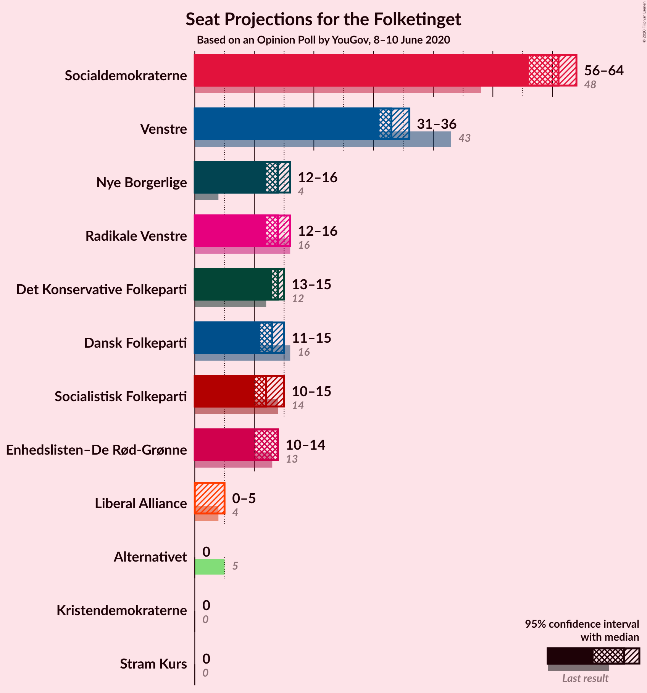
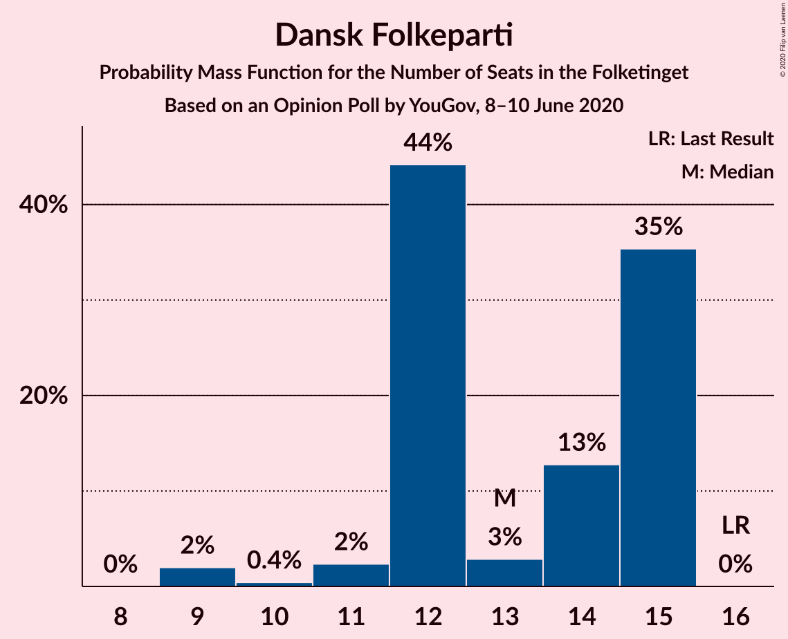
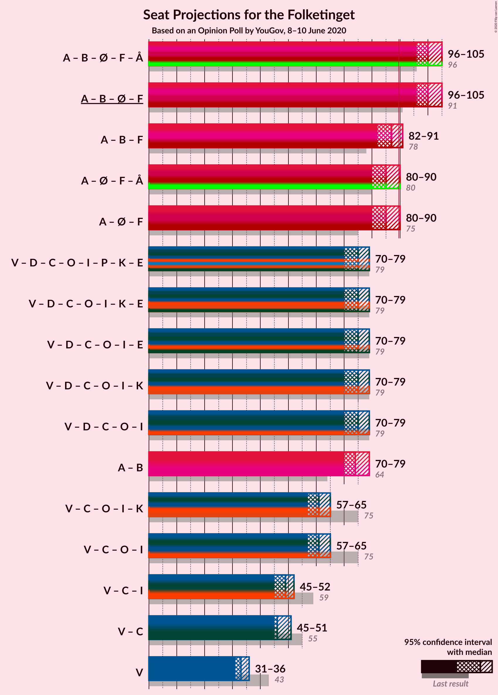
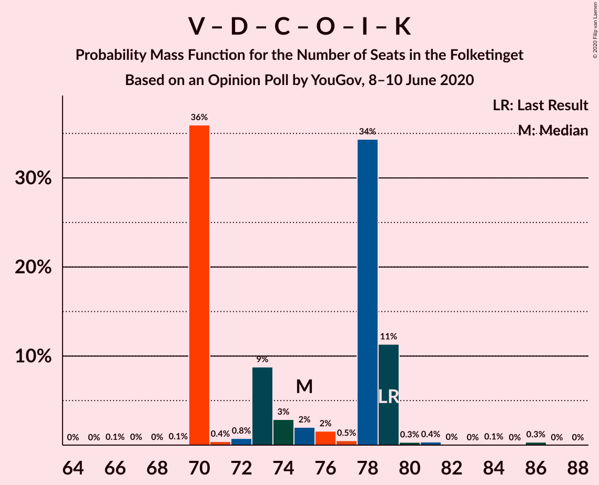
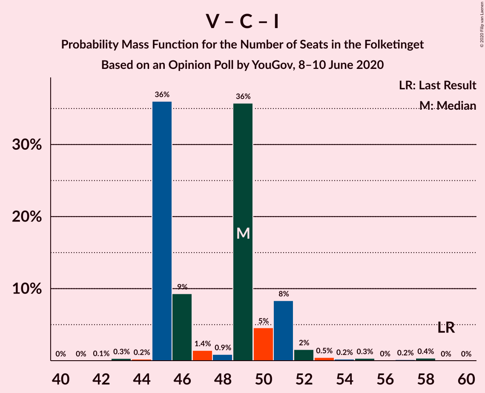

# Opinion Poll by YouGov, 8–10 June 2020

<a href="#voting-intentions">Voting Intentions</a> | <a href="#seats">Seats</a> | <a href="#coalitions">Coalitions</a> | <a href="#technical-information">Technical Information</a>

## Voting Intentions

### Confidence Intervals

| Party | Last Result | Poll Result | 80% Confidence Interval | 90% Confidence Interval | 95% Confidence Interval | 99% Confidence Interval |
|:-----:|:-----------:|:-----------:|:-----------------------:|:-----------------------:|:-----------------------:|:-----------------------:|
| Socialdemokraterne | 25.9% | 33.8% | 32.1–35.5% |31.6–36.0% |31.2–36.5% |30.4–37.3% |
| Venstre | 23.4% | 18.6% | 17.2–20.0% |16.8–20.5% |16.5–20.8% |15.9–21.5% |
| Nye Borgerlige | 2.4% | 7.7% | 6.8–8.8% |6.6–9.1% |6.4–9.3% |6.0–9.9% |
| Det Konservative Folkeparti | 6.6% | 7.6% | 6.7–8.6% |6.4–8.9% |6.2–9.2% |5.8–9.7% |
| Radikale Venstre | 8.6% | 7.5% | 6.6–8.5% |6.4–8.8% |6.2–9.1% |5.8–9.6% |
| Enhedslisten–De Rød-Grønne | 6.9% | 7.0% | 6.2–8.0% |5.9–8.3% |5.7–8.6% |5.3–9.1% |
| Dansk Folkeparti | 8.7% | 6.6% | 5.8–7.6% |5.6–7.9% |5.4–8.1% |5.0–8.6% |
| Socialistisk Folkeparti | 7.7% | 6.6% | 5.8–7.6% |5.6–7.9% |5.4–8.1% |5.0–8.6% |
| Liberal Alliance | 2.3% | 1.8% | 1.4–2.4% |1.3–2.6% |1.2–2.7% |1.1–3.0% |
| Stram Kurs | 1.8% | 1.3% | 0.9–1.8% |0.9–1.9% |0.8–2.1% |0.7–2.3% |
| Alternativet | 3.0% | 0.8% | 0.5–1.2% |0.5–1.4% |0.4–1.5% |0.3–1.7% |
| Kristendemokraterne | 1.7% | 0.7% | 0.5–1.1% |0.4–1.2% |0.4–1.4% |0.3–1.6% |

*Note:* The poll result column reflects the actual value used in the calculations. Published results may vary slightly, and in addition be rounded to fewer digits.

## Seats

### Confidence Intervals

| Party | Last Result | Median | 80% Confidence Interval | 90% Confidence Interval | 95% Confidence Interval | 99% Confidence Interval |
|:-----:|:-----------:|:------:|:-----------------------:|:-----------------------:|:-----------------------:|:-----------------------:|
| <a href="#socialdemokraterne">Socialdemokraterne</a> | 48 | 61 | 60–64 |59–64 |56–64 |55–65 |
| <a href="#venstre">Venstre</a> | 43 | 33 | 32–34 |31–35 |31–36 |29–38 |
| <a href="#nye-borgerlige">Nye Borgerlige</a> | 4 | 14 | 13–15 |13–16 |12–16 |11–17 |
| <a href="#det-konservative-folkeparti">Det Konservative Folkeparti</a> | 12 | 14 | 13–15 |13–15 |13–15 |11–17 |
| <a href="#radikale-venstre">Radikale Venstre</a> | 16 | 14 | 12–15 |12–16 |12–16 |11–17 |
| <a href="#enhedslisten–de-rød-grønne">Enhedslisten–De Rød-Grønne</a> | 13 | 14 | 11–14 |10–14 |10–14 |10–15 |
| <a href="#dansk-folkeparti">Dansk Folkeparti</a> | 16 | 13 | 12–15 |12–15 |11–15 |9–15 |
| <a href="#socialistisk-folkeparti">Socialistisk Folkeparti</a> | 14 | 12 | 10–14 |10–15 |10–15 |10–16 |
| <a href="#liberal-alliance">Liberal Alliance</a> | 4 | 0 | 0–4 |0–4 |0–5 |0–5 |
| <a href="#stram-kurs">Stram Kurs</a> | 0 | 0 | 0 |0 |0 |0–4 |
| <a href="#alternativet">Alternativet</a> | 5 | 0 | 0 |0 |0 |0 |
| <a href="#kristendemokraterne">Kristendemokraterne</a> | 0 | 0 | 0 |0 |0 |0 |

### Socialdemokraterne

*For a full overview of the results for this party, see the [Socialdemokraterne](party-socialdemokraterne.html) page.*

| Number of Seats | Probability | Accumulated | Special Marks |
|:---------------:|:-----------:|:-----------:|:-------------:|
| 48 | 0% | 100% | Last Result |
| 49 | 0% | 100% |  |
| 50 | 0% | 100% |  |
| 51 | 0% | 100% |  |
| 52 | 0% | 100% |  |
| 53 | 0.4% | 100% |  |
| 54 | 0.1% | 99.6% |  |
| 55 | 0.8% | 99.5% |  |
| 56 | 1.3% | 98.8% |  |
| 57 | 1.4% | 97% |  |
| 58 | 0.6% | 96% |  |
| 59 | 4% | 95% |  |
| 60 | 7% | 91% |  |
| 61 | 35% | 84% | Median |
| 62 | 9% | 48% |  |
| 63 | 2% | 39% |  |
| 64 | 37% | 37% |  |
| 65 | 0.2% | 0.6% |  |
| 66 | 0.3% | 0.4% |  |
| 67 | 0.1% | 0.1% |  |
| 68 | 0% | 0.1% |  |
| 69 | 0% | 0% |  |

### Venstre

*For a full overview of the results for this party, see the [Venstre](party-venstre.html) page.*

| Number of Seats | Probability | Accumulated | Special Marks |
|:---------------:|:-----------:|:-----------:|:-------------:|
| 28 | 0.1% | 100% |  |
| 29 | 0.4% | 99.9% |  |
| 30 | 0.5% | 99.4% |  |
| 31 | 4% | 98.9% |  |
| 32 | 44% | 95% |  |
| 33 | 9% | 50% | Median |
| 34 | 35% | 41% |  |
| 35 | 1.3% | 6% |  |
| 36 | 2% | 5% |  |
| 37 | 0.9% | 2% |  |
| 38 | 1.2% | 1.4% |  |
| 39 | 0.1% | 0.2% |  |
| 40 | 0.1% | 0.1% |  |
| 41 | 0% | 0% |  |
| 42 | 0% | 0% |  |
| 43 | 0% | 0% | Last Result |

### Nye Borgerlige

*For a full overview of the results for this party, see the [Nye Borgerlige](party-nyeborgerlige.html) page.*

| Number of Seats | Probability | Accumulated | Special Marks |
|:---------------:|:-----------:|:-----------:|:-------------:|
| 4 | 0% | 100% | Last Result |
| 5 | 0% | 100% |  |
| 6 | 0% | 100% |  |
| 7 | 0% | 100% |  |
| 8 | 0% | 100% |  |
| 9 | 0% | 100% |  |
| 10 | 0.3% | 100% |  |
| 11 | 1.0% | 99.7% |  |
| 12 | 1.4% | 98.7% |  |
| 13 | 46% | 97% |  |
| 14 | 35% | 51% | Median |
| 15 | 9% | 16% |  |
| 16 | 6% | 8% |  |
| 17 | 0.9% | 1.2% |  |
| 18 | 0.2% | 0.3% |  |
| 19 | 0% | 0% |  |

### Det Konservative Folkeparti

*For a full overview of the results for this party, see the [Det Konservative Folkeparti](party-detkonservativefolkeparti.html) page.*

| Number of Seats | Probability | Accumulated | Special Marks |
|:---------------:|:-----------:|:-----------:|:-------------:|
| 10 | 0.2% | 100% |  |
| 11 | 0.5% | 99.8% |  |
| 12 | 1.4% | 99.3% | Last Result |
| 13 | 41% | 98% |  |
| 14 | 16% | 57% | Median |
| 15 | 39% | 40% |  |
| 16 | 0.4% | 1.2% |  |
| 17 | 0.7% | 0.8% |  |
| 18 | 0.1% | 0.1% |  |
| 19 | 0% | 0% |  |

### Radikale Venstre

*For a full overview of the results for this party, see the [Radikale Venstre](party-radikalevenstre.html) page.*

| Number of Seats | Probability | Accumulated | Special Marks |
|:---------------:|:-----------:|:-----------:|:-------------:|
| 10 | 0.4% | 100% |  |
| 11 | 1.0% | 99.6% |  |
| 12 | 42% | 98.6% |  |
| 13 | 4% | 56% |  |
| 14 | 7% | 53% | Median |
| 15 | 38% | 46% |  |
| 16 | 7% | 8% | Last Result |
| 17 | 0.6% | 0.8% |  |
| 18 | 0.2% | 0.2% |  |
| 19 | 0% | 0% |  |

### Enhedslisten–De Rød-Grønne

*For a full overview of the results for this party, see the [Enhedslisten–De Rød-Grønne](party-enhedslisten–derød-grønne.html) page.*

| Number of Seats | Probability | Accumulated | Special Marks |
|:---------------:|:-----------:|:-----------:|:-------------:|
| 9 | 0.1% | 100% |  |
| 10 | 7% | 99.9% |  |
| 11 | 4% | 93% |  |
| 12 | 4% | 89% |  |
| 13 | 12% | 85% | Last Result |
| 14 | 71% | 73% | Median |
| 15 | 2% | 2% |  |
| 16 | 0.2% | 0.4% |  |
| 17 | 0.2% | 0.2% |  |
| 18 | 0% | 0% |  |

### Dansk Folkeparti

*For a full overview of the results for this party, see the [Dansk Folkeparti](party-danskfolkeparti.html) page.*

| Number of Seats | Probability | Accumulated | Special Marks |
|:---------------:|:-----------:|:-----------:|:-------------:|
| 9 | 2% | 100% |  |
| 10 | 0.4% | 98% |  |
| 11 | 2% | 98% |  |
| 12 | 44% | 95% |  |
| 13 | 3% | 51% | Median |
| 14 | 13% | 48% |  |
| 15 | 35% | 35% |  |
| 16 | 0% | 0% | Last Result |

### Socialistisk Folkeparti

*For a full overview of the results for this party, see the [Socialistisk Folkeparti](party-socialistiskfolkeparti.html) page.*

| Number of Seats | Probability | Accumulated | Special Marks |
|:---------------:|:-----------:|:-----------:|:-------------:|
| 8 | 0.1% | 100% |  |
| 9 | 0.2% | 99.9% |  |
| 10 | 40% | 99.7% |  |
| 11 | 4% | 60% |  |
| 12 | 43% | 56% | Median |
| 13 | 2% | 13% |  |
| 14 | 3% | 11% | Last Result |
| 15 | 8% | 9% |  |
| 16 | 0.7% | 0.7% |  |
| 17 | 0% | 0% |  |

### Liberal Alliance

*For a full overview of the results for this party, see the [Liberal Alliance](party-liberalalliance.html) page.*

| Number of Seats | Probability | Accumulated | Special Marks |
|:---------------:|:-----------:|:-----------:|:-------------:|
| 0 | 86% | 100% | Median |
| 1 | 0% | 14% |  |
| 2 | 0% | 14% |  |
| 3 | 0% | 14% |  |
| 4 | 11% | 14% | Last Result |
| 5 | 3% | 3% |  |
| 6 | 0.2% | 0.2% |  |
| 7 | 0% | 0% |  |

### Stram Kurs

*For a full overview of the results for this party, see the [Stram Kurs](party-stramkurs.html) page.*

| Number of Seats | Probability | Accumulated | Special Marks |
|:---------------:|:-----------:|:-----------:|:-------------:|
| 0 | 99.0% | 100% | Last Result, Median |
| 1 | 0% | 1.0% |  |
| 2 | 0% | 1.0% |  |
| 3 | 0% | 1.0% |  |
| 4 | 1.0% | 1.0% |  |
| 5 | 0% | 0% |  |

### Alternativet

*For a full overview of the results for this party, see the [Alternativet](party-alternativet.html) page.*

| Number of Seats | Probability | Accumulated | Special Marks |
|:---------------:|:-----------:|:-----------:|:-------------:|
| 0 | 99.9% | 100% | Median |
| 1 | 0% | 0.1% |  |
| 2 | 0% | 0.1% |  |
| 3 | 0% | 0.1% |  |
| 4 | 0.1% | 0.1% |  |
| 5 | 0% | 0% | Last Result |

### Kristendemokraterne

*For a full overview of the results for this party, see the [Kristendemokraterne](party-kristendemokraterne.html) page.*

| Number of Seats | Probability | Accumulated | Special Marks |
|:---------------:|:-----------:|:-----------:|:-------------:|
| 0 | 100% | 100% | Last Result, Median |

## Coalitions

### Confidence Intervals

| Coalition | Last Result | Median | Majority? | 80% Confidence Interval | 90% Confidence Interval | 95% Confidence Interval | 99% Confidence Interval |
|:---------:|:-----------:|:------:|:---------:|:-----------------------:|:-----------------------:|:-----------------------:|:-----------------------:|
| Socialdemokraterne – Radikale Venstre – Enhedslisten–De Rød-Grønne – Socialistisk Folkeparti – Alternativet | 96 | 100 | 99.7% | 96–105 | 96–105 | 96–105 | 92–105 |
| Socialdemokraterne – Radikale Venstre – Enhedslisten–De Rød-Grønne – Socialistisk Folkeparti | 91 | 100 | 99.7% | 96–105 | 96–105 | 96–105 | 92–105 |
| Socialdemokraterne – Radikale Venstre – Socialistisk Folkeparti | 78 | 87 | 38% | 83–91 | 83–91 | 82–91 | 80–91 |
| Socialdemokraterne – Enhedslisten–De Rød-Grønne – Socialistisk Folkeparti – Alternativet | 80 | 85 | 45% | 82–90 | 80–90 | 80–90 | 77–92 |
| Socialdemokraterne – Enhedslisten–De Rød-Grønne – Socialistisk Folkeparti | 75 | 85 | 45% | 82–90 | 80–90 | 80–90 | 77–92 |
| Venstre – Nye Borgerlige – Det Konservative Folkeparti – Dansk Folkeparti – Liberal Alliance – Kristendemokraterne | 79 | 75 | 0% | 70–79 | 70–79 | 70–79 | 70–81 |
| Venstre – Nye Borgerlige – Det Konservative Folkeparti – Dansk Folkeparti – Liberal Alliance | 79 | 75 | 0% | 70–79 | 70–79 | 70–79 | 70–81 |
| Socialdemokraterne – Radikale Venstre | 64 | 74 | 0% | 73–79 | 73–79 | 70–79 | 66–79 |
| Venstre – Det Konservative Folkeparti – Dansk Folkeparti – Liberal Alliance – Kristendemokraterne | 75 | 61 | 0% | 57–64 | 57–64 | 57–65 | 56–67 |
| Venstre – Det Konservative Folkeparti – Dansk Folkeparti – Liberal Alliance | 75 | 61 | 0% | 57–64 | 57–64 | 57–65 | 56–67 |
| Venstre – Det Konservative Folkeparti – Liberal Alliance | 59 | 49 | 0% | 45–51 | 45–51 | 45–52 | 44–57 |
| Venstre – Det Konservative Folkeparti | 55 | 46 | 0% | 45–49 | 45–49 | 45–51 | 43–53 |
| Venstre | 43 | 33 | 0% | 32–34 | 31–35 | 31–36 | 29–38 |

### Socialdemokraterne – Radikale Venstre – Enhedslisten–De Rød-Grønne – Socialistisk Folkeparti – Alternativet

| Number of Seats | Probability | Accumulated | Special Marks |
|:---------------:|:-----------:|:-----------:|:-------------:|
| 89 | 0.3% | 100% |  |
| 90 | 0% | 99.7% | Majority |
| 91 | 0.1% | 99.7% |  |
| 92 | 0.2% | 99.6% |  |
| 93 | 0.1% | 99.4% |  |
| 94 | 0.4% | 99.3% |  |
| 95 | 0.3% | 98.9% |  |
| 96 | 11% | 98.6% | Last Result |
| 97 | 34% | 87% |  |
| 98 | 0.8% | 53% |  |
| 99 | 2% | 52% |  |
| 100 | 2% | 50% |  |
| 101 | 3% | 49% | Median |
| 102 | 8% | 46% |  |
| 103 | 0.7% | 37% |  |
| 104 | 0.4% | 37% |  |
| 105 | 36% | 36% |  |
| 106 | 0.1% | 0.2% |  |
| 107 | 0% | 0.1% |  |
| 108 | 0% | 0.1% |  |
| 109 | 0.1% | 0.1% |  |
| 110 | 0% | 0% |  |

### Socialdemokraterne – Radikale Venstre – Enhedslisten–De Rød-Grønne – Socialistisk Folkeparti

| Number of Seats | Probability | Accumulated | Special Marks |
|:---------------:|:-----------:|:-----------:|:-------------:|
| 89 | 0.3% | 100% |  |
| 90 | 0% | 99.7% | Majority |
| 91 | 0.1% | 99.7% | Last Result |
| 92 | 0.2% | 99.6% |  |
| 93 | 0.1% | 99.4% |  |
| 94 | 0.4% | 99.3% |  |
| 95 | 0.3% | 98.9% |  |
| 96 | 11% | 98.6% |  |
| 97 | 34% | 87% |  |
| 98 | 0.8% | 53% |  |
| 99 | 2% | 52% |  |
| 100 | 2% | 50% |  |
| 101 | 3% | 49% | Median |
| 102 | 8% | 46% |  |
| 103 | 0.7% | 37% |  |
| 104 | 0.4% | 36% |  |
| 105 | 36% | 36% |  |
| 106 | 0.1% | 0.2% |  |
| 107 | 0% | 0.1% |  |
| 108 | 0% | 0.1% |  |
| 109 | 0.1% | 0.1% |  |
| 110 | 0% | 0% |  |

### Socialdemokraterne – Radikale Venstre – Socialistisk Folkeparti

| Number of Seats | Probability | Accumulated | Special Marks |
|:---------------:|:-----------:|:-----------:|:-------------:|
| 77 | 0.3% | 100% |  |
| 78 | 0% | 99.6% | Last Result |
| 79 | 0.1% | 99.6% |  |
| 80 | 0% | 99.5% |  |
| 81 | 2% | 99.5% |  |
| 82 | 0.4% | 98% |  |
| 83 | 34% | 97% |  |
| 84 | 1.3% | 64% |  |
| 85 | 5% | 62% |  |
| 86 | 7% | 58% |  |
| 87 | 2% | 50% | Median |
| 88 | 1.5% | 49% |  |
| 89 | 9% | 47% |  |
| 90 | 0.8% | 38% | Majority |
| 91 | 37% | 37% |  |
| 92 | 0.3% | 0.5% |  |
| 93 | 0% | 0.2% |  |
| 94 | 0% | 0.2% |  |
| 95 | 0% | 0.1% |  |
| 96 | 0% | 0.1% |  |
| 97 | 0% | 0% |  |

### Socialdemokraterne – Enhedslisten–De Rød-Grønne – Socialistisk Folkeparti – Alternativet

| Number of Seats | Probability | Accumulated | Special Marks |
|:---------------:|:-----------:|:-----------:|:-------------:|
| 76 | 0.1% | 100% |  |
| 77 | 0.5% | 99.9% |  |
| 78 | 0% | 99.4% |  |
| 79 | 0% | 99.4% |  |
| 80 | 5% | 99.4% | Last Result |
| 81 | 1.3% | 94% |  |
| 82 | 5% | 93% |  |
| 83 | 0.6% | 88% |  |
| 84 | 1.4% | 87% |  |
| 85 | 36% | 86% |  |
| 86 | 1.4% | 49% |  |
| 87 | 1.3% | 48% | Median |
| 88 | 2% | 47% |  |
| 89 | 0.4% | 45% |  |
| 90 | 44% | 45% | Majority |
| 91 | 0.5% | 1.0% |  |
| 92 | 0.4% | 0.5% |  |
| 93 | 0% | 0.1% |  |
| 94 | 0% | 0.1% |  |
| 95 | 0% | 0% |  |

### Socialdemokraterne – Enhedslisten–De Rød-Grønne – Socialistisk Folkeparti

| Number of Seats | Probability | Accumulated | Special Marks |
|:---------------:|:-----------:|:-----------:|:-------------:|
| 75 | 0% | 100% | Last Result |
| 76 | 0.1% | 100% |  |
| 77 | 0.5% | 99.9% |  |
| 78 | 0% | 99.4% |  |
| 79 | 0% | 99.4% |  |
| 80 | 5% | 99.4% |  |
| 81 | 1.3% | 94% |  |
| 82 | 5% | 93% |  |
| 83 | 0.6% | 88% |  |
| 84 | 1.4% | 87% |  |
| 85 | 36% | 86% |  |
| 86 | 1.4% | 49% |  |
| 87 | 1.3% | 48% | Median |
| 88 | 2% | 47% |  |
| 89 | 0.4% | 45% |  |
| 90 | 44% | 45% | Majority |
| 91 | 0.5% | 1.0% |  |
| 92 | 0.4% | 0.5% |  |
| 93 | 0% | 0.1% |  |
| 94 | 0% | 0.1% |  |
| 95 | 0% | 0% |  |

### Venstre – Nye Borgerlige – Det Konservative Folkeparti – Dansk Folkeparti – Liberal Alliance – Kristendemokraterne

| Number of Seats | Probability | Accumulated | Special Marks |
|:---------------:|:-----------:|:-----------:|:-------------:|
| 66 | 0.1% | 100% |  |
| 67 | 0% | 99.9% |  |
| 68 | 0% | 99.9% |  |
| 69 | 0.1% | 99.9% |  |
| 70 | 36% | 99.7% |  |
| 71 | 0.4% | 64% |  |
| 72 | 0.8% | 63% |  |
| 73 | 9% | 63% |  |
| 74 | 3% | 54% | Median |
| 75 | 2% | 51% |  |
| 76 | 2% | 49% |  |
| 77 | 0.5% | 47% |  |
| 78 | 34% | 47% |  |
| 79 | 11% | 13% | Last Result |
| 80 | 0.3% | 1.2% |  |
| 81 | 0.4% | 0.9% |  |
| 82 | 0% | 0.5% |  |
| 83 | 0% | 0.4% |  |
| 84 | 0.1% | 0.4% |  |
| 85 | 0% | 0.3% |  |
| 86 | 0.3% | 0.3% |  |
| 87 | 0% | 0% |  |

### Venstre – Nye Borgerlige – Det Konservative Folkeparti – Dansk Folkeparti – Liberal Alliance

| Number of Seats | Probability | Accumulated | Special Marks |
|:---------------:|:-----------:|:-----------:|:-------------:|
| 66 | 0.1% | 100% |  |
| 67 | 0% | 99.9% |  |
| 68 | 0% | 99.9% |  |
| 69 | 0.1% | 99.9% |  |
| 70 | 36% | 99.7% |  |
| 71 | 0.4% | 64% |  |
| 72 | 0.8% | 63% |  |
| 73 | 9% | 63% |  |
| 74 | 3% | 54% | Median |
| 75 | 2% | 51% |  |
| 76 | 2% | 49% |  |
| 77 | 0.5% | 47% |  |
| 78 | 34% | 47% |  |
| 79 | 11% | 13% | Last Result |
| 80 | 0.3% | 1.2% |  |
| 81 | 0.4% | 0.9% |  |
| 82 | 0% | 0.5% |  |
| 83 | 0% | 0.4% |  |
| 84 | 0.1% | 0.4% |  |
| 85 | 0% | 0.3% |  |
| 86 | 0.3% | 0.3% |  |
| 87 | 0% | 0% |  |

### Socialdemokraterne – Radikale Venstre

| Number of Seats | Probability | Accumulated | Special Marks |
|:---------------:|:-----------:|:-----------:|:-------------:|
| 64 | 0% | 100% | Last Result |
| 65 | 0.4% | 100% |  |
| 66 | 0.2% | 99.6% |  |
| 67 | 0% | 99.4% |  |
| 68 | 0.1% | 99.4% |  |
| 69 | 0.5% | 99.3% |  |
| 70 | 2% | 98.8% |  |
| 71 | 0.1% | 97% |  |
| 72 | 1.1% | 97% |  |
| 73 | 39% | 96% |  |
| 74 | 10% | 57% |  |
| 75 | 0.7% | 47% | Median |
| 76 | 7% | 46% |  |
| 77 | 2% | 39% |  |
| 78 | 0.8% | 37% |  |
| 79 | 36% | 36% |  |
| 80 | 0.1% | 0.2% |  |
| 81 | 0.1% | 0.2% |  |
| 82 | 0% | 0.1% |  |
| 83 | 0% | 0% |  |

### Venstre – Det Konservative Folkeparti – Dansk Folkeparti – Liberal Alliance – Kristendemokraterne

| Number of Seats | Probability | Accumulated | Special Marks |
|:---------------:|:-----------:|:-----------:|:-------------:|
| 54 | 0.1% | 100% |  |
| 55 | 0.4% | 99.9% |  |
| 56 | 0.1% | 99.5% |  |
| 57 | 36% | 99.5% |  |
| 58 | 0.8% | 64% |  |
| 59 | 3% | 63% |  |
| 60 | 10% | 60% | Median |
| 61 | 2% | 51% |  |
| 62 | 2% | 49% |  |
| 63 | 6% | 47% |  |
| 64 | 39% | 41% |  |
| 65 | 0.1% | 3% |  |
| 66 | 1.5% | 2% |  |
| 67 | 0.4% | 0.9% |  |
| 68 | 0% | 0.5% |  |
| 69 | 0.1% | 0.5% |  |
| 70 | 0% | 0.4% |  |
| 71 | 0% | 0.3% |  |
| 72 | 0.3% | 0.3% |  |
| 73 | 0% | 0% |  |
| 74 | 0% | 0% |  |
| 75 | 0% | 0% | Last Result |

### Venstre – Det Konservative Folkeparti – Dansk Folkeparti – Liberal Alliance

| Number of Seats | Probability | Accumulated | Special Marks |
|:---------------:|:-----------:|:-----------:|:-------------:|
| 54 | 0.1% | 100% |  |
| 55 | 0.4% | 99.9% |  |
| 56 | 0% | 99.5% |  |
| 57 | 36% | 99.5% |  |
| 58 | 0.8% | 64% |  |
| 59 | 3% | 63% |  |
| 60 | 10% | 60% | Median |
| 61 | 2% | 51% |  |
| 62 | 2% | 49% |  |
| 63 | 6% | 47% |  |
| 64 | 39% | 41% |  |
| 65 | 0.1% | 3% |  |
| 66 | 1.5% | 2% |  |
| 67 | 0.4% | 0.9% |  |
| 68 | 0% | 0.5% |  |
| 69 | 0.1% | 0.5% |  |
| 70 | 0% | 0.4% |  |
| 71 | 0% | 0.3% |  |
| 72 | 0.3% | 0.3% |  |
| 73 | 0% | 0% |  |
| 74 | 0% | 0% |  |
| 75 | 0% | 0% | Last Result |

### Venstre – Det Konservative Folkeparti – Liberal Alliance

| Number of Seats | Probability | Accumulated | Special Marks |
|:---------------:|:-----------:|:-----------:|:-------------:|
| 42 | 0.1% | 100% |  |
| 43 | 0.3% | 99.9% |  |
| 44 | 0.2% | 99.6% |  |
| 45 | 36% | 99.4% |  |
| 46 | 9% | 63% |  |
| 47 | 1.4% | 54% | Median |
| 48 | 0.9% | 53% |  |
| 49 | 36% | 52% |  |
| 50 | 5% | 16% |  |
| 51 | 8% | 11% |  |
| 52 | 2% | 3% |  |
| 53 | 0.5% | 2% |  |
| 54 | 0.2% | 1.1% |  |
| 55 | 0.3% | 0.9% |  |
| 56 | 0% | 0.5% |  |
| 57 | 0.2% | 0.5% |  |
| 58 | 0.4% | 0.4% |  |
| 59 | 0% | 0% | Last Result |

### Venstre – Det Konservative Folkeparti

| Number of Seats | Probability | Accumulated | Special Marks |
|:---------------:|:-----------:|:-----------:|:-------------:|
| 41 | 0.1% | 100% |  |
| 42 | 0.2% | 99.8% |  |
| 43 | 0.9% | 99.7% |  |
| 44 | 0.7% | 98.8% |  |
| 45 | 36% | 98% |  |
| 46 | 14% | 62% |  |
| 47 | 8% | 48% | Median |
| 48 | 0.5% | 40% |  |
| 49 | 36% | 39% |  |
| 50 | 0.5% | 4% |  |
| 51 | 3% | 3% |  |
| 52 | 0.1% | 0.7% |  |
| 53 | 0.2% | 0.6% |  |
| 54 | 0.4% | 0.4% |  |
| 55 | 0% | 0.1% | Last Result |
| 56 | 0% | 0.1% |  |
| 57 | 0% | 0% |  |

### Venstre

| Number of Seats | Probability | Accumulated | Special Marks |
|:---------------:|:-----------:|:-----------:|:-------------:|
| 28 | 0.1% | 100% |  |
| 29 | 0.4% | 99.9% |  |
| 30 | 0.5% | 99.4% |  |
| 31 | 4% | 98.9% |  |
| 32 | 44% | 95% |  |
| 33 | 9% | 50% | Median |
| 34 | 35% | 41% |  |
| 35 | 1.3% | 6% |  |
| 36 | 2% | 5% |  |
| 37 | 0.9% | 2% |  |
| 38 | 1.2% | 1.4% |  |
| 39 | 0.1% | 0.2% |  |
| 40 | 0.1% | 0.1% |  |
| 41 | 0% | 0% |  |
| 42 | 0% | 0% |  |
| 43 | 0% | 0% | Last Result |

## Technical Information

### Opinion Poll

+ **Polling firm:** YouGov
+ **Commissioner(s):** —
+ **Fieldwork period:** 8–10 June 2020

### Calculations

+ **Sample size:** 1255
+ **Simulations done:** 1,048,576
+ **Error estimate:** 1.86%

