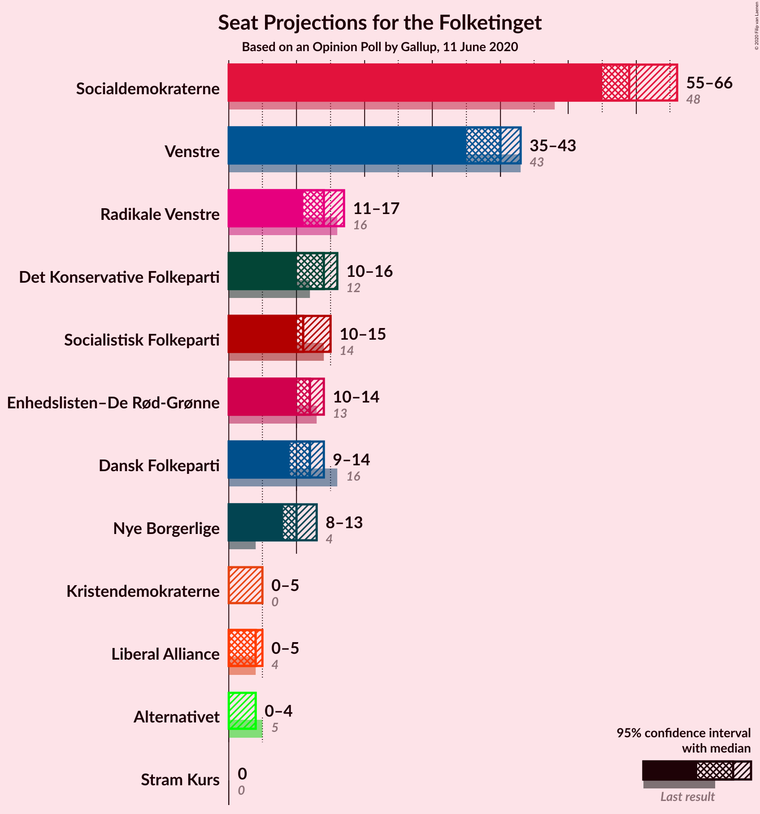
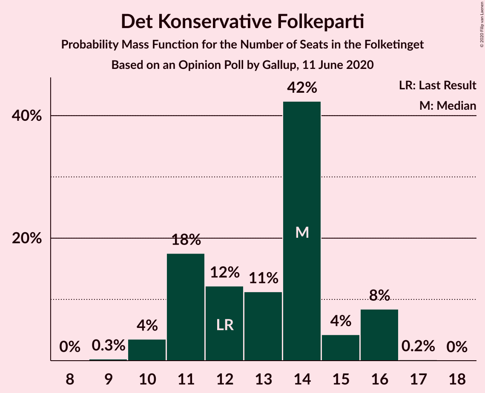
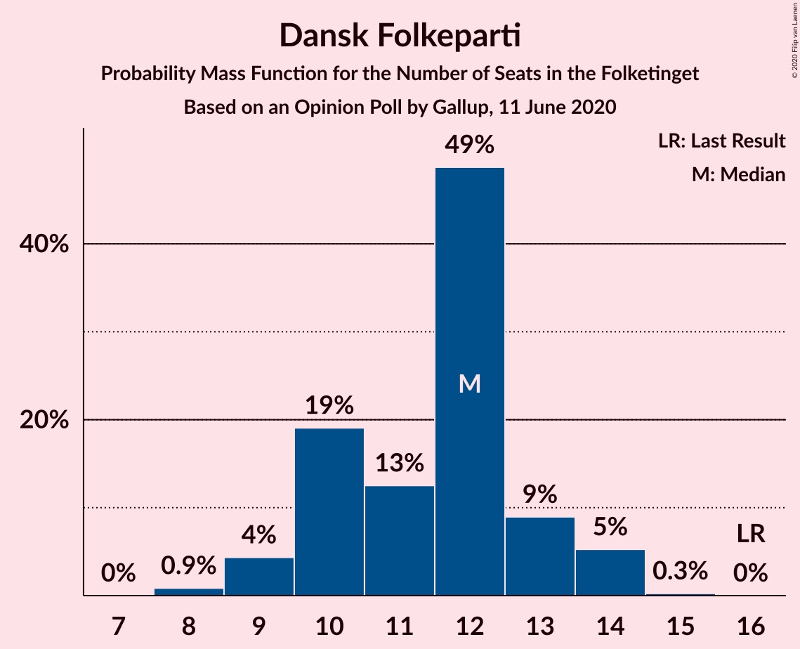
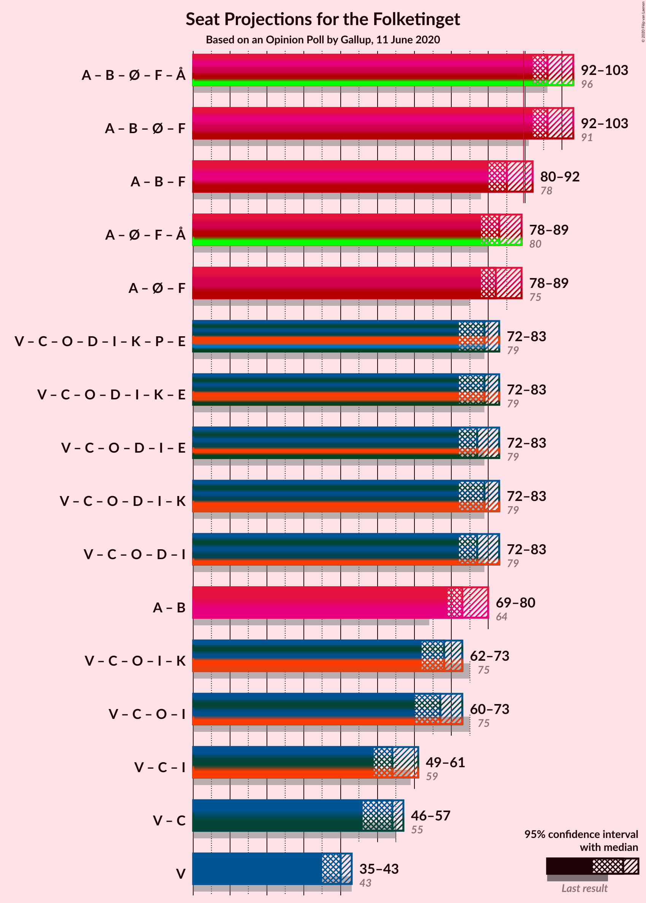
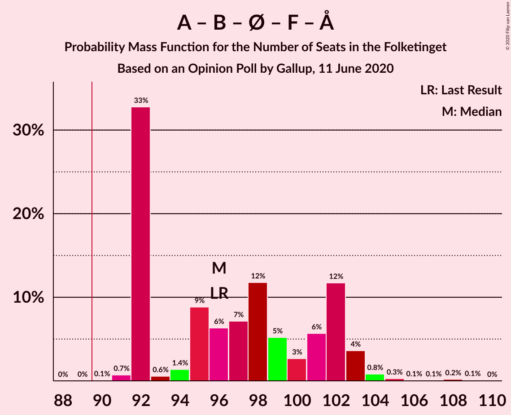
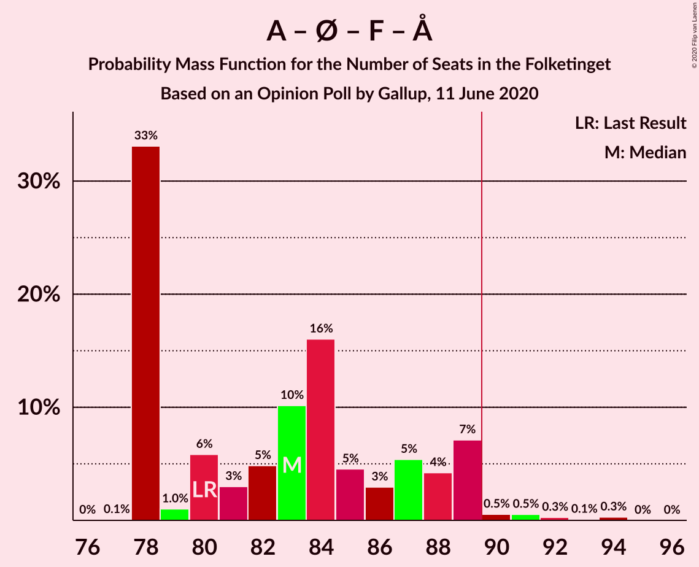
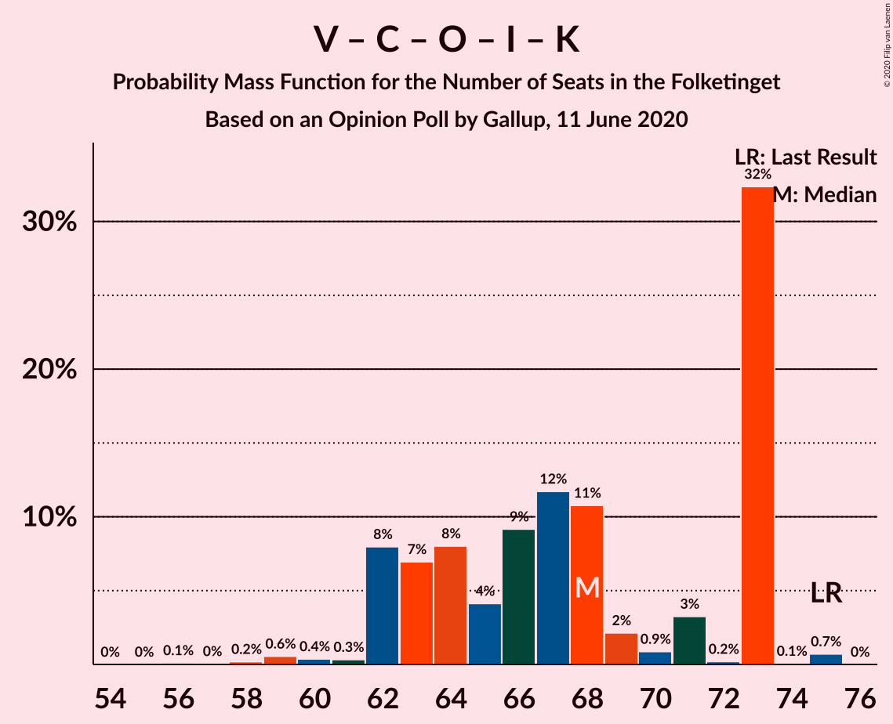

# Opinion Poll by Gallup, 11 June 2020

<a href="#voting-intentions">Voting Intentions</a> | <a href="#seats">Seats</a> | <a href="#coalitions">Coalitions</a> | <a href="#technical-information">Technical Information</a>

## Voting Intentions

### Confidence Intervals

| Party | Last Result | Poll Result | 80% Confidence Interval | 90% Confidence Interval | 95% Confidence Interval | 99% Confidence Interval |
|:-----:|:-----------:|:-----------:|:-----------------------:|:-----------------------:|:-----------------------:|:-----------------------:|
| Socialdemokraterne | 25.9% | 33.1% | 31.6–34.7% |31.2–35.1% |30.8–35.5% |30.1–36.3% |
| Venstre | 23.4% | 21.4% | 20.1–22.8% |19.7–23.2% |19.4–23.5% |18.7–24.2% |
| Radikale Venstre | 8.6% | 7.4% | 6.6–8.3% |6.3–8.6% |6.1–8.8% |5.8–9.3% |
| Det Konservative Folkeparti | 6.6% | 7.0% | 6.2–7.9% |6.0–8.1% |5.8–8.4% |5.4–8.8% |
| Enhedslisten–De Rød-Grønne | 6.9% | 6.6% | 5.8–7.5% |5.6–7.7% |5.4–7.9% |5.1–8.4% |
| Socialistisk Folkeparti | 7.7% | 6.6% | 5.8–7.5% |5.6–7.7% |5.4–7.9% |5.1–8.4% |
| Dansk Folkeparti | 8.7% | 6.1% | 5.4–7.0% |5.2–7.2% |5.0–7.4% |4.7–7.9% |
| Nye Borgerlige | 2.4% | 5.8% | 5.1–6.6% |4.9–6.9% |4.7–7.1% |4.4–7.5% |
| Liberal Alliance | 2.3% | 2.1% | 1.7–2.7% |1.6–2.9% |1.5–3.0% |1.3–3.3% |
| Kristendemokraterne | 1.7% | 1.7% | 1.4–2.2% |1.3–2.4% |1.2–2.5% |1.0–2.8% |
| Alternativet | 3.0% | 1.5% | 1.2–2.0% |1.1–2.2% |1.0–2.3% |0.9–2.5% |
| Stram Kurs | 1.8% | 0.4% | 0.2–0.7% |0.2–0.8% |0.2–0.9% |0.1–1.0% |

*Note:* The poll result column reflects the actual value used in the calculations. Published results may vary slightly, and in addition be rounded to fewer digits.

## Seats

### Confidence Intervals

| Party | Last Result | Median | 80% Confidence Interval | 90% Confidence Interval | 95% Confidence Interval | 99% Confidence Interval |
|:-----:|:-----------:|:------:|:-----------------------:|:-----------------------:|:-----------------------:|:-----------------------:|
| <a href="#socialdemokraterne">Socialdemokraterne</a> | 48 | 55 | 55–61 |55–61 |55–63 |55–67 |
| <a href="#venstre">Venstre</a> | 43 | 43 | 38–43 |35–43 |35–43 |35–43 |
| <a href="#radikale-venstre">Radikale Venstre</a> | 16 | 14 | 14–15 |13–16 |11–16 |11–16 |
| <a href="#det-konservative-folkeparti">Det Konservative Folkeparti</a> | 12 | 14 | 12–14 |11–14 |10–15 |10–15 |
| <a href="#enhedslisten–de-rød-grønne">Enhedslisten–De Rød-Grønne</a> | 13 | 12 | 12 |11–13 |11–14 |10–14 |
| <a href="#socialistisk-folkeparti">Socialistisk Folkeparti</a> | 14 | 11 | 11–12 |10–15 |10–15 |9–15 |
| <a href="#dansk-folkeparti">Dansk Folkeparti</a> | 16 | 12 | 10–13 |10–14 |10–14 |8–14 |
| <a href="#nye-borgerlige">Nye Borgerlige</a> | 4 | 10 | 9–10 |9–12 |8–12 |8–13 |
| <a href="#liberal-alliance">Liberal Alliance</a> | 4 | 4 | 0–4 |0–4 |0–5 |0–5 |
| <a href="#kristendemokraterne">Kristendemokraterne</a> | 0 | 0 | 0–4 |0–4 |0–4 |0–5 |
| <a href="#alternativet">Alternativet</a> | 5 | 0 | 0 |0 |0 |0–5 |
| <a href="#stram-kurs">Stram Kurs</a> | 0 | 0 | 0 |0 |0 |0 |

### Socialdemokraterne

*For a full overview of the results for this party, see the [Socialdemokraterne](party-socialdemokraterne.html) page.*

| Number of Seats | Probability | Accumulated | Special Marks |
|:---------------:|:-----------:|:-----------:|:-------------:|
| 48 | 0% | 100% | Last Result |
| 49 | 0% | 100% |  |
| 50 | 0% | 100% |  |
| 51 | 0% | 100% |  |
| 52 | 0% | 100% |  |
| 53 | 0.3% | 100% |  |
| 54 | 0.1% | 99.7% |  |
| 55 | 72% | 99.6% | Median |
| 56 | 0.1% | 27% |  |
| 57 | 2% | 27% |  |
| 58 | 0.6% | 25% |  |
| 59 | 6% | 24% |  |
| 60 | 7% | 18% |  |
| 61 | 6% | 11% |  |
| 62 | 0.6% | 5% |  |
| 63 | 2% | 4% |  |
| 64 | 0.6% | 2% |  |
| 65 | 0.1% | 1.3% |  |
| 66 | 0.2% | 1.2% |  |
| 67 | 1.0% | 1.0% |  |
| 68 | 0% | 0% |  |

### Venstre

*For a full overview of the results for this party, see the [Venstre](party-venstre.html) page.*

| Number of Seats | Probability | Accumulated | Special Marks |
|:---------------:|:-----------:|:-----------:|:-------------:|
| 35 | 6% | 100% |  |
| 36 | 0.2% | 94% |  |
| 37 | 3% | 94% |  |
| 38 | 4% | 91% |  |
| 39 | 9% | 86% |  |
| 40 | 2% | 78% |  |
| 41 | 3% | 76% |  |
| 42 | 0.1% | 73% |  |
| 43 | 72% | 73% | Last Result, Median |
| 44 | 0% | 0.3% |  |
| 45 | 0.3% | 0.3% |  |
| 46 | 0% | 0% |  |

### Radikale Venstre

*For a full overview of the results for this party, see the [Radikale Venstre](party-radikalevenstre.html) page.*

| Number of Seats | Probability | Accumulated | Special Marks |
|:---------------:|:-----------:|:-----------:|:-------------:|
| 10 | 0.1% | 100% |  |
| 11 | 3% | 99.9% |  |
| 12 | 2% | 97% |  |
| 13 | 4% | 95% |  |
| 14 | 79% | 91% | Median |
| 15 | 7% | 12% |  |
| 16 | 5% | 5% | Last Result |
| 17 | 0.1% | 0.1% |  |
| 18 | 0% | 0.1% |  |
| 19 | 0% | 0% |  |

### Det Konservative Folkeparti

*For a full overview of the results for this party, see the [Det Konservative Folkeparti](party-detkonservativefolkeparti.html) page.*

| Number of Seats | Probability | Accumulated | Special Marks |
|:---------------:|:-----------:|:-----------:|:-------------:|
| 8 | 0.1% | 100% |  |
| 9 | 0.1% | 99.9% |  |
| 10 | 4% | 99.9% |  |
| 11 | 6% | 96% |  |
| 12 | 3% | 90% | Last Result |
| 13 | 6% | 87% |  |
| 14 | 78% | 82% | Median |
| 15 | 4% | 4% |  |
| 16 | 0% | 0.1% |  |
| 17 | 0.1% | 0.1% |  |
| 18 | 0% | 0% |  |

### Enhedslisten–De Rød-Grønne

*For a full overview of the results for this party, see the [Enhedslisten–De Rød-Grønne](party-enhedslisten–derød-grønne.html) page.*

| Number of Seats | Probability | Accumulated | Special Marks |
|:---------------:|:-----------:|:-----------:|:-------------:|
| 9 | 0.3% | 100% |  |
| 10 | 1.3% | 99.6% |  |
| 11 | 5% | 98% |  |
| 12 | 86% | 93% | Median |
| 13 | 4% | 8% | Last Result |
| 14 | 4% | 4% |  |
| 15 | 0.2% | 0.2% |  |
| 16 | 0% | 0% |  |

### Socialistisk Folkeparti

*For a full overview of the results for this party, see the [Socialistisk Folkeparti](party-socialistiskfolkeparti.html) page.*

| Number of Seats | Probability | Accumulated | Special Marks |
|:---------------:|:-----------:|:-----------:|:-------------:|
| 9 | 2% | 100% |  |
| 10 | 7% | 98% |  |
| 11 | 73% | 91% | Median |
| 12 | 9% | 18% |  |
| 13 | 3% | 9% |  |
| 14 | 0.4% | 6% | Last Result |
| 15 | 5% | 5% |  |
| 16 | 0% | 0.1% |  |
| 17 | 0.1% | 0.1% |  |
| 18 | 0% | 0% |  |

### Dansk Folkeparti

*For a full overview of the results for this party, see the [Dansk Folkeparti](party-danskfolkeparti.html) page.*

| Number of Seats | Probability | Accumulated | Special Marks |
|:---------------:|:-----------:|:-----------:|:-------------:|
| 8 | 0.5% | 100% |  |
| 9 | 1.0% | 99.5% |  |
| 10 | 9% | 98% |  |
| 11 | 2% | 89% |  |
| 12 | 76% | 86% | Median |
| 13 | 3% | 10% |  |
| 14 | 7% | 7% |  |
| 15 | 0.5% | 0.5% |  |
| 16 | 0% | 0% | Last Result |

### Nye Borgerlige

*For a full overview of the results for this party, see the [Nye Borgerlige](party-nyeborgerlige.html) page.*

| Number of Seats | Probability | Accumulated | Special Marks |
|:---------------:|:-----------:|:-----------:|:-------------:|
| 4 | 0% | 100% | Last Result |
| 5 | 0% | 100% |  |
| 6 | 0% | 100% |  |
| 7 | 0% | 100% |  |
| 8 | 3% | 100% |  |
| 9 | 8% | 97% |  |
| 10 | 79% | 89% | Median |
| 11 | 4% | 10% |  |
| 12 | 5% | 5% |  |
| 13 | 0.7% | 0.8% |  |
| 14 | 0% | 0.1% |  |
| 15 | 0.1% | 0.1% |  |
| 16 | 0% | 0% |  |

### Liberal Alliance

*For a full overview of the results for this party, see the [Liberal Alliance](party-liberalalliance.html) page.*

| Number of Seats | Probability | Accumulated | Special Marks |
|:---------------:|:-----------:|:-----------:|:-------------:|
| 0 | 17% | 100% |  |
| 1 | 0% | 83% |  |
| 2 | 0% | 83% |  |
| 3 | 0% | 83% |  |
| 4 | 81% | 83% | Last Result, Median |
| 5 | 3% | 3% |  |
| 6 | 0% | 0% |  |

### Kristendemokraterne

*For a full overview of the results for this party, see the [Kristendemokraterne](party-kristendemokraterne.html) page.*

| Number of Seats | Probability | Accumulated | Special Marks |
|:---------------:|:-----------:|:-----------:|:-------------:|
| 0 | 85% | 100% | Last Result, Median |
| 1 | 0% | 15% |  |
| 2 | 0% | 15% |  |
| 3 | 0% | 15% |  |
| 4 | 14% | 15% |  |
| 5 | 0.6% | 0.6% |  |
| 6 | 0% | 0% |  |

### Alternativet

*For a full overview of the results for this party, see the [Alternativet](party-alternativet.html) page.*

| Number of Seats | Probability | Accumulated | Special Marks |
|:---------------:|:-----------:|:-----------:|:-------------:|
| 0 | 98% | 100% | Median |
| 1 | 0% | 2% |  |
| 2 | 0% | 2% |  |
| 3 | 0% | 2% |  |
| 4 | 0.5% | 2% |  |
| 5 | 1.2% | 1.2% | Last Result |
| 6 | 0% | 0% |  |

### Stram Kurs

*For a full overview of the results for this party, see the [Stram Kurs](party-stramkurs.html) page.*

| Number of Seats | Probability | Accumulated | Special Marks |
|:---------------:|:-----------:|:-----------:|:-------------:|
| 0 | 100% | 100% | Last Result, Median |

## Coalitions

### Confidence Intervals

| Coalition | Last Result | Median | Majority? | 80% Confidence Interval | 90% Confidence Interval | 95% Confidence Interval | 99% Confidence Interval |
|:---------:|:-----------:|:------:|:---------:|:-----------------------:|:-----------------------:|:-----------------------:|:-----------------------:|
| Socialdemokraterne – Radikale Venstre – Enhedslisten–De Rød-Grønne – Socialistisk Folkeparti – Alternativet | 96 | 92 | 100% | 92–100 | 92–103 | 92–103 | 91–103 |
| Socialdemokraterne – Radikale Venstre – Enhedslisten–De Rød-Grønne – Socialistisk Folkeparti | 91 | 92 | 100% | 92–99 | 92–103 | 92–103 | 91–103 |
| Socialdemokraterne – Radikale Venstre – Socialistisk Folkeparti | 78 | 80 | 9% | 80–87 | 80–91 | 80–91 | 80–91 |
| Socialdemokraterne – Enhedslisten–De Rød-Grønne – Socialistisk Folkeparti – Alternativet | 80 | 78 | 0.3% | 78–87 | 78–87 | 78–89 | 78–89 |
| Socialdemokraterne – Enhedslisten–De Rød-Grønne – Socialistisk Folkeparti | 75 | 78 | 0.3% | 78–85 | 78–87 | 78–87 | 78–89 |
| Venstre – Det Konservative Folkeparti – Dansk Folkeparti – Nye Borgerlige – Liberal Alliance – Kristendemokraterne | 79 | 83 | 0% | 75–83 | 72–83 | 72–83 | 72–84 |
| Venstre – Det Konservative Folkeparti – Dansk Folkeparti – Nye Borgerlige – Liberal Alliance | 79 | 83 | 0% | 72–83 | 72–83 | 72–83 | 71–83 |
| Socialdemokraterne – Radikale Venstre | 64 | 69 | 0% | 69–75 | 69–76 | 69–78 | 69–79 |
| Venstre – Det Konservative Folkeparti – Dansk Folkeparti – Liberal Alliance – Kristendemokraterne | 75 | 73 | 0% | 64–73 | 63–73 | 63–73 | 61–75 |
| Venstre – Det Konservative Folkeparti – Dansk Folkeparti – Liberal Alliance | 75 | 73 | 0% | 63–73 | 62–73 | 60–73 | 60–73 |
| Venstre – Det Konservative Folkeparti – Liberal Alliance | 59 | 61 | 0% | 51–61 | 50–61 | 47–61 | 47–61 |
| Venstre – Det Konservative Folkeparti | 55 | 57 | 0% | 49–57 | 46–57 | 46–57 | 46–57 |
| Venstre | 43 | 43 | 0% | 38–43 | 35–43 | 35–43 | 35–43 |

### Socialdemokraterne – Radikale Venstre – Enhedslisten–De Rød-Grønne – Socialistisk Folkeparti – Alternativet

| Number of Seats | Probability | Accumulated | Special Marks |
|:---------------:|:-----------:|:-----------:|:-------------:|
| 91 | 1.5% | 100% |  |
| 92 | 72% | 98.5% | Median |
| 93 | 0% | 26% |  |
| 94 | 2% | 26% |  |
| 95 | 0.5% | 25% |  |
| 96 | 4% | 24% | Last Result |
| 97 | 6% | 21% |  |
| 98 | 1.0% | 15% |  |
| 99 | 3% | 14% |  |
| 100 | 0.7% | 11% |  |
| 101 | 1.1% | 10% |  |
| 102 | 2% | 9% |  |
| 103 | 6% | 7% |  |
| 104 | 0% | 0.2% |  |
| 105 | 0.2% | 0.2% |  |
| 106 | 0% | 0% |  |

### Socialdemokraterne – Radikale Venstre – Enhedslisten–De Rød-Grønne – Socialistisk Folkeparti

| Number of Seats | Probability | Accumulated | Special Marks |
|:---------------:|:-----------:|:-----------:|:-------------:|
| 91 | 1.5% | 100% | Last Result |
| 92 | 72% | 98.5% | Median |
| 93 | 0% | 26% |  |
| 94 | 2% | 26% |  |
| 95 | 0.4% | 24% |  |
| 96 | 4% | 24% |  |
| 97 | 6% | 20% |  |
| 98 | 2% | 14% |  |
| 99 | 3% | 13% |  |
| 100 | 0.6% | 9% |  |
| 101 | 1.1% | 9% |  |
| 102 | 2% | 8% |  |
| 103 | 5% | 5% |  |
| 104 | 0% | 0.2% |  |
| 105 | 0.2% | 0.2% |  |
| 106 | 0% | 0% |  |

### Socialdemokraterne – Radikale Venstre – Socialistisk Folkeparti

| Number of Seats | Probability | Accumulated | Special Marks |
|:---------------:|:-----------:|:-----------:|:-------------:|
| 78 | 0% | 100% | Last Result |
| 79 | 0% | 100% |  |
| 80 | 74% | 100% | Median |
| 81 | 0.3% | 26% |  |
| 82 | 5% | 26% |  |
| 83 | 0% | 21% |  |
| 84 | 0.5% | 21% |  |
| 85 | 6% | 21% |  |
| 86 | 4% | 14% |  |
| 87 | 1.4% | 10% |  |
| 88 | 0.3% | 9% |  |
| 89 | 0.1% | 9% |  |
| 90 | 0.3% | 9% | Majority |
| 91 | 8% | 8% |  |
| 92 | 0% | 0.1% |  |
| 93 | 0.1% | 0.1% |  |
| 94 | 0% | 0% |  |

### Socialdemokraterne – Enhedslisten–De Rød-Grønne – Socialistisk Folkeparti – Alternativet

| Number of Seats | Probability | Accumulated | Special Marks |
|:---------------:|:-----------:|:-----------:|:-------------:|
| 78 | 74% | 100% | Median |
| 79 | 0.4% | 26% |  |
| 80 | 0.1% | 26% | Last Result |
| 81 | 2% | 26% |  |
| 82 | 1.0% | 24% |  |
| 83 | 6% | 23% |  |
| 84 | 3% | 18% |  |
| 85 | 3% | 14% |  |
| 86 | 0.6% | 11% |  |
| 87 | 8% | 10% |  |
| 88 | 0.1% | 3% |  |
| 89 | 2% | 3% |  |
| 90 | 0.1% | 0.3% | Majority |
| 91 | 0% | 0.2% |  |
| 92 | 0.2% | 0.2% |  |
| 93 | 0% | 0% |  |

### Socialdemokraterne – Enhedslisten–De Rød-Grønne – Socialistisk Folkeparti

| Number of Seats | Probability | Accumulated | Special Marks |
|:---------------:|:-----------:|:-----------:|:-------------:|
| 75 | 0% | 100% | Last Result |
| 76 | 0% | 100% |  |
| 77 | 0% | 100% |  |
| 78 | 74% | 100% | Median |
| 79 | 0.7% | 26% |  |
| 80 | 0.1% | 26% |  |
| 81 | 2% | 26% |  |
| 82 | 1.0% | 24% |  |
| 83 | 5% | 23% |  |
| 84 | 4% | 17% |  |
| 85 | 3% | 13% |  |
| 86 | 0.6% | 10% |  |
| 87 | 8% | 9% |  |
| 88 | 0% | 1.4% |  |
| 89 | 1.1% | 1.4% |  |
| 90 | 0.1% | 0.3% | Majority |
| 91 | 0% | 0.2% |  |
| 92 | 0.2% | 0.2% |  |
| 93 | 0% | 0% |  |

### Venstre – Det Konservative Folkeparti – Dansk Folkeparti – Nye Borgerlige – Liberal Alliance – Kristendemokraterne

| Number of Seats | Probability | Accumulated | Special Marks |
|:---------------:|:-----------:|:-----------:|:-------------:|
| 70 | 0.2% | 100% |  |
| 71 | 0% | 99.8% |  |
| 72 | 6% | 99.8% |  |
| 73 | 2% | 93% |  |
| 74 | 1.1% | 91% |  |
| 75 | 0.7% | 90% |  |
| 76 | 3% | 89% |  |
| 77 | 1.0% | 86% |  |
| 78 | 6% | 85% |  |
| 79 | 4% | 79% | Last Result |
| 80 | 0.5% | 76% |  |
| 81 | 2% | 75% |  |
| 82 | 0% | 74% |  |
| 83 | 72% | 74% | Median |
| 84 | 1.5% | 1.5% |  |
| 85 | 0% | 0% |  |

### Venstre – Det Konservative Folkeparti – Dansk Folkeparti – Nye Borgerlige – Liberal Alliance

| Number of Seats | Probability | Accumulated | Special Marks |
|:---------------:|:-----------:|:-----------:|:-------------:|
| 70 | 0.2% | 100% |  |
| 71 | 0.6% | 99.8% |  |
| 72 | 10% | 99.2% |  |
| 73 | 3% | 90% |  |
| 74 | 6% | 86% |  |
| 75 | 3% | 80% |  |
| 76 | 0.1% | 77% |  |
| 77 | 0.2% | 76% |  |
| 78 | 0.2% | 76% |  |
| 79 | 0.5% | 76% | Last Result |
| 80 | 2% | 76% |  |
| 81 | 2% | 74% |  |
| 82 | 0% | 72% |  |
| 83 | 72% | 72% | Median |
| 84 | 0% | 0% |  |

### Socialdemokraterne – Radikale Venstre

| Number of Seats | Probability | Accumulated | Special Marks |
|:---------------:|:-----------:|:-----------:|:-------------:|
| 64 | 0% | 100% | Last Result |
| 65 | 0% | 100% |  |
| 66 | 0% | 100% |  |
| 67 | 0% | 100% |  |
| 68 | 0.3% | 100% |  |
| 69 | 72% | 99.6% | Median |
| 70 | 5% | 28% |  |
| 71 | 0.1% | 23% |  |
| 72 | 1.0% | 23% |  |
| 73 | 2% | 22% |  |
| 74 | 3% | 20% |  |
| 75 | 7% | 16% |  |
| 76 | 6% | 9% |  |
| 77 | 0.2% | 4% |  |
| 78 | 2% | 3% |  |
| 79 | 1.3% | 1.3% |  |
| 80 | 0% | 0% |  |

### Venstre – Det Konservative Folkeparti – Dansk Folkeparti – Liberal Alliance – Kristendemokraterne

| Number of Seats | Probability | Accumulated | Special Marks |
|:---------------:|:-----------:|:-----------:|:-------------:|
| 60 | 0.3% | 100% |  |
| 61 | 0.2% | 99.7% |  |
| 62 | 0.6% | 99.5% |  |
| 63 | 5% | 98.9% |  |
| 64 | 4% | 94% |  |
| 65 | 4% | 90% |  |
| 66 | 0.1% | 86% |  |
| 67 | 1.0% | 85% |  |
| 68 | 9% | 84% |  |
| 69 | 0.3% | 75% |  |
| 70 | 0.1% | 75% |  |
| 71 | 1.3% | 75% |  |
| 72 | 0.1% | 74% |  |
| 73 | 72% | 74% | Median |
| 74 | 0% | 1.5% |  |
| 75 | 1.4% | 1.4% | Last Result |
| 76 | 0% | 0% |  |

### Venstre – Det Konservative Folkeparti – Dansk Folkeparti – Liberal Alliance

| Number of Seats | Probability | Accumulated | Special Marks |
|:---------------:|:-----------:|:-----------:|:-------------:|
| 58 | 0.4% | 100% |  |
| 59 | 0% | 99.5% |  |
| 60 | 3% | 99.5% |  |
| 61 | 1.0% | 96% |  |
| 62 | 0.8% | 95% |  |
| 63 | 5% | 94% |  |
| 64 | 9% | 89% |  |
| 65 | 3% | 80% |  |
| 66 | 0.1% | 77% |  |
| 67 | 0.3% | 77% |  |
| 68 | 1.0% | 76% |  |
| 69 | 0.3% | 75% |  |
| 70 | 0.1% | 75% |  |
| 71 | 3% | 75% |  |
| 72 | 0% | 72% |  |
| 73 | 72% | 72% | Median |
| 74 | 0% | 0% |  |
| 75 | 0% | 0% | Last Result |

### Venstre – Det Konservative Folkeparti – Liberal Alliance

| Number of Seats | Probability | Accumulated | Special Marks |
|:---------------:|:-----------:|:-----------:|:-------------:|
| 47 | 3% | 100% |  |
| 48 | 0% | 97% |  |
| 49 | 0.3% | 97% |  |
| 50 | 6% | 97% |  |
| 51 | 0.7% | 91% |  |
| 52 | 0.9% | 90% |  |
| 53 | 8% | 89% |  |
| 54 | 5% | 81% |  |
| 55 | 0.1% | 76% |  |
| 56 | 0.5% | 76% |  |
| 57 | 1.4% | 75% |  |
| 58 | 0.4% | 74% |  |
| 59 | 1.5% | 74% | Last Result |
| 60 | 0% | 72% |  |
| 61 | 72% | 72% | Median |
| 62 | 0% | 0% |  |

### Venstre – Det Konservative Folkeparti

| Number of Seats | Probability | Accumulated | Special Marks |
|:---------------:|:-----------:|:-----------:|:-------------:|
| 46 | 5% | 100% |  |
| 47 | 3% | 95% |  |
| 48 | 0.6% | 92% |  |
| 49 | 1.3% | 91% |  |
| 50 | 2% | 90% |  |
| 51 | 0.8% | 88% |  |
| 52 | 2% | 87% |  |
| 53 | 8% | 85% |  |
| 54 | 3% | 77% |  |
| 55 | 1.5% | 74% | Last Result |
| 56 | 0.3% | 73% |  |
| 57 | 72% | 72% | Median |
| 58 | 0.3% | 0.3% |  |
| 59 | 0% | 0% |  |

### Venstre

| Number of Seats | Probability | Accumulated | Special Marks |
|:---------------:|:-----------:|:-----------:|:-------------:|
| 35 | 6% | 100% |  |
| 36 | 0.2% | 94% |  |
| 37 | 3% | 94% |  |
| 38 | 4% | 91% |  |
| 39 | 9% | 86% |  |
| 40 | 2% | 78% |  |
| 41 | 3% | 76% |  |
| 42 | 0.1% | 73% |  |
| 43 | 72% | 73% | Last Result, Median |
| 44 | 0% | 0.3% |  |
| 45 | 0.3% | 0.3% |  |
| 46 | 0% | 0% |  |

## Technical Information

### Opinion Poll

+ **Polling firm:** Gallup
+ **Commissioner(s):** —
+ **Fieldwork period:** 11 June 2020

### Calculations

+ **Sample size:** 1507
+ **Simulations done:** 131,072
+ **Error estimate:** 2.12%

