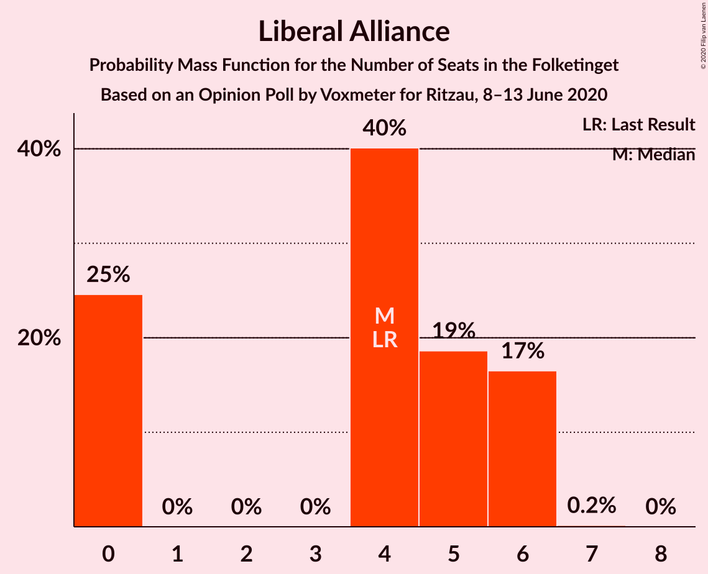
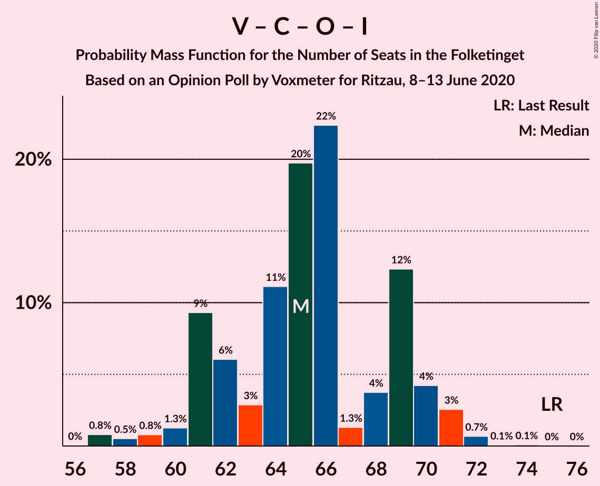

# Opinion Poll by Voxmeter for Ritzau, 8–13 June 2020

<a href="#voting-intentions">Voting Intentions</a> | <a href="#seats">Seats</a> | <a href="#coalitions">Coalitions</a> | <a href="#technical-information">Technical Information</a>

## Voting Intentions

### Confidence Intervals

| Party | Last Result | Poll Result | 80% Confidence Interval | 90% Confidence Interval | 95% Confidence Interval | 99% Confidence Interval |
|:-----:|:-----------:|:-----------:|:-----------------------:|:-----------------------:|:-----------------------:|:-----------------------:|
| Socialdemokraterne | 25.9% | 34.0% | 32.1–35.9% |31.6–36.4% |31.2–36.9% |30.3–37.9% |
| Venstre | 23.4% | 20.4% | 18.8–22.0% |18.4–22.5% |18.0–22.9% |17.3–23.8% |
| Radikale Venstre | 8.6% | 8.4% | 7.4–9.6% |7.1–10.0% |6.9–10.3% |6.4–10.9% |
| Enhedslisten–De Rød-Grønne | 6.9% | 7.9% | 6.9–9.1% |6.6–9.4% |6.4–9.7% |6.0–10.3% |
| Det Konservative Folkeparti | 6.6% | 7.3% | 6.4–8.5% |6.1–8.8% |5.9–9.1% |5.5–9.7% |
| Socialistisk Folkeparti | 7.7% | 7.0% | 6.1–8.2% |5.9–8.5% |5.6–8.8% |5.2–9.3% |
| Dansk Folkeparti | 8.7% | 6.6% | 5.7–7.7% |5.4–8.0% |5.2–8.2% |4.8–8.8% |
| Nye Borgerlige | 2.4% | 3.4% | 2.8–4.2% |2.6–4.5% |2.4–4.7% |2.2–5.1% |
| Liberal Alliance | 2.3% | 2.1% | 1.6–2.8% |1.5–3.0% |1.4–3.2% |1.2–3.6% |
| Klaus Riskær Pedersen | 0.8% | 1.1% | 0.7–1.6% |0.7–1.8% |0.6–1.9% |0.5–2.2% |
| Stram Kurs | 1.8% | 0.8% | 0.5–1.3% |0.4–1.4% |0.4–1.5% |0.3–1.8% |
| Alternativet | 3.0% | 0.5% | 0.3–0.9% |0.2–1.0% |0.2–1.1% |0.1–1.4% |

*Note:* The poll result column reflects the actual value used in the calculations. Published results may vary slightly, and in addition be rounded to fewer digits.

## Seats

### Confidence Intervals

| Party | Last Result | Median | 80% Confidence Interval | 90% Confidence Interval | 95% Confidence Interval | 99% Confidence Interval |
|:-----:|:-----------:|:------:|:-----------------------:|:-----------------------:|:-----------------------:|:-----------------------:|
| <a href="#socialdemokraterne">Socialdemokraterne</a> | 48 | 61 | 57–65 |57–66 |56–67 |55–70 |
| <a href="#venstre">Venstre</a> | 43 | 37 | 33–41 |32–42 |32–42 |32–43 |
| <a href="#radikale-venstre">Radikale Venstre</a> | 16 | 15 | 13–17 |12–17 |12–18 |12–19 |
| <a href="#enhedslisten–de-rød-grønne">Enhedslisten–De Rød-Grønne</a> | 13 | 14 | 12–16 |12–18 |12–18 |11–18 |
| <a href="#det-konservative-folkeparti">Det Konservative Folkeparti</a> | 12 | 12 | 11–16 |10–16 |10–17 |10–17 |
| <a href="#socialistisk-folkeparti">Socialistisk Folkeparti</a> | 14 | 13 | 11–14 |10–15 |10–16 |10–16 |
| <a href="#dansk-folkeparti">Dansk Folkeparti</a> | 16 | 12 | 10–13 |9–14 |9–14 |9–16 |
| <a href="#nye-borgerlige">Nye Borgerlige</a> | 4 | 7 | 5–7 |5–8 |5–8 |4–9 |
| <a href="#liberal-alliance">Liberal Alliance</a> | 4 | 4 | 0–6 |0–6 |0–6 |0–6 |
| <a href="#klaus-riskær-pedersen">Klaus Riskær Pedersen</a> | 0 | 0 | 0 |0 |0–4 |0–4 |
| <a href="#stram-kurs">Stram Kurs</a> | 0 | 0 | 0 |0 |0 |0 |
| <a href="#alternativet">Alternativet</a> | 5 | 0 | 0 |0 |0 |0 |

### Socialdemokraterne

*For a full overview of the results for this party, see the [Socialdemokraterne](party-socialdemokraterne.html) page.*

| Number of Seats | Probability | Accumulated | Special Marks |
|:---------------:|:-----------:|:-----------:|:-------------:|
| 48 | 0% | 100% | Last Result |
| 49 | 0% | 100% |  |
| 50 | 0% | 100% |  |
| 51 | 0% | 100% |  |
| 52 | 0% | 100% |  |
| 53 | 0.2% | 99.9% |  |
| 54 | 0.2% | 99.8% |  |
| 55 | 0.3% | 99.6% |  |
| 56 | 3% | 99.2% |  |
| 57 | 11% | 96% |  |
| 58 | 8% | 86% |  |
| 59 | 4% | 78% |  |
| 60 | 10% | 75% |  |
| 61 | 26% | 65% | Median |
| 62 | 4% | 39% |  |
| 63 | 20% | 35% |  |
| 64 | 0.5% | 15% |  |
| 65 | 6% | 14% |  |
| 66 | 6% | 8% |  |
| 67 | 0.8% | 3% |  |
| 68 | 0.3% | 2% |  |
| 69 | 0.8% | 1.4% |  |
| 70 | 0.6% | 0.6% |  |
| 71 | 0% | 0% |  |

### Venstre

*For a full overview of the results for this party, see the [Venstre](party-venstre.html) page.*

| Number of Seats | Probability | Accumulated | Special Marks |
|:---------------:|:-----------:|:-----------:|:-------------:|
| 30 | 0.1% | 100% |  |
| 31 | 0.2% | 99.9% |  |
| 32 | 6% | 99.7% |  |
| 33 | 6% | 94% |  |
| 34 | 6% | 88% |  |
| 35 | 5% | 82% |  |
| 36 | 20% | 77% |  |
| 37 | 16% | 57% | Median |
| 38 | 11% | 40% |  |
| 39 | 12% | 29% |  |
| 40 | 2% | 17% |  |
| 41 | 5% | 15% |  |
| 42 | 7% | 10% |  |
| 43 | 2% | 2% | Last Result |
| 44 | 0.2% | 0.2% |  |
| 45 | 0% | 0% |  |

### Radikale Venstre

*For a full overview of the results for this party, see the [Radikale Venstre](party-radikalevenstre.html) page.*

| Number of Seats | Probability | Accumulated | Special Marks |
|:---------------:|:-----------:|:-----------:|:-------------:|
| 11 | 0.2% | 100% |  |
| 12 | 6% | 99.8% |  |
| 13 | 14% | 94% |  |
| 14 | 21% | 80% |  |
| 15 | 27% | 60% | Median |
| 16 | 14% | 33% | Last Result |
| 17 | 14% | 18% |  |
| 18 | 3% | 4% |  |
| 19 | 0.9% | 1.2% |  |
| 20 | 0.1% | 0.3% |  |
| 21 | 0.1% | 0.1% |  |
| 22 | 0% | 0% |  |

### Enhedslisten–De Rød-Grønne

*For a full overview of the results for this party, see the [Enhedslisten–De Rød-Grønne](party-enhedslisten–derød-grønne.html) page.*

| Number of Seats | Probability | Accumulated | Special Marks |
|:---------------:|:-----------:|:-----------:|:-------------:|
| 10 | 0.1% | 100% |  |
| 11 | 0.8% | 99.9% |  |
| 12 | 10% | 99.0% |  |
| 13 | 22% | 89% | Last Result |
| 14 | 27% | 67% | Median |
| 15 | 16% | 41% |  |
| 16 | 15% | 25% |  |
| 17 | 3% | 10% |  |
| 18 | 6% | 6% |  |
| 19 | 0.2% | 0.2% |  |
| 20 | 0.1% | 0.1% |  |
| 21 | 0% | 0% |  |

### Det Konservative Folkeparti

*For a full overview of the results for this party, see the [Det Konservative Folkeparti](party-detkonservativefolkeparti.html) page.*

| Number of Seats | Probability | Accumulated | Special Marks |
|:---------------:|:-----------:|:-----------:|:-------------:|
| 9 | 0.1% | 100% |  |
| 10 | 8% | 99.9% |  |
| 11 | 16% | 92% |  |
| 12 | 28% | 76% | Last Result, Median |
| 13 | 15% | 49% |  |
| 14 | 13% | 34% |  |
| 15 | 10% | 21% |  |
| 16 | 8% | 11% |  |
| 17 | 2% | 3% |  |
| 18 | 0.3% | 0.3% |  |
| 19 | 0% | 0% |  |

### Socialistisk Folkeparti

*For a full overview of the results for this party, see the [Socialistisk Folkeparti](party-socialistiskfolkeparti.html) page.*

| Number of Seats | Probability | Accumulated | Special Marks |
|:---------------:|:-----------:|:-----------:|:-------------:|
| 9 | 0.4% | 100% |  |
| 10 | 6% | 99.6% |  |
| 11 | 12% | 94% |  |
| 12 | 27% | 82% |  |
| 13 | 25% | 54% | Median |
| 14 | 22% | 29% | Last Result |
| 15 | 3% | 8% |  |
| 16 | 4% | 4% |  |
| 17 | 0.3% | 0.4% |  |
| 18 | 0.1% | 0.1% |  |
| 19 | 0% | 0% |  |

### Dansk Folkeparti

*For a full overview of the results for this party, see the [Dansk Folkeparti](party-danskfolkeparti.html) page.*

| Number of Seats | Probability | Accumulated | Special Marks |
|:---------------:|:-----------:|:-----------:|:-------------:|
| 8 | 0.2% | 100% |  |
| 9 | 8% | 99.8% |  |
| 10 | 8% | 92% |  |
| 11 | 19% | 84% |  |
| 12 | 32% | 65% | Median |
| 13 | 24% | 32% |  |
| 14 | 6% | 8% |  |
| 15 | 1.1% | 2% |  |
| 16 | 0.7% | 0.9% | Last Result |
| 17 | 0.2% | 0.2% |  |
| 18 | 0% | 0% |  |

### Nye Borgerlige

*For a full overview of the results for this party, see the [Nye Borgerlige](party-nyeborgerlige.html) page.*

| Number of Seats | Probability | Accumulated | Special Marks |
|:---------------:|:-----------:|:-----------:|:-------------:|
| 0 | 0.1% | 100% |  |
| 1 | 0% | 99.9% |  |
| 2 | 0% | 99.9% |  |
| 3 | 0% | 99.9% |  |
| 4 | 2% | 99.9% | Last Result |
| 5 | 22% | 98% |  |
| 6 | 25% | 77% |  |
| 7 | 45% | 52% | Median |
| 8 | 5% | 6% |  |
| 9 | 1.2% | 1.4% |  |
| 10 | 0.2% | 0.2% |  |
| 11 | 0% | 0% |  |

### Liberal Alliance

*For a full overview of the results for this party, see the [Liberal Alliance](party-liberalalliance.html) page.*

| Number of Seats | Probability | Accumulated | Special Marks |
|:---------------:|:-----------:|:-----------:|:-------------:|
| 0 | 25% | 100% |  |
| 1 | 0% | 75% |  |
| 2 | 0% | 75% |  |
| 3 | 0% | 75% |  |
| 4 | 40% | 75% | Last Result, Median |
| 5 | 19% | 35% |  |
| 6 | 17% | 17% |  |
| 7 | 0.2% | 0.2% |  |
| 8 | 0% | 0% |  |

### Klaus Riskær Pedersen

*For a full overview of the results for this party, see the [Klaus Riskær Pedersen](party-klausriskærpedersen.html) page.*

| Number of Seats | Probability | Accumulated | Special Marks |
|:---------------:|:-----------:|:-----------:|:-------------:|
| 0 | 96% | 100% | Last Result, Median |
| 1 | 0% | 4% |  |
| 2 | 0% | 4% |  |
| 3 | 0% | 4% |  |
| 4 | 4% | 4% |  |
| 5 | 0.1% | 0.1% |  |
| 6 | 0% | 0% |  |

### Stram Kurs

*For a full overview of the results for this party, see the [Stram Kurs](party-stramkurs.html) page.*

| Number of Seats | Probability | Accumulated | Special Marks |
|:---------------:|:-----------:|:-----------:|:-------------:|
| 0 | 99.9% | 100% | Last Result, Median |
| 1 | 0% | 0.1% |  |
| 2 | 0% | 0.1% |  |
| 3 | 0% | 0.1% |  |
| 4 | 0.1% | 0.1% |  |
| 5 | 0% | 0% |  |

### Alternativet

*For a full overview of the results for this party, see the [Alternativet](party-alternativet.html) page.*

| Number of Seats | Probability | Accumulated | Special Marks |
|:---------------:|:-----------:|:-----------:|:-------------:|
| 0 | 100% | 100% | Median |
| 1 | 0% | 0% |  |
| 2 | 0% | 0% |  |
| 3 | 0% | 0% |  |
| 4 | 0% | 0% |  |
| 5 | 0% | 0% | Last Result |

## Coalitions

### Confidence Intervals

| Coalition | Last Result | Median | Majority? | 80% Confidence Interval | 90% Confidence Interval | 95% Confidence Interval | 99% Confidence Interval |
|:---------:|:-----------:|:------:|:---------:|:-----------------------:|:-----------------------:|:-----------------------:|:-----------------------:|
| Socialdemokraterne – Radikale Venstre – Enhedslisten–De Rød-Grønne – Socialistisk Folkeparti – Alternativet | 96 | 103 | 100% | 100–107 | 99–108 | 98–109 | 97–111 |
| Socialdemokraterne – Radikale Venstre – Enhedslisten–De Rød-Grønne – Socialistisk Folkeparti | 91 | 103 | 100% | 100–107 | 99–108 | 98–109 | 97–111 |
| Socialdemokraterne – Enhedslisten–De Rød-Grønne – Socialistisk Folkeparti – Alternativet | 80 | 87 | 28% | 85–93 | 84–94 | 83–94 | 81–97 |
| Socialdemokraterne – Enhedslisten–De Rød-Grønne – Socialistisk Folkeparti | 75 | 87 | 28% | 85–93 | 84–94 | 83–94 | 81–97 |
| Socialdemokraterne – Radikale Venstre – Socialistisk Folkeparti | 78 | 89 | 36% | 86–93 | 84–93 | 82–94 | 81–97 |
| Socialdemokraterne – Radikale Venstre | 64 | 75 | 0% | 73–80 | 72–80 | 71–80 | 69–87 |
| Venstre – Det Konservative Folkeparti – Dansk Folkeparti – Nye Borgerlige – Liberal Alliance – Klaus Riskær Pedersen | 79 | 72 | 0% | 68–75 | 67–76 | 66–77 | 64–78 |
| Venstre – Det Konservative Folkeparti – Dansk Folkeparti – Nye Borgerlige – Liberal Alliance | 79 | 71 | 0% | 68–75 | 67–76 | 66–77 | 64–78 |
| Venstre – Det Konservative Folkeparti – Dansk Folkeparti – Liberal Alliance | 75 | 65 | 0% | 61–69 | 61–70 | 60–71 | 57–72 |
| Venstre – Det Konservative Folkeparti – Liberal Alliance | 59 | 53 | 0% | 49–57 | 48–57 | 48–59 | 45–60 |
| Venstre – Det Konservative Folkeparti | 55 | 50 | 0% | 46–53 | 46–55 | 46–56 | 44–57 |
| Venstre | 43 | 37 | 0% | 33–41 | 32–42 | 32–42 | 32–43 |

### Socialdemokraterne – Radikale Venstre – Enhedslisten–De Rød-Grønne – Socialistisk Folkeparti – Alternativet

| Number of Seats | Probability | Accumulated | Special Marks |
|:---------------:|:-----------:|:-----------:|:-------------:|
| 95 | 0.1% | 100% |  |
| 96 | 0.2% | 99.9% | Last Result |
| 97 | 0.5% | 99.7% |  |
| 98 | 4% | 99.2% |  |
| 99 | 1.0% | 95% |  |
| 100 | 16% | 94% |  |
| 101 | 4% | 78% |  |
| 102 | 15% | 74% |  |
| 103 | 10% | 59% | Median |
| 104 | 28% | 49% |  |
| 105 | 4% | 21% |  |
| 106 | 1.4% | 17% |  |
| 107 | 10% | 16% |  |
| 108 | 3% | 6% |  |
| 109 | 0.7% | 3% |  |
| 110 | 0.1% | 2% |  |
| 111 | 2% | 2% |  |
| 112 | 0.4% | 0.4% |  |
| 113 | 0% | 0% |  |

### Socialdemokraterne – Radikale Venstre – Enhedslisten–De Rød-Grønne – Socialistisk Folkeparti

| Number of Seats | Probability | Accumulated | Special Marks |
|:---------------:|:-----------:|:-----------:|:-------------:|
| 91 | 0% | 100% | Last Result |
| 92 | 0% | 100% |  |
| 93 | 0% | 100% |  |
| 94 | 0% | 100% |  |
| 95 | 0.1% | 100% |  |
| 96 | 0.2% | 99.9% |  |
| 97 | 0.5% | 99.7% |  |
| 98 | 4% | 99.2% |  |
| 99 | 1.0% | 95% |  |
| 100 | 16% | 94% |  |
| 101 | 4% | 78% |  |
| 102 | 15% | 74% |  |
| 103 | 10% | 59% | Median |
| 104 | 28% | 49% |  |
| 105 | 4% | 21% |  |
| 106 | 1.4% | 17% |  |
| 107 | 10% | 16% |  |
| 108 | 3% | 6% |  |
| 109 | 0.7% | 3% |  |
| 110 | 0.1% | 2% |  |
| 111 | 2% | 2% |  |
| 112 | 0.4% | 0.4% |  |
| 113 | 0% | 0% |  |

### Socialdemokraterne – Enhedslisten–De Rød-Grønne – Socialistisk Folkeparti – Alternativet

| Number of Seats | Probability | Accumulated | Special Marks |
|:---------------:|:-----------:|:-----------:|:-------------:|
| 79 | 0.1% | 100% |  |
| 80 | 0.1% | 99.9% | Last Result |
| 81 | 1.0% | 99.8% |  |
| 82 | 0.2% | 98.9% |  |
| 83 | 2% | 98.6% |  |
| 84 | 5% | 97% |  |
| 85 | 3% | 92% |  |
| 86 | 16% | 89% |  |
| 87 | 24% | 73% |  |
| 88 | 12% | 49% | Median |
| 89 | 9% | 37% |  |
| 90 | 6% | 28% | Majority |
| 91 | 3% | 22% |  |
| 92 | 5% | 18% |  |
| 93 | 7% | 13% |  |
| 94 | 3% | 6% |  |
| 95 | 0.8% | 2% |  |
| 96 | 0.5% | 2% |  |
| 97 | 1.0% | 1.0% |  |
| 98 | 0% | 0% |  |

### Socialdemokraterne – Enhedslisten–De Rød-Grønne – Socialistisk Folkeparti

| Number of Seats | Probability | Accumulated | Special Marks |
|:---------------:|:-----------:|:-----------:|:-------------:|
| 75 | 0% | 100% | Last Result |
| 76 | 0% | 100% |  |
| 77 | 0% | 100% |  |
| 78 | 0% | 100% |  |
| 79 | 0.1% | 100% |  |
| 80 | 0.1% | 99.9% |  |
| 81 | 1.0% | 99.8% |  |
| 82 | 0.2% | 98.9% |  |
| 83 | 2% | 98.6% |  |
| 84 | 5% | 97% |  |
| 85 | 3% | 92% |  |
| 86 | 16% | 89% |  |
| 87 | 24% | 73% |  |
| 88 | 12% | 49% | Median |
| 89 | 9% | 37% |  |
| 90 | 6% | 28% | Majority |
| 91 | 3% | 22% |  |
| 92 | 5% | 18% |  |
| 93 | 7% | 13% |  |
| 94 | 3% | 6% |  |
| 95 | 0.8% | 2% |  |
| 96 | 0.5% | 2% |  |
| 97 | 1.0% | 1.0% |  |
| 98 | 0% | 0% |  |

### Socialdemokraterne – Radikale Venstre – Socialistisk Folkeparti

| Number of Seats | Probability | Accumulated | Special Marks |
|:---------------:|:-----------:|:-----------:|:-------------:|
| 78 | 0% | 100% | Last Result |
| 79 | 0% | 100% |  |
| 80 | 0% | 100% |  |
| 81 | 0.6% | 99.9% |  |
| 82 | 2% | 99.4% |  |
| 83 | 2% | 97% |  |
| 84 | 1.4% | 96% |  |
| 85 | 1.4% | 94% |  |
| 86 | 11% | 93% |  |
| 87 | 15% | 82% |  |
| 88 | 10% | 67% |  |
| 89 | 21% | 57% | Median |
| 90 | 11% | 36% | Majority |
| 91 | 12% | 25% |  |
| 92 | 1.4% | 13% |  |
| 93 | 7% | 11% |  |
| 94 | 2% | 4% |  |
| 95 | 0.3% | 2% |  |
| 96 | 0.8% | 2% |  |
| 97 | 0.6% | 0.8% |  |
| 98 | 0.2% | 0.2% |  |
| 99 | 0% | 0% |  |

### Socialdemokraterne – Radikale Venstre

| Number of Seats | Probability | Accumulated | Special Marks |
|:---------------:|:-----------:|:-----------:|:-------------:|
| 64 | 0% | 100% | Last Result |
| 65 | 0% | 100% |  |
| 66 | 0% | 100% |  |
| 67 | 0% | 100% |  |
| 68 | 0% | 99.9% |  |
| 69 | 0.8% | 99.9% |  |
| 70 | 0.5% | 99.2% |  |
| 71 | 2% | 98.7% |  |
| 72 | 3% | 96% |  |
| 73 | 8% | 94% |  |
| 74 | 12% | 86% |  |
| 75 | 27% | 74% |  |
| 76 | 11% | 47% | Median |
| 77 | 3% | 36% |  |
| 78 | 13% | 34% |  |
| 79 | 8% | 21% |  |
| 80 | 10% | 13% |  |
| 81 | 0.5% | 2% |  |
| 82 | 0.2% | 2% |  |
| 83 | 0.7% | 2% |  |
| 84 | 0.2% | 1.0% |  |
| 85 | 0.2% | 0.8% |  |
| 86 | 0% | 0.6% |  |
| 87 | 0.6% | 0.6% |  |
| 88 | 0% | 0% |  |

### Venstre – Det Konservative Folkeparti – Dansk Folkeparti – Nye Borgerlige – Liberal Alliance – Klaus Riskær Pedersen

| Number of Seats | Probability | Accumulated | Special Marks |
|:---------------:|:-----------:|:-----------:|:-------------:|
| 63 | 0.4% | 100% |  |
| 64 | 2% | 99.5% |  |
| 65 | 0.1% | 98% |  |
| 66 | 0.7% | 98% |  |
| 67 | 3% | 97% |  |
| 68 | 10% | 94% |  |
| 69 | 1.4% | 84% |  |
| 70 | 4% | 83% |  |
| 71 | 28% | 79% |  |
| 72 | 10% | 51% | Median |
| 73 | 15% | 41% |  |
| 74 | 4% | 25% |  |
| 75 | 16% | 22% |  |
| 76 | 0.9% | 6% |  |
| 77 | 4% | 5% |  |
| 78 | 0.5% | 0.8% |  |
| 79 | 0.2% | 0.3% | Last Result |
| 80 | 0.1% | 0.1% |  |
| 81 | 0% | 0% |  |

### Venstre – Det Konservative Folkeparti – Dansk Folkeparti – Nye Borgerlige – Liberal Alliance

| Number of Seats | Probability | Accumulated | Special Marks |
|:---------------:|:-----------:|:-----------:|:-------------:|
| 63 | 0.4% | 100% |  |
| 64 | 2% | 99.5% |  |
| 65 | 0.1% | 98% |  |
| 66 | 0.7% | 98% |  |
| 67 | 3% | 97% |  |
| 68 | 10% | 94% |  |
| 69 | 4% | 84% |  |
| 70 | 4% | 80% |  |
| 71 | 28% | 75% |  |
| 72 | 10% | 47% | Median |
| 73 | 12% | 37% |  |
| 74 | 3% | 25% |  |
| 75 | 16% | 21% |  |
| 76 | 0.9% | 6% |  |
| 77 | 4% | 5% |  |
| 78 | 0.5% | 0.8% |  |
| 79 | 0.2% | 0.3% | Last Result |
| 80 | 0.1% | 0.1% |  |
| 81 | 0% | 0% |  |

### Venstre – Det Konservative Folkeparti – Dansk Folkeparti – Liberal Alliance

| Number of Seats | Probability | Accumulated | Special Marks |
|:---------------:|:-----------:|:-----------:|:-------------:|
| 56 | 0% | 100% |  |
| 57 | 0.8% | 99.9% |  |
| 58 | 0.5% | 99.1% |  |
| 59 | 0.8% | 98.6% |  |
| 60 | 1.3% | 98% |  |
| 61 | 9% | 97% |  |
| 62 | 6% | 87% |  |
| 63 | 3% | 81% |  |
| 64 | 11% | 78% |  |
| 65 | 20% | 67% | Median |
| 66 | 22% | 47% |  |
| 67 | 1.3% | 25% |  |
| 68 | 4% | 24% |  |
| 69 | 12% | 20% |  |
| 70 | 4% | 8% |  |
| 71 | 3% | 3% |  |
| 72 | 0.7% | 0.9% |  |
| 73 | 0.1% | 0.2% |  |
| 74 | 0.1% | 0.1% |  |
| 75 | 0% | 0% | Last Result |

### Venstre – Det Konservative Folkeparti – Liberal Alliance

| Number of Seats | Probability | Accumulated | Special Marks |
|:---------------:|:-----------:|:-----------:|:-------------:|
| 44 | 0.1% | 100% |  |
| 45 | 0.8% | 99.9% |  |
| 46 | 0.7% | 99.1% |  |
| 47 | 0.2% | 98% |  |
| 48 | 7% | 98% |  |
| 49 | 1.0% | 91% |  |
| 50 | 8% | 90% |  |
| 51 | 12% | 82% |  |
| 52 | 7% | 70% |  |
| 53 | 14% | 63% | Median |
| 54 | 5% | 49% |  |
| 55 | 12% | 44% |  |
| 56 | 8% | 33% |  |
| 57 | 20% | 24% |  |
| 58 | 0.9% | 4% |  |
| 59 | 0.9% | 3% | Last Result |
| 60 | 2% | 2% |  |
| 61 | 0.1% | 0.1% |  |
| 62 | 0% | 0.1% |  |
| 63 | 0% | 0% |  |

### Venstre – Det Konservative Folkeparti

| Number of Seats | Probability | Accumulated | Special Marks |
|:---------------:|:-----------:|:-----------:|:-------------:|
| 42 | 0% | 100% |  |
| 43 | 0.1% | 99.9% |  |
| 44 | 0.5% | 99.8% |  |
| 45 | 1.2% | 99.3% |  |
| 46 | 9% | 98% |  |
| 47 | 10% | 90% |  |
| 48 | 18% | 80% |  |
| 49 | 11% | 62% | Median |
| 50 | 5% | 51% |  |
| 51 | 16% | 46% |  |
| 52 | 7% | 30% |  |
| 53 | 16% | 23% |  |
| 54 | 2% | 7% |  |
| 55 | 1.0% | 5% | Last Result |
| 56 | 2% | 4% |  |
| 57 | 2% | 2% |  |
| 58 | 0% | 0.2% |  |
| 59 | 0.1% | 0.2% |  |
| 60 | 0% | 0% |  |

### Venstre

| Number of Seats | Probability | Accumulated | Special Marks |
|:---------------:|:-----------:|:-----------:|:-------------:|
| 30 | 0.1% | 100% |  |
| 31 | 0.2% | 99.9% |  |
| 32 | 6% | 99.7% |  |
| 33 | 6% | 94% |  |
| 34 | 6% | 88% |  |
| 35 | 5% | 82% |  |
| 36 | 20% | 77% |  |
| 37 | 16% | 57% | Median |
| 38 | 11% | 40% |  |
| 39 | 12% | 29% |  |
| 40 | 2% | 17% |  |
| 41 | 5% | 15% |  |
| 42 | 7% | 10% |  |
| 43 | 2% | 2% | Last Result |
| 44 | 0.2% | 0.2% |  |
| 45 | 0% | 0% |  |

## Technical Information

### Opinion Poll

+ **Polling firm:** Voxmeter
+ **Commissioner(s):** Ritzau
+ **Fieldwork period:** 8–13 June 2020

### Calculations

+ **Sample size:** 1036
+ **Simulations done:** 1,048,576
+ **Error estimate:** 1.43%

