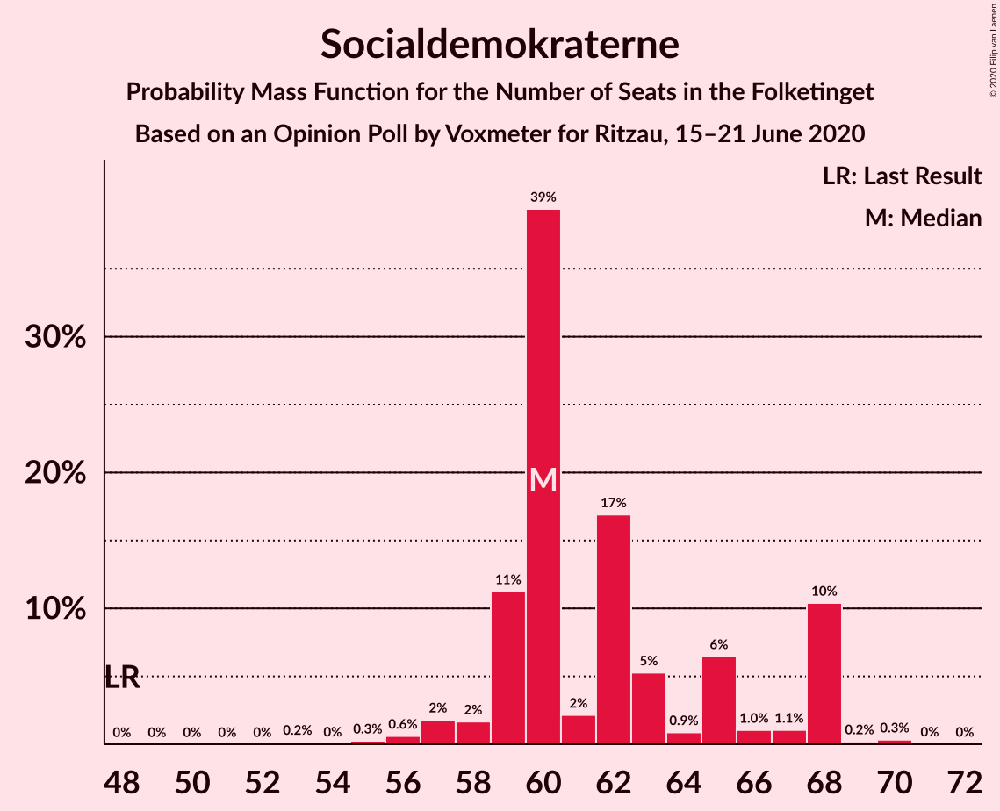
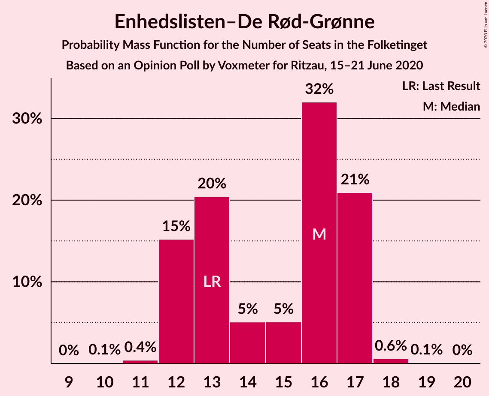
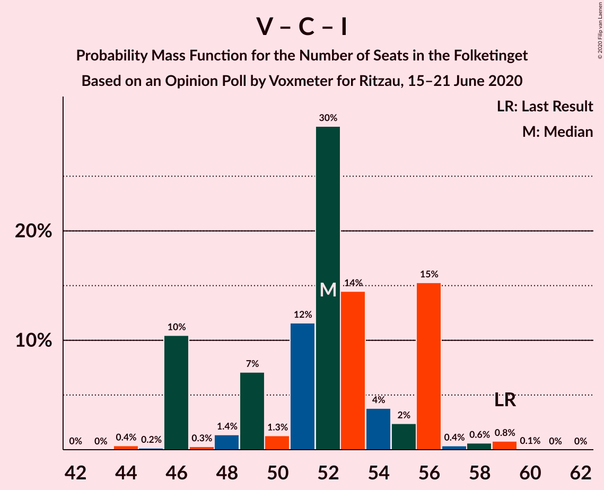

# Opinion Poll by Voxmeter for Ritzau, 15–21 June 2020

<a href="#voting-intentions">Voting Intentions</a> | <a href="#seats">Seats</a> | <a href="#coalitions">Coalitions</a> | <a href="#technical-information">Technical Information</a>

## Voting Intentions

### Confidence Intervals

| Party | Last Result | Poll Result | 80% Confidence Interval | 90% Confidence Interval | 95% Confidence Interval | 99% Confidence Interval |
|:-----:|:-----------:|:-----------:|:-----------------------:|:-----------------------:|:-----------------------:|:-----------------------:|
| Socialdemokraterne | 25.9% | 34.6% | 32.7–36.5% |32.2–37.1% |31.7–37.6% |30.9–38.5% |
| Venstre | 23.4% | 19.9% | 18.3–21.5% |17.9–22.0% |17.5–22.4% |16.8–23.2% |
| Enhedslisten–De Rød-Grønne | 6.9% | 8.0% | 7.0–9.2% |6.8–9.6% |6.5–9.9% |6.1–10.5% |
| Radikale Venstre | 8.6% | 8.0% | 7.0–9.2% |6.8–9.6% |6.5–9.9% |6.1–10.5% |
| Det Konservative Folkeparti | 6.6% | 7.5% | 6.5–8.6% |6.2–8.9% |6.0–9.2% |5.6–9.8% |
| Socialistisk Folkeparti | 7.7% | 7.4% | 6.4–8.5% |6.1–8.8% |5.9–9.1% |5.5–9.7% |
| Dansk Folkeparti | 8.7% | 6.0% | 5.2–7.1% |4.9–7.4% |4.7–7.6% |4.3–8.2% |
| Nye Borgerlige | 2.4% | 4.0% | 3.3–4.9% |3.1–5.1% |2.9–5.3% |2.6–5.8% |
| Liberal Alliance | 2.3% | 2.0% | 1.6–2.7% |1.4–2.9% |1.3–3.1% |1.1–3.5% |
| Alternativet | 3.0% | 0.6% | 0.4–1.0% |0.3–1.1% |0.3–1.3% |0.2–1.5% |
| Stram Kurs | 1.8% | 0.4% | 0.2–0.8% |0.2–0.9% |0.2–1.0% |0.1–1.2% |
| Klaus Riskær Pedersen | 0.8% | 0.3% | 0.2–0.7% |0.1–0.8% |0.1–0.9% |0.1–1.1% |

*Note:* The poll result column reflects the actual value used in the calculations. Published results may vary slightly, and in addition be rounded to fewer digits.

## Seats

### Confidence Intervals

| Party | Last Result | Median | 80% Confidence Interval | 90% Confidence Interval | 95% Confidence Interval | 99% Confidence Interval |
|:-----:|:-----------:|:------:|:-----------------------:|:-----------------------:|:-----------------------:|:-----------------------:|
| <a href="#socialdemokraterne">Socialdemokraterne</a> | 48 | 68 | 61–68 |58–68 |57–68 |57–69 |
| <a href="#venstre">Venstre</a> | 43 | 34 | 34–37 |34–37 |33–38 |31–38 |
| <a href="#enhedslisten–de-rød-grønne">Enhedslisten–De Rød-Grønne</a> | 13 | 13 | 13–15 |13–16 |12–16 |11–18 |
| <a href="#radikale-venstre">Radikale Venstre</a> | 16 | 14 | 14 |13–15 |12–17 |12–19 |
| <a href="#det-konservative-folkeparti">Det Konservative Folkeparti</a> | 12 | 12 | 12–14 |11–15 |11–18 |11–18 |
| <a href="#socialistisk-folkeparti">Socialistisk Folkeparti</a> | 14 | 14 | 14–15 |12–15 |12–15 |10–18 |
| <a href="#dansk-folkeparti">Dansk Folkeparti</a> | 16 | 11 | 10–11 |9–11 |9–11 |9–13 |
| <a href="#nye-borgerlige">Nye Borgerlige</a> | 4 | 9 | 7–9 |7–9 |6–11 |5–11 |
| <a href="#liberal-alliance">Liberal Alliance</a> | 4 | 0 | 0–4 |0–5 |0–5 |0–5 |
| <a href="#alternativet">Alternativet</a> | 5 | 0 | 0 |0 |0 |0 |
| <a href="#stram-kurs">Stram Kurs</a> | 0 | 0 | 0 |0 |0 |0 |
| <a href="#klaus-riskær-pedersen">Klaus Riskær Pedersen</a> | 0 | 0 | 0 |0 |0 |0 |

### Socialdemokraterne

*For a full overview of the results for this party, see the [Socialdemokraterne](party-socialdemokraterne.html) page.*

| Number of Seats | Probability | Accumulated | Special Marks |
|:---------------:|:-----------:|:-----------:|:-------------:|
| 48 | 0% | 100% | Last Result |
| 49 | 0% | 100% |  |
| 50 | 0% | 100% |  |
| 51 | 0% | 100% |  |
| 52 | 0% | 100% |  |
| 53 | 0% | 100% |  |
| 54 | 0% | 100% |  |
| 55 | 0.2% | 100% |  |
| 56 | 0% | 99.7% |  |
| 57 | 3% | 99.7% |  |
| 58 | 3% | 97% |  |
| 59 | 0.2% | 94% |  |
| 60 | 0.3% | 94% |  |
| 61 | 4% | 93% |  |
| 62 | 4% | 89% |  |
| 63 | 2% | 86% |  |
| 64 | 2% | 83% |  |
| 65 | 0.2% | 82% |  |
| 66 | 4% | 81% |  |
| 67 | 0.1% | 77% |  |
| 68 | 76% | 77% | Median |
| 69 | 0.6% | 0.6% |  |
| 70 | 0% | 0% |  |

### Venstre

*For a full overview of the results for this party, see the [Venstre](party-venstre.html) page.*

| Number of Seats | Probability | Accumulated | Special Marks |
|:---------------:|:-----------:|:-----------:|:-------------:|
| 30 | 0.1% | 100% |  |
| 31 | 0.4% | 99.8% |  |
| 32 | 1.3% | 99.4% |  |
| 33 | 3% | 98% |  |
| 34 | 77% | 95% | Median |
| 35 | 2% | 18% |  |
| 36 | 5% | 16% |  |
| 37 | 7% | 12% |  |
| 38 | 4% | 5% |  |
| 39 | 0.2% | 0.3% |  |
| 40 | 0.1% | 0.2% |  |
| 41 | 0% | 0.1% |  |
| 42 | 0% | 0% |  |
| 43 | 0% | 0% | Last Result |

### Enhedslisten–De Rød-Grønne

*For a full overview of the results for this party, see the [Enhedslisten–De Rød-Grønne](party-enhedslisten–derød-grønne.html) page.*

| Number of Seats | Probability | Accumulated | Special Marks |
|:---------------:|:-----------:|:-----------:|:-------------:|
| 11 | 0.7% | 100% |  |
| 12 | 2% | 99.2% |  |
| 13 | 82% | 97% | Last Result, Median |
| 14 | 2% | 15% |  |
| 15 | 6% | 13% |  |
| 16 | 5% | 7% |  |
| 17 | 1.0% | 2% |  |
| 18 | 0.6% | 0.7% |  |
| 19 | 0% | 0% |  |

### Radikale Venstre

*For a full overview of the results for this party, see the [Radikale Venstre](party-radikalevenstre.html) page.*

| Number of Seats | Probability | Accumulated | Special Marks |
|:---------------:|:-----------:|:-----------:|:-------------:|
| 11 | 0.1% | 100% |  |
| 12 | 4% | 99.9% |  |
| 13 | 4% | 96% |  |
| 14 | 82% | 92% | Median |
| 15 | 6% | 10% |  |
| 16 | 1.2% | 4% | Last Result |
| 17 | 0.5% | 3% |  |
| 18 | 1.3% | 2% |  |
| 19 | 0.8% | 0.8% |  |
| 20 | 0% | 0% |  |

### Det Konservative Folkeparti

*For a full overview of the results for this party, see the [Det Konservative Folkeparti](party-detkonservativefolkeparti.html) page.*

| Number of Seats | Probability | Accumulated | Special Marks |
|:---------------:|:-----------:|:-----------:|:-------------:|
| 11 | 7% | 100% |  |
| 12 | 79% | 93% | Last Result, Median |
| 13 | 2% | 14% |  |
| 14 | 5% | 12% |  |
| 15 | 3% | 7% |  |
| 16 | 1.2% | 4% |  |
| 17 | 0% | 3% |  |
| 18 | 3% | 3% |  |
| 19 | 0% | 0% |  |

### Socialistisk Folkeparti

*For a full overview of the results for this party, see the [Socialistisk Folkeparti](party-socialistiskfolkeparti.html) page.*

| Number of Seats | Probability | Accumulated | Special Marks |
|:---------------:|:-----------:|:-----------:|:-------------:|
| 10 | 0.7% | 100% |  |
| 11 | 0.3% | 99.3% |  |
| 12 | 6% | 99.0% |  |
| 13 | 3% | 93% |  |
| 14 | 78% | 90% | Last Result, Median |
| 15 | 9% | 12% |  |
| 16 | 0.4% | 2% |  |
| 17 | 0.7% | 2% |  |
| 18 | 1.2% | 1.2% |  |
| 19 | 0% | 0% |  |

### Dansk Folkeparti

*For a full overview of the results for this party, see the [Dansk Folkeparti](party-danskfolkeparti.html) page.*

| Number of Seats | Probability | Accumulated | Special Marks |
|:---------------:|:-----------:|:-----------:|:-------------:|
| 7 | 0.4% | 100% |  |
| 8 | 0.1% | 99.6% |  |
| 9 | 7% | 99.5% |  |
| 10 | 7% | 93% |  |
| 11 | 84% | 86% | Median |
| 12 | 0.8% | 2% |  |
| 13 | 1.2% | 2% |  |
| 14 | 0.1% | 0.3% |  |
| 15 | 0.2% | 0.2% |  |
| 16 | 0% | 0% | Last Result |

### Nye Borgerlige

*For a full overview of the results for this party, see the [Nye Borgerlige](party-nyeborgerlige.html) page.*

| Number of Seats | Probability | Accumulated | Special Marks |
|:---------------:|:-----------:|:-----------:|:-------------:|
| 4 | 0.2% | 100% | Last Result |
| 5 | 1.4% | 99.8% |  |
| 6 | 3% | 98% |  |
| 7 | 6% | 96% |  |
| 8 | 3% | 90% |  |
| 9 | 82% | 87% | Median |
| 10 | 2% | 5% |  |
| 11 | 3% | 3% |  |
| 12 | 0% | 0% |  |

### Liberal Alliance

*For a full overview of the results for this party, see the [Liberal Alliance](party-liberalalliance.html) page.*

| Number of Seats | Probability | Accumulated | Special Marks |
|:---------------:|:-----------:|:-----------:|:-------------:|
| 0 | 88% | 100% | Median |
| 1 | 0% | 12% |  |
| 2 | 0% | 12% |  |
| 3 | 0% | 12% |  |
| 4 | 7% | 12% | Last Result |
| 5 | 5% | 5% |  |
| 6 | 0.4% | 0.4% |  |
| 7 | 0.1% | 0.1% |  |
| 8 | 0% | 0% |  |

### Alternativet

*For a full overview of the results for this party, see the [Alternativet](party-alternativet.html) page.*

| Number of Seats | Probability | Accumulated | Special Marks |
|:---------------:|:-----------:|:-----------:|:-------------:|
| 0 | 100% | 100% | Median |
| 1 | 0% | 0% |  |
| 2 | 0% | 0% |  |
| 3 | 0% | 0% |  |
| 4 | 0% | 0% |  |
| 5 | 0% | 0% | Last Result |

### Stram Kurs

*For a full overview of the results for this party, see the [Stram Kurs](party-stramkurs.html) page.*

| Number of Seats | Probability | Accumulated | Special Marks |
|:---------------:|:-----------:|:-----------:|:-------------:|
| 0 | 100% | 100% | Last Result, Median |

### Klaus Riskær Pedersen

*For a full overview of the results for this party, see the [Klaus Riskær Pedersen](party-klausriskærpedersen.html) page.*

| Number of Seats | Probability | Accumulated | Special Marks |
|:---------------:|:-----------:|:-----------:|:-------------:|
| 0 | 100% | 100% | Last Result, Median |

## Coalitions

### Confidence Intervals

| Coalition | Last Result | Median | Majority? | 80% Confidence Interval | 90% Confidence Interval | 95% Confidence Interval | 99% Confidence Interval |
|:---------:|:-----------:|:------:|:---------:|:-----------------------:|:-----------------------:|:-----------------------:|:-----------------------:|
| Socialdemokraterne – Enhedslisten–De Rød-Grønne – Radikale Venstre – Socialistisk Folkeparti – Alternativet | 96 | 109 | 100% | 103–109 | 101–109 | 99–109 | 99–112 |
| Socialdemokraterne – Enhedslisten–De Rød-Grønne – Radikale Venstre – Socialistisk Folkeparti | 91 | 109 | 100% | 103–109 | 101–109 | 99–109 | 99–112 |
| Socialdemokraterne – Radikale Venstre – Socialistisk Folkeparti | 78 | 96 | 87% | 89–96 | 87–96 | 84–96 | 84–98 |
| Socialdemokraterne – Enhedslisten–De Rød-Grønne – Socialistisk Folkeparti – Alternativet | 80 | 95 | 90% | 89–95 | 87–95 | 87–95 | 84–98 |
| Socialdemokraterne – Enhedslisten–De Rød-Grønne – Socialistisk Folkeparti | 75 | 95 | 90% | 89–95 | 87–95 | 87–95 | 84–98 |
| Socialdemokraterne – Radikale Venstre | 64 | 82 | 0% | 75–82 | 73–82 | 69–82 | 69–83 |
| Venstre – Det Konservative Folkeparti – Dansk Folkeparti – Nye Borgerlige – Liberal Alliance – Klaus Riskær Pedersen | 79 | 66 | 0% | 66–72 | 66–73 | 66–76 | 63–76 |
| Venstre – Det Konservative Folkeparti – Dansk Folkeparti – Nye Borgerlige – Liberal Alliance | 79 | 66 | 0% | 66–72 | 66–73 | 66–76 | 63–76 |
| Venstre – Det Konservative Folkeparti – Dansk Folkeparti – Liberal Alliance | 75 | 57 | 0% | 57–62 | 57–66 | 57–69 | 57–69 |
| Venstre – Det Konservative Folkeparti – Liberal Alliance | 59 | 46 | 0% | 46–52 | 46–55 | 46–58 | 46–58 |
| Venstre – Det Konservative Folkeparti | 55 | 46 | 0% | 46–51 | 46–52 | 44–54 | 44–54 |
| Venstre | 43 | 34 | 0% | 34–37 | 34–37 | 33–38 | 31–38 |

### Socialdemokraterne – Enhedslisten–De Rød-Grønne – Radikale Venstre – Socialistisk Folkeparti – Alternativet

| Number of Seats | Probability | Accumulated | Special Marks |
|:---------------:|:-----------:|:-----------:|:-------------:|
| 96 | 0.1% | 100% | Last Result |
| 97 | 0% | 99.9% |  |
| 98 | 0.3% | 99.8% |  |
| 99 | 3% | 99.6% |  |
| 100 | 0.1% | 97% |  |
| 101 | 2% | 97% |  |
| 102 | 1.4% | 95% |  |
| 103 | 4% | 94% |  |
| 104 | 3% | 90% |  |
| 105 | 2% | 87% |  |
| 106 | 2% | 85% |  |
| 107 | 0.2% | 83% |  |
| 108 | 0.2% | 83% |  |
| 109 | 81% | 83% | Median |
| 110 | 0.6% | 1.2% |  |
| 111 | 0% | 0.6% |  |
| 112 | 0.6% | 0.6% |  |
| 113 | 0% | 0% |  |

### Socialdemokraterne – Enhedslisten–De Rød-Grønne – Radikale Venstre – Socialistisk Folkeparti

| Number of Seats | Probability | Accumulated | Special Marks |
|:---------------:|:-----------:|:-----------:|:-------------:|
| 91 | 0% | 100% | Last Result |
| 92 | 0% | 100% |  |
| 93 | 0% | 100% |  |
| 94 | 0% | 100% |  |
| 95 | 0% | 100% |  |
| 96 | 0.1% | 100% |  |
| 97 | 0% | 99.9% |  |
| 98 | 0.3% | 99.8% |  |
| 99 | 3% | 99.6% |  |
| 100 | 0.1% | 97% |  |
| 101 | 2% | 97% |  |
| 102 | 1.4% | 95% |  |
| 103 | 4% | 94% |  |
| 104 | 3% | 90% |  |
| 105 | 2% | 87% |  |
| 106 | 2% | 85% |  |
| 107 | 0.2% | 83% |  |
| 108 | 0.2% | 83% |  |
| 109 | 81% | 83% | Median |
| 110 | 0.6% | 1.2% |  |
| 111 | 0% | 0.6% |  |
| 112 | 0.6% | 0.6% |  |
| 113 | 0% | 0% |  |

### Socialdemokraterne – Radikale Venstre – Socialistisk Folkeparti

| Number of Seats | Probability | Accumulated | Special Marks |
|:---------------:|:-----------:|:-----------:|:-------------:|
| 78 | 0% | 100% | Last Result |
| 79 | 0% | 100% |  |
| 80 | 0.1% | 100% |  |
| 81 | 0% | 99.9% |  |
| 82 | 0% | 99.9% |  |
| 83 | 0.3% | 99.9% |  |
| 84 | 3% | 99.6% |  |
| 85 | 0.9% | 97% |  |
| 86 | 0.3% | 96% |  |
| 87 | 3% | 96% |  |
| 88 | 0.1% | 93% |  |
| 89 | 5% | 93% |  |
| 90 | 2% | 87% | Majority |
| 91 | 0.2% | 85% |  |
| 92 | 4% | 85% |  |
| 93 | 0.3% | 82% |  |
| 94 | 0.2% | 81% |  |
| 95 | 0.1% | 81% |  |
| 96 | 80% | 81% | Median |
| 97 | 0.3% | 0.9% |  |
| 98 | 0.6% | 0.6% |  |
| 99 | 0% | 0% |  |

### Socialdemokraterne – Enhedslisten–De Rød-Grønne – Socialistisk Folkeparti – Alternativet

| Number of Seats | Probability | Accumulated | Special Marks |
|:---------------:|:-----------:|:-----------:|:-------------:|
| 80 | 0% | 100% | Last Result |
| 81 | 0% | 100% |  |
| 82 | 0% | 100% |  |
| 83 | 0% | 100% |  |
| 84 | 0.5% | 99.9% |  |
| 85 | 0.3% | 99.4% |  |
| 86 | 1.2% | 99.1% |  |
| 87 | 4% | 98% |  |
| 88 | 3% | 94% |  |
| 89 | 1.0% | 91% |  |
| 90 | 5% | 90% | Majority |
| 91 | 0.5% | 85% |  |
| 92 | 1.3% | 85% |  |
| 93 | 2% | 83% |  |
| 94 | 4% | 82% |  |
| 95 | 77% | 77% | Median |
| 96 | 0% | 0.6% |  |
| 97 | 0% | 0.6% |  |
| 98 | 0.6% | 0.6% |  |
| 99 | 0% | 0% |  |

### Socialdemokraterne – Enhedslisten–De Rød-Grønne – Socialistisk Folkeparti

| Number of Seats | Probability | Accumulated | Special Marks |
|:---------------:|:-----------:|:-----------:|:-------------:|
| 75 | 0% | 100% | Last Result |
| 76 | 0% | 100% |  |
| 77 | 0% | 100% |  |
| 78 | 0% | 100% |  |
| 79 | 0% | 100% |  |
| 80 | 0% | 100% |  |
| 81 | 0% | 100% |  |
| 82 | 0% | 100% |  |
| 83 | 0% | 100% |  |
| 84 | 0.5% | 99.9% |  |
| 85 | 0.3% | 99.4% |  |
| 86 | 1.2% | 99.1% |  |
| 87 | 4% | 98% |  |
| 88 | 3% | 94% |  |
| 89 | 1.0% | 91% |  |
| 90 | 5% | 90% | Majority |
| 91 | 0.5% | 85% |  |
| 92 | 1.3% | 85% |  |
| 93 | 2% | 83% |  |
| 94 | 4% | 82% |  |
| 95 | 77% | 77% | Median |
| 96 | 0% | 0.6% |  |
| 97 | 0% | 0.6% |  |
| 98 | 0.6% | 0.6% |  |
| 99 | 0% | 0% |  |

### Socialdemokraterne – Radikale Venstre

| Number of Seats | Probability | Accumulated | Special Marks |
|:---------------:|:-----------:|:-----------:|:-------------:|
| 64 | 0% | 100% | Last Result |
| 65 | 0% | 100% |  |
| 66 | 0% | 100% |  |
| 67 | 0.1% | 100% |  |
| 68 | 0% | 99.9% |  |
| 69 | 3% | 99.9% |  |
| 70 | 0.3% | 97% |  |
| 71 | 1.4% | 97% |  |
| 72 | 0.1% | 95% |  |
| 73 | 1.0% | 95% |  |
| 74 | 3% | 94% |  |
| 75 | 2% | 91% |  |
| 76 | 0.1% | 89% |  |
| 77 | 3% | 89% |  |
| 78 | 2% | 86% |  |
| 79 | 0.2% | 83% |  |
| 80 | 2% | 83% |  |
| 81 | 4% | 81% |  |
| 82 | 76% | 77% | Median |
| 83 | 0.8% | 0.9% |  |
| 84 | 0% | 0% |  |

### Venstre – Det Konservative Folkeparti – Dansk Folkeparti – Nye Borgerlige – Liberal Alliance – Klaus Riskær Pedersen

| Number of Seats | Probability | Accumulated | Special Marks |
|:---------------:|:-----------:|:-----------:|:-------------:|
| 63 | 0.7% | 100% |  |
| 64 | 0% | 99.3% |  |
| 65 | 0.6% | 99.3% |  |
| 66 | 81% | 98.6% | Median |
| 67 | 3% | 17% |  |
| 68 | 0.2% | 15% |  |
| 69 | 2% | 14% |  |
| 70 | 2% | 13% |  |
| 71 | 0.4% | 11% |  |
| 72 | 4% | 10% |  |
| 73 | 2% | 6% |  |
| 74 | 2% | 5% |  |
| 75 | 0% | 3% |  |
| 76 | 3% | 3% |  |
| 77 | 0.1% | 0.1% |  |
| 78 | 0% | 0.1% |  |
| 79 | 0.1% | 0.1% | Last Result |
| 80 | 0% | 0% |  |

### Venstre – Det Konservative Folkeparti – Dansk Folkeparti – Nye Borgerlige – Liberal Alliance

| Number of Seats | Probability | Accumulated | Special Marks |
|:---------------:|:-----------:|:-----------:|:-------------:|
| 63 | 0.7% | 100% |  |
| 64 | 0% | 99.3% |  |
| 65 | 0.6% | 99.3% |  |
| 66 | 81% | 98.6% | Median |
| 67 | 3% | 17% |  |
| 68 | 0.2% | 15% |  |
| 69 | 2% | 14% |  |
| 70 | 2% | 13% |  |
| 71 | 0.4% | 11% |  |
| 72 | 4% | 10% |  |
| 73 | 2% | 6% |  |
| 74 | 2% | 5% |  |
| 75 | 0% | 3% |  |
| 76 | 3% | 3% |  |
| 77 | 0.1% | 0.1% |  |
| 78 | 0% | 0.1% |  |
| 79 | 0.1% | 0.1% | Last Result |
| 80 | 0% | 0% |  |

### Venstre – Det Konservative Folkeparti – Dansk Folkeparti – Liberal Alliance

| Number of Seats | Probability | Accumulated | Special Marks |
|:---------------:|:-----------:|:-----------:|:-------------:|
| 56 | 0% | 100% |  |
| 57 | 82% | 99.9% | Median |
| 58 | 0.1% | 18% |  |
| 59 | 0.5% | 18% |  |
| 60 | 3% | 17% |  |
| 61 | 2% | 15% |  |
| 62 | 4% | 13% |  |
| 63 | 1.1% | 8% |  |
| 64 | 0.8% | 7% |  |
| 65 | 1.3% | 6% |  |
| 66 | 0.9% | 5% |  |
| 67 | 1.0% | 4% |  |
| 68 | 0.1% | 3% |  |
| 69 | 3% | 3% |  |
| 70 | 0% | 0.1% |  |
| 71 | 0% | 0.1% |  |
| 72 | 0% | 0.1% |  |
| 73 | 0% | 0% |  |
| 74 | 0% | 0% |  |
| 75 | 0% | 0% | Last Result |

### Venstre – Det Konservative Folkeparti – Liberal Alliance

| Number of Seats | Probability | Accumulated | Special Marks |
|:---------------:|:-----------:|:-----------:|:-------------:|
| 45 | 0.2% | 100% |  |
| 46 | 77% | 99.7% | Median |
| 47 | 0.1% | 23% |  |
| 48 | 5% | 23% |  |
| 49 | 3% | 18% |  |
| 50 | 0.5% | 15% |  |
| 51 | 4% | 14% |  |
| 52 | 2% | 10% |  |
| 53 | 0.3% | 8% |  |
| 54 | 2% | 8% |  |
| 55 | 2% | 6% |  |
| 56 | 0.7% | 4% |  |
| 57 | 0.1% | 3% |  |
| 58 | 3% | 3% |  |
| 59 | 0.1% | 0.2% | Last Result |
| 60 | 0.1% | 0.1% |  |
| 61 | 0% | 0% |  |

### Venstre – Det Konservative Folkeparti

| Number of Seats | Probability | Accumulated | Special Marks |
|:---------------:|:-----------:|:-----------:|:-------------:|
| 43 | 0% | 100% |  |
| 44 | 3% | 99.9% |  |
| 45 | 0.6% | 97% |  |
| 46 | 77% | 96% | Median |
| 47 | 0.2% | 19% |  |
| 48 | 5% | 19% |  |
| 49 | 1.0% | 14% |  |
| 50 | 2% | 13% |  |
| 51 | 6% | 11% |  |
| 52 | 2% | 6% |  |
| 53 | 0.3% | 3% |  |
| 54 | 3% | 3% |  |
| 55 | 0.1% | 0.1% | Last Result |
| 56 | 0% | 0% |  |

### Venstre

| Number of Seats | Probability | Accumulated | Special Marks |
|:---------------:|:-----------:|:-----------:|:-------------:|
| 30 | 0.1% | 100% |  |
| 31 | 0.4% | 99.8% |  |
| 32 | 1.3% | 99.4% |  |
| 33 | 3% | 98% |  |
| 34 | 77% | 95% | Median |
| 35 | 2% | 18% |  |
| 36 | 5% | 16% |  |
| 37 | 7% | 12% |  |
| 38 | 4% | 5% |  |
| 39 | 0.2% | 0.3% |  |
| 40 | 0.1% | 0.2% |  |
| 41 | 0% | 0.1% |  |
| 42 | 0% | 0% |  |
| 43 | 0% | 0% | Last Result |

## Technical Information

### Opinion Poll

+ **Polling firm:** Voxmeter
+ **Commissioner(s):** Ritzau
+ **Fieldwork period:** 15–21 June 2020

### Calculations

+ **Sample size:** 1032
+ **Simulations done:** 131,072
+ **Error estimate:** 5.46%

