# Opinion Poll by Megafon for Politiken and TV 2, 22–25 June 2020

<a href="#voting-intentions">Voting Intentions</a> | <a href="#seats">Seats</a> | <a href="#coalitions">Coalitions</a> | <a href="#technical-information">Technical Information</a>

## Voting Intentions

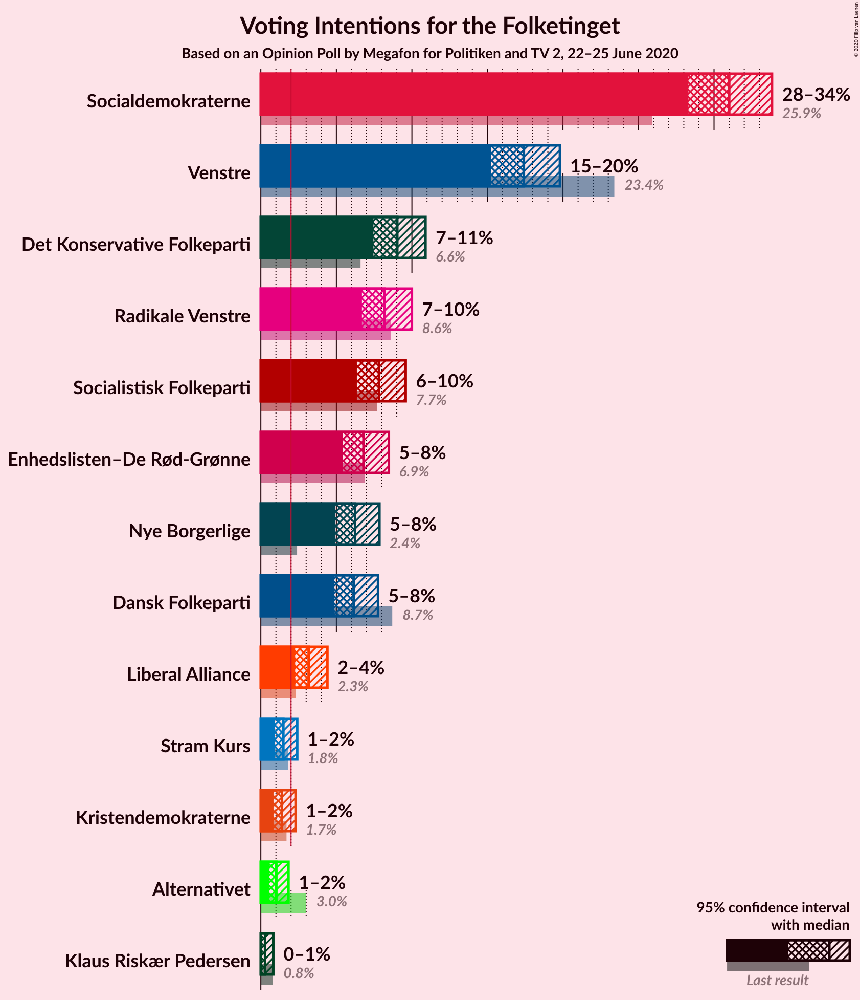

### Confidence Intervals

| Party | Last Result | Poll Result | 80% Confidence Interval | 90% Confidence Interval | 95% Confidence Interval | 99% Confidence Interval |
|:-----:|:-----------:|:-----------:|:-----------------------:|:-----------------------:|:-----------------------:|:-----------------------:|
| Socialdemokraterne | 25.9% | 31.0% | 29.2–32.9% |28.7–33.4% |28.3–33.8% |27.5–34.7% |
| Venstre | 23.4% | 17.4% | 16.0–19.0% |15.6–19.4% |15.3–19.8% |14.6–20.6% |
| Det Konservative Folkeparti | 6.6% | 9.0% | 8.0–10.3% |7.7–10.6% |7.5–10.9% |7.0–11.5% |
| Radikale Venstre | 8.6% | 8.2% | 7.2–9.4% |6.9–9.7% |6.7–10.0% |6.2–10.6% |
| Socialistisk Folkeparti | 7.7% | 7.8% | 6.9–9.0% |6.6–9.3% |6.4–9.6% |5.9–10.2% |
| Enhedslisten–De Rød-Grønne | 6.9% | 6.8% | 5.9–7.9% |5.7–8.2% |5.4–8.5% |5.0–9.0% |
| Nye Borgerlige | 2.4% | 6.2% | 5.4–7.3% |5.1–7.6% |4.9–7.8% |4.6–8.4% |
| Dansk Folkeparti | 8.7% | 6.1% | 5.3–7.2% |5.1–7.5% |4.9–7.8% |4.5–8.3% |
| Liberal Alliance | 2.3% | 3.2% | 2.6–4.0% |2.4–4.2% |2.3–4.4% |2.0–4.8% |
| Stram Kurs | 1.8% | 1.5% | 1.1–2.1% |1.0–2.3% |0.9–2.4% |0.8–2.7% |
| Kristendemokraterne | 1.7% | 1.4% | 1.0–2.0% |0.9–2.1% |0.8–2.3% |0.7–2.6% |
| Alternativet | 3.0% | 1.0% | 0.7–1.6% |0.6–1.7% |0.6–1.8% |0.5–2.1% |
| Klaus Riskær Pedersen | 0.8% | 0.3% | 0.2–0.6% |0.1–0.7% |0.1–0.8% |0.1–1.0% |

*Note:* The poll result column reflects the actual value used in the calculations. Published results may vary slightly, and in addition be rounded to fewer digits.

## Seats

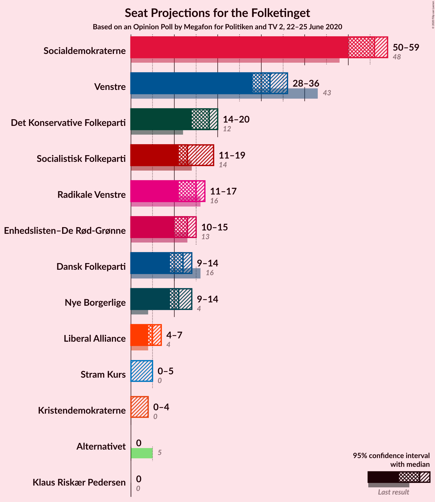

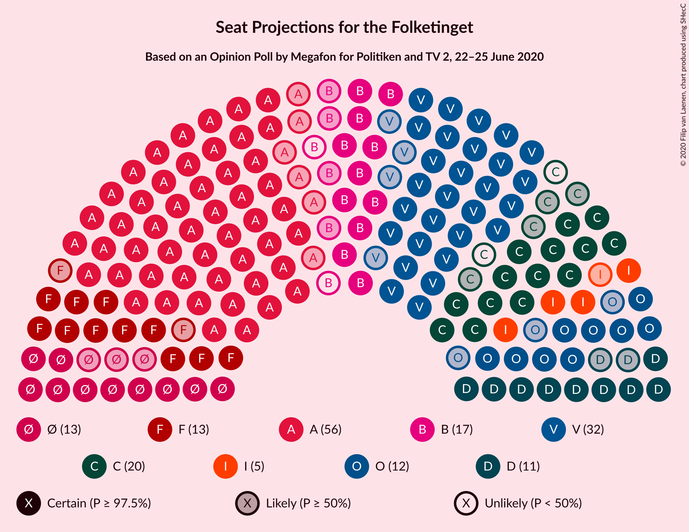

### Confidence Intervals

| Party | Last Result | Median | 80% Confidence Interval | 90% Confidence Interval | 95% Confidence Interval | 99% Confidence Interval |
|:-----:|:-----------:|:------:|:-----------------------:|:-----------------------:|:-----------------------:|:-----------------------:|
| <a href="#socialdemokraterne">Socialdemokraterne</a> | 48 | 56 | 52–56 |51–57 |50–59 |49–64 |
| <a href="#venstre">Venstre</a> | 43 | 32 | 28–34 |28–36 |28–36 |26–37 |
| <a href="#det-konservative-folkeparti">Det Konservative Folkeparti</a> | 12 | 18 | 16–20 |15–20 |14–20 |13–20 |
| <a href="#radikale-venstre">Radikale Venstre</a> | 16 | 15 | 12–17 |11–17 |11–17 |11–18 |
| <a href="#socialistisk-folkeparti">Socialistisk Folkeparti</a> | 14 | 13 | 12–16 |12–19 |11–19 |11–19 |
| <a href="#enhedslisten–de-rød-grønne">Enhedslisten–De Rød-Grønne</a> | 13 | 13 | 10–13 |10–15 |10–15 |9–17 |
| <a href="#nye-borgerlige">Nye Borgerlige</a> | 4 | 11 | 11–14 |10–14 |9–14 |8–15 |
| <a href="#dansk-folkeparti">Dansk Folkeparti</a> | 16 | 12 | 9–12 |9–13 |9–14 |8–16 |
| <a href="#liberal-alliance">Liberal Alliance</a> | 4 | 5 | 4–7 |4–7 |4–7 |0–10 |
| <a href="#stram-kurs">Stram Kurs</a> | 0 | 0 | 0–4 |0–4 |0–5 |0–5 |
| <a href="#kristendemokraterne">Kristendemokraterne</a> | 0 | 0 | 0–4 |0–4 |0–4 |0–5 |
| <a href="#alternativet">Alternativet</a> | 5 | 0 | 0 |0 |0 |0–4 |
| <a href="#klaus-riskær-pedersen">Klaus Riskær Pedersen</a> | 0 | 0 | 0 |0 |0 |0 |

### Socialdemokraterne

*For a full overview of the results for this party, see the [Socialdemokraterne](party-socialdemokraterne.html) page.*

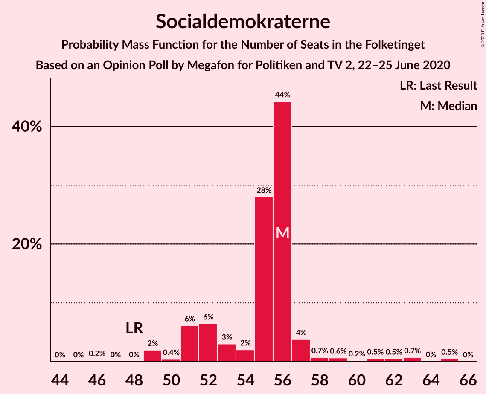

| Number of Seats | Probability | Accumulated | Special Marks |
|:---------------:|:-----------:|:-----------:|:-------------:|
| 46 | 0.2% | 100% |  |
| 47 | 0% | 99.8% |  |
| 48 | 0% | 99.8% | Last Result |
| 49 | 2% | 99.7% |  |
| 50 | 0.4% | 98% |  |
| 51 | 6% | 97% |  |
| 52 | 6% | 91% |  |
| 53 | 3% | 85% |  |
| 54 | 2% | 82% |  |
| 55 | 28% | 80% |  |
| 56 | 44% | 52% | Median |
| 57 | 4% | 7% |  |
| 58 | 0.7% | 4% |  |
| 59 | 0.6% | 3% |  |
| 60 | 0.2% | 2% |  |
| 61 | 0.5% | 2% |  |
| 62 | 0.5% | 2% |  |
| 63 | 0.7% | 1.2% |  |
| 64 | 0% | 0.5% |  |
| 65 | 0.5% | 0.5% |  |
| 66 | 0% | 0% |  |

### Venstre

*For a full overview of the results for this party, see the [Venstre](party-venstre.html) page.*

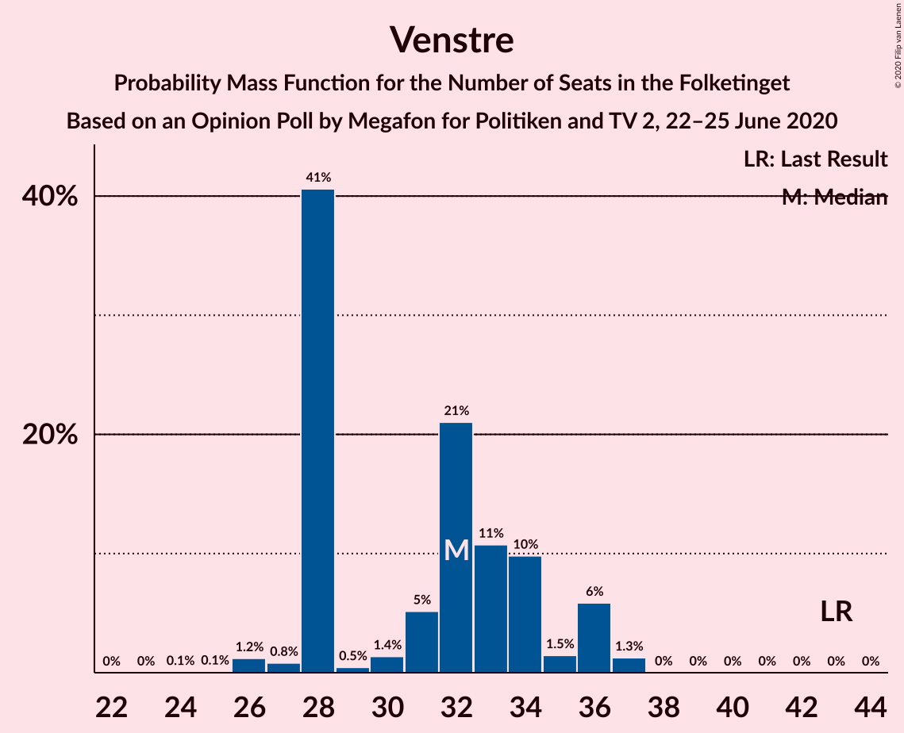

| Number of Seats | Probability | Accumulated | Special Marks |
|:---------------:|:-----------:|:-----------:|:-------------:|
| 24 | 0.1% | 100% |  |
| 25 | 0.1% | 99.9% |  |
| 26 | 1.2% | 99.8% |  |
| 27 | 0.8% | 98.6% |  |
| 28 | 41% | 98% |  |
| 29 | 0.5% | 57% |  |
| 30 | 1.4% | 57% |  |
| 31 | 5% | 55% |  |
| 32 | 21% | 50% | Median |
| 33 | 11% | 29% |  |
| 34 | 10% | 18% |  |
| 35 | 1.5% | 9% |  |
| 36 | 6% | 7% |  |
| 37 | 1.3% | 1.3% |  |
| 38 | 0% | 0% |  |
| 39 | 0% | 0% |  |
| 40 | 0% | 0% |  |
| 41 | 0% | 0% |  |
| 42 | 0% | 0% |  |
| 43 | 0% | 0% | Last Result |

### Det Konservative Folkeparti

*For a full overview of the results for this party, see the [Det Konservative Folkeparti](party-detkonservativefolkeparti.html) page.*

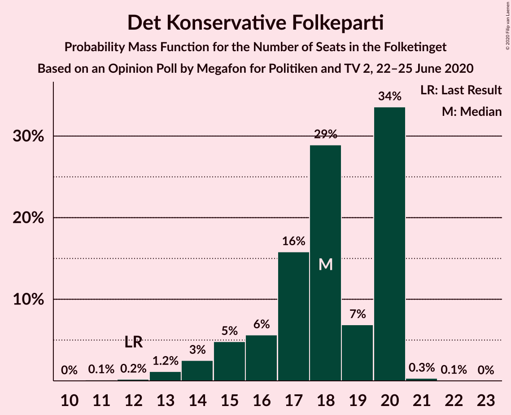

| Number of Seats | Probability | Accumulated | Special Marks |
|:---------------:|:-----------:|:-----------:|:-------------:|
| 11 | 0.1% | 100% |  |
| 12 | 0.2% | 99.9% | Last Result |
| 13 | 1.2% | 99.7% |  |
| 14 | 3% | 98.5% |  |
| 15 | 5% | 96% |  |
| 16 | 6% | 91% |  |
| 17 | 16% | 86% |  |
| 18 | 29% | 70% | Median |
| 19 | 7% | 41% |  |
| 20 | 34% | 34% |  |
| 21 | 0.3% | 0.4% |  |
| 22 | 0.1% | 0.1% |  |
| 23 | 0% | 0% |  |

### Radikale Venstre

*For a full overview of the results for this party, see the [Radikale Venstre](party-radikalevenstre.html) page.*

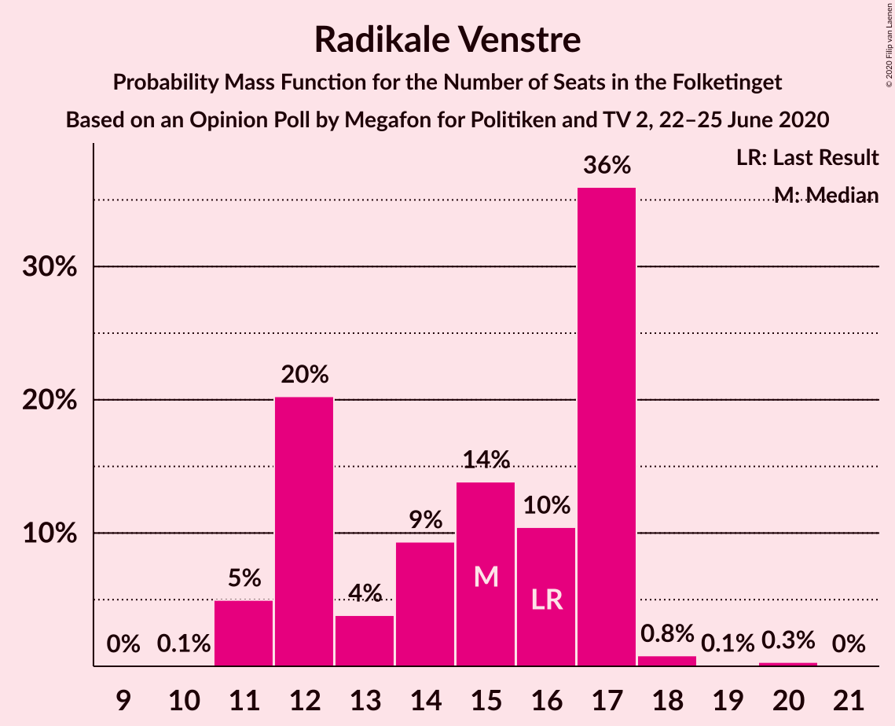

| Number of Seats | Probability | Accumulated | Special Marks |
|:---------------:|:-----------:|:-----------:|:-------------:|
| 10 | 0.1% | 100% |  |
| 11 | 5% | 99.9% |  |
| 12 | 20% | 95% |  |
| 13 | 4% | 75% |  |
| 14 | 9% | 71% |  |
| 15 | 14% | 61% | Median |
| 16 | 10% | 48% | Last Result |
| 17 | 36% | 37% |  |
| 18 | 0.8% | 1.2% |  |
| 19 | 0.1% | 0.4% |  |
| 20 | 0.3% | 0.3% |  |
| 21 | 0% | 0% |  |

### Socialistisk Folkeparti

*For a full overview of the results for this party, see the [Socialistisk Folkeparti](party-socialistiskfolkeparti.html) page.*

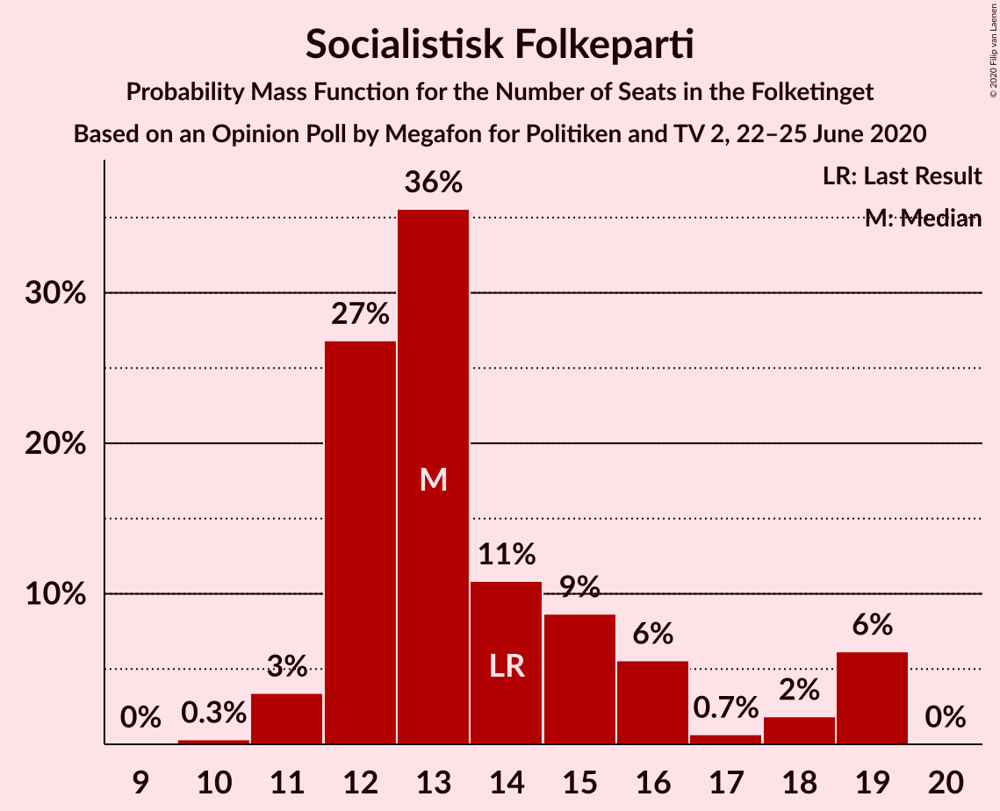

| Number of Seats | Probability | Accumulated | Special Marks |
|:---------------:|:-----------:|:-----------:|:-------------:|
| 10 | 0.3% | 100% |  |
| 11 | 3% | 99.7% |  |
| 12 | 27% | 96% |  |
| 13 | 36% | 69% | Median |
| 14 | 11% | 34% | Last Result |
| 15 | 9% | 23% |  |
| 16 | 6% | 14% |  |
| 17 | 0.7% | 9% |  |
| 18 | 2% | 8% |  |
| 19 | 6% | 6% |  |
| 20 | 0% | 0% |  |

### Enhedslisten–De Rød-Grønne

*For a full overview of the results for this party, see the [Enhedslisten–De Rød-Grønne](party-enhedslisten–derød-grønne.html) page.*

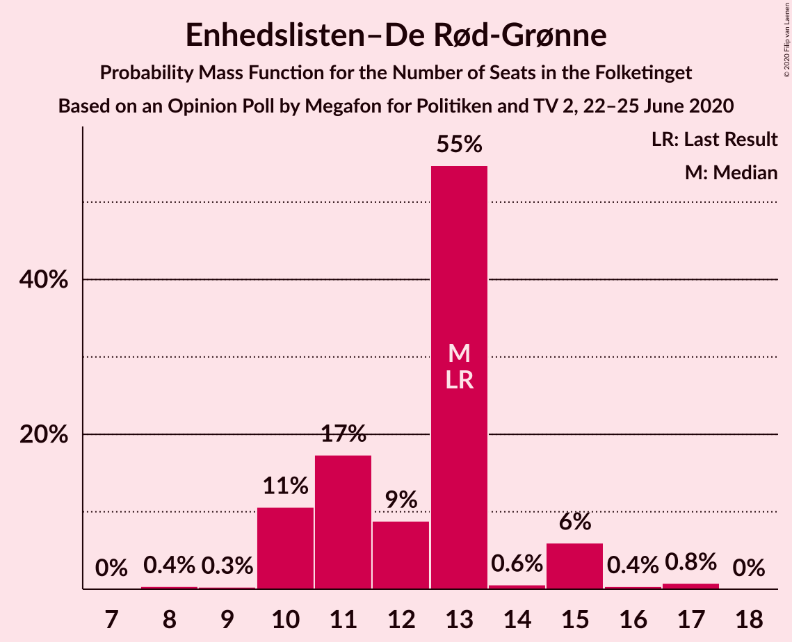

| Number of Seats | Probability | Accumulated | Special Marks |
|:---------------:|:-----------:|:-----------:|:-------------:|
| 8 | 0.4% | 100% |  |
| 9 | 0.3% | 99.6% |  |
| 10 | 11% | 99.3% |  |
| 11 | 17% | 89% |  |
| 12 | 9% | 71% |  |
| 13 | 55% | 63% | Last Result, Median |
| 14 | 0.6% | 8% |  |
| 15 | 6% | 7% |  |
| 16 | 0.4% | 1.2% |  |
| 17 | 0.8% | 0.8% |  |
| 18 | 0% | 0% |  |

### Nye Borgerlige

*For a full overview of the results for this party, see the [Nye Borgerlige](party-nyeborgerlige.html) page.*

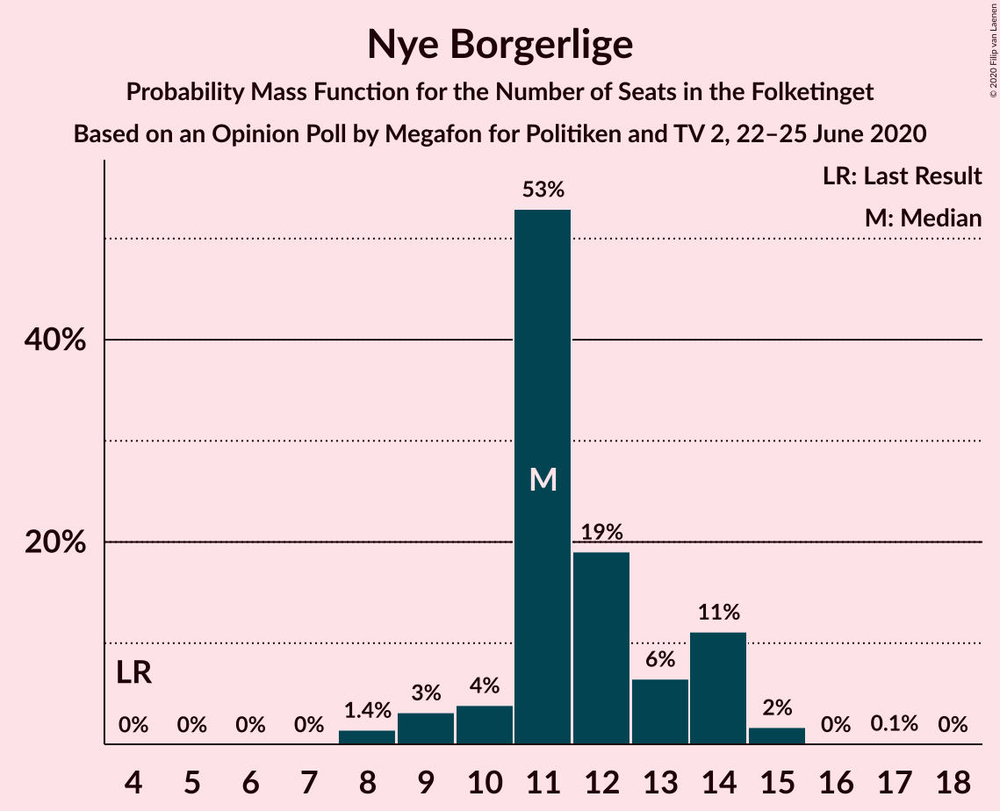

| Number of Seats | Probability | Accumulated | Special Marks |
|:---------------:|:-----------:|:-----------:|:-------------:|
| 4 | 0% | 100% | Last Result |
| 5 | 0% | 100% |  |
| 6 | 0% | 100% |  |
| 7 | 0% | 100% |  |
| 8 | 1.4% | 100% |  |
| 9 | 3% | 98.6% |  |
| 10 | 4% | 95% |  |
| 11 | 53% | 92% | Median |
| 12 | 19% | 39% |  |
| 13 | 6% | 20% |  |
| 14 | 11% | 13% |  |
| 15 | 2% | 2% |  |
| 16 | 0% | 0.2% |  |
| 17 | 0.1% | 0.2% |  |
| 18 | 0% | 0% |  |

### Dansk Folkeparti

*For a full overview of the results for this party, see the [Dansk Folkeparti](party-danskfolkeparti.html) page.*

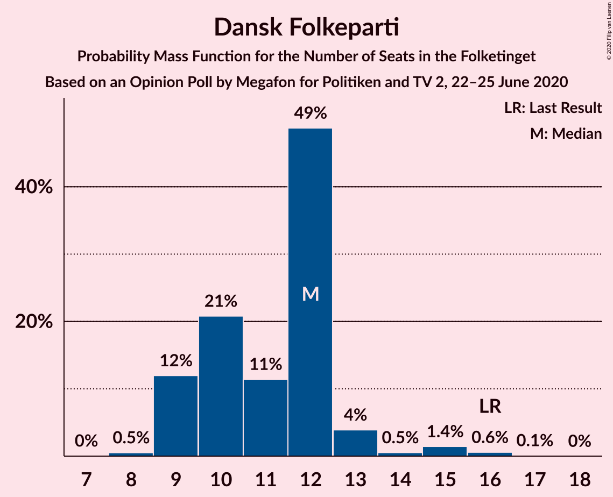

| Number of Seats | Probability | Accumulated | Special Marks |
|:---------------:|:-----------:|:-----------:|:-------------:|
| 8 | 0.5% | 100% |  |
| 9 | 12% | 99.4% |  |
| 10 | 21% | 87% |  |
| 11 | 11% | 67% |  |
| 12 | 49% | 55% | Median |
| 13 | 4% | 7% |  |
| 14 | 0.5% | 3% |  |
| 15 | 1.4% | 2% |  |
| 16 | 0.6% | 0.7% | Last Result |
| 17 | 0.1% | 0.1% |  |
| 18 | 0% | 0% |  |

### Liberal Alliance

*For a full overview of the results for this party, see the [Liberal Alliance](party-liberalalliance.html) page.*

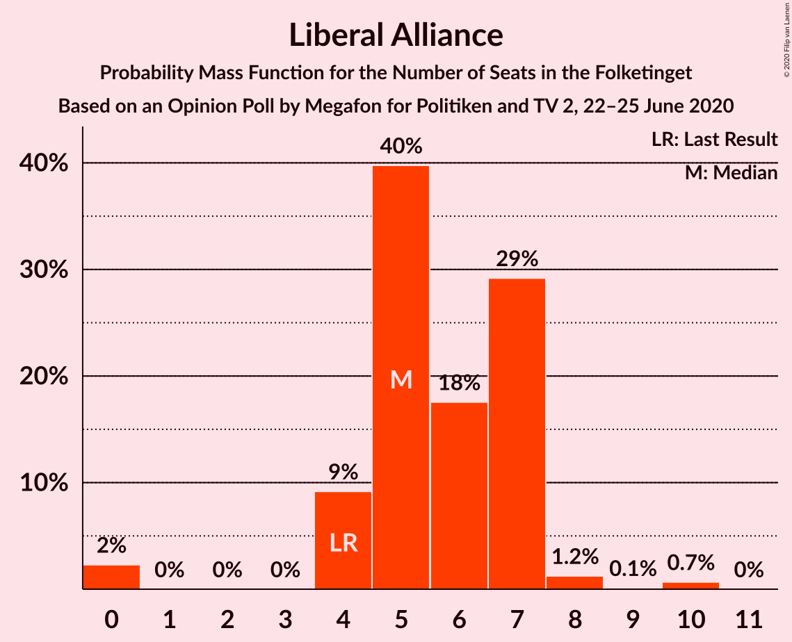

| Number of Seats | Probability | Accumulated | Special Marks |
|:---------------:|:-----------:|:-----------:|:-------------:|
| 0 | 2% | 100% |  |
| 1 | 0% | 98% |  |
| 2 | 0% | 98% |  |
| 3 | 0% | 98% |  |
| 4 | 9% | 98% | Last Result |
| 5 | 40% | 89% | Median |
| 6 | 18% | 49% |  |
| 7 | 29% | 31% |  |
| 8 | 1.2% | 2% |  |
| 9 | 0.1% | 0.8% |  |
| 10 | 0.7% | 0.7% |  |
| 11 | 0% | 0% |  |

### Stram Kurs

*For a full overview of the results for this party, see the [Stram Kurs](party-stramkurs.html) page.*

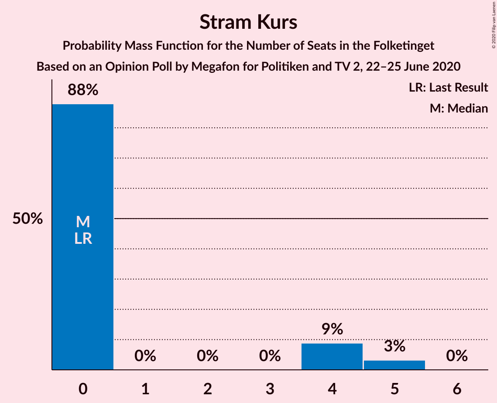

| Number of Seats | Probability | Accumulated | Special Marks |
|:---------------:|:-----------:|:-----------:|:-------------:|
| 0 | 88% | 100% | Last Result, Median |
| 1 | 0% | 12% |  |
| 2 | 0% | 12% |  |
| 3 | 0% | 12% |  |
| 4 | 9% | 12% |  |
| 5 | 3% | 3% |  |
| 6 | 0% | 0% |  |

### Kristendemokraterne

*For a full overview of the results for this party, see the [Kristendemokraterne](party-kristendemokraterne.html) page.*

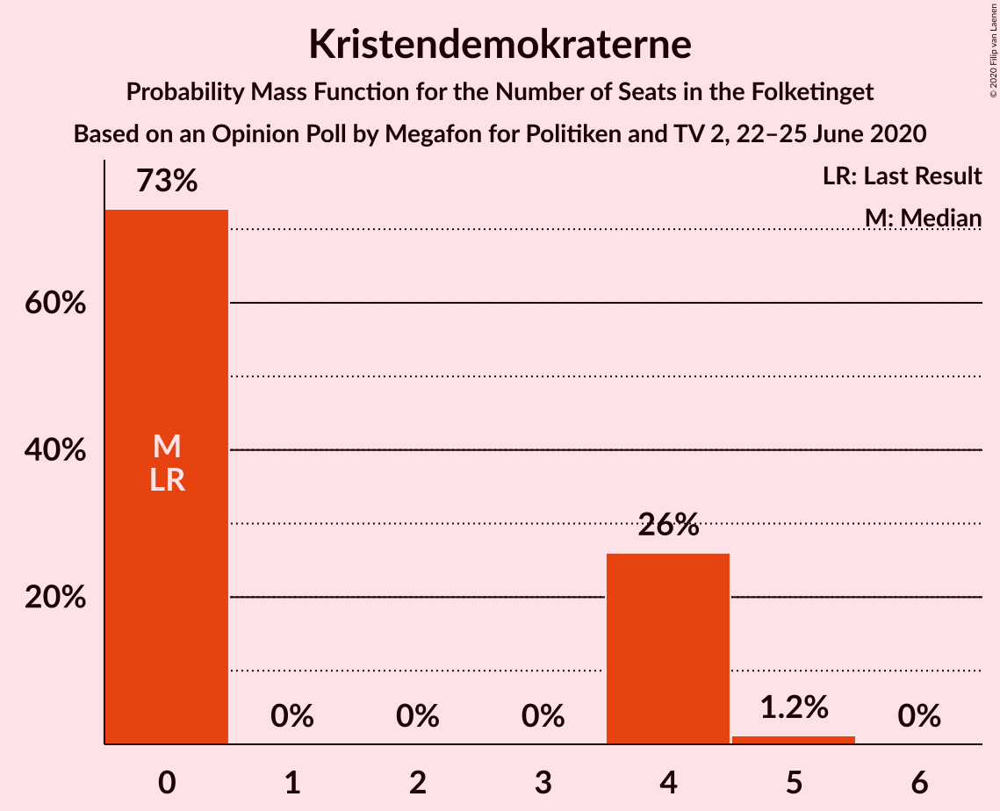

| Number of Seats | Probability | Accumulated | Special Marks |
|:---------------:|:-----------:|:-----------:|:-------------:|
| 0 | 73% | 100% | Last Result, Median |
| 1 | 0% | 27% |  |
| 2 | 0% | 27% |  |
| 3 | 0% | 27% |  |
| 4 | 26% | 27% |  |
| 5 | 1.2% | 1.2% |  |
| 6 | 0% | 0% |  |

### Alternativet

*For a full overview of the results for this party, see the [Alternativet](party-alternativet.html) page.*

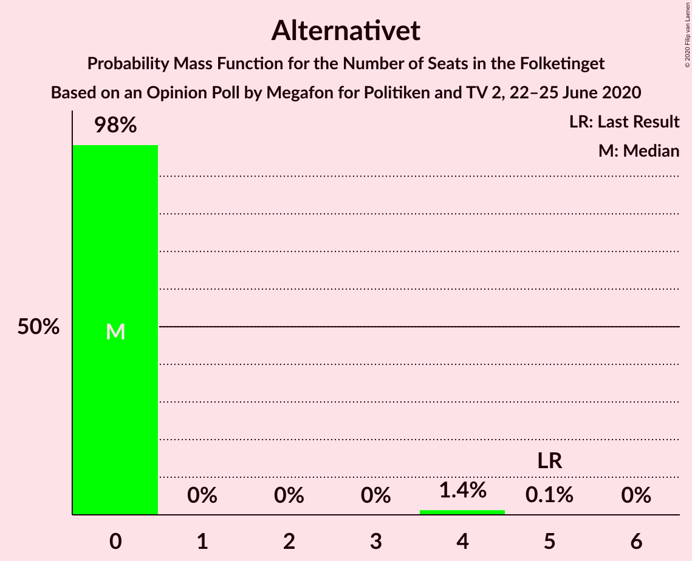

| Number of Seats | Probability | Accumulated | Special Marks |
|:---------------:|:-----------:|:-----------:|:-------------:|
| 0 | 98% | 100% | Median |
| 1 | 0% | 2% |  |
| 2 | 0% | 2% |  |
| 3 | 0% | 2% |  |
| 4 | 1.4% | 2% |  |
| 5 | 0.1% | 0.2% | Last Result |
| 6 | 0% | 0% |  |

### Klaus Riskær Pedersen

*For a full overview of the results for this party, see the [Klaus Riskær Pedersen](party-klausriskærpedersen.html) page.*

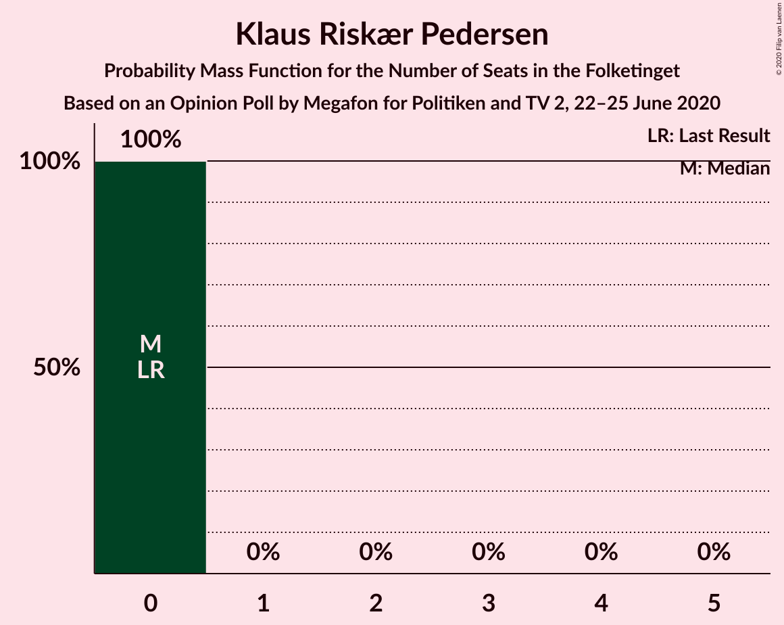

| Number of Seats | Probability | Accumulated | Special Marks |
|:---------------:|:-----------:|:-----------:|:-------------:|
| 0 | 100% | 100% | Last Result, Median |

## Coalitions

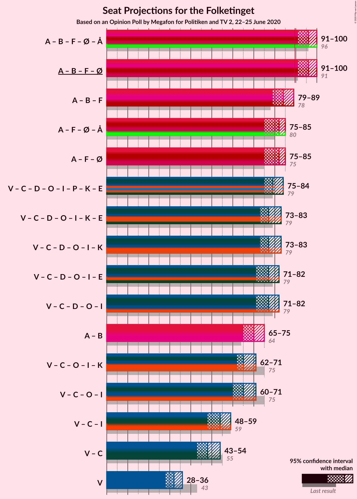

### Confidence Intervals

| Coalition | Last Result | Median | Majority? | 80% Confidence Interval | 90% Confidence Interval | 95% Confidence Interval | 99% Confidence Interval |
|:---------:|:-----------:|:------:|:---------:|:-----------------------:|:-----------------------:|:-----------------------:|:-----------------------:|
| Socialdemokraterne – Radikale Venstre – Socialistisk Folkeparti – Enhedslisten–De Rød-Grønne – Alternativet | 96 | 96 | 99.7% | 92–99 | 91–99 | 91–100 | 90–102 |
| Socialdemokraterne – Radikale Venstre – Socialistisk Folkeparti – Enhedslisten–De Rød-Grønne | 91 | 96 | 98.7% | 92–99 | 91–99 | 91–100 | 89–102 |
| Socialdemokraterne – Radikale Venstre – Socialistisk Folkeparti | 78 | 84 | 2% | 79–86 | 79–88 | 79–89 | 77–90 |
| Socialdemokraterne – Socialistisk Folkeparti – Enhedslisten–De Rød-Grønne – Alternativet | 80 | 82 | 0.2% | 79–83 | 76–83 | 75–85 | 75–88 |
| Socialdemokraterne – Socialistisk Folkeparti – Enhedslisten–De Rød-Grønne | 75 | 82 | 0.1% | 79–83 | 75–83 | 75–85 | 75–88 |
| Venstre – Det Konservative Folkeparti – Nye Borgerlige – Dansk Folkeparti – Liberal Alliance – Stram Kurs – Kristendemokraterne – Klaus Riskær Pedersen | 79 | 79 | 0% | 76–83 | 76–84 | 75–84 | 73–85 |
| Venstre – Det Konservative Folkeparti – Nye Borgerlige – Dansk Folkeparti – Liberal Alliance – Kristendemokraterne – Klaus Riskær Pedersen | 79 | 77 | 0% | 76–83 | 75–83 | 73–83 | 71–83 |
| Venstre – Det Konservative Folkeparti – Nye Borgerlige – Dansk Folkeparti – Liberal Alliance – Kristendemokraterne | 79 | 77 | 0% | 76–83 | 75–83 | 73–83 | 71–83 |
| Venstre – Det Konservative Folkeparti – Nye Borgerlige – Dansk Folkeparti – Liberal Alliance – Klaus Riskær Pedersen | 79 | 77 | 0% | 76–80 | 74–82 | 71–82 | 67–83 |
| Venstre – Det Konservative Folkeparti – Nye Borgerlige – Dansk Folkeparti – Liberal Alliance | 79 | 77 | 0% | 76–80 | 74–82 | 71–82 | 67–83 |
| Socialdemokraterne – Radikale Venstre | 64 | 70 | 0% | 67–73 | 66–73 | 65–75 | 62–78 |
| Venstre – Det Konservative Folkeparti – Dansk Folkeparti – Liberal Alliance – Kristendemokraterne | 75 | 65 | 0% | 65–71 | 63–71 | 62–71 | 59–72 |
| Venstre – Det Konservative Folkeparti – Dansk Folkeparti – Liberal Alliance | 75 | 65 | 0% | 65–68 | 62–71 | 60–71 | 57–71 |
| Venstre – Det Konservative Folkeparti – Liberal Alliance | 59 | 54 | 0% | 53–57 | 51–59 | 48–59 | 46–59 |
| Venstre – Det Konservative Folkeparti | 55 | 48 | 0% | 46–52 | 46–53 | 43–54 | 41–54 |
| Venstre | 43 | 32 | 0% | 28–34 | 28–36 | 28–36 | 26–37 |

### Socialdemokraterne – Radikale Venstre – Socialistisk Folkeparti – Enhedslisten–De Rød-Grønne – Alternativet

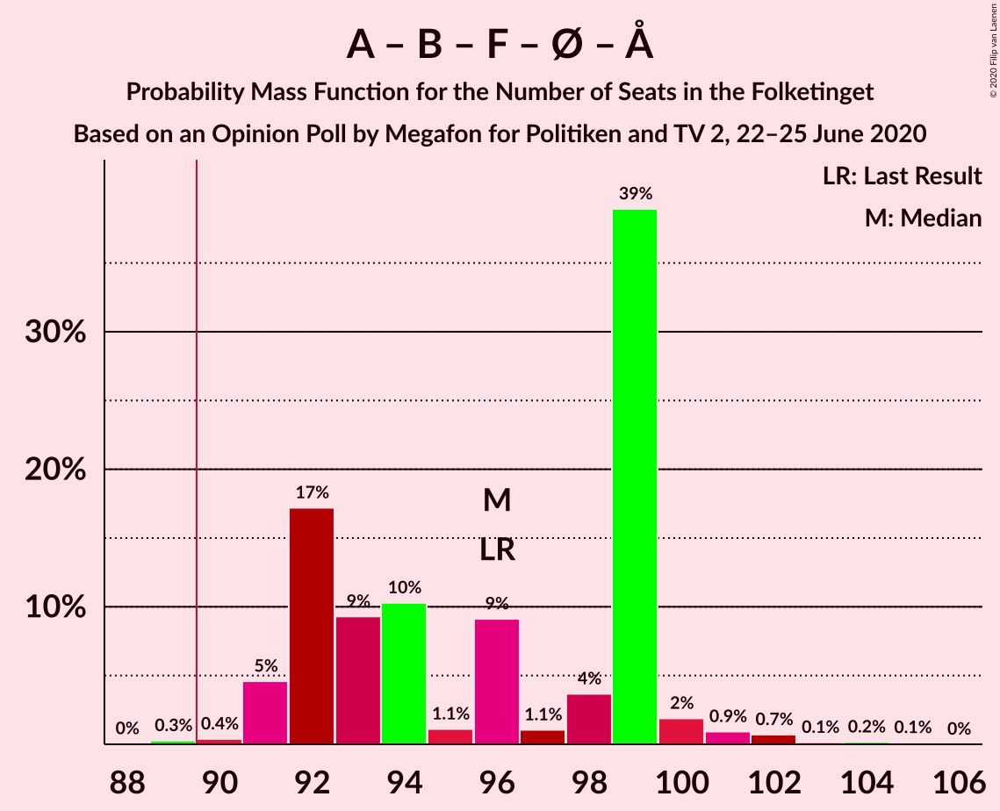

| Number of Seats | Probability | Accumulated | Special Marks |
|:---------------:|:-----------:|:-----------:|:-------------:|
| 88 | 0% | 100% |  |
| 89 | 0.3% | 99.9% |  |
| 90 | 0.4% | 99.7% | Majority |
| 91 | 5% | 99.3% |  |
| 92 | 17% | 95% |  |
| 93 | 9% | 77% |  |
| 94 | 10% | 68% |  |
| 95 | 1.1% | 58% |  |
| 96 | 9% | 57% | Last Result |
| 97 | 1.1% | 48% | Median |
| 98 | 4% | 47% |  |
| 99 | 39% | 43% |  |
| 100 | 2% | 4% |  |
| 101 | 0.9% | 2% |  |
| 102 | 0.7% | 1.2% |  |
| 103 | 0.1% | 0.5% |  |
| 104 | 0.2% | 0.3% |  |
| 105 | 0.1% | 0.2% |  |
| 106 | 0% | 0% |  |

### Socialdemokraterne – Radikale Venstre – Socialistisk Folkeparti – Enhedslisten–De Rød-Grønne

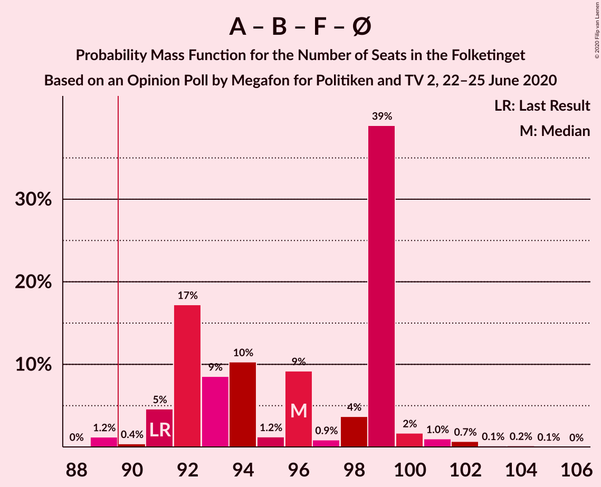

| Number of Seats | Probability | Accumulated | Special Marks |
|:---------------:|:-----------:|:-----------:|:-------------:|
| 88 | 0% | 100% |  |
| 89 | 1.2% | 99.9% |  |
| 90 | 0.4% | 98.7% | Majority |
| 91 | 5% | 98% | Last Result |
| 92 | 17% | 94% |  |
| 93 | 9% | 76% |  |
| 94 | 10% | 68% |  |
| 95 | 1.2% | 58% |  |
| 96 | 9% | 56% |  |
| 97 | 0.9% | 47% | Median |
| 98 | 4% | 46% |  |
| 99 | 39% | 43% |  |
| 100 | 2% | 4% |  |
| 101 | 1.0% | 2% |  |
| 102 | 0.7% | 1.1% |  |
| 103 | 0.1% | 0.4% |  |
| 104 | 0.2% | 0.2% |  |
| 105 | 0.1% | 0.1% |  |
| 106 | 0% | 0% |  |

### Socialdemokraterne – Radikale Venstre – Socialistisk Folkeparti

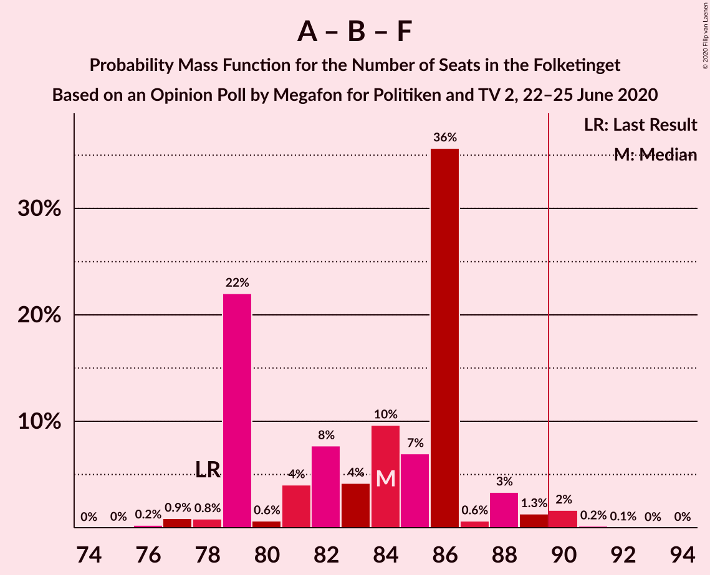

| Number of Seats | Probability | Accumulated | Special Marks |
|:---------------:|:-----------:|:-----------:|:-------------:|
| 76 | 0.2% | 100% |  |
| 77 | 0.9% | 99.7% |  |
| 78 | 0.8% | 98.8% | Last Result |
| 79 | 22% | 98% |  |
| 80 | 0.6% | 76% |  |
| 81 | 4% | 75% |  |
| 82 | 8% | 71% |  |
| 83 | 4% | 64% |  |
| 84 | 10% | 59% | Median |
| 85 | 7% | 50% |  |
| 86 | 36% | 43% |  |
| 87 | 0.6% | 7% |  |
| 88 | 3% | 7% |  |
| 89 | 1.3% | 3% |  |
| 90 | 2% | 2% | Majority |
| 91 | 0.2% | 0.3% |  |
| 92 | 0.1% | 0.1% |  |
| 93 | 0% | 0% |  |

### Socialdemokraterne – Socialistisk Folkeparti – Enhedslisten–De Rød-Grønne – Alternativet

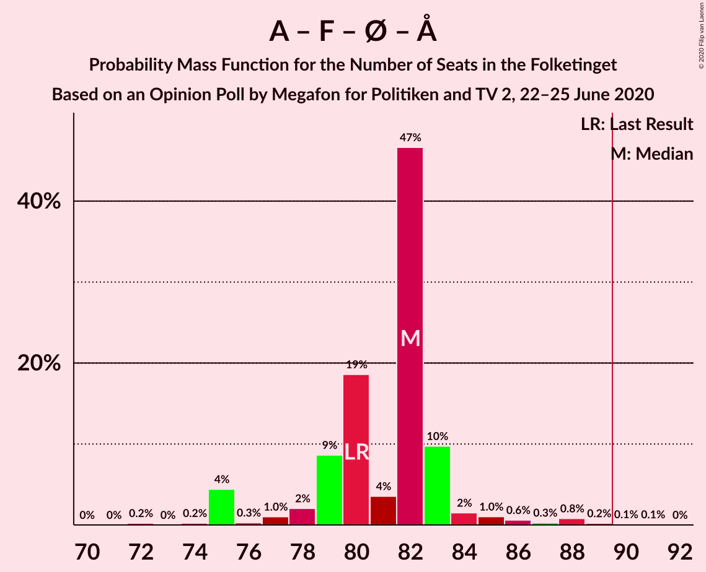

| Number of Seats | Probability | Accumulated | Special Marks |
|:---------------:|:-----------:|:-----------:|:-------------:|
| 72 | 0.2% | 100% |  |
| 73 | 0% | 99.8% |  |
| 74 | 0.2% | 99.8% |  |
| 75 | 4% | 99.5% |  |
| 76 | 0.3% | 95% |  |
| 77 | 1.0% | 95% |  |
| 78 | 2% | 94% |  |
| 79 | 9% | 92% |  |
| 80 | 19% | 83% | Last Result |
| 81 | 4% | 65% |  |
| 82 | 47% | 61% | Median |
| 83 | 10% | 14% |  |
| 84 | 2% | 5% |  |
| 85 | 1.0% | 3% |  |
| 86 | 0.6% | 2% |  |
| 87 | 0.3% | 1.5% |  |
| 88 | 0.8% | 1.2% |  |
| 89 | 0.2% | 0.4% |  |
| 90 | 0.1% | 0.2% | Majority |
| 91 | 0.1% | 0.1% |  |
| 92 | 0% | 0% |  |

### Socialdemokraterne – Socialistisk Folkeparti – Enhedslisten–De Rød-Grønne

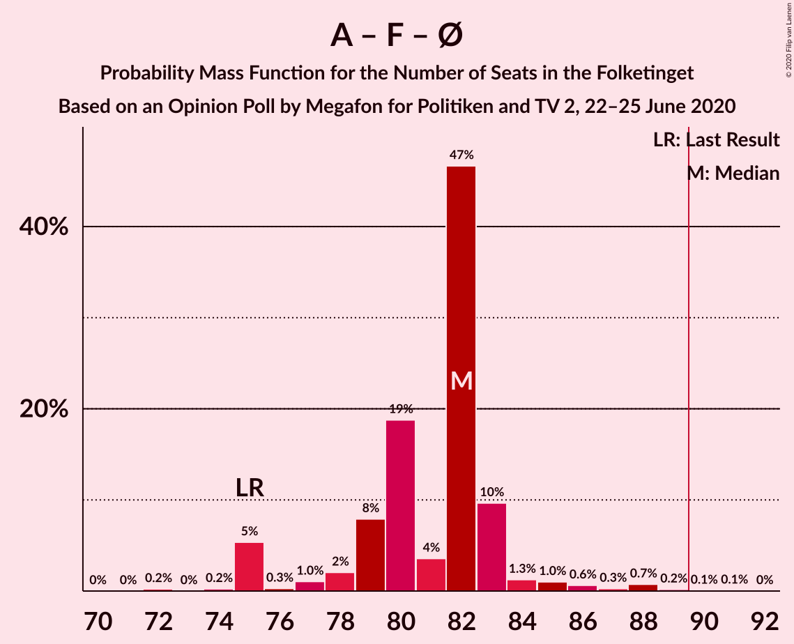

| Number of Seats | Probability | Accumulated | Special Marks |
|:---------------:|:-----------:|:-----------:|:-------------:|
| 72 | 0.2% | 100% |  |
| 73 | 0% | 99.8% |  |
| 74 | 0.2% | 99.8% |  |
| 75 | 5% | 99.5% | Last Result |
| 76 | 0.3% | 94% |  |
| 77 | 1.0% | 94% |  |
| 78 | 2% | 93% |  |
| 79 | 8% | 91% |  |
| 80 | 19% | 83% |  |
| 81 | 4% | 64% |  |
| 82 | 47% | 61% | Median |
| 83 | 10% | 14% |  |
| 84 | 1.3% | 4% |  |
| 85 | 1.0% | 3% |  |
| 86 | 0.6% | 2% |  |
| 87 | 0.3% | 1.3% |  |
| 88 | 0.7% | 1.1% |  |
| 89 | 0.2% | 0.3% |  |
| 90 | 0.1% | 0.1% | Majority |
| 91 | 0.1% | 0.1% |  |
| 92 | 0% | 0% |  |

### Venstre – Det Konservative Folkeparti – Nye Borgerlige – Dansk Folkeparti – Liberal Alliance – Stram Kurs – Kristendemokraterne – Klaus Riskær Pedersen

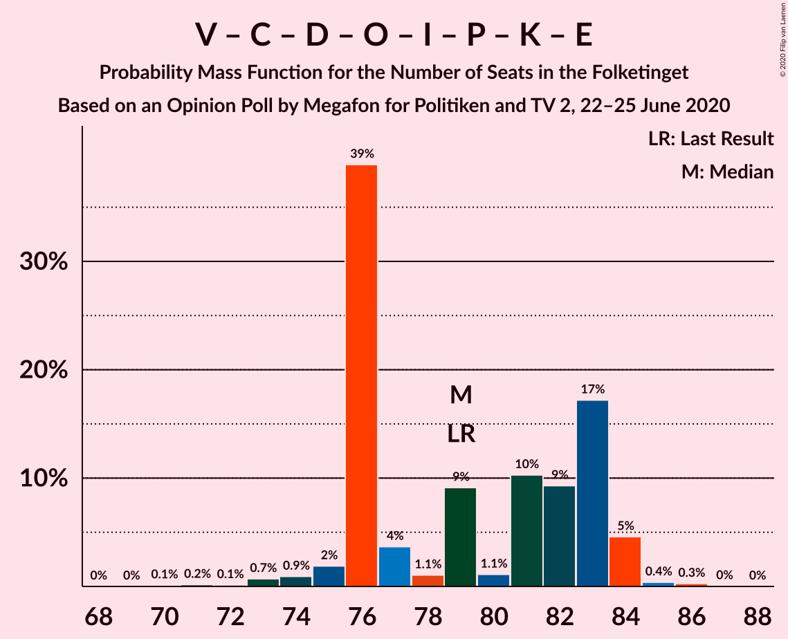

| Number of Seats | Probability | Accumulated | Special Marks |
|:---------------:|:-----------:|:-----------:|:-------------:|
| 70 | 0.1% | 100% |  |
| 71 | 0.2% | 99.8% |  |
| 72 | 0.1% | 99.7% |  |
| 73 | 0.7% | 99.5% |  |
| 74 | 0.9% | 98.8% |  |
| 75 | 2% | 98% |  |
| 76 | 39% | 96% |  |
| 77 | 4% | 57% |  |
| 78 | 1.1% | 53% | Median |
| 79 | 9% | 52% | Last Result |
| 80 | 1.1% | 43% |  |
| 81 | 10% | 42% |  |
| 82 | 9% | 32% |  |
| 83 | 17% | 23% |  |
| 84 | 5% | 5% |  |
| 85 | 0.4% | 0.7% |  |
| 86 | 0.3% | 0.3% |  |
| 87 | 0% | 0.1% |  |
| 88 | 0% | 0% |  |

### Venstre – Det Konservative Folkeparti – Nye Borgerlige – Dansk Folkeparti – Liberal Alliance – Kristendemokraterne – Klaus Riskær Pedersen

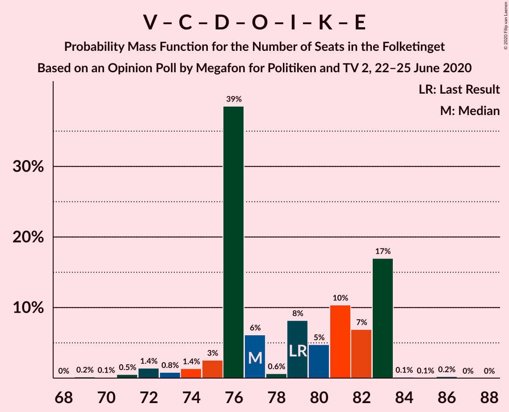

| Number of Seats | Probability | Accumulated | Special Marks |
|:---------------:|:-----------:|:-----------:|:-------------:|
| 69 | 0.2% | 100% |  |
| 70 | 0.1% | 99.8% |  |
| 71 | 0.5% | 99.7% |  |
| 72 | 1.4% | 99.1% |  |
| 73 | 0.8% | 98% |  |
| 74 | 1.4% | 97% |  |
| 75 | 3% | 96% |  |
| 76 | 39% | 93% |  |
| 77 | 6% | 54% |  |
| 78 | 0.6% | 48% | Median |
| 79 | 8% | 48% | Last Result |
| 80 | 5% | 39% |  |
| 81 | 10% | 35% |  |
| 82 | 7% | 24% |  |
| 83 | 17% | 17% |  |
| 84 | 0.1% | 0.5% |  |
| 85 | 0.1% | 0.3% |  |
| 86 | 0.2% | 0.3% |  |
| 87 | 0% | 0% |  |

### Venstre – Det Konservative Folkeparti – Nye Borgerlige – Dansk Folkeparti – Liberal Alliance – Kristendemokraterne

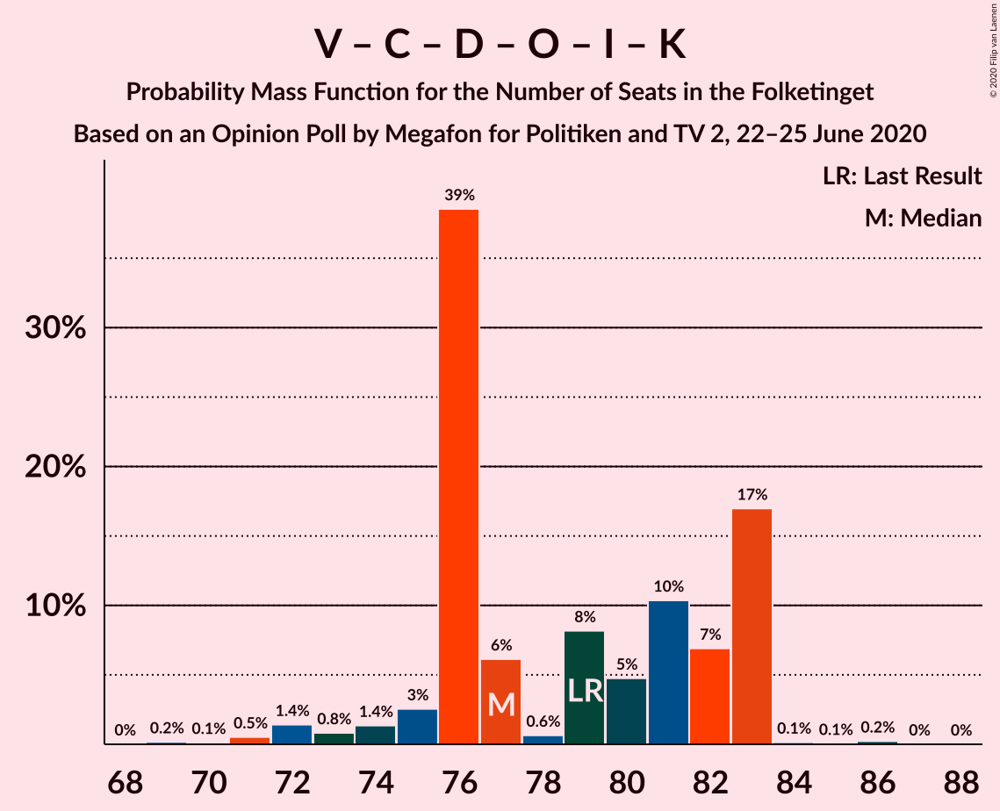

| Number of Seats | Probability | Accumulated | Special Marks |
|:---------------:|:-----------:|:-----------:|:-------------:|
| 69 | 0.2% | 100% |  |
| 70 | 0.1% | 99.8% |  |
| 71 | 0.5% | 99.7% |  |
| 72 | 1.4% | 99.1% |  |
| 73 | 0.8% | 98% |  |
| 74 | 1.4% | 97% |  |
| 75 | 3% | 96% |  |
| 76 | 39% | 93% |  |
| 77 | 6% | 54% |  |
| 78 | 0.6% | 48% | Median |
| 79 | 8% | 48% | Last Result |
| 80 | 5% | 39% |  |
| 81 | 10% | 35% |  |
| 82 | 7% | 24% |  |
| 83 | 17% | 17% |  |
| 84 | 0.1% | 0.5% |  |
| 85 | 0.1% | 0.3% |  |
| 86 | 0.2% | 0.3% |  |
| 87 | 0% | 0% |  |

### Venstre – Det Konservative Folkeparti – Nye Borgerlige – Dansk Folkeparti – Liberal Alliance – Klaus Riskær Pedersen

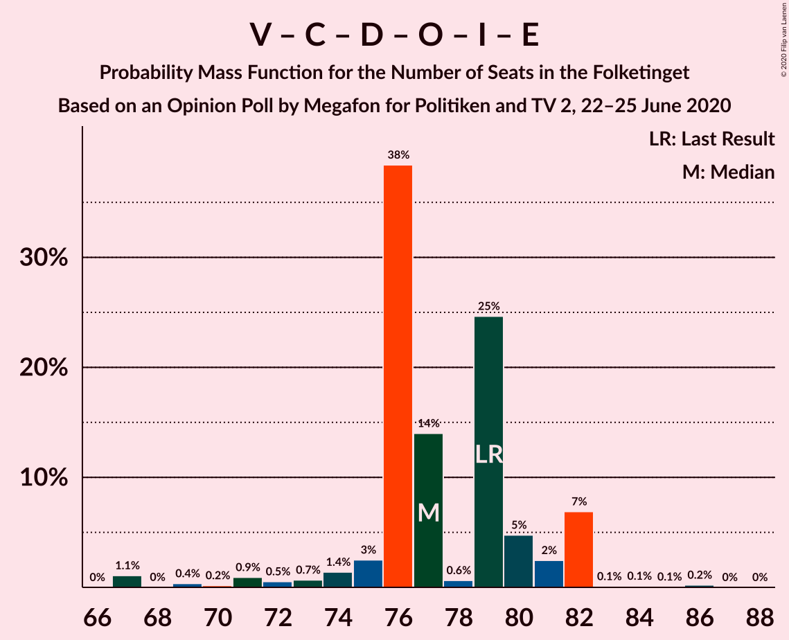

| Number of Seats | Probability | Accumulated | Special Marks |
|:---------------:|:-----------:|:-----------:|:-------------:|
| 67 | 1.1% | 100% |  |
| 68 | 0% | 98.9% |  |
| 69 | 0.4% | 98.9% |  |
| 70 | 0.2% | 98.5% |  |
| 71 | 0.9% | 98% |  |
| 72 | 0.5% | 97% |  |
| 73 | 0.7% | 97% |  |
| 74 | 1.4% | 96% |  |
| 75 | 3% | 95% |  |
| 76 | 38% | 92% |  |
| 77 | 14% | 54% |  |
| 78 | 0.6% | 40% | Median |
| 79 | 25% | 39% | Last Result |
| 80 | 5% | 15% |  |
| 81 | 2% | 10% |  |
| 82 | 7% | 7% |  |
| 83 | 0.1% | 0.5% |  |
| 84 | 0.1% | 0.4% |  |
| 85 | 0.1% | 0.3% |  |
| 86 | 0.2% | 0.2% |  |
| 87 | 0% | 0% |  |

### Venstre – Det Konservative Folkeparti – Nye Borgerlige – Dansk Folkeparti – Liberal Alliance

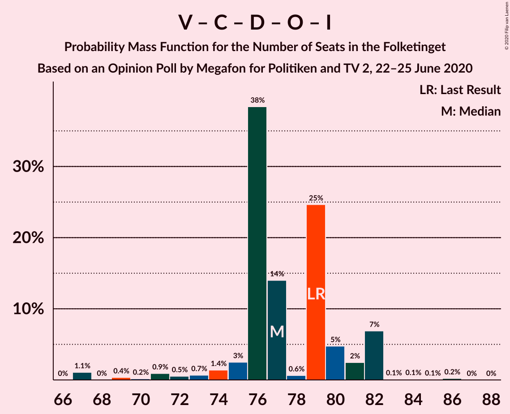

| Number of Seats | Probability | Accumulated | Special Marks |
|:---------------:|:-----------:|:-----------:|:-------------:|
| 67 | 1.1% | 100% |  |
| 68 | 0% | 98.9% |  |
| 69 | 0.4% | 98.9% |  |
| 70 | 0.2% | 98.5% |  |
| 71 | 0.9% | 98% |  |
| 72 | 0.5% | 97% |  |
| 73 | 0.7% | 97% |  |
| 74 | 1.4% | 96% |  |
| 75 | 3% | 95% |  |
| 76 | 38% | 92% |  |
| 77 | 14% | 54% |  |
| 78 | 0.6% | 40% | Median |
| 79 | 25% | 39% | Last Result |
| 80 | 5% | 15% |  |
| 81 | 2% | 10% |  |
| 82 | 7% | 7% |  |
| 83 | 0.1% | 0.5% |  |
| 84 | 0.1% | 0.4% |  |
| 85 | 0.1% | 0.3% |  |
| 86 | 0.2% | 0.2% |  |
| 87 | 0% | 0% |  |

### Socialdemokraterne – Radikale Venstre

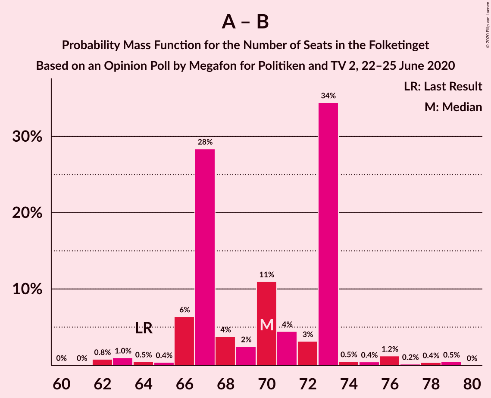

| Number of Seats | Probability | Accumulated | Special Marks |
|:---------------:|:-----------:|:-----------:|:-------------:|
| 61 | 0% | 100% |  |
| 62 | 0.8% | 99.9% |  |
| 63 | 1.0% | 99.1% |  |
| 64 | 0.5% | 98% | Last Result |
| 65 | 0.4% | 98% |  |
| 66 | 6% | 97% |  |
| 67 | 28% | 91% |  |
| 68 | 4% | 63% |  |
| 69 | 2% | 59% |  |
| 70 | 11% | 56% |  |
| 71 | 4% | 45% | Median |
| 72 | 3% | 41% |  |
| 73 | 34% | 38% |  |
| 74 | 0.5% | 3% |  |
| 75 | 0.4% | 3% |  |
| 76 | 1.2% | 2% |  |
| 77 | 0.2% | 1.0% |  |
| 78 | 0.4% | 0.9% |  |
| 79 | 0.5% | 0.5% |  |
| 80 | 0% | 0% |  |

### Venstre – Det Konservative Folkeparti – Dansk Folkeparti – Liberal Alliance – Kristendemokraterne

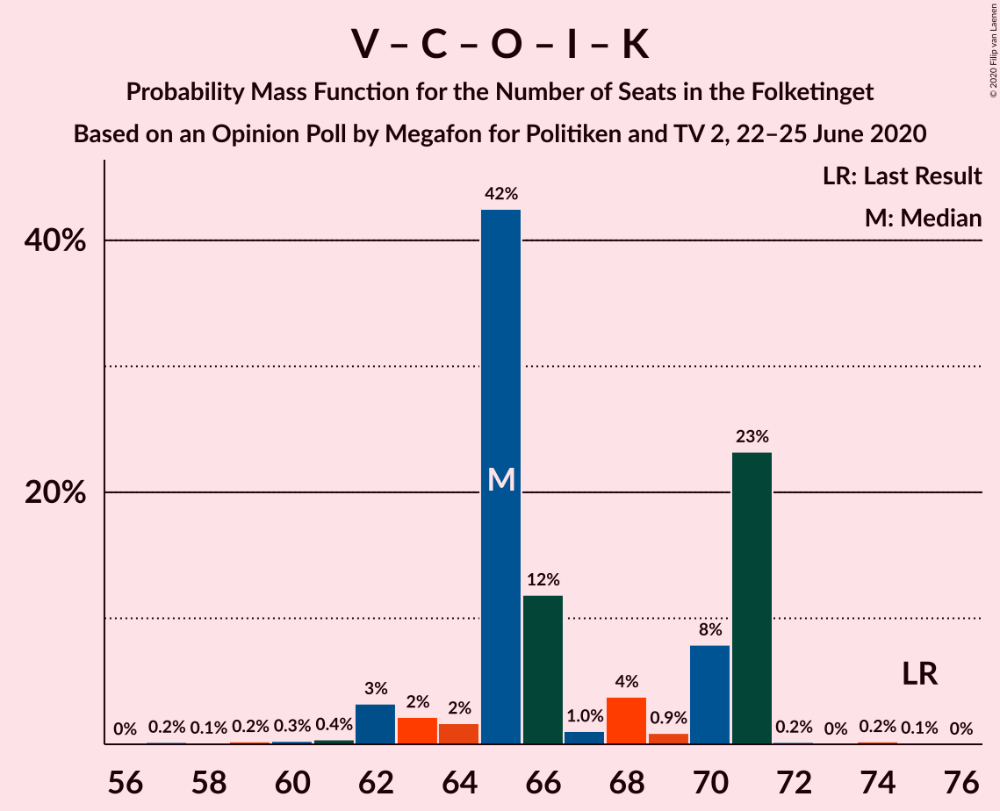

| Number of Seats | Probability | Accumulated | Special Marks |
|:---------------:|:-----------:|:-----------:|:-------------:|
| 57 | 0.2% | 100% |  |
| 58 | 0.1% | 99.8% |  |
| 59 | 0.2% | 99.7% |  |
| 60 | 0.3% | 99.5% |  |
| 61 | 0.4% | 99.2% |  |
| 62 | 3% | 98.8% |  |
| 63 | 2% | 96% |  |
| 64 | 2% | 93% |  |
| 65 | 42% | 92% |  |
| 66 | 12% | 49% |  |
| 67 | 1.0% | 37% | Median |
| 68 | 4% | 36% |  |
| 69 | 0.9% | 33% |  |
| 70 | 8% | 32% |  |
| 71 | 23% | 24% |  |
| 72 | 0.2% | 0.6% |  |
| 73 | 0% | 0.4% |  |
| 74 | 0.2% | 0.4% |  |
| 75 | 0.1% | 0.1% | Last Result |
| 76 | 0% | 0% |  |

### Venstre – Det Konservative Folkeparti – Dansk Folkeparti – Liberal Alliance

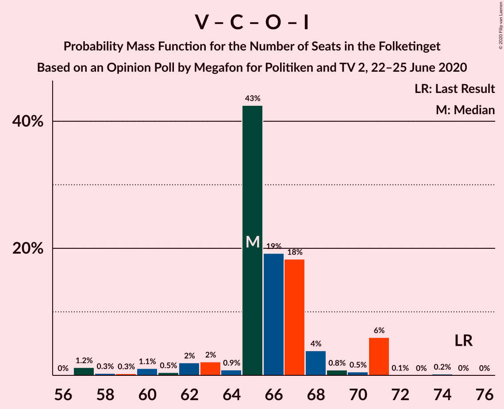

| Number of Seats | Probability | Accumulated | Special Marks |
|:---------------:|:-----------:|:-----------:|:-------------:|
| 57 | 1.2% | 100% |  |
| 58 | 0.3% | 98.7% |  |
| 59 | 0.3% | 98% |  |
| 60 | 1.1% | 98% |  |
| 61 | 0.5% | 97% |  |
| 62 | 2% | 97% |  |
| 63 | 2% | 95% |  |
| 64 | 0.9% | 92% |  |
| 65 | 43% | 92% |  |
| 66 | 19% | 49% |  |
| 67 | 18% | 30% | Median |
| 68 | 4% | 12% |  |
| 69 | 0.8% | 8% |  |
| 70 | 0.5% | 7% |  |
| 71 | 6% | 6% |  |
| 72 | 0.1% | 0.4% |  |
| 73 | 0% | 0.3% |  |
| 74 | 0.2% | 0.3% |  |
| 75 | 0% | 0.1% | Last Result |
| 76 | 0% | 0% |  |

### Venstre – Det Konservative Folkeparti – Liberal Alliance

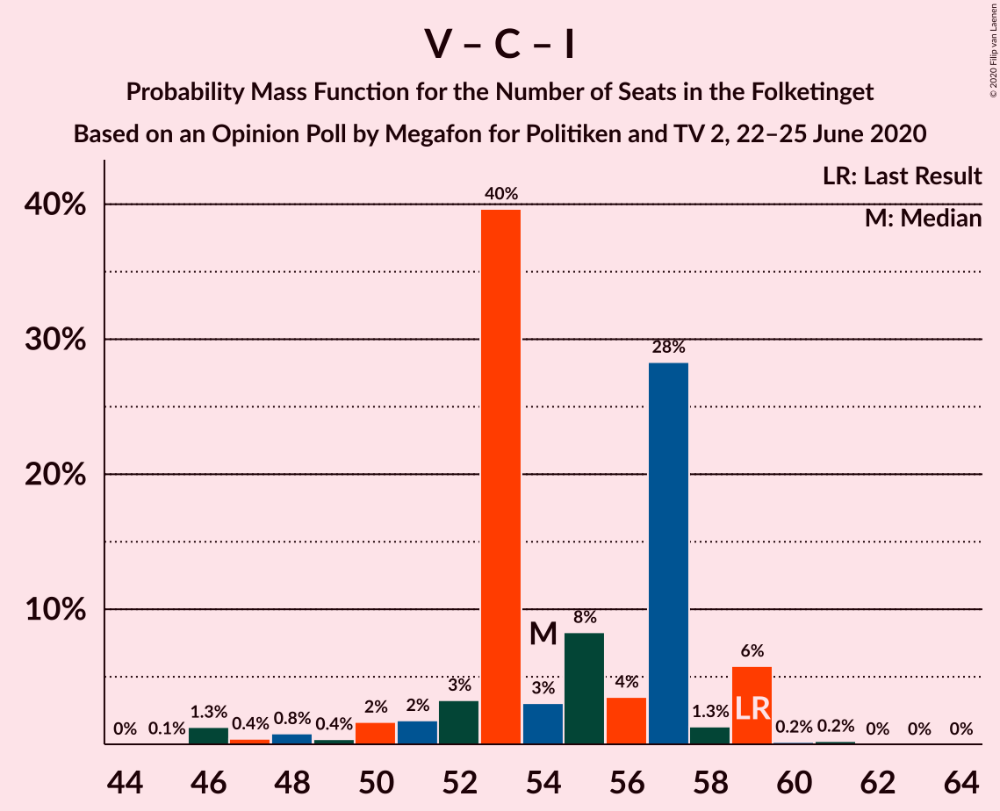

| Number of Seats | Probability | Accumulated | Special Marks |
|:---------------:|:-----------:|:-----------:|:-------------:|
| 45 | 0.1% | 100% |  |
| 46 | 1.3% | 99.9% |  |
| 47 | 0.4% | 98.7% |  |
| 48 | 0.8% | 98% |  |
| 49 | 0.4% | 97% |  |
| 50 | 2% | 97% |  |
| 51 | 2% | 95% |  |
| 52 | 3% | 94% |  |
| 53 | 40% | 90% |  |
| 54 | 3% | 51% |  |
| 55 | 8% | 48% | Median |
| 56 | 4% | 39% |  |
| 57 | 28% | 36% |  |
| 58 | 1.3% | 8% |  |
| 59 | 6% | 6% | Last Result |
| 60 | 0.2% | 0.5% |  |
| 61 | 0.2% | 0.3% |  |
| 62 | 0% | 0.1% |  |
| 63 | 0% | 0% |  |

### Venstre – Det Konservative Folkeparti

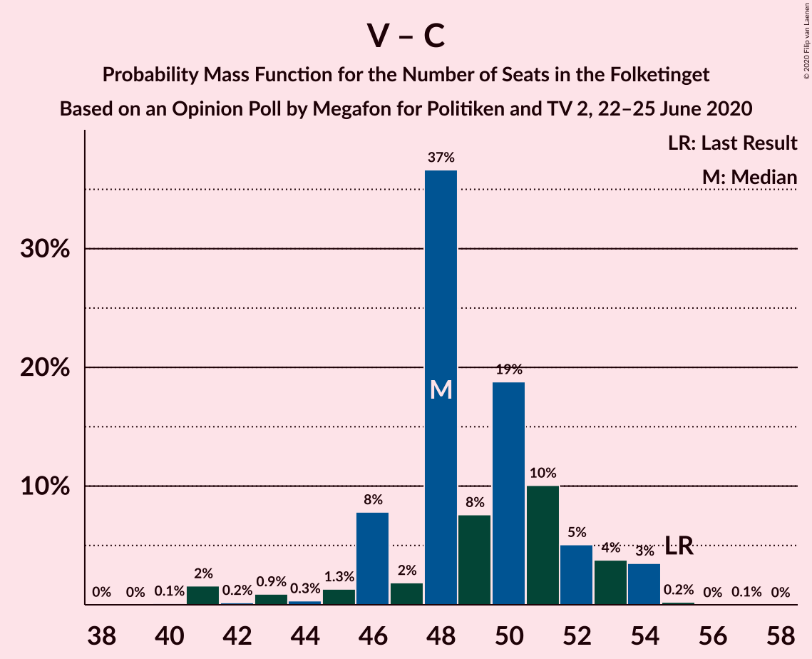

| Number of Seats | Probability | Accumulated | Special Marks |
|:---------------:|:-----------:|:-----------:|:-------------:|
| 39 | 0% | 100% |  |
| 40 | 0.1% | 99.9% |  |
| 41 | 2% | 99.8% |  |
| 42 | 0.2% | 98% |  |
| 43 | 0.9% | 98% |  |
| 44 | 0.3% | 97% |  |
| 45 | 1.3% | 97% |  |
| 46 | 8% | 95% |  |
| 47 | 2% | 88% |  |
| 48 | 37% | 86% |  |
| 49 | 8% | 49% |  |
| 50 | 19% | 42% | Median |
| 51 | 10% | 23% |  |
| 52 | 5% | 13% |  |
| 53 | 4% | 8% |  |
| 54 | 3% | 4% |  |
| 55 | 0.2% | 0.3% | Last Result |
| 56 | 0% | 0.1% |  |
| 57 | 0.1% | 0.1% |  |
| 58 | 0% | 0% |  |

### Venstre

| Number of Seats | Probability | Accumulated | Special Marks |
|:---------------:|:-----------:|:-----------:|:-------------:|
| 24 | 0.1% | 100% |  |
| 25 | 0.1% | 99.9% |  |
| 26 | 1.2% | 99.8% |  |
| 27 | 0.8% | 98.6% |  |
| 28 | 41% | 98% |  |
| 29 | 0.5% | 57% |  |
| 30 | 1.4% | 57% |  |
| 31 | 5% | 55% |  |
| 32 | 21% | 50% | Median |
| 33 | 11% | 29% |  |
| 34 | 10% | 18% |  |
| 35 | 1.5% | 9% |  |
| 36 | 6% | 7% |  |
| 37 | 1.3% | 1.3% |  |
| 38 | 0% | 0% |  |
| 39 | 0% | 0% |  |
| 40 | 0% | 0% |  |
| 41 | 0% | 0% |  |
| 42 | 0% | 0% |  |
| 43 | 0% | 0% | Last Result |

## Technical Information

### Opinion Poll

+ **Polling firm:** Megafon
+ **Commissioner(s):** Politiken and TV 2
+ **Fieldwork period:** 22–25 June 2020

### Calculations

+ **Sample size:** 1074
+ **Simulations done:** 1,048,576
+ **Error estimate:** 3.70%

