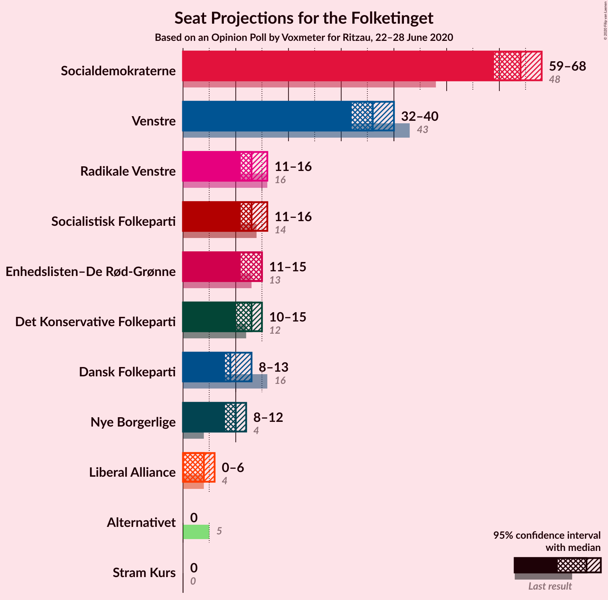
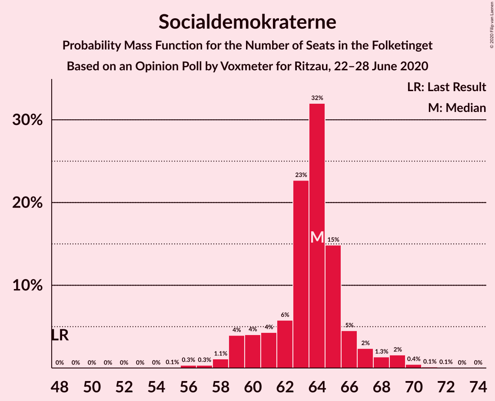
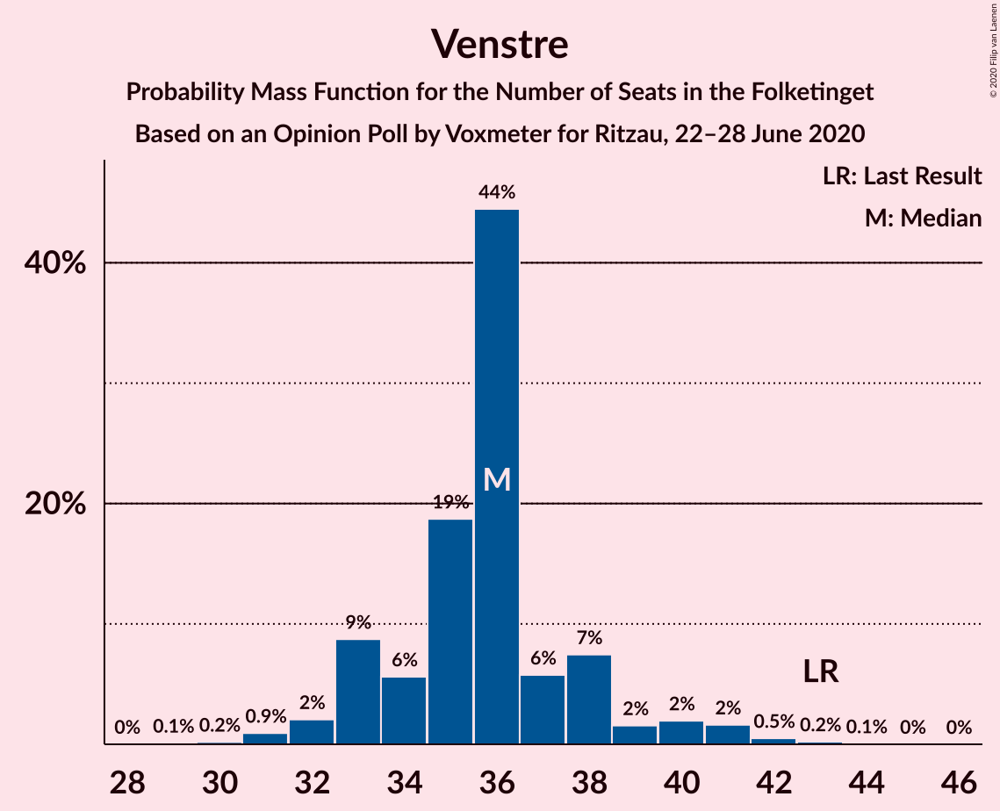
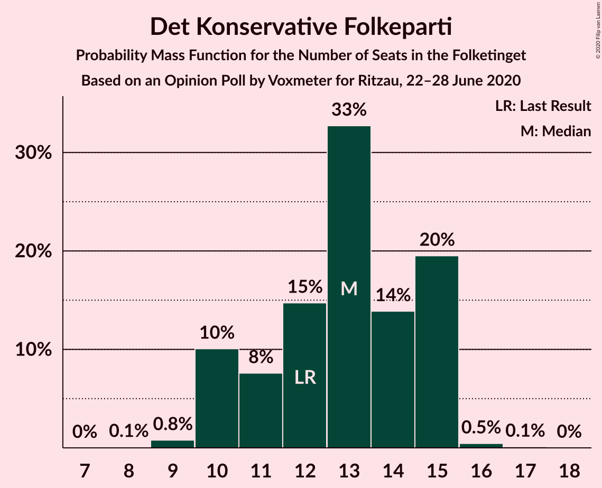
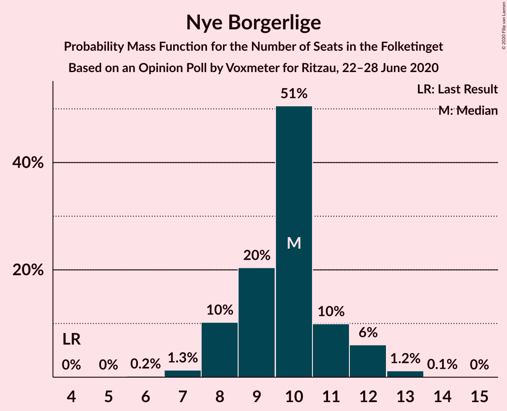
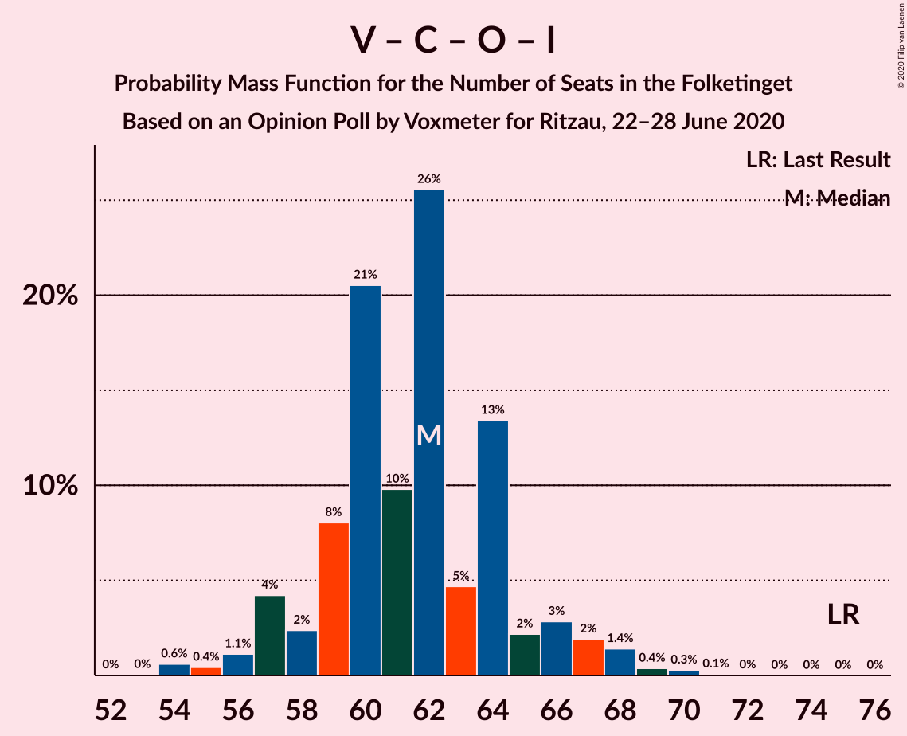

# Opinion Poll by Voxmeter for Ritzau, 22–28 June 2020

<a href="#voting-intentions">Voting Intentions</a> | <a href="#seats">Seats</a> | <a href="#coalitions">Coalitions</a> | <a href="#technical-information">Technical Information</a>

## Voting Intentions

### Confidence Intervals

| Party | Last Result | Poll Result | 80% Confidence Interval | 90% Confidence Interval | 95% Confidence Interval | 99% Confidence Interval |
|:-----:|:-----------:|:-----------:|:-----------------------:|:-----------------------:|:-----------------------:|:-----------------------:|
| Socialdemokraterne | 25.9% | 35.5% | 33.6–37.4% |33.1–38.0% |32.6–38.4% |31.7–39.4% |
| Venstre | 23.4% | 20.1% | 18.6–21.8% |18.1–22.2% |17.8–22.6% |17.1–23.5% |
| Enhedslisten–De Rød-Grønne | 6.9% | 7.3% | 6.4–8.5% |6.1–8.8% |5.9–9.1% |5.5–9.7% |
| Radikale Venstre | 8.6% | 7.3% | 6.4–8.5% |6.1–8.8% |5.9–9.1% |5.5–9.7% |
| Socialistisk Folkeparti | 7.7% | 7.3% | 6.4–8.5% |6.1–8.8% |5.9–9.1% |5.5–9.7% |
| Det Konservative Folkeparti | 6.6% | 6.8% | 5.9–7.9% |5.6–8.2% |5.4–8.5% |5.0–9.0% |
| Dansk Folkeparti | 8.7% | 5.4% | 4.6–6.4% |4.4–6.7% |4.2–7.0% |3.8–7.5% |
| Nye Borgerlige | 2.4% | 5.3% | 4.5–6.3% |4.3–6.6% |4.1–6.9% |3.7–7.4% |
| Liberal Alliance | 2.3% | 2.4% | 1.9–3.2% |1.8–3.4% |1.6–3.6% |1.4–3.9% |
| Stram Kurs | 1.8% | 0.6% | 0.4–1.0% |0.3–1.1% |0.3–1.3% |0.2–1.5% |
| Alternativet | 3.0% | 0.5% | 0.3–0.9% |0.2–1.0% |0.2–1.1% |0.1–1.4% |

*Note:* The poll result column reflects the actual value used in the calculations. Published results may vary slightly, and in addition be rounded to fewer digits.

## Seats

### Confidence Intervals

| Party | Last Result | Median | 80% Confidence Interval | 90% Confidence Interval | 95% Confidence Interval | 99% Confidence Interval |
|:-----:|:-----------:|:------:|:-----------------------:|:-----------------------:|:-----------------------:|:-----------------------:|
| <a href="#socialdemokraterne">Socialdemokraterne</a> | 48 | 65 | 62–65 |60–65 |60–66 |59–69 |
| <a href="#venstre">Venstre</a> | 43 | 35 | 33–38 |33–40 |33–40 |30–42 |
| <a href="#enhedslisten–de-rød-grønne">Enhedslisten–De Rød-Grønne</a> | 13 | 14 | 12–14 |12–15 |12–15 |10–16 |
| <a href="#radikale-venstre">Radikale Venstre</a> | 16 | 12 | 12–15 |12–15 |12–15 |10–15 |
| <a href="#socialistisk-folkeparti">Socialistisk Folkeparti</a> | 14 | 11 | 11–13 |11–15 |11–15 |11–16 |
| <a href="#det-konservative-folkeparti">Det Konservative Folkeparti</a> | 12 | 14 | 11–14 |10–15 |10–15 |9–16 |
| <a href="#dansk-folkeparti">Dansk Folkeparti</a> | 16 | 11 | 8–11 |8–11 |8–12 |7–12 |
| <a href="#nye-borgerlige">Nye Borgerlige</a> | 4 | 9 | 9–11 |9–12 |8–12 |8–13 |
| <a href="#liberal-alliance">Liberal Alliance</a> | 4 | 4 | 0–5 |0–5 |0–5 |0–6 |
| <a href="#stram-kurs">Stram Kurs</a> | 0 | 0 | 0 |0 |0 |0 |
| <a href="#alternativet">Alternativet</a> | 5 | 0 | 0 |0 |0 |0 |

### Socialdemokraterne

*For a full overview of the results for this party, see the [Socialdemokraterne](party-socialdemokraterne.html) page.*

| Number of Seats | Probability | Accumulated | Special Marks |
|:---------------:|:-----------:|:-----------:|:-------------:|
| 48 | 0% | 100% | Last Result |
| 49 | 0% | 100% |  |
| 50 | 0% | 100% |  |
| 51 | 0% | 100% |  |
| 52 | 0% | 100% |  |
| 53 | 0% | 100% |  |
| 54 | 0% | 100% |  |
| 55 | 0% | 100% |  |
| 56 | 0% | 100% |  |
| 57 | 0.1% | 99.9% |  |
| 58 | 0.1% | 99.9% |  |
| 59 | 0.3% | 99.8% |  |
| 60 | 8% | 99.4% |  |
| 61 | 1.2% | 92% |  |
| 62 | 11% | 90% |  |
| 63 | 8% | 79% |  |
| 64 | 13% | 71% |  |
| 65 | 56% | 58% | Median |
| 66 | 0.2% | 3% |  |
| 67 | 1.4% | 2% |  |
| 68 | 0.4% | 1.0% |  |
| 69 | 0.2% | 0.6% |  |
| 70 | 0.1% | 0.4% |  |
| 71 | 0.3% | 0.3% |  |
| 72 | 0% | 0% |  |

### Venstre

*For a full overview of the results for this party, see the [Venstre](party-venstre.html) page.*

| Number of Seats | Probability | Accumulated | Special Marks |
|:---------------:|:-----------:|:-----------:|:-------------:|
| 30 | 0.5% | 100% |  |
| 31 | 0.2% | 99.4% |  |
| 32 | 0.6% | 99.3% |  |
| 33 | 14% | 98.7% |  |
| 34 | 0.8% | 85% |  |
| 35 | 57% | 84% | Median |
| 36 | 3% | 27% |  |
| 37 | 5% | 25% |  |
| 38 | 11% | 19% |  |
| 39 | 0.1% | 8% |  |
| 40 | 7% | 8% |  |
| 41 | 0.1% | 2% |  |
| 42 | 1.4% | 1.5% |  |
| 43 | 0% | 0% | Last Result |

### Enhedslisten–De Rød-Grønne

*For a full overview of the results for this party, see the [Enhedslisten–De Rød-Grønne](party-enhedslisten–derød-grønne.html) page.*

| Number of Seats | Probability | Accumulated | Special Marks |
|:---------------:|:-----------:|:-----------:|:-------------:|
| 9 | 0.1% | 100% |  |
| 10 | 0.9% | 99.9% |  |
| 11 | 2% | 99.0% |  |
| 12 | 13% | 98% |  |
| 13 | 11% | 84% | Last Result |
| 14 | 64% | 73% | Median |
| 15 | 8% | 9% |  |
| 16 | 0.6% | 0.9% |  |
| 17 | 0.1% | 0.2% |  |
| 18 | 0.1% | 0.1% |  |
| 19 | 0% | 0% |  |

### Radikale Venstre

*For a full overview of the results for this party, see the [Radikale Venstre](party-radikalevenstre.html) page.*

| Number of Seats | Probability | Accumulated | Special Marks |
|:---------------:|:-----------:|:-----------:|:-------------:|
| 10 | 0.6% | 100% |  |
| 11 | 2% | 99.4% |  |
| 12 | 66% | 98% | Median |
| 13 | 16% | 32% |  |
| 14 | 4% | 16% |  |
| 15 | 11% | 11% |  |
| 16 | 0.1% | 0.5% | Last Result |
| 17 | 0.3% | 0.3% |  |
| 18 | 0% | 0.1% |  |
| 19 | 0% | 0% |  |

### Socialistisk Folkeparti

*For a full overview of the results for this party, see the [Socialistisk Folkeparti](party-socialistiskfolkeparti.html) page.*

| Number of Seats | Probability | Accumulated | Special Marks |
|:---------------:|:-----------:|:-----------:|:-------------:|
| 9 | 0.1% | 100% |  |
| 10 | 0.2% | 99.9% |  |
| 11 | 65% | 99.7% | Median |
| 12 | 6% | 34% |  |
| 13 | 21% | 29% |  |
| 14 | 1.3% | 8% | Last Result |
| 15 | 6% | 7% |  |
| 16 | 0.4% | 0.7% |  |
| 17 | 0.3% | 0.3% |  |
| 18 | 0% | 0% |  |

### Det Konservative Folkeparti

*For a full overview of the results for this party, see the [Det Konservative Folkeparti](party-detkonservativefolkeparti.html) page.*

| Number of Seats | Probability | Accumulated | Special Marks |
|:---------------:|:-----------:|:-----------:|:-------------:|
| 9 | 0.7% | 100% |  |
| 10 | 5% | 99.3% |  |
| 11 | 9% | 94% |  |
| 12 | 10% | 86% | Last Result |
| 13 | 16% | 76% |  |
| 14 | 50% | 60% | Median |
| 15 | 9% | 10% |  |
| 16 | 0.5% | 0.6% |  |
| 17 | 0.1% | 0.1% |  |
| 18 | 0% | 0% |  |

### Dansk Folkeparti

*For a full overview of the results for this party, see the [Dansk Folkeparti](party-danskfolkeparti.html) page.*

| Number of Seats | Probability | Accumulated | Special Marks |
|:---------------:|:-----------:|:-----------:|:-------------:|
| 7 | 2% | 100% |  |
| 8 | 16% | 98% |  |
| 9 | 15% | 82% |  |
| 10 | 10% | 67% |  |
| 11 | 53% | 56% | Median |
| 12 | 3% | 4% |  |
| 13 | 0.1% | 0.1% |  |
| 14 | 0% | 0% |  |
| 15 | 0% | 0% |  |
| 16 | 0% | 0% | Last Result |

### Nye Borgerlige

*For a full overview of the results for this party, see the [Nye Borgerlige](party-nyeborgerlige.html) page.*

| Number of Seats | Probability | Accumulated | Special Marks |
|:---------------:|:-----------:|:-----------:|:-------------:|
| 4 | 0% | 100% | Last Result |
| 5 | 0% | 100% |  |
| 6 | 0% | 100% |  |
| 7 | 0.2% | 100% |  |
| 8 | 3% | 99.8% |  |
| 9 | 64% | 97% | Median |
| 10 | 13% | 33% |  |
| 11 | 11% | 20% |  |
| 12 | 9% | 10% |  |
| 13 | 0.5% | 0.6% |  |
| 14 | 0% | 0% |  |

### Liberal Alliance

*For a full overview of the results for this party, see the [Liberal Alliance](party-liberalalliance.html) page.*

| Number of Seats | Probability | Accumulated | Special Marks |
|:---------------:|:-----------:|:-----------:|:-------------:|
| 0 | 15% | 100% |  |
| 1 | 0% | 85% |  |
| 2 | 0% | 85% |  |
| 3 | 0% | 85% |  |
| 4 | 67% | 85% | Last Result, Median |
| 5 | 16% | 18% |  |
| 6 | 2% | 2% |  |
| 7 | 0.2% | 0.2% |  |
| 8 | 0% | 0% |  |

### Stram Kurs

*For a full overview of the results for this party, see the [Stram Kurs](party-stramkurs.html) page.*

| Number of Seats | Probability | Accumulated | Special Marks |
|:---------------:|:-----------:|:-----------:|:-------------:|
| 0 | 100% | 100% | Last Result, Median |

### Alternativet

*For a full overview of the results for this party, see the [Alternativet](party-alternativet.html) page.*

| Number of Seats | Probability | Accumulated | Special Marks |
|:---------------:|:-----------:|:-----------:|:-------------:|
| 0 | 100% | 100% | Median |
| 1 | 0% | 0% |  |
| 2 | 0% | 0% |  |
| 3 | 0% | 0% |  |
| 4 | 0% | 0% |  |
| 5 | 0% | 0% | Last Result |

## Coalitions

### Confidence Intervals

| Coalition | Last Result | Median | Majority? | 80% Confidence Interval | 90% Confidence Interval | 95% Confidence Interval | 99% Confidence Interval |
|:---------:|:-----------:|:------:|:---------:|:-----------------------:|:-----------------------:|:-----------------------:|:-----------------------:|
| Socialdemokraterne – Enhedslisten–De Rød-Grønne – Radikale Venstre – Socialistisk Folkeparti – Alternativet | 96 | 102 | 100% | 99–104 | 99–107 | 99–107 | 98–108 |
| Socialdemokraterne – Enhedslisten–De Rød-Grønne – Radikale Venstre – Socialistisk Folkeparti | 91 | 102 | 100% | 99–104 | 99–107 | 99–107 | 98–108 |
| Socialdemokraterne – Enhedslisten–De Rød-Grønne – Socialistisk Folkeparti – Alternativet | 80 | 90 | 63% | 87–90 | 84–95 | 84–95 | 83–97 |
| Socialdemokraterne – Enhedslisten–De Rød-Grønne – Socialistisk Folkeparti | 75 | 90 | 63% | 87–90 | 84–95 | 84–95 | 83–97 |
| Socialdemokraterne – Radikale Venstre – Socialistisk Folkeparti | 78 | 88 | 28% | 86–90 | 85–92 | 85–92 | 85–95 |
| Socialdemokraterne – Radikale Venstre | 64 | 77 | 0% | 74–77 | 74–78 | 73–79 | 73–81 |
| Venstre – Det Konservative Folkeparti – Dansk Folkeparti – Nye Borgerlige – Liberal Alliance | 79 | 73 | 0% | 68–76 | 68–76 | 68–76 | 66–77 |
| Venstre – Det Konservative Folkeparti – Dansk Folkeparti – Liberal Alliance | 75 | 64 | 0% | 57–65 | 57–66 | 57–66 | 56–66 |
| Venstre – Det Konservative Folkeparti – Liberal Alliance | 59 | 53 | 0% | 48–56 | 47–58 | 47–58 | 47–58 |
| Venstre – Det Konservative Folkeparti | 55 | 49 | 0% | 46–53 | 46–53 | 45–53 | 43–55 |
| Venstre | 43 | 35 | 0% | 33–38 | 33–40 | 33–40 | 30–42 |

### Socialdemokraterne – Enhedslisten–De Rød-Grønne – Radikale Venstre – Socialistisk Folkeparti – Alternativet

| Number of Seats | Probability | Accumulated | Special Marks |
|:---------------:|:-----------:|:-----------:|:-------------:|
| 96 | 0.1% | 100% | Last Result |
| 97 | 0.1% | 99.9% |  |
| 98 | 0.6% | 99.8% |  |
| 99 | 14% | 99.2% |  |
| 100 | 2% | 85% |  |
| 101 | 2% | 83% |  |
| 102 | 64% | 81% | Median |
| 103 | 7% | 17% |  |
| 104 | 3% | 10% |  |
| 105 | 0.2% | 7% |  |
| 106 | 0.3% | 7% |  |
| 107 | 5% | 6% |  |
| 108 | 0.4% | 0.9% |  |
| 109 | 0.2% | 0.5% |  |
| 110 | 0.2% | 0.3% |  |
| 111 | 0% | 0.1% |  |
| 112 | 0% | 0% |  |

### Socialdemokraterne – Enhedslisten–De Rød-Grønne – Radikale Venstre – Socialistisk Folkeparti

| Number of Seats | Probability | Accumulated | Special Marks |
|:---------------:|:-----------:|:-----------:|:-------------:|
| 91 | 0% | 100% | Last Result |
| 92 | 0% | 100% |  |
| 93 | 0% | 100% |  |
| 94 | 0% | 100% |  |
| 95 | 0% | 100% |  |
| 96 | 0.1% | 100% |  |
| 97 | 0.1% | 99.9% |  |
| 98 | 0.6% | 99.8% |  |
| 99 | 14% | 99.2% |  |
| 100 | 2% | 85% |  |
| 101 | 2% | 83% |  |
| 102 | 64% | 81% | Median |
| 103 | 7% | 17% |  |
| 104 | 3% | 10% |  |
| 105 | 0.2% | 7% |  |
| 106 | 0.3% | 7% |  |
| 107 | 5% | 6% |  |
| 108 | 0.4% | 0.9% |  |
| 109 | 0.2% | 0.5% |  |
| 110 | 0.2% | 0.3% |  |
| 111 | 0% | 0.1% |  |
| 112 | 0% | 0% |  |

### Socialdemokraterne – Enhedslisten–De Rød-Grønne – Socialistisk Folkeparti – Alternativet

| Number of Seats | Probability | Accumulated | Special Marks |
|:---------------:|:-----------:|:-----------:|:-------------:|
| 80 | 0% | 100% | Last Result |
| 81 | 0% | 100% |  |
| 82 | 0% | 100% |  |
| 83 | 0.5% | 100% |  |
| 84 | 6% | 99.5% |  |
| 85 | 0.2% | 94% |  |
| 86 | 0.5% | 94% |  |
| 87 | 11% | 93% |  |
| 88 | 5% | 82% |  |
| 89 | 14% | 78% |  |
| 90 | 56% | 63% | Median, Majority |
| 91 | 0.2% | 7% |  |
| 92 | 0.7% | 7% |  |
| 93 | 0.4% | 7% |  |
| 94 | 0.2% | 6% |  |
| 95 | 5% | 6% |  |
| 96 | 0.3% | 0.8% |  |
| 97 | 0.1% | 0.5% |  |
| 98 | 0.4% | 0.4% |  |
| 99 | 0% | 0.1% |  |
| 100 | 0% | 0% |  |

### Socialdemokraterne – Enhedslisten–De Rød-Grønne – Socialistisk Folkeparti

| Number of Seats | Probability | Accumulated | Special Marks |
|:---------------:|:-----------:|:-----------:|:-------------:|
| 75 | 0% | 100% | Last Result |
| 76 | 0% | 100% |  |
| 77 | 0% | 100% |  |
| 78 | 0% | 100% |  |
| 79 | 0% | 100% |  |
| 80 | 0% | 100% |  |
| 81 | 0% | 100% |  |
| 82 | 0% | 100% |  |
| 83 | 0.5% | 100% |  |
| 84 | 6% | 99.5% |  |
| 85 | 0.2% | 94% |  |
| 86 | 0.5% | 94% |  |
| 87 | 11% | 93% |  |
| 88 | 5% | 82% |  |
| 89 | 14% | 78% |  |
| 90 | 56% | 63% | Median, Majority |
| 91 | 0.2% | 7% |  |
| 92 | 0.7% | 7% |  |
| 93 | 0.4% | 7% |  |
| 94 | 0.2% | 6% |  |
| 95 | 5% | 6% |  |
| 96 | 0.3% | 0.8% |  |
| 97 | 0.1% | 0.5% |  |
| 98 | 0.4% | 0.4% |  |
| 99 | 0% | 0.1% |  |
| 100 | 0% | 0% |  |

### Socialdemokraterne – Radikale Venstre – Socialistisk Folkeparti

| Number of Seats | Probability | Accumulated | Special Marks |
|:---------------:|:-----------:|:-----------:|:-------------:|
| 78 | 0% | 100% | Last Result |
| 79 | 0% | 100% |  |
| 80 | 0% | 100% |  |
| 81 | 0% | 100% |  |
| 82 | 0.1% | 100% |  |
| 83 | 0% | 99.9% |  |
| 84 | 0.1% | 99.9% |  |
| 85 | 9% | 99.8% |  |
| 86 | 8% | 91% |  |
| 87 | 1.1% | 83% |  |
| 88 | 53% | 82% | Median |
| 89 | 1.0% | 29% |  |
| 90 | 20% | 28% | Majority |
| 91 | 0.1% | 8% |  |
| 92 | 7% | 8% |  |
| 93 | 0.3% | 1.2% |  |
| 94 | 0.4% | 0.9% |  |
| 95 | 0.3% | 0.6% |  |
| 96 | 0.1% | 0.3% |  |
| 97 | 0.1% | 0.2% |  |
| 98 | 0.1% | 0.2% |  |
| 99 | 0% | 0% |  |

### Socialdemokraterne – Radikale Venstre

| Number of Seats | Probability | Accumulated | Special Marks |
|:---------------:|:-----------:|:-----------:|:-------------:|
| 64 | 0% | 100% | Last Result |
| 65 | 0% | 100% |  |
| 66 | 0% | 100% |  |
| 67 | 0% | 100% |  |
| 68 | 0% | 100% |  |
| 69 | 0% | 100% |  |
| 70 | 0% | 99.9% |  |
| 71 | 0.1% | 99.9% |  |
| 72 | 0.3% | 99.9% |  |
| 73 | 4% | 99.5% |  |
| 74 | 9% | 96% |  |
| 75 | 8% | 87% |  |
| 76 | 1.1% | 79% |  |
| 77 | 71% | 78% | Median |
| 78 | 4% | 7% |  |
| 79 | 1.0% | 3% |  |
| 80 | 0.5% | 2% |  |
| 81 | 1.3% | 1.5% |  |
| 82 | 0.2% | 0.2% |  |
| 83 | 0% | 0.1% |  |
| 84 | 0% | 0% |  |

### Venstre – Det Konservative Folkeparti – Dansk Folkeparti – Nye Borgerlige – Liberal Alliance

| Number of Seats | Probability | Accumulated | Special Marks |
|:---------------:|:-----------:|:-----------:|:-------------:|
| 63 | 0% | 100% |  |
| 64 | 0.1% | 99.9% |  |
| 65 | 0.3% | 99.9% |  |
| 66 | 0.3% | 99.5% |  |
| 67 | 0.5% | 99.2% |  |
| 68 | 22% | 98.7% |  |
| 69 | 0.7% | 76% |  |
| 70 | 0.7% | 76% |  |
| 71 | 5% | 75% |  |
| 72 | 2% | 70% |  |
| 73 | 51% | 68% | Median |
| 74 | 1.4% | 17% |  |
| 75 | 0.1% | 15% |  |
| 76 | 14% | 15% |  |
| 77 | 0.6% | 0.7% |  |
| 78 | 0.1% | 0.1% |  |
| 79 | 0% | 0.1% | Last Result |
| 80 | 0% | 0% |  |

### Venstre – Det Konservative Folkeparti – Dansk Folkeparti – Liberal Alliance

| Number of Seats | Probability | Accumulated | Special Marks |
|:---------------:|:-----------:|:-----------:|:-------------:|
| 53 | 0.1% | 100% |  |
| 54 | 0% | 99.9% |  |
| 55 | 0.1% | 99.8% |  |
| 56 | 0.3% | 99.7% |  |
| 57 | 10% | 99.5% |  |
| 58 | 0.8% | 90% |  |
| 59 | 13% | 89% |  |
| 60 | 4% | 76% |  |
| 61 | 4% | 72% |  |
| 62 | 0.3% | 69% |  |
| 63 | 2% | 68% |  |
| 64 | 56% | 66% | Median |
| 65 | 0.8% | 10% |  |
| 66 | 9% | 9% |  |
| 67 | 0.3% | 0.5% |  |
| 68 | 0.1% | 0.2% |  |
| 69 | 0% | 0.1% |  |
| 70 | 0% | 0% |  |
| 71 | 0% | 0% |  |
| 72 | 0% | 0% |  |
| 73 | 0% | 0% |  |
| 74 | 0% | 0% |  |
| 75 | 0% | 0% | Last Result |

### Venstre – Det Konservative Folkeparti – Liberal Alliance

| Number of Seats | Probability | Accumulated | Special Marks |
|:---------------:|:-----------:|:-----------:|:-------------:|
| 44 | 0.1% | 100% |  |
| 45 | 0.2% | 99.9% |  |
| 46 | 0.2% | 99.7% |  |
| 47 | 9% | 99.5% |  |
| 48 | 0.3% | 90% |  |
| 49 | 4% | 90% |  |
| 50 | 13% | 86% |  |
| 51 | 1.0% | 72% |  |
| 52 | 3% | 71% |  |
| 53 | 51% | 68% | Median |
| 54 | 0.9% | 17% |  |
| 55 | 2% | 17% |  |
| 56 | 6% | 15% |  |
| 57 | 0.2% | 9% |  |
| 58 | 9% | 9% |  |
| 59 | 0% | 0.1% | Last Result |
| 60 | 0% | 0% |  |

### Venstre – Det Konservative Folkeparti

| Number of Seats | Probability | Accumulated | Special Marks |
|:---------------:|:-----------:|:-----------:|:-------------:|
| 40 | 0.1% | 100% |  |
| 41 | 0.1% | 99.9% |  |
| 42 | 0.1% | 99.8% |  |
| 43 | 0.4% | 99.7% |  |
| 44 | 0.9% | 99.3% |  |
| 45 | 1.5% | 98% |  |
| 46 | 13% | 97% |  |
| 47 | 10% | 84% |  |
| 48 | 3% | 75% |  |
| 49 | 54% | 71% | Median |
| 50 | 0.2% | 17% |  |
| 51 | 6% | 17% |  |
| 52 | 0.3% | 11% |  |
| 53 | 9% | 10% |  |
| 54 | 0% | 1.3% |  |
| 55 | 0.9% | 1.3% | Last Result |
| 56 | 0% | 0.4% |  |
| 57 | 0% | 0.4% |  |
| 58 | 0.4% | 0.4% |  |
| 59 | 0% | 0% |  |

### Venstre

| Number of Seats | Probability | Accumulated | Special Marks |
|:---------------:|:-----------:|:-----------:|:-------------:|
| 30 | 0.5% | 100% |  |
| 31 | 0.2% | 99.4% |  |
| 32 | 0.6% | 99.3% |  |
| 33 | 14% | 98.7% |  |
| 34 | 0.8% | 85% |  |
| 35 | 57% | 84% | Median |
| 36 | 3% | 27% |  |
| 37 | 5% | 25% |  |
| 38 | 11% | 19% |  |
| 39 | 0.1% | 8% |  |
| 40 | 7% | 8% |  |
| 41 | 0.1% | 2% |  |
| 42 | 1.4% | 1.5% |  |
| 43 | 0% | 0% | Last Result |

## Technical Information

### Opinion Poll

+ **Polling firm:** Voxmeter
+ **Commissioner(s):** Ritzau
+ **Fieldwork period:** 22–28 June 2020

### Calculations

+ **Sample size:** 1035
+ **Simulations done:** 131,072
+ **Error estimate:** 1.33%

