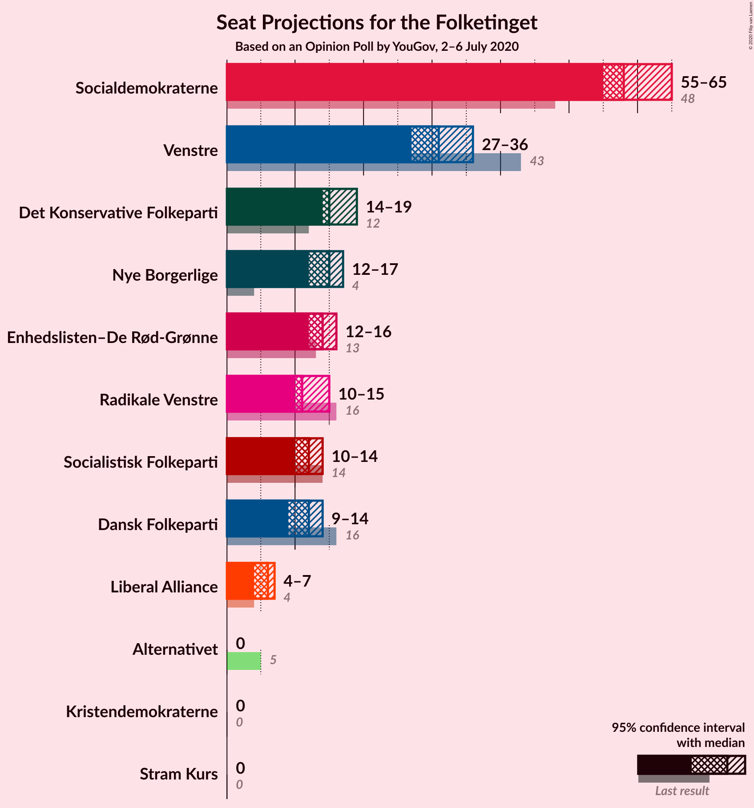
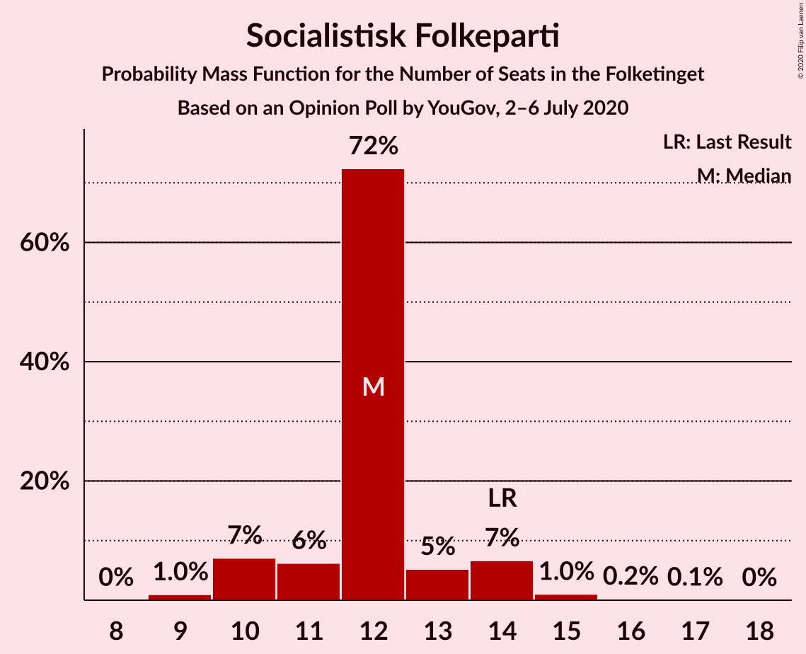
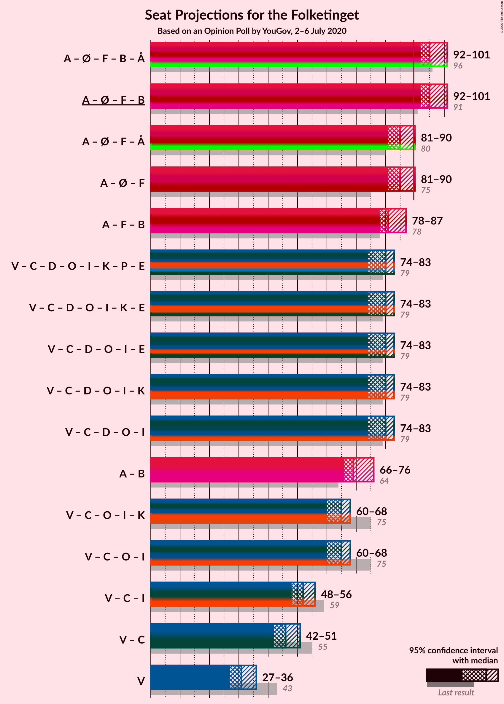
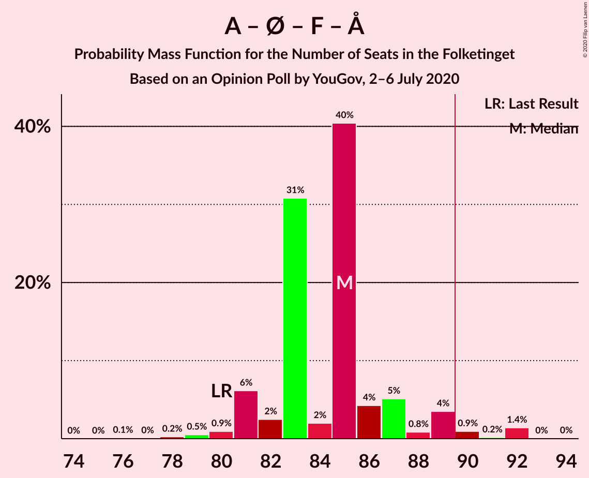
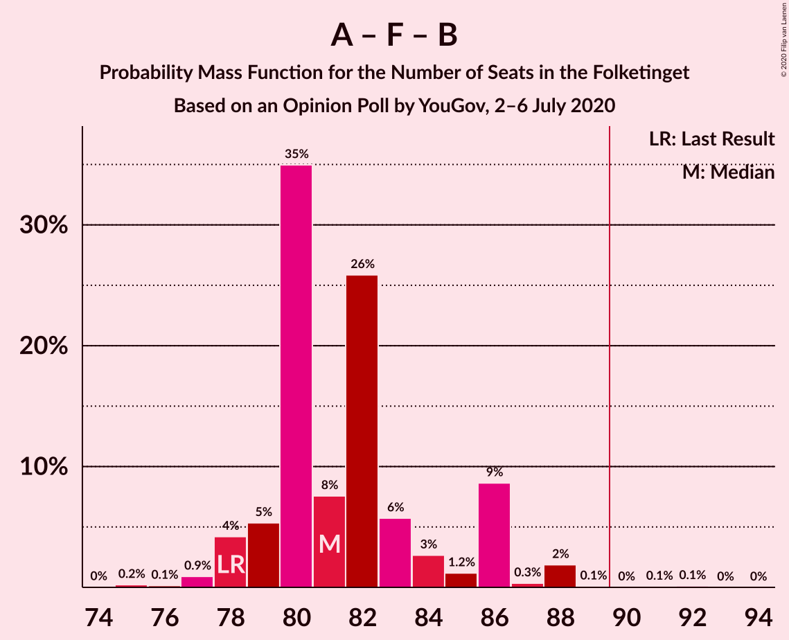
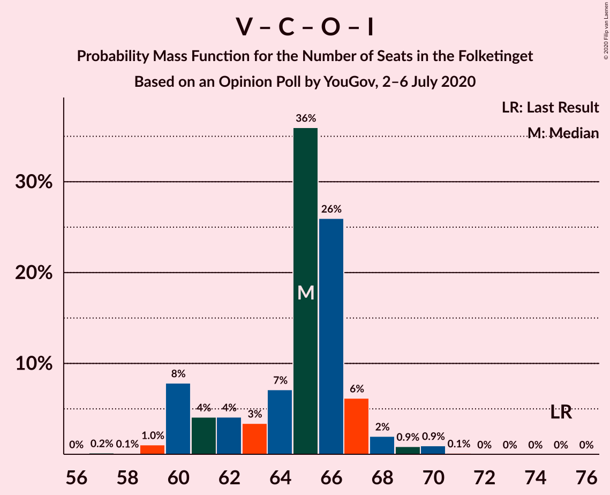

# Opinion Poll by YouGov, 2–6 July 2020

<a href="#voting-intentions">Voting Intentions</a> | <a href="#seats">Seats</a> | <a href="#coalitions">Coalitions</a> | <a href="#technical-information">Technical Information</a>

## Voting Intentions

### Confidence Intervals

| Party | Last Result | Poll Result | 80% Confidence Interval | 90% Confidence Interval | 95% Confidence Interval | 99% Confidence Interval |
|:-----:|:-----------:|:-----------:|:-----------------------:|:-----------------------:|:-----------------------:|:-----------------------:|
| Socialdemokraterne | 25.9% | 32.7% | 31.0–34.4% |30.5–34.9% |30.1–35.4% |29.3–36.2% |
| Venstre | 23.4% | 17.0% | 15.7–18.5% |15.3–18.9% |15.0–19.2% |14.4–19.9% |
| Det Konservative Folkeparti | 6.6% | 8.8% | 7.8–9.9% |7.6–10.2% |7.3–10.5% |6.9–11.1% |
| Nye Borgerlige | 2.4% | 8.1% | 7.1–9.2% |6.9–9.5% |6.7–9.7% |6.3–10.3% |
| Enhedslisten–De Rød-Grønne | 6.9% | 7.7% | 6.8–8.7% |6.5–9.0% |6.3–9.3% |5.9–9.8% |
| Socialistisk Folkeparti | 7.7% | 6.7% | 5.9–7.7% |5.6–8.0% |5.4–8.2% |5.1–8.7% |
| Dansk Folkeparti | 8.7% | 6.5% | 5.7–7.5% |5.5–7.8% |5.3–8.1% |4.9–8.6% |
| Radikale Venstre | 8.6% | 6.4% | 5.6–7.4% |5.3–7.6% |5.1–7.9% |4.8–8.4% |
| Liberal Alliance | 2.3% | 3.0% | 2.5–3.7% |2.3–3.9% |2.2–4.1% |1.9–4.5% |
| Alternativet | 3.0% | 0.7% | 0.5–1.1% |0.4–1.3% |0.4–1.4% |0.3–1.6% |
| Kristendemokraterne | 1.7% | 0.7% | 0.5–1.1% |0.4–1.3% |0.4–1.4% |0.3–1.6% |
| Stram Kurs | 1.8% | 0.7% | 0.5–1.1% |0.4–1.3% |0.4–1.4% |0.3–1.6% |

*Note:* The poll result column reflects the actual value used in the calculations. Published results may vary slightly, and in addition be rounded to fewer digits.

## Seats

### Confidence Intervals

| Party | Last Result | Median | 80% Confidence Interval | 90% Confidence Interval | 95% Confidence Interval | 99% Confidence Interval |
|:-----:|:-----------:|:------:|:-----------------------:|:-----------------------:|:-----------------------:|:-----------------------:|
| <a href="#socialdemokraterne">Socialdemokraterne</a> | 48 | 58 | 56–61 |55–62 |55–65 |53–65 |
| <a href="#venstre">Venstre</a> | 43 | 31 | 29–33 |28–33 |27–36 |27–36 |
| <a href="#det-konservative-folkeparti">Det Konservative Folkeparti</a> | 12 | 15 | 14–17 |14–18 |14–19 |13–20 |
| <a href="#nye-borgerlige">Nye Borgerlige</a> | 4 | 15 | 14–16 |13–17 |12–17 |11–18 |
| <a href="#enhedslisten–de-rød-grønne">Enhedslisten–De Rød-Grønne</a> | 13 | 14 | 13–15 |12–16 |12–16 |11–18 |
| <a href="#socialistisk-folkeparti">Socialistisk Folkeparti</a> | 14 | 12 | 11–13 |10–14 |10–14 |9–15 |
| <a href="#dansk-folkeparti">Dansk Folkeparti</a> | 16 | 12 | 10–13 |10–13 |9–14 |9–15 |
| <a href="#radikale-venstre">Radikale Venstre</a> | 16 | 11 | 10–13 |10–14 |10–15 |9–15 |
| <a href="#liberal-alliance">Liberal Alliance</a> | 4 | 6 | 5–6 |5–7 |4–7 |4–8 |
| <a href="#alternativet">Alternativet</a> | 5 | 0 | 0 |0 |0 |0 |
| <a href="#kristendemokraterne">Kristendemokraterne</a> | 0 | 0 | 0 |0 |0 |0 |
| <a href="#stram-kurs">Stram Kurs</a> | 0 | 0 | 0 |0 |0 |0 |

### Socialdemokraterne

*For a full overview of the results for this party, see the [Socialdemokraterne](party-socialdemokraterne.html) page.*

| Number of Seats | Probability | Accumulated | Special Marks |
|:---------------:|:-----------:|:-----------:|:-------------:|
| 48 | 0% | 100% | Last Result |
| 49 | 0% | 100% |  |
| 50 | 0% | 100% |  |
| 51 | 0% | 100% |  |
| 52 | 0.1% | 100% |  |
| 53 | 0.5% | 99.9% |  |
| 54 | 1.0% | 99.4% |  |
| 55 | 7% | 98% |  |
| 56 | 2% | 92% |  |
| 57 | 7% | 90% |  |
| 58 | 62% | 83% | Median |
| 59 | 7% | 21% |  |
| 60 | 0.9% | 14% |  |
| 61 | 7% | 13% |  |
| 62 | 1.3% | 6% |  |
| 63 | 0.4% | 5% |  |
| 64 | 1.3% | 4% |  |
| 65 | 3% | 3% |  |
| 66 | 0.2% | 0.2% |  |
| 67 | 0.1% | 0.1% |  |
| 68 | 0% | 0% |  |

### Venstre

*For a full overview of the results for this party, see the [Venstre](party-venstre.html) page.*

| Number of Seats | Probability | Accumulated | Special Marks |
|:---------------:|:-----------:|:-----------:|:-------------:|
| 25 | 0.1% | 100% |  |
| 26 | 0.2% | 99.9% |  |
| 27 | 3% | 99.6% |  |
| 28 | 5% | 97% |  |
| 29 | 4% | 91% |  |
| 30 | 4% | 87% |  |
| 31 | 50% | 83% | Median |
| 32 | 3% | 33% |  |
| 33 | 26% | 31% |  |
| 34 | 1.5% | 5% |  |
| 35 | 0.3% | 3% |  |
| 36 | 3% | 3% |  |
| 37 | 0.1% | 0.1% |  |
| 38 | 0% | 0% |  |
| 39 | 0% | 0% |  |
| 40 | 0% | 0% |  |
| 41 | 0% | 0% |  |
| 42 | 0% | 0% |  |
| 43 | 0% | 0% | Last Result |

### Det Konservative Folkeparti

*For a full overview of the results for this party, see the [Det Konservative Folkeparti](party-detkonservativefolkeparti.html) page.*

| Number of Seats | Probability | Accumulated | Special Marks |
|:---------------:|:-----------:|:-----------:|:-------------:|
| 12 | 0.4% | 100% | Last Result |
| 13 | 0.7% | 99.6% |  |
| 14 | 13% | 98.8% |  |
| 15 | 63% | 86% | Median |
| 16 | 7% | 24% |  |
| 17 | 8% | 17% |  |
| 18 | 6% | 9% |  |
| 19 | 2% | 3% |  |
| 20 | 1.0% | 1.0% |  |
| 21 | 0.1% | 0.1% |  |
| 22 | 0% | 0% |  |

### Nye Borgerlige

*For a full overview of the results for this party, see the [Nye Borgerlige](party-nyeborgerlige.html) page.*

| Number of Seats | Probability | Accumulated | Special Marks |
|:---------------:|:-----------:|:-----------:|:-------------:|
| 4 | 0% | 100% | Last Result |
| 5 | 0% | 100% |  |
| 6 | 0% | 100% |  |
| 7 | 0% | 100% |  |
| 8 | 0% | 100% |  |
| 9 | 0% | 100% |  |
| 10 | 0% | 100% |  |
| 11 | 0.7% | 99.9% |  |
| 12 | 4% | 99.3% |  |
| 13 | 4% | 95% |  |
| 14 | 28% | 91% |  |
| 15 | 44% | 63% | Median |
| 16 | 11% | 19% |  |
| 17 | 6% | 8% |  |
| 18 | 2% | 2% |  |
| 19 | 0.1% | 0.1% |  |
| 20 | 0% | 0% |  |

### Enhedslisten–De Rød-Grønne

*For a full overview of the results for this party, see the [Enhedslisten–De Rød-Grønne](party-enhedslisten–derød-grønne.html) page.*

| Number of Seats | Probability | Accumulated | Special Marks |
|:---------------:|:-----------:|:-----------:|:-------------:|
| 10 | 0.1% | 100% |  |
| 11 | 0.6% | 99.9% |  |
| 12 | 7% | 99.3% |  |
| 13 | 30% | 92% | Last Result |
| 14 | 15% | 62% | Median |
| 15 | 40% | 47% |  |
| 16 | 5% | 8% |  |
| 17 | 2% | 2% |  |
| 18 | 0.7% | 0.8% |  |
| 19 | 0% | 0% |  |

### Socialistisk Folkeparti

*For a full overview of the results for this party, see the [Socialistisk Folkeparti](party-socialistiskfolkeparti.html) page.*

| Number of Seats | Probability | Accumulated | Special Marks |
|:---------------:|:-----------:|:-----------:|:-------------:|
| 9 | 1.0% | 100% |  |
| 10 | 7% | 99.0% |  |
| 11 | 6% | 92% |  |
| 12 | 72% | 86% | Median |
| 13 | 5% | 13% |  |
| 14 | 7% | 8% | Last Result |
| 15 | 1.0% | 1.4% |  |
| 16 | 0.2% | 0.3% |  |
| 17 | 0.1% | 0.1% |  |
| 18 | 0% | 0% |  |

### Dansk Folkeparti

*For a full overview of the results for this party, see the [Dansk Folkeparti](party-danskfolkeparti.html) page.*

| Number of Seats | Probability | Accumulated | Special Marks |
|:---------------:|:-----------:|:-----------:|:-------------:|
| 8 | 0.1% | 100% |  |
| 9 | 4% | 99.9% |  |
| 10 | 9% | 96% |  |
| 11 | 9% | 87% |  |
| 12 | 34% | 78% | Median |
| 13 | 41% | 44% |  |
| 14 | 2% | 3% |  |
| 15 | 0.7% | 0.9% |  |
| 16 | 0.2% | 0.2% | Last Result |
| 17 | 0% | 0% |  |

### Radikale Venstre

*For a full overview of the results for this party, see the [Radikale Venstre](party-radikalevenstre.html) page.*

| Number of Seats | Probability | Accumulated | Special Marks |
|:---------------:|:-----------:|:-----------:|:-------------:|
| 8 | 0.2% | 100% |  |
| 9 | 1.5% | 99.8% |  |
| 10 | 44% | 98% |  |
| 11 | 10% | 55% | Median |
| 12 | 34% | 45% |  |
| 13 | 5% | 11% |  |
| 14 | 2% | 6% |  |
| 15 | 4% | 4% |  |
| 16 | 0% | 0% | Last Result |

### Liberal Alliance

*For a full overview of the results for this party, see the [Liberal Alliance](party-liberalalliance.html) page.*

| Number of Seats | Probability | Accumulated | Special Marks |
|:---------------:|:-----------:|:-----------:|:-------------:|
| 0 | 0.4% | 100% |  |
| 1 | 0% | 99.6% |  |
| 2 | 0% | 99.6% |  |
| 3 | 0% | 99.6% |  |
| 4 | 5% | 99.6% | Last Result |
| 5 | 15% | 95% |  |
| 6 | 71% | 80% | Median |
| 7 | 9% | 9% |  |
| 8 | 0.5% | 0.6% |  |
| 9 | 0.1% | 0.1% |  |
| 10 | 0% | 0% |  |

### Alternativet

*For a full overview of the results for this party, see the [Alternativet](party-alternativet.html) page.*

| Number of Seats | Probability | Accumulated | Special Marks |
|:---------------:|:-----------:|:-----------:|:-------------:|
| 0 | 100% | 100% | Median |
| 1 | 0% | 0% |  |
| 2 | 0% | 0% |  |
| 3 | 0% | 0% |  |
| 4 | 0% | 0% |  |
| 5 | 0% | 0% | Last Result |

### Kristendemokraterne

*For a full overview of the results for this party, see the [Kristendemokraterne](party-kristendemokraterne.html) page.*

| Number of Seats | Probability | Accumulated | Special Marks |
|:---------------:|:-----------:|:-----------:|:-------------:|
| 0 | 100% | 100% | Last Result, Median |

### Stram Kurs

*For a full overview of the results for this party, see the [Stram Kurs](party-stramkurs.html) page.*

| Number of Seats | Probability | Accumulated | Special Marks |
|:---------------:|:-----------:|:-----------:|:-------------:|
| 0 | 99.9% | 100% | Last Result, Median |
| 1 | 0% | 0.1% |  |
| 2 | 0% | 0.1% |  |
| 3 | 0% | 0.1% |  |
| 4 | 0.1% | 0.1% |  |
| 5 | 0% | 0% |  |

## Coalitions

### Confidence Intervals

| Coalition | Last Result | Median | Majority? | 80% Confidence Interval | 90% Confidence Interval | 95% Confidence Interval | 99% Confidence Interval |
|:---------:|:-----------:|:------:|:---------:|:-----------------------:|:-----------------------:|:-----------------------:|:-----------------------:|
| Socialdemokraterne – Enhedslisten–De Rød-Grønne – Socialistisk Folkeparti – Radikale Venstre – Alternativet | 96 | 95 | 99.5% | 94–99 | 93–100 | 92–101 | 90–102 |
| Socialdemokraterne – Enhedslisten–De Rød-Grønne – Socialistisk Folkeparti – Radikale Venstre | 91 | 95 | 99.5% | 94–99 | 93–100 | 92–101 | 90–102 |
| Socialdemokraterne – Enhedslisten–De Rød-Grønne – Socialistisk Folkeparti – Alternativet | 80 | 85 | 3% | 82–87 | 81–89 | 81–90 | 79–92 |
| Socialdemokraterne – Enhedslisten–De Rød-Grønne – Socialistisk Folkeparti | 75 | 85 | 3% | 82–87 | 81–89 | 81–90 | 79–92 |
| Socialdemokraterne – Socialistisk Folkeparti – Radikale Venstre | 78 | 81 | 0.2% | 79–86 | 78–86 | 78–87 | 77–88 |
| Venstre – Det Konservative Folkeparti – Nye Borgerlige – Dansk Folkeparti – Liberal Alliance – Kristendemokraterne | 79 | 80 | 0% | 76–81 | 75–82 | 74–83 | 73–85 |
| Venstre – Det Konservative Folkeparti – Nye Borgerlige – Dansk Folkeparti – Liberal Alliance | 79 | 80 | 0% | 76–81 | 75–82 | 74–83 | 73–85 |
| Socialdemokraterne – Radikale Venstre | 64 | 69 | 0% | 68–73 | 66–75 | 66–76 | 64–76 |
| Venstre – Det Konservative Folkeparti – Dansk Folkeparti – Liberal Alliance – Kristendemokraterne | 75 | 65 | 0% | 61–67 | 60–67 | 60–68 | 59–70 |
| Venstre – Det Konservative Folkeparti – Dansk Folkeparti – Liberal Alliance | 75 | 65 | 0% | 61–67 | 60–67 | 60–68 | 59–70 |
| Venstre – Det Konservative Folkeparti – Liberal Alliance | 59 | 52 | 0% | 50–54 | 49–55 | 48–56 | 47–58 |
| Venstre – Det Konservative Folkeparti | 55 | 46 | 0% | 45–49 | 44–50 | 42–51 | 41–53 |
| Venstre | 43 | 31 | 0% | 29–33 | 28–33 | 27–36 | 27–36 |

### Socialdemokraterne – Enhedslisten–De Rød-Grønne – Socialistisk Folkeparti – Radikale Venstre – Alternativet

| Number of Seats | Probability | Accumulated | Special Marks |
|:---------------:|:-----------:|:-----------:|:-------------:|
| 88 | 0.2% | 100% |  |
| 89 | 0.3% | 99.8% |  |
| 90 | 0.5% | 99.5% | Majority |
| 91 | 2% | 99.1% |  |
| 92 | 1.2% | 98% |  |
| 93 | 4% | 96% |  |
| 94 | 7% | 92% |  |
| 95 | 61% | 85% | Median |
| 96 | 2% | 24% | Last Result |
| 97 | 5% | 21% |  |
| 98 | 3% | 17% |  |
| 99 | 4% | 13% |  |
| 100 | 6% | 9% |  |
| 101 | 1.1% | 3% |  |
| 102 | 2% | 2% |  |
| 103 | 0.1% | 0.3% |  |
| 104 | 0.1% | 0.2% |  |
| 105 | 0.1% | 0.1% |  |
| 106 | 0% | 0% |  |

### Socialdemokraterne – Enhedslisten–De Rød-Grønne – Socialistisk Folkeparti – Radikale Venstre

| Number of Seats | Probability | Accumulated | Special Marks |
|:---------------:|:-----------:|:-----------:|:-------------:|
| 88 | 0.2% | 100% |  |
| 89 | 0.3% | 99.8% |  |
| 90 | 0.5% | 99.5% | Majority |
| 91 | 2% | 99.1% | Last Result |
| 92 | 1.2% | 98% |  |
| 93 | 4% | 96% |  |
| 94 | 7% | 92% |  |
| 95 | 61% | 85% | Median |
| 96 | 2% | 24% |  |
| 97 | 5% | 21% |  |
| 98 | 3% | 17% |  |
| 99 | 4% | 13% |  |
| 100 | 6% | 9% |  |
| 101 | 1.1% | 3% |  |
| 102 | 2% | 2% |  |
| 103 | 0.1% | 0.3% |  |
| 104 | 0.1% | 0.2% |  |
| 105 | 0.1% | 0.1% |  |
| 106 | 0% | 0% |  |

### Socialdemokraterne – Enhedslisten–De Rød-Grønne – Socialistisk Folkeparti – Alternativet

| Number of Seats | Probability | Accumulated | Special Marks |
|:---------------:|:-----------:|:-----------:|:-------------:|
| 76 | 0.1% | 100% |  |
| 77 | 0% | 99.9% |  |
| 78 | 0.2% | 99.8% |  |
| 79 | 0.5% | 99.6% |  |
| 80 | 0.9% | 99.1% | Last Result |
| 81 | 6% | 98% |  |
| 82 | 2% | 92% |  |
| 83 | 31% | 90% |  |
| 84 | 2% | 59% | Median |
| 85 | 40% | 57% |  |
| 86 | 4% | 16% |  |
| 87 | 5% | 12% |  |
| 88 | 0.8% | 7% |  |
| 89 | 4% | 6% |  |
| 90 | 0.9% | 3% | Majority |
| 91 | 0.2% | 2% |  |
| 92 | 1.4% | 1.5% |  |
| 93 | 0% | 0.1% |  |
| 94 | 0% | 0% |  |

### Socialdemokraterne – Enhedslisten–De Rød-Grønne – Socialistisk Folkeparti

| Number of Seats | Probability | Accumulated | Special Marks |
|:---------------:|:-----------:|:-----------:|:-------------:|
| 75 | 0% | 100% | Last Result |
| 76 | 0.1% | 100% |  |
| 77 | 0% | 99.9% |  |
| 78 | 0.3% | 99.8% |  |
| 79 | 0.5% | 99.6% |  |
| 80 | 0.9% | 99.1% |  |
| 81 | 6% | 98% |  |
| 82 | 2% | 92% |  |
| 83 | 31% | 89% |  |
| 84 | 2% | 59% | Median |
| 85 | 40% | 57% |  |
| 86 | 4% | 16% |  |
| 87 | 5% | 12% |  |
| 88 | 0.8% | 7% |  |
| 89 | 4% | 6% |  |
| 90 | 0.9% | 3% | Majority |
| 91 | 0.1% | 2% |  |
| 92 | 1.4% | 1.5% |  |
| 93 | 0% | 0.1% |  |
| 94 | 0% | 0% |  |

### Socialdemokraterne – Socialistisk Folkeparti – Radikale Venstre

| Number of Seats | Probability | Accumulated | Special Marks |
|:---------------:|:-----------:|:-----------:|:-------------:|
| 75 | 0.2% | 100% |  |
| 76 | 0.1% | 99.7% |  |
| 77 | 0.9% | 99.6% |  |
| 78 | 4% | 98.7% | Last Result |
| 79 | 5% | 94% |  |
| 80 | 35% | 89% |  |
| 81 | 8% | 54% | Median |
| 82 | 26% | 47% |  |
| 83 | 6% | 21% |  |
| 84 | 3% | 15% |  |
| 85 | 1.2% | 12% |  |
| 86 | 9% | 11% |  |
| 87 | 0.3% | 3% |  |
| 88 | 2% | 2% |  |
| 89 | 0.1% | 0.3% |  |
| 90 | 0% | 0.2% | Majority |
| 91 | 0.1% | 0.2% |  |
| 92 | 0.1% | 0.1% |  |
| 93 | 0% | 0% |  |

### Venstre – Det Konservative Folkeparti – Nye Borgerlige – Dansk Folkeparti – Liberal Alliance – Kristendemokraterne

| Number of Seats | Probability | Accumulated | Special Marks |
|:---------------:|:-----------:|:-----------:|:-------------:|
| 70 | 0.1% | 100% |  |
| 71 | 0.1% | 99.9% |  |
| 72 | 0.1% | 99.8% |  |
| 73 | 2% | 99.7% |  |
| 74 | 1.1% | 98% |  |
| 75 | 6% | 97% |  |
| 76 | 4% | 91% |  |
| 77 | 3% | 87% |  |
| 78 | 5% | 83% |  |
| 79 | 2% | 79% | Last Result, Median |
| 80 | 61% | 76% |  |
| 81 | 7% | 15% |  |
| 82 | 4% | 8% |  |
| 83 | 1.1% | 4% |  |
| 84 | 2% | 2% |  |
| 85 | 0.4% | 0.9% |  |
| 86 | 0.3% | 0.5% |  |
| 87 | 0.2% | 0.2% |  |
| 88 | 0% | 0% |  |

### Venstre – Det Konservative Folkeparti – Nye Borgerlige – Dansk Folkeparti – Liberal Alliance

| Number of Seats | Probability | Accumulated | Special Marks |
|:---------------:|:-----------:|:-----------:|:-------------:|
| 70 | 0.1% | 100% |  |
| 71 | 0.1% | 99.9% |  |
| 72 | 0.1% | 99.8% |  |
| 73 | 2% | 99.7% |  |
| 74 | 1.1% | 98% |  |
| 75 | 6% | 97% |  |
| 76 | 4% | 91% |  |
| 77 | 3% | 87% |  |
| 78 | 5% | 83% |  |
| 79 | 2% | 79% | Last Result, Median |
| 80 | 61% | 76% |  |
| 81 | 7% | 15% |  |
| 82 | 4% | 8% |  |
| 83 | 1.1% | 4% |  |
| 84 | 2% | 2% |  |
| 85 | 0.4% | 0.9% |  |
| 86 | 0.3% | 0.5% |  |
| 87 | 0.2% | 0.2% |  |
| 88 | 0% | 0% |  |

### Socialdemokraterne – Radikale Venstre

| Number of Seats | Probability | Accumulated | Special Marks |
|:---------------:|:-----------:|:-----------:|:-------------:|
| 63 | 0.1% | 100% |  |
| 64 | 0.5% | 99.9% | Last Result |
| 65 | 0.7% | 99.4% |  |
| 66 | 4% | 98.7% |  |
| 67 | 3% | 94% |  |
| 68 | 37% | 91% |  |
| 69 | 8% | 54% | Median |
| 70 | 27% | 46% |  |
| 71 | 5% | 19% |  |
| 72 | 3% | 13% |  |
| 73 | 1.0% | 11% |  |
| 74 | 2% | 10% |  |
| 75 | 3% | 8% |  |
| 76 | 4% | 4% |  |
| 77 | 0.1% | 0.3% |  |
| 78 | 0% | 0.2% |  |
| 79 | 0.1% | 0.1% |  |
| 80 | 0% | 0% |  |

### Venstre – Det Konservative Folkeparti – Dansk Folkeparti – Liberal Alliance – Kristendemokraterne

| Number of Seats | Probability | Accumulated | Special Marks |
|:---------------:|:-----------:|:-----------:|:-------------:|
| 56 | 0% | 100% |  |
| 57 | 0.2% | 99.9% |  |
| 58 | 0.1% | 99.8% |  |
| 59 | 1.0% | 99.7% |  |
| 60 | 8% | 98.6% |  |
| 61 | 4% | 91% |  |
| 62 | 4% | 87% |  |
| 63 | 3% | 83% |  |
| 64 | 7% | 79% | Median |
| 65 | 36% | 72% |  |
| 66 | 26% | 36% |  |
| 67 | 6% | 10% |  |
| 68 | 2% | 4% |  |
| 69 | 0.9% | 2% |  |
| 70 | 0.9% | 1.1% |  |
| 71 | 0.1% | 0.1% |  |
| 72 | 0% | 0% |  |
| 73 | 0% | 0% |  |
| 74 | 0% | 0% |  |
| 75 | 0% | 0% | Last Result |

### Venstre – Det Konservative Folkeparti – Dansk Folkeparti – Liberal Alliance

| Number of Seats | Probability | Accumulated | Special Marks |
|:---------------:|:-----------:|:-----------:|:-------------:|
| 56 | 0% | 100% |  |
| 57 | 0.2% | 99.9% |  |
| 58 | 0.1% | 99.8% |  |
| 59 | 1.0% | 99.7% |  |
| 60 | 8% | 98.6% |  |
| 61 | 4% | 91% |  |
| 62 | 4% | 87% |  |
| 63 | 3% | 83% |  |
| 64 | 7% | 79% | Median |
| 65 | 36% | 72% |  |
| 66 | 26% | 36% |  |
| 67 | 6% | 10% |  |
| 68 | 2% | 4% |  |
| 69 | 0.9% | 2% |  |
| 70 | 0.9% | 1.1% |  |
| 71 | 0.1% | 0.1% |  |
| 72 | 0% | 0% |  |
| 73 | 0% | 0% |  |
| 74 | 0% | 0% |  |
| 75 | 0% | 0% | Last Result |

### Venstre – Det Konservative Folkeparti – Liberal Alliance

| Number of Seats | Probability | Accumulated | Special Marks |
|:---------------:|:-----------:|:-----------:|:-------------:|
| 45 | 0.1% | 100% |  |
| 46 | 0.1% | 99.8% |  |
| 47 | 0.6% | 99.7% |  |
| 48 | 2% | 99.1% |  |
| 49 | 6% | 97% |  |
| 50 | 4% | 91% |  |
| 51 | 5% | 87% |  |
| 52 | 38% | 82% | Median |
| 53 | 7% | 44% |  |
| 54 | 28% | 37% |  |
| 55 | 5% | 9% |  |
| 56 | 2% | 4% |  |
| 57 | 0.8% | 2% |  |
| 58 | 0.5% | 0.9% |  |
| 59 | 0.4% | 0.4% | Last Result |
| 60 | 0% | 0% |  |

### Venstre – Det Konservative Folkeparti

| Number of Seats | Probability | Accumulated | Special Marks |
|:---------------:|:-----------:|:-----------:|:-------------:|
| 40 | 0.1% | 100% |  |
| 41 | 0.4% | 99.9% |  |
| 42 | 3% | 99.4% |  |
| 43 | 1.0% | 97% |  |
| 44 | 5% | 96% |  |
| 45 | 11% | 91% |  |
| 46 | 37% | 80% | Median |
| 47 | 5% | 44% |  |
| 48 | 27% | 38% |  |
| 49 | 6% | 12% |  |
| 50 | 1.4% | 6% |  |
| 51 | 3% | 4% |  |
| 52 | 0.6% | 1.2% |  |
| 53 | 0.6% | 0.6% |  |
| 54 | 0% | 0% |  |
| 55 | 0% | 0% | Last Result |

### Venstre

| Number of Seats | Probability | Accumulated | Special Marks |
|:---------------:|:-----------:|:-----------:|:-------------:|
| 25 | 0.1% | 100% |  |
| 26 | 0.2% | 99.9% |  |
| 27 | 3% | 99.6% |  |
| 28 | 5% | 97% |  |
| 29 | 4% | 91% |  |
| 30 | 4% | 87% |  |
| 31 | 50% | 83% | Median |
| 32 | 3% | 33% |  |
| 33 | 26% | 31% |  |
| 34 | 1.5% | 5% |  |
| 35 | 0.3% | 3% |  |
| 36 | 3% | 3% |  |
| 37 | 0.1% | 0.1% |  |
| 38 | 0% | 0% |  |
| 39 | 0% | 0% |  |
| 40 | 0% | 0% |  |
| 41 | 0% | 0% |  |
| 42 | 0% | 0% |  |
| 43 | 0% | 0% | Last Result |

## Technical Information

### Opinion Poll

+ **Polling firm:** YouGov
+ **Commissioner(s):** —
+ **Fieldwork period:** 2–6 July 2020

### Calculations

+ **Sample size:** 1239
+ **Simulations done:** 1,048,576
+ **Error estimate:** 1.20%

