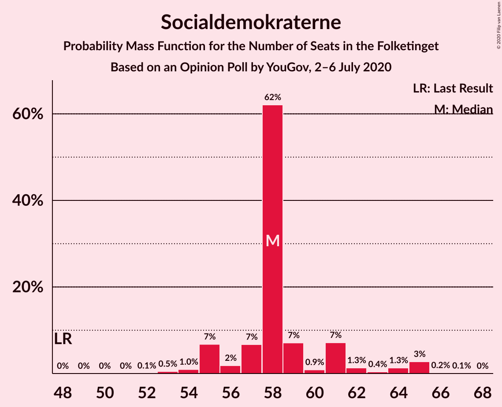
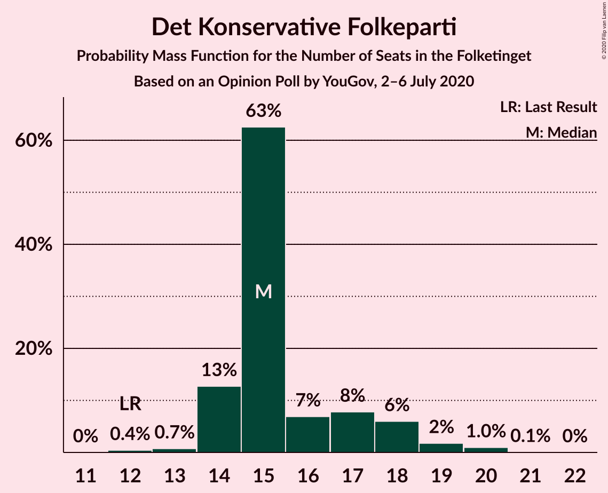
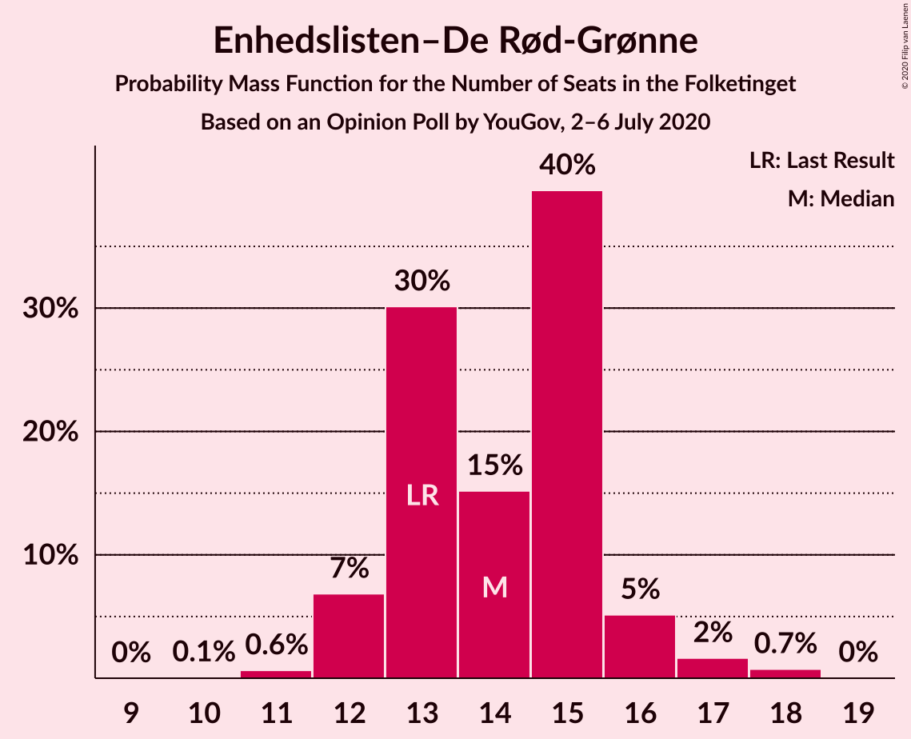
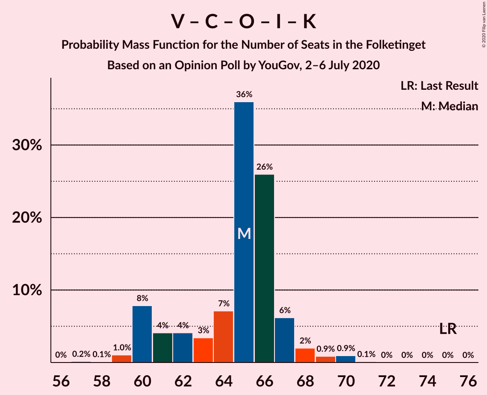
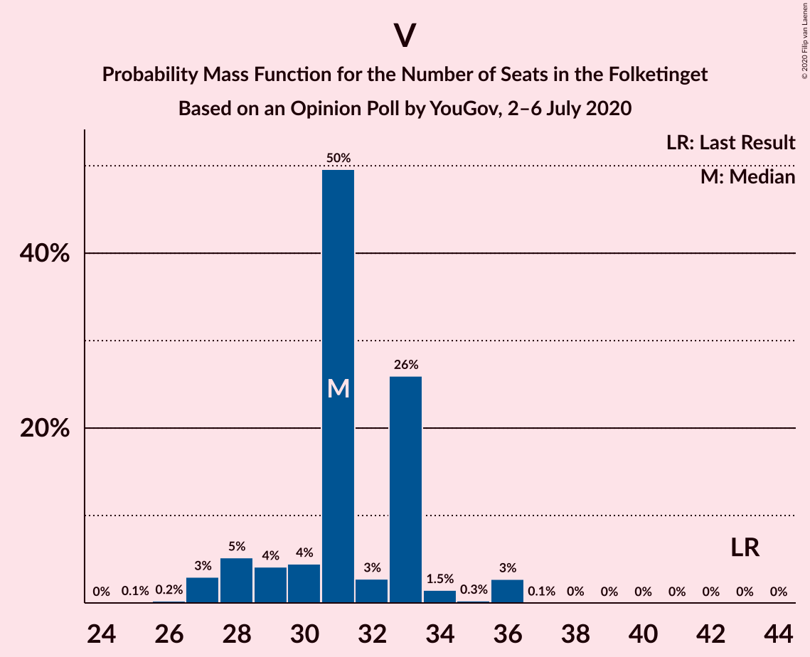

# Opinion Poll by YouGov, 2–6 July 2020

<a href="#voting-intentions">Voting Intentions</a> | <a href="#seats">Seats</a> | <a href="#coalitions">Coalitions</a> | <a href="#technical-information">Technical Information</a>

## Voting Intentions

### Confidence Intervals

| Party | Last Result | Poll Result | 80% Confidence Interval | 90% Confidence Interval | 95% Confidence Interval | 99% Confidence Interval |
|:-----:|:-----------:|:-----------:|:-----------------------:|:-----------------------:|:-----------------------:|:-----------------------:|
| Socialdemokraterne | 25.9% | 32.7% | 31.0–34.4% |30.5–34.9% |30.1–35.4% |29.3–36.2% |
| Venstre | 23.4% | 17.0% | 15.7–18.5% |15.3–18.9% |15.0–19.2% |14.4–19.9% |
| Det Konservative Folkeparti | 6.6% | 8.8% | 7.8–9.9% |7.6–10.2% |7.3–10.5% |6.9–11.1% |
| Nye Borgerlige | 2.4% | 8.1% | 7.1–9.2% |6.9–9.5% |6.7–9.7% |6.3–10.3% |
| Enhedslisten–De Rød-Grønne | 6.9% | 7.7% | 6.8–8.7% |6.5–9.0% |6.3–9.3% |5.9–9.8% |
| Socialistisk Folkeparti | 7.7% | 6.7% | 5.9–7.7% |5.6–8.0% |5.4–8.2% |5.1–8.7% |
| Dansk Folkeparti | 8.7% | 6.5% | 5.7–7.5% |5.5–7.8% |5.3–8.1% |4.9–8.6% |
| Radikale Venstre | 8.6% | 6.4% | 5.6–7.4% |5.3–7.6% |5.1–7.9% |4.8–8.4% |
| Liberal Alliance | 2.3% | 3.0% | 2.5–3.7% |2.3–3.9% |2.2–4.1% |1.9–4.5% |
| Alternativet | 3.0% | 0.7% | 0.5–1.1% |0.4–1.3% |0.4–1.4% |0.3–1.6% |
| Kristendemokraterne | 1.7% | 0.7% | 0.5–1.1% |0.4–1.3% |0.4–1.4% |0.3–1.6% |
| Stram Kurs | 1.8% | 0.7% | 0.5–1.1% |0.4–1.3% |0.4–1.4% |0.3–1.6% |

*Note:* The poll result column reflects the actual value used in the calculations. Published results may vary slightly, and in addition be rounded to fewer digits.

## Seats

### Confidence Intervals

| Party | Last Result | Median | 80% Confidence Interval | 90% Confidence Interval | 95% Confidence Interval | 99% Confidence Interval |
|:-----:|:-----------:|:------:|:-----------------------:|:-----------------------:|:-----------------------:|:-----------------------:|
| <a href="#socialdemokraterne">Socialdemokraterne</a> | 48 | 59 | 57–64 |56–64 |55–64 |53–64 |
| <a href="#venstre">Venstre</a> | 43 | 29 | 28–33 |28–36 |27–36 |25–36 |
| <a href="#det-konservative-folkeparti">Det Konservative Folkeparti</a> | 12 | 16 | 14–18 |14–19 |12–20 |12–20 |
| <a href="#nye-borgerlige">Nye Borgerlige</a> | 4 | 15 | 12–18 |12–18 |12–18 |11–18 |
| <a href="#enhedslisten–de-rød-grønne">Enhedslisten–De Rød-Grønne</a> | 13 | 14 | 12–17 |12–18 |12–18 |11–18 |
| <a href="#socialistisk-folkeparti">Socialistisk Folkeparti</a> | 14 | 12 | 10–14 |9–14 |9–15 |9–15 |
| <a href="#dansk-folkeparti">Dansk Folkeparti</a> | 16 | 11 | 10–14 |10–15 |10–15 |9–15 |
| <a href="#radikale-venstre">Radikale Venstre</a> | 16 | 10 | 10–12 |9–13 |9–13 |8–14 |
| <a href="#liberal-alliance">Liberal Alliance</a> | 4 | 6 | 4–7 |4–7 |4–7 |0–8 |
| <a href="#alternativet">Alternativet</a> | 5 | 0 | 0 |0 |0 |0 |
| <a href="#kristendemokraterne">Kristendemokraterne</a> | 0 | 0 | 0 |0 |0 |0 |
| <a href="#stram-kurs">Stram Kurs</a> | 0 | 0 | 0 |0 |0 |0 |

### Socialdemokraterne

*For a full overview of the results for this party, see the [Socialdemokraterne](party-socialdemokraterne.html) page.*

| Number of Seats | Probability | Accumulated | Special Marks |
|:---------------:|:-----------:|:-----------:|:-------------:|
| 48 | 0% | 100% | Last Result |
| 49 | 0% | 100% |  |
| 50 | 0% | 100% |  |
| 51 | 0% | 100% |  |
| 52 | 0.3% | 100% |  |
| 53 | 0.4% | 99.7% |  |
| 54 | 0.4% | 99.3% |  |
| 55 | 3% | 98.9% |  |
| 56 | 5% | 96% |  |
| 57 | 17% | 90% |  |
| 58 | 19% | 73% |  |
| 59 | 19% | 54% | Median |
| 60 | 3% | 35% |  |
| 61 | 7% | 32% |  |
| 62 | 4% | 26% |  |
| 63 | 0.8% | 21% |  |
| 64 | 21% | 21% |  |
| 65 | 0% | 0.1% |  |
| 66 | 0% | 0% |  |

### Venstre

*For a full overview of the results for this party, see the [Venstre](party-venstre.html) page.*

| Number of Seats | Probability | Accumulated | Special Marks |
|:---------------:|:-----------:|:-----------:|:-------------:|
| 25 | 1.4% | 100% |  |
| 26 | 0.3% | 98.6% |  |
| 27 | 1.2% | 98% |  |
| 28 | 20% | 97% |  |
| 29 | 28% | 77% | Median |
| 30 | 4% | 49% |  |
| 31 | 31% | 45% |  |
| 32 | 5% | 15% |  |
| 33 | 3% | 10% |  |
| 34 | 1.0% | 7% |  |
| 35 | 0.3% | 6% |  |
| 36 | 5% | 5% |  |
| 37 | 0% | 0% |  |
| 38 | 0% | 0% |  |
| 39 | 0% | 0% |  |
| 40 | 0% | 0% |  |
| 41 | 0% | 0% |  |
| 42 | 0% | 0% |  |
| 43 | 0% | 0% | Last Result |

### Det Konservative Folkeparti

*For a full overview of the results for this party, see the [Det Konservative Folkeparti](party-detkonservativefolkeparti.html) page.*

| Number of Seats | Probability | Accumulated | Special Marks |
|:---------------:|:-----------:|:-----------:|:-------------:|
| 12 | 3% | 100% | Last Result |
| 13 | 0.7% | 97% |  |
| 14 | 26% | 97% |  |
| 15 | 14% | 71% |  |
| 16 | 14% | 56% | Median |
| 17 | 21% | 43% |  |
| 18 | 13% | 22% |  |
| 19 | 4% | 8% |  |
| 20 | 4% | 4% |  |
| 21 | 0% | 0.1% |  |
| 22 | 0% | 0% |  |

### Nye Borgerlige

*For a full overview of the results for this party, see the [Nye Borgerlige](party-nyeborgerlige.html) page.*

| Number of Seats | Probability | Accumulated | Special Marks |
|:---------------:|:-----------:|:-----------:|:-------------:|
| 4 | 0% | 100% | Last Result |
| 5 | 0% | 100% |  |
| 6 | 0% | 100% |  |
| 7 | 0% | 100% |  |
| 8 | 0% | 100% |  |
| 9 | 0% | 100% |  |
| 10 | 0.1% | 100% |  |
| 11 | 2% | 99.8% |  |
| 12 | 24% | 98% |  |
| 13 | 7% | 73% |  |
| 14 | 15% | 66% |  |
| 15 | 9% | 51% | Median |
| 16 | 13% | 42% |  |
| 17 | 11% | 28% |  |
| 18 | 17% | 17% |  |
| 19 | 0.1% | 0.2% |  |
| 20 | 0.1% | 0.1% |  |
| 21 | 0% | 0% |  |

### Enhedslisten–De Rød-Grønne

*For a full overview of the results for this party, see the [Enhedslisten–De Rød-Grønne](party-enhedslisten–derød-grønne.html) page.*

| Number of Seats | Probability | Accumulated | Special Marks |
|:---------------:|:-----------:|:-----------:|:-------------:|
| 10 | 0.3% | 100% |  |
| 11 | 0.6% | 99.7% |  |
| 12 | 27% | 99.1% |  |
| 13 | 6% | 72% | Last Result |
| 14 | 26% | 66% | Median |
| 15 | 9% | 39% |  |
| 16 | 10% | 30% |  |
| 17 | 12% | 20% |  |
| 18 | 8% | 8% |  |
| 19 | 0% | 0% |  |

### Socialistisk Folkeparti

*For a full overview of the results for this party, see the [Socialistisk Folkeparti](party-socialistiskfolkeparti.html) page.*

| Number of Seats | Probability | Accumulated | Special Marks |
|:---------------:|:-----------:|:-----------:|:-------------:|
| 8 | 0.3% | 100% |  |
| 9 | 6% | 99.7% |  |
| 10 | 13% | 93% |  |
| 11 | 5% | 81% |  |
| 12 | 29% | 76% | Median |
| 13 | 7% | 47% |  |
| 14 | 37% | 40% | Last Result |
| 15 | 2% | 3% |  |
| 16 | 0.2% | 0.3% |  |
| 17 | 0% | 0% |  |

### Dansk Folkeparti

*For a full overview of the results for this party, see the [Dansk Folkeparti](party-danskfolkeparti.html) page.*

| Number of Seats | Probability | Accumulated | Special Marks |
|:---------------:|:-----------:|:-----------:|:-------------:|
| 8 | 0.2% | 100% |  |
| 9 | 1.2% | 99.8% |  |
| 10 | 25% | 98.6% |  |
| 11 | 31% | 74% | Median |
| 12 | 9% | 43% |  |
| 13 | 19% | 33% |  |
| 14 | 7% | 15% |  |
| 15 | 7% | 7% |  |
| 16 | 0.3% | 0.3% | Last Result |
| 17 | 0% | 0% |  |

### Radikale Venstre

*For a full overview of the results for this party, see the [Radikale Venstre](party-radikalevenstre.html) page.*

| Number of Seats | Probability | Accumulated | Special Marks |
|:---------------:|:-----------:|:-----------:|:-------------:|
| 8 | 2% | 100% |  |
| 9 | 8% | 98% |  |
| 10 | 43% | 91% | Median |
| 11 | 30% | 48% |  |
| 12 | 8% | 18% |  |
| 13 | 9% | 10% |  |
| 14 | 0.9% | 1.3% |  |
| 15 | 0.2% | 0.3% |  |
| 16 | 0.1% | 0.1% | Last Result |
| 17 | 0% | 0% |  |

### Liberal Alliance

*For a full overview of the results for this party, see the [Liberal Alliance](party-liberalalliance.html) page.*

| Number of Seats | Probability | Accumulated | Special Marks |
|:---------------:|:-----------:|:-----------:|:-------------:|
| 0 | 1.4% | 100% |  |
| 1 | 0% | 98.6% |  |
| 2 | 0% | 98.6% |  |
| 3 | 0% | 98.6% |  |
| 4 | 19% | 98.6% | Last Result |
| 5 | 21% | 79% |  |
| 6 | 35% | 58% | Median |
| 7 | 22% | 23% |  |
| 8 | 0.5% | 0.7% |  |
| 9 | 0.2% | 0.2% |  |
| 10 | 0% | 0% |  |

### Alternativet

*For a full overview of the results for this party, see the [Alternativet](party-alternativet.html) page.*

| Number of Seats | Probability | Accumulated | Special Marks |
|:---------------:|:-----------:|:-----------:|:-------------:|
| 0 | 100% | 100% | Median |
| 1 | 0% | 0% |  |
| 2 | 0% | 0% |  |
| 3 | 0% | 0% |  |
| 4 | 0% | 0% |  |
| 5 | 0% | 0% | Last Result |

### Kristendemokraterne

*For a full overview of the results for this party, see the [Kristendemokraterne](party-kristendemokraterne.html) page.*

| Number of Seats | Probability | Accumulated | Special Marks |
|:---------------:|:-----------:|:-----------:|:-------------:|
| 0 | 100% | 100% | Last Result, Median |

### Stram Kurs

*For a full overview of the results for this party, see the [Stram Kurs](party-stramkurs.html) page.*

| Number of Seats | Probability | Accumulated | Special Marks |
|:---------------:|:-----------:|:-----------:|:-------------:|
| 0 | 100% | 100% | Last Result, Median |

## Coalitions

### Confidence Intervals

| Coalition | Last Result | Median | Majority? | 80% Confidence Interval | 90% Confidence Interval | 95% Confidence Interval | 99% Confidence Interval |
|:---------:|:-----------:|:------:|:---------:|:-----------------------:|:-----------------------:|:-----------------------:|:-----------------------:|
| Socialdemokraterne – Enhedslisten–De Rød-Grønne – Socialistisk Folkeparti – Radikale Venstre – Alternativet | 96 | 97 | 99.9% | 91–102 | 91–102 | 91–102 | 90–102 |
| Socialdemokraterne – Enhedslisten–De Rød-Grønne – Socialistisk Folkeparti – Radikale Venstre | 91 | 97 | 99.9% | 91–102 | 91–102 | 91–102 | 90–102 |
| Socialdemokraterne – Enhedslisten–De Rød-Grønne – Socialistisk Folkeparti – Alternativet | 80 | 86 | 30% | 81–92 | 81–92 | 81–92 | 79–92 |
| Socialdemokraterne – Enhedslisten–De Rød-Grønne – Socialistisk Folkeparti | 75 | 86 | 30% | 81–92 | 81–92 | 81–92 | 79–92 |
| Socialdemokraterne – Socialistisk Folkeparti – Radikale Venstre | 78 | 82 | 0% | 79–88 | 79–88 | 78–88 | 76–88 |
| Venstre – Det Konservative Folkeparti – Nye Borgerlige – Dansk Folkeparti – Liberal Alliance – Kristendemokraterne | 79 | 78 | 0% | 73–84 | 73–84 | 73–84 | 73–85 |
| Venstre – Det Konservative Folkeparti – Nye Borgerlige – Dansk Folkeparti – Liberal Alliance | 79 | 78 | 0% | 73–84 | 73–84 | 73–84 | 73–85 |
| Socialdemokraterne – Radikale Venstre | 64 | 69 | 0% | 67–74 | 67–74 | 67–74 | 66–75 |
| Venstre – Det Konservative Folkeparti – Dansk Folkeparti – Liberal Alliance – Kristendemokraterne | 75 | 62 | 0% | 60–68 | 60–68 | 59–69 | 59–70 |
| Venstre – Det Konservative Folkeparti – Dansk Folkeparti – Liberal Alliance | 75 | 62 | 0% | 60–68 | 60–68 | 59–69 | 59–70 |
| Venstre – Det Konservative Folkeparti – Liberal Alliance | 59 | 51 | 0% | 49–54 | 49–56 | 47–56 | 47–57 |
| Venstre – Det Konservative Folkeparti | 55 | 46 | 0% | 43–49 | 43–51 | 41–51 | 41–51 |
| Venstre | 43 | 29 | 0% | 28–33 | 28–36 | 27–36 | 25–36 |

### Socialdemokraterne – Enhedslisten–De Rød-Grønne – Socialistisk Folkeparti – Radikale Venstre – Alternativet

| Number of Seats | Probability | Accumulated | Special Marks |
|:---------------:|:-----------:|:-----------:|:-------------:|
| 89 | 0.1% | 100% |  |
| 90 | 0.6% | 99.9% | Majority |
| 91 | 17% | 99.4% |  |
| 92 | 4% | 82% |  |
| 93 | 6% | 78% |  |
| 94 | 6% | 73% |  |
| 95 | 8% | 67% | Median |
| 96 | 2% | 59% | Last Result |
| 97 | 9% | 57% |  |
| 98 | 8% | 47% |  |
| 99 | 6% | 39% |  |
| 100 | 3% | 33% |  |
| 101 | 9% | 31% |  |
| 102 | 22% | 22% |  |
| 103 | 0.1% | 0.1% |  |
| 104 | 0% | 0% |  |

### Socialdemokraterne – Enhedslisten–De Rød-Grønne – Socialistisk Folkeparti – Radikale Venstre

| Number of Seats | Probability | Accumulated | Special Marks |
|:---------------:|:-----------:|:-----------:|:-------------:|
| 89 | 0.1% | 100% |  |
| 90 | 0.6% | 99.9% | Majority |
| 91 | 17% | 99.4% | Last Result |
| 92 | 4% | 82% |  |
| 93 | 6% | 78% |  |
| 94 | 6% | 73% |  |
| 95 | 8% | 67% | Median |
| 96 | 2% | 59% |  |
| 97 | 9% | 57% |  |
| 98 | 8% | 47% |  |
| 99 | 6% | 39% |  |
| 100 | 3% | 33% |  |
| 101 | 9% | 31% |  |
| 102 | 22% | 22% |  |
| 103 | 0.1% | 0.1% |  |
| 104 | 0% | 0% |  |

### Socialdemokraterne – Enhedslisten–De Rød-Grønne – Socialistisk Folkeparti – Alternativet

| Number of Seats | Probability | Accumulated | Special Marks |
|:---------------:|:-----------:|:-----------:|:-------------:|
| 77 | 0.4% | 100% |  |
| 78 | 0% | 99.6% |  |
| 79 | 0.2% | 99.6% |  |
| 80 | 0.3% | 99.4% | Last Result |
| 81 | 20% | 99.1% |  |
| 82 | 7% | 79% |  |
| 83 | 7% | 72% |  |
| 84 | 3% | 65% |  |
| 85 | 5% | 61% | Median |
| 86 | 15% | 56% |  |
| 87 | 2% | 41% |  |
| 88 | 1.5% | 39% |  |
| 89 | 7% | 37% |  |
| 90 | 10% | 30% | Majority |
| 91 | 0.2% | 21% |  |
| 92 | 21% | 21% |  |
| 93 | 0% | 0% |  |

### Socialdemokraterne – Enhedslisten–De Rød-Grønne – Socialistisk Folkeparti

| Number of Seats | Probability | Accumulated | Special Marks |
|:---------------:|:-----------:|:-----------:|:-------------:|
| 75 | 0% | 100% | Last Result |
| 76 | 0% | 100% |  |
| 77 | 0.4% | 100% |  |
| 78 | 0% | 99.6% |  |
| 79 | 0.2% | 99.6% |  |
| 80 | 0.3% | 99.4% |  |
| 81 | 20% | 99.1% |  |
| 82 | 7% | 79% |  |
| 83 | 7% | 72% |  |
| 84 | 3% | 65% |  |
| 85 | 5% | 61% | Median |
| 86 | 15% | 56% |  |
| 87 | 2% | 41% |  |
| 88 | 1.5% | 39% |  |
| 89 | 7% | 37% |  |
| 90 | 10% | 30% | Majority |
| 91 | 0.2% | 21% |  |
| 92 | 21% | 21% |  |
| 93 | 0% | 0% |  |

### Socialdemokraterne – Socialistisk Folkeparti – Radikale Venstre

| Number of Seats | Probability | Accumulated | Special Marks |
|:---------------:|:-----------:|:-----------:|:-------------:|
| 75 | 0.5% | 100% |  |
| 76 | 0.1% | 99.5% |  |
| 77 | 1.0% | 99.5% |  |
| 78 | 2% | 98.5% | Last Result |
| 79 | 28% | 97% |  |
| 80 | 7% | 69% |  |
| 81 | 9% | 62% | Median |
| 82 | 12% | 53% |  |
| 83 | 2% | 41% |  |
| 84 | 12% | 39% |  |
| 85 | 4% | 27% |  |
| 86 | 1.3% | 24% |  |
| 87 | 0.4% | 22% |  |
| 88 | 22% | 22% |  |
| 89 | 0% | 0% |  |

### Venstre – Det Konservative Folkeparti – Nye Borgerlige – Dansk Folkeparti – Liberal Alliance – Kristendemokraterne

| Number of Seats | Probability | Accumulated | Special Marks |
|:---------------:|:-----------:|:-----------:|:-------------:|
| 72 | 0.1% | 100% |  |
| 73 | 22% | 99.8% |  |
| 74 | 9% | 78% |  |
| 75 | 3% | 69% |  |
| 76 | 6% | 67% |  |
| 77 | 9% | 61% | Median |
| 78 | 9% | 52% |  |
| 79 | 2% | 42% | Last Result |
| 80 | 8% | 40% |  |
| 81 | 5% | 32% |  |
| 82 | 6% | 27% |  |
| 83 | 4% | 22% |  |
| 84 | 17% | 18% |  |
| 85 | 0.6% | 0.6% |  |
| 86 | 0.1% | 0.1% |  |
| 87 | 0% | 0% |  |

### Venstre – Det Konservative Folkeparti – Nye Borgerlige – Dansk Folkeparti – Liberal Alliance

| Number of Seats | Probability | Accumulated | Special Marks |
|:---------------:|:-----------:|:-----------:|:-------------:|
| 72 | 0.1% | 100% |  |
| 73 | 22% | 99.8% |  |
| 74 | 9% | 78% |  |
| 75 | 3% | 69% |  |
| 76 | 6% | 67% |  |
| 77 | 9% | 61% | Median |
| 78 | 9% | 52% |  |
| 79 | 2% | 42% | Last Result |
| 80 | 8% | 40% |  |
| 81 | 5% | 32% |  |
| 82 | 6% | 27% |  |
| 83 | 4% | 22% |  |
| 84 | 17% | 18% |  |
| 85 | 0.6% | 0.6% |  |
| 86 | 0.1% | 0.1% |  |
| 87 | 0% | 0% |  |

### Socialdemokraterne – Radikale Venstre

| Number of Seats | Probability | Accumulated | Special Marks |
|:---------------:|:-----------:|:-----------:|:-------------:|
| 62 | 0.2% | 100% |  |
| 63 | 0% | 99.8% |  |
| 64 | 0.1% | 99.8% | Last Result |
| 65 | 0.1% | 99.7% |  |
| 66 | 0.5% | 99.6% |  |
| 67 | 21% | 99.1% |  |
| 68 | 12% | 78% |  |
| 69 | 19% | 66% | Median |
| 70 | 9% | 47% |  |
| 71 | 3% | 38% |  |
| 72 | 9% | 35% |  |
| 73 | 2% | 26% |  |
| 74 | 22% | 24% |  |
| 75 | 2% | 2% |  |
| 76 | 0.2% | 0.3% |  |
| 77 | 0% | 0.1% |  |
| 78 | 0.1% | 0.1% |  |
| 79 | 0% | 0% |  |

### Venstre – Det Konservative Folkeparti – Dansk Folkeparti – Liberal Alliance – Kristendemokraterne

| Number of Seats | Probability | Accumulated | Special Marks |
|:---------------:|:-----------:|:-----------:|:-------------:|
| 57 | 0.1% | 100% |  |
| 58 | 0% | 99.9% |  |
| 59 | 4% | 99.9% |  |
| 60 | 15% | 96% |  |
| 61 | 22% | 81% |  |
| 62 | 12% | 59% | Median |
| 63 | 0.6% | 47% |  |
| 64 | 10% | 47% |  |
| 65 | 4% | 37% |  |
| 66 | 18% | 33% |  |
| 67 | 0.6% | 15% |  |
| 68 | 11% | 14% |  |
| 69 | 0.4% | 3% |  |
| 70 | 2% | 2% |  |
| 71 | 0.1% | 0.1% |  |
| 72 | 0% | 0% |  |
| 73 | 0% | 0% |  |
| 74 | 0% | 0% |  |
| 75 | 0% | 0% | Last Result |

### Venstre – Det Konservative Folkeparti – Dansk Folkeparti – Liberal Alliance

| Number of Seats | Probability | Accumulated | Special Marks |
|:---------------:|:-----------:|:-----------:|:-------------:|
| 57 | 0.1% | 100% |  |
| 58 | 0% | 99.9% |  |
| 59 | 4% | 99.9% |  |
| 60 | 15% | 96% |  |
| 61 | 22% | 81% |  |
| 62 | 12% | 59% | Median |
| 63 | 0.6% | 47% |  |
| 64 | 10% | 47% |  |
| 65 | 4% | 37% |  |
| 66 | 18% | 33% |  |
| 67 | 0.6% | 15% |  |
| 68 | 11% | 14% |  |
| 69 | 0.4% | 3% |  |
| 70 | 2% | 2% |  |
| 71 | 0.1% | 0.1% |  |
| 72 | 0% | 0% |  |
| 73 | 0% | 0% |  |
| 74 | 0% | 0% |  |
| 75 | 0% | 0% | Last Result |

### Venstre – Det Konservative Folkeparti – Liberal Alliance

| Number of Seats | Probability | Accumulated | Special Marks |
|:---------------:|:-----------:|:-----------:|:-------------:|
| 45 | 0% | 100% |  |
| 46 | 0.1% | 99.9% |  |
| 47 | 3% | 99.9% |  |
| 48 | 0.2% | 97% |  |
| 49 | 15% | 97% |  |
| 50 | 9% | 82% |  |
| 51 | 31% | 73% | Median |
| 52 | 2% | 42% |  |
| 53 | 26% | 40% |  |
| 54 | 5% | 14% |  |
| 55 | 0.6% | 9% |  |
| 56 | 8% | 8% |  |
| 57 | 0.3% | 0.7% |  |
| 58 | 0.2% | 0.4% |  |
| 59 | 0.1% | 0.1% | Last Result |
| 60 | 0% | 0% |  |

### Venstre – Det Konservative Folkeparti

| Number of Seats | Probability | Accumulated | Special Marks |
|:---------------:|:-----------:|:-----------:|:-------------:|
| 41 | 3% | 100% |  |
| 42 | 0.2% | 97% |  |
| 43 | 7% | 97% |  |
| 44 | 4% | 90% |  |
| 45 | 30% | 86% | Median |
| 46 | 30% | 56% |  |
| 47 | 2% | 26% |  |
| 48 | 7% | 24% |  |
| 49 | 8% | 17% |  |
| 50 | 2% | 8% |  |
| 51 | 6% | 6% |  |
| 52 | 0.3% | 0.3% |  |
| 53 | 0% | 0.1% |  |
| 54 | 0% | 0% |  |
| 55 | 0% | 0% | Last Result |

### Venstre

| Number of Seats | Probability | Accumulated | Special Marks |
|:---------------:|:-----------:|:-----------:|:-------------:|
| 25 | 1.4% | 100% |  |
| 26 | 0.3% | 98.6% |  |
| 27 | 1.2% | 98% |  |
| 28 | 20% | 97% |  |
| 29 | 28% | 77% | Median |
| 30 | 4% | 49% |  |
| 31 | 31% | 45% |  |
| 32 | 5% | 15% |  |
| 33 | 3% | 10% |  |
| 34 | 1.0% | 7% |  |
| 35 | 0.3% | 6% |  |
| 36 | 5% | 5% |  |
| 37 | 0% | 0% |  |
| 38 | 0% | 0% |  |
| 39 | 0% | 0% |  |
| 40 | 0% | 0% |  |
| 41 | 0% | 0% |  |
| 42 | 0% | 0% |  |
| 43 | 0% | 0% | Last Result |

## Technical Information

### Opinion Poll

+ **Polling firm:** YouGov
+ **Commissioner(s):** —
+ **Fieldwork period:** 2–6 July 2020

### Calculations

+ **Sample size:** 1239
+ **Simulations done:** 131,072
+ **Error estimate:** 2.90%

