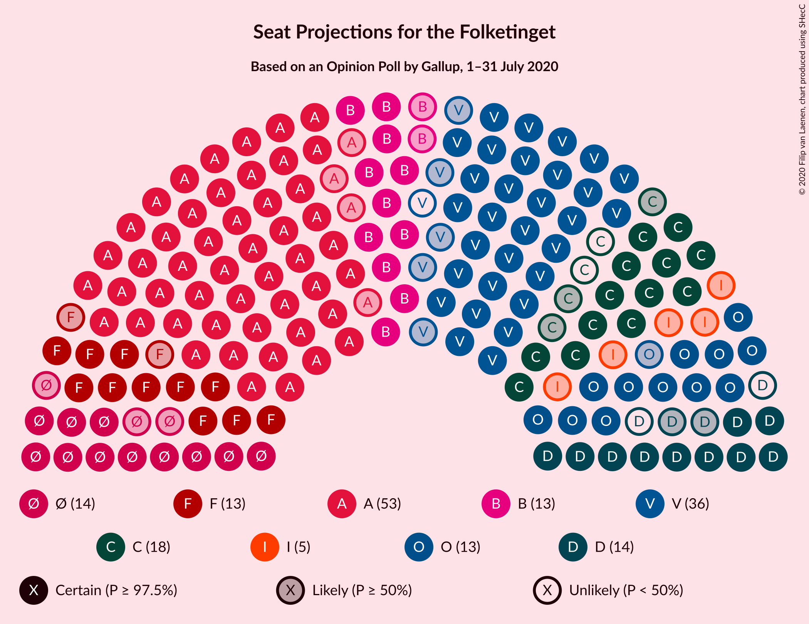

# Opinion Poll by Gallup, 1–31 July 2020

<a href="#voting-intentions">Voting Intentions</a> | <a href="#seats">Seats</a> | <a href="#coalitions">Coalitions</a> | <a href="#technical-information">Technical Information</a>

## Voting Intentions

### Confidence Intervals

| Party | Last Result | Poll Result | 80% Confidence Interval | 90% Confidence Interval | 95% Confidence Interval | 99% Confidence Interval |
|:-----:|:-----------:|:-----------:|:-----------------------:|:-----------------------:|:-----------------------:|:-----------------------:|
| Socialdemokraterne | 25.9% | 30.3% | 28.8–31.9% |28.3–32.3% |28.0–32.7% |27.3–33.4% |
| Venstre | 23.4% | 19.0% | 17.7–20.3% |17.3–20.7% |17.0–21.1% |16.5–21.7% |
| Det Konservative Folkeparti | 6.6% | 9.1% | 8.2–10.1% |7.9–10.4% |7.7–10.7% |7.3–11.2% |
| Dansk Folkeparti | 8.7% | 7.6% | 6.8–8.6% |6.5–8.8% |6.3–9.1% |6.0–9.5% |
| Socialistisk Folkeparti | 7.7% | 7.6% | 6.8–8.6% |6.5–8.8% |6.3–9.1% |6.0–9.5% |
| Enhedslisten–De Rød-Grønne | 6.9% | 7.5% | 6.7–8.5% |6.5–8.7% |6.3–9.0% |5.9–9.5% |
| Radikale Venstre | 8.6% | 7.5% | 6.7–8.5% |6.5–8.7% |6.3–9.0% |5.9–9.5% |
| Nye Borgerlige | 2.4% | 6.5% | 5.7–7.4% |5.5–7.7% |5.3–7.9% |5.0–8.3% |
| Liberal Alliance | 2.3% | 2.4% | 1.9–3.0% |1.8–3.1% |1.7–3.3% |1.5–3.6% |
| Stram Kurs | 1.8% | 0.5% | 0.3–0.8% |0.3–0.9% |0.2–1.0% |0.2–1.2% |
| Alternativet | 3.0% | 0.4% | 0.3–0.7% |0.2–0.8% |0.2–0.9% |0.1–1.1% |

*Note:* The poll result column reflects the actual value used in the calculations. Published results may vary slightly, and in addition be rounded to fewer digits.

## Seats

### Confidence Intervals

| Party | Last Result | Median | 80% Confidence Interval | 90% Confidence Interval | 95% Confidence Interval | 99% Confidence Interval |
|:-----:|:-----------:|:------:|:-----------------------:|:-----------------------:|:-----------------------:|:-----------------------:|
| <a href="#socialdemokraterne">Socialdemokraterne</a> | 48 | 53 | 50–57 |50–58 |49–59 |48–59 |
| <a href="#venstre">Venstre</a> | 43 | 35 | 31–37 |31–37 |30–38 |30–38 |
| <a href="#det-konservative-folkeparti">Det Konservative Folkeparti</a> | 12 | 16 | 15–18 |14–18 |13–19 |13–20 |
| <a href="#dansk-folkeparti">Dansk Folkeparti</a> | 16 | 13 | 12–15 |12–15 |12–16 |11–17 |
| <a href="#socialistisk-folkeparti">Socialistisk Folkeparti</a> | 14 | 13 | 12–15 |11–16 |11–17 |11–17 |
| <a href="#enhedslisten–de-rød-grønne">Enhedslisten–De Rød-Grønne</a> | 13 | 14 | 12–15 |11–15 |11–16 |10–16 |
| <a href="#radikale-venstre">Radikale Venstre</a> | 16 | 13 | 12–15 |12–15 |11–16 |10–17 |
| <a href="#nye-borgerlige">Nye Borgerlige</a> | 4 | 12 | 11–14 |10–14 |10–14 |9–15 |
| <a href="#liberal-alliance">Liberal Alliance</a> | 4 | 5 | 0–5 |0–6 |0–6 |0–6 |
| <a href="#stram-kurs">Stram Kurs</a> | 0 | 0 | 0 |0 |0 |0 |
| <a href="#alternativet">Alternativet</a> | 5 | 0 | 0 |0 |0 |0 |

### Socialdemokraterne

*For a full overview of the results for this party, see the [Socialdemokraterne](party-socialdemokraterne.html) page.*

| Number of Seats | Probability | Accumulated | Special Marks |
|:---------------:|:-----------:|:-----------:|:-------------:|
| 47 | 0.2% | 100% |  |
| 48 | 0.4% | 99.8% | Last Result |
| 49 | 3% | 99.4% |  |
| 50 | 23% | 97% |  |
| 51 | 4% | 74% |  |
| 52 | 9% | 69% |  |
| 53 | 18% | 60% | Median |
| 54 | 6% | 41% |  |
| 55 | 8% | 35% |  |
| 56 | 13% | 27% |  |
| 57 | 7% | 14% |  |
| 58 | 2% | 7% |  |
| 59 | 4% | 5% |  |
| 60 | 0.1% | 0.4% |  |
| 61 | 0.2% | 0.4% |  |
| 62 | 0.1% | 0.1% |  |
| 63 | 0% | 0% |  |

### Venstre

*For a full overview of the results for this party, see the [Venstre](party-venstre.html) page.*

| Number of Seats | Probability | Accumulated | Special Marks |
|:---------------:|:-----------:|:-----------:|:-------------:|
| 28 | 0.1% | 100% |  |
| 29 | 0.3% | 99.9% |  |
| 30 | 4% | 99.6% |  |
| 31 | 6% | 95% |  |
| 32 | 7% | 89% |  |
| 33 | 19% | 82% |  |
| 34 | 8% | 63% |  |
| 35 | 15% | 55% | Median |
| 36 | 30% | 41% |  |
| 37 | 7% | 10% |  |
| 38 | 3% | 4% |  |
| 39 | 0.1% | 0.3% |  |
| 40 | 0.1% | 0.2% |  |
| 41 | 0% | 0% |  |
| 42 | 0% | 0% |  |
| 43 | 0% | 0% | Last Result |

### Det Konservative Folkeparti

*For a full overview of the results for this party, see the [Det Konservative Folkeparti](party-detkonservativefolkeparti.html) page.*

| Number of Seats | Probability | Accumulated | Special Marks |
|:---------------:|:-----------:|:-----------:|:-------------:|
| 12 | 0.2% | 100% | Last Result |
| 13 | 4% | 99.8% |  |
| 14 | 4% | 96% |  |
| 15 | 13% | 91% |  |
| 16 | 29% | 78% | Median |
| 17 | 14% | 49% |  |
| 18 | 31% | 36% |  |
| 19 | 4% | 4% |  |
| 20 | 0.5% | 0.6% |  |
| 21 | 0.1% | 0.1% |  |
| 22 | 0% | 0% |  |

### Dansk Folkeparti

*For a full overview of the results for this party, see the [Dansk Folkeparti](party-danskfolkeparti.html) page.*

| Number of Seats | Probability | Accumulated | Special Marks |
|:---------------:|:-----------:|:-----------:|:-------------:|
| 10 | 0.5% | 100% |  |
| 11 | 1.4% | 99.5% |  |
| 12 | 14% | 98% |  |
| 13 | 40% | 84% | Median |
| 14 | 19% | 45% |  |
| 15 | 22% | 26% |  |
| 16 | 3% | 4% | Last Result |
| 17 | 1.4% | 2% |  |
| 18 | 0.2% | 0.2% |  |
| 19 | 0% | 0% |  |

### Socialistisk Folkeparti

*For a full overview of the results for this party, see the [Socialistisk Folkeparti](party-socialistiskfolkeparti.html) page.*

| Number of Seats | Probability | Accumulated | Special Marks |
|:---------------:|:-----------:|:-----------:|:-------------:|
| 10 | 0.4% | 100% |  |
| 11 | 8% | 99.6% |  |
| 12 | 8% | 92% |  |
| 13 | 48% | 84% | Median |
| 14 | 20% | 36% | Last Result |
| 15 | 11% | 17% |  |
| 16 | 3% | 5% |  |
| 17 | 2% | 3% |  |
| 18 | 0.2% | 0.2% |  |
| 19 | 0% | 0% |  |

### Enhedslisten–De Rød-Grønne

*For a full overview of the results for this party, see the [Enhedslisten–De Rød-Grønne](party-enhedslisten–derød-grønne.html) page.*

| Number of Seats | Probability | Accumulated | Special Marks |
|:---------------:|:-----------:|:-----------:|:-------------:|
| 10 | 0.5% | 100% |  |
| 11 | 5% | 99.5% |  |
| 12 | 17% | 94% |  |
| 13 | 11% | 77% | Last Result |
| 14 | 55% | 66% | Median |
| 15 | 8% | 11% |  |
| 16 | 2% | 3% |  |
| 17 | 0.3% | 0.5% |  |
| 18 | 0.1% | 0.1% |  |
| 19 | 0% | 0% |  |

### Radikale Venstre

*For a full overview of the results for this party, see the [Radikale Venstre](party-radikalevenstre.html) page.*

| Number of Seats | Probability | Accumulated | Special Marks |
|:---------------:|:-----------:|:-----------:|:-------------:|
| 10 | 0.9% | 100% |  |
| 11 | 4% | 99.1% |  |
| 12 | 27% | 95% |  |
| 13 | 35% | 68% | Median |
| 14 | 20% | 33% |  |
| 15 | 9% | 12% |  |
| 16 | 2% | 3% | Last Result |
| 17 | 0.4% | 0.9% |  |
| 18 | 0.5% | 0.5% |  |
| 19 | 0% | 0% |  |

### Nye Borgerlige

*For a full overview of the results for this party, see the [Nye Borgerlige](party-nyeborgerlige.html) page.*

| Number of Seats | Probability | Accumulated | Special Marks |
|:---------------:|:-----------:|:-----------:|:-------------:|
| 4 | 0% | 100% | Last Result |
| 5 | 0% | 100% |  |
| 6 | 0% | 100% |  |
| 7 | 0% | 100% |  |
| 8 | 0.1% | 100% |  |
| 9 | 2% | 99.9% |  |
| 10 | 7% | 98% |  |
| 11 | 25% | 92% |  |
| 12 | 17% | 67% | Median |
| 13 | 32% | 50% |  |
| 14 | 18% | 18% |  |
| 15 | 0.6% | 0.7% |  |
| 16 | 0.1% | 0.1% |  |
| 17 | 0% | 0% |  |

### Liberal Alliance

*For a full overview of the results for this party, see the [Liberal Alliance](party-liberalalliance.html) page.*

| Number of Seats | Probability | Accumulated | Special Marks |
|:---------------:|:-----------:|:-----------:|:-------------:|
| 0 | 12% | 100% |  |
| 1 | 0% | 88% |  |
| 2 | 0% | 88% |  |
| 3 | 0% | 88% |  |
| 4 | 31% | 88% | Last Result |
| 5 | 51% | 58% | Median |
| 6 | 6% | 6% |  |
| 7 | 0.3% | 0.3% |  |
| 8 | 0% | 0% |  |

### Stram Kurs

*For a full overview of the results for this party, see the [Stram Kurs](party-stramkurs.html) page.*

| Number of Seats | Probability | Accumulated | Special Marks |
|:---------------:|:-----------:|:-----------:|:-------------:|
| 0 | 100% | 100% | Last Result, Median |

### Alternativet

*For a full overview of the results for this party, see the [Alternativet](party-alternativet.html) page.*

| Number of Seats | Probability | Accumulated | Special Marks |
|:---------------:|:-----------:|:-----------:|:-------------:|
| 0 | 100% | 100% | Median |
| 1 | 0% | 0% |  |
| 2 | 0% | 0% |  |
| 3 | 0% | 0% |  |
| 4 | 0% | 0% |  |
| 5 | 0% | 0% | Last Result |

## Coalitions

### Confidence Intervals

| Coalition | Last Result | Median | Majority? | 80% Confidence Interval | 90% Confidence Interval | 95% Confidence Interval | 99% Confidence Interval |
|:---------:|:-----------:|:------:|:---------:|:-----------------------:|:-----------------------:|:-----------------------:|:-----------------------:|
| Socialdemokraterne – Socialistisk Folkeparti – Enhedslisten–De Rød-Grønne – Radikale Venstre – Alternativet | 96 | 93 | 98% | 90–98 | 90–99 | 90–100 | 88–102 |
| Socialdemokraterne – Socialistisk Folkeparti – Enhedslisten–De Rød-Grønne – Radikale Venstre | 91 | 93 | 98% | 90–98 | 90–99 | 90–100 | 88–102 |
| Socialdemokraterne – Socialistisk Folkeparti – Radikale Venstre | 78 | 79 | 0.1% | 76–84 | 76–87 | 76–87 | 75–88 |
| Socialdemokraterne – Socialistisk Folkeparti – Enhedslisten–De Rød-Grønne – Alternativet | 80 | 80 | 0% | 77–84 | 77–85 | 76–86 | 74–87 |
| Socialdemokraterne – Socialistisk Folkeparti – Enhedslisten–De Rød-Grønne | 75 | 80 | 0% | 77–84 | 77–85 | 76–86 | 74–87 |
| Venstre – Det Konservative Folkeparti – Dansk Folkeparti – Nye Borgerlige – Liberal Alliance | 79 | 82 | 0% | 76–85 | 76–85 | 75–85 | 73–86 |
| Venstre – Det Konservative Folkeparti – Dansk Folkeparti – Liberal Alliance | 75 | 69 | 0% | 65–72 | 64–73 | 64–73 | 61–73 |
| Socialdemokraterne – Radikale Venstre | 64 | 65 | 0% | 63–70 | 63–73 | 63–73 | 62–74 |
| Venstre – Det Konservative Folkeparti – Liberal Alliance | 59 | 54 | 0% | 51–59 | 51–59 | 50–59 | 48–61 |
| Venstre – Det Konservative Folkeparti | 55 | 51 | 0% | 48–54 | 47–54 | 46–55 | 45–56 |
| Venstre | 43 | 35 | 0% | 31–37 | 31–37 | 30–38 | 30–38 |

### Socialdemokraterne – Socialistisk Folkeparti – Enhedslisten–De Rød-Grønne – Radikale Venstre – Alternativet

| Number of Seats | Probability | Accumulated | Special Marks |
|:---------------:|:-----------:|:-----------:|:-------------:|
| 87 | 0.2% | 100% |  |
| 88 | 0.6% | 99.8% |  |
| 89 | 2% | 99.2% |  |
| 90 | 23% | 98% | Majority |
| 91 | 9% | 75% |  |
| 92 | 16% | 66% |  |
| 93 | 12% | 50% | Median |
| 94 | 4% | 38% |  |
| 95 | 9% | 34% |  |
| 96 | 7% | 25% | Last Result |
| 97 | 7% | 18% |  |
| 98 | 4% | 11% |  |
| 99 | 5% | 8% |  |
| 100 | 1.0% | 3% |  |
| 101 | 1.3% | 2% |  |
| 102 | 0.4% | 0.5% |  |
| 103 | 0.1% | 0.2% |  |
| 104 | 0.1% | 0.1% |  |
| 105 | 0% | 0% |  |

### Socialdemokraterne – Socialistisk Folkeparti – Enhedslisten–De Rød-Grønne – Radikale Venstre

| Number of Seats | Probability | Accumulated | Special Marks |
|:---------------:|:-----------:|:-----------:|:-------------:|
| 87 | 0.2% | 100% |  |
| 88 | 0.6% | 99.8% |  |
| 89 | 2% | 99.2% |  |
| 90 | 23% | 98% | Majority |
| 91 | 9% | 75% | Last Result |
| 92 | 16% | 66% |  |
| 93 | 12% | 50% | Median |
| 94 | 4% | 38% |  |
| 95 | 9% | 34% |  |
| 96 | 7% | 25% |  |
| 97 | 7% | 18% |  |
| 98 | 4% | 11% |  |
| 99 | 5% | 8% |  |
| 100 | 1.0% | 3% |  |
| 101 | 1.3% | 2% |  |
| 102 | 0.4% | 0.5% |  |
| 103 | 0.1% | 0.2% |  |
| 104 | 0.1% | 0.1% |  |
| 105 | 0% | 0% |  |

### Socialdemokraterne – Socialistisk Folkeparti – Radikale Venstre

| Number of Seats | Probability | Accumulated | Special Marks |
|:---------------:|:-----------:|:-----------:|:-------------:|
| 73 | 0% | 100% |  |
| 74 | 0.2% | 99.9% |  |
| 75 | 0.5% | 99.7% |  |
| 76 | 22% | 99.1% |  |
| 77 | 7% | 77% |  |
| 78 | 17% | 70% | Last Result |
| 79 | 9% | 52% | Median |
| 80 | 6% | 44% |  |
| 81 | 7% | 38% |  |
| 82 | 4% | 31% |  |
| 83 | 10% | 27% |  |
| 84 | 7% | 17% |  |
| 85 | 3% | 9% |  |
| 86 | 0.7% | 7% |  |
| 87 | 5% | 6% |  |
| 88 | 0.9% | 1.4% |  |
| 89 | 0.4% | 0.5% |  |
| 90 | 0% | 0.1% | Majority |
| 91 | 0% | 0.1% |  |
| 92 | 0.1% | 0.1% |  |
| 93 | 0% | 0% |  |

### Socialdemokraterne – Socialistisk Folkeparti – Enhedslisten–De Rød-Grønne – Alternativet

| Number of Seats | Probability | Accumulated | Special Marks |
|:---------------:|:-----------:|:-----------:|:-------------:|
| 73 | 0.1% | 100% |  |
| 74 | 1.0% | 99.9% |  |
| 75 | 0.7% | 98.9% |  |
| 76 | 1.2% | 98% |  |
| 77 | 25% | 97% |  |
| 78 | 5% | 72% |  |
| 79 | 4% | 66% |  |
| 80 | 19% | 62% | Last Result, Median |
| 81 | 13% | 43% |  |
| 82 | 7% | 30% |  |
| 83 | 9% | 23% |  |
| 84 | 5% | 14% |  |
| 85 | 7% | 9% |  |
| 86 | 2% | 3% |  |
| 87 | 0.3% | 0.7% |  |
| 88 | 0.3% | 0.4% |  |
| 89 | 0.1% | 0.1% |  |
| 90 | 0% | 0% | Majority |

### Socialdemokraterne – Socialistisk Folkeparti – Enhedslisten–De Rød-Grønne

| Number of Seats | Probability | Accumulated | Special Marks |
|:---------------:|:-----------:|:-----------:|:-------------:|
| 73 | 0.1% | 100% |  |
| 74 | 1.0% | 99.9% |  |
| 75 | 0.7% | 98.9% | Last Result |
| 76 | 1.2% | 98% |  |
| 77 | 25% | 97% |  |
| 78 | 5% | 72% |  |
| 79 | 4% | 66% |  |
| 80 | 19% | 62% | Median |
| 81 | 13% | 43% |  |
| 82 | 7% | 30% |  |
| 83 | 9% | 23% |  |
| 84 | 5% | 14% |  |
| 85 | 7% | 9% |  |
| 86 | 2% | 3% |  |
| 87 | 0.3% | 0.7% |  |
| 88 | 0.3% | 0.4% |  |
| 89 | 0.1% | 0.1% |  |
| 90 | 0% | 0% | Majority |

### Venstre – Det Konservative Folkeparti – Dansk Folkeparti – Nye Borgerlige – Liberal Alliance

| Number of Seats | Probability | Accumulated | Special Marks |
|:---------------:|:-----------:|:-----------:|:-------------:|
| 71 | 0.1% | 100% |  |
| 72 | 0.1% | 99.9% |  |
| 73 | 0.5% | 99.8% |  |
| 74 | 1.5% | 99.3% |  |
| 75 | 2% | 98% |  |
| 76 | 9% | 95% |  |
| 77 | 6% | 87% |  |
| 78 | 12% | 81% |  |
| 79 | 7% | 69% | Last Result |
| 80 | 7% | 62% |  |
| 81 | 3% | 55% | Median |
| 82 | 8% | 52% |  |
| 83 | 15% | 44% |  |
| 84 | 7% | 30% |  |
| 85 | 22% | 22% |  |
| 86 | 0.3% | 0.7% |  |
| 87 | 0.4% | 0.4% |  |
| 88 | 0% | 0% |  |

### Venstre – Det Konservative Folkeparti – Dansk Folkeparti – Liberal Alliance

| Number of Seats | Probability | Accumulated | Special Marks |
|:---------------:|:-----------:|:-----------:|:-------------:|
| 59 | 0% | 100% |  |
| 60 | 0.1% | 99.9% |  |
| 61 | 0.5% | 99.8% |  |
| 62 | 0.8% | 99.4% |  |
| 63 | 1.0% | 98.6% |  |
| 64 | 5% | 98% |  |
| 65 | 9% | 93% |  |
| 66 | 10% | 84% |  |
| 67 | 10% | 73% |  |
| 68 | 5% | 63% |  |
| 69 | 21% | 58% | Median |
| 70 | 7% | 38% |  |
| 71 | 1.4% | 31% |  |
| 72 | 24% | 29% |  |
| 73 | 5% | 6% |  |
| 74 | 0.3% | 0.5% |  |
| 75 | 0% | 0.1% | Last Result |
| 76 | 0.1% | 0.1% |  |
| 77 | 0% | 0% |  |

### Socialdemokraterne – Radikale Venstre

| Number of Seats | Probability | Accumulated | Special Marks |
|:---------------:|:-----------:|:-----------:|:-------------:|
| 60 | 0.1% | 100% |  |
| 61 | 0.1% | 99.9% |  |
| 62 | 0.6% | 99.8% |  |
| 63 | 24% | 99.1% |  |
| 64 | 7% | 75% | Last Result |
| 65 | 22% | 68% |  |
| 66 | 6% | 46% | Median |
| 67 | 4% | 40% |  |
| 68 | 7% | 37% |  |
| 69 | 6% | 29% |  |
| 70 | 14% | 23% |  |
| 71 | 3% | 10% |  |
| 72 | 1.0% | 6% |  |
| 73 | 4% | 5% |  |
| 74 | 0.4% | 0.9% |  |
| 75 | 0.3% | 0.5% |  |
| 76 | 0.2% | 0.2% |  |
| 77 | 0% | 0% |  |

### Venstre – Det Konservative Folkeparti – Liberal Alliance

| Number of Seats | Probability | Accumulated | Special Marks |
|:---------------:|:-----------:|:-----------:|:-------------:|
| 45 | 0% | 100% |  |
| 46 | 0.1% | 99.9% |  |
| 47 | 0.2% | 99.9% |  |
| 48 | 0.4% | 99.7% |  |
| 49 | 1.3% | 99.3% |  |
| 50 | 1.4% | 98% |  |
| 51 | 7% | 97% |  |
| 52 | 10% | 90% |  |
| 53 | 10% | 80% |  |
| 54 | 24% | 70% |  |
| 55 | 8% | 47% |  |
| 56 | 3% | 38% | Median |
| 57 | 5% | 35% |  |
| 58 | 6% | 30% |  |
| 59 | 22% | 24% | Last Result |
| 60 | 0.2% | 2% |  |
| 61 | 2% | 2% |  |
| 62 | 0% | 0.1% |  |
| 63 | 0% | 0% |  |

### Venstre – Det Konservative Folkeparti

| Number of Seats | Probability | Accumulated | Special Marks |
|:---------------:|:-----------:|:-----------:|:-------------:|
| 44 | 0.3% | 100% |  |
| 45 | 0.4% | 99.7% |  |
| 46 | 2% | 99.3% |  |
| 47 | 6% | 97% |  |
| 48 | 7% | 91% |  |
| 49 | 24% | 84% |  |
| 50 | 7% | 60% |  |
| 51 | 9% | 53% | Median |
| 52 | 10% | 44% |  |
| 53 | 5% | 34% |  |
| 54 | 26% | 29% |  |
| 55 | 2% | 3% | Last Result |
| 56 | 0.5% | 0.7% |  |
| 57 | 0.1% | 0.2% |  |
| 58 | 0.1% | 0.1% |  |
| 59 | 0% | 0% |  |

### Venstre

| Number of Seats | Probability | Accumulated | Special Marks |
|:---------------:|:-----------:|:-----------:|:-------------:|
| 28 | 0.1% | 100% |  |
| 29 | 0.3% | 99.9% |  |
| 30 | 4% | 99.6% |  |
| 31 | 6% | 95% |  |
| 32 | 7% | 89% |  |
| 33 | 19% | 82% |  |
| 34 | 8% | 63% |  |
| 35 | 15% | 55% | Median |
| 36 | 30% | 41% |  |
| 37 | 7% | 10% |  |
| 38 | 3% | 4% |  |
| 39 | 0.1% | 0.3% |  |
| 40 | 0.1% | 0.2% |  |
| 41 | 0% | 0% |  |
| 42 | 0% | 0% |  |
| 43 | 0% | 0% | Last Result |

## Technical Information

### Opinion Poll

+ **Polling firm:** Gallup
+ **Commissioner(s):** —
+ **Fieldwork period:** 1–31 July 2020

### Calculations

+ **Sample size:** 1476
+ **Simulations done:** 1,048,576
+ **Error estimate:** 1.71%

