# Opinion Poll by Voxmeter for Ritzau, 3–8 August 2020

<a href="#voting-intentions">Voting Intentions</a> | <a href="#seats">Seats</a> | <a href="#coalitions">Coalitions</a> | <a href="#technical-information">Technical Information</a>

## Voting Intentions

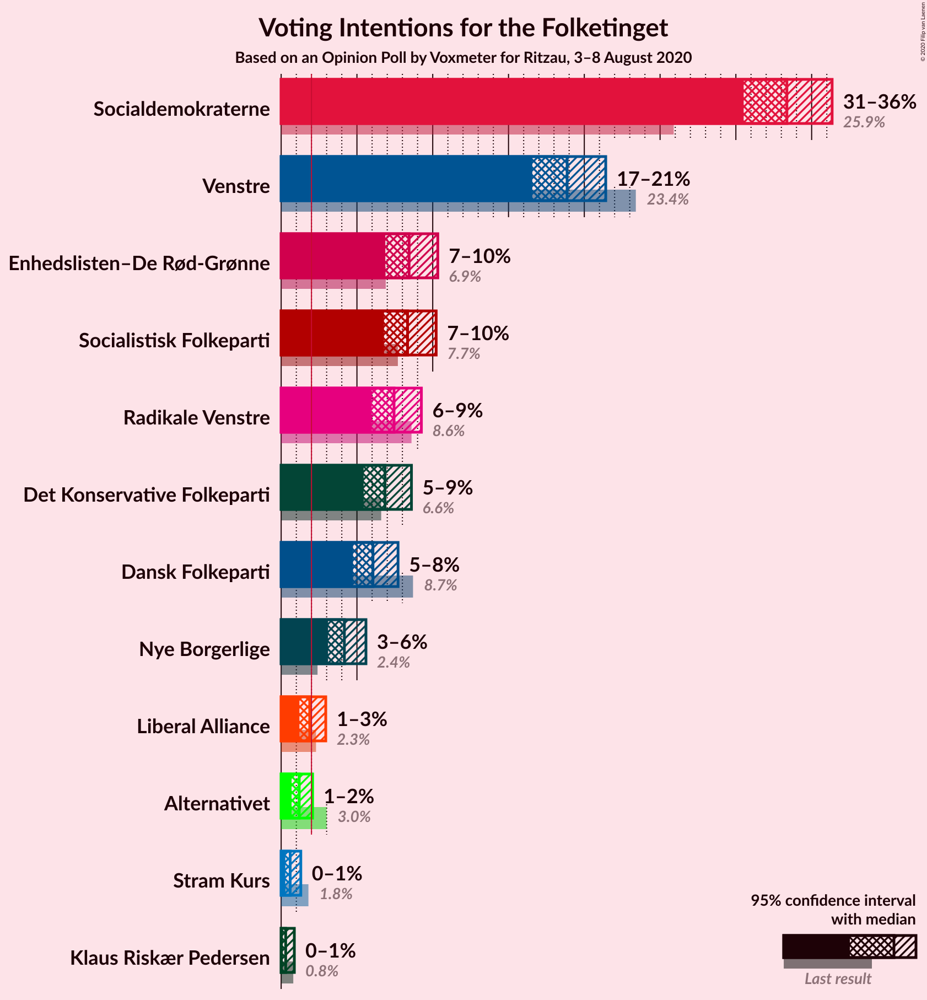

### Confidence Intervals

| Party | Last Result | Poll Result | 80% Confidence Interval | 90% Confidence Interval | 95% Confidence Interval | 99% Confidence Interval |
|:-----:|:-----------:|:-----------:|:-----------------------:|:-----------------------:|:-----------------------:|:-----------------------:|
| Socialdemokraterne | 25.9% | 33.4% | 31.5–35.3% |31.0–35.9% |30.5–36.4% |29.6–37.3% |
| Venstre | 23.4% | 18.9% | 17.4–20.5% |16.9–21.0% |16.6–21.4% |15.9–22.2% |
| Enhedslisten–De Rød-Grønne | 6.9% | 8.4% | 7.4–9.7% |7.1–10.0% |6.9–10.3% |6.4–10.9% |
| Socialistisk Folkeparti | 7.7% | 8.3% | 7.3–9.6% |7.0–9.9% |6.8–10.2% |6.3–10.8% |
| Radikale Venstre | 8.6% | 7.4% | 6.5–8.6% |6.2–8.9% |6.0–9.3% |5.5–9.8% |
| Det Konservative Folkeparti | 6.6% | 6.9% | 5.9–8.0% |5.7–8.3% |5.4–8.6% |5.0–9.2% |
| Dansk Folkeparti | 8.7% | 6.1% | 5.2–7.1% |4.9–7.4% |4.7–7.7% |4.4–8.3% |
| Nye Borgerlige | 2.4% | 4.2% | 3.5–5.1% |3.3–5.4% |3.1–5.6% |2.8–6.1% |
| Liberal Alliance | 2.3% | 1.9% | 1.4–2.6% |1.3–2.8% |1.2–2.9% |1.0–3.3% |
| Alternativet | 3.0% | 1.2% | 0.9–1.8% |0.8–1.9% |0.7–2.1% |0.5–2.4% |
| Stram Kurs | 1.8% | 0.6% | 0.4–1.1% |0.3–1.2% |0.3–1.3% |0.2–1.6% |
| Klaus Riskær Pedersen | 0.8% | 0.3% | 0.2–0.7% |0.1–0.8% |0.1–0.9% |0.1–1.1% |

*Note:* The poll result column reflects the actual value used in the calculations. Published results may vary slightly, and in addition be rounded to fewer digits.

## Seats

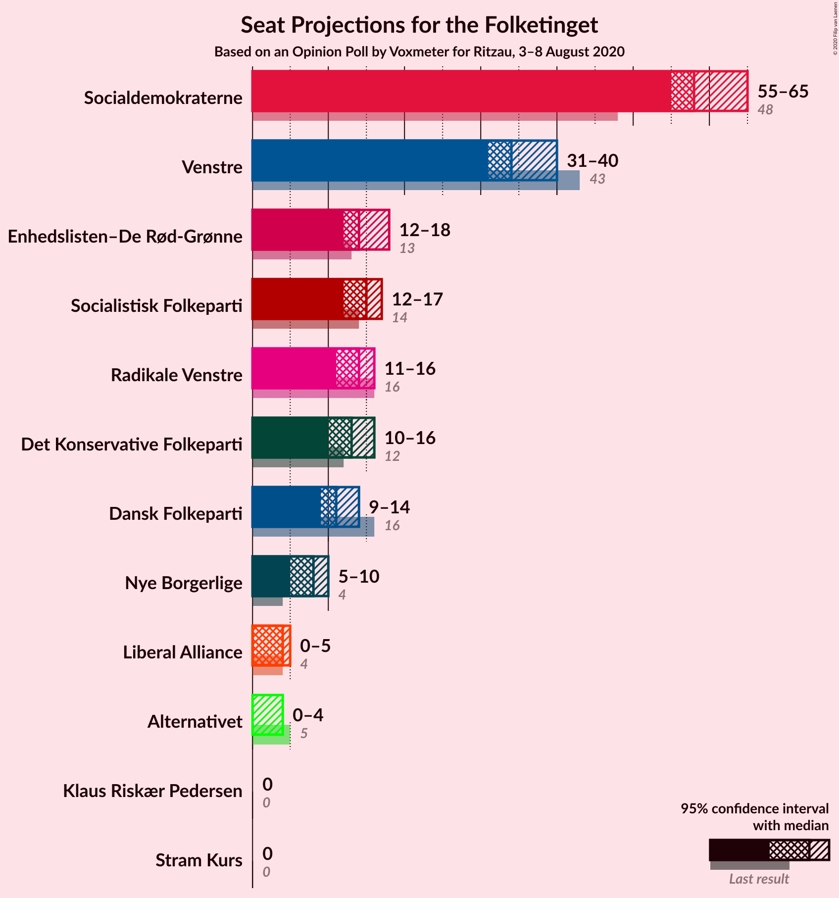

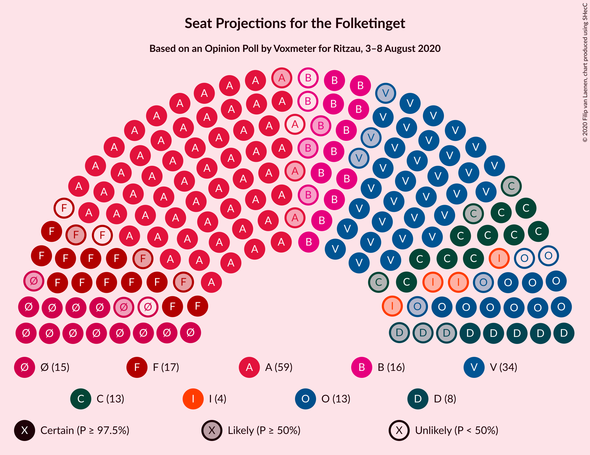

### Confidence Intervals

| Party | Last Result | Median | 80% Confidence Interval | 90% Confidence Interval | 95% Confidence Interval | 99% Confidence Interval |
|:-----:|:-----------:|:------:|:-----------------------:|:-----------------------:|:-----------------------:|:-----------------------:|
| <a href="#socialdemokraterne">Socialdemokraterne</a> | 48 | 58 | 56–63 |56–63 |55–65 |53–67 |
| <a href="#venstre">Venstre</a> | 43 | 34 | 32–36 |31–40 |31–40 |28–40 |
| <a href="#enhedslisten–de-rød-grønne">Enhedslisten–De Rød-Grønne</a> | 13 | 14 | 12–16 |12–17 |12–18 |12–20 |
| <a href="#socialistisk-folkeparti">Socialistisk Folkeparti</a> | 14 | 15 | 13–17 |12–17 |12–17 |12–19 |
| <a href="#radikale-venstre">Radikale Venstre</a> | 16 | 14 | 11–16 |11–16 |11–16 |10–17 |
| <a href="#det-konservative-folkeparti">Det Konservative Folkeparti</a> | 12 | 13 | 11–15 |11–15 |10–16 |9–16 |
| <a href="#dansk-folkeparti">Dansk Folkeparti</a> | 16 | 11 | 10–13 |10–13 |9–14 |8–15 |
| <a href="#nye-borgerlige">Nye Borgerlige</a> | 4 | 8 | 7–10 |6–10 |5–10 |5–11 |
| <a href="#liberal-alliance">Liberal Alliance</a> | 4 | 4 | 0–5 |0–5 |0–5 |0–6 |
| <a href="#alternativet">Alternativet</a> | 5 | 0 | 0 |0 |0–4 |0–4 |
| <a href="#stram-kurs">Stram Kurs</a> | 0 | 0 | 0 |0 |0 |0 |
| <a href="#klaus-riskær-pedersen">Klaus Riskær Pedersen</a> | 0 | 0 | 0 |0 |0 |0 |

### Socialdemokraterne

*For a full overview of the results for this party, see the [Socialdemokraterne](party-socialdemokraterne.html) page.*

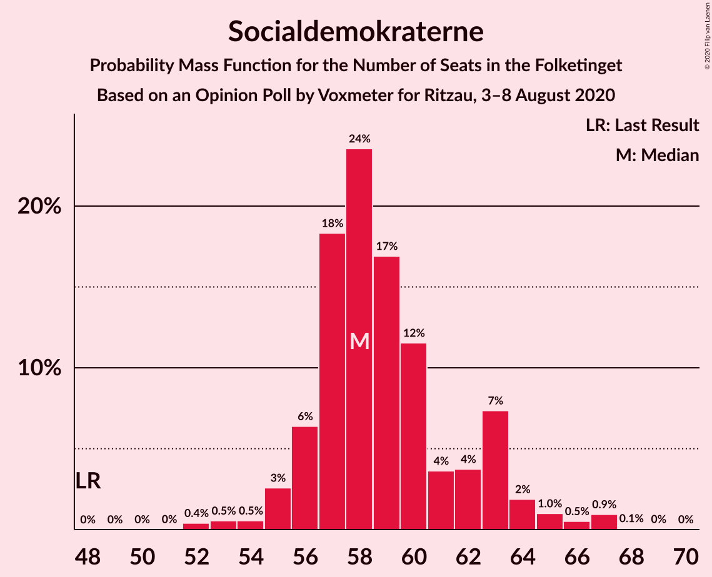

| Number of Seats | Probability | Accumulated | Special Marks |
|:---------------:|:-----------:|:-----------:|:-------------:|
| 48 | 0% | 100% | Last Result |
| 49 | 0% | 100% |  |
| 50 | 0% | 100% |  |
| 51 | 0% | 100% |  |
| 52 | 0.4% | 100% |  |
| 53 | 0.5% | 99.6% |  |
| 54 | 0.5% | 99.0% |  |
| 55 | 3% | 98% |  |
| 56 | 6% | 96% |  |
| 57 | 18% | 90% |  |
| 58 | 24% | 71% | Median |
| 59 | 17% | 48% |  |
| 60 | 12% | 31% |  |
| 61 | 4% | 19% |  |
| 62 | 4% | 16% |  |
| 63 | 7% | 12% |  |
| 64 | 2% | 4% |  |
| 65 | 1.0% | 3% |  |
| 66 | 0.5% | 2% |  |
| 67 | 0.9% | 1.1% |  |
| 68 | 0.1% | 0.1% |  |
| 69 | 0% | 0% |  |

### Venstre

*For a full overview of the results for this party, see the [Venstre](party-venstre.html) page.*

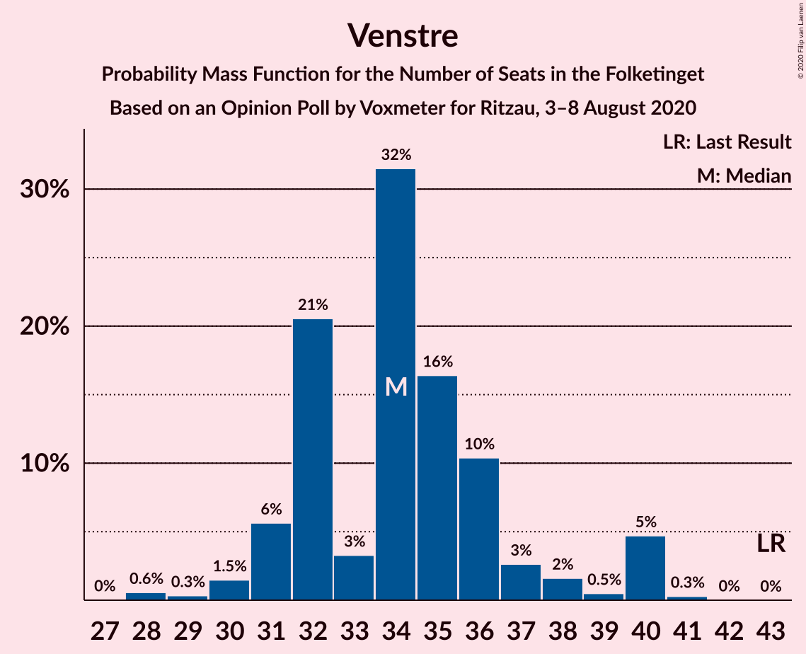

| Number of Seats | Probability | Accumulated | Special Marks |
|:---------------:|:-----------:|:-----------:|:-------------:|
| 27 | 0% | 100% |  |
| 28 | 0.6% | 99.9% |  |
| 29 | 0.3% | 99.4% |  |
| 30 | 1.5% | 99.0% |  |
| 31 | 6% | 98% |  |
| 32 | 21% | 92% |  |
| 33 | 3% | 71% |  |
| 34 | 32% | 68% | Median |
| 35 | 16% | 37% |  |
| 36 | 10% | 20% |  |
| 37 | 3% | 10% |  |
| 38 | 2% | 7% |  |
| 39 | 0.5% | 6% |  |
| 40 | 5% | 5% |  |
| 41 | 0.3% | 0.3% |  |
| 42 | 0% | 0% |  |
| 43 | 0% | 0% | Last Result |

### Enhedslisten–De Rød-Grønne

*For a full overview of the results for this party, see the [Enhedslisten–De Rød-Grønne](party-enhedslisten–derød-grønne.html) page.*

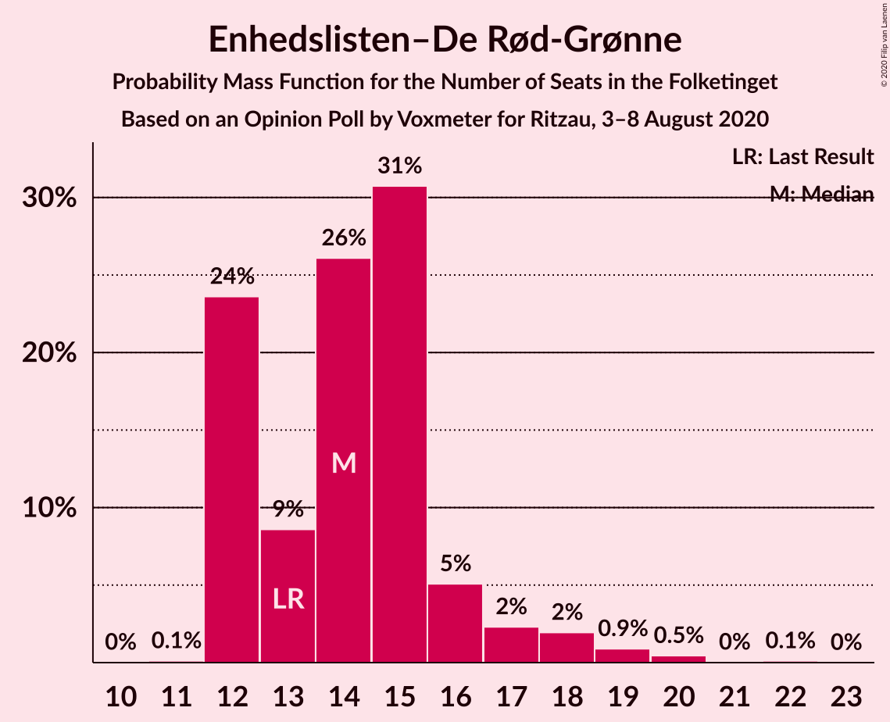

| Number of Seats | Probability | Accumulated | Special Marks |
|:---------------:|:-----------:|:-----------:|:-------------:|
| 11 | 0.1% | 100% |  |
| 12 | 24% | 99.9% |  |
| 13 | 9% | 76% | Last Result |
| 14 | 26% | 68% | Median |
| 15 | 31% | 42% |  |
| 16 | 5% | 11% |  |
| 17 | 2% | 6% |  |
| 18 | 2% | 3% |  |
| 19 | 0.9% | 1.5% |  |
| 20 | 0.5% | 0.6% |  |
| 21 | 0% | 0.1% |  |
| 22 | 0.1% | 0.1% |  |
| 23 | 0% | 0% |  |

### Socialistisk Folkeparti

*For a full overview of the results for this party, see the [Socialistisk Folkeparti](party-socialistiskfolkeparti.html) page.*

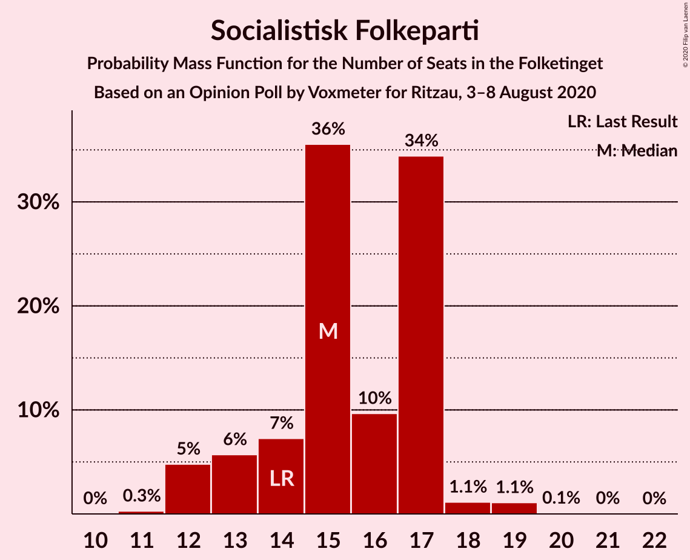

| Number of Seats | Probability | Accumulated | Special Marks |
|:---------------:|:-----------:|:-----------:|:-------------:|
| 11 | 0.3% | 100% |  |
| 12 | 5% | 99.7% |  |
| 13 | 6% | 95% |  |
| 14 | 7% | 89% | Last Result |
| 15 | 36% | 82% | Median |
| 16 | 10% | 46% |  |
| 17 | 34% | 37% |  |
| 18 | 1.1% | 2% |  |
| 19 | 1.1% | 1.2% |  |
| 20 | 0.1% | 0.1% |  |
| 21 | 0% | 0.1% |  |
| 22 | 0% | 0% |  |

### Radikale Venstre

*For a full overview of the results for this party, see the [Radikale Venstre](party-radikalevenstre.html) page.*

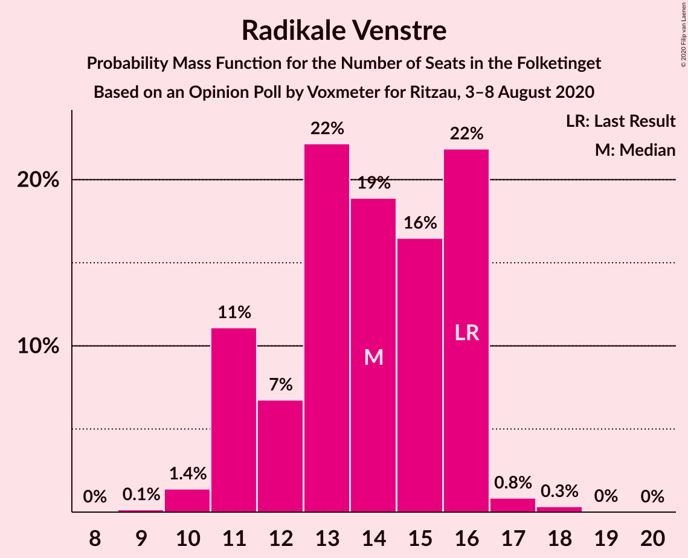

| Number of Seats | Probability | Accumulated | Special Marks |
|:---------------:|:-----------:|:-----------:|:-------------:|
| 9 | 0.1% | 100% |  |
| 10 | 1.4% | 99.9% |  |
| 11 | 11% | 98% |  |
| 12 | 7% | 87% |  |
| 13 | 22% | 81% |  |
| 14 | 19% | 58% | Median |
| 15 | 16% | 40% |  |
| 16 | 22% | 23% | Last Result |
| 17 | 0.8% | 1.2% |  |
| 18 | 0.3% | 0.4% |  |
| 19 | 0% | 0.1% |  |
| 20 | 0% | 0% |  |

### Det Konservative Folkeparti

*For a full overview of the results for this party, see the [Det Konservative Folkeparti](party-detkonservativefolkeparti.html) page.*

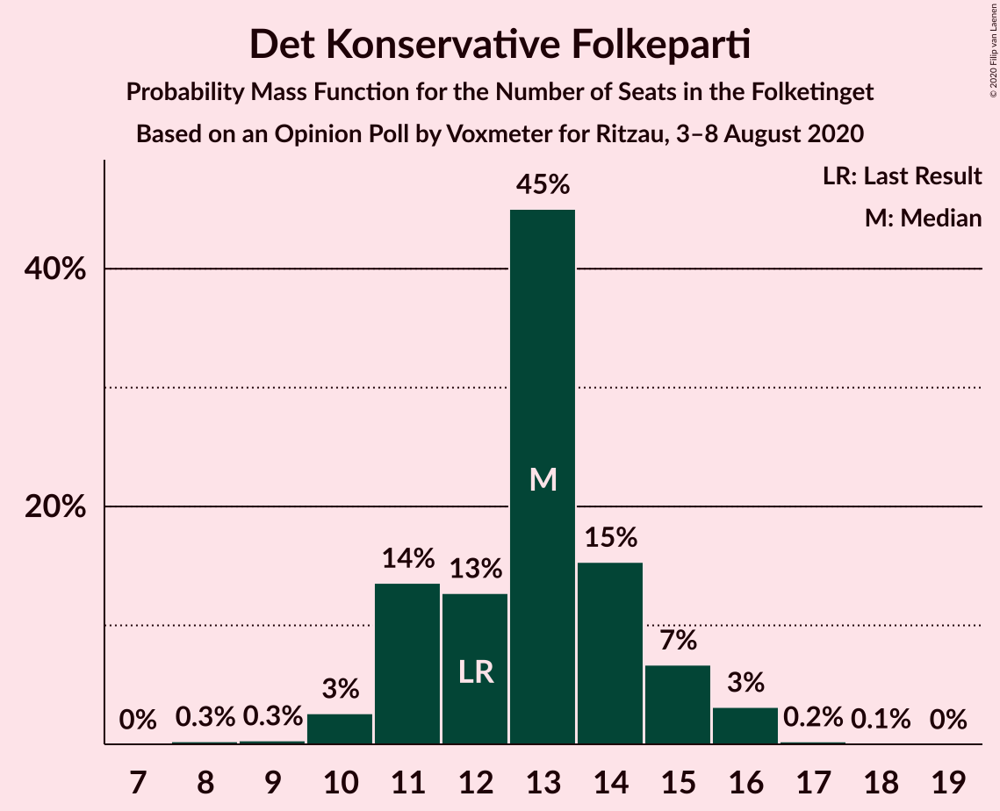

| Number of Seats | Probability | Accumulated | Special Marks |
|:---------------:|:-----------:|:-----------:|:-------------:|
| 8 | 0.3% | 100% |  |
| 9 | 0.3% | 99.7% |  |
| 10 | 3% | 99.4% |  |
| 11 | 14% | 97% |  |
| 12 | 13% | 83% | Last Result |
| 13 | 45% | 71% | Median |
| 14 | 15% | 25% |  |
| 15 | 7% | 10% |  |
| 16 | 3% | 3% |  |
| 17 | 0.2% | 0.3% |  |
| 18 | 0.1% | 0.1% |  |
| 19 | 0% | 0% |  |

### Dansk Folkeparti

*For a full overview of the results for this party, see the [Dansk Folkeparti](party-danskfolkeparti.html) page.*

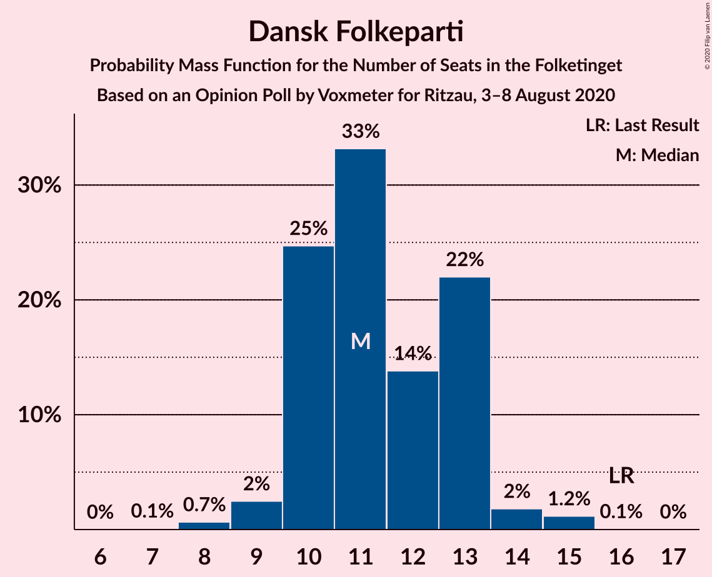

| Number of Seats | Probability | Accumulated | Special Marks |
|:---------------:|:-----------:|:-----------:|:-------------:|
| 7 | 0.1% | 100% |  |
| 8 | 0.7% | 99.9% |  |
| 9 | 2% | 99.2% |  |
| 10 | 25% | 97% |  |
| 11 | 33% | 72% | Median |
| 12 | 14% | 39% |  |
| 13 | 22% | 25% |  |
| 14 | 2% | 3% |  |
| 15 | 1.2% | 1.2% |  |
| 16 | 0.1% | 0.1% | Last Result |
| 17 | 0% | 0% |  |

### Nye Borgerlige

*For a full overview of the results for this party, see the [Nye Borgerlige](party-nyeborgerlige.html) page.*

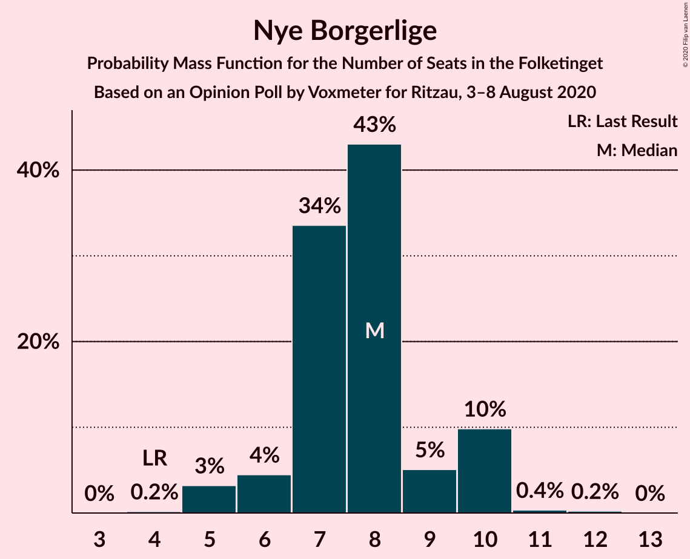

| Number of Seats | Probability | Accumulated | Special Marks |
|:---------------:|:-----------:|:-----------:|:-------------:|
| 4 | 0.2% | 100% | Last Result |
| 5 | 3% | 99.8% |  |
| 6 | 4% | 97% |  |
| 7 | 34% | 92% |  |
| 8 | 43% | 59% | Median |
| 9 | 5% | 16% |  |
| 10 | 10% | 10% |  |
| 11 | 0.4% | 0.6% |  |
| 12 | 0.2% | 0.2% |  |
| 13 | 0% | 0% |  |

### Liberal Alliance

*For a full overview of the results for this party, see the [Liberal Alliance](party-liberalalliance.html) page.*

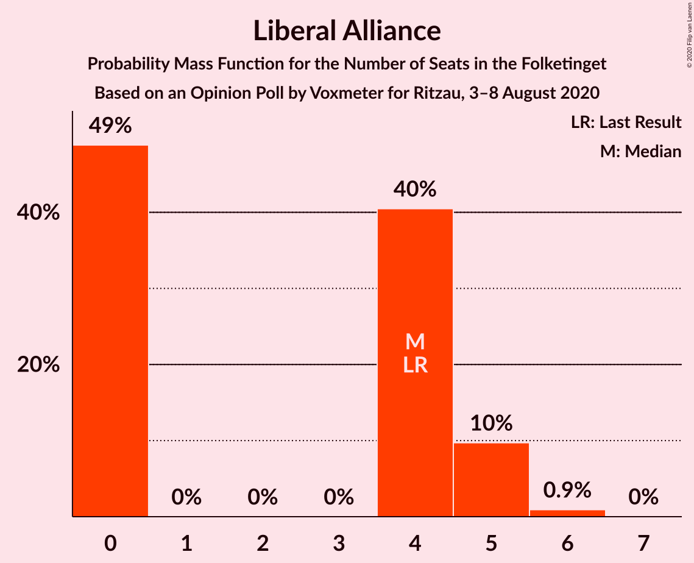

| Number of Seats | Probability | Accumulated | Special Marks |
|:---------------:|:-----------:|:-----------:|:-------------:|
| 0 | 49% | 100% |  |
| 1 | 0% | 51% |  |
| 2 | 0% | 51% |  |
| 3 | 0% | 51% |  |
| 4 | 40% | 51% | Last Result, Median |
| 5 | 10% | 11% |  |
| 6 | 0.9% | 1.0% |  |
| 7 | 0% | 0% |  |

### Alternativet

*For a full overview of the results for this party, see the [Alternativet](party-alternativet.html) page.*

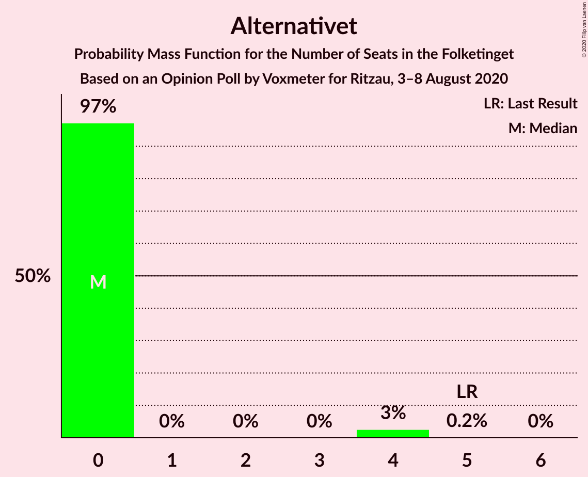

| Number of Seats | Probability | Accumulated | Special Marks |
|:---------------:|:-----------:|:-----------:|:-------------:|
| 0 | 97% | 100% | Median |
| 1 | 0% | 3% |  |
| 2 | 0% | 3% |  |
| 3 | 0% | 3% |  |
| 4 | 3% | 3% |  |
| 5 | 0.2% | 0.2% | Last Result |
| 6 | 0% | 0% |  |

### Stram Kurs

*For a full overview of the results for this party, see the [Stram Kurs](party-stramkurs.html) page.*

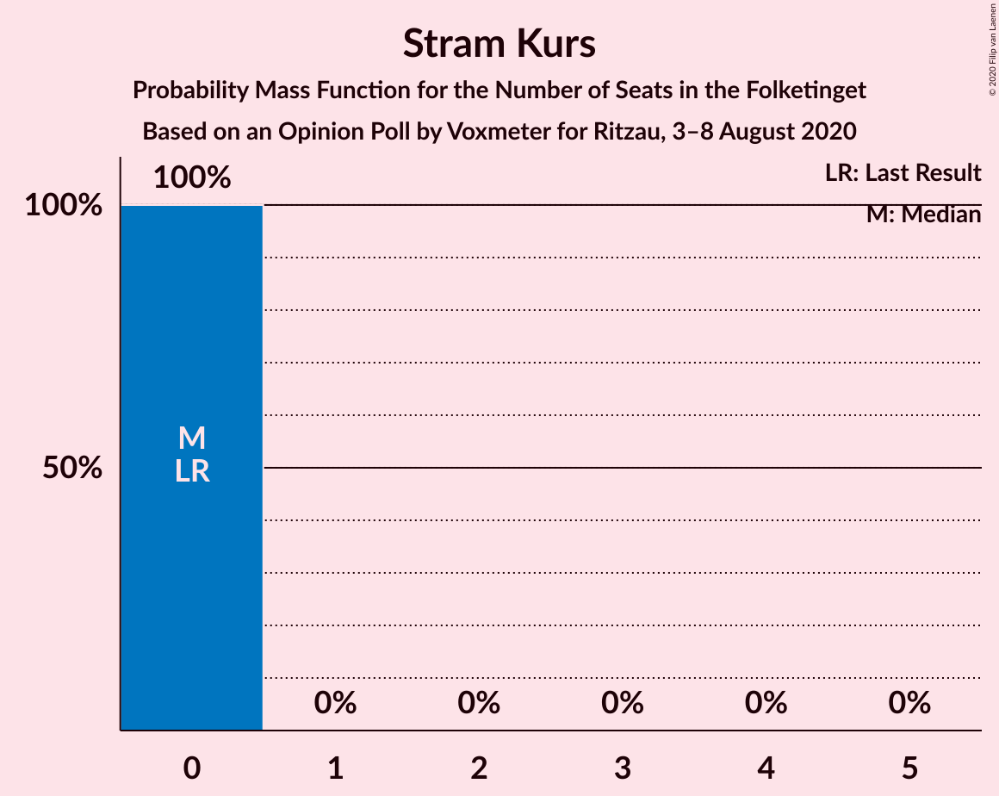

| Number of Seats | Probability | Accumulated | Special Marks |
|:---------------:|:-----------:|:-----------:|:-------------:|
| 0 | 100% | 100% | Last Result, Median |

### Klaus Riskær Pedersen

*For a full overview of the results for this party, see the [Klaus Riskær Pedersen](party-klausriskærpedersen.html) page.*

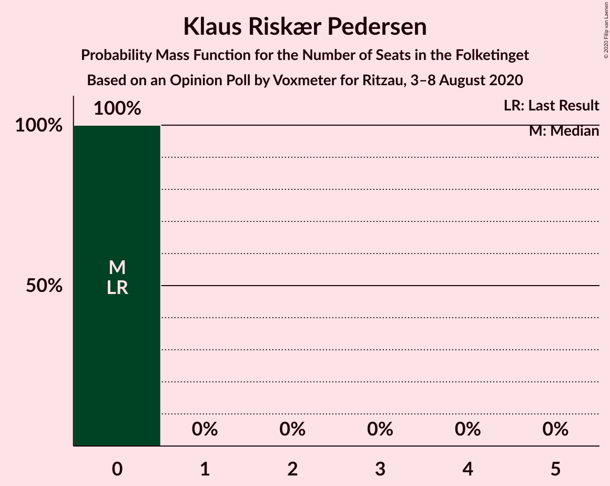

| Number of Seats | Probability | Accumulated | Special Marks |
|:---------------:|:-----------:|:-----------:|:-------------:|
| 0 | 100% | 100% | Last Result, Median |

## Coalitions

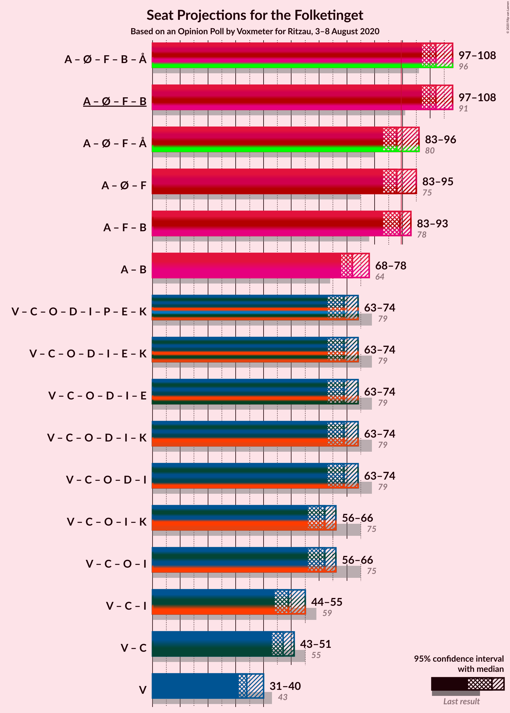

### Confidence Intervals

| Coalition | Last Result | Median | Majority? | 80% Confidence Interval | 90% Confidence Interval | 95% Confidence Interval | 99% Confidence Interval |
|:---------:|:-----------:|:------:|:---------:|:-----------------------:|:-----------------------:|:-----------------------:|:-----------------------:|
| Socialdemokraterne – Enhedslisten–De Rød-Grønne – Socialistisk Folkeparti – Radikale Venstre – Alternativet | 96 | 102 | 100% | 99–106 | 99–107 | 97–108 | 96–112 |
| Socialdemokraterne – Enhedslisten–De Rød-Grønne – Socialistisk Folkeparti – Radikale Venstre | 91 | 102 | 100% | 99–106 | 99–107 | 97–108 | 96–112 |
| Socialdemokraterne – Enhedslisten–De Rød-Grønne – Socialistisk Folkeparti – Alternativet | 80 | 88 | 39% | 85–92 | 85–93 | 83–96 | 82–98 |
| Socialdemokraterne – Enhedslisten–De Rød-Grønne – Socialistisk Folkeparti | 75 | 88 | 37% | 85–92 | 85–93 | 83–95 | 82–98 |
| Socialdemokraterne – Socialistisk Folkeparti – Radikale Venstre | 78 | 89 | 21% | 84–92 | 84–93 | 83–93 | 81–98 |
| Socialdemokraterne – Radikale Venstre | 64 | 72 | 0% | 69–77 | 68–78 | 68–78 | 66–81 |
| Venstre – Det Konservative Folkeparti – Dansk Folkeparti – Nye Borgerlige – Liberal Alliance – Klaus Riskær Pedersen | 79 | 69 | 0% | 64–71 | 64–72 | 63–74 | 61–75 |
| Venstre – Det Konservative Folkeparti – Dansk Folkeparti – Nye Borgerlige – Liberal Alliance | 79 | 69 | 0% | 64–71 | 64–72 | 63–74 | 61–75 |
| Venstre – Det Konservative Folkeparti – Dansk Folkeparti – Liberal Alliance | 75 | 62 | 0% | 57–64 | 57–64 | 56–66 | 53–67 |
| Venstre – Det Konservative Folkeparti – Liberal Alliance | 59 | 49 | 0% | 45–52 | 44–54 | 44–55 | 42–57 |
| Venstre – Det Konservative Folkeparti | 55 | 47 | 0% | 44–50 | 44–51 | 43–51 | 40–53 |
| Venstre | 43 | 34 | 0% | 32–36 | 31–40 | 31–40 | 28–40 |

### Socialdemokraterne – Enhedslisten–De Rød-Grønne – Socialistisk Folkeparti – Radikale Venstre – Alternativet

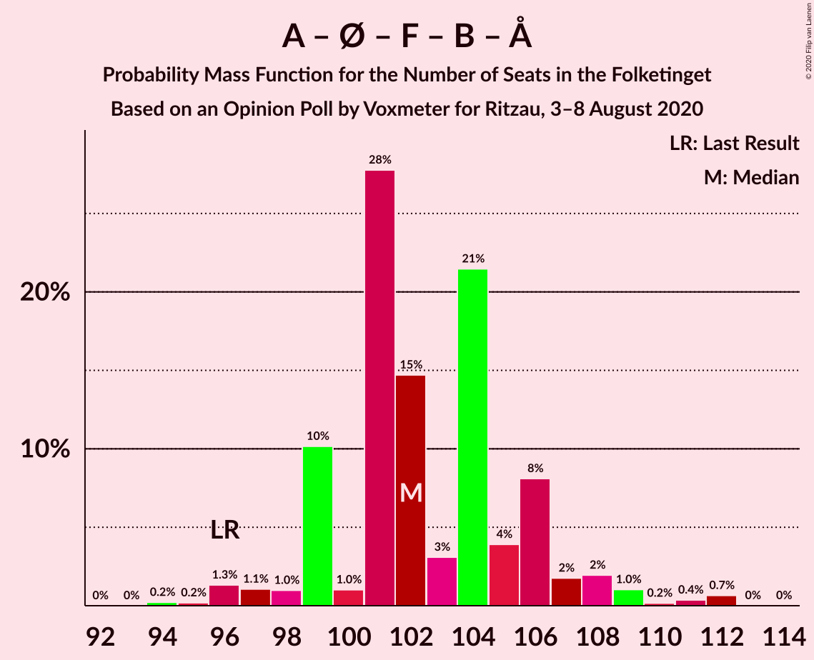

| Number of Seats | Probability | Accumulated | Special Marks |
|:---------------:|:-----------:|:-----------:|:-------------:|
| 94 | 0.2% | 100% |  |
| 95 | 0.2% | 99.8% |  |
| 96 | 1.3% | 99.6% | Last Result |
| 97 | 1.1% | 98% |  |
| 98 | 1.0% | 97% |  |
| 99 | 10% | 96% |  |
| 100 | 1.0% | 86% |  |
| 101 | 28% | 85% | Median |
| 102 | 15% | 57% |  |
| 103 | 3% | 43% |  |
| 104 | 21% | 39% |  |
| 105 | 4% | 18% |  |
| 106 | 8% | 14% |  |
| 107 | 2% | 6% |  |
| 108 | 2% | 4% |  |
| 109 | 1.0% | 2% |  |
| 110 | 0.2% | 1.2% |  |
| 111 | 0.4% | 1.1% |  |
| 112 | 0.7% | 0.7% |  |
| 113 | 0% | 0% |  |

### Socialdemokraterne – Enhedslisten–De Rød-Grønne – Socialistisk Folkeparti – Radikale Venstre

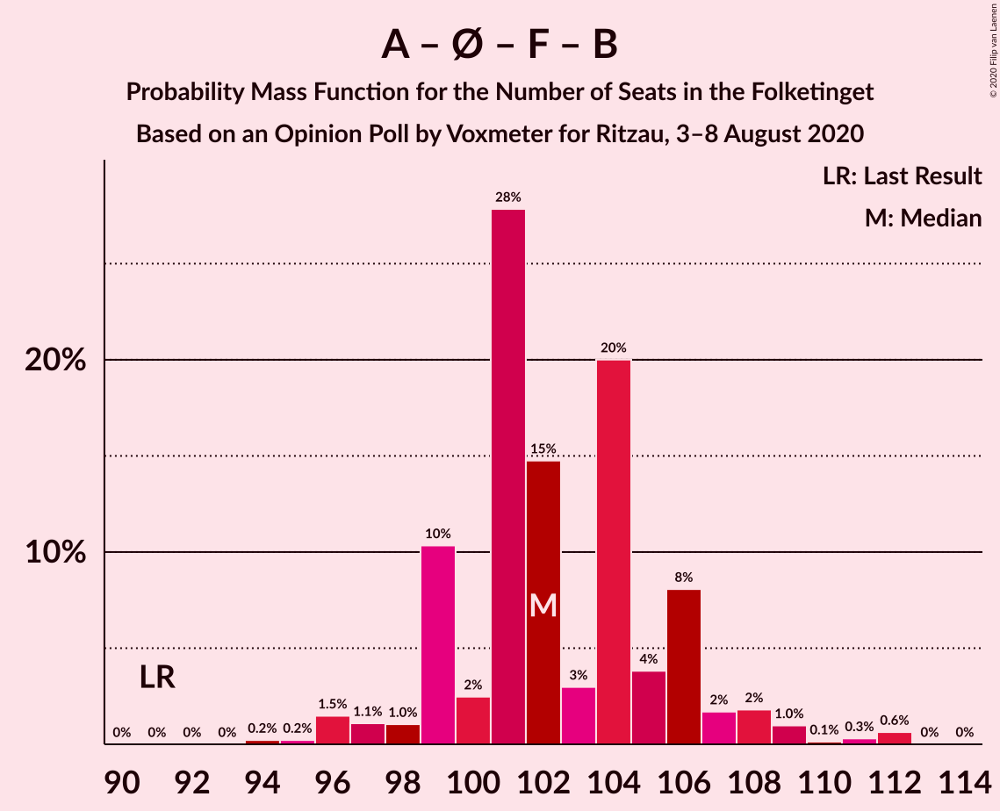

| Number of Seats | Probability | Accumulated | Special Marks |
|:---------------:|:-----------:|:-----------:|:-------------:|
| 91 | 0% | 100% | Last Result |
| 92 | 0% | 100% |  |
| 93 | 0% | 100% |  |
| 94 | 0.2% | 100% |  |
| 95 | 0.2% | 99.8% |  |
| 96 | 1.5% | 99.5% |  |
| 97 | 1.1% | 98% |  |
| 98 | 1.0% | 97% |  |
| 99 | 10% | 96% |  |
| 100 | 2% | 86% |  |
| 101 | 28% | 83% | Median |
| 102 | 15% | 55% |  |
| 103 | 3% | 40% |  |
| 104 | 20% | 38% |  |
| 105 | 4% | 17% |  |
| 106 | 8% | 14% |  |
| 107 | 2% | 6% |  |
| 108 | 2% | 4% |  |
| 109 | 1.0% | 2% |  |
| 110 | 0.1% | 1.1% |  |
| 111 | 0.3% | 1.0% |  |
| 112 | 0.6% | 0.7% |  |
| 113 | 0% | 0% |  |

### Socialdemokraterne – Enhedslisten–De Rød-Grønne – Socialistisk Folkeparti – Alternativet

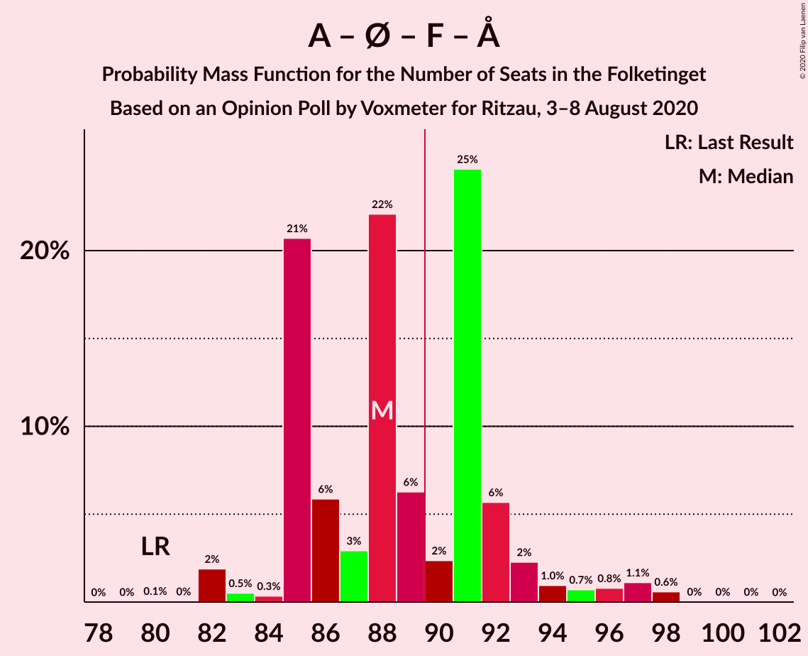

| Number of Seats | Probability | Accumulated | Special Marks |
|:---------------:|:-----------:|:-----------:|:-------------:|
| 80 | 0.1% | 100% | Last Result |
| 81 | 0% | 99.9% |  |
| 82 | 2% | 99.9% |  |
| 83 | 0.5% | 98% |  |
| 84 | 0.3% | 97% |  |
| 85 | 21% | 97% |  |
| 86 | 6% | 76% |  |
| 87 | 3% | 71% | Median |
| 88 | 22% | 68% |  |
| 89 | 6% | 46% |  |
| 90 | 2% | 39% | Majority |
| 91 | 25% | 37% |  |
| 92 | 6% | 12% |  |
| 93 | 2% | 7% |  |
| 94 | 1.0% | 4% |  |
| 95 | 0.7% | 3% |  |
| 96 | 0.8% | 3% |  |
| 97 | 1.1% | 2% |  |
| 98 | 0.6% | 0.7% |  |
| 99 | 0% | 0.1% |  |
| 100 | 0% | 0.1% |  |
| 101 | 0% | 0% |  |

### Socialdemokraterne – Enhedslisten–De Rød-Grønne – Socialistisk Folkeparti

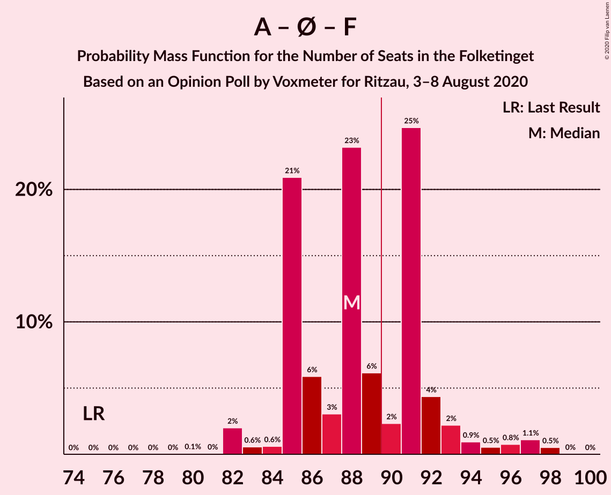

| Number of Seats | Probability | Accumulated | Special Marks |
|:---------------:|:-----------:|:-----------:|:-------------:|
| 75 | 0% | 100% | Last Result |
| 76 | 0% | 100% |  |
| 77 | 0% | 100% |  |
| 78 | 0% | 100% |  |
| 79 | 0% | 100% |  |
| 80 | 0.1% | 100% |  |
| 81 | 0% | 99.9% |  |
| 82 | 2% | 99.9% |  |
| 83 | 0.6% | 98% |  |
| 84 | 0.6% | 97% |  |
| 85 | 21% | 97% |  |
| 86 | 6% | 76% |  |
| 87 | 3% | 70% | Median |
| 88 | 23% | 67% |  |
| 89 | 6% | 44% |  |
| 90 | 2% | 37% | Majority |
| 91 | 25% | 35% |  |
| 92 | 4% | 10% |  |
| 93 | 2% | 6% |  |
| 94 | 0.9% | 4% |  |
| 95 | 0.5% | 3% |  |
| 96 | 0.8% | 2% |  |
| 97 | 1.1% | 2% |  |
| 98 | 0.5% | 0.6% |  |
| 99 | 0% | 0.1% |  |
| 100 | 0% | 0% |  |

### Socialdemokraterne – Socialistisk Folkeparti – Radikale Venstre

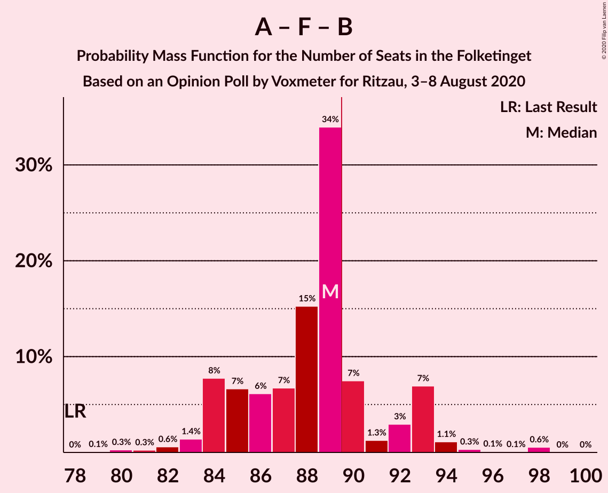

| Number of Seats | Probability | Accumulated | Special Marks |
|:---------------:|:-----------:|:-----------:|:-------------:|
| 78 | 0% | 100% | Last Result |
| 79 | 0.1% | 100% |  |
| 80 | 0.3% | 99.9% |  |
| 81 | 0.3% | 99.6% |  |
| 82 | 0.6% | 99.4% |  |
| 83 | 1.4% | 98.8% |  |
| 84 | 8% | 97% |  |
| 85 | 7% | 90% |  |
| 86 | 6% | 83% |  |
| 87 | 7% | 77% | Median |
| 88 | 15% | 70% |  |
| 89 | 34% | 55% |  |
| 90 | 7% | 21% | Majority |
| 91 | 1.3% | 13% |  |
| 92 | 3% | 12% |  |
| 93 | 7% | 9% |  |
| 94 | 1.1% | 2% |  |
| 95 | 0.3% | 1.1% |  |
| 96 | 0.1% | 0.8% |  |
| 97 | 0.1% | 0.6% |  |
| 98 | 0.6% | 0.6% |  |
| 99 | 0% | 0% |  |

### Socialdemokraterne – Radikale Venstre

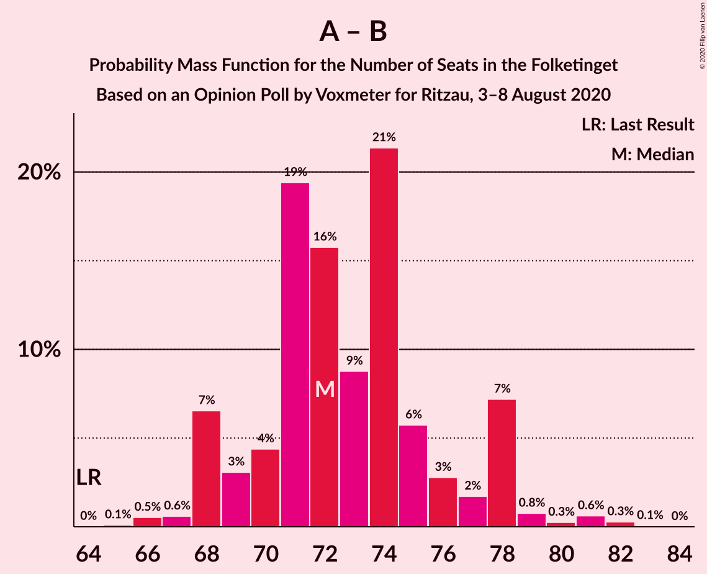

| Number of Seats | Probability | Accumulated | Special Marks |
|:---------------:|:-----------:|:-----------:|:-------------:|
| 64 | 0% | 100% | Last Result |
| 65 | 0.1% | 100% |  |
| 66 | 0.5% | 99.9% |  |
| 67 | 0.6% | 99.3% |  |
| 68 | 7% | 98.7% |  |
| 69 | 3% | 92% |  |
| 70 | 4% | 89% |  |
| 71 | 19% | 85% |  |
| 72 | 16% | 65% | Median |
| 73 | 9% | 50% |  |
| 74 | 21% | 41% |  |
| 75 | 6% | 19% |  |
| 76 | 3% | 14% |  |
| 77 | 2% | 11% |  |
| 78 | 7% | 9% |  |
| 79 | 0.8% | 2% |  |
| 80 | 0.3% | 1.2% |  |
| 81 | 0.6% | 1.0% |  |
| 82 | 0.3% | 0.4% |  |
| 83 | 0.1% | 0.1% |  |
| 84 | 0% | 0% |  |

### Venstre – Det Konservative Folkeparti – Dansk Folkeparti – Nye Borgerlige – Liberal Alliance – Klaus Riskær Pedersen

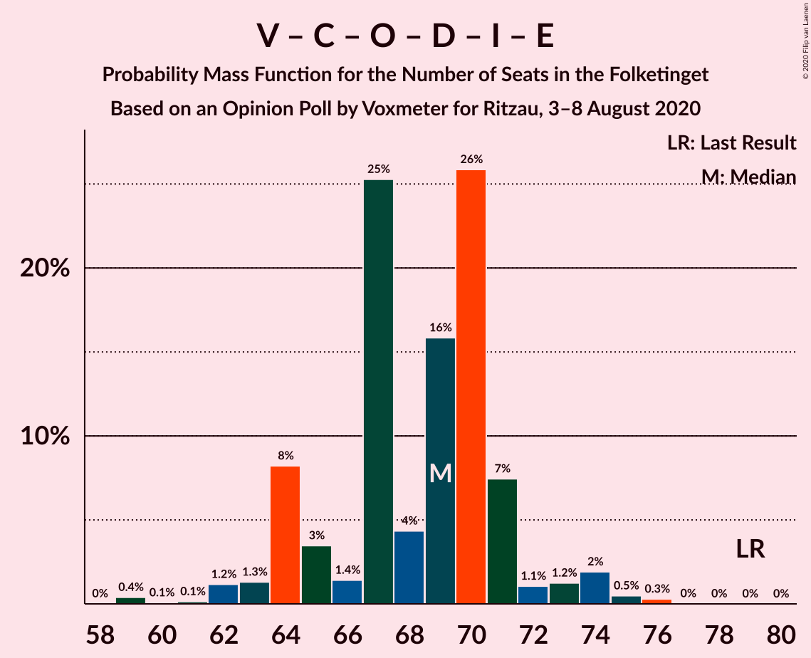

| Number of Seats | Probability | Accumulated | Special Marks |
|:---------------:|:-----------:|:-----------:|:-------------:|
| 59 | 0.4% | 100% |  |
| 60 | 0.1% | 99.6% |  |
| 61 | 0.1% | 99.5% |  |
| 62 | 1.2% | 99.4% |  |
| 63 | 1.3% | 98% |  |
| 64 | 8% | 97% |  |
| 65 | 3% | 89% |  |
| 66 | 1.4% | 85% |  |
| 67 | 25% | 84% |  |
| 68 | 4% | 59% |  |
| 69 | 16% | 54% |  |
| 70 | 26% | 38% | Median |
| 71 | 7% | 12% |  |
| 72 | 1.1% | 5% |  |
| 73 | 1.2% | 4% |  |
| 74 | 2% | 3% |  |
| 75 | 0.5% | 0.8% |  |
| 76 | 0.3% | 0.3% |  |
| 77 | 0% | 0% |  |
| 78 | 0% | 0% |  |
| 79 | 0% | 0% | Last Result |

### Venstre – Det Konservative Folkeparti – Dansk Folkeparti – Nye Borgerlige – Liberal Alliance

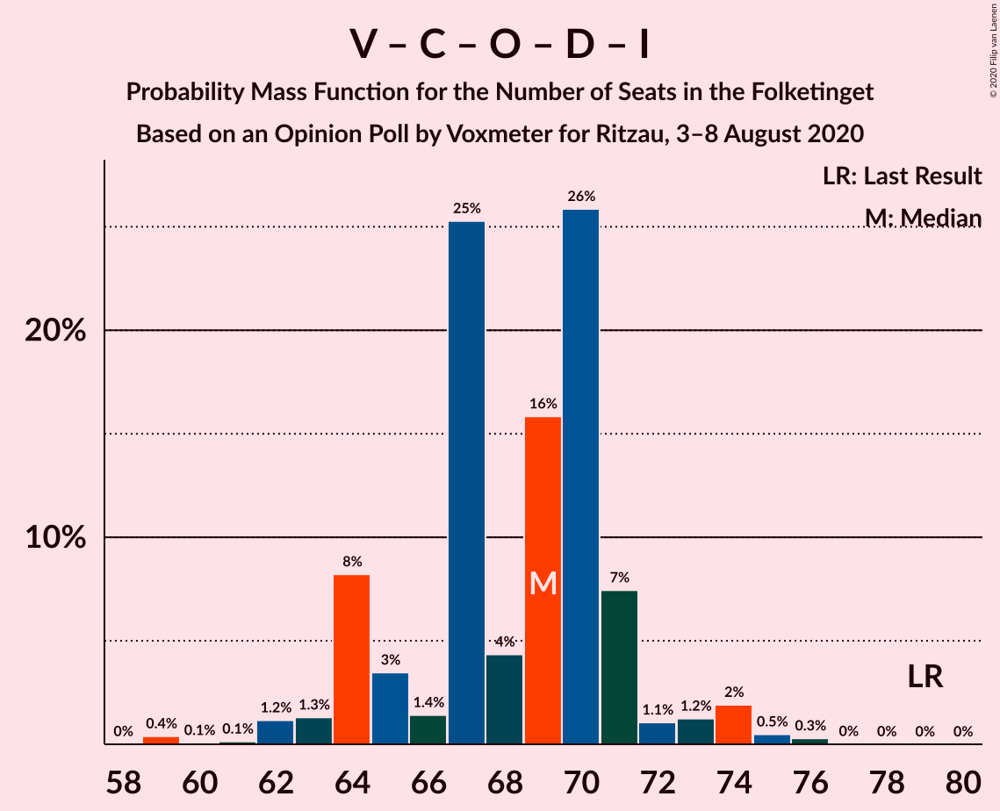

| Number of Seats | Probability | Accumulated | Special Marks |
|:---------------:|:-----------:|:-----------:|:-------------:|
| 59 | 0.4% | 100% |  |
| 60 | 0.1% | 99.6% |  |
| 61 | 0.1% | 99.5% |  |
| 62 | 1.2% | 99.4% |  |
| 63 | 1.3% | 98% |  |
| 64 | 8% | 97% |  |
| 65 | 3% | 89% |  |
| 66 | 1.4% | 85% |  |
| 67 | 25% | 84% |  |
| 68 | 4% | 59% |  |
| 69 | 16% | 54% |  |
| 70 | 26% | 38% | Median |
| 71 | 7% | 12% |  |
| 72 | 1.1% | 5% |  |
| 73 | 1.2% | 4% |  |
| 74 | 2% | 3% |  |
| 75 | 0.5% | 0.8% |  |
| 76 | 0.3% | 0.3% |  |
| 77 | 0% | 0% |  |
| 78 | 0% | 0% |  |
| 79 | 0% | 0% | Last Result |

### Venstre – Det Konservative Folkeparti – Dansk Folkeparti – Liberal Alliance

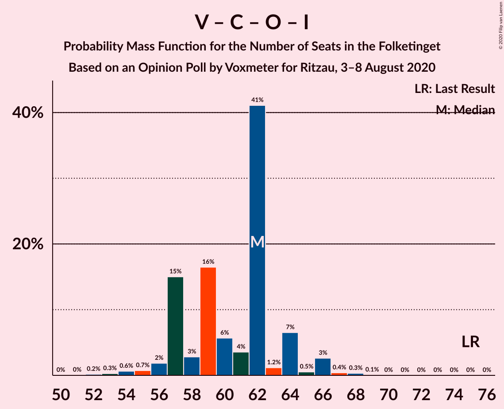

| Number of Seats | Probability | Accumulated | Special Marks |
|:---------------:|:-----------:|:-----------:|:-------------:|
| 51 | 0% | 100% |  |
| 52 | 0.2% | 99.9% |  |
| 53 | 0.3% | 99.7% |  |
| 54 | 0.6% | 99.5% |  |
| 55 | 0.7% | 98.8% |  |
| 56 | 2% | 98% |  |
| 57 | 15% | 96% |  |
| 58 | 3% | 81% |  |
| 59 | 16% | 78% |  |
| 60 | 6% | 62% |  |
| 61 | 4% | 56% |  |
| 62 | 41% | 53% | Median |
| 63 | 1.2% | 12% |  |
| 64 | 7% | 10% |  |
| 65 | 0.5% | 4% |  |
| 66 | 3% | 3% |  |
| 67 | 0.4% | 0.8% |  |
| 68 | 0.3% | 0.4% |  |
| 69 | 0.1% | 0.1% |  |
| 70 | 0% | 0% |  |
| 71 | 0% | 0% |  |
| 72 | 0% | 0% |  |
| 73 | 0% | 0% |  |
| 74 | 0% | 0% |  |
| 75 | 0% | 0% | Last Result |

### Venstre – Det Konservative Folkeparti – Liberal Alliance

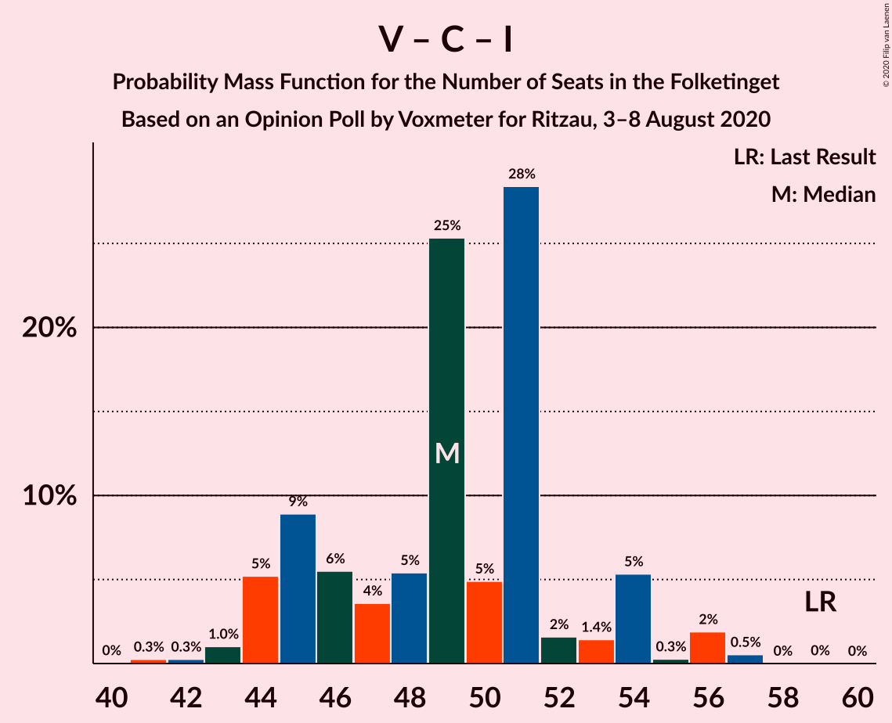

| Number of Seats | Probability | Accumulated | Special Marks |
|:---------------:|:-----------:|:-----------:|:-------------:|
| 40 | 0% | 100% |  |
| 41 | 0.3% | 99.9% |  |
| 42 | 0.3% | 99.7% |  |
| 43 | 1.0% | 99.4% |  |
| 44 | 5% | 98% |  |
| 45 | 9% | 93% |  |
| 46 | 6% | 84% |  |
| 47 | 4% | 79% |  |
| 48 | 5% | 75% |  |
| 49 | 25% | 70% |  |
| 50 | 5% | 44% |  |
| 51 | 28% | 40% | Median |
| 52 | 2% | 11% |  |
| 53 | 1.4% | 10% |  |
| 54 | 5% | 8% |  |
| 55 | 0.3% | 3% |  |
| 56 | 2% | 2% |  |
| 57 | 0.5% | 0.6% |  |
| 58 | 0% | 0.1% |  |
| 59 | 0% | 0% | Last Result |

### Venstre – Det Konservative Folkeparti

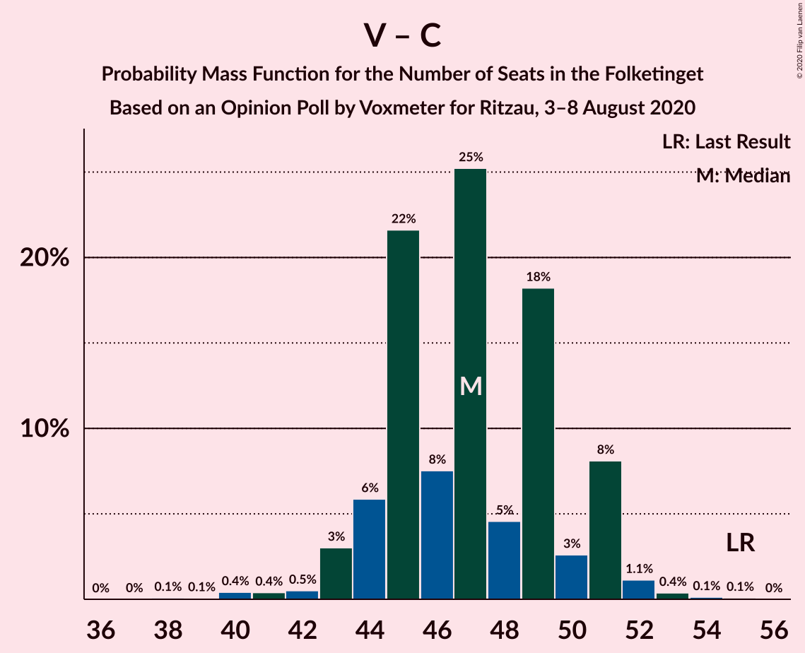

| Number of Seats | Probability | Accumulated | Special Marks |
|:---------------:|:-----------:|:-----------:|:-------------:|
| 38 | 0.1% | 100% |  |
| 39 | 0.1% | 99.9% |  |
| 40 | 0.4% | 99.8% |  |
| 41 | 0.4% | 99.4% |  |
| 42 | 0.5% | 99.0% |  |
| 43 | 3% | 98.5% |  |
| 44 | 6% | 95% |  |
| 45 | 22% | 90% |  |
| 46 | 8% | 68% |  |
| 47 | 25% | 60% | Median |
| 48 | 5% | 35% |  |
| 49 | 18% | 31% |  |
| 50 | 3% | 12% |  |
| 51 | 8% | 10% |  |
| 52 | 1.1% | 2% |  |
| 53 | 0.4% | 0.6% |  |
| 54 | 0.1% | 0.2% |  |
| 55 | 0.1% | 0.1% | Last Result |
| 56 | 0% | 0% |  |

### Venstre

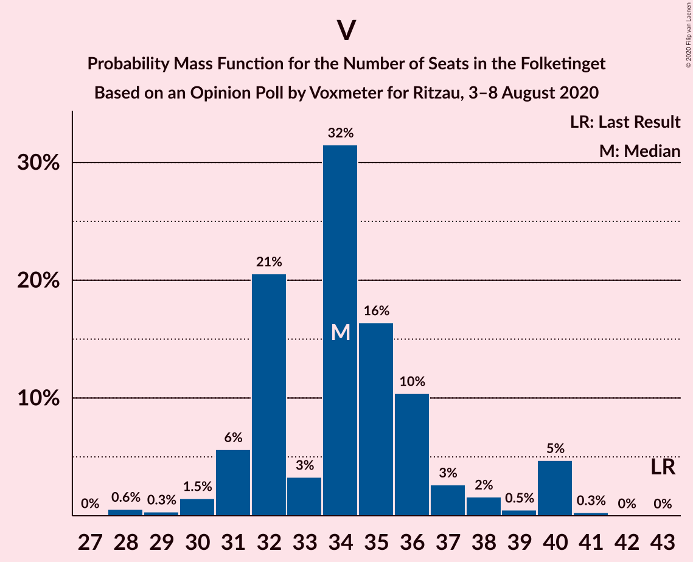

| Number of Seats | Probability | Accumulated | Special Marks |
|:---------------:|:-----------:|:-----------:|:-------------:|
| 27 | 0% | 100% |  |
| 28 | 0.6% | 99.9% |  |
| 29 | 0.3% | 99.4% |  |
| 30 | 1.5% | 99.0% |  |
| 31 | 6% | 98% |  |
| 32 | 21% | 92% |  |
| 33 | 3% | 71% |  |
| 34 | 32% | 68% | Median |
| 35 | 16% | 37% |  |
| 36 | 10% | 20% |  |
| 37 | 3% | 10% |  |
| 38 | 2% | 7% |  |
| 39 | 0.5% | 6% |  |
| 40 | 5% | 5% |  |
| 41 | 0.3% | 0.3% |  |
| 42 | 0% | 0% |  |
| 43 | 0% | 0% | Last Result |

## Technical Information

### Opinion Poll

+ **Polling firm:** Voxmeter
+ **Commissioner(s):** Ritzau
+ **Fieldwork period:** 3–8 August 2020

### Calculations

+ **Sample size:** 1007
+ **Simulations done:** 1,048,576
+ **Error estimate:** 1.72%

