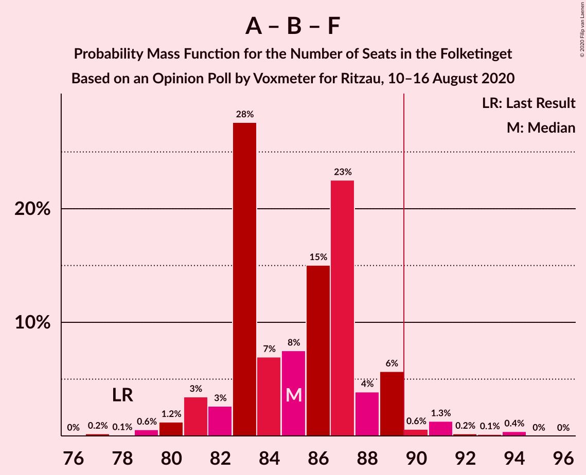

# Opinion Poll by Voxmeter for Ritzau, 10–16 August 2020

<a href="#voting-intentions">Voting Intentions</a> | <a href="#seats">Seats</a> | <a href="#coalitions">Coalitions</a> | <a href="#technical-information">Technical Information</a>

## Voting Intentions

### Confidence Intervals

| Party | Last Result | Poll Result | 80% Confidence Interval | 90% Confidence Interval | 95% Confidence Interval | 99% Confidence Interval |
|:-----:|:-----------:|:-----------:|:-----------------------:|:-----------------------:|:-----------------------:|:-----------------------:|
| Socialdemokraterne | 25.9% | 32.9% | 31.1–34.8% |30.6–35.4% |30.1–35.8% |29.2–36.8% |
| Venstre | 23.4% | 17.8% | 16.4–19.4% |15.9–19.9% |15.6–20.3% |14.9–21.1% |
| Enhedslisten–De Rød-Grønne | 6.9% | 8.0% | 7.0–9.2% |6.8–9.6% |6.5–9.9% |6.1–10.5% |
| Det Konservative Folkeparti | 6.6% | 7.9% | 7.0–9.1% |6.7–9.5% |6.4–9.8% |6.0–10.3% |
| Radikale Venstre | 8.6% | 7.8% | 6.9–9.0% |6.6–9.4% |6.4–9.6% |5.9–10.2% |
| Socialistisk Folkeparti | 7.7% | 7.4% | 6.4–8.5% |6.1–8.8% |5.9–9.1% |5.5–9.7% |
| Dansk Folkeparti | 8.7% | 7.0% | 6.1–8.1% |5.8–8.4% |5.6–8.7% |5.2–9.3% |
| Nye Borgerlige | 2.4% | 4.5% | 3.7–5.4% |3.5–5.7% |3.4–5.9% |3.0–6.4% |
| Liberal Alliance | 2.3% | 2.7% | 2.2–3.5% |2.0–3.7% |1.9–3.9% |1.6–4.3% |
| Alternativet | 3.0% | 0.7% | 0.4–1.1% |0.4–1.3% |0.3–1.4% |0.2–1.7% |
| Stram Kurs | 1.8% | 0.6% | 0.4–1.0% |0.3–1.1% |0.3–1.3% |0.2–1.5% |
| Klaus Riskær Pedersen | 0.8% | 0.2% | 0.1–0.5% |0.1–0.6% |0.0–0.7% |0.0–0.9% |

*Note:* The poll result column reflects the actual value used in the calculations. Published results may vary slightly, and in addition be rounded to fewer digits.

## Seats

### Confidence Intervals

| Party | Last Result | Median | 80% Confidence Interval | 90% Confidence Interval | 95% Confidence Interval | 99% Confidence Interval |
|:-----:|:-----------:|:------:|:-----------------------:|:-----------------------:|:-----------------------:|:-----------------------:|
| <a href="#socialdemokraterne">Socialdemokraterne</a> | 48 | 58 | 56–61 |55–63 |54–63 |51–67 |
| <a href="#venstre">Venstre</a> | 43 | 31 | 28–34 |28–35 |27–35 |27–37 |
| <a href="#enhedslisten–de-rød-grønne">Enhedslisten–De Rød-Grønne</a> | 13 | 13 | 12–16 |12–16 |12–17 |11–20 |
| <a href="#det-konservative-folkeparti">Det Konservative Folkeparti</a> | 12 | 15 | 12–16 |12–17 |12–17 |10–19 |
| <a href="#radikale-venstre">Radikale Venstre</a> | 16 | 14 | 12–16 |12–16 |11–17 |11–17 |
| <a href="#socialistisk-folkeparti">Socialistisk Folkeparti</a> | 14 | 12 | 12–14 |11–15 |10–16 |10–17 |
| <a href="#dansk-folkeparti">Dansk Folkeparti</a> | 16 | 13 | 11–15 |11–15 |10–15 |9–16 |
| <a href="#nye-borgerlige">Nye Borgerlige</a> | 4 | 8 | 7–10 |6–10 |6–11 |6–12 |
| <a href="#liberal-alliance">Liberal Alliance</a> | 4 | 5 | 3–7 |3–7 |0–7 |0–8 |
| <a href="#alternativet">Alternativet</a> | 5 | 0 | 0 |0 |0 |0 |
| <a href="#stram-kurs">Stram Kurs</a> | 0 | 0 | 0 |0 |0 |0 |
| <a href="#klaus-riskær-pedersen">Klaus Riskær Pedersen</a> | 0 | 0 | 0 |0 |0 |0 |

### Socialdemokraterne

*For a full overview of the results for this party, see the [Socialdemokraterne](party-socialdemokraterne.html) page.*

| Number of Seats | Probability | Accumulated | Special Marks |
|:---------------:|:-----------:|:-----------:|:-------------:|
| 48 | 0% | 100% | Last Result |
| 49 | 0% | 100% |  |
| 50 | 0.1% | 100% |  |
| 51 | 0.6% | 99.9% |  |
| 52 | 0.7% | 99.3% |  |
| 53 | 0.7% | 98.6% |  |
| 54 | 3% | 98% |  |
| 55 | 4% | 95% |  |
| 56 | 4% | 91% |  |
| 57 | 17% | 87% |  |
| 58 | 25% | 71% | Median |
| 59 | 5% | 46% |  |
| 60 | 29% | 41% |  |
| 61 | 4% | 12% |  |
| 62 | 3% | 8% |  |
| 63 | 5% | 6% |  |
| 64 | 0.3% | 1.1% |  |
| 65 | 0.2% | 0.8% |  |
| 66 | 0% | 0.6% |  |
| 67 | 0.4% | 0.6% |  |
| 68 | 0.2% | 0.2% |  |
| 69 | 0% | 0% |  |

### Venstre

*For a full overview of the results for this party, see the [Venstre](party-venstre.html) page.*

| Number of Seats | Probability | Accumulated | Special Marks |
|:---------------:|:-----------:|:-----------:|:-------------:|
| 26 | 0.1% | 100% |  |
| 27 | 3% | 99.8% |  |
| 28 | 8% | 97% |  |
| 29 | 2% | 89% |  |
| 30 | 14% | 87% |  |
| 31 | 31% | 73% | Median |
| 32 | 8% | 42% |  |
| 33 | 18% | 34% |  |
| 34 | 11% | 16% |  |
| 35 | 3% | 6% |  |
| 36 | 1.4% | 2% |  |
| 37 | 0.7% | 1.1% |  |
| 38 | 0% | 0.4% |  |
| 39 | 0.2% | 0.3% |  |
| 40 | 0.1% | 0.1% |  |
| 41 | 0% | 0% |  |
| 42 | 0% | 0% |  |
| 43 | 0% | 0% | Last Result |

### Enhedslisten–De Rød-Grønne

*For a full overview of the results for this party, see the [Enhedslisten–De Rød-Grønne](party-enhedslisten–derød-grønne.html) page.*

| Number of Seats | Probability | Accumulated | Special Marks |
|:---------------:|:-----------:|:-----------:|:-------------:|
| 10 | 0.4% | 100% |  |
| 11 | 1.2% | 99.6% |  |
| 12 | 24% | 98% |  |
| 13 | 25% | 74% | Last Result, Median |
| 14 | 9% | 49% |  |
| 15 | 28% | 40% |  |
| 16 | 9% | 12% |  |
| 17 | 1.3% | 4% |  |
| 18 | 2% | 2% |  |
| 19 | 0.1% | 0.6% |  |
| 20 | 0.5% | 0.5% |  |
| 21 | 0% | 0% |  |

### Det Konservative Folkeparti

*For a full overview of the results for this party, see the [Det Konservative Folkeparti](party-detkonservativefolkeparti.html) page.*

| Number of Seats | Probability | Accumulated | Special Marks |
|:---------------:|:-----------:|:-----------:|:-------------:|
| 10 | 0.5% | 100% |  |
| 11 | 0.8% | 99.5% |  |
| 12 | 16% | 98.6% | Last Result |
| 13 | 18% | 82% |  |
| 14 | 11% | 64% |  |
| 15 | 22% | 53% | Median |
| 16 | 24% | 30% |  |
| 17 | 5% | 6% |  |
| 18 | 0.6% | 1.1% |  |
| 19 | 0.5% | 0.5% |  |
| 20 | 0% | 0% |  |

### Radikale Venstre

*For a full overview of the results for this party, see the [Radikale Venstre](party-radikalevenstre.html) page.*

| Number of Seats | Probability | Accumulated | Special Marks |
|:---------------:|:-----------:|:-----------:|:-------------:|
| 10 | 0.2% | 100% |  |
| 11 | 3% | 99.7% |  |
| 12 | 8% | 97% |  |
| 13 | 34% | 89% |  |
| 14 | 11% | 55% | Median |
| 15 | 26% | 44% |  |
| 16 | 15% | 18% | Last Result |
| 17 | 2% | 3% |  |
| 18 | 0.3% | 0.5% |  |
| 19 | 0.1% | 0.1% |  |
| 20 | 0% | 0% |  |

### Socialistisk Folkeparti

*For a full overview of the results for this party, see the [Socialistisk Folkeparti](party-socialistiskfolkeparti.html) page.*

| Number of Seats | Probability | Accumulated | Special Marks |
|:---------------:|:-----------:|:-----------:|:-------------:|
| 9 | 0.2% | 100% |  |
| 10 | 3% | 99.8% |  |
| 11 | 7% | 97% |  |
| 12 | 50% | 90% | Median |
| 13 | 25% | 41% |  |
| 14 | 9% | 16% | Last Result |
| 15 | 4% | 7% |  |
| 16 | 1.5% | 3% |  |
| 17 | 0.9% | 1.0% |  |
| 18 | 0.1% | 0.1% |  |
| 19 | 0.1% | 0.1% |  |
| 20 | 0% | 0% |  |

### Dansk Folkeparti

*For a full overview of the results for this party, see the [Dansk Folkeparti](party-danskfolkeparti.html) page.*

| Number of Seats | Probability | Accumulated | Special Marks |
|:---------------:|:-----------:|:-----------:|:-------------:|
| 8 | 0.1% | 100% |  |
| 9 | 0.7% | 99.9% |  |
| 10 | 3% | 99.2% |  |
| 11 | 14% | 96% |  |
| 12 | 27% | 82% |  |
| 13 | 30% | 55% | Median |
| 14 | 8% | 25% |  |
| 15 | 16% | 17% |  |
| 16 | 0.7% | 0.9% | Last Result |
| 17 | 0.1% | 0.2% |  |
| 18 | 0.1% | 0.1% |  |
| 19 | 0% | 0% |  |

### Nye Borgerlige

*For a full overview of the results for this party, see the [Nye Borgerlige](party-nyeborgerlige.html) page.*

| Number of Seats | Probability | Accumulated | Special Marks |
|:---------------:|:-----------:|:-----------:|:-------------:|
| 4 | 0% | 100% | Last Result |
| 5 | 0.3% | 100% |  |
| 6 | 5% | 99.7% |  |
| 7 | 11% | 94% |  |
| 8 | 51% | 83% | Median |
| 9 | 12% | 32% |  |
| 10 | 16% | 20% |  |
| 11 | 2% | 4% |  |
| 12 | 1.1% | 1.1% |  |
| 13 | 0% | 0% |  |

### Liberal Alliance

*For a full overview of the results for this party, see the [Liberal Alliance](party-liberalalliance.html) page.*

| Number of Seats | Probability | Accumulated | Special Marks |
|:---------------:|:-----------:|:-----------:|:-------------:|
| 0 | 3% | 100% |  |
| 1 | 0% | 97% |  |
| 2 | 0% | 97% |  |
| 3 | 19% | 97% |  |
| 4 | 24% | 78% | Last Result |
| 5 | 31% | 54% | Median |
| 6 | 12% | 23% |  |
| 7 | 10% | 11% |  |
| 8 | 0.8% | 1.2% |  |
| 9 | 0.4% | 0.4% |  |
| 10 | 0% | 0% |  |

### Alternativet

*For a full overview of the results for this party, see the [Alternativet](party-alternativet.html) page.*

| Number of Seats | Probability | Accumulated | Special Marks |
|:---------------:|:-----------:|:-----------:|:-------------:|
| 0 | 99.9% | 100% | Median |
| 1 | 0% | 0.1% |  |
| 2 | 0% | 0.1% |  |
| 3 | 0% | 0.1% |  |
| 4 | 0.1% | 0.1% |  |
| 5 | 0% | 0% | Last Result |

### Stram Kurs

*For a full overview of the results for this party, see the [Stram Kurs](party-stramkurs.html) page.*

| Number of Seats | Probability | Accumulated | Special Marks |
|:---------------:|:-----------:|:-----------:|:-------------:|
| 0 | 100% | 100% | Last Result, Median |

### Klaus Riskær Pedersen

*For a full overview of the results for this party, see the [Klaus Riskær Pedersen](party-klausriskærpedersen.html) page.*

| Number of Seats | Probability | Accumulated | Special Marks |
|:---------------:|:-----------:|:-----------:|:-------------:|
| 0 | 100% | 100% | Last Result, Median |

## Coalitions

### Confidence Intervals

| Coalition | Last Result | Median | Majority? | 80% Confidence Interval | 90% Confidence Interval | 95% Confidence Interval | 99% Confidence Interval |
|:---------:|:-----------:|:------:|:---------:|:-----------------------:|:-----------------------:|:-----------------------:|:-----------------------:|
| Socialdemokraterne – Enhedslisten–De Rød-Grønne – Radikale Venstre – Socialistisk Folkeparti – Alternativet | 96 | 99 | 100% | 97–102 | 96–103 | 95–105 | 93–106 |
| Socialdemokraterne – Enhedslisten–De Rød-Grønne – Radikale Venstre – Socialistisk Folkeparti | 91 | 99 | 100% | 97–102 | 96–103 | 95–105 | 93–106 |
| Socialdemokraterne – Enhedslisten–De Rød-Grønne – Socialistisk Folkeparti – Alternativet | 80 | 85 | 7% | 83–89 | 82–90 | 81–91 | 77–93 |
| Socialdemokraterne – Enhedslisten–De Rød-Grønne – Socialistisk Folkeparti | 75 | 85 | 7% | 83–89 | 82–90 | 81–90 | 77–93 |
| Socialdemokraterne – Radikale Venstre – Socialistisk Folkeparti | 78 | 85 | 3% | 83–88 | 81–89 | 81–90 | 79–93 |
| Venstre – Det Konservative Folkeparti – Dansk Folkeparti – Nye Borgerlige – Liberal Alliance – Klaus Riskær Pedersen | 79 | 72 | 0% | 68–74 | 67–75 | 66–77 | 64–80 |
| Venstre – Det Konservative Folkeparti – Dansk Folkeparti – Nye Borgerlige – Liberal Alliance | 79 | 72 | 0% | 68–74 | 67–75 | 66–77 | 64–80 |
| Socialdemokraterne – Radikale Venstre | 64 | 73 | 0% | 70–75 | 68–76 | 67–76 | 66–79 |
| Venstre – Det Konservative Folkeparti – Dansk Folkeparti – Liberal Alliance | 75 | 63 | 0% | 60–65 | 59–67 | 58–69 | 56–70 |
| Venstre – Det Konservative Folkeparti – Liberal Alliance | 59 | 50 | 0% | 48–54 | 47–54 | 46–56 | 44–56 |
| Venstre – Det Konservative Folkeparti | 55 | 46 | 0% | 44–48 | 42–49 | 41–51 | 40–52 |
| Venstre | 43 | 31 | 0% | 28–34 | 28–35 | 27–35 | 27–37 |

### Socialdemokraterne – Enhedslisten–De Rød-Grønne – Radikale Venstre – Socialistisk Folkeparti – Alternativet

| Number of Seats | Probability | Accumulated | Special Marks |
|:---------------:|:-----------:|:-----------:|:-------------:|
| 91 | 0.1% | 100% |  |
| 92 | 0.3% | 99.9% |  |
| 93 | 1.0% | 99.6% |  |
| 94 | 0.9% | 98.6% |  |
| 95 | 1.4% | 98% |  |
| 96 | 5% | 96% | Last Result |
| 97 | 3% | 91% | Median |
| 98 | 30% | 89% |  |
| 99 | 38% | 59% |  |
| 100 | 4% | 21% |  |
| 101 | 5% | 17% |  |
| 102 | 3% | 12% |  |
| 103 | 5% | 9% |  |
| 104 | 2% | 4% |  |
| 105 | 2% | 3% |  |
| 106 | 0.4% | 0.5% |  |
| 107 | 0.1% | 0.2% |  |
| 108 | 0% | 0.1% |  |
| 109 | 0% | 0% |  |

### Socialdemokraterne – Enhedslisten–De Rød-Grønne – Radikale Venstre – Socialistisk Folkeparti

| Number of Seats | Probability | Accumulated | Special Marks |
|:---------------:|:-----------:|:-----------:|:-------------:|
| 91 | 0.1% | 100% | Last Result |
| 92 | 0.3% | 99.9% |  |
| 93 | 1.0% | 99.6% |  |
| 94 | 0.9% | 98.6% |  |
| 95 | 1.4% | 98% |  |
| 96 | 5% | 96% |  |
| 97 | 3% | 91% | Median |
| 98 | 30% | 89% |  |
| 99 | 38% | 59% |  |
| 100 | 4% | 21% |  |
| 101 | 5% | 17% |  |
| 102 | 3% | 12% |  |
| 103 | 4% | 9% |  |
| 104 | 2% | 4% |  |
| 105 | 2% | 3% |  |
| 106 | 0.4% | 0.5% |  |
| 107 | 0.1% | 0.2% |  |
| 108 | 0% | 0.1% |  |
| 109 | 0% | 0% |  |

### Socialdemokraterne – Enhedslisten–De Rød-Grønne – Socialistisk Folkeparti – Alternativet

| Number of Seats | Probability | Accumulated | Special Marks |
|:---------------:|:-----------:|:-----------:|:-------------:|
| 76 | 0.1% | 100% |  |
| 77 | 0.5% | 99.9% |  |
| 78 | 0.1% | 99.4% |  |
| 79 | 0.6% | 99.4% |  |
| 80 | 0.5% | 98.7% | Last Result |
| 81 | 0.7% | 98% |  |
| 82 | 4% | 97% |  |
| 83 | 16% | 94% | Median |
| 84 | 25% | 77% |  |
| 85 | 29% | 52% |  |
| 86 | 7% | 23% |  |
| 87 | 2% | 16% |  |
| 88 | 3% | 14% |  |
| 89 | 4% | 11% |  |
| 90 | 5% | 7% | Majority |
| 91 | 1.4% | 3% |  |
| 92 | 0.2% | 1.1% |  |
| 93 | 0.6% | 0.9% |  |
| 94 | 0.2% | 0.3% |  |
| 95 | 0.1% | 0.1% |  |
| 96 | 0% | 0% |  |

### Socialdemokraterne – Enhedslisten–De Rød-Grønne – Socialistisk Folkeparti

| Number of Seats | Probability | Accumulated | Special Marks |
|:---------------:|:-----------:|:-----------:|:-------------:|
| 75 | 0% | 100% | Last Result |
| 76 | 0.1% | 100% |  |
| 77 | 0.5% | 99.9% |  |
| 78 | 0.1% | 99.4% |  |
| 79 | 0.6% | 99.4% |  |
| 80 | 0.6% | 98.7% |  |
| 81 | 0.8% | 98% |  |
| 82 | 4% | 97% |  |
| 83 | 16% | 93% | Median |
| 84 | 25% | 77% |  |
| 85 | 29% | 52% |  |
| 86 | 7% | 23% |  |
| 87 | 2% | 16% |  |
| 88 | 3% | 14% |  |
| 89 | 4% | 11% |  |
| 90 | 5% | 7% | Majority |
| 91 | 1.4% | 2% |  |
| 92 | 0.2% | 1.1% |  |
| 93 | 0.6% | 0.9% |  |
| 94 | 0.2% | 0.3% |  |
| 95 | 0.1% | 0.1% |  |
| 96 | 0% | 0% |  |

### Socialdemokraterne – Radikale Venstre – Socialistisk Folkeparti

| Number of Seats | Probability | Accumulated | Special Marks |
|:---------------:|:-----------:|:-----------:|:-------------:|
| 77 | 0.2% | 100% |  |
| 78 | 0.1% | 99.8% | Last Result |
| 79 | 0.6% | 99.7% |  |
| 80 | 1.2% | 99.1% |  |
| 81 | 3% | 98% |  |
| 82 | 3% | 94% |  |
| 83 | 28% | 92% |  |
| 84 | 7% | 64% | Median |
| 85 | 8% | 57% |  |
| 86 | 15% | 50% |  |
| 87 | 23% | 35% |  |
| 88 | 4% | 12% |  |
| 89 | 6% | 8% |  |
| 90 | 0.6% | 3% | Majority |
| 91 | 1.3% | 2% |  |
| 92 | 0.2% | 0.8% |  |
| 93 | 0.1% | 0.6% |  |
| 94 | 0.4% | 0.4% |  |
| 95 | 0% | 0% |  |

### Venstre – Det Konservative Folkeparti – Dansk Folkeparti – Nye Borgerlige – Liberal Alliance – Klaus Riskær Pedersen

| Number of Seats | Probability | Accumulated | Special Marks |
|:---------------:|:-----------:|:-----------:|:-------------:|
| 63 | 0.1% | 100% |  |
| 64 | 1.2% | 99.9% |  |
| 65 | 1.0% | 98.7% |  |
| 66 | 0.4% | 98% |  |
| 67 | 4% | 97% |  |
| 68 | 4% | 94% |  |
| 69 | 2% | 89% |  |
| 70 | 5% | 87% |  |
| 71 | 25% | 82% |  |
| 72 | 33% | 57% | Median |
| 73 | 12% | 24% |  |
| 74 | 7% | 12% |  |
| 75 | 1.2% | 5% |  |
| 76 | 0.9% | 4% |  |
| 77 | 2% | 3% |  |
| 78 | 0.4% | 1.3% |  |
| 79 | 0.2% | 0.9% | Last Result |
| 80 | 0.7% | 0.8% |  |
| 81 | 0% | 0.1% |  |
| 82 | 0% | 0% |  |

### Venstre – Det Konservative Folkeparti – Dansk Folkeparti – Nye Borgerlige – Liberal Alliance

| Number of Seats | Probability | Accumulated | Special Marks |
|:---------------:|:-----------:|:-----------:|:-------------:|
| 63 | 0.1% | 100% |  |
| 64 | 1.2% | 99.9% |  |
| 65 | 1.0% | 98.7% |  |
| 66 | 0.4% | 98% |  |
| 67 | 4% | 97% |  |
| 68 | 4% | 94% |  |
| 69 | 2% | 89% |  |
| 70 | 5% | 87% |  |
| 71 | 25% | 82% |  |
| 72 | 33% | 57% | Median |
| 73 | 12% | 24% |  |
| 74 | 7% | 12% |  |
| 75 | 1.2% | 5% |  |
| 76 | 0.9% | 4% |  |
| 77 | 2% | 3% |  |
| 78 | 0.4% | 1.3% |  |
| 79 | 0.2% | 0.9% | Last Result |
| 80 | 0.7% | 0.8% |  |
| 81 | 0% | 0.1% |  |
| 82 | 0% | 0% |  |

### Socialdemokraterne – Radikale Venstre

| Number of Seats | Probability | Accumulated | Special Marks |
|:---------------:|:-----------:|:-----------:|:-------------:|
| 63 | 0.1% | 100% |  |
| 64 | 0.1% | 99.9% | Last Result |
| 65 | 0.1% | 99.8% |  |
| 66 | 1.1% | 99.7% |  |
| 67 | 2% | 98.6% |  |
| 68 | 3% | 97% |  |
| 69 | 3% | 94% |  |
| 70 | 4% | 92% |  |
| 71 | 28% | 88% |  |
| 72 | 6% | 60% | Median |
| 73 | 16% | 54% |  |
| 74 | 8% | 38% |  |
| 75 | 23% | 30% |  |
| 76 | 5% | 7% |  |
| 77 | 1.0% | 2% |  |
| 78 | 0.1% | 1.2% |  |
| 79 | 1.0% | 1.1% |  |
| 80 | 0.1% | 0.1% |  |
| 81 | 0% | 0% |  |

### Venstre – Det Konservative Folkeparti – Dansk Folkeparti – Liberal Alliance

| Number of Seats | Probability | Accumulated | Special Marks |
|:---------------:|:-----------:|:-----------:|:-------------:|
| 54 | 0% | 100% |  |
| 55 | 0.2% | 99.9% |  |
| 56 | 1.1% | 99.8% |  |
| 57 | 1.1% | 98.7% |  |
| 58 | 1.5% | 98% |  |
| 59 | 2% | 96% |  |
| 60 | 4% | 94% |  |
| 61 | 3% | 90% |  |
| 62 | 18% | 87% |  |
| 63 | 29% | 69% |  |
| 64 | 16% | 40% | Median |
| 65 | 16% | 25% |  |
| 66 | 1.4% | 8% |  |
| 67 | 3% | 7% |  |
| 68 | 1.0% | 4% |  |
| 69 | 1.5% | 3% |  |
| 70 | 1.0% | 1.2% |  |
| 71 | 0.1% | 0.2% |  |
| 72 | 0.1% | 0.1% |  |
| 73 | 0% | 0% |  |
| 74 | 0% | 0% |  |
| 75 | 0% | 0% | Last Result |

### Venstre – Det Konservative Folkeparti – Liberal Alliance

| Number of Seats | Probability | Accumulated | Special Marks |
|:---------------:|:-----------:|:-----------:|:-------------:|
| 42 | 0.1% | 100% |  |
| 43 | 0.1% | 99.9% |  |
| 44 | 0.4% | 99.8% |  |
| 45 | 0.6% | 99.4% |  |
| 46 | 3% | 98.8% |  |
| 47 | 4% | 96% |  |
| 48 | 2% | 91% |  |
| 49 | 17% | 89% |  |
| 50 | 37% | 72% |  |
| 51 | 12% | 34% | Median |
| 52 | 2% | 23% |  |
| 53 | 8% | 21% |  |
| 54 | 10% | 13% |  |
| 55 | 1.2% | 4% |  |
| 56 | 2% | 3% |  |
| 57 | 0.1% | 0.3% |  |
| 58 | 0.1% | 0.2% |  |
| 59 | 0.1% | 0.1% | Last Result |
| 60 | 0% | 0% |  |

### Venstre – Det Konservative Folkeparti

| Number of Seats | Probability | Accumulated | Special Marks |
|:---------------:|:-----------:|:-----------:|:-------------:|
| 39 | 0.4% | 100% |  |
| 40 | 0.5% | 99.6% |  |
| 41 | 4% | 99.1% |  |
| 42 | 4% | 95% |  |
| 43 | 1.3% | 91% |  |
| 44 | 6% | 90% |  |
| 45 | 33% | 84% |  |
| 46 | 6% | 52% | Median |
| 47 | 33% | 46% |  |
| 48 | 7% | 13% |  |
| 49 | 2% | 6% |  |
| 50 | 0.9% | 4% |  |
| 51 | 2% | 3% |  |
| 52 | 0.7% | 1.1% |  |
| 53 | 0.2% | 0.4% |  |
| 54 | 0.2% | 0.2% |  |
| 55 | 0% | 0% | Last Result |

### Venstre

| Number of Seats | Probability | Accumulated | Special Marks |
|:---------------:|:-----------:|:-----------:|:-------------:|
| 26 | 0.1% | 100% |  |
| 27 | 3% | 99.8% |  |
| 28 | 8% | 97% |  |
| 29 | 2% | 89% |  |
| 30 | 14% | 87% |  |
| 31 | 31% | 73% | Median |
| 32 | 8% | 42% |  |
| 33 | 18% | 34% |  |
| 34 | 11% | 16% |  |
| 35 | 3% | 6% |  |
| 36 | 1.4% | 2% |  |
| 37 | 0.7% | 1.1% |  |
| 38 | 0% | 0.4% |  |
| 39 | 0.2% | 0.3% |  |
| 40 | 0.1% | 0.1% |  |
| 41 | 0% | 0% |  |
| 42 | 0% | 0% |  |
| 43 | 0% | 0% | Last Result |

## Technical Information

### Opinion Poll

+ **Polling firm:** Voxmeter
+ **Commissioner(s):** Ritzau
+ **Fieldwork period:** 10–16 August 2020

### Calculations

+ **Sample size:** 1033
+ **Simulations done:** 1,048,576
+ **Error estimate:** 1.62%

