# Opinion Poll by Voxmeter, 17–23 August 2020

<a href="#voting-intentions">Voting Intentions</a> | <a href="#seats">Seats</a> | <a href="#coalitions">Coalitions</a> | <a href="#technical-information">Technical Information</a>

## Voting Intentions

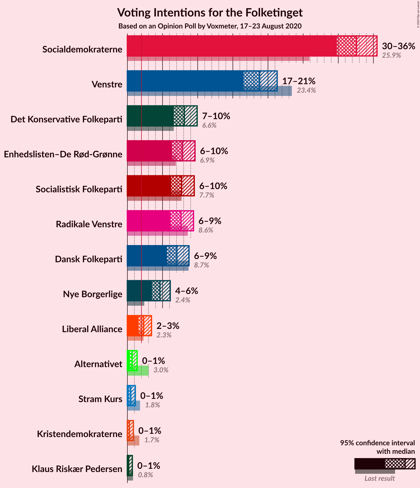

### Confidence Intervals

| Party | Last Result | Poll Result | 80% Confidence Interval | 90% Confidence Interval | 95% Confidence Interval | 99% Confidence Interval |
|:-----:|:-----------:|:-----------:|:-----------------------:|:-----------------------:|:-----------------------:|:-----------------------:|
| Socialdemokraterne | 25.9% | 32.6% | 30.8–34.5% |30.3–35.0% |29.8–35.5% |28.9–36.4% |
| Venstre | 23.4% | 18.8% | 17.3–20.4% |16.9–20.9% |16.5–21.3% |15.9–22.1% |
| Det Konservative Folkeparti | 6.6% | 8.1% | 7.1–9.3% |6.8–9.6% |6.6–9.9% |6.1–10.5% |
| Enhedslisten–De Rød-Grønne | 6.9% | 7.8% | 6.8–9.0% |6.6–9.3% |6.3–9.6% |5.9–10.2% |
| Socialistisk Folkeparti | 7.7% | 7.7% | 6.7–8.9% |6.5–9.2% |6.2–9.5% |5.8–10.1% |
| Radikale Venstre | 8.6% | 7.6% | 6.6–8.8% |6.4–9.1% |6.2–9.4% |5.7–10.0% |
| Dansk Folkeparti | 8.7% | 7.0% | 6.1–8.2% |5.9–8.5% |5.6–8.8% |5.2–9.3% |
| Nye Borgerlige | 2.4% | 4.6% | 3.9–5.6% |3.7–5.9% |3.5–6.1% |3.2–6.6% |
| Liberal Alliance | 2.3% | 2.3% | 1.8–3.0% |1.7–3.2% |1.6–3.4% |1.3–3.8% |
| Alternativet | 3.0% | 0.7% | 0.4–1.1% |0.4–1.3% |0.3–1.4% |0.2–1.6% |
| Stram Kurs | 1.8% | 0.5% | 0.3–0.9% |0.2–1.0% |0.2–1.1% |0.1–1.4% |
| Kristendemokraterne | 1.7% | 0.3% | 0.2–0.7% |0.1–0.7% |0.1–0.9% |0.1–1.1% |
| Klaus Riskær Pedersen | 0.8% | 0.2% | 0.1–0.5% |0.1–0.6% |0.0–0.7% |0.0–0.9% |

*Note:* The poll result column reflects the actual value used in the calculations. Published results may vary slightly, and in addition be rounded to fewer digits.

## Seats

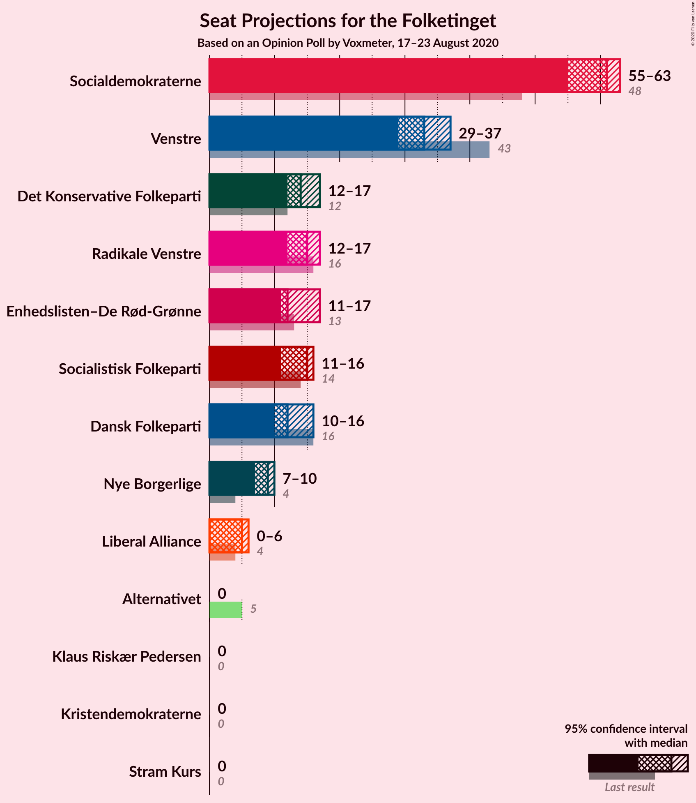

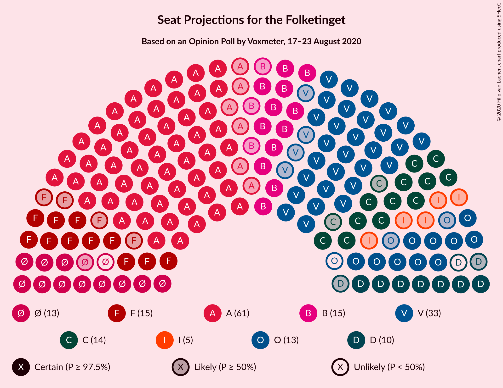

### Confidence Intervals

| Party | Last Result | Median | 80% Confidence Interval | 90% Confidence Interval | 95% Confidence Interval | 99% Confidence Interval |
|:-----:|:-----------:|:------:|:-----------------------:|:-----------------------:|:-----------------------:|:-----------------------:|
| <a href="#socialdemokraterne">Socialdemokraterne</a> | 48 | 61 | 57–61 |56–61 |55–63 |53–66 |
| <a href="#venstre">Venstre</a> | 43 | 33 | 33–36 |31–36 |29–37 |28–40 |
| <a href="#det-konservative-folkeparti">Det Konservative Folkeparti</a> | 12 | 14 | 14–16 |13–16 |12–17 |11–19 |
| <a href="#enhedslisten–de-rød-grønne">Enhedslisten–De Rød-Grønne</a> | 13 | 12 | 11–15 |11–15 |11–17 |11–18 |
| <a href="#socialistisk-folkeparti">Socialistisk Folkeparti</a> | 14 | 15 | 12–15 |11–15 |11–16 |11–17 |
| <a href="#radikale-venstre">Radikale Venstre</a> | 16 | 15 | 13–15 |13–16 |12–17 |11–18 |
| <a href="#dansk-folkeparti">Dansk Folkeparti</a> | 16 | 12 | 11–15 |11–15 |10–16 |9–17 |
| <a href="#nye-borgerlige">Nye Borgerlige</a> | 4 | 9 | 7–10 |7–10 |7–10 |6–12 |
| <a href="#liberal-alliance">Liberal Alliance</a> | 4 | 5 | 0–6 |0–6 |0–6 |0–7 |
| <a href="#alternativet">Alternativet</a> | 5 | 0 | 0 |0 |0 |0 |
| <a href="#stram-kurs">Stram Kurs</a> | 0 | 0 | 0 |0 |0 |0 |
| <a href="#kristendemokraterne">Kristendemokraterne</a> | 0 | 0 | 0 |0 |0 |0 |
| <a href="#klaus-riskær-pedersen">Klaus Riskær Pedersen</a> | 0 | 0 | 0 |0 |0 |0 |

### Socialdemokraterne

*For a full overview of the results for this party, see the [Socialdemokraterne](party-socialdemokraterne.html) page.*

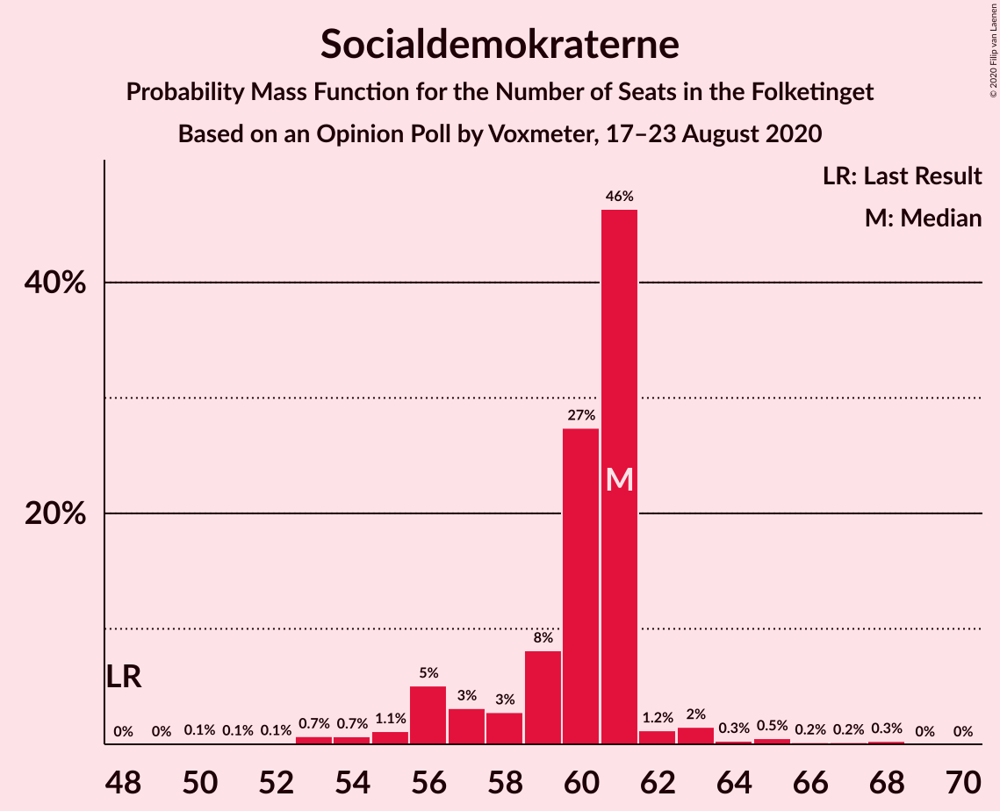

| Number of Seats | Probability | Accumulated | Special Marks |
|:---------------:|:-----------:|:-----------:|:-------------:|
| 48 | 0% | 100% | Last Result |
| 49 | 0% | 100% |  |
| 50 | 0.1% | 100% |  |
| 51 | 0.1% | 99.8% |  |
| 52 | 0.1% | 99.7% |  |
| 53 | 0.7% | 99.6% |  |
| 54 | 0.7% | 98.9% |  |
| 55 | 1.1% | 98% |  |
| 56 | 5% | 97% |  |
| 57 | 3% | 92% |  |
| 58 | 3% | 89% |  |
| 59 | 8% | 86% |  |
| 60 | 27% | 78% |  |
| 61 | 46% | 51% | Median |
| 62 | 1.2% | 4% |  |
| 63 | 2% | 3% |  |
| 64 | 0.3% | 1.5% |  |
| 65 | 0.5% | 1.2% |  |
| 66 | 0.2% | 0.6% |  |
| 67 | 0.2% | 0.5% |  |
| 68 | 0.3% | 0.3% |  |
| 69 | 0% | 0% |  |

### Venstre

*For a full overview of the results for this party, see the [Venstre](party-venstre.html) page.*

| Number of Seats | Probability | Accumulated | Special Marks |
|:---------------:|:-----------:|:-----------:|:-------------:|
| 27 | 0.1% | 100% |  |
| 28 | 1.2% | 99.9% |  |
| 29 | 2% | 98.7% |  |
| 30 | 1.2% | 97% |  |
| 31 | 1.3% | 96% |  |
| 32 | 3% | 95% |  |
| 33 | 48% | 91% | Median |
| 34 | 8% | 44% |  |
| 35 | 8% | 36% |  |
| 36 | 25% | 28% |  |
| 37 | 1.4% | 4% |  |
| 38 | 0.3% | 2% |  |
| 39 | 0.5% | 2% |  |
| 40 | 1.3% | 1.3% |  |
| 41 | 0.1% | 0.1% |  |
| 42 | 0% | 0% |  |
| 43 | 0% | 0% | Last Result |

### Det Konservative Folkeparti

*For a full overview of the results for this party, see the [Det Konservative Folkeparti](party-detkonservativefolkeparti.html) page.*

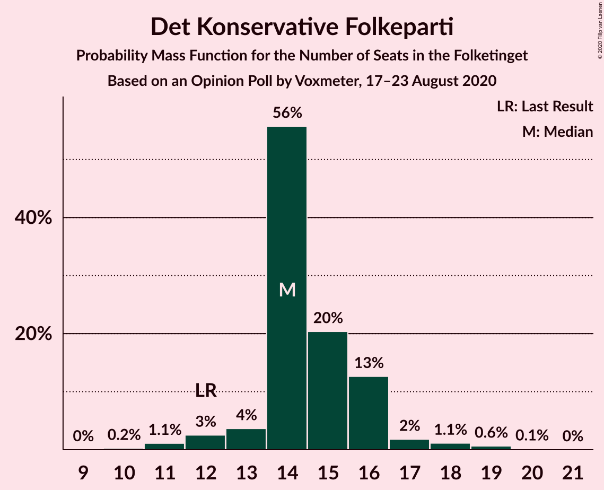

| Number of Seats | Probability | Accumulated | Special Marks |
|:---------------:|:-----------:|:-----------:|:-------------:|
| 10 | 0.2% | 100% |  |
| 11 | 1.1% | 99.7% |  |
| 12 | 3% | 98.6% | Last Result |
| 13 | 4% | 96% |  |
| 14 | 56% | 92% | Median |
| 15 | 20% | 37% |  |
| 16 | 13% | 16% |  |
| 17 | 2% | 4% |  |
| 18 | 1.1% | 2% |  |
| 19 | 0.6% | 0.8% |  |
| 20 | 0.1% | 0.2% |  |
| 21 | 0% | 0% |  |

### Enhedslisten–De Rød-Grønne

*For a full overview of the results for this party, see the [Enhedslisten–De Rød-Grønne](party-enhedslisten–derød-grønne.html) page.*

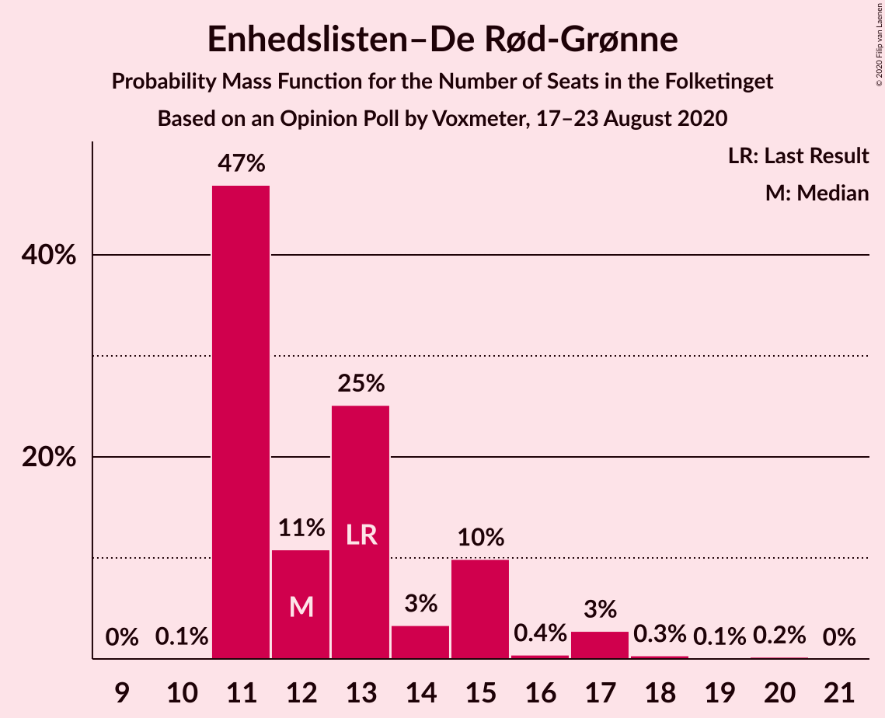

| Number of Seats | Probability | Accumulated | Special Marks |
|:---------------:|:-----------:|:-----------:|:-------------:|
| 10 | 0.1% | 100% |  |
| 11 | 47% | 99.9% |  |
| 12 | 11% | 53% | Median |
| 13 | 25% | 42% | Last Result |
| 14 | 3% | 17% |  |
| 15 | 10% | 14% |  |
| 16 | 0.4% | 4% |  |
| 17 | 3% | 3% |  |
| 18 | 0.3% | 0.6% |  |
| 19 | 0.1% | 0.3% |  |
| 20 | 0.2% | 0.2% |  |
| 21 | 0% | 0% |  |

### Socialistisk Folkeparti

*For a full overview of the results for this party, see the [Socialistisk Folkeparti](party-socialistiskfolkeparti.html) page.*

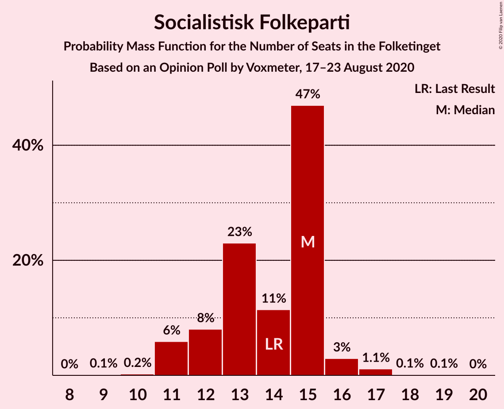

| Number of Seats | Probability | Accumulated | Special Marks |
|:---------------:|:-----------:|:-----------:|:-------------:|
| 9 | 0.1% | 100% |  |
| 10 | 0.2% | 99.9% |  |
| 11 | 6% | 99.6% |  |
| 12 | 8% | 94% |  |
| 13 | 23% | 86% |  |
| 14 | 11% | 63% | Last Result |
| 15 | 47% | 51% | Median |
| 16 | 3% | 4% |  |
| 17 | 1.1% | 1.4% |  |
| 18 | 0.1% | 0.3% |  |
| 19 | 0.1% | 0.1% |  |
| 20 | 0% | 0% |  |

### Radikale Venstre

*For a full overview of the results for this party, see the [Radikale Venstre](party-radikalevenstre.html) page.*

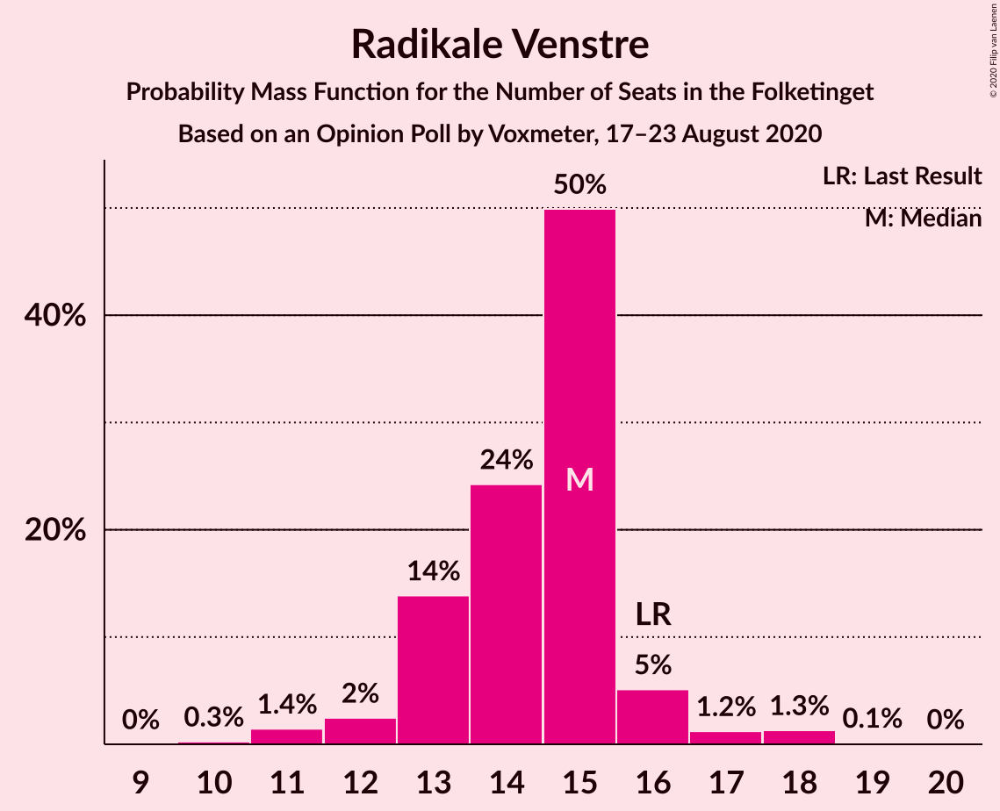

| Number of Seats | Probability | Accumulated | Special Marks |
|:---------------:|:-----------:|:-----------:|:-------------:|
| 10 | 0.3% | 100% |  |
| 11 | 1.4% | 99.7% |  |
| 12 | 2% | 98% |  |
| 13 | 14% | 96% |  |
| 14 | 24% | 82% |  |
| 15 | 50% | 58% | Median |
| 16 | 5% | 8% | Last Result |
| 17 | 1.2% | 3% |  |
| 18 | 1.3% | 1.5% |  |
| 19 | 0.1% | 0.1% |  |
| 20 | 0% | 0% |  |

### Dansk Folkeparti

*For a full overview of the results for this party, see the [Dansk Folkeparti](party-danskfolkeparti.html) page.*

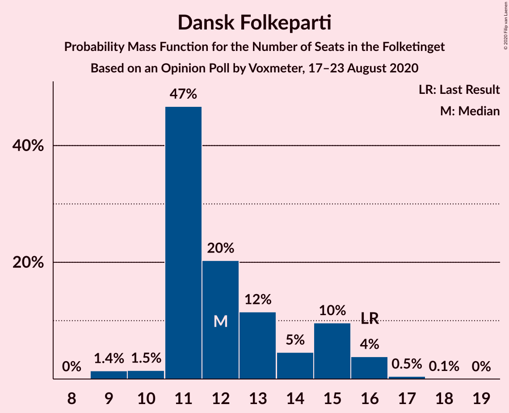

| Number of Seats | Probability | Accumulated | Special Marks |
|:---------------:|:-----------:|:-----------:|:-------------:|
| 9 | 1.4% | 100% |  |
| 10 | 1.5% | 98.6% |  |
| 11 | 47% | 97% |  |
| 12 | 20% | 50% | Median |
| 13 | 12% | 30% |  |
| 14 | 5% | 19% |  |
| 15 | 10% | 14% |  |
| 16 | 4% | 4% | Last Result |
| 17 | 0.5% | 0.5% |  |
| 18 | 0.1% | 0.1% |  |
| 19 | 0% | 0% |  |

### Nye Borgerlige

*For a full overview of the results for this party, see the [Nye Borgerlige](party-nyeborgerlige.html) page.*

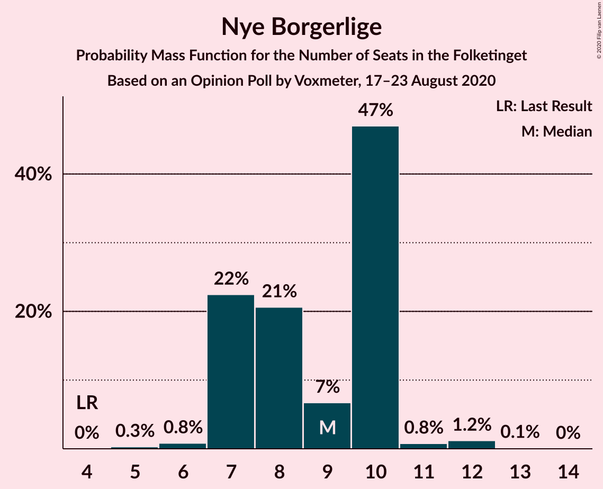

| Number of Seats | Probability | Accumulated | Special Marks |
|:---------------:|:-----------:|:-----------:|:-------------:|
| 4 | 0% | 100% | Last Result |
| 5 | 0.3% | 100% |  |
| 6 | 0.8% | 99.7% |  |
| 7 | 22% | 98.9% |  |
| 8 | 21% | 76% |  |
| 9 | 7% | 56% | Median |
| 10 | 47% | 49% |  |
| 11 | 0.8% | 2% |  |
| 12 | 1.2% | 1.3% |  |
| 13 | 0.1% | 0.1% |  |
| 14 | 0% | 0% |  |

### Liberal Alliance

*For a full overview of the results for this party, see the [Liberal Alliance](party-liberalalliance.html) page.*

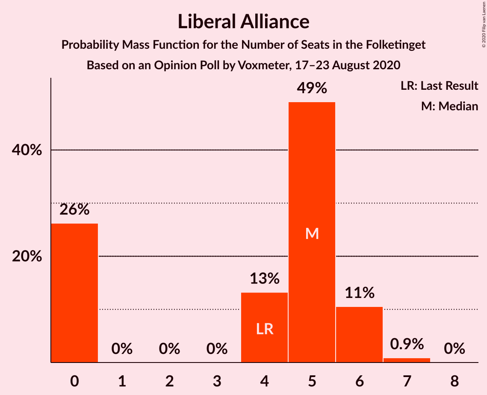

| Number of Seats | Probability | Accumulated | Special Marks |
|:---------------:|:-----------:|:-----------:|:-------------:|
| 0 | 26% | 100% |  |
| 1 | 0% | 74% |  |
| 2 | 0% | 74% |  |
| 3 | 0% | 74% |  |
| 4 | 13% | 74% | Last Result |
| 5 | 49% | 61% | Median |
| 6 | 11% | 11% |  |
| 7 | 0.9% | 0.9% |  |
| 8 | 0% | 0% |  |

### Alternativet

*For a full overview of the results for this party, see the [Alternativet](party-alternativet.html) page.*

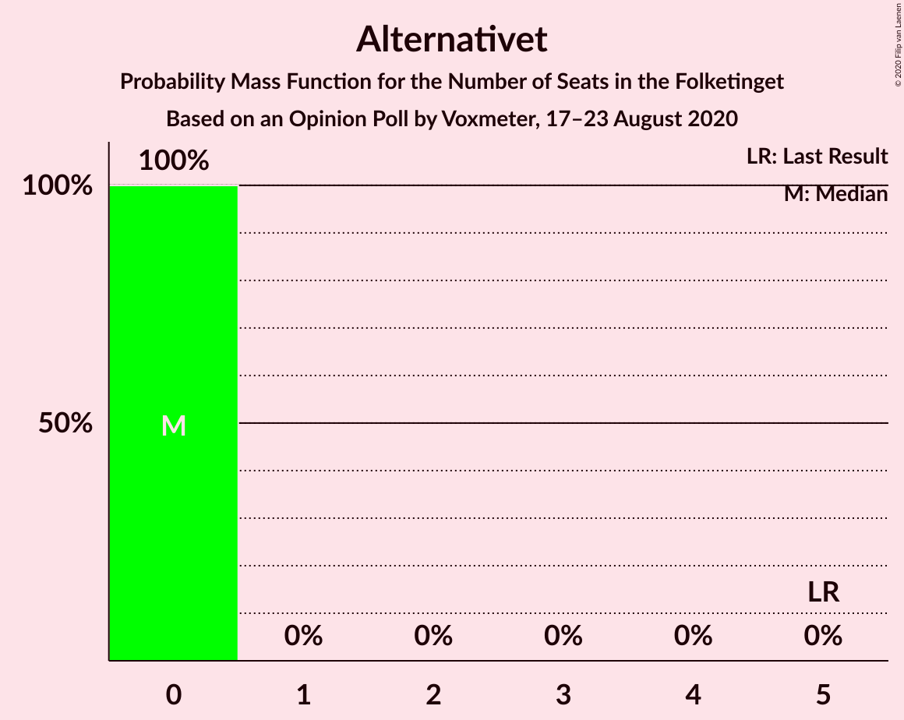

| Number of Seats | Probability | Accumulated | Special Marks |
|:---------------:|:-----------:|:-----------:|:-------------:|
| 0 | 100% | 100% | Median |
| 1 | 0% | 0% |  |
| 2 | 0% | 0% |  |
| 3 | 0% | 0% |  |
| 4 | 0% | 0% |  |
| 5 | 0% | 0% | Last Result |

### Stram Kurs

*For a full overview of the results for this party, see the [Stram Kurs](party-stramkurs.html) page.*

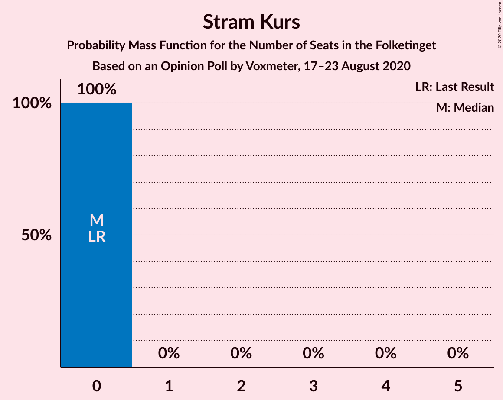

| Number of Seats | Probability | Accumulated | Special Marks |
|:---------------:|:-----------:|:-----------:|:-------------:|
| 0 | 100% | 100% | Last Result, Median |

### Kristendemokraterne

*For a full overview of the results for this party, see the [Kristendemokraterne](party-kristendemokraterne.html) page.*

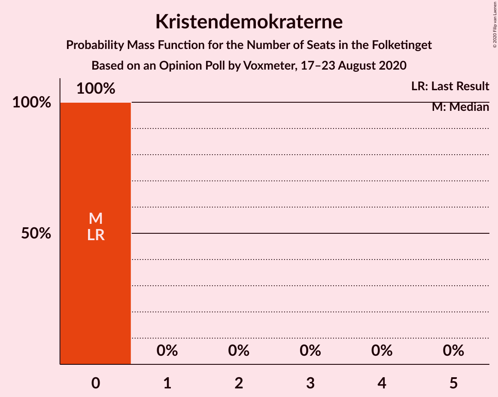

| Number of Seats | Probability | Accumulated | Special Marks |
|:---------------:|:-----------:|:-----------:|:-------------:|
| 0 | 100% | 100% | Last Result, Median |

### Klaus Riskær Pedersen

*For a full overview of the results for this party, see the [Klaus Riskær Pedersen](party-klausriskærpedersen.html) page.*

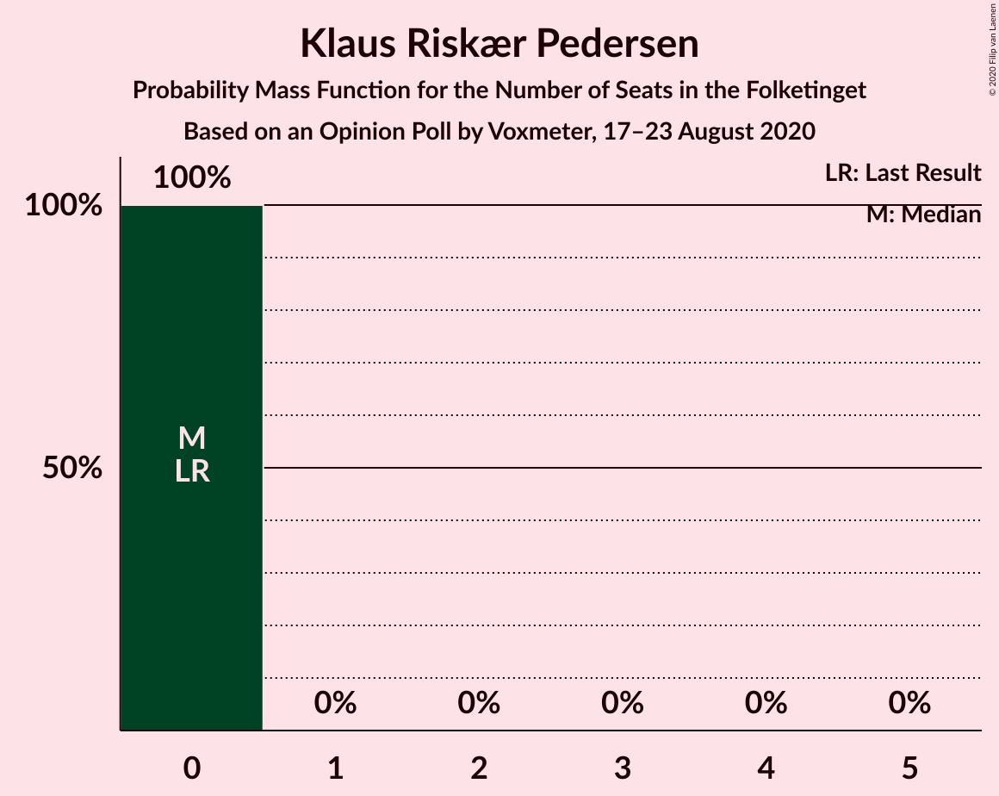

| Number of Seats | Probability | Accumulated | Special Marks |
|:---------------:|:-----------:|:-----------:|:-------------:|
| 0 | 100% | 100% | Last Result, Median |

## Coalitions

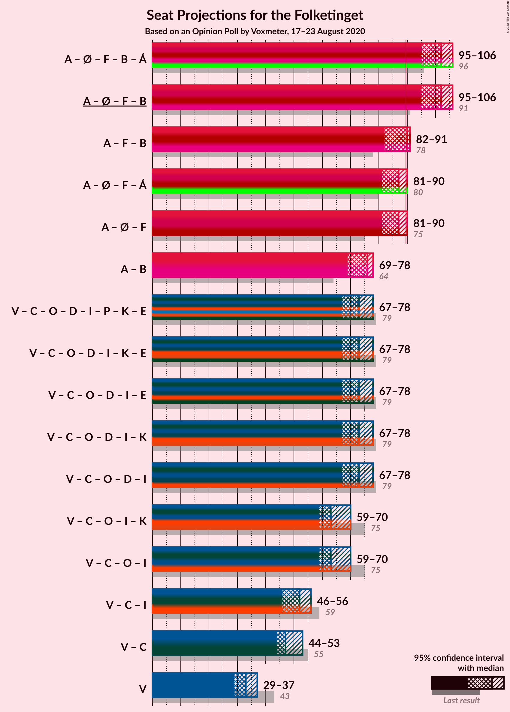

### Confidence Intervals

| Coalition | Last Result | Median | Majority? | 80% Confidence Interval | 90% Confidence Interval | 95% Confidence Interval | 99% Confidence Interval |
|:---------:|:-----------:|:------:|:---------:|:-----------------------:|:-----------------------:|:-----------------------:|:-----------------------:|
| Socialdemokraterne – Enhedslisten–De Rød-Grønne – Socialistisk Folkeparti – Radikale Venstre – Alternativet | 96 | 102 | 100% | 98–102 | 96–104 | 95–106 | 93–108 |
| Socialdemokraterne – Enhedslisten–De Rød-Grønne – Socialistisk Folkeparti – Radikale Venstre | 91 | 102 | 100% | 98–102 | 96–104 | 95–106 | 93–108 |
| Socialdemokraterne – Socialistisk Folkeparti – Radikale Venstre | 78 | 90 | 52% | 84–91 | 82–91 | 82–91 | 79–97 |
| Socialdemokraterne – Enhedslisten–De Rød-Grønne – Socialistisk Folkeparti – Alternativet | 80 | 87 | 5% | 84–87 | 81–89 | 81–90 | 80–94 |
| Socialdemokraterne – Enhedslisten–De Rød-Grønne – Socialistisk Folkeparti | 75 | 87 | 5% | 84–87 | 81–89 | 81–90 | 80–94 |
| Socialdemokraterne – Radikale Venstre | 64 | 76 | 0% | 71–76 | 70–76 | 69–78 | 66–81 |
| Venstre – Det Konservative Folkeparti – Dansk Folkeparti – Nye Borgerlige – Liberal Alliance – Stram Kurs – Kristendemokraterne – Klaus Riskær Pedersen | 79 | 73 | 0% | 71–76 | 70–77 | 67–78 | 66–79 |
| Venstre – Det Konservative Folkeparti – Dansk Folkeparti – Nye Borgerlige – Liberal Alliance – Kristendemokraterne – Klaus Riskær Pedersen | 79 | 73 | 0% | 71–76 | 70–77 | 67–78 | 66–79 |
| Venstre – Det Konservative Folkeparti – Dansk Folkeparti – Nye Borgerlige – Liberal Alliance – Klaus Riskær Pedersen | 79 | 73 | 0% | 71–76 | 70–77 | 67–78 | 66–79 |
| Venstre – Det Konservative Folkeparti – Dansk Folkeparti – Nye Borgerlige – Liberal Alliance – Kristendemokraterne | 79 | 73 | 0% | 71–76 | 70–77 | 67–78 | 66–79 |
| Venstre – Det Konservative Folkeparti – Dansk Folkeparti – Nye Borgerlige – Liberal Alliance | 79 | 73 | 0% | 71–76 | 70–77 | 67–78 | 66–79 |
| Venstre – Det Konservative Folkeparti – Dansk Folkeparti – Liberal Alliance – Kristendemokraterne | 75 | 63 | 0% | 63–69 | 61–70 | 59–70 | 58–71 |
| Venstre – Det Konservative Folkeparti – Dansk Folkeparti – Liberal Alliance | 75 | 63 | 0% | 63–69 | 61–70 | 59–70 | 58–71 |
| Venstre – Det Konservative Folkeparti – Liberal Alliance | 59 | 52 | 0% | 50–56 | 48–56 | 46–56 | 44–59 |
| Venstre – Det Konservative Folkeparti | 55 | 47 | 0% | 47–51 | 45–51 | 44–53 | 41–55 |
| Venstre | 43 | 33 | 0% | 33–36 | 31–36 | 29–37 | 28–40 |

### Socialdemokraterne – Enhedslisten–De Rød-Grønne – Socialistisk Folkeparti – Radikale Venstre – Alternativet

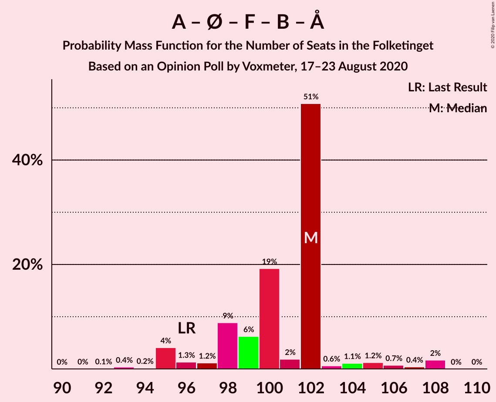

| Number of Seats | Probability | Accumulated | Special Marks |
|:---------------:|:-----------:|:-----------:|:-------------:|
| 91 | 0% | 100% |  |
| 92 | 0.1% | 99.9% |  |
| 93 | 0.4% | 99.9% |  |
| 94 | 0.2% | 99.5% |  |
| 95 | 4% | 99.3% |  |
| 96 | 1.3% | 95% | Last Result |
| 97 | 1.2% | 94% |  |
| 98 | 9% | 93% |  |
| 99 | 6% | 84% |  |
| 100 | 19% | 78% |  |
| 101 | 2% | 58% |  |
| 102 | 51% | 57% |  |
| 103 | 0.6% | 6% | Median |
| 104 | 1.1% | 5% |  |
| 105 | 1.2% | 4% |  |
| 106 | 0.7% | 3% |  |
| 107 | 0.4% | 2% |  |
| 108 | 2% | 2% |  |
| 109 | 0% | 0% |  |

### Socialdemokraterne – Enhedslisten–De Rød-Grønne – Socialistisk Folkeparti – Radikale Venstre

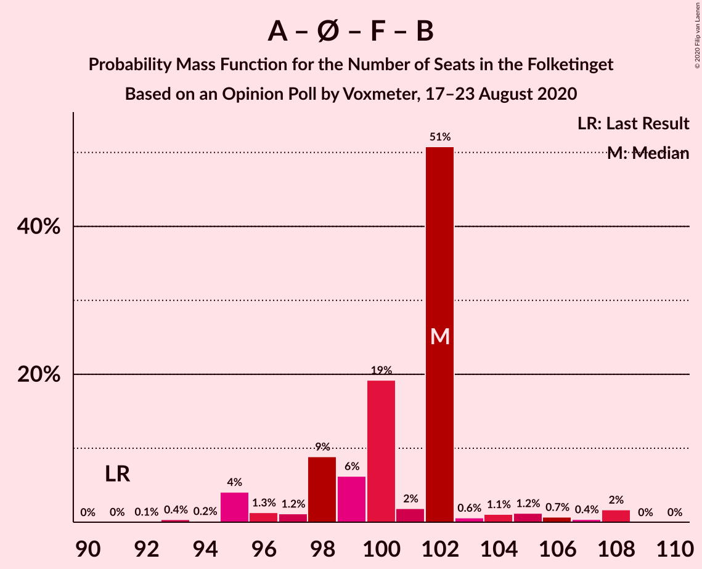

| Number of Seats | Probability | Accumulated | Special Marks |
|:---------------:|:-----------:|:-----------:|:-------------:|
| 91 | 0% | 100% | Last Result |
| 92 | 0.1% | 99.9% |  |
| 93 | 0.4% | 99.9% |  |
| 94 | 0.2% | 99.5% |  |
| 95 | 4% | 99.3% |  |
| 96 | 1.3% | 95% |  |
| 97 | 1.2% | 94% |  |
| 98 | 9% | 93% |  |
| 99 | 6% | 84% |  |
| 100 | 19% | 78% |  |
| 101 | 2% | 58% |  |
| 102 | 51% | 57% |  |
| 103 | 0.6% | 6% | Median |
| 104 | 1.1% | 5% |  |
| 105 | 1.2% | 4% |  |
| 106 | 0.7% | 3% |  |
| 107 | 0.4% | 2% |  |
| 108 | 2% | 2% |  |
| 109 | 0% | 0% |  |

### Socialdemokraterne – Socialistisk Folkeparti – Radikale Venstre

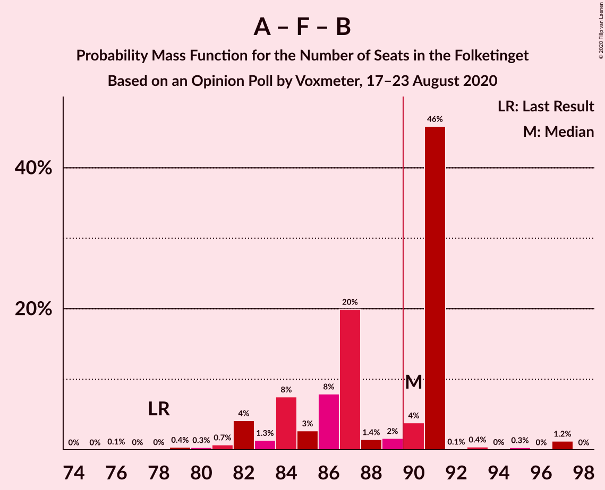

| Number of Seats | Probability | Accumulated | Special Marks |
|:---------------:|:-----------:|:-----------:|:-------------:|
| 76 | 0.1% | 100% |  |
| 77 | 0% | 99.9% |  |
| 78 | 0% | 99.9% | Last Result |
| 79 | 0.4% | 99.8% |  |
| 80 | 0.3% | 99.5% |  |
| 81 | 0.7% | 99.1% |  |
| 82 | 4% | 98% |  |
| 83 | 1.3% | 94% |  |
| 84 | 8% | 93% |  |
| 85 | 3% | 85% |  |
| 86 | 8% | 83% |  |
| 87 | 20% | 75% |  |
| 88 | 1.4% | 55% |  |
| 89 | 2% | 53% |  |
| 90 | 4% | 52% | Majority |
| 91 | 46% | 48% | Median |
| 92 | 0.1% | 2% |  |
| 93 | 0.4% | 2% |  |
| 94 | 0% | 2% |  |
| 95 | 0.3% | 2% |  |
| 96 | 0% | 1.2% |  |
| 97 | 1.2% | 1.2% |  |
| 98 | 0% | 0% |  |

### Socialdemokraterne – Enhedslisten–De Rød-Grønne – Socialistisk Folkeparti – Alternativet

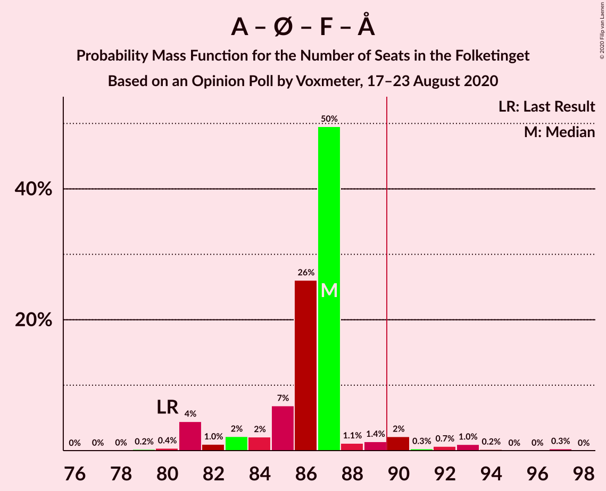

| Number of Seats | Probability | Accumulated | Special Marks |
|:---------------:|:-----------:|:-----------:|:-------------:|
| 77 | 0% | 100% |  |
| 78 | 0% | 99.9% |  |
| 79 | 0.2% | 99.9% |  |
| 80 | 0.4% | 99.7% | Last Result |
| 81 | 4% | 99.3% |  |
| 82 | 1.0% | 95% |  |
| 83 | 2% | 94% |  |
| 84 | 2% | 92% |  |
| 85 | 7% | 90% |  |
| 86 | 26% | 83% |  |
| 87 | 50% | 57% |  |
| 88 | 1.1% | 7% | Median |
| 89 | 1.4% | 6% |  |
| 90 | 2% | 5% | Majority |
| 91 | 0.3% | 2% |  |
| 92 | 0.7% | 2% |  |
| 93 | 1.0% | 1.5% |  |
| 94 | 0.2% | 0.5% |  |
| 95 | 0% | 0.3% |  |
| 96 | 0% | 0.3% |  |
| 97 | 0.3% | 0.3% |  |
| 98 | 0% | 0% |  |

### Socialdemokraterne – Enhedslisten–De Rød-Grønne – Socialistisk Folkeparti

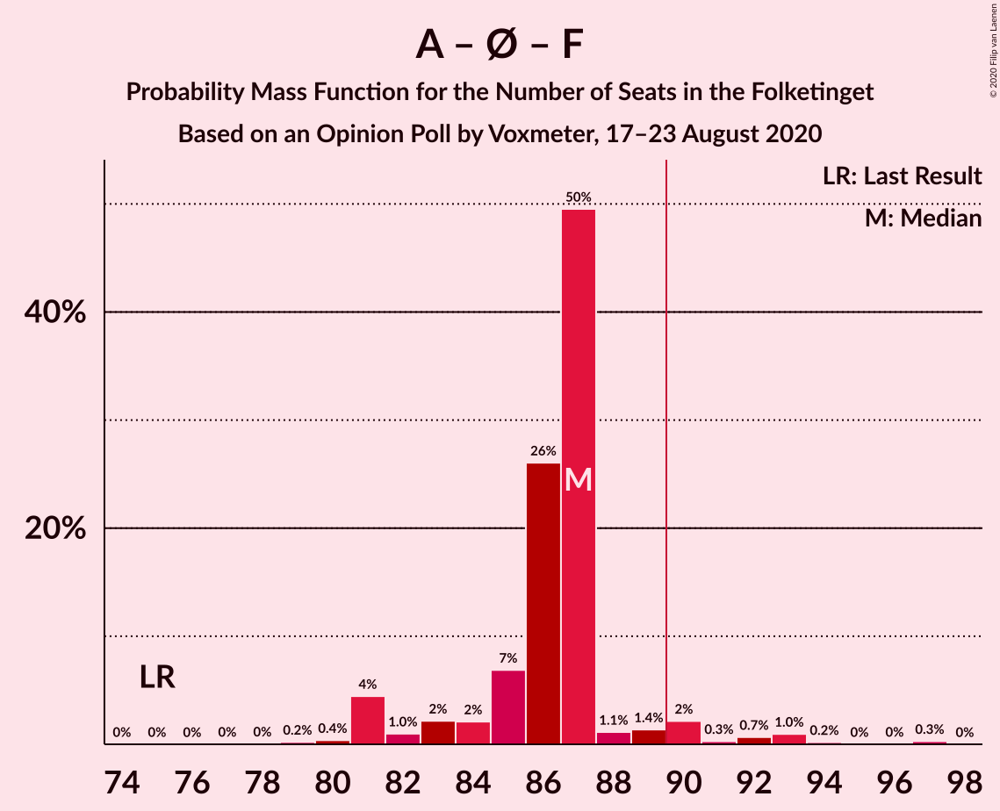

| Number of Seats | Probability | Accumulated | Special Marks |
|:---------------:|:-----------:|:-----------:|:-------------:|
| 75 | 0% | 100% | Last Result |
| 76 | 0% | 100% |  |
| 77 | 0% | 100% |  |
| 78 | 0% | 99.9% |  |
| 79 | 0.2% | 99.9% |  |
| 80 | 0.4% | 99.7% |  |
| 81 | 4% | 99.3% |  |
| 82 | 1.0% | 95% |  |
| 83 | 2% | 94% |  |
| 84 | 2% | 92% |  |
| 85 | 7% | 90% |  |
| 86 | 26% | 83% |  |
| 87 | 50% | 57% |  |
| 88 | 1.1% | 7% | Median |
| 89 | 1.4% | 6% |  |
| 90 | 2% | 5% | Majority |
| 91 | 0.3% | 2% |  |
| 92 | 0.7% | 2% |  |
| 93 | 1.0% | 1.5% |  |
| 94 | 0.2% | 0.5% |  |
| 95 | 0% | 0.3% |  |
| 96 | 0% | 0.3% |  |
| 97 | 0.3% | 0.3% |  |
| 98 | 0% | 0% |  |

### Socialdemokraterne – Radikale Venstre

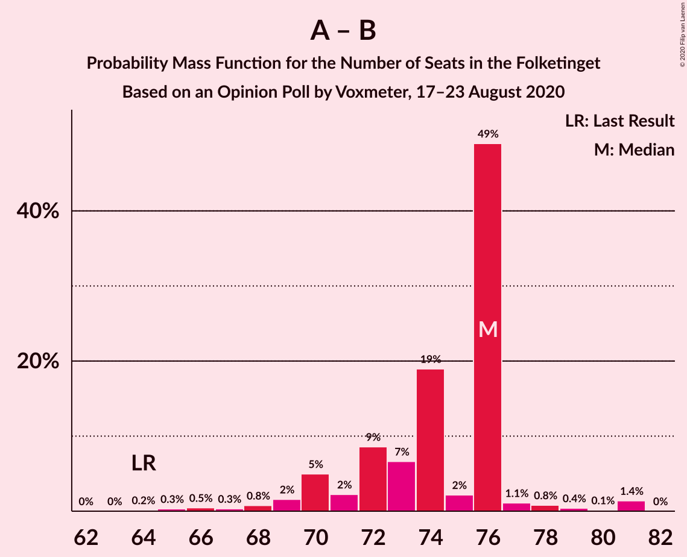

| Number of Seats | Probability | Accumulated | Special Marks |
|:---------------:|:-----------:|:-----------:|:-------------:|
| 64 | 0.2% | 100% | Last Result |
| 65 | 0.3% | 99.8% |  |
| 66 | 0.5% | 99.5% |  |
| 67 | 0.3% | 99.0% |  |
| 68 | 0.8% | 98.7% |  |
| 69 | 2% | 98% |  |
| 70 | 5% | 96% |  |
| 71 | 2% | 91% |  |
| 72 | 9% | 89% |  |
| 73 | 7% | 81% |  |
| 74 | 19% | 74% |  |
| 75 | 2% | 55% |  |
| 76 | 49% | 53% | Median |
| 77 | 1.1% | 4% |  |
| 78 | 0.8% | 3% |  |
| 79 | 0.4% | 2% |  |
| 80 | 0.1% | 2% |  |
| 81 | 1.4% | 1.4% |  |
| 82 | 0% | 0% |  |

### Venstre – Det Konservative Folkeparti – Dansk Folkeparti – Nye Borgerlige – Liberal Alliance – Stram Kurs – Kristendemokraterne – Klaus Riskær Pedersen

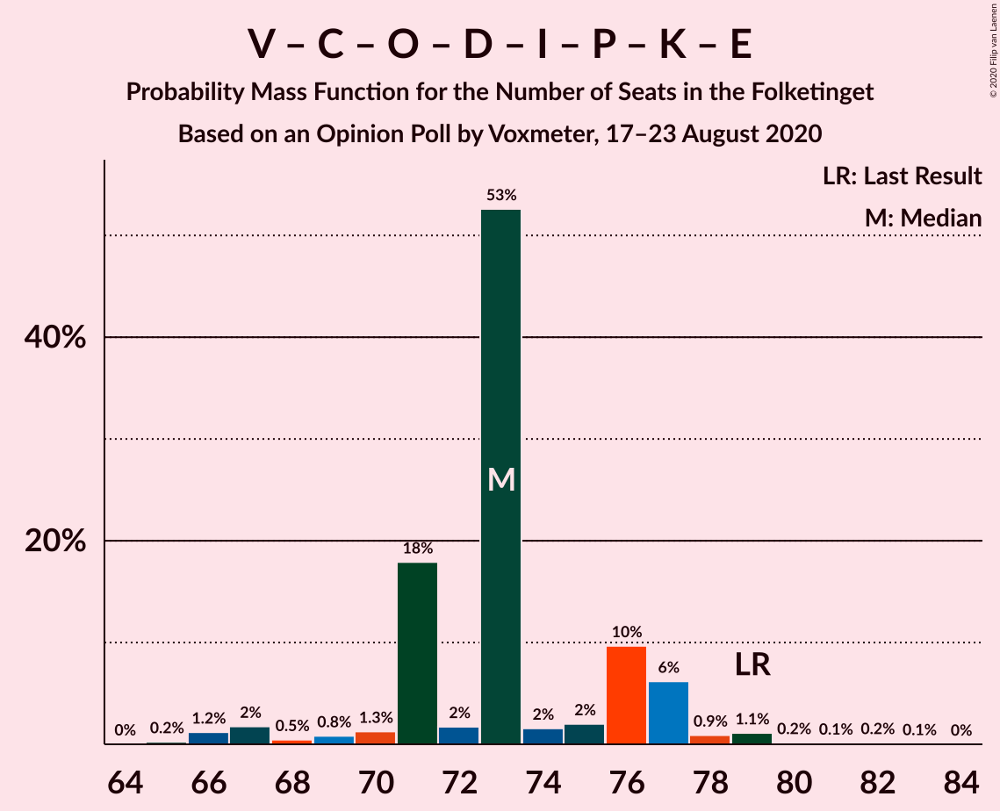

| Number of Seats | Probability | Accumulated | Special Marks |
|:---------------:|:-----------:|:-----------:|:-------------:|
| 64 | 0% | 100% |  |
| 65 | 0.2% | 99.9% |  |
| 66 | 1.2% | 99.7% |  |
| 67 | 2% | 98.5% |  |
| 68 | 0.5% | 97% |  |
| 69 | 0.8% | 96% |  |
| 70 | 1.3% | 95% |  |
| 71 | 18% | 94% |  |
| 72 | 2% | 76% |  |
| 73 | 53% | 75% | Median |
| 74 | 2% | 22% |  |
| 75 | 2% | 20% |  |
| 76 | 10% | 18% |  |
| 77 | 6% | 9% |  |
| 78 | 0.9% | 3% |  |
| 79 | 1.1% | 2% | Last Result |
| 80 | 0.2% | 0.5% |  |
| 81 | 0.1% | 0.3% |  |
| 82 | 0.2% | 0.2% |  |
| 83 | 0.1% | 0.1% |  |
| 84 | 0% | 0% |  |

### Venstre – Det Konservative Folkeparti – Dansk Folkeparti – Nye Borgerlige – Liberal Alliance – Kristendemokraterne – Klaus Riskær Pedersen

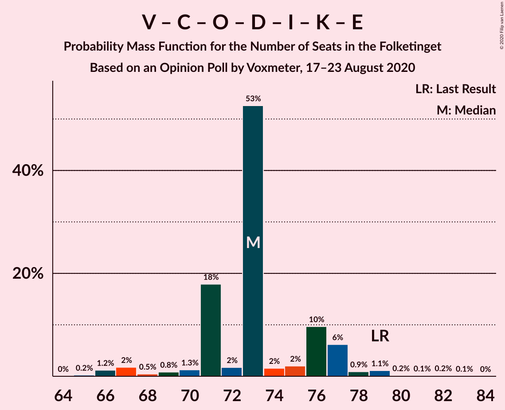

| Number of Seats | Probability | Accumulated | Special Marks |
|:---------------:|:-----------:|:-----------:|:-------------:|
| 64 | 0% | 100% |  |
| 65 | 0.2% | 99.9% |  |
| 66 | 1.2% | 99.7% |  |
| 67 | 2% | 98.5% |  |
| 68 | 0.5% | 97% |  |
| 69 | 0.8% | 96% |  |
| 70 | 1.3% | 95% |  |
| 71 | 18% | 94% |  |
| 72 | 2% | 76% |  |
| 73 | 53% | 75% | Median |
| 74 | 2% | 22% |  |
| 75 | 2% | 20% |  |
| 76 | 10% | 18% |  |
| 77 | 6% | 9% |  |
| 78 | 0.9% | 3% |  |
| 79 | 1.1% | 2% | Last Result |
| 80 | 0.2% | 0.5% |  |
| 81 | 0.1% | 0.3% |  |
| 82 | 0.2% | 0.2% |  |
| 83 | 0.1% | 0.1% |  |
| 84 | 0% | 0% |  |

### Venstre – Det Konservative Folkeparti – Dansk Folkeparti – Nye Borgerlige – Liberal Alliance – Klaus Riskær Pedersen

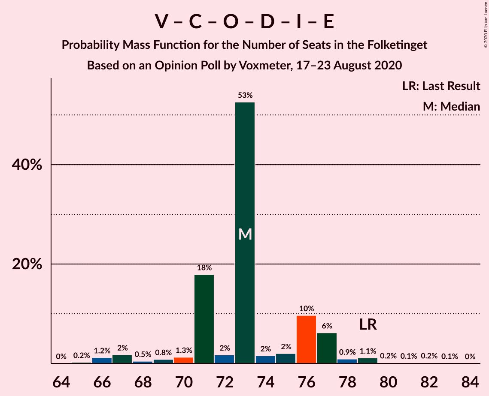

| Number of Seats | Probability | Accumulated | Special Marks |
|:---------------:|:-----------:|:-----------:|:-------------:|
| 64 | 0% | 100% |  |
| 65 | 0.2% | 99.9% |  |
| 66 | 1.2% | 99.7% |  |
| 67 | 2% | 98.5% |  |
| 68 | 0.5% | 97% |  |
| 69 | 0.8% | 96% |  |
| 70 | 1.3% | 95% |  |
| 71 | 18% | 94% |  |
| 72 | 2% | 76% |  |
| 73 | 53% | 75% | Median |
| 74 | 2% | 22% |  |
| 75 | 2% | 20% |  |
| 76 | 10% | 18% |  |
| 77 | 6% | 9% |  |
| 78 | 0.9% | 3% |  |
| 79 | 1.1% | 2% | Last Result |
| 80 | 0.2% | 0.5% |  |
| 81 | 0.1% | 0.3% |  |
| 82 | 0.2% | 0.2% |  |
| 83 | 0.1% | 0.1% |  |
| 84 | 0% | 0% |  |

### Venstre – Det Konservative Folkeparti – Dansk Folkeparti – Nye Borgerlige – Liberal Alliance – Kristendemokraterne

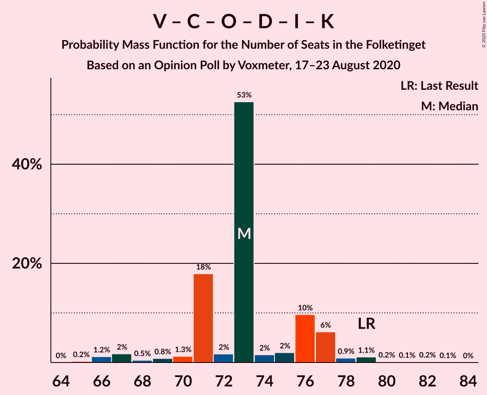

| Number of Seats | Probability | Accumulated | Special Marks |
|:---------------:|:-----------:|:-----------:|:-------------:|
| 64 | 0% | 100% |  |
| 65 | 0.2% | 99.9% |  |
| 66 | 1.2% | 99.7% |  |
| 67 | 2% | 98.5% |  |
| 68 | 0.5% | 97% |  |
| 69 | 0.8% | 96% |  |
| 70 | 1.3% | 95% |  |
| 71 | 18% | 94% |  |
| 72 | 2% | 76% |  |
| 73 | 53% | 75% | Median |
| 74 | 2% | 22% |  |
| 75 | 2% | 20% |  |
| 76 | 10% | 18% |  |
| 77 | 6% | 9% |  |
| 78 | 0.9% | 3% |  |
| 79 | 1.1% | 2% | Last Result |
| 80 | 0.2% | 0.5% |  |
| 81 | 0.1% | 0.3% |  |
| 82 | 0.2% | 0.2% |  |
| 83 | 0.1% | 0.1% |  |
| 84 | 0% | 0% |  |

### Venstre – Det Konservative Folkeparti – Dansk Folkeparti – Nye Borgerlige – Liberal Alliance

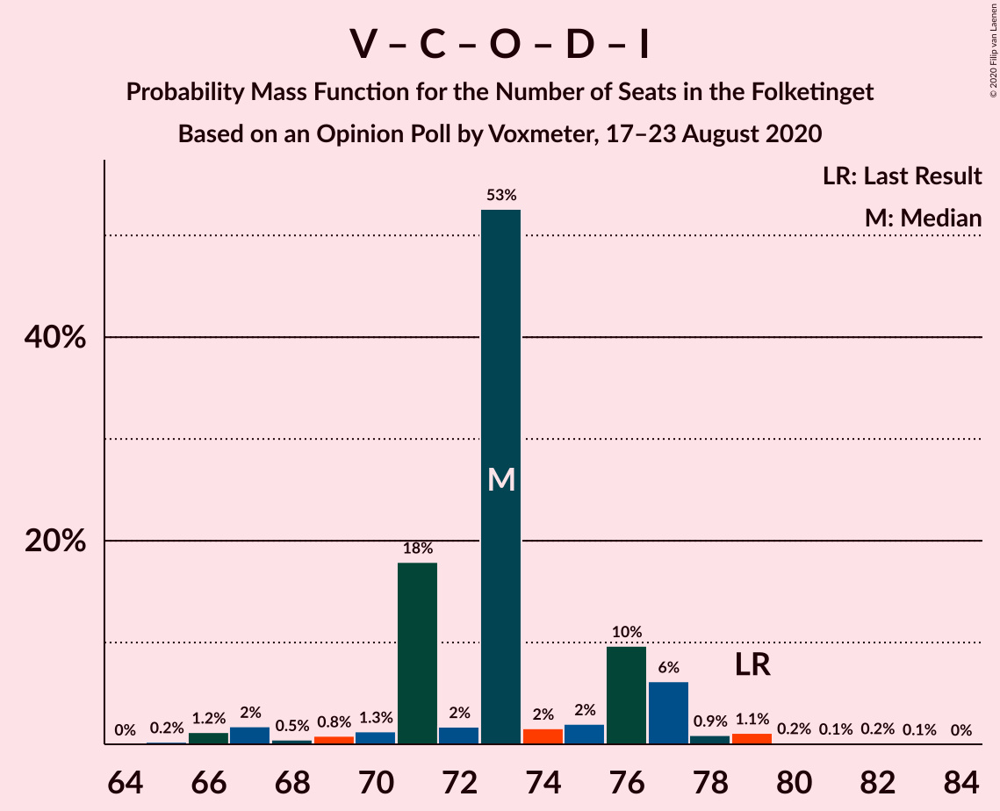

| Number of Seats | Probability | Accumulated | Special Marks |
|:---------------:|:-----------:|:-----------:|:-------------:|
| 64 | 0% | 100% |  |
| 65 | 0.2% | 99.9% |  |
| 66 | 1.2% | 99.7% |  |
| 67 | 2% | 98.5% |  |
| 68 | 0.5% | 97% |  |
| 69 | 0.8% | 96% |  |
| 70 | 1.3% | 95% |  |
| 71 | 18% | 94% |  |
| 72 | 2% | 76% |  |
| 73 | 53% | 75% | Median |
| 74 | 2% | 22% |  |
| 75 | 2% | 20% |  |
| 76 | 10% | 18% |  |
| 77 | 6% | 9% |  |
| 78 | 0.9% | 3% |  |
| 79 | 1.1% | 2% | Last Result |
| 80 | 0.2% | 0.5% |  |
| 81 | 0.1% | 0.3% |  |
| 82 | 0.2% | 0.2% |  |
| 83 | 0.1% | 0.1% |  |
| 84 | 0% | 0% |  |

### Venstre – Det Konservative Folkeparti – Dansk Folkeparti – Liberal Alliance – Kristendemokraterne

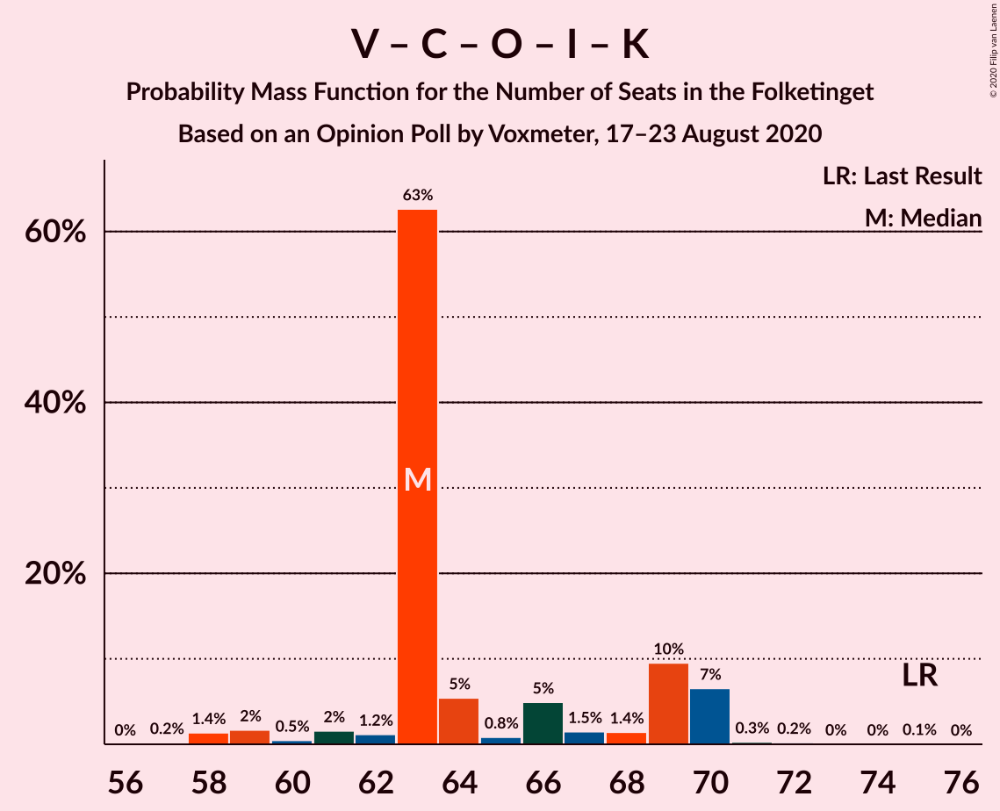

| Number of Seats | Probability | Accumulated | Special Marks |
|:---------------:|:-----------:|:-----------:|:-------------:|
| 56 | 0% | 100% |  |
| 57 | 0.2% | 99.9% |  |
| 58 | 1.4% | 99.7% |  |
| 59 | 2% | 98% |  |
| 60 | 0.5% | 97% |  |
| 61 | 2% | 96% |  |
| 62 | 1.2% | 95% |  |
| 63 | 63% | 93% |  |
| 64 | 5% | 31% | Median |
| 65 | 0.8% | 25% |  |
| 66 | 5% | 25% |  |
| 67 | 1.5% | 20% |  |
| 68 | 1.4% | 18% |  |
| 69 | 10% | 17% |  |
| 70 | 7% | 7% |  |
| 71 | 0.3% | 0.6% |  |
| 72 | 0.2% | 0.4% |  |
| 73 | 0% | 0.1% |  |
| 74 | 0% | 0.1% |  |
| 75 | 0.1% | 0.1% | Last Result |
| 76 | 0% | 0% |  |

### Venstre – Det Konservative Folkeparti – Dansk Folkeparti – Liberal Alliance

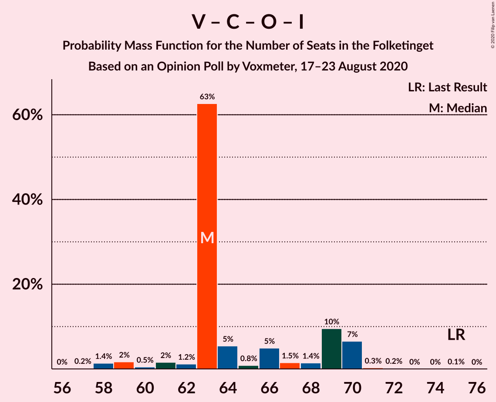

| Number of Seats | Probability | Accumulated | Special Marks |
|:---------------:|:-----------:|:-----------:|:-------------:|
| 56 | 0% | 100% |  |
| 57 | 0.2% | 99.9% |  |
| 58 | 1.4% | 99.7% |  |
| 59 | 2% | 98% |  |
| 60 | 0.5% | 97% |  |
| 61 | 2% | 96% |  |
| 62 | 1.2% | 95% |  |
| 63 | 63% | 93% |  |
| 64 | 5% | 31% | Median |
| 65 | 0.8% | 25% |  |
| 66 | 5% | 25% |  |
| 67 | 1.5% | 20% |  |
| 68 | 1.4% | 18% |  |
| 69 | 10% | 17% |  |
| 70 | 7% | 7% |  |
| 71 | 0.3% | 0.6% |  |
| 72 | 0.2% | 0.4% |  |
| 73 | 0% | 0.1% |  |
| 74 | 0% | 0.1% |  |
| 75 | 0.1% | 0.1% | Last Result |
| 76 | 0% | 0% |  |

### Venstre – Det Konservative Folkeparti – Liberal Alliance

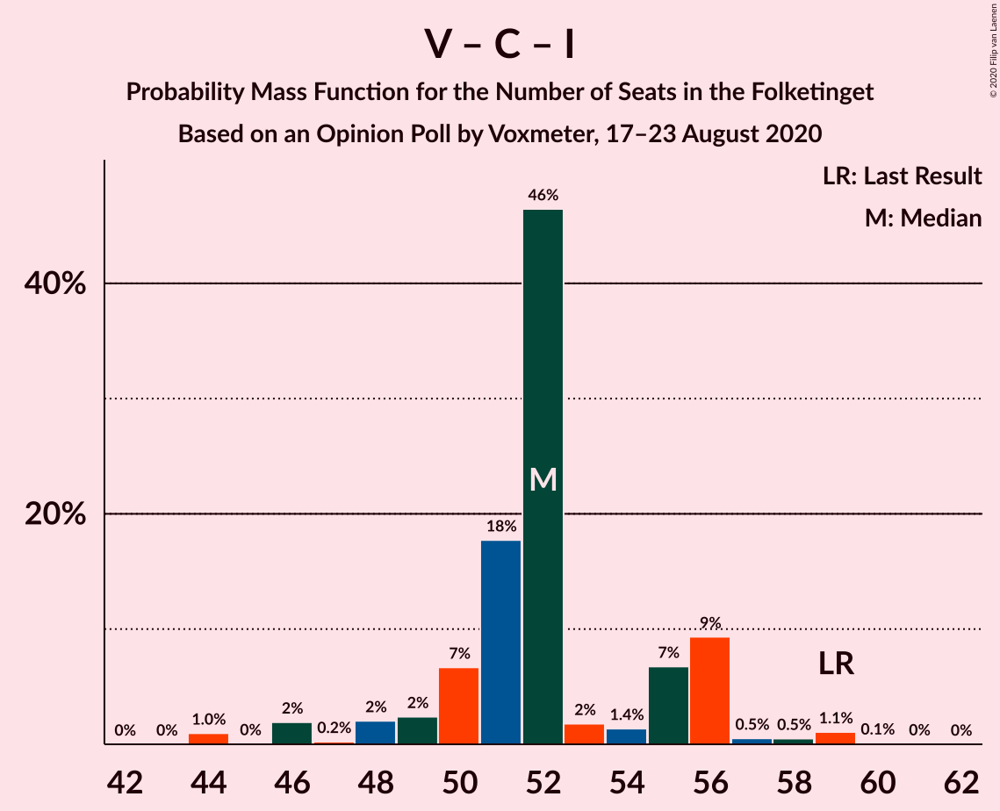

| Number of Seats | Probability | Accumulated | Special Marks |
|:---------------:|:-----------:|:-----------:|:-------------:|
| 44 | 1.0% | 100% |  |
| 45 | 0% | 99.0% |  |
| 46 | 2% | 99.0% |  |
| 47 | 0.2% | 97% |  |
| 48 | 2% | 97% |  |
| 49 | 2% | 95% |  |
| 50 | 7% | 92% |  |
| 51 | 18% | 86% |  |
| 52 | 46% | 68% | Median |
| 53 | 2% | 21% |  |
| 54 | 1.4% | 20% |  |
| 55 | 7% | 18% |  |
| 56 | 9% | 12% |  |
| 57 | 0.5% | 2% |  |
| 58 | 0.5% | 2% |  |
| 59 | 1.1% | 1.2% | Last Result |
| 60 | 0.1% | 0.2% |  |
| 61 | 0% | 0.1% |  |
| 62 | 0% | 0% |  |

### Venstre – Det Konservative Folkeparti

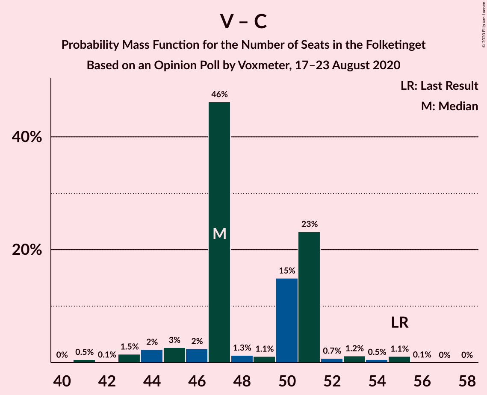

| Number of Seats | Probability | Accumulated | Special Marks |
|:---------------:|:-----------:|:-----------:|:-------------:|
| 41 | 0.5% | 100% |  |
| 42 | 0.1% | 99.4% |  |
| 43 | 1.5% | 99.4% |  |
| 44 | 2% | 98% |  |
| 45 | 3% | 96% |  |
| 46 | 2% | 93% |  |
| 47 | 46% | 90% | Median |
| 48 | 1.3% | 44% |  |
| 49 | 1.1% | 43% |  |
| 50 | 15% | 42% |  |
| 51 | 23% | 27% |  |
| 52 | 0.7% | 4% |  |
| 53 | 1.2% | 3% |  |
| 54 | 0.5% | 2% |  |
| 55 | 1.1% | 1.2% | Last Result |
| 56 | 0.1% | 0.1% |  |
| 57 | 0% | 0% |  |

### Venstre

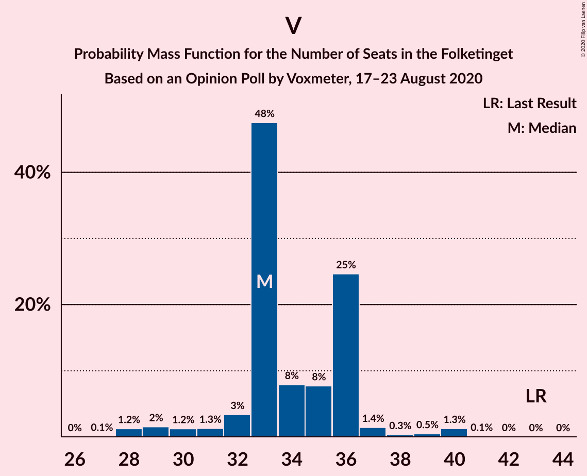

| Number of Seats | Probability | Accumulated | Special Marks |
|:---------------:|:-----------:|:-----------:|:-------------:|
| 27 | 0.1% | 100% |  |
| 28 | 1.2% | 99.9% |  |
| 29 | 2% | 98.7% |  |
| 30 | 1.2% | 97% |  |
| 31 | 1.3% | 96% |  |
| 32 | 3% | 95% |  |
| 33 | 48% | 91% | Median |
| 34 | 8% | 44% |  |
| 35 | 8% | 36% |  |
| 36 | 25% | 28% |  |
| 37 | 1.4% | 4% |  |
| 38 | 0.3% | 2% |  |
| 39 | 0.5% | 2% |  |
| 40 | 1.3% | 1.3% |  |
| 41 | 0.1% | 0.1% |  |
| 42 | 0% | 0% |  |
| 43 | 0% | 0% | Last Result |

## Technical Information

### Opinion Poll

+ **Polling firm:** Voxmeter
+ **Commissioner(s):** —
+ **Fieldwork period:** 17–23 August 2020

### Calculations

+ **Sample size:** 1037
+ **Simulations done:** 1,048,576
+ **Error estimate:** 2.36%

