# Opinion Poll by Megafon for Politiken and TV 2, 24–27 August 2020

<a href="#voting-intentions">Voting Intentions</a> | <a href="#seats">Seats</a> | <a href="#coalitions">Coalitions</a> | <a href="#technical-information">Technical Information</a>

## Voting Intentions

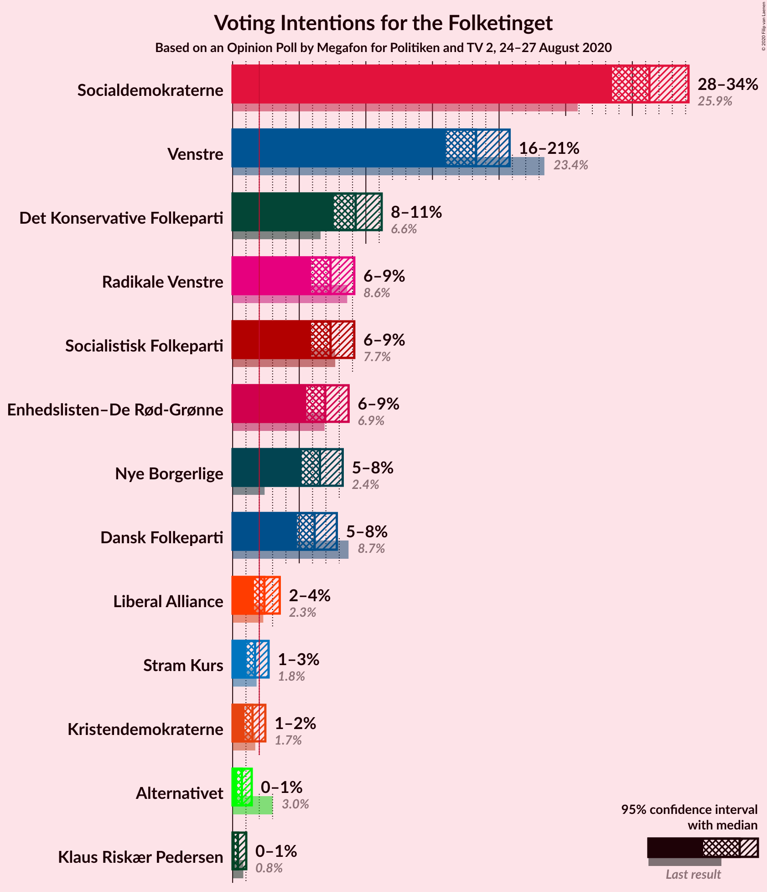

### Confidence Intervals

| Party | Last Result | Poll Result | 80% Confidence Interval | 90% Confidence Interval | 95% Confidence Interval | 99% Confidence Interval |
|:-----:|:-----------:|:-----------:|:-----------------------:|:-----------------------:|:-----------------------:|:-----------------------:|
| Socialdemokraterne | 25.9% | 31.3% | 29.4–33.2% |28.9–33.7% |28.5–34.2% |27.6–35.1% |
| Venstre | 23.4% | 18.3% | 16.8–19.9% |16.4–20.4% |16.0–20.8% |15.3–21.6% |
| Det Konservative Folkeparti | 6.6% | 9.2% | 8.2–10.5% |7.8–10.9% |7.6–11.2% |7.1–11.8% |
| Radikale Venstre | 8.6% | 7.3% | 6.4–8.5% |6.1–8.8% |5.9–9.1% |5.5–9.7% |
| Socialistisk Folkeparti | 7.7% | 7.3% | 6.4–8.5% |6.1–8.8% |5.9–9.1% |5.5–9.7% |
| Enhedslisten–De Rød-Grønne | 6.9% | 7.0% | 6.0–8.1% |5.8–8.4% |5.5–8.7% |5.1–9.3% |
| Nye Borgerlige | 2.4% | 6.6% | 5.7–7.7% |5.4–8.0% |5.2–8.3% |4.8–8.8% |
| Dansk Folkeparti | 8.7% | 6.2% | 5.3–7.2% |5.0–7.5% |4.8–7.8% |4.4–8.4% |
| Liberal Alliance | 2.3% | 2.4% | 1.9–3.1% |1.7–3.3% |1.6–3.5% |1.4–3.9% |
| Stram Kurs | 1.8% | 1.7% | 1.3–2.3% |1.1–2.5% |1.1–2.7% |0.9–3.0% |
| Kristendemokraterne | 1.7% | 1.5% | 1.1–2.1% |1.0–2.3% |0.9–2.5% |0.7–2.8% |
| Alternativet | 3.0% | 0.7% | 0.5–1.2% |0.4–1.3% |0.3–1.4% |0.2–1.7% |
| Klaus Riskær Pedersen | 0.8% | 0.4% | 0.2–0.8% |0.2–0.9% |0.2–1.0% |0.1–1.2% |

*Note:* The poll result column reflects the actual value used in the calculations. Published results may vary slightly, and in addition be rounded to fewer digits.

## Seats

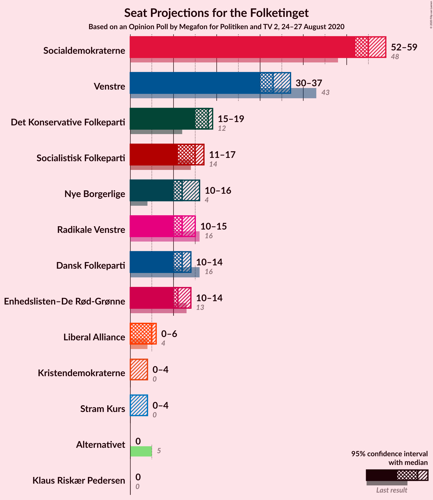

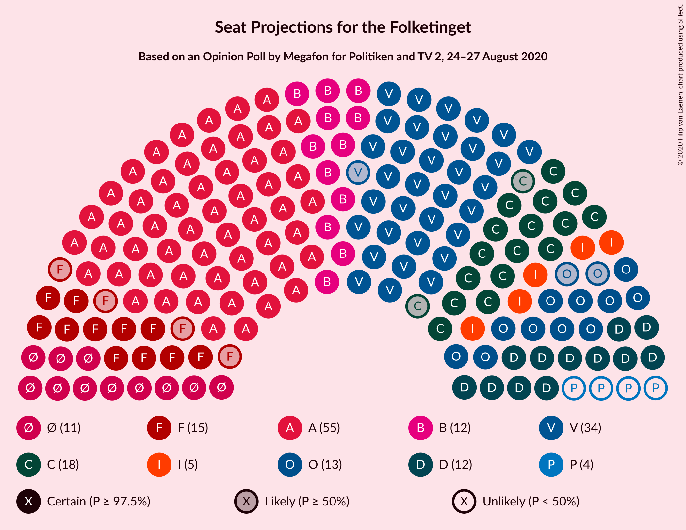

### Confidence Intervals

| Party | Last Result | Median | 80% Confidence Interval | 90% Confidence Interval | 95% Confidence Interval | 99% Confidence Interval |
|:-----:|:-----------:|:------:|:-----------------------:|:-----------------------:|:-----------------------:|:-----------------------:|
| <a href="#socialdemokraterne">Socialdemokraterne</a> | 48 | 55 | 54–58 |54–59 |52–59 |50–63 |
| <a href="#venstre">Venstre</a> | 43 | 33 | 31–34 |30–37 |30–37 |29–38 |
| <a href="#det-konservative-folkeparti">Det Konservative Folkeparti</a> | 12 | 18 | 16–18 |16–19 |15–19 |14–21 |
| <a href="#radikale-venstre">Radikale Venstre</a> | 16 | 12 | 12–14 |11–15 |10–15 |10–19 |
| <a href="#socialistisk-folkeparti">Socialistisk Folkeparti</a> | 14 | 15 | 11–15 |11–15 |11–17 |10–19 |
| <a href="#enhedslisten–de-rød-grønne">Enhedslisten–De Rød-Grønne</a> | 13 | 11 | 10–13 |10–14 |10–14 |10–16 |
| <a href="#nye-borgerlige">Nye Borgerlige</a> | 4 | 12 | 12–13 |11–14 |10–16 |9–16 |
| <a href="#dansk-folkeparti">Dansk Folkeparti</a> | 16 | 12 | 11–13 |11–14 |10–14 |9–15 |
| <a href="#liberal-alliance">Liberal Alliance</a> | 4 | 5 | 4–6 |0–6 |0–6 |0–7 |
| <a href="#stram-kurs">Stram Kurs</a> | 0 | 0 | 0–4 |0–4 |0–4 |0–4 |
| <a href="#kristendemokraterne">Kristendemokraterne</a> | 0 | 0 | 0 |0 |0–4 |0–4 |
| <a href="#alternativet">Alternativet</a> | 5 | 0 | 0 |0 |0 |0 |
| <a href="#klaus-riskær-pedersen">Klaus Riskær Pedersen</a> | 0 | 0 | 0 |0 |0 |0 |

### Socialdemokraterne

*For a full overview of the results for this party, see the [Socialdemokraterne](party-socialdemokraterne.html) page.*

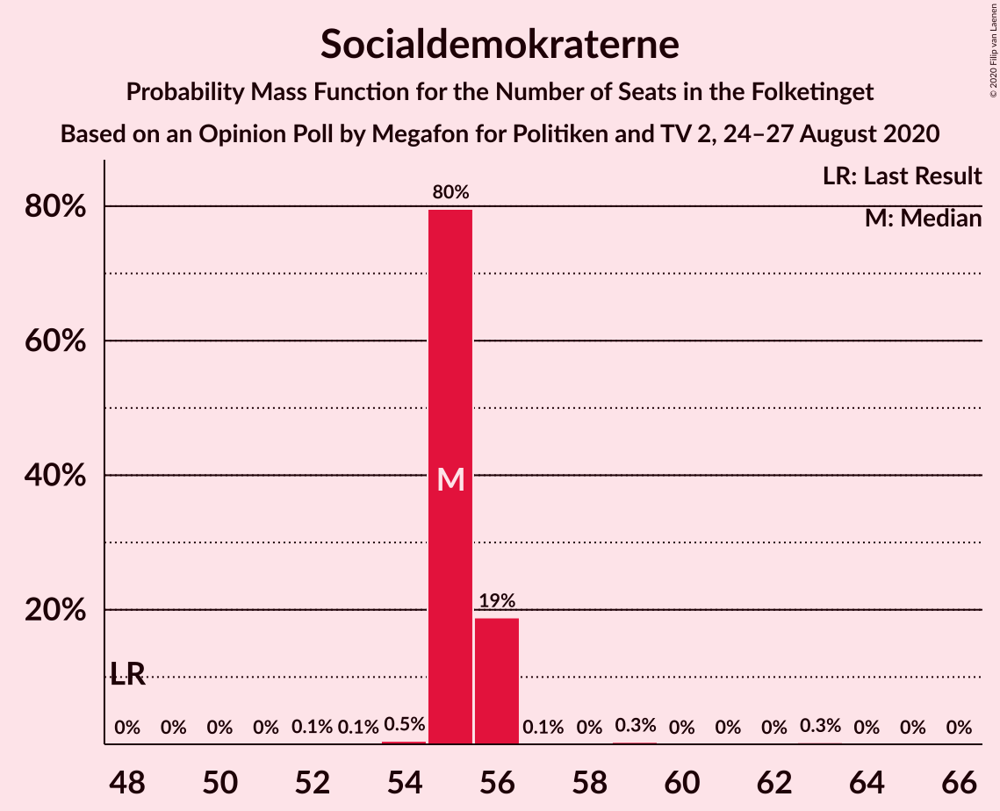

| Number of Seats | Probability | Accumulated | Special Marks |
|:---------------:|:-----------:|:-----------:|:-------------:|
| 48 | 0% | 100% | Last Result |
| 49 | 0.1% | 100% |  |
| 50 | 1.1% | 99.9% |  |
| 51 | 0.1% | 98.8% |  |
| 52 | 2% | 98.7% |  |
| 53 | 0.3% | 97% |  |
| 54 | 32% | 97% |  |
| 55 | 40% | 65% | Median |
| 56 | 10% | 24% |  |
| 57 | 3% | 14% |  |
| 58 | 2% | 11% |  |
| 59 | 7% | 9% |  |
| 60 | 0.5% | 2% |  |
| 61 | 0.5% | 1.2% |  |
| 62 | 0.1% | 0.6% |  |
| 63 | 0.4% | 0.5% |  |
| 64 | 0% | 0.2% |  |
| 65 | 0.1% | 0.1% |  |
| 66 | 0% | 0% |  |

### Venstre

*For a full overview of the results for this party, see the [Venstre](party-venstre.html) page.*

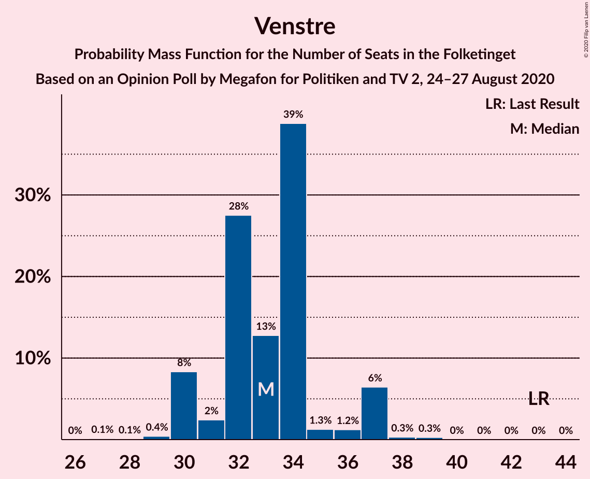

| Number of Seats | Probability | Accumulated | Special Marks |
|:---------------:|:-----------:|:-----------:|:-------------:|
| 27 | 0.1% | 100% |  |
| 28 | 0.1% | 99.9% |  |
| 29 | 0.4% | 99.8% |  |
| 30 | 8% | 99.4% |  |
| 31 | 2% | 91% |  |
| 32 | 28% | 89% |  |
| 33 | 13% | 61% | Median |
| 34 | 39% | 48% |  |
| 35 | 1.3% | 10% |  |
| 36 | 1.2% | 8% |  |
| 37 | 6% | 7% |  |
| 38 | 0.3% | 0.6% |  |
| 39 | 0.3% | 0.3% |  |
| 40 | 0% | 0% |  |
| 41 | 0% | 0% |  |
| 42 | 0% | 0% |  |
| 43 | 0% | 0% | Last Result |

### Det Konservative Folkeparti

*For a full overview of the results for this party, see the [Det Konservative Folkeparti](party-detkonservativefolkeparti.html) page.*

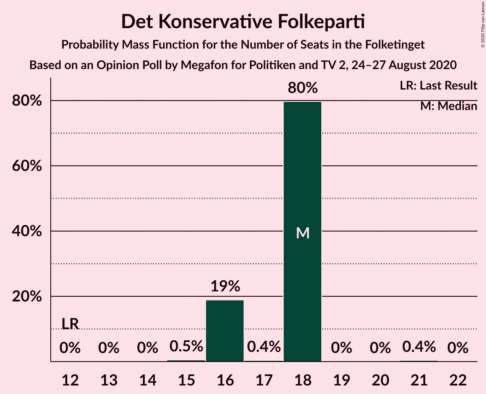

| Number of Seats | Probability | Accumulated | Special Marks |
|:---------------:|:-----------:|:-----------:|:-------------:|
| 12 | 0% | 100% | Last Result |
| 13 | 0.3% | 99.9% |  |
| 14 | 2% | 99.6% |  |
| 15 | 2% | 98% |  |
| 16 | 16% | 96% |  |
| 17 | 4% | 79% |  |
| 18 | 67% | 76% | Median |
| 19 | 6% | 9% |  |
| 20 | 2% | 2% |  |
| 21 | 0.5% | 0.5% |  |
| 22 | 0% | 0.1% |  |
| 23 | 0% | 0% |  |

### Radikale Venstre

*For a full overview of the results for this party, see the [Radikale Venstre](party-radikalevenstre.html) page.*

| Number of Seats | Probability | Accumulated | Special Marks |
|:---------------:|:-----------:|:-----------:|:-------------:|
| 9 | 0.1% | 100% |  |
| 10 | 4% | 99.9% |  |
| 11 | 2% | 96% |  |
| 12 | 47% | 95% | Median |
| 13 | 37% | 48% |  |
| 14 | 3% | 11% |  |
| 15 | 6% | 8% |  |
| 16 | 0.8% | 2% | Last Result |
| 17 | 0.1% | 0.7% |  |
| 18 | 0.1% | 0.6% |  |
| 19 | 0.5% | 0.5% |  |
| 20 | 0% | 0% |  |

### Socialistisk Folkeparti

*For a full overview of the results for this party, see the [Socialistisk Folkeparti](party-socialistiskfolkeparti.html) page.*

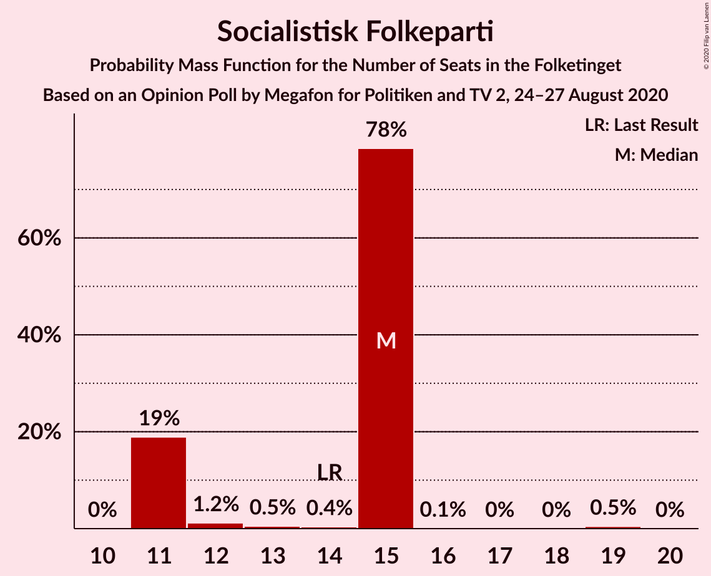

| Number of Seats | Probability | Accumulated | Special Marks |
|:---------------:|:-----------:|:-----------:|:-------------:|
| 9 | 0.3% | 100% |  |
| 10 | 0.4% | 99.7% |  |
| 11 | 10% | 99.3% |  |
| 12 | 7% | 89% |  |
| 13 | 3% | 82% |  |
| 14 | 26% | 79% | Last Result |
| 15 | 48% | 53% | Median |
| 16 | 2% | 5% |  |
| 17 | 1.3% | 3% |  |
| 18 | 0% | 1.2% |  |
| 19 | 1.2% | 1.2% |  |
| 20 | 0% | 0% |  |

### Enhedslisten–De Rød-Grønne

*For a full overview of the results for this party, see the [Enhedslisten–De Rød-Grønne](party-enhedslisten–derød-grønne.html) page.*

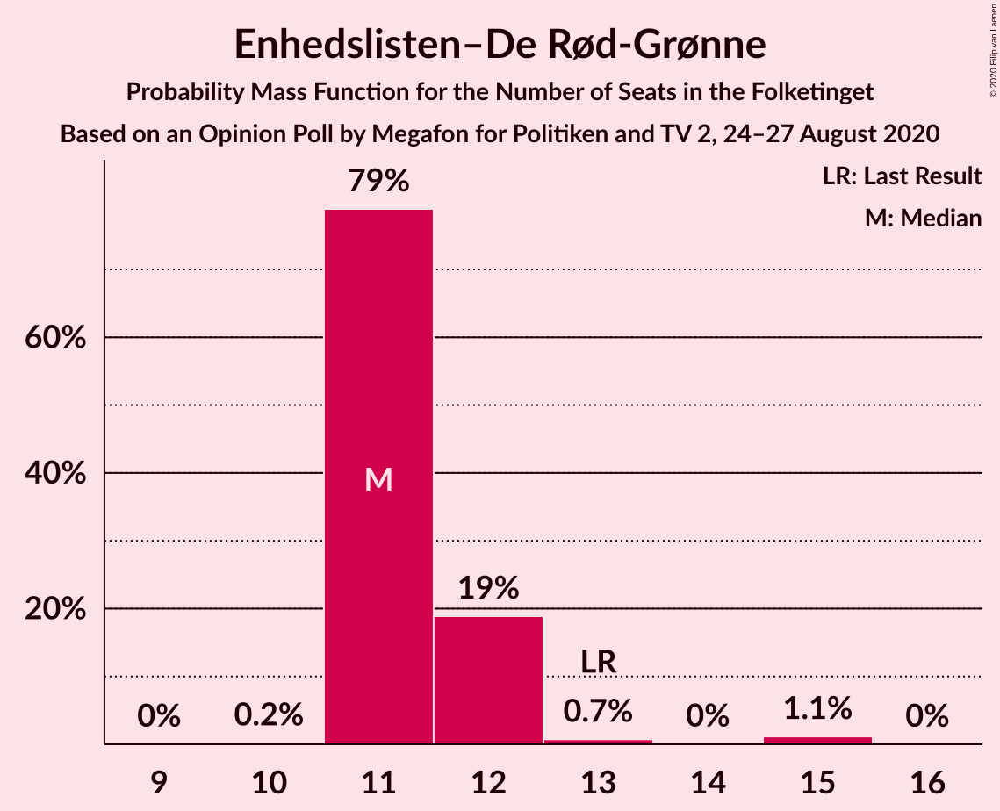

| Number of Seats | Probability | Accumulated | Special Marks |
|:---------------:|:-----------:|:-----------:|:-------------:|
| 9 | 0.4% | 100% |  |
| 10 | 35% | 99.6% |  |
| 11 | 40% | 65% | Median |
| 12 | 13% | 25% |  |
| 13 | 2% | 11% | Last Result |
| 14 | 7% | 9% |  |
| 15 | 1.1% | 2% |  |
| 16 | 1.1% | 1.2% |  |
| 17 | 0% | 0.1% |  |
| 18 | 0% | 0% |  |

### Nye Borgerlige

*For a full overview of the results for this party, see the [Nye Borgerlige](party-nyeborgerlige.html) page.*

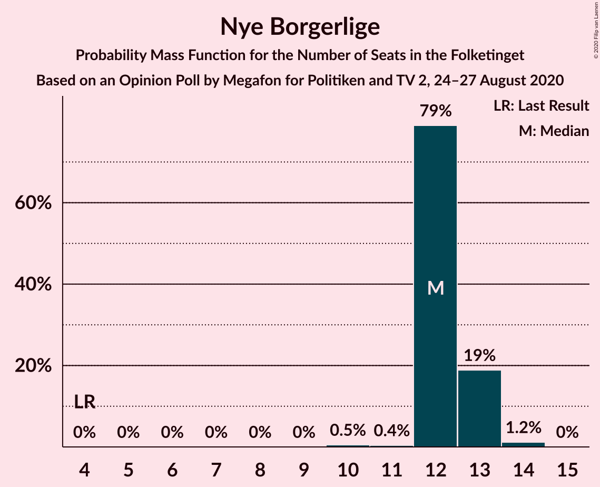

| Number of Seats | Probability | Accumulated | Special Marks |
|:---------------:|:-----------:|:-----------:|:-------------:|
| 4 | 0% | 100% | Last Result |
| 5 | 0% | 100% |  |
| 6 | 0% | 100% |  |
| 7 | 0% | 100% |  |
| 8 | 0% | 100% |  |
| 9 | 1.3% | 100% |  |
| 10 | 1.5% | 98.7% |  |
| 11 | 6% | 97% |  |
| 12 | 47% | 91% | Median |
| 13 | 39% | 44% |  |
| 14 | 0.8% | 6% |  |
| 15 | 0.4% | 5% |  |
| 16 | 4% | 4% |  |
| 17 | 0% | 0% |  |

### Dansk Folkeparti

*For a full overview of the results for this party, see the [Dansk Folkeparti](party-danskfolkeparti.html) page.*

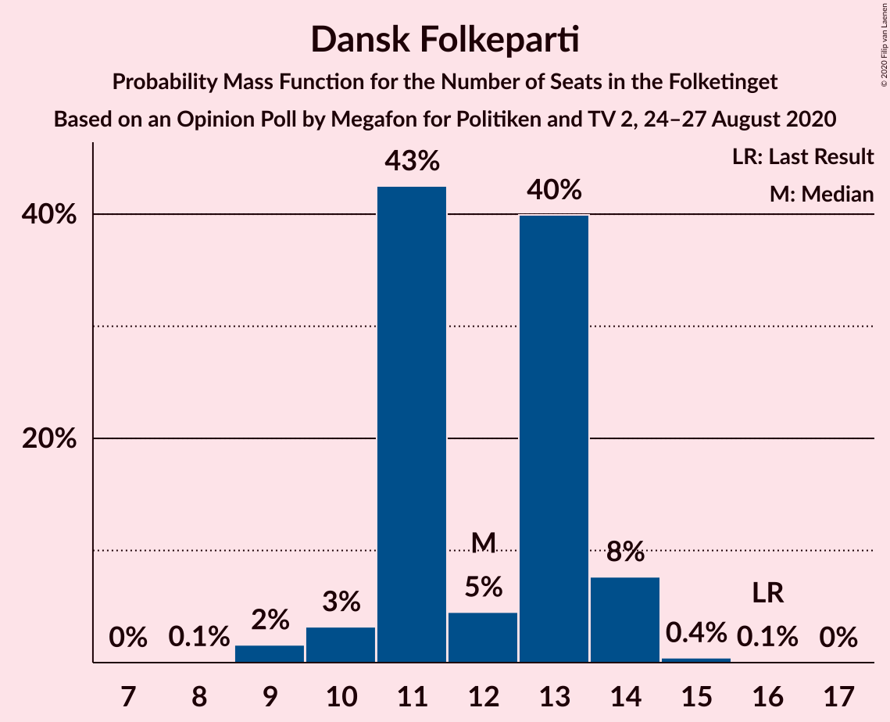

| Number of Seats | Probability | Accumulated | Special Marks |
|:---------------:|:-----------:|:-----------:|:-------------:|
| 8 | 0.1% | 100% |  |
| 9 | 2% | 99.9% |  |
| 10 | 3% | 98% |  |
| 11 | 43% | 95% |  |
| 12 | 5% | 53% | Median |
| 13 | 40% | 48% |  |
| 14 | 8% | 8% |  |
| 15 | 0.4% | 0.5% |  |
| 16 | 0.1% | 0.1% | Last Result |
| 17 | 0% | 0% |  |

### Liberal Alliance

*For a full overview of the results for this party, see the [Liberal Alliance](party-liberalalliance.html) page.*

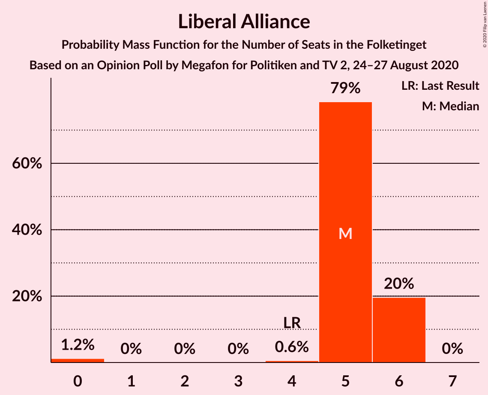

| Number of Seats | Probability | Accumulated | Special Marks |
|:---------------:|:-----------:|:-----------:|:-------------:|
| 0 | 7% | 100% |  |
| 1 | 0% | 93% |  |
| 2 | 0% | 93% |  |
| 3 | 0% | 93% |  |
| 4 | 9% | 93% | Last Result |
| 5 | 43% | 84% | Median |
| 6 | 40% | 40% |  |
| 7 | 0.2% | 0.5% |  |
| 8 | 0.3% | 0.3% |  |
| 9 | 0% | 0% |  |

### Stram Kurs

*For a full overview of the results for this party, see the [Stram Kurs](party-stramkurs.html) page.*

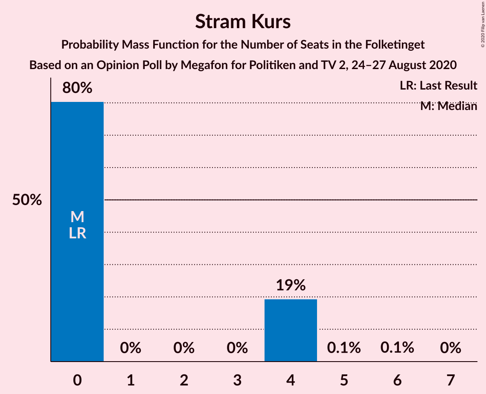

| Number of Seats | Probability | Accumulated | Special Marks |
|:---------------:|:-----------:|:-----------:|:-------------:|
| 0 | 59% | 100% | Last Result, Median |
| 1 | 0% | 41% |  |
| 2 | 0% | 41% |  |
| 3 | 0% | 41% |  |
| 4 | 40% | 41% |  |
| 5 | 0.3% | 0.4% |  |
| 6 | 0.1% | 0.1% |  |
| 7 | 0% | 0% |  |

### Kristendemokraterne

*For a full overview of the results for this party, see the [Kristendemokraterne](party-kristendemokraterne.html) page.*

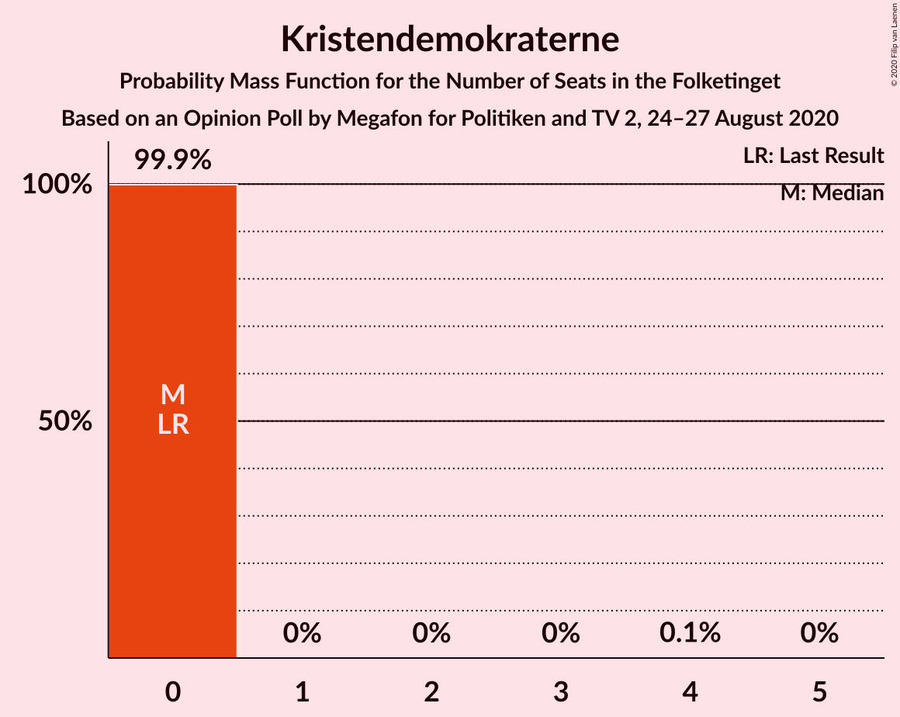

| Number of Seats | Probability | Accumulated | Special Marks |
|:---------------:|:-----------:|:-----------:|:-------------:|
| 0 | 97% | 100% | Last Result, Median |
| 1 | 0% | 3% |  |
| 2 | 0% | 3% |  |
| 3 | 0% | 3% |  |
| 4 | 3% | 3% |  |
| 5 | 0.1% | 0.2% |  |
| 6 | 0% | 0% |  |

### Alternativet

*For a full overview of the results for this party, see the [Alternativet](party-alternativet.html) page.*

| Number of Seats | Probability | Accumulated | Special Marks |
|:---------------:|:-----------:|:-----------:|:-------------:|
| 0 | 100% | 100% | Median |
| 1 | 0% | 0% |  |
| 2 | 0% | 0% |  |
| 3 | 0% | 0% |  |
| 4 | 0% | 0% |  |
| 5 | 0% | 0% | Last Result |

### Klaus Riskær Pedersen

*For a full overview of the results for this party, see the [Klaus Riskær Pedersen](party-klausriskærpedersen.html) page.*

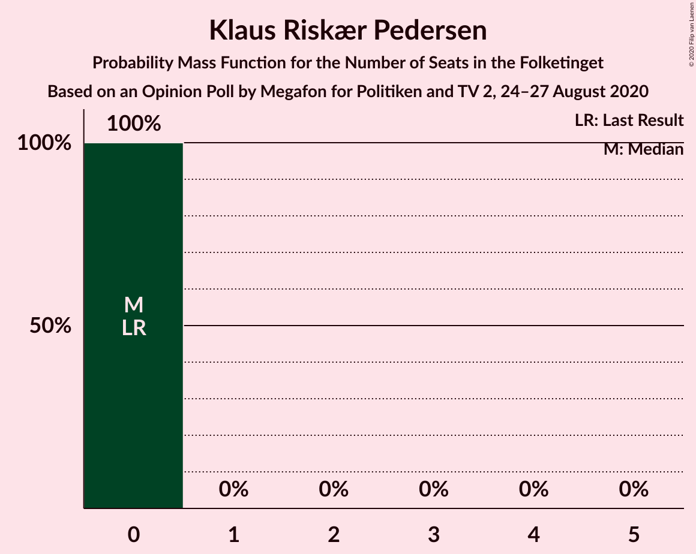

| Number of Seats | Probability | Accumulated | Special Marks |
|:---------------:|:-----------:|:-----------:|:-------------:|
| 0 | 100% | 100% | Last Result, Median |

## Coalitions

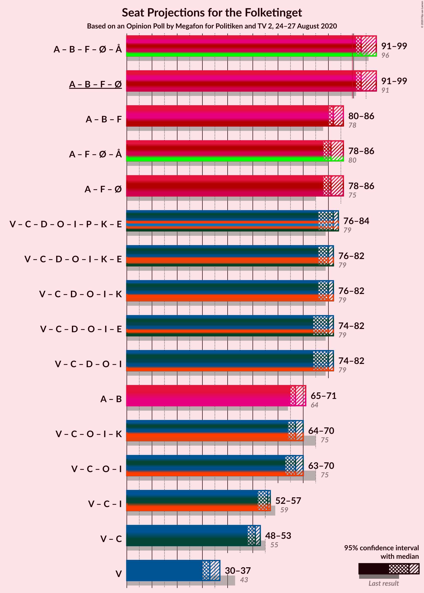

### Confidence Intervals

| Coalition | Last Result | Median | Majority? | 80% Confidence Interval | 90% Confidence Interval | 95% Confidence Interval | 99% Confidence Interval |
|:---------:|:-----------:|:------:|:---------:|:-----------------------:|:-----------------------:|:-----------------------:|:-----------------------:|
| Socialdemokraterne – Radikale Venstre – Socialistisk Folkeparti – Enhedslisten–De Rød-Grønne – Alternativet | 96 | 93 | 99.7% | 91–96 | 91–97 | 91–99 | 91–101 |
| Socialdemokraterne – Radikale Venstre – Socialistisk Folkeparti – Enhedslisten–De Rød-Grønne | 91 | 93 | 99.7% | 91–96 | 91–97 | 91–99 | 91–101 |
| Socialdemokraterne – Radikale Venstre – Socialistisk Folkeparti | 78 | 82 | 0.3% | 80–86 | 80–86 | 80–86 | 79–89 |
| Socialdemokraterne – Socialistisk Folkeparti – Enhedslisten–De Rød-Grønne – Alternativet | 80 | 81 | 0.1% | 78–84 | 78–84 | 78–86 | 78–88 |
| Socialdemokraterne – Socialistisk Folkeparti – Enhedslisten–De Rød-Grønne | 75 | 81 | 0.1% | 78–84 | 78–84 | 78–86 | 78–88 |
| Venstre – Det Konservative Folkeparti – Nye Borgerlige – Dansk Folkeparti – Liberal Alliance – Stram Kurs – Kristendemokraterne – Klaus Riskær Pedersen | 79 | 82 | 0% | 79–84 | 78–84 | 76–84 | 74–84 |
| Venstre – Det Konservative Folkeparti – Nye Borgerlige – Dansk Folkeparti – Liberal Alliance – Kristendemokraterne – Klaus Riskær Pedersen | 79 | 80 | 0% | 79–82 | 77–82 | 76–82 | 72–82 |
| Venstre – Det Konservative Folkeparti – Nye Borgerlige – Dansk Folkeparti – Liberal Alliance – Kristendemokraterne | 79 | 80 | 0% | 79–82 | 77–82 | 76–82 | 72–82 |
| Venstre – Det Konservative Folkeparti – Nye Borgerlige – Dansk Folkeparti – Liberal Alliance – Klaus Riskær Pedersen | 79 | 80 | 0% | 79–82 | 76–82 | 74–82 | 70–82 |
| Venstre – Det Konservative Folkeparti – Nye Borgerlige – Dansk Folkeparti – Liberal Alliance | 79 | 80 | 0% | 79–82 | 76–82 | 74–82 | 70–82 |
| Socialdemokraterne – Radikale Venstre | 64 | 67 | 0% | 67–71 | 67–71 | 65–71 | 62–76 |
| Venstre – Det Konservative Folkeparti – Dansk Folkeparti – Liberal Alliance – Kristendemokraterne | 75 | 67 | 0% | 66–70 | 64–70 | 64–70 | 60–72 |
| Venstre – Det Konservative Folkeparti – Dansk Folkeparti – Liberal Alliance | 75 | 67 | 0% | 64–70 | 64–70 | 63–70 | 58–72 |
| Venstre – Det Konservative Folkeparti – Liberal Alliance | 59 | 56 | 0% | 53–57 | 53–57 | 52–57 | 48–58 |
| Venstre – Det Konservative Folkeparti | 55 | 51 | 0% | 49–52 | 49–53 | 48–53 | 45–55 |
| Venstre | 43 | 33 | 0% | 31–34 | 30–37 | 30–37 | 29–38 |

### Socialdemokraterne – Radikale Venstre – Socialistisk Folkeparti – Enhedslisten–De Rød-Grønne – Alternativet

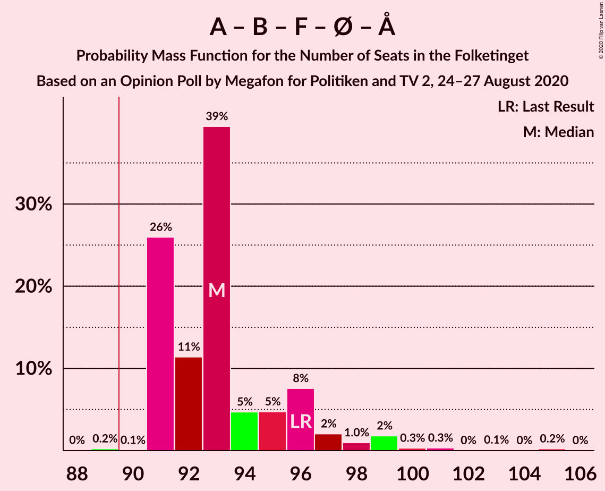

| Number of Seats | Probability | Accumulated | Special Marks |
|:---------------:|:-----------:|:-----------:|:-------------:|
| 88 | 0% | 100% |  |
| 89 | 0.2% | 99.9% |  |
| 90 | 0.1% | 99.7% | Majority |
| 91 | 26% | 99.6% |  |
| 92 | 11% | 74% |  |
| 93 | 39% | 62% | Median |
| 94 | 5% | 23% |  |
| 95 | 5% | 18% |  |
| 96 | 8% | 13% | Last Result |
| 97 | 2% | 6% |  |
| 98 | 1.0% | 4% |  |
| 99 | 2% | 3% |  |
| 100 | 0.3% | 1.0% |  |
| 101 | 0.3% | 0.7% |  |
| 102 | 0% | 0.4% |  |
| 103 | 0.1% | 0.4% |  |
| 104 | 0% | 0.3% |  |
| 105 | 0.2% | 0.3% |  |
| 106 | 0% | 0% |  |

### Socialdemokraterne – Radikale Venstre – Socialistisk Folkeparti – Enhedslisten–De Rød-Grønne

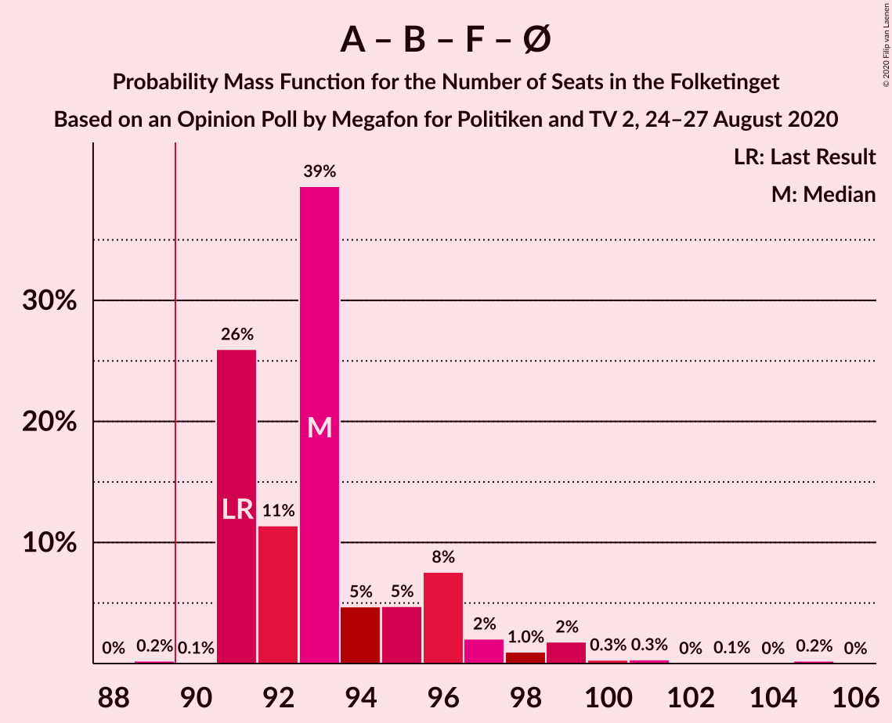

| Number of Seats | Probability | Accumulated | Special Marks |
|:---------------:|:-----------:|:-----------:|:-------------:|
| 88 | 0% | 100% |  |
| 89 | 0.2% | 99.9% |  |
| 90 | 0.1% | 99.7% | Majority |
| 91 | 26% | 99.6% | Last Result |
| 92 | 11% | 74% |  |
| 93 | 39% | 62% | Median |
| 94 | 5% | 23% |  |
| 95 | 5% | 18% |  |
| 96 | 8% | 13% |  |
| 97 | 2% | 6% |  |
| 98 | 1.0% | 4% |  |
| 99 | 2% | 3% |  |
| 100 | 0.3% | 1.0% |  |
| 101 | 0.3% | 0.7% |  |
| 102 | 0% | 0.4% |  |
| 103 | 0.1% | 0.4% |  |
| 104 | 0% | 0.3% |  |
| 105 | 0.2% | 0.3% |  |
| 106 | 0% | 0% |  |

### Socialdemokraterne – Radikale Venstre – Socialistisk Folkeparti

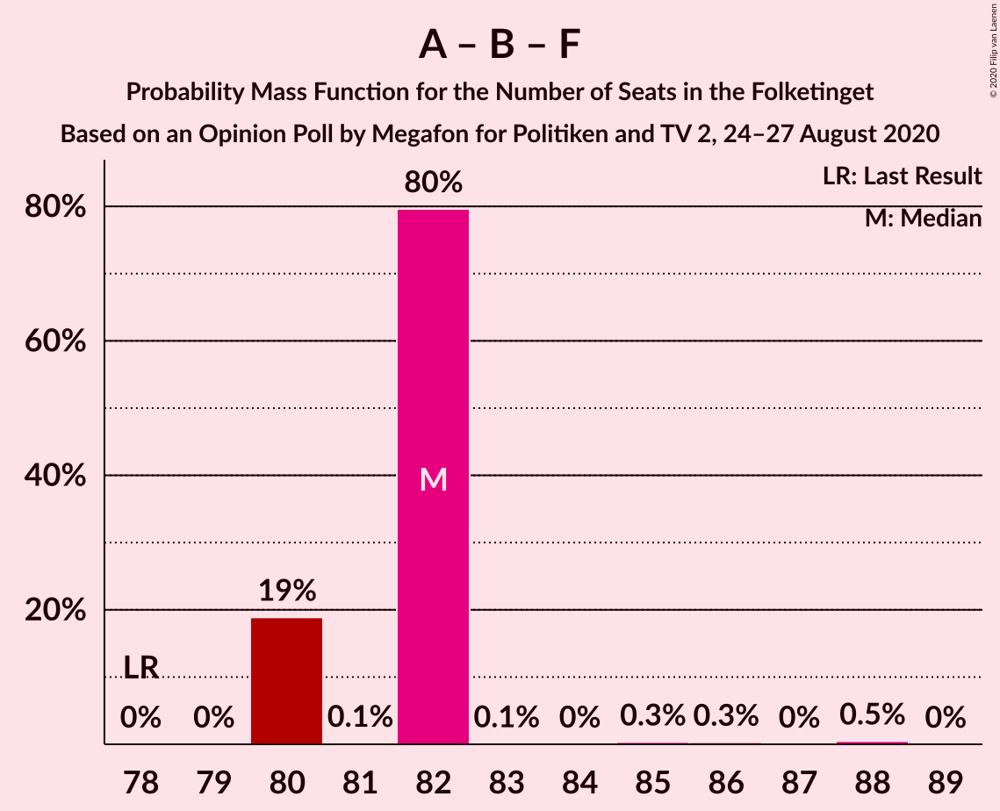

| Number of Seats | Probability | Accumulated | Special Marks |
|:---------------:|:-----------:|:-----------:|:-------------:|
| 76 | 0.1% | 100% |  |
| 77 | 0.1% | 99.9% |  |
| 78 | 0.2% | 99.8% | Last Result |
| 79 | 0.6% | 99.6% |  |
| 80 | 13% | 99.1% |  |
| 81 | 32% | 86% |  |
| 82 | 39% | 54% | Median |
| 83 | 2% | 15% |  |
| 84 | 2% | 13% |  |
| 85 | 0.4% | 11% |  |
| 86 | 9% | 10% |  |
| 87 | 0.3% | 1.5% |  |
| 88 | 0.4% | 1.2% |  |
| 89 | 0.5% | 0.8% |  |
| 90 | 0.1% | 0.3% | Majority |
| 91 | 0% | 0.2% |  |
| 92 | 0% | 0.2% |  |
| 93 | 0% | 0.2% |  |
| 94 | 0.2% | 0.2% |  |
| 95 | 0% | 0% |  |

### Socialdemokraterne – Socialistisk Folkeparti – Enhedslisten–De Rød-Grønne – Alternativet

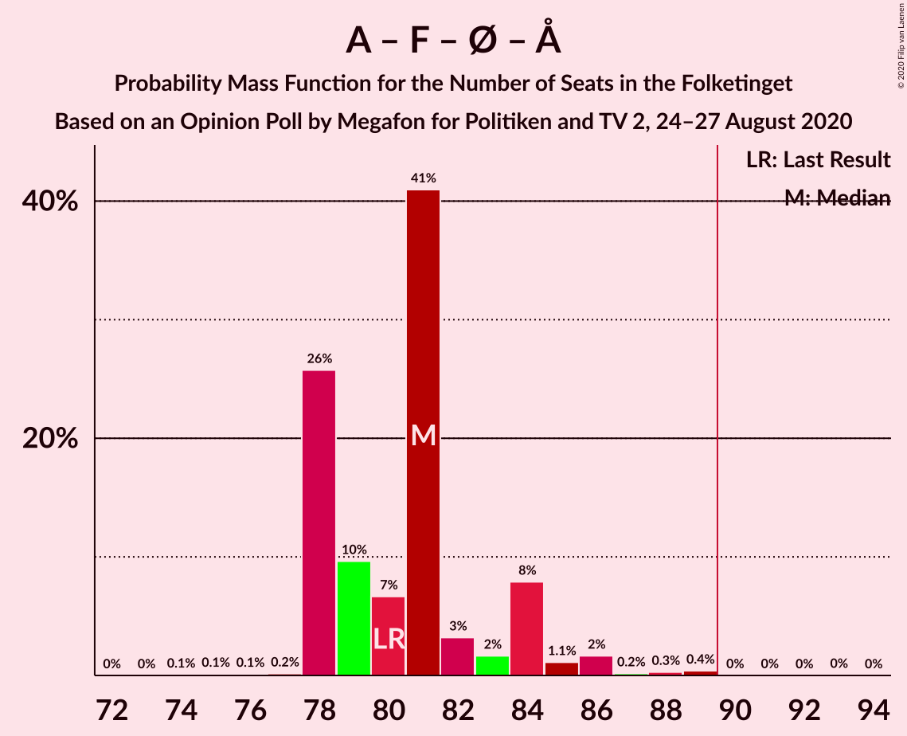

| Number of Seats | Probability | Accumulated | Special Marks |
|:---------------:|:-----------:|:-----------:|:-------------:|
| 74 | 0.1% | 100% |  |
| 75 | 0.1% | 99.9% |  |
| 76 | 0.1% | 99.8% |  |
| 77 | 0.2% | 99.7% |  |
| 78 | 26% | 99.5% |  |
| 79 | 10% | 74% |  |
| 80 | 7% | 64% | Last Result |
| 81 | 41% | 57% | Median |
| 82 | 3% | 16% |  |
| 83 | 2% | 13% |  |
| 84 | 8% | 12% |  |
| 85 | 1.1% | 4% |  |
| 86 | 2% | 3% |  |
| 87 | 0.2% | 1.0% |  |
| 88 | 0.3% | 0.8% |  |
| 89 | 0.4% | 0.5% |  |
| 90 | 0% | 0.1% | Majority |
| 91 | 0% | 0.1% |  |
| 92 | 0% | 0.1% |  |
| 93 | 0% | 0.1% |  |
| 94 | 0% | 0% |  |

### Socialdemokraterne – Socialistisk Folkeparti – Enhedslisten–De Rød-Grønne

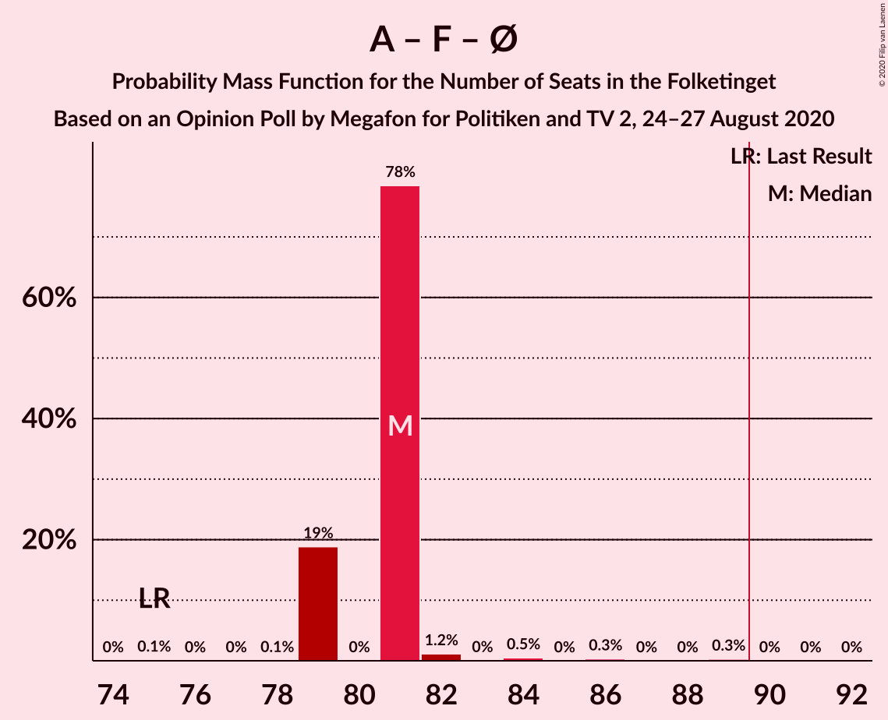

| Number of Seats | Probability | Accumulated | Special Marks |
|:---------------:|:-----------:|:-----------:|:-------------:|
| 74 | 0.1% | 100% |  |
| 75 | 0.1% | 99.9% | Last Result |
| 76 | 0.1% | 99.8% |  |
| 77 | 0.2% | 99.7% |  |
| 78 | 26% | 99.5% |  |
| 79 | 10% | 74% |  |
| 80 | 7% | 64% |  |
| 81 | 41% | 57% | Median |
| 82 | 3% | 16% |  |
| 83 | 2% | 13% |  |
| 84 | 8% | 12% |  |
| 85 | 1.1% | 4% |  |
| 86 | 2% | 3% |  |
| 87 | 0.2% | 0.9% |  |
| 88 | 0.3% | 0.8% |  |
| 89 | 0.4% | 0.5% |  |
| 90 | 0% | 0.1% | Majority |
| 91 | 0% | 0.1% |  |
| 92 | 0% | 0.1% |  |
| 93 | 0% | 0.1% |  |
| 94 | 0% | 0% |  |

### Venstre – Det Konservative Folkeparti – Nye Borgerlige – Dansk Folkeparti – Liberal Alliance – Stram Kurs – Kristendemokraterne – Klaus Riskær Pedersen

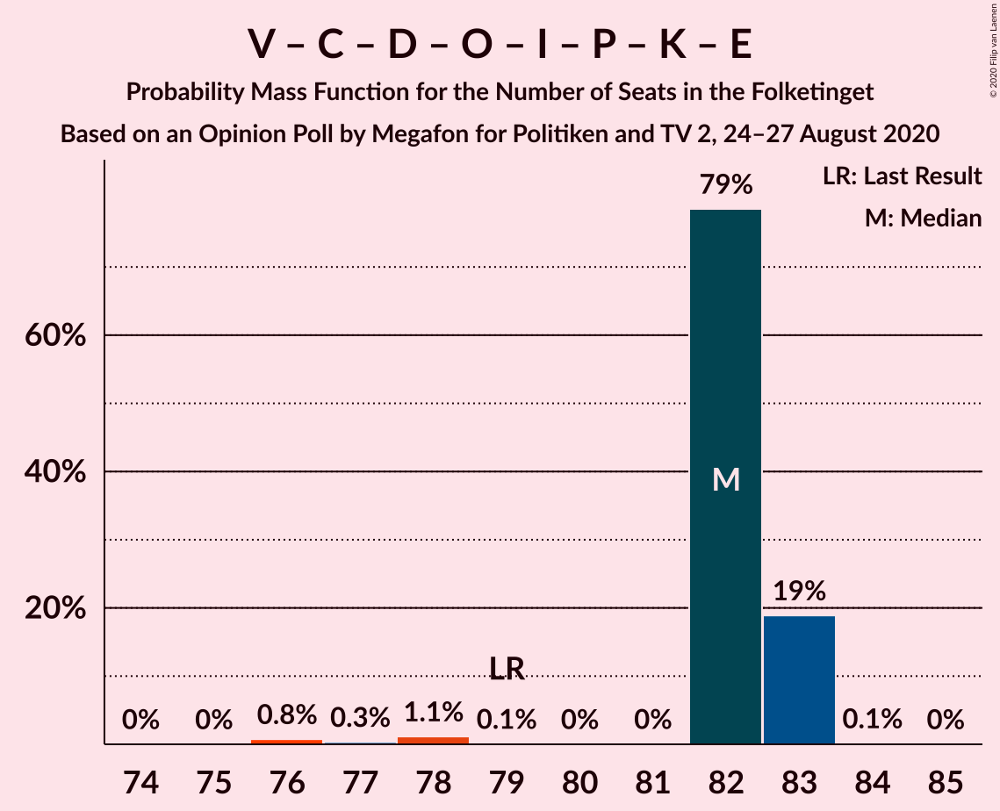

| Number of Seats | Probability | Accumulated | Special Marks |
|:---------------:|:-----------:|:-----------:|:-------------:|
| 70 | 0.2% | 100% |  |
| 71 | 0% | 99.7% |  |
| 72 | 0.1% | 99.7% |  |
| 73 | 0% | 99.6% |  |
| 74 | 0.3% | 99.6% |  |
| 75 | 0.3% | 99.3% |  |
| 76 | 2% | 99.0% |  |
| 77 | 1.0% | 97% |  |
| 78 | 2% | 96% |  |
| 79 | 8% | 94% | Last Result |
| 80 | 5% | 87% | Median |
| 81 | 5% | 82% |  |
| 82 | 39% | 77% |  |
| 83 | 11% | 38% |  |
| 84 | 26% | 26% |  |
| 85 | 0.1% | 0.4% |  |
| 86 | 0.2% | 0.3% |  |
| 87 | 0% | 0.1% |  |
| 88 | 0% | 0% |  |

### Venstre – Det Konservative Folkeparti – Nye Borgerlige – Dansk Folkeparti – Liberal Alliance – Kristendemokraterne – Klaus Riskær Pedersen

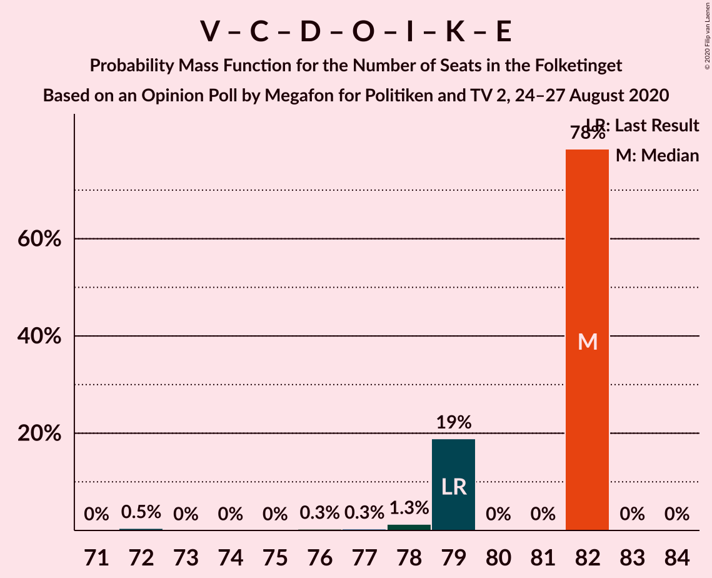

| Number of Seats | Probability | Accumulated | Special Marks |
|:---------------:|:-----------:|:-----------:|:-------------:|
| 68 | 0% | 100% |  |
| 69 | 0% | 99.9% |  |
| 70 | 0.3% | 99.9% |  |
| 71 | 0.1% | 99.6% |  |
| 72 | 0.3% | 99.5% |  |
| 73 | 0% | 99.2% |  |
| 74 | 0.6% | 99.2% |  |
| 75 | 0.4% | 98.7% |  |
| 76 | 2% | 98% |  |
| 77 | 2% | 97% |  |
| 78 | 3% | 94% |  |
| 79 | 19% | 91% | Last Result |
| 80 | 30% | 73% | Median |
| 81 | 3% | 42% |  |
| 82 | 39% | 39% |  |
| 83 | 0.2% | 0.4% |  |
| 84 | 0.1% | 0.2% |  |
| 85 | 0% | 0.1% |  |
| 86 | 0% | 0% |  |

### Venstre – Det Konservative Folkeparti – Nye Borgerlige – Dansk Folkeparti – Liberal Alliance – Kristendemokraterne

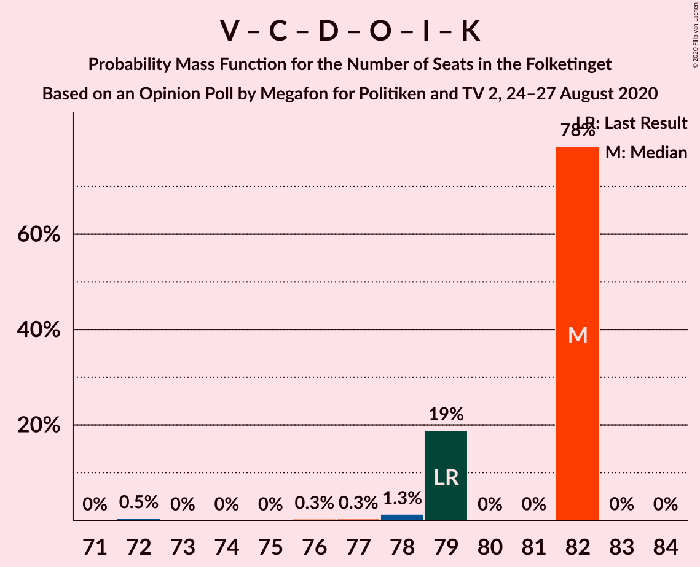

| Number of Seats | Probability | Accumulated | Special Marks |
|:---------------:|:-----------:|:-----------:|:-------------:|
| 68 | 0% | 100% |  |
| 69 | 0% | 99.9% |  |
| 70 | 0.3% | 99.9% |  |
| 71 | 0.1% | 99.6% |  |
| 72 | 0.3% | 99.5% |  |
| 73 | 0% | 99.2% |  |
| 74 | 0.6% | 99.2% |  |
| 75 | 0.4% | 98.7% |  |
| 76 | 2% | 98% |  |
| 77 | 2% | 97% |  |
| 78 | 3% | 94% |  |
| 79 | 19% | 91% | Last Result |
| 80 | 30% | 73% | Median |
| 81 | 3% | 42% |  |
| 82 | 39% | 39% |  |
| 83 | 0.2% | 0.4% |  |
| 84 | 0.1% | 0.2% |  |
| 85 | 0% | 0.1% |  |
| 86 | 0% | 0% |  |

### Venstre – Det Konservative Folkeparti – Nye Borgerlige – Dansk Folkeparti – Liberal Alliance – Klaus Riskær Pedersen

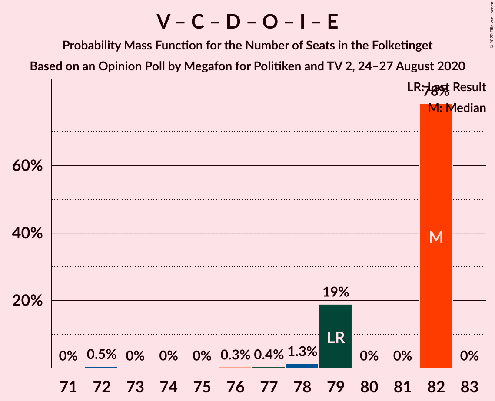

| Number of Seats | Probability | Accumulated | Special Marks |
|:---------------:|:-----------:|:-----------:|:-------------:|
| 67 | 0% | 100% |  |
| 68 | 0% | 99.9% |  |
| 69 | 0% | 99.9% |  |
| 70 | 0.6% | 99.9% |  |
| 71 | 0.2% | 99.3% |  |
| 72 | 0.3% | 99.1% |  |
| 73 | 0.5% | 98.8% |  |
| 74 | 1.4% | 98% |  |
| 75 | 0.4% | 97% |  |
| 76 | 2% | 96% |  |
| 77 | 2% | 95% |  |
| 78 | 2% | 92% |  |
| 79 | 18% | 90% | Last Result |
| 80 | 30% | 72% | Median |
| 81 | 3% | 42% |  |
| 82 | 38% | 39% |  |
| 83 | 0.2% | 0.3% |  |
| 84 | 0.1% | 0.1% |  |
| 85 | 0% | 0% |  |

### Venstre – Det Konservative Folkeparti – Nye Borgerlige – Dansk Folkeparti – Liberal Alliance

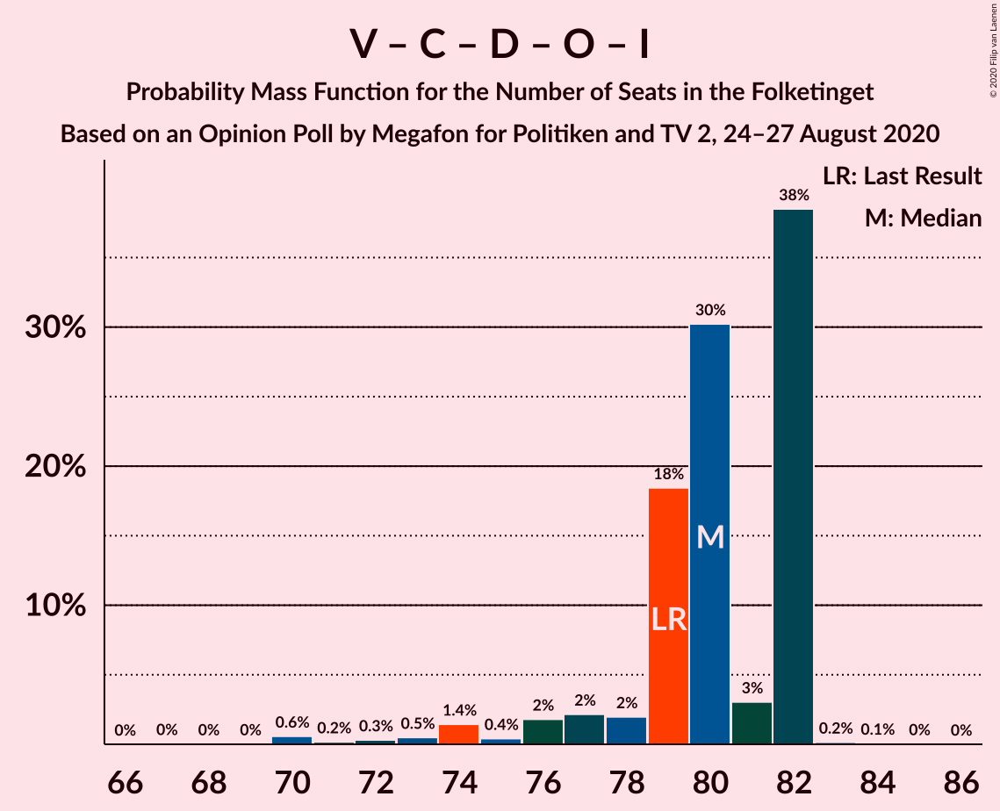

| Number of Seats | Probability | Accumulated | Special Marks |
|:---------------:|:-----------:|:-----------:|:-------------:|
| 67 | 0% | 100% |  |
| 68 | 0% | 99.9% |  |
| 69 | 0% | 99.9% |  |
| 70 | 0.6% | 99.9% |  |
| 71 | 0.2% | 99.3% |  |
| 72 | 0.3% | 99.1% |  |
| 73 | 0.5% | 98.8% |  |
| 74 | 1.4% | 98% |  |
| 75 | 0.4% | 97% |  |
| 76 | 2% | 96% |  |
| 77 | 2% | 95% |  |
| 78 | 2% | 92% |  |
| 79 | 18% | 90% | Last Result |
| 80 | 30% | 72% | Median |
| 81 | 3% | 42% |  |
| 82 | 38% | 39% |  |
| 83 | 0.2% | 0.3% |  |
| 84 | 0.1% | 0.1% |  |
| 85 | 0% | 0% |  |

### Socialdemokraterne – Radikale Venstre

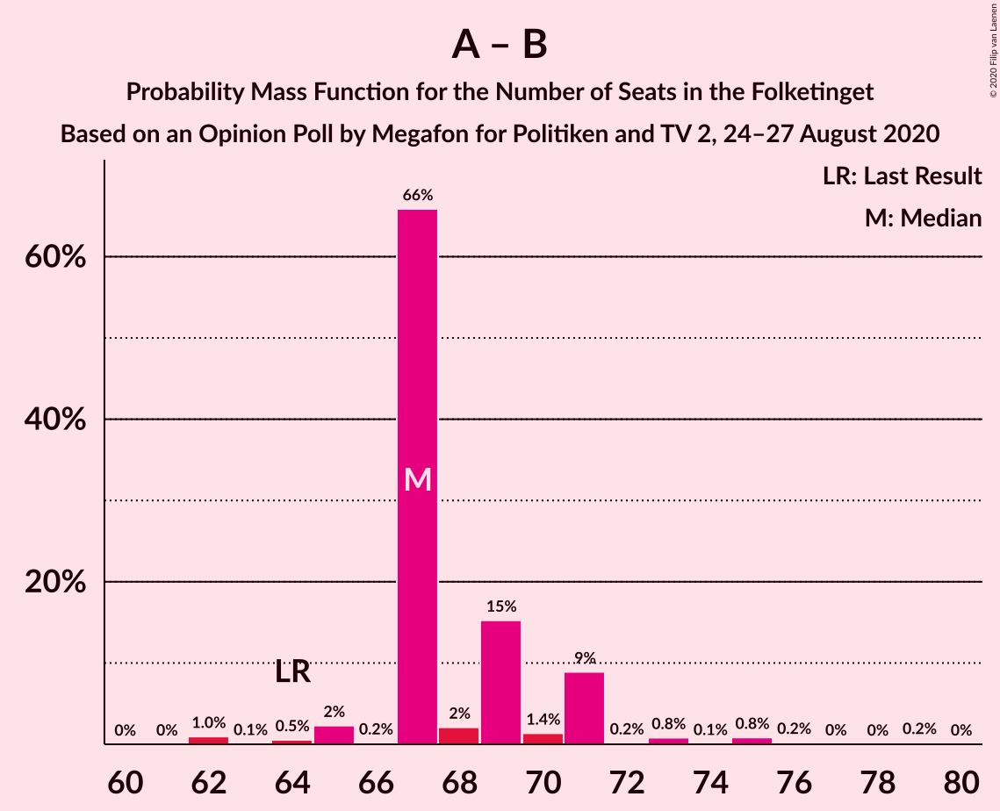

| Number of Seats | Probability | Accumulated | Special Marks |
|:---------------:|:-----------:|:-----------:|:-------------:|
| 62 | 1.0% | 100% |  |
| 63 | 0.1% | 99.0% |  |
| 64 | 0.5% | 98.9% | Last Result |
| 65 | 2% | 98% |  |
| 66 | 0.2% | 96% |  |
| 67 | 66% | 96% | Median |
| 68 | 2% | 30% |  |
| 69 | 15% | 28% |  |
| 70 | 1.4% | 13% |  |
| 71 | 9% | 11% |  |
| 72 | 0.2% | 2% |  |
| 73 | 0.8% | 2% |  |
| 74 | 0.1% | 1.4% |  |
| 75 | 0.8% | 1.3% |  |
| 76 | 0.2% | 0.5% |  |
| 77 | 0% | 0.3% |  |
| 78 | 0% | 0.2% |  |
| 79 | 0.2% | 0.2% |  |
| 80 | 0% | 0% |  |

### Venstre – Det Konservative Folkeparti – Dansk Folkeparti – Liberal Alliance – Kristendemokraterne

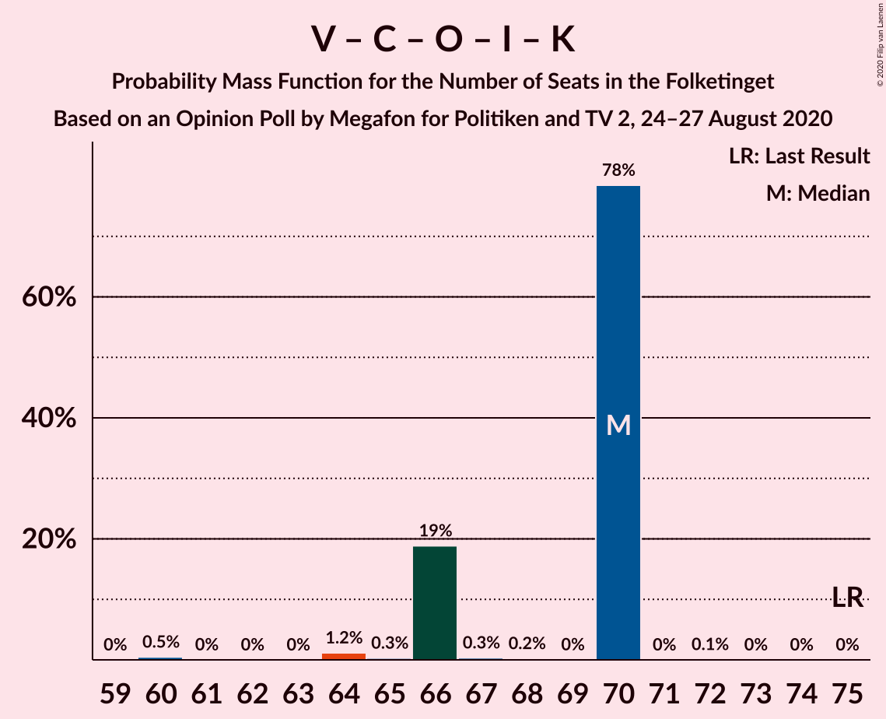

| Number of Seats | Probability | Accumulated | Special Marks |
|:---------------:|:-----------:|:-----------:|:-------------:|
| 56 | 0% | 100% |  |
| 57 | 0.3% | 99.9% |  |
| 58 | 0% | 99.6% |  |
| 59 | 0% | 99.6% |  |
| 60 | 0.3% | 99.6% |  |
| 61 | 0.2% | 99.3% |  |
| 62 | 0.3% | 99.1% |  |
| 63 | 0.8% | 98.8% |  |
| 64 | 6% | 98% |  |
| 65 | 0.3% | 92% |  |
| 66 | 12% | 92% |  |
| 67 | 35% | 80% |  |
| 68 | 4% | 44% | Median |
| 69 | 0.6% | 41% |  |
| 70 | 39% | 40% |  |
| 71 | 0.1% | 1.5% |  |
| 72 | 1.3% | 1.3% |  |
| 73 | 0% | 0.1% |  |
| 74 | 0.1% | 0.1% |  |
| 75 | 0% | 0% | Last Result |

### Venstre – Det Konservative Folkeparti – Dansk Folkeparti – Liberal Alliance

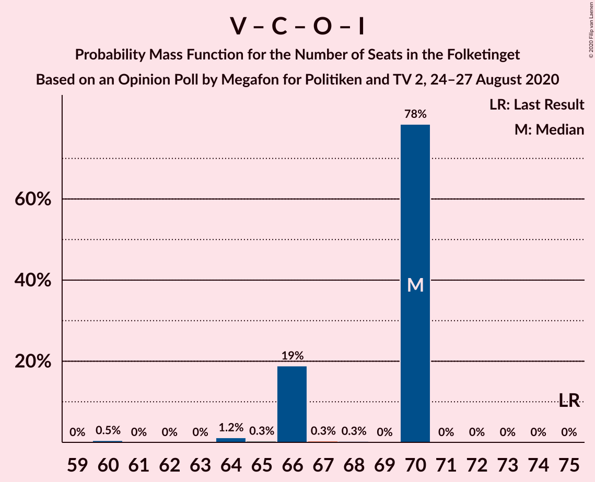

| Number of Seats | Probability | Accumulated | Special Marks |
|:---------------:|:-----------:|:-----------:|:-------------:|
| 56 | 0% | 100% |  |
| 57 | 0.3% | 99.9% |  |
| 58 | 0.3% | 99.6% |  |
| 59 | 0.2% | 99.3% |  |
| 60 | 0.3% | 99.1% |  |
| 61 | 0.3% | 98.8% |  |
| 62 | 0.1% | 98.5% |  |
| 63 | 2% | 98% |  |
| 64 | 6% | 96% |  |
| 65 | 0.7% | 90% |  |
| 66 | 12% | 89% |  |
| 67 | 33% | 77% |  |
| 68 | 4% | 44% | Median |
| 69 | 0.1% | 40% |  |
| 70 | 39% | 40% |  |
| 71 | 0.1% | 1.4% |  |
| 72 | 1.2% | 1.3% |  |
| 73 | 0% | 0.1% |  |
| 74 | 0% | 0.1% |  |
| 75 | 0% | 0% | Last Result |

### Venstre – Det Konservative Folkeparti – Liberal Alliance

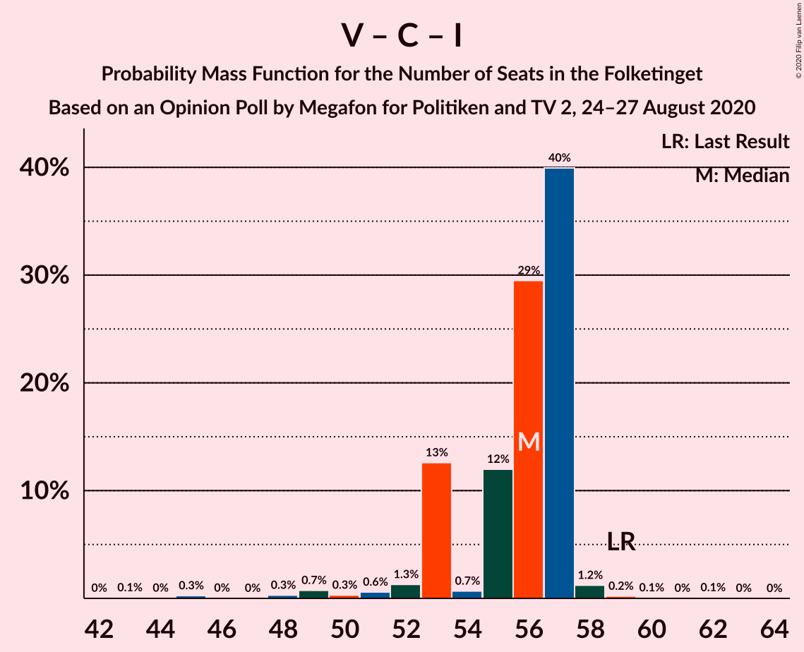

| Number of Seats | Probability | Accumulated | Special Marks |
|:---------------:|:-----------:|:-----------:|:-------------:|
| 43 | 0.1% | 100% |  |
| 44 | 0% | 99.9% |  |
| 45 | 0.3% | 99.9% |  |
| 46 | 0% | 99.6% |  |
| 47 | 0% | 99.6% |  |
| 48 | 0.3% | 99.6% |  |
| 49 | 0.7% | 99.3% |  |
| 50 | 0.3% | 98.5% |  |
| 51 | 0.6% | 98% |  |
| 52 | 1.3% | 98% |  |
| 53 | 13% | 96% |  |
| 54 | 0.7% | 84% |  |
| 55 | 12% | 83% |  |
| 56 | 29% | 71% | Median |
| 57 | 40% | 42% |  |
| 58 | 1.2% | 2% |  |
| 59 | 0.2% | 0.4% | Last Result |
| 60 | 0.1% | 0.2% |  |
| 61 | 0% | 0.1% |  |
| 62 | 0.1% | 0.1% |  |
| 63 | 0% | 0% |  |

### Venstre – Det Konservative Folkeparti

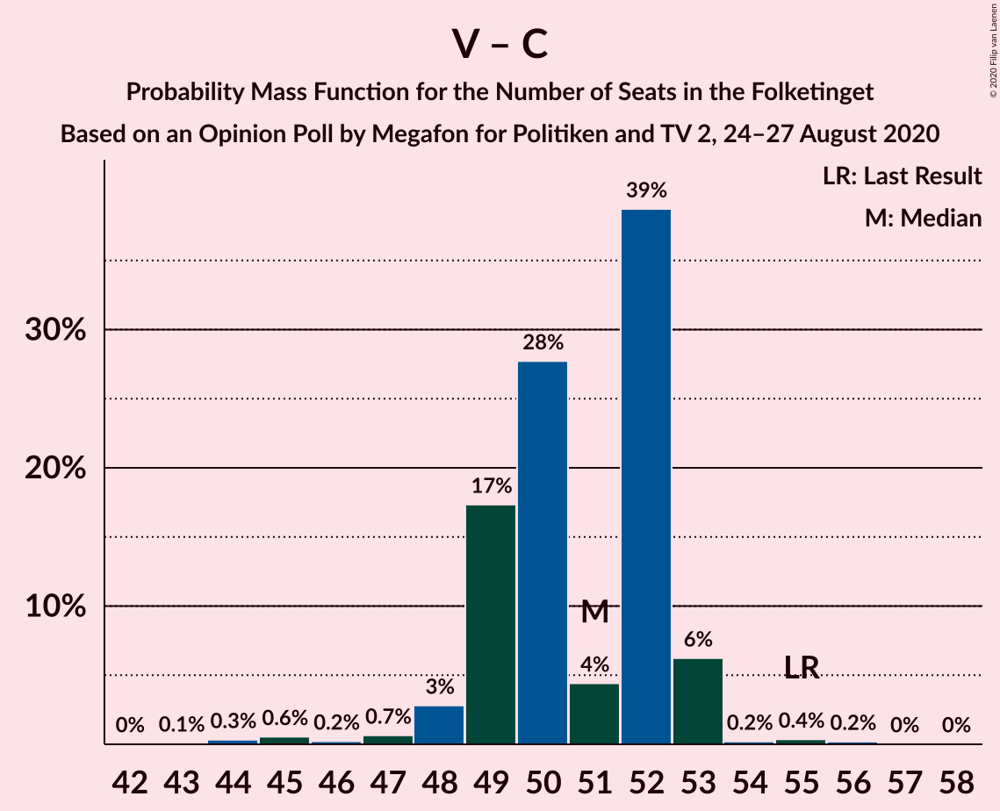

| Number of Seats | Probability | Accumulated | Special Marks |
|:---------------:|:-----------:|:-----------:|:-------------:|
| 43 | 0.1% | 100% |  |
| 44 | 0.3% | 99.9% |  |
| 45 | 0.6% | 99.5% |  |
| 46 | 0.2% | 99.0% |  |
| 47 | 0.7% | 98.8% |  |
| 48 | 3% | 98% |  |
| 49 | 17% | 95% |  |
| 50 | 28% | 78% |  |
| 51 | 4% | 50% | Median |
| 52 | 39% | 46% |  |
| 53 | 6% | 7% |  |
| 54 | 0.2% | 0.8% |  |
| 55 | 0.4% | 0.6% | Last Result |
| 56 | 0.2% | 0.3% |  |
| 57 | 0% | 0.1% |  |
| 58 | 0% | 0% |  |

### Venstre

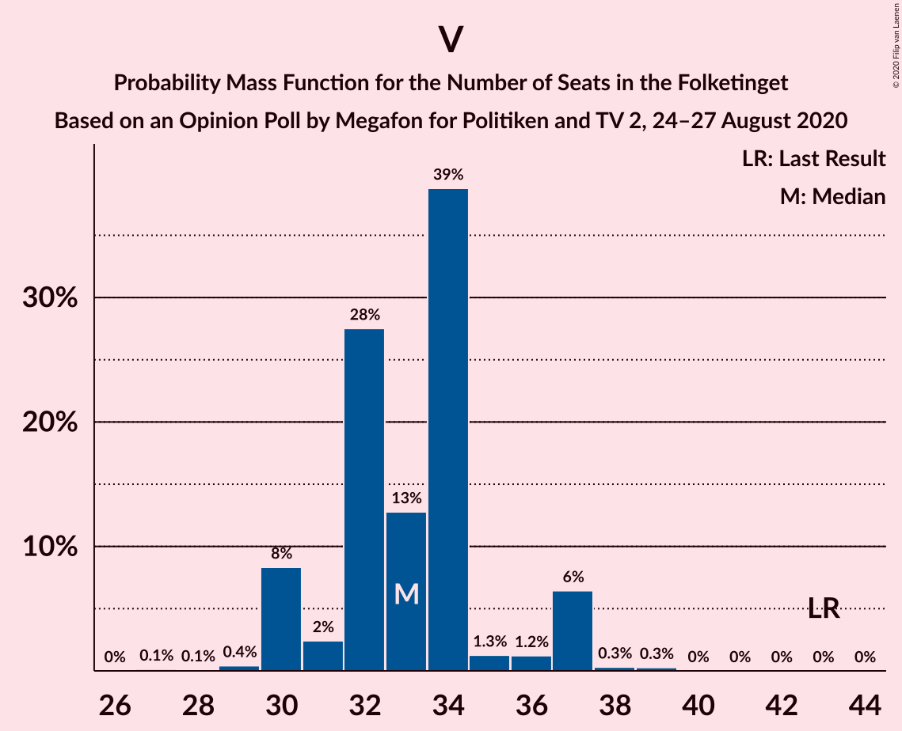

| Number of Seats | Probability | Accumulated | Special Marks |
|:---------------:|:-----------:|:-----------:|:-------------:|
| 27 | 0.1% | 100% |  |
| 28 | 0.1% | 99.9% |  |
| 29 | 0.4% | 99.8% |  |
| 30 | 8% | 99.4% |  |
| 31 | 2% | 91% |  |
| 32 | 28% | 89% |  |
| 33 | 13% | 61% | Median |
| 34 | 39% | 48% |  |
| 35 | 1.3% | 10% |  |
| 36 | 1.2% | 8% |  |
| 37 | 6% | 7% |  |
| 38 | 0.3% | 0.6% |  |
| 39 | 0.3% | 0.3% |  |
| 40 | 0% | 0% |  |
| 41 | 0% | 0% |  |
| 42 | 0% | 0% |  |
| 43 | 0% | 0% | Last Result |

## Technical Information

### Opinion Poll

+ **Polling firm:** Megafon
+ **Commissioner(s):** Politiken and TV 2
+ **Fieldwork period:** 24–27 August 2020

### Calculations

+ **Sample size:** 1007
+ **Simulations done:** 1,048,576
+ **Error estimate:** 1.97%

