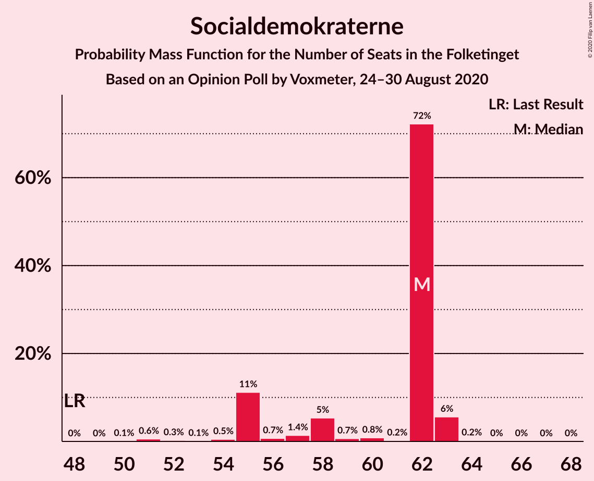
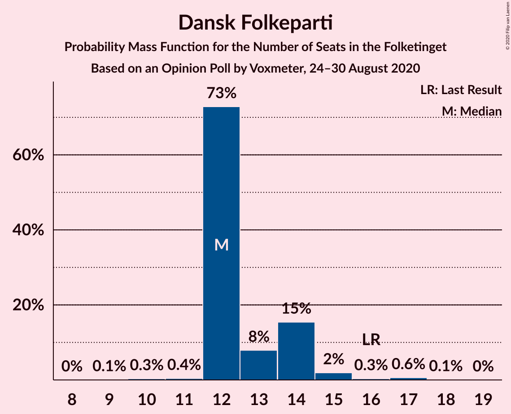
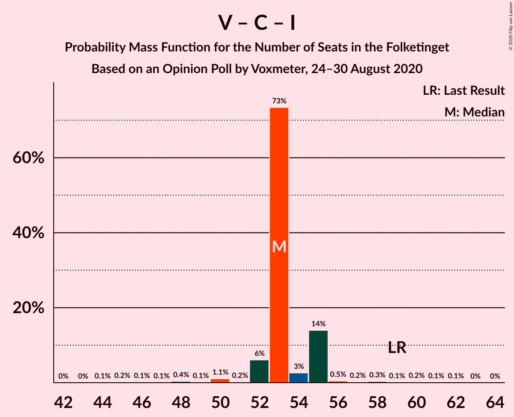

# Opinion Poll by Voxmeter, 24–30 August 2020

<a href="#voting-intentions">Voting Intentions</a> | <a href="#seats">Seats</a> | <a href="#coalitions">Coalitions</a> | <a href="#technical-information">Technical Information</a>

## Voting Intentions

### Confidence Intervals

| Party | Last Result | Poll Result | 80% Confidence Interval | 90% Confidence Interval | 95% Confidence Interval | 99% Confidence Interval |
|:-----:|:-----------:|:-----------:|:-----------------------:|:-----------------------:|:-----------------------:|:-----------------------:|
| Socialdemokraterne | 25.9% | 32.3% | 30.5–34.2% |30.0–34.8% |29.5–35.3% |28.7–36.2% |
| Venstre | 23.4% | 19.4% | 17.9–21.1% |17.5–21.6% |17.1–22.0% |16.4–22.8% |
| Det Konservative Folkeparti | 6.6% | 8.7% | 7.7–9.9% |7.4–10.3% |7.1–10.6% |6.6–11.2% |
| Socialistisk Folkeparti | 7.7% | 7.8% | 6.8–9.0% |6.6–9.3% |6.3–9.6% |5.9–10.2% |
| Radikale Venstre | 8.6% | 7.5% | 6.6–8.7% |6.3–9.0% |6.1–9.3% |5.6–9.9% |
| Dansk Folkeparti | 8.7% | 7.3% | 6.4–8.5% |6.1–8.8% |5.9–9.1% |5.5–9.7% |
| Enhedslisten–De Rød-Grønne | 6.9% | 7.3% | 6.4–8.5% |6.1–8.8% |5.9–9.1% |5.5–9.7% |
| Nye Borgerlige | 2.4% | 4.4% | 3.7–5.3% |3.5–5.6% |3.3–5.8% |3.0–6.3% |
| Liberal Alliance | 2.3% | 2.1% | 1.6–2.7% |1.4–2.9% |1.3–3.1% |1.1–3.5% |
| Kristendemokraterne | 1.7% | 1.6% | 1.2–2.2% |1.1–2.4% |1.0–2.5% |0.8–2.9% |
| Alternativet | 3.0% | 0.5% | 0.3–0.9% |0.2–1.0% |0.2–1.1% |0.1–1.4% |
| Stram Kurs | 1.8% | 0.2% | 0.1–0.5% |0.1–0.6% |0.0–0.7% |0.0–0.9% |

*Note:* The poll result column reflects the actual value used in the calculations. Published results may vary slightly, and in addition be rounded to fewer digits.

## Seats

### Confidence Intervals

| Party | Last Result | Median | 80% Confidence Interval | 90% Confidence Interval | 95% Confidence Interval | 99% Confidence Interval |
|:-----:|:-----------:|:------:|:-----------------------:|:-----------------------:|:-----------------------:|:-----------------------:|
| <a href="#socialdemokraterne">Socialdemokraterne</a> | 48 | 62 | 55–62 |55–63 |55–63 |51–63 |
| <a href="#venstre">Venstre</a> | 43 | 35 | 34–36 |33–37 |33–37 |31–39 |
| <a href="#det-konservative-folkeparti">Det Konservative Folkeparti</a> | 12 | 14 | 14–15 |14–16 |14–18 |13–19 |
| <a href="#socialistisk-folkeparti">Socialistisk Folkeparti</a> | 14 | 15 | 14–16 |12–16 |12–16 |12–17 |
| <a href="#radikale-venstre">Radikale Venstre</a> | 16 | 13 | 12–13 |12–13 |11–14 |11–16 |
| <a href="#dansk-folkeparti">Dansk Folkeparti</a> | 16 | 12 | 12–14 |12–14 |12–15 |11–17 |
| <a href="#enhedslisten–de-rød-grønne">Enhedslisten–De Rød-Grønne</a> | 13 | 12 | 12–14 |12–15 |12–16 |10–17 |
| <a href="#nye-borgerlige">Nye Borgerlige</a> | 4 | 8 | 8–9 |7–9 |7–10 |6–11 |
| <a href="#liberal-alliance">Liberal Alliance</a> | 4 | 4 | 4 |4 |0–5 |0–6 |
| <a href="#kristendemokraterne">Kristendemokraterne</a> | 0 | 0 | 0 |0 |0 |0–5 |
| <a href="#alternativet">Alternativet</a> | 5 | 0 | 0 |0 |0 |0 |
| <a href="#stram-kurs">Stram Kurs</a> | 0 | 0 | 0 |0 |0 |0 |

### Socialdemokraterne

*For a full overview of the results for this party, see the [Socialdemokraterne](party-socialdemokraterne.html) page.*

| Number of Seats | Probability | Accumulated | Special Marks |
|:---------------:|:-----------:|:-----------:|:-------------:|
| 48 | 0% | 100% | Last Result |
| 49 | 0% | 100% |  |
| 50 | 0.1% | 100% |  |
| 51 | 0.6% | 99.9% |  |
| 52 | 0.3% | 99.3% |  |
| 53 | 0.1% | 99.1% |  |
| 54 | 0.5% | 99.0% |  |
| 55 | 11% | 98% |  |
| 56 | 0.7% | 87% |  |
| 57 | 1.4% | 87% |  |
| 58 | 5% | 85% |  |
| 59 | 0.7% | 80% |  |
| 60 | 0.8% | 79% |  |
| 61 | 0.2% | 78% |  |
| 62 | 72% | 78% | Median |
| 63 | 6% | 6% |  |
| 64 | 0.2% | 0.3% |  |
| 65 | 0% | 0.1% |  |
| 66 | 0% | 0.1% |  |
| 67 | 0% | 0% |  |

### Venstre

*For a full overview of the results for this party, see the [Venstre](party-venstre.html) page.*

| Number of Seats | Probability | Accumulated | Special Marks |
|:---------------:|:-----------:|:-----------:|:-------------:|
| 29 | 0.1% | 100% |  |
| 30 | 0.4% | 99.9% |  |
| 31 | 0.5% | 99.5% |  |
| 32 | 1.2% | 99.0% |  |
| 33 | 6% | 98% |  |
| 34 | 2% | 91% |  |
| 35 | 73% | 89% | Median |
| 36 | 11% | 16% |  |
| 37 | 4% | 6% |  |
| 38 | 0.4% | 2% |  |
| 39 | 0.7% | 1.2% |  |
| 40 | 0.2% | 0.4% |  |
| 41 | 0.2% | 0.2% |  |
| 42 | 0% | 0% |  |
| 43 | 0% | 0% | Last Result |

### Det Konservative Folkeparti

*For a full overview of the results for this party, see the [Det Konservative Folkeparti](party-detkonservativefolkeparti.html) page.*

| Number of Seats | Probability | Accumulated | Special Marks |
|:---------------:|:-----------:|:-----------:|:-------------:|
| 11 | 0.1% | 100% |  |
| 12 | 0.2% | 99.9% | Last Result |
| 13 | 0.6% | 99.7% |  |
| 14 | 77% | 99.1% | Median |
| 15 | 16% | 22% |  |
| 16 | 2% | 6% |  |
| 17 | 0.7% | 4% |  |
| 18 | 2% | 3% |  |
| 19 | 1.0% | 1.4% |  |
| 20 | 0.3% | 0.3% |  |
| 21 | 0% | 0% |  |

### Socialistisk Folkeparti

*For a full overview of the results for this party, see the [Socialistisk Folkeparti](party-socialistiskfolkeparti.html) page.*

| Number of Seats | Probability | Accumulated | Special Marks |
|:---------------:|:-----------:|:-----------:|:-------------:|
| 10 | 0.1% | 100% |  |
| 11 | 0.4% | 99.9% |  |
| 12 | 6% | 99.6% |  |
| 13 | 1.2% | 93% |  |
| 14 | 6% | 92% | Last Result |
| 15 | 75% | 86% | Median |
| 16 | 10% | 11% |  |
| 17 | 0.9% | 1.3% |  |
| 18 | 0.3% | 0.4% |  |
| 19 | 0.1% | 0.1% |  |
| 20 | 0% | 0% |  |

### Radikale Venstre

*For a full overview of the results for this party, see the [Radikale Venstre](party-radikalevenstre.html) page.*

| Number of Seats | Probability | Accumulated | Special Marks |
|:---------------:|:-----------:|:-----------:|:-------------:|
| 10 | 0.1% | 100% |  |
| 11 | 4% | 99.9% |  |
| 12 | 8% | 96% |  |
| 13 | 83% | 88% | Median |
| 14 | 2% | 5% |  |
| 15 | 1.1% | 2% |  |
| 16 | 0.8% | 1.2% | Last Result |
| 17 | 0.2% | 0.4% |  |
| 18 | 0.1% | 0.2% |  |
| 19 | 0% | 0% |  |

### Dansk Folkeparti

*For a full overview of the results for this party, see the [Dansk Folkeparti](party-danskfolkeparti.html) page.*

| Number of Seats | Probability | Accumulated | Special Marks |
|:---------------:|:-----------:|:-----------:|:-------------:|
| 9 | 0.1% | 100% |  |
| 10 | 0.3% | 99.9% |  |
| 11 | 0.4% | 99.6% |  |
| 12 | 73% | 99.2% | Median |
| 13 | 8% | 26% |  |
| 14 | 15% | 18% |  |
| 15 | 2% | 3% |  |
| 16 | 0.3% | 1.1% | Last Result |
| 17 | 0.6% | 0.7% |  |
| 18 | 0.1% | 0.1% |  |
| 19 | 0% | 0% |  |

### Enhedslisten–De Rød-Grønne

*For a full overview of the results for this party, see the [Enhedslisten–De Rød-Grønne](party-enhedslisten–derød-grønne.html) page.*

| Number of Seats | Probability | Accumulated | Special Marks |
|:---------------:|:-----------:|:-----------:|:-------------:|
| 9 | 0.1% | 100% |  |
| 10 | 0.6% | 99.9% |  |
| 11 | 0.9% | 99.3% |  |
| 12 | 73% | 98% | Median |
| 13 | 10% | 25% | Last Result |
| 14 | 8% | 15% |  |
| 15 | 2% | 7% |  |
| 16 | 3% | 4% |  |
| 17 | 1.0% | 1.2% |  |
| 18 | 0.2% | 0.2% |  |
| 19 | 0% | 0% |  |

### Nye Borgerlige

*For a full overview of the results for this party, see the [Nye Borgerlige](party-nyeborgerlige.html) page.*

| Number of Seats | Probability | Accumulated | Special Marks |
|:---------------:|:-----------:|:-----------:|:-------------:|
| 4 | 0% | 100% | Last Result |
| 5 | 0.1% | 100% |  |
| 6 | 1.4% | 99.9% |  |
| 7 | 6% | 98% |  |
| 8 | 74% | 93% | Median |
| 9 | 16% | 19% |  |
| 10 | 1.0% | 3% |  |
| 11 | 2% | 2% |  |
| 12 | 0.1% | 0.1% |  |
| 13 | 0% | 0% |  |

### Liberal Alliance

*For a full overview of the results for this party, see the [Liberal Alliance](party-liberalalliance.html) page.*

| Number of Seats | Probability | Accumulated | Special Marks |
|:---------------:|:-----------:|:-----------:|:-------------:|
| 0 | 5% | 100% |  |
| 1 | 0% | 95% |  |
| 2 | 0% | 95% |  |
| 3 | 0% | 95% |  |
| 4 | 93% | 95% | Last Result, Median |
| 5 | 2% | 3% |  |
| 6 | 0.5% | 0.6% |  |
| 7 | 0% | 0% |  |

### Kristendemokraterne

*For a full overview of the results for this party, see the [Kristendemokraterne](party-kristendemokraterne.html) page.*

| Number of Seats | Probability | Accumulated | Special Marks |
|:---------------:|:-----------:|:-----------:|:-------------:|
| 0 | 98% | 100% | Last Result, Median |
| 1 | 0% | 2% |  |
| 2 | 0% | 2% |  |
| 3 | 0.5% | 2% |  |
| 4 | 1.3% | 2% |  |
| 5 | 0.6% | 0.7% |  |
| 6 | 0% | 0% |  |

### Alternativet

*For a full overview of the results for this party, see the [Alternativet](party-alternativet.html) page.*

| Number of Seats | Probability | Accumulated | Special Marks |
|:---------------:|:-----------:|:-----------:|:-------------:|
| 0 | 100% | 100% | Median |
| 1 | 0% | 0% |  |
| 2 | 0% | 0% |  |
| 3 | 0% | 0% |  |
| 4 | 0% | 0% |  |
| 5 | 0% | 0% | Last Result |

### Stram Kurs

*For a full overview of the results for this party, see the [Stram Kurs](party-stramkurs.html) page.*

| Number of Seats | Probability | Accumulated | Special Marks |
|:---------------:|:-----------:|:-----------:|:-------------:|
| 0 | 100% | 100% | Last Result, Median |

## Coalitions

### Confidence Intervals

| Coalition | Last Result | Median | Majority? | 80% Confidence Interval | 90% Confidence Interval | 95% Confidence Interval | 99% Confidence Interval |
|:---------:|:-----------:|:------:|:---------:|:-----------------------:|:-----------------------:|:-----------------------:|:-----------------------:|
| Socialdemokraterne – Socialistisk Folkeparti – Radikale Venstre – Enhedslisten–De Rød-Grønne – Alternativet | 96 | 102 | 100% | 97–102 | 97–102 | 95–102 | 93–104 |
| Socialdemokraterne – Socialistisk Folkeparti – Radikale Venstre – Enhedslisten–De Rød-Grønne | 91 | 102 | 100% | 97–102 | 97–102 | 95–102 | 93–104 |
| Socialdemokraterne – Socialistisk Folkeparti – Radikale Venstre | 78 | 90 | 72% | 84–90 | 83–90 | 82–90 | 79–90 |
| Socialdemokraterne – Socialistisk Folkeparti – Enhedslisten–De Rød-Grønne – Alternativet | 80 | 89 | 1.4% | 84–89 | 84–89 | 83–89 | 80–91 |
| Socialdemokraterne – Socialistisk Folkeparti – Enhedslisten–De Rød-Grønne | 75 | 89 | 1.4% | 84–89 | 84–89 | 83–89 | 80–91 |
| Venstre – Det Konservative Folkeparti – Dansk Folkeparti – Nye Borgerlige – Liberal Alliance – Kristendemokraterne | 79 | 73 | 0% | 73–78 | 73–78 | 73–80 | 71–82 |
| Venstre – Det Konservative Folkeparti – Dansk Folkeparti – Nye Borgerlige – Liberal Alliance | 79 | 73 | 0% | 73–78 | 73–78 | 73–78 | 69–80 |
| Socialdemokraterne – Radikale Venstre | 64 | 75 | 0% | 68–75 | 68–75 | 68–75 | 64–76 |
| Venstre – Det Konservative Folkeparti – Dansk Folkeparti – Liberal Alliance – Kristendemokraterne | 75 | 65 | 0% | 65–69 | 65–69 | 65–70 | 63–74 |
| Venstre – Det Konservative Folkeparti – Dansk Folkeparti – Liberal Alliance | 75 | 65 | 0% | 65–69 | 65–69 | 64–69 | 61–72 |
| Venstre – Det Konservative Folkeparti – Liberal Alliance | 59 | 53 | 0% | 53–55 | 52–55 | 52–55 | 47–58 |
| Venstre – Det Konservative Folkeparti | 55 | 49 | 0% | 49–51 | 48–51 | 48–53 | 46–55 |
| Venstre | 43 | 35 | 0% | 34–36 | 33–37 | 33–37 | 31–39 |

### Socialdemokraterne – Socialistisk Folkeparti – Radikale Venstre – Enhedslisten–De Rød-Grønne – Alternativet

| Number of Seats | Probability | Accumulated | Special Marks |
|:---------------:|:-----------:|:-----------:|:-------------:|
| 90 | 0.1% | 100% | Majority |
| 91 | 0% | 99.9% |  |
| 92 | 0.1% | 99.8% |  |
| 93 | 0.7% | 99.7% |  |
| 94 | 0.2% | 99.1% |  |
| 95 | 2% | 98.8% |  |
| 96 | 0.5% | 97% | Last Result |
| 97 | 10% | 97% |  |
| 98 | 0.5% | 87% |  |
| 99 | 5% | 86% |  |
| 100 | 2% | 82% |  |
| 101 | 6% | 80% |  |
| 102 | 73% | 74% | Median |
| 103 | 0.4% | 0.9% |  |
| 104 | 0.1% | 0.5% |  |
| 105 | 0.1% | 0.4% |  |
| 106 | 0.1% | 0.3% |  |
| 107 | 0.1% | 0.2% |  |
| 108 | 0% | 0.1% |  |
| 109 | 0% | 0% |  |

### Socialdemokraterne – Socialistisk Folkeparti – Radikale Venstre – Enhedslisten–De Rød-Grønne

| Number of Seats | Probability | Accumulated | Special Marks |
|:---------------:|:-----------:|:-----------:|:-------------:|
| 90 | 0.1% | 100% | Majority |
| 91 | 0% | 99.9% | Last Result |
| 92 | 0.1% | 99.8% |  |
| 93 | 0.7% | 99.7% |  |
| 94 | 0.2% | 99.1% |  |
| 95 | 2% | 98.8% |  |
| 96 | 0.5% | 97% |  |
| 97 | 10% | 97% |  |
| 98 | 0.5% | 87% |  |
| 99 | 5% | 86% |  |
| 100 | 2% | 82% |  |
| 101 | 6% | 80% |  |
| 102 | 73% | 74% | Median |
| 103 | 0.4% | 0.9% |  |
| 104 | 0.1% | 0.5% |  |
| 105 | 0.1% | 0.4% |  |
| 106 | 0.1% | 0.3% |  |
| 107 | 0.1% | 0.2% |  |
| 108 | 0% | 0.1% |  |
| 109 | 0% | 0% |  |

### Socialdemokraterne – Socialistisk Folkeparti – Radikale Venstre

| Number of Seats | Probability | Accumulated | Special Marks |
|:---------------:|:-----------:|:-----------:|:-------------:|
| 78 | 0.1% | 100% | Last Result |
| 79 | 0.6% | 99.9% |  |
| 80 | 1.0% | 99.3% |  |
| 81 | 0.7% | 98% |  |
| 82 | 0.3% | 98% |  |
| 83 | 4% | 97% |  |
| 84 | 10% | 94% |  |
| 85 | 3% | 84% |  |
| 86 | 0.5% | 81% |  |
| 87 | 7% | 81% |  |
| 88 | 0.2% | 74% |  |
| 89 | 1.2% | 74% |  |
| 90 | 72% | 72% | Median, Majority |
| 91 | 0.1% | 0.4% |  |
| 92 | 0.1% | 0.3% |  |
| 93 | 0.1% | 0.2% |  |
| 94 | 0.1% | 0.1% |  |
| 95 | 0% | 0.1% |  |
| 96 | 0% | 0% |  |

### Socialdemokraterne – Socialistisk Folkeparti – Enhedslisten–De Rød-Grønne – Alternativet

| Number of Seats | Probability | Accumulated | Special Marks |
|:---------------:|:-----------:|:-----------:|:-------------:|
| 77 | 0% | 100% |  |
| 78 | 0.1% | 99.9% |  |
| 79 | 0.1% | 99.8% |  |
| 80 | 1.0% | 99.7% | Last Result |
| 81 | 0.6% | 98.7% |  |
| 82 | 0.5% | 98% |  |
| 83 | 1.1% | 98% |  |
| 84 | 10% | 97% |  |
| 85 | 1.3% | 86% |  |
| 86 | 0.8% | 85% |  |
| 87 | 0.8% | 84% |  |
| 88 | 4% | 83% |  |
| 89 | 78% | 79% | Median |
| 90 | 0.9% | 1.4% | Majority |
| 91 | 0.1% | 0.5% |  |
| 92 | 0.2% | 0.5% |  |
| 93 | 0.1% | 0.2% |  |
| 94 | 0.1% | 0.1% |  |
| 95 | 0% | 0% |  |

### Socialdemokraterne – Socialistisk Folkeparti – Enhedslisten–De Rød-Grønne

| Number of Seats | Probability | Accumulated | Special Marks |
|:---------------:|:-----------:|:-----------:|:-------------:|
| 75 | 0% | 100% | Last Result |
| 76 | 0% | 100% |  |
| 77 | 0% | 100% |  |
| 78 | 0.1% | 99.9% |  |
| 79 | 0.1% | 99.8% |  |
| 80 | 1.0% | 99.7% |  |
| 81 | 0.6% | 98.7% |  |
| 82 | 0.5% | 98% |  |
| 83 | 1.1% | 98% |  |
| 84 | 10% | 97% |  |
| 85 | 1.3% | 86% |  |
| 86 | 0.8% | 85% |  |
| 87 | 0.8% | 84% |  |
| 88 | 4% | 83% |  |
| 89 | 78% | 79% | Median |
| 90 | 0.9% | 1.4% | Majority |
| 91 | 0.1% | 0.5% |  |
| 92 | 0.2% | 0.5% |  |
| 93 | 0.1% | 0.2% |  |
| 94 | 0.1% | 0.1% |  |
| 95 | 0% | 0% |  |

### Venstre – Det Konservative Folkeparti – Dansk Folkeparti – Nye Borgerlige – Liberal Alliance – Kristendemokraterne

| Number of Seats | Probability | Accumulated | Special Marks |
|:---------------:|:-----------:|:-----------:|:-------------:|
| 67 | 0% | 100% |  |
| 68 | 0.1% | 99.9% |  |
| 69 | 0.1% | 99.8% |  |
| 70 | 0.1% | 99.7% |  |
| 71 | 0.1% | 99.6% |  |
| 72 | 0.4% | 99.4% |  |
| 73 | 73% | 99.1% | Median |
| 74 | 6% | 26% |  |
| 75 | 2% | 20% |  |
| 76 | 5% | 18% |  |
| 77 | 0.5% | 13% |  |
| 78 | 10% | 13% |  |
| 79 | 0.5% | 3% | Last Result |
| 80 | 2% | 3% |  |
| 81 | 0.2% | 1.1% |  |
| 82 | 0.7% | 0.9% |  |
| 83 | 0.1% | 0.3% |  |
| 84 | 0% | 0.2% |  |
| 85 | 0.1% | 0.1% |  |
| 86 | 0% | 0% |  |

### Venstre – Det Konservative Folkeparti – Dansk Folkeparti – Nye Borgerlige – Liberal Alliance

| Number of Seats | Probability | Accumulated | Special Marks |
|:---------------:|:-----------:|:-----------:|:-------------:|
| 65 | 0.1% | 100% |  |
| 66 | 0.1% | 99.9% |  |
| 67 | 0.1% | 99.8% |  |
| 68 | 0.2% | 99.8% |  |
| 69 | 0.1% | 99.5% |  |
| 70 | 0.2% | 99.4% |  |
| 71 | 0.2% | 99.2% |  |
| 72 | 0.6% | 99.0% |  |
| 73 | 73% | 98% | Median |
| 74 | 6% | 25% |  |
| 75 | 2% | 19% |  |
| 76 | 5% | 17% |  |
| 77 | 0.5% | 13% |  |
| 78 | 10% | 12% |  |
| 79 | 0.8% | 2% | Last Result |
| 80 | 1.1% | 2% |  |
| 81 | 0.2% | 0.5% |  |
| 82 | 0.2% | 0.2% |  |
| 83 | 0% | 0.1% |  |
| 84 | 0% | 0% |  |

### Socialdemokraterne – Radikale Venstre

| Number of Seats | Probability | Accumulated | Special Marks |
|:---------------:|:-----------:|:-----------:|:-------------:|
| 64 | 0.5% | 100% | Last Result |
| 65 | 0.2% | 99.5% |  |
| 66 | 0.9% | 99.3% |  |
| 67 | 0.7% | 98% |  |
| 68 | 10% | 98% |  |
| 69 | 3% | 88% |  |
| 70 | 3% | 85% |  |
| 71 | 1.5% | 82% |  |
| 72 | 0.8% | 81% |  |
| 73 | 0.6% | 80% |  |
| 74 | 0.7% | 79% |  |
| 75 | 78% | 79% | Median |
| 76 | 0.6% | 0.8% |  |
| 77 | 0.1% | 0.3% |  |
| 78 | 0% | 0.2% |  |
| 79 | 0% | 0.1% |  |
| 80 | 0.1% | 0.1% |  |
| 81 | 0% | 0% |  |

### Venstre – Det Konservative Folkeparti – Dansk Folkeparti – Liberal Alliance – Kristendemokraterne

| Number of Seats | Probability | Accumulated | Special Marks |
|:---------------:|:-----------:|:-----------:|:-------------:|
| 58 | 0% | 100% |  |
| 59 | 0% | 99.9% |  |
| 60 | 0.1% | 99.9% |  |
| 61 | 0.1% | 99.9% |  |
| 62 | 0.1% | 99.7% |  |
| 63 | 0.4% | 99.6% |  |
| 64 | 1.1% | 99.2% |  |
| 65 | 78% | 98% | Median |
| 66 | 2% | 20% |  |
| 67 | 1.0% | 19% |  |
| 68 | 0.8% | 18% |  |
| 69 | 14% | 17% |  |
| 70 | 0.4% | 3% |  |
| 71 | 0.4% | 2% |  |
| 72 | 0.3% | 2% |  |
| 73 | 0.5% | 2% |  |
| 74 | 0.9% | 1.1% |  |
| 75 | 0.1% | 0.2% | Last Result |
| 76 | 0.1% | 0.1% |  |
| 77 | 0% | 0% |  |

### Venstre – Det Konservative Folkeparti – Dansk Folkeparti – Liberal Alliance

| Number of Seats | Probability | Accumulated | Special Marks |
|:---------------:|:-----------:|:-----------:|:-------------:|
| 57 | 0.1% | 100% |  |
| 58 | 0.1% | 99.9% |  |
| 59 | 0.1% | 99.9% |  |
| 60 | 0.1% | 99.7% |  |
| 61 | 0.2% | 99.6% |  |
| 62 | 0.1% | 99.4% |  |
| 63 | 0.6% | 99.2% |  |
| 64 | 1.2% | 98.7% |  |
| 65 | 78% | 97% | Median |
| 66 | 1.5% | 20% |  |
| 67 | 0.8% | 18% |  |
| 68 | 0.8% | 17% |  |
| 69 | 15% | 17% |  |
| 70 | 0.5% | 2% |  |
| 71 | 0.8% | 1.4% |  |
| 72 | 0.2% | 0.5% |  |
| 73 | 0.2% | 0.4% |  |
| 74 | 0.1% | 0.2% |  |
| 75 | 0.1% | 0.1% | Last Result |
| 76 | 0% | 0% |  |

### Venstre – Det Konservative Folkeparti – Liberal Alliance

| Number of Seats | Probability | Accumulated | Special Marks |
|:---------------:|:-----------:|:-----------:|:-------------:|
| 44 | 0.1% | 100% |  |
| 45 | 0.2% | 99.9% |  |
| 46 | 0.1% | 99.7% |  |
| 47 | 0.1% | 99.6% |  |
| 48 | 0.4% | 99.5% |  |
| 49 | 0.1% | 99.1% |  |
| 50 | 1.1% | 99.0% |  |
| 51 | 0.2% | 98% |  |
| 52 | 6% | 98% |  |
| 53 | 73% | 92% | Median |
| 54 | 3% | 18% |  |
| 55 | 14% | 16% |  |
| 56 | 0.5% | 2% |  |
| 57 | 0.2% | 1.0% |  |
| 58 | 0.3% | 0.8% |  |
| 59 | 0.1% | 0.5% | Last Result |
| 60 | 0.2% | 0.4% |  |
| 61 | 0.1% | 0.2% |  |
| 62 | 0.1% | 0.1% |  |
| 63 | 0% | 0% |  |

### Venstre – Det Konservative Folkeparti

| Number of Seats | Probability | Accumulated | Special Marks |
|:---------------:|:-----------:|:-----------:|:-------------:|
| 43 | 0% | 100% |  |
| 44 | 0.1% | 99.9% |  |
| 45 | 0.3% | 99.8% |  |
| 46 | 0.2% | 99.6% |  |
| 47 | 0.2% | 99.3% |  |
| 48 | 6% | 99.1% |  |
| 49 | 73% | 93% | Median |
| 50 | 3% | 20% |  |
| 51 | 13% | 17% |  |
| 52 | 0.7% | 4% |  |
| 53 | 1.2% | 3% |  |
| 54 | 0.9% | 2% |  |
| 55 | 0.6% | 1.0% | Last Result |
| 56 | 0.3% | 0.5% |  |
| 57 | 0.1% | 0.2% |  |
| 58 | 0.1% | 0.1% |  |
| 59 | 0% | 0% |  |

### Venstre

| Number of Seats | Probability | Accumulated | Special Marks |
|:---------------:|:-----------:|:-----------:|:-------------:|
| 29 | 0.1% | 100% |  |
| 30 | 0.4% | 99.9% |  |
| 31 | 0.5% | 99.5% |  |
| 32 | 1.2% | 99.0% |  |
| 33 | 6% | 98% |  |
| 34 | 2% | 91% |  |
| 35 | 73% | 89% | Median |
| 36 | 11% | 16% |  |
| 37 | 4% | 6% |  |
| 38 | 0.4% | 2% |  |
| 39 | 0.7% | 1.2% |  |
| 40 | 0.2% | 0.4% |  |
| 41 | 0.2% | 0.2% |  |
| 42 | 0% | 0% |  |
| 43 | 0% | 0% | Last Result |

## Technical Information

### Opinion Poll

+ **Polling firm:** Voxmeter
+ **Commissioner(s):** —
+ **Fieldwork period:** 24–30 August 2020

### Calculations

+ **Sample size:** 1024
+ **Simulations done:** 1,048,576
+ **Error estimate:** 2.23%

