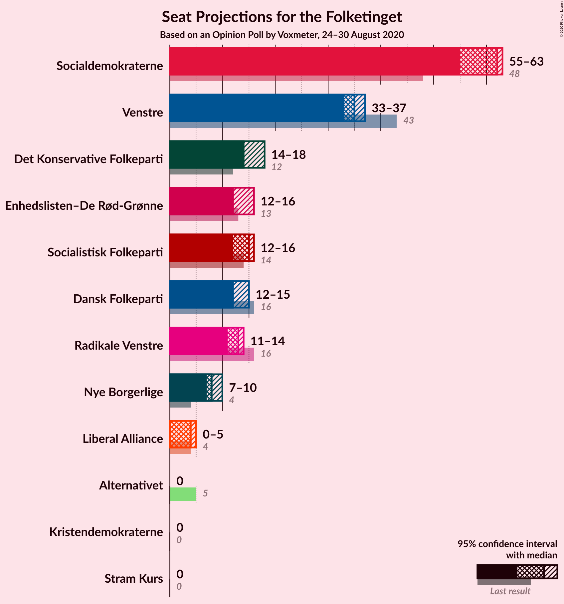
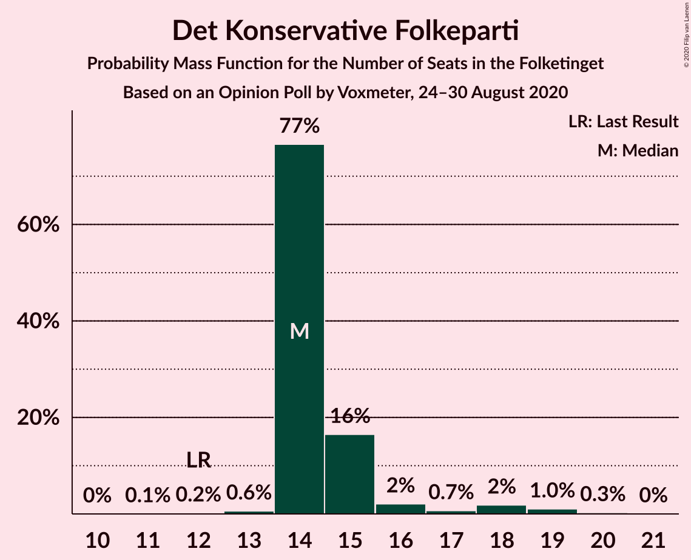
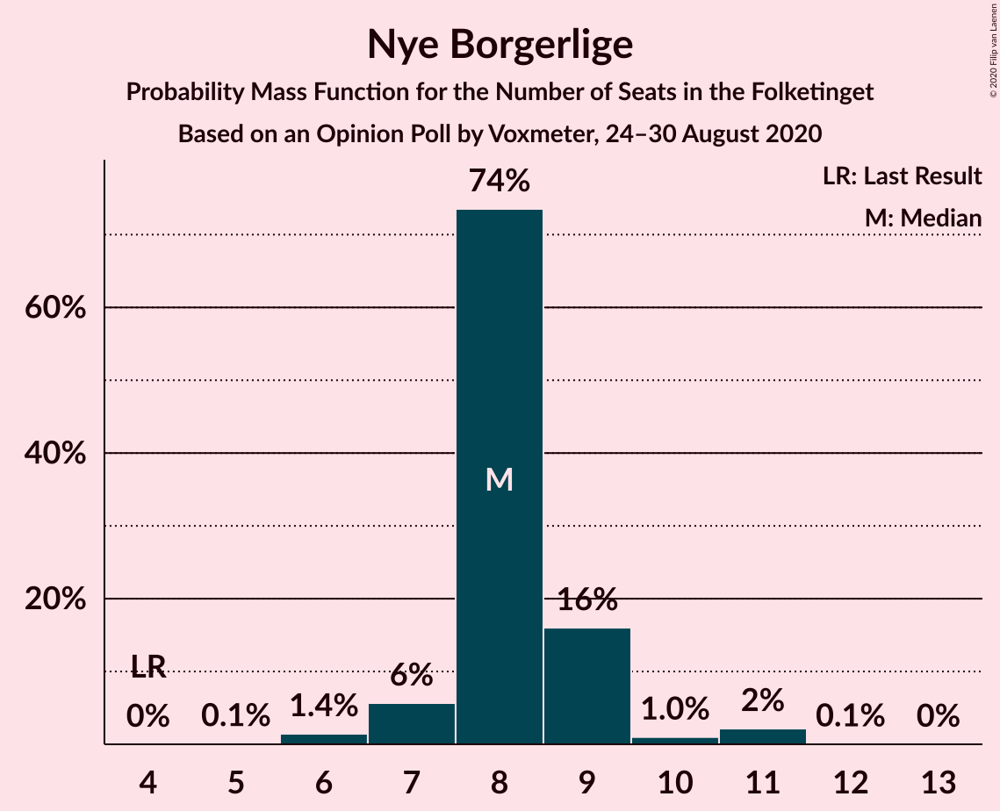
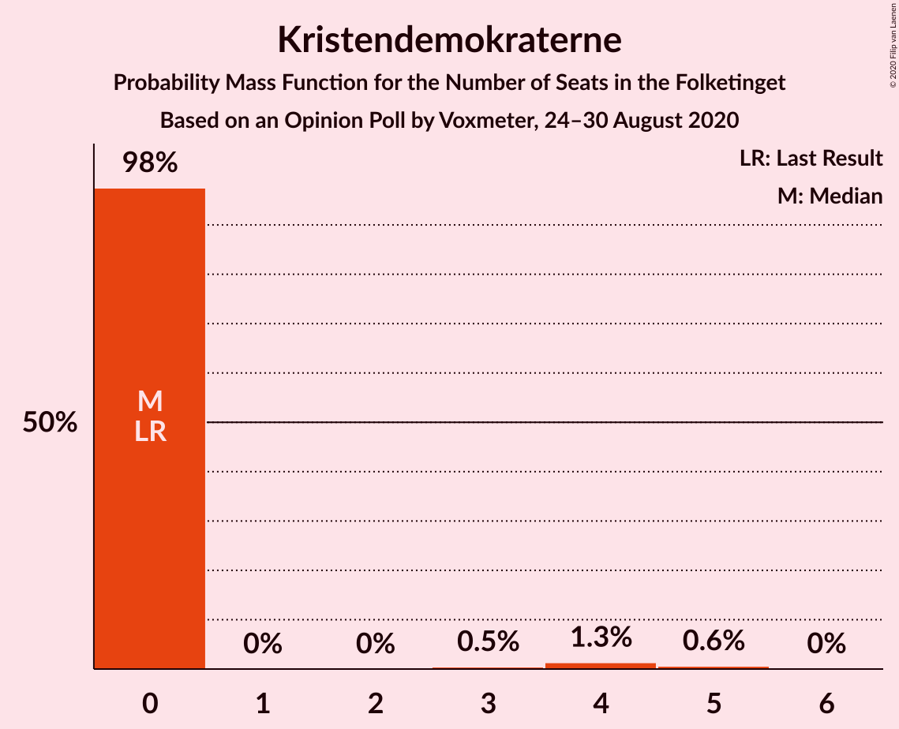
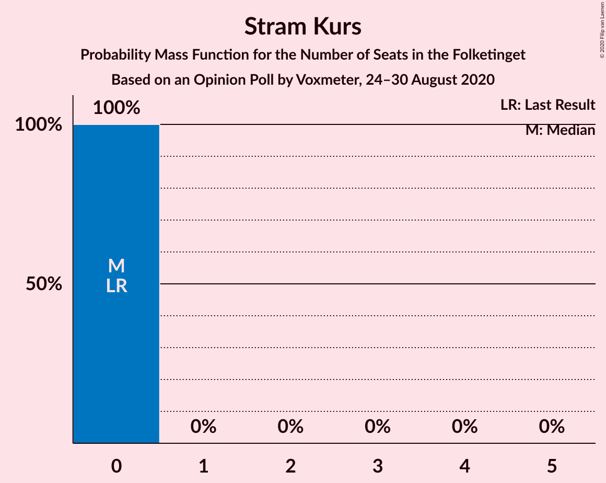
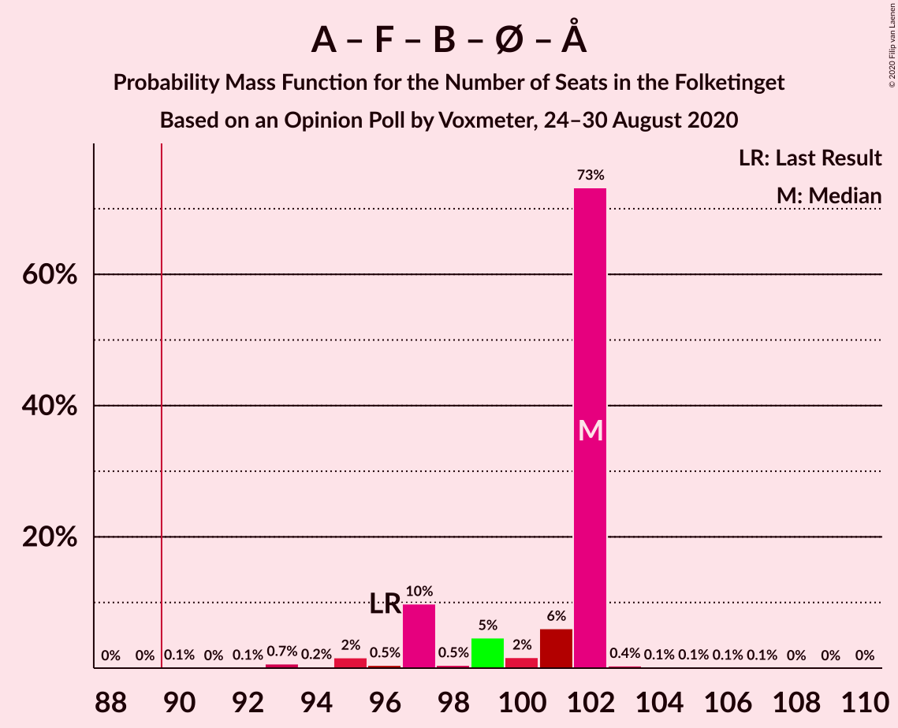
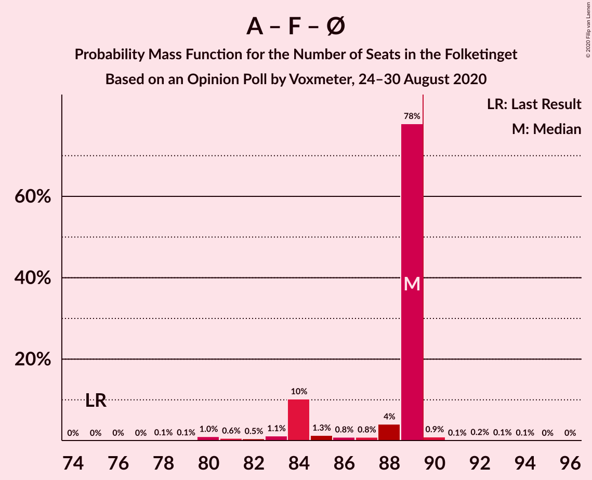
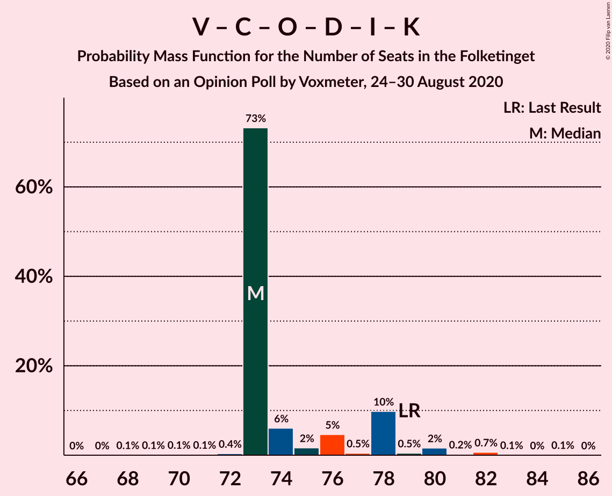
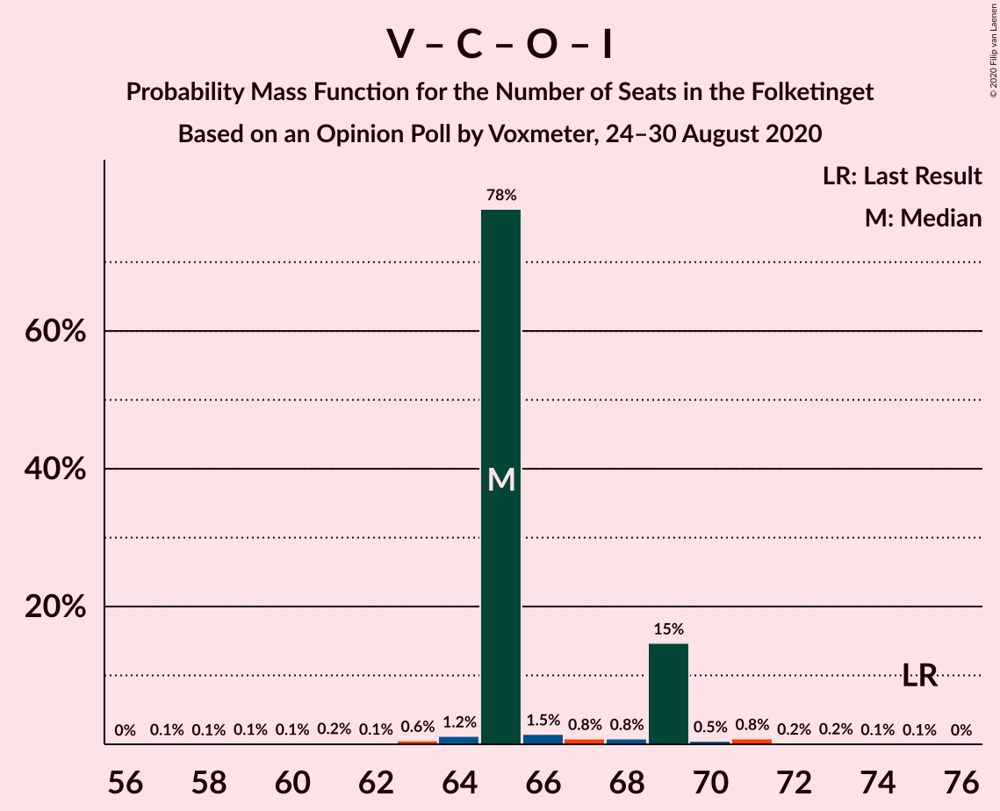

# Opinion Poll by Voxmeter, 24–30 August 2020

<a href="#voting-intentions">Voting Intentions</a> | <a href="#seats">Seats</a> | <a href="#coalitions">Coalitions</a> | <a href="#technical-information">Technical Information</a>

## Voting Intentions

### Confidence Intervals

| Party | Last Result | Poll Result | 80% Confidence Interval | 90% Confidence Interval | 95% Confidence Interval | 99% Confidence Interval |
|:-----:|:-----------:|:-----------:|:-----------------------:|:-----------------------:|:-----------------------:|:-----------------------:|
| Socialdemokraterne | 25.9% | 32.3% | 30.5–34.2% |30.0–34.8% |29.5–35.3% |28.7–36.2% |
| Venstre | 23.4% | 19.4% | 17.9–21.1% |17.5–21.6% |17.1–22.0% |16.4–22.8% |
| Det Konservative Folkeparti | 6.6% | 8.7% | 7.7–9.9% |7.4–10.3% |7.1–10.6% |6.6–11.2% |
| Socialistisk Folkeparti | 7.7% | 7.8% | 6.8–9.0% |6.6–9.3% |6.3–9.6% |5.9–10.2% |
| Radikale Venstre | 8.6% | 7.5% | 6.6–8.7% |6.3–9.0% |6.1–9.3% |5.6–9.9% |
| Dansk Folkeparti | 8.7% | 7.3% | 6.4–8.5% |6.1–8.8% |5.9–9.1% |5.5–9.7% |
| Enhedslisten–De Rød-Grønne | 6.9% | 7.3% | 6.4–8.5% |6.1–8.8% |5.9–9.1% |5.5–9.7% |
| Nye Borgerlige | 2.4% | 4.4% | 3.7–5.3% |3.5–5.6% |3.3–5.8% |3.0–6.3% |
| Liberal Alliance | 2.3% | 2.1% | 1.6–2.7% |1.4–2.9% |1.3–3.1% |1.1–3.5% |
| Kristendemokraterne | 1.7% | 1.6% | 1.2–2.2% |1.1–2.4% |1.0–2.5% |0.8–2.9% |
| Alternativet | 3.0% | 0.5% | 0.3–0.9% |0.2–1.0% |0.2–1.1% |0.1–1.4% |
| Stram Kurs | 1.8% | 0.2% | 0.1–0.5% |0.1–0.6% |0.0–0.7% |0.0–0.9% |

*Note:* The poll result column reflects the actual value used in the calculations. Published results may vary slightly, and in addition be rounded to fewer digits.

## Seats

### Confidence Intervals

| Party | Last Result | Median | 80% Confidence Interval | 90% Confidence Interval | 95% Confidence Interval | 99% Confidence Interval |
|:-----:|:-----------:|:------:|:-----------------------:|:-----------------------:|:-----------------------:|:-----------------------:|
| <a href="#socialdemokraterne">Socialdemokraterne</a> | 48 | 58 | 52–62 |52–62 |52–64 |51–64 |
| <a href="#venstre">Venstre</a> | 43 | 34 | 31–39 |31–40 |29–40 |29–42 |
| <a href="#det-konservative-folkeparti">Det Konservative Folkeparti</a> | 12 | 16 | 14–19 |13–19 |13–20 |10–20 |
| <a href="#socialistisk-folkeparti">Socialistisk Folkeparti</a> | 14 | 13 | 12–16 |12–18 |10–19 |10–19 |
| <a href="#radikale-venstre">Radikale Venstre</a> | 16 | 14 | 12–18 |12–18 |11–18 |10–18 |
| <a href="#dansk-folkeparti">Dansk Folkeparti</a> | 16 | 14 | 10–15 |10–16 |10–16 |10–18 |
| <a href="#enhedslisten–de-rød-grønne">Enhedslisten–De Rød-Grønne</a> | 13 | 12 | 11–16 |11–17 |11–17 |10–19 |
| <a href="#nye-borgerlige">Nye Borgerlige</a> | 4 | 9 | 7–11 |6–11 |6–11 |5–12 |
| <a href="#liberal-alliance">Liberal Alliance</a> | 4 | 0 | 0–5 |0–6 |0–6 |0–7 |
| <a href="#kristendemokraterne">Kristendemokraterne</a> | 0 | 0 | 0–4 |0–4 |0–5 |0–5 |
| <a href="#alternativet">Alternativet</a> | 5 | 0 | 0 |0 |0 |0 |
| <a href="#stram-kurs">Stram Kurs</a> | 0 | 0 | 0 |0 |0 |0 |

### Socialdemokraterne

*For a full overview of the results for this party, see the [Socialdemokraterne](party-socialdemokraterne.html) page.*

| Number of Seats | Probability | Accumulated | Special Marks |
|:---------------:|:-----------:|:-----------:|:-------------:|
| 48 | 0% | 100% | Last Result |
| 49 | 0.1% | 99.9% |  |
| 50 | 0.2% | 99.8% |  |
| 51 | 1.4% | 99.6% |  |
| 52 | 10% | 98% |  |
| 53 | 1.2% | 89% |  |
| 54 | 9% | 87% |  |
| 55 | 12% | 78% |  |
| 56 | 0.7% | 66% |  |
| 57 | 12% | 65% |  |
| 58 | 12% | 54% | Median |
| 59 | 3% | 42% |  |
| 60 | 3% | 39% |  |
| 61 | 3% | 36% |  |
| 62 | 29% | 33% |  |
| 63 | 0% | 4% |  |
| 64 | 4% | 4% |  |
| 65 | 0% | 0.5% |  |
| 66 | 0.2% | 0.5% |  |
| 67 | 0% | 0.3% |  |
| 68 | 0% | 0.3% |  |
| 69 | 0.2% | 0.3% |  |
| 70 | 0% | 0% |  |

### Venstre

*For a full overview of the results for this party, see the [Venstre](party-venstre.html) page.*

| Number of Seats | Probability | Accumulated | Special Marks |
|:---------------:|:-----------:|:-----------:|:-------------:|
| 28 | 0.3% | 100% |  |
| 29 | 3% | 99.7% |  |
| 30 | 1.4% | 97% |  |
| 31 | 7% | 95% |  |
| 32 | 2% | 88% |  |
| 33 | 9% | 86% |  |
| 34 | 39% | 78% | Median |
| 35 | 9% | 39% |  |
| 36 | 3% | 30% |  |
| 37 | 5% | 28% |  |
| 38 | 6% | 22% |  |
| 39 | 9% | 16% |  |
| 40 | 6% | 7% |  |
| 41 | 0.3% | 1.3% |  |
| 42 | 1.0% | 1.0% |  |
| 43 | 0% | 0% | Last Result |

### Det Konservative Folkeparti

*For a full overview of the results for this party, see the [Det Konservative Folkeparti](party-detkonservativefolkeparti.html) page.*

| Number of Seats | Probability | Accumulated | Special Marks |
|:---------------:|:-----------:|:-----------:|:-------------:|
| 10 | 0.9% | 100% |  |
| 11 | 0.3% | 99.1% |  |
| 12 | 0.2% | 98.8% | Last Result |
| 13 | 6% | 98.6% |  |
| 14 | 5% | 93% |  |
| 15 | 27% | 88% |  |
| 16 | 17% | 61% | Median |
| 17 | 3% | 44% |  |
| 18 | 31% | 42% |  |
| 19 | 6% | 10% |  |
| 20 | 4% | 5% |  |
| 21 | 0.1% | 0.2% |  |
| 22 | 0.1% | 0.2% |  |
| 23 | 0% | 0% |  |

### Socialistisk Folkeparti

*For a full overview of the results for this party, see the [Socialistisk Folkeparti](party-socialistiskfolkeparti.html) page.*

| Number of Seats | Probability | Accumulated | Special Marks |
|:---------------:|:-----------:|:-----------:|:-------------:|
| 9 | 0.1% | 100% |  |
| 10 | 3% | 99.9% |  |
| 11 | 1.1% | 97% |  |
| 12 | 15% | 96% |  |
| 13 | 41% | 81% | Median |
| 14 | 10% | 41% | Last Result |
| 15 | 8% | 30% |  |
| 16 | 13% | 22% |  |
| 17 | 1.0% | 9% |  |
| 18 | 4% | 8% |  |
| 19 | 4% | 4% |  |
| 20 | 0% | 0% |  |

### Radikale Venstre

*For a full overview of the results for this party, see the [Radikale Venstre](party-radikalevenstre.html) page.*

| Number of Seats | Probability | Accumulated | Special Marks |
|:---------------:|:-----------:|:-----------:|:-------------:|
| 9 | 0.3% | 100% |  |
| 10 | 2% | 99.7% |  |
| 11 | 2% | 98% |  |
| 12 | 9% | 96% |  |
| 13 | 9% | 87% |  |
| 14 | 51% | 78% | Median |
| 15 | 2% | 27% |  |
| 16 | 11% | 25% | Last Result |
| 17 | 2% | 14% |  |
| 18 | 12% | 12% |  |
| 19 | 0% | 0% |  |

### Dansk Folkeparti

*For a full overview of the results for this party, see the [Dansk Folkeparti](party-danskfolkeparti.html) page.*

| Number of Seats | Probability | Accumulated | Special Marks |
|:---------------:|:-----------:|:-----------:|:-------------:|
| 9 | 0.4% | 100% |  |
| 10 | 13% | 99.6% |  |
| 11 | 13% | 87% |  |
| 12 | 9% | 74% |  |
| 13 | 9% | 65% |  |
| 14 | 34% | 56% | Median |
| 15 | 15% | 22% |  |
| 16 | 6% | 7% | Last Result |
| 17 | 0.5% | 1.3% |  |
| 18 | 0.5% | 0.8% |  |
| 19 | 0.3% | 0.3% |  |
| 20 | 0.1% | 0.1% |  |
| 21 | 0% | 0% |  |

### Enhedslisten–De Rød-Grønne

*For a full overview of the results for this party, see the [Enhedslisten–De Rød-Grønne](party-enhedslisten–derød-grønne.html) page.*

| Number of Seats | Probability | Accumulated | Special Marks |
|:---------------:|:-----------:|:-----------:|:-------------:|
| 9 | 0.1% | 100% |  |
| 10 | 2% | 99.9% |  |
| 11 | 39% | 98% |  |
| 12 | 24% | 60% | Median |
| 13 | 6% | 36% | Last Result |
| 14 | 9% | 30% |  |
| 15 | 8% | 21% |  |
| 16 | 3% | 13% |  |
| 17 | 8% | 10% |  |
| 18 | 0.4% | 2% |  |
| 19 | 2% | 2% |  |
| 20 | 0% | 0% |  |

### Nye Borgerlige

*For a full overview of the results for this party, see the [Nye Borgerlige](party-nyeborgerlige.html) page.*

| Number of Seats | Probability | Accumulated | Special Marks |
|:---------------:|:-----------:|:-----------:|:-------------:|
| 4 | 0% | 100% | Last Result |
| 5 | 2% | 100% |  |
| 6 | 8% | 98% |  |
| 7 | 14% | 90% |  |
| 8 | 12% | 76% |  |
| 9 | 38% | 64% | Median |
| 10 | 11% | 25% |  |
| 11 | 13% | 14% |  |
| 12 | 0.8% | 1.1% |  |
| 13 | 0.2% | 0.2% |  |
| 14 | 0% | 0% |  |

### Liberal Alliance

*For a full overview of the results for this party, see the [Liberal Alliance](party-liberalalliance.html) page.*

| Number of Seats | Probability | Accumulated | Special Marks |
|:---------------:|:-----------:|:-----------:|:-------------:|
| 0 | 57% | 100% | Median |
| 1 | 0% | 43% |  |
| 2 | 0% | 43% |  |
| 3 | 0% | 43% |  |
| 4 | 13% | 43% | Last Result |
| 5 | 22% | 29% |  |
| 6 | 6% | 8% |  |
| 7 | 1.2% | 1.2% |  |
| 8 | 0.1% | 0.1% |  |
| 9 | 0% | 0% |  |

### Kristendemokraterne

*For a full overview of the results for this party, see the [Kristendemokraterne](party-kristendemokraterne.html) page.*

| Number of Seats | Probability | Accumulated | Special Marks |
|:---------------:|:-----------:|:-----------:|:-------------:|
| 0 | 78% | 100% | Last Result, Median |
| 1 | 0% | 22% |  |
| 2 | 0% | 22% |  |
| 3 | 0% | 22% |  |
| 4 | 18% | 22% |  |
| 5 | 4% | 4% |  |
| 6 | 0.1% | 0.2% |  |
| 7 | 0% | 0% |  |

### Alternativet

*For a full overview of the results for this party, see the [Alternativet](party-alternativet.html) page.*

| Number of Seats | Probability | Accumulated | Special Marks |
|:---------------:|:-----------:|:-----------:|:-------------:|
| 0 | 100% | 100% | Median |
| 1 | 0% | 0% |  |
| 2 | 0% | 0% |  |
| 3 | 0% | 0% |  |
| 4 | 0% | 0% |  |
| 5 | 0% | 0% | Last Result |

### Stram Kurs

*For a full overview of the results for this party, see the [Stram Kurs](party-stramkurs.html) page.*

| Number of Seats | Probability | Accumulated | Special Marks |
|:---------------:|:-----------:|:-----------:|:-------------:|
| 0 | 100% | 100% | Last Result, Median |

## Coalitions

### Confidence Intervals

| Coalition | Last Result | Median | Majority? | 80% Confidence Interval | 90% Confidence Interval | 95% Confidence Interval | 99% Confidence Interval |
|:---------:|:-----------:|:------:|:---------:|:-----------------------:|:-----------------------:|:-----------------------:|:-----------------------:|
| Socialdemokraterne – Socialistisk Folkeparti – Radikale Venstre – Enhedslisten–De Rød-Grønne – Alternativet | 96 | 100 | 98% | 95–105 | 94–106 | 92–107 | 89–110 |
| Socialdemokraterne – Socialistisk Folkeparti – Radikale Venstre – Enhedslisten–De Rød-Grønne | 91 | 100 | 98% | 95–105 | 94–106 | 92–107 | 89–110 |
| Socialdemokraterne – Socialistisk Folkeparti – Radikale Venstre | 78 | 86 | 8% | 82–89 | 81–94 | 80–95 | 78–95 |
| Socialdemokraterne – Socialistisk Folkeparti – Enhedslisten–De Rød-Grønne – Alternativet | 80 | 85 | 9% | 80–89 | 80–94 | 78–94 | 78–94 |
| Socialdemokraterne – Socialistisk Folkeparti – Enhedslisten–De Rød-Grønne | 75 | 85 | 9% | 80–89 | 80–94 | 78–94 | 78–94 |
| Venstre – Det Konservative Folkeparti – Dansk Folkeparti – Nye Borgerlige – Liberal Alliance – Kristendemokraterne | 79 | 75 | 0% | 70–80 | 69–81 | 68–83 | 65–86 |
| Venstre – Det Konservative Folkeparti – Dansk Folkeparti – Nye Borgerlige – Liberal Alliance | 79 | 75 | 0% | 70–80 | 69–81 | 66–81 | 65–82 |
| Socialdemokraterne – Radikale Venstre | 64 | 72 | 0% | 69–76 | 67–76 | 65–76 | 64–79 |
| Venstre – Det Konservative Folkeparti – Dansk Folkeparti – Liberal Alliance – Kristendemokraterne | 75 | 67 | 0% | 62–71 | 62–72 | 60–75 | 59–79 |
| Venstre – Det Konservative Folkeparti – Dansk Folkeparti – Liberal Alliance | 75 | 66 | 0% | 62–71 | 61–72 | 59–75 | 57–75 |
| Venstre – Det Konservative Folkeparti – Liberal Alliance | 59 | 53 | 0% | 49–59 | 47–61 | 47–61 | 46–61 |
| Venstre – Det Konservative Folkeparti | 55 | 52 | 0% | 47–56 | 45–56 | 44–57 | 43–57 |
| Venstre | 43 | 34 | 0% | 31–39 | 31–40 | 29–40 | 29–42 |

### Socialdemokraterne – Socialistisk Folkeparti – Radikale Venstre – Enhedslisten–De Rød-Grønne – Alternativet

| Number of Seats | Probability | Accumulated | Special Marks |
|:---------------:|:-----------:|:-----------:|:-------------:|
| 89 | 2% | 100% |  |
| 90 | 0.6% | 98% | Majority |
| 91 | 0.2% | 98% |  |
| 92 | 0.4% | 98% |  |
| 93 | 0.3% | 97% |  |
| 94 | 6% | 97% |  |
| 95 | 10% | 91% |  |
| 96 | 10% | 81% | Last Result |
| 97 | 3% | 71% | Median |
| 98 | 12% | 68% |  |
| 99 | 4% | 56% |  |
| 100 | 29% | 52% |  |
| 101 | 10% | 22% |  |
| 102 | 1.1% | 12% |  |
| 103 | 0.2% | 11% |  |
| 104 | 0.5% | 11% |  |
| 105 | 3% | 10% |  |
| 106 | 4% | 7% |  |
| 107 | 1.1% | 3% |  |
| 108 | 0% | 2% |  |
| 109 | 0% | 2% |  |
| 110 | 2% | 2% |  |
| 111 | 0% | 0% |  |

### Socialdemokraterne – Socialistisk Folkeparti – Radikale Venstre – Enhedslisten–De Rød-Grønne

| Number of Seats | Probability | Accumulated | Special Marks |
|:---------------:|:-----------:|:-----------:|:-------------:|
| 89 | 2% | 100% |  |
| 90 | 0.6% | 98% | Majority |
| 91 | 0.2% | 98% | Last Result |
| 92 | 0.4% | 98% |  |
| 93 | 0.3% | 97% |  |
| 94 | 6% | 97% |  |
| 95 | 10% | 91% |  |
| 96 | 10% | 81% |  |
| 97 | 3% | 71% | Median |
| 98 | 12% | 68% |  |
| 99 | 4% | 56% |  |
| 100 | 29% | 52% |  |
| 101 | 10% | 22% |  |
| 102 | 1.1% | 12% |  |
| 103 | 0.2% | 11% |  |
| 104 | 0.5% | 11% |  |
| 105 | 3% | 10% |  |
| 106 | 4% | 7% |  |
| 107 | 1.1% | 3% |  |
| 108 | 0% | 2% |  |
| 109 | 0% | 2% |  |
| 110 | 2% | 2% |  |
| 111 | 0% | 0% |  |

### Socialdemokraterne – Socialistisk Folkeparti – Radikale Venstre

| Number of Seats | Probability | Accumulated | Special Marks |
|:---------------:|:-----------:|:-----------:|:-------------:|
| 76 | 0.2% | 100% |  |
| 77 | 0.1% | 99.7% |  |
| 78 | 2% | 99.7% | Last Result |
| 79 | 0.3% | 98% |  |
| 80 | 0.6% | 98% |  |
| 81 | 2% | 97% |  |
| 82 | 15% | 95% |  |
| 83 | 3% | 79% |  |
| 84 | 17% | 76% |  |
| 85 | 3% | 59% | Median |
| 86 | 11% | 56% |  |
| 87 | 2% | 45% |  |
| 88 | 4% | 42% |  |
| 89 | 31% | 39% |  |
| 90 | 0.2% | 8% | Majority |
| 91 | 0.3% | 7% |  |
| 92 | 0.9% | 7% |  |
| 93 | 0% | 6% |  |
| 94 | 2% | 6% |  |
| 95 | 4% | 4% |  |
| 96 | 0.2% | 0.3% |  |
| 97 | 0% | 0.1% |  |
| 98 | 0% | 0% |  |

### Socialdemokraterne – Socialistisk Folkeparti – Enhedslisten–De Rød-Grønne – Alternativet

| Number of Seats | Probability | Accumulated | Special Marks |
|:---------------:|:-----------:|:-----------:|:-------------:|
| 76 | 0.1% | 100% |  |
| 77 | 0.3% | 99.9% |  |
| 78 | 2% | 99.5% |  |
| 79 | 0.7% | 97% |  |
| 80 | 15% | 96% | Last Result |
| 81 | 9% | 82% |  |
| 82 | 5% | 73% |  |
| 83 | 8% | 68% | Median |
| 84 | 4% | 60% |  |
| 85 | 12% | 55% |  |
| 86 | 28% | 43% |  |
| 87 | 1.1% | 15% |  |
| 88 | 2% | 14% |  |
| 89 | 4% | 12% |  |
| 90 | 0.3% | 9% | Majority |
| 91 | 1.0% | 8% |  |
| 92 | 0.1% | 7% |  |
| 93 | 1.2% | 7% |  |
| 94 | 6% | 6% |  |
| 95 | 0% | 0.1% |  |
| 96 | 0% | 0.1% |  |
| 97 | 0% | 0.1% |  |
| 98 | 0% | 0% |  |

### Socialdemokraterne – Socialistisk Folkeparti – Enhedslisten–De Rød-Grønne

| Number of Seats | Probability | Accumulated | Special Marks |
|:---------------:|:-----------:|:-----------:|:-------------:|
| 75 | 0% | 100% | Last Result |
| 76 | 0.1% | 100% |  |
| 77 | 0.3% | 99.9% |  |
| 78 | 2% | 99.5% |  |
| 79 | 0.7% | 97% |  |
| 80 | 15% | 96% |  |
| 81 | 9% | 82% |  |
| 82 | 5% | 73% |  |
| 83 | 8% | 68% | Median |
| 84 | 4% | 60% |  |
| 85 | 12% | 55% |  |
| 86 | 28% | 43% |  |
| 87 | 1.1% | 15% |  |
| 88 | 2% | 14% |  |
| 89 | 4% | 12% |  |
| 90 | 0.3% | 9% | Majority |
| 91 | 1.0% | 8% |  |
| 92 | 0.1% | 7% |  |
| 93 | 1.2% | 7% |  |
| 94 | 6% | 6% |  |
| 95 | 0% | 0.1% |  |
| 96 | 0% | 0.1% |  |
| 97 | 0% | 0.1% |  |
| 98 | 0% | 0% |  |

### Venstre – Det Konservative Folkeparti – Dansk Folkeparti – Nye Borgerlige – Liberal Alliance – Kristendemokraterne

| Number of Seats | Probability | Accumulated | Special Marks |
|:---------------:|:-----------:|:-----------:|:-------------:|
| 65 | 2% | 100% |  |
| 66 | 0% | 98% |  |
| 67 | 0% | 98% |  |
| 68 | 1.1% | 98% |  |
| 69 | 4% | 97% |  |
| 70 | 3% | 93% |  |
| 71 | 0.5% | 90% |  |
| 72 | 0.2% | 89% |  |
| 73 | 1.1% | 89% | Median |
| 74 | 10% | 88% |  |
| 75 | 29% | 77% |  |
| 76 | 4% | 48% |  |
| 77 | 12% | 44% |  |
| 78 | 3% | 32% |  |
| 79 | 10% | 29% | Last Result |
| 80 | 10% | 19% |  |
| 81 | 6% | 9% |  |
| 82 | 0.3% | 3% |  |
| 83 | 0.4% | 3% |  |
| 84 | 0.2% | 2% |  |
| 85 | 0.6% | 2% |  |
| 86 | 2% | 2% |  |
| 87 | 0% | 0% |  |

### Venstre – Det Konservative Folkeparti – Dansk Folkeparti – Nye Borgerlige – Liberal Alliance

| Number of Seats | Probability | Accumulated | Special Marks |
|:---------------:|:-----------:|:-----------:|:-------------:|
| 65 | 2% | 100% |  |
| 66 | 1.3% | 98% |  |
| 67 | 0.1% | 96% |  |
| 68 | 1.1% | 96% |  |
| 69 | 4% | 95% |  |
| 70 | 4% | 91% |  |
| 71 | 3% | 88% |  |
| 72 | 0.3% | 84% |  |
| 73 | 2% | 84% | Median |
| 74 | 9% | 82% |  |
| 75 | 35% | 73% |  |
| 76 | 7% | 38% |  |
| 77 | 12% | 31% |  |
| 78 | 2% | 19% |  |
| 79 | 4% | 17% | Last Result |
| 80 | 4% | 13% |  |
| 81 | 7% | 9% |  |
| 82 | 2% | 2% |  |
| 83 | 0.1% | 0.2% |  |
| 84 | 0% | 0% |  |

### Socialdemokraterne – Radikale Venstre

| Number of Seats | Probability | Accumulated | Special Marks |
|:---------------:|:-----------:|:-----------:|:-------------:|
| 61 | 0.1% | 100% |  |
| 62 | 0.2% | 99.9% |  |
| 63 | 0% | 99.7% |  |
| 64 | 0.6% | 99.7% | Last Result |
| 65 | 2% | 99.1% |  |
| 66 | 2% | 97% |  |
| 67 | 1.2% | 95% |  |
| 68 | 1.0% | 94% |  |
| 69 | 10% | 93% |  |
| 70 | 24% | 84% |  |
| 71 | 6% | 59% |  |
| 72 | 10% | 53% | Median |
| 73 | 4% | 44% |  |
| 74 | 3% | 40% |  |
| 75 | 2% | 37% |  |
| 76 | 34% | 35% |  |
| 77 | 0.4% | 1.0% |  |
| 78 | 0.1% | 0.6% |  |
| 79 | 0.2% | 0.5% |  |
| 80 | 0% | 0.3% |  |
| 81 | 0% | 0.3% |  |
| 82 | 0.2% | 0.3% |  |
| 83 | 0% | 0.1% |  |
| 84 | 0% | 0% |  |

### Venstre – Det Konservative Folkeparti – Dansk Folkeparti – Liberal Alliance – Kristendemokraterne

| Number of Seats | Probability | Accumulated | Special Marks |
|:---------------:|:-----------:|:-----------:|:-------------:|
| 59 | 2% | 100% |  |
| 60 | 0.3% | 98% |  |
| 61 | 1.4% | 97% |  |
| 62 | 6% | 96% |  |
| 63 | 1.0% | 90% |  |
| 64 | 0.6% | 89% | Median |
| 65 | 4% | 88% |  |
| 66 | 31% | 84% |  |
| 67 | 5% | 53% |  |
| 68 | 9% | 48% |  |
| 69 | 22% | 38% |  |
| 70 | 0.7% | 17% |  |
| 71 | 9% | 16% |  |
| 72 | 2% | 7% |  |
| 73 | 0.8% | 5% |  |
| 74 | 0.2% | 4% |  |
| 75 | 2% | 4% | Last Result |
| 76 | 0.3% | 2% |  |
| 77 | 0% | 2% |  |
| 78 | 0.3% | 2% |  |
| 79 | 1.4% | 2% |  |
| 80 | 0.2% | 0.2% |  |
| 81 | 0% | 0% |  |

### Venstre – Det Konservative Folkeparti – Dansk Folkeparti – Liberal Alliance

| Number of Seats | Probability | Accumulated | Special Marks |
|:---------------:|:-----------:|:-----------:|:-------------:|
| 57 | 1.2% | 100% |  |
| 58 | 0.2% | 98.7% |  |
| 59 | 2% | 98% |  |
| 60 | 0.3% | 96% |  |
| 61 | 2% | 96% |  |
| 62 | 6% | 94% |  |
| 63 | 1.0% | 88% |  |
| 64 | 9% | 87% | Median |
| 65 | 8% | 77% |  |
| 66 | 31% | 69% |  |
| 67 | 6% | 38% |  |
| 68 | 4% | 33% |  |
| 69 | 14% | 29% |  |
| 70 | 0.7% | 15% |  |
| 71 | 9% | 15% |  |
| 72 | 2% | 6% |  |
| 73 | 0.6% | 4% |  |
| 74 | 0.4% | 3% |  |
| 75 | 3% | 3% | Last Result |
| 76 | 0.3% | 0.3% |  |
| 77 | 0% | 0% |  |

### Venstre – Det Konservative Folkeparti – Liberal Alliance

| Number of Seats | Probability | Accumulated | Special Marks |
|:---------------:|:-----------:|:-----------:|:-------------:|
| 44 | 0% | 100% |  |
| 45 | 0.1% | 99.9% |  |
| 46 | 2% | 99.9% |  |
| 47 | 4% | 98% |  |
| 48 | 2% | 94% |  |
| 49 | 5% | 92% |  |
| 50 | 2% | 87% | Median |
| 51 | 0.5% | 84% |  |
| 52 | 28% | 84% |  |
| 53 | 16% | 56% |  |
| 54 | 15% | 40% |  |
| 55 | 3% | 26% |  |
| 56 | 8% | 22% |  |
| 57 | 3% | 14% |  |
| 58 | 0.1% | 11% |  |
| 59 | 2% | 11% | Last Result |
| 60 | 2% | 10% |  |
| 61 | 7% | 8% |  |
| 62 | 0.1% | 0.2% |  |
| 63 | 0% | 0.1% |  |
| 64 | 0% | 0% |  |

### Venstre – Det Konservative Folkeparti

| Number of Seats | Probability | Accumulated | Special Marks |
|:---------------:|:-----------:|:-----------:|:-------------:|
| 43 | 2% | 100% |  |
| 44 | 0.9% | 98% |  |
| 45 | 3% | 97% |  |
| 46 | 2% | 95% |  |
| 47 | 9% | 92% |  |
| 48 | 7% | 83% |  |
| 49 | 5% | 76% |  |
| 50 | 5% | 71% | Median |
| 51 | 2% | 67% |  |
| 52 | 34% | 65% |  |
| 53 | 4% | 31% |  |
| 54 | 13% | 27% |  |
| 55 | 3% | 14% | Last Result |
| 56 | 7% | 10% |  |
| 57 | 3% | 3% |  |
| 58 | 0.1% | 0.3% |  |
| 59 | 0.1% | 0.2% |  |
| 60 | 0% | 0% |  |

### Venstre

| Number of Seats | Probability | Accumulated | Special Marks |
|:---------------:|:-----------:|:-----------:|:-------------:|
| 28 | 0.3% | 100% |  |
| 29 | 3% | 99.7% |  |
| 30 | 1.4% | 97% |  |
| 31 | 7% | 95% |  |
| 32 | 2% | 88% |  |
| 33 | 9% | 86% |  |
| 34 | 39% | 78% | Median |
| 35 | 9% | 39% |  |
| 36 | 3% | 30% |  |
| 37 | 5% | 28% |  |
| 38 | 6% | 22% |  |
| 39 | 9% | 16% |  |
| 40 | 6% | 7% |  |
| 41 | 0.3% | 1.3% |  |
| 42 | 1.0% | 1.0% |  |
| 43 | 0% | 0% | Last Result |

## Technical Information

### Opinion Poll

+ **Polling firm:** Voxmeter
+ **Commissioner(s):** —
+ **Fieldwork period:** 24–30 August 2020

### Calculations

+ **Sample size:** 1024
+ **Simulations done:** 131,072
+ **Error estimate:** 5.49%

