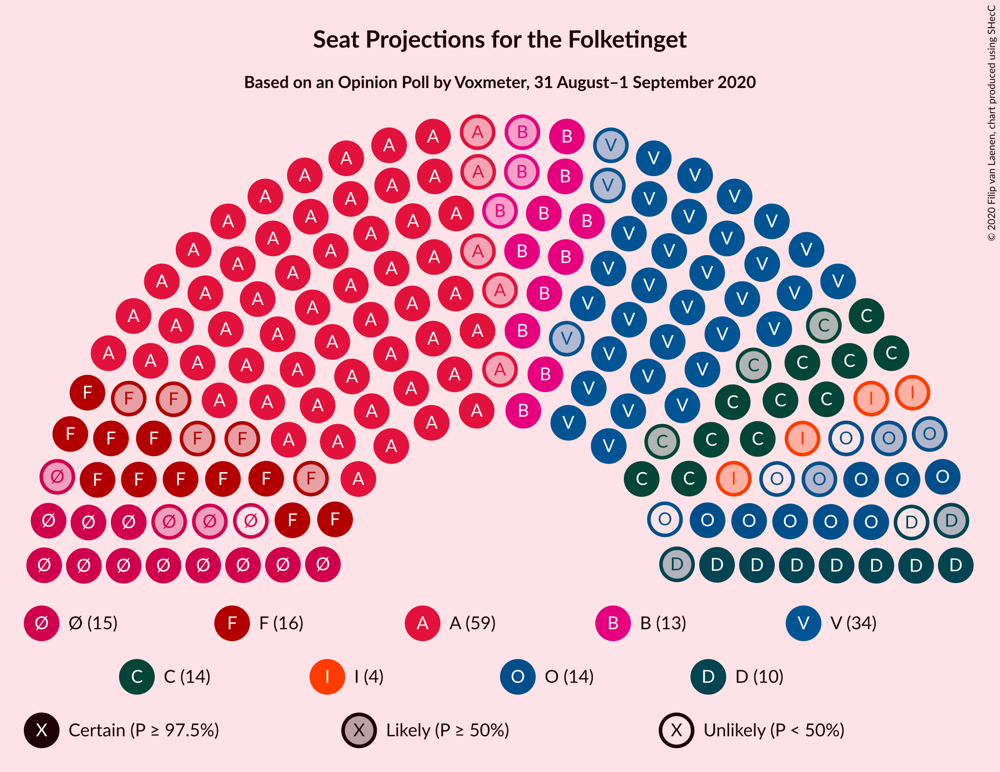
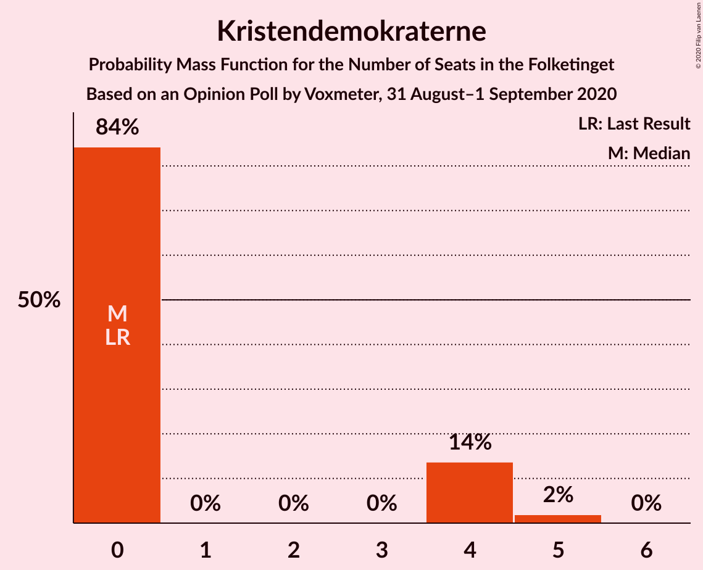

# Opinion Poll by Voxmeter, 31 August–1 September 2020

<a href="#voting-intentions">Voting Intentions</a> | <a href="#seats">Seats</a> | <a href="#coalitions">Coalitions</a> | <a href="#technical-information">Technical Information</a>

## Voting Intentions

### Confidence Intervals

| Party | Last Result | Poll Result | 80% Confidence Interval | 90% Confidence Interval | 95% Confidence Interval | 99% Confidence Interval |
|:-----:|:-----------:|:-----------:|:-----------------------:|:-----------------------:|:-----------------------:|:-----------------------:|
| Socialdemokraterne | 25.9% | 33.4% | 31.5–35.3% |31.0–35.8% |30.5–36.3% |29.7–37.2% |
| Venstre | 23.4% | 20.4% | 18.9–22.1% |18.4–22.6% |18.1–23.0% |17.3–23.8% |
| Socialistisk Folkeparti | 7.7% | 8.6% | 7.6–9.8% |7.3–10.2% |7.0–10.5% |6.6–11.1% |
| Enhedslisten–De Rød-Grønne | 6.9% | 7.7% | 6.8–8.9% |6.5–9.2% |6.2–9.5% |5.8–10.1% |
| Det Konservative Folkeparti | 6.6% | 7.5% | 6.6–8.7% |6.3–9.0% |6.1–9.3% |5.7–9.9% |
| Radikale Venstre | 8.6% | 6.8% | 5.9–7.9% |5.6–8.2% |5.4–8.5% |5.0–9.0% |
| Dansk Folkeparti | 8.7% | 6.0% | 5.1–7.1% |4.9–7.4% |4.7–7.6% |4.3–8.2% |
| Nye Borgerlige | 2.4% | 4.7% | 4.0–5.7% |3.8–6.0% |3.6–6.2% |3.3–6.7% |
| Liberal Alliance | 2.3% | 2.3% | 1.8–3.0% |1.7–3.2% |1.6–3.4% |1.4–3.8% |
| Kristendemokraterne | 1.7% | 1.5% | 1.2–2.2% |1.0–2.3% |0.9–2.5% |0.8–2.8% |
| Alternativet | 3.0% | 0.4% | 0.2–0.8% |0.2–0.9% |0.2–1.0% |0.1–1.2% |
| Stram Kurs | 1.8% | 0.4% | 0.2–0.8% |0.2–0.9% |0.2–1.0% |0.1–1.2% |

*Note:* The poll result column reflects the actual value used in the calculations. Published results may vary slightly, and in addition be rounded to fewer digits.

## Seats

### Confidence Intervals

| Party | Last Result | Median | 80% Confidence Interval | 90% Confidence Interval | 95% Confidence Interval | 99% Confidence Interval |
|:-----:|:-----------:|:------:|:-----------------------:|:-----------------------:|:-----------------------:|:-----------------------:|
| <a href="#socialdemokraterne">Socialdemokraterne</a> | 48 | 59 | 56–64 |55–65 |54–66 |53–66 |
| <a href="#venstre">Venstre</a> | 43 | 34 | 32–40 |31–40 |31–42 |30–43 |
| <a href="#socialistisk-folkeparti">Socialistisk Folkeparti</a> | 14 | 16 | 13–17 |13–18 |11–19 |11–21 |
| <a href="#enhedslisten–de-rød-grønne">Enhedslisten–De Rød-Grønne</a> | 13 | 14 | 12–17 |12–18 |11–18 |11–19 |
| <a href="#det-konservative-folkeparti">Det Konservative Folkeparti</a> | 12 | 14 | 12–16 |12–17 |11–17 |10–19 |
| <a href="#radikale-venstre">Radikale Venstre</a> | 16 | 13 | 11–15 |10–16 |10–16 |9–16 |
| <a href="#dansk-folkeparti">Dansk Folkeparti</a> | 16 | 11 | 9–14 |9–14 |8–14 |7–15 |
| <a href="#nye-borgerlige">Nye Borgerlige</a> | 4 | 9 | 7–10 |7–11 |7–11 |6–11 |
| <a href="#liberal-alliance">Liberal Alliance</a> | 4 | 4 | 0–6 |0–6 |0–6 |0–7 |
| <a href="#kristendemokraterne">Kristendemokraterne</a> | 0 | 0 | 0–4 |0–4 |0–4 |0–5 |
| <a href="#alternativet">Alternativet</a> | 5 | 0 | 0 |0 |0 |0 |
| <a href="#stram-kurs">Stram Kurs</a> | 0 | 0 | 0 |0 |0 |0 |

### Socialdemokraterne

*For a full overview of the results for this party, see the [Socialdemokraterne](party-socialdemokraterne.html) page.*

| Number of Seats | Probability | Accumulated | Special Marks |
|:---------------:|:-----------:|:-----------:|:-------------:|
| 48 | 0% | 100% | Last Result |
| 49 | 0% | 100% |  |
| 50 | 0% | 100% |  |
| 51 | 0.1% | 100% |  |
| 52 | 0.1% | 99.9% |  |
| 53 | 0.6% | 99.8% |  |
| 54 | 4% | 99.2% |  |
| 55 | 1.5% | 96% |  |
| 56 | 10% | 94% |  |
| 57 | 4% | 85% |  |
| 58 | 8% | 80% |  |
| 59 | 30% | 73% | Median |
| 60 | 8% | 43% |  |
| 61 | 12% | 35% |  |
| 62 | 10% | 23% |  |
| 63 | 2% | 12% |  |
| 64 | 5% | 10% |  |
| 65 | 2% | 6% |  |
| 66 | 4% | 4% |  |
| 67 | 0.2% | 0.3% |  |
| 68 | 0.1% | 0.1% |  |
| 69 | 0% | 0.1% |  |
| 70 | 0% | 0% |  |

### Venstre

*For a full overview of the results for this party, see the [Venstre](party-venstre.html) page.*

| Number of Seats | Probability | Accumulated | Special Marks |
|:---------------:|:-----------:|:-----------:|:-------------:|
| 29 | 0.1% | 100% |  |
| 30 | 1.5% | 99.8% |  |
| 31 | 7% | 98% |  |
| 32 | 2% | 91% |  |
| 33 | 31% | 89% |  |
| 34 | 13% | 58% | Median |
| 35 | 3% | 44% |  |
| 36 | 11% | 41% |  |
| 37 | 3% | 30% |  |
| 38 | 8% | 27% |  |
| 39 | 6% | 19% |  |
| 40 | 9% | 13% |  |
| 41 | 0.8% | 4% |  |
| 42 | 2% | 3% |  |
| 43 | 0.7% | 0.8% | Last Result |
| 44 | 0% | 0.1% |  |
| 45 | 0% | 0.1% |  |
| 46 | 0% | 0% |  |

### Socialistisk Folkeparti

*For a full overview of the results for this party, see the [Socialistisk Folkeparti](party-socialistiskfolkeparti.html) page.*

| Number of Seats | Probability | Accumulated | Special Marks |
|:---------------:|:-----------:|:-----------:|:-------------:|
| 10 | 0.2% | 100% |  |
| 11 | 2% | 99.8% |  |
| 12 | 2% | 97% |  |
| 13 | 15% | 95% |  |
| 14 | 10% | 80% | Last Result |
| 15 | 19% | 71% |  |
| 16 | 41% | 52% | Median |
| 17 | 5% | 10% |  |
| 18 | 3% | 5% |  |
| 19 | 0.8% | 3% |  |
| 20 | 0.5% | 2% |  |
| 21 | 1.3% | 1.4% |  |
| 22 | 0% | 0% |  |

### Enhedslisten–De Rød-Grønne

*For a full overview of the results for this party, see the [Enhedslisten–De Rød-Grønne](party-enhedslisten–derød-grønne.html) page.*

| Number of Seats | Probability | Accumulated | Special Marks |
|:---------------:|:-----------:|:-----------:|:-------------:|
| 9 | 0.1% | 100% |  |
| 10 | 0.4% | 99.9% |  |
| 11 | 3% | 99.5% |  |
| 12 | 34% | 96% |  |
| 13 | 11% | 62% | Last Result |
| 14 | 17% | 51% | Median |
| 15 | 18% | 34% |  |
| 16 | 4% | 15% |  |
| 17 | 3% | 12% |  |
| 18 | 6% | 9% |  |
| 19 | 2% | 2% |  |
| 20 | 0% | 0% |  |

### Det Konservative Folkeparti

*For a full overview of the results for this party, see the [Det Konservative Folkeparti](party-detkonservativefolkeparti.html) page.*

| Number of Seats | Probability | Accumulated | Special Marks |
|:---------------:|:-----------:|:-----------:|:-------------:|
| 9 | 0.1% | 100% |  |
| 10 | 0.8% | 99.8% |  |
| 11 | 2% | 99.0% |  |
| 12 | 17% | 97% | Last Result |
| 13 | 12% | 80% |  |
| 14 | 45% | 69% | Median |
| 15 | 14% | 24% |  |
| 16 | 3% | 10% |  |
| 17 | 6% | 7% |  |
| 18 | 1.0% | 2% |  |
| 19 | 0.4% | 0.5% |  |
| 20 | 0.1% | 0.1% |  |
| 21 | 0% | 0% |  |

### Radikale Venstre

*For a full overview of the results for this party, see the [Radikale Venstre](party-radikalevenstre.html) page.*

| Number of Seats | Probability | Accumulated | Special Marks |
|:---------------:|:-----------:|:-----------:|:-------------:|
| 8 | 0.2% | 100% |  |
| 9 | 2% | 99.8% |  |
| 10 | 6% | 98% |  |
| 11 | 17% | 92% |  |
| 12 | 16% | 75% |  |
| 13 | 38% | 59% | Median |
| 14 | 6% | 22% |  |
| 15 | 10% | 16% |  |
| 16 | 6% | 6% | Last Result |
| 17 | 0.2% | 0.3% |  |
| 18 | 0% | 0.1% |  |
| 19 | 0.1% | 0.1% |  |
| 20 | 0% | 0% |  |

### Dansk Folkeparti

*For a full overview of the results for this party, see the [Dansk Folkeparti](party-danskfolkeparti.html) page.*

| Number of Seats | Probability | Accumulated | Special Marks |
|:---------------:|:-----------:|:-----------:|:-------------:|
| 7 | 1.3% | 100% |  |
| 8 | 1.5% | 98.7% |  |
| 9 | 13% | 97% |  |
| 10 | 30% | 84% |  |
| 11 | 7% | 54% | Median |
| 12 | 17% | 47% |  |
| 13 | 6% | 30% |  |
| 14 | 23% | 24% |  |
| 15 | 0.7% | 0.7% |  |
| 16 | 0% | 0% | Last Result |

### Nye Borgerlige

*For a full overview of the results for this party, see the [Nye Borgerlige](party-nyeborgerlige.html) page.*

| Number of Seats | Probability | Accumulated | Special Marks |
|:---------------:|:-----------:|:-----------:|:-------------:|
| 4 | 0% | 100% | Last Result |
| 5 | 0.3% | 100% |  |
| 6 | 2% | 99.7% |  |
| 7 | 10% | 98% |  |
| 8 | 19% | 88% |  |
| 9 | 25% | 69% | Median |
| 10 | 34% | 43% |  |
| 11 | 9% | 9% |  |
| 12 | 0.2% | 0.4% |  |
| 13 | 0.2% | 0.2% |  |
| 14 | 0% | 0% |  |

### Liberal Alliance

*For a full overview of the results for this party, see the [Liberal Alliance](party-liberalalliance.html) page.*

| Number of Seats | Probability | Accumulated | Special Marks |
|:---------------:|:-----------:|:-----------:|:-------------:|
| 0 | 22% | 100% |  |
| 1 | 0% | 78% |  |
| 2 | 0% | 78% |  |
| 3 | 0.3% | 78% |  |
| 4 | 42% | 78% | Last Result, Median |
| 5 | 24% | 36% |  |
| 6 | 11% | 12% |  |
| 7 | 1.1% | 1.2% |  |
| 8 | 0% | 0% |  |

### Kristendemokraterne

*For a full overview of the results for this party, see the [Kristendemokraterne](party-kristendemokraterne.html) page.*

| Number of Seats | Probability | Accumulated | Special Marks |
|:---------------:|:-----------:|:-----------:|:-------------:|
| 0 | 84% | 100% | Last Result, Median |
| 1 | 0% | 16% |  |
| 2 | 0% | 16% |  |
| 3 | 0% | 16% |  |
| 4 | 14% | 16% |  |
| 5 | 2% | 2% |  |
| 6 | 0% | 0% |  |

### Alternativet

*For a full overview of the results for this party, see the [Alternativet](party-alternativet.html) page.*

| Number of Seats | Probability | Accumulated | Special Marks |
|:---------------:|:-----------:|:-----------:|:-------------:|
| 0 | 100% | 100% | Median |
| 1 | 0% | 0% |  |
| 2 | 0% | 0% |  |
| 3 | 0% | 0% |  |
| 4 | 0% | 0% |  |
| 5 | 0% | 0% | Last Result |

### Stram Kurs

*For a full overview of the results for this party, see the [Stram Kurs](party-stramkurs.html) page.*

| Number of Seats | Probability | Accumulated | Special Marks |
|:---------------:|:-----------:|:-----------:|:-------------:|
| 0 | 100% | 100% | Last Result, Median |

## Coalitions

### Confidence Intervals

| Coalition | Last Result | Median | Majority? | 80% Confidence Interval | 90% Confidence Interval | 95% Confidence Interval | 99% Confidence Interval |
|:---------:|:-----------:|:------:|:---------:|:-----------------------:|:-----------------------:|:-----------------------:|:-----------------------:|
| Socialdemokraterne – Socialistisk Folkeparti – Enhedslisten–De Rød-Grønne – Radikale Venstre – Alternativet | 96 | 101 | 100% | 97–106 | 96–106 | 96–107 | 92–108 |
| Socialdemokraterne – Socialistisk Folkeparti – Enhedslisten–De Rød-Grønne – Radikale Venstre | 91 | 101 | 100% | 97–106 | 96–106 | 96–107 | 92–108 |
| Socialdemokraterne – Socialistisk Folkeparti – Enhedslisten–De Rød-Grønne – Alternativet | 80 | 88 | 33% | 84–93 | 84–95 | 84–96 | 81–96 |
| Socialdemokraterne – Socialistisk Folkeparti – Enhedslisten–De Rød-Grønne | 75 | 88 | 33% | 84–93 | 84–95 | 84–96 | 81–96 |
| Socialdemokraterne – Socialistisk Folkeparti – Radikale Venstre | 78 | 88 | 13% | 83–91 | 82–93 | 82–93 | 77–95 |
| Venstre – Det Konservative Folkeparti – Dansk Folkeparti – Nye Borgerlige – Liberal Alliance – Kristendemokraterne | 79 | 74 | 0% | 69–78 | 69–79 | 68–79 | 67–83 |
| Venstre – Det Konservative Folkeparti – Dansk Folkeparti – Nye Borgerlige – Liberal Alliance | 79 | 74 | 0% | 69–76 | 68–78 | 66–78 | 66–81 |
| Socialdemokraterne – Radikale Venstre | 64 | 72 | 0% | 68–76 | 67–77 | 66–77 | 64–78 |
| Venstre – Det Konservative Folkeparti – Dansk Folkeparti – Liberal Alliance – Kristendemokraterne | 75 | 65 | 0% | 60–69 | 60–72 | 59–72 | 58–73 |
| Venstre – Det Konservative Folkeparti – Dansk Folkeparti – Liberal Alliance | 75 | 65 | 0% | 60–68 | 59–68 | 58–69 | 56–72 |
| Venstre – Det Konservative Folkeparti – Liberal Alliance | 59 | 52 | 0% | 50–57 | 49–58 | 48–59 | 45–60 |
| Venstre – Det Konservative Folkeparti | 55 | 49 | 0% | 45–53 | 45–54 | 45–54 | 42–57 |
| Venstre | 43 | 34 | 0% | 32–40 | 31–40 | 31–42 | 30–43 |

### Socialdemokraterne – Socialistisk Folkeparti – Enhedslisten–De Rød-Grønne – Radikale Venstre – Alternativet

| Number of Seats | Probability | Accumulated | Special Marks |
|:---------------:|:-----------:|:-----------:|:-------------:|
| 92 | 0.8% | 100% |  |
| 93 | 0.1% | 99.2% |  |
| 94 | 0.5% | 99.1% |  |
| 95 | 0.5% | 98.6% |  |
| 96 | 4% | 98% | Last Result |
| 97 | 8% | 94% |  |
| 98 | 1.4% | 86% |  |
| 99 | 3% | 85% |  |
| 100 | 30% | 81% |  |
| 101 | 12% | 52% |  |
| 102 | 8% | 39% | Median |
| 103 | 4% | 31% |  |
| 104 | 11% | 28% |  |
| 105 | 5% | 17% |  |
| 106 | 8% | 12% |  |
| 107 | 3% | 4% |  |
| 108 | 0.6% | 1.0% |  |
| 109 | 0.3% | 0.4% |  |
| 110 | 0.1% | 0.1% |  |
| 111 | 0% | 0.1% |  |
| 112 | 0% | 0.1% |  |
| 113 | 0% | 0% |  |

### Socialdemokraterne – Socialistisk Folkeparti – Enhedslisten–De Rød-Grønne – Radikale Venstre

| Number of Seats | Probability | Accumulated | Special Marks |
|:---------------:|:-----------:|:-----------:|:-------------:|
| 91 | 0% | 100% | Last Result |
| 92 | 0.8% | 100% |  |
| 93 | 0.1% | 99.2% |  |
| 94 | 0.5% | 99.1% |  |
| 95 | 0.5% | 98.6% |  |
| 96 | 4% | 98% |  |
| 97 | 8% | 94% |  |
| 98 | 1.4% | 86% |  |
| 99 | 3% | 85% |  |
| 100 | 30% | 81% |  |
| 101 | 12% | 52% |  |
| 102 | 8% | 39% | Median |
| 103 | 4% | 31% |  |
| 104 | 11% | 28% |  |
| 105 | 5% | 17% |  |
| 106 | 8% | 12% |  |
| 107 | 3% | 4% |  |
| 108 | 0.6% | 1.0% |  |
| 109 | 0.3% | 0.4% |  |
| 110 | 0.1% | 0.1% |  |
| 111 | 0% | 0.1% |  |
| 112 | 0% | 0.1% |  |
| 113 | 0% | 0% |  |

### Socialdemokraterne – Socialistisk Folkeparti – Enhedslisten–De Rød-Grønne – Alternativet

| Number of Seats | Probability | Accumulated | Special Marks |
|:---------------:|:-----------:|:-----------:|:-------------:|
| 79 | 0.1% | 100% |  |
| 80 | 0% | 99.9% | Last Result |
| 81 | 1.1% | 99.9% |  |
| 82 | 0.4% | 98.8% |  |
| 83 | 0.4% | 98% |  |
| 84 | 8% | 98% |  |
| 85 | 4% | 90% |  |
| 86 | 6% | 86% |  |
| 87 | 30% | 80% |  |
| 88 | 7% | 51% |  |
| 89 | 11% | 44% | Median |
| 90 | 5% | 33% | Majority |
| 91 | 9% | 28% |  |
| 92 | 2% | 19% |  |
| 93 | 12% | 17% |  |
| 94 | 0.3% | 5% |  |
| 95 | 2% | 5% |  |
| 96 | 3% | 4% |  |
| 97 | 0.2% | 0.3% |  |
| 98 | 0.1% | 0.1% |  |
| 99 | 0% | 0.1% |  |
| 100 | 0.1% | 0.1% |  |
| 101 | 0% | 0% |  |

### Socialdemokraterne – Socialistisk Folkeparti – Enhedslisten–De Rød-Grønne

| Number of Seats | Probability | Accumulated | Special Marks |
|:---------------:|:-----------:|:-----------:|:-------------:|
| 75 | 0% | 100% | Last Result |
| 76 | 0% | 100% |  |
| 77 | 0% | 100% |  |
| 78 | 0% | 100% |  |
| 79 | 0.1% | 100% |  |
| 80 | 0% | 99.9% |  |
| 81 | 1.1% | 99.9% |  |
| 82 | 0.4% | 98.8% |  |
| 83 | 0.4% | 98% |  |
| 84 | 8% | 98% |  |
| 85 | 4% | 90% |  |
| 86 | 6% | 86% |  |
| 87 | 30% | 80% |  |
| 88 | 7% | 51% |  |
| 89 | 11% | 44% | Median |
| 90 | 5% | 33% | Majority |
| 91 | 9% | 28% |  |
| 92 | 2% | 19% |  |
| 93 | 12% | 17% |  |
| 94 | 0.3% | 5% |  |
| 95 | 2% | 5% |  |
| 96 | 3% | 4% |  |
| 97 | 0.2% | 0.3% |  |
| 98 | 0.1% | 0.1% |  |
| 99 | 0% | 0.1% |  |
| 100 | 0.1% | 0.1% |  |
| 101 | 0% | 0% |  |

### Socialdemokraterne – Socialistisk Folkeparti – Radikale Venstre

| Number of Seats | Probability | Accumulated | Special Marks |
|:---------------:|:-----------:|:-----------:|:-------------:|
| 77 | 0.8% | 100% |  |
| 78 | 0.3% | 99.2% | Last Result |
| 79 | 0.2% | 99.0% |  |
| 80 | 0.3% | 98.8% |  |
| 81 | 0.9% | 98% |  |
| 82 | 6% | 98% |  |
| 83 | 5% | 92% |  |
| 84 | 2% | 87% |  |
| 85 | 3% | 85% |  |
| 86 | 7% | 82% |  |
| 87 | 10% | 74% |  |
| 88 | 38% | 64% | Median |
| 89 | 13% | 26% |  |
| 90 | 2% | 13% | Majority |
| 91 | 4% | 11% |  |
| 92 | 0.9% | 7% |  |
| 93 | 4% | 6% |  |
| 94 | 0.8% | 2% |  |
| 95 | 0.8% | 1.0% |  |
| 96 | 0.2% | 0.2% |  |
| 97 | 0% | 0.1% |  |
| 98 | 0% | 0% |  |

### Venstre – Det Konservative Folkeparti – Dansk Folkeparti – Nye Borgerlige – Liberal Alliance – Kristendemokraterne

| Number of Seats | Probability | Accumulated | Special Marks |
|:---------------:|:-----------:|:-----------:|:-------------:|
| 63 | 0% | 100% |  |
| 64 | 0% | 99.9% |  |
| 65 | 0.1% | 99.9% |  |
| 66 | 0.3% | 99.9% |  |
| 67 | 0.6% | 99.6% |  |
| 68 | 3% | 99.0% |  |
| 69 | 8% | 96% |  |
| 70 | 5% | 88% |  |
| 71 | 11% | 83% |  |
| 72 | 4% | 72% | Median |
| 73 | 8% | 69% |  |
| 74 | 12% | 61% |  |
| 75 | 30% | 48% |  |
| 76 | 3% | 19% |  |
| 77 | 1.4% | 15% |  |
| 78 | 8% | 14% |  |
| 79 | 4% | 6% | Last Result |
| 80 | 0.5% | 2% |  |
| 81 | 0.5% | 1.4% |  |
| 82 | 0.1% | 0.9% |  |
| 83 | 0.8% | 0.8% |  |
| 84 | 0% | 0% |  |

### Venstre – Det Konservative Folkeparti – Dansk Folkeparti – Nye Borgerlige – Liberal Alliance

| Number of Seats | Probability | Accumulated | Special Marks |
|:---------------:|:-----------:|:-----------:|:-------------:|
| 63 | 0% | 100% |  |
| 64 | 0% | 99.9% |  |
| 65 | 0.1% | 99.9% |  |
| 66 | 3% | 99.8% |  |
| 67 | 1.1% | 97% |  |
| 68 | 3% | 96% |  |
| 69 | 8% | 93% |  |
| 70 | 3% | 85% |  |
| 71 | 13% | 81% |  |
| 72 | 5% | 68% | Median |
| 73 | 8% | 63% |  |
| 74 | 14% | 55% |  |
| 75 | 31% | 41% |  |
| 76 | 2% | 11% |  |
| 77 | 1.2% | 9% |  |
| 78 | 6% | 8% |  |
| 79 | 1.2% | 2% | Last Result |
| 80 | 0.1% | 0.7% |  |
| 81 | 0.5% | 0.5% |  |
| 82 | 0% | 0.1% |  |
| 83 | 0% | 0% |  |

### Socialdemokraterne – Radikale Venstre

| Number of Seats | Probability | Accumulated | Special Marks |
|:---------------:|:-----------:|:-----------:|:-------------:|
| 62 | 0.1% | 100% |  |
| 63 | 0.1% | 99.9% |  |
| 64 | 0.4% | 99.8% | Last Result |
| 65 | 1.1% | 99.5% |  |
| 66 | 3% | 98% |  |
| 67 | 0.8% | 96% |  |
| 68 | 5% | 95% |  |
| 69 | 4% | 89% |  |
| 70 | 5% | 85% |  |
| 71 | 7% | 81% |  |
| 72 | 31% | 74% | Median |
| 73 | 15% | 43% |  |
| 74 | 9% | 28% |  |
| 75 | 5% | 18% |  |
| 76 | 7% | 13% |  |
| 77 | 3% | 6% |  |
| 78 | 2% | 2% |  |
| 79 | 0.2% | 0.4% |  |
| 80 | 0.2% | 0.2% |  |
| 81 | 0% | 0% |  |

### Venstre – Det Konservative Folkeparti – Dansk Folkeparti – Liberal Alliance – Kristendemokraterne

| Number of Seats | Probability | Accumulated | Special Marks |
|:---------------:|:-----------:|:-----------:|:-------------:|
| 56 | 0.2% | 100% |  |
| 57 | 0.2% | 99.8% |  |
| 58 | 1.1% | 99.6% |  |
| 59 | 3% | 98.5% |  |
| 60 | 7% | 95% |  |
| 61 | 3% | 88% |  |
| 62 | 6% | 85% |  |
| 63 | 13% | 79% | Median |
| 64 | 9% | 66% |  |
| 65 | 30% | 58% |  |
| 66 | 7% | 28% |  |
| 67 | 4% | 22% |  |
| 68 | 6% | 18% |  |
| 69 | 5% | 12% |  |
| 70 | 2% | 8% |  |
| 71 | 0.8% | 6% |  |
| 72 | 4% | 5% |  |
| 73 | 0.4% | 0.6% |  |
| 74 | 0.1% | 0.2% |  |
| 75 | 0.1% | 0.1% | Last Result |
| 76 | 0% | 0% |  |

### Venstre – Det Konservative Folkeparti – Dansk Folkeparti – Liberal Alliance

| Number of Seats | Probability | Accumulated | Special Marks |
|:---------------:|:-----------:|:-----------:|:-------------:|
| 56 | 1.2% | 100% |  |
| 57 | 0.2% | 98.7% |  |
| 58 | 2% | 98% |  |
| 59 | 5% | 97% |  |
| 60 | 7% | 92% |  |
| 61 | 3% | 85% |  |
| 62 | 7% | 83% |  |
| 63 | 13% | 75% | Median |
| 64 | 9% | 62% |  |
| 65 | 30% | 53% |  |
| 66 | 6% | 23% |  |
| 67 | 3% | 17% |  |
| 68 | 9% | 13% |  |
| 69 | 3% | 5% |  |
| 70 | 0.2% | 1.2% |  |
| 71 | 0.4% | 0.9% |  |
| 72 | 0.2% | 0.5% |  |
| 73 | 0.3% | 0.4% |  |
| 74 | 0% | 0.1% |  |
| 75 | 0% | 0% | Last Result |

### Venstre – Det Konservative Folkeparti – Liberal Alliance

| Number of Seats | Probability | Accumulated | Special Marks |
|:---------------:|:-----------:|:-----------:|:-------------:|
| 45 | 0.9% | 100% |  |
| 46 | 0.4% | 99.1% |  |
| 47 | 0.3% | 98.7% |  |
| 48 | 1.4% | 98% |  |
| 49 | 5% | 97% |  |
| 50 | 7% | 92% |  |
| 51 | 32% | 84% |  |
| 52 | 14% | 53% | Median |
| 53 | 5% | 39% |  |
| 54 | 7% | 34% |  |
| 55 | 7% | 27% |  |
| 56 | 6% | 20% |  |
| 57 | 6% | 14% |  |
| 58 | 4% | 8% |  |
| 59 | 3% | 4% | Last Result |
| 60 | 0.6% | 0.9% |  |
| 61 | 0% | 0.3% |  |
| 62 | 0.2% | 0.3% |  |
| 63 | 0% | 0.1% |  |
| 64 | 0% | 0% |  |

### Venstre – Det Konservative Folkeparti

| Number of Seats | Probability | Accumulated | Special Marks |
|:---------------:|:-----------:|:-----------:|:-------------:|
| 42 | 0.7% | 100% |  |
| 43 | 0.4% | 99.3% |  |
| 44 | 0.3% | 98.9% |  |
| 45 | 14% | 98.7% |  |
| 46 | 2% | 84% |  |
| 47 | 25% | 83% |  |
| 48 | 7% | 58% | Median |
| 49 | 10% | 51% |  |
| 50 | 4% | 41% |  |
| 51 | 11% | 37% |  |
| 52 | 8% | 26% |  |
| 53 | 11% | 18% |  |
| 54 | 5% | 7% |  |
| 55 | 0.6% | 2% | Last Result |
| 56 | 0.8% | 2% |  |
| 57 | 0.6% | 0.7% |  |
| 58 | 0% | 0.1% |  |
| 59 | 0.1% | 0.1% |  |
| 60 | 0% | 0% |  |

### Venstre

| Number of Seats | Probability | Accumulated | Special Marks |
|:---------------:|:-----------:|:-----------:|:-------------:|
| 29 | 0.1% | 100% |  |
| 30 | 1.5% | 99.8% |  |
| 31 | 7% | 98% |  |
| 32 | 2% | 91% |  |
| 33 | 31% | 89% |  |
| 34 | 13% | 58% | Median |
| 35 | 3% | 44% |  |
| 36 | 11% | 41% |  |
| 37 | 3% | 30% |  |
| 38 | 8% | 27% |  |
| 39 | 6% | 19% |  |
| 40 | 9% | 13% |  |
| 41 | 0.8% | 4% |  |
| 42 | 2% | 3% |  |
| 43 | 0.7% | 0.8% | Last Result |
| 44 | 0% | 0.1% |  |
| 45 | 0% | 0.1% |  |
| 46 | 0% | 0% |  |

## Technical Information

### Opinion Poll

+ **Polling firm:** Voxmeter
+ **Commissioner(s):** —
+ **Fieldwork period:** 31 August–1 September 2020

### Calculations

+ **Sample size:** 1034
+ **Simulations done:** 1,048,576
+ **Error estimate:** 2.62%

