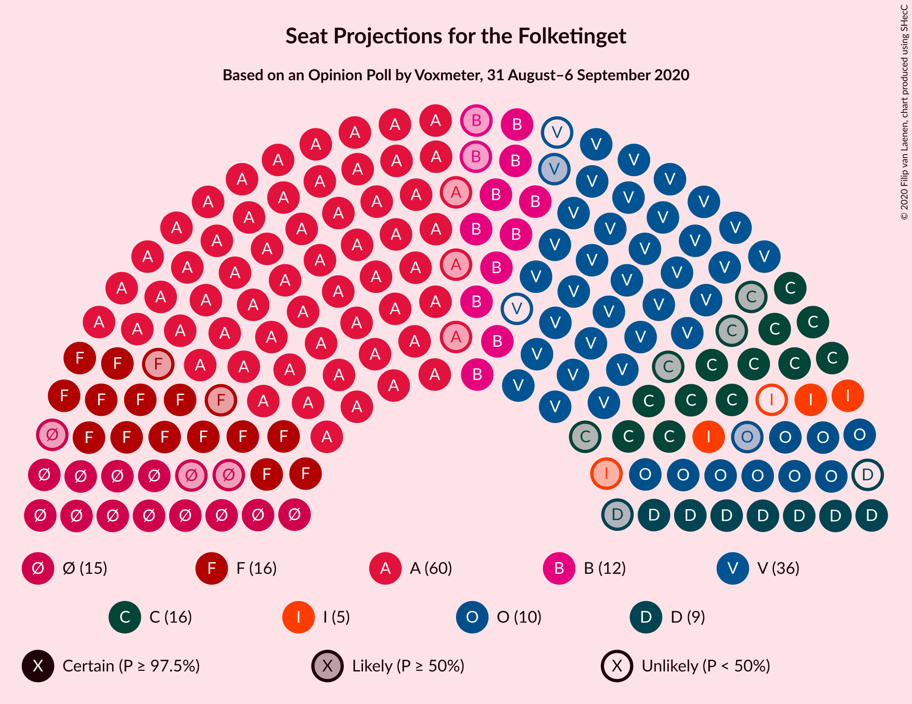
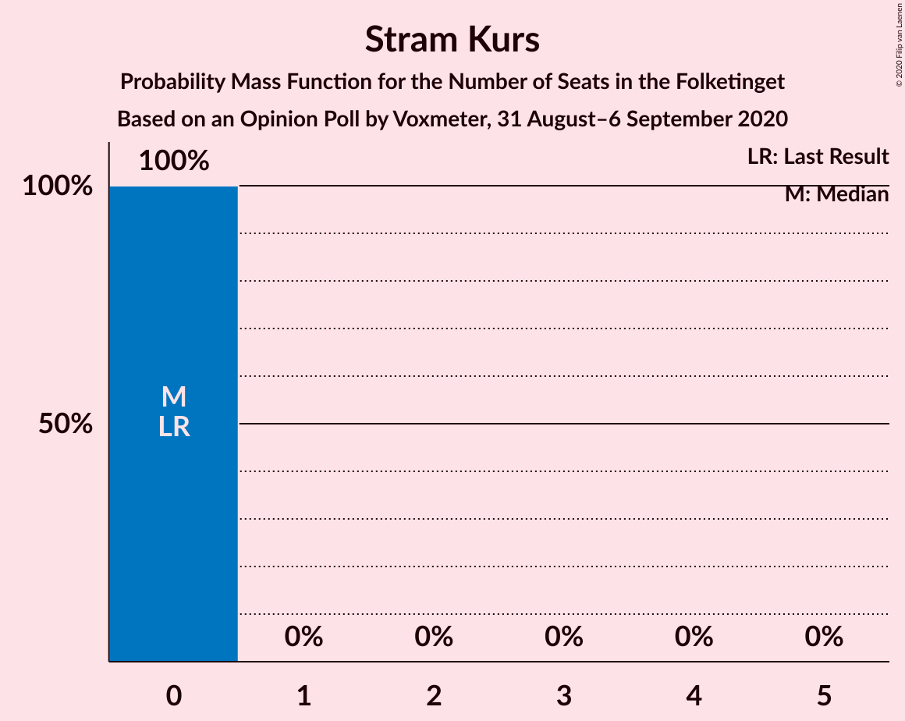
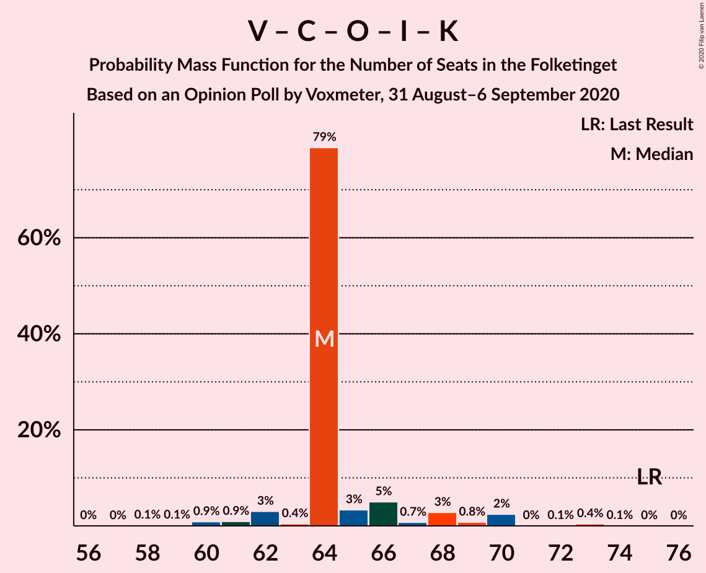

# Opinion Poll by Voxmeter, 31 August–6 September 2020

<a href="#voting-intentions">Voting Intentions</a> | <a href="#seats">Seats</a> | <a href="#coalitions">Coalitions</a> | <a href="#technical-information">Technical Information</a>

## Voting Intentions

### Confidence Intervals

| Party | Last Result | Poll Result | 80% Confidence Interval | 90% Confidence Interval | 95% Confidence Interval | 99% Confidence Interval |
|:-----:|:-----------:|:-----------:|:-----------------------:|:-----------------------:|:-----------------------:|:-----------------------:|
| Socialdemokraterne | 25.9% | 33.4% | 31.5–35.3% |31.0–35.8% |30.5–36.3% |29.7–37.2% |
| Venstre | 23.4% | 20.4% | 18.9–22.1% |18.4–22.6% |18.1–23.0% |17.3–23.8% |
| Socialistisk Folkeparti | 7.7% | 8.6% | 7.6–9.8% |7.3–10.2% |7.0–10.5% |6.6–11.1% |
| Enhedslisten–De Rød-Grønne | 6.9% | 7.7% | 6.8–8.9% |6.5–9.2% |6.2–9.5% |5.8–10.1% |
| Det Konservative Folkeparti | 6.6% | 7.5% | 6.6–8.7% |6.3–9.0% |6.1–9.3% |5.7–9.9% |
| Radikale Venstre | 8.6% | 6.8% | 5.9–7.9% |5.6–8.2% |5.4–8.5% |5.0–9.0% |
| Dansk Folkeparti | 8.7% | 6.0% | 5.1–7.1% |4.9–7.4% |4.7–7.6% |4.3–8.2% |
| Nye Borgerlige | 2.4% | 4.7% | 4.0–5.7% |3.8–6.0% |3.6–6.2% |3.3–6.7% |
| Liberal Alliance | 2.3% | 2.3% | 1.8–3.0% |1.7–3.2% |1.6–3.4% |1.4–3.8% |
| Kristendemokraterne | 1.7% | 1.5% | 1.2–2.2% |1.0–2.3% |0.9–2.5% |0.8–2.8% |
| Alternativet | 3.0% | 0.4% | 0.2–0.8% |0.2–0.9% |0.2–1.0% |0.1–1.2% |
| Stram Kurs | 1.8% | 0.3% | 0.2–0.7% |0.1–0.8% |0.1–0.9% |0.1–1.1% |

*Note:* The poll result column reflects the actual value used in the calculations. Published results may vary slightly, and in addition be rounded to fewer digits.

## Seats

### Confidence Intervals

| Party | Last Result | Median | 80% Confidence Interval | 90% Confidence Interval | 95% Confidence Interval | 99% Confidence Interval |
|:-----:|:-----------:|:------:|:-----------------------:|:-----------------------:|:-----------------------:|:-----------------------:|
| <a href="#socialdemokraterne">Socialdemokraterne</a> | 48 | 60 | 59–60 |57–60 |57–62 |54–65 |
| <a href="#venstre">Venstre</a> | 43 | 34 | 34–36 |33–38 |33–39 |31–42 |
| <a href="#socialistisk-folkeparti">Socialistisk Folkeparti</a> | 14 | 16 | 16 |14–17 |14–18 |13–19 |
| <a href="#enhedslisten–de-rød-grønne">Enhedslisten–De Rød-Grønne</a> | 13 | 15 | 13–15 |12–15 |12–16 |11–18 |
| <a href="#det-konservative-folkeparti">Det Konservative Folkeparti</a> | 12 | 16 | 14–16 |13–16 |12–16 |11–16 |
| <a href="#radikale-venstre">Radikale Venstre</a> | 16 | 12 | 12 |11–13 |10–14 |10–15 |
| <a href="#dansk-folkeparti">Dansk Folkeparti</a> | 16 | 10 | 10–11 |10–13 |9–14 |8–14 |
| <a href="#nye-borgerlige">Nye Borgerlige</a> | 4 | 8 | 8–9 |8–10 |7–10 |7–12 |
| <a href="#liberal-alliance">Liberal Alliance</a> | 4 | 4 | 4 |4–5 |3–6 |0–7 |
| <a href="#kristendemokraterne">Kristendemokraterne</a> | 0 | 0 | 0 |0 |0 |0–4 |
| <a href="#alternativet">Alternativet</a> | 5 | 0 | 0 |0 |0 |0 |
| <a href="#stram-kurs">Stram Kurs</a> | 0 | 0 | 0 |0 |0 |0 |

### Socialdemokraterne

*For a full overview of the results for this party, see the [Socialdemokraterne](party-socialdemokraterne.html) page.*

| Number of Seats | Probability | Accumulated | Special Marks |
|:---------------:|:-----------:|:-----------:|:-------------:|
| 48 | 0% | 100% | Last Result |
| 49 | 0% | 100% |  |
| 50 | 0% | 100% |  |
| 51 | 0% | 100% |  |
| 52 | 0% | 100% |  |
| 53 | 0.4% | 100% |  |
| 54 | 1.3% | 99.5% |  |
| 55 | 0.4% | 98% |  |
| 56 | 0.1% | 98% |  |
| 57 | 3% | 98% |  |
| 58 | 3% | 95% |  |
| 59 | 5% | 92% |  |
| 60 | 83% | 87% | Median |
| 61 | 1.1% | 4% |  |
| 62 | 0.6% | 3% |  |
| 63 | 0.6% | 2% |  |
| 64 | 0.3% | 2% |  |
| 65 | 1.4% | 1.4% |  |
| 66 | 0% | 0.1% |  |
| 67 | 0.1% | 0.1% |  |
| 68 | 0% | 0% |  |

### Venstre

*For a full overview of the results for this party, see the [Venstre](party-venstre.html) page.*

| Number of Seats | Probability | Accumulated | Special Marks |
|:---------------:|:-----------:|:-----------:|:-------------:|
| 30 | 0.2% | 100% |  |
| 31 | 0.3% | 99.8% |  |
| 32 | 0.6% | 99.5% |  |
| 33 | 4% | 98.8% |  |
| 34 | 79% | 95% | Median |
| 35 | 2% | 16% |  |
| 36 | 7% | 14% |  |
| 37 | 1.2% | 7% |  |
| 38 | 3% | 6% |  |
| 39 | 2% | 3% |  |
| 40 | 0.5% | 2% |  |
| 41 | 0.4% | 1.1% |  |
| 42 | 0.6% | 0.7% |  |
| 43 | 0% | 0% | Last Result |

### Socialistisk Folkeparti

*For a full overview of the results for this party, see the [Socialistisk Folkeparti](party-socialistiskfolkeparti.html) page.*

| Number of Seats | Probability | Accumulated | Special Marks |
|:---------------:|:-----------:|:-----------:|:-------------:|
| 11 | 0.1% | 100% |  |
| 12 | 0.4% | 99.9% |  |
| 13 | 1.2% | 99.6% |  |
| 14 | 3% | 98% | Last Result |
| 15 | 1.5% | 95% |  |
| 16 | 86% | 93% | Median |
| 17 | 3% | 7% |  |
| 18 | 3% | 4% |  |
| 19 | 0.2% | 0.6% |  |
| 20 | 0.1% | 0.4% |  |
| 21 | 0.3% | 0.3% |  |
| 22 | 0% | 0% |  |

### Enhedslisten–De Rød-Grønne

*For a full overview of the results for this party, see the [Enhedslisten–De Rød-Grønne](party-enhedslisten–derød-grønne.html) page.*

| Number of Seats | Probability | Accumulated | Special Marks |
|:---------------:|:-----------:|:-----------:|:-------------:|
| 10 | 0.1% | 100% |  |
| 11 | 0.9% | 99.9% |  |
| 12 | 9% | 99.1% |  |
| 13 | 5% | 90% | Last Result |
| 14 | 3% | 85% |  |
| 15 | 79% | 82% | Median |
| 16 | 1.0% | 3% |  |
| 17 | 0.7% | 2% |  |
| 18 | 0.9% | 1.2% |  |
| 19 | 0.3% | 0.3% |  |
| 20 | 0% | 0% |  |

### Det Konservative Folkeparti

*For a full overview of the results for this party, see the [Det Konservative Folkeparti](party-detkonservativefolkeparti.html) page.*

| Number of Seats | Probability | Accumulated | Special Marks |
|:---------------:|:-----------:|:-----------:|:-------------:|
| 10 | 0.3% | 100% |  |
| 11 | 2% | 99.7% |  |
| 12 | 2% | 98% | Last Result |
| 13 | 2% | 95% |  |
| 14 | 7% | 93% |  |
| 15 | 4% | 86% |  |
| 16 | 82% | 83% | Median |
| 17 | 0.1% | 0.2% |  |
| 18 | 0% | 0.1% |  |
| 19 | 0% | 0% |  |

### Radikale Venstre

*For a full overview of the results for this party, see the [Radikale Venstre](party-radikalevenstre.html) page.*

| Number of Seats | Probability | Accumulated | Special Marks |
|:---------------:|:-----------:|:-----------:|:-------------:|
| 9 | 0.2% | 100% |  |
| 10 | 4% | 99.8% |  |
| 11 | 5% | 96% |  |
| 12 | 82% | 91% | Median |
| 13 | 5% | 9% |  |
| 14 | 3% | 5% |  |
| 15 | 1.5% | 2% |  |
| 16 | 0.1% | 0.1% | Last Result |
| 17 | 0% | 0.1% |  |
| 18 | 0% | 0% |  |

### Dansk Folkeparti

*For a full overview of the results for this party, see the [Dansk Folkeparti](party-danskfolkeparti.html) page.*

| Number of Seats | Probability | Accumulated | Special Marks |
|:---------------:|:-----------:|:-----------:|:-------------:|
| 7 | 0.3% | 100% |  |
| 8 | 2% | 99.7% |  |
| 9 | 2% | 98% |  |
| 10 | 83% | 96% | Median |
| 11 | 3% | 13% |  |
| 12 | 4% | 10% |  |
| 13 | 2% | 6% |  |
| 14 | 4% | 4% |  |
| 15 | 0.1% | 0.1% |  |
| 16 | 0% | 0% | Last Result |

### Nye Borgerlige

*For a full overview of the results for this party, see the [Nye Borgerlige](party-nyeborgerlige.html) page.*

| Number of Seats | Probability | Accumulated | Special Marks |
|:---------------:|:-----------:|:-----------:|:-------------:|
| 4 | 0% | 100% | Last Result |
| 5 | 0% | 100% |  |
| 6 | 0.2% | 100% |  |
| 7 | 4% | 99.7% |  |
| 8 | 82% | 96% | Median |
| 9 | 7% | 14% |  |
| 10 | 5% | 7% |  |
| 11 | 0.5% | 2% |  |
| 12 | 2% | 2% |  |
| 13 | 0% | 0% |  |

### Liberal Alliance

*For a full overview of the results for this party, see the [Liberal Alliance](party-liberalalliance.html) page.*

| Number of Seats | Probability | Accumulated | Special Marks |
|:---------------:|:-----------:|:-----------:|:-------------:|
| 0 | 2% | 100% |  |
| 1 | 0% | 98% |  |
| 2 | 0% | 98% |  |
| 3 | 0.1% | 98% |  |
| 4 | 88% | 97% | Last Result, Median |
| 5 | 6% | 9% |  |
| 6 | 2% | 3% |  |
| 7 | 0.7% | 0.7% |  |
| 8 | 0% | 0% |  |

### Kristendemokraterne

*For a full overview of the results for this party, see the [Kristendemokraterne](party-kristendemokraterne.html) page.*

| Number of Seats | Probability | Accumulated | Special Marks |
|:---------------:|:-----------:|:-----------:|:-------------:|
| 0 | 98% | 100% | Last Result, Median |
| 1 | 0% | 2% |  |
| 2 | 0% | 2% |  |
| 3 | 0% | 2% |  |
| 4 | 2% | 2% |  |
| 5 | 0.3% | 0.3% |  |
| 6 | 0% | 0% |  |

### Alternativet

*For a full overview of the results for this party, see the [Alternativet](party-alternativet.html) page.*

| Number of Seats | Probability | Accumulated | Special Marks |
|:---------------:|:-----------:|:-----------:|:-------------:|
| 0 | 100% | 100% | Median |
| 1 | 0% | 0% |  |
| 2 | 0% | 0% |  |
| 3 | 0% | 0% |  |
| 4 | 0% | 0% |  |
| 5 | 0% | 0% | Last Result |

### Stram Kurs

*For a full overview of the results for this party, see the [Stram Kurs](party-stramkurs.html) page.*

| Number of Seats | Probability | Accumulated | Special Marks |
|:---------------:|:-----------:|:-----------:|:-------------:|
| 0 | 100% | 100% | Last Result, Median |

## Coalitions

### Confidence Intervals

| Coalition | Last Result | Median | Majority? | 80% Confidence Interval | 90% Confidence Interval | 95% Confidence Interval | 99% Confidence Interval |
|:---------:|:-----------:|:------:|:---------:|:-----------------------:|:-----------------------:|:-----------------------:|:-----------------------:|
| Socialdemokraterne – Socialistisk Folkeparti – Enhedslisten–De Rød-Grønne – Radikale Venstre – Alternativet | 96 | 103 | 100% | 100–103 | 99–103 | 98–105 | 95–106 |
| Socialdemokraterne – Socialistisk Folkeparti – Enhedslisten–De Rød-Grønne – Radikale Venstre | 91 | 103 | 100% | 100–103 | 99–103 | 98–105 | 95–106 |
| Socialdemokraterne – Socialistisk Folkeparti – Enhedslisten–De Rød-Grønne – Alternativet | 80 | 91 | 86% | 88–91 | 87–91 | 85–92 | 83–94 |
| Socialdemokraterne – Socialistisk Folkeparti – Enhedslisten–De Rød-Grønne | 75 | 91 | 86% | 88–91 | 87–91 | 85–92 | 83–94 |
| Socialdemokraterne – Socialistisk Folkeparti – Radikale Venstre | 78 | 88 | 3% | 88 | 85–88 | 84–91 | 80–93 |
| Venstre – Det Konservative Folkeparti – Dansk Folkeparti – Nye Borgerlige – Liberal Alliance – Kristendemokraterne | 79 | 72 | 0% | 72–75 | 72–76 | 70–77 | 69–80 |
| Venstre – Det Konservative Folkeparti – Dansk Folkeparti – Nye Borgerlige – Liberal Alliance | 79 | 72 | 0% | 72–75 | 72–76 | 70–77 | 69–79 |
| Socialdemokraterne – Radikale Venstre | 64 | 72 | 0% | 71–72 | 70–72 | 69–75 | 65–77 |
| Venstre – Det Konservative Folkeparti – Dansk Folkeparti – Liberal Alliance – Kristendemokraterne | 75 | 64 | 0% | 64–66 | 62–68 | 62–70 | 60–72 |
| Venstre – Det Konservative Folkeparti – Dansk Folkeparti – Liberal Alliance | 75 | 64 | 0% | 64–66 | 62–68 | 62–69 | 60–70 |
| Venstre – Det Konservative Folkeparti – Liberal Alliance | 59 | 54 | 0% | 54–56 | 51–56 | 50–58 | 48–60 |
| Venstre – Det Konservative Folkeparti | 55 | 50 | 0% | 49–51 | 47–52 | 47–53 | 45–56 |
| Venstre | 43 | 34 | 0% | 34–36 | 33–38 | 33–39 | 31–42 |

### Socialdemokraterne – Socialistisk Folkeparti – Enhedslisten–De Rød-Grønne – Radikale Venstre – Alternativet

| Number of Seats | Probability | Accumulated | Special Marks |
|:---------------:|:-----------:|:-----------:|:-------------:|
| 93 | 0.1% | 100% |  |
| 94 | 0.2% | 99.9% |  |
| 95 | 0.4% | 99.7% |  |
| 96 | 1.3% | 99.3% | Last Result |
| 97 | 0.2% | 98% |  |
| 98 | 2% | 98% |  |
| 99 | 2% | 96% |  |
| 100 | 8% | 93% |  |
| 101 | 3% | 85% |  |
| 102 | 0.2% | 83% |  |
| 103 | 79% | 83% | Median |
| 104 | 0.5% | 4% |  |
| 105 | 1.4% | 3% |  |
| 106 | 2% | 2% |  |
| 107 | 0.1% | 0.2% |  |
| 108 | 0.1% | 0.1% |  |
| 109 | 0% | 0% |  |

### Socialdemokraterne – Socialistisk Folkeparti – Enhedslisten–De Rød-Grønne – Radikale Venstre

| Number of Seats | Probability | Accumulated | Special Marks |
|:---------------:|:-----------:|:-----------:|:-------------:|
| 91 | 0% | 100% | Last Result |
| 92 | 0% | 100% |  |
| 93 | 0.1% | 100% |  |
| 94 | 0.2% | 99.9% |  |
| 95 | 0.4% | 99.7% |  |
| 96 | 1.3% | 99.3% |  |
| 97 | 0.2% | 98% |  |
| 98 | 2% | 98% |  |
| 99 | 2% | 96% |  |
| 100 | 8% | 93% |  |
| 101 | 3% | 85% |  |
| 102 | 0.2% | 83% |  |
| 103 | 79% | 83% | Median |
| 104 | 0.5% | 4% |  |
| 105 | 1.4% | 3% |  |
| 106 | 2% | 2% |  |
| 107 | 0.1% | 0.2% |  |
| 108 | 0.1% | 0.1% |  |
| 109 | 0% | 0% |  |

### Socialdemokraterne – Socialistisk Folkeparti – Enhedslisten–De Rød-Grønne – Alternativet

| Number of Seats | Probability | Accumulated | Special Marks |
|:---------------:|:-----------:|:-----------:|:-------------:|
| 80 | 0% | 100% | Last Result |
| 81 | 0.2% | 100% |  |
| 82 | 0.1% | 99.8% |  |
| 83 | 0.3% | 99.7% |  |
| 84 | 2% | 99.4% |  |
| 85 | 0.9% | 98% |  |
| 86 | 1.5% | 97% |  |
| 87 | 5% | 95% |  |
| 88 | 3% | 91% |  |
| 89 | 2% | 88% |  |
| 90 | 4% | 86% | Majority |
| 91 | 80% | 82% | Median |
| 92 | 0.4% | 3% |  |
| 93 | 0.6% | 2% |  |
| 94 | 1.3% | 2% |  |
| 95 | 0.1% | 0.2% |  |
| 96 | 0.1% | 0.2% |  |
| 97 | 0% | 0.1% |  |
| 98 | 0% | 0.1% |  |
| 99 | 0% | 0% |  |

### Socialdemokraterne – Socialistisk Folkeparti – Enhedslisten–De Rød-Grønne

| Number of Seats | Probability | Accumulated | Special Marks |
|:---------------:|:-----------:|:-----------:|:-------------:|
| 75 | 0% | 100% | Last Result |
| 76 | 0% | 100% |  |
| 77 | 0% | 100% |  |
| 78 | 0% | 100% |  |
| 79 | 0% | 100% |  |
| 80 | 0% | 100% |  |
| 81 | 0.2% | 100% |  |
| 82 | 0.1% | 99.8% |  |
| 83 | 0.3% | 99.7% |  |
| 84 | 2% | 99.4% |  |
| 85 | 0.9% | 98% |  |
| 86 | 1.5% | 97% |  |
| 87 | 5% | 95% |  |
| 88 | 3% | 91% |  |
| 89 | 2% | 88% |  |
| 90 | 4% | 86% | Majority |
| 91 | 80% | 82% | Median |
| 92 | 0.4% | 3% |  |
| 93 | 0.6% | 2% |  |
| 94 | 1.3% | 2% |  |
| 95 | 0.1% | 0.2% |  |
| 96 | 0.1% | 0.2% |  |
| 97 | 0% | 0.1% |  |
| 98 | 0% | 0.1% |  |
| 99 | 0% | 0% |  |

### Socialdemokraterne – Socialistisk Folkeparti – Radikale Venstre

| Number of Seats | Probability | Accumulated | Special Marks |
|:---------------:|:-----------:|:-----------:|:-------------:|
| 78 | 0.2% | 100% | Last Result |
| 79 | 0% | 99.8% |  |
| 80 | 0.6% | 99.8% |  |
| 81 | 0.8% | 99.2% |  |
| 82 | 0.1% | 98% |  |
| 83 | 0.4% | 98% |  |
| 84 | 1.1% | 98% |  |
| 85 | 3% | 97% |  |
| 86 | 1.1% | 94% |  |
| 87 | 3% | 93% |  |
| 88 | 86% | 90% | Median |
| 89 | 2% | 5% |  |
| 90 | 0.1% | 3% | Majority |
| 91 | 0.2% | 3% |  |
| 92 | 2% | 2% |  |
| 93 | 0.3% | 0.5% |  |
| 94 | 0.2% | 0.3% |  |
| 95 | 0% | 0% |  |

### Venstre – Det Konservative Folkeparti – Dansk Folkeparti – Nye Borgerlige – Liberal Alliance – Kristendemokraterne

| Number of Seats | Probability | Accumulated | Special Marks |
|:---------------:|:-----------:|:-----------:|:-------------:|
| 67 | 0.1% | 100% |  |
| 68 | 0.1% | 99.9% |  |
| 69 | 2% | 99.8% |  |
| 70 | 1.4% | 98% |  |
| 71 | 0.5% | 97% |  |
| 72 | 79% | 96% | Median |
| 73 | 0.2% | 17% |  |
| 74 | 3% | 17% |  |
| 75 | 8% | 15% |  |
| 76 | 2% | 7% |  |
| 77 | 2% | 4% |  |
| 78 | 0.2% | 2% |  |
| 79 | 1.3% | 2% | Last Result |
| 80 | 0.4% | 0.7% |  |
| 81 | 0.2% | 0.3% |  |
| 82 | 0.1% | 0.1% |  |
| 83 | 0% | 0% |  |

### Venstre – Det Konservative Folkeparti – Dansk Folkeparti – Nye Borgerlige – Liberal Alliance

| Number of Seats | Probability | Accumulated | Special Marks |
|:---------------:|:-----------:|:-----------:|:-------------:|
| 66 | 0.1% | 100% |  |
| 67 | 0.1% | 99.9% |  |
| 68 | 0.1% | 99.8% |  |
| 69 | 2% | 99.7% |  |
| 70 | 1.4% | 98% |  |
| 71 | 0.8% | 97% |  |
| 72 | 79% | 96% | Median |
| 73 | 0.4% | 17% |  |
| 74 | 2% | 16% |  |
| 75 | 8% | 14% |  |
| 76 | 2% | 6% |  |
| 77 | 2% | 3% |  |
| 78 | 0.2% | 1.2% |  |
| 79 | 0.7% | 1.0% | Last Result |
| 80 | 0.3% | 0.3% |  |
| 81 | 0% | 0.1% |  |
| 82 | 0% | 0% |  |

### Socialdemokraterne – Radikale Venstre

| Number of Seats | Probability | Accumulated | Special Marks |
|:---------------:|:-----------:|:-----------:|:-------------:|
| 63 | 0.2% | 100% |  |
| 64 | 0% | 99.8% | Last Result |
| 65 | 0.6% | 99.8% |  |
| 66 | 1.0% | 99.2% |  |
| 67 | 0.2% | 98% |  |
| 68 | 0.4% | 98% |  |
| 69 | 2% | 98% |  |
| 70 | 5% | 95% |  |
| 71 | 3% | 91% |  |
| 72 | 83% | 88% | Median |
| 73 | 0.8% | 5% |  |
| 74 | 1.1% | 4% |  |
| 75 | 0.5% | 3% |  |
| 76 | 2% | 2% |  |
| 77 | 0.3% | 0.6% |  |
| 78 | 0.3% | 0.3% |  |
| 79 | 0% | 0% |  |

### Venstre – Det Konservative Folkeparti – Dansk Folkeparti – Liberal Alliance – Kristendemokraterne

| Number of Seats | Probability | Accumulated | Special Marks |
|:---------------:|:-----------:|:-----------:|:-------------:|
| 58 | 0.1% | 100% |  |
| 59 | 0.1% | 99.8% |  |
| 60 | 0.9% | 99.7% |  |
| 61 | 0.9% | 98.8% |  |
| 62 | 3% | 98% |  |
| 63 | 0.4% | 95% |  |
| 64 | 79% | 94% | Median |
| 65 | 3% | 16% |  |
| 66 | 5% | 12% |  |
| 67 | 0.7% | 7% |  |
| 68 | 3% | 7% |  |
| 69 | 0.8% | 4% |  |
| 70 | 2% | 3% |  |
| 71 | 0% | 0.6% |  |
| 72 | 0.1% | 0.6% |  |
| 73 | 0.4% | 0.5% |  |
| 74 | 0.1% | 0.1% |  |
| 75 | 0% | 0% | Last Result |

### Venstre – Det Konservative Folkeparti – Dansk Folkeparti – Liberal Alliance

| Number of Seats | Probability | Accumulated | Special Marks |
|:---------------:|:-----------:|:-----------:|:-------------:|
| 56 | 0% | 100% |  |
| 57 | 0% | 99.9% |  |
| 58 | 0.1% | 99.9% |  |
| 59 | 0.2% | 99.8% |  |
| 60 | 1.0% | 99.6% |  |
| 61 | 1.0% | 98.6% |  |
| 62 | 3% | 98% |  |
| 63 | 0.6% | 94% |  |
| 64 | 79% | 94% | Median |
| 65 | 3% | 15% |  |
| 66 | 6% | 12% |  |
| 67 | 0.7% | 6% |  |
| 68 | 2% | 5% |  |
| 69 | 1.0% | 3% |  |
| 70 | 2% | 2% |  |
| 71 | 0% | 0.3% |  |
| 72 | 0% | 0.3% |  |
| 73 | 0.2% | 0.2% |  |
| 74 | 0% | 0% |  |
| 75 | 0% | 0% | Last Result |

### Venstre – Det Konservative Folkeparti – Liberal Alliance

| Number of Seats | Probability | Accumulated | Special Marks |
|:---------------:|:-----------:|:-----------:|:-------------:|
| 46 | 0.1% | 100% |  |
| 47 | 0.3% | 99.9% |  |
| 48 | 0.1% | 99.6% |  |
| 49 | 1.3% | 99.5% |  |
| 50 | 0.8% | 98% |  |
| 51 | 5% | 97% |  |
| 52 | 0.5% | 92% |  |
| 53 | 2% | 92% |  |
| 54 | 79% | 90% | Median |
| 55 | 0.2% | 11% |  |
| 56 | 5% | 10% |  |
| 57 | 0.7% | 5% |  |
| 58 | 2% | 4% |  |
| 59 | 0.9% | 2% | Last Result |
| 60 | 0.7% | 0.9% |  |
| 61 | 0.2% | 0.3% |  |
| 62 | 0% | 0% |  |

### Venstre – Det Konservative Folkeparti

| Number of Seats | Probability | Accumulated | Special Marks |
|:---------------:|:-----------:|:-----------:|:-------------:|
| 43 | 0% | 100% |  |
| 44 | 0.1% | 99.9% |  |
| 45 | 0.7% | 99.9% |  |
| 46 | 0.4% | 99.2% |  |
| 47 | 6% | 98.8% |  |
| 48 | 1.1% | 93% |  |
| 49 | 2% | 92% |  |
| 50 | 79% | 90% | Median |
| 51 | 2% | 11% |  |
| 52 | 5% | 9% |  |
| 53 | 2% | 3% |  |
| 54 | 0.4% | 2% |  |
| 55 | 0.6% | 1.2% | Last Result |
| 56 | 0.6% | 0.7% |  |
| 57 | 0% | 0.1% |  |
| 58 | 0% | 0% |  |

### Venstre

| Number of Seats | Probability | Accumulated | Special Marks |
|:---------------:|:-----------:|:-----------:|:-------------:|
| 30 | 0.2% | 100% |  |
| 31 | 0.3% | 99.8% |  |
| 32 | 0.6% | 99.5% |  |
| 33 | 4% | 98.8% |  |
| 34 | 79% | 95% | Median |
| 35 | 2% | 16% |  |
| 36 | 7% | 14% |  |
| 37 | 1.2% | 7% |  |
| 38 | 3% | 6% |  |
| 39 | 2% | 3% |  |
| 40 | 0.5% | 2% |  |
| 41 | 0.4% | 1.1% |  |
| 42 | 0.6% | 0.7% |  |
| 43 | 0% | 0% | Last Result |

## Technical Information

### Opinion Poll

+ **Polling firm:** Voxmeter
+ **Commissioner(s):** —
+ **Fieldwork period:** 31 August–6 September 2020

### Calculations

+ **Sample size:** 1034
+ **Simulations done:** 1,048,576
+ **Error estimate:** 1.43%

