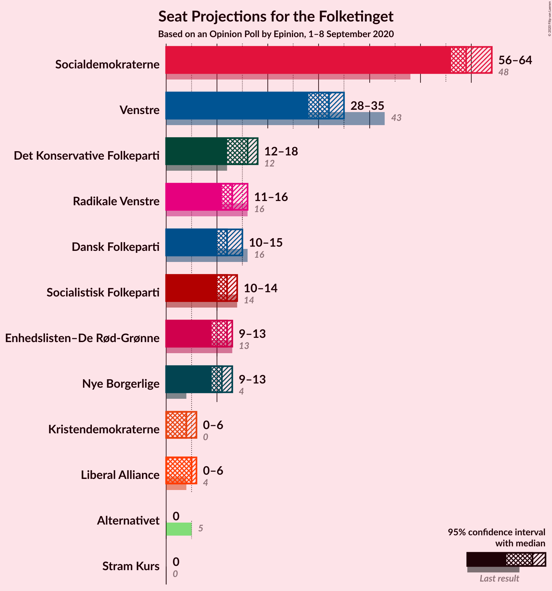
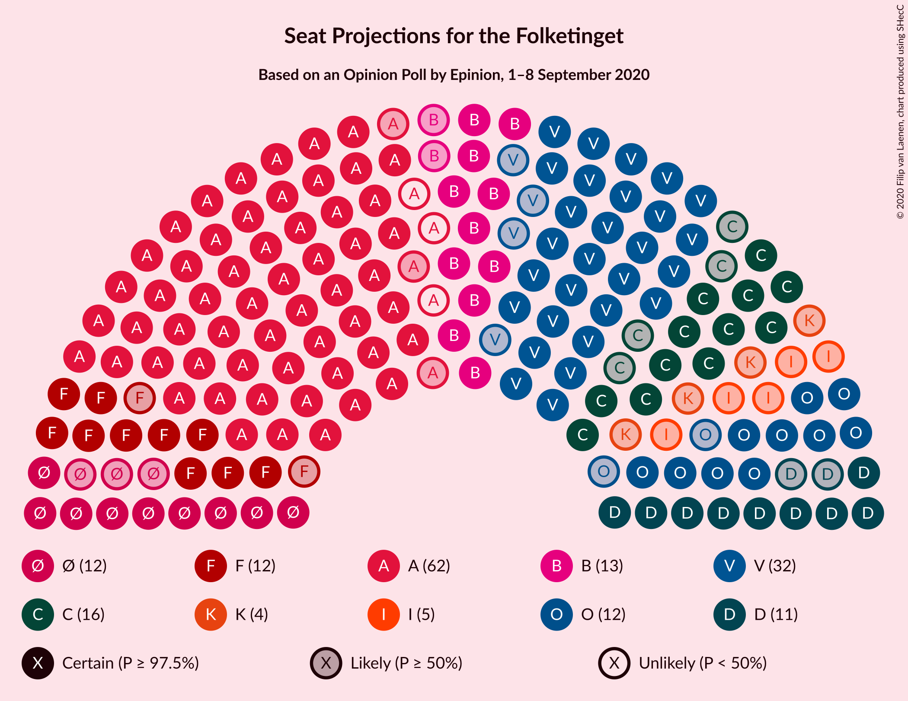
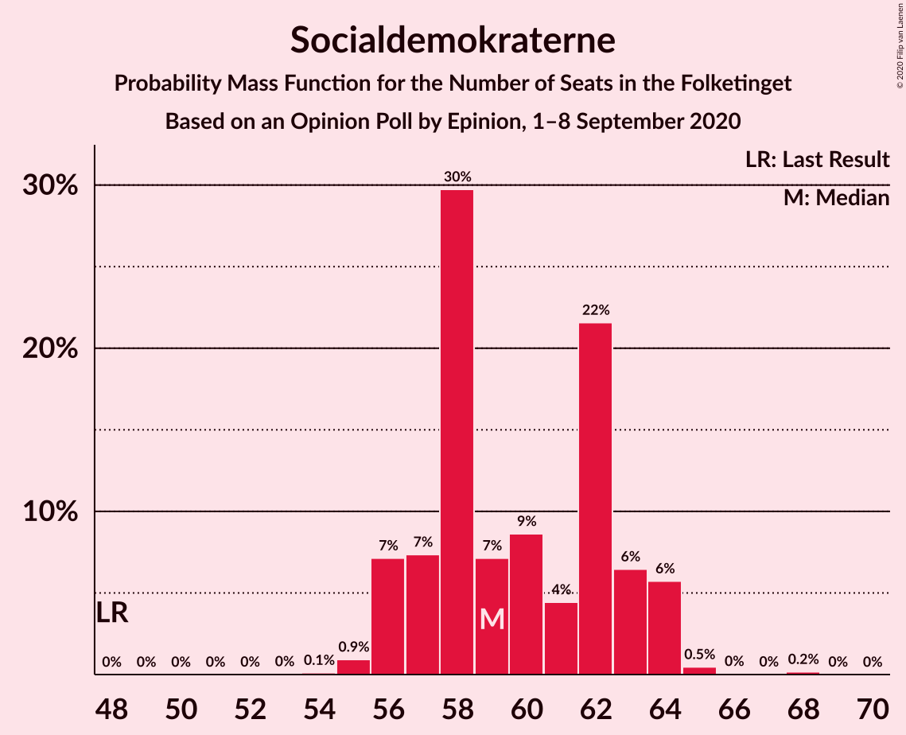
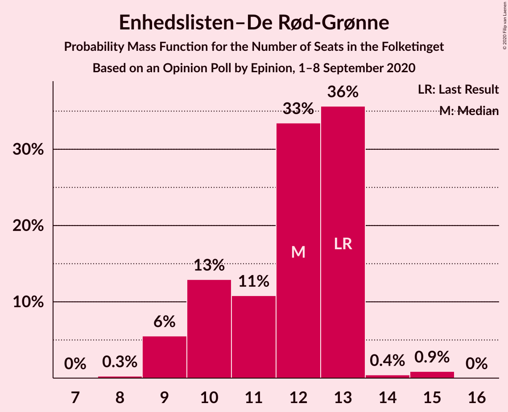
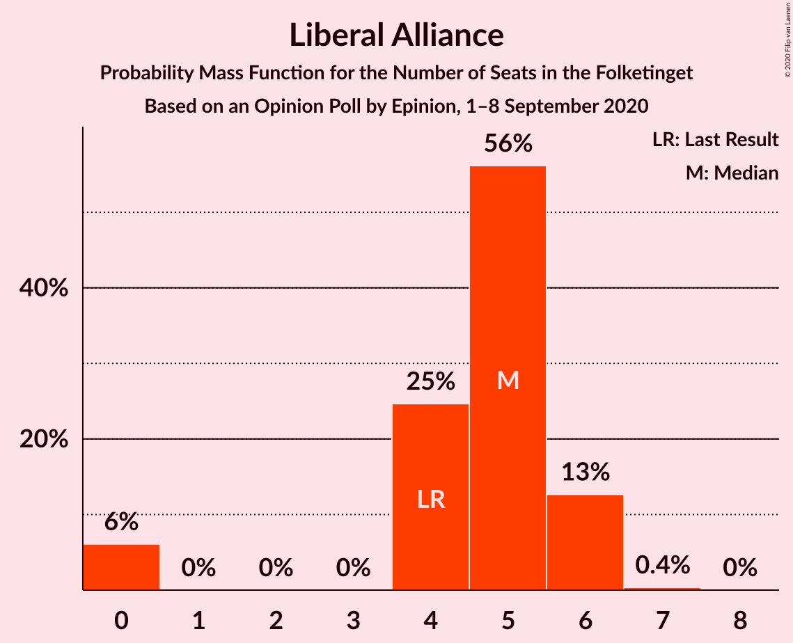
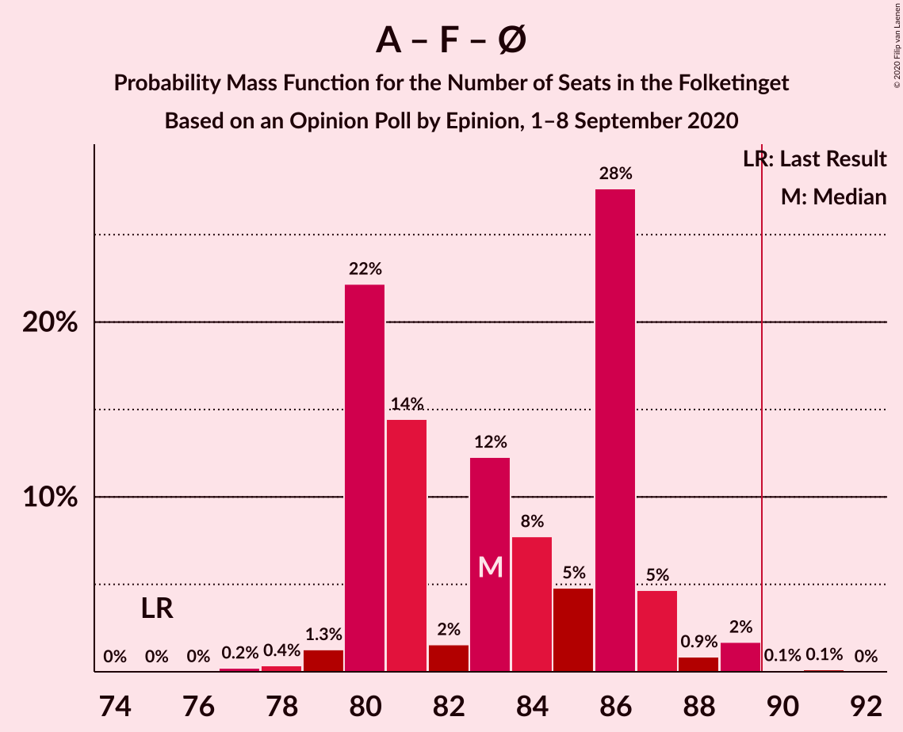
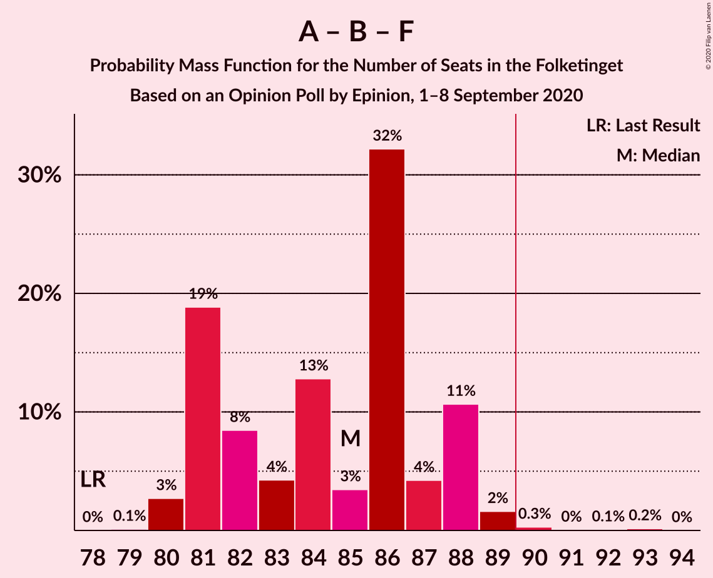
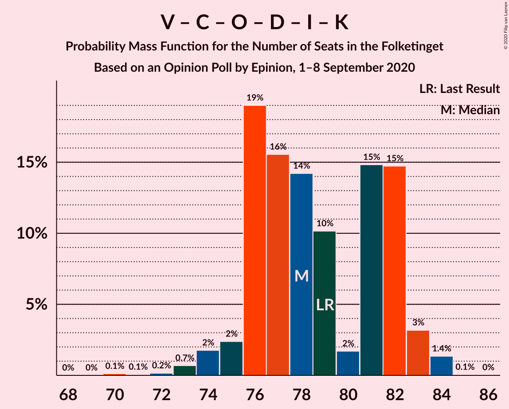
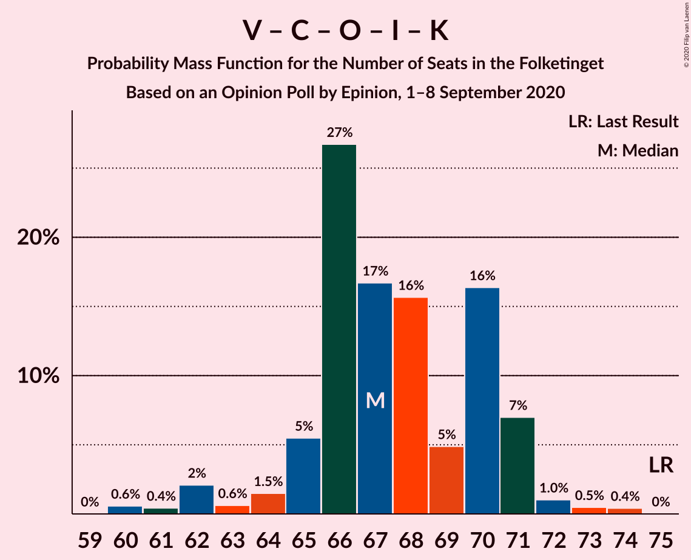

# Opinion Poll by Epinion, 1–8 September 2020

<a href="#voting-intentions">Voting Intentions</a> | <a href="#seats">Seats</a> | <a href="#coalitions">Coalitions</a> | <a href="#technical-information">Technical Information</a>

## Voting Intentions

### Confidence Intervals

| Party | Last Result | Poll Result | 80% Confidence Interval | 90% Confidence Interval | 95% Confidence Interval | 99% Confidence Interval |
|:-----:|:-----------:|:-----------:|:-----------------------:|:-----------------------:|:-----------------------:|:-----------------------:|
| Socialdemokraterne | 25.9% | 33.2% | 31.7–34.7% |31.3–35.2% |31.0–35.5% |30.3–36.3% |
| Venstre | 23.4% | 17.2% | 16.0–18.4% |15.7–18.8% |15.4–19.1% |14.9–19.7% |
| Det Konservative Folkeparti | 6.6% | 8.7% | 7.9–9.7% |7.6–10.0% |7.4–10.2% |7.1–10.7% |
| Radikale Venstre | 8.6% | 7.1% | 6.4–8.0% |6.1–8.3% |6.0–8.5% |5.6–8.9% |
| Dansk Folkeparti | 8.7% | 6.9% | 6.1–7.8% |5.9–8.0% |5.7–8.2% |5.4–8.7% |
| Socialistisk Folkeparti | 7.7% | 6.6% | 5.9–7.5% |5.7–7.7% |5.5–8.0% |5.2–8.4% |
| Enhedslisten–De Rød-Grønne | 6.9% | 6.3% | 5.6–7.2% |5.4–7.4% |5.2–7.6% |4.9–8.0% |
| Nye Borgerlige | 2.4% | 6.2% | 5.5–7.0% |5.3–7.3% |5.1–7.5% |4.8–7.9% |
| Liberal Alliance | 2.3% | 2.5% | 2.1–3.1% |2.0–3.3% |1.9–3.4% |1.7–3.7% |
| Kristendemokraterne | 1.7% | 2.4% | 2.0–3.0% |1.8–3.1% |1.8–3.3% |1.6–3.6% |
| Alternativet | 3.0% | 0.9% | 0.7–1.3% |0.6–1.4% |0.5–1.5% |0.5–1.7% |
| Stram Kurs | 1.8% | 0.8% | 0.6–1.2% |0.5–1.3% |0.5–1.4% |0.4–1.6% |

*Note:* The poll result column reflects the actual value used in the calculations. Published results may vary slightly, and in addition be rounded to fewer digits.

## Seats

### Confidence Intervals

| Party | Last Result | Median | 80% Confidence Interval | 90% Confidence Interval | 95% Confidence Interval | 99% Confidence Interval |
|:-----:|:-----------:|:------:|:-----------------------:|:-----------------------:|:-----------------------:|:-----------------------:|
| <a href="#socialdemokraterne">Socialdemokraterne</a> | 48 | 59 | 57–63 |56–64 |56–64 |55–65 |
| <a href="#venstre">Venstre</a> | 43 | 32 | 29–33 |29–34 |28–35 |28–35 |
| <a href="#det-konservative-folkeparti">Det Konservative Folkeparti</a> | 12 | 16 | 14–17 |13–17 |12–18 |12–20 |
| <a href="#radikale-venstre">Radikale Venstre</a> | 16 | 13 | 12–14 |11–16 |11–16 |11–16 |
| <a href="#dansk-folkeparti">Dansk Folkeparti</a> | 16 | 12 | 11–14 |11–15 |10–15 |10–15 |
| <a href="#socialistisk-folkeparti">Socialistisk Folkeparti</a> | 14 | 12 | 10–14 |10–14 |10–14 |10–15 |
| <a href="#enhedslisten–de-rød-grønne">Enhedslisten–De Rød-Grønne</a> | 13 | 12 | 10–13 |9–13 |9–13 |9–15 |
| <a href="#nye-borgerlige">Nye Borgerlige</a> | 4 | 11 | 10–13 |10–13 |9–13 |9–14 |
| <a href="#liberal-alliance">Liberal Alliance</a> | 4 | 5 | 4–6 |0–6 |0–6 |0–6 |
| <a href="#kristendemokraterne">Kristendemokraterne</a> | 0 | 4 | 0–5 |0–6 |0–6 |0–6 |
| <a href="#alternativet">Alternativet</a> | 5 | 0 | 0 |0 |0 |0 |
| <a href="#stram-kurs">Stram Kurs</a> | 0 | 0 | 0 |0 |0 |0 |

### Socialdemokraterne

*For a full overview of the results for this party, see the [Socialdemokraterne](party-socialdemokraterne.html) page.*

| Number of Seats | Probability | Accumulated | Special Marks |
|:---------------:|:-----------:|:-----------:|:-------------:|
| 48 | 0% | 100% | Last Result |
| 49 | 0% | 100% |  |
| 50 | 0% | 100% |  |
| 51 | 0% | 100% |  |
| 52 | 0% | 100% |  |
| 53 | 0% | 100% |  |
| 54 | 0.1% | 100% |  |
| 55 | 0.9% | 99.8% |  |
| 56 | 7% | 98.9% |  |
| 57 | 7% | 92% |  |
| 58 | 30% | 84% |  |
| 59 | 7% | 55% | Median |
| 60 | 9% | 48% |  |
| 61 | 4% | 39% |  |
| 62 | 22% | 34% |  |
| 63 | 6% | 13% |  |
| 64 | 6% | 6% |  |
| 65 | 0.5% | 0.7% |  |
| 66 | 0% | 0.2% |  |
| 67 | 0% | 0.2% |  |
| 68 | 0.2% | 0.2% |  |
| 69 | 0% | 0% |  |

### Venstre

*For a full overview of the results for this party, see the [Venstre](party-venstre.html) page.*

| Number of Seats | Probability | Accumulated | Special Marks |
|:---------------:|:-----------:|:-----------:|:-------------:|
| 26 | 0.1% | 100% |  |
| 27 | 0.4% | 99.9% |  |
| 28 | 3% | 99.5% |  |
| 29 | 22% | 97% |  |
| 30 | 5% | 75% |  |
| 31 | 11% | 70% |  |
| 32 | 26% | 59% | Median |
| 33 | 27% | 33% |  |
| 34 | 2% | 6% |  |
| 35 | 4% | 5% |  |
| 36 | 0.2% | 0.2% |  |
| 37 | 0% | 0% |  |
| 38 | 0% | 0% |  |
| 39 | 0% | 0% |  |
| 40 | 0% | 0% |  |
| 41 | 0% | 0% |  |
| 42 | 0% | 0% |  |
| 43 | 0% | 0% | Last Result |

### Det Konservative Folkeparti

*For a full overview of the results for this party, see the [Det Konservative Folkeparti](party-detkonservativefolkeparti.html) page.*

| Number of Seats | Probability | Accumulated | Special Marks |
|:---------------:|:-----------:|:-----------:|:-------------:|
| 12 | 3% | 100% | Last Result |
| 13 | 2% | 97% |  |
| 14 | 24% | 94% |  |
| 15 | 16% | 70% |  |
| 16 | 32% | 54% | Median |
| 17 | 19% | 22% |  |
| 18 | 2% | 3% |  |
| 19 | 0.3% | 0.9% |  |
| 20 | 0.6% | 0.6% |  |
| 21 | 0% | 0% |  |

### Radikale Venstre

*For a full overview of the results for this party, see the [Radikale Venstre](party-radikalevenstre.html) page.*

| Number of Seats | Probability | Accumulated | Special Marks |
|:---------------:|:-----------:|:-----------:|:-------------:|
| 10 | 0.2% | 100% |  |
| 11 | 8% | 99.8% |  |
| 12 | 15% | 92% |  |
| 13 | 57% | 77% | Median |
| 14 | 14% | 20% |  |
| 15 | 1.0% | 6% |  |
| 16 | 5% | 5% | Last Result |
| 17 | 0% | 0.1% |  |
| 18 | 0% | 0% |  |

### Dansk Folkeparti

*For a full overview of the results for this party, see the [Dansk Folkeparti](party-danskfolkeparti.html) page.*

| Number of Seats | Probability | Accumulated | Special Marks |
|:---------------:|:-----------:|:-----------:|:-------------:|
| 9 | 0.1% | 100% |  |
| 10 | 4% | 99.9% |  |
| 11 | 14% | 96% |  |
| 12 | 42% | 82% | Median |
| 13 | 26% | 40% |  |
| 14 | 8% | 14% |  |
| 15 | 6% | 6% |  |
| 16 | 0.1% | 0.1% | Last Result |
| 17 | 0% | 0% |  |

### Socialistisk Folkeparti

*For a full overview of the results for this party, see the [Socialistisk Folkeparti](party-socialistiskfolkeparti.html) page.*

| Number of Seats | Probability | Accumulated | Special Marks |
|:---------------:|:-----------:|:-----------:|:-------------:|
| 9 | 0.4% | 100% |  |
| 10 | 16% | 99.6% |  |
| 11 | 33% | 84% |  |
| 12 | 26% | 51% | Median |
| 13 | 13% | 25% |  |
| 14 | 11% | 12% | Last Result |
| 15 | 0.9% | 1.3% |  |
| 16 | 0.4% | 0.4% |  |
| 17 | 0% | 0% |  |

### Enhedslisten–De Rød-Grønne

*For a full overview of the results for this party, see the [Enhedslisten–De Rød-Grønne](party-enhedslisten–derød-grønne.html) page.*

| Number of Seats | Probability | Accumulated | Special Marks |
|:---------------:|:-----------:|:-----------:|:-------------:|
| 8 | 0.3% | 100% |  |
| 9 | 6% | 99.7% |  |
| 10 | 13% | 94% |  |
| 11 | 11% | 81% |  |
| 12 | 33% | 70% | Median |
| 13 | 36% | 37% | Last Result |
| 14 | 0.4% | 1.3% |  |
| 15 | 0.9% | 0.9% |  |
| 16 | 0% | 0% |  |

### Nye Borgerlige

*For a full overview of the results for this party, see the [Nye Borgerlige](party-nyeborgerlige.html) page.*

| Number of Seats | Probability | Accumulated | Special Marks |
|:---------------:|:-----------:|:-----------:|:-------------:|
| 4 | 0% | 100% | Last Result |
| 5 | 0% | 100% |  |
| 6 | 0% | 100% |  |
| 7 | 0% | 100% |  |
| 8 | 0.4% | 100% |  |
| 9 | 2% | 99.6% |  |
| 10 | 33% | 97% |  |
| 11 | 24% | 64% | Median |
| 12 | 26% | 40% |  |
| 13 | 13% | 14% |  |
| 14 | 0.7% | 0.8% |  |
| 15 | 0.1% | 0.1% |  |
| 16 | 0% | 0% |  |

### Liberal Alliance

*For a full overview of the results for this party, see the [Liberal Alliance](party-liberalalliance.html) page.*

| Number of Seats | Probability | Accumulated | Special Marks |
|:---------------:|:-----------:|:-----------:|:-------------:|
| 0 | 6% | 100% |  |
| 1 | 0% | 94% |  |
| 2 | 0% | 94% |  |
| 3 | 0% | 94% |  |
| 4 | 25% | 94% | Last Result |
| 5 | 56% | 69% | Median |
| 6 | 13% | 13% |  |
| 7 | 0.4% | 0.4% |  |
| 8 | 0% | 0% |  |

### Kristendemokraterne

*For a full overview of the results for this party, see the [Kristendemokraterne](party-kristendemokraterne.html) page.*

| Number of Seats | Probability | Accumulated | Special Marks |
|:---------------:|:-----------:|:-----------:|:-------------:|
| 0 | 17% | 100% | Last Result |
| 1 | 0% | 83% |  |
| 2 | 0% | 83% |  |
| 3 | 0% | 83% |  |
| 4 | 50% | 83% | Median |
| 5 | 27% | 33% |  |
| 6 | 5% | 5% |  |
| 7 | 0.1% | 0.1% |  |
| 8 | 0% | 0% |  |

### Alternativet

*For a full overview of the results for this party, see the [Alternativet](party-alternativet.html) page.*

| Number of Seats | Probability | Accumulated | Special Marks |
|:---------------:|:-----------:|:-----------:|:-------------:|
| 0 | 99.9% | 100% | Median |
| 1 | 0% | 0.1% |  |
| 2 | 0% | 0.1% |  |
| 3 | 0% | 0.1% |  |
| 4 | 0.1% | 0.1% |  |
| 5 | 0% | 0% | Last Result |

### Stram Kurs

*For a full overview of the results for this party, see the [Stram Kurs](party-stramkurs.html) page.*

| Number of Seats | Probability | Accumulated | Special Marks |
|:---------------:|:-----------:|:-----------:|:-------------:|
| 0 | 100% | 100% | Last Result, Median |

## Coalitions

### Confidence Intervals

| Coalition | Last Result | Median | Majority? | 80% Confidence Interval | 90% Confidence Interval | 95% Confidence Interval | 99% Confidence Interval |
|:---------:|:-----------:|:------:|:---------:|:-----------------------:|:-----------------------:|:-----------------------:|:-----------------------:|
| Socialdemokraterne – Radikale Venstre – Socialistisk Folkeparti – Enhedslisten–De Rød-Grønne – Alternativet | 96 | 97 | 100% | 93–99 | 93–100 | 92–101 | 91–102 |
| Socialdemokraterne – Radikale Venstre – Socialistisk Folkeparti – Enhedslisten–De Rød-Grønne | 91 | 97 | 100% | 93–99 | 93–100 | 92–101 | 91–102 |
| Socialdemokraterne – Socialistisk Folkeparti – Enhedslisten–De Rød-Grønne – Alternativet | 80 | 83 | 0.2% | 80–86 | 80–87 | 80–88 | 78–89 |
| Socialdemokraterne – Socialistisk Folkeparti – Enhedslisten–De Rød-Grønne | 75 | 83 | 0.2% | 80–86 | 80–87 | 80–88 | 78–89 |
| Socialdemokraterne – Radikale Venstre – Socialistisk Folkeparti | 78 | 85 | 0.6% | 81–88 | 81–88 | 80–88 | 80–90 |
| Venstre – Det Konservative Folkeparti – Dansk Folkeparti – Nye Borgerlige – Liberal Alliance – Kristendemokraterne | 79 | 78 | 0% | 76–82 | 75–82 | 74–83 | 73–84 |
| Venstre – Det Konservative Folkeparti – Dansk Folkeparti – Nye Borgerlige – Liberal Alliance | 79 | 75 | 0% | 72–78 | 72–78 | 71–79 | 70–80 |
| Socialdemokraterne – Radikale Venstre | 64 | 72 | 0% | 70–75 | 69–76 | 69–76 | 68–78 |
| Venstre – Det Konservative Folkeparti – Dansk Folkeparti – Liberal Alliance – Kristendemokraterne | 75 | 67 | 0% | 65–70 | 64–71 | 62–71 | 60–73 |
| Venstre – Det Konservative Folkeparti – Dansk Folkeparti – Liberal Alliance | 75 | 64 | 0% | 62–67 | 61–67 | 60–67 | 57–69 |
| Venstre – Det Konservative Folkeparti – Liberal Alliance | 59 | 51 | 0% | 48–55 | 47–55 | 47–55 | 44–56 |
| Venstre – Det Konservative Folkeparti | 55 | 47 | 0% | 45–49 | 44–50 | 44–50 | 42–52 |
| Venstre | 43 | 32 | 0% | 29–33 | 29–34 | 28–35 | 28–35 |

### Socialdemokraterne – Radikale Venstre – Socialistisk Folkeparti – Enhedslisten–De Rød-Grønne – Alternativet

| Number of Seats | Probability | Accumulated | Special Marks |
|:---------------:|:-----------:|:-----------:|:-------------:|
| 90 | 0.1% | 100% | Majority |
| 91 | 1.4% | 99.9% |  |
| 92 | 3% | 98.5% |  |
| 93 | 15% | 95% |  |
| 94 | 15% | 81% |  |
| 95 | 2% | 66% |  |
| 96 | 10% | 64% | Last Result, Median |
| 97 | 14% | 54% |  |
| 98 | 16% | 40% |  |
| 99 | 19% | 24% |  |
| 100 | 2% | 5% |  |
| 101 | 2% | 3% |  |
| 102 | 0.7% | 1.0% |  |
| 103 | 0.2% | 0.3% |  |
| 104 | 0% | 0.2% |  |
| 105 | 0.1% | 0.1% |  |
| 106 | 0% | 0% |  |

### Socialdemokraterne – Radikale Venstre – Socialistisk Folkeparti – Enhedslisten–De Rød-Grønne

| Number of Seats | Probability | Accumulated | Special Marks |
|:---------------:|:-----------:|:-----------:|:-------------:|
| 90 | 0.1% | 100% | Majority |
| 91 | 1.4% | 99.9% | Last Result |
| 92 | 3% | 98.5% |  |
| 93 | 15% | 95% |  |
| 94 | 15% | 81% |  |
| 95 | 2% | 66% |  |
| 96 | 10% | 64% | Median |
| 97 | 14% | 54% |  |
| 98 | 16% | 40% |  |
| 99 | 19% | 24% |  |
| 100 | 2% | 5% |  |
| 101 | 2% | 3% |  |
| 102 | 0.7% | 1.0% |  |
| 103 | 0.2% | 0.3% |  |
| 104 | 0% | 0.2% |  |
| 105 | 0.1% | 0.1% |  |
| 106 | 0% | 0% |  |

### Socialdemokraterne – Socialistisk Folkeparti – Enhedslisten–De Rød-Grønne – Alternativet

| Number of Seats | Probability | Accumulated | Special Marks |
|:---------------:|:-----------:|:-----------:|:-------------:|
| 77 | 0.2% | 100% |  |
| 78 | 0.4% | 99.8% |  |
| 79 | 1.3% | 99.4% |  |
| 80 | 22% | 98% | Last Result |
| 81 | 14% | 76% |  |
| 82 | 2% | 61% |  |
| 83 | 12% | 60% | Median |
| 84 | 8% | 48% |  |
| 85 | 5% | 40% |  |
| 86 | 28% | 35% |  |
| 87 | 5% | 8% |  |
| 88 | 0.9% | 3% |  |
| 89 | 2% | 2% |  |
| 90 | 0.1% | 0.2% | Majority |
| 91 | 0.1% | 0.2% |  |
| 92 | 0% | 0% |  |

### Socialdemokraterne – Socialistisk Folkeparti – Enhedslisten–De Rød-Grønne

| Number of Seats | Probability | Accumulated | Special Marks |
|:---------------:|:-----------:|:-----------:|:-------------:|
| 75 | 0% | 100% | Last Result |
| 76 | 0% | 100% |  |
| 77 | 0.2% | 100% |  |
| 78 | 0.4% | 99.8% |  |
| 79 | 1.3% | 99.4% |  |
| 80 | 22% | 98% |  |
| 81 | 14% | 76% |  |
| 82 | 2% | 61% |  |
| 83 | 12% | 60% | Median |
| 84 | 8% | 48% |  |
| 85 | 5% | 40% |  |
| 86 | 28% | 35% |  |
| 87 | 5% | 7% |  |
| 88 | 0.9% | 3% |  |
| 89 | 2% | 2% |  |
| 90 | 0.1% | 0.2% | Majority |
| 91 | 0.1% | 0.2% |  |
| 92 | 0% | 0% |  |

### Socialdemokraterne – Radikale Venstre – Socialistisk Folkeparti

| Number of Seats | Probability | Accumulated | Special Marks |
|:---------------:|:-----------:|:-----------:|:-------------:|
| 78 | 0% | 100% | Last Result |
| 79 | 0.1% | 99.9% |  |
| 80 | 3% | 99.8% |  |
| 81 | 19% | 97% |  |
| 82 | 8% | 78% |  |
| 83 | 4% | 70% |  |
| 84 | 13% | 66% | Median |
| 85 | 3% | 53% |  |
| 86 | 32% | 49% |  |
| 87 | 4% | 17% |  |
| 88 | 11% | 13% |  |
| 89 | 2% | 2% |  |
| 90 | 0.3% | 0.6% | Majority |
| 91 | 0% | 0.3% |  |
| 92 | 0.1% | 0.2% |  |
| 93 | 0.2% | 0.2% |  |
| 94 | 0% | 0% |  |

### Venstre – Det Konservative Folkeparti – Dansk Folkeparti – Nye Borgerlige – Liberal Alliance – Kristendemokraterne

| Number of Seats | Probability | Accumulated | Special Marks |
|:---------------:|:-----------:|:-----------:|:-------------:|
| 70 | 0.1% | 100% |  |
| 71 | 0.1% | 99.9% |  |
| 72 | 0.2% | 99.8% |  |
| 73 | 0.7% | 99.7% |  |
| 74 | 2% | 99.0% |  |
| 75 | 2% | 97% |  |
| 76 | 19% | 95% |  |
| 77 | 16% | 76% |  |
| 78 | 14% | 60% |  |
| 79 | 10% | 46% | Last Result |
| 80 | 2% | 36% | Median |
| 81 | 15% | 34% |  |
| 82 | 15% | 19% |  |
| 83 | 3% | 5% |  |
| 84 | 1.4% | 1.5% |  |
| 85 | 0.1% | 0.1% |  |
| 86 | 0% | 0% |  |

### Venstre – Det Konservative Folkeparti – Dansk Folkeparti – Nye Borgerlige – Liberal Alliance

| Number of Seats | Probability | Accumulated | Special Marks |
|:---------------:|:-----------:|:-----------:|:-------------:|
| 68 | 0.1% | 100% |  |
| 69 | 0.1% | 99.8% |  |
| 70 | 2% | 99.7% |  |
| 71 | 0.9% | 98% |  |
| 72 | 20% | 97% |  |
| 73 | 12% | 77% |  |
| 74 | 11% | 65% |  |
| 75 | 8% | 54% |  |
| 76 | 1.2% | 45% | Median |
| 77 | 29% | 44% |  |
| 78 | 11% | 15% |  |
| 79 | 3% | 4% | Last Result |
| 80 | 0.5% | 0.7% |  |
| 81 | 0.1% | 0.2% |  |
| 82 | 0% | 0% |  |

### Socialdemokraterne – Radikale Venstre

| Number of Seats | Probability | Accumulated | Special Marks |
|:---------------:|:-----------:|:-----------:|:-------------:|
| 64 | 0% | 100% | Last Result |
| 65 | 0% | 100% |  |
| 66 | 0% | 100% |  |
| 67 | 0.1% | 99.9% |  |
| 68 | 1.5% | 99.8% |  |
| 69 | 8% | 98% |  |
| 70 | 3% | 91% |  |
| 71 | 23% | 87% |  |
| 72 | 19% | 65% | Median |
| 73 | 7% | 45% |  |
| 74 | 3% | 39% |  |
| 75 | 29% | 36% |  |
| 76 | 6% | 7% |  |
| 77 | 1.2% | 2% |  |
| 78 | 0.3% | 0.7% |  |
| 79 | 0.2% | 0.4% |  |
| 80 | 0.1% | 0.2% |  |
| 81 | 0% | 0.1% |  |
| 82 | 0.1% | 0.1% |  |
| 83 | 0% | 0% |  |

### Venstre – Det Konservative Folkeparti – Dansk Folkeparti – Liberal Alliance – Kristendemokraterne

| Number of Seats | Probability | Accumulated | Special Marks |
|:---------------:|:-----------:|:-----------:|:-------------:|
| 60 | 0.6% | 100% |  |
| 61 | 0.4% | 99.4% |  |
| 62 | 2% | 99.0% |  |
| 63 | 0.6% | 97% |  |
| 64 | 1.5% | 96% |  |
| 65 | 5% | 95% |  |
| 66 | 27% | 89% |  |
| 67 | 17% | 63% |  |
| 68 | 16% | 46% |  |
| 69 | 5% | 30% | Median |
| 70 | 16% | 25% |  |
| 71 | 7% | 9% |  |
| 72 | 1.0% | 2% |  |
| 73 | 0.5% | 0.9% |  |
| 74 | 0.4% | 0.4% |  |
| 75 | 0% | 0% | Last Result |

### Venstre – Det Konservative Folkeparti – Dansk Folkeparti – Liberal Alliance

| Number of Seats | Probability | Accumulated | Special Marks |
|:---------------:|:-----------:|:-----------:|:-------------:|
| 57 | 0.7% | 100% |  |
| 58 | 0.4% | 99.3% |  |
| 59 | 0.8% | 98.9% |  |
| 60 | 2% | 98% |  |
| 61 | 1.5% | 96% |  |
| 62 | 27% | 95% |  |
| 63 | 14% | 67% |  |
| 64 | 12% | 53% |  |
| 65 | 22% | 41% | Median |
| 66 | 6% | 19% |  |
| 67 | 11% | 13% |  |
| 68 | 1.1% | 2% |  |
| 69 | 0.2% | 0.6% |  |
| 70 | 0.4% | 0.5% |  |
| 71 | 0.1% | 0.1% |  |
| 72 | 0% | 0% |  |
| 73 | 0% | 0% |  |
| 74 | 0% | 0% |  |
| 75 | 0% | 0% | Last Result |

### Venstre – Det Konservative Folkeparti – Liberal Alliance

| Number of Seats | Probability | Accumulated | Special Marks |
|:---------------:|:-----------:|:-----------:|:-------------:|
| 44 | 0.6% | 100% |  |
| 45 | 0.1% | 99.4% |  |
| 46 | 0.4% | 99.3% |  |
| 47 | 5% | 98.9% |  |
| 48 | 5% | 94% |  |
| 49 | 2% | 89% |  |
| 50 | 29% | 87% |  |
| 51 | 9% | 58% |  |
| 52 | 13% | 49% |  |
| 53 | 18% | 36% | Median |
| 54 | 6% | 19% |  |
| 55 | 11% | 13% |  |
| 56 | 1.4% | 2% |  |
| 57 | 0.2% | 0.3% |  |
| 58 | 0.1% | 0.2% |  |
| 59 | 0% | 0% | Last Result |

### Venstre – Det Konservative Folkeparti

| Number of Seats | Probability | Accumulated | Special Marks |
|:---------------:|:-----------:|:-----------:|:-------------:|
| 41 | 0.2% | 100% |  |
| 42 | 1.3% | 99.8% |  |
| 43 | 0.5% | 98% |  |
| 44 | 6% | 98% |  |
| 45 | 19% | 92% |  |
| 46 | 18% | 73% |  |
| 47 | 18% | 55% |  |
| 48 | 14% | 37% | Median |
| 49 | 15% | 23% |  |
| 50 | 6% | 8% |  |
| 51 | 2% | 2% |  |
| 52 | 0.3% | 0.5% |  |
| 53 | 0.1% | 0.2% |  |
| 54 | 0% | 0% |  |
| 55 | 0% | 0% | Last Result |

### Venstre

| Number of Seats | Probability | Accumulated | Special Marks |
|:---------------:|:-----------:|:-----------:|:-------------:|
| 26 | 0.1% | 100% |  |
| 27 | 0.4% | 99.9% |  |
| 28 | 3% | 99.5% |  |
| 29 | 22% | 97% |  |
| 30 | 5% | 75% |  |
| 31 | 11% | 70% |  |
| 32 | 26% | 59% | Median |
| 33 | 27% | 33% |  |
| 34 | 2% | 6% |  |
| 35 | 4% | 5% |  |
| 36 | 0.2% | 0.2% |  |
| 37 | 0% | 0% |  |
| 38 | 0% | 0% |  |
| 39 | 0% | 0% |  |
| 40 | 0% | 0% |  |
| 41 | 0% | 0% |  |
| 42 | 0% | 0% |  |
| 43 | 0% | 0% | Last Result |

## Technical Information

### Opinion Poll

+ **Polling firm:** Epinion
+ **Commissioner(s):** —
+ **Fieldwork period:** 1–8 September 2020

### Calculations

+ **Sample size:** 1629
+ **Simulations done:** 1,048,576
+ **Error estimate:** 2.55%

