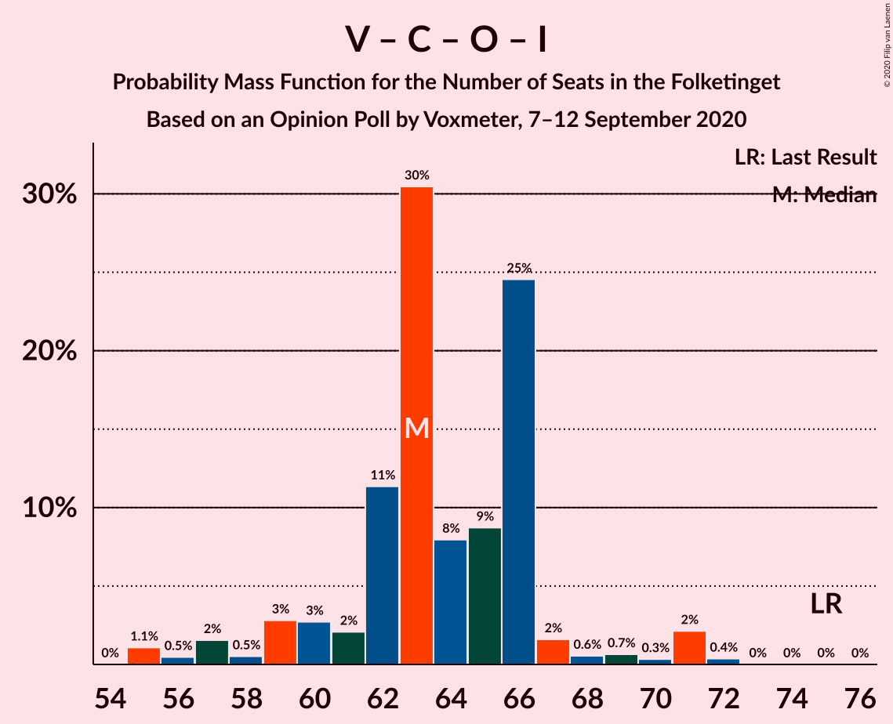

# Opinion Poll by Voxmeter, 7–12 September 2020

<a href="#voting-intentions">Voting Intentions</a> | <a href="#seats">Seats</a> | <a href="#coalitions">Coalitions</a> | <a href="#technical-information">Technical Information</a>

## Voting Intentions

### Confidence Intervals

| Party | Last Result | Poll Result | 80% Confidence Interval | 90% Confidence Interval | 95% Confidence Interval | 99% Confidence Interval |
|:-----:|:-----------:|:-----------:|:-----------------------:|:-----------------------:|:-----------------------:|:-----------------------:|
| Socialdemokraterne | 25.9% | 32.6% | 30.9–34.5% |30.4–35.0% |29.9–35.5% |29.1–36.4% |
| Venstre | 23.4% | 19.9% | 18.4–21.5% |18.0–22.0% |17.6–22.4% |16.9–23.1% |
| Socialistisk Folkeparti | 7.7% | 8.8% | 7.8–10.0% |7.5–10.3% |7.2–10.6% |6.8–11.2% |
| Det Konservative Folkeparti | 6.6% | 8.0% | 7.0–9.1% |6.7–9.4% |6.5–9.7% |6.1–10.3% |
| Radikale Venstre | 8.6% | 7.8% | 6.8–8.9% |6.6–9.2% |6.3–9.5% |5.9–10.1% |
| Enhedslisten–De Rød-Grønne | 6.9% | 7.3% | 6.4–8.4% |6.1–8.7% |5.9–9.0% |5.5–9.6% |
| Dansk Folkeparti | 8.7% | 6.2% | 5.4–7.3% |5.2–7.6% |5.0–7.8% |4.6–8.4% |
| Nye Borgerlige | 2.4% | 4.4% | 3.7–5.3% |3.5–5.6% |3.4–5.8% |3.0–6.3% |
| Liberal Alliance | 2.3% | 1.8% | 1.4–2.4% |1.3–2.6% |1.2–2.8% |1.0–3.1% |
| Kristendemokraterne | 1.7% | 1.5% | 1.2–2.1% |1.1–2.3% |1.0–2.5% |0.8–2.8% |
| Stram Kurs | 1.8% | 0.8% | 0.5–1.3% |0.5–1.4% |0.4–1.5% |0.3–1.8% |
| Alternativet | 3.0% | 0.4% | 0.2–0.7% |0.2–0.8% |0.1–0.9% |0.1–1.1% |

*Note:* The poll result column reflects the actual value used in the calculations. Published results may vary slightly, and in addition be rounded to fewer digits.

## Seats

### Confidence Intervals

| Party | Last Result | Median | 80% Confidence Interval | 90% Confidence Interval | 95% Confidence Interval | 99% Confidence Interval |
|:-----:|:-----------:|:------:|:-----------------------:|:-----------------------:|:-----------------------:|:-----------------------:|
| <a href="#socialdemokraterne">Socialdemokraterne</a> | 48 | 59 | 56–64 |55–64 |53–65 |52–66 |
| <a href="#venstre">Venstre</a> | 43 | 36 | 33–39 |32–39 |31–39 |31–42 |
| <a href="#socialistisk-folkeparti">Socialistisk Folkeparti</a> | 14 | 17 | 14–18 |13–19 |13–20 |12–20 |
| <a href="#det-konservative-folkeparti">Det Konservative Folkeparti</a> | 12 | 15 | 13–16 |12–18 |12–18 |10–18 |
| <a href="#radikale-venstre">Radikale Venstre</a> | 16 | 14 | 13–16 |12–16 |11–17 |11–18 |
| <a href="#enhedslisten–de-rød-grønne">Enhedslisten–De Rød-Grønne</a> | 13 | 13 | 12–16 |11–16 |10–16 |10–17 |
| <a href="#dansk-folkeparti">Dansk Folkeparti</a> | 16 | 11 | 8–13 |8–14 |8–14 |7–15 |
| <a href="#nye-borgerlige">Nye Borgerlige</a> | 4 | 8 | 7–9 |7–10 |6–10 |5–12 |
| <a href="#liberal-alliance">Liberal Alliance</a> | 4 | 0 | 0–4 |0–4 |0–5 |0–5 |
| <a href="#kristendemokraterne">Kristendemokraterne</a> | 0 | 0 | 0–4 |0–4 |0–4 |0–5 |
| <a href="#stram-kurs">Stram Kurs</a> | 0 | 0 | 0 |0 |0 |0 |
| <a href="#alternativet">Alternativet</a> | 5 | 0 | 0 |0 |0 |0 |

### Socialdemokraterne

*For a full overview of the results for this party, see the [Socialdemokraterne](party-socialdemokraterne.html) page.*

| Number of Seats | Probability | Accumulated | Special Marks |
|:---------------:|:-----------:|:-----------:|:-------------:|
| 48 | 0% | 100% | Last Result |
| 49 | 0% | 100% |  |
| 50 | 0% | 100% |  |
| 51 | 0.1% | 100% |  |
| 52 | 1.1% | 99.8% |  |
| 53 | 2% | 98.7% |  |
| 54 | 1.3% | 97% |  |
| 55 | 0.9% | 96% |  |
| 56 | 28% | 95% |  |
| 57 | 7% | 67% |  |
| 58 | 9% | 59% |  |
| 59 | 13% | 51% | Median |
| 60 | 18% | 38% |  |
| 61 | 3% | 20% |  |
| 62 | 6% | 16% |  |
| 63 | 0.4% | 11% |  |
| 64 | 8% | 10% |  |
| 65 | 1.1% | 3% |  |
| 66 | 1.3% | 1.5% |  |
| 67 | 0.2% | 0.2% |  |
| 68 | 0% | 0% |  |

### Venstre

*For a full overview of the results for this party, see the [Venstre](party-venstre.html) page.*

| Number of Seats | Probability | Accumulated | Special Marks |
|:---------------:|:-----------:|:-----------:|:-------------:|
| 29 | 0.1% | 100% |  |
| 30 | 0.2% | 99.9% |  |
| 31 | 3% | 99.7% |  |
| 32 | 3% | 97% |  |
| 33 | 6% | 94% |  |
| 34 | 5% | 88% |  |
| 35 | 8% | 83% |  |
| 36 | 27% | 74% | Median |
| 37 | 4% | 47% |  |
| 38 | 11% | 43% |  |
| 39 | 30% | 32% |  |
| 40 | 0.2% | 2% |  |
| 41 | 0.8% | 2% |  |
| 42 | 1.1% | 1.3% |  |
| 43 | 0% | 0.2% | Last Result |
| 44 | 0.2% | 0.2% |  |
| 45 | 0% | 0% |  |

### Socialistisk Folkeparti

*For a full overview of the results for this party, see the [Socialistisk Folkeparti](party-socialistiskfolkeparti.html) page.*

| Number of Seats | Probability | Accumulated | Special Marks |
|:---------------:|:-----------:|:-----------:|:-------------:|
| 12 | 0.8% | 100% |  |
| 13 | 5% | 99.2% |  |
| 14 | 11% | 94% | Last Result |
| 15 | 22% | 83% |  |
| 16 | 7% | 61% |  |
| 17 | 22% | 53% | Median |
| 18 | 24% | 32% |  |
| 19 | 4% | 7% |  |
| 20 | 4% | 4% |  |
| 21 | 0.3% | 0.4% |  |
| 22 | 0% | 0.1% |  |
| 23 | 0.1% | 0.1% |  |
| 24 | 0% | 0% |  |

### Det Konservative Folkeparti

*For a full overview of the results for this party, see the [Det Konservative Folkeparti](party-detkonservativefolkeparti.html) page.*

| Number of Seats | Probability | Accumulated | Special Marks |
|:---------------:|:-----------:|:-----------:|:-------------:|
| 10 | 0.5% | 100% |  |
| 11 | 0.7% | 99.5% |  |
| 12 | 6% | 98.8% | Last Result |
| 13 | 11% | 93% |  |
| 14 | 4% | 82% |  |
| 15 | 58% | 78% | Median |
| 16 | 12% | 20% |  |
| 17 | 2% | 8% |  |
| 18 | 5% | 6% |  |
| 19 | 0.2% | 0.2% |  |
| 20 | 0% | 0% |  |

### Radikale Venstre

*For a full overview of the results for this party, see the [Radikale Venstre](party-radikalevenstre.html) page.*

| Number of Seats | Probability | Accumulated | Special Marks |
|:---------------:|:-----------:|:-----------:|:-------------:|
| 10 | 0.4% | 100% |  |
| 11 | 2% | 99.6% |  |
| 12 | 7% | 97% |  |
| 13 | 17% | 90% |  |
| 14 | 32% | 73% | Median |
| 15 | 30% | 41% |  |
| 16 | 6% | 11% | Last Result |
| 17 | 4% | 5% |  |
| 18 | 0.5% | 1.0% |  |
| 19 | 0.4% | 0.4% |  |
| 20 | 0% | 0% |  |

### Enhedslisten–De Rød-Grønne

*For a full overview of the results for this party, see the [Enhedslisten–De Rød-Grønne](party-enhedslisten–derød-grønne.html) page.*

| Number of Seats | Probability | Accumulated | Special Marks |
|:---------------:|:-----------:|:-----------:|:-------------:|
| 9 | 0.2% | 100% |  |
| 10 | 3% | 99.8% |  |
| 11 | 4% | 97% |  |
| 12 | 27% | 92% |  |
| 13 | 29% | 66% | Last Result, Median |
| 14 | 8% | 37% |  |
| 15 | 16% | 29% |  |
| 16 | 11% | 13% |  |
| 17 | 2% | 2% |  |
| 18 | 0.1% | 0.1% |  |
| 19 | 0% | 0% |  |

### Dansk Folkeparti

*For a full overview of the results for this party, see the [Dansk Folkeparti](party-danskfolkeparti.html) page.*

| Number of Seats | Probability | Accumulated | Special Marks |
|:---------------:|:-----------:|:-----------:|:-------------:|
| 7 | 0.6% | 100% |  |
| 8 | 22% | 99.4% |  |
| 9 | 2% | 77% |  |
| 10 | 15% | 75% |  |
| 11 | 18% | 59% | Median |
| 12 | 21% | 41% |  |
| 13 | 12% | 20% |  |
| 14 | 7% | 8% |  |
| 15 | 0.7% | 1.0% |  |
| 16 | 0.3% | 0.3% | Last Result |
| 17 | 0% | 0% |  |

### Nye Borgerlige

*For a full overview of the results for this party, see the [Nye Borgerlige](party-nyeborgerlige.html) page.*

| Number of Seats | Probability | Accumulated | Special Marks |
|:---------------:|:-----------:|:-----------:|:-------------:|
| 4 | 0% | 100% | Last Result |
| 5 | 0.6% | 100% |  |
| 6 | 3% | 99.4% |  |
| 7 | 14% | 97% |  |
| 8 | 61% | 83% | Median |
| 9 | 16% | 22% |  |
| 10 | 4% | 6% |  |
| 11 | 2% | 2% |  |
| 12 | 0.5% | 0.6% |  |
| 13 | 0.1% | 0.1% |  |
| 14 | 0% | 0% |  |

### Liberal Alliance

*For a full overview of the results for this party, see the [Liberal Alliance](party-liberalalliance.html) page.*

| Number of Seats | Probability | Accumulated | Special Marks |
|:---------------:|:-----------:|:-----------:|:-------------:|
| 0 | 64% | 100% | Median |
| 1 | 0% | 36% |  |
| 2 | 0% | 36% |  |
| 3 | 0% | 36% |  |
| 4 | 31% | 36% | Last Result |
| 5 | 4% | 5% |  |
| 6 | 0.2% | 0.3% |  |
| 7 | 0.1% | 0.1% |  |
| 8 | 0% | 0% |  |

### Kristendemokraterne

*For a full overview of the results for this party, see the [Kristendemokraterne](party-kristendemokraterne.html) page.*

| Number of Seats | Probability | Accumulated | Special Marks |
|:---------------:|:-----------:|:-----------:|:-------------:|
| 0 | 84% | 100% | Last Result, Median |
| 1 | 0% | 16% |  |
| 2 | 0% | 16% |  |
| 3 | 0.3% | 16% |  |
| 4 | 14% | 15% |  |
| 5 | 0.7% | 0.8% |  |
| 6 | 0.1% | 0.1% |  |
| 7 | 0% | 0% |  |

### Stram Kurs

*For a full overview of the results for this party, see the [Stram Kurs](party-stramkurs.html) page.*

| Number of Seats | Probability | Accumulated | Special Marks |
|:---------------:|:-----------:|:-----------:|:-------------:|
| 0 | 99.9% | 100% | Last Result, Median |
| 1 | 0% | 0.1% |  |
| 2 | 0% | 0.1% |  |
| 3 | 0% | 0.1% |  |
| 4 | 0.1% | 0.1% |  |
| 5 | 0% | 0% |  |

### Alternativet

*For a full overview of the results for this party, see the [Alternativet](party-alternativet.html) page.*

| Number of Seats | Probability | Accumulated | Special Marks |
|:---------------:|:-----------:|:-----------:|:-------------:|
| 0 | 100% | 100% | Median |
| 1 | 0% | 0% |  |
| 2 | 0% | 0% |  |
| 3 | 0% | 0% |  |
| 4 | 0% | 0% |  |
| 5 | 0% | 0% | Last Result |

## Coalitions

### Confidence Intervals

| Coalition | Last Result | Median | Majority? | 80% Confidence Interval | 90% Confidence Interval | 95% Confidence Interval | 99% Confidence Interval |
|:---------:|:-----------:|:------:|:---------:|:-----------------------:|:-----------------------:|:-----------------------:|:-----------------------:|
| Socialdemokraterne – Socialistisk Folkeparti – Radikale Venstre – Enhedslisten–De Rød-Grønne – Alternativet | 96 | 103 | 100% | 100–105 | 98–107 | 96–108 | 95–110 |
| Socialdemokraterne – Socialistisk Folkeparti – Radikale Venstre – Enhedslisten–De Rød-Grønne | 91 | 103 | 100% | 100–105 | 98–107 | 96–108 | 95–110 |
| Socialdemokraterne – Socialistisk Folkeparti – Enhedslisten–De Rød-Grønne – Alternativet | 80 | 88 | 28% | 85–92 | 85–93 | 83–94 | 81–96 |
| Socialdemokraterne – Socialistisk Folkeparti – Enhedslisten–De Rød-Grønne | 75 | 88 | 28% | 85–92 | 85–93 | 83–94 | 81–96 |
| Socialdemokraterne – Socialistisk Folkeparti – Radikale Venstre | 78 | 88 | 40% | 87–92 | 85–94 | 83–94 | 81–98 |
| Socialdemokraterne – Radikale Venstre | 64 | 73 | 0% | 70–76 | 69–77 | 68–79 | 66–82 |
| Venstre – Det Konservative Folkeparti – Dansk Folkeparti – Nye Borgerlige – Liberal Alliance – Kristendemokraterne | 79 | 72 | 0% | 70–75 | 68–77 | 67–79 | 65–80 |
| Venstre – Det Konservative Folkeparti – Dansk Folkeparti – Nye Borgerlige – Liberal Alliance | 79 | 72 | 0% | 69–74 | 67–76 | 66–79 | 64–79 |
| Venstre – Det Konservative Folkeparti – Dansk Folkeparti – Liberal Alliance – Kristendemokraterne | 75 | 64 | 0% | 62–68 | 60–69 | 59–71 | 55–72 |
| Venstre – Det Konservative Folkeparti – Dansk Folkeparti – Liberal Alliance | 75 | 63 | 0% | 61–66 | 59–67 | 57–71 | 55–71 |
| Venstre – Det Konservative Folkeparti – Liberal Alliance | 59 | 52 | 0% | 49–58 | 47–58 | 45–58 | 44–60 |
| Venstre – Det Konservative Folkeparti | 55 | 51 | 0% | 48–54 | 47–54 | 44–55 | 44–57 |
| Venstre | 43 | 36 | 0% | 33–39 | 32–39 | 31–39 | 31–42 |

### Socialdemokraterne – Socialistisk Folkeparti – Radikale Venstre – Enhedslisten–De Rød-Grønne – Alternativet

| Number of Seats | Probability | Accumulated | Special Marks |
|:---------------:|:-----------:|:-----------:|:-------------:|
| 93 | 0% | 100% |  |
| 94 | 0.4% | 99.9% |  |
| 95 | 0.1% | 99.6% |  |
| 96 | 2% | 99.5% | Last Result |
| 97 | 0.9% | 97% |  |
| 98 | 2% | 96% |  |
| 99 | 2% | 95% |  |
| 100 | 8% | 92% |  |
| 101 | 25% | 84% |  |
| 102 | 7% | 59% |  |
| 103 | 13% | 52% | Median |
| 104 | 21% | 39% |  |
| 105 | 10% | 17% |  |
| 106 | 2% | 7% |  |
| 107 | 2% | 5% |  |
| 108 | 2% | 3% |  |
| 109 | 0.3% | 1.2% |  |
| 110 | 0.8% | 0.9% |  |
| 111 | 0% | 0.1% |  |
| 112 | 0.1% | 0.1% |  |
| 113 | 0% | 0% |  |

### Socialdemokraterne – Socialistisk Folkeparti – Radikale Venstre – Enhedslisten–De Rød-Grønne

| Number of Seats | Probability | Accumulated | Special Marks |
|:---------------:|:-----------:|:-----------:|:-------------:|
| 91 | 0% | 100% | Last Result |
| 92 | 0% | 100% |  |
| 93 | 0% | 100% |  |
| 94 | 0.4% | 99.9% |  |
| 95 | 0.1% | 99.6% |  |
| 96 | 2% | 99.5% |  |
| 97 | 0.9% | 97% |  |
| 98 | 2% | 96% |  |
| 99 | 2% | 95% |  |
| 100 | 8% | 92% |  |
| 101 | 25% | 84% |  |
| 102 | 7% | 59% |  |
| 103 | 13% | 52% | Median |
| 104 | 21% | 39% |  |
| 105 | 10% | 17% |  |
| 106 | 2% | 7% |  |
| 107 | 2% | 5% |  |
| 108 | 2% | 3% |  |
| 109 | 0.3% | 1.2% |  |
| 110 | 0.8% | 0.9% |  |
| 111 | 0% | 0.1% |  |
| 112 | 0.1% | 0.1% |  |
| 113 | 0% | 0% |  |

### Socialdemokraterne – Socialistisk Folkeparti – Enhedslisten–De Rød-Grønne – Alternativet

| Number of Seats | Probability | Accumulated | Special Marks |
|:---------------:|:-----------:|:-----------:|:-------------:|
| 79 | 0.1% | 100% |  |
| 80 | 0.4% | 99.9% | Last Result |
| 81 | 0.9% | 99.5% |  |
| 82 | 0.7% | 98.6% |  |
| 83 | 2% | 98% |  |
| 84 | 0.9% | 96% |  |
| 85 | 9% | 95% |  |
| 86 | 4% | 86% |  |
| 87 | 24% | 82% |  |
| 88 | 11% | 58% |  |
| 89 | 18% | 47% | Median |
| 90 | 12% | 28% | Majority |
| 91 | 5% | 17% |  |
| 92 | 3% | 12% |  |
| 93 | 6% | 9% |  |
| 94 | 0.8% | 3% |  |
| 95 | 1.1% | 2% |  |
| 96 | 0.4% | 0.9% |  |
| 97 | 0.5% | 0.5% |  |
| 98 | 0% | 0% |  |

### Socialdemokraterne – Socialistisk Folkeparti – Enhedslisten–De Rød-Grønne

| Number of Seats | Probability | Accumulated | Special Marks |
|:---------------:|:-----------:|:-----------:|:-------------:|
| 75 | 0% | 100% | Last Result |
| 76 | 0% | 100% |  |
| 77 | 0% | 100% |  |
| 78 | 0% | 100% |  |
| 79 | 0.1% | 100% |  |
| 80 | 0.4% | 99.9% |  |
| 81 | 0.9% | 99.5% |  |
| 82 | 0.7% | 98.6% |  |
| 83 | 2% | 98% |  |
| 84 | 0.9% | 96% |  |
| 85 | 9% | 95% |  |
| 86 | 4% | 86% |  |
| 87 | 24% | 82% |  |
| 88 | 11% | 58% |  |
| 89 | 18% | 47% | Median |
| 90 | 12% | 28% | Majority |
| 91 | 5% | 17% |  |
| 92 | 3% | 12% |  |
| 93 | 6% | 9% |  |
| 94 | 0.8% | 3% |  |
| 95 | 1.1% | 2% |  |
| 96 | 0.4% | 0.9% |  |
| 97 | 0.5% | 0.5% |  |
| 98 | 0% | 0% |  |

### Socialdemokraterne – Socialistisk Folkeparti – Radikale Venstre

| Number of Seats | Probability | Accumulated | Special Marks |
|:---------------:|:-----------:|:-----------:|:-------------:|
| 78 | 0% | 100% | Last Result |
| 79 | 0% | 100% |  |
| 80 | 0% | 99.9% |  |
| 81 | 0.7% | 99.9% |  |
| 82 | 0.7% | 99.2% |  |
| 83 | 1.1% | 98.5% |  |
| 84 | 2% | 97% |  |
| 85 | 0.6% | 95% |  |
| 86 | 3% | 94% |  |
| 87 | 11% | 91% |  |
| 88 | 32% | 80% |  |
| 89 | 8% | 48% |  |
| 90 | 12% | 40% | Median, Majority |
| 91 | 2% | 28% |  |
| 92 | 19% | 26% |  |
| 93 | 1.4% | 6% |  |
| 94 | 3% | 5% |  |
| 95 | 0.8% | 2% |  |
| 96 | 0.4% | 2% |  |
| 97 | 0.2% | 1.1% |  |
| 98 | 0.9% | 0.9% |  |
| 99 | 0% | 0% |  |

### Socialdemokraterne – Radikale Venstre

| Number of Seats | Probability | Accumulated | Special Marks |
|:---------------:|:-----------:|:-----------:|:-------------:|
| 64 | 0% | 100% | Last Result |
| 65 | 0.3% | 100% |  |
| 66 | 1.0% | 99.7% |  |
| 67 | 0.6% | 98.7% |  |
| 68 | 1.1% | 98% |  |
| 69 | 5% | 97% |  |
| 70 | 26% | 92% |  |
| 71 | 2% | 66% |  |
| 72 | 12% | 64% |  |
| 73 | 13% | 52% | Median |
| 74 | 4% | 39% |  |
| 75 | 18% | 35% |  |
| 76 | 9% | 18% |  |
| 77 | 3% | 8% |  |
| 78 | 2% | 5% |  |
| 79 | 2% | 3% |  |
| 80 | 0.2% | 2% |  |
| 81 | 0.8% | 1.3% |  |
| 82 | 0.5% | 0.5% |  |
| 83 | 0% | 0% |  |

### Venstre – Det Konservative Folkeparti – Dansk Folkeparti – Nye Borgerlige – Liberal Alliance – Kristendemokraterne

| Number of Seats | Probability | Accumulated | Special Marks |
|:---------------:|:-----------:|:-----------:|:-------------:|
| 63 | 0.1% | 100% |  |
| 64 | 0% | 99.9% |  |
| 65 | 0.8% | 99.9% |  |
| 66 | 0.3% | 99.1% |  |
| 67 | 2% | 98.8% |  |
| 68 | 2% | 97% |  |
| 69 | 2% | 95% |  |
| 70 | 10% | 93% | Median |
| 71 | 21% | 83% |  |
| 72 | 14% | 61% |  |
| 73 | 7% | 48% |  |
| 74 | 25% | 41% |  |
| 75 | 8% | 16% |  |
| 76 | 2% | 8% |  |
| 77 | 2% | 5% |  |
| 78 | 0.9% | 4% |  |
| 79 | 2% | 3% | Last Result |
| 80 | 0.1% | 0.5% |  |
| 81 | 0.4% | 0.4% |  |
| 82 | 0% | 0.1% |  |
| 83 | 0% | 0% |  |

### Venstre – Det Konservative Folkeparti – Dansk Folkeparti – Nye Borgerlige – Liberal Alliance

| Number of Seats | Probability | Accumulated | Special Marks |
|:---------------:|:-----------:|:-----------:|:-------------:|
| 63 | 0.4% | 100% |  |
| 64 | 0.4% | 99.6% |  |
| 65 | 2% | 99.3% |  |
| 66 | 2% | 98% |  |
| 67 | 2% | 96% |  |
| 68 | 4% | 94% |  |
| 69 | 2% | 90% |  |
| 70 | 10% | 88% | Median |
| 71 | 27% | 78% |  |
| 72 | 12% | 51% |  |
| 73 | 7% | 39% |  |
| 74 | 24% | 31% |  |
| 75 | 3% | 8% |  |
| 76 | 1.4% | 5% |  |
| 77 | 1.0% | 4% |  |
| 78 | 0.4% | 3% |  |
| 79 | 2% | 3% | Last Result |
| 80 | 0.1% | 0.4% |  |
| 81 | 0.3% | 0.4% |  |
| 82 | 0% | 0% |  |

### Venstre – Det Konservative Folkeparti – Dansk Folkeparti – Liberal Alliance – Kristendemokraterne

| Number of Seats | Probability | Accumulated | Special Marks |
|:---------------:|:-----------:|:-----------:|:-------------:|
| 55 | 0.9% | 100% |  |
| 56 | 0.1% | 99.1% |  |
| 57 | 0.1% | 99.0% |  |
| 58 | 0.5% | 98.9% |  |
| 59 | 2% | 98% |  |
| 60 | 2% | 97% |  |
| 61 | 3% | 94% |  |
| 62 | 10% | 91% | Median |
| 63 | 30% | 82% |  |
| 64 | 2% | 52% |  |
| 65 | 9% | 49% |  |
| 66 | 26% | 40% |  |
| 67 | 3% | 15% |  |
| 68 | 6% | 12% |  |
| 69 | 2% | 5% |  |
| 70 | 0.6% | 4% |  |
| 71 | 2% | 3% |  |
| 72 | 0.5% | 0.6% |  |
| 73 | 0.1% | 0.1% |  |
| 74 | 0% | 0% |  |
| 75 | 0% | 0% | Last Result |

### Venstre – Det Konservative Folkeparti – Dansk Folkeparti – Liberal Alliance

| Number of Seats | Probability | Accumulated | Special Marks |
|:---------------:|:-----------:|:-----------:|:-------------:|
| 55 | 1.1% | 100% |  |
| 56 | 0.5% | 98.9% |  |
| 57 | 2% | 98% |  |
| 58 | 0.5% | 97% |  |
| 59 | 3% | 96% |  |
| 60 | 3% | 94% |  |
| 61 | 2% | 91% |  |
| 62 | 11% | 89% | Median |
| 63 | 30% | 77% |  |
| 64 | 8% | 47% |  |
| 65 | 9% | 39% |  |
| 66 | 25% | 30% |  |
| 67 | 2% | 6% |  |
| 68 | 0.6% | 4% |  |
| 69 | 0.7% | 4% |  |
| 70 | 0.3% | 3% |  |
| 71 | 2% | 3% |  |
| 72 | 0.4% | 0.4% |  |
| 73 | 0% | 0% |  |
| 74 | 0% | 0% |  |
| 75 | 0% | 0% | Last Result |

### Venstre – Det Konservative Folkeparti – Liberal Alliance

| Number of Seats | Probability | Accumulated | Special Marks |
|:---------------:|:-----------:|:-----------:|:-------------:|
| 44 | 2% | 100% |  |
| 45 | 0.3% | 98% |  |
| 46 | 0.8% | 97% |  |
| 47 | 2% | 97% |  |
| 48 | 1.3% | 95% |  |
| 49 | 5% | 93% |  |
| 50 | 3% | 88% |  |
| 51 | 32% | 85% | Median |
| 52 | 8% | 53% |  |
| 53 | 10% | 45% |  |
| 54 | 4% | 35% |  |
| 55 | 5% | 31% |  |
| 56 | 0.9% | 26% |  |
| 57 | 1.4% | 25% |  |
| 58 | 22% | 24% |  |
| 59 | 0.2% | 2% | Last Result |
| 60 | 1.4% | 2% |  |
| 61 | 0.4% | 0.4% |  |
| 62 | 0% | 0% |  |

### Venstre – Det Konservative Folkeparti

| Number of Seats | Probability | Accumulated | Special Marks |
|:---------------:|:-----------:|:-----------:|:-------------:|
| 42 | 0.1% | 100% |  |
| 43 | 0% | 99.9% |  |
| 44 | 3% | 99.9% |  |
| 45 | 0.7% | 97% |  |
| 46 | 1.1% | 97% |  |
| 47 | 3% | 95% |  |
| 48 | 3% | 92% |  |
| 49 | 6% | 89% |  |
| 50 | 4% | 84% |  |
| 51 | 36% | 79% | Median |
| 52 | 6% | 44% |  |
| 53 | 10% | 37% |  |
| 54 | 24% | 28% |  |
| 55 | 2% | 4% | Last Result |
| 56 | 0.5% | 2% |  |
| 57 | 1.1% | 1.3% |  |
| 58 | 0.1% | 0.2% |  |
| 59 | 0.1% | 0.2% |  |
| 60 | 0% | 0% |  |

### Venstre

| Number of Seats | Probability | Accumulated | Special Marks |
|:---------------:|:-----------:|:-----------:|:-------------:|
| 29 | 0.1% | 100% |  |
| 30 | 0.2% | 99.9% |  |
| 31 | 3% | 99.7% |  |
| 32 | 3% | 97% |  |
| 33 | 6% | 94% |  |
| 34 | 5% | 88% |  |
| 35 | 8% | 83% |  |
| 36 | 27% | 74% | Median |
| 37 | 4% | 47% |  |
| 38 | 11% | 43% |  |
| 39 | 30% | 32% |  |
| 40 | 0.2% | 2% |  |
| 41 | 0.8% | 2% |  |
| 42 | 1.1% | 1.3% |  |
| 43 | 0% | 0.2% | Last Result |
| 44 | 0.2% | 0.2% |  |
| 45 | 0% | 0% |  |

## Technical Information

### Opinion Poll

+ **Polling firm:** Voxmeter
+ **Commissioner(s):** —
+ **Fieldwork period:** 7–12 September 2020

### Calculations

+ **Sample size:** 1106
+ **Simulations done:** 1,048,576
+ **Error estimate:** 1.71%

