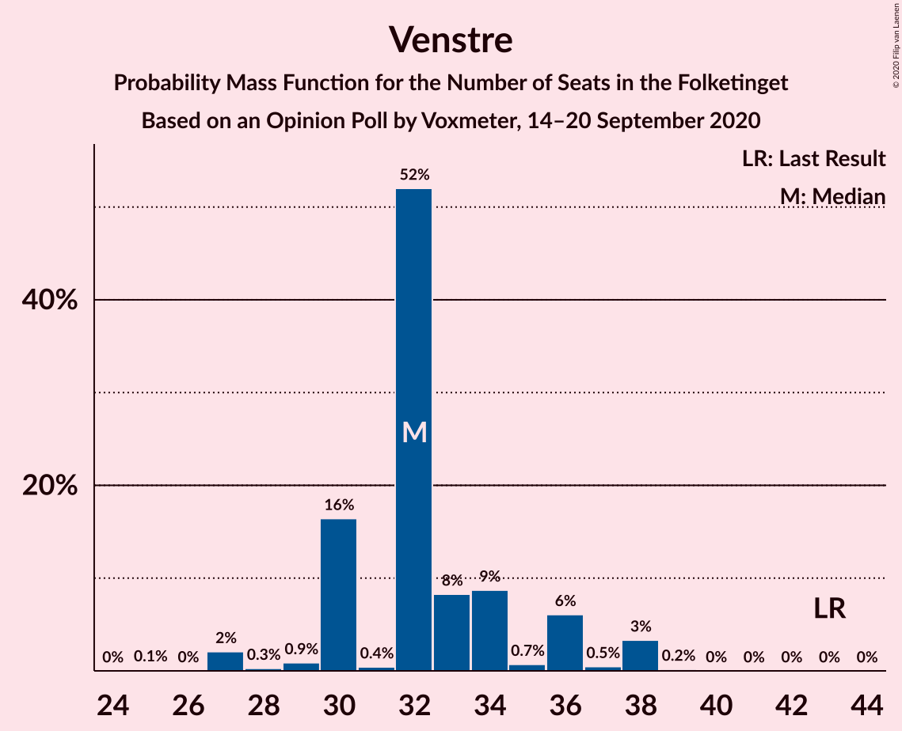
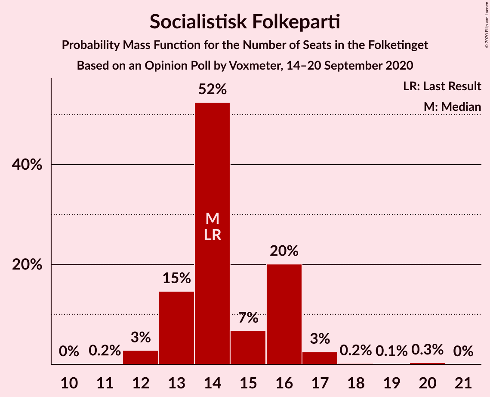
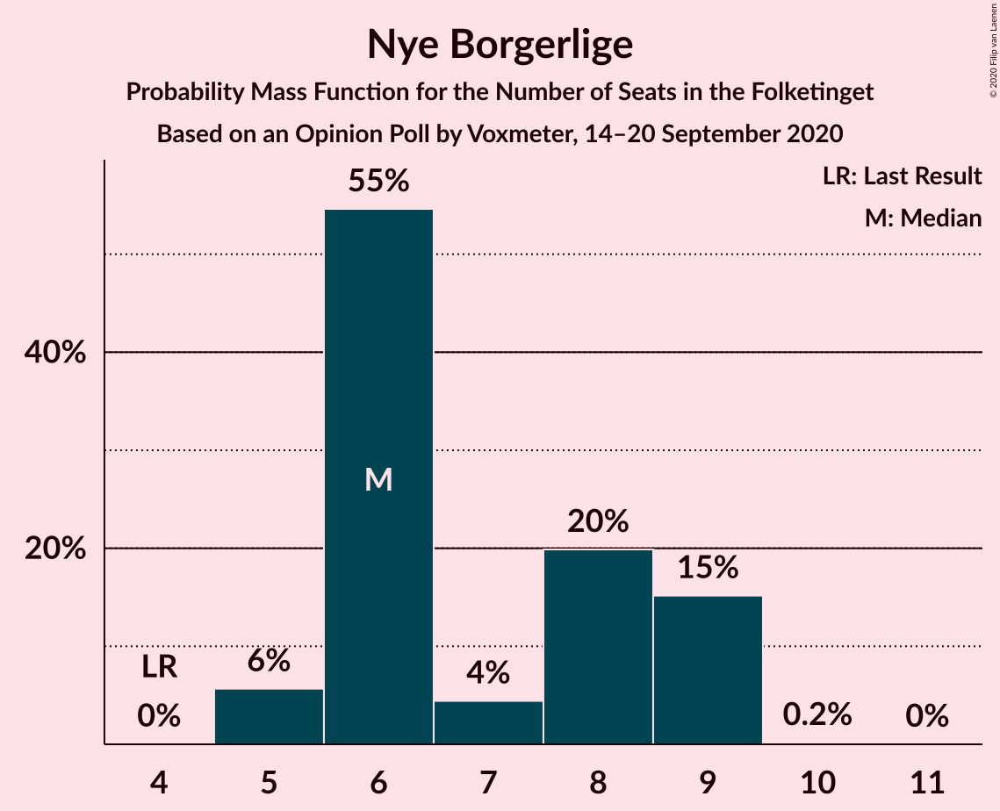
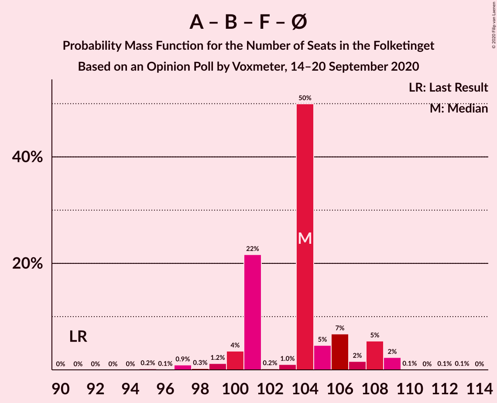
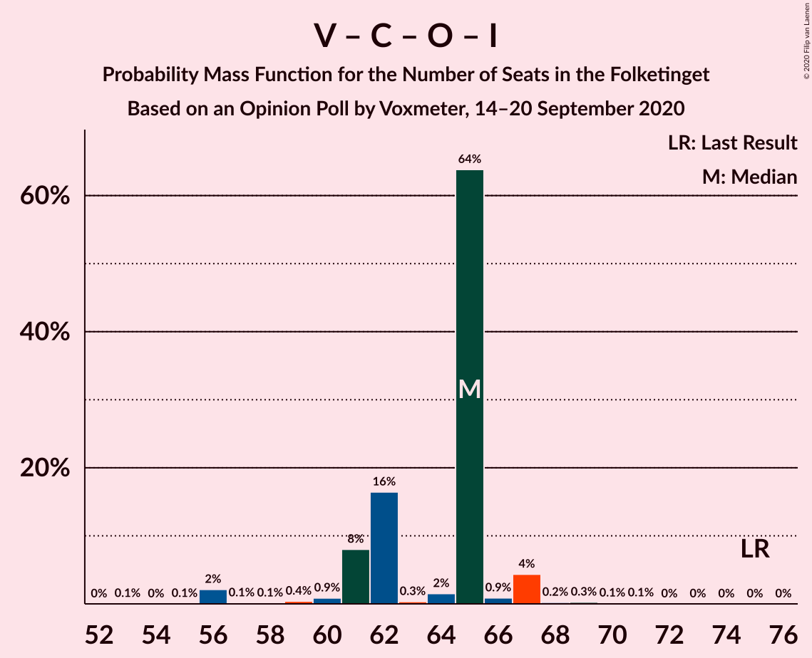

# Opinion Poll by Voxmeter, 14–20 September 2020

<a href="#voting-intentions">Voting Intentions</a> | <a href="#seats">Seats</a> | <a href="#coalitions">Coalitions</a> | <a href="#technical-information">Technical Information</a>

## Voting Intentions

### Confidence Intervals

| Party | Last Result | Poll Result | 80% Confidence Interval | 90% Confidence Interval | 95% Confidence Interval | 99% Confidence Interval |
|:-----:|:-----------:|:-----------:|:-----------------------:|:-----------------------:|:-----------------------:|:-----------------------:|
| Socialdemokraterne | 25.9% | 32.9% | 31.1–34.8% |30.5–35.4% |30.1–35.9% |29.2–36.8% |
| Venstre | 23.4% | 18.4% | 16.9–20.0% |16.5–20.5% |16.2–20.9% |15.5–21.7% |
| Det Konservative Folkeparti | 6.6% | 8.4% | 7.4–9.6% |7.1–10.0% |6.9–10.3% |6.4–10.9% |
| Radikale Venstre | 8.6% | 8.3% | 7.3–9.5% |7.0–9.9% |6.8–10.2% |6.3–10.8% |
| Socialistisk Folkeparti | 7.7% | 8.2% | 7.2–9.4% |6.9–9.8% |6.7–10.1% |6.2–10.7% |
| Enhedslisten–De Rød-Grønne | 6.9% | 7.6% | 6.7–8.8% |6.4–9.1% |6.2–9.4% |5.7–10.0% |
| Dansk Folkeparti | 8.7% | 6.8% | 5.8–7.9% |5.6–8.2% |5.4–8.5% |5.0–9.0% |
| Nye Borgerlige | 2.4% | 3.8% | 3.2–4.7% |3.0–5.0% |2.8–5.2% |2.5–5.6% |
| Liberal Alliance | 2.3% | 2.1% | 1.6–2.8% |1.4–3.0% |1.3–3.1% |1.2–3.5% |
| Kristendemokraterne | 1.7% | 1.8% | 1.3–2.4% |1.2–2.6% |1.1–2.8% |0.9–3.1% |
| Alternativet | 3.0% | 0.8% | 0.5–1.3% |0.5–1.4% |0.4–1.5% |0.3–1.8% |
| Stram Kurs | 1.8% | 0.4% | 0.2–0.8% |0.2–0.9% |0.2–1.0% |0.1–1.2% |
| Veganerpartiet | 0.0% | 0.2% | 0.1–0.5% |0.1–0.6% |0.0–0.7% |0.0–0.9% |

*Note:* The poll result column reflects the actual value used in the calculations. Published results may vary slightly, and in addition be rounded to fewer digits.

## Seats

### Confidence Intervals

| Party | Last Result | Median | 80% Confidence Interval | 90% Confidence Interval | 95% Confidence Interval | 99% Confidence Interval |
|:-----:|:-----------:|:------:|:-----------------------:|:-----------------------:|:-----------------------:|:-----------------------:|
| <a href="#socialdemokraterne">Socialdemokraterne</a> | 48 | 63 | 59–63 |57–63 |56–66 |52–66 |
| <a href="#venstre">Venstre</a> | 43 | 32 | 30–36 |30–36 |29–38 |27–38 |
| <a href="#det-konservative-folkeparti">Det Konservative Folkeparti</a> | 12 | 17 | 14–18 |13–18 |13–18 |13–19 |
| <a href="#radikale-venstre">Radikale Venstre</a> | 16 | 13 | 13–17 |13–17 |13–17 |13–18 |
| <a href="#socialistisk-folkeparti">Socialistisk Folkeparti</a> | 14 | 14 | 13–16 |13–16 |12–17 |12–18 |
| <a href="#enhedslisten–de-rød-grønne">Enhedslisten–De Rød-Grønne</a> | 13 | 14 | 12–15 |10–16 |10–17 |10–17 |
| <a href="#dansk-folkeparti">Dansk Folkeparti</a> | 16 | 12 | 12–14 |11–15 |11–15 |9–17 |
| <a href="#nye-borgerlige">Nye Borgerlige</a> | 4 | 6 | 6–9 |5–9 |5–9 |5–9 |
| <a href="#liberal-alliance">Liberal Alliance</a> | 4 | 4 | 0–4 |0–4 |0–5 |0–5 |
| <a href="#kristendemokraterne">Kristendemokraterne</a> | 0 | 0 | 0–4 |0–4 |0–4 |0–5 |
| <a href="#alternativet">Alternativet</a> | 5 | 0 | 0 |0 |0 |0 |
| <a href="#stram-kurs">Stram Kurs</a> | 0 | 0 | 0 |0 |0 |0 |
| <a href="#veganerpartiet">Veganerpartiet</a> | 0 | 0 | 0 |0 |0 |0 |

### Socialdemokraterne

*For a full overview of the results for this party, see the [Socialdemokraterne](party-socialdemokraterne.html) page.*

| Number of Seats | Probability | Accumulated | Special Marks |
|:---------------:|:-----------:|:-----------:|:-------------:|
| 48 | 0% | 100% | Last Result |
| 49 | 0% | 100% |  |
| 50 | 0% | 100% |  |
| 51 | 0% | 100% |  |
| 52 | 0.7% | 99.9% |  |
| 53 | 0.1% | 99.3% |  |
| 54 | 0.3% | 99.2% |  |
| 55 | 1.3% | 98.9% |  |
| 56 | 1.3% | 98% |  |
| 57 | 4% | 96% |  |
| 58 | 0.6% | 92% |  |
| 59 | 31% | 92% |  |
| 60 | 0.6% | 61% |  |
| 61 | 0.9% | 61% |  |
| 62 | 0.2% | 60% |  |
| 63 | 56% | 60% | Median |
| 64 | 1.2% | 4% |  |
| 65 | 0% | 3% |  |
| 66 | 2% | 3% |  |
| 67 | 0% | 0% |  |

### Venstre

*For a full overview of the results for this party, see the [Venstre](party-venstre.html) page.*

| Number of Seats | Probability | Accumulated | Special Marks |
|:---------------:|:-----------:|:-----------:|:-------------:|
| 25 | 0.1% | 100% |  |
| 26 | 0% | 99.9% |  |
| 27 | 2% | 99.9% |  |
| 28 | 0.3% | 98% |  |
| 29 | 0.9% | 98% |  |
| 30 | 16% | 97% |  |
| 31 | 0.4% | 80% |  |
| 32 | 52% | 80% | Median |
| 33 | 8% | 28% |  |
| 34 | 9% | 19% |  |
| 35 | 0.7% | 11% |  |
| 36 | 6% | 10% |  |
| 37 | 0.5% | 4% |  |
| 38 | 3% | 4% |  |
| 39 | 0.2% | 0.2% |  |
| 40 | 0% | 0% |  |
| 41 | 0% | 0% |  |
| 42 | 0% | 0% |  |
| 43 | 0% | 0% | Last Result |

### Det Konservative Folkeparti

*For a full overview of the results for this party, see the [Det Konservative Folkeparti](party-detkonservativefolkeparti.html) page.*

| Number of Seats | Probability | Accumulated | Special Marks |
|:---------------:|:-----------:|:-----------:|:-------------:|
| 11 | 0% | 100% |  |
| 12 | 0.3% | 99.9% | Last Result |
| 13 | 8% | 99.7% |  |
| 14 | 11% | 92% |  |
| 15 | 5% | 81% |  |
| 16 | 2% | 76% |  |
| 17 | 58% | 74% | Median |
| 18 | 14% | 16% |  |
| 19 | 1.4% | 1.5% |  |
| 20 | 0% | 0.1% |  |
| 21 | 0% | 0% |  |

### Radikale Venstre

*For a full overview of the results for this party, see the [Radikale Venstre](party-radikalevenstre.html) page.*

| Number of Seats | Probability | Accumulated | Special Marks |
|:---------------:|:-----------:|:-----------:|:-------------:|
| 11 | 0.1% | 100% |  |
| 12 | 0.4% | 99.9% |  |
| 13 | 54% | 99.5% | Median |
| 14 | 6% | 46% |  |
| 15 | 7% | 40% |  |
| 16 | 9% | 32% | Last Result |
| 17 | 22% | 24% |  |
| 18 | 1.0% | 1.4% |  |
| 19 | 0.3% | 0.3% |  |
| 20 | 0% | 0.1% |  |
| 21 | 0.1% | 0.1% |  |
| 22 | 0% | 0% |  |

### Socialistisk Folkeparti

*For a full overview of the results for this party, see the [Socialistisk Folkeparti](party-socialistiskfolkeparti.html) page.*

| Number of Seats | Probability | Accumulated | Special Marks |
|:---------------:|:-----------:|:-----------:|:-------------:|
| 11 | 0.2% | 100% |  |
| 12 | 3% | 99.8% |  |
| 13 | 15% | 97% |  |
| 14 | 52% | 82% | Last Result, Median |
| 15 | 7% | 30% |  |
| 16 | 20% | 23% |  |
| 17 | 3% | 3% |  |
| 18 | 0.2% | 0.6% |  |
| 19 | 0.1% | 0.4% |  |
| 20 | 0.3% | 0.3% |  |
| 21 | 0% | 0% |  |

### Enhedslisten–De Rød-Grønne

*For a full overview of the results for this party, see the [Enhedslisten–De Rød-Grønne](party-enhedslisten–derød-grønne.html) page.*

| Number of Seats | Probability | Accumulated | Special Marks |
|:---------------:|:-----------:|:-----------:|:-------------:|
| 10 | 8% | 100% |  |
| 11 | 1.0% | 92% |  |
| 12 | 16% | 91% |  |
| 13 | 1.1% | 75% | Last Result |
| 14 | 61% | 74% | Median |
| 15 | 7% | 13% |  |
| 16 | 1.4% | 6% |  |
| 17 | 4% | 4% |  |
| 18 | 0.2% | 0.3% |  |
| 19 | 0% | 0% |  |

### Dansk Folkeparti

*For a full overview of the results for this party, see the [Dansk Folkeparti](party-danskfolkeparti.html) page.*

| Number of Seats | Probability | Accumulated | Special Marks |
|:---------------:|:-----------:|:-----------:|:-------------:|
| 8 | 0.2% | 100% |  |
| 9 | 0.4% | 99.8% |  |
| 10 | 0.6% | 99.5% |  |
| 11 | 8% | 98.9% |  |
| 12 | 59% | 90% | Median |
| 13 | 16% | 32% |  |
| 14 | 6% | 16% |  |
| 15 | 8% | 10% |  |
| 16 | 0.4% | 2% | Last Result |
| 17 | 1.2% | 1.2% |  |
| 18 | 0% | 0% |  |

### Nye Borgerlige

*For a full overview of the results for this party, see the [Nye Borgerlige](party-nyeborgerlige.html) page.*

| Number of Seats | Probability | Accumulated | Special Marks |
|:---------------:|:-----------:|:-----------:|:-------------:|
| 4 | 0% | 100% | Last Result |
| 5 | 6% | 100% |  |
| 6 | 55% | 94% | Median |
| 7 | 4% | 40% |  |
| 8 | 20% | 35% |  |
| 9 | 15% | 15% |  |
| 10 | 0.2% | 0.2% |  |
| 11 | 0% | 0% |  |

### Liberal Alliance

*For a full overview of the results for this party, see the [Liberal Alliance](party-liberalalliance.html) page.*

| Number of Seats | Probability | Accumulated | Special Marks |
|:---------------:|:-----------:|:-----------:|:-------------:|
| 0 | 30% | 100% |  |
| 1 | 0% | 70% |  |
| 2 | 0% | 70% |  |
| 3 | 0% | 70% |  |
| 4 | 67% | 70% | Last Result, Median |
| 5 | 3% | 3% |  |
| 6 | 0.1% | 0.2% |  |
| 7 | 0% | 0% |  |

### Kristendemokraterne

*For a full overview of the results for this party, see the [Kristendemokraterne](party-kristendemokraterne.html) page.*

| Number of Seats | Probability | Accumulated | Special Marks |
|:---------------:|:-----------:|:-----------:|:-------------:|
| 0 | 87% | 100% | Last Result, Median |
| 1 | 0% | 13% |  |
| 2 | 0% | 13% |  |
| 3 | 0% | 13% |  |
| 4 | 12% | 13% |  |
| 5 | 1.2% | 1.3% |  |
| 6 | 0.1% | 0.1% |  |
| 7 | 0% | 0% |  |

### Alternativet

*For a full overview of the results for this party, see the [Alternativet](party-alternativet.html) page.*

| Number of Seats | Probability | Accumulated | Special Marks |
|:---------------:|:-----------:|:-----------:|:-------------:|
| 0 | 99.9% | 100% | Median |
| 1 | 0% | 0.1% |  |
| 2 | 0% | 0.1% |  |
| 3 | 0% | 0.1% |  |
| 4 | 0.1% | 0.1% |  |
| 5 | 0% | 0% | Last Result |

### Stram Kurs

*For a full overview of the results for this party, see the [Stram Kurs](party-stramkurs.html) page.*

| Number of Seats | Probability | Accumulated | Special Marks |
|:---------------:|:-----------:|:-----------:|:-------------:|
| 0 | 100% | 100% | Last Result, Median |

### Veganerpartiet

*For a full overview of the results for this party, see the [Veganerpartiet](party-veganerpartiet.html) page.*

| Number of Seats | Probability | Accumulated | Special Marks |
|:---------------:|:-----------:|:-----------:|:-------------:|
| 0 | 100% | 100% | Last Result, Median |

## Coalitions

### Confidence Intervals

| Coalition | Last Result | Median | Majority? | 80% Confidence Interval | 90% Confidence Interval | 95% Confidence Interval | 99% Confidence Interval |
|:---------:|:-----------:|:------:|:---------:|:-----------------------:|:-----------------------:|:-----------------------:|:-----------------------:|
| Socialdemokraterne – Radikale Venstre – Socialistisk Folkeparti – Enhedslisten–De Rød-Grønne – Alternativet | 96 | 104 | 100% | 101–106 | 100–108 | 99–109 | 97–109 |
| Socialdemokraterne – Radikale Venstre – Socialistisk Folkeparti – Enhedslisten–De Rød-Grønne | 91 | 104 | 100% | 101–106 | 100–108 | 99–109 | 97–109 |
| Socialdemokraterne – Radikale Venstre – Socialistisk Folkeparti | 78 | 90 | 74% | 88–93 | 85–94 | 85–94 | 81–96 |
| Socialdemokraterne – Socialistisk Folkeparti – Enhedslisten–De Rød-Grønne – Alternativet | 80 | 91 | 62% | 84–91 | 84–93 | 84–93 | 83–95 |
| Socialdemokraterne – Socialistisk Folkeparti – Enhedslisten–De Rød-Grønne | 75 | 91 | 62% | 84–91 | 84–93 | 84–93 | 83–95 |
| Socialdemokraterne – Radikale Venstre | 64 | 76 | 0% | 74–78 | 70–78 | 70–80 | 66–81 |
| Venstre – Det Konservative Folkeparti – Dansk Folkeparti – Nye Borgerlige – Liberal Alliance – Kristendemokraterne | 79 | 71 | 0% | 69–74 | 67–75 | 66–76 | 66–78 |
| Venstre – Det Konservative Folkeparti – Dansk Folkeparti – Nye Borgerlige – Liberal Alliance | 79 | 71 | 0% | 68–74 | 67–74 | 65–75 | 62–76 |
| Venstre – Det Konservative Folkeparti – Dansk Folkeparti – Liberal Alliance – Kristendemokraterne | 75 | 65 | 0% | 61–66 | 61–67 | 60–67 | 59–72 |
| Venstre – Det Konservative Folkeparti – Dansk Folkeparti – Liberal Alliance | 75 | 65 | 0% | 61–65 | 61–67 | 58–67 | 56–69 |
| Venstre – Det Konservative Folkeparti – Liberal Alliance | 59 | 53 | 0% | 47–53 | 47–53 | 45–53 | 44–56 |
| Venstre – Det Konservative Folkeparti | 55 | 49 | 0% | 47–50 | 46–51 | 44–53 | 43–53 |
| Venstre | 43 | 32 | 0% | 30–36 | 30–36 | 29–38 | 27–38 |

### Socialdemokraterne – Radikale Venstre – Socialistisk Folkeparti – Enhedslisten–De Rød-Grønne – Alternativet

| Number of Seats | Probability | Accumulated | Special Marks |
|:---------------:|:-----------:|:-----------:|:-------------:|
| 95 | 0.2% | 100% |  |
| 96 | 0.1% | 99.8% | Last Result |
| 97 | 0.9% | 99.7% |  |
| 98 | 0.2% | 98.8% |  |
| 99 | 1.2% | 98.6% |  |
| 100 | 4% | 97% |  |
| 101 | 22% | 94% |  |
| 102 | 0.3% | 72% |  |
| 103 | 1.0% | 72% |  |
| 104 | 50% | 71% | Median |
| 105 | 5% | 21% |  |
| 106 | 7% | 16% |  |
| 107 | 2% | 10% |  |
| 108 | 5% | 8% |  |
| 109 | 2% | 3% |  |
| 110 | 0.1% | 0.3% |  |
| 111 | 0% | 0.1% |  |
| 112 | 0.1% | 0.1% |  |
| 113 | 0.1% | 0.1% |  |
| 114 | 0% | 0% |  |

### Socialdemokraterne – Radikale Venstre – Socialistisk Folkeparti – Enhedslisten–De Rød-Grønne

| Number of Seats | Probability | Accumulated | Special Marks |
|:---------------:|:-----------:|:-----------:|:-------------:|
| 91 | 0% | 100% | Last Result |
| 92 | 0% | 100% |  |
| 93 | 0% | 100% |  |
| 94 | 0% | 100% |  |
| 95 | 0.2% | 100% |  |
| 96 | 0.1% | 99.8% |  |
| 97 | 0.9% | 99.7% |  |
| 98 | 0.3% | 98.8% |  |
| 99 | 1.2% | 98.5% |  |
| 100 | 4% | 97% |  |
| 101 | 22% | 94% |  |
| 102 | 0.2% | 72% |  |
| 103 | 1.0% | 72% |  |
| 104 | 50% | 71% | Median |
| 105 | 5% | 21% |  |
| 106 | 7% | 16% |  |
| 107 | 2% | 10% |  |
| 108 | 5% | 8% |  |
| 109 | 2% | 3% |  |
| 110 | 0.1% | 0.3% |  |
| 111 | 0% | 0.1% |  |
| 112 | 0.1% | 0.1% |  |
| 113 | 0.1% | 0.1% |  |
| 114 | 0% | 0% |  |

### Socialdemokraterne – Radikale Venstre – Socialistisk Folkeparti

| Number of Seats | Probability | Accumulated | Special Marks |
|:---------------:|:-----------:|:-----------:|:-------------:|
| 78 | 0% | 100% | Last Result |
| 79 | 0% | 100% |  |
| 80 | 0.1% | 100% |  |
| 81 | 0.6% | 99.9% |  |
| 82 | 0.6% | 99.3% |  |
| 83 | 0.4% | 98.7% |  |
| 84 | 0.1% | 98% |  |
| 85 | 4% | 98% |  |
| 86 | 0.7% | 95% |  |
| 87 | 0.3% | 94% |  |
| 88 | 4% | 94% |  |
| 89 | 15% | 90% |  |
| 90 | 50% | 74% | Median, Majority |
| 91 | 8% | 25% |  |
| 92 | 6% | 17% |  |
| 93 | 0.7% | 11% |  |
| 94 | 8% | 10% |  |
| 95 | 0.9% | 2% |  |
| 96 | 0.5% | 0.6% |  |
| 97 | 0.1% | 0.2% |  |
| 98 | 0.1% | 0.1% |  |
| 99 | 0% | 0% |  |

### Socialdemokraterne – Socialistisk Folkeparti – Enhedslisten–De Rød-Grønne – Alternativet

| Number of Seats | Probability | Accumulated | Special Marks |
|:---------------:|:-----------:|:-----------:|:-------------:|
| 80 | 0% | 100% | Last Result |
| 81 | 0.3% | 99.9% |  |
| 82 | 0.1% | 99.6% |  |
| 83 | 0.9% | 99.6% |  |
| 84 | 14% | 98.7% |  |
| 85 | 8% | 84% |  |
| 86 | 1.1% | 76% |  |
| 87 | 4% | 75% |  |
| 88 | 3% | 71% |  |
| 89 | 6% | 68% |  |
| 90 | 0.7% | 62% | Majority |
| 91 | 53% | 62% | Median |
| 92 | 0.1% | 8% |  |
| 93 | 6% | 8% |  |
| 94 | 0.1% | 2% |  |
| 95 | 2% | 2% |  |
| 96 | 0% | 0.1% |  |
| 97 | 0.1% | 0.1% |  |
| 98 | 0% | 0% |  |

### Socialdemokraterne – Socialistisk Folkeparti – Enhedslisten–De Rød-Grønne

| Number of Seats | Probability | Accumulated | Special Marks |
|:---------------:|:-----------:|:-----------:|:-------------:|
| 75 | 0% | 100% | Last Result |
| 76 | 0% | 100% |  |
| 77 | 0% | 100% |  |
| 78 | 0% | 100% |  |
| 79 | 0% | 100% |  |
| 80 | 0% | 100% |  |
| 81 | 0.3% | 99.9% |  |
| 82 | 0.1% | 99.6% |  |
| 83 | 0.9% | 99.6% |  |
| 84 | 14% | 98.6% |  |
| 85 | 8% | 84% |  |
| 86 | 1.1% | 76% |  |
| 87 | 4% | 75% |  |
| 88 | 3% | 71% |  |
| 89 | 6% | 68% |  |
| 90 | 0.7% | 62% | Majority |
| 91 | 53% | 62% | Median |
| 92 | 0.1% | 8% |  |
| 93 | 6% | 8% |  |
| 94 | 0.1% | 2% |  |
| 95 | 2% | 2% |  |
| 96 | 0% | 0.1% |  |
| 97 | 0.1% | 0.1% |  |
| 98 | 0% | 0% |  |

### Socialdemokraterne – Radikale Venstre

| Number of Seats | Probability | Accumulated | Special Marks |
|:---------------:|:-----------:|:-----------:|:-------------:|
| 64 | 0% | 100% | Last Result |
| 65 | 0% | 99.9% |  |
| 66 | 0.5% | 99.9% |  |
| 67 | 0.3% | 99.4% |  |
| 68 | 0.3% | 99.1% |  |
| 69 | 0.7% | 98.9% |  |
| 70 | 4% | 98% |  |
| 71 | 0.9% | 95% |  |
| 72 | 1.2% | 94% |  |
| 73 | 2% | 93% |  |
| 74 | 0.5% | 90% |  |
| 75 | 8% | 90% |  |
| 76 | 71% | 82% | Median |
| 77 | 0.3% | 11% |  |
| 78 | 6% | 11% |  |
| 79 | 2% | 5% |  |
| 80 | 2% | 3% |  |
| 81 | 0.5% | 0.6% |  |
| 82 | 0.1% | 0.1% |  |
| 83 | 0% | 0% |  |

### Venstre – Det Konservative Folkeparti – Dansk Folkeparti – Nye Borgerlige – Liberal Alliance – Kristendemokraterne

| Number of Seats | Probability | Accumulated | Special Marks |
|:---------------:|:-----------:|:-----------:|:-------------:|
| 62 | 0.1% | 100% |  |
| 63 | 0.1% | 99.9% |  |
| 64 | 0% | 99.9% |  |
| 65 | 0.1% | 99.9% |  |
| 66 | 2% | 99.7% |  |
| 67 | 5% | 97% |  |
| 68 | 2% | 92% |  |
| 69 | 7% | 90% |  |
| 70 | 5% | 84% |  |
| 71 | 50% | 79% | Median |
| 72 | 1.0% | 29% |  |
| 73 | 0.3% | 28% |  |
| 74 | 22% | 28% |  |
| 75 | 4% | 6% |  |
| 76 | 1.2% | 3% |  |
| 77 | 0.2% | 1.4% |  |
| 78 | 0.9% | 1.2% |  |
| 79 | 0.1% | 0.3% | Last Result |
| 80 | 0.2% | 0.2% |  |
| 81 | 0% | 0% |  |

### Venstre – Det Konservative Folkeparti – Dansk Folkeparti – Nye Borgerlige – Liberal Alliance

| Number of Seats | Probability | Accumulated | Special Marks |
|:---------------:|:-----------:|:-----------:|:-------------:|
| 59 | 0.1% | 100% |  |
| 60 | 0% | 99.9% |  |
| 61 | 0.1% | 99.9% |  |
| 62 | 2% | 99.9% |  |
| 63 | 0.1% | 98% |  |
| 64 | 0% | 98% |  |
| 65 | 0.1% | 98% |  |
| 66 | 0.8% | 97% |  |
| 67 | 6% | 97% |  |
| 68 | 2% | 91% |  |
| 69 | 7% | 89% |  |
| 70 | 12% | 82% |  |
| 71 | 50% | 70% | Median |
| 72 | 0.5% | 20% |  |
| 73 | 0.8% | 20% |  |
| 74 | 15% | 19% |  |
| 75 | 3% | 4% |  |
| 76 | 0.7% | 1.0% |  |
| 77 | 0.1% | 0.3% |  |
| 78 | 0% | 0.2% |  |
| 79 | 0% | 0.2% | Last Result |
| 80 | 0.1% | 0.1% |  |
| 81 | 0% | 0% |  |

### Venstre – Det Konservative Folkeparti – Dansk Folkeparti – Liberal Alliance – Kristendemokraterne

| Number of Seats | Probability | Accumulated | Special Marks |
|:---------------:|:-----------:|:-----------:|:-------------:|
| 56 | 0.1% | 100% |  |
| 57 | 0.1% | 99.9% |  |
| 58 | 0% | 99.8% |  |
| 59 | 0.4% | 99.8% |  |
| 60 | 2% | 99.4% |  |
| 61 | 7% | 97% |  |
| 62 | 9% | 90% |  |
| 63 | 0.3% | 81% |  |
| 64 | 2% | 80% |  |
| 65 | 65% | 79% | Median |
| 66 | 8% | 14% |  |
| 67 | 4% | 6% |  |
| 68 | 0.2% | 2% |  |
| 69 | 0.4% | 2% |  |
| 70 | 0.8% | 2% |  |
| 71 | 0.2% | 0.9% |  |
| 72 | 0.6% | 0.7% |  |
| 73 | 0% | 0.1% |  |
| 74 | 0.1% | 0.1% |  |
| 75 | 0% | 0% | Last Result |

### Venstre – Det Konservative Folkeparti – Dansk Folkeparti – Liberal Alliance

| Number of Seats | Probability | Accumulated | Special Marks |
|:---------------:|:-----------:|:-----------:|:-------------:|
| 53 | 0.1% | 100% |  |
| 54 | 0% | 99.9% |  |
| 55 | 0.1% | 99.9% |  |
| 56 | 2% | 99.9% |  |
| 57 | 0.1% | 98% |  |
| 58 | 0.1% | 98% |  |
| 59 | 0.4% | 97% |  |
| 60 | 0.9% | 97% |  |
| 61 | 8% | 96% |  |
| 62 | 16% | 88% |  |
| 63 | 0.3% | 72% |  |
| 64 | 2% | 71% |  |
| 65 | 64% | 70% | Median |
| 66 | 0.9% | 6% |  |
| 67 | 4% | 5% |  |
| 68 | 0.2% | 0.8% |  |
| 69 | 0.3% | 0.6% |  |
| 70 | 0.1% | 0.3% |  |
| 71 | 0.1% | 0.2% |  |
| 72 | 0% | 0% |  |
| 73 | 0% | 0% |  |
| 74 | 0% | 0% |  |
| 75 | 0% | 0% | Last Result |

### Venstre – Det Konservative Folkeparti – Liberal Alliance

| Number of Seats | Probability | Accumulated | Special Marks |
|:---------------:|:-----------:|:-----------:|:-------------:|
| 42 | 0.1% | 100% |  |
| 43 | 0% | 99.9% |  |
| 44 | 2% | 99.9% |  |
| 45 | 1.3% | 98% |  |
| 46 | 0.8% | 96% |  |
| 47 | 8% | 96% |  |
| 48 | 3% | 88% |  |
| 49 | 6% | 85% |  |
| 50 | 0.4% | 78% |  |
| 51 | 6% | 78% |  |
| 52 | 15% | 72% |  |
| 53 | 54% | 56% | Median |
| 54 | 0.1% | 2% |  |
| 55 | 1.1% | 2% |  |
| 56 | 0.6% | 0.9% |  |
| 57 | 0% | 0.3% |  |
| 58 | 0% | 0.2% |  |
| 59 | 0% | 0.2% | Last Result |
| 60 | 0.1% | 0.2% |  |
| 61 | 0.1% | 0.1% |  |
| 62 | 0% | 0% |  |

### Venstre – Det Konservative Folkeparti

| Number of Seats | Probability | Accumulated | Special Marks |
|:---------------:|:-----------:|:-----------:|:-------------:|
| 40 | 0.1% | 100% |  |
| 41 | 0% | 99.9% |  |
| 42 | 0.1% | 99.9% |  |
| 43 | 0.8% | 99.7% |  |
| 44 | 2% | 99.0% |  |
| 45 | 1.3% | 97% |  |
| 46 | 1.1% | 95% |  |
| 47 | 9% | 94% |  |
| 48 | 17% | 85% |  |
| 49 | 57% | 68% | Median |
| 50 | 1.1% | 11% |  |
| 51 | 6% | 10% |  |
| 52 | 0.3% | 4% |  |
| 53 | 3% | 4% |  |
| 54 | 0% | 0.3% |  |
| 55 | 0.1% | 0.3% | Last Result |
| 56 | 0.1% | 0.2% |  |
| 57 | 0.1% | 0.1% |  |
| 58 | 0% | 0% |  |

### Venstre

| Number of Seats | Probability | Accumulated | Special Marks |
|:---------------:|:-----------:|:-----------:|:-------------:|
| 25 | 0.1% | 100% |  |
| 26 | 0% | 99.9% |  |
| 27 | 2% | 99.9% |  |
| 28 | 0.3% | 98% |  |
| 29 | 0.9% | 98% |  |
| 30 | 16% | 97% |  |
| 31 | 0.4% | 80% |  |
| 32 | 52% | 80% | Median |
| 33 | 8% | 28% |  |
| 34 | 9% | 19% |  |
| 35 | 0.7% | 11% |  |
| 36 | 6% | 10% |  |
| 37 | 0.5% | 4% |  |
| 38 | 3% | 4% |  |
| 39 | 0.2% | 0.2% |  |
| 40 | 0% | 0% |  |
| 41 | 0% | 0% |  |
| 42 | 0% | 0% |  |
| 43 | 0% | 0% | Last Result |

## Technical Information

### Opinion Poll

+ **Polling firm:** Voxmeter
+ **Commissioner(s):** —
+ **Fieldwork period:** 14–20 September 2020

### Calculations

+ **Sample size:** 1021
+ **Simulations done:** 1,048,576
+ **Error estimate:** 2.16%

