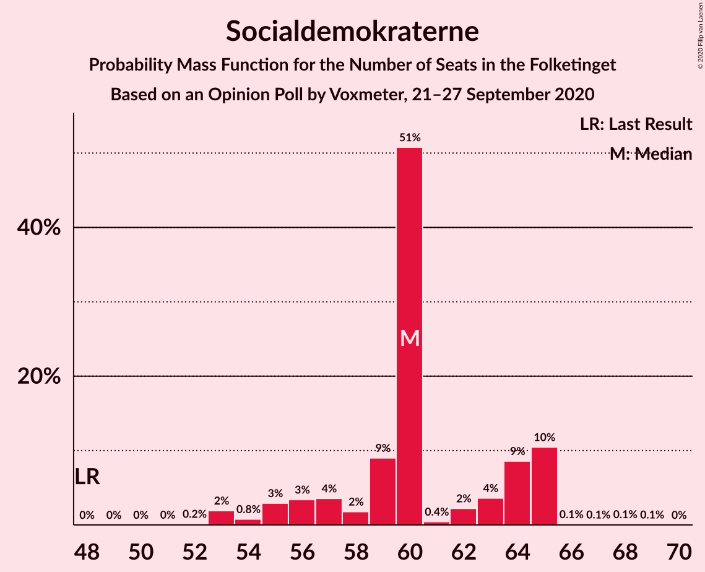

# Opinion Poll by Voxmeter, 21–27 September 2020

<a href="#voting-intentions">Voting Intentions</a> | <a href="#seats">Seats</a> | <a href="#coalitions">Coalitions</a> | <a href="#technical-information">Technical Information</a>

## Voting Intentions

### Confidence Intervals

| Party | Last Result | Poll Result | 80% Confidence Interval | 90% Confidence Interval | 95% Confidence Interval | 99% Confidence Interval |
|:-----:|:-----------:|:-----------:|:-----------------------:|:-----------------------:|:-----------------------:|:-----------------------:|
| Socialdemokraterne | 25.9% | 33.0% | 31.2–35.0% |30.7–35.5% |30.2–36.0% |29.4–36.9% |
| Venstre | 23.4% | 19.3% | 17.8–20.9% |17.3–21.4% |17.0–21.8% |16.3–22.6% |
| Radikale Venstre | 8.6% | 8.9% | 7.9–10.2% |7.6–10.5% |7.3–10.8% |6.8–11.4% |
| Socialistisk Folkeparti | 7.7% | 8.6% | 7.6–9.8% |7.3–10.2% |7.1–10.5% |6.6–11.1% |
| Det Konservative Folkeparti | 6.6% | 8.0% | 7.0–9.2% |6.8–9.6% |6.5–9.9% |6.1–10.5% |
| Enhedslisten–De Rød-Grønne | 6.9% | 7.0% | 6.1–8.1% |5.8–8.4% |5.6–8.7% |5.2–9.3% |
| Dansk Folkeparti | 8.7% | 6.1% | 5.2–7.2% |5.0–7.5% |4.8–7.7% |4.4–8.3% |
| Nye Borgerlige | 2.4% | 4.1% | 3.4–5.0% |3.2–5.2% |3.0–5.5% |2.7–5.9% |
| Liberal Alliance | 2.3% | 1.9% | 1.5–2.6% |1.4–2.8% |1.2–3.0% |1.1–3.3% |
| Kristendemokraterne | 1.7% | 1.3% | 0.9–1.8% |0.8–2.0% |0.7–2.1% |0.6–2.5% |
| Alternativet | 3.0% | 1.0% | 0.7–1.5% |0.6–1.6% |0.5–1.8% |0.4–2.1% |
| Stram Kurs | 1.8% | 0.3% | 0.2–0.7% |0.1–0.8% |0.1–0.9% |0.1–1.1% |
| Veganerpartiet | 0.0% | 0.3% | 0.2–0.7% |0.1–0.8% |0.1–0.9% |0.1–1.1% |

*Note:* The poll result column reflects the actual value used in the calculations. Published results may vary slightly, and in addition be rounded to fewer digits.

## Seats

### Confidence Intervals

| Party | Last Result | Median | 80% Confidence Interval | 90% Confidence Interval | 95% Confidence Interval | 99% Confidence Interval |
|:-----:|:-----------:|:------:|:-----------------------:|:-----------------------:|:-----------------------:|:-----------------------:|
| <a href="#socialdemokraterne">Socialdemokraterne</a> | 48 | 60 | 57–65 |55–65 |54–65 |53–65 |
| <a href="#venstre">Venstre</a> | 43 | 40 | 34–40 |32–40 |31–40 |30–41 |
| <a href="#radikale-venstre">Radikale Venstre</a> | 16 | 16 | 14–17 |13–19 |13–19 |12–20 |
| <a href="#socialistisk-folkeparti">Socialistisk Folkeparti</a> | 14 | 17 | 13–17 |13–17 |13–18 |13–21 |
| <a href="#det-konservative-folkeparti">Det Konservative Folkeparti</a> | 12 | 13 | 13–16 |13–18 |13–18 |11–19 |
| <a href="#enhedslisten–de-rød-grønne">Enhedslisten–De Rød-Grønne</a> | 13 | 13 | 11–14 |11–14 |11–15 |9–18 |
| <a href="#dansk-folkeparti">Dansk Folkeparti</a> | 16 | 10 | 9–12 |9–13 |9–13 |8–15 |
| <a href="#nye-borgerlige">Nye Borgerlige</a> | 4 | 6 | 5–10 |5–10 |5–10 |5–10 |
| <a href="#liberal-alliance">Liberal Alliance</a> | 4 | 0 | 0–4 |0–4 |0–5 |0–6 |
| <a href="#kristendemokraterne">Kristendemokraterne</a> | 0 | 0 | 0 |0 |0–4 |0–5 |
| <a href="#alternativet">Alternativet</a> | 5 | 0 | 0 |0 |0 |0–4 |
| <a href="#stram-kurs">Stram Kurs</a> | 0 | 0 | 0 |0 |0 |0 |
| <a href="#veganerpartiet">Veganerpartiet</a> | 0 | 0 | 0 |0 |0 |0 |

### Socialdemokraterne

*For a full overview of the results for this party, see the [Socialdemokraterne](party-socialdemokraterne.html) page.*

| Number of Seats | Probability | Accumulated | Special Marks |
|:---------------:|:-----------:|:-----------:|:-------------:|
| 48 | 0% | 100% | Last Result |
| 49 | 0% | 100% |  |
| 50 | 0% | 100% |  |
| 51 | 0% | 100% |  |
| 52 | 0.2% | 100% |  |
| 53 | 2% | 99.8% |  |
| 54 | 0.8% | 98% |  |
| 55 | 3% | 97% |  |
| 56 | 3% | 94% |  |
| 57 | 4% | 91% |  |
| 58 | 2% | 87% |  |
| 59 | 9% | 85% |  |
| 60 | 51% | 76% | Median |
| 61 | 0.4% | 26% |  |
| 62 | 2% | 25% |  |
| 63 | 4% | 23% |  |
| 64 | 9% | 19% |  |
| 65 | 10% | 11% |  |
| 66 | 0.1% | 0.3% |  |
| 67 | 0.1% | 0.2% |  |
| 68 | 0.1% | 0.2% |  |
| 69 | 0.1% | 0.1% |  |
| 70 | 0% | 0% |  |

### Venstre

*For a full overview of the results for this party, see the [Venstre](party-venstre.html) page.*

| Number of Seats | Probability | Accumulated | Special Marks |
|:---------------:|:-----------:|:-----------:|:-------------:|
| 27 | 0.1% | 100% |  |
| 28 | 0.1% | 99.9% |  |
| 29 | 0.2% | 99.8% |  |
| 30 | 1.1% | 99.6% |  |
| 31 | 2% | 98.5% |  |
| 32 | 2% | 96% |  |
| 33 | 4% | 94% |  |
| 34 | 6% | 90% |  |
| 35 | 17% | 84% |  |
| 36 | 0.9% | 67% |  |
| 37 | 2% | 66% |  |
| 38 | 11% | 65% |  |
| 39 | 2% | 54% |  |
| 40 | 50% | 51% | Median |
| 41 | 0.8% | 1.3% |  |
| 42 | 0.2% | 0.5% |  |
| 43 | 0.2% | 0.2% | Last Result |
| 44 | 0% | 0% |  |

### Radikale Venstre

*For a full overview of the results for this party, see the [Radikale Venstre](party-radikalevenstre.html) page.*

| Number of Seats | Probability | Accumulated | Special Marks |
|:---------------:|:-----------:|:-----------:|:-------------:|
| 11 | 0.1% | 100% |  |
| 12 | 2% | 99.9% |  |
| 13 | 5% | 98% |  |
| 14 | 5% | 94% |  |
| 15 | 11% | 89% |  |
| 16 | 68% | 78% | Last Result, Median |
| 17 | 4% | 10% |  |
| 18 | 1.0% | 7% |  |
| 19 | 3% | 6% |  |
| 20 | 2% | 2% |  |
| 21 | 0.1% | 0.3% |  |
| 22 | 0.3% | 0.3% |  |
| 23 | 0% | 0% |  |

### Socialistisk Folkeparti

*For a full overview of the results for this party, see the [Socialistisk Folkeparti](party-socialistiskfolkeparti.html) page.*

| Number of Seats | Probability | Accumulated | Special Marks |
|:---------------:|:-----------:|:-----------:|:-------------:|
| 11 | 0.1% | 100% |  |
| 12 | 0.3% | 99.9% |  |
| 13 | 19% | 99.6% |  |
| 14 | 4% | 81% | Last Result |
| 15 | 5% | 77% |  |
| 16 | 13% | 72% |  |
| 17 | 55% | 60% | Median |
| 18 | 3% | 4% |  |
| 19 | 0.4% | 1.2% |  |
| 20 | 0.1% | 0.7% |  |
| 21 | 0.5% | 0.6% |  |
| 22 | 0.1% | 0.1% |  |
| 23 | 0% | 0% |  |

### Det Konservative Folkeparti

*For a full overview of the results for this party, see the [Det Konservative Folkeparti](party-detkonservativefolkeparti.html) page.*

| Number of Seats | Probability | Accumulated | Special Marks |
|:---------------:|:-----------:|:-----------:|:-------------:|
| 11 | 0.6% | 100% |  |
| 12 | 1.2% | 99.4% | Last Result |
| 13 | 80% | 98% | Median |
| 14 | 3% | 18% |  |
| 15 | 4% | 15% |  |
| 16 | 5% | 11% |  |
| 17 | 0.9% | 6% |  |
| 18 | 4% | 5% |  |
| 19 | 2% | 2% |  |
| 20 | 0% | 0% |  |

### Enhedslisten–De Rød-Grønne

*For a full overview of the results for this party, see the [Enhedslisten–De Rød-Grønne](party-enhedslisten–derød-grønne.html) page.*

| Number of Seats | Probability | Accumulated | Special Marks |
|:---------------:|:-----------:|:-----------:|:-------------:|
| 8 | 0.2% | 100% |  |
| 9 | 0.5% | 99.8% |  |
| 10 | 2% | 99.2% |  |
| 11 | 15% | 98% |  |
| 12 | 3% | 83% |  |
| 13 | 58% | 80% | Last Result, Median |
| 14 | 16% | 21% |  |
| 15 | 3% | 5% |  |
| 16 | 0.9% | 2% |  |
| 17 | 0.5% | 1.0% |  |
| 18 | 0.5% | 0.5% |  |
| 19 | 0% | 0% |  |

### Dansk Folkeparti

*For a full overview of the results for this party, see the [Dansk Folkeparti](party-danskfolkeparti.html) page.*

| Number of Seats | Probability | Accumulated | Special Marks |
|:---------------:|:-----------:|:-----------:|:-------------:|
| 7 | 0.1% | 100% |  |
| 8 | 1.1% | 99.9% |  |
| 9 | 10% | 98.8% |  |
| 10 | 60% | 89% | Median |
| 11 | 8% | 29% |  |
| 12 | 15% | 21% |  |
| 13 | 5% | 6% |  |
| 14 | 0.4% | 1.3% |  |
| 15 | 0.8% | 1.0% |  |
| 16 | 0.1% | 0.2% | Last Result |
| 17 | 0% | 0% |  |

### Nye Borgerlige

*For a full overview of the results for this party, see the [Nye Borgerlige](party-nyeborgerlige.html) page.*

| Number of Seats | Probability | Accumulated | Special Marks |
|:---------------:|:-----------:|:-----------:|:-------------:|
| 4 | 0% | 100% | Last Result |
| 5 | 10% | 99.9% |  |
| 6 | 52% | 90% | Median |
| 7 | 8% | 38% |  |
| 8 | 6% | 30% |  |
| 9 | 13% | 24% |  |
| 10 | 10% | 11% |  |
| 11 | 0.1% | 0.2% |  |
| 12 | 0.1% | 0.1% |  |
| 13 | 0% | 0% |  |

### Liberal Alliance

*For a full overview of the results for this party, see the [Liberal Alliance](party-liberalalliance.html) page.*

| Number of Seats | Probability | Accumulated | Special Marks |
|:---------------:|:-----------:|:-----------:|:-------------:|
| 0 | 71% | 100% | Median |
| 1 | 0% | 29% |  |
| 2 | 0% | 29% |  |
| 3 | 0% | 29% |  |
| 4 | 25% | 29% | Last Result |
| 5 | 2% | 4% |  |
| 6 | 1.0% | 1.1% |  |
| 7 | 0% | 0.1% |  |
| 8 | 0% | 0% |  |

### Kristendemokraterne

*For a full overview of the results for this party, see the [Kristendemokraterne](party-kristendemokraterne.html) page.*

| Number of Seats | Probability | Accumulated | Special Marks |
|:---------------:|:-----------:|:-----------:|:-------------:|
| 0 | 96% | 100% | Last Result, Median |
| 1 | 0% | 4% |  |
| 2 | 0% | 4% |  |
| 3 | 0% | 4% |  |
| 4 | 3% | 4% |  |
| 5 | 0.9% | 1.0% |  |
| 6 | 0% | 0% |  |

### Alternativet

*For a full overview of the results for this party, see the [Alternativet](party-alternativet.html) page.*

| Number of Seats | Probability | Accumulated | Special Marks |
|:---------------:|:-----------:|:-----------:|:-------------:|
| 0 | 99.5% | 100% | Median |
| 1 | 0% | 0.5% |  |
| 2 | 0% | 0.5% |  |
| 3 | 0% | 0.5% |  |
| 4 | 0.5% | 0.5% |  |
| 5 | 0% | 0% | Last Result |

### Stram Kurs

*For a full overview of the results for this party, see the [Stram Kurs](party-stramkurs.html) page.*

| Number of Seats | Probability | Accumulated | Special Marks |
|:---------------:|:-----------:|:-----------:|:-------------:|
| 0 | 100% | 100% | Last Result, Median |

### Veganerpartiet

*For a full overview of the results for this party, see the [Veganerpartiet](party-veganerpartiet.html) page.*

| Number of Seats | Probability | Accumulated | Special Marks |
|:---------------:|:-----------:|:-----------:|:-------------:|
| 0 | 100% | 100% | Last Result, Median |

## Coalitions

### Confidence Intervals

| Coalition | Last Result | Median | Majority? | 80% Confidence Interval | 90% Confidence Interval | 95% Confidence Interval | 99% Confidence Interval |
|:---------:|:-----------:|:------:|:---------:|:-----------------------:|:-----------------------:|:-----------------------:|:-----------------------:|
| Socialdemokraterne – Radikale Venstre – Socialistisk Folkeparti – Enhedslisten–De Rød-Grønne – Alternativet | 96 | 106 | 100% | 102–106 | 101–106 | 100–106 | 96–111 |
| Socialdemokraterne – Radikale Venstre – Socialistisk Folkeparti – Enhedslisten–De Rød-Grønne | 91 | 106 | 100% | 102–106 | 101–106 | 100–106 | 96–111 |
| Socialdemokraterne – Radikale Venstre – Socialistisk Folkeparti | 78 | 93 | 88% | 89–94 | 87–94 | 86–94 | 85–97 |
| Socialdemokraterne – Socialistisk Folkeparti – Enhedslisten–De Rød-Grønne – Alternativet | 80 | 90 | 63% | 86–91 | 85–92 | 83–94 | 81–94 |
| Socialdemokraterne – Socialistisk Folkeparti – Enhedslisten–De Rød-Grønne | 75 | 90 | 63% | 86–91 | 85–91 | 83–94 | 81–94 |
| Socialdemokraterne – Radikale Venstre | 64 | 76 | 0% | 73–79 | 72–81 | 70–81 | 68–81 |
| Venstre – Det Konservative Folkeparti – Dansk Folkeparti – Nye Borgerlige – Liberal Alliance – Kristendemokraterne | 79 | 69 | 0% | 69–73 | 69–74 | 69–75 | 64–79 |
| Venstre – Det Konservative Folkeparti – Dansk Folkeparti – Nye Borgerlige – Liberal Alliance | 79 | 69 | 0% | 69–72 | 69–74 | 68–75 | 64–79 |
| Venstre – Det Konservative Folkeparti – Dansk Folkeparti – Liberal Alliance – Kristendemokraterne | 75 | 63 | 0% | 61–65 | 61–67 | 61–68 | 56–71 |
| Venstre – Det Konservative Folkeparti – Dansk Folkeparti – Liberal Alliance | 75 | 63 | 0% | 61–64 | 61–66 | 60–68 | 56–71 |
| Venstre – Det Konservative Folkeparti – Liberal Alliance | 59 | 53 | 0% | 50–53 | 49–56 | 49–57 | 45–58 |
| Venstre – Det Konservative Folkeparti | 55 | 53 | 0% | 48–53 | 46–53 | 45–54 | 42–58 |
| Venstre | 43 | 40 | 0% | 34–40 | 32–40 | 31–40 | 30–41 |

### Socialdemokraterne – Radikale Venstre – Socialistisk Folkeparti – Enhedslisten–De Rød-Grønne – Alternativet

| Number of Seats | Probability | Accumulated | Special Marks |
|:---------------:|:-----------:|:-----------:|:-------------:|
| 94 | 0.1% | 100% |  |
| 95 | 0.2% | 99.9% |  |
| 96 | 0.9% | 99.8% | Last Result |
| 97 | 0.4% | 98.9% |  |
| 98 | 0.1% | 98% |  |
| 99 | 0.1% | 98% |  |
| 100 | 1.4% | 98% |  |
| 101 | 4% | 97% |  |
| 102 | 4% | 93% |  |
| 103 | 4% | 89% |  |
| 104 | 9% | 85% |  |
| 105 | 12% | 76% |  |
| 106 | 62% | 64% | Median |
| 107 | 0.8% | 2% |  |
| 108 | 0.3% | 2% |  |
| 109 | 0.5% | 1.3% |  |
| 110 | 0.1% | 0.8% |  |
| 111 | 0.5% | 0.7% |  |
| 112 | 0.1% | 0.2% |  |
| 113 | 0.1% | 0.1% |  |
| 114 | 0.1% | 0.1% |  |
| 115 | 0% | 0% |  |

### Socialdemokraterne – Radikale Venstre – Socialistisk Folkeparti – Enhedslisten–De Rød-Grønne

| Number of Seats | Probability | Accumulated | Special Marks |
|:---------------:|:-----------:|:-----------:|:-------------:|
| 91 | 0% | 100% | Last Result |
| 92 | 0% | 100% |  |
| 93 | 0% | 100% |  |
| 94 | 0.1% | 100% |  |
| 95 | 0.2% | 99.9% |  |
| 96 | 0.9% | 99.8% |  |
| 97 | 0.4% | 98.8% |  |
| 98 | 0.1% | 98% |  |
| 99 | 0.1% | 98% |  |
| 100 | 1.4% | 98% |  |
| 101 | 4% | 97% |  |
| 102 | 5% | 93% |  |
| 103 | 4% | 88% |  |
| 104 | 9% | 85% |  |
| 105 | 12% | 76% |  |
| 106 | 61% | 64% | Median |
| 107 | 0.8% | 2% |  |
| 108 | 0.3% | 2% |  |
| 109 | 0.5% | 1.3% |  |
| 110 | 0.1% | 0.8% |  |
| 111 | 0.5% | 0.7% |  |
| 112 | 0.1% | 0.2% |  |
| 113 | 0.1% | 0.1% |  |
| 114 | 0.1% | 0.1% |  |
| 115 | 0% | 0% |  |

### Socialdemokraterne – Radikale Venstre – Socialistisk Folkeparti

| Number of Seats | Probability | Accumulated | Special Marks |
|:---------------:|:-----------:|:-----------:|:-------------:|
| 78 | 0% | 100% | Last Result |
| 79 | 0% | 100% |  |
| 80 | 0% | 100% |  |
| 81 | 0% | 100% |  |
| 82 | 0.1% | 100% |  |
| 83 | 0.2% | 99.9% |  |
| 84 | 0.1% | 99.7% |  |
| 85 | 2% | 99.6% |  |
| 86 | 0.8% | 98% |  |
| 87 | 2% | 97% |  |
| 88 | 3% | 95% |  |
| 89 | 4% | 92% |  |
| 90 | 3% | 88% | Majority |
| 91 | 10% | 85% |  |
| 92 | 10% | 75% |  |
| 93 | 50% | 65% | Median |
| 94 | 13% | 15% |  |
| 95 | 0.4% | 2% |  |
| 96 | 0.5% | 1.4% |  |
| 97 | 0.6% | 0.9% |  |
| 98 | 0.1% | 0.3% |  |
| 99 | 0.1% | 0.2% |  |
| 100 | 0.1% | 0.1% |  |
| 101 | 0% | 0% |  |

### Socialdemokraterne – Socialistisk Folkeparti – Enhedslisten–De Rød-Grønne – Alternativet

| Number of Seats | Probability | Accumulated | Special Marks |
|:---------------:|:-----------:|:-----------:|:-------------:|
| 78 | 0.1% | 100% |  |
| 79 | 0% | 99.9% |  |
| 80 | 0.2% | 99.9% | Last Result |
| 81 | 0.3% | 99.7% |  |
| 82 | 0.9% | 99.4% |  |
| 83 | 2% | 98.5% |  |
| 84 | 0.5% | 97% |  |
| 85 | 2% | 96% |  |
| 86 | 6% | 94% |  |
| 87 | 3% | 87% |  |
| 88 | 9% | 84% |  |
| 89 | 12% | 75% |  |
| 90 | 50% | 63% | Median, Majority |
| 91 | 8% | 14% |  |
| 92 | 0.4% | 5% |  |
| 93 | 2% | 5% |  |
| 94 | 3% | 3% |  |
| 95 | 0% | 0.1% |  |
| 96 | 0.1% | 0.1% |  |
| 97 | 0% | 0% |  |

### Socialdemokraterne – Socialistisk Folkeparti – Enhedslisten–De Rød-Grønne

| Number of Seats | Probability | Accumulated | Special Marks |
|:---------------:|:-----------:|:-----------:|:-------------:|
| 75 | 0% | 100% | Last Result |
| 76 | 0% | 100% |  |
| 77 | 0% | 100% |  |
| 78 | 0.1% | 100% |  |
| 79 | 0% | 99.9% |  |
| 80 | 0.2% | 99.9% |  |
| 81 | 0.3% | 99.7% |  |
| 82 | 0.9% | 99.4% |  |
| 83 | 2% | 98% |  |
| 84 | 0.5% | 96% |  |
| 85 | 2% | 96% |  |
| 86 | 6% | 94% |  |
| 87 | 3% | 87% |  |
| 88 | 9% | 84% |  |
| 89 | 12% | 75% |  |
| 90 | 50% | 63% | Median, Majority |
| 91 | 8% | 13% |  |
| 92 | 0.4% | 5% |  |
| 93 | 2% | 4% |  |
| 94 | 3% | 3% |  |
| 95 | 0% | 0.1% |  |
| 96 | 0.1% | 0.1% |  |
| 97 | 0% | 0% |  |

### Socialdemokraterne – Radikale Venstre

| Number of Seats | Probability | Accumulated | Special Marks |
|:---------------:|:-----------:|:-----------:|:-------------:|
| 64 | 0% | 100% | Last Result |
| 65 | 0% | 100% |  |
| 66 | 0% | 100% |  |
| 67 | 0% | 100% |  |
| 68 | 0.8% | 100% |  |
| 69 | 0.8% | 99.2% |  |
| 70 | 2% | 98% |  |
| 71 | 1.2% | 96% |  |
| 72 | 3% | 95% |  |
| 73 | 3% | 92% |  |
| 74 | 1.1% | 90% |  |
| 75 | 9% | 88% |  |
| 76 | 58% | 80% | Median |
| 77 | 3% | 22% |  |
| 78 | 0.4% | 19% |  |
| 79 | 9% | 18% |  |
| 80 | 0.2% | 10% |  |
| 81 | 9% | 9% |  |
| 82 | 0.1% | 0.3% |  |
| 83 | 0% | 0.2% |  |
| 84 | 0.1% | 0.2% |  |
| 85 | 0% | 0.1% |  |
| 86 | 0.1% | 0.1% |  |
| 87 | 0% | 0% |  |

### Venstre – Det Konservative Folkeparti – Dansk Folkeparti – Nye Borgerlige – Liberal Alliance – Kristendemokraterne

| Number of Seats | Probability | Accumulated | Special Marks |
|:---------------:|:-----------:|:-----------:|:-------------:|
| 61 | 0.1% | 100% |  |
| 62 | 0.1% | 99.9% |  |
| 63 | 0.1% | 99.9% |  |
| 64 | 0.5% | 99.8% |  |
| 65 | 0.1% | 99.3% |  |
| 66 | 0.5% | 99.2% |  |
| 67 | 0.3% | 98.7% |  |
| 68 | 0.8% | 98% |  |
| 69 | 62% | 98% | Median |
| 70 | 12% | 36% |  |
| 71 | 9% | 24% |  |
| 72 | 4% | 15% |  |
| 73 | 4% | 11% |  |
| 74 | 4% | 7% |  |
| 75 | 1.4% | 3% |  |
| 76 | 0.1% | 2% |  |
| 77 | 0.1% | 2% |  |
| 78 | 0.4% | 2% |  |
| 79 | 0.9% | 1.1% | Last Result |
| 80 | 0.2% | 0.2% |  |
| 81 | 0.1% | 0.1% |  |
| 82 | 0% | 0% |  |

### Venstre – Det Konservative Folkeparti – Dansk Folkeparti – Nye Borgerlige – Liberal Alliance

| Number of Seats | Probability | Accumulated | Special Marks |
|:---------------:|:-----------:|:-----------:|:-------------:|
| 61 | 0.1% | 100% |  |
| 62 | 0.1% | 99.9% |  |
| 63 | 0.1% | 99.9% |  |
| 64 | 0.5% | 99.8% |  |
| 65 | 0.1% | 99.2% |  |
| 66 | 0.8% | 99.1% |  |
| 67 | 0.3% | 98% |  |
| 68 | 2% | 98% |  |
| 69 | 62% | 96% | Median |
| 70 | 14% | 35% |  |
| 71 | 9% | 21% |  |
| 72 | 4% | 12% |  |
| 73 | 3% | 9% |  |
| 74 | 2% | 5% |  |
| 75 | 1.5% | 3% |  |
| 76 | 0.1% | 1.3% |  |
| 77 | 0.2% | 1.2% |  |
| 78 | 0.1% | 1.0% |  |
| 79 | 0.8% | 1.0% | Last Result |
| 80 | 0.2% | 0.2% |  |
| 81 | 0% | 0% |  |

### Venstre – Det Konservative Folkeparti – Dansk Folkeparti – Liberal Alliance – Kristendemokraterne

| Number of Seats | Probability | Accumulated | Special Marks |
|:---------------:|:-----------:|:-----------:|:-------------:|
| 54 | 0.1% | 100% |  |
| 55 | 0% | 99.9% |  |
| 56 | 0.6% | 99.9% |  |
| 57 | 0.1% | 99.3% |  |
| 58 | 0.4% | 99.2% |  |
| 59 | 0.6% | 98.9% |  |
| 60 | 0.7% | 98% |  |
| 61 | 17% | 98% |  |
| 62 | 8% | 81% |  |
| 63 | 51% | 73% | Median |
| 64 | 11% | 22% |  |
| 65 | 3% | 12% |  |
| 66 | 3% | 8% |  |
| 67 | 2% | 6% |  |
| 68 | 1.3% | 3% |  |
| 69 | 0.7% | 2% |  |
| 70 | 0.2% | 1.3% |  |
| 71 | 0.9% | 1.1% |  |
| 72 | 0.1% | 0.3% |  |
| 73 | 0.1% | 0.2% |  |
| 74 | 0.1% | 0.1% |  |
| 75 | 0% | 0% | Last Result |

### Venstre – Det Konservative Folkeparti – Dansk Folkeparti – Liberal Alliance

| Number of Seats | Probability | Accumulated | Special Marks |
|:---------------:|:-----------:|:-----------:|:-------------:|
| 54 | 0.1% | 100% |  |
| 55 | 0% | 99.9% |  |
| 56 | 0.7% | 99.9% |  |
| 57 | 0.1% | 99.2% |  |
| 58 | 0.5% | 99.1% |  |
| 59 | 0.6% | 98.6% |  |
| 60 | 0.7% | 98% |  |
| 61 | 18% | 97% |  |
| 62 | 9% | 79% |  |
| 63 | 51% | 71% | Median |
| 64 | 11% | 20% |  |
| 65 | 2% | 9% |  |
| 66 | 3% | 7% |  |
| 67 | 2% | 4% |  |
| 68 | 1.2% | 3% |  |
| 69 | 0.4% | 1.5% |  |
| 70 | 0.1% | 1.1% |  |
| 71 | 0.8% | 1.0% |  |
| 72 | 0.1% | 0.2% |  |
| 73 | 0% | 0.2% |  |
| 74 | 0.1% | 0.1% |  |
| 75 | 0% | 0% | Last Result |

### Venstre – Det Konservative Folkeparti – Liberal Alliance

| Number of Seats | Probability | Accumulated | Special Marks |
|:---------------:|:-----------:|:-----------:|:-------------:|
| 44 | 0.3% | 100% |  |
| 45 | 0.5% | 99.7% |  |
| 46 | 0.5% | 99.2% |  |
| 47 | 0.2% | 98.6% |  |
| 48 | 0.5% | 98% |  |
| 49 | 4% | 98% |  |
| 50 | 5% | 94% |  |
| 51 | 11% | 89% |  |
| 52 | 18% | 78% |  |
| 53 | 51% | 61% | Median |
| 54 | 3% | 9% |  |
| 55 | 1.0% | 6% |  |
| 56 | 3% | 5% |  |
| 57 | 2% | 3% |  |
| 58 | 0.8% | 1.1% |  |
| 59 | 0% | 0.3% | Last Result |
| 60 | 0.1% | 0.2% |  |
| 61 | 0% | 0.1% |  |
| 62 | 0% | 0.1% |  |
| 63 | 0% | 0.1% |  |
| 64 | 0% | 0.1% |  |
| 65 | 0.1% | 0.1% |  |
| 66 | 0% | 0% |  |

### Venstre – Det Konservative Folkeparti

| Number of Seats | Probability | Accumulated | Special Marks |
|:---------------:|:-----------:|:-----------:|:-------------:|
| 42 | 0.6% | 100% |  |
| 43 | 0% | 99.4% |  |
| 44 | 0.3% | 99.3% |  |
| 45 | 3% | 99.0% |  |
| 46 | 3% | 97% |  |
| 47 | 0.5% | 93% |  |
| 48 | 17% | 93% |  |
| 49 | 3% | 75% |  |
| 50 | 3% | 73% |  |
| 51 | 11% | 69% |  |
| 52 | 3% | 59% |  |
| 53 | 51% | 56% | Median |
| 54 | 2% | 5% |  |
| 55 | 0.3% | 2% | Last Result |
| 56 | 0.8% | 2% |  |
| 57 | 0.3% | 1.0% |  |
| 58 | 0.6% | 0.8% |  |
| 59 | 0.1% | 0.1% |  |
| 60 | 0% | 0% |  |

### Venstre

| Number of Seats | Probability | Accumulated | Special Marks |
|:---------------:|:-----------:|:-----------:|:-------------:|
| 27 | 0.1% | 100% |  |
| 28 | 0.1% | 99.9% |  |
| 29 | 0.2% | 99.8% |  |
| 30 | 1.1% | 99.6% |  |
| 31 | 2% | 98.5% |  |
| 32 | 2% | 96% |  |
| 33 | 4% | 94% |  |
| 34 | 6% | 90% |  |
| 35 | 17% | 84% |  |
| 36 | 0.9% | 67% |  |
| 37 | 2% | 66% |  |
| 38 | 11% | 65% |  |
| 39 | 2% | 54% |  |
| 40 | 50% | 51% | Median |
| 41 | 0.8% | 1.3% |  |
| 42 | 0.2% | 0.5% |  |
| 43 | 0.2% | 0.2% | Last Result |
| 44 | 0% | 0% |  |

## Technical Information

### Opinion Poll

+ **Polling firm:** Voxmeter
+ **Commissioner(s):** —
+ **Fieldwork period:** 21–27 September 2020

### Calculations

+ **Sample size:** 1032
+ **Simulations done:** 1,048,576
+ **Error estimate:** 4.94%

