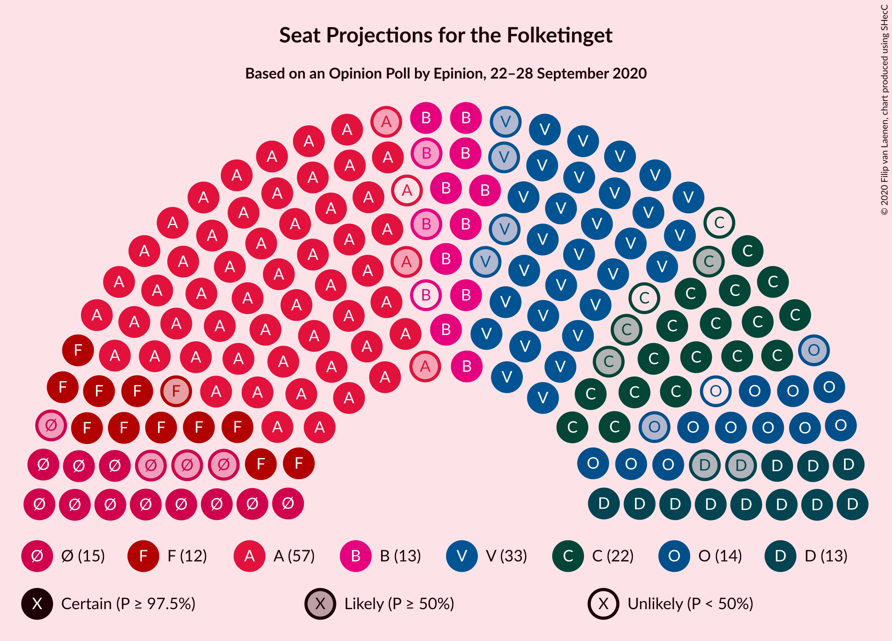
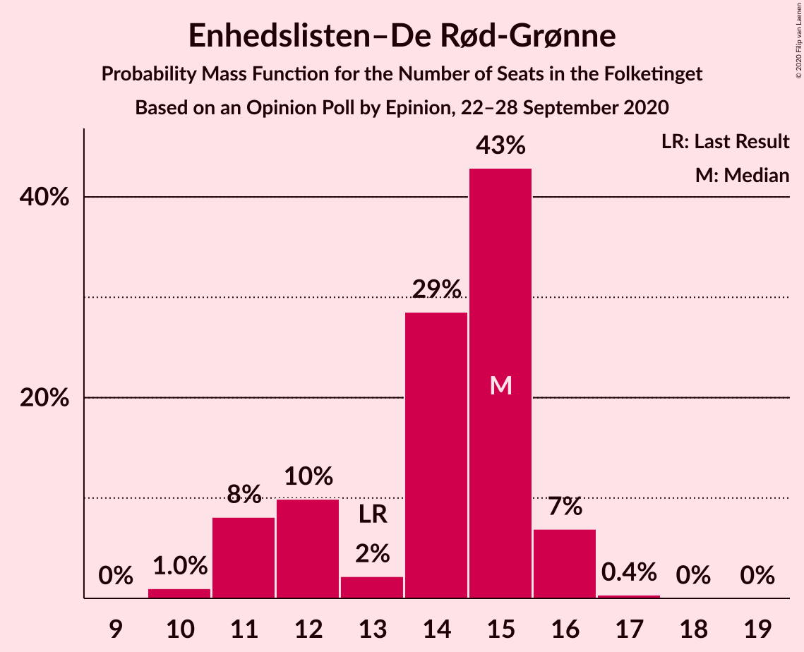
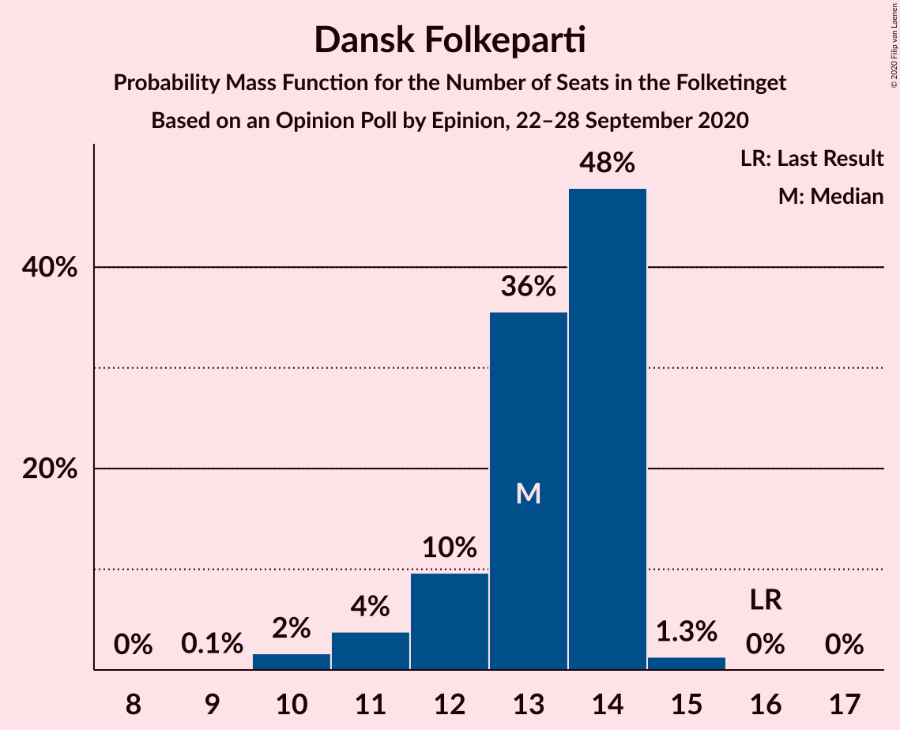
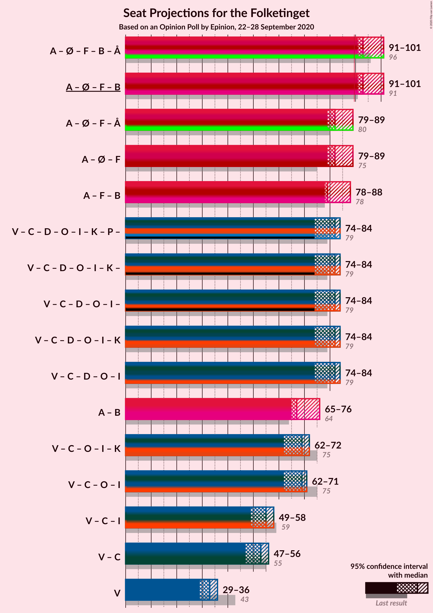
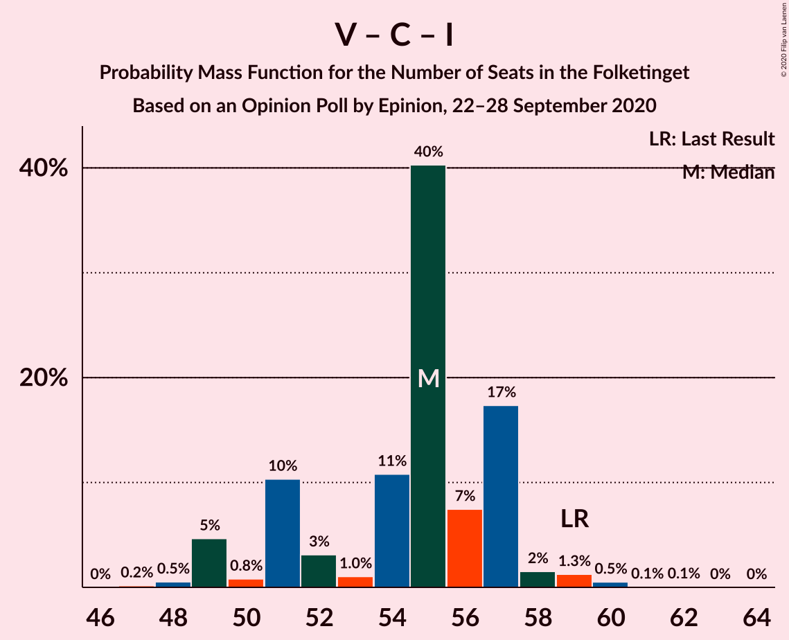

# Opinion Poll by Epinion, 22–28 September 2020

<a href="#voting-intentions">Voting Intentions</a> | <a href="#seats">Seats</a> | <a href="#coalitions">Coalitions</a> | <a href="#technical-information">Technical Information</a>

## Voting Intentions

### Confidence Intervals

| Party | Last Result | Poll Result | 80% Confidence Interval | 90% Confidence Interval | 95% Confidence Interval | 99% Confidence Interval |
|:-----:|:-----------:|:-----------:|:-----------------------:|:-----------------------:|:-----------------------:|:-----------------------:|
| Socialdemokraterne | 25.9% | 31.3% | 29.9–32.8% |29.4–33.2% |29.1–33.6% |28.4–34.3% |
| Venstre | 23.4% | 17.7% | 16.5–18.9% |16.2–19.3% |15.9–19.6% |15.3–20.2% |
| Det Konservative Folkeparti | 6.6% | 10.6% | 9.7–11.7% |9.4–12.0% |9.2–12.2% |8.8–12.7% |
| Enhedslisten–De Rød-Grønne | 6.9% | 7.3% | 6.5–8.2% |6.3–8.5% |6.1–8.7% |5.8–9.1% |
| Nye Borgerlige | 2.4% | 6.9% | 6.1–7.8% |5.9–8.0% |5.7–8.2% |5.4–8.7% |
| Socialistisk Folkeparti | 7.7% | 6.8% | 6.1–7.7% |5.9–7.9% |5.7–8.2% |5.3–8.6% |
| Dansk Folkeparti | 8.7% | 6.6% | 5.9–7.5% |5.7–7.7% |5.5–8.0% |5.2–8.4% |
| Radikale Venstre | 8.6% | 6.6% | 5.9–7.5% |5.7–7.7% |5.5–8.0% |5.2–8.4% |
| Liberal Alliance | 2.3% | 2.1% | 1.7–2.6% |1.6–2.8% |1.5–2.9% |1.3–3.2% |
| Kristendemokraterne | 1.7% | 1.4% | 1.1–1.9% |1.0–2.0% |0.9–2.1% |0.8–2.4% |
| Stram Kurs | 1.8% | 1.0% | 0.7–1.4% |0.7–1.5% |0.6–1.6% |0.5–1.8% |
| Alternativet | 3.0% | 0.6% | 0.4–0.9% |0.4–1.1% |0.3–1.1% |0.3–1.3% |
| Veganerpartiet | 0.0% | 0.3% | 0.2–0.6% |0.2–0.7% |0.1–0.7% |0.1–0.9% |

*Note:* The poll result column reflects the actual value used in the calculations. Published results may vary slightly, and in addition be rounded to fewer digits.

## Seats

### Confidence Intervals

| Party | Last Result | Median | 80% Confidence Interval | 90% Confidence Interval | 95% Confidence Interval | 99% Confidence Interval |
|:-----:|:-----------:|:------:|:-----------------------:|:-----------------------:|:-----------------------:|:-----------------------:|
| <a href="#socialdemokraterne">Socialdemokraterne</a> | 48 | 56 | 54–61 |53–62 |53–63 |51–64 |
| <a href="#venstre">Venstre</a> | 43 | 33 | 30–35 |30–36 |29–36 |28–36 |
| <a href="#det-konservative-folkeparti">Det Konservative Folkeparti</a> | 12 | 20 | 17–22 |17–22 |17–23 |16–23 |
| <a href="#enhedslisten–de-rød-grønne">Enhedslisten–De Rød-Grønne</a> | 13 | 15 | 12–15 |11–16 |11–16 |10–16 |
| <a href="#nye-borgerlige">Nye Borgerlige</a> | 4 | 13 | 11–13 |11–14 |11–15 |10–16 |
| <a href="#socialistisk-folkeparti">Socialistisk Folkeparti</a> | 14 | 12 | 11–15 |11–15 |11–15 |9–15 |
| <a href="#dansk-folkeparti">Dansk Folkeparti</a> | 16 | 13 | 12–14 |11–14 |11–14 |10–15 |
| <a href="#radikale-venstre">Radikale Venstre</a> | 16 | 12 | 10–13 |10–14 |10–15 |10–15 |
| <a href="#liberal-alliance">Liberal Alliance</a> | 4 | 0 | 0–5 |0–5 |0–5 |0–6 |
| <a href="#kristendemokraterne">Kristendemokraterne</a> | 0 | 0 | 0 |0 |0–4 |0–4 |
| <a href="#stram-kurs">Stram Kurs</a> | 0 | 0 | 0 |0 |0 |0 |
| <a href="#alternativet">Alternativet</a> | 5 | 0 | 0 |0 |0 |0 |
| <a href="#veganerpartiet">Veganerpartiet</a> | 0 | 0 | 0 |0 |0 |0 |

### Socialdemokraterne

*For a full overview of the results for this party, see the [Socialdemokraterne](party-socialdemokraterne.html) page.*

| Number of Seats | Probability | Accumulated | Special Marks |
|:---------------:|:-----------:|:-----------:|:-------------:|
| 48 | 0% | 100% | Last Result |
| 49 | 0.1% | 100% |  |
| 50 | 0.1% | 99.9% |  |
| 51 | 0.8% | 99.8% |  |
| 52 | 0.3% | 99.1% |  |
| 53 | 4% | 98.7% |  |
| 54 | 43% | 95% |  |
| 55 | 1.1% | 52% |  |
| 56 | 2% | 51% | Median |
| 57 | 30% | 48% |  |
| 58 | 3% | 18% |  |
| 59 | 3% | 16% |  |
| 60 | 1.4% | 13% |  |
| 61 | 3% | 11% |  |
| 62 | 6% | 9% |  |
| 63 | 0.5% | 3% |  |
| 64 | 2% | 2% |  |
| 65 | 0% | 0% |  |

### Venstre

*For a full overview of the results for this party, see the [Venstre](party-venstre.html) page.*

| Number of Seats | Probability | Accumulated | Special Marks |
|:---------------:|:-----------:|:-----------:|:-------------:|
| 27 | 0.2% | 100% |  |
| 28 | 0.8% | 99.7% |  |
| 29 | 2% | 98.9% |  |
| 30 | 7% | 97% |  |
| 31 | 16% | 90% |  |
| 32 | 6% | 74% |  |
| 33 | 40% | 69% | Median |
| 34 | 7% | 29% |  |
| 35 | 16% | 22% |  |
| 36 | 6% | 6% |  |
| 37 | 0.4% | 0.4% |  |
| 38 | 0% | 0.1% |  |
| 39 | 0% | 0% |  |
| 40 | 0% | 0% |  |
| 41 | 0% | 0% |  |
| 42 | 0% | 0% |  |
| 43 | 0% | 0% | Last Result |

### Det Konservative Folkeparti

*For a full overview of the results for this party, see the [Det Konservative Folkeparti](party-detkonservativefolkeparti.html) page.*

| Number of Seats | Probability | Accumulated | Special Marks |
|:---------------:|:-----------:|:-----------:|:-------------:|
| 12 | 0% | 100% | Last Result |
| 13 | 0% | 100% |  |
| 14 | 0% | 100% |  |
| 15 | 0.5% | 100% |  |
| 16 | 0.7% | 99.5% |  |
| 17 | 12% | 98.8% |  |
| 18 | 31% | 87% |  |
| 19 | 5% | 56% |  |
| 20 | 11% | 51% | Median |
| 21 | 2% | 41% |  |
| 22 | 36% | 38% |  |
| 23 | 2% | 3% |  |
| 24 | 0.2% | 0.2% |  |
| 25 | 0% | 0% |  |

### Enhedslisten–De Rød-Grønne

*For a full overview of the results for this party, see the [Enhedslisten–De Rød-Grønne](party-enhedslisten–derød-grønne.html) page.*

| Number of Seats | Probability | Accumulated | Special Marks |
|:---------------:|:-----------:|:-----------:|:-------------:|
| 10 | 1.0% | 100% |  |
| 11 | 8% | 99.0% |  |
| 12 | 10% | 91% |  |
| 13 | 2% | 81% | Last Result |
| 14 | 29% | 79% |  |
| 15 | 43% | 50% | Median |
| 16 | 7% | 7% |  |
| 17 | 0.4% | 0.4% |  |
| 18 | 0% | 0.1% |  |
| 19 | 0% | 0% |  |

### Nye Borgerlige

*For a full overview of the results for this party, see the [Nye Borgerlige](party-nyeborgerlige.html) page.*

| Number of Seats | Probability | Accumulated | Special Marks |
|:---------------:|:-----------:|:-----------:|:-------------:|
| 4 | 0% | 100% | Last Result |
| 5 | 0% | 100% |  |
| 6 | 0% | 100% |  |
| 7 | 0% | 100% |  |
| 8 | 0% | 100% |  |
| 9 | 0.1% | 100% |  |
| 10 | 1.0% | 99.9% |  |
| 11 | 10% | 98.9% |  |
| 12 | 27% | 89% |  |
| 13 | 54% | 62% | Median |
| 14 | 4% | 8% |  |
| 15 | 3% | 4% |  |
| 16 | 0.9% | 1.0% |  |
| 17 | 0% | 0% |  |

### Socialistisk Folkeparti

*For a full overview of the results for this party, see the [Socialistisk Folkeparti](party-socialistiskfolkeparti.html) page.*

| Number of Seats | Probability | Accumulated | Special Marks |
|:---------------:|:-----------:|:-----------:|:-------------:|
| 9 | 0.6% | 100% |  |
| 10 | 2% | 99.4% |  |
| 11 | 40% | 98% |  |
| 12 | 34% | 58% | Median |
| 13 | 3% | 24% |  |
| 14 | 8% | 21% | Last Result |
| 15 | 13% | 13% |  |
| 16 | 0.1% | 0.1% |  |
| 17 | 0% | 0% |  |

### Dansk Folkeparti

*For a full overview of the results for this party, see the [Dansk Folkeparti](party-danskfolkeparti.html) page.*

| Number of Seats | Probability | Accumulated | Special Marks |
|:---------------:|:-----------:|:-----------:|:-------------:|
| 9 | 0.1% | 100% |  |
| 10 | 2% | 99.9% |  |
| 11 | 4% | 98% |  |
| 12 | 10% | 94% |  |
| 13 | 36% | 85% | Median |
| 14 | 48% | 49% |  |
| 15 | 1.3% | 1.4% |  |
| 16 | 0% | 0.1% | Last Result |
| 17 | 0% | 0% |  |

### Radikale Venstre

*For a full overview of the results for this party, see the [Radikale Venstre](party-radikalevenstre.html) page.*

| Number of Seats | Probability | Accumulated | Special Marks |
|:---------------:|:-----------:|:-----------:|:-------------:|
| 8 | 0.1% | 100% |  |
| 9 | 0.1% | 99.9% |  |
| 10 | 17% | 99.8% |  |
| 11 | 19% | 83% |  |
| 12 | 16% | 64% | Median |
| 13 | 41% | 48% |  |
| 14 | 4% | 7% |  |
| 15 | 3% | 3% |  |
| 16 | 0.1% | 0.1% | Last Result |
| 17 | 0% | 0% |  |

### Liberal Alliance

*For a full overview of the results for this party, see the [Liberal Alliance](party-liberalalliance.html) page.*

| Number of Seats | Probability | Accumulated | Special Marks |
|:---------------:|:-----------:|:-----------:|:-------------:|
| 0 | 55% | 100% | Median |
| 1 | 0% | 45% |  |
| 2 | 0% | 45% |  |
| 3 | 0% | 45% |  |
| 4 | 33% | 45% | Last Result |
| 5 | 11% | 12% |  |
| 6 | 0.7% | 0.7% |  |
| 7 | 0% | 0% |  |

### Kristendemokraterne

*For a full overview of the results for this party, see the [Kristendemokraterne](party-kristendemokraterne.html) page.*

| Number of Seats | Probability | Accumulated | Special Marks |
|:---------------:|:-----------:|:-----------:|:-------------:|
| 0 | 97% | 100% | Last Result, Median |
| 1 | 0% | 3% |  |
| 2 | 0% | 3% |  |
| 3 | 0.1% | 3% |  |
| 4 | 3% | 3% |  |
| 5 | 0.3% | 0.3% |  |
| 6 | 0% | 0% |  |

### Stram Kurs

*For a full overview of the results for this party, see the [Stram Kurs](party-stramkurs.html) page.*

| Number of Seats | Probability | Accumulated | Special Marks |
|:---------------:|:-----------:|:-----------:|:-------------:|
| 0 | 99.7% | 100% | Last Result, Median |
| 1 | 0% | 0.3% |  |
| 2 | 0% | 0.3% |  |
| 3 | 0% | 0.3% |  |
| 4 | 0.3% | 0.3% |  |
| 5 | 0% | 0% |  |

### Alternativet

*For a full overview of the results for this party, see the [Alternativet](party-alternativet.html) page.*

| Number of Seats | Probability | Accumulated | Special Marks |
|:---------------:|:-----------:|:-----------:|:-------------:|
| 0 | 100% | 100% | Median |
| 1 | 0% | 0% |  |
| 2 | 0% | 0% |  |
| 3 | 0% | 0% |  |
| 4 | 0% | 0% |  |
| 5 | 0% | 0% | Last Result |

### Veganerpartiet

*For a full overview of the results for this party, see the [Veganerpartiet](party-veganerpartiet.html) page.*

| Number of Seats | Probability | Accumulated | Special Marks |
|:---------------:|:-----------:|:-----------:|:-------------:|
| 0 | 100% | 100% | Last Result, Median |

## Coalitions

### Confidence Intervals

| Coalition | Last Result | Median | Majority? | 80% Confidence Interval | 90% Confidence Interval | 95% Confidence Interval | 99% Confidence Interval |
|:---------:|:-----------:|:------:|:---------:|:-----------------------:|:-----------------------:|:-----------------------:|:-----------------------:|
| Socialdemokraterne – Enhedslisten–De Rød-Grønne – Socialistisk Folkeparti – Radikale Venstre – Alternativet | 96 | 93 | 99.1% | 93–100 | 92–100 | 91–101 | 88–101 |
| Socialdemokraterne – Enhedslisten–De Rød-Grønne – Socialistisk Folkeparti – Radikale Venstre | 91 | 93 | 99.1% | 93–100 | 92–100 | 91–101 | 88–101 |
| Socialdemokraterne – Enhedslisten–De Rød-Grønne – Socialistisk Folkeparti – Alternativet | 80 | 82 | 0.3% | 80–87 | 80–88 | 79–89 | 76–89 |
| Socialdemokraterne – Enhedslisten–De Rød-Grønne – Socialistisk Folkeparti | 75 | 82 | 0.3% | 80–87 | 80–88 | 79–89 | 76–89 |
| Socialdemokraterne – Socialistisk Folkeparti – Radikale Venstre | 78 | 79 | 0% | 78–86 | 78–86 | 78–88 | 74–88 |
| Venstre – Det Konservative Folkeparti – Nye Borgerlige – Dansk Folkeparti – Liberal Alliance – Kristendemokraterne | 79 | 82 | 0% | 75–82 | 75–83 | 74–84 | 74–87 |
| Venstre – Det Konservative Folkeparti – Nye Borgerlige – Dansk Folkeparti – Liberal Alliance | 79 | 82 | 0% | 75–82 | 75–82 | 74–84 | 74–87 |
| Socialdemokraterne – Radikale Venstre | 64 | 67 | 0% | 65–74 | 65–74 | 65–76 | 63–77 |
| Venstre – Det Konservative Folkeparti – Dansk Folkeparti – Liberal Alliance – Kristendemokraterne | 75 | 69 | 0% | 64–70 | 63–70 | 62–72 | 61–74 |
| Venstre – Det Konservative Folkeparti – Dansk Folkeparti – Liberal Alliance | 75 | 69 | 0% | 63–70 | 62–70 | 62–71 | 61–74 |
| Venstre – Det Konservative Folkeparti – Liberal Alliance | 59 | 55 | 0% | 51–57 | 49–57 | 49–58 | 48–60 |
| Venstre – Det Konservative Folkeparti | 55 | 53 | 0% | 49–55 | 47–56 | 47–56 | 45–57 |
| Venstre | 43 | 33 | 0% | 30–35 | 30–36 | 29–36 | 28–36 |

### Socialdemokraterne – Enhedslisten–De Rød-Grønne – Socialistisk Folkeparti – Radikale Venstre – Alternativet

| Number of Seats | Probability | Accumulated | Special Marks |
|:---------------:|:-----------:|:-----------:|:-------------:|
| 88 | 0.6% | 100% |  |
| 89 | 0.4% | 99.4% |  |
| 90 | 1.0% | 99.1% | Majority |
| 91 | 2% | 98% |  |
| 92 | 3% | 97% |  |
| 93 | 48% | 94% |  |
| 94 | 20% | 46% |  |
| 95 | 5% | 26% | Median |
| 96 | 3% | 21% | Last Result |
| 97 | 1.0% | 18% |  |
| 98 | 6% | 17% |  |
| 99 | 1.4% | 12% |  |
| 100 | 7% | 10% |  |
| 101 | 3% | 4% |  |
| 102 | 0.1% | 0.2% |  |
| 103 | 0% | 0.1% |  |
| 104 | 0% | 0% |  |

### Socialdemokraterne – Enhedslisten–De Rød-Grønne – Socialistisk Folkeparti – Radikale Venstre

| Number of Seats | Probability | Accumulated | Special Marks |
|:---------------:|:-----------:|:-----------:|:-------------:|
| 88 | 0.6% | 100% |  |
| 89 | 0.4% | 99.4% |  |
| 90 | 1.0% | 99.1% | Majority |
| 91 | 2% | 98% | Last Result |
| 92 | 3% | 97% |  |
| 93 | 48% | 94% |  |
| 94 | 20% | 46% |  |
| 95 | 5% | 26% | Median |
| 96 | 3% | 21% |  |
| 97 | 1.0% | 18% |  |
| 98 | 6% | 17% |  |
| 99 | 1.4% | 12% |  |
| 100 | 7% | 10% |  |
| 101 | 3% | 4% |  |
| 102 | 0.1% | 0.2% |  |
| 103 | 0% | 0.1% |  |
| 104 | 0% | 0% |  |

### Socialdemokraterne – Enhedslisten–De Rød-Grønne – Socialistisk Folkeparti – Alternativet

| Number of Seats | Probability | Accumulated | Special Marks |
|:---------------:|:-----------:|:-----------:|:-------------:|
| 76 | 0.6% | 100% |  |
| 77 | 0.5% | 99.4% |  |
| 78 | 0.3% | 98.9% |  |
| 79 | 2% | 98.6% |  |
| 80 | 34% | 97% | Last Result |
| 81 | 8% | 63% |  |
| 82 | 6% | 55% |  |
| 83 | 29% | 49% | Median |
| 84 | 2% | 20% |  |
| 85 | 3% | 18% |  |
| 86 | 2% | 15% |  |
| 87 | 7% | 13% |  |
| 88 | 2% | 6% |  |
| 89 | 3% | 4% |  |
| 90 | 0.2% | 0.3% | Majority |
| 91 | 0% | 0.1% |  |
| 92 | 0% | 0% |  |

### Socialdemokraterne – Enhedslisten–De Rød-Grønne – Socialistisk Folkeparti

| Number of Seats | Probability | Accumulated | Special Marks |
|:---------------:|:-----------:|:-----------:|:-------------:|
| 75 | 0% | 100% | Last Result |
| 76 | 0.6% | 100% |  |
| 77 | 0.5% | 99.4% |  |
| 78 | 0.3% | 98.9% |  |
| 79 | 2% | 98.6% |  |
| 80 | 34% | 97% |  |
| 81 | 8% | 63% |  |
| 82 | 6% | 55% |  |
| 83 | 29% | 49% | Median |
| 84 | 2% | 20% |  |
| 85 | 3% | 18% |  |
| 86 | 2% | 15% |  |
| 87 | 7% | 13% |  |
| 88 | 2% | 6% |  |
| 89 | 3% | 4% |  |
| 90 | 0.2% | 0.3% | Majority |
| 91 | 0% | 0.1% |  |
| 92 | 0% | 0% |  |

### Socialdemokraterne – Socialistisk Folkeparti – Radikale Venstre

| Number of Seats | Probability | Accumulated | Special Marks |
|:---------------:|:-----------:|:-----------:|:-------------:|
| 74 | 0.8% | 100% |  |
| 75 | 0% | 99.2% |  |
| 76 | 0.4% | 99.2% |  |
| 77 | 0.9% | 98.7% |  |
| 78 | 36% | 98% | Last Result |
| 79 | 18% | 62% |  |
| 80 | 14% | 44% | Median |
| 81 | 1.4% | 30% |  |
| 82 | 0.8% | 28% |  |
| 83 | 11% | 27% |  |
| 84 | 4% | 16% |  |
| 85 | 2% | 12% |  |
| 86 | 5% | 10% |  |
| 87 | 0.8% | 5% |  |
| 88 | 4% | 4% |  |
| 89 | 0% | 0.1% |  |
| 90 | 0% | 0% | Majority |

### Venstre – Det Konservative Folkeparti – Nye Borgerlige – Dansk Folkeparti – Liberal Alliance – Kristendemokraterne

| Number of Seats | Probability | Accumulated | Special Marks |
|:---------------:|:-----------:|:-----------:|:-------------:|
| 72 | 0% | 100% |  |
| 73 | 0.1% | 99.9% |  |
| 74 | 3% | 99.8% |  |
| 75 | 7% | 96% |  |
| 76 | 1.4% | 90% |  |
| 77 | 6% | 88% |  |
| 78 | 1.0% | 83% |  |
| 79 | 3% | 82% | Last Result, Median |
| 80 | 5% | 79% |  |
| 81 | 20% | 74% |  |
| 82 | 48% | 54% |  |
| 83 | 3% | 6% |  |
| 84 | 1.3% | 3% |  |
| 85 | 1.0% | 2% |  |
| 86 | 0.4% | 0.9% |  |
| 87 | 0.6% | 0.6% |  |
| 88 | 0% | 0% |  |

### Venstre – Det Konservative Folkeparti – Nye Borgerlige – Dansk Folkeparti – Liberal Alliance

| Number of Seats | Probability | Accumulated | Special Marks |
|:---------------:|:-----------:|:-----------:|:-------------:|
| 70 | 0.1% | 100% |  |
| 71 | 0% | 99.9% |  |
| 72 | 0% | 99.9% |  |
| 73 | 0.2% | 99.9% |  |
| 74 | 3% | 99.7% |  |
| 75 | 7% | 96% |  |
| 76 | 2% | 89% |  |
| 77 | 6% | 88% |  |
| 78 | 1.0% | 81% |  |
| 79 | 3% | 80% | Last Result, Median |
| 80 | 5% | 77% |  |
| 81 | 19% | 72% |  |
| 82 | 48% | 52% |  |
| 83 | 2% | 4% |  |
| 84 | 1.1% | 3% |  |
| 85 | 0.8% | 2% |  |
| 86 | 0.2% | 0.8% |  |
| 87 | 0.6% | 0.6% |  |
| 88 | 0% | 0% |  |

### Socialdemokraterne – Radikale Venstre

| Number of Seats | Probability | Accumulated | Special Marks |
|:---------------:|:-----------:|:-----------:|:-------------:|
| 61 | 0.1% | 100% |  |
| 62 | 0.1% | 99.9% |  |
| 63 | 0.7% | 99.8% |  |
| 64 | 0.5% | 99.1% | Last Result |
| 65 | 10% | 98.6% |  |
| 66 | 4% | 89% |  |
| 67 | 47% | 84% |  |
| 68 | 10% | 37% | Median |
| 69 | 6% | 27% |  |
| 70 | 3% | 21% |  |
| 71 | 3% | 18% |  |
| 72 | 2% | 14% |  |
| 73 | 2% | 12% |  |
| 74 | 6% | 10% |  |
| 75 | 0.6% | 4% |  |
| 76 | 1.1% | 4% |  |
| 77 | 2% | 2% |  |
| 78 | 0% | 0% |  |

### Venstre – Det Konservative Folkeparti – Dansk Folkeparti – Liberal Alliance – Kristendemokraterne

| Number of Seats | Probability | Accumulated | Special Marks |
|:---------------:|:-----------:|:-----------:|:-------------:|
| 60 | 0% | 100% |  |
| 61 | 2% | 99.9% |  |
| 62 | 3% | 98% |  |
| 63 | 5% | 95% |  |
| 64 | 6% | 90% |  |
| 65 | 3% | 84% |  |
| 66 | 3% | 81% | Median |
| 67 | 3% | 79% |  |
| 68 | 12% | 76% |  |
| 69 | 44% | 64% |  |
| 70 | 17% | 20% |  |
| 71 | 0.8% | 3% |  |
| 72 | 2% | 3% |  |
| 73 | 0.4% | 1.1% |  |
| 74 | 0.7% | 0.7% |  |
| 75 | 0% | 0.1% | Last Result |
| 76 | 0% | 0% |  |

### Venstre – Det Konservative Folkeparti – Dansk Folkeparti – Liberal Alliance

| Number of Seats | Probability | Accumulated | Special Marks |
|:---------------:|:-----------:|:-----------:|:-------------:|
| 59 | 0.1% | 100% |  |
| 60 | 0% | 99.9% |  |
| 61 | 2% | 99.8% |  |
| 62 | 4% | 98% |  |
| 63 | 5% | 94% |  |
| 64 | 6% | 89% |  |
| 65 | 3% | 83% |  |
| 66 | 3% | 80% | Median |
| 67 | 3% | 77% |  |
| 68 | 12% | 74% |  |
| 69 | 43% | 62% |  |
| 70 | 16% | 19% |  |
| 71 | 0.8% | 3% |  |
| 72 | 1.2% | 2% |  |
| 73 | 0.2% | 0.8% |  |
| 74 | 0.6% | 0.6% |  |
| 75 | 0% | 0% | Last Result |

### Venstre – Det Konservative Folkeparti – Liberal Alliance

| Number of Seats | Probability | Accumulated | Special Marks |
|:---------------:|:-----------:|:-----------:|:-------------:|
| 47 | 0.2% | 100% |  |
| 48 | 0.5% | 99.8% |  |
| 49 | 5% | 99.3% |  |
| 50 | 0.8% | 95% |  |
| 51 | 10% | 94% |  |
| 52 | 3% | 83% |  |
| 53 | 1.0% | 80% | Median |
| 54 | 11% | 79% |  |
| 55 | 40% | 69% |  |
| 56 | 7% | 28% |  |
| 57 | 17% | 21% |  |
| 58 | 2% | 3% |  |
| 59 | 1.3% | 2% | Last Result |
| 60 | 0.5% | 0.7% |  |
| 61 | 0.1% | 0.1% |  |
| 62 | 0.1% | 0.1% |  |
| 63 | 0% | 0% |  |

### Venstre – Det Konservative Folkeparti

| Number of Seats | Probability | Accumulated | Special Marks |
|:---------------:|:-----------:|:-----------:|:-------------:|
| 45 | 0.8% | 100% |  |
| 46 | 0.1% | 99.2% |  |
| 47 | 4% | 99.1% |  |
| 48 | 2% | 95% |  |
| 49 | 13% | 93% |  |
| 50 | 1.0% | 80% |  |
| 51 | 14% | 79% |  |
| 52 | 3% | 65% |  |
| 53 | 18% | 61% | Median |
| 54 | 4% | 44% |  |
| 55 | 33% | 40% | Last Result |
| 56 | 6% | 6% |  |
| 57 | 0.6% | 0.7% |  |
| 58 | 0% | 0.1% |  |
| 59 | 0% | 0% |  |

### Venstre

| Number of Seats | Probability | Accumulated | Special Marks |
|:---------------:|:-----------:|:-----------:|:-------------:|
| 27 | 0.2% | 100% |  |
| 28 | 0.8% | 99.7% |  |
| 29 | 2% | 98.9% |  |
| 30 | 7% | 97% |  |
| 31 | 16% | 90% |  |
| 32 | 6% | 74% |  |
| 33 | 40% | 69% | Median |
| 34 | 7% | 29% |  |
| 35 | 16% | 22% |  |
| 36 | 6% | 6% |  |
| 37 | 0.4% | 0.4% |  |
| 38 | 0% | 0.1% |  |
| 39 | 0% | 0% |  |
| 40 | 0% | 0% |  |
| 41 | 0% | 0% |  |
| 42 | 0% | 0% |  |
| 43 | 0% | 0% | Last Result |

## Technical Information

### Opinion Poll

+ **Polling firm:** Epinion
+ **Commissioner(s):** —
+ **Fieldwork period:** 22–28 September 2020

### Calculations

+ **Sample size:** 1629
+ **Simulations done:** 1,048,576
+ **Error estimate:** 2.61%

