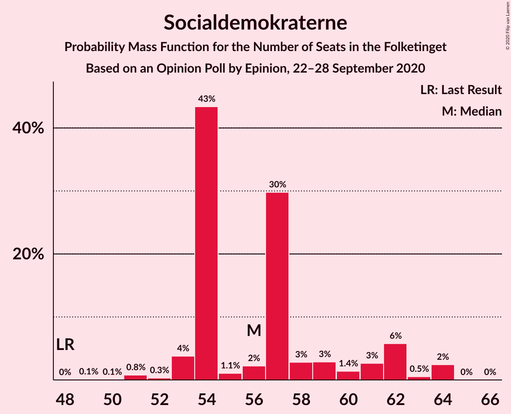
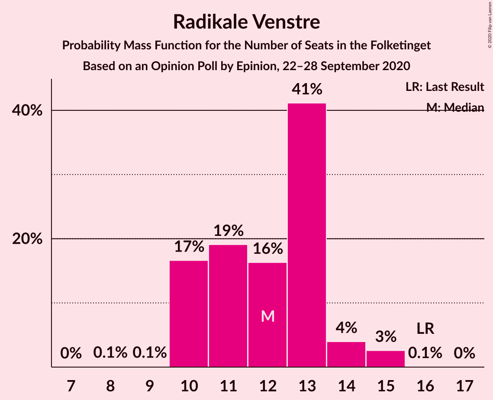
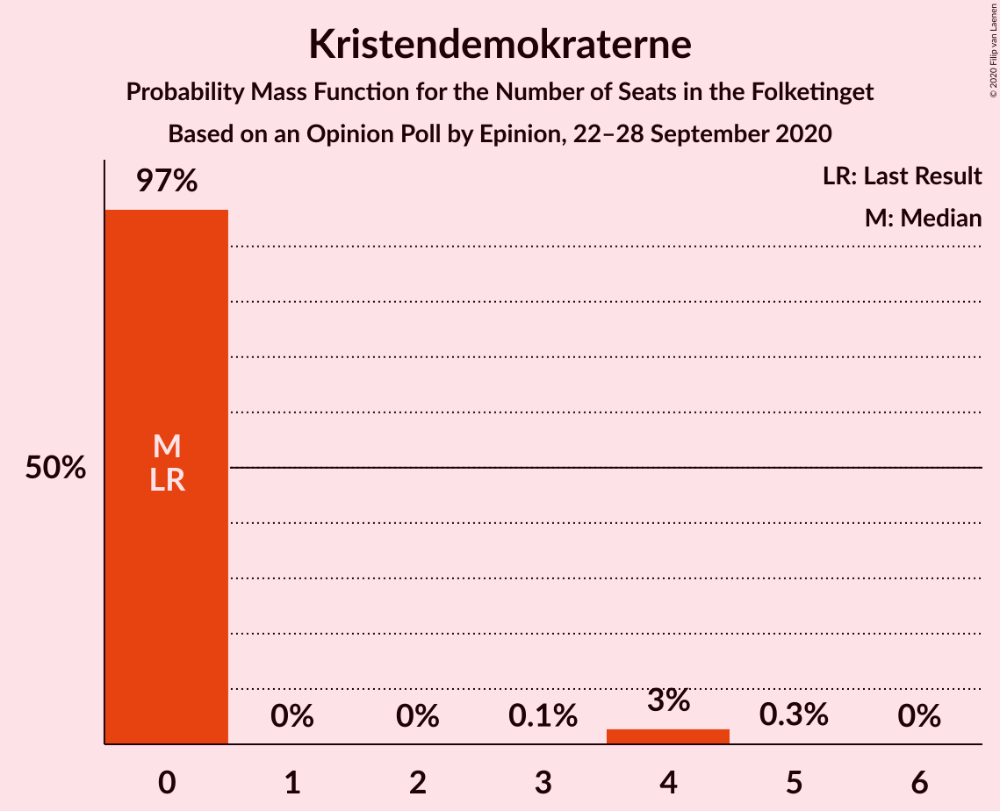
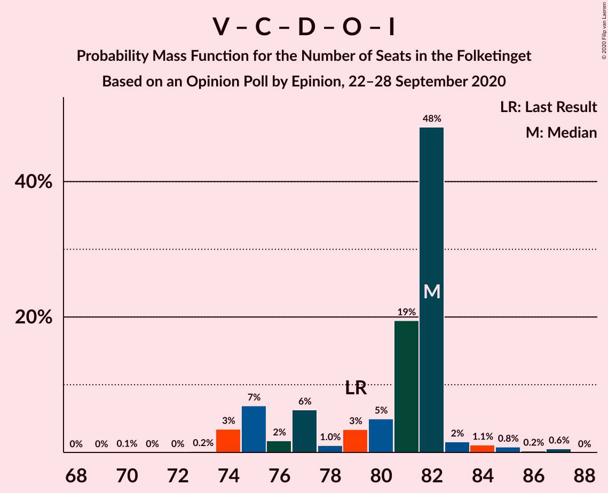
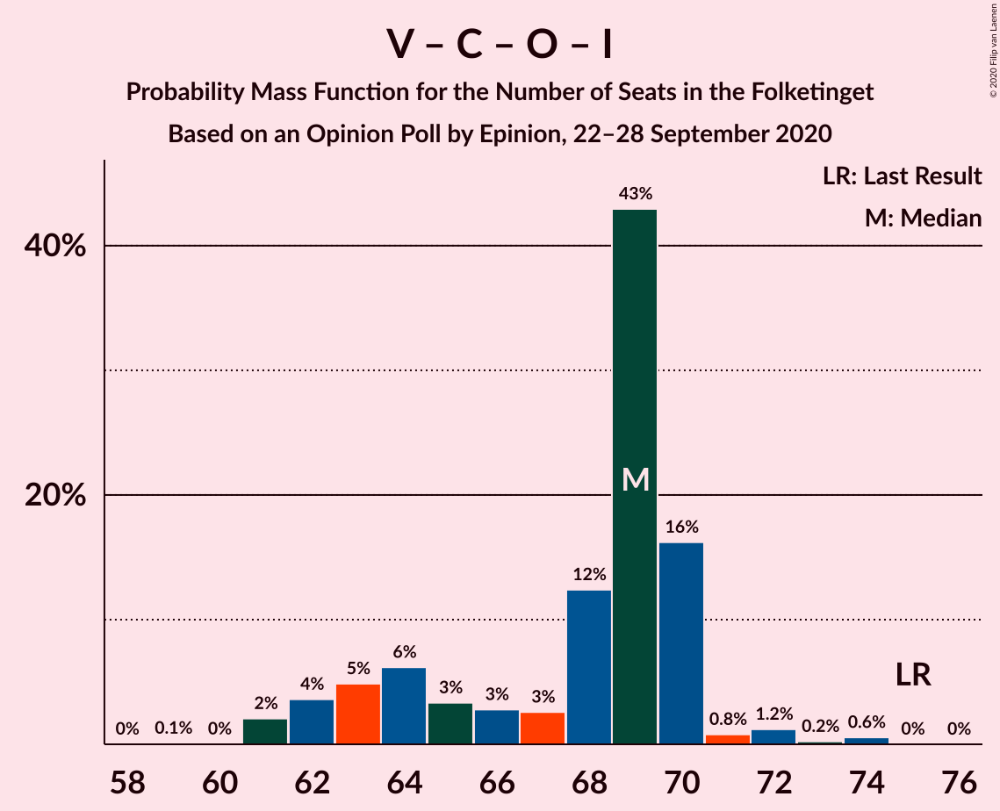
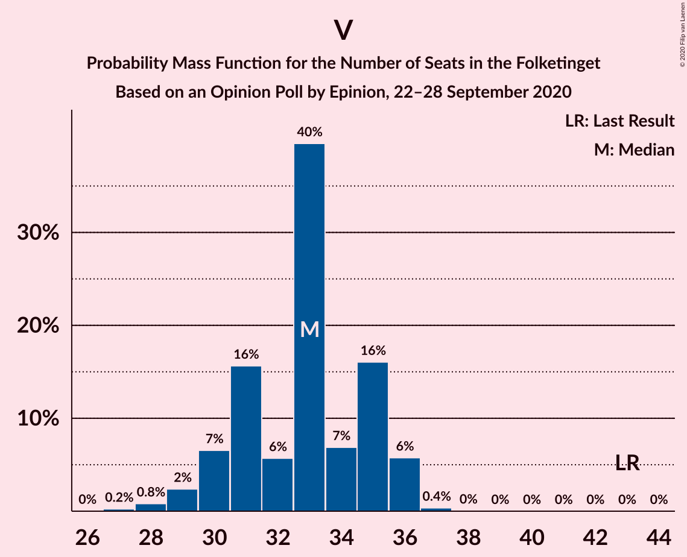

# Opinion Poll by Epinion, 22–28 September 2020

<a href="#voting-intentions">Voting Intentions</a> | <a href="#seats">Seats</a> | <a href="#coalitions">Coalitions</a> | <a href="#technical-information">Technical Information</a>

## Voting Intentions

### Confidence Intervals

| Party | Last Result | Poll Result | 80% Confidence Interval | 90% Confidence Interval | 95% Confidence Interval | 99% Confidence Interval |
|:-----:|:-----------:|:-----------:|:-----------------------:|:-----------------------:|:-----------------------:|:-----------------------:|
| Socialdemokraterne | 25.9% | 31.3% | 29.9–32.8% |29.4–33.2% |29.1–33.6% |28.4–34.3% |
| Venstre | 23.4% | 17.7% | 16.5–18.9% |16.2–19.3% |15.9–19.6% |15.3–20.2% |
| Det Konservative Folkeparti | 6.6% | 10.6% | 9.7–11.7% |9.4–12.0% |9.2–12.2% |8.8–12.7% |
| Enhedslisten–De Rød-Grønne | 6.9% | 7.3% | 6.5–8.2% |6.3–8.5% |6.1–8.7% |5.8–9.1% |
| Nye Borgerlige | 2.4% | 6.9% | 6.1–7.8% |5.9–8.0% |5.7–8.2% |5.4–8.7% |
| Socialistisk Folkeparti | 7.7% | 6.8% | 6.1–7.7% |5.9–7.9% |5.7–8.2% |5.3–8.6% |
| Dansk Folkeparti | 8.7% | 6.6% | 5.9–7.5% |5.7–7.7% |5.5–8.0% |5.2–8.4% |
| Radikale Venstre | 8.6% | 6.6% | 5.9–7.5% |5.7–7.7% |5.5–8.0% |5.2–8.4% |
| Liberal Alliance | 2.3% | 2.1% | 1.7–2.6% |1.6–2.8% |1.5–2.9% |1.3–3.2% |
| Kristendemokraterne | 1.7% | 1.4% | 1.1–1.9% |1.0–2.0% |0.9–2.1% |0.8–2.4% |
| Stram Kurs | 1.8% | 1.0% | 0.7–1.4% |0.7–1.5% |0.6–1.6% |0.5–1.8% |
| Alternativet | 3.0% | 0.6% | 0.4–0.9% |0.4–1.1% |0.3–1.1% |0.3–1.3% |
| Veganerpartiet | 0.0% | 0.3% | 0.2–0.6% |0.2–0.7% |0.1–0.7% |0.1–0.9% |

*Note:* The poll result column reflects the actual value used in the calculations. Published results may vary slightly, and in addition be rounded to fewer digits.

## Seats

### Confidence Intervals

| Party | Last Result | Median | 80% Confidence Interval | 90% Confidence Interval | 95% Confidence Interval | 99% Confidence Interval |
|:-----:|:-----------:|:------:|:-----------------------:|:-----------------------:|:-----------------------:|:-----------------------:|
| <a href="#socialdemokraterne">Socialdemokraterne</a> | 48 | 57 | 54–59 |51–62 |51–62 |51–64 |
| <a href="#venstre">Venstre</a> | 43 | 31 | 29–33 |29–33 |29–33 |28–34 |
| <a href="#det-konservative-folkeparti">Det Konservative Folkeparti</a> | 12 | 20 | 18–23 |17–23 |17–23 |15–23 |
| <a href="#enhedslisten–de-rød-grønne">Enhedslisten–De Rød-Grønne</a> | 13 | 14 | 11–15 |11–16 |11–16 |10–16 |
| <a href="#nye-borgerlige">Nye Borgerlige</a> | 4 | 13 | 11–13 |11–13 |11–14 |11–15 |
| <a href="#socialistisk-folkeparti">Socialistisk Folkeparti</a> | 14 | 12 | 11–14 |11–14 |11–14 |10–14 |
| <a href="#dansk-folkeparti">Dansk Folkeparti</a> | 16 | 13 | 12–15 |11–15 |11–15 |10–15 |
| <a href="#radikale-venstre">Radikale Venstre</a> | 16 | 11 | 11–13 |10–14 |10–14 |10–14 |
| <a href="#liberal-alliance">Liberal Alliance</a> | 4 | 4 | 0–4 |0–5 |0–5 |0–6 |
| <a href="#kristendemokraterne">Kristendemokraterne</a> | 0 | 0 | 0 |0–4 |0–4 |0–4 |
| <a href="#stram-kurs">Stram Kurs</a> | 0 | 0 | 0 |0 |0–4 |0–4 |
| <a href="#alternativet">Alternativet</a> | 5 | 0 | 0 |0 |0 |0 |
| <a href="#veganerpartiet">Veganerpartiet</a> | 0 | 0 | 0 |0 |0 |0 |

### Socialdemokraterne

*For a full overview of the results for this party, see the [Socialdemokraterne](party-socialdemokraterne.html) page.*

| Number of Seats | Probability | Accumulated | Special Marks |
|:---------------:|:-----------:|:-----------:|:-------------:|
| 48 | 0% | 100% | Last Result |
| 49 | 0% | 100% |  |
| 50 | 0% | 100% |  |
| 51 | 9% | 100% |  |
| 52 | 0% | 91% |  |
| 53 | 0.4% | 91% |  |
| 54 | 18% | 90% |  |
| 55 | 2% | 73% |  |
| 56 | 0.5% | 71% |  |
| 57 | 41% | 71% | Median |
| 58 | 9% | 30% |  |
| 59 | 13% | 21% |  |
| 60 | 0.7% | 9% |  |
| 61 | 2% | 8% |  |
| 62 | 4% | 6% |  |
| 63 | 1.4% | 2% |  |
| 64 | 0.4% | 0.6% |  |
| 65 | 0% | 0.2% |  |
| 66 | 0.2% | 0.2% |  |
| 67 | 0% | 0% |  |

### Venstre

*For a full overview of the results for this party, see the [Venstre](party-venstre.html) page.*

| Number of Seats | Probability | Accumulated | Special Marks |
|:---------------:|:-----------:|:-----------:|:-------------:|
| 27 | 0.3% | 100% |  |
| 28 | 0.3% | 99.7% |  |
| 29 | 15% | 99.4% |  |
| 30 | 12% | 84% |  |
| 31 | 43% | 73% | Median |
| 32 | 5% | 29% |  |
| 33 | 24% | 24% |  |
| 34 | 0.2% | 0.5% |  |
| 35 | 0.3% | 0.3% |  |
| 36 | 0% | 0.1% |  |
| 37 | 0% | 0% |  |
| 38 | 0% | 0% |  |
| 39 | 0% | 0% |  |
| 40 | 0% | 0% |  |
| 41 | 0% | 0% |  |
| 42 | 0% | 0% |  |
| 43 | 0% | 0% | Last Result |

### Det Konservative Folkeparti

*For a full overview of the results for this party, see the [Det Konservative Folkeparti](party-detkonservativefolkeparti.html) page.*

| Number of Seats | Probability | Accumulated | Special Marks |
|:---------------:|:-----------:|:-----------:|:-------------:|
| 12 | 0% | 100% | Last Result |
| 13 | 0% | 100% |  |
| 14 | 0% | 100% |  |
| 15 | 0.9% | 100% |  |
| 16 | 0.2% | 99.1% |  |
| 17 | 5% | 98.9% |  |
| 18 | 11% | 94% |  |
| 19 | 13% | 83% |  |
| 20 | 42% | 70% | Median |
| 21 | 1.4% | 28% |  |
| 22 | 13% | 27% |  |
| 23 | 14% | 14% |  |
| 24 | 0% | 0% |  |

### Enhedslisten–De Rød-Grønne

*For a full overview of the results for this party, see the [Enhedslisten–De Rød-Grønne](party-enhedslisten–derød-grønne.html) page.*

| Number of Seats | Probability | Accumulated | Special Marks |
|:---------------:|:-----------:|:-----------:|:-------------:|
| 10 | 0.8% | 100% |  |
| 11 | 12% | 99.2% |  |
| 12 | 4% | 88% |  |
| 13 | 14% | 84% | Last Result |
| 14 | 45% | 70% | Median |
| 15 | 20% | 25% |  |
| 16 | 5% | 5% |  |
| 17 | 0.1% | 0.4% |  |
| 18 | 0% | 0.3% |  |
| 19 | 0.3% | 0.3% |  |
| 20 | 0% | 0% |  |

### Nye Borgerlige

*For a full overview of the results for this party, see the [Nye Borgerlige](party-nyeborgerlige.html) page.*

| Number of Seats | Probability | Accumulated | Special Marks |
|:---------------:|:-----------:|:-----------:|:-------------:|
| 4 | 0% | 100% | Last Result |
| 5 | 0% | 100% |  |
| 6 | 0% | 100% |  |
| 7 | 0% | 100% |  |
| 8 | 0% | 100% |  |
| 9 | 0.1% | 100% |  |
| 10 | 0.2% | 99.9% |  |
| 11 | 19% | 99.7% |  |
| 12 | 3% | 80% |  |
| 13 | 73% | 77% | Median |
| 14 | 2% | 4% |  |
| 15 | 2% | 2% |  |
| 16 | 0.3% | 0.4% |  |
| 17 | 0.1% | 0.1% |  |
| 18 | 0% | 0% |  |

### Socialistisk Folkeparti

*For a full overview of the results for this party, see the [Socialistisk Folkeparti](party-socialistiskfolkeparti.html) page.*

| Number of Seats | Probability | Accumulated | Special Marks |
|:---------------:|:-----------:|:-----------:|:-------------:|
| 9 | 0.1% | 100% |  |
| 10 | 0.8% | 99.9% |  |
| 11 | 20% | 99.1% |  |
| 12 | 48% | 79% | Median |
| 13 | 15% | 30% |  |
| 14 | 15% | 15% | Last Result |
| 15 | 0.3% | 0.4% |  |
| 16 | 0% | 0% |  |

### Dansk Folkeparti

*For a full overview of the results for this party, see the [Dansk Folkeparti](party-danskfolkeparti.html) page.*

| Number of Seats | Probability | Accumulated | Special Marks |
|:---------------:|:-----------:|:-----------:|:-------------:|
| 10 | 2% | 100% |  |
| 11 | 4% | 98% |  |
| 12 | 7% | 93% |  |
| 13 | 38% | 87% | Median |
| 14 | 35% | 48% |  |
| 15 | 13% | 13% |  |
| 16 | 0.1% | 0.1% | Last Result |
| 17 | 0% | 0% |  |

### Radikale Venstre

*For a full overview of the results for this party, see the [Radikale Venstre](party-radikalevenstre.html) page.*

| Number of Seats | Probability | Accumulated | Special Marks |
|:---------------:|:-----------:|:-----------:|:-------------:|
| 9 | 0.1% | 100% |  |
| 10 | 5% | 99.9% |  |
| 11 | 63% | 95% | Median |
| 12 | 21% | 32% |  |
| 13 | 2% | 11% |  |
| 14 | 8% | 9% |  |
| 15 | 0.2% | 0.3% |  |
| 16 | 0.1% | 0.1% | Last Result |
| 17 | 0% | 0% |  |

### Liberal Alliance

*For a full overview of the results for this party, see the [Liberal Alliance](party-liberalalliance.html) page.*

| Number of Seats | Probability | Accumulated | Special Marks |
|:---------------:|:-----------:|:-----------:|:-------------:|
| 0 | 22% | 100% |  |
| 1 | 0% | 78% |  |
| 2 | 0% | 78% |  |
| 3 | 0% | 78% |  |
| 4 | 72% | 78% | Last Result, Median |
| 5 | 6% | 6% |  |
| 6 | 0.6% | 0.7% |  |
| 7 | 0% | 0% |  |

### Kristendemokraterne

*For a full overview of the results for this party, see the [Kristendemokraterne](party-kristendemokraterne.html) page.*

| Number of Seats | Probability | Accumulated | Special Marks |
|:---------------:|:-----------:|:-----------:|:-------------:|
| 0 | 91% | 100% | Last Result, Median |
| 1 | 0% | 9% |  |
| 2 | 0% | 9% |  |
| 3 | 0% | 9% |  |
| 4 | 9% | 9% |  |
| 5 | 0% | 0% |  |

### Stram Kurs

*For a full overview of the results for this party, see the [Stram Kurs](party-stramkurs.html) page.*

| Number of Seats | Probability | Accumulated | Special Marks |
|:---------------:|:-----------:|:-----------:|:-------------:|
| 0 | 97% | 100% | Last Result, Median |
| 1 | 0% | 3% |  |
| 2 | 0% | 3% |  |
| 3 | 0% | 3% |  |
| 4 | 3% | 3% |  |
| 5 | 0% | 0% |  |

### Alternativet

*For a full overview of the results for this party, see the [Alternativet](party-alternativet.html) page.*

| Number of Seats | Probability | Accumulated | Special Marks |
|:---------------:|:-----------:|:-----------:|:-------------:|
| 0 | 100% | 100% | Median |
| 1 | 0% | 0% |  |
| 2 | 0% | 0% |  |
| 3 | 0% | 0% |  |
| 4 | 0% | 0% |  |
| 5 | 0% | 0% | Last Result |

### Veganerpartiet

*For a full overview of the results for this party, see the [Veganerpartiet](party-veganerpartiet.html) page.*

| Number of Seats | Probability | Accumulated | Special Marks |
|:---------------:|:-----------:|:-----------:|:-------------:|
| 0 | 100% | 100% | Last Result, Median |

## Coalitions

### Confidence Intervals

| Coalition | Last Result | Median | Majority? | 80% Confidence Interval | 90% Confidence Interval | 95% Confidence Interval | 99% Confidence Interval |
|:---------:|:-----------:|:------:|:---------:|:-----------------------:|:-----------------------:|:-----------------------:|:-----------------------:|
| Socialdemokraterne – Enhedslisten–De Rød-Grønne – Socialistisk Folkeparti – Radikale Venstre – Alternativet | 96 | 94 | 91% | 91–99 | 88–99 | 88–99 | 88–102 |
| Socialdemokraterne – Enhedslisten–De Rød-Grønne – Socialistisk Folkeparti – Radikale Venstre | 91 | 94 | 91% | 91–99 | 88–99 | 88–99 | 88–102 |
| Socialdemokraterne – Socialistisk Folkeparti – Radikale Venstre | 78 | 80 | 0.2% | 76–83 | 74–87 | 74–88 | 74–88 |
| Socialdemokraterne – Enhedslisten–De Rød-Grønne – Socialistisk Folkeparti – Alternativet | 80 | 83 | 0.9% | 79–87 | 76–87 | 76–87 | 76–91 |
| Venstre – Det Konservative Folkeparti – Nye Borgerlige – Dansk Folkeparti – Liberal Alliance – Kristendemokraterne | 79 | 81 | 0% | 76–83 | 76–87 | 76–87 | 73–87 |
| Venstre – Det Konservative Folkeparti – Nye Borgerlige – Dansk Folkeparti – Liberal Alliance | 79 | 81 | 0% | 76–83 | 76–87 | 76–87 | 73–87 |
| Socialdemokraterne – Enhedslisten–De Rød-Grønne – Socialistisk Folkeparti | 75 | 83 | 0.9% | 79–87 | 76–87 | 76–87 | 76–91 |
| Socialdemokraterne – Radikale Venstre | 64 | 68 | 0% | 64–71 | 63–74 | 63–76 | 63–76 |
| Venstre – Det Konservative Folkeparti – Dansk Folkeparti – Liberal Alliance – Kristendemokraterne | 75 | 68 | 0% | 65–70 | 65–74 | 62–74 | 61–74 |
| Venstre – Det Konservative Folkeparti – Dansk Folkeparti – Liberal Alliance | 75 | 68 | 0% | 65–70 | 64–74 | 62–74 | 61–74 |
| Venstre – Det Konservative Folkeparti – Liberal Alliance | 59 | 55 | 0% | 52–57 | 51–59 | 50–59 | 49–59 |
| Venstre – Det Konservative Folkeparti | 55 | 51 | 0% | 48–53 | 48–55 | 48–55 | 46–55 |
| Venstre | 43 | 31 | 0% | 29–33 | 29–33 | 29–33 | 28–34 |

### Socialdemokraterne – Enhedslisten–De Rød-Grønne – Socialistisk Folkeparti – Radikale Venstre – Alternativet

| Number of Seats | Probability | Accumulated | Special Marks |
|:---------------:|:-----------:|:-----------:|:-------------:|
| 88 | 7% | 100% |  |
| 89 | 2% | 93% |  |
| 90 | 0.2% | 91% | Majority |
| 91 | 4% | 90% |  |
| 92 | 23% | 87% |  |
| 93 | 0.9% | 64% |  |
| 94 | 37% | 63% | Median |
| 95 | 0.2% | 26% |  |
| 96 | 0.2% | 26% | Last Result |
| 97 | 2% | 26% |  |
| 98 | 13% | 24% |  |
| 99 | 8% | 10% |  |
| 100 | 0.9% | 2% |  |
| 101 | 0.4% | 1.0% |  |
| 102 | 0.3% | 0.5% |  |
| 103 | 0% | 0.2% |  |
| 104 | 0.2% | 0.2% |  |
| 105 | 0% | 0% |  |

### Socialdemokraterne – Enhedslisten–De Rød-Grønne – Socialistisk Folkeparti – Radikale Venstre

| Number of Seats | Probability | Accumulated | Special Marks |
|:---------------:|:-----------:|:-----------:|:-------------:|
| 88 | 7% | 100% |  |
| 89 | 2% | 93% |  |
| 90 | 0.2% | 91% | Majority |
| 91 | 4% | 90% | Last Result |
| 92 | 23% | 87% |  |
| 93 | 0.9% | 64% |  |
| 94 | 37% | 63% | Median |
| 95 | 0.2% | 26% |  |
| 96 | 0.2% | 26% |  |
| 97 | 2% | 26% |  |
| 98 | 13% | 24% |  |
| 99 | 8% | 10% |  |
| 100 | 0.9% | 2% |  |
| 101 | 0.4% | 1.0% |  |
| 102 | 0.3% | 0.5% |  |
| 103 | 0% | 0.2% |  |
| 104 | 0.2% | 0.2% |  |
| 105 | 0% | 0% |  |

### Socialdemokraterne – Socialistisk Folkeparti – Radikale Venstre

| Number of Seats | Probability | Accumulated | Special Marks |
|:---------------:|:-----------:|:-----------:|:-------------:|
| 74 | 9% | 100% |  |
| 75 | 0.2% | 91% |  |
| 76 | 4% | 90% |  |
| 77 | 0% | 87% |  |
| 78 | 0.5% | 87% | Last Result |
| 79 | 14% | 86% |  |
| 80 | 37% | 72% | Median |
| 81 | 10% | 35% |  |
| 82 | 0.4% | 26% |  |
| 83 | 16% | 25% |  |
| 84 | 1.5% | 10% |  |
| 85 | 2% | 8% |  |
| 86 | 1.1% | 6% |  |
| 87 | 2% | 5% |  |
| 88 | 3% | 3% |  |
| 89 | 0% | 0.2% |  |
| 90 | 0.2% | 0.2% | Majority |
| 91 | 0% | 0% |  |

### Socialdemokraterne – Enhedslisten–De Rød-Grønne – Socialistisk Folkeparti – Alternativet

| Number of Seats | Probability | Accumulated | Special Marks |
|:---------------:|:-----------:|:-----------:|:-------------:|
| 76 | 7% | 100% |  |
| 77 | 2% | 93% |  |
| 78 | 0.2% | 91% |  |
| 79 | 0.6% | 90% |  |
| 80 | 9% | 90% | Last Result |
| 81 | 17% | 81% |  |
| 82 | 0.2% | 64% |  |
| 83 | 39% | 64% | Median |
| 84 | 1.3% | 25% |  |
| 85 | 7% | 24% |  |
| 86 | 3% | 17% |  |
| 87 | 12% | 14% |  |
| 88 | 1.1% | 2% |  |
| 89 | 0.1% | 0.9% |  |
| 90 | 0.3% | 0.9% | Majority |
| 91 | 0.4% | 0.5% |  |
| 92 | 0% | 0.2% |  |
| 93 | 0% | 0.2% |  |
| 94 | 0.2% | 0.2% |  |
| 95 | 0% | 0% |  |

### Venstre – Det Konservative Folkeparti – Nye Borgerlige – Dansk Folkeparti – Liberal Alliance – Kristendemokraterne

| Number of Seats | Probability | Accumulated | Special Marks |
|:---------------:|:-----------:|:-----------:|:-------------:|
| 71 | 0.2% | 100% |  |
| 72 | 0% | 99.8% |  |
| 73 | 0.3% | 99.8% |  |
| 74 | 0.4% | 99.5% |  |
| 75 | 0.9% | 99.0% |  |
| 76 | 8% | 98% |  |
| 77 | 13% | 90% |  |
| 78 | 2% | 76% |  |
| 79 | 0.2% | 74% | Last Result |
| 80 | 4% | 74% |  |
| 81 | 37% | 70% | Median |
| 82 | 0.9% | 33% |  |
| 83 | 23% | 32% |  |
| 84 | 0.1% | 10% |  |
| 85 | 0.2% | 10% |  |
| 86 | 2% | 9% |  |
| 87 | 7% | 7% |  |
| 88 | 0% | 0% |  |

### Venstre – Det Konservative Folkeparti – Nye Borgerlige – Dansk Folkeparti – Liberal Alliance

| Number of Seats | Probability | Accumulated | Special Marks |
|:---------------:|:-----------:|:-----------:|:-------------:|
| 71 | 0.2% | 100% |  |
| 72 | 0.1% | 99.8% |  |
| 73 | 0.3% | 99.8% |  |
| 74 | 0.5% | 99.4% |  |
| 75 | 0.9% | 99.0% |  |
| 76 | 8% | 98% |  |
| 77 | 14% | 90% |  |
| 78 | 2% | 76% |  |
| 79 | 9% | 74% | Last Result |
| 80 | 4% | 65% |  |
| 81 | 37% | 62% | Median |
| 82 | 0.9% | 25% |  |
| 83 | 14% | 24% |  |
| 84 | 0.1% | 10% |  |
| 85 | 0.2% | 10% |  |
| 86 | 2% | 9% |  |
| 87 | 7% | 7% |  |
| 88 | 0% | 0% |  |

### Socialdemokraterne – Enhedslisten–De Rød-Grønne – Socialistisk Folkeparti

| Number of Seats | Probability | Accumulated | Special Marks |
|:---------------:|:-----------:|:-----------:|:-------------:|
| 75 | 0% | 100% | Last Result |
| 76 | 7% | 100% |  |
| 77 | 2% | 93% |  |
| 78 | 0.2% | 91% |  |
| 79 | 0.6% | 90% |  |
| 80 | 9% | 90% |  |
| 81 | 17% | 81% |  |
| 82 | 0.2% | 64% |  |
| 83 | 39% | 64% | Median |
| 84 | 1.3% | 25% |  |
| 85 | 7% | 24% |  |
| 86 | 3% | 17% |  |
| 87 | 12% | 14% |  |
| 88 | 1.1% | 2% |  |
| 89 | 0.1% | 0.9% |  |
| 90 | 0.3% | 0.9% | Majority |
| 91 | 0.4% | 0.5% |  |
| 92 | 0% | 0.2% |  |
| 93 | 0% | 0.2% |  |
| 94 | 0.2% | 0.2% |  |
| 95 | 0% | 0% |  |

### Socialdemokraterne – Radikale Venstre

| Number of Seats | Probability | Accumulated | Special Marks |
|:---------------:|:-----------:|:-----------:|:-------------:|
| 63 | 9% | 100% |  |
| 64 | 3% | 91% | Last Result |
| 65 | 14% | 87% |  |
| 66 | 0.8% | 73% |  |
| 67 | 0.2% | 72% |  |
| 68 | 37% | 72% | Median |
| 69 | 1.5% | 35% |  |
| 70 | 21% | 34% |  |
| 71 | 5% | 13% |  |
| 72 | 0.7% | 8% |  |
| 73 | 2% | 8% |  |
| 74 | 1.3% | 6% |  |
| 75 | 0% | 5% |  |
| 76 | 5% | 5% |  |
| 77 | 0% | 0% |  |

### Venstre – Det Konservative Folkeparti – Dansk Folkeparti – Liberal Alliance – Kristendemokraterne

| Number of Seats | Probability | Accumulated | Special Marks |
|:---------------:|:-----------:|:-----------:|:-------------:|
| 60 | 0.2% | 100% |  |
| 61 | 2% | 99.8% |  |
| 62 | 1.3% | 98% |  |
| 63 | 0.3% | 96% |  |
| 64 | 1.1% | 96% |  |
| 65 | 7% | 95% |  |
| 66 | 13% | 88% |  |
| 67 | 5% | 75% |  |
| 68 | 37% | 70% | Median |
| 69 | 0.8% | 33% |  |
| 70 | 22% | 32% |  |
| 71 | 0.1% | 10% |  |
| 72 | 0.1% | 10% |  |
| 73 | 2% | 9% |  |
| 74 | 7% | 7% |  |
| 75 | 0% | 0% | Last Result |

### Venstre – Det Konservative Folkeparti – Dansk Folkeparti – Liberal Alliance

| Number of Seats | Probability | Accumulated | Special Marks |
|:---------------:|:-----------:|:-----------:|:-------------:|
| 60 | 0.2% | 100% |  |
| 61 | 2% | 99.8% |  |
| 62 | 1.3% | 98% |  |
| 63 | 0.4% | 96% |  |
| 64 | 1.1% | 96% |  |
| 65 | 7% | 95% |  |
| 66 | 22% | 88% |  |
| 67 | 4% | 66% |  |
| 68 | 37% | 61% | Median |
| 69 | 0.8% | 24% |  |
| 70 | 14% | 24% |  |
| 71 | 0.1% | 10% |  |
| 72 | 0.1% | 9% |  |
| 73 | 2% | 9% |  |
| 74 | 7% | 7% |  |
| 75 | 0% | 0% | Last Result |

### Venstre – Det Konservative Folkeparti – Liberal Alliance

| Number of Seats | Probability | Accumulated | Special Marks |
|:---------------:|:-----------:|:-----------:|:-------------:|
| 48 | 0.2% | 100% |  |
| 49 | 0.3% | 99.8% |  |
| 50 | 4% | 99.4% |  |
| 51 | 4% | 95% |  |
| 52 | 21% | 91% |  |
| 53 | 4% | 71% |  |
| 54 | 1.0% | 67% |  |
| 55 | 37% | 66% | Median |
| 56 | 18% | 28% |  |
| 57 | 0.4% | 10% |  |
| 58 | 2% | 10% |  |
| 59 | 7% | 7% | Last Result |
| 60 | 0% | 0.1% |  |
| 61 | 0% | 0.1% |  |
| 62 | 0% | 0% |  |

### Venstre – Det Konservative Folkeparti

| Number of Seats | Probability | Accumulated | Special Marks |
|:---------------:|:-----------:|:-----------:|:-------------:|
| 46 | 1.2% | 100% |  |
| 47 | 1.0% | 98.8% |  |
| 48 | 10% | 98% |  |
| 49 | 0.7% | 88% |  |
| 50 | 4% | 87% |  |
| 51 | 40% | 82% | Median |
| 52 | 30% | 43% |  |
| 53 | 5% | 13% |  |
| 54 | 0.1% | 8% |  |
| 55 | 7% | 8% | Last Result |
| 56 | 0.3% | 0.3% |  |
| 57 | 0% | 0% |  |

### Venstre

| Number of Seats | Probability | Accumulated | Special Marks |
|:---------------:|:-----------:|:-----------:|:-------------:|
| 27 | 0.3% | 100% |  |
| 28 | 0.3% | 99.7% |  |
| 29 | 15% | 99.4% |  |
| 30 | 12% | 84% |  |
| 31 | 43% | 73% | Median |
| 32 | 5% | 29% |  |
| 33 | 24% | 24% |  |
| 34 | 0.2% | 0.5% |  |
| 35 | 0.3% | 0.3% |  |
| 36 | 0% | 0.1% |  |
| 37 | 0% | 0% |  |
| 38 | 0% | 0% |  |
| 39 | 0% | 0% |  |
| 40 | 0% | 0% |  |
| 41 | 0% | 0% |  |
| 42 | 0% | 0% |  |
| 43 | 0% | 0% | Last Result |

## Technical Information

### Opinion Poll

+ **Polling firm:** Epinion
+ **Commissioner(s):** —
+ **Fieldwork period:** 22–28 September 2020

### Calculations

+ **Sample size:** 1629
+ **Simulations done:** 131,072
+ **Error estimate:** 1.60%

