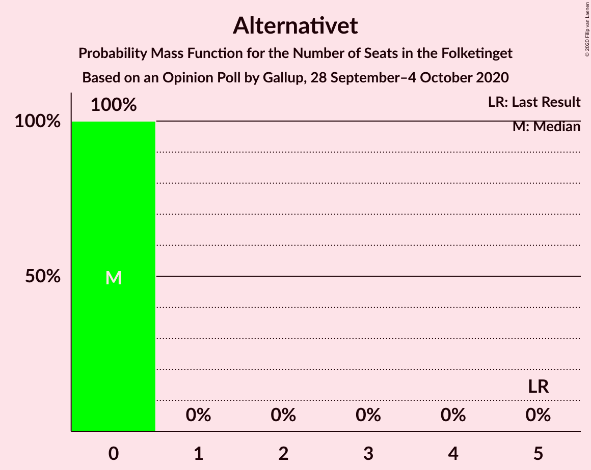
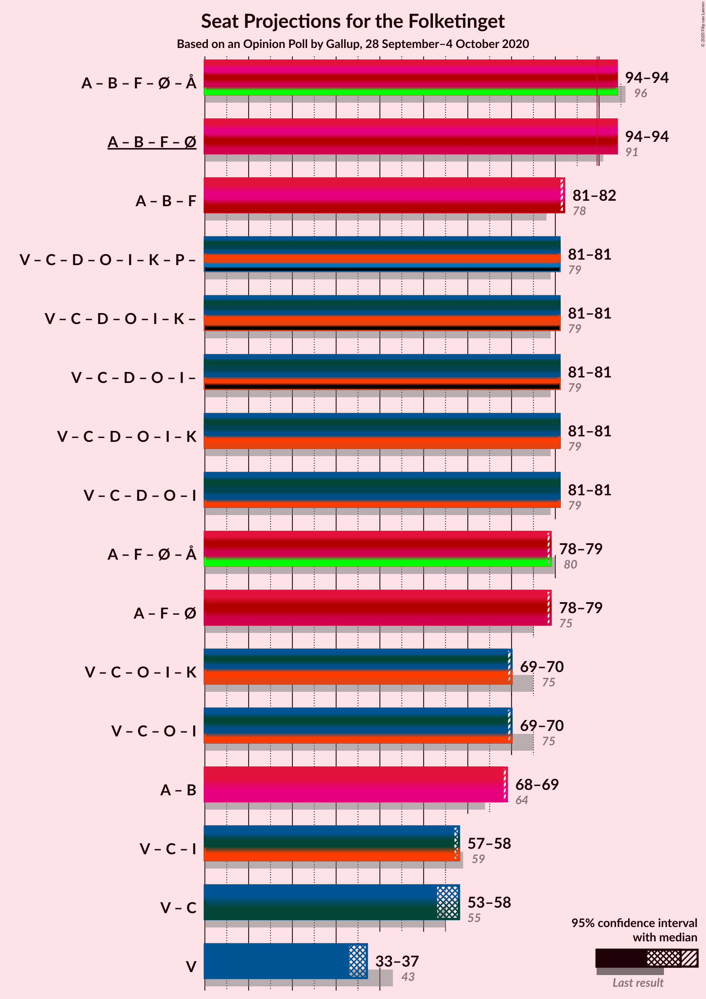
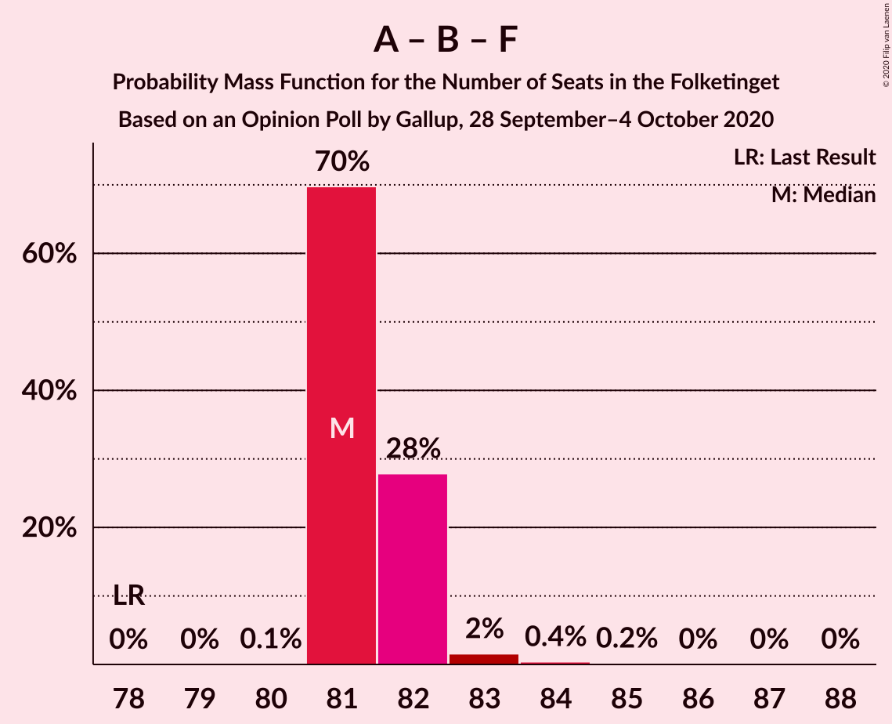

# Opinion Poll by Gallup, 28 September–4 October 2020

<a href="#voting-intentions">Voting Intentions</a> | <a href="#seats">Seats</a> | <a href="#coalitions">Coalitions</a> | <a href="#technical-information">Technical Information</a>

## Voting Intentions

### Confidence Intervals

| Party | Last Result | Poll Result | 80% Confidence Interval | 90% Confidence Interval | 95% Confidence Interval | 99% Confidence Interval |
|:-----:|:-----------:|:-----------:|:-----------------------:|:-----------------------:|:-----------------------:|:-----------------------:|
| Socialdemokraterne | 25.9% | 29.4% | 28.2–30.7% |27.8–31.1% |27.5–31.4% |26.9–32.1% |
| Venstre | 23.4% | 19.1% | 18.0–20.3% |17.7–20.6% |17.5–20.9% |16.9–21.4% |
| Det Konservative Folkeparti | 6.6% | 10.4% | 9.6–11.3% |9.4–11.6% |9.2–11.8% |8.8–12.3% |
| Radikale Venstre | 8.6% | 8.3% | 7.6–9.1% |7.4–9.4% |7.2–9.6% |6.8–10.0% |
| Socialistisk Folkeparti | 7.7% | 7.1% | 6.4–7.9% |6.2–8.1% |6.1–8.3% |5.7–8.7% |
| Enhedslisten–De Rød-Grønne | 6.9% | 6.7% | 6.0–7.5% |5.8–7.7% |5.7–7.9% |5.4–8.2% |
| Nye Borgerlige | 2.4% | 6.7% | 6.0–7.5% |5.8–7.7% |5.7–7.9% |5.4–8.2% |
| Dansk Folkeparti | 8.7% | 6.2% | 5.6–7.0% |5.4–7.2% |5.2–7.3% |5.0–7.7% |
| Liberal Alliance | 2.3% | 2.1% | 1.7–2.6% |1.6–2.7% |1.6–2.8% |1.4–3.1% |
| Kristendemokraterne | 1.7% | 1.6% | 1.3–2.0% |1.2–2.2% |1.1–2.3% |1.0–2.5% |
| Alternativet | 3.0% | 0.9% | 0.7–1.2% |0.6–1.3% |0.5–1.4% |0.5–1.6% |
| Veganerpartiet | 0.0% | 0.7% | 0.5–1.0% |0.4–1.1% |0.4–1.2% |0.3–1.3% |
| Stram Kurs | 1.8% | 0.6% | 0.4–0.9% |0.4–1.0% |0.3–1.0% |0.3–1.2% |
| Borgerlisten | 0.8% | 0.1% | 0.0–0.3% |0.0–0.3% |0.0–0.4% |0.0–0.5% |

*Note:* The poll result column reflects the actual value used in the calculations. Published results may vary slightly, and in addition be rounded to fewer digits.

## Seats

### Confidence Intervals

| Party | Last Result | Median | 80% Confidence Interval | 90% Confidence Interval | 95% Confidence Interval | 99% Confidence Interval |
|:-----:|:-----------:|:------:|:-----------------------:|:-----------------------:|:-----------------------:|:-----------------------:|
| <a href="#socialdemokraterne">Socialdemokraterne</a> | 48 | 52 | 52–53 |52–53 |52–53 |52–55 |
| <a href="#venstre">Venstre</a> | 43 | 37 | 33–37 |33–37 |33–37 |33–37 |
| <a href="#det-konservative-folkeparti">Det Konservative Folkeparti</a> | 12 | 21 | 20–21 |20–21 |20–21 |18–21 |
| <a href="#radikale-venstre">Radikale Venstre</a> | 16 | 16 | 15–16 |15–16 |15–16 |15–17 |
| <a href="#socialistisk-folkeparti">Socialistisk Folkeparti</a> | 14 | 13 | 13–14 |13–14 |13–14 |12–14 |
| <a href="#enhedslisten–de-rød-grønne">Enhedslisten–De Rød-Grønne</a> | 13 | 13 | 12–13 |12–13 |12–13 |10–13 |
| <a href="#nye-borgerlige">Nye Borgerlige</a> | 4 | 12 | 11–12 |11–12 |11–12 |11–13 |
| <a href="#dansk-folkeparti">Dansk Folkeparti</a> | 16 | 11 | 11–13 |11–13 |11–13 |11–13 |
| <a href="#liberal-alliance">Liberal Alliance</a> | 4 | 0 | 0–4 |0–4 |0–4 |0–5 |
| <a href="#kristendemokraterne">Kristendemokraterne</a> | 0 | 0 | 0 |0 |0 |0 |
| <a href="#alternativet">Alternativet</a> | 5 | 0 | 0 |0 |0 |0 |
| <a href="#veganerpartiet">Veganerpartiet</a> | 0 | 0 | 0 |0 |0 |0 |
| <a href="#stram-kurs">Stram Kurs</a> | 0 | 0 | 0 |0 |0 |0 |
| <a href="#borgerlisten">Borgerlisten</a> | 0 | 0 | 0 |0 |0 |0 |

### Socialdemokraterne

*For a full overview of the results for this party, see the [Socialdemokraterne](party-socialdemokraterne.html) page.*

| Number of Seats | Probability | Accumulated | Special Marks |
|:---------------:|:-----------:|:-----------:|:-------------:|
| 48 | 0% | 100% | Last Result |
| 49 | 0% | 100% |  |
| 50 | 0% | 100% |  |
| 51 | 0% | 99.9% |  |
| 52 | 70% | 99.9% | Median |
| 53 | 28% | 30% |  |
| 54 | 2% | 2% |  |
| 55 | 0% | 0.5% |  |
| 56 | 0% | 0.5% |  |
| 57 | 0.4% | 0.4% |  |
| 58 | 0% | 0.1% |  |
| 59 | 0% | 0% |  |

### Venstre

*For a full overview of the results for this party, see the [Venstre](party-venstre.html) page.*

| Number of Seats | Probability | Accumulated | Special Marks |
|:---------------:|:-----------:|:-----------:|:-------------:|
| 32 | 0.2% | 100% |  |
| 33 | 29% | 99.8% |  |
| 34 | 0% | 70% |  |
| 35 | 0.3% | 70% |  |
| 36 | 0.3% | 70% |  |
| 37 | 70% | 70% | Median |
| 38 | 0% | 0% |  |
| 39 | 0% | 0% |  |
| 40 | 0% | 0% |  |
| 41 | 0% | 0% |  |
| 42 | 0% | 0% |  |
| 43 | 0% | 0% | Last Result |

### Det Konservative Folkeparti

*For a full overview of the results for this party, see the [Det Konservative Folkeparti](party-detkonservativefolkeparti.html) page.*

| Number of Seats | Probability | Accumulated | Special Marks |
|:---------------:|:-----------:|:-----------:|:-------------:|
| 12 | 0% | 100% | Last Result |
| 13 | 0% | 100% |  |
| 14 | 0% | 100% |  |
| 15 | 0% | 100% |  |
| 16 | 0.2% | 100% |  |
| 17 | 0% | 99.8% |  |
| 18 | 0.5% | 99.8% |  |
| 19 | 2% | 99.3% |  |
| 20 | 28% | 98% |  |
| 21 | 70% | 70% | Median |
| 22 | 0% | 0% |  |

### Radikale Venstre

*For a full overview of the results for this party, see the [Radikale Venstre](party-radikalevenstre.html) page.*

| Number of Seats | Probability | Accumulated | Special Marks |
|:---------------:|:-----------:|:-----------:|:-------------:|
| 14 | 0% | 100% |  |
| 15 | 28% | 99.9% |  |
| 16 | 71% | 72% | Last Result, Median |
| 17 | 0.6% | 0.7% |  |
| 18 | 0% | 0.1% |  |
| 19 | 0% | 0% |  |

### Socialistisk Folkeparti

*For a full overview of the results for this party, see the [Socialistisk Folkeparti](party-socialistiskfolkeparti.html) page.*

| Number of Seats | Probability | Accumulated | Special Marks |
|:---------------:|:-----------:|:-----------:|:-------------:|
| 10 | 0.2% | 100% |  |
| 11 | 0.1% | 99.8% |  |
| 12 | 0.3% | 99.7% |  |
| 13 | 71% | 99.3% | Median |
| 14 | 28% | 28% | Last Result |
| 15 | 0.1% | 0.1% |  |
| 16 | 0% | 0% |  |

### Enhedslisten–De Rød-Grønne

*For a full overview of the results for this party, see the [Enhedslisten–De Rød-Grønne](party-enhedslisten–derød-grønne.html) page.*

| Number of Seats | Probability | Accumulated | Special Marks |
|:---------------:|:-----------:|:-----------:|:-------------:|
| 10 | 2% | 100% |  |
| 11 | 0.3% | 98% |  |
| 12 | 28% | 98% |  |
| 13 | 70% | 70% | Last Result, Median |
| 14 | 0.1% | 0.1% |  |
| 15 | 0% | 0% |  |

### Nye Borgerlige

*For a full overview of the results for this party, see the [Nye Borgerlige](party-nyeborgerlige.html) page.*

| Number of Seats | Probability | Accumulated | Special Marks |
|:---------------:|:-----------:|:-----------:|:-------------:|
| 4 | 0% | 100% | Last Result |
| 5 | 0% | 100% |  |
| 6 | 0% | 100% |  |
| 7 | 0% | 100% |  |
| 8 | 0% | 100% |  |
| 9 | 0% | 100% |  |
| 10 | 0.4% | 100% |  |
| 11 | 28% | 99.6% |  |
| 12 | 70% | 72% | Median |
| 13 | 2% | 2% |  |
| 14 | 0.1% | 0.2% |  |
| 15 | 0% | 0% |  |

### Dansk Folkeparti

*For a full overview of the results for this party, see the [Dansk Folkeparti](party-danskfolkeparti.html) page.*

| Number of Seats | Probability | Accumulated | Special Marks |
|:---------------:|:-----------:|:-----------:|:-------------:|
| 10 | 0.2% | 100% |  |
| 11 | 70% | 99.8% | Median |
| 12 | 2% | 30% |  |
| 13 | 28% | 28% |  |
| 14 | 0% | 0% |  |
| 15 | 0% | 0% |  |
| 16 | 0% | 0% | Last Result |

### Liberal Alliance

*For a full overview of the results for this party, see the [Liberal Alliance](party-liberalalliance.html) page.*

| Number of Seats | Probability | Accumulated | Special Marks |
|:---------------:|:-----------:|:-----------:|:-------------:|
| 0 | 70% | 100% | Median |
| 1 | 0% | 30% |  |
| 2 | 0% | 30% |  |
| 3 | 0% | 30% |  |
| 4 | 29% | 30% | Last Result |
| 5 | 2% | 2% |  |
| 6 | 0% | 0% |  |

### Kristendemokraterne

*For a full overview of the results for this party, see the [Kristendemokraterne](party-kristendemokraterne.html) page.*

| Number of Seats | Probability | Accumulated | Special Marks |
|:---------------:|:-----------:|:-----------:|:-------------:|
| 0 | 99.8% | 100% | Last Result, Median |
| 1 | 0% | 0.2% |  |
| 2 | 0% | 0.2% |  |
| 3 | 0% | 0.2% |  |
| 4 | 0.2% | 0.2% |  |
| 5 | 0% | 0% |  |

### Alternativet

*For a full overview of the results for this party, see the [Alternativet](party-alternativet.html) page.*

| Number of Seats | Probability | Accumulated | Special Marks |
|:---------------:|:-----------:|:-----------:|:-------------:|
| 0 | 100% | 100% | Median |
| 1 | 0% | 0% |  |
| 2 | 0% | 0% |  |
| 3 | 0% | 0% |  |
| 4 | 0% | 0% |  |
| 5 | 0% | 0% | Last Result |

### Veganerpartiet

*For a full overview of the results for this party, see the [Veganerpartiet](party-veganerpartiet.html) page.*

| Number of Seats | Probability | Accumulated | Special Marks |
|:---------------:|:-----------:|:-----------:|:-------------:|
| 0 | 100% | 100% | Last Result, Median |

### Stram Kurs

*For a full overview of the results for this party, see the [Stram Kurs](party-stramkurs.html) page.*

| Number of Seats | Probability | Accumulated | Special Marks |
|:---------------:|:-----------:|:-----------:|:-------------:|
| 0 | 100% | 100% | Last Result, Median |

### Borgerlisten

*For a full overview of the results for this party, see the [Borgerlisten](party-borgerlisten.html) page.*

| Number of Seats | Probability | Accumulated | Special Marks |
|:---------------:|:-----------:|:-----------:|:-------------:|
| 0 | 100% | 100% | Last Result, Median |

## Coalitions

### Confidence Intervals

| Coalition | Last Result | Median | Majority? | 80% Confidence Interval | 90% Confidence Interval | 95% Confidence Interval | 99% Confidence Interval |
|:---------:|:-----------:|:------:|:---------:|:-----------------------:|:-----------------------:|:-----------------------:|:-----------------------:|
| Socialdemokraterne – Radikale Venstre – Socialistisk Folkeparti – Enhedslisten–De Rød-Grønne – Alternativet | 96 | 94 | 100% | 94 | 94 | 94 | 93–96 |
| Socialdemokraterne – Radikale Venstre – Socialistisk Folkeparti – Enhedslisten–De Rød-Grønne | 91 | 94 | 100% | 94 | 94 | 94 | 93–96 |
| Socialdemokraterne – Radikale Venstre – Socialistisk Folkeparti | 78 | 81 | 0% | 81–82 | 81–82 | 81–82 | 81–84 |
| Venstre – Det Konservative Folkeparti – Nye Borgerlige – Dansk Folkeparti – Liberal Alliance – Kristendemokraterne | 79 | 81 | 0% | 81 | 81 | 81 | 79–82 |
| Venstre – Det Konservative Folkeparti – Nye Borgerlige – Dansk Folkeparti – Liberal Alliance | 79 | 81 | 0% | 81 | 81 | 81 | 79–82 |
| Socialdemokraterne – Socialistisk Folkeparti – Enhedslisten–De Rød-Grønne – Alternativet | 80 | 78 | 0% | 78–79 | 78–79 | 78–79 | 77–79 |
| Socialdemokraterne – Socialistisk Folkeparti – Enhedslisten–De Rød-Grønne | 75 | 78 | 0% | 78–79 | 78–79 | 78–79 | 77–79 |
| Venstre – Det Konservative Folkeparti – Dansk Folkeparti – Liberal Alliance – Kristendemokraterne | 75 | 69 | 0% | 69–70 | 69–70 | 69–70 | 69–70 |
| Venstre – Det Konservative Folkeparti – Dansk Folkeparti – Liberal Alliance | 75 | 69 | 0% | 69–70 | 69–70 | 69–70 | 67–70 |
| Socialdemokraterne – Radikale Venstre | 64 | 68 | 0% | 68 | 68 | 68–69 | 68–71 |
| Venstre – Det Konservative Folkeparti – Liberal Alliance | 59 | 58 | 0% | 57–58 | 57–58 | 57–58 | 56–58 |
| Venstre – Det Konservative Folkeparti | 55 | 58 | 0% | 53–58 | 53–58 | 53–58 | 52–58 |
| Venstre | 43 | 37 | 0% | 33–37 | 33–37 | 33–37 | 33–37 |

### Socialdemokraterne – Radikale Venstre – Socialistisk Folkeparti – Enhedslisten–De Rød-Grønne – Alternativet

| Number of Seats | Probability | Accumulated | Special Marks |
|:---------------:|:-----------:|:-----------:|:-------------:|
| 91 | 0.2% | 100% |  |
| 92 | 0.1% | 99.8% |  |
| 93 | 2% | 99.7% |  |
| 94 | 97% | 98% | Median |
| 95 | 0.3% | 0.8% |  |
| 96 | 0.3% | 0.5% | Last Result |
| 97 | 0.2% | 0.3% |  |
| 98 | 0% | 0.1% |  |
| 99 | 0% | 0.1% |  |
| 100 | 0.1% | 0.1% |  |
| 101 | 0% | 0% |  |

### Socialdemokraterne – Radikale Venstre – Socialistisk Folkeparti – Enhedslisten–De Rød-Grønne

| Number of Seats | Probability | Accumulated | Special Marks |
|:---------------:|:-----------:|:-----------:|:-------------:|
| 91 | 0.2% | 100% | Last Result |
| 92 | 0.1% | 99.8% |  |
| 93 | 2% | 99.7% |  |
| 94 | 97% | 98% | Median |
| 95 | 0.3% | 0.8% |  |
| 96 | 0.3% | 0.5% |  |
| 97 | 0.2% | 0.3% |  |
| 98 | 0% | 0.1% |  |
| 99 | 0% | 0.1% |  |
| 100 | 0.1% | 0.1% |  |
| 101 | 0% | 0% |  |

### Socialdemokraterne – Radikale Venstre – Socialistisk Folkeparti

| Number of Seats | Probability | Accumulated | Special Marks |
|:---------------:|:-----------:|:-----------:|:-------------:|
| 78 | 0% | 100% | Last Result |
| 79 | 0% | 100% |  |
| 80 | 0.1% | 99.9% |  |
| 81 | 70% | 99.9% | Median |
| 82 | 28% | 30% |  |
| 83 | 2% | 2% |  |
| 84 | 0.4% | 0.7% |  |
| 85 | 0.2% | 0.3% |  |
| 86 | 0% | 0.1% |  |
| 87 | 0% | 0.1% |  |
| 88 | 0% | 0% |  |

### Venstre – Det Konservative Folkeparti – Nye Borgerlige – Dansk Folkeparti – Liberal Alliance – Kristendemokraterne

| Number of Seats | Probability | Accumulated | Special Marks |
|:---------------:|:-----------:|:-----------:|:-------------:|
| 75 | 0.1% | 100% |  |
| 76 | 0% | 99.9% |  |
| 77 | 0% | 99.9% |  |
| 78 | 0.2% | 99.9% |  |
| 79 | 0.3% | 99.7% | Last Result |
| 80 | 0.3% | 99.5% |  |
| 81 | 97% | 99.2% | Median |
| 82 | 2% | 2% |  |
| 83 | 0.1% | 0.3% |  |
| 84 | 0.2% | 0.2% |  |
| 85 | 0% | 0% |  |

### Venstre – Det Konservative Folkeparti – Nye Borgerlige – Dansk Folkeparti – Liberal Alliance

| Number of Seats | Probability | Accumulated | Special Marks |
|:---------------:|:-----------:|:-----------:|:-------------:|
| 75 | 0.1% | 100% |  |
| 76 | 0% | 99.9% |  |
| 77 | 0% | 99.9% |  |
| 78 | 0.2% | 99.9% |  |
| 79 | 0.3% | 99.7% | Last Result |
| 80 | 0.4% | 99.4% |  |
| 81 | 97% | 99.0% | Median |
| 82 | 1.5% | 2% |  |
| 83 | 0.1% | 0.2% |  |
| 84 | 0.1% | 0.1% |  |
| 85 | 0% | 0% |  |

### Socialdemokraterne – Socialistisk Folkeparti – Enhedslisten–De Rød-Grønne – Alternativet

| Number of Seats | Probability | Accumulated | Special Marks |
|:---------------:|:-----------:|:-----------:|:-------------:|
| 74 | 0.1% | 100% |  |
| 75 | 0.2% | 99.9% |  |
| 76 | 0.1% | 99.7% |  |
| 77 | 2% | 99.7% |  |
| 78 | 70% | 98% | Median |
| 79 | 28% | 28% |  |
| 80 | 0.1% | 0.4% | Last Result |
| 81 | 0.2% | 0.3% |  |
| 82 | 0% | 0.1% |  |
| 83 | 0% | 0% |  |

### Socialdemokraterne – Socialistisk Folkeparti – Enhedslisten–De Rød-Grønne

| Number of Seats | Probability | Accumulated | Special Marks |
|:---------------:|:-----------:|:-----------:|:-------------:|
| 74 | 0.1% | 100% |  |
| 75 | 0.2% | 99.9% | Last Result |
| 76 | 0.1% | 99.7% |  |
| 77 | 2% | 99.7% |  |
| 78 | 70% | 98% | Median |
| 79 | 28% | 28% |  |
| 80 | 0.1% | 0.4% |  |
| 81 | 0.2% | 0.3% |  |
| 82 | 0% | 0.1% |  |
| 83 | 0% | 0% |  |

### Venstre – Det Konservative Folkeparti – Dansk Folkeparti – Liberal Alliance – Kristendemokraterne

| Number of Seats | Probability | Accumulated | Special Marks |
|:---------------:|:-----------:|:-----------:|:-------------:|
| 64 | 0.1% | 100% |  |
| 65 | 0.2% | 99.9% |  |
| 66 | 0% | 99.7% |  |
| 67 | 0% | 99.7% |  |
| 68 | 0% | 99.7% |  |
| 69 | 71% | 99.6% | Median |
| 70 | 28% | 28% |  |
| 71 | 0.1% | 0.2% |  |
| 72 | 0% | 0% |  |
| 73 | 0% | 0% |  |
| 74 | 0% | 0% |  |
| 75 | 0% | 0% | Last Result |

### Venstre – Det Konservative Folkeparti – Dansk Folkeparti – Liberal Alliance

| Number of Seats | Probability | Accumulated | Special Marks |
|:---------------:|:-----------:|:-----------:|:-------------:|
| 64 | 0.1% | 100% |  |
| 65 | 0.2% | 99.9% |  |
| 66 | 0.1% | 99.7% |  |
| 67 | 0.1% | 99.6% |  |
| 68 | 0% | 99.5% |  |
| 69 | 71% | 99.5% | Median |
| 70 | 28% | 28% |  |
| 71 | 0% | 0% |  |
| 72 | 0% | 0% |  |
| 73 | 0% | 0% |  |
| 74 | 0% | 0% |  |
| 75 | 0% | 0% | Last Result |

### Socialdemokraterne – Radikale Venstre

| Number of Seats | Probability | Accumulated | Special Marks |
|:---------------:|:-----------:|:-----------:|:-------------:|
| 64 | 0% | 100% | Last Result |
| 65 | 0% | 100% |  |
| 66 | 0% | 100% |  |
| 67 | 0.1% | 100% |  |
| 68 | 97% | 99.9% | Median |
| 69 | 0.2% | 3% |  |
| 70 | 2% | 2% |  |
| 71 | 0.3% | 0.7% |  |
| 72 | 0% | 0.5% |  |
| 73 | 0.2% | 0.4% |  |
| 74 | 0.2% | 0.2% |  |
| 75 | 0% | 0% |  |

### Venstre – Det Konservative Folkeparti – Liberal Alliance

| Number of Seats | Probability | Accumulated | Special Marks |
|:---------------:|:-----------:|:-----------:|:-------------:|
| 52 | 0.2% | 100% |  |
| 53 | 0.1% | 99.8% |  |
| 54 | 0% | 99.7% |  |
| 55 | 0.1% | 99.6% |  |
| 56 | 0% | 99.5% |  |
| 57 | 29% | 99.5% |  |
| 58 | 70% | 70% | Median |
| 59 | 0.1% | 0.2% | Last Result |
| 60 | 0.1% | 0.2% |  |
| 61 | 0% | 0% |  |

### Venstre – Det Konservative Folkeparti

| Number of Seats | Probability | Accumulated | Special Marks |
|:---------------:|:-----------:|:-----------:|:-------------:|
| 48 | 0.2% | 100% |  |
| 49 | 0% | 99.8% |  |
| 50 | 0% | 99.8% |  |
| 51 | 0% | 99.8% |  |
| 52 | 2% | 99.8% |  |
| 53 | 28% | 98% |  |
| 54 | 0.2% | 70% |  |
| 55 | 0.2% | 70% | Last Result |
| 56 | 0.1% | 70% |  |
| 57 | 0% | 70% |  |
| 58 | 70% | 70% | Median |
| 59 | 0% | 0% |  |

### Venstre

| Number of Seats | Probability | Accumulated | Special Marks |
|:---------------:|:-----------:|:-----------:|:-------------:|
| 32 | 0.2% | 100% |  |
| 33 | 29% | 99.8% |  |
| 34 | 0% | 70% |  |
| 35 | 0.3% | 70% |  |
| 36 | 0.3% | 70% |  |
| 37 | 70% | 70% | Median |
| 38 | 0% | 0% |  |
| 39 | 0% | 0% |  |
| 40 | 0% | 0% |  |
| 41 | 0% | 0% |  |
| 42 | 0% | 0% |  |
| 43 | 0% | 0% | Last Result |

## Technical Information

### Opinion Poll

+ **Polling firm:** Gallup
+ **Commissioner(s):** —
+ **Fieldwork period:** 28 September–4 October 2020

### Calculations

+ **Sample size:** 2046
+ **Simulations done:** 1,048,576
+ **Error estimate:** 1.97%

