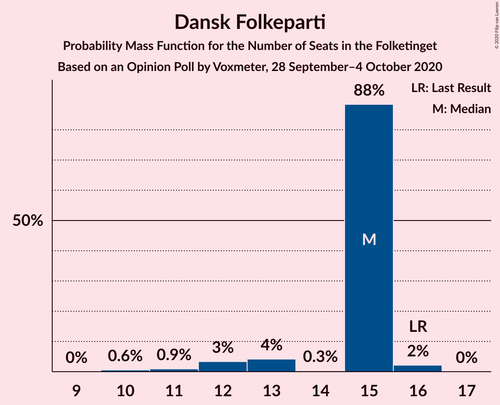
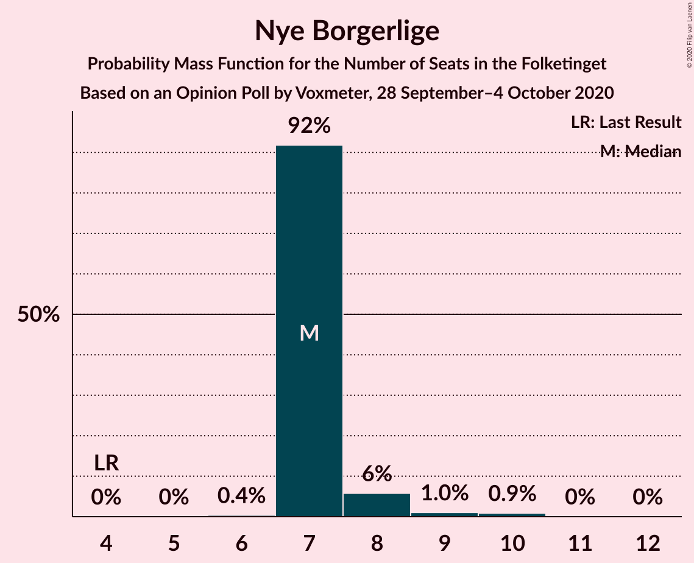

# Opinion Poll by Voxmeter, 28 September–4 October 2020

<a href="#voting-intentions">Voting Intentions</a> | <a href="#seats">Seats</a> | <a href="#coalitions">Coalitions</a> | <a href="#technical-information">Technical Information</a>

## Voting Intentions

### Confidence Intervals

| Party | Last Result | Poll Result | 80% Confidence Interval | 90% Confidence Interval | 95% Confidence Interval | 99% Confidence Interval |
|:-----:|:-----------:|:-----------:|:-----------------------:|:-----------------------:|:-----------------------:|:-----------------------:|
| Socialdemokraterne | 25.9% | 32.2% | 30.7–33.7% |30.3–34.1% |29.9–34.5% |29.2–35.2% |
| Venstre | 23.4% | 18.5% | 17.3–19.8% |16.9–20.1% |16.7–20.4% |16.1–21.1% |
| Det Konservative Folkeparti | 6.6% | 9.0% | 8.1–9.9% |7.9–10.2% |7.7–10.5% |7.3–10.9% |
| Radikale Venstre | 8.6% | 8.5% | 7.6–9.4% |7.4–9.7% |7.2–9.9% |6.8–10.4% |
| Socialistisk Folkeparti | 7.7% | 8.2% | 7.3–9.1% |7.1–9.4% |6.9–9.6% |6.6–10.1% |
| Dansk Folkeparti | 8.7% | 7.1% | 6.3–7.9% |6.1–8.2% |5.9–8.4% |5.6–8.9% |
| Enhedslisten–De Rød-Grønne | 6.9% | 6.4% | 5.7–7.3% |5.5–7.5% |5.3–7.8% |5.0–8.2% |
| Nye Borgerlige | 2.4% | 4.3% | 3.7–5.0% |3.6–5.2% |3.4–5.4% |3.2–5.8% |
| Liberal Alliance | 2.3% | 2.4% | 2.0–3.0% |1.8–3.1% |1.8–3.3% |1.6–3.6% |
| Kristendemokraterne | 1.7% | 1.5% | 1.1–1.9% |1.1–2.1% |1.0–2.2% |0.9–2.4% |
| Alternativet | 3.0% | 0.9% | 0.7–1.3% |0.6–1.4% |0.5–1.5% |0.5–1.7% |
| Veganerpartiet | 0.0% | 0.4% | 0.2–0.7% |0.2–0.7% |0.2–0.8% |0.1–1.0% |
| Stram Kurs | 1.8% | 0.1% | 0.1–0.3% |0.0–0.4% |0.0–0.5% |0.0–0.6% |

*Note:* The poll result column reflects the actual value used in the calculations. Published results may vary slightly, and in addition be rounded to fewer digits.

## Seats

### Confidence Intervals

| Party | Last Result | Median | 80% Confidence Interval | 90% Confidence Interval | 95% Confidence Interval | 99% Confidence Interval |
|:-----:|:-----------:|:------:|:-----------------------:|:-----------------------:|:-----------------------:|:-----------------------:|
| <a href="#socialdemokraterne">Socialdemokraterne</a> | 48 | 57 | 57 |57–59 |56–61 |54–63 |
| <a href="#venstre">Venstre</a> | 43 | 33 | 33 |32–34 |32–35 |30–36 |
| <a href="#det-konservative-folkeparti">Det Konservative Folkeparti</a> | 12 | 18 | 17–18 |15–18 |15–18 |14–20 |
| <a href="#radikale-venstre">Radikale Venstre</a> | 16 | 14 | 14 |13–15 |13–16 |12–18 |
| <a href="#socialistisk-folkeparti">Socialistisk Folkeparti</a> | 14 | 15 | 15 |14–15 |14–17 |13–18 |
| <a href="#dansk-folkeparti">Dansk Folkeparti</a> | 16 | 15 | 15 |13–15 |12–15 |10–16 |
| <a href="#enhedslisten–de-rød-grønne">Enhedslisten–De Rød-Grønne</a> | 13 | 12 | 12 |12–13 |10–14 |10–14 |
| <a href="#nye-borgerlige">Nye Borgerlige</a> | 4 | 7 | 7 |7–8 |7–8 |7–10 |
| <a href="#liberal-alliance">Liberal Alliance</a> | 4 | 4 | 4 |4–5 |4–5 |0–6 |
| <a href="#kristendemokraterne">Kristendemokraterne</a> | 0 | 0 | 0 |0 |0 |0–4 |
| <a href="#alternativet">Alternativet</a> | 5 | 0 | 0 |0 |0 |0 |
| <a href="#veganerpartiet">Veganerpartiet</a> | 0 | 0 | 0 |0 |0 |0 |
| <a href="#stram-kurs">Stram Kurs</a> | 0 | 0 | 0 |0 |0 |0 |

### Socialdemokraterne

*For a full overview of the results for this party, see the [Socialdemokraterne](party-socialdemokraterne.html) page.*

| Number of Seats | Probability | Accumulated | Special Marks |
|:---------------:|:-----------:|:-----------:|:-------------:|
| 48 | 0% | 100% | Last Result |
| 49 | 0% | 100% |  |
| 50 | 0% | 100% |  |
| 51 | 0% | 100% |  |
| 52 | 0% | 100% |  |
| 53 | 0.1% | 100% |  |
| 54 | 0.7% | 99.8% |  |
| 55 | 1.3% | 99.1% |  |
| 56 | 3% | 98% |  |
| 57 | 87% | 95% | Median |
| 58 | 2% | 8% |  |
| 59 | 0.9% | 6% |  |
| 60 | 2% | 5% |  |
| 61 | 0.5% | 3% |  |
| 62 | 0.5% | 2% |  |
| 63 | 2% | 2% |  |
| 64 | 0.1% | 0.2% |  |
| 65 | 0% | 0.1% |  |
| 66 | 0% | 0.1% |  |
| 67 | 0% | 0% |  |

### Venstre

*For a full overview of the results for this party, see the [Venstre](party-venstre.html) page.*

| Number of Seats | Probability | Accumulated | Special Marks |
|:---------------:|:-----------:|:-----------:|:-------------:|
| 27 | 0.1% | 100% |  |
| 28 | 0.1% | 99.9% |  |
| 29 | 0.1% | 99.8% |  |
| 30 | 0.6% | 99.7% |  |
| 31 | 0.7% | 99.1% |  |
| 32 | 4% | 98% |  |
| 33 | 88% | 95% | Median |
| 34 | 4% | 7% |  |
| 35 | 2% | 3% |  |
| 36 | 0.9% | 1.2% |  |
| 37 | 0.1% | 0.3% |  |
| 38 | 0.1% | 0.2% |  |
| 39 | 0.1% | 0.1% |  |
| 40 | 0% | 0% |  |
| 41 | 0% | 0% |  |
| 42 | 0% | 0% |  |
| 43 | 0% | 0% | Last Result |

### Det Konservative Folkeparti

*For a full overview of the results for this party, see the [Det Konservative Folkeparti](party-detkonservativefolkeparti.html) page.*

| Number of Seats | Probability | Accumulated | Special Marks |
|:---------------:|:-----------:|:-----------:|:-------------:|
| 12 | 0% | 100% | Last Result |
| 13 | 0.1% | 100% |  |
| 14 | 0.8% | 99.9% |  |
| 15 | 4% | 99.0% |  |
| 16 | 2% | 95% |  |
| 17 | 4% | 93% |  |
| 18 | 88% | 89% | Median |
| 19 | 0.1% | 0.7% |  |
| 20 | 0.5% | 0.6% |  |
| 21 | 0.1% | 0.1% |  |
| 22 | 0% | 0% |  |

### Radikale Venstre

*For a full overview of the results for this party, see the [Radikale Venstre](party-radikalevenstre.html) page.*

| Number of Seats | Probability | Accumulated | Special Marks |
|:---------------:|:-----------:|:-----------:|:-------------:|
| 12 | 2% | 100% |  |
| 13 | 4% | 98% |  |
| 14 | 87% | 94% | Median |
| 15 | 3% | 7% |  |
| 16 | 3% | 4% | Last Result |
| 17 | 0.5% | 1.2% |  |
| 18 | 0.4% | 0.7% |  |
| 19 | 0.3% | 0.3% |  |
| 20 | 0% | 0% |  |

### Socialistisk Folkeparti

*For a full overview of the results for this party, see the [Socialistisk Folkeparti](party-socialistiskfolkeparti.html) page.*

| Number of Seats | Probability | Accumulated | Special Marks |
|:---------------:|:-----------:|:-----------:|:-------------:|
| 11 | 0.1% | 100% |  |
| 12 | 0.3% | 99.9% |  |
| 13 | 0.7% | 99.6% |  |
| 14 | 5% | 98.9% | Last Result |
| 15 | 89% | 94% | Median |
| 16 | 1.0% | 4% |  |
| 17 | 2% | 3% |  |
| 18 | 0.9% | 1.0% |  |
| 19 | 0.1% | 0.1% |  |
| 20 | 0% | 0% |  |

### Dansk Folkeparti

*For a full overview of the results for this party, see the [Dansk Folkeparti](party-danskfolkeparti.html) page.*

| Number of Seats | Probability | Accumulated | Special Marks |
|:---------------:|:-----------:|:-----------:|:-------------:|
| 10 | 0.6% | 100% |  |
| 11 | 0.9% | 99.4% |  |
| 12 | 3% | 98% |  |
| 13 | 4% | 95% |  |
| 14 | 0.3% | 91% |  |
| 15 | 88% | 91% | Median |
| 16 | 2% | 2% | Last Result |
| 17 | 0% | 0% |  |

### Enhedslisten–De Rød-Grønne

*For a full overview of the results for this party, see the [Enhedslisten–De Rød-Grønne](party-enhedslisten–derød-grønne.html) page.*

| Number of Seats | Probability | Accumulated | Special Marks |
|:---------------:|:-----------:|:-----------:|:-------------:|
| 9 | 0.4% | 100% |  |
| 10 | 3% | 99.6% |  |
| 11 | 1.1% | 97% |  |
| 12 | 89% | 96% | Median |
| 13 | 3% | 6% | Last Result |
| 14 | 3% | 3% |  |
| 15 | 0% | 0.1% |  |
| 16 | 0% | 0% |  |

### Nye Borgerlige

*For a full overview of the results for this party, see the [Nye Borgerlige](party-nyeborgerlige.html) page.*

| Number of Seats | Probability | Accumulated | Special Marks |
|:---------------:|:-----------:|:-----------:|:-------------:|
| 4 | 0% | 100% | Last Result |
| 5 | 0% | 100% |  |
| 6 | 0.4% | 100% |  |
| 7 | 92% | 99.6% | Median |
| 8 | 6% | 8% |  |
| 9 | 1.0% | 2% |  |
| 10 | 0.9% | 0.9% |  |
| 11 | 0% | 0.1% |  |
| 12 | 0% | 0% |  |

### Liberal Alliance

*For a full overview of the results for this party, see the [Liberal Alliance](party-liberalalliance.html) page.*

| Number of Seats | Probability | Accumulated | Special Marks |
|:---------------:|:-----------:|:-----------:|:-------------:|
| 0 | 1.0% | 100% |  |
| 1 | 0% | 99.0% |  |
| 2 | 0% | 99.0% |  |
| 3 | 0% | 99.0% |  |
| 4 | 93% | 99.0% | Last Result, Median |
| 5 | 5% | 6% |  |
| 6 | 0.9% | 1.0% |  |
| 7 | 0.1% | 0.1% |  |
| 8 | 0% | 0% |  |

### Kristendemokraterne

*For a full overview of the results for this party, see the [Kristendemokraterne](party-kristendemokraterne.html) page.*

| Number of Seats | Probability | Accumulated | Special Marks |
|:---------------:|:-----------:|:-----------:|:-------------:|
| 0 | 98.7% | 100% | Last Result, Median |
| 1 | 0% | 1.3% |  |
| 2 | 0% | 1.3% |  |
| 3 | 0% | 1.3% |  |
| 4 | 1.3% | 1.3% |  |
| 5 | 0% | 0% |  |

### Alternativet

*For a full overview of the results for this party, see the [Alternativet](party-alternativet.html) page.*

| Number of Seats | Probability | Accumulated | Special Marks |
|:---------------:|:-----------:|:-----------:|:-------------:|
| 0 | 100% | 100% | Median |
| 1 | 0% | 0% |  |
| 2 | 0% | 0% |  |
| 3 | 0% | 0% |  |
| 4 | 0% | 0% |  |
| 5 | 0% | 0% | Last Result |

### Veganerpartiet

*For a full overview of the results for this party, see the [Veganerpartiet](party-veganerpartiet.html) page.*

| Number of Seats | Probability | Accumulated | Special Marks |
|:---------------:|:-----------:|:-----------:|:-------------:|
| 0 | 100% | 100% | Last Result, Median |

### Stram Kurs

*For a full overview of the results for this party, see the [Stram Kurs](party-stramkurs.html) page.*

| Number of Seats | Probability | Accumulated | Special Marks |
|:---------------:|:-----------:|:-----------:|:-------------:|
| 0 | 100% | 100% | Last Result, Median |

## Coalitions

### Confidence Intervals

| Coalition | Last Result | Median | Majority? | 80% Confidence Interval | 90% Confidence Interval | 95% Confidence Interval | 99% Confidence Interval |
|:---------:|:-----------:|:------:|:---------:|:-----------------------:|:-----------------------:|:-----------------------:|:-----------------------:|
| Socialdemokraterne – Radikale Venstre – Socialistisk Folkeparti – Enhedslisten–De Rød-Grønne – Alternativet | 96 | 98 | 100% | 98–99 | 98–100 | 98–103 | 94–105 |
| Socialdemokraterne – Radikale Venstre – Socialistisk Folkeparti – Enhedslisten–De Rød-Grønne | 91 | 98 | 100% | 98–99 | 98–100 | 98–103 | 94–105 |
| Socialdemokraterne – Radikale Venstre – Socialistisk Folkeparti | 78 | 86 | 4% | 86 | 86–89 | 85–90 | 83–92 |
| Socialdemokraterne – Socialistisk Folkeparti – Enhedslisten–De Rød-Grønne – Alternativet | 80 | 84 | 2% | 84 | 84–86 | 83–88 | 80–90 |
| Socialdemokraterne – Socialistisk Folkeparti – Enhedslisten–De Rød-Grønne | 75 | 84 | 2% | 84 | 84–86 | 83–88 | 80–90 |
| Venstre – Det Konservative Folkeparti – Dansk Folkeparti – Nye Borgerlige – Liberal Alliance – Kristendemokraterne | 79 | 77 | 0% | 76–77 | 75–77 | 72–77 | 70–81 |
| Venstre – Det Konservative Folkeparti – Dansk Folkeparti – Nye Borgerlige – Liberal Alliance | 79 | 77 | 0% | 76–77 | 74–77 | 72–77 | 68–80 |
| Socialdemokraterne – Radikale Venstre | 64 | 71 | 0% | 71 | 71–73 | 71–76 | 69–77 |
| Venstre – Det Konservative Folkeparti – Dansk Folkeparti – Liberal Alliance – Kristendemokraterne | 75 | 70 | 0% | 69–70 | 67–70 | 64–70 | 62–72 |
| Venstre – Det Konservative Folkeparti – Dansk Folkeparti – Liberal Alliance | 75 | 70 | 0% | 69–70 | 67–70 | 64–70 | 61–72 |
| Venstre – Det Konservative Folkeparti – Liberal Alliance | 59 | 55 | 0% | 55 | 53–55 | 52–56 | 48–59 |
| Venstre – Det Konservative Folkeparti | 55 | 51 | 0% | 51 | 49–51 | 47–51 | 45–53 |
| Venstre | 43 | 33 | 0% | 33 | 32–34 | 32–35 | 30–36 |

### Socialdemokraterne – Radikale Venstre – Socialistisk Folkeparti – Enhedslisten–De Rød-Grønne – Alternativet

| Number of Seats | Probability | Accumulated | Special Marks |
|:---------------:|:-----------:|:-----------:|:-------------:|
| 92 | 0.1% | 100% |  |
| 93 | 0.2% | 99.9% |  |
| 94 | 0.4% | 99.8% |  |
| 95 | 0.5% | 99.3% |  |
| 96 | 0.3% | 98.8% | Last Result |
| 97 | 0.4% | 98.5% |  |
| 98 | 87% | 98% | Median |
| 99 | 6% | 11% |  |
| 100 | 0.6% | 5% |  |
| 101 | 1.3% | 5% |  |
| 102 | 0.7% | 4% |  |
| 103 | 2% | 3% |  |
| 104 | 0.1% | 0.7% |  |
| 105 | 0.5% | 0.6% |  |
| 106 | 0.1% | 0.2% |  |
| 107 | 0% | 0.1% |  |
| 108 | 0.1% | 0.1% |  |
| 109 | 0% | 0% |  |

### Socialdemokraterne – Radikale Venstre – Socialistisk Folkeparti – Enhedslisten–De Rød-Grønne

| Number of Seats | Probability | Accumulated | Special Marks |
|:---------------:|:-----------:|:-----------:|:-------------:|
| 91 | 0% | 100% | Last Result |
| 92 | 0.1% | 100% |  |
| 93 | 0.2% | 99.9% |  |
| 94 | 0.4% | 99.8% |  |
| 95 | 0.5% | 99.3% |  |
| 96 | 0.3% | 98.8% |  |
| 97 | 0.4% | 98.5% |  |
| 98 | 87% | 98% | Median |
| 99 | 6% | 11% |  |
| 100 | 0.6% | 5% |  |
| 101 | 1.2% | 5% |  |
| 102 | 0.7% | 4% |  |
| 103 | 2% | 3% |  |
| 104 | 0.1% | 0.7% |  |
| 105 | 0.5% | 0.6% |  |
| 106 | 0.1% | 0.2% |  |
| 107 | 0% | 0.1% |  |
| 108 | 0.1% | 0.1% |  |
| 109 | 0% | 0% |  |

### Socialdemokraterne – Radikale Venstre – Socialistisk Folkeparti

| Number of Seats | Probability | Accumulated | Special Marks |
|:---------------:|:-----------:|:-----------:|:-------------:|
| 78 | 0% | 100% | Last Result |
| 79 | 0% | 100% |  |
| 80 | 0% | 100% |  |
| 81 | 0.3% | 100% |  |
| 82 | 0.1% | 99.7% |  |
| 83 | 0.4% | 99.6% |  |
| 84 | 0.3% | 99.2% |  |
| 85 | 2% | 98.9% |  |
| 86 | 87% | 96% | Median |
| 87 | 2% | 9% |  |
| 88 | 1.2% | 7% |  |
| 89 | 2% | 6% |  |
| 90 | 3% | 4% | Majority |
| 91 | 0.7% | 2% |  |
| 92 | 0.5% | 0.9% |  |
| 93 | 0.2% | 0.4% |  |
| 94 | 0.1% | 0.2% |  |
| 95 | 0% | 0.1% |  |
| 96 | 0% | 0.1% |  |
| 97 | 0% | 0% |  |

### Socialdemokraterne – Socialistisk Folkeparti – Enhedslisten–De Rød-Grønne – Alternativet

| Number of Seats | Probability | Accumulated | Special Marks |
|:---------------:|:-----------:|:-----------:|:-------------:|
| 79 | 0.3% | 100% |  |
| 80 | 0.3% | 99.6% | Last Result |
| 81 | 1.0% | 99.3% |  |
| 82 | 0.1% | 98% |  |
| 83 | 2% | 98% |  |
| 84 | 88% | 96% | Median |
| 85 | 0.8% | 8% |  |
| 86 | 3% | 7% |  |
| 87 | 2% | 5% |  |
| 88 | 0.4% | 3% |  |
| 89 | 0.3% | 2% |  |
| 90 | 2% | 2% | Majority |
| 91 | 0.1% | 0.2% |  |
| 92 | 0% | 0.1% |  |
| 93 | 0% | 0% |  |

### Socialdemokraterne – Socialistisk Folkeparti – Enhedslisten–De Rød-Grønne

| Number of Seats | Probability | Accumulated | Special Marks |
|:---------------:|:-----------:|:-----------:|:-------------:|
| 75 | 0% | 100% | Last Result |
| 76 | 0% | 100% |  |
| 77 | 0% | 100% |  |
| 78 | 0% | 100% |  |
| 79 | 0.3% | 100% |  |
| 80 | 0.3% | 99.6% |  |
| 81 | 1.0% | 99.3% |  |
| 82 | 0.1% | 98% |  |
| 83 | 2% | 98% |  |
| 84 | 88% | 96% | Median |
| 85 | 0.8% | 8% |  |
| 86 | 3% | 7% |  |
| 87 | 2% | 5% |  |
| 88 | 0.4% | 3% |  |
| 89 | 0.3% | 2% |  |
| 90 | 2% | 2% | Majority |
| 91 | 0.1% | 0.2% |  |
| 92 | 0% | 0.1% |  |
| 93 | 0% | 0% |  |

### Venstre – Det Konservative Folkeparti – Dansk Folkeparti – Nye Borgerlige – Liberal Alliance – Kristendemokraterne

| Number of Seats | Probability | Accumulated | Special Marks |
|:---------------:|:-----------:|:-----------:|:-------------:|
| 67 | 0.1% | 100% |  |
| 68 | 0% | 99.9% |  |
| 69 | 0.1% | 99.9% |  |
| 70 | 0.5% | 99.8% |  |
| 71 | 0.1% | 99.4% |  |
| 72 | 2% | 99.3% |  |
| 73 | 0.7% | 97% |  |
| 74 | 1.3% | 96% |  |
| 75 | 0.6% | 95% |  |
| 76 | 6% | 95% |  |
| 77 | 87% | 89% | Median |
| 78 | 0.4% | 2% |  |
| 79 | 0.3% | 1.5% | Last Result |
| 80 | 0.5% | 1.2% |  |
| 81 | 0.4% | 0.7% |  |
| 82 | 0.2% | 0.2% |  |
| 83 | 0.1% | 0.1% |  |
| 84 | 0% | 0% |  |

### Venstre – Det Konservative Folkeparti – Dansk Folkeparti – Nye Borgerlige – Liberal Alliance

| Number of Seats | Probability | Accumulated | Special Marks |
|:---------------:|:-----------:|:-----------:|:-------------:|
| 66 | 0.3% | 100% |  |
| 67 | 0.1% | 99.7% |  |
| 68 | 0.2% | 99.6% |  |
| 69 | 0.1% | 99.4% |  |
| 70 | 0.2% | 99.3% |  |
| 71 | 0.4% | 99.1% |  |
| 72 | 2% | 98.7% |  |
| 73 | 0.9% | 97% |  |
| 74 | 1.2% | 96% |  |
| 75 | 0.3% | 95% |  |
| 76 | 6% | 94% |  |
| 77 | 87% | 89% | Median |
| 78 | 0.5% | 2% |  |
| 79 | 0.4% | 1.3% | Last Result |
| 80 | 0.5% | 0.9% |  |
| 81 | 0.4% | 0.4% |  |
| 82 | 0% | 0% |  |

### Socialdemokraterne – Radikale Venstre

| Number of Seats | Probability | Accumulated | Special Marks |
|:---------------:|:-----------:|:-----------:|:-------------:|
| 64 | 0% | 100% | Last Result |
| 65 | 0% | 100% |  |
| 66 | 0% | 100% |  |
| 67 | 0.2% | 100% |  |
| 68 | 0.2% | 99.8% |  |
| 69 | 0.4% | 99.6% |  |
| 70 | 1.5% | 99.2% |  |
| 71 | 89% | 98% | Median |
| 72 | 3% | 8% |  |
| 73 | 0.6% | 5% |  |
| 74 | 0.4% | 4% |  |
| 75 | 1.0% | 4% |  |
| 76 | 2% | 3% |  |
| 77 | 0.7% | 1.0% |  |
| 78 | 0.1% | 0.3% |  |
| 79 | 0.1% | 0.2% |  |
| 80 | 0.1% | 0.1% |  |
| 81 | 0% | 0.1% |  |
| 82 | 0% | 0% |  |

### Venstre – Det Konservative Folkeparti – Dansk Folkeparti – Liberal Alliance – Kristendemokraterne

| Number of Seats | Probability | Accumulated | Special Marks |
|:---------------:|:-----------:|:-----------:|:-------------:|
| 61 | 0.1% | 100% |  |
| 62 | 0.4% | 99.8% |  |
| 63 | 0.3% | 99.4% |  |
| 64 | 2% | 99.1% |  |
| 65 | 0.6% | 97% |  |
| 66 | 0.5% | 96% |  |
| 67 | 0.9% | 96% |  |
| 68 | 3% | 95% |  |
| 69 | 3% | 92% |  |
| 70 | 87% | 88% | Median |
| 71 | 0.6% | 2% |  |
| 72 | 0.7% | 0.9% |  |
| 73 | 0.2% | 0.3% |  |
| 74 | 0% | 0.1% |  |
| 75 | 0.1% | 0.1% | Last Result |
| 76 | 0% | 0% |  |

### Venstre – Det Konservative Folkeparti – Dansk Folkeparti – Liberal Alliance

| Number of Seats | Probability | Accumulated | Special Marks |
|:---------------:|:-----------:|:-----------:|:-------------:|
| 58 | 0.3% | 100% |  |
| 59 | 0% | 99.7% |  |
| 60 | 0.1% | 99.7% |  |
| 61 | 0.3% | 99.6% |  |
| 62 | 0.1% | 99.3% |  |
| 63 | 0.4% | 99.2% |  |
| 64 | 2% | 98.8% |  |
| 65 | 0.4% | 96% |  |
| 66 | 0.6% | 96% |  |
| 67 | 0.9% | 95% |  |
| 68 | 3% | 94% |  |
| 69 | 4% | 92% |  |
| 70 | 87% | 88% | Median |
| 71 | 0.6% | 1.3% |  |
| 72 | 0.6% | 0.7% |  |
| 73 | 0% | 0% |  |
| 74 | 0% | 0% |  |
| 75 | 0% | 0% | Last Result |

### Venstre – Det Konservative Folkeparti – Liberal Alliance

| Number of Seats | Probability | Accumulated | Special Marks |
|:---------------:|:-----------:|:-----------:|:-------------:|
| 47 | 0.5% | 100% |  |
| 48 | 0% | 99.5% |  |
| 49 | 0.4% | 99.5% |  |
| 50 | 0.2% | 99.1% |  |
| 51 | 0.6% | 98.9% |  |
| 52 | 2% | 98% |  |
| 53 | 4% | 96% |  |
| 54 | 1.0% | 93% |  |
| 55 | 87% | 92% | Median |
| 56 | 3% | 5% |  |
| 57 | 0.4% | 1.3% |  |
| 58 | 0.3% | 1.0% |  |
| 59 | 0.7% | 0.7% | Last Result |
| 60 | 0% | 0% |  |

### Venstre – Det Konservative Folkeparti

| Number of Seats | Probability | Accumulated | Special Marks |
|:---------------:|:-----------:|:-----------:|:-------------:|
| 43 | 0.1% | 100% |  |
| 44 | 0.2% | 99.9% |  |
| 45 | 0.1% | 99.6% |  |
| 46 | 0.1% | 99.5% |  |
| 47 | 3% | 99.4% |  |
| 48 | 0.7% | 97% |  |
| 49 | 4% | 96% |  |
| 50 | 1.3% | 92% |  |
| 51 | 89% | 91% | Median |
| 52 | 1.3% | 2% |  |
| 53 | 0.7% | 1.2% |  |
| 54 | 0% | 0.5% |  |
| 55 | 0.3% | 0.4% | Last Result |
| 56 | 0.2% | 0.2% |  |
| 57 | 0% | 0% |  |

### Venstre

| Number of Seats | Probability | Accumulated | Special Marks |
|:---------------:|:-----------:|:-----------:|:-------------:|
| 27 | 0.1% | 100% |  |
| 28 | 0.1% | 99.9% |  |
| 29 | 0.1% | 99.8% |  |
| 30 | 0.6% | 99.7% |  |
| 31 | 0.7% | 99.1% |  |
| 32 | 4% | 98% |  |
| 33 | 88% | 95% | Median |
| 34 | 4% | 7% |  |
| 35 | 2% | 3% |  |
| 36 | 0.9% | 1.2% |  |
| 37 | 0.1% | 0.3% |  |
| 38 | 0.1% | 0.2% |  |
| 39 | 0.1% | 0.1% |  |
| 40 | 0% | 0% |  |
| 41 | 0% | 0% |  |
| 42 | 0% | 0% |  |
| 43 | 0% | 0% | Last Result |

## Technical Information

### Opinion Poll

+ **Polling firm:** Voxmeter
+ **Commissioner(s):** —
+ **Fieldwork period:** 28 September–4 October 2020

### Calculations

+ **Sample size:** 1629
+ **Simulations done:** 1,048,576
+ **Error estimate:** 3.23%

