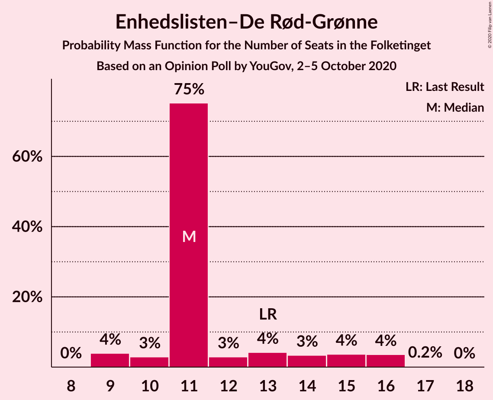
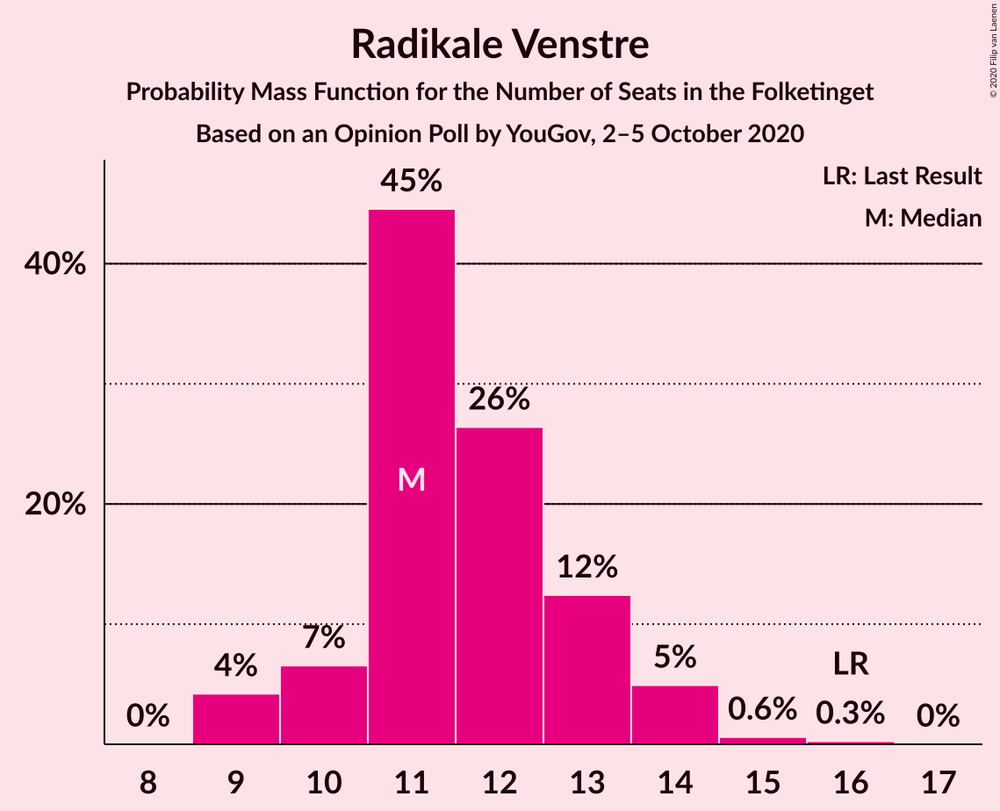
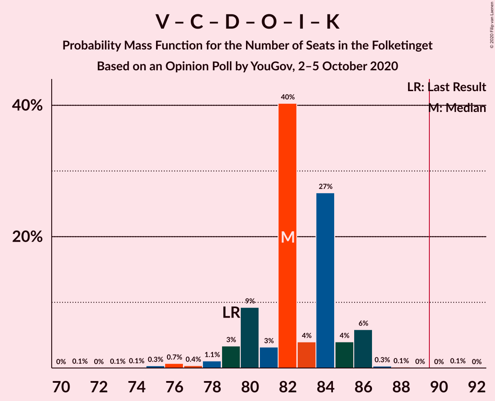

# Opinion Poll by YouGov, 2–5 October 2020

<a href="#voting-intentions">Voting Intentions</a> | <a href="#seats">Seats</a> | <a href="#coalitions">Coalitions</a> | <a href="#technical-information">Technical Information</a>

## Voting Intentions

### Confidence Intervals

| Party | Last Result | Poll Result | 80% Confidence Interval | 90% Confidence Interval | 95% Confidence Interval | 99% Confidence Interval |
|:-----:|:-----------:|:-----------:|:-----------------------:|:-----------------------:|:-----------------------:|:-----------------------:|
| Socialdemokraterne | 25.9% | 32.3% | 30.6–34.0% |30.2–34.5% |29.8–34.9% |29.0–35.8% |
| Venstre | 23.4% | 15.8% | 14.5–17.1% |14.1–17.5% |13.8–17.9% |13.3–18.6% |
| Det Konservative Folkeparti | 6.6% | 10.6% | 9.5–11.8% |9.2–12.1% |9.0–12.4% |8.5–13.0% |
| Nye Borgerlige | 2.4% | 9.4% | 8.4–10.5% |8.1–10.9% |7.9–11.1% |7.4–11.7% |
| Dansk Folkeparti | 8.7% | 6.8% | 5.9–7.8% |5.7–8.0% |5.5–8.3% |5.1–8.8% |
| Enhedslisten–De Rød-Grønne | 6.9% | 6.6% | 5.8–7.6% |5.5–7.9% |5.3–8.1% |5.0–8.6% |
| Radikale Venstre | 8.6% | 6.5% | 5.7–7.5% |5.5–7.8% |5.3–8.0% |4.9–8.5% |
| Socialistisk Folkeparti | 7.7% | 5.6% | 4.8–6.5% |4.6–6.8% |4.4–7.0% |4.1–7.5% |
| Liberal Alliance | 2.3% | 2.1% | 1.6–2.7% |1.5–2.9% |1.4–3.0% |1.2–3.3% |
| Kristendemokraterne | 1.7% | 1.6% | 1.2–2.1% |1.1–2.3% |1.0–2.5% |0.9–2.7% |
| Veganerpartiet | 0.0% | 1.5% | 1.1–2.1% |1.1–2.2% |1.0–2.4% |0.8–2.7% |
| Alternativet | 3.0% | 0.7% | 0.5–1.1% |0.4–1.2% |0.4–1.4% |0.3–1.6% |
| Stram Kurs | 1.8% | 0.6% | 0.4–1.0% |0.4–1.2% |0.3–1.2% |0.2–1.5% |

*Note:* The poll result column reflects the actual value used in the calculations. Published results may vary slightly, and in addition be rounded to fewer digits.

## Seats

### Confidence Intervals

| Party | Last Result | Median | 80% Confidence Interval | 90% Confidence Interval | 95% Confidence Interval | 99% Confidence Interval |
|:-----:|:-----------:|:------:|:-----------------------:|:-----------------------:|:-----------------------:|:-----------------------:|
| <a href="#socialdemokraterne">Socialdemokraterne</a> | 48 | 58 | 57–61 |56–61 |56–63 |54–64 |
| <a href="#venstre">Venstre</a> | 43 | 28 | 26–31 |26–32 |25–32 |24–33 |
| <a href="#det-konservative-folkeparti">Det Konservative Folkeparti</a> | 12 | 21 | 18–23 |17–23 |17–23 |16–23 |
| <a href="#nye-borgerlige">Nye Borgerlige</a> | 4 | 17 | 14–18 |14–18 |14–19 |13–22 |
| <a href="#dansk-folkeparti">Dansk Folkeparti</a> | 16 | 13 | 10–15 |10–17 |10–17 |10–17 |
| <a href="#enhedslisten–de-rød-grønne">Enhedslisten–De Rød-Grønne</a> | 13 | 11 | 11–14 |10–15 |9–16 |9–16 |
| <a href="#radikale-venstre">Radikale Venstre</a> | 16 | 11 | 10–13 |10–14 |9–14 |9–15 |
| <a href="#socialistisk-folkeparti">Socialistisk Folkeparti</a> | 14 | 10 | 9–13 |9–13 |8–13 |8–13 |
| <a href="#liberal-alliance">Liberal Alliance</a> | 4 | 5 | 0–6 |0–6 |0–6 |0–6 |
| <a href="#kristendemokraterne">Kristendemokraterne</a> | 0 | 0 | 0 |0–4 |0–5 |0–5 |
| <a href="#veganerpartiet">Veganerpartiet</a> | 0 | 0 | 0 |0 |0 |0–4 |
| <a href="#alternativet">Alternativet</a> | 5 | 0 | 0 |0 |0 |0 |
| <a href="#stram-kurs">Stram Kurs</a> | 0 | 0 | 0 |0 |0 |0 |

### Socialdemokraterne

*For a full overview of the results for this party, see the [Socialdemokraterne](party-socialdemokraterne.html) page.*

| Number of Seats | Probability | Accumulated | Special Marks |
|:---------------:|:-----------:|:-----------:|:-------------:|
| 48 | 0% | 100% | Last Result |
| 49 | 0.1% | 100% |  |
| 50 | 0% | 99.9% |  |
| 51 | 0% | 99.9% |  |
| 52 | 0.1% | 99.9% |  |
| 53 | 0.1% | 99.8% |  |
| 54 | 1.1% | 99.6% |  |
| 55 | 0.7% | 98.5% |  |
| 56 | 6% | 98% |  |
| 57 | 17% | 92% |  |
| 58 | 27% | 75% | Median |
| 59 | 5% | 48% |  |
| 60 | 1.1% | 43% |  |
| 61 | 38% | 42% |  |
| 62 | 1.2% | 4% |  |
| 63 | 2% | 3% |  |
| 64 | 0.3% | 0.7% |  |
| 65 | 0.2% | 0.3% |  |
| 66 | 0.1% | 0.2% |  |
| 67 | 0.1% | 0.1% |  |
| 68 | 0% | 0% |  |

### Venstre

*For a full overview of the results for this party, see the [Venstre](party-venstre.html) page.*

| Number of Seats | Probability | Accumulated | Special Marks |
|:---------------:|:-----------:|:-----------:|:-------------:|
| 23 | 0.2% | 100% |  |
| 24 | 1.3% | 99.7% |  |
| 25 | 2% | 98% |  |
| 26 | 9% | 96% |  |
| 27 | 16% | 87% |  |
| 28 | 21% | 71% | Median |
| 29 | 31% | 50% |  |
| 30 | 3% | 19% |  |
| 31 | 9% | 15% |  |
| 32 | 5% | 6% |  |
| 33 | 1.2% | 1.3% |  |
| 34 | 0% | 0.1% |  |
| 35 | 0% | 0% |  |
| 36 | 0% | 0% |  |
| 37 | 0% | 0% |  |
| 38 | 0% | 0% |  |
| 39 | 0% | 0% |  |
| 40 | 0% | 0% |  |
| 41 | 0% | 0% |  |
| 42 | 0% | 0% |  |
| 43 | 0% | 0% | Last Result |

### Det Konservative Folkeparti

*For a full overview of the results for this party, see the [Det Konservative Folkeparti](party-detkonservativefolkeparti.html) page.*

| Number of Seats | Probability | Accumulated | Special Marks |
|:---------------:|:-----------:|:-----------:|:-------------:|
| 12 | 0% | 100% | Last Result |
| 13 | 0% | 100% |  |
| 14 | 0.1% | 100% |  |
| 15 | 0.2% | 99.9% |  |
| 16 | 1.3% | 99.7% |  |
| 17 | 4% | 98% |  |
| 18 | 6% | 94% |  |
| 19 | 18% | 88% |  |
| 20 | 3% | 71% |  |
| 21 | 43% | 68% | Median |
| 22 | 9% | 25% |  |
| 23 | 16% | 16% |  |
| 24 | 0.3% | 0.3% |  |
| 25 | 0% | 0% |  |

### Nye Borgerlige

*For a full overview of the results for this party, see the [Nye Borgerlige](party-nyeborgerlige.html) page.*

| Number of Seats | Probability | Accumulated | Special Marks |
|:---------------:|:-----------:|:-----------:|:-------------:|
| 4 | 0% | 100% | Last Result |
| 5 | 0% | 100% |  |
| 6 | 0% | 100% |  |
| 7 | 0% | 100% |  |
| 8 | 0% | 100% |  |
| 9 | 0% | 100% |  |
| 10 | 0% | 100% |  |
| 11 | 0% | 100% |  |
| 12 | 0.1% | 100% |  |
| 13 | 1.2% | 99.9% |  |
| 14 | 10% | 98.8% |  |
| 15 | 4% | 89% |  |
| 16 | 23% | 84% |  |
| 17 | 34% | 62% | Median |
| 18 | 24% | 28% |  |
| 19 | 2% | 4% |  |
| 20 | 0.9% | 2% |  |
| 21 | 0.4% | 2% |  |
| 22 | 0.8% | 1.1% |  |
| 23 | 0.3% | 0.3% |  |
| 24 | 0% | 0% |  |

### Dansk Folkeparti

*For a full overview of the results for this party, see the [Dansk Folkeparti](party-danskfolkeparti.html) page.*

| Number of Seats | Probability | Accumulated | Special Marks |
|:---------------:|:-----------:|:-----------:|:-------------:|
| 8 | 0.1% | 100% |  |
| 9 | 0.2% | 99.9% |  |
| 10 | 33% | 99.7% |  |
| 11 | 6% | 67% |  |
| 12 | 7% | 60% |  |
| 13 | 34% | 53% | Median |
| 14 | 8% | 19% |  |
| 15 | 2% | 11% |  |
| 16 | 1.3% | 9% | Last Result |
| 17 | 8% | 8% |  |
| 18 | 0% | 0% |  |

### Enhedslisten–De Rød-Grønne

*For a full overview of the results for this party, see the [Enhedslisten–De Rød-Grønne](party-enhedslisten–derød-grønne.html) page.*

| Number of Seats | Probability | Accumulated | Special Marks |
|:---------------:|:-----------:|:-----------:|:-------------:|
| 9 | 4% | 100% |  |
| 10 | 3% | 96% |  |
| 11 | 75% | 93% | Median |
| 12 | 3% | 18% |  |
| 13 | 4% | 15% | Last Result |
| 14 | 3% | 11% |  |
| 15 | 4% | 7% |  |
| 16 | 4% | 4% |  |
| 17 | 0.2% | 0.2% |  |
| 18 | 0% | 0% |  |

### Radikale Venstre

*For a full overview of the results for this party, see the [Radikale Venstre](party-radikalevenstre.html) page.*

| Number of Seats | Probability | Accumulated | Special Marks |
|:---------------:|:-----------:|:-----------:|:-------------:|
| 9 | 4% | 100% |  |
| 10 | 7% | 96% |  |
| 11 | 45% | 89% | Median |
| 12 | 26% | 45% |  |
| 13 | 12% | 18% |  |
| 14 | 5% | 6% |  |
| 15 | 0.6% | 0.9% |  |
| 16 | 0.3% | 0.3% | Last Result |
| 17 | 0% | 0% |  |

### Socialistisk Folkeparti

*For a full overview of the results for this party, see the [Socialistisk Folkeparti](party-socialistiskfolkeparti.html) page.*

| Number of Seats | Probability | Accumulated | Special Marks |
|:---------------:|:-----------:|:-----------:|:-------------:|
| 7 | 0.3% | 100% |  |
| 8 | 3% | 99.7% |  |
| 9 | 9% | 97% |  |
| 10 | 59% | 88% | Median |
| 11 | 15% | 29% |  |
| 12 | 2% | 13% |  |
| 13 | 11% | 12% |  |
| 14 | 0.2% | 0.3% | Last Result |
| 15 | 0.1% | 0.1% |  |
| 16 | 0% | 0% |  |

### Liberal Alliance

*For a full overview of the results for this party, see the [Liberal Alliance](party-liberalalliance.html) page.*

| Number of Seats | Probability | Accumulated | Special Marks |
|:---------------:|:-----------:|:-----------:|:-------------:|
| 0 | 16% | 100% |  |
| 1 | 0% | 84% |  |
| 2 | 0% | 84% |  |
| 3 | 0% | 84% |  |
| 4 | 17% | 84% | Last Result |
| 5 | 47% | 67% | Median |
| 6 | 20% | 20% |  |
| 7 | 0% | 0% |  |

### Kristendemokraterne

*For a full overview of the results for this party, see the [Kristendemokraterne](party-kristendemokraterne.html) page.*

| Number of Seats | Probability | Accumulated | Special Marks |
|:---------------:|:-----------:|:-----------:|:-------------:|
| 0 | 94% | 100% | Last Result, Median |
| 1 | 0% | 6% |  |
| 2 | 0% | 6% |  |
| 3 | 0% | 6% |  |
| 4 | 2% | 6% |  |
| 5 | 3% | 3% |  |
| 6 | 0.2% | 0.2% |  |
| 7 | 0% | 0% |  |

### Veganerpartiet

*For a full overview of the results for this party, see the [Veganerpartiet](party-veganerpartiet.html) page.*

| Number of Seats | Probability | Accumulated | Special Marks |
|:---------------:|:-----------:|:-----------:|:-------------:|
| 0 | 98% | 100% | Last Result, Median |
| 1 | 0% | 2% |  |
| 2 | 0% | 2% |  |
| 3 | 0% | 2% |  |
| 4 | 2% | 2% |  |
| 5 | 0.4% | 0.5% |  |
| 6 | 0% | 0% |  |

### Alternativet

*For a full overview of the results for this party, see the [Alternativet](party-alternativet.html) page.*

| Number of Seats | Probability | Accumulated | Special Marks |
|:---------------:|:-----------:|:-----------:|:-------------:|
| 0 | 100% | 100% | Median |
| 1 | 0% | 0% |  |
| 2 | 0% | 0% |  |
| 3 | 0% | 0% |  |
| 4 | 0% | 0% |  |
| 5 | 0% | 0% | Last Result |

### Stram Kurs

*For a full overview of the results for this party, see the [Stram Kurs](party-stramkurs.html) page.*

| Number of Seats | Probability | Accumulated | Special Marks |
|:---------------:|:-----------:|:-----------:|:-------------:|
| 0 | 100% | 100% | Last Result, Median |

## Coalitions

### Confidence Intervals

| Coalition | Last Result | Median | Majority? | 80% Confidence Interval | 90% Confidence Interval | 95% Confidence Interval | 99% Confidence Interval |
|:---------:|:-----------:|:------:|:---------:|:-----------------------:|:-----------------------:|:-----------------------:|:-----------------------:|
| Socialdemokraterne – Enhedslisten–De Rød-Grønne – Radikale Venstre – Socialistisk Folkeparti – Alternativet | 96 | 93 | 93% | 90–95 | 89–96 | 89–96 | 88–100 |
| Socialdemokraterne – Enhedslisten–De Rød-Grønne – Radikale Venstre – Socialistisk Folkeparti | 91 | 93 | 93% | 90–95 | 89–96 | 89–96 | 88–100 |
| Venstre – Det Konservative Folkeparti – Nye Borgerlige – Dansk Folkeparti – Liberal Alliance – Kristendemokraterne | 79 | 82 | 0.1% | 80–85 | 79–86 | 78–86 | 75–87 |
| Venstre – Det Konservative Folkeparti – Nye Borgerlige – Dansk Folkeparti – Liberal Alliance | 79 | 82 | 0% | 79–84 | 78–86 | 76–86 | 74–86 |
| Socialdemokraterne – Enhedslisten–De Rød-Grønne – Socialistisk Folkeparti – Alternativet | 80 | 82 | 0.1% | 78–83 | 78–84 | 78–84 | 76–87 |
| Socialdemokraterne – Enhedslisten–De Rød-Grønne – Socialistisk Folkeparti | 75 | 82 | 0.1% | 78–83 | 78–84 | 78–84 | 76–87 |
| Socialdemokraterne – Radikale Venstre – Socialistisk Folkeparti | 78 | 82 | 0.1% | 78–84 | 77–84 | 75–84 | 75–87 |
| Socialdemokraterne – Radikale Venstre | 64 | 70 | 0% | 68–73 | 67–73 | 66–74 | 66–76 |
| Venstre – Det Konservative Folkeparti – Dansk Folkeparti – Liberal Alliance – Kristendemokraterne | 75 | 66 | 0% | 63–68 | 62–68 | 60–70 | 57–70 |
| Venstre – Det Konservative Folkeparti – Dansk Folkeparti – Liberal Alliance | 75 | 65 | 0% | 63–68 | 60–68 | 58–70 | 55–70 |
| Venstre – Det Konservative Folkeparti – Liberal Alliance | 59 | 55 | 0% | 50–55 | 48–56 | 46–58 | 43–59 |
| Venstre – Det Konservative Folkeparti | 55 | 50 | 0% | 47–52 | 44–54 | 43–55 | 41–55 |
| Venstre | 43 | 28 | 0% | 26–31 | 26–32 | 25–32 | 24–33 |

### Socialdemokraterne – Enhedslisten–De Rød-Grønne – Radikale Venstre – Socialistisk Folkeparti – Alternativet

| Number of Seats | Probability | Accumulated | Special Marks |
|:---------------:|:-----------:|:-----------:|:-------------:|
| 80 | 0.1% | 100% |  |
| 81 | 0% | 99.9% |  |
| 82 | 0% | 99.9% |  |
| 83 | 0% | 99.9% |  |
| 84 | 0% | 99.9% |  |
| 85 | 0% | 99.9% |  |
| 86 | 0.1% | 99.8% |  |
| 87 | 0.2% | 99.8% |  |
| 88 | 0.3% | 99.6% |  |
| 89 | 6% | 99.2% |  |
| 90 | 4% | 93% | Median, Majority |
| 91 | 27% | 89% |  |
| 92 | 4% | 62% |  |
| 93 | 41% | 58% |  |
| 94 | 3% | 17% |  |
| 95 | 9% | 15% |  |
| 96 | 3% | 5% | Last Result |
| 97 | 1.0% | 2% |  |
| 98 | 0.1% | 1.1% |  |
| 99 | 0.4% | 0.9% |  |
| 100 | 0.4% | 0.5% |  |
| 101 | 0.1% | 0.1% |  |
| 102 | 0% | 0.1% |  |
| 103 | 0% | 0% |  |

### Socialdemokraterne – Enhedslisten–De Rød-Grønne – Radikale Venstre – Socialistisk Folkeparti

| Number of Seats | Probability | Accumulated | Special Marks |
|:---------------:|:-----------:|:-----------:|:-------------:|
| 80 | 0.1% | 100% |  |
| 81 | 0% | 99.9% |  |
| 82 | 0% | 99.9% |  |
| 83 | 0% | 99.9% |  |
| 84 | 0% | 99.9% |  |
| 85 | 0% | 99.9% |  |
| 86 | 0.1% | 99.8% |  |
| 87 | 0.2% | 99.8% |  |
| 88 | 0.3% | 99.6% |  |
| 89 | 6% | 99.2% |  |
| 90 | 4% | 93% | Median, Majority |
| 91 | 27% | 89% | Last Result |
| 92 | 4% | 62% |  |
| 93 | 41% | 58% |  |
| 94 | 3% | 17% |  |
| 95 | 9% | 15% |  |
| 96 | 3% | 5% |  |
| 97 | 1.0% | 2% |  |
| 98 | 0.1% | 1.1% |  |
| 99 | 0.4% | 0.9% |  |
| 100 | 0.4% | 0.5% |  |
| 101 | 0.1% | 0.1% |  |
| 102 | 0% | 0.1% |  |
| 103 | 0% | 0% |  |

### Venstre – Det Konservative Folkeparti – Nye Borgerlige – Dansk Folkeparti – Liberal Alliance – Kristendemokraterne

| Number of Seats | Probability | Accumulated | Special Marks |
|:---------------:|:-----------:|:-----------:|:-------------:|
| 71 | 0.1% | 100% |  |
| 72 | 0% | 99.9% |  |
| 73 | 0.1% | 99.9% |  |
| 74 | 0.1% | 99.8% |  |
| 75 | 0.3% | 99.7% |  |
| 76 | 0.7% | 99.4% |  |
| 77 | 0.4% | 98.7% |  |
| 78 | 1.1% | 98% |  |
| 79 | 3% | 97% | Last Result |
| 80 | 9% | 94% |  |
| 81 | 3% | 85% |  |
| 82 | 40% | 81% |  |
| 83 | 4% | 41% |  |
| 84 | 27% | 37% | Median |
| 85 | 4% | 10% |  |
| 86 | 6% | 6% |  |
| 87 | 0.3% | 0.6% |  |
| 88 | 0.1% | 0.3% |  |
| 89 | 0% | 0.2% |  |
| 90 | 0% | 0.1% | Majority |
| 91 | 0.1% | 0.1% |  |
| 92 | 0% | 0% |  |

### Venstre – Det Konservative Folkeparti – Nye Borgerlige – Dansk Folkeparti – Liberal Alliance

| Number of Seats | Probability | Accumulated | Special Marks |
|:---------------:|:-----------:|:-----------:|:-------------:|
| 71 | 0.1% | 100% |  |
| 72 | 0.2% | 99.8% |  |
| 73 | 0.1% | 99.6% |  |
| 74 | 0.2% | 99.5% |  |
| 75 | 1.4% | 99.4% |  |
| 76 | 0.9% | 98% |  |
| 77 | 2% | 97% |  |
| 78 | 2% | 95% |  |
| 79 | 3% | 93% | Last Result |
| 80 | 8% | 89% |  |
| 81 | 1.4% | 81% |  |
| 82 | 40% | 79% |  |
| 83 | 3% | 39% |  |
| 84 | 27% | 37% | Median |
| 85 | 4% | 10% |  |
| 86 | 6% | 6% |  |
| 87 | 0.2% | 0.3% |  |
| 88 | 0% | 0.1% |  |
| 89 | 0% | 0% |  |

### Socialdemokraterne – Enhedslisten–De Rød-Grønne – Socialistisk Folkeparti – Alternativet

| Number of Seats | Probability | Accumulated | Special Marks |
|:---------------:|:-----------:|:-----------:|:-------------:|
| 68 | 0.1% | 100% |  |
| 69 | 0% | 99.9% |  |
| 70 | 0% | 99.9% |  |
| 71 | 0% | 99.9% |  |
| 72 | 0.1% | 99.9% |  |
| 73 | 0.1% | 99.8% |  |
| 74 | 0.1% | 99.8% |  |
| 75 | 0.1% | 99.6% |  |
| 76 | 1.1% | 99.6% |  |
| 77 | 0.2% | 98% |  |
| 78 | 14% | 98% |  |
| 79 | 21% | 84% | Median |
| 80 | 0.6% | 63% | Last Result |
| 81 | 3% | 62% |  |
| 82 | 47% | 59% |  |
| 83 | 7% | 12% |  |
| 84 | 3% | 5% |  |
| 85 | 0.8% | 2% |  |
| 86 | 0.9% | 1.4% |  |
| 87 | 0.3% | 0.5% |  |
| 88 | 0.1% | 0.2% |  |
| 89 | 0% | 0.1% |  |
| 90 | 0.1% | 0.1% | Majority |
| 91 | 0% | 0% |  |

### Socialdemokraterne – Enhedslisten–De Rød-Grønne – Socialistisk Folkeparti

| Number of Seats | Probability | Accumulated | Special Marks |
|:---------------:|:-----------:|:-----------:|:-------------:|
| 68 | 0.1% | 100% |  |
| 69 | 0% | 99.9% |  |
| 70 | 0% | 99.9% |  |
| 71 | 0% | 99.9% |  |
| 72 | 0.1% | 99.9% |  |
| 73 | 0.1% | 99.8% |  |
| 74 | 0.1% | 99.8% |  |
| 75 | 0.1% | 99.6% | Last Result |
| 76 | 1.1% | 99.6% |  |
| 77 | 0.2% | 98% |  |
| 78 | 14% | 98% |  |
| 79 | 21% | 84% | Median |
| 80 | 0.7% | 63% |  |
| 81 | 3% | 62% |  |
| 82 | 47% | 59% |  |
| 83 | 7% | 12% |  |
| 84 | 3% | 5% |  |
| 85 | 0.8% | 2% |  |
| 86 | 0.9% | 1.4% |  |
| 87 | 0.3% | 0.5% |  |
| 88 | 0.1% | 0.2% |  |
| 89 | 0% | 0.1% |  |
| 90 | 0.1% | 0.1% | Majority |
| 91 | 0% | 0% |  |

### Socialdemokraterne – Radikale Venstre – Socialistisk Folkeparti

| Number of Seats | Probability | Accumulated | Special Marks |
|:---------------:|:-----------:|:-----------:|:-------------:|
| 70 | 0.1% | 100% |  |
| 71 | 0% | 99.9% |  |
| 72 | 0.1% | 99.9% |  |
| 73 | 0.1% | 99.8% |  |
| 74 | 0.1% | 99.7% |  |
| 75 | 3% | 99.7% |  |
| 76 | 0.2% | 96% |  |
| 77 | 4% | 96% |  |
| 78 | 4% | 93% | Last Result |
| 79 | 4% | 89% | Median |
| 80 | 29% | 85% |  |
| 81 | 0.8% | 56% |  |
| 82 | 43% | 56% |  |
| 83 | 2% | 12% |  |
| 84 | 9% | 11% |  |
| 85 | 0.3% | 2% |  |
| 86 | 1.1% | 2% |  |
| 87 | 0.4% | 0.6% |  |
| 88 | 0.1% | 0.2% |  |
| 89 | 0% | 0.1% |  |
| 90 | 0% | 0.1% | Majority |
| 91 | 0% | 0% |  |

### Socialdemokraterne – Radikale Venstre

| Number of Seats | Probability | Accumulated | Special Marks |
|:---------------:|:-----------:|:-----------:|:-------------:|
| 61 | 0.1% | 100% |  |
| 62 | 0% | 99.9% |  |
| 63 | 0.2% | 99.9% |  |
| 64 | 0.1% | 99.7% | Last Result |
| 65 | 0.2% | 99.7% |  |
| 66 | 4% | 99.5% |  |
| 67 | 1.4% | 95% |  |
| 68 | 5% | 94% |  |
| 69 | 17% | 89% | Median |
| 70 | 23% | 71% |  |
| 71 | 4% | 48% |  |
| 72 | 32% | 44% |  |
| 73 | 8% | 12% |  |
| 74 | 3% | 4% |  |
| 75 | 0.7% | 1.2% |  |
| 76 | 0.2% | 0.5% |  |
| 77 | 0.2% | 0.3% |  |
| 78 | 0% | 0.1% |  |
| 79 | 0.1% | 0.1% |  |
| 80 | 0% | 0% |  |

### Venstre – Det Konservative Folkeparti – Dansk Folkeparti – Liberal Alliance – Kristendemokraterne

| Number of Seats | Probability | Accumulated | Special Marks |
|:---------------:|:-----------:|:-----------:|:-------------:|
| 55 | 0.4% | 100% |  |
| 56 | 0.1% | 99.6% |  |
| 57 | 0.3% | 99.5% |  |
| 58 | 1.0% | 99.2% |  |
| 59 | 0.8% | 98% |  |
| 60 | 1.4% | 98% |  |
| 61 | 0.4% | 96% |  |
| 62 | 2% | 96% |  |
| 63 | 4% | 94% |  |
| 64 | 6% | 90% |  |
| 65 | 32% | 84% |  |
| 66 | 17% | 52% |  |
| 67 | 4% | 35% | Median |
| 68 | 27% | 31% |  |
| 69 | 0.3% | 4% |  |
| 70 | 3% | 4% |  |
| 71 | 0.1% | 0.4% |  |
| 72 | 0.1% | 0.2% |  |
| 73 | 0.1% | 0.1% |  |
| 74 | 0% | 0% |  |
| 75 | 0% | 0% | Last Result |

### Venstre – Det Konservative Folkeparti – Dansk Folkeparti – Liberal Alliance

| Number of Seats | Probability | Accumulated | Special Marks |
|:---------------:|:-----------:|:-----------:|:-------------:|
| 55 | 0.6% | 100% |  |
| 56 | 0.1% | 99.4% |  |
| 57 | 0.4% | 99.2% |  |
| 58 | 2% | 98.8% |  |
| 59 | 1.5% | 97% |  |
| 60 | 1.2% | 95% |  |
| 61 | 0.5% | 94% |  |
| 62 | 2% | 94% |  |
| 63 | 4% | 92% |  |
| 64 | 7% | 88% |  |
| 65 | 32% | 81% |  |
| 66 | 17% | 49% |  |
| 67 | 4% | 32% | Median |
| 68 | 24% | 28% |  |
| 69 | 0.1% | 3% |  |
| 70 | 3% | 3% |  |
| 71 | 0.1% | 0.2% |  |
| 72 | 0% | 0.1% |  |
| 73 | 0.1% | 0.1% |  |
| 74 | 0% | 0% |  |
| 75 | 0% | 0% | Last Result |

### Venstre – Det Konservative Folkeparti – Liberal Alliance

| Number of Seats | Probability | Accumulated | Special Marks |
|:---------------:|:-----------:|:-----------:|:-------------:|
| 42 | 0.2% | 100% |  |
| 43 | 0.3% | 99.8% |  |
| 44 | 0% | 99.4% |  |
| 45 | 2% | 99.4% |  |
| 46 | 2% | 98% |  |
| 47 | 0.5% | 96% |  |
| 48 | 3% | 96% |  |
| 49 | 1.2% | 93% |  |
| 50 | 10% | 92% |  |
| 51 | 8% | 82% |  |
| 52 | 2% | 74% |  |
| 53 | 18% | 72% |  |
| 54 | 2% | 54% | Median |
| 55 | 44% | 52% |  |
| 56 | 4% | 8% |  |
| 57 | 1.2% | 5% |  |
| 58 | 1.2% | 4% |  |
| 59 | 2% | 2% | Last Result |
| 60 | 0% | 0% |  |

### Venstre – Det Konservative Folkeparti

| Number of Seats | Probability | Accumulated | Special Marks |
|:---------------:|:-----------:|:-----------:|:-------------:|
| 41 | 1.2% | 100% |  |
| 42 | 0.3% | 98.8% |  |
| 43 | 1.4% | 98% |  |
| 44 | 3% | 97% |  |
| 45 | 1.2% | 94% |  |
| 46 | 2% | 93% |  |
| 47 | 24% | 91% |  |
| 48 | 3% | 67% |  |
| 49 | 5% | 64% | Median |
| 50 | 47% | 60% |  |
| 51 | 0.4% | 12% |  |
| 52 | 5% | 12% |  |
| 53 | 1.3% | 7% |  |
| 54 | 2% | 5% |  |
| 55 | 3% | 3% | Last Result |
| 56 | 0% | 0% |  |

### Venstre

| Number of Seats | Probability | Accumulated | Special Marks |
|:---------------:|:-----------:|:-----------:|:-------------:|
| 23 | 0.2% | 100% |  |
| 24 | 1.3% | 99.7% |  |
| 25 | 2% | 98% |  |
| 26 | 9% | 96% |  |
| 27 | 16% | 87% |  |
| 28 | 21% | 71% | Median |
| 29 | 31% | 50% |  |
| 30 | 3% | 19% |  |
| 31 | 9% | 15% |  |
| 32 | 5% | 6% |  |
| 33 | 1.2% | 1.3% |  |
| 34 | 0% | 0.1% |  |
| 35 | 0% | 0% |  |
| 36 | 0% | 0% |  |
| 37 | 0% | 0% |  |
| 38 | 0% | 0% |  |
| 39 | 0% | 0% |  |
| 40 | 0% | 0% |  |
| 41 | 0% | 0% |  |
| 42 | 0% | 0% |  |
| 43 | 0% | 0% | Last Result |

## Technical Information

### Opinion Poll

+ **Polling firm:** YouGov
+ **Commissioner(s):** —
+ **Fieldwork period:** 2–5 October 2020

### Calculations

+ **Sample size:** 1257
+ **Simulations done:** 1,048,576
+ **Error estimate:** 1.54%

