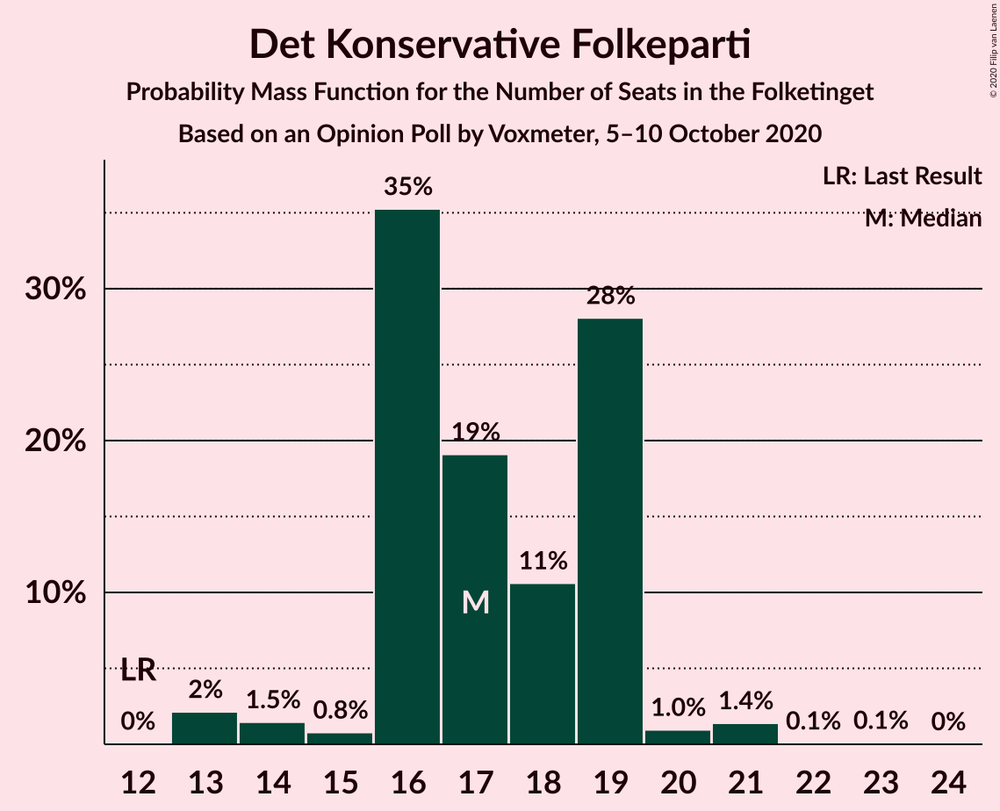
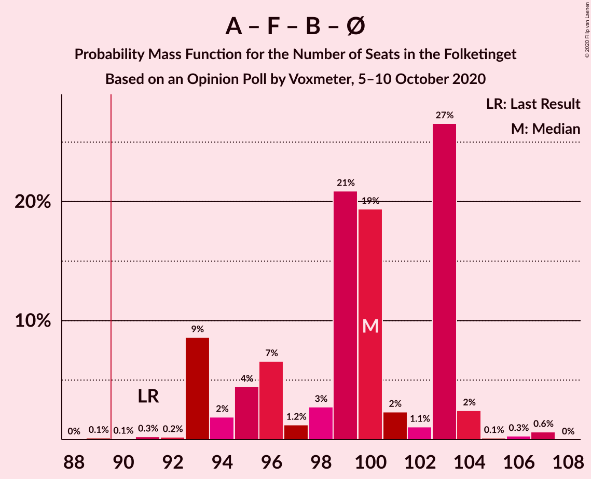

# Opinion Poll by Voxmeter, 5–10 October 2020

<a href="#voting-intentions">Voting Intentions</a> | <a href="#seats">Seats</a> | <a href="#coalitions">Coalitions</a> | <a href="#technical-information">Technical Information</a>

## Voting Intentions

### Confidence Intervals

| Party | Last Result | Poll Result | 80% Confidence Interval | 90% Confidence Interval | 95% Confidence Interval | 99% Confidence Interval |
|:-----:|:-----------:|:-----------:|:-----------------------:|:-----------------------:|:-----------------------:|:-----------------------:|
| Socialdemokraterne | 25.9% | 31.3% | 29.4–33.2% |28.9–33.7% |28.5–34.2% |27.6–35.1% |
| Venstre | 23.4% | 19.7% | 18.1–21.4% |17.7–21.8% |17.3–22.2% |16.6–23.1% |
| Det Konservative Folkeparti | 6.6% | 9.5% | 8.4–10.8% |8.1–11.2% |7.9–11.5% |7.4–12.2% |
| Socialistisk Folkeparti | 7.7% | 7.8% | 6.8–9.0% |6.6–9.4% |6.3–9.7% |5.9–10.3% |
| Radikale Venstre | 8.6% | 7.7% | 6.8–8.9% |6.5–9.3% |6.2–9.6% |5.8–10.2% |
| Enhedslisten–De Rød-Grønne | 6.9% | 6.9% | 5.9–8.0% |5.7–8.3% |5.4–8.6% |5.0–9.2% |
| Dansk Folkeparti | 8.7% | 6.7% | 5.7–7.8% |5.5–8.1% |5.3–8.4% |4.9–8.9% |
| Nye Borgerlige | 2.4% | 4.3% | 3.6–5.2% |3.4–5.5% |3.2–5.7% |2.9–6.2% |
| Liberal Alliance | 2.3% | 2.2% | 1.7–2.9% |1.6–3.1% |1.4–3.3% |1.2–3.7% |
| Kristendemokraterne | 1.7% | 1.3% | 0.9–1.9% |0.8–2.1% |0.7–2.2% |0.6–2.5% |
| Alternativet | 3.0% | 0.9% | 0.6–1.4% |0.5–1.6% |0.5–1.7% |0.4–2.0% |
| Stram Kurs | 1.8% | 0.6% | 0.4–1.1% |0.3–1.2% |0.3–1.3% |0.2–1.6% |
| Veganerpartiet | 0.0% | 0.6% | 0.4–1.1% |0.3–1.2% |0.3–1.3% |0.2–1.6% |

*Note:* The poll result column reflects the actual value used in the calculations. Published results may vary slightly, and in addition be rounded to fewer digits.

## Seats

### Confidence Intervals

| Party | Last Result | Median | 80% Confidence Interval | 90% Confidence Interval | 95% Confidence Interval | 99% Confidence Interval |
|:-----:|:-----------:|:------:|:-----------------------:|:-----------------------:|:-----------------------:|:-----------------------:|
| <a href="#socialdemokraterne">Socialdemokraterne</a> | 48 | 58 | 54–60 |52–60 |50–61 |49–63 |
| <a href="#venstre">Venstre</a> | 43 | 36 | 34–39 |33–39 |32–39 |31–41 |
| <a href="#det-konservative-folkeparti">Det Konservative Folkeparti</a> | 12 | 17 | 16–19 |16–19 |14–20 |13–21 |
| <a href="#socialistisk-folkeparti">Socialistisk Folkeparti</a> | 14 | 15 | 14–16 |13–17 |12–17 |12–19 |
| <a href="#radikale-venstre">Radikale Venstre</a> | 16 | 14 | 12–16 |10–16 |10–19 |10–19 |
| <a href="#enhedslisten–de-rød-grønne">Enhedslisten–De Rød-Grønne</a> | 13 | 12 | 11–15 |11–15 |11–17 |10–17 |
| <a href="#dansk-folkeparti">Dansk Folkeparti</a> | 16 | 11 | 9–14 |9–14 |9–16 |9–16 |
| <a href="#nye-borgerlige">Nye Borgerlige</a> | 4 | 8 | 6–9 |6–10 |6–10 |5–10 |
| <a href="#liberal-alliance">Liberal Alliance</a> | 4 | 4 | 0–5 |0–6 |0–6 |0–6 |
| <a href="#kristendemokraterne">Kristendemokraterne</a> | 0 | 0 | 0 |0 |0–4 |0–4 |
| <a href="#alternativet">Alternativet</a> | 5 | 0 | 0 |0 |0 |0 |
| <a href="#stram-kurs">Stram Kurs</a> | 0 | 0 | 0 |0 |0 |0 |
| <a href="#veganerpartiet">Veganerpartiet</a> | 0 | 0 | 0 |0 |0 |0 |

### Socialdemokraterne

*For a full overview of the results for this party, see the [Socialdemokraterne](party-socialdemokraterne.html) page.*

| Number of Seats | Probability | Accumulated | Special Marks |
|:---------------:|:-----------:|:-----------:|:-------------:|
| 48 | 0% | 100% | Last Result |
| 49 | 0.6% | 100% |  |
| 50 | 3% | 99.4% |  |
| 51 | 0.6% | 96% |  |
| 52 | 1.2% | 95% |  |
| 53 | 3% | 94% |  |
| 54 | 9% | 92% |  |
| 55 | 3% | 83% |  |
| 56 | 8% | 80% |  |
| 57 | 9% | 72% |  |
| 58 | 33% | 63% | Median |
| 59 | 14% | 29% |  |
| 60 | 13% | 15% |  |
| 61 | 1.4% | 3% |  |
| 62 | 0.2% | 1.4% |  |
| 63 | 1.1% | 1.2% |  |
| 64 | 0% | 0.1% |  |
| 65 | 0.1% | 0.1% |  |
| 66 | 0% | 0% |  |

### Venstre

*For a full overview of the results for this party, see the [Venstre](party-venstre.html) page.*

| Number of Seats | Probability | Accumulated | Special Marks |
|:---------------:|:-----------:|:-----------:|:-------------:|
| 29 | 0% | 100% |  |
| 30 | 0.4% | 99.9% |  |
| 31 | 2% | 99.6% |  |
| 32 | 0.5% | 98% |  |
| 33 | 5% | 97% |  |
| 34 | 29% | 92% |  |
| 35 | 8% | 63% |  |
| 36 | 10% | 55% | Median |
| 37 | 12% | 45% |  |
| 38 | 19% | 33% |  |
| 39 | 12% | 14% |  |
| 40 | 0.4% | 1.4% |  |
| 41 | 0.6% | 1.1% |  |
| 42 | 0.1% | 0.5% |  |
| 43 | 0.3% | 0.4% | Last Result |
| 44 | 0.1% | 0.1% |  |
| 45 | 0% | 0% |  |

### Det Konservative Folkeparti

*For a full overview of the results for this party, see the [Det Konservative Folkeparti](party-detkonservativefolkeparti.html) page.*

| Number of Seats | Probability | Accumulated | Special Marks |
|:---------------:|:-----------:|:-----------:|:-------------:|
| 12 | 0% | 100% | Last Result |
| 13 | 2% | 99.9% |  |
| 14 | 1.5% | 98% |  |
| 15 | 0.8% | 96% |  |
| 16 | 35% | 96% |  |
| 17 | 19% | 60% | Median |
| 18 | 11% | 41% |  |
| 19 | 28% | 31% |  |
| 20 | 1.0% | 3% |  |
| 21 | 1.4% | 2% |  |
| 22 | 0.1% | 0.2% |  |
| 23 | 0.1% | 0.1% |  |
| 24 | 0% | 0% |  |

### Socialistisk Folkeparti

*For a full overview of the results for this party, see the [Socialistisk Folkeparti](party-socialistiskfolkeparti.html) page.*

| Number of Seats | Probability | Accumulated | Special Marks |
|:---------------:|:-----------:|:-----------:|:-------------:|
| 10 | 0.1% | 100% |  |
| 11 | 0.3% | 99.9% |  |
| 12 | 2% | 99.6% |  |
| 13 | 6% | 97% |  |
| 14 | 14% | 91% | Last Result |
| 15 | 28% | 78% | Median |
| 16 | 44% | 50% |  |
| 17 | 4% | 6% |  |
| 18 | 1.2% | 2% |  |
| 19 | 0.8% | 0.8% |  |
| 20 | 0% | 0.1% |  |
| 21 | 0% | 0% |  |

### Radikale Venstre

*For a full overview of the results for this party, see the [Radikale Venstre](party-radikalevenstre.html) page.*

| Number of Seats | Probability | Accumulated | Special Marks |
|:---------------:|:-----------:|:-----------:|:-------------:|
| 10 | 8% | 100% |  |
| 11 | 2% | 92% |  |
| 12 | 1.3% | 91% |  |
| 13 | 21% | 89% |  |
| 14 | 26% | 69% | Median |
| 15 | 22% | 42% |  |
| 16 | 17% | 21% | Last Result |
| 17 | 0.9% | 4% |  |
| 18 | 0.5% | 3% |  |
| 19 | 2% | 3% |  |
| 20 | 0% | 0% |  |

### Enhedslisten–De Rød-Grønne

*For a full overview of the results for this party, see the [Enhedslisten–De Rød-Grønne](party-enhedslisten–derød-grønne.html) page.*

| Number of Seats | Probability | Accumulated | Special Marks |
|:---------------:|:-----------:|:-----------:|:-------------:|
| 9 | 0.2% | 100% |  |
| 10 | 1.4% | 99.7% |  |
| 11 | 22% | 98% |  |
| 12 | 28% | 77% | Median |
| 13 | 16% | 49% | Last Result |
| 14 | 13% | 33% |  |
| 15 | 15% | 20% |  |
| 16 | 2% | 4% |  |
| 17 | 2% | 3% |  |
| 18 | 0.1% | 0.1% |  |
| 19 | 0% | 0% |  |

### Dansk Folkeparti

*For a full overview of the results for this party, see the [Dansk Folkeparti](party-danskfolkeparti.html) page.*

| Number of Seats | Probability | Accumulated | Special Marks |
|:---------------:|:-----------:|:-----------:|:-------------:|
| 8 | 0% | 100% |  |
| 9 | 12% | 99.9% |  |
| 10 | 4% | 87% |  |
| 11 | 36% | 83% | Median |
| 12 | 3% | 47% |  |
| 13 | 31% | 44% |  |
| 14 | 9% | 13% |  |
| 15 | 0.7% | 5% |  |
| 16 | 4% | 4% | Last Result |
| 17 | 0.1% | 0.1% |  |
| 18 | 0% | 0% |  |

### Nye Borgerlige

*For a full overview of the results for this party, see the [Nye Borgerlige](party-nyeborgerlige.html) page.*

| Number of Seats | Probability | Accumulated | Special Marks |
|:---------------:|:-----------:|:-----------:|:-------------:|
| 4 | 0% | 100% | Last Result |
| 5 | 0.6% | 100% |  |
| 6 | 31% | 99.3% |  |
| 7 | 9% | 68% |  |
| 8 | 35% | 60% | Median |
| 9 | 16% | 25% |  |
| 10 | 9% | 9% |  |
| 11 | 0.2% | 0.5% |  |
| 12 | 0.3% | 0.3% |  |
| 13 | 0% | 0% |  |

### Liberal Alliance

*For a full overview of the results for this party, see the [Liberal Alliance](party-liberalalliance.html) page.*

| Number of Seats | Probability | Accumulated | Special Marks |
|:---------------:|:-----------:|:-----------:|:-------------:|
| 0 | 42% | 100% |  |
| 1 | 0% | 58% |  |
| 2 | 0% | 58% |  |
| 3 | 0% | 58% |  |
| 4 | 34% | 58% | Last Result, Median |
| 5 | 19% | 25% |  |
| 6 | 5% | 6% |  |
| 7 | 0.4% | 0.4% |  |
| 8 | 0% | 0% |  |

### Kristendemokraterne

*For a full overview of the results for this party, see the [Kristendemokraterne](party-kristendemokraterne.html) page.*

| Number of Seats | Probability | Accumulated | Special Marks |
|:---------------:|:-----------:|:-----------:|:-------------:|
| 0 | 96% | 100% | Last Result, Median |
| 1 | 0% | 4% |  |
| 2 | 0% | 4% |  |
| 3 | 0% | 4% |  |
| 4 | 4% | 4% |  |
| 5 | 0.1% | 0.1% |  |
| 6 | 0.1% | 0.1% |  |
| 7 | 0% | 0% |  |

### Alternativet

*For a full overview of the results for this party, see the [Alternativet](party-alternativet.html) page.*

| Number of Seats | Probability | Accumulated | Special Marks |
|:---------------:|:-----------:|:-----------:|:-------------:|
| 0 | 99.8% | 100% | Median |
| 1 | 0% | 0.2% |  |
| 2 | 0% | 0.2% |  |
| 3 | 0% | 0.2% |  |
| 4 | 0.2% | 0.2% |  |
| 5 | 0% | 0% | Last Result |

### Stram Kurs

*For a full overview of the results for this party, see the [Stram Kurs](party-stramkurs.html) page.*

| Number of Seats | Probability | Accumulated | Special Marks |
|:---------------:|:-----------:|:-----------:|:-------------:|
| 0 | 100% | 100% | Last Result, Median |

### Veganerpartiet

*For a full overview of the results for this party, see the [Veganerpartiet](party-veganerpartiet.html) page.*

| Number of Seats | Probability | Accumulated | Special Marks |
|:---------------:|:-----------:|:-----------:|:-------------:|
| 0 | 99.9% | 100% | Last Result, Median |
| 1 | 0% | 0.1% |  |
| 2 | 0% | 0.1% |  |
| 3 | 0% | 0.1% |  |
| 4 | 0% | 0.1% |  |
| 5 | 0% | 0% |  |

## Coalitions

### Confidence Intervals

| Coalition | Last Result | Median | Majority? | 80% Confidence Interval | 90% Confidence Interval | 95% Confidence Interval | 99% Confidence Interval |
|:---------:|:-----------:|:------:|:---------:|:-----------------------:|:-----------------------:|:-----------------------:|:-----------------------:|
| Socialdemokraterne – Socialistisk Folkeparti – Radikale Venstre – Enhedslisten–De Rød-Grønne – Alternativet | 96 | 100 | 99.8% | 94–103 | 93–103 | 93–104 | 92–107 |
| Socialdemokraterne – Socialistisk Folkeparti – Radikale Venstre – Enhedslisten–De Rød-Grønne | 91 | 100 | 99.8% | 94–103 | 93–103 | 93–104 | 92–107 |
| Socialdemokraterne – Socialistisk Folkeparti – Radikale Venstre | 78 | 88 | 16% | 80–91 | 80–91 | 78–91 | 78–92 |
| Socialdemokraterne – Socialistisk Folkeparti – Enhedslisten–De Rød-Grønne – Alternativet | 80 | 85 | 1.3% | 82–89 | 81–89 | 80–89 | 78–91 |
| Socialdemokraterne – Socialistisk Folkeparti – Enhedslisten–De Rød-Grønne | 75 | 85 | 1.2% | 82–89 | 81–89 | 79–89 | 78–91 |
| Venstre – Det Konservative Folkeparti – Dansk Folkeparti – Nye Borgerlige – Liberal Alliance – Kristendemokraterne | 79 | 75 | 0% | 72–81 | 72–82 | 71–82 | 68–83 |
| Venstre – Det Konservative Folkeparti – Dansk Folkeparti – Nye Borgerlige – Liberal Alliance | 79 | 75 | 0% | 72–81 | 72–82 | 71–82 | 68–83 |
| Socialdemokraterne – Radikale Venstre | 64 | 72 | 0% | 64–76 | 64–76 | 63–76 | 63–78 |
| Venstre – Det Konservative Folkeparti – Dansk Folkeparti – Liberal Alliance – Kristendemokraterne | 75 | 69 | 0% | 64–72 | 64–72 | 64–73 | 62–74 |
| Venstre – Det Konservative Folkeparti – Dansk Folkeparti – Liberal Alliance | 75 | 69 | 0% | 64–72 | 64–72 | 64–72 | 62–74 |
| Venstre – Det Konservative Folkeparti – Liberal Alliance | 59 | 56 | 0% | 53–59 | 53–59 | 52–60 | 50–63 |
| Venstre – Det Konservative Folkeparti | 55 | 54 | 0% | 50–55 | 50–55 | 48–56 | 47–59 |
| Venstre | 43 | 36 | 0% | 34–39 | 33–39 | 32–39 | 31–41 |

### Socialdemokraterne – Socialistisk Folkeparti – Radikale Venstre – Enhedslisten–De Rød-Grønne – Alternativet

| Number of Seats | Probability | Accumulated | Special Marks |
|:---------------:|:-----------:|:-----------:|:-------------:|
| 89 | 0.1% | 100% |  |
| 90 | 0.1% | 99.8% | Majority |
| 91 | 0.3% | 99.8% |  |
| 92 | 0.2% | 99.5% |  |
| 93 | 9% | 99.3% |  |
| 94 | 2% | 91% |  |
| 95 | 4% | 89% |  |
| 96 | 7% | 84% | Last Result |
| 97 | 1.2% | 78% |  |
| 98 | 3% | 77% |  |
| 99 | 21% | 74% | Median |
| 100 | 19% | 53% |  |
| 101 | 2% | 34% |  |
| 102 | 1.1% | 31% |  |
| 103 | 27% | 30% |  |
| 104 | 2% | 4% |  |
| 105 | 0.2% | 1.1% |  |
| 106 | 0.3% | 1.0% |  |
| 107 | 0.7% | 0.7% |  |
| 108 | 0% | 0% |  |

### Socialdemokraterne – Socialistisk Folkeparti – Radikale Venstre – Enhedslisten–De Rød-Grønne

| Number of Seats | Probability | Accumulated | Special Marks |
|:---------------:|:-----------:|:-----------:|:-------------:|
| 89 | 0.1% | 100% |  |
| 90 | 0.1% | 99.8% | Majority |
| 91 | 0.3% | 99.8% | Last Result |
| 92 | 0.2% | 99.5% |  |
| 93 | 9% | 99.3% |  |
| 94 | 2% | 91% |  |
| 95 | 4% | 89% |  |
| 96 | 7% | 84% |  |
| 97 | 1.2% | 78% |  |
| 98 | 3% | 77% |  |
| 99 | 21% | 74% | Median |
| 100 | 19% | 53% |  |
| 101 | 2% | 34% |  |
| 102 | 1.1% | 31% |  |
| 103 | 27% | 30% |  |
| 104 | 2% | 4% |  |
| 105 | 0.1% | 1.1% |  |
| 106 | 0.3% | 1.0% |  |
| 107 | 0.6% | 0.7% |  |
| 108 | 0% | 0% |  |

### Socialdemokraterne – Socialistisk Folkeparti – Radikale Venstre

| Number of Seats | Probability | Accumulated | Special Marks |
|:---------------:|:-----------:|:-----------:|:-------------:|
| 76 | 0% | 100% |  |
| 77 | 0.1% | 99.9% |  |
| 78 | 3% | 99.8% | Last Result |
| 79 | 0.1% | 97% |  |
| 80 | 8% | 97% |  |
| 81 | 1.1% | 89% |  |
| 82 | 4% | 88% |  |
| 83 | 6% | 84% |  |
| 84 | 3% | 78% |  |
| 85 | 9% | 75% |  |
| 86 | 0.4% | 66% |  |
| 87 | 14% | 66% | Median |
| 88 | 16% | 52% |  |
| 89 | 19% | 36% |  |
| 90 | 1.2% | 16% | Majority |
| 91 | 14% | 15% |  |
| 92 | 0.6% | 1.0% |  |
| 93 | 0% | 0.5% |  |
| 94 | 0.3% | 0.4% |  |
| 95 | 0.1% | 0.1% |  |
| 96 | 0% | 0% |  |

### Socialdemokraterne – Socialistisk Folkeparti – Enhedslisten–De Rød-Grønne – Alternativet

| Number of Seats | Probability | Accumulated | Special Marks |
|:---------------:|:-----------:|:-----------:|:-------------:|
| 74 | 0.1% | 100% |  |
| 75 | 0% | 99.9% |  |
| 76 | 0% | 99.8% |  |
| 77 | 0.1% | 99.8% |  |
| 78 | 2% | 99.7% |  |
| 79 | 0.2% | 98% |  |
| 80 | 1.4% | 98% | Last Result |
| 81 | 2% | 96% |  |
| 82 | 4% | 94% |  |
| 83 | 15% | 90% |  |
| 84 | 0.4% | 75% |  |
| 85 | 32% | 75% | Median |
| 86 | 12% | 43% |  |
| 87 | 14% | 30% |  |
| 88 | 0.7% | 16% |  |
| 89 | 14% | 16% |  |
| 90 | 0.6% | 1.3% | Majority |
| 91 | 0.5% | 0.7% |  |
| 92 | 0% | 0.1% |  |
| 93 | 0% | 0.1% |  |
| 94 | 0% | 0% |  |

### Socialdemokraterne – Socialistisk Folkeparti – Enhedslisten–De Rød-Grønne

| Number of Seats | Probability | Accumulated | Special Marks |
|:---------------:|:-----------:|:-----------:|:-------------:|
| 74 | 0.1% | 100% |  |
| 75 | 0% | 99.9% | Last Result |
| 76 | 0% | 99.8% |  |
| 77 | 0.1% | 99.8% |  |
| 78 | 2% | 99.7% |  |
| 79 | 0.2% | 98% |  |
| 80 | 1.4% | 97% |  |
| 81 | 2% | 96% |  |
| 82 | 4% | 94% |  |
| 83 | 15% | 90% |  |
| 84 | 0.4% | 75% |  |
| 85 | 32% | 75% | Median |
| 86 | 12% | 43% |  |
| 87 | 14% | 30% |  |
| 88 | 0.7% | 16% |  |
| 89 | 14% | 16% |  |
| 90 | 0.6% | 1.2% | Majority |
| 91 | 0.5% | 0.6% |  |
| 92 | 0% | 0.1% |  |
| 93 | 0% | 0.1% |  |
| 94 | 0% | 0% |  |

### Venstre – Det Konservative Folkeparti – Dansk Folkeparti – Nye Borgerlige – Liberal Alliance – Kristendemokraterne

| Number of Seats | Probability | Accumulated | Special Marks |
|:---------------:|:-----------:|:-----------:|:-------------:|
| 68 | 0.7% | 100% |  |
| 69 | 0.3% | 99.3% |  |
| 70 | 0.2% | 99.0% |  |
| 71 | 2% | 98.9% |  |
| 72 | 27% | 96% |  |
| 73 | 1.1% | 70% |  |
| 74 | 2% | 69% |  |
| 75 | 19% | 66% |  |
| 76 | 21% | 47% | Median |
| 77 | 3% | 26% |  |
| 78 | 1.2% | 23% |  |
| 79 | 7% | 22% | Last Result |
| 80 | 4% | 16% |  |
| 81 | 2% | 11% |  |
| 82 | 9% | 9% |  |
| 83 | 0.2% | 0.7% |  |
| 84 | 0.3% | 0.5% |  |
| 85 | 0.1% | 0.2% |  |
| 86 | 0.1% | 0.2% |  |
| 87 | 0% | 0% |  |

### Venstre – Det Konservative Folkeparti – Dansk Folkeparti – Nye Borgerlige – Liberal Alliance

| Number of Seats | Probability | Accumulated | Special Marks |
|:---------------:|:-----------:|:-----------:|:-------------:|
| 68 | 0.7% | 100% |  |
| 69 | 0.7% | 99.3% |  |
| 70 | 0.2% | 98.6% |  |
| 71 | 3% | 98% |  |
| 72 | 27% | 96% |  |
| 73 | 0.8% | 69% |  |
| 74 | 3% | 68% |  |
| 75 | 20% | 66% |  |
| 76 | 22% | 45% | Median |
| 77 | 3% | 23% |  |
| 78 | 1.0% | 20% |  |
| 79 | 5% | 19% | Last Result |
| 80 | 3% | 14% |  |
| 81 | 2% | 11% |  |
| 82 | 9% | 9% |  |
| 83 | 0.1% | 0.5% |  |
| 84 | 0.2% | 0.4% |  |
| 85 | 0% | 0.2% |  |
| 86 | 0.1% | 0.1% |  |
| 87 | 0% | 0% |  |

### Socialdemokraterne – Radikale Venstre

| Number of Seats | Probability | Accumulated | Special Marks |
|:---------------:|:-----------:|:-----------:|:-------------:|
| 63 | 3% | 100% |  |
| 64 | 8% | 97% | Last Result |
| 65 | 1.4% | 89% |  |
| 66 | 0.5% | 88% |  |
| 67 | 3% | 87% |  |
| 68 | 3% | 85% |  |
| 69 | 5% | 81% |  |
| 70 | 1.2% | 76% |  |
| 71 | 9% | 75% |  |
| 72 | 26% | 66% | Median |
| 73 | 19% | 39% |  |
| 74 | 3% | 20% |  |
| 75 | 3% | 17% |  |
| 76 | 13% | 14% |  |
| 77 | 0.9% | 2% |  |
| 78 | 0.5% | 0.9% |  |
| 79 | 0.4% | 0.4% |  |
| 80 | 0% | 0% |  |

### Venstre – Det Konservative Folkeparti – Dansk Folkeparti – Liberal Alliance – Kristendemokraterne

| Number of Seats | Probability | Accumulated | Special Marks |
|:---------------:|:-----------:|:-----------:|:-------------:|
| 59 | 0.2% | 100% |  |
| 60 | 0% | 99.8% |  |
| 61 | 0.1% | 99.8% |  |
| 62 | 0.9% | 99.7% |  |
| 63 | 0.6% | 98.8% |  |
| 64 | 28% | 98% |  |
| 65 | 0.5% | 70% |  |
| 66 | 1.3% | 70% |  |
| 67 | 11% | 68% |  |
| 68 | 2% | 57% | Median |
| 69 | 21% | 55% |  |
| 70 | 13% | 34% |  |
| 71 | 5% | 21% |  |
| 72 | 13% | 16% |  |
| 73 | 2% | 3% |  |
| 74 | 0.3% | 0.7% |  |
| 75 | 0.1% | 0.4% | Last Result |
| 76 | 0.1% | 0.3% |  |
| 77 | 0% | 0.2% |  |
| 78 | 0.1% | 0.2% |  |
| 79 | 0.1% | 0.1% |  |
| 80 | 0% | 0% |  |

### Venstre – Det Konservative Folkeparti – Dansk Folkeparti – Liberal Alliance

| Number of Seats | Probability | Accumulated | Special Marks |
|:---------------:|:-----------:|:-----------:|:-------------:|
| 59 | 0.2% | 100% |  |
| 60 | 0% | 99.8% |  |
| 61 | 0.1% | 99.8% |  |
| 62 | 1.3% | 99.7% |  |
| 63 | 0.6% | 98% |  |
| 64 | 28% | 98% |  |
| 65 | 0.8% | 69% |  |
| 66 | 2% | 69% |  |
| 67 | 11% | 66% |  |
| 68 | 3% | 55% | Median |
| 69 | 21% | 52% |  |
| 70 | 12% | 31% |  |
| 71 | 5% | 19% |  |
| 72 | 12% | 14% |  |
| 73 | 2% | 2% |  |
| 74 | 0.2% | 0.6% |  |
| 75 | 0.1% | 0.3% | Last Result |
| 76 | 0.1% | 0.2% |  |
| 77 | 0% | 0.2% |  |
| 78 | 0.1% | 0.2% |  |
| 79 | 0.1% | 0.1% |  |
| 80 | 0% | 0% |  |

### Venstre – Det Konservative Folkeparti – Liberal Alliance

| Number of Seats | Probability | Accumulated | Special Marks |
|:---------------:|:-----------:|:-----------:|:-------------:|
| 48 | 0.1% | 100% |  |
| 49 | 0.3% | 99.9% |  |
| 50 | 0.7% | 99.6% |  |
| 51 | 1.3% | 98.9% |  |
| 52 | 0.6% | 98% |  |
| 53 | 20% | 97% |  |
| 54 | 11% | 77% |  |
| 55 | 12% | 66% |  |
| 56 | 4% | 53% |  |
| 57 | 16% | 49% | Median |
| 58 | 20% | 32% |  |
| 59 | 9% | 12% | Last Result |
| 60 | 1.0% | 3% |  |
| 61 | 0.5% | 2% |  |
| 62 | 0.6% | 2% |  |
| 63 | 0.9% | 1.1% |  |
| 64 | 0.1% | 0.2% |  |
| 65 | 0% | 0.1% |  |
| 66 | 0.1% | 0.1% |  |
| 67 | 0% | 0% |  |

### Venstre – Det Konservative Folkeparti

| Number of Seats | Probability | Accumulated | Special Marks |
|:---------------:|:-----------:|:-----------:|:-------------:|
| 45 | 0% | 100% |  |
| 46 | 0.3% | 99.9% |  |
| 47 | 1.1% | 99.6% |  |
| 48 | 2% | 98% |  |
| 49 | 0.9% | 96% |  |
| 50 | 6% | 95% |  |
| 51 | 2% | 90% |  |
| 52 | 6% | 88% |  |
| 53 | 28% | 82% | Median |
| 54 | 37% | 53% |  |
| 55 | 14% | 16% | Last Result |
| 56 | 0.5% | 3% |  |
| 57 | 1.5% | 2% |  |
| 58 | 0.2% | 0.9% |  |
| 59 | 0.2% | 0.7% |  |
| 60 | 0% | 0.4% |  |
| 61 | 0.3% | 0.4% |  |
| 62 | 0.1% | 0.1% |  |
| 63 | 0% | 0% |  |

### Venstre

| Number of Seats | Probability | Accumulated | Special Marks |
|:---------------:|:-----------:|:-----------:|:-------------:|
| 29 | 0% | 100% |  |
| 30 | 0.4% | 99.9% |  |
| 31 | 2% | 99.6% |  |
| 32 | 0.5% | 98% |  |
| 33 | 5% | 97% |  |
| 34 | 29% | 92% |  |
| 35 | 8% | 63% |  |
| 36 | 10% | 55% | Median |
| 37 | 12% | 45% |  |
| 38 | 19% | 33% |  |
| 39 | 12% | 14% |  |
| 40 | 0.4% | 1.4% |  |
| 41 | 0.6% | 1.1% |  |
| 42 | 0.1% | 0.5% |  |
| 43 | 0.3% | 0.4% | Last Result |
| 44 | 0.1% | 0.1% |  |
| 45 | 0% | 0% |  |

## Technical Information

### Opinion Poll

+ **Polling firm:** Voxmeter
+ **Commissioner(s):** —
+ **Fieldwork period:** 5–10 October 2020

### Calculations

+ **Sample size:** 1007
+ **Simulations done:** 1,048,576
+ **Error estimate:** 1.14%

