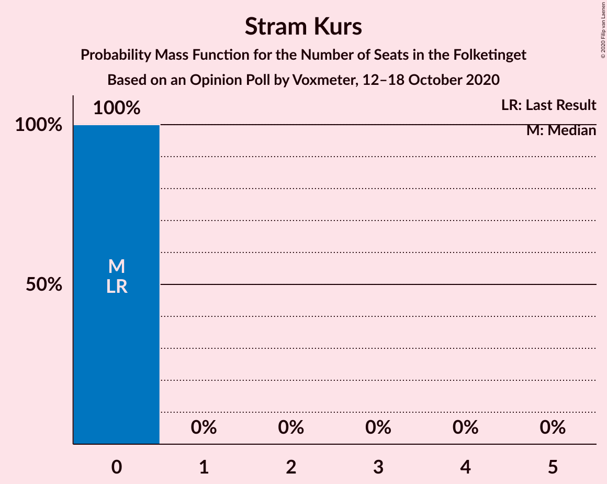
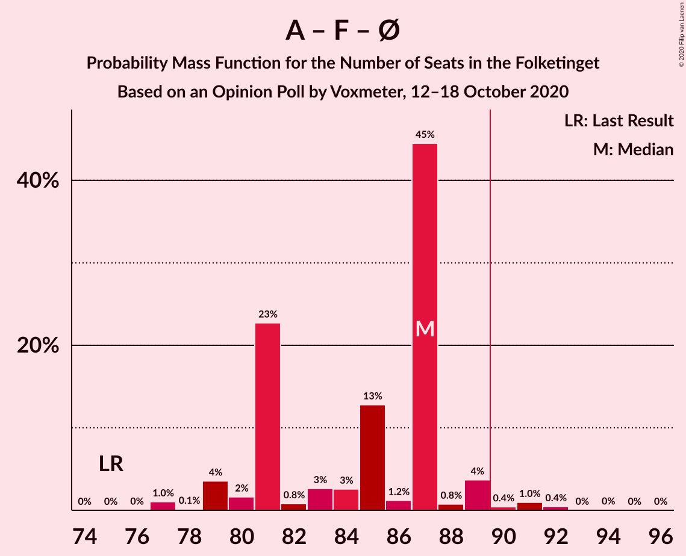

# Opinion Poll by Voxmeter, 12–18 October 2020

<a href="#voting-intentions">Voting Intentions</a> | <a href="#seats">Seats</a> | <a href="#coalitions">Coalitions</a> | <a href="#technical-information">Technical Information</a>

## Voting Intentions

### Confidence Intervals

| Party | Last Result | Poll Result | 80% Confidence Interval | 90% Confidence Interval | 95% Confidence Interval | 99% Confidence Interval |
|:-----:|:-----------:|:-----------:|:-----------------------:|:-----------------------:|:-----------------------:|:-----------------------:|
| Socialdemokraterne | 25.9% | 30.8% | 29.0–32.8% |28.5–33.3% |28.1–33.8% |27.2–34.7% |
| Venstre | 23.4% | 18.3% | 16.8–19.9% |16.4–20.4% |16.0–20.8% |15.3–21.6% |
| Det Konservative Folkeparti | 6.6% | 9.3% | 8.2–10.6% |7.9–11.0% |7.7–11.3% |7.2–11.9% |
| Socialistisk Folkeparti | 7.7% | 8.8% | 7.8–10.1% |7.5–10.4% |7.2–10.7% |6.8–11.4% |
| Radikale Venstre | 8.6% | 7.3% | 6.3–8.4% |6.1–8.7% |5.8–9.0% |5.4–9.6% |
| Enhedslisten–De Rød-Grønne | 6.9% | 7.2% | 6.2–8.3% |6.0–8.6% |5.7–8.9% |5.3–9.5% |
| Dansk Folkeparti | 8.7% | 6.9% | 6.0–8.0% |5.7–8.3% |5.5–8.6% |5.1–9.2% |
| Nye Borgerlige | 2.4% | 4.8% | 4.1–5.8% |3.8–6.1% |3.7–6.3% |3.3–6.8% |
| Liberal Alliance | 2.3% | 2.6% | 2.0–3.3% |1.9–3.5% |1.8–3.7% |1.5–4.1% |
| Kristendemokraterne | 1.7% | 1.7% | 1.2–2.3% |1.1–2.5% |1.0–2.7% |0.9–3.0% |
| Alternativet | 3.0% | 1.1% | 0.8–1.6% |0.7–1.8% |0.6–1.9% |0.5–2.2% |
| Stram Kurs | 1.8% | 0.6% | 0.4–1.0% |0.3–1.2% |0.3–1.3% |0.2–1.5% |
| Veganerpartiet | 0.0% | 0.4% | 0.2–0.8% |0.2–0.9% |0.2–1.0% |0.1–1.2% |

*Note:* The poll result column reflects the actual value used in the calculations. Published results may vary slightly, and in addition be rounded to fewer digits.

## Seats

### Confidence Intervals

| Party | Last Result | Median | 80% Confidence Interval | 90% Confidence Interval | 95% Confidence Interval | 99% Confidence Interval |
|:-----:|:-----------:|:------:|:-----------------------:|:-----------------------:|:-----------------------:|:-----------------------:|
| <a href="#socialdemokraterne">Socialdemokraterne</a> | 48 | 56 | 54–60 |52–60 |51–60 |50–63 |
| <a href="#venstre">Venstre</a> | 43 | 31 | 31–35 |30–35 |29–37 |27–39 |
| <a href="#det-konservative-folkeparti">Det Konservative Folkeparti</a> | 12 | 17 | 16–18 |15–19 |14–20 |13–20 |
| <a href="#socialistisk-folkeparti">Socialistisk Folkeparti</a> | 14 | 17 | 13–19 |13–19 |12–19 |12–19 |
| <a href="#radikale-venstre">Radikale Venstre</a> | 16 | 13 | 13–16 |11–16 |11–16 |10–19 |
| <a href="#enhedslisten–de-rød-grønne">Enhedslisten–De Rød-Grønne</a> | 13 | 12 | 11–14 |11–15 |11–16 |10–17 |
| <a href="#dansk-folkeparti">Dansk Folkeparti</a> | 16 | 14 | 12–15 |11–15 |10–16 |9–16 |
| <a href="#nye-borgerlige">Nye Borgerlige</a> | 4 | 8 | 8–11 |7–11 |7–11 |6–12 |
| <a href="#liberal-alliance">Liberal Alliance</a> | 4 | 4 | 4–5 |4–6 |0–6 |0–7 |
| <a href="#kristendemokraterne">Kristendemokraterne</a> | 0 | 0 | 0–4 |0–4 |0–4 |0–5 |
| <a href="#alternativet">Alternativet</a> | 5 | 0 | 0 |0 |0 |0–4 |
| <a href="#stram-kurs">Stram Kurs</a> | 0 | 0 | 0 |0 |0 |0 |
| <a href="#veganerpartiet">Veganerpartiet</a> | 0 | 0 | 0 |0 |0 |0 |

### Socialdemokraterne

*For a full overview of the results for this party, see the [Socialdemokraterne](party-socialdemokraterne.html) page.*

| Number of Seats | Probability | Accumulated | Special Marks |
|:---------------:|:-----------:|:-----------:|:-------------:|
| 48 | 0% | 100% | Last Result |
| 49 | 0.1% | 99.9% |  |
| 50 | 0.4% | 99.8% |  |
| 51 | 3% | 99.5% |  |
| 52 | 3% | 97% |  |
| 53 | 3% | 94% |  |
| 54 | 24% | 91% |  |
| 55 | 6% | 68% |  |
| 56 | 44% | 62% | Median |
| 57 | 0.9% | 18% |  |
| 58 | 2% | 18% |  |
| 59 | 3% | 15% |  |
| 60 | 11% | 13% |  |
| 61 | 0.8% | 2% |  |
| 62 | 0.5% | 1.1% |  |
| 63 | 0.6% | 0.6% |  |
| 64 | 0% | 0% |  |

### Venstre

*For a full overview of the results for this party, see the [Venstre](party-venstre.html) page.*

| Number of Seats | Probability | Accumulated | Special Marks |
|:---------------:|:-----------:|:-----------:|:-------------:|
| 26 | 0.3% | 100% |  |
| 27 | 0.3% | 99.7% |  |
| 28 | 0.2% | 99.5% |  |
| 29 | 3% | 99.3% |  |
| 30 | 4% | 97% |  |
| 31 | 55% | 93% | Median |
| 32 | 5% | 37% |  |
| 33 | 4% | 33% |  |
| 34 | 2% | 29% |  |
| 35 | 22% | 26% |  |
| 36 | 0.4% | 5% |  |
| 37 | 3% | 4% |  |
| 38 | 0.1% | 2% |  |
| 39 | 2% | 2% |  |
| 40 | 0% | 0% |  |
| 41 | 0% | 0% |  |
| 42 | 0% | 0% |  |
| 43 | 0% | 0% | Last Result |

### Det Konservative Folkeparti

*For a full overview of the results for this party, see the [Det Konservative Folkeparti](party-detkonservativefolkeparti.html) page.*

| Number of Seats | Probability | Accumulated | Special Marks |
|:---------------:|:-----------:|:-----------:|:-------------:|
| 12 | 0.1% | 100% | Last Result |
| 13 | 2% | 99.9% |  |
| 14 | 2% | 98% |  |
| 15 | 5% | 96% |  |
| 16 | 1.4% | 91% |  |
| 17 | 49% | 90% | Median |
| 18 | 35% | 41% |  |
| 19 | 3% | 5% |  |
| 20 | 2% | 3% |  |
| 21 | 0.3% | 0.5% |  |
| 22 | 0.2% | 0.2% |  |
| 23 | 0% | 0% |  |

### Socialistisk Folkeparti

*For a full overview of the results for this party, see the [Socialistisk Folkeparti](party-socialistiskfolkeparti.html) page.*

| Number of Seats | Probability | Accumulated | Special Marks |
|:---------------:|:-----------:|:-----------:|:-------------:|
| 12 | 3% | 100% |  |
| 13 | 12% | 97% |  |
| 14 | 5% | 85% | Last Result |
| 15 | 4% | 80% |  |
| 16 | 26% | 76% |  |
| 17 | 3% | 51% | Median |
| 18 | 3% | 47% |  |
| 19 | 44% | 44% |  |
| 20 | 0.1% | 0.4% |  |
| 21 | 0.2% | 0.3% |  |
| 22 | 0.1% | 0.1% |  |
| 23 | 0% | 0% |  |

### Radikale Venstre

*For a full overview of the results for this party, see the [Radikale Venstre](party-radikalevenstre.html) page.*

| Number of Seats | Probability | Accumulated | Special Marks |
|:---------------:|:-----------:|:-----------:|:-------------:|
| 9 | 0.1% | 100% |  |
| 10 | 1.1% | 99.9% |  |
| 11 | 6% | 98.8% |  |
| 12 | 2% | 93% |  |
| 13 | 58% | 91% | Median |
| 14 | 5% | 32% |  |
| 15 | 3% | 28% |  |
| 16 | 23% | 25% | Last Result |
| 17 | 0.4% | 2% |  |
| 18 | 1.2% | 2% |  |
| 19 | 0.5% | 0.5% |  |
| 20 | 0% | 0% |  |

### Enhedslisten–De Rød-Grønne

*For a full overview of the results for this party, see the [Enhedslisten–De Rød-Grønne](party-enhedslisten–derød-grønne.html) page.*

| Number of Seats | Probability | Accumulated | Special Marks |
|:---------------:|:-----------:|:-----------:|:-------------:|
| 9 | 0.2% | 100% |  |
| 10 | 1.1% | 99.8% |  |
| 11 | 23% | 98.7% |  |
| 12 | 56% | 75% | Median |
| 13 | 6% | 20% | Last Result |
| 14 | 6% | 13% |  |
| 15 | 5% | 8% |  |
| 16 | 2% | 3% |  |
| 17 | 0.3% | 0.8% |  |
| 18 | 0.2% | 0.5% |  |
| 19 | 0.3% | 0.3% |  |
| 20 | 0% | 0% |  |

### Dansk Folkeparti

*For a full overview of the results for this party, see the [Dansk Folkeparti](party-danskfolkeparti.html) page.*

| Number of Seats | Probability | Accumulated | Special Marks |
|:---------------:|:-----------:|:-----------:|:-------------:|
| 9 | 1.3% | 100% |  |
| 10 | 2% | 98.7% |  |
| 11 | 4% | 97% |  |
| 12 | 4% | 93% |  |
| 13 | 37% | 89% |  |
| 14 | 5% | 51% | Median |
| 15 | 43% | 47% |  |
| 16 | 3% | 3% | Last Result |
| 17 | 0.1% | 0.2% |  |
| 18 | 0% | 0% |  |

### Nye Borgerlige

*For a full overview of the results for this party, see the [Nye Borgerlige](party-nyeborgerlige.html) page.*

| Number of Seats | Probability | Accumulated | Special Marks |
|:---------------:|:-----------:|:-----------:|:-------------:|
| 4 | 0% | 100% | Last Result |
| 5 | 0% | 100% |  |
| 6 | 2% | 100% |  |
| 7 | 4% | 98% |  |
| 8 | 66% | 95% | Median |
| 9 | 5% | 29% |  |
| 10 | 9% | 24% |  |
| 11 | 15% | 15% |  |
| 12 | 0.4% | 0.6% |  |
| 13 | 0.1% | 0.2% |  |
| 14 | 0.1% | 0.1% |  |
| 15 | 0% | 0% |  |

### Liberal Alliance

*For a full overview of the results for this party, see the [Liberal Alliance](party-liberalalliance.html) page.*

| Number of Seats | Probability | Accumulated | Special Marks |
|:---------------:|:-----------:|:-----------:|:-------------:|
| 0 | 5% | 100% |  |
| 1 | 0% | 95% |  |
| 2 | 0% | 95% |  |
| 3 | 0% | 95% |  |
| 4 | 82% | 95% | Last Result, Median |
| 5 | 8% | 14% |  |
| 6 | 4% | 6% |  |
| 7 | 2% | 2% |  |
| 8 | 0.2% | 0.4% |  |
| 9 | 0.2% | 0.2% |  |
| 10 | 0% | 0% |  |

### Kristendemokraterne

*For a full overview of the results for this party, see the [Kristendemokraterne](party-kristendemokraterne.html) page.*

| Number of Seats | Probability | Accumulated | Special Marks |
|:---------------:|:-----------:|:-----------:|:-------------:|
| 0 | 88% | 100% | Last Result, Median |
| 1 | 0% | 12% |  |
| 2 | 0% | 12% |  |
| 3 | 0% | 12% |  |
| 4 | 10% | 12% |  |
| 5 | 2% | 2% |  |
| 6 | 0.1% | 0.1% |  |
| 7 | 0% | 0% |  |

### Alternativet

*For a full overview of the results for this party, see the [Alternativet](party-alternativet.html) page.*

| Number of Seats | Probability | Accumulated | Special Marks |
|:---------------:|:-----------:|:-----------:|:-------------:|
| 0 | 98.7% | 100% | Median |
| 1 | 0% | 1.3% |  |
| 2 | 0% | 1.3% |  |
| 3 | 0% | 1.3% |  |
| 4 | 1.3% | 1.3% |  |
| 5 | 0% | 0% | Last Result |

### Stram Kurs

*For a full overview of the results for this party, see the [Stram Kurs](party-stramkurs.html) page.*

| Number of Seats | Probability | Accumulated | Special Marks |
|:---------------:|:-----------:|:-----------:|:-------------:|
| 0 | 100% | 100% | Last Result, Median |

### Veganerpartiet

*For a full overview of the results for this party, see the [Veganerpartiet](party-veganerpartiet.html) page.*

| Number of Seats | Probability | Accumulated | Special Marks |
|:---------------:|:-----------:|:-----------:|:-------------:|
| 0 | 100% | 100% | Last Result, Median |

## Coalitions

### Confidence Intervals

| Coalition | Last Result | Median | Majority? | 80% Confidence Interval | 90% Confidence Interval | 95% Confidence Interval | 99% Confidence Interval |
|:---------:|:-----------:|:------:|:---------:|:-----------------------:|:-----------------------:|:-----------------------:|:-----------------------:|
| Socialdemokraterne – Socialistisk Folkeparti – Radikale Venstre – Enhedslisten–De Rød-Grønne – Alternativet | 96 | 100 | 99.9% | 96–100 | 94–102 | 92–103 | 91–106 |
| Socialdemokraterne – Socialistisk Folkeparti – Radikale Venstre – Enhedslisten–De Rød-Grønne | 91 | 100 | 99.9% | 96–100 | 94–101 | 92–103 | 91–106 |
| Socialdemokraterne – Socialistisk Folkeparti – Enhedslisten–De Rød-Grønne – Alternativet | 80 | 87 | 3% | 81–87 | 80–89 | 79–90 | 77–92 |
| Socialdemokraterne – Socialistisk Folkeparti – Enhedslisten–De Rød-Grønne | 75 | 87 | 2% | 81–87 | 80–89 | 79–89 | 77–92 |
| Socialdemokraterne – Socialistisk Folkeparti – Radikale Venstre | 78 | 87 | 2% | 82–88 | 81–88 | 79–89 | 78–92 |
| Venstre – Det Konservative Folkeparti – Dansk Folkeparti – Nye Borgerlige – Liberal Alliance – Kristendemokraterne | 79 | 75 | 0% | 75–79 | 73–81 | 72–83 | 69–84 |
| Venstre – Det Konservative Folkeparti – Dansk Folkeparti – Nye Borgerlige – Liberal Alliance | 79 | 75 | 0% | 74–78 | 72–80 | 72–81 | 68–82 |
| Socialdemokraterne – Radikale Venstre | 64 | 69 | 0% | 66–73 | 65–73 | 64–74 | 62–78 |
| Venstre – Det Konservative Folkeparti – Dansk Folkeparti – Liberal Alliance – Kristendemokraterne | 75 | 67 | 0% | 66–70 | 64–71 | 62–74 | 61–76 |
| Venstre – Det Konservative Folkeparti – Dansk Folkeparti – Liberal Alliance | 75 | 67 | 0% | 65–70 | 63–70 | 61–71 | 59–72 |
| Venstre – Det Konservative Folkeparti – Liberal Alliance | 59 | 52 | 0% | 52–57 | 51–57 | 48–58 | 47–61 |
| Venstre – Det Konservative Folkeparti | 55 | 48 | 0% | 48–53 | 47–53 | 45–56 | 43–57 |
| Venstre | 43 | 31 | 0% | 31–35 | 30–35 | 29–37 | 27–39 |

### Socialdemokraterne – Socialistisk Folkeparti – Radikale Venstre – Enhedslisten–De Rød-Grønne – Alternativet

| Number of Seats | Probability | Accumulated | Special Marks |
|:---------------:|:-----------:|:-----------:|:-------------:|
| 89 | 0% | 100% |  |
| 90 | 0.1% | 99.9% | Majority |
| 91 | 2% | 99.8% |  |
| 92 | 0.9% | 98% |  |
| 93 | 1.2% | 97% |  |
| 94 | 2% | 96% |  |
| 95 | 2% | 94% |  |
| 96 | 3% | 91% | Last Result |
| 97 | 23% | 89% |  |
| 98 | 12% | 65% | Median |
| 99 | 2% | 54% |  |
| 100 | 45% | 52% |  |
| 101 | 0.9% | 6% |  |
| 102 | 1.3% | 6% |  |
| 103 | 3% | 4% |  |
| 104 | 0.3% | 2% |  |
| 105 | 0.5% | 1.3% |  |
| 106 | 0.5% | 0.9% |  |
| 107 | 0% | 0.3% |  |
| 108 | 0.3% | 0.3% |  |
| 109 | 0% | 0% |  |

### Socialdemokraterne – Socialistisk Folkeparti – Radikale Venstre – Enhedslisten–De Rød-Grønne

| Number of Seats | Probability | Accumulated | Special Marks |
|:---------------:|:-----------:|:-----------:|:-------------:|
| 89 | 0% | 100% |  |
| 90 | 0.1% | 99.9% | Majority |
| 91 | 2% | 99.8% | Last Result |
| 92 | 1.0% | 98% |  |
| 93 | 2% | 97% |  |
| 94 | 2% | 95% |  |
| 95 | 2% | 93% |  |
| 96 | 3% | 91% |  |
| 97 | 23% | 88% |  |
| 98 | 12% | 65% | Median |
| 99 | 2% | 54% |  |
| 100 | 45% | 51% |  |
| 101 | 0.9% | 6% |  |
| 102 | 1.3% | 5% |  |
| 103 | 2% | 4% |  |
| 104 | 0.3% | 2% |  |
| 105 | 0.4% | 1.3% |  |
| 106 | 0.5% | 0.9% |  |
| 107 | 0% | 0.3% |  |
| 108 | 0.3% | 0.3% |  |
| 109 | 0% | 0% |  |

### Socialdemokraterne – Socialistisk Folkeparti – Enhedslisten–De Rød-Grønne – Alternativet

| Number of Seats | Probability | Accumulated | Special Marks |
|:---------------:|:-----------:|:-----------:|:-------------:|
| 77 | 1.0% | 100% |  |
| 78 | 0.1% | 98.9% |  |
| 79 | 4% | 98.8% |  |
| 80 | 1.1% | 95% | Last Result |
| 81 | 23% | 94% |  |
| 82 | 0.8% | 71% |  |
| 83 | 3% | 71% |  |
| 84 | 3% | 68% |  |
| 85 | 13% | 65% | Median |
| 86 | 0.7% | 52% |  |
| 87 | 45% | 52% |  |
| 88 | 0.8% | 7% |  |
| 89 | 4% | 6% |  |
| 90 | 1.0% | 3% | Majority |
| 91 | 1.0% | 2% |  |
| 92 | 0.5% | 0.6% |  |
| 93 | 0% | 0.1% |  |
| 94 | 0% | 0.1% |  |
| 95 | 0% | 0% |  |

### Socialdemokraterne – Socialistisk Folkeparti – Enhedslisten–De Rød-Grønne

| Number of Seats | Probability | Accumulated | Special Marks |
|:---------------:|:-----------:|:-----------:|:-------------:|
| 75 | 0% | 100% | Last Result |
| 76 | 0% | 100% |  |
| 77 | 1.0% | 99.9% |  |
| 78 | 0.1% | 98.9% |  |
| 79 | 4% | 98.8% |  |
| 80 | 2% | 95% |  |
| 81 | 23% | 94% |  |
| 82 | 0.8% | 71% |  |
| 83 | 3% | 70% |  |
| 84 | 3% | 67% |  |
| 85 | 13% | 65% | Median |
| 86 | 1.2% | 52% |  |
| 87 | 45% | 51% |  |
| 88 | 0.8% | 6% |  |
| 89 | 4% | 6% |  |
| 90 | 0.4% | 2% | Majority |
| 91 | 1.0% | 2% |  |
| 92 | 0.4% | 0.5% |  |
| 93 | 0% | 0.1% |  |
| 94 | 0% | 0.1% |  |
| 95 | 0% | 0% |  |

### Socialdemokraterne – Socialistisk Folkeparti – Radikale Venstre

| Number of Seats | Probability | Accumulated | Special Marks |
|:---------------:|:-----------:|:-----------:|:-------------:|
| 76 | 0% | 100% |  |
| 77 | 0% | 99.9% |  |
| 78 | 2% | 99.9% | Last Result |
| 79 | 0.8% | 98% |  |
| 80 | 1.3% | 97% |  |
| 81 | 4% | 96% |  |
| 82 | 3% | 92% |  |
| 83 | 4% | 89% |  |
| 84 | 2% | 86% |  |
| 85 | 2% | 83% |  |
| 86 | 31% | 82% | Median |
| 87 | 1.2% | 50% |  |
| 88 | 45% | 49% |  |
| 89 | 2% | 4% |  |
| 90 | 0.2% | 2% | Majority |
| 91 | 0.4% | 1.3% |  |
| 92 | 0.6% | 1.0% |  |
| 93 | 0% | 0.4% |  |
| 94 | 0.3% | 0.3% |  |
| 95 | 0% | 0% |  |

### Venstre – Det Konservative Folkeparti – Dansk Folkeparti – Nye Borgerlige – Liberal Alliance – Kristendemokraterne

| Number of Seats | Probability | Accumulated | Special Marks |
|:---------------:|:-----------:|:-----------:|:-------------:|
| 67 | 0.3% | 100% |  |
| 68 | 0% | 99.7% |  |
| 69 | 0.5% | 99.7% |  |
| 70 | 0.5% | 99.1% |  |
| 71 | 0.3% | 98.7% |  |
| 72 | 3% | 98% |  |
| 73 | 1.3% | 96% |  |
| 74 | 0.9% | 94% | Median |
| 75 | 45% | 94% |  |
| 76 | 2% | 48% |  |
| 77 | 12% | 46% |  |
| 78 | 23% | 35% |  |
| 79 | 3% | 11% | Last Result |
| 80 | 2% | 9% |  |
| 81 | 2% | 6% |  |
| 82 | 1.2% | 4% |  |
| 83 | 0.9% | 3% |  |
| 84 | 2% | 2% |  |
| 85 | 0.1% | 0.2% |  |
| 86 | 0% | 0.1% |  |
| 87 | 0% | 0% |  |

### Venstre – Det Konservative Folkeparti – Dansk Folkeparti – Nye Borgerlige – Liberal Alliance

| Number of Seats | Probability | Accumulated | Special Marks |
|:---------------:|:-----------:|:-----------:|:-------------:|
| 65 | 0.1% | 100% |  |
| 66 | 0% | 99.9% |  |
| 67 | 0.3% | 99.9% |  |
| 68 | 0.2% | 99.5% |  |
| 69 | 0.9% | 99.3% |  |
| 70 | 0.4% | 98% |  |
| 71 | 0.4% | 98% |  |
| 72 | 4% | 98% |  |
| 73 | 1.5% | 93% |  |
| 74 | 4% | 92% | Median |
| 75 | 46% | 88% |  |
| 76 | 2% | 42% |  |
| 77 | 11% | 40% |  |
| 78 | 21% | 29% |  |
| 79 | 3% | 8% | Last Result |
| 80 | 3% | 5% |  |
| 81 | 2% | 3% |  |
| 82 | 0.4% | 0.8% |  |
| 83 | 0.2% | 0.4% |  |
| 84 | 0.1% | 0.2% |  |
| 85 | 0.1% | 0.1% |  |
| 86 | 0% | 0% |  |

### Socialdemokraterne – Radikale Venstre

| Number of Seats | Probability | Accumulated | Special Marks |
|:---------------:|:-----------:|:-----------:|:-------------:|
| 61 | 0% | 100% |  |
| 62 | 0.4% | 99.9% |  |
| 63 | 2% | 99.5% |  |
| 64 | 1.3% | 98% | Last Result |
| 65 | 4% | 96% |  |
| 66 | 3% | 92% |  |
| 67 | 2% | 90% |  |
| 68 | 3% | 88% |  |
| 69 | 43% | 85% | Median |
| 70 | 21% | 42% |  |
| 71 | 4% | 21% |  |
| 72 | 3% | 17% |  |
| 73 | 11% | 14% |  |
| 74 | 1.4% | 3% |  |
| 75 | 0.1% | 2% |  |
| 76 | 0.6% | 2% |  |
| 77 | 0.2% | 0.9% |  |
| 78 | 0.5% | 0.8% |  |
| 79 | 0.3% | 0.3% |  |
| 80 | 0% | 0% |  |

### Venstre – Det Konservative Folkeparti – Dansk Folkeparti – Liberal Alliance – Kristendemokraterne

| Number of Seats | Probability | Accumulated | Special Marks |
|:---------------:|:-----------:|:-----------:|:-------------:|
| 59 | 0.3% | 100% |  |
| 60 | 0.1% | 99.7% |  |
| 61 | 2% | 99.6% |  |
| 62 | 0.7% | 98% |  |
| 63 | 1.2% | 97% |  |
| 64 | 1.0% | 96% |  |
| 65 | 2% | 95% |  |
| 66 | 11% | 93% | Median |
| 67 | 44% | 82% |  |
| 68 | 4% | 38% |  |
| 69 | 2% | 34% |  |
| 70 | 26% | 32% |  |
| 71 | 2% | 6% |  |
| 72 | 0.9% | 4% |  |
| 73 | 0.8% | 3% |  |
| 74 | 0.2% | 3% |  |
| 75 | 2% | 2% | Last Result |
| 76 | 0.7% | 0.7% |  |
| 77 | 0% | 0.1% |  |
| 78 | 0% | 0% |  |

### Venstre – Det Konservative Folkeparti – Dansk Folkeparti – Liberal Alliance

| Number of Seats | Probability | Accumulated | Special Marks |
|:---------------:|:-----------:|:-----------:|:-------------:|
| 57 | 0.1% | 100% |  |
| 58 | 0% | 99.9% |  |
| 59 | 0.6% | 99.8% |  |
| 60 | 0.1% | 99.3% |  |
| 61 | 2% | 99.1% |  |
| 62 | 0.9% | 97% |  |
| 63 | 1.4% | 96% |  |
| 64 | 3% | 95% |  |
| 65 | 2% | 92% |  |
| 66 | 14% | 89% | Median |
| 67 | 44% | 75% |  |
| 68 | 3% | 31% |  |
| 69 | 2% | 28% |  |
| 70 | 23% | 26% |  |
| 71 | 2% | 3% |  |
| 72 | 0.6% | 1.1% |  |
| 73 | 0.2% | 0.5% |  |
| 74 | 0% | 0.2% |  |
| 75 | 0% | 0.2% | Last Result |
| 76 | 0.1% | 0.2% |  |
| 77 | 0% | 0% |  |

### Venstre – Det Konservative Folkeparti – Liberal Alliance

| Number of Seats | Probability | Accumulated | Special Marks |
|:---------------:|:-----------:|:-----------:|:-------------:|
| 45 | 0.1% | 100% |  |
| 46 | 0.1% | 99.9% |  |
| 47 | 1.4% | 99.8% |  |
| 48 | 0.9% | 98% |  |
| 49 | 1.3% | 97% |  |
| 50 | 0.8% | 96% |  |
| 51 | 1.5% | 95% |  |
| 52 | 47% | 94% | Median |
| 53 | 13% | 47% |  |
| 54 | 2% | 34% |  |
| 55 | 4% | 31% |  |
| 56 | 2% | 28% |  |
| 57 | 22% | 25% |  |
| 58 | 2% | 4% |  |
| 59 | 0.8% | 2% | Last Result |
| 60 | 0.2% | 1.2% |  |
| 61 | 0.7% | 1.0% |  |
| 62 | 0.2% | 0.3% |  |
| 63 | 0.1% | 0.1% |  |
| 64 | 0% | 0% |  |

### Venstre – Det Konservative Folkeparti

| Number of Seats | Probability | Accumulated | Special Marks |
|:---------------:|:-----------:|:-----------:|:-------------:|
| 42 | 0.1% | 100% |  |
| 43 | 2% | 99.9% |  |
| 44 | 0.3% | 98% |  |
| 45 | 0.6% | 98% |  |
| 46 | 1.5% | 97% |  |
| 47 | 1.2% | 96% |  |
| 48 | 48% | 94% | Median |
| 49 | 15% | 46% |  |
| 50 | 3% | 31% |  |
| 51 | 3% | 29% |  |
| 52 | 2% | 26% |  |
| 53 | 21% | 24% |  |
| 54 | 0.3% | 3% |  |
| 55 | 0.2% | 3% | Last Result |
| 56 | 0.8% | 3% |  |
| 57 | 2% | 2% |  |
| 58 | 0% | 0.1% |  |
| 59 | 0% | 0.1% |  |
| 60 | 0% | 0% |  |

### Venstre

| Number of Seats | Probability | Accumulated | Special Marks |
|:---------------:|:-----------:|:-----------:|:-------------:|
| 26 | 0.3% | 100% |  |
| 27 | 0.3% | 99.7% |  |
| 28 | 0.2% | 99.5% |  |
| 29 | 3% | 99.3% |  |
| 30 | 4% | 97% |  |
| 31 | 55% | 93% | Median |
| 32 | 5% | 37% |  |
| 33 | 4% | 33% |  |
| 34 | 2% | 29% |  |
| 35 | 22% | 26% |  |
| 36 | 0.4% | 5% |  |
| 37 | 3% | 4% |  |
| 38 | 0.1% | 2% |  |
| 39 | 2% | 2% |  |
| 40 | 0% | 0% |  |
| 41 | 0% | 0% |  |
| 42 | 0% | 0% |  |
| 43 | 0% | 0% | Last Result |

## Technical Information

### Opinion Poll

+ **Polling firm:** Voxmeter
+ **Commissioner(s):** —
+ **Fieldwork period:** 12–18 October 2020

### Calculations

+ **Sample size:** 1018
+ **Simulations done:** 1,048,576
+ **Error estimate:** 2.30%

