# Opinion Poll by Megafon for Politiken and TV 2, 19–22 October 2020

<a href="#voting-intentions">Voting Intentions</a> | <a href="#seats">Seats</a> | <a href="#coalitions">Coalitions</a> | <a href="#technical-information">Technical Information</a>

## Voting Intentions

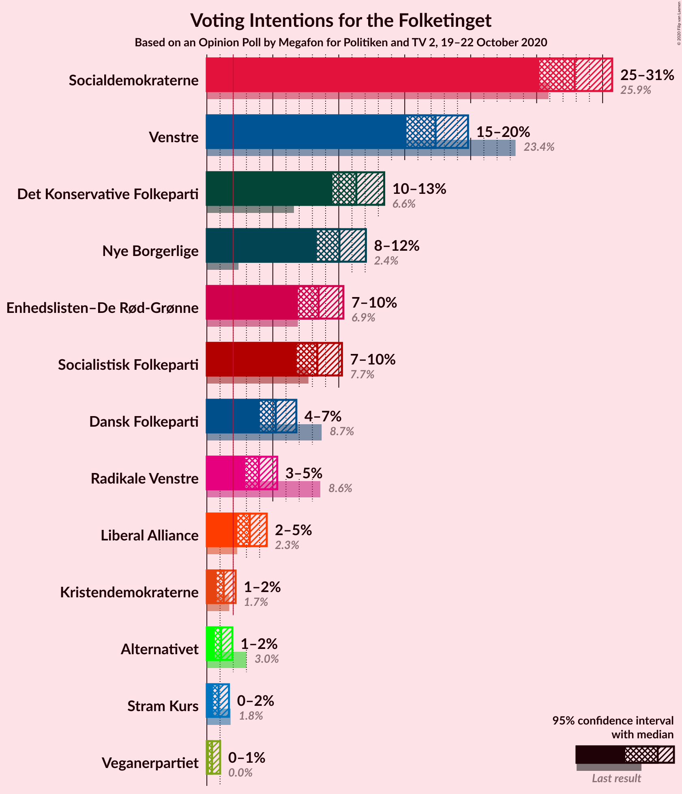

### Confidence Intervals

| Party | Last Result | Poll Result | 80% Confidence Interval | 90% Confidence Interval | 95% Confidence Interval | 99% Confidence Interval |
|:-----:|:-----------:|:-----------:|:-----------------------:|:-----------------------:|:-----------------------:|:-----------------------:|
| Socialdemokraterne | 25.9% | 27.9% | 26.1–29.8% |25.6–30.3% |25.2–30.7% |24.4–31.6% |
| Venstre | 23.4% | 17.3% | 15.9–18.9% |15.5–19.4% |15.1–19.8% |14.5–20.6% |
| Det Konservative Folkeparti | 6.6% | 11.3% | 10.1–12.7% |9.8–13.1% |9.5–13.4% |9.0–14.1% |
| Nye Borgerlige | 2.4% | 10.0% | 8.9–11.4% |8.6–11.7% |8.3–12.1% |7.8–12.7% |
| Enhedslisten–De Rød-Grønne | 6.9% | 8.5% | 7.4–9.7% |7.1–10.0% |6.9–10.3% |6.4–11.0% |
| Socialistisk Folkeparti | 7.7% | 8.4% | 7.3–9.6% |7.1–9.9% |6.8–10.2% |6.4–10.9% |
| Dansk Folkeparti | 8.7% | 5.2% | 4.4–6.2% |4.2–6.5% |4.0–6.8% |3.7–7.3% |
| Radikale Venstre | 8.6% | 3.9% | 3.3–4.8% |3.1–5.1% |2.9–5.3% |2.6–5.8% |
| Liberal Alliance | 2.3% | 3.3% | 2.6–4.1% |2.5–4.3% |2.3–4.5% |2.1–5.0% |
| Kristendemokraterne | 1.7% | 1.3% | 0.9–1.9% |0.8–2.0% |0.7–2.2% |0.6–2.5% |
| Alternativet | 3.0% | 1.1% | 0.8–1.6% |0.7–1.8% |0.6–1.9% |0.5–2.2% |
| Stram Kurs | 1.8% | 0.9% | 0.6–1.4% |0.5–1.6% |0.5–1.7% |0.4–2.0% |
| Veganerpartiet | 0.0% | 0.4% | 0.2–0.8% |0.2–0.9% |0.2–1.0% |0.1–1.2% |

*Note:* The poll result column reflects the actual value used in the calculations. Published results may vary slightly, and in addition be rounded to fewer digits.

## Seats

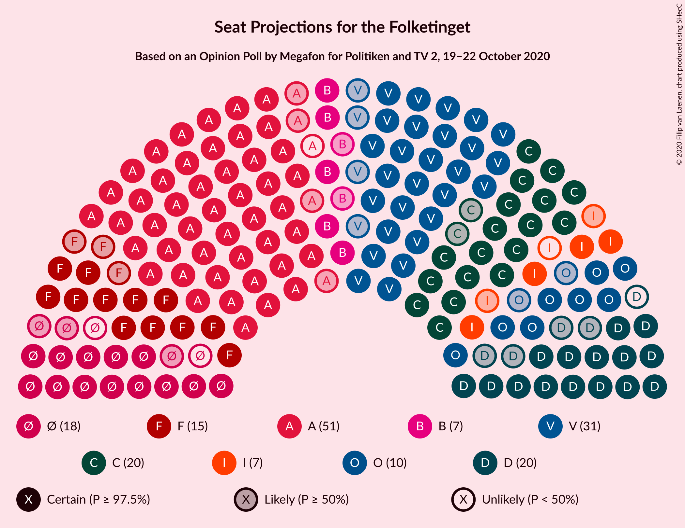

### Confidence Intervals

| Party | Last Result | Median | 80% Confidence Interval | 90% Confidence Interval | 95% Confidence Interval | 99% Confidence Interval |
|:-----:|:-----------:|:------:|:-----------------------:|:-----------------------:|:-----------------------:|:-----------------------:|
| <a href="#socialdemokraterne">Socialdemokraterne</a> | 48 | 50 | 46–55 |46–57 |46–57 |45–60 |
| <a href="#venstre">Venstre</a> | 43 | 31 | 28–33 |28–34 |27–35 |26–37 |
| <a href="#det-konservative-folkeparti">Det Konservative Folkeparti</a> | 12 | 20 | 18–25 |18–25 |18–25 |16–25 |
| <a href="#nye-borgerlige">Nye Borgerlige</a> | 4 | 19 | 16–21 |16–21 |15–22 |14–22 |
| <a href="#enhedslisten–de-rød-grønne">Enhedslisten–De Rød-Grønne</a> | 13 | 16 | 14–18 |13–19 |13–19 |11–19 |
| <a href="#socialistisk-folkeparti">Socialistisk Folkeparti</a> | 14 | 15 | 14–18 |13–18 |12–18 |11–19 |
| <a href="#dansk-folkeparti">Dansk Folkeparti</a> | 16 | 10 | 8–13 |8–13 |8–13 |6–13 |
| <a href="#radikale-venstre">Radikale Venstre</a> | 16 | 7 | 6–8 |5–10 |5–10 |5–11 |
| <a href="#liberal-alliance">Liberal Alliance</a> | 4 | 6 | 4–7 |4–7 |4–8 |4–9 |
| <a href="#kristendemokraterne">Kristendemokraterne</a> | 0 | 0 | 0 |0 |0–4 |0–5 |
| <a href="#alternativet">Alternativet</a> | 5 | 0 | 0 |0 |0–4 |0–4 |
| <a href="#stram-kurs">Stram Kurs</a> | 0 | 0 | 0 |0 |0 |0–4 |
| <a href="#veganerpartiet">Veganerpartiet</a> | 0 | 0 | 0 |0 |0 |0 |

### Socialdemokraterne

*For a full overview of the results for this party, see the [Socialdemokraterne](party-socialdemokraterne.html) page.*

| Number of Seats | Probability | Accumulated | Special Marks |
|:---------------:|:-----------:|:-----------:|:-------------:|
| 43 | 0.2% | 100% |  |
| 44 | 0.1% | 99.8% |  |
| 45 | 0.7% | 99.7% |  |
| 46 | 18% | 99.0% |  |
| 47 | 5% | 82% |  |
| 48 | 9% | 76% | Last Result |
| 49 | 15% | 67% |  |
| 50 | 3% | 52% | Median |
| 51 | 20% | 50% |  |
| 52 | 12% | 30% |  |
| 53 | 6% | 18% |  |
| 54 | 1.3% | 12% |  |
| 55 | 3% | 11% |  |
| 56 | 1.1% | 8% |  |
| 57 | 5% | 7% |  |
| 58 | 0.7% | 2% |  |
| 59 | 0% | 1.2% |  |
| 60 | 1.1% | 1.1% |  |
| 61 | 0% | 0% |  |

### Venstre

*For a full overview of the results for this party, see the [Venstre](party-venstre.html) page.*

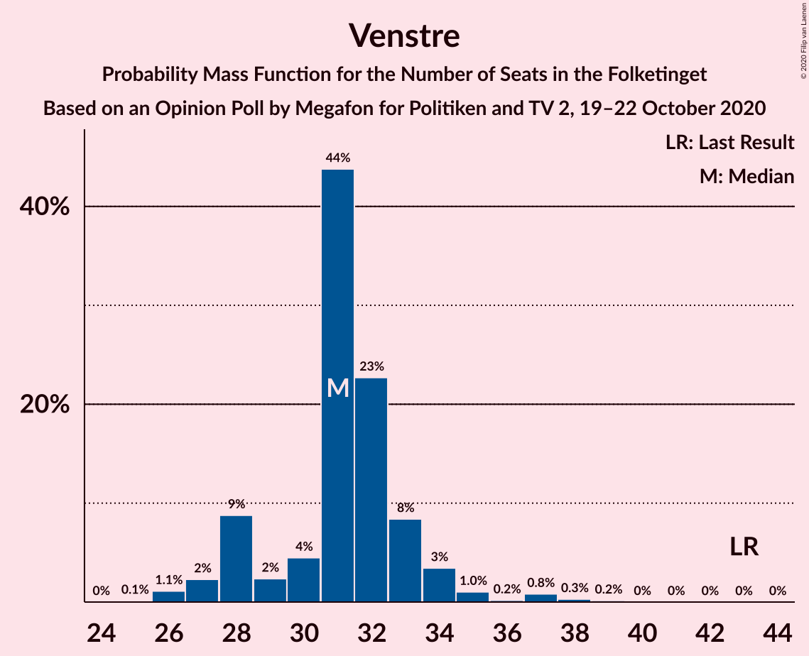

| Number of Seats | Probability | Accumulated | Special Marks |
|:---------------:|:-----------:|:-----------:|:-------------:|
| 25 | 0.1% | 100% |  |
| 26 | 1.1% | 99.9% |  |
| 27 | 2% | 98.7% |  |
| 28 | 9% | 96% |  |
| 29 | 2% | 88% |  |
| 30 | 4% | 85% |  |
| 31 | 44% | 81% | Median |
| 32 | 23% | 37% |  |
| 33 | 8% | 14% |  |
| 34 | 3% | 6% |  |
| 35 | 1.0% | 3% |  |
| 36 | 0.2% | 1.5% |  |
| 37 | 0.8% | 1.3% |  |
| 38 | 0.3% | 0.5% |  |
| 39 | 0.2% | 0.2% |  |
| 40 | 0% | 0% |  |
| 41 | 0% | 0% |  |
| 42 | 0% | 0% |  |
| 43 | 0% | 0% | Last Result |

### Det Konservative Folkeparti

*For a full overview of the results for this party, see the [Det Konservative Folkeparti](party-detkonservativefolkeparti.html) page.*

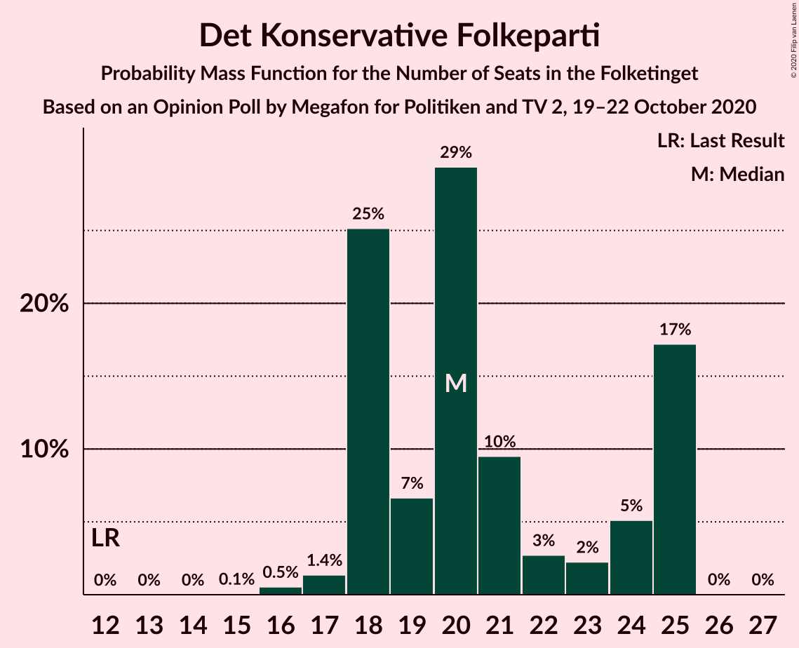

| Number of Seats | Probability | Accumulated | Special Marks |
|:---------------:|:-----------:|:-----------:|:-------------:|
| 12 | 0% | 100% | Last Result |
| 13 | 0% | 100% |  |
| 14 | 0% | 100% |  |
| 15 | 0.1% | 100% |  |
| 16 | 0.5% | 99.9% |  |
| 17 | 1.4% | 99.4% |  |
| 18 | 25% | 98% |  |
| 19 | 7% | 73% |  |
| 20 | 29% | 66% | Median |
| 21 | 10% | 37% |  |
| 22 | 3% | 27% |  |
| 23 | 2% | 25% |  |
| 24 | 5% | 22% |  |
| 25 | 17% | 17% |  |
| 26 | 0% | 0.1% |  |
| 27 | 0% | 0% |  |

### Nye Borgerlige

*For a full overview of the results for this party, see the [Nye Borgerlige](party-nyeborgerlige.html) page.*

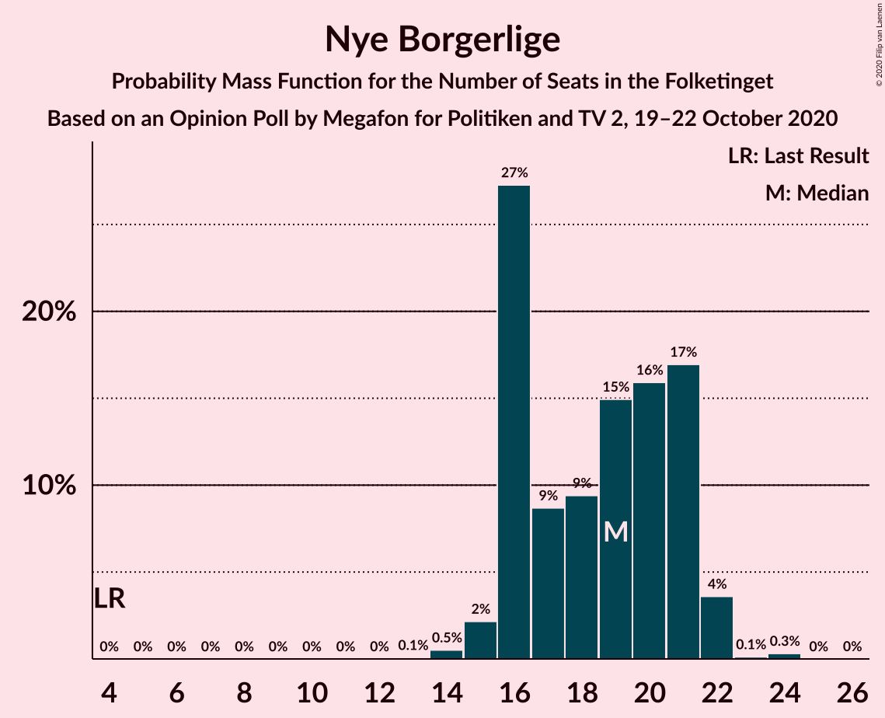

| Number of Seats | Probability | Accumulated | Special Marks |
|:---------------:|:-----------:|:-----------:|:-------------:|
| 4 | 0% | 100% | Last Result |
| 5 | 0% | 100% |  |
| 6 | 0% | 100% |  |
| 7 | 0% | 100% |  |
| 8 | 0% | 100% |  |
| 9 | 0% | 100% |  |
| 10 | 0% | 100% |  |
| 11 | 0% | 100% |  |
| 12 | 0% | 100% |  |
| 13 | 0.1% | 100% |  |
| 14 | 0.5% | 99.9% |  |
| 15 | 2% | 99.4% |  |
| 16 | 27% | 97% |  |
| 17 | 9% | 70% |  |
| 18 | 9% | 61% |  |
| 19 | 15% | 52% | Median |
| 20 | 16% | 37% |  |
| 21 | 17% | 21% |  |
| 22 | 4% | 4% |  |
| 23 | 0.1% | 0.5% |  |
| 24 | 0.3% | 0.3% |  |
| 25 | 0% | 0% |  |

### Enhedslisten–De Rød-Grønne

*For a full overview of the results for this party, see the [Enhedslisten–De Rød-Grønne](party-enhedslisten–derød-grønne.html) page.*

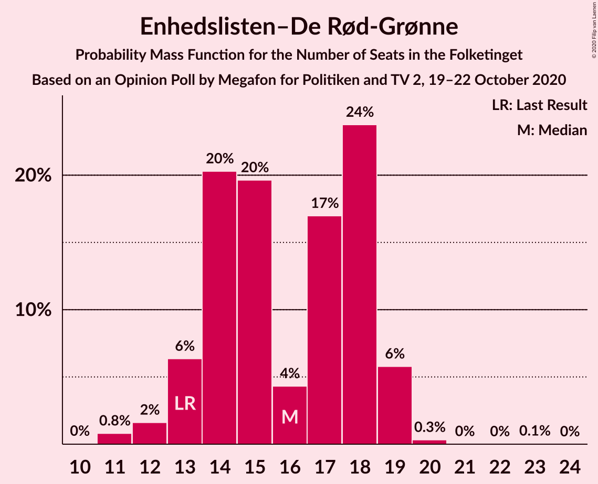

| Number of Seats | Probability | Accumulated | Special Marks |
|:---------------:|:-----------:|:-----------:|:-------------:|
| 11 | 0.8% | 100% |  |
| 12 | 2% | 99.2% |  |
| 13 | 6% | 98% | Last Result |
| 14 | 20% | 91% |  |
| 15 | 20% | 71% |  |
| 16 | 4% | 51% | Median |
| 17 | 17% | 47% |  |
| 18 | 24% | 30% |  |
| 19 | 6% | 6% |  |
| 20 | 0.3% | 0.4% |  |
| 21 | 0% | 0.1% |  |
| 22 | 0% | 0.1% |  |
| 23 | 0.1% | 0.1% |  |
| 24 | 0% | 0% |  |

### Socialistisk Folkeparti

*For a full overview of the results for this party, see the [Socialistisk Folkeparti](party-socialistiskfolkeparti.html) page.*

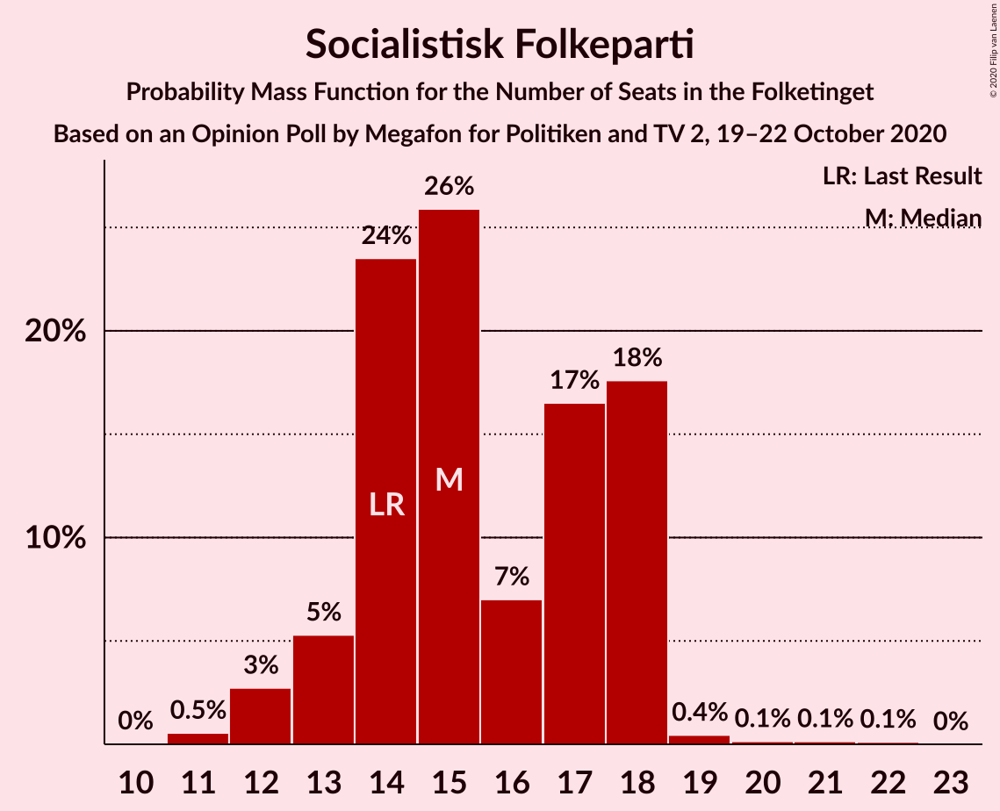

| Number of Seats | Probability | Accumulated | Special Marks |
|:---------------:|:-----------:|:-----------:|:-------------:|
| 11 | 0.5% | 100% |  |
| 12 | 3% | 99.4% |  |
| 13 | 5% | 97% |  |
| 14 | 24% | 91% | Last Result |
| 15 | 26% | 68% | Median |
| 16 | 7% | 42% |  |
| 17 | 17% | 35% |  |
| 18 | 18% | 18% |  |
| 19 | 0.4% | 0.8% |  |
| 20 | 0.1% | 0.4% |  |
| 21 | 0.1% | 0.3% |  |
| 22 | 0.1% | 0.1% |  |
| 23 | 0% | 0% |  |

### Dansk Folkeparti

*For a full overview of the results for this party, see the [Dansk Folkeparti](party-danskfolkeparti.html) page.*

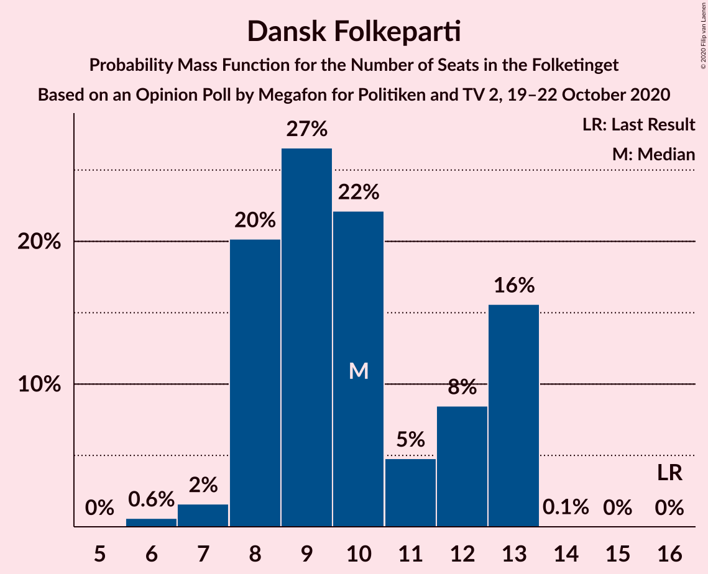

| Number of Seats | Probability | Accumulated | Special Marks |
|:---------------:|:-----------:|:-----------:|:-------------:|
| 6 | 0.6% | 100% |  |
| 7 | 2% | 99.4% |  |
| 8 | 20% | 98% |  |
| 9 | 27% | 78% |  |
| 10 | 22% | 51% | Median |
| 11 | 5% | 29% |  |
| 12 | 8% | 24% |  |
| 13 | 16% | 16% |  |
| 14 | 0.1% | 0.1% |  |
| 15 | 0% | 0% |  |
| 16 | 0% | 0% | Last Result |

### Radikale Venstre

*For a full overview of the results for this party, see the [Radikale Venstre](party-radikalevenstre.html) page.*

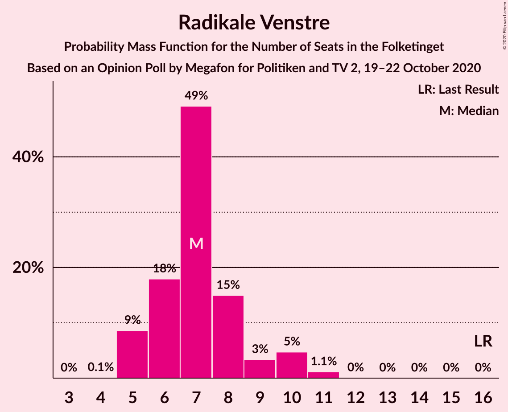

| Number of Seats | Probability | Accumulated | Special Marks |
|:---------------:|:-----------:|:-----------:|:-------------:|
| 4 | 0.1% | 100% |  |
| 5 | 9% | 99.9% |  |
| 6 | 18% | 91% |  |
| 7 | 49% | 73% | Median |
| 8 | 15% | 24% |  |
| 9 | 3% | 9% |  |
| 10 | 5% | 6% |  |
| 11 | 1.1% | 1.2% |  |
| 12 | 0% | 0% |  |
| 13 | 0% | 0% |  |
| 14 | 0% | 0% |  |
| 15 | 0% | 0% |  |
| 16 | 0% | 0% | Last Result |

### Liberal Alliance

*For a full overview of the results for this party, see the [Liberal Alliance](party-liberalalliance.html) page.*

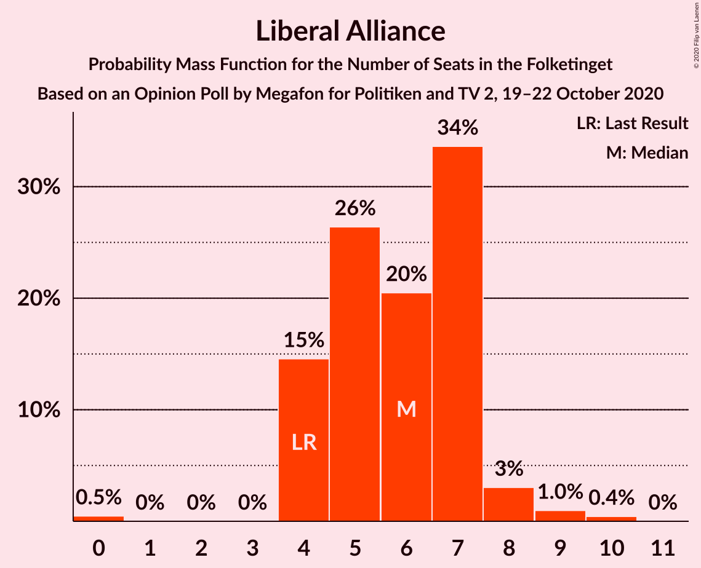

| Number of Seats | Probability | Accumulated | Special Marks |
|:---------------:|:-----------:|:-----------:|:-------------:|
| 0 | 0.5% | 100% |  |
| 1 | 0% | 99.5% |  |
| 2 | 0% | 99.5% |  |
| 3 | 0% | 99.5% |  |
| 4 | 15% | 99.5% | Last Result |
| 5 | 26% | 85% |  |
| 6 | 20% | 59% | Median |
| 7 | 34% | 38% |  |
| 8 | 3% | 4% |  |
| 9 | 1.0% | 1.4% |  |
| 10 | 0.4% | 0.4% |  |
| 11 | 0% | 0% |  |

### Kristendemokraterne

*For a full overview of the results for this party, see the [Kristendemokraterne](party-kristendemokraterne.html) page.*

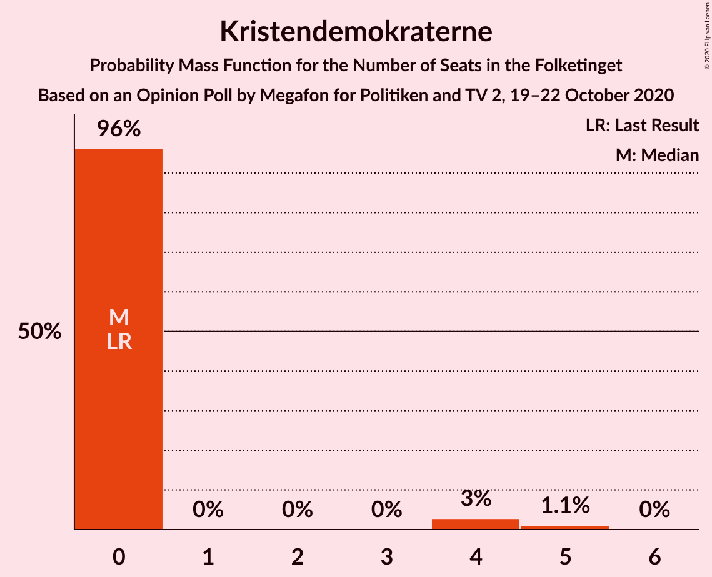

| Number of Seats | Probability | Accumulated | Special Marks |
|:---------------:|:-----------:|:-----------:|:-------------:|
| 0 | 96% | 100% | Last Result, Median |
| 1 | 0% | 4% |  |
| 2 | 0% | 4% |  |
| 3 | 0% | 4% |  |
| 4 | 3% | 4% |  |
| 5 | 1.1% | 1.1% |  |
| 6 | 0% | 0% |  |

### Alternativet

*For a full overview of the results for this party, see the [Alternativet](party-alternativet.html) page.*

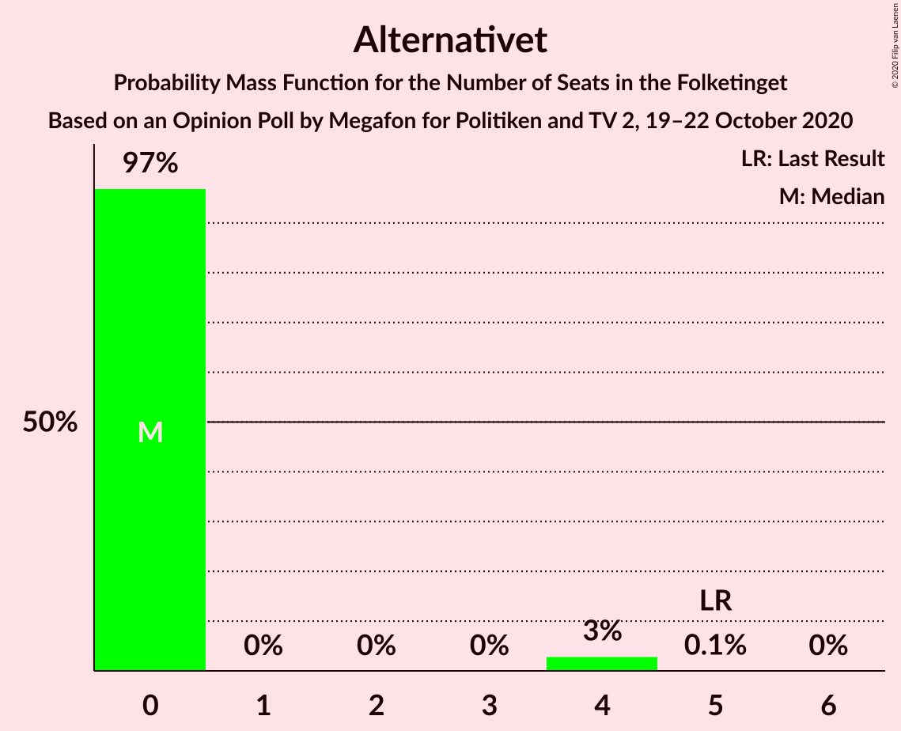

| Number of Seats | Probability | Accumulated | Special Marks |
|:---------------:|:-----------:|:-----------:|:-------------:|
| 0 | 97% | 100% | Median |
| 1 | 0% | 3% |  |
| 2 | 0% | 3% |  |
| 3 | 0% | 3% |  |
| 4 | 3% | 3% |  |
| 5 | 0.1% | 0.1% | Last Result |
| 6 | 0% | 0% |  |

### Stram Kurs

*For a full overview of the results for this party, see the [Stram Kurs](party-stramkurs.html) page.*

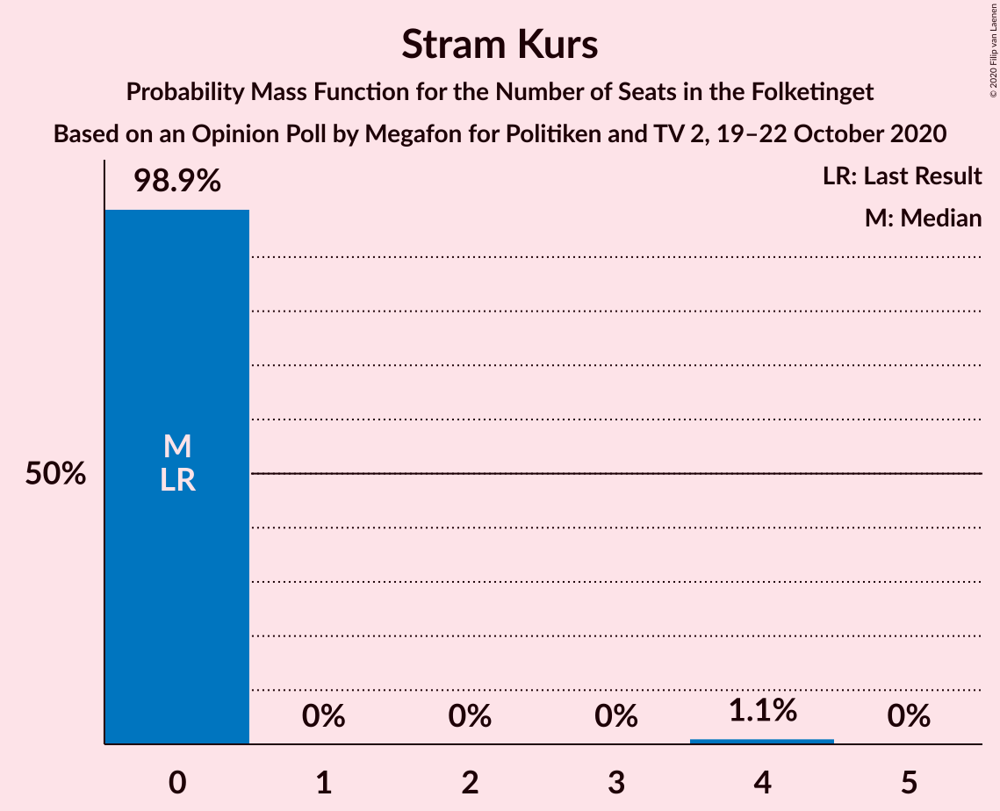

| Number of Seats | Probability | Accumulated | Special Marks |
|:---------------:|:-----------:|:-----------:|:-------------:|
| 0 | 98.9% | 100% | Last Result, Median |
| 1 | 0% | 1.1% |  |
| 2 | 0% | 1.1% |  |
| 3 | 0% | 1.1% |  |
| 4 | 1.1% | 1.1% |  |
| 5 | 0% | 0% |  |

### Veganerpartiet

*For a full overview of the results for this party, see the [Veganerpartiet](party-veganerpartiet.html) page.*

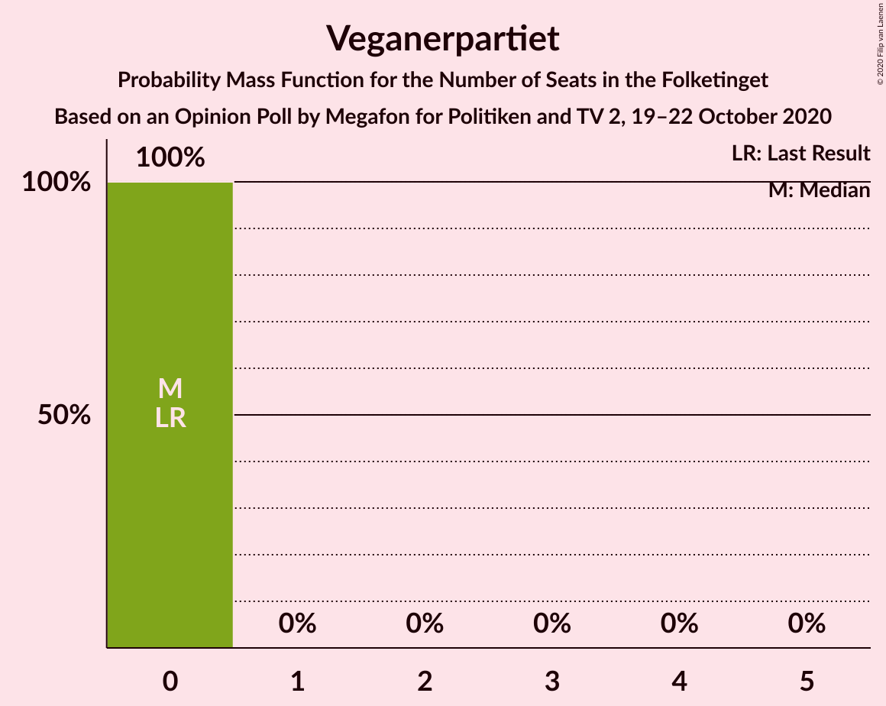

| Number of Seats | Probability | Accumulated | Special Marks |
|:---------------:|:-----------:|:-----------:|:-------------:|
| 0 | 100% | 100% | Last Result, Median |

## Coalitions

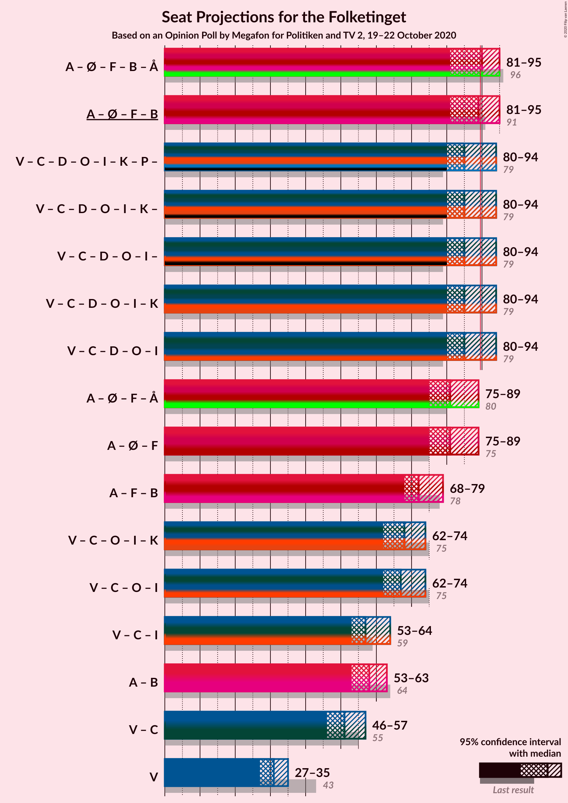

### Confidence Intervals

| Coalition | Last Result | Median | Majority? | 80% Confidence Interval | 90% Confidence Interval | 95% Confidence Interval | 99% Confidence Interval |
|:---------:|:-----------:|:------:|:---------:|:-----------------------:|:-----------------------:|:-----------------------:|:-----------------------:|
| Socialdemokraterne – Enhedslisten–De Rød-Grønne – Socialistisk Folkeparti – Radikale Venstre – Alternativet | 96 | 90 | 51% | 82–94 | 82–94 | 81–95 | 81–96 |
| Socialdemokraterne – Enhedslisten–De Rød-Grønne – Socialistisk Folkeparti – Radikale Venstre | 91 | 89 | 49% | 82–94 | 82–94 | 81–95 | 81–96 |
| Venstre – Det Konservative Folkeparti – Nye Borgerlige – Dansk Folkeparti – Liberal Alliance – Kristendemokraterne | 79 | 85 | 26% | 81–93 | 81–93 | 80–94 | 79–94 |
| Venstre – Det Konservative Folkeparti – Nye Borgerlige – Dansk Folkeparti – Liberal Alliance | 79 | 85 | 24% | 81–93 | 81–93 | 80–94 | 79–94 |
| Socialdemokraterne – Enhedslisten–De Rød-Grønne – Socialistisk Folkeparti – Alternativet | 80 | 81 | 0.4% | 75–87 | 75–89 | 75–89 | 74–89 |
| Socialdemokraterne – Enhedslisten–De Rød-Grønne – Socialistisk Folkeparti | 75 | 81 | 0.4% | 75–87 | 75–89 | 75–89 | 74–89 |
| Socialdemokraterne – Socialistisk Folkeparti – Radikale Venstre | 78 | 72 | 0% | 68–77 | 68–79 | 68–79 | 67–80 |
| Venstre – Det Konservative Folkeparti – Dansk Folkeparti – Liberal Alliance – Kristendemokraterne | 75 | 68 | 0% | 64–72 | 64–73 | 62–74 | 61–76 |
| Venstre – Det Konservative Folkeparti – Dansk Folkeparti – Liberal Alliance | 75 | 67 | 0% | 64–72 | 63–72 | 62–74 | 61–76 |
| Venstre – Det Konservative Folkeparti – Liberal Alliance | 59 | 57 | 0% | 55–62 | 53–62 | 53–64 | 51–65 |
| Socialdemokraterne – Radikale Venstre | 64 | 58 | 0% | 53–61 | 53–62 | 53–63 | 53–66 |
| Venstre – Det Konservative Folkeparti | 55 | 51 | 0% | 49–57 | 48–57 | 46–57 | 46–59 |
| Venstre | 43 | 31 | 0% | 28–33 | 28–34 | 27–35 | 26–37 |

### Socialdemokraterne – Enhedslisten–De Rød-Grønne – Socialistisk Folkeparti – Radikale Venstre – Alternativet

| Number of Seats | Probability | Accumulated | Special Marks |
|:---------------:|:-----------:|:-----------:|:-------------:|
| 80 | 0.1% | 100% |  |
| 81 | 3% | 99.9% |  |
| 82 | 16% | 97% |  |
| 83 | 2% | 82% |  |
| 84 | 3% | 80% |  |
| 85 | 3% | 77% |  |
| 86 | 3% | 74% |  |
| 87 | 15% | 71% |  |
| 88 | 2% | 56% | Median |
| 89 | 2% | 53% |  |
| 90 | 16% | 51% | Majority |
| 91 | 1.0% | 36% |  |
| 92 | 2% | 35% |  |
| 93 | 4% | 33% |  |
| 94 | 26% | 29% |  |
| 95 | 0.9% | 3% |  |
| 96 | 2% | 2% | Last Result |
| 97 | 0.1% | 0.2% |  |
| 98 | 0.1% | 0.1% |  |
| 99 | 0% | 0% |  |

### Socialdemokraterne – Enhedslisten–De Rød-Grønne – Socialistisk Folkeparti – Radikale Venstre

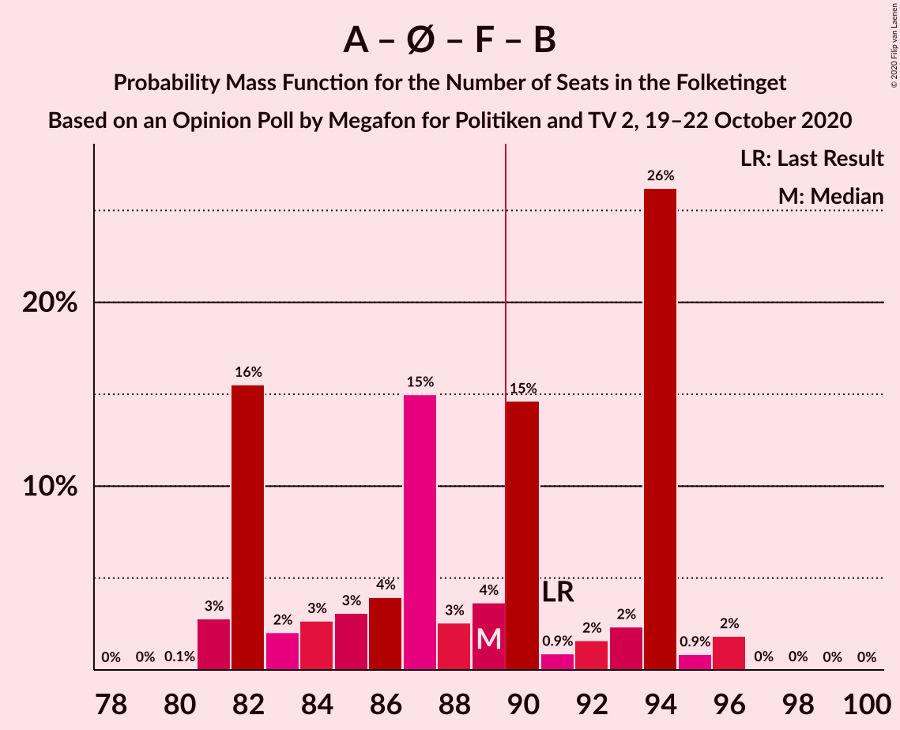

| Number of Seats | Probability | Accumulated | Special Marks |
|:---------------:|:-----------:|:-----------:|:-------------:|
| 80 | 0.1% | 100% |  |
| 81 | 3% | 99.9% |  |
| 82 | 16% | 97% |  |
| 83 | 2% | 82% |  |
| 84 | 3% | 80% |  |
| 85 | 3% | 77% |  |
| 86 | 4% | 74% |  |
| 87 | 15% | 70% |  |
| 88 | 3% | 55% | Median |
| 89 | 4% | 52% |  |
| 90 | 15% | 49% | Majority |
| 91 | 0.9% | 34% | Last Result |
| 92 | 2% | 33% |  |
| 93 | 2% | 31% |  |
| 94 | 26% | 29% |  |
| 95 | 0.9% | 3% |  |
| 96 | 2% | 2% |  |
| 97 | 0% | 0.1% |  |
| 98 | 0% | 0.1% |  |
| 99 | 0% | 0% |  |

### Venstre – Det Konservative Folkeparti – Nye Borgerlige – Dansk Folkeparti – Liberal Alliance – Kristendemokraterne

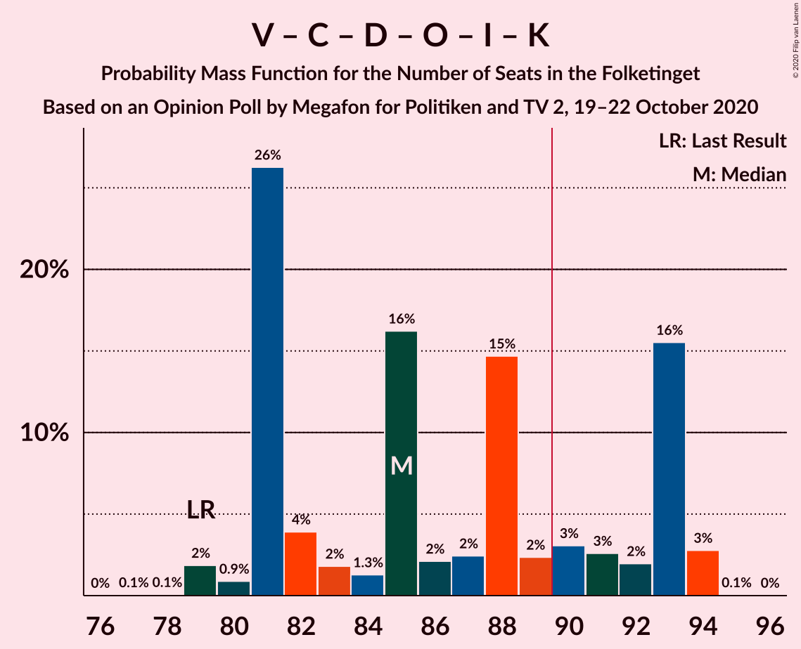

| Number of Seats | Probability | Accumulated | Special Marks |
|:---------------:|:-----------:|:-----------:|:-------------:|
| 77 | 0.1% | 100% |  |
| 78 | 0.1% | 99.9% |  |
| 79 | 2% | 99.8% | Last Result |
| 80 | 0.9% | 98% |  |
| 81 | 26% | 97% |  |
| 82 | 4% | 71% |  |
| 83 | 2% | 67% |  |
| 84 | 1.3% | 65% |  |
| 85 | 16% | 64% |  |
| 86 | 2% | 48% | Median |
| 87 | 2% | 46% |  |
| 88 | 15% | 43% |  |
| 89 | 2% | 28% |  |
| 90 | 3% | 26% | Majority |
| 91 | 3% | 23% |  |
| 92 | 2% | 20% |  |
| 93 | 16% | 18% |  |
| 94 | 3% | 3% |  |
| 95 | 0.1% | 0.1% |  |
| 96 | 0% | 0% |  |

### Venstre – Det Konservative Folkeparti – Nye Borgerlige – Dansk Folkeparti – Liberal Alliance

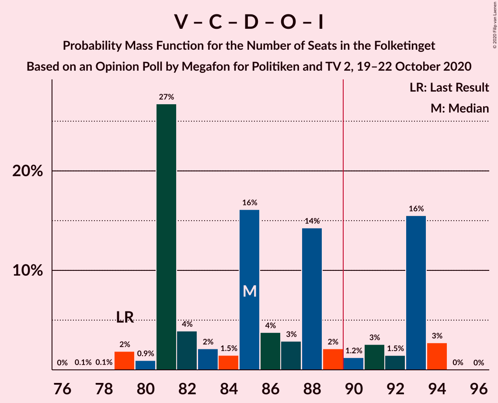

| Number of Seats | Probability | Accumulated | Special Marks |
|:---------------:|:-----------:|:-----------:|:-------------:|
| 77 | 0.1% | 100% |  |
| 78 | 0.1% | 99.9% |  |
| 79 | 2% | 99.8% | Last Result |
| 80 | 0.9% | 98% |  |
| 81 | 27% | 97% |  |
| 82 | 4% | 70% |  |
| 83 | 2% | 66% |  |
| 84 | 1.5% | 64% |  |
| 85 | 16% | 63% |  |
| 86 | 4% | 47% | Median |
| 87 | 3% | 43% |  |
| 88 | 14% | 40% |  |
| 89 | 2% | 26% |  |
| 90 | 1.2% | 24% | Majority |
| 91 | 3% | 22% |  |
| 92 | 1.5% | 20% |  |
| 93 | 16% | 18% |  |
| 94 | 3% | 3% |  |
| 95 | 0% | 0.1% |  |
| 96 | 0% | 0% |  |

### Socialdemokraterne – Enhedslisten–De Rød-Grønne – Socialistisk Folkeparti – Alternativet

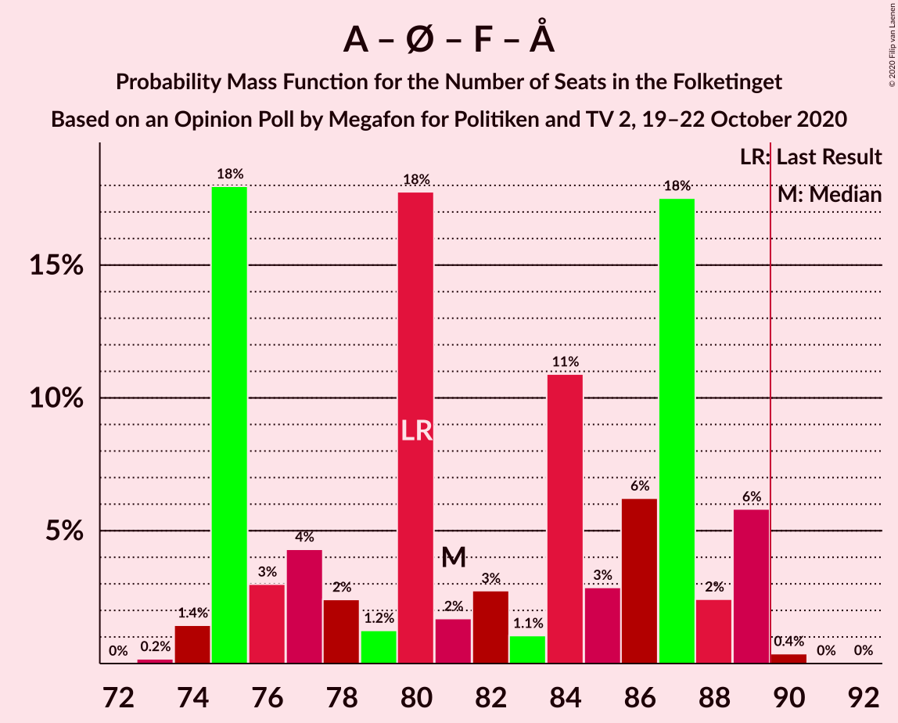

| Number of Seats | Probability | Accumulated | Special Marks |
|:---------------:|:-----------:|:-----------:|:-------------:|
| 73 | 0.2% | 100% |  |
| 74 | 1.4% | 99.8% |  |
| 75 | 18% | 98% |  |
| 76 | 3% | 80% |  |
| 77 | 4% | 77% |  |
| 78 | 2% | 73% |  |
| 79 | 1.2% | 71% |  |
| 80 | 18% | 69% | Last Result |
| 81 | 2% | 52% | Median |
| 82 | 3% | 50% |  |
| 83 | 1.1% | 47% |  |
| 84 | 11% | 46% |  |
| 85 | 3% | 35% |  |
| 86 | 6% | 32% |  |
| 87 | 18% | 26% |  |
| 88 | 2% | 9% |  |
| 89 | 6% | 6% |  |
| 90 | 0.4% | 0.4% | Majority |
| 91 | 0% | 0.1% |  |
| 92 | 0% | 0% |  |

### Socialdemokraterne – Enhedslisten–De Rød-Grønne – Socialistisk Folkeparti

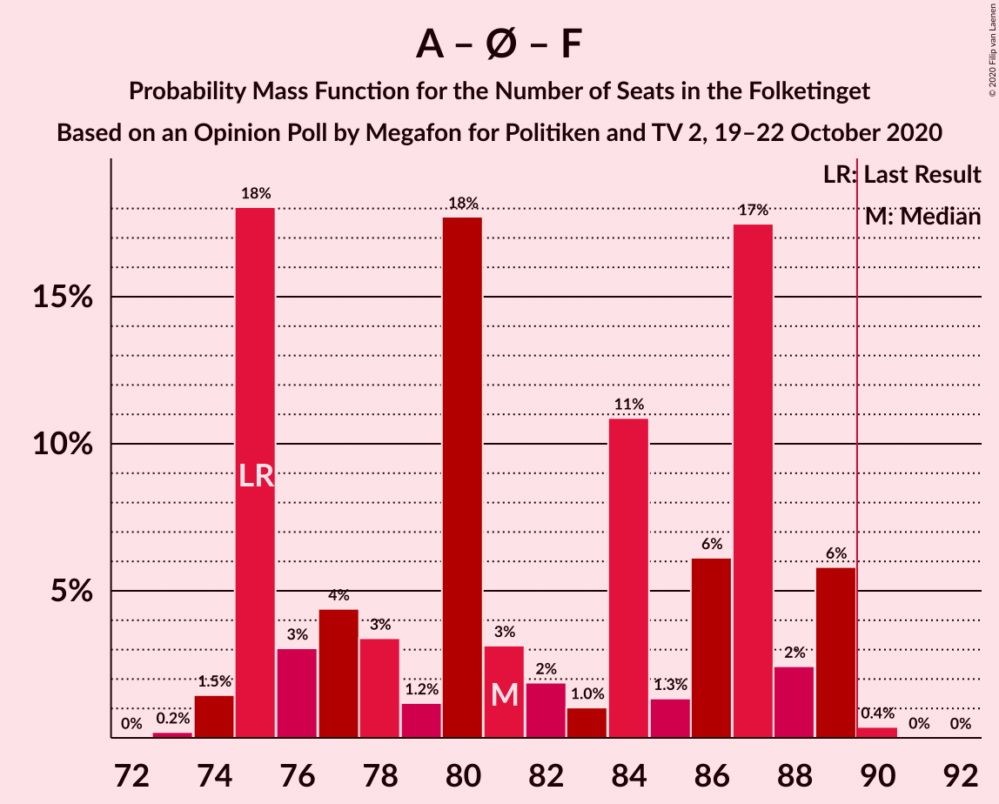

| Number of Seats | Probability | Accumulated | Special Marks |
|:---------------:|:-----------:|:-----------:|:-------------:|
| 73 | 0.2% | 100% |  |
| 74 | 1.5% | 99.8% |  |
| 75 | 18% | 98% | Last Result |
| 76 | 3% | 80% |  |
| 77 | 4% | 77% |  |
| 78 | 3% | 73% |  |
| 79 | 1.2% | 69% |  |
| 80 | 18% | 68% |  |
| 81 | 3% | 51% | Median |
| 82 | 2% | 47% |  |
| 83 | 1.0% | 46% |  |
| 84 | 11% | 44% |  |
| 85 | 1.3% | 34% |  |
| 86 | 6% | 32% |  |
| 87 | 17% | 26% |  |
| 88 | 2% | 9% |  |
| 89 | 6% | 6% |  |
| 90 | 0.4% | 0.4% | Majority |
| 91 | 0% | 0% |  |

### Socialdemokraterne – Socialistisk Folkeparti – Radikale Venstre

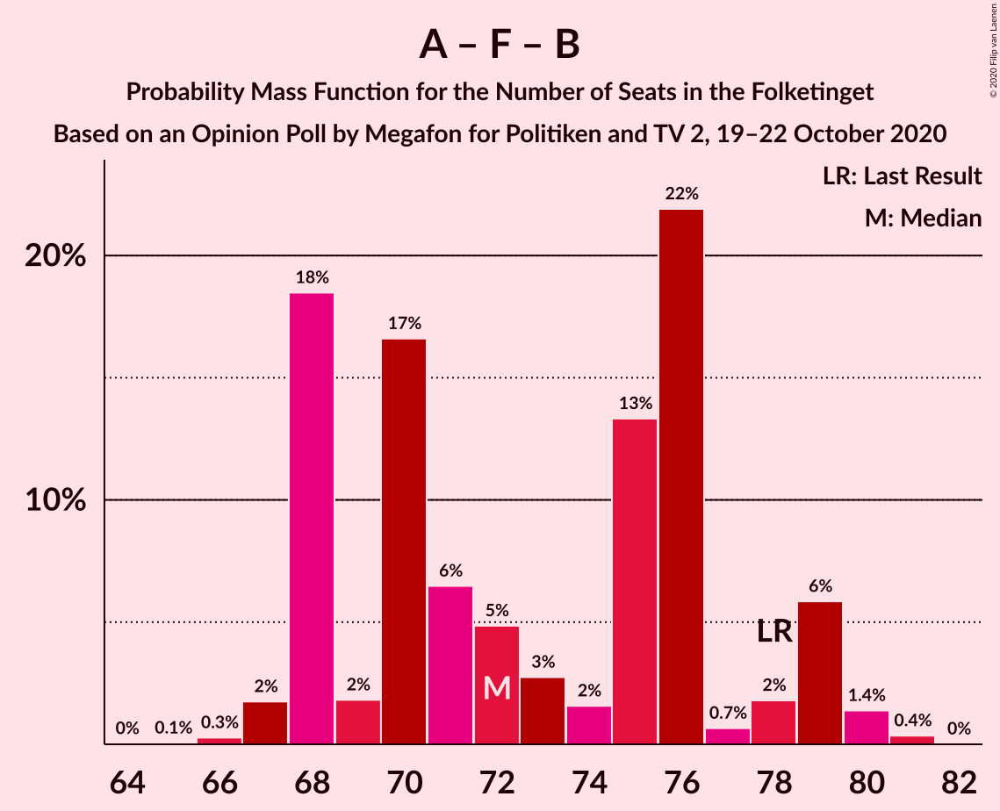

| Number of Seats | Probability | Accumulated | Special Marks |
|:---------------:|:-----------:|:-----------:|:-------------:|
| 64 | 0% | 100% |  |
| 65 | 0.1% | 99.9% |  |
| 66 | 0.3% | 99.9% |  |
| 67 | 2% | 99.6% |  |
| 68 | 18% | 98% |  |
| 69 | 2% | 79% |  |
| 70 | 17% | 78% |  |
| 71 | 6% | 61% |  |
| 72 | 5% | 54% | Median |
| 73 | 3% | 50% |  |
| 74 | 2% | 47% |  |
| 75 | 13% | 45% |  |
| 76 | 22% | 32% |  |
| 77 | 0.7% | 10% |  |
| 78 | 2% | 9% | Last Result |
| 79 | 6% | 8% |  |
| 80 | 1.4% | 2% |  |
| 81 | 0.4% | 0.4% |  |
| 82 | 0% | 0% |  |

### Venstre – Det Konservative Folkeparti – Dansk Folkeparti – Liberal Alliance – Kristendemokraterne

| Number of Seats | Probability | Accumulated | Special Marks |
|:---------------:|:-----------:|:-----------:|:-------------:|
| 59 | 0.1% | 100% |  |
| 60 | 0.2% | 99.9% |  |
| 61 | 0.5% | 99.7% |  |
| 62 | 2% | 99.2% |  |
| 63 | 2% | 97% |  |
| 64 | 8% | 95% |  |
| 65 | 23% | 87% |  |
| 66 | 11% | 64% |  |
| 67 | 2% | 53% | Median |
| 68 | 14% | 51% |  |
| 69 | 8% | 37% |  |
| 70 | 2% | 29% |  |
| 71 | 3% | 26% |  |
| 72 | 18% | 23% |  |
| 73 | 0.6% | 6% |  |
| 74 | 3% | 5% |  |
| 75 | 0.9% | 2% | Last Result |
| 76 | 0.8% | 1.0% |  |
| 77 | 0% | 0.2% |  |
| 78 | 0.1% | 0.1% |  |
| 79 | 0% | 0% |  |

### Venstre – Det Konservative Folkeparti – Dansk Folkeparti – Liberal Alliance

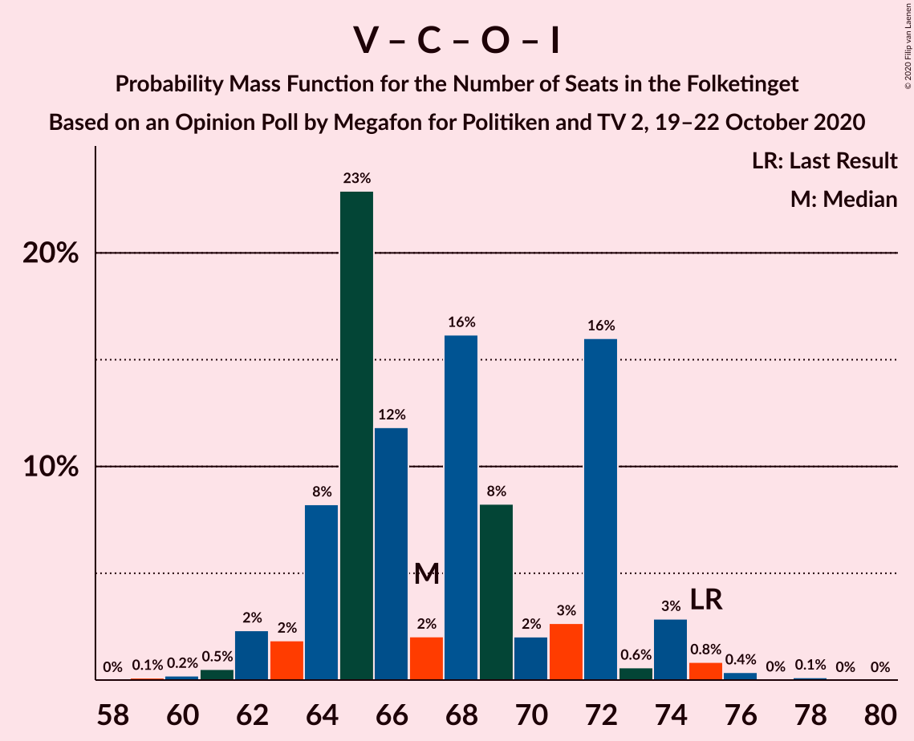

| Number of Seats | Probability | Accumulated | Special Marks |
|:---------------:|:-----------:|:-----------:|:-------------:|
| 59 | 0.1% | 100% |  |
| 60 | 0.2% | 99.8% |  |
| 61 | 0.5% | 99.6% |  |
| 62 | 2% | 99.1% |  |
| 63 | 2% | 97% |  |
| 64 | 8% | 95% |  |
| 65 | 23% | 87% |  |
| 66 | 12% | 64% |  |
| 67 | 2% | 52% | Median |
| 68 | 16% | 50% |  |
| 69 | 8% | 34% |  |
| 70 | 2% | 26% |  |
| 71 | 3% | 24% |  |
| 72 | 16% | 21% |  |
| 73 | 0.6% | 5% |  |
| 74 | 3% | 4% |  |
| 75 | 0.8% | 1.4% | Last Result |
| 76 | 0.4% | 0.5% |  |
| 77 | 0% | 0.2% |  |
| 78 | 0.1% | 0.1% |  |
| 79 | 0% | 0% |  |

### Venstre – Det Konservative Folkeparti – Liberal Alliance

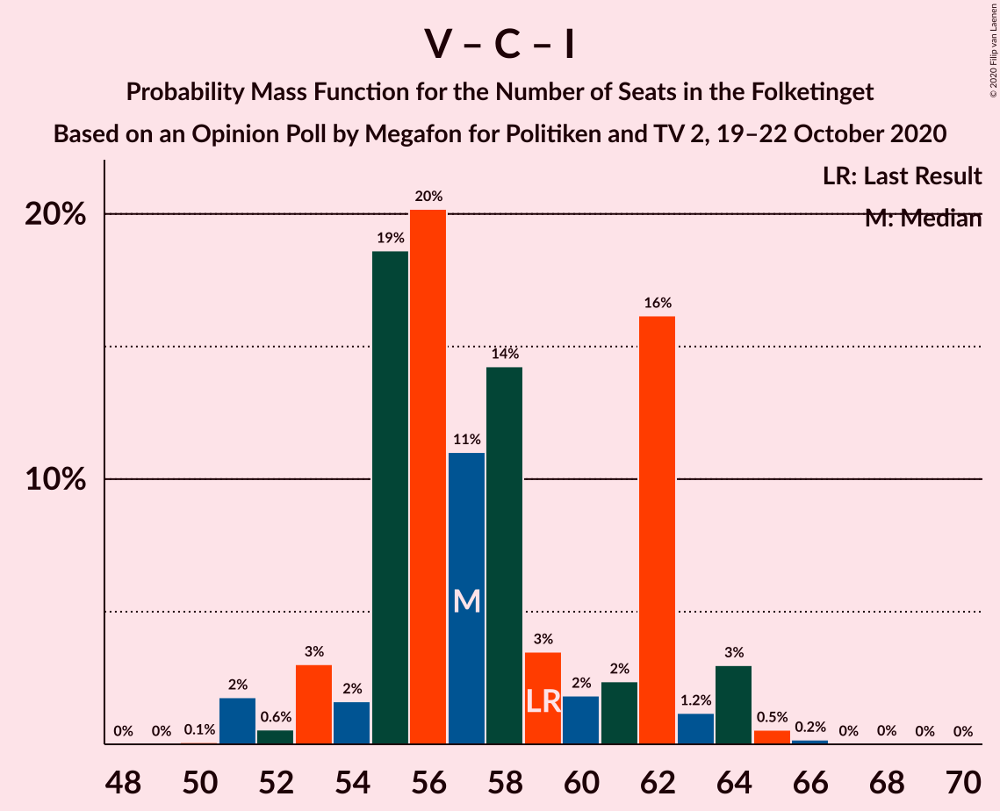

| Number of Seats | Probability | Accumulated | Special Marks |
|:---------------:|:-----------:|:-----------:|:-------------:|
| 50 | 0.1% | 100% |  |
| 51 | 2% | 99.9% |  |
| 52 | 0.6% | 98% |  |
| 53 | 3% | 98% |  |
| 54 | 2% | 95% |  |
| 55 | 19% | 93% |  |
| 56 | 20% | 74% |  |
| 57 | 11% | 54% | Median |
| 58 | 14% | 43% |  |
| 59 | 3% | 29% | Last Result |
| 60 | 2% | 25% |  |
| 61 | 2% | 24% |  |
| 62 | 16% | 21% |  |
| 63 | 1.2% | 5% |  |
| 64 | 3% | 4% |  |
| 65 | 0.5% | 0.8% |  |
| 66 | 0.2% | 0.3% |  |
| 67 | 0% | 0.1% |  |
| 68 | 0% | 0.1% |  |
| 69 | 0% | 0% |  |

### Socialdemokraterne – Radikale Venstre

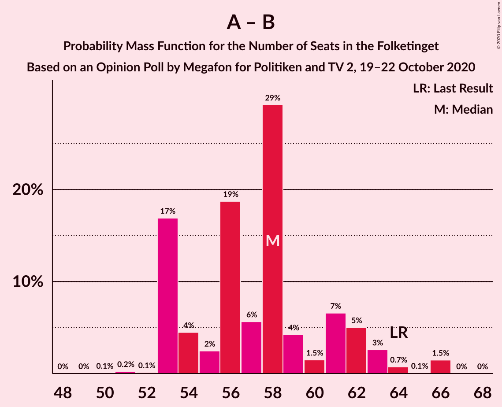

| Number of Seats | Probability | Accumulated | Special Marks |
|:---------------:|:-----------:|:-----------:|:-------------:|
| 50 | 0.1% | 100% |  |
| 51 | 0.2% | 99.9% |  |
| 52 | 0.1% | 99.7% |  |
| 53 | 17% | 99.6% |  |
| 54 | 4% | 83% |  |
| 55 | 2% | 78% |  |
| 56 | 19% | 76% |  |
| 57 | 6% | 57% | Median |
| 58 | 29% | 51% |  |
| 59 | 4% | 22% |  |
| 60 | 1.5% | 18% |  |
| 61 | 7% | 16% |  |
| 62 | 5% | 10% |  |
| 63 | 3% | 5% |  |
| 64 | 0.7% | 2% | Last Result |
| 65 | 0.1% | 2% |  |
| 66 | 1.5% | 1.5% |  |
| 67 | 0% | 0% |  |

### Venstre – Det Konservative Folkeparti

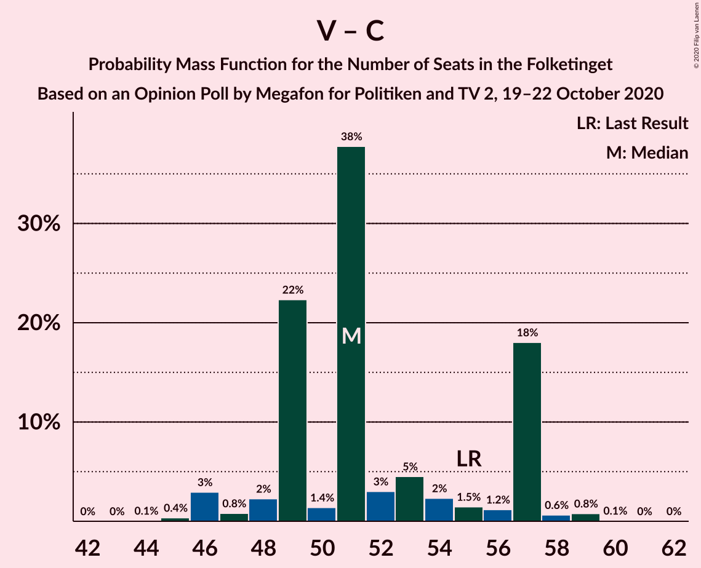

| Number of Seats | Probability | Accumulated | Special Marks |
|:---------------:|:-----------:|:-----------:|:-------------:|
| 44 | 0.1% | 100% |  |
| 45 | 0.4% | 99.9% |  |
| 46 | 3% | 99.6% |  |
| 47 | 0.8% | 97% |  |
| 48 | 2% | 96% |  |
| 49 | 22% | 94% |  |
| 50 | 1.4% | 71% |  |
| 51 | 38% | 70% | Median |
| 52 | 3% | 32% |  |
| 53 | 5% | 29% |  |
| 54 | 2% | 25% |  |
| 55 | 1.5% | 22% | Last Result |
| 56 | 1.2% | 21% |  |
| 57 | 18% | 20% |  |
| 58 | 0.6% | 2% |  |
| 59 | 0.8% | 0.9% |  |
| 60 | 0.1% | 0.1% |  |
| 61 | 0% | 0% |  |

### Venstre

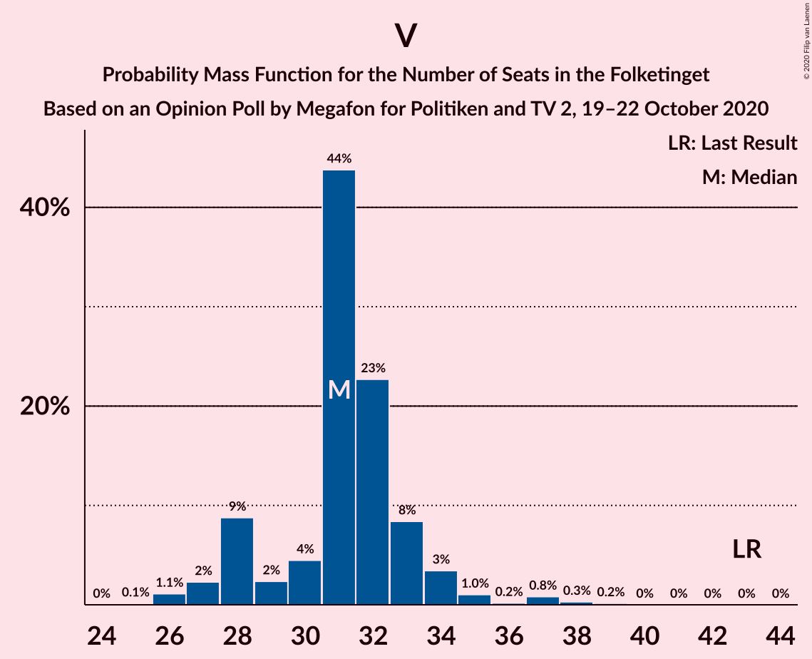

| Number of Seats | Probability | Accumulated | Special Marks |
|:---------------:|:-----------:|:-----------:|:-------------:|
| 25 | 0.1% | 100% |  |
| 26 | 1.1% | 99.9% |  |
| 27 | 2% | 98.7% |  |
| 28 | 9% | 96% |  |
| 29 | 2% | 88% |  |
| 30 | 4% | 85% |  |
| 31 | 44% | 81% | Median |
| 32 | 23% | 37% |  |
| 33 | 8% | 14% |  |
| 34 | 3% | 6% |  |
| 35 | 1.0% | 3% |  |
| 36 | 0.2% | 1.5% |  |
| 37 | 0.8% | 1.3% |  |
| 38 | 0.3% | 0.5% |  |
| 39 | 0.2% | 0.2% |  |
| 40 | 0% | 0% |  |
| 41 | 0% | 0% |  |
| 42 | 0% | 0% |  |
| 43 | 0% | 0% | Last Result |

## Technical Information

### Opinion Poll

+ **Polling firm:** Megafon
+ **Commissioner(s):** Politiken and TV 2
+ **Fieldwork period:** 19–22 October 2020

### Calculations

+ **Sample size:** 1015
+ **Simulations done:** 1,048,576
+ **Error estimate:** 2.45%

