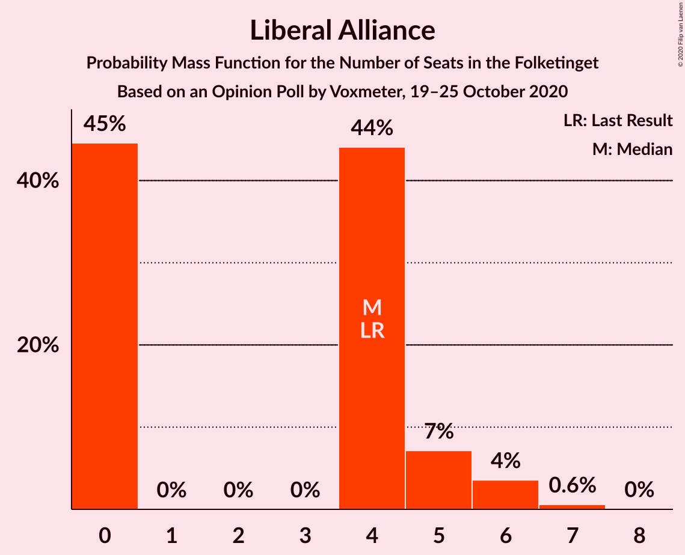

# Opinion Poll by Voxmeter, 19–25 October 2020

<a href="#voting-intentions">Voting Intentions</a> | <a href="#seats">Seats</a> | <a href="#coalitions">Coalitions</a> | <a href="#technical-information">Technical Information</a>

## Voting Intentions

### Confidence Intervals

| Party | Last Result | Poll Result | 80% Confidence Interval | 90% Confidence Interval | 95% Confidence Interval | 99% Confidence Interval |
|:-----:|:-----------:|:-----------:|:-----------------------:|:-----------------------:|:-----------------------:|:-----------------------:|
| Socialdemokraterne | 25.9% | 29.7% | 27.9–31.6% |27.4–32.1% |26.9–32.6% |26.1–33.5% |
| Venstre | 23.4% | 20.4% | 18.9–22.1% |18.4–22.6% |18.1–23.0% |17.3–23.9% |
| Det Konservative Folkeparti | 6.6% | 9.3% | 8.2–10.6% |7.9–11.0% |7.7–11.3% |7.2–11.9% |
| Socialistisk Folkeparti | 7.7% | 8.7% | 7.7–10.0% |7.4–10.3% |7.1–10.6% |6.7–11.3% |
| Enhedslisten–De Rød-Grønne | 6.9% | 7.8% | 6.8–8.9% |6.5–9.3% |6.3–9.6% |5.8–10.2% |
| Nye Borgerlige | 2.4% | 6.4% | 5.5–7.5% |5.2–7.8% |5.0–8.1% |4.6–8.6% |
| Dansk Folkeparti | 8.7% | 5.9% | 5.0–7.0% |4.8–7.3% |4.6–7.5% |4.2–8.1% |
| Radikale Venstre | 8.6% | 5.1% | 4.3–6.1% |4.1–6.4% |3.9–6.6% |3.6–7.1% |
| Liberal Alliance | 2.3% | 2.2% | 1.7–2.9% |1.5–3.1% |1.4–3.3% |1.2–3.6% |
| Kristendemokraterne | 1.7% | 1.7% | 1.2–2.3% |1.1–2.5% |1.0–2.7% |0.9–3.0% |
| Alternativet | 3.0% | 1.1% | 0.8–1.6% |0.7–1.8% |0.6–1.9% |0.5–2.2% |
| Veganerpartiet | 0.0% | 0.8% | 0.5–1.3% |0.5–1.4% |0.4–1.6% |0.3–1.8% |
| Stram Kurs | 1.8% | 0.6% | 0.4–1.0% |0.3–1.2% |0.3–1.3% |0.2–1.5% |

*Note:* The poll result column reflects the actual value used in the calculations. Published results may vary slightly, and in addition be rounded to fewer digits.

## Seats

### Confidence Intervals

| Party | Last Result | Median | 80% Confidence Interval | 90% Confidence Interval | 95% Confidence Interval | 99% Confidence Interval |
|:-----:|:-----------:|:------:|:-----------------------:|:-----------------------:|:-----------------------:|:-----------------------:|
| <a href="#socialdemokraterne">Socialdemokraterne</a> | 48 | 53 | 51–57 |50–57 |49–58 |46–62 |
| <a href="#venstre">Venstre</a> | 43 | 38 | 32–39 |32–40 |32–41 |31–44 |
| <a href="#det-konservative-folkeparti">Det Konservative Folkeparti</a> | 12 | 17 | 16–19 |15–19 |14–21 |13–22 |
| <a href="#socialistisk-folkeparti">Socialistisk Folkeparti</a> | 14 | 17 | 15–17 |14–18 |13–19 |12–22 |
| <a href="#enhedslisten–de-rød-grønne">Enhedslisten–De Rød-Grønne</a> | 13 | 15 | 13–16 |12–17 |12–18 |10–18 |
| <a href="#nye-borgerlige">Nye Borgerlige</a> | 4 | 11 | 9–15 |9–15 |9–15 |8–17 |
| <a href="#dansk-folkeparti">Dansk Folkeparti</a> | 16 | 12 | 9–12 |9–13 |9–13 |8–14 |
| <a href="#radikale-venstre">Radikale Venstre</a> | 16 | 9 | 8–10 |8–11 |7–11 |7–14 |
| <a href="#liberal-alliance">Liberal Alliance</a> | 4 | 4 | 0–5 |0–5 |0–6 |0–7 |
| <a href="#kristendemokraterne">Kristendemokraterne</a> | 0 | 0 | 0–4 |0–4 |0–5 |0–6 |
| <a href="#alternativet">Alternativet</a> | 5 | 0 | 0 |0–4 |0–4 |0–4 |
| <a href="#veganerpartiet">Veganerpartiet</a> | 0 | 0 | 0 |0 |0 |0 |
| <a href="#stram-kurs">Stram Kurs</a> | 0 | 0 | 0 |0 |0 |0 |

### Socialdemokraterne

*For a full overview of the results for this party, see the [Socialdemokraterne](party-socialdemokraterne.html) page.*

| Number of Seats | Probability | Accumulated | Special Marks |
|:---------------:|:-----------:|:-----------:|:-------------:|
| 45 | 0.3% | 100% |  |
| 46 | 0.5% | 99.7% |  |
| 47 | 1.1% | 99.3% |  |
| 48 | 0.4% | 98% | Last Result |
| 49 | 2% | 98% |  |
| 50 | 4% | 96% |  |
| 51 | 3% | 92% |  |
| 52 | 1.3% | 89% |  |
| 53 | 43% | 88% | Median |
| 54 | 3% | 45% |  |
| 55 | 27% | 42% |  |
| 56 | 3% | 16% |  |
| 57 | 10% | 13% |  |
| 58 | 0.4% | 3% |  |
| 59 | 0.7% | 2% |  |
| 60 | 0.6% | 2% |  |
| 61 | 0.4% | 1.0% |  |
| 62 | 0.4% | 0.6% |  |
| 63 | 0.1% | 0.2% |  |
| 64 | 0% | 0.1% |  |
| 65 | 0% | 0.1% |  |
| 66 | 0.1% | 0.1% |  |
| 67 | 0% | 0% |  |

### Venstre

*For a full overview of the results for this party, see the [Venstre](party-venstre.html) page.*

| Number of Seats | Probability | Accumulated | Special Marks |
|:---------------:|:-----------:|:-----------:|:-------------:|
| 29 | 0.1% | 100% |  |
| 30 | 0% | 99.9% |  |
| 31 | 1.0% | 99.8% |  |
| 32 | 10% | 98.9% |  |
| 33 | 0.6% | 89% |  |
| 34 | 1.5% | 88% |  |
| 35 | 28% | 87% |  |
| 36 | 3% | 59% |  |
| 37 | 3% | 56% |  |
| 38 | 40% | 53% | Median |
| 39 | 5% | 13% |  |
| 40 | 3% | 8% |  |
| 41 | 3% | 4% |  |
| 42 | 0.7% | 2% |  |
| 43 | 0.2% | 0.8% | Last Result |
| 44 | 0.5% | 0.6% |  |
| 45 | 0.1% | 0.1% |  |
| 46 | 0% | 0% |  |

### Det Konservative Folkeparti

*For a full overview of the results for this party, see the [Det Konservative Folkeparti](party-detkonservativefolkeparti.html) page.*

| Number of Seats | Probability | Accumulated | Special Marks |
|:---------------:|:-----------:|:-----------:|:-------------:|
| 12 | 0.2% | 100% | Last Result |
| 13 | 0.7% | 99.8% |  |
| 14 | 3% | 99.1% |  |
| 15 | 6% | 96% |  |
| 16 | 15% | 90% |  |
| 17 | 33% | 75% | Median |
| 18 | 9% | 42% |  |
| 19 | 28% | 32% |  |
| 20 | 1.2% | 4% |  |
| 21 | 2% | 3% |  |
| 22 | 0.5% | 1.0% |  |
| 23 | 0.4% | 0.5% |  |
| 24 | 0.1% | 0.1% |  |
| 25 | 0% | 0% |  |

### Socialistisk Folkeparti

*For a full overview of the results for this party, see the [Socialistisk Folkeparti](party-socialistiskfolkeparti.html) page.*

| Number of Seats | Probability | Accumulated | Special Marks |
|:---------------:|:-----------:|:-----------:|:-------------:|
| 10 | 0.1% | 100% |  |
| 11 | 0.1% | 99.9% |  |
| 12 | 0.6% | 99.8% |  |
| 13 | 2% | 99.2% |  |
| 14 | 6% | 97% | Last Result |
| 15 | 3% | 91% |  |
| 16 | 4% | 88% |  |
| 17 | 75% | 84% | Median |
| 18 | 5% | 9% |  |
| 19 | 2% | 4% |  |
| 20 | 0.5% | 2% |  |
| 21 | 0.2% | 2% |  |
| 22 | 1.3% | 1.3% |  |
| 23 | 0% | 0% |  |

### Enhedslisten–De Rød-Grønne

*For a full overview of the results for this party, see the [Enhedslisten–De Rød-Grønne](party-enhedslisten–derød-grønne.html) page.*

| Number of Seats | Probability | Accumulated | Special Marks |
|:---------------:|:-----------:|:-----------:|:-------------:|
| 10 | 0.8% | 100% |  |
| 11 | 1.2% | 99.2% |  |
| 12 | 4% | 98% |  |
| 13 | 14% | 94% | Last Result |
| 14 | 5% | 80% |  |
| 15 | 26% | 76% | Median |
| 16 | 40% | 49% |  |
| 17 | 7% | 10% |  |
| 18 | 3% | 3% |  |
| 19 | 0.2% | 0.3% |  |
| 20 | 0% | 0.1% |  |
| 21 | 0% | 0% |  |

### Nye Borgerlige

*For a full overview of the results for this party, see the [Nye Borgerlige](party-nyeborgerlige.html) page.*

| Number of Seats | Probability | Accumulated | Special Marks |
|:---------------:|:-----------:|:-----------:|:-------------:|
| 4 | 0% | 100% | Last Result |
| 5 | 0% | 100% |  |
| 6 | 0% | 100% |  |
| 7 | 0% | 100% |  |
| 8 | 0.7% | 100% |  |
| 9 | 38% | 99.3% |  |
| 10 | 6% | 61% |  |
| 11 | 14% | 55% | Median |
| 12 | 5% | 41% |  |
| 13 | 3% | 36% |  |
| 14 | 6% | 33% |  |
| 15 | 25% | 28% |  |
| 16 | 1.4% | 2% |  |
| 17 | 0.8% | 0.8% |  |
| 18 | 0.1% | 0.1% |  |
| 19 | 0% | 0% |  |

### Dansk Folkeparti

*For a full overview of the results for this party, see the [Dansk Folkeparti](party-danskfolkeparti.html) page.*

| Number of Seats | Probability | Accumulated | Special Marks |
|:---------------:|:-----------:|:-----------:|:-------------:|
| 7 | 0.2% | 100% |  |
| 8 | 1.2% | 99.8% |  |
| 9 | 27% | 98.6% |  |
| 10 | 6% | 71% |  |
| 11 | 14% | 65% |  |
| 12 | 43% | 52% | Median |
| 13 | 7% | 8% |  |
| 14 | 0.7% | 0.8% |  |
| 15 | 0.1% | 0.1% |  |
| 16 | 0% | 0% | Last Result |

### Radikale Venstre

*For a full overview of the results for this party, see the [Radikale Venstre](party-radikalevenstre.html) page.*

| Number of Seats | Probability | Accumulated | Special Marks |
|:---------------:|:-----------:|:-----------:|:-------------:|
| 6 | 0.3% | 100% |  |
| 7 | 4% | 99.7% |  |
| 8 | 15% | 96% |  |
| 9 | 37% | 80% | Median |
| 10 | 38% | 44% |  |
| 11 | 4% | 6% |  |
| 12 | 0.4% | 2% |  |
| 13 | 1.1% | 2% |  |
| 14 | 0.5% | 0.5% |  |
| 15 | 0% | 0% |  |
| 16 | 0% | 0% | Last Result |

### Liberal Alliance

*For a full overview of the results for this party, see the [Liberal Alliance](party-liberalalliance.html) page.*

| Number of Seats | Probability | Accumulated | Special Marks |
|:---------------:|:-----------:|:-----------:|:-------------:|
| 0 | 45% | 100% |  |
| 1 | 0% | 55% |  |
| 2 | 0% | 55% |  |
| 3 | 0% | 55% |  |
| 4 | 44% | 55% | Last Result, Median |
| 5 | 7% | 11% |  |
| 6 | 4% | 4% |  |
| 7 | 0.6% | 0.6% |  |
| 8 | 0% | 0% |  |

### Kristendemokraterne

*For a full overview of the results for this party, see the [Kristendemokraterne](party-kristendemokraterne.html) page.*

| Number of Seats | Probability | Accumulated | Special Marks |
|:---------------:|:-----------:|:-----------:|:-------------:|
| 0 | 83% | 100% | Last Result, Median |
| 1 | 0% | 17% |  |
| 2 | 0% | 17% |  |
| 3 | 0% | 17% |  |
| 4 | 14% | 17% |  |
| 5 | 1.2% | 3% |  |
| 6 | 2% | 2% |  |
| 7 | 0% | 0% |  |

### Alternativet

*For a full overview of the results for this party, see the [Alternativet](party-alternativet.html) page.*

| Number of Seats | Probability | Accumulated | Special Marks |
|:---------------:|:-----------:|:-----------:|:-------------:|
| 0 | 91% | 100% | Median |
| 1 | 0% | 9% |  |
| 2 | 0% | 9% |  |
| 3 | 0% | 9% |  |
| 4 | 9% | 9% |  |
| 5 | 0% | 0% | Last Result |

### Veganerpartiet

*For a full overview of the results for this party, see the [Veganerpartiet](party-veganerpartiet.html) page.*

| Number of Seats | Probability | Accumulated | Special Marks |
|:---------------:|:-----------:|:-----------:|:-------------:|
| 0 | 99.8% | 100% | Last Result, Median |
| 1 | 0% | 0.2% |  |
| 2 | 0% | 0.2% |  |
| 3 | 0% | 0.2% |  |
| 4 | 0.2% | 0.2% |  |
| 5 | 0% | 0% |  |

### Stram Kurs

*For a full overview of the results for this party, see the [Stram Kurs](party-stramkurs.html) page.*

| Number of Seats | Probability | Accumulated | Special Marks |
|:---------------:|:-----------:|:-----------:|:-------------:|
| 0 | 100% | 100% | Last Result, Median |

## Coalitions

### Confidence Intervals

| Coalition | Last Result | Median | Majority? | 80% Confidence Interval | 90% Confidence Interval | 95% Confidence Interval | 99% Confidence Interval |
|:---------:|:-----------:|:------:|:---------:|:-----------------------:|:-----------------------:|:-----------------------:|:-----------------------:|
| Socialdemokraterne – Socialistisk Folkeparti – Enhedslisten–De Rød-Grønne – Radikale Venstre – Alternativet | 96 | 95 | 94% | 91–98 | 89–98 | 87–99 | 86–102 |
| Socialdemokraterne – Socialistisk Folkeparti – Enhedslisten–De Rød-Grønne – Radikale Venstre | 91 | 95 | 93% | 91–98 | 89–98 | 87–99 | 86–102 |
| Socialdemokraterne – Socialistisk Folkeparti – Enhedslisten–De Rød-Grønne – Alternativet | 80 | 86 | 11% | 82–90 | 79–90 | 78–90 | 77–94 |
| Socialdemokraterne – Socialistisk Folkeparti – Enhedslisten–De Rød-Grønne | 75 | 86 | 11% | 82–90 | 79–90 | 78–90 | 77–94 |
| Venstre – Det Konservative Folkeparti – Nye Borgerlige – Dansk Folkeparti – Liberal Alliance – Kristendemokraterne | 79 | 80 | 0.1% | 77–84 | 77–86 | 76–88 | 73–89 |
| Venstre – Det Konservative Folkeparti – Nye Borgerlige – Dansk Folkeparti – Liberal Alliance | 79 | 79 | 0% | 74–82 | 73–84 | 73–85 | 72–87 |
| Socialdemokraterne – Socialistisk Folkeparti – Radikale Venstre | 78 | 80 | 0% | 76–82 | 76–83 | 73–84 | 71–86 |
| Venstre – Det Konservative Folkeparti – Dansk Folkeparti – Liberal Alliance – Kristendemokraterne | 75 | 69 | 0% | 63–71 | 63–74 | 63–75 | 62–78 |
| Venstre – Det Konservative Folkeparti – Dansk Folkeparti – Liberal Alliance | 75 | 69 | 0% | 63–71 | 62–71 | 62–74 | 61–75 |
| Socialdemokraterne – Radikale Venstre | 64 | 63 | 0% | 61–65 | 59–66 | 57–68 | 56–71 |
| Venstre – Det Konservative Folkeparti – Liberal Alliance | 59 | 58 | 0% | 51–59 | 50–60 | 50–62 | 49–64 |
| Venstre – Det Konservative Folkeparti | 55 | 54 | 0% | 50–55 | 50–58 | 49–59 | 47–61 |
| Venstre | 43 | 38 | 0% | 32–39 | 32–40 | 32–41 | 31–44 |

### Socialdemokraterne – Socialistisk Folkeparti – Enhedslisten–De Rød-Grønne – Radikale Venstre – Alternativet

| Number of Seats | Probability | Accumulated | Special Marks |
|:---------------:|:-----------:|:-----------:|:-------------:|
| 85 | 0.1% | 100% |  |
| 86 | 2% | 99.9% |  |
| 87 | 0.6% | 98% |  |
| 88 | 0.8% | 97% |  |
| 89 | 3% | 96% |  |
| 90 | 3% | 94% | Majority |
| 91 | 1.5% | 91% |  |
| 92 | 2% | 90% |  |
| 93 | 4% | 88% |  |
| 94 | 2% | 84% | Median |
| 95 | 32% | 82% |  |
| 96 | 3% | 49% | Last Result |
| 97 | 34% | 46% |  |
| 98 | 9% | 12% |  |
| 99 | 2% | 3% |  |
| 100 | 0.3% | 2% |  |
| 101 | 0.7% | 1.4% |  |
| 102 | 0.3% | 0.7% |  |
| 103 | 0.4% | 0.4% |  |
| 104 | 0% | 0% |  |

### Socialdemokraterne – Socialistisk Folkeparti – Enhedslisten–De Rød-Grønne – Radikale Venstre

| Number of Seats | Probability | Accumulated | Special Marks |
|:---------------:|:-----------:|:-----------:|:-------------:|
| 85 | 0.1% | 100% |  |
| 86 | 2% | 99.9% |  |
| 87 | 0.9% | 98% |  |
| 88 | 0.8% | 97% |  |
| 89 | 3% | 96% |  |
| 90 | 3% | 93% | Majority |
| 91 | 1.2% | 91% | Last Result |
| 92 | 2% | 90% |  |
| 93 | 12% | 88% |  |
| 94 | 2% | 76% | Median |
| 95 | 33% | 74% |  |
| 96 | 3% | 41% |  |
| 97 | 26% | 38% |  |
| 98 | 9% | 12% |  |
| 99 | 1.4% | 3% |  |
| 100 | 0.3% | 2% |  |
| 101 | 0.7% | 1.4% |  |
| 102 | 0.3% | 0.7% |  |
| 103 | 0.4% | 0.4% |  |
| 104 | 0% | 0% |  |

### Socialdemokraterne – Socialistisk Folkeparti – Enhedslisten–De Rød-Grønne – Alternativet

| Number of Seats | Probability | Accumulated | Special Marks |
|:---------------:|:-----------:|:-----------:|:-------------:|
| 75 | 0.2% | 100% |  |
| 76 | 0.1% | 99.8% |  |
| 77 | 2% | 99.7% |  |
| 78 | 0.8% | 98% |  |
| 79 | 3% | 97% |  |
| 80 | 0.9% | 94% | Last Result |
| 81 | 1.4% | 93% |  |
| 82 | 3% | 92% |  |
| 83 | 2% | 89% |  |
| 84 | 5% | 87% |  |
| 85 | 3% | 82% | Median |
| 86 | 30% | 79% |  |
| 87 | 34% | 49% |  |
| 88 | 2% | 15% |  |
| 89 | 3% | 13% |  |
| 90 | 9% | 11% | Majority |
| 91 | 0.3% | 2% |  |
| 92 | 0.2% | 1.5% |  |
| 93 | 0.6% | 1.3% |  |
| 94 | 0.6% | 0.7% |  |
| 95 | 0.1% | 0.1% |  |
| 96 | 0% | 0% |  |

### Socialdemokraterne – Socialistisk Folkeparti – Enhedslisten–De Rød-Grønne

| Number of Seats | Probability | Accumulated | Special Marks |
|:---------------:|:-----------:|:-----------:|:-------------:|
| 75 | 0.2% | 100% | Last Result |
| 76 | 0.1% | 99.8% |  |
| 77 | 2% | 99.7% |  |
| 78 | 1.0% | 98% |  |
| 79 | 3% | 97% |  |
| 80 | 0.9% | 94% |  |
| 81 | 1.4% | 93% |  |
| 82 | 3% | 92% |  |
| 83 | 10% | 89% |  |
| 84 | 5% | 79% |  |
| 85 | 3% | 74% | Median |
| 86 | 31% | 71% |  |
| 87 | 26% | 41% |  |
| 88 | 2% | 15% |  |
| 89 | 3% | 13% |  |
| 90 | 9% | 11% | Majority |
| 91 | 0.3% | 2% |  |
| 92 | 0.2% | 1.4% |  |
| 93 | 0.6% | 1.3% |  |
| 94 | 0.6% | 0.7% |  |
| 95 | 0.1% | 0.1% |  |
| 96 | 0% | 0% |  |

### Venstre – Det Konservative Folkeparti – Nye Borgerlige – Dansk Folkeparti – Liberal Alliance – Kristendemokraterne

| Number of Seats | Probability | Accumulated | Special Marks |
|:---------------:|:-----------:|:-----------:|:-------------:|
| 72 | 0.4% | 100% |  |
| 73 | 0.3% | 99.6% |  |
| 74 | 0.7% | 99.3% |  |
| 75 | 0.3% | 98.5% |  |
| 76 | 2% | 98% |  |
| 77 | 9% | 97% |  |
| 78 | 34% | 88% |  |
| 79 | 3% | 54% | Last Result |
| 80 | 33% | 51% |  |
| 81 | 2% | 18% |  |
| 82 | 4% | 16% | Median |
| 83 | 2% | 12% |  |
| 84 | 1.4% | 10% |  |
| 85 | 3% | 9% |  |
| 86 | 3% | 6% |  |
| 87 | 0.8% | 4% |  |
| 88 | 0.6% | 3% |  |
| 89 | 2% | 2% |  |
| 90 | 0.1% | 0.1% | Majority |
| 91 | 0% | 0% |  |

### Venstre – Det Konservative Folkeparti – Nye Borgerlige – Dansk Folkeparti – Liberal Alliance

| Number of Seats | Probability | Accumulated | Special Marks |
|:---------------:|:-----------:|:-----------:|:-------------:|
| 71 | 0.1% | 100% |  |
| 72 | 0.5% | 99.9% |  |
| 73 | 8% | 99.4% |  |
| 74 | 1.1% | 91% |  |
| 75 | 0.7% | 90% |  |
| 76 | 2% | 89% |  |
| 77 | 1.4% | 87% |  |
| 78 | 34% | 86% |  |
| 79 | 4% | 52% | Last Result |
| 80 | 32% | 48% |  |
| 81 | 3% | 16% |  |
| 82 | 5% | 13% | Median |
| 83 | 2% | 8% |  |
| 84 | 1.1% | 6% |  |
| 85 | 3% | 5% |  |
| 86 | 1.1% | 2% |  |
| 87 | 0.2% | 0.6% |  |
| 88 | 0.2% | 0.4% |  |
| 89 | 0.2% | 0.3% |  |
| 90 | 0% | 0% | Majority |

### Socialdemokraterne – Socialistisk Folkeparti – Radikale Venstre

| Number of Seats | Probability | Accumulated | Special Marks |
|:---------------:|:-----------:|:-----------:|:-------------:|
| 70 | 0.1% | 100% |  |
| 71 | 1.1% | 99.9% |  |
| 72 | 0.2% | 98.7% |  |
| 73 | 1.1% | 98.5% |  |
| 74 | 1.2% | 97% |  |
| 75 | 0.8% | 96% |  |
| 76 | 6% | 95% |  |
| 77 | 2% | 89% |  |
| 78 | 4% | 88% | Last Result |
| 79 | 32% | 83% | Median |
| 80 | 11% | 52% |  |
| 81 | 0.9% | 40% |  |
| 82 | 34% | 39% |  |
| 83 | 2% | 6% |  |
| 84 | 1.5% | 3% |  |
| 85 | 1.3% | 2% |  |
| 86 | 0.2% | 0.5% |  |
| 87 | 0.2% | 0.4% |  |
| 88 | 0.1% | 0.2% |  |
| 89 | 0.1% | 0.1% |  |
| 90 | 0% | 0% | Majority |

### Venstre – Det Konservative Folkeparti – Dansk Folkeparti – Liberal Alliance – Kristendemokraterne

| Number of Seats | Probability | Accumulated | Special Marks |
|:---------------:|:-----------:|:-----------:|:-------------:|
| 59 | 0% | 100% |  |
| 60 | 0% | 99.9% |  |
| 61 | 0.1% | 99.9% |  |
| 62 | 0.8% | 99.8% |  |
| 63 | 26% | 99.0% |  |
| 64 | 1.2% | 73% |  |
| 65 | 0.7% | 72% |  |
| 66 | 9% | 71% |  |
| 67 | 1.2% | 63% |  |
| 68 | 7% | 62% |  |
| 69 | 11% | 54% |  |
| 70 | 4% | 44% |  |
| 71 | 32% | 40% | Median |
| 72 | 2% | 8% |  |
| 73 | 0.8% | 7% |  |
| 74 | 1.4% | 6% |  |
| 75 | 2% | 5% | Last Result |
| 76 | 0.3% | 2% |  |
| 77 | 1.1% | 2% |  |
| 78 | 0.8% | 0.9% |  |
| 79 | 0.1% | 0.1% |  |
| 80 | 0% | 0% |  |

### Venstre – Det Konservative Folkeparti – Dansk Folkeparti – Liberal Alliance

| Number of Seats | Probability | Accumulated | Special Marks |
|:---------------:|:-----------:|:-----------:|:-------------:|
| 58 | 0.1% | 100% |  |
| 59 | 0.3% | 99.9% |  |
| 60 | 0.1% | 99.6% |  |
| 61 | 0.2% | 99.6% |  |
| 62 | 9% | 99.3% |  |
| 63 | 27% | 90% |  |
| 64 | 1.2% | 64% |  |
| 65 | 1.0% | 63% |  |
| 66 | 2% | 62% |  |
| 67 | 1.3% | 60% |  |
| 68 | 8% | 58% |  |
| 69 | 10% | 50% |  |
| 70 | 3% | 40% |  |
| 71 | 33% | 37% | Median |
| 72 | 1.2% | 4% |  |
| 73 | 0.6% | 3% |  |
| 74 | 2% | 3% |  |
| 75 | 0.8% | 1.0% | Last Result |
| 76 | 0.1% | 0.2% |  |
| 77 | 0.1% | 0.1% |  |
| 78 | 0% | 0.1% |  |
| 79 | 0% | 0% |  |

### Socialdemokraterne – Radikale Venstre

| Number of Seats | Probability | Accumulated | Special Marks |
|:---------------:|:-----------:|:-----------:|:-------------:|
| 54 | 0% | 100% |  |
| 55 | 0.1% | 99.9% |  |
| 56 | 2% | 99.9% |  |
| 57 | 0.3% | 98% |  |
| 58 | 2% | 97% |  |
| 59 | 2% | 95% |  |
| 60 | 2% | 94% |  |
| 61 | 4% | 92% |  |
| 62 | 35% | 88% | Median |
| 63 | 11% | 53% |  |
| 64 | 4% | 43% | Last Result |
| 65 | 34% | 39% |  |
| 66 | 1.1% | 5% |  |
| 67 | 0.7% | 4% |  |
| 68 | 2% | 3% |  |
| 69 | 0.4% | 1.2% |  |
| 70 | 0.1% | 0.8% |  |
| 71 | 0.6% | 0.7% |  |
| 72 | 0% | 0.1% |  |
| 73 | 0% | 0.1% |  |
| 74 | 0% | 0.1% |  |
| 75 | 0% | 0% |  |

### Venstre – Det Konservative Folkeparti – Liberal Alliance

| Number of Seats | Probability | Accumulated | Special Marks |
|:---------------:|:-----------:|:-----------:|:-------------:|
| 48 | 0.1% | 100% |  |
| 49 | 0.7% | 99.9% |  |
| 50 | 8% | 99.2% |  |
| 51 | 2% | 91% |  |
| 52 | 1.5% | 89% |  |
| 53 | 0.8% | 88% |  |
| 54 | 25% | 87% |  |
| 55 | 5% | 62% |  |
| 56 | 1.1% | 57% |  |
| 57 | 2% | 56% |  |
| 58 | 14% | 54% |  |
| 59 | 33% | 40% | Last Result, Median |
| 60 | 2% | 6% |  |
| 61 | 2% | 4% |  |
| 62 | 1.2% | 3% |  |
| 63 | 0.4% | 2% |  |
| 64 | 0.8% | 1.2% |  |
| 65 | 0.1% | 0.3% |  |
| 66 | 0.1% | 0.2% |  |
| 67 | 0% | 0.1% |  |
| 68 | 0% | 0% |  |

### Venstre – Det Konservative Folkeparti

| Number of Seats | Probability | Accumulated | Special Marks |
|:---------------:|:-----------:|:-----------:|:-------------:|
| 45 | 0.2% | 100% |  |
| 46 | 0.1% | 99.8% |  |
| 47 | 0.8% | 99.7% |  |
| 48 | 0.3% | 98.9% |  |
| 49 | 1.1% | 98.6% |  |
| 50 | 8% | 97% |  |
| 51 | 4% | 89% |  |
| 52 | 3% | 85% |  |
| 53 | 3% | 82% |  |
| 54 | 36% | 79% |  |
| 55 | 35% | 43% | Last Result, Median |
| 56 | 2% | 9% |  |
| 57 | 1.1% | 6% |  |
| 58 | 1.4% | 5% |  |
| 59 | 2% | 4% |  |
| 60 | 0.8% | 2% |  |
| 61 | 0.4% | 0.9% |  |
| 62 | 0.4% | 0.5% |  |
| 63 | 0.1% | 0.1% |  |
| 64 | 0% | 0% |  |

### Venstre

| Number of Seats | Probability | Accumulated | Special Marks |
|:---------------:|:-----------:|:-----------:|:-------------:|
| 29 | 0.1% | 100% |  |
| 30 | 0% | 99.9% |  |
| 31 | 1.0% | 99.8% |  |
| 32 | 10% | 98.9% |  |
| 33 | 0.6% | 89% |  |
| 34 | 1.5% | 88% |  |
| 35 | 28% | 87% |  |
| 36 | 3% | 59% |  |
| 37 | 3% | 56% |  |
| 38 | 40% | 53% | Median |
| 39 | 5% | 13% |  |
| 40 | 3% | 8% |  |
| 41 | 3% | 4% |  |
| 42 | 0.7% | 2% |  |
| 43 | 0.2% | 0.8% | Last Result |
| 44 | 0.5% | 0.6% |  |
| 45 | 0.1% | 0.1% |  |
| 46 | 0% | 0% |  |

## Technical Information

### Opinion Poll

+ **Polling firm:** Voxmeter
+ **Commissioner(s):** —
+ **Fieldwork period:** 19–25 October 2020

### Calculations

+ **Sample size:** 1018
+ **Simulations done:** 1,048,576
+ **Error estimate:** 3.23%

