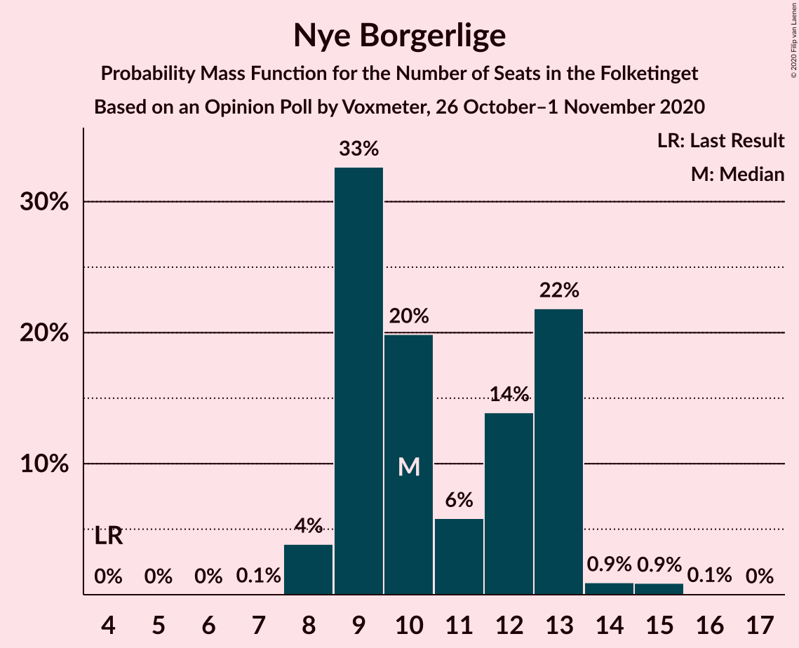

# Opinion Poll by Voxmeter, 26 October–1 November 2020

<a href="#voting-intentions">Voting Intentions</a> | <a href="#seats">Seats</a> | <a href="#coalitions">Coalitions</a> | <a href="#technical-information">Technical Information</a>

## Voting Intentions

### Confidence Intervals

| Party | Last Result | Poll Result | 80% Confidence Interval | 90% Confidence Interval | 95% Confidence Interval | 99% Confidence Interval |
|:-----:|:-----------:|:-----------:|:-----------------------:|:-----------------------:|:-----------------------:|:-----------------------:|
| Socialdemokraterne | 25.9% | 30.5% | 28.7–32.4% |28.2–32.9% |27.7–33.4% |26.9–34.3% |
| Venstre | 23.4% | 19.4% | 17.9–21.1% |17.5–21.5% |17.1–21.9% |16.4–22.8% |
| Det Konservative Folkeparti | 6.6% | 9.9% | 8.8–11.2% |8.5–11.6% |8.2–11.9% |7.7–12.5% |
| Socialistisk Folkeparti | 7.7% | 8.8% | 7.8–10.1% |7.5–10.4% |7.2–10.7% |6.8–11.3% |
| Enhedslisten–De Rød-Grønne | 6.9% | 7.4% | 6.5–8.6% |6.2–8.9% |6.0–9.2% |5.5–9.8% |
| Nye Borgerlige | 2.4% | 6.1% | 5.2–7.1% |5.0–7.5% |4.8–7.7% |4.4–8.3% |
| Radikale Venstre | 8.6% | 5.7% | 4.8–6.7% |4.6–7.0% |4.4–7.3% |4.1–7.8% |
| Dansk Folkeparti | 8.7% | 5.0% | 4.2–6.0% |4.0–6.3% |3.8–6.5% |3.5–7.0% |
| Kristendemokraterne | 1.7% | 2.4% | 1.9–3.2% |1.8–3.4% |1.7–3.6% |1.4–4.0% |
| Liberal Alliance | 2.3% | 2.3% | 1.8–3.0% |1.6–3.2% |1.5–3.4% |1.3–3.7% |
| Alternativet | 3.0% | 0.8% | 0.5–1.3% |0.5–1.4% |0.4–1.5% |0.3–1.8% |
| Veganerpartiet | 0.0% | 0.6% | 0.4–1.0% |0.3–1.2% |0.3–1.3% |0.2–1.5% |

*Note:* The poll result column reflects the actual value used in the calculations. Published results may vary slightly, and in addition be rounded to fewer digits.

## Seats

### Confidence Intervals

| Party | Last Result | Median | 80% Confidence Interval | 90% Confidence Interval | 95% Confidence Interval | 99% Confidence Interval |
|:-----:|:-----------:|:------:|:-----------------------:|:-----------------------:|:-----------------------:|:-----------------------:|
| <a href="#socialdemokraterne">Socialdemokraterne</a> | 48 | 56 | 53–59 |52–60 |51–61 |48–62 |
| <a href="#venstre">Venstre</a> | 43 | 35 | 31–37 |31–39 |30–39 |29–40 |
| <a href="#det-konservative-folkeparti">Det Konservative Folkeparti</a> | 12 | 19 | 16–20 |16–21 |15–21 |14–22 |
| <a href="#socialistisk-folkeparti">Socialistisk Folkeparti</a> | 14 | 15 | 14–18 |14–19 |13–19 |13–20 |
| <a href="#enhedslisten–de-rød-grønne">Enhedslisten–De Rød-Grønne</a> | 13 | 13 | 11–15 |11–15 |10–16 |10–17 |
| <a href="#nye-borgerlige">Nye Borgerlige</a> | 4 | 10 | 9–13 |9–13 |8–13 |8–15 |
| <a href="#radikale-venstre">Radikale Venstre</a> | 16 | 10 | 8–12 |8–12 |8–13 |8–13 |
| <a href="#dansk-folkeparti">Dansk Folkeparti</a> | 16 | 10 | 8–11 |8–11 |8–11 |6–12 |
| <a href="#kristendemokraterne">Kristendemokraterne</a> | 0 | 4 | 0–5 |0–7 |0–7 |0–7 |
| <a href="#liberal-alliance">Liberal Alliance</a> | 4 | 4 | 0–5 |0–6 |0–6 |0–7 |
| <a href="#alternativet">Alternativet</a> | 5 | 0 | 0 |0 |0 |0 |
| <a href="#veganerpartiet">Veganerpartiet</a> | 0 | 0 | 0 |0 |0 |0 |

### Socialdemokraterne

*For a full overview of the results for this party, see the [Socialdemokraterne](party-socialdemokraterne.html) page.*

| Number of Seats | Probability | Accumulated | Special Marks |
|:---------------:|:-----------:|:-----------:|:-------------:|
| 46 | 0.3% | 100% |  |
| 47 | 0.1% | 99.7% |  |
| 48 | 0.3% | 99.7% | Last Result |
| 49 | 0.2% | 99.4% |  |
| 50 | 1.2% | 99.1% |  |
| 51 | 1.0% | 98% |  |
| 52 | 3% | 97% |  |
| 53 | 13% | 94% |  |
| 54 | 2% | 81% |  |
| 55 | 14% | 79% |  |
| 56 | 31% | 66% | Median |
| 57 | 0.5% | 35% |  |
| 58 | 24% | 34% |  |
| 59 | 3% | 11% |  |
| 60 | 4% | 7% |  |
| 61 | 3% | 4% |  |
| 62 | 0.4% | 0.7% |  |
| 63 | 0.2% | 0.3% |  |
| 64 | 0.1% | 0.1% |  |
| 65 | 0% | 0% |  |

### Venstre

*For a full overview of the results for this party, see the [Venstre](party-venstre.html) page.*

| Number of Seats | Probability | Accumulated | Special Marks |
|:---------------:|:-----------:|:-----------:|:-------------:|
| 28 | 0.1% | 100% |  |
| 29 | 0.8% | 99.9% |  |
| 30 | 3% | 99.1% |  |
| 31 | 9% | 96% |  |
| 32 | 5% | 87% |  |
| 33 | 10% | 83% |  |
| 34 | 13% | 72% |  |
| 35 | 28% | 59% | Median |
| 36 | 18% | 31% |  |
| 37 | 3% | 12% |  |
| 38 | 2% | 9% |  |
| 39 | 6% | 7% |  |
| 40 | 0.2% | 0.6% |  |
| 41 | 0.3% | 0.4% |  |
| 42 | 0.1% | 0.1% |  |
| 43 | 0% | 0% | Last Result |

### Det Konservative Folkeparti

*For a full overview of the results for this party, see the [Det Konservative Folkeparti](party-detkonservativefolkeparti.html) page.*

| Number of Seats | Probability | Accumulated | Special Marks |
|:---------------:|:-----------:|:-----------:|:-------------:|
| 12 | 0% | 100% | Last Result |
| 13 | 0% | 100% |  |
| 14 | 0.5% | 99.9% |  |
| 15 | 3% | 99.4% |  |
| 16 | 8% | 96% |  |
| 17 | 12% | 89% |  |
| 18 | 21% | 77% |  |
| 19 | 34% | 56% | Median |
| 20 | 17% | 22% |  |
| 21 | 4% | 5% |  |
| 22 | 0.5% | 0.7% |  |
| 23 | 0.2% | 0.2% |  |
| 24 | 0% | 0% |  |

### Socialistisk Folkeparti

*For a full overview of the results for this party, see the [Socialistisk Folkeparti](party-socialistiskfolkeparti.html) page.*

| Number of Seats | Probability | Accumulated | Special Marks |
|:---------------:|:-----------:|:-----------:|:-------------:|
| 11 | 0.1% | 100% |  |
| 12 | 0.2% | 99.9% |  |
| 13 | 4% | 99.7% |  |
| 14 | 7% | 96% | Last Result |
| 15 | 40% | 89% | Median |
| 16 | 22% | 50% |  |
| 17 | 10% | 28% |  |
| 18 | 12% | 18% |  |
| 19 | 4% | 6% |  |
| 20 | 1.4% | 2% |  |
| 21 | 0.4% | 0.5% |  |
| 22 | 0.1% | 0.1% |  |
| 23 | 0% | 0% |  |

### Enhedslisten–De Rød-Grønne

*For a full overview of the results for this party, see the [Enhedslisten–De Rød-Grønne](party-enhedslisten–derød-grønne.html) page.*

| Number of Seats | Probability | Accumulated | Special Marks |
|:---------------:|:-----------:|:-----------:|:-------------:|
| 9 | 0.1% | 100% |  |
| 10 | 4% | 99.9% |  |
| 11 | 7% | 96% |  |
| 12 | 39% | 89% |  |
| 13 | 12% | 50% | Last Result, Median |
| 14 | 17% | 38% |  |
| 15 | 17% | 21% |  |
| 16 | 3% | 4% |  |
| 17 | 1.0% | 1.3% |  |
| 18 | 0.2% | 0.3% |  |
| 19 | 0.1% | 0.1% |  |
| 20 | 0% | 0% |  |

### Nye Borgerlige

*For a full overview of the results for this party, see the [Nye Borgerlige](party-nyeborgerlige.html) page.*

| Number of Seats | Probability | Accumulated | Special Marks |
|:---------------:|:-----------:|:-----------:|:-------------:|
| 4 | 0% | 100% | Last Result |
| 5 | 0% | 100% |  |
| 6 | 0% | 100% |  |
| 7 | 0.1% | 100% |  |
| 8 | 4% | 99.9% |  |
| 9 | 33% | 96% |  |
| 10 | 20% | 63% | Median |
| 11 | 6% | 44% |  |
| 12 | 14% | 38% |  |
| 13 | 22% | 24% |  |
| 14 | 0.9% | 2% |  |
| 15 | 0.9% | 1.0% |  |
| 16 | 0.1% | 0.1% |  |
| 17 | 0% | 0% |  |

### Radikale Venstre

*For a full overview of the results for this party, see the [Radikale Venstre](party-radikalevenstre.html) page.*

| Number of Seats | Probability | Accumulated | Special Marks |
|:---------------:|:-----------:|:-----------:|:-------------:|
| 7 | 0.3% | 100% |  |
| 8 | 12% | 99.7% |  |
| 9 | 23% | 88% |  |
| 10 | 42% | 65% | Median |
| 11 | 12% | 23% |  |
| 12 | 8% | 11% |  |
| 13 | 2% | 3% |  |
| 14 | 0.4% | 0.5% |  |
| 15 | 0.1% | 0.1% |  |
| 16 | 0% | 0% | Last Result |

### Dansk Folkeparti

*For a full overview of the results for this party, see the [Dansk Folkeparti](party-danskfolkeparti.html) page.*

| Number of Seats | Probability | Accumulated | Special Marks |
|:---------------:|:-----------:|:-----------:|:-------------:|
| 5 | 0.1% | 100% |  |
| 6 | 0.6% | 99.9% |  |
| 7 | 2% | 99.4% |  |
| 8 | 20% | 98% |  |
| 9 | 21% | 78% |  |
| 10 | 46% | 57% | Median |
| 11 | 10% | 12% |  |
| 12 | 0.8% | 1.2% |  |
| 13 | 0.3% | 0.4% |  |
| 14 | 0.1% | 0.1% |  |
| 15 | 0% | 0% |  |
| 16 | 0% | 0% | Last Result |

### Kristendemokraterne

*For a full overview of the results for this party, see the [Kristendemokraterne](party-kristendemokraterne.html) page.*

| Number of Seats | Probability | Accumulated | Special Marks |
|:---------------:|:-----------:|:-----------:|:-------------:|
| 0 | 28% | 100% | Last Result |
| 1 | 0% | 72% |  |
| 2 | 0% | 72% |  |
| 3 | 14% | 72% |  |
| 4 | 39% | 58% | Median |
| 5 | 9% | 19% |  |
| 6 | 2% | 10% |  |
| 7 | 7% | 7% |  |
| 8 | 0.3% | 0.3% |  |
| 9 | 0% | 0% |  |

### Liberal Alliance

*For a full overview of the results for this party, see the [Liberal Alliance](party-liberalalliance.html) page.*

| Number of Seats | Probability | Accumulated | Special Marks |
|:---------------:|:-----------:|:-----------:|:-------------:|
| 0 | 28% | 100% |  |
| 1 | 0% | 72% |  |
| 2 | 0% | 72% |  |
| 3 | 0% | 72% |  |
| 4 | 23% | 72% | Last Result, Median |
| 5 | 42% | 49% |  |
| 6 | 6% | 7% |  |
| 7 | 0.8% | 0.8% |  |
| 8 | 0% | 0% |  |

### Alternativet

*For a full overview of the results for this party, see the [Alternativet](party-alternativet.html) page.*

| Number of Seats | Probability | Accumulated | Special Marks |
|:---------------:|:-----------:|:-----------:|:-------------:|
| 0 | 99.8% | 100% | Median |
| 1 | 0% | 0.2% |  |
| 2 | 0% | 0.2% |  |
| 3 | 0% | 0.2% |  |
| 4 | 0.2% | 0.2% |  |
| 5 | 0% | 0% | Last Result |

### Veganerpartiet

*For a full overview of the results for this party, see the [Veganerpartiet](party-veganerpartiet.html) page.*

| Number of Seats | Probability | Accumulated | Special Marks |
|:---------------:|:-----------:|:-----------:|:-------------:|
| 0 | 100% | 100% | Last Result, Median |

## Coalitions

### Confidence Intervals

| Coalition | Last Result | Median | Majority? | 80% Confidence Interval | 90% Confidence Interval | 95% Confidence Interval | 99% Confidence Interval |
|:---------:|:-----------:|:------:|:---------:|:-----------------------:|:-----------------------:|:-----------------------:|:-----------------------:|
| Socialdemokraterne – Socialistisk Folkeparti – Enhedslisten–De Rød-Grønne – Radikale Venstre – Alternativet | 96 | 94 | 98% | 92–99 | 91–100 | 91–102 | 87–103 |
| Socialdemokraterne – Socialistisk Folkeparti – Enhedslisten–De Rød-Grønne – Radikale Venstre | 91 | 94 | 98% | 92–99 | 91–100 | 91–102 | 87–103 |
| Socialdemokraterne – Socialistisk Folkeparti – Enhedslisten–De Rød-Grønne – Alternativet | 80 | 84 | 4% | 81–89 | 81–89 | 80–91 | 77–92 |
| Socialdemokraterne – Socialistisk Folkeparti – Enhedslisten–De Rød-Grønne | 75 | 84 | 4% | 81–89 | 81–89 | 80–91 | 77–92 |
| Socialdemokraterne – Socialistisk Folkeparti – Radikale Venstre | 78 | 81 | 3% | 79–85 | 79–87 | 77–90 | 74–90 |
| Venstre – Det Konservative Folkeparti – Nye Borgerlige – Dansk Folkeparti – Kristendemokraterne – Liberal Alliance | 79 | 80 | 0.2% | 76–83 | 75–84 | 73–84 | 72–88 |
| Venstre – Det Konservative Folkeparti – Nye Borgerlige – Dansk Folkeparti – Liberal Alliance | 79 | 77 | 0% | 73–79 | 71–80 | 70–82 | 69–84 |
| Venstre – Det Konservative Folkeparti – Dansk Folkeparti – Kristendemokraterne – Liberal Alliance | 75 | 70 | 0% | 63–73 | 63–74 | 62–75 | 60–76 |
| Socialdemokraterne – Radikale Venstre | 64 | 66 | 0% | 61–70 | 61–71 | 61–72 | 59–73 |
| Venstre – Det Konservative Folkeparti – Dansk Folkeparti – Liberal Alliance | 75 | 67 | 0% | 61–69 | 60–69 | 60–70 | 59–73 |
| Venstre – Det Konservative Folkeparti – Liberal Alliance | 59 | 57 | 0% | 52–59 | 52–60 | 51–61 | 49–64 |
| Venstre – Det Konservative Folkeparti | 55 | 54 | 0% | 48–55 | 47–59 | 47–59 | 46–59 |
| Venstre | 43 | 35 | 0% | 31–37 | 31–39 | 30–39 | 29–40 |

### Socialdemokraterne – Socialistisk Folkeparti – Enhedslisten–De Rød-Grønne – Radikale Venstre – Alternativet

| Number of Seats | Probability | Accumulated | Special Marks |
|:---------------:|:-----------:|:-----------:|:-------------:|
| 85 | 0.2% | 100% |  |
| 86 | 0.1% | 99.8% |  |
| 87 | 0.4% | 99.7% |  |
| 88 | 0.3% | 99.3% |  |
| 89 | 0.7% | 99.0% |  |
| 90 | 0.6% | 98% | Majority |
| 91 | 7% | 98% |  |
| 92 | 1.5% | 90% |  |
| 93 | 38% | 89% |  |
| 94 | 5% | 51% | Median |
| 95 | 14% | 47% |  |
| 96 | 4% | 33% | Last Result |
| 97 | 4% | 29% |  |
| 98 | 15% | 25% |  |
| 99 | 2% | 10% |  |
| 100 | 4% | 8% |  |
| 101 | 1.4% | 5% |  |
| 102 | 0.9% | 3% |  |
| 103 | 2% | 2% |  |
| 104 | 0.1% | 0.3% |  |
| 105 | 0.1% | 0.2% |  |
| 106 | 0% | 0.2% |  |
| 107 | 0.2% | 0.2% |  |
| 108 | 0% | 0% |  |

### Socialdemokraterne – Socialistisk Folkeparti – Enhedslisten–De Rød-Grønne – Radikale Venstre

| Number of Seats | Probability | Accumulated | Special Marks |
|:---------------:|:-----------:|:-----------:|:-------------:|
| 85 | 0.2% | 100% |  |
| 86 | 0.1% | 99.8% |  |
| 87 | 0.4% | 99.7% |  |
| 88 | 0.3% | 99.3% |  |
| 89 | 0.7% | 99.0% |  |
| 90 | 0.6% | 98% | Majority |
| 91 | 7% | 98% | Last Result |
| 92 | 2% | 90% |  |
| 93 | 38% | 89% |  |
| 94 | 5% | 51% | Median |
| 95 | 14% | 47% |  |
| 96 | 4% | 33% |  |
| 97 | 4% | 29% |  |
| 98 | 15% | 25% |  |
| 99 | 2% | 10% |  |
| 100 | 4% | 8% |  |
| 101 | 1.4% | 4% |  |
| 102 | 0.9% | 3% |  |
| 103 | 2% | 2% |  |
| 104 | 0.1% | 0.3% |  |
| 105 | 0.1% | 0.2% |  |
| 106 | 0% | 0.2% |  |
| 107 | 0.2% | 0.2% |  |
| 108 | 0% | 0% |  |

### Socialdemokraterne – Socialistisk Folkeparti – Enhedslisten–De Rød-Grønne – Alternativet

| Number of Seats | Probability | Accumulated | Special Marks |
|:---------------:|:-----------:|:-----------:|:-------------:|
| 74 | 0.2% | 100% |  |
| 75 | 0% | 99.8% |  |
| 76 | 0.2% | 99.8% |  |
| 77 | 0.2% | 99.5% |  |
| 78 | 0.3% | 99.3% |  |
| 79 | 0.7% | 99.0% |  |
| 80 | 2% | 98% | Last Result |
| 81 | 7% | 96% |  |
| 82 | 2% | 90% |  |
| 83 | 30% | 87% |  |
| 84 | 9% | 57% | Median |
| 85 | 12% | 49% |  |
| 86 | 7% | 36% |  |
| 87 | 4% | 29% |  |
| 88 | 2% | 25% |  |
| 89 | 18% | 22% |  |
| 90 | 2% | 4% | Majority |
| 91 | 2% | 3% |  |
| 92 | 0.2% | 0.6% |  |
| 93 | 0.1% | 0.4% |  |
| 94 | 0.2% | 0.3% |  |
| 95 | 0.1% | 0.1% |  |
| 96 | 0% | 0% |  |

### Socialdemokraterne – Socialistisk Folkeparti – Enhedslisten–De Rød-Grønne

| Number of Seats | Probability | Accumulated | Special Marks |
|:---------------:|:-----------:|:-----------:|:-------------:|
| 74 | 0.2% | 100% |  |
| 75 | 0% | 99.8% | Last Result |
| 76 | 0.2% | 99.8% |  |
| 77 | 0.2% | 99.5% |  |
| 78 | 0.3% | 99.3% |  |
| 79 | 0.7% | 99.0% |  |
| 80 | 2% | 98% |  |
| 81 | 7% | 96% |  |
| 82 | 2% | 89% |  |
| 83 | 30% | 87% |  |
| 84 | 9% | 57% | Median |
| 85 | 12% | 49% |  |
| 86 | 7% | 36% |  |
| 87 | 4% | 29% |  |
| 88 | 2% | 25% |  |
| 89 | 18% | 22% |  |
| 90 | 2% | 4% | Majority |
| 91 | 2% | 3% |  |
| 92 | 0.2% | 0.6% |  |
| 93 | 0.1% | 0.4% |  |
| 94 | 0.2% | 0.3% |  |
| 95 | 0.1% | 0.1% |  |
| 96 | 0% | 0% |  |

### Socialdemokraterne – Socialistisk Folkeparti – Radikale Venstre

| Number of Seats | Probability | Accumulated | Special Marks |
|:---------------:|:-----------:|:-----------:|:-------------:|
| 72 | 0.1% | 100% |  |
| 73 | 0.2% | 99.9% |  |
| 74 | 0.1% | 99.6% |  |
| 75 | 0.5% | 99.5% |  |
| 76 | 1.0% | 98.9% |  |
| 77 | 0.6% | 98% |  |
| 78 | 1.2% | 97% | Last Result |
| 79 | 11% | 96% |  |
| 80 | 7% | 85% |  |
| 81 | 33% | 78% | Median |
| 82 | 8% | 45% |  |
| 83 | 21% | 37% |  |
| 84 | 6% | 16% |  |
| 85 | 3% | 10% |  |
| 86 | 1.3% | 8% |  |
| 87 | 2% | 6% |  |
| 88 | 0.2% | 4% |  |
| 89 | 0.8% | 4% |  |
| 90 | 3% | 3% | Majority |
| 91 | 0.1% | 0.3% |  |
| 92 | 0% | 0.2% |  |
| 93 | 0.2% | 0.2% |  |
| 94 | 0% | 0% |  |

### Venstre – Det Konservative Folkeparti – Nye Borgerlige – Dansk Folkeparti – Kristendemokraterne – Liberal Alliance

| Number of Seats | Probability | Accumulated | Special Marks |
|:---------------:|:-----------:|:-----------:|:-------------:|
| 68 | 0.2% | 100% |  |
| 69 | 0% | 99.8% |  |
| 70 | 0.1% | 99.8% |  |
| 71 | 0.2% | 99.7% |  |
| 72 | 2% | 99.5% |  |
| 73 | 1.0% | 98% |  |
| 74 | 2% | 97% |  |
| 75 | 3% | 95% |  |
| 76 | 9% | 92% |  |
| 77 | 17% | 82% |  |
| 78 | 4% | 65% |  |
| 79 | 4% | 60% | Last Result |
| 80 | 7% | 57% |  |
| 81 | 2% | 50% |  |
| 82 | 37% | 48% | Median |
| 83 | 1.4% | 11% |  |
| 84 | 7% | 9% |  |
| 85 | 0.5% | 2% |  |
| 86 | 0.6% | 2% |  |
| 87 | 0.3% | 1.0% |  |
| 88 | 0.4% | 0.7% |  |
| 89 | 0.1% | 0.3% |  |
| 90 | 0.2% | 0.2% | Majority |
| 91 | 0% | 0% |  |

### Venstre – Det Konservative Folkeparti – Nye Borgerlige – Dansk Folkeparti – Liberal Alliance

| Number of Seats | Probability | Accumulated | Special Marks |
|:---------------:|:-----------:|:-----------:|:-------------:|
| 67 | 0.1% | 100% |  |
| 68 | 0.2% | 99.8% |  |
| 69 | 0.3% | 99.6% |  |
| 70 | 2% | 99.3% |  |
| 71 | 2% | 97% |  |
| 72 | 4% | 95% |  |
| 73 | 11% | 91% |  |
| 74 | 3% | 80% |  |
| 75 | 6% | 76% |  |
| 76 | 2% | 70% |  |
| 77 | 20% | 68% |  |
| 78 | 30% | 48% | Median |
| 79 | 11% | 18% | Last Result |
| 80 | 4% | 7% |  |
| 81 | 0.6% | 3% |  |
| 82 | 0.6% | 3% |  |
| 83 | 0.4% | 2% |  |
| 84 | 1.2% | 2% |  |
| 85 | 0.2% | 0.3% |  |
| 86 | 0.1% | 0.1% |  |
| 87 | 0% | 0% |  |

### Venstre – Det Konservative Folkeparti – Dansk Folkeparti – Kristendemokraterne – Liberal Alliance

| Number of Seats | Probability | Accumulated | Special Marks |
|:---------------:|:-----------:|:-----------:|:-------------:|
| 59 | 0% | 100% |  |
| 60 | 0.4% | 99.9% |  |
| 61 | 0.3% | 99.5% |  |
| 62 | 2% | 99.2% |  |
| 63 | 8% | 97% |  |
| 64 | 15% | 89% |  |
| 65 | 4% | 74% |  |
| 66 | 4% | 71% |  |
| 67 | 5% | 67% |  |
| 68 | 6% | 62% |  |
| 69 | 2% | 56% |  |
| 70 | 12% | 54% |  |
| 71 | 3% | 42% |  |
| 72 | 3% | 39% | Median |
| 73 | 28% | 36% |  |
| 74 | 5% | 8% |  |
| 75 | 1.3% | 3% | Last Result |
| 76 | 0.8% | 1.3% |  |
| 77 | 0.1% | 0.5% |  |
| 78 | 0.3% | 0.4% |  |
| 79 | 0% | 0% |  |

### Socialdemokraterne – Radikale Venstre

| Number of Seats | Probability | Accumulated | Special Marks |
|:---------------:|:-----------:|:-----------:|:-------------:|
| 57 | 0.1% | 100% |  |
| 58 | 0.2% | 99.8% |  |
| 59 | 0.4% | 99.6% |  |
| 60 | 0.7% | 99.2% |  |
| 61 | 10% | 98% |  |
| 62 | 2% | 88% |  |
| 63 | 3% | 86% |  |
| 64 | 6% | 84% | Last Result |
| 65 | 8% | 77% |  |
| 66 | 33% | 69% | Median |
| 67 | 16% | 36% |  |
| 68 | 2% | 20% |  |
| 69 | 8% | 18% |  |
| 70 | 3% | 10% |  |
| 71 | 4% | 7% |  |
| 72 | 2% | 3% |  |
| 73 | 0.2% | 0.6% |  |
| 74 | 0.1% | 0.4% |  |
| 75 | 0.2% | 0.3% |  |
| 76 | 0% | 0% |  |

### Venstre – Det Konservative Folkeparti – Dansk Folkeparti – Liberal Alliance

| Number of Seats | Probability | Accumulated | Special Marks |
|:---------------:|:-----------:|:-----------:|:-------------:|
| 55 | 0.1% | 100% |  |
| 56 | 0.1% | 99.9% |  |
| 57 | 0.1% | 99.8% |  |
| 58 | 0.2% | 99.8% |  |
| 59 | 0.4% | 99.6% |  |
| 60 | 8% | 99.2% |  |
| 61 | 1.4% | 91% |  |
| 62 | 6% | 89% |  |
| 63 | 6% | 84% |  |
| 64 | 18% | 78% |  |
| 65 | 3% | 60% |  |
| 66 | 2% | 57% |  |
| 67 | 18% | 55% |  |
| 68 | 5% | 37% | Median |
| 69 | 28% | 32% |  |
| 70 | 2% | 4% |  |
| 71 | 0.6% | 2% |  |
| 72 | 0.3% | 1.0% |  |
| 73 | 0.7% | 0.8% |  |
| 74 | 0% | 0.1% |  |
| 75 | 0% | 0% | Last Result |

### Venstre – Det Konservative Folkeparti – Liberal Alliance

| Number of Seats | Probability | Accumulated | Special Marks |
|:---------------:|:-----------:|:-----------:|:-------------:|
| 46 | 0.1% | 100% |  |
| 47 | 0% | 99.9% |  |
| 48 | 0.1% | 99.9% |  |
| 49 | 0.4% | 99.9% |  |
| 50 | 0.3% | 99.5% |  |
| 51 | 3% | 99.1% |  |
| 52 | 9% | 97% |  |
| 53 | 5% | 87% |  |
| 54 | 17% | 83% |  |
| 55 | 6% | 66% |  |
| 56 | 4% | 60% |  |
| 57 | 7% | 56% |  |
| 58 | 11% | 48% | Median |
| 59 | 32% | 37% | Last Result |
| 60 | 2% | 6% |  |
| 61 | 2% | 3% |  |
| 62 | 0.6% | 2% |  |
| 63 | 0.3% | 0.9% |  |
| 64 | 0.4% | 0.7% |  |
| 65 | 0.2% | 0.2% |  |
| 66 | 0% | 0% |  |

### Venstre – Det Konservative Folkeparti

| Number of Seats | Probability | Accumulated | Special Marks |
|:---------------:|:-----------:|:-----------:|:-------------:|
| 44 | 0.1% | 100% |  |
| 45 | 0.2% | 99.9% |  |
| 46 | 0.2% | 99.7% |  |
| 47 | 8% | 99.5% |  |
| 48 | 3% | 91% |  |
| 49 | 5% | 88% |  |
| 50 | 2% | 83% |  |
| 51 | 4% | 81% |  |
| 52 | 5% | 77% |  |
| 53 | 6% | 72% |  |
| 54 | 53% | 66% | Median |
| 55 | 4% | 13% | Last Result |
| 56 | 2% | 9% |  |
| 57 | 0.4% | 7% |  |
| 58 | 1.3% | 7% |  |
| 59 | 5% | 5% |  |
| 60 | 0.3% | 0.4% |  |
| 61 | 0.1% | 0.1% |  |
| 62 | 0% | 0.1% |  |
| 63 | 0% | 0% |  |

### Venstre

| Number of Seats | Probability | Accumulated | Special Marks |
|:---------------:|:-----------:|:-----------:|:-------------:|
| 28 | 0.1% | 100% |  |
| 29 | 0.8% | 99.9% |  |
| 30 | 3% | 99.1% |  |
| 31 | 9% | 96% |  |
| 32 | 5% | 87% |  |
| 33 | 10% | 83% |  |
| 34 | 13% | 72% |  |
| 35 | 28% | 59% | Median |
| 36 | 18% | 31% |  |
| 37 | 3% | 12% |  |
| 38 | 2% | 9% |  |
| 39 | 6% | 7% |  |
| 40 | 0.2% | 0.6% |  |
| 41 | 0.3% | 0.4% |  |
| 42 | 0.1% | 0.1% |  |
| 43 | 0% | 0% | Last Result |

## Technical Information

### Opinion Poll

+ **Polling firm:** Voxmeter
+ **Commissioner(s):** —
+ **Fieldwork period:** 26 October–1 November 2020

### Calculations

+ **Sample size:** 1021
+ **Simulations done:** 1,048,576
+ **Error estimate:** 1.62%

