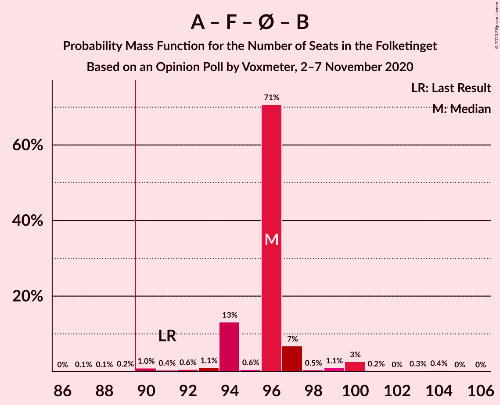
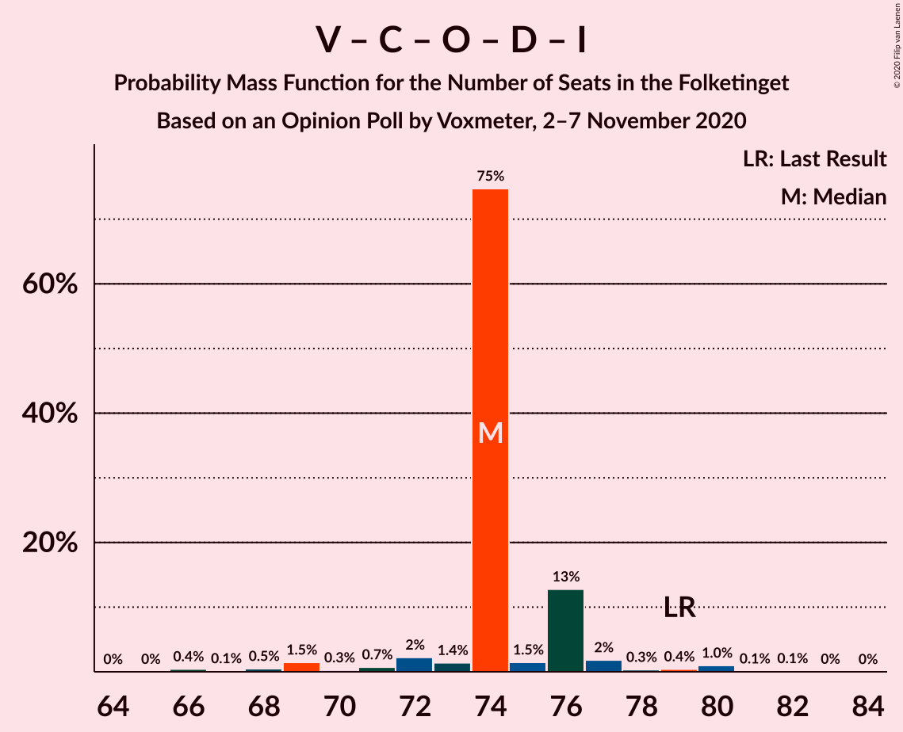

# Opinion Poll by Voxmeter, 2–7 November 2020

<a href="#voting-intentions">Voting Intentions</a> | <a href="#seats">Seats</a> | <a href="#coalitions">Coalitions</a> | <a href="#technical-information">Technical Information</a>

## Voting Intentions

### Confidence Intervals

| Party | Last Result | Poll Result | 80% Confidence Interval | 90% Confidence Interval | 95% Confidence Interval | 99% Confidence Interval |
|:-----:|:-----------:|:-----------:|:-----------------------:|:-----------------------:|:-----------------------:|:-----------------------:|
| Socialdemokraterne | 25.9% | 32.5% | 30.7–34.4% |30.1–34.9% |29.7–35.4% |28.8–36.4% |
| Venstre | 23.4% | 18.5% | 17.0–20.1% |16.6–20.6% |16.2–21.0% |15.5–21.8% |
| Det Konservative Folkeparti | 6.6% | 9.5% | 8.4–10.8% |8.1–11.2% |7.9–11.5% |7.4–12.1% |
| Socialistisk Folkeparti | 7.7% | 8.3% | 7.3–9.5% |7.0–9.8% |6.7–10.1% |6.3–10.7% |
| Enhedslisten–De Rød-Grønne | 6.9% | 7.8% | 6.8–9.0% |6.5–9.3% |6.3–9.6% |5.9–10.2% |
| Dansk Folkeparti | 8.7% | 5.8% | 5.0–6.9% |4.8–7.2% |4.6–7.5% |4.2–8.0% |
| Nye Borgerlige | 2.4% | 5.7% | 4.9–6.8% |4.7–7.1% |4.5–7.3% |4.1–7.9% |
| Radikale Venstre | 8.6% | 4.6% | 3.8–5.5% |3.6–5.8% |3.4–6.0% |3.1–6.5% |
| Kristendemokraterne | 1.7% | 2.8% | 2.3–3.6% |2.1–3.8% |2.0–4.0% |1.7–4.4% |
| Liberal Alliance | 2.3% | 2.2% | 1.7–3.0% |1.6–3.2% |1.5–3.3% |1.3–3.7% |
| Alternativet | 3.0% | 0.8% | 0.5–1.3% |0.4–1.4% |0.4–1.5% |0.3–1.8% |
| Veganerpartiet | 0.0% | 0.6% | 0.4–1.0% |0.3–1.2% |0.3–1.3% |0.2–1.5% |

*Note:* The poll result column reflects the actual value used in the calculations. Published results may vary slightly, and in addition be rounded to fewer digits.

## Seats

### Confidence Intervals

| Party | Last Result | Median | 80% Confidence Interval | 90% Confidence Interval | 95% Confidence Interval | 99% Confidence Interval |
|:-----:|:-----------:|:------:|:-----------------------:|:-----------------------:|:-----------------------:|:-----------------------:|
| <a href="#socialdemokraterne">Socialdemokraterne</a> | 48 | 58 | 58–59 |56–60 |56–62 |52–64 |
| <a href="#venstre">Venstre</a> | 43 | 31 | 31–34 |31–35 |31–35 |29–37 |
| <a href="#det-konservative-folkeparti">Det Konservative Folkeparti</a> | 12 | 17 | 16–17 |15–19 |15–19 |14–20 |
| <a href="#socialistisk-folkeparti">Socialistisk Folkeparti</a> | 14 | 15 | 15–16 |14–17 |13–17 |12–19 |
| <a href="#enhedslisten–de-rød-grønne">Enhedslisten–De Rød-Grønne</a> | 13 | 15 | 12–15 |12–15 |12–16 |11–17 |
| <a href="#dansk-folkeparti">Dansk Folkeparti</a> | 16 | 11 | 9–11 |9–11 |8–12 |8–13 |
| <a href="#nye-borgerlige">Nye Borgerlige</a> | 4 | 10 | 10–11 |9–11 |9–12 |8–13 |
| <a href="#radikale-venstre">Radikale Venstre</a> | 16 | 8 | 8 |8–9 |7–10 |6–11 |
| <a href="#kristendemokraterne">Kristendemokraterne</a> | 0 | 5 | 5 |4–6 |4–6 |0–8 |
| <a href="#liberal-alliance">Liberal Alliance</a> | 4 | 5 | 4–5 |4–5 |0–5 |0–6 |
| <a href="#alternativet">Alternativet</a> | 5 | 0 | 0 |0 |0 |0 |
| <a href="#veganerpartiet">Veganerpartiet</a> | 0 | 0 | 0 |0 |0 |0 |

### Socialdemokraterne

*For a full overview of the results for this party, see the [Socialdemokraterne](party-socialdemokraterne.html) page.*

| Number of Seats | Probability | Accumulated | Special Marks |
|:---------------:|:-----------:|:-----------:|:-------------:|
| 48 | 0% | 100% | Last Result |
| 49 | 0% | 100% |  |
| 50 | 0.1% | 100% |  |
| 51 | 0.1% | 99.9% |  |
| 52 | 0.8% | 99.8% |  |
| 53 | 0.3% | 99.0% |  |
| 54 | 0.3% | 98.8% |  |
| 55 | 0.5% | 98% |  |
| 56 | 6% | 98% |  |
| 57 | 1.2% | 92% |  |
| 58 | 69% | 91% | Median |
| 59 | 16% | 22% |  |
| 60 | 2% | 6% |  |
| 61 | 0.7% | 4% |  |
| 62 | 2% | 3% |  |
| 63 | 0.5% | 1.1% |  |
| 64 | 0.2% | 0.6% |  |
| 65 | 0.4% | 0.4% |  |
| 66 | 0% | 0% |  |

### Venstre

*For a full overview of the results for this party, see the [Venstre](party-venstre.html) page.*

| Number of Seats | Probability | Accumulated | Special Marks |
|:---------------:|:-----------:|:-----------:|:-------------:|
| 27 | 0.1% | 100% |  |
| 28 | 0% | 99.9% |  |
| 29 | 0.4% | 99.8% |  |
| 30 | 2% | 99.4% |  |
| 31 | 69% | 98% | Median |
| 32 | 5% | 28% |  |
| 33 | 2% | 24% |  |
| 34 | 16% | 22% |  |
| 35 | 4% | 6% |  |
| 36 | 1.3% | 2% |  |
| 37 | 0.4% | 0.5% |  |
| 38 | 0% | 0.2% |  |
| 39 | 0.1% | 0.1% |  |
| 40 | 0% | 0.1% |  |
| 41 | 0% | 0% |  |
| 42 | 0% | 0% |  |
| 43 | 0% | 0% | Last Result |

### Det Konservative Folkeparti

*For a full overview of the results for this party, see the [Det Konservative Folkeparti](party-detkonservativefolkeparti.html) page.*

| Number of Seats | Probability | Accumulated | Special Marks |
|:---------------:|:-----------:|:-----------:|:-------------:|
| 12 | 0% | 100% | Last Result |
| 13 | 0.1% | 100% |  |
| 14 | 1.2% | 99.8% |  |
| 15 | 5% | 98.6% |  |
| 16 | 5% | 94% |  |
| 17 | 83% | 90% | Median |
| 18 | 1.0% | 7% |  |
| 19 | 5% | 6% |  |
| 20 | 0.4% | 0.7% |  |
| 21 | 0.2% | 0.3% |  |
| 22 | 0% | 0.1% |  |
| 23 | 0% | 0% |  |

### Socialistisk Folkeparti

*For a full overview of the results for this party, see the [Socialistisk Folkeparti](party-socialistiskfolkeparti.html) page.*

| Number of Seats | Probability | Accumulated | Special Marks |
|:---------------:|:-----------:|:-----------:|:-------------:|
| 11 | 0.1% | 100% |  |
| 12 | 0.4% | 99.9% |  |
| 13 | 4% | 99.4% |  |
| 14 | 2% | 95% | Last Result |
| 15 | 82% | 93% | Median |
| 16 | 4% | 11% |  |
| 17 | 6% | 7% |  |
| 18 | 0.8% | 1.4% |  |
| 19 | 0.5% | 0.6% |  |
| 20 | 0.1% | 0.1% |  |
| 21 | 0% | 0% |  |

### Enhedslisten–De Rød-Grønne

*For a full overview of the results for this party, see the [Enhedslisten–De Rød-Grønne](party-enhedslisten–derød-grønne.html) page.*

| Number of Seats | Probability | Accumulated | Special Marks |
|:---------------:|:-----------:|:-----------:|:-------------:|
| 10 | 0.2% | 100% |  |
| 11 | 0.8% | 99.8% |  |
| 12 | 13% | 99.0% |  |
| 13 | 5% | 86% | Last Result |
| 14 | 4% | 82% |  |
| 15 | 73% | 78% | Median |
| 16 | 3% | 5% |  |
| 17 | 2% | 2% |  |
| 18 | 0.1% | 0.4% |  |
| 19 | 0.3% | 0.4% |  |
| 20 | 0% | 0% |  |

### Dansk Folkeparti

*For a full overview of the results for this party, see the [Dansk Folkeparti](party-danskfolkeparti.html) page.*

| Number of Seats | Probability | Accumulated | Special Marks |
|:---------------:|:-----------:|:-----------:|:-------------:|
| 7 | 0.1% | 100% |  |
| 8 | 3% | 99.9% |  |
| 9 | 14% | 97% |  |
| 10 | 7% | 83% |  |
| 11 | 71% | 76% | Median |
| 12 | 3% | 5% |  |
| 13 | 2% | 2% |  |
| 14 | 0.2% | 0.2% |  |
| 15 | 0% | 0% |  |
| 16 | 0% | 0% | Last Result |

### Nye Borgerlige

*For a full overview of the results for this party, see the [Nye Borgerlige](party-nyeborgerlige.html) page.*

| Number of Seats | Probability | Accumulated | Special Marks |
|:---------------:|:-----------:|:-----------:|:-------------:|
| 4 | 0% | 100% | Last Result |
| 5 | 0% | 100% |  |
| 6 | 0% | 100% |  |
| 7 | 0.2% | 100% |  |
| 8 | 1.2% | 99.8% |  |
| 9 | 6% | 98.6% |  |
| 10 | 76% | 93% | Median |
| 11 | 14% | 17% |  |
| 12 | 1.1% | 3% |  |
| 13 | 2% | 2% |  |
| 14 | 0.2% | 0.3% |  |
| 15 | 0.1% | 0.1% |  |
| 16 | 0% | 0% |  |

### Radikale Venstre

*For a full overview of the results for this party, see the [Radikale Venstre](party-radikalevenstre.html) page.*

| Number of Seats | Probability | Accumulated | Special Marks |
|:---------------:|:-----------:|:-----------:|:-------------:|
| 6 | 1.0% | 100% |  |
| 7 | 2% | 99.0% |  |
| 8 | 87% | 97% | Median |
| 9 | 7% | 10% |  |
| 10 | 3% | 3% |  |
| 11 | 0.2% | 0.5% |  |
| 12 | 0.3% | 0.3% |  |
| 13 | 0% | 0% |  |
| 14 | 0% | 0% |  |
| 15 | 0% | 0% |  |
| 16 | 0% | 0% | Last Result |

### Kristendemokraterne

*For a full overview of the results for this party, see the [Kristendemokraterne](party-kristendemokraterne.html) page.*

| Number of Seats | Probability | Accumulated | Special Marks |
|:---------------:|:-----------:|:-----------:|:-------------:|
| 0 | 2% | 100% | Last Result |
| 1 | 0% | 98% |  |
| 2 | 0% | 98% |  |
| 3 | 0.1% | 98% |  |
| 4 | 6% | 98% |  |
| 5 | 85% | 92% | Median |
| 6 | 5% | 7% |  |
| 7 | 1.0% | 2% |  |
| 8 | 0.5% | 0.5% |  |
| 9 | 0% | 0% |  |

### Liberal Alliance

*For a full overview of the results for this party, see the [Liberal Alliance](party-liberalalliance.html) page.*

| Number of Seats | Probability | Accumulated | Special Marks |
|:---------------:|:-----------:|:-----------:|:-------------:|
| 0 | 5% | 100% |  |
| 1 | 0% | 95% |  |
| 2 | 0% | 95% |  |
| 3 | 0% | 95% |  |
| 4 | 9% | 95% | Last Result |
| 5 | 85% | 86% | Median |
| 6 | 1.2% | 1.3% |  |
| 7 | 0% | 0.1% |  |
| 8 | 0% | 0% |  |

### Alternativet

*For a full overview of the results for this party, see the [Alternativet](party-alternativet.html) page.*

| Number of Seats | Probability | Accumulated | Special Marks |
|:---------------:|:-----------:|:-----------:|:-------------:|
| 0 | 99.9% | 100% | Median |
| 1 | 0% | 0.1% |  |
| 2 | 0% | 0.1% |  |
| 3 | 0% | 0.1% |  |
| 4 | 0.1% | 0.1% |  |
| 5 | 0% | 0% | Last Result |

### Veganerpartiet

*For a full overview of the results for this party, see the [Veganerpartiet](party-veganerpartiet.html) page.*

| Number of Seats | Probability | Accumulated | Special Marks |
|:---------------:|:-----------:|:-----------:|:-------------:|
| 0 | 100% | 100% | Last Result, Median |

## Coalitions

### Confidence Intervals

| Coalition | Last Result | Median | Majority? | 80% Confidence Interval | 90% Confidence Interval | 95% Confidence Interval | 99% Confidence Interval |
|:---------:|:-----------:|:------:|:---------:|:-----------------------:|:-----------------------:|:-----------------------:|:-----------------------:|
| Socialdemokraterne – Socialistisk Folkeparti – Enhedslisten–De Rød-Grønne – Radikale Venstre – Alternativet | 96 | 96 | 99.6% | 94–97 | 94–98 | 93–100 | 90–103 |
| Socialdemokraterne – Socialistisk Folkeparti – Enhedslisten–De Rød-Grønne – Radikale Venstre | 91 | 96 | 99.6% | 94–97 | 94–98 | 93–100 | 90–103 |
| Socialdemokraterne – Socialistisk Folkeparti – Enhedslisten–De Rød-Grønne – Alternativet | 80 | 88 | 6% | 86–88 | 86–90 | 85–91 | 82–94 |
| Socialdemokraterne – Socialistisk Folkeparti – Enhedslisten–De Rød-Grønne | 75 | 88 | 6% | 86–88 | 86–90 | 85–91 | 82–94 |
| Socialdemokraterne – Socialistisk Folkeparti – Radikale Venstre | 78 | 81 | 0.2% | 81–82 | 81–83 | 79–84 | 76–88 |
| Venstre – Det Konservative Folkeparti – Dansk Folkeparti – Nye Borgerlige – Kristendemokraterne – Liberal Alliance | 79 | 79 | 0% | 78–81 | 77–81 | 75–82 | 72–85 |
| Venstre – Det Konservative Folkeparti – Dansk Folkeparti – Nye Borgerlige – Liberal Alliance | 79 | 74 | 0% | 74–76 | 72–76 | 69–77 | 67–80 |
| Venstre – Det Konservative Folkeparti – Dansk Folkeparti – Kristendemokraterne – Liberal Alliance | 75 | 69 | 0% | 69–70 | 67–70 | 65–72 | 62–74 |
| Socialdemokraterne – Radikale Venstre | 64 | 66 | 0% | 66–67 | 65–68 | 64–70 | 60–73 |
| Venstre – Det Konservative Folkeparti – Dansk Folkeparti – Liberal Alliance | 75 | 64 | 0% | 64–65 | 62–65 | 60–67 | 57–69 |
| Venstre – Det Konservative Folkeparti – Liberal Alliance | 59 | 53 | 0% | 53–56 | 51–56 | 50–56 | 47–58 |
| Venstre – Det Konservative Folkeparti | 55 | 48 | 0% | 48–51 | 48–51 | 47–51 | 45–54 |
| Venstre | 43 | 31 | 0% | 31–34 | 31–35 | 31–35 | 29–37 |

### Socialdemokraterne – Socialistisk Folkeparti – Enhedslisten–De Rød-Grønne – Radikale Venstre – Alternativet

| Number of Seats | Probability | Accumulated | Special Marks |
|:---------------:|:-----------:|:-----------:|:-------------:|
| 87 | 0.1% | 100% |  |
| 88 | 0% | 99.9% |  |
| 89 | 0.2% | 99.9% |  |
| 90 | 1.0% | 99.6% | Majority |
| 91 | 0.4% | 98.7% |  |
| 92 | 0.6% | 98% |  |
| 93 | 1.1% | 98% |  |
| 94 | 13% | 96% |  |
| 95 | 0.6% | 83% |  |
| 96 | 71% | 83% | Last Result, Median |
| 97 | 7% | 12% |  |
| 98 | 0.5% | 5% |  |
| 99 | 1.1% | 5% |  |
| 100 | 3% | 4% |  |
| 101 | 0.2% | 0.9% |  |
| 102 | 0% | 0.7% |  |
| 103 | 0.3% | 0.6% |  |
| 104 | 0.4% | 0.4% |  |
| 105 | 0% | 0% |  |

### Socialdemokraterne – Socialistisk Folkeparti – Enhedslisten–De Rød-Grønne – Radikale Venstre

| Number of Seats | Probability | Accumulated | Special Marks |
|:---------------:|:-----------:|:-----------:|:-------------:|
| 87 | 0.1% | 100% |  |
| 88 | 0.1% | 99.9% |  |
| 89 | 0.2% | 99.8% |  |
| 90 | 1.0% | 99.6% | Majority |
| 91 | 0.4% | 98.6% | Last Result |
| 92 | 0.6% | 98% |  |
| 93 | 1.1% | 98% |  |
| 94 | 13% | 96% |  |
| 95 | 0.6% | 83% |  |
| 96 | 71% | 83% | Median |
| 97 | 7% | 12% |  |
| 98 | 0.5% | 5% |  |
| 99 | 1.1% | 5% |  |
| 100 | 3% | 4% |  |
| 101 | 0.2% | 0.9% |  |
| 102 | 0% | 0.7% |  |
| 103 | 0.3% | 0.6% |  |
| 104 | 0.4% | 0.4% |  |
| 105 | 0% | 0% |  |

### Socialdemokraterne – Socialistisk Folkeparti – Enhedslisten–De Rød-Grønne – Alternativet

| Number of Seats | Probability | Accumulated | Special Marks |
|:---------------:|:-----------:|:-----------:|:-------------:|
| 78 | 0% | 100% |  |
| 79 | 0.1% | 99.9% |  |
| 80 | 0.1% | 99.9% | Last Result |
| 81 | 0.1% | 99.8% |  |
| 82 | 1.1% | 99.7% |  |
| 83 | 0.7% | 98.6% |  |
| 84 | 0.3% | 98% |  |
| 85 | 0.6% | 98% |  |
| 86 | 14% | 97% |  |
| 87 | 1.0% | 83% |  |
| 88 | 74% | 82% | Median |
| 89 | 2% | 8% |  |
| 90 | 2% | 6% | Majority |
| 91 | 2% | 3% |  |
| 92 | 0.8% | 1.5% |  |
| 93 | 0.2% | 0.7% |  |
| 94 | 0.4% | 0.5% |  |
| 95 | 0.1% | 0.1% |  |
| 96 | 0% | 0% |  |

### Socialdemokraterne – Socialistisk Folkeparti – Enhedslisten–De Rød-Grønne

| Number of Seats | Probability | Accumulated | Special Marks |
|:---------------:|:-----------:|:-----------:|:-------------:|
| 75 | 0% | 100% | Last Result |
| 76 | 0% | 100% |  |
| 77 | 0% | 100% |  |
| 78 | 0% | 100% |  |
| 79 | 0.1% | 99.9% |  |
| 80 | 0.1% | 99.9% |  |
| 81 | 0.1% | 99.8% |  |
| 82 | 1.1% | 99.7% |  |
| 83 | 0.7% | 98.6% |  |
| 84 | 0.3% | 98% |  |
| 85 | 0.6% | 98% |  |
| 86 | 14% | 97% |  |
| 87 | 1.0% | 83% |  |
| 88 | 74% | 82% | Median |
| 89 | 2% | 8% |  |
| 90 | 2% | 6% | Majority |
| 91 | 2% | 3% |  |
| 92 | 0.8% | 1.5% |  |
| 93 | 0.2% | 0.7% |  |
| 94 | 0.4% | 0.5% |  |
| 95 | 0.1% | 0.1% |  |
| 96 | 0% | 0% |  |

### Socialdemokraterne – Socialistisk Folkeparti – Radikale Venstre

| Number of Seats | Probability | Accumulated | Special Marks |
|:---------------:|:-----------:|:-----------:|:-------------:|
| 72 | 0.1% | 100% |  |
| 73 | 0.1% | 99.9% |  |
| 74 | 0.1% | 99.9% |  |
| 75 | 0.2% | 99.8% |  |
| 76 | 0.9% | 99.6% |  |
| 77 | 0.5% | 98.7% |  |
| 78 | 0.2% | 98% | Last Result |
| 79 | 0.8% | 98% |  |
| 80 | 2% | 97% |  |
| 81 | 70% | 96% | Median |
| 82 | 16% | 26% |  |
| 83 | 5% | 9% |  |
| 84 | 2% | 4% |  |
| 85 | 0.7% | 2% |  |
| 86 | 0.3% | 1.4% |  |
| 87 | 0.3% | 1.1% |  |
| 88 | 0.5% | 0.8% |  |
| 89 | 0.1% | 0.3% |  |
| 90 | 0.2% | 0.2% | Majority |
| 91 | 0% | 0% |  |

### Venstre – Det Konservative Folkeparti – Dansk Folkeparti – Nye Borgerlige – Kristendemokraterne – Liberal Alliance

| Number of Seats | Probability | Accumulated | Special Marks |
|:---------------:|:-----------:|:-----------:|:-------------:|
| 71 | 0.4% | 100% |  |
| 72 | 0.3% | 99.6% |  |
| 73 | 0% | 99.4% |  |
| 74 | 0.3% | 99.3% |  |
| 75 | 3% | 99.1% |  |
| 76 | 1.1% | 96% |  |
| 77 | 0.5% | 95% |  |
| 78 | 7% | 95% |  |
| 79 | 71% | 88% | Last Result, Median |
| 80 | 0.6% | 17% |  |
| 81 | 13% | 17% |  |
| 82 | 1.1% | 3% |  |
| 83 | 0.6% | 2% |  |
| 84 | 0.4% | 2% |  |
| 85 | 1.0% | 1.3% |  |
| 86 | 0.2% | 0.4% |  |
| 87 | 0% | 0.1% |  |
| 88 | 0.1% | 0.1% |  |
| 89 | 0% | 0% |  |

### Venstre – Det Konservative Folkeparti – Dansk Folkeparti – Nye Borgerlige – Liberal Alliance

| Number of Seats | Probability | Accumulated | Special Marks |
|:---------------:|:-----------:|:-----------:|:-------------:|
| 66 | 0.4% | 100% |  |
| 67 | 0.1% | 99.5% |  |
| 68 | 0.5% | 99.4% |  |
| 69 | 1.5% | 98.9% |  |
| 70 | 0.3% | 97% |  |
| 71 | 0.7% | 97% |  |
| 72 | 2% | 96% |  |
| 73 | 1.4% | 94% |  |
| 74 | 75% | 93% | Median |
| 75 | 1.5% | 18% |  |
| 76 | 13% | 17% |  |
| 77 | 2% | 4% |  |
| 78 | 0.3% | 2% |  |
| 79 | 0.4% | 2% | Last Result |
| 80 | 1.0% | 1.3% |  |
| 81 | 0.1% | 0.3% |  |
| 82 | 0.1% | 0.2% |  |
| 83 | 0% | 0.1% |  |
| 84 | 0% | 0% |  |

### Venstre – Det Konservative Folkeparti – Dansk Folkeparti – Kristendemokraterne – Liberal Alliance

| Number of Seats | Probability | Accumulated | Special Marks |
|:---------------:|:-----------:|:-----------:|:-------------:|
| 61 | 0% | 100% |  |
| 62 | 0.5% | 99.9% |  |
| 63 | 0.6% | 99.5% |  |
| 64 | 0.4% | 98.9% |  |
| 65 | 2% | 98% |  |
| 66 | 2% | 97% |  |
| 67 | 1.0% | 95% |  |
| 68 | 3% | 94% |  |
| 69 | 74% | 91% | Median |
| 70 | 12% | 17% |  |
| 71 | 2% | 4% |  |
| 72 | 2% | 3% |  |
| 73 | 0.2% | 1.3% |  |
| 74 | 0.6% | 1.0% |  |
| 75 | 0.3% | 0.4% | Last Result |
| 76 | 0.1% | 0.2% |  |
| 77 | 0% | 0.1% |  |
| 78 | 0% | 0.1% |  |
| 79 | 0% | 0% |  |

### Socialdemokraterne – Radikale Venstre

| Number of Seats | Probability | Accumulated | Special Marks |
|:---------------:|:-----------:|:-----------:|:-------------:|
| 59 | 0.1% | 100% |  |
| 60 | 0.7% | 99.9% |  |
| 61 | 0.3% | 99.1% |  |
| 62 | 0.4% | 98.9% |  |
| 63 | 0.6% | 98% |  |
| 64 | 1.3% | 98% | Last Result |
| 65 | 5% | 97% |  |
| 66 | 69% | 91% | Median |
| 67 | 17% | 23% |  |
| 68 | 1.0% | 6% |  |
| 69 | 0.6% | 5% |  |
| 70 | 3% | 4% |  |
| 71 | 0.2% | 1.4% |  |
| 72 | 0.4% | 1.2% |  |
| 73 | 0.4% | 0.8% |  |
| 74 | 0% | 0.4% |  |
| 75 | 0.4% | 0.4% |  |
| 76 | 0% | 0% |  |

### Venstre – Det Konservative Folkeparti – Dansk Folkeparti – Liberal Alliance

| Number of Seats | Probability | Accumulated | Special Marks |
|:---------------:|:-----------:|:-----------:|:-------------:|
| 56 | 0% | 100% |  |
| 57 | 0.5% | 99.9% |  |
| 58 | 0.9% | 99.4% |  |
| 59 | 0.6% | 98.6% |  |
| 60 | 0.6% | 98% |  |
| 61 | 2% | 97% |  |
| 62 | 2% | 96% |  |
| 63 | 2% | 94% |  |
| 64 | 71% | 92% | Median |
| 65 | 17% | 22% |  |
| 66 | 0.8% | 4% |  |
| 67 | 2% | 3% |  |
| 68 | 0.7% | 1.4% |  |
| 69 | 0.2% | 0.7% |  |
| 70 | 0.3% | 0.5% |  |
| 71 | 0.1% | 0.2% |  |
| 72 | 0% | 0.1% |  |
| 73 | 0.1% | 0.1% |  |
| 74 | 0% | 0% |  |
| 75 | 0% | 0% | Last Result |

### Venstre – Det Konservative Folkeparti – Liberal Alliance

| Number of Seats | Probability | Accumulated | Special Marks |
|:---------------:|:-----------:|:-----------:|:-------------:|
| 45 | 0.2% | 100% |  |
| 46 | 0.1% | 99.7% |  |
| 47 | 0.4% | 99.7% |  |
| 48 | 0.3% | 99.3% |  |
| 49 | 0.6% | 99.0% |  |
| 50 | 1.3% | 98% |  |
| 51 | 2% | 97% |  |
| 52 | 1.0% | 95% |  |
| 53 | 69% | 94% | Median |
| 54 | 3% | 24% |  |
| 55 | 8% | 21% |  |
| 56 | 12% | 13% |  |
| 57 | 0.6% | 1.2% |  |
| 58 | 0.2% | 0.6% |  |
| 59 | 0.1% | 0.4% | Last Result |
| 60 | 0.2% | 0.3% |  |
| 61 | 0.1% | 0.1% |  |
| 62 | 0% | 0.1% |  |
| 63 | 0% | 0% |  |

### Venstre – Det Konservative Folkeparti

| Number of Seats | Probability | Accumulated | Special Marks |
|:---------------:|:-----------:|:-----------:|:-------------:|
| 43 | 0.1% | 100% |  |
| 44 | 0.1% | 99.9% |  |
| 45 | 1.0% | 99.9% |  |
| 46 | 0.1% | 98.9% |  |
| 47 | 2% | 98.7% |  |
| 48 | 69% | 97% | Median |
| 49 | 3% | 28% |  |
| 50 | 3% | 26% |  |
| 51 | 20% | 22% |  |
| 52 | 0.8% | 2% |  |
| 53 | 0.5% | 1.1% |  |
| 54 | 0.2% | 0.7% |  |
| 55 | 0.1% | 0.5% | Last Result |
| 56 | 0.2% | 0.4% |  |
| 57 | 0.1% | 0.2% |  |
| 58 | 0% | 0.1% |  |
| 59 | 0% | 0% |  |

### Venstre

| Number of Seats | Probability | Accumulated | Special Marks |
|:---------------:|:-----------:|:-----------:|:-------------:|
| 27 | 0.1% | 100% |  |
| 28 | 0% | 99.9% |  |
| 29 | 0.4% | 99.8% |  |
| 30 | 2% | 99.4% |  |
| 31 | 69% | 98% | Median |
| 32 | 5% | 28% |  |
| 33 | 2% | 24% |  |
| 34 | 16% | 22% |  |
| 35 | 4% | 6% |  |
| 36 | 1.3% | 2% |  |
| 37 | 0.4% | 0.5% |  |
| 38 | 0% | 0.2% |  |
| 39 | 0.1% | 0.1% |  |
| 40 | 0% | 0.1% |  |
| 41 | 0% | 0% |  |
| 42 | 0% | 0% |  |
| 43 | 0% | 0% | Last Result |

## Technical Information

### Opinion Poll

+ **Polling firm:** Voxmeter
+ **Commissioner(s):** —
+ **Fieldwork period:** 2–7 November 2020

### Calculations

+ **Sample size:** 1028
+ **Simulations done:** 1,048,576
+ **Error estimate:** 1.91%

